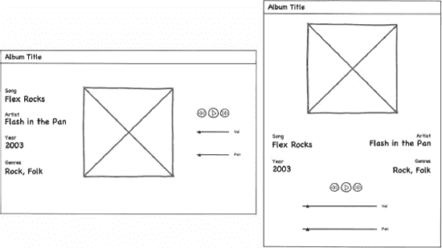

# 十一、超越手机：平板电脑和电视

谷歌和 Adobe 正在努力分别扩展 Android 平台和 AIR 运行时的覆盖范围。Android 已经扩展到摩托罗拉 XOOM 和三星 Galaxy Tab 等平板电脑上，甚至通过谷歌电视进入你的客厅。这为您的 for Android 应用打开了更多潜在的平台！此外，以黑莓手机闻名的 Research In Motion 也发布了自己的平板电脑 PlayBook。该行动手册完全兼容 Flash，因此为您的 Flex 和 Flash 应用赢得新受众提供了又一个机会。

本章将探讨将移动应用转移到平板电脑和电视的大屏幕上时需要考虑的一些特殊因素。

### 缩放屏幕

屏幕越大，界面设计就越自由。更多的自由带来更多的责任。平板电脑用户希望你的应用能充分利用大屏幕提供的额外空间。图 11–1 显示了来自第八章的 MusicPlayer 应用在一台 10.1 英寸屏幕的摩托罗拉 XOOM 上运行。虽然该应用是可用的，但低像素密度和大屏幕的结合导致了小而长的控件和大量浪费的空间。我们能够并且将会做得更好。

这样做的动机来自这样一个事实，即自 Android 3.0 推出以来，Android 平板电脑领域正在爆炸式增长，Android 3.0 是专为平板电脑和电视的大屏幕而设计的 Android 版本。除了现有的 Android 2.2 平板电脑——戴尔 Streak 和三星 Galaxy Tab——现在还有摩托罗拉 XOOM 和三星 Galaxy Tab 10.1，它们都运行最新版本的 Honeycomb(Android 3 . x 的代号)。此外，东芝、索尼、华硕和亚马逊都有望在 2011 年发布蜂巢平板电脑。

显然，这是一个任何应用开发人员都想认真对待的细分市场。专门为支持这些更大的平板电脑屏幕而修改的应用将比那些不支持的应用有相当大的优势。

**图 11–1。** *运行在摩托罗拉 XOOM 平板电脑上的音乐播放器应用*

第一步是让你熟悉硬件。大多数平板电脑拥有比普通智能手机更强大的处理器和更大的内存。Table 11–1 显示了目前市场上流行的 Android 平板电脑的显示屏对比。该表显示，大多数平板电脑的分辨率在 160 dpi 左右，屏幕更大、分辨率更高。随着更强大的处理器和大屏幕的结合，您可能会认为您的应用会比在手机上运行得更快。这不是一个好的假设，尤其是如果你的应用是图形受限的而不是 CPU 受限的。除非他们利用硬件加速，否则图形密集型应用在平板电脑上的运行速度通常会更慢，因为更大的屏幕必须进行大量的像素计算。像往常一样，运行性能测试并根据需要进行优化。

每当您考虑将您的应用迁移到一个新的平台时，您都应该花时间研究现有的应用，以确定正在使用的设计模式和约定。图 11–2 显示了一些现有的 Android 平板电脑应用。从左上方按顺时针方向，我们看到:Locomo Labs 的 Flixster、Newsr 和 TweetComb、??、?? 和谷歌的电影工作室。你看到了哪些常见的模式和惯例？

请注意，尤其是在横向模式下(如图所示)，应用都利用额外的屏幕空间来显示多个视图。与类似的手机应用不同，Flixster 和 Newsr 在一个屏幕上同时显示主视图和详细视图，而不必转换到单独的详细视图。TweetComb 利用额外的空间来显示多列推文，而 Movie Studio 为您提供了更大、更易于使用的控件。还要注意标题栏中包含了更多的动作(Flex 应用中的`ActionBar`)。我们可以对我们的 MusicPlayer 应用进行类似的修改，从而将其转换为一个成熟的平板电脑界面，类似于图 11–2 中的图片。

当考虑对音乐播放器的平板版本进行修改时，立即想到的一件事是使用歌曲视图中的额外空间来显示额外的元数据，这在应用的手机版本中根本没有空间。这种简单的修改是第一种技术的理想选择，我们将研究如何将应用扩展到新的屏幕:基于状态的定制。

__________

从技术上来说，HTC Flyer 运行的是 Android 2.3(代号 Gingerbread)而不是 Android 3.x，但你的 AIR for Android 程序也将运行在 Gingerbread 上。

2http://locomolabs.com/[2](http://locomolabs.com/)

**图 11–2。** *运行在安卓平板电脑上的热门应用*

### 基于状态的定制

我们已经展示了如何使用`landscape`和`portraitView`状态定制应用的 UI 布局。这种技术采用了这种思想并加以扩展。不仅仅是`portrait`和`landscape`，你需要定义四种状态组合来支持手机和平板电脑的每个方向。因此，您假设的 MXML 代码看起来类似于清单 11–1。

**清单 11–1。** *首次尝试为手机和平板电脑添加独立状态*

`<s:states>
  <s:State name="portraitPhone"/>
  <s:State name="landscapePhone"/>
  <s:State name="portraitTablet"/>
  <s:State name="landscapeTablet"/>
</s:states>

<s:Group width="100%" height="100%">
  <s:layout.landscapePhone>
    <s:HorizontalLayout verticalAlign="middle" paddingLeft="10"/>
  </s:layout.landscapePhone>

  <s:layout.landscapeTablet>
    <s:HorizontalLayout verticalAlign="middle" paddingLeft="10"/>
  </s:layout.landscapeTablet>

  <s:layout.portraitPhone>` `    <s:VerticalLayout horizontalAlign="center" paddingTop="10"/>
  </s:layout.portraitPhone>

<s:layout.portraitTablet>
  <s:VerticalLayout horizontalAlign="center" paddingTop="10"/>
</s:layout.portraitTablet>

<s:Group width.portraitPhone="{height*0.4}" height.portraitPhone="{height*0.4}"
               width.landscapePhone="{width*0.4}"
               height.landscapePhone="{width*0.4}"
               width.portraitTablet="{height*0.3}"
               height.portraitTablet="{height*0.3}"
               width.landscapeTablet="{width*0.3}"
               height.landscapeTablet="{width*0.3}">
  <!-- And so on… -->
</s:Group>`

我们的`View`中现在有四种状态:手机和平板电脑的横向和纵向版本。这些都在`<s:states>`部分使用`<s:State>`元素进行了枚举。一旦定义了状态，就可以使用 Flex 的特定于状态的属性声明，比如`width.portraitPhone`，来定制布局、间距，甚至是`View`用户界面中任何组件的可见性。作为一个例子，在我们假设的代码清单中定义的`Group`包括一个为我们每个可能的状态定制的`width`和`height`。

如您所见，这种技术的主要缺点是特定于状态的属性声明激增。你现在什么都需要四个！幸运的是，有一种方法可以缓解这个问题。

#### 使用状态组

状态组是一种将多个状态(一组状态)分配给一个状态声明的方法。以下面的州声明为例:

`<s:State name="portraitPhone" stateGroups="portrait,phone"/>`

这意味着当我们将`View`的`currentState`设置为`portraitPhone`时，我们将激活任何被`portraitPhone`、`portrait`或`phone`状态修改的属性声明。这允许我们使用这些状态的组合来定义 MXML 属性:

*   `attributeName.portraitPhone`:这只适用于纵向手机。
*   这将适用于纵向的手机或平板电脑。
*   这将适用于横向或纵向手机。

这使您在声明属性时更加灵活，并消除了大量代码重复。既然我们不再定义标准的横向和纵向状态，Flex 将不再自动设置我们的`View`状态。这是我们将手动处理的事情，通过覆盖`getCurrentViewState`方法来返回一个基于屏幕大小和当前方向的新状态，如清单 11–2 所示。

**清单 11–2。** *返回定制`View`状态*

`override public function getCurrentViewState():String {
  var isPortrait:Boolean = height > width;
  var isTablet:Boolean = … // A calculation based on screen size or resolution.

  var newState:String = (isPortrait ? "portrait" : "landscape") +
            (isTablet ? "Tablet" : "Phone");

  return hasState(newState) ? newState : currentState;
}`

新状态由两个布尔变量决定。通过比较`View`的宽度和高度，很容易确定`isPortrait`变量。`isTablet`这个变量稍微复杂一点。您可以通过测试来使用屏幕的分辨率，看看 x 或 y 维度是否大于 960，这是目前手机上使用的最大分辨率。更可靠的方法是使用屏幕分辨率和像素密度来确定屏幕的物理尺寸。那么你可以假设任何超过 5.5 英寸的都是平板设备。这种计算的一个例子显示在清单 11–4 中的`onViewActivate`函数中。

现在我们可以回到从歌曲的元数据向 UI 添加更多信息的想法。有四样东西可以添加到平板电脑界面上:专辑名称、艺术家姓名、专辑出版年份以及专辑所属的流派。我们已经将`albumTitle`和`artistName`定义为`SongViewModel`类中的属性。这意味着我们只需要添加`year`和`genres`属性。清单 11–3 展示了实现这一点的代码。

**清单 11–3。**?? 向`SongViewModel`?? 添加`year`和`genre`属性

`package viewmodels
{
  [Bindable]
  public class SongViewModel extends EventDispatcher {
    public var albumCover:BitmapData;
    public var albumTitle:String = "";
    public var songTitle:String = "";
    public var artistName:String = "";    
    **public var year:String = "";**
    **public var genres:String = "";**

    // …

    /**
     * Called when the song's metadata has been loaded by the Metaphile
     * library.
     */
    privatefunction onMetaData(metaData:IMetaData):void {
      var songFile:MusicEntry = songList[currentIndex];
      var id3:ID3Data = ID3Data(metaData);` `      artistName = id3.performer ? id3.performer.text : "Unknown";
      albumTitle = id3.albumTitle ? id3.albumTitle.text : "Album by " +
          artistName;
      songTitle = id3.songTitle ? id3.songTitle.text : songFile.name;
      **year = id3.year ? id3.year.text : "Unknown";**
      **genres = id3.genres ? id3.genres.text : "Unknown";**

      if (id3.image) {
        var loader:Loader = new Loader();
        loader.contentLoaderInfo.addEventListener(Event.COMPLETE,
                                                  onLoadComplete)
        loader.loadBytes(id3.image);
      } else {
        albumCover = null;
      }
    }

    // …
  }
}`

粗体突出显示的代码显示了需要进行的更改:声明新的可绑定变量来保存`year`和`genres`字符串，然后从 Metaphile 库返回的`ID3Data`中加载它们。

我们的注意力现在转向如何将这些信息添加到我们的界面上。图 11–3 显示了新界面的两个模型，一个横向，一个纵向。手机界面将保持不变，但当我们检测到我们正在平板电脑上运行时，我们将进行以下更改:

*   `ActionBar`中的歌曲名称将被替换为专辑名称。
*   在纵向模式下，四个新的元数据将被放置在专辑封面和播放控件之间。
*   在横向模式下，新的元数据将放在屏幕的左侧，专辑封面在中间，播放控制在右侧。

根据设备的方向，新歌曲信息会出现在不同的位置，但这可以使用我们的自定义状态名称和组件的`includeIn`属性轻松实现。

**图 11–3。** *显示附加信息的设计模型，显示在平板电脑界面上*

清单 11–4 中的代码显示了需要对原始`View`代码进行的第一次修改，以实现如图图 11–3 所示的新设计。

**清单 11–4。**修改后的*开始`SongView` MXML*

`<?xml version="1.0" encoding="utf-8"?>
<s:View xmlns:fx="http://ns.adobe.com/mxml/2009"
        xmlns:s="library://ns.adobe.com/flex/spark"
        xmlns:assets="assets.*"
        xmlns:views="views.*"
        initialize="onInitialize()"
        viewActivate="onViewActivate()"
        viewDeactivate="onViewDeactivate()"
        resize="onResize()"
        title="{isTablet ? model.albumTitle : model.songTitle}">

  <s:states>
    <s:State name="portraitPhone" stateGroups="portrait,phone"/>
    <s:State name="landscapePhone" stateGroups="landscape,phone"/>
    <s:State name="portraitTablet" stateGroups="portrait,tablet"/>
    <s:State name="landscapeTablet" stateGroups="landscape,tablet"/>
  </s:states>

  <fx:Script>
    <![CDATA[
      import viewmodels.SongViewModel;

      [Bindable]
      private var isTablet:Boolean;

      [Bindable]
      private var model:SongViewModel;

      override public function getCurrentViewState():String {` `        var isPortrait:Boolean = height > width;
        var newState:String = (isPortrait ? "portrait" : "landscape") +
            (isTablet ? "Tablet" : "Phone");

        return hasState(newState) ? newState : currentState;
      }

      private function onViewActivate():void {
        var w:Number = Capabilities.screenResolutionX/Capabilities.screenDPI;
        var h:Number = Capabilities.screenResolutionY/Capabilities.screenDPI;
        isTablet = Math.max(w, h) > 5.5;

        setCurrentState(getCurrentViewState());
      }

      privatefunction onResize():void {
        setCurrentState(getCurrentViewState());
      }

      private function onInitialize():void { /* same as before */ }
      private function onViewDeactivate():void { /* same as before */ }
      private function onSongEnded(event:Event):void { /* same as before */ }
    ]]>
  </fx:Script>`

`View`的 title 属性使用一个到`isTablet`变量的绑定来决定是在`ActionBar`中显示歌曲标题还是专辑标题。记住，在较小的手机屏幕上，我们在`ActionBar`的标题区域显示歌曲标题，以避免`SongView`界面过度拥挤。如果使用更大的平板电脑屏幕，将专辑名称放在`ActionBar`中更有意义，并且在从一首歌曲转到下一首歌曲时更改歌曲信息。

如本节前面所述，我们的每个状态都定义了相关的状态组。出现在`<fx:Script>`部分顶部的被覆盖的`getCurrentViewState`函数负责根据屏幕大小和方向确定`View`应该处于哪个状态。如果`View`的`height`大于其`width`，则设备被标记为纵向。否则我们知道我们处于风景模式。使用这些信息和`isTablet`标志，该函数构建并返回一个描述`View`当前状态的字符串。

在`View`的`viewActivate`事件的处理程序中设置了`isTablet`标志。当`View`激活时，`onViewActivate`处理器以英寸为单位计算设备屏幕的宽度和高度。如果其中任何一个尺寸超过 5.5 英寸，那么我们可以假设该应用正在平板设备上运行。然后，该函数调用我们被覆盖的`getCurrentViewState`方法来获取`View`的初始状态，并将结果传递给`setCurrentState`函数。

我们还为`View`的`resize`事件附加了一个处理程序来检测方向变化。`onResize`处理器将通过调用我们的`getCurrentViewState`函数来设置`View`的当前状态，并使用返回值来设置当前的`View`状态。

**注意:**覆盖`getCurrentViewState`函数来提供自定义状态确实有一个缺点，那就是它使得 Flash Builder 的设计视图实际上毫无用处。

是时候将这种状态管理代码用于我们的 MXML 宣言了。清单 11–5 显示了根`Group`容器以及一组标签，它们组成了横向方向的歌曲信息部分。

**清单 11–5。***`View`的根容器`Group`和景观元数据显示*

`<s:Group width="100%" height="100%">
  <s:layout.portrait>
    <s:VerticalLayout paddingTop="10" horizontalAlign="center"/>
  </s:layout.portrait>

  <s:layout.landscape>
    <s:HorizontalLayout verticalAlign="middle" paddingLeft="10"/>
  </s:layout.landscape>

  <s:VGroup width="30%" horizontalCenter="0" gap="20" paddingTop="40"
            paddingBottom="40" includeIn="landscapeTablet">
    <s:VGroup width="100%">
      <s:Label styleName="albumInfoLabel" text="Song"/>
      <s:Label styleName="albumInfo" text="{model.songTitle}"
               maxWidth="{width*.3}" maxDisplayedLines="1"/>
    </s:VGroup>
    <!-- repeated for artist, year, and genres -->
  </s:VGroup>

  <s:Group width.portrait="{height*0.4}" height.portrait="{height*0.4}"
           width.landscape="{width*0.4}" height.landscape="{width*0.4}">
    <s:BitmapImage width="100%" height="100%" source="{model.albumCover}"
                   visible="{model.albumCover != null}"/>
    <assets:DefaultAlbum id="placeHolder" width="100%" height="100%"                          visible="{!model.albumCover}" />
  </s:Group>`

如同第八章中的一样，我们在纵向模式下使用`VerticalLayout`作为根`Group`，在横向模式下使用`HorizontalLayout`。由于之前声明的状态组，这些布局将用于手机和平板电脑版本的界面。根`Group`容器的第一个子容器是`VGroup`，它包含界面风景版本的歌曲信息——回想一下，它在屏幕的最左边。此外，该组应仅出现在平板电脑显示屏上。这就是在其`includeIn`属性中使用完全指定的`landscapeTablet`状态的原因。下一个`Group`是相册封面图片的容器。由于先前的`VGroup`仅包含在`landscapeTablet`状态中，相册封面`Group`将首先出现在任何方向的手机和纵向模式的平板电脑的布局中。

清单 11–6 显示了歌曲信息显示的肖像模式版本以及其余的控件。

**清单 11–6。** *肖像歌曲信息组和回放控件*

`<s:VGroup width="80%" horizontalCenter="0" gap="40" paddingTop="40"
              paddingBottom="40" includeIn="portraitTablet">
      <s:HGroup width="100%">
        <s:VGroup width="50%">
          <s:Label styleName="albumInfoLabel" text="Song"/>
          <s:Label styleName="albumInfo" text="{model.songTitle}"
                   maxWidth="{width*.4}" maxDisplayedLines="1"/>
        </s:VGroup>
        <s:VGroup horizontalAlign="right" width="50%">
          <s:Label styleName="albumInfoLabel" text="Artist"/>
          <s:Label styleName="albumInfo" text="{model.artistName}"                    maxWidth="{width*.4}" maxDisplayedLines="1"/>
        </s:VGroup>
      </s:HGroup>
      <!-- repeated for year and genres -->
    </s:VGroup>

    <s:VGroup horizontalAlign="center" paddingTop="20" gap="40"
              width.portrait="100%" width.landscape="50%">
      <s:HGroup width="90%">
        <s:Button label="&lt;&lt;" height="40" click="model.previousSong()"/>
        <views:ProgressButton id="progressButton" width="100%" height="40"
                              click="model.onPlayPause()"
                              percentComplete="@{model.percentComplete}"                               skinClass="views.ProgressButtonSkin"/>
        <s:Button label="&gt;&gt;" height="40" click="model.nextSong()"/>
      </s:HGroup>

      <s:HGroup verticalAlign="middle" width="90%">
        <assets:VolLow id="volLow" width="32" height="32"/>
        <s:HSlider width="100%" maximum="1.0" minimum="0.0" stepSize="0.01"
                 snapInterval="0.01" value="@{model.volume}" showDataTip="false"/>
        <assets:VolHigh id="volHigh" width="32" height="32"/>
      </s:HGroup>

      <s:HGroup verticalAlign="middle" width="90%" >
        <s:Label text="L" width="32" height="32" verticalAlign="middle"
                 textAlign="center"/>
        <s:HSlider width="100%" maximum="1.0" minimum="-1.0" stepSize="0.01"
                 snapInterval="0.01" value="@{model.pan}" showDataTip="false"/>
        <s:Label text="R" width="32" height="32" verticalAlign="middle"
                 textAlign="center"/>
      </s:HGroup>
    </s:VGroup>
  </s:Group>
</s:View>`

在纵向模式下，歌曲信息`VGroup`显示在专辑封面和播放控件之间——因此它在 MXML 文件中的位置是这样的，其`includeIn`属性指定了`portraitTablet`州。

作为点睛之笔，我们在歌曲信息组件的`ViewNavigatorApplication` MXML 文件中添加了一点 CSS 样式。我们现在来看看图 11–4 中的应用。我们的应用现在能够适应运行在最小和最大的移动设备上。这是定制的一个简单例子，通过明智地使用状态可以实现这一点。该应用的代码可以在 MusicPlayerWithStates 项目中找到，该项目位于本书示例代码的`examples/chapter-11`目录中。

**图 11–4。** *音乐播放器支持在小屏幕和大屏幕上运行的应用*

这种基于状态的定制技术的主要优点是，它允许您将所有应用代码保存在一个项目中。这使得维护代码更容易，并简化了构建过程。然而，当您考虑当您想要开始支持其他平台时需要做什么时，缺点就变得很明显了。如果你想把你的市场扩大到包括 iPhone、iPad 和 PlayBook，那么你需要开始调整用户界面，以适应这些平台上使用的所有不同的惯例。你将突然面临状态的组合爆炸。如果不同设备类别或平台的接口彼此差异太大，您也会遇到问题。在你拥有一份冗长、难读、难维护的 MXML 档案之前，各州只能带你走这么远。

如果你发现自己处于这个位置，你可以转向界面定制的第二个选择:基于项目的定制。

#### 基于项目的定制

基于项目的定制背后的想法是将应用的所有共享代码放入一个库项目，然后创建单独的项目来实现每个不同平台或设备类别的定制用户界面(例如，手机与平板电脑)。为不同类别的设备或不同平台的应用的每个版本创建单独的项目，可以为您提供配置界面的最大灵活性。这种设置对于跨越两个或多个 web、桌面、电话、平板电脑和电视的项目来说非常常见。为了避免不必要的代码重复，创建了一个库项目来包含所有共享的源文件和图形资源。

让我们假设我们的设计师已经看过了图 11–2 中显示的一些应用，并决定为我们的音乐播放器尝试一种新的外观。他们想出了一种新的横向模式下的平板电脑界面，看起来有点像图 11–5。他们希望将歌曲信息移到屏幕的右侧，将播放控件放在专辑封面下，并将歌曲列表添加到屏幕的左侧。从列表中选择一首歌应该跳到那首歌。列表的选择高亮应该总是反映当前正在播放的歌曲。我们还将假装我们已经开始听到营销部门关于扩展以支持其他移动平台的传言。将所有这些放在一起，我们将决定是时候选择完全定制的能力了，通过将我们的代码库分割成单独的项目，其中一个公共库项目将被其余的共享。

**图 11–5。** *在平板电脑上以风景模式运行的音乐播放器的新界面原型*

##### 创建库项目

首先要做的是创建共享库项目。在 Flash Builder 4.5(或更高版本)中，使用应用菜单，点击**文件新建 Flex 库项目**。Flash Builder 将显示如图图 11–6 所示的对话框。

**图 11–6。** *在 Flash Builder 4.5 中创建新库项目*

您必须为库项目指定一个名称(如 MusicPlayerLib ),正如我们在 Figure 11–6 中所做的那样。因为我们并不关心在这个项目中支持 web 和桌面(还没有！)，我们还在配置部分选择了“移动库”选项。

我们知道我们的展示模型将被放入这个项目。我们也知道其中一个依赖于中期库。因此，我们必须将`Metaphile.swc`文件添加到这个项目中，以便对其进行编译。我们创建了一个`libs`目录并将`Metaphile.swc`放在里面。然后，我们通过右键单击项目并选择 Properties，将`libs`目录添加到构建路径中。将显示项目的属性对话框，它看起来类似于图 11–7 中所示。点按“Flex 库构建路径”，然后点按“添加 SWC 文件夹…”按钮。在出现的对话框的文本字段中键入目录名“libs ”,然后单击 OK。你的对话框现在应该看起来像图 11–7 中的那样，这表明`Metaphile.swc`文件已经被添加到你的构建路径中。

**图 11–7。** *将`Metaphile.swc`文件添加到我们的库项目*

创建我们的库项目的最后一步是从原始的 MusicPlayer 应用中复制必要的包结构，并将源代码和图形素材复制到正确的位置。Table 11–2 显示了已经添加的包以及每个包中的文件。

请注意，我们已经从原来的 MusicPlayer 项目的`views`包中取出了自定义的`ProgressButton`控件，并把它放到了共享库项目的一个新的`components`包中。库项目现在应该可以编译了，我们已经准备好创建新的项目，我们将使用这些项目来构建将在手机和平板电脑上运行的应用版本。

##### 创建手机和平板电脑项目

我们将通过使用应用菜单并点击文件 **新建**  ** Flex 移动项目来创建一个新的 Flex 移动项目。**当“新建 Flex Mobile 项目”对话框出现时，将项目命名为 MusicPlayerPhone，单击“下一步”按钮，选择一个基于视图的应用，然后单击“完成”。必须执行以下步骤来填充新项目:

1.  将原始 MusicPlayer 项目的`assets`包中的图形资源复制到新项目的`assets`包中。这包括闪屏、音量图标和默认专辑封面。
2.  从原 MusicPlayer 项目的`views`包中复制源代码，并将它们放入新项目的`views`包中。这将包括`SongListView.mxml`和`SongView.mxml`文件。
3.  修改`SongView.mxml`中的代码，以考虑到`ProgressButton`控件的新包。
4.  将代码从原始项目的默认包中的主`ViewNavigatorApplication` MXML 文件复制到新项目的主 MXML 文件中。
5.  通过右键单击项目并选择“属性”，单击“Flex 构建路径”，单击“添加项目...”按钮，然后选择 MusicPlayerLib 项目，将 MusicPlayerLib 项目添加到该项目的构建路径中。

新项目现在应该可以编译和运行了，结果看起来和第八章中的原始音乐播放器一模一样。如果您有任何问题，可以查看本书示例代码的`examples/chapter-11`目录中的 MusicPlayerPhone 项目中的源代码。通过重复这些步骤来创建一个 MusicPlayerTablet 项目，您就可以开始使用 MusicPlayer 应用的新的自定义平板电脑界面了。

但是在我们开始之前，这是向您介绍 Eclipse 的工作集特性的好时机，如果您还不知道的话。定义一个工作集将允许您将包资源管理器中列出的项目数量限制为您在任何给定时间正在处理的项目。一旦定义了工作集，就可以轻松地在它们之间切换。您可以使用 Package Explorer 选项卡右侧的 View 菜单来访问 Working Sets 特性。视图菜单的图标是倒置的三角形。图 11–8 显示了它的位置。

**图 11–8。**??【包浏览器】的查看菜单图标

通过单击查看菜单图标并选择“选择工作集…”选项，可以定义新的工作集。将显示“选择工作集”对话框。单击“新建”按钮将显示“新建工作集”对话框。选择“资源”作为工作集类型，然后单击“下一步”。在最后一个对话框中，键入工作集的名称，并选择希望成为工作集一部分的项目。然后单击完成。图 11–9 显示了对话框的顺序。

**图 11–9。** *创建新的工作集*

要选择一个工作集，点击查看菜单并再次选择工作集。您定义的工作集将出现在列表中。选中要激活的工作集旁边的复选框，然后单击“确定”。一旦您选择了一个工作集，它的名称将直接出现在视图菜单上，使您只需点击两次就可以在工作集之间切换。当您的 Package Explorer 视图开始被您正在处理的所有不同项目塞满时，能够快速定义工作集并在它们之间切换是一个巨大的好处。

#### 实现自定义平板电脑界面

在新的`SongView`界面中，歌曲列表会出现在屏幕的左侧。列表中的当前选择应该反映当前正在播放的歌曲。点击列表中的新条目应该会切换到该歌曲。我们在这里描述的是两个绑定:一个在模型中的歌曲列表和列表中的项目之间，另一个在列表的当前选择和模型中的当前歌曲索引之间。

我们将从需要对模型进行的修改开始。将创建一个新的`songListArrayCollection`作为 UI 中`List`的绑定源。我们还需要使模型的`currentIndex`变量可绑定，以作为`List`的`selectedIndex`属性的来源，以及可设置的，以便新的列表选择将导致模型采取行动播放一首新歌。清单 11–7 展示了模型的第一个变化。

**清单 11–7。** *改为`SongViewModel`是因为没有代码的六页实在是太长了！*

`[Bindable]
public class SongViewModel extends EventDispatcher {
    // Some variables removed for brevity…

    public var year:String = "";
    public var genres:String = "";
    **public var songList:ArrayCollection;**

    **private var _currentIndex:Number = 0;**

    /** A collection of MusicEntry objects. */
    private var musicEntries:ArrayCollection;

    public function SongViewModel(entries:ArrayCollection, index:Number) {
      this.musicEntries = entries;
      this.currentIndex = index;

      timer = new Timer(500, 0);
      timer.addEventListener(TimerEvent.TIMER, onTimer);

      loadCurrentSong();
      **filterEntriesBySongs();**
    }

    **/****
     *** Takes all songs in musicEntries and puts them in songList.**
     ***/**` `    **private function filterEntriesBySongs():void {**
      **songList = new ArrayCollection();**

      **for (var i:int = 0; i<musicEntries.length; ++i) {**
        **var entry:MusicEntry = MusicEntry(musicEntries.getItemAt(i));**
        **if (entry.isSong)**
          **songList.addItem(entry);**
      **}**
    **}**`

在清单 11–7 中，我们添加了名为`songList`的新`ArrayCollection`，并将`currentIndex`变量重命名为`_currentIndex`，以表明它现在将具有与其相关联的`publicget`和`set`函数。`songList`集合在`filterEntriesBySong`函数中初始化，该函数在类的构造函数的末尾被调用。该函数循环遍历`musicEntries`集合，并将每首歌曲条目复制到`songList`集合。

清单 11–8 显示了 model 类中的代码，该类提供对`currentIndex`属性的访问，并处理对应于`currentIndex`的歌曲的播放。`currentIndex`的`get`函数为`View`提供了对素材价值的访问。`set`函数存储新值并调用`playSongAtCurrentIndex`函数。

**清单 11–8。**??`SongViewModel`与在当前索引播放歌曲相关的代码

`**public function get currentIndex():Number {**
      **return _currentIndex;**
    **}**

    **public function set currentIndex(value:Number):void {**
      **_currentIndex = value;**
      **playSongAtCurrentIndex();**
    **}**

   /**
     * Jump to the beginning of the next song in the list.  Will wrap to
     * the beginning of the song list if needed.
     */
    publicfunction nextSong():void {
      incrementCurrentSongIndex();
      **playSongAtCurrentIndex();**
    }

    /**
     * Moves the play position back to the beginning of the current song
     * unless we are within 3 seconds of the beginning already.  In that
     * case, we jump back to the beginning of the previous song.  Will
     * wrap to the end of the song list if needed.
     */
    publicfunction previousSong():void {
      if (channel && channel.position < 3000) {
        decrementCurrentSongIndex();
        **playSongAtCurrentIndex();**
      } else {
        percentComplete = 0;` `      }
    }

    **/****
     *** Will load and play the song indicated by the currentIndex variable.**
     ***/**
    **public function playSongAtCurrentIndex():void {**
      **loadCurrentSong();**

      **if (isPlaying) {**
        **pauseSong();**
        **playSong();**
      **} else {**
        **percentComplete = 0;**
      **}**
    **}**`

`playSongAtCurrentIndex`功能将歌曲加载到内存中，如果模型处于“播放”模式，则停止当前歌曲并播放这首新歌。如果模型被暂停，那么`percentComplete`变量将被重置，这样下次调用模型的`onPlayPause`函数时，播放将从歌曲的开始处继续。我们还回到了模型的`previousSong`和`nextSong`功能，并将其更改为使用新的`playSongAtCurrentIndex`功能，以消除不必要的代码重复。边走边打扫！

切换到视图，我们知道当我们在横向模式下将歌曲列表添加到屏幕左侧时，纵向模式 UI 应该保持不变。同时，歌曲信息从界面上一次化身的屏幕左侧迁移到最新设计的屏幕右侧。因为我们不再需要额外的状态，现在这是一个特定于平板电脑的用户界面，MXML 文件的开头现在回到了它的原始形式，除了`ActionBar`显示专辑名称而不是歌曲名称，就像它在电话界面上一样。所有额外的状态声明以及设置和获取`View`状态的函数都不见了。

我们需要为`List`添加声明，作为`View`的根`Group`容器的第一个子容器，并确保它只包含在景观状态中。现在，我们还将把专辑封面、纵向模式歌曲信息和播放控件放入一个`VGroup`中，因为这些部分在纵向和横向状态下总是显示为一个垂直组。最后，一个标签的`VGroup`将被添加到横向状态，以在屏幕的右侧以那个方向显示歌曲信息。清单 11–9 展示了对`SongView` MXML 文件的这些更改。

**清单 11–9。** *修改为`SongView` MXML 支持新景观界面设计*

`<s:Group width="100%" height="100%">
    <s:layout.portrait>
      <s:VerticalLayout paddingTop="10" horizontalAlign="center"/>
    </s:layout.portrait>

    <s:layout.landscape>
      <s:HorizontalLayout verticalAlign="top"/>
    </s:layout.landscape>` `    **<s:List id="songList" styleName="songList" includeIn="landscape" width="30%"**
            **height="100%" dataProvider="{model.songList}" labelField="name"**
            **selectedIndex="{model.currentIndex}"**
            **change="model.currentIndex = songList.selectedIndex"/>**

    **<s:VGroup horizontalAlign="center" width.portrait="100%"**
              width.landscape="40%" paddingTop="20 ">
      <s:Group width.portrait="{height*0.4}" height.portrait="{height*0.4}"
               width.landscape="{width*0.35}" height.landscape="{width*0.35}">
        <s:BitmapImage width="100%" height="100%" source="{model.albumCover}"
                       visible="{model.albumCover != null}"/>

        <assets:DefaultAlbum id="placeHolder" width="100%" height="100%"
                             visible="{!model.albumCover}" />
      </s:Group>

      <!-- The groups defining the portrait mode song info and controls are unchanged --
>
    **</s:VGroup>**

    **<s:VGroup width="30%" gap="60" includeIn="landscape" paddingRight="10"**
              **paddingTop="20">**
      **<s:VGroup width="100%" horizontalAlign="right">**
        **<s:Label styleName="albumInfoLabel" text="Song"/>**
        **<s:Label styleName="albumInfo" text="{model.songTitle}"**
                 **maxWidth="{width*.3}" maxDisplayedLines="2"/>**
      **</s:VGroup>**
      **<!-- Repeated for the other song information items -->**
    **</s:VGroup>**`

`List`使用模型的新`songList`作为它的`dataProvider`，并使用它来显示歌曲名称。它的`selectedIndex`属性被绑定到模型的`currentIndex`属性，以确保当前播放的歌曲也是列表中高亮显示的那首。每当`List`的选择改变时，新的`selectedIndex`用于设置模型的`currentIndex`属性。这允许用户点击列表中的项目来改变当前正在播放的歌曲。

实现这些更改后，应用现在如图 11–10 所示。该图显示了在摩托罗拉 XOOM 上横向运行的应用，并在屏幕左侧展示了新的歌曲列表。该图右侧的图像显示了在三星 Galaxy Tab 上以纵向模式运行的应用。将平板电脑从纵向旋转到横向，歌曲列表将无缝显示。当然，我们在 MusicPlayerPhone 项目中安全地隐藏了我们最初的手机版本界面，它不受平板电脑版本中这些新功能的影响。当然，对共享库中的`SongViewModel`的更新将会出现在手机版本中，但是它们在那个应用中没有被使用，因此没有效果。

在某些方面，为每个平台拥有单独的项目简化了构建过程，尤其是当您开始处理多个平台时，因为您可以为每个项目拥有一个应用 XML 描述符文件，而不是在构建时交换它们。

**图 11–10。** *新的平板电脑界面在摩托罗拉 XOOM 上以横向模式运行，在三星 Galaxy Tab 上以纵向模式运行*

### 过渡到电视

成为 Adobe Flash 生态系统的一员，这是一个激动人心的时刻。除了 web、桌面和 Android 平台，AIR 也正在成为 iOS 设备、BlackBerry 平板电脑，甚至电视机、蓝光播放器和机顶盒的可行编程环境！这是一个真正让你在生活中的所有屏幕上利用现有编程和设计技能的环境——甚至是大屏幕。

在 2011 年 5 月的谷歌 I/O 大会上，谷歌宣布将 Android 3.1，即所谓的蜂巢版本，引入其谷歌电视平台。通过此次更新，谷歌电视用户将可以使用 Android market。通过一些限制，您现有的 Android 应用 AIR 应该可以很容易地移植到 Google TV 平台。此外，所有零售的新谷歌电视设备都将包括 Android 调试器，这意味着你应该能够在客厅的谷歌电视上运行和测试你的应用。

另一条通往客厅的道路是 Adobe 的 AIR for TV 平台。这是电视、机顶盒和蓝光播放器的运行时。它目前处于预发布阶段，在 AIR 2.5 上运行。为电视平台开发时要注意的一件事是，它们通常位于 CPU 马力谱的低端。电视中的 CPU 通常比普通智能手机中的 CPU 要慢得多。这并不一定意味着你用于电视应用的 AIR 会很慢，但确实意味着你要注重性能。第十章中给出的许多建议也适用于电视平台。鉴于电视中常见的较慢的 CPU，你应该特别注意那一章“减少代码执行时间”一节中给出的建议。

Adobe AIR for TV 预计将在三星的智能电视平台上首次亮相，在撰写本文时，预计将于 2011 年推出。

如果你决定为这些电视平台中的一个开发，有一些事情你需要记住。第一，一台电视的输入法不一样。即使电视有触摸屏，也没有人愿意经常起身走到电视前触摸屏幕，以便与他们的应用进行交互。因此，电视可能会使用小触摸板或方向按钮板进行导航和交互。其次，正如谷歌提醒我们的，电视实际上是一种“10 英尺的体验”屏幕更大，所以控件和字体也应该更大。处理电视几乎肯定需要一个新的设计通过你的应用。

### 移植到行动手册

尽管 Research In Motion 是平板电脑市场的新来者，但黑莓 PlayBook 是一个有趣的入口。PlayBook 外形小巧，只有 7.6 英寸宽和 5.4 英寸高，这使它成为一款极其便携的设备。它配备了 7 英寸触摸屏，1 GHz 双核处理器和 1 GB 内存。它与 QNX 中微子实时操作系统配对。这种基于微内核架构的操作系统因其在关键任务系统中的应用而闻名。

PlayBook 的一个优点是它对开发人员非常友好。它为开发人员提供了不少于四种开发应用的环境:native C/C++、Java、HTML5 和相关技术，当然还有 Adobe AIR。再者，AIR 在这个平台上不是二等公民。AIR 应用可以利用视频和图形的硬件加速。虽然存在常见的 Flash 平台组件，但 AIR 程序员可以使用一些特殊的包，这些包使 ActionScript 程序能够在其用户界面中使用本机高性能 QNX 组件。AIR 应用甚至可以访问该平台的原生通知功能。简而言之，AIR 程序得到了很好的支持，并且很好地集成到了平台中。平板电脑唯一真正的缺点是，由于它是一个全新的平台，其市场渗透率相当低。

那么，作为一名 Flash/Flex/AIR 开发人员，你该如何进入这个新市场呢？一个很好的起点是 BlackBerry table t OS SDK for Adobe Air 开发资源网站。 3 从那里你会找到“入门指南” 4 的链接以及安装开发环境的步骤。您首先需要下载并解压缩 SDK 安装程序。安装程序将在您当前安装的 Flash Builder 4.5 的`sdks`目录中创建一个新的`PlayBook`目录。这个目录将包含开发剧本应用所需的一切。行动手册模拟器是一个与 VMware 兼容的虚拟机映像，可以在您的 Windows、Mac 或 Linux 桌面上运行行动手册运行时环境。该映像包含在 PlayBook SDK 文件中，这些文件位于您的 Flash Builder 安装目录中。只需在 VMware 中打开这个虚拟机映像，行动手册环境就会启动。启动时，它会要求输入密码。键入“剧本”，您应该会看到剧本 UI 出现。

__________

3

4

您可以在 Flash Builder 4.5 中为您的剧本应用创建一个新项目，方法是从应用的菜单中选择**文件**  **新建**  ** ActionScript 移动项目**。您使用默认的 SDK，并选择 BlackBerry Tablet OS 作为目标平台。

**注意:**在撰写本文时，官方的 BlackBerry 平板电脑操作系统支持预计将于 2011 年夏季在 Flash Builder 更新中发布。这可能会改变您为此平台创建移动应用项目的方式。

您可以在桌面上的模拟器中运行和测试 AIR 应用。您只需使用虚拟机中运行的剧本环境的 IP 地址，在 Flash Builder 中为您的项目创建一个运行配置。您可以通过点击位于剧本屏幕右上角的胸前带着装备的人的图标来获得剧本的 IP 地址。刚刚提到的“入门指南”为所有这些步骤提供了简单易懂的说明，这将使您在一个小时内开始在模拟器上进行开发。

这是足够的序言；清单 11–10 显示了一个简单的黑莓 PlayBook Hello World 程序。

**清单 11–10。** *黑莓 PlayBook 的 Hello World ActionScript 程序*

`import flash.display.Bitmap;
  import flash.display.GradientType;
  import flash.display.Graphics;
  import flash.display.SpreadMethod;
  import flash.display.Sprite;
  import flash.events.MouseEvent;
  import flash.geom.Matrix;
  import flash.text.TextFormat;
  import qnx.ui.buttons.LabelButton;
  import qnx.ui.text.Label;

  [SWF(width="1024", height="600", frameRate="30")]
  publicclass PlayBookHelloWorld extends Sprite
  {
    [Embed(source="splash.png")]
    privatevar imageClass:Class;

    publicfunction PlayBookHelloWorld()
    {
      var bitmap:Bitmap = new imageClass();
      bitmap.x = 10;
      bitmap.y = 10;

      var goodByeButton:LabelButton = new LabelButton();
      goodByeButton.label = "Good Bye";` `      goodByeButton.x = stage.stageWidth - goodByeButton.width;
      goodByeButton.y = stage.stageHeight - goodByeButton.height;
      goodByeButton.addEventListener(MouseEvent.CLICK, onClick);

      var myFormat:TextFormat = new TextFormat();
      myFormat.color = 0xf0f0f0;
      myFormat.size = 48;
      myFormat.italic = true;

      var label:Label = new Label();
      label.text = "Hello Pro Android Flash!";
      label.x = bitmap.width + 20;
      label.y = 10;
      label.width = stage.stageWidth - bitmap.width - 10;
      label.height = 100;
      label.format = myFormat;

      addChild(createBackground());
      addChild(bitmap);
      addChild(goodByeButton);
      addChild(label);

      stage.nativeWindow.visible = true;
    }

    privatefunction onClick(event:MouseEvent):void{
      stage.nativeWindow.close();
    }

    privatefunction createBackground():Sprite {
      var type:String = GradientType.LINEAR;
      var colors:Array = [ 0x808080, 0x404040 ];
      var alphas:Array = [ 1, 1 ];
      var ratios:Array = [ 0, 255 ];
      var spread:String = SpreadMethod.PAD;

      var matrix:Matrix = new Matrix();
      matrix.createGradientBox( 100, 100, (90 * Math.PI/180), 0, 0 );

      var sprite:Sprite = new Sprite();
      var g:Graphics = sprite.graphics;
      g.beginGradientFill( type, colors, alphas, ratios, matrix, spread );
      g.drawRect( 0, 0, 1024, 600 );

      return sprite;      
    }
  }`

正如你所看到的，它看起来很像任何其他的 Flash 程序。我们使用了几个基本的 QNX 控件，只是为了展示在你的程序中包含它们的样子。他们有一个熟悉 Flash 编程的人都非常熟悉的 API。图 11–11 显示了剧本环境和 Hello World 程序在模拟器中运行时的样子。

**图 11–11。** *一个运行在黑莓 PlayBook 模拟器上的简单 Hello World ActionScript 程序*

如果您想在实际的 PlayBook 硬件上运行您的应用，您将需要一个“调试令牌”。获得这样的令牌是免费的，但是您需要注册剧本开发计划。如果您希望最终将应用部署到 BlackBerry 应用商店，您还需要申请一个密钥来签署您的应用。

如果你决定将你的 Android 应用移植到 PlayBook，你应该遵循我们之前在从手机移植到平板电脑时使用的建议:了解你的目标平台。比如 PlayBook 没有硬件后退按钮；因此，就像 iPhone 或 iPad 一样，大多数应用屏幕的左上角通常都有一个后退按钮。和往常一样，了解您的目标平台的一个好方法是研究该平台的流行应用。PlayBook 上有一个脸书应用和大量预装的应用供您查看。

### 调查 iOS

就全球受欢迎程度而言，Android 和 iPhone 设备目前主导着智能手机市场。这使得在将你的应用移植到其他平台时，苹果的 iOS 作为一个潜在的目标很有吸引力。但当你加上苹果的 iPad 是平板电脑市场无可争议的王者这一事实时，这个决定突然变得非常明显。

设置苹果的开发环境有点类似于 PlayBook 所需的过程，尽管苹果没有在实际设备上测试软件的免费选项。你必须加入它的开发者计划 5 (目前每年 99 美元)才能在真正的硬件上运行和测试你的应用。

然而，一旦你获得了会员资格和开发密钥，为 iOS 编写基于 ActionScript 的应用就和为 Android 和 PlayBook 编写应用一样了。

**注意:**与剧本一样，在撰写本文时，预计将在 2011 年夏天更新对 Flash Builder is 开发的支持。

同样，您需要花一些时间来熟悉这个平台上使用的常见设计模式。例如，就像 PlayBook 一样，iOS 设备没有硬件后退按钮。幸运的是，Adobe 平台团队中的优秀人员在这方面让开发人员的生活变得更加轻松。`ActionBar`的`defaultButtonAppearance`样式属性可以设置为“斜角”以近似原生 iOS `ActionBar`按钮的外观。此外，`ActionBar`中的标题倾向于居中，而不是像在 Android 上那样右对齐。可以将`ActionBar`的`titleAlign`属性设置为“中心”,以在您的 AIR 应用中实现这种效果。参见第三章中的列表 3-8 ，了解在应用中使用这些样式的示例。

您甚至可以在运行时动态应用这些样式，方法是使用`@media (os-platform:“ios”)` CSS 选择器，或者确保`Capabilities.cpuArchitecture`返回字符串“ARM”并且`Capabilities.os`返回包含术语“iPhone”的字符串。

__________

5

### 总结

本章向您展示了如何使用您的移动 AIR 应用，并使它们适应 Android 平板电脑、电视，甚至苹果和黑莓设备。您已经了解了以下内容:

*   如何使用状态和状态组为不同的设备定制您的界面，同时保持单一的代码库
*   如何将您的应用拆分成多个项目，这些项目包括共享库代码以及针对您想要的每个不同平台的完全定制的用户界面
*   你有什么选择来扩大你在电视屏幕上的影响力，以及这样做时你需要考虑的一些事情
*   如何使用 Adobe AIR 的 BlackBerry PlayBook 开发环境
*   将你的 Android 应用移植到苹果 iOS 平台的一些技巧

你成功了！欢迎来到书的结尾！我们希望你能像我们喜欢写它一样喜欢阅读它。如果你已经学会了一两件事，让你作为 Android 开发者的 AIR 生活变得更轻松，那么你的旅程就值得了。这是科技界激动人心的时刻。这个由智能手机、平板电脑、智能电视和超快的无线带宽组成的现代世界为全世界的软件开发人员带来了新的机遇和新的挑战。祝你好运，祝你编程成功！