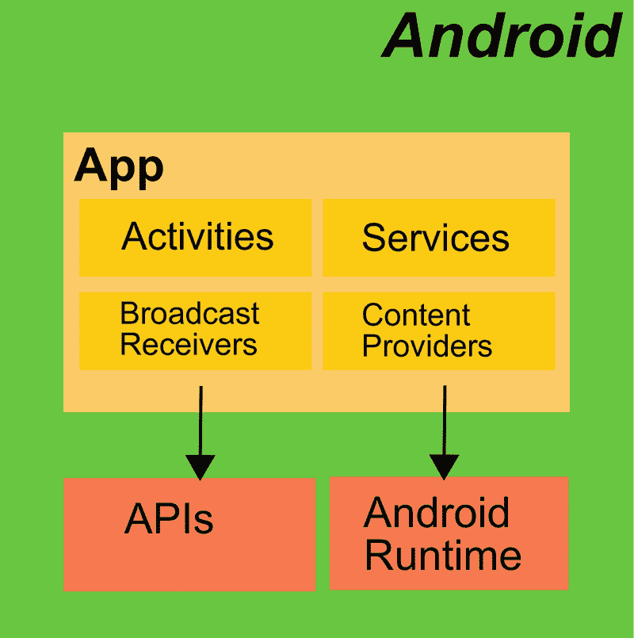
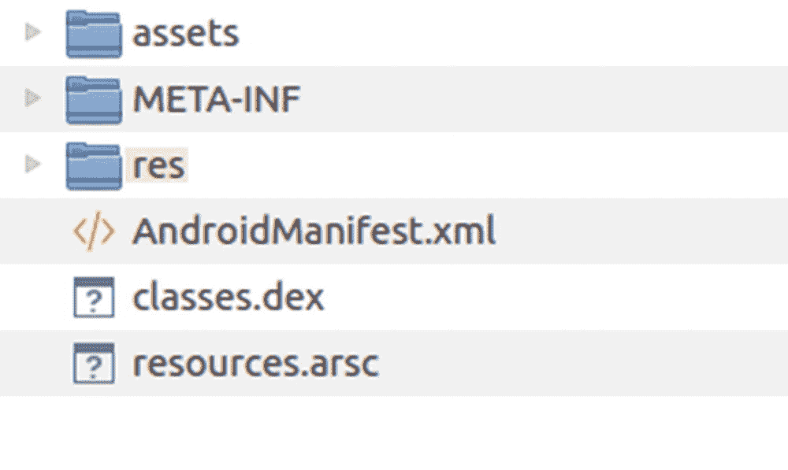

# 二、应用

一个 Android 应用由*活动*、*服务*、*广播接收器*和*内容提供者*等组件组成，如图 [2-1](#Fig1) 所示。活动用于与设备用户交互，服务用于在没有专用用户界面的情况下运行的程序部分，广播接收器监听来自其他应用和组件的标准化消息，内容供应器允许其他应用和组件访问由组件提供的一定数量和种类的数据。



图 2-1

Android 操作系统中的一个应用

组件由 *Android 运行时*启动，如果你喜欢，也可以由执行引擎启动，或者由它自己启动，或者代表其他创建启动触发器的组件启动。组件何时启动取决于它的类型和给它的元信息。在生命周期结束时，所有正在运行的组件都将从进程执行列表中删除，因为它们已经完成了工作，或者因为 Android OS 已经决定可以删除某个组件，因为不再需要该组件，或者因为设备资源短缺而必须删除该组件。

为了让你的应用或组件尽可能稳定地运行，并让你的用户对其可靠性有一个良好的感觉，深入了解 Android 组件的生命周期是有帮助的。在这一章中，我们将着眼于组件的系统特征及其生命周期。

简单的应用和 Android 组件易于构建；只需参考 Android 官方网站上的一个教程，或者网上其他地方成千上万个教程中的一个。不过，一个简单的应用不一定是专业级的稳定应用，因为就应用而言，Android 状态处理与桌面应用不同。这样做的原因是，你的 Android 设备可能会决定关闭你的应用以节省系统资源，特别是当你因为使用一个或多个其他应用一段时间而临时暂停有问题的应用时。

当然，Android 很可能永远不会杀死你目前正在使用的应用，但你必须采取预防措施。任何被 Android 终止的应用都可以在定义的数据和处理状态下重新启动，包括用户当前输入的大多数数据，并尽可能少地干扰用户当前的工作流程。

从文件的角度来看，Android 应用是一个带有后缀`.apk`的单个 zip 存档文件。它包含您的完整应用，包括所有元信息，这是在 Android 设备上运行应用所必需的。里面最重要的控制工件是描述应用和应用组成的组件的文件`AndroidManifest.xml`。

我们在这里不详细介绍这个归档文件结构，因为在大多数情况下，Android Studio 会为您正确地创建归档文件，所以您通常不需要了解它的内在功能。但是你可以很容易地看到里面。随便打开一个`*.apk`文件；例如，以您已经使用 Android Studio 构建的示例应用为例，如下所示:



图 2-2

解压后的 APK 文件

```java
AndroidStudioProject/[YOUR-APP]/release/app-release.apk

```

然后拉开拉链。APK 文件只是普通的压缩文件。您可能需要临时将后缀改为`.zip`，这样您的解压缩程序就可以识别它。图 2-2 显示了一个解压缩的 APK 文件的例子。

这个`.dex`文件包含了以 *Dalvik 可执行文件*格式编译的类，类似于 Java 中的 JAR 文件。

我们将很快讨论与应用相关的工件，但是首先我们将看看任务是什么的更概念性的想法。

## 任务

一个*任务*是一组相互交互的活动，最终用户将它们视为应用的元素。用户启动一个应用，看到主活动，在那里做一些工作，打开和关闭子活动，可能切换到另一个应用，返回，并最终关闭应用。

再深入一点，一个任务展示的主要结构是它的*后台栈*，或者简称为*栈*，在那里一个应用的活动堆积起来。这个堆栈中简单应用的标准行为是，当你启动一个应用时，第一个活动构建这个堆栈的*根*，从应用内部启动的下一个活动位于它的顶部，另一个子活动位于两者的顶部，以此类推。每当一个活动因为您向后导航而关闭时(这就是名称 *back stack* 的来源)，该活动就会从堆栈中删除。当根活动被移除时，栈作为一个整体被关闭，你的应用被认为是关闭的。

在`AndroidManifest.xml`文件的`<application>`元素中，在线文本指南的“应用声明”部分有更详细的描述，我们可以看到几个改变任务堆栈标准行为的设置，我们将在第 [3 章](03.html)中看到更多。通过这种方式，定制的任务堆栈可以成为帮助您的最终用户理解和流畅使用您的应用的强大手段。请记住，对于开始使用你的应用的用户来说，复杂的堆栈行为可能很难理解，所以你的目标应该是在功能和易用性之间找到一个良好的平衡。

## 应用清单

你可以在任何 Android 应用中看到的一个重要的中央应用配置文件是文件`AndroidManifest.xml`。它描述了应用并声明了应用的所有组件。这种清单文件的大纲可能如下所示:

```java
<manifest xmlns:android=
              "http://schemas.android.com/apk/res/android"
          xmlns:tools=
              "http://schemas.android.com/tools"
          package="de.pspaeth.tinqly">
   ...
   <application
       android:allowBackup="true"
       android:icon="@mipmap/my_icon"x
       android:label="@string/app_name"
       android:roundIcon="@mipmap/my_round_icon"
       android:supportsRtl="true"
       android:theme="@style/AppTheme">
       <activity ... />
   </application>
</manifest>

```

根条目`<manifest>`最重要的属性叫做`package`。它声明您的应用的 ID，如果您计划发布您的应用，这必须是它的全球唯一 ID。一个好主意是颠倒使用您的域(或您公司的域),然后使用唯一的应用标识符，如前面的代码所示。

表 [2-1](#Tab1) 描述了`<manifest>`所有可能的属性。请注意，对于最简单的应用，您需要的只是一个`package`属性和一个`<application>`子元素。

表 2-1

清单主要属性

<colgroup><col class="tcol1"> <col class="tcol2"></colgroup> 
| 

名字

 | 

描述

 |
| --- | --- |
| `android: installLocation` | 定义安装位置。使用`internalOnly`仅安装在内部存储器中，使用`auto`让操作系统决定使用内部存储器(用户可以稍后在系统设置中切换)，或者使用`preferExternal`让操作系统决定使用外部存储器。默认为`internalOnly`。请注意，为此目的使用外部存储有一些限制；参见`<manifest>`的在线文档。对于具有大量空闲内部存储的现代设备，您应该永远不需要在这里指定`preferExternal`。 |
| `package` | 定义您的应用的全球唯一 ID，是一个类似于`abc.def.ghi.[...]`的字符串，其中非点字符可能包含字母 A–Z 和 A–Z、数字 0–9 和下划线。不要在圆点后使用数字！这也是默认的进程名称和默认的任务关联性；请参阅在线文本指南，了解它们的含义。请注意，应用发布后，您将无法在谷歌 Play 商店中更改此包的名称。没有违约；您必须设置该属性。 |
| `android: sharedUserId` | 定义分配给应用的 Android 操作系统用户 id 的名称。在 Android 8.0 或 API level 26 之前，你可以为不同的应用分配相同的用户 id，让它们自由交换数据。这些应用必须使用相同的证书进行签名。然而，你通常不需要设置这个属性，但是如果你设置了它，确保你知道你在做什么。 |
| `android: sharedUserLabel` | 如果您还设置了`sharedUserId`，您可以在这里为共享用户 ID 设置一个用户可读的标签。该值必须是对字符串资源的引用(例如，`@string/myUserLabel`)。 |
| `android: targetSandboxVersion` | 用作安全级别，为 1 或 2。从 Android 8.0 或 API level 26 开始，你*必须*将其设置为 2。对于 2，用户 ID 不再能在不同的应用之间共享，并且`usesClearTextTraffic`(参见在线文本伴侣)的默认值被设置为 false。 |
| `android: versionCode` | 定义应用的内部版本号。这不向用户显示，仅用于比较版本。此处使用整数。这默认为`undefined`。 |
| `android: versionName` | 定义用户可见的版本字符串。这要么是字符串本身，要么是指向字符串资源的指针(`"@string/..."`)。这除了通知用户之外，没有其他用途。 |

在线文本指南的“清单顶级条目”一节中列出了所有可能作为`<manifest>`元素的子元素的元素。最重要的一个是`<application>`，它描述了应用，在在线文本指南的“应用声明”一节中有详细介绍。