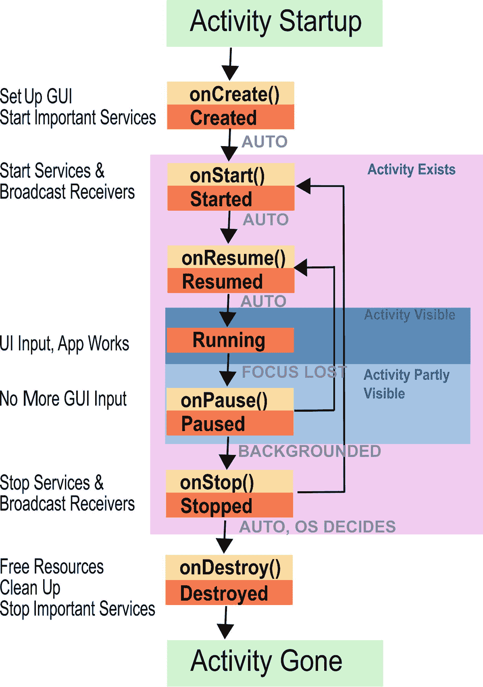

# 三、活动

*活动*代表应用的用户界面入口点。任何需要以直接方式与用户进行功能性交互的应用，通过让用户输入东西或以图形方式告诉用户应用的功能状态，都会向系统暴露至少一个*活动*。我之所以说*是功能性的*，是因为通过*祝酒词*或*状态栏*的通知也可以告诉用户事件的发生，而这并不需要活动。

应用可以有零个、一个或多个活动，它们以两种方式开始:

*   在`AndroidManifest.xml`中声明的*主活动*通过启动应用开始。这有点类似于传统应用的`main()`函数。

*   所有活动都可以被配置为由一个显式或隐式的*意图*启动，就像在`AndroidManifest.xml`中配置的那样。Intents 既是一个类的对象，也是 Android 中的一个新概念。有了明确的意图，通过触发意图，组件指定它需要由专用应用的专用组件来完成某些事情。对于隐式意图，组件只是告诉需要做什么，而没有指定应该由哪个组件来做。Android 操作系统或用户决定哪个应用或组件能够满足这样的隐式请求。

从用户的角度来看，活动表现为可以从应用启动器内部启动的东西，无论是标准启动器还是专门的第三方启动器应用。一旦它们开始运行，它们就会出现在任务堆栈中，当用户使用后退按钮时就会看到它们。

## 申报活动

要声明一个活动，您可以在`AndroidManifest.xml`中编写以下内容，例如:

```kt
<?xml version="1.0" encoding="utf-8"?>
<manifest ...
    package="com.example.myapp">
  <application ... >
      <activity android:name=".ExampleActivity" />
      ...
  </application ... >
  ...
</manifest >

```

如这个特殊的例子所示，您可以用一个点作为名称的开头，这将导致应用包名称的前置。在这种情况下，活动的全称是`com.example.myapp.ExampleActivity`。也可以写全名，如下所示:

```kt
<?xml version="1.0" encoding="utf-8"?>
<manifest ... package="com.example.myapp" ...>
  <application ... >
      <activity android:name=
          "com.example.myapp.ExampleActivity" />
      ...
  </application ... >
  ...
</manifest>

```

您可以添加到`<activity>`元素的所有属性都列在在线文本指南的“活动相关清单条目”一节中。

以下元素可以是`activity`元素中的子元素:

*   **<意图过滤>**

    这是一个意图过滤器。有关详细信息，请参阅“与活动相关的清单条目”中的在线文本指南。您可以指定零个、一个或多个意图过滤器。

*   **<布局>**

    从 Android 7.0 开始，您可以在多窗口模式下指定布局属性，如下所示，当然您可以使用自己的数字:

```kt
<layout android:defaultHeight="500dp"
        android:defaultWidth="600dp"
        android:gravity="top|end"
        android:minHeight="450dp"
        android:minWidth="300dp" />

```

属性`defaultWidth`和`defaultHeight`指定默认尺寸，属性`gravity`指定活动在自由形式模式下的初始位置，属性`minHeight`和`maxHeight`表示最小尺寸。

*   **<元数据>**

    这是一个任意的名称值对，形式为`<meta-data android:name="..." android:resource="..." android:value="..." />`。你可以有几个这样的元素，它们被放入一个叫做`PackageItemInfo.metaData`的`android.os.Bundle`元素中。

### 警告

编写一个没有任何活动的应用是可能的。该应用仍然可以作为内容供应器提供服务、广播接收器和数据内容。作为应用开发人员，你需要记住的一件事是，用户不一定理解这些没有用户界面的组件实际上是做什么的。在大多数情况下，建议提供一个简单的主活动来提供信息，这样可以改善用户体验。然而，在企业环境中，提供没有活动的应用是可以接受的。

## 开始活动

活动可以通过两种方式之一启动。首先，如果活动被标记为应用的可启动主活动，则可以从应用启动器启动该活动。要将一个活动声明为可启动的主活动，在`AndroidManifest.xml`文件中应该编写以下内容:

```kt
<activity android:name=
      "com.example.myapp.ExampleActivity">
  <intent-filter>
    <action android:name=
          "android.intent.action.MAIN" />
    <category android:name=
          "android.intent.category.LAUNCHER" />
  </intent-filter>
</activity>

```

`android.intent.action.MAIN`告诉 Android 它是主活动，将转到一个任务的底部，`android.intent.category.LAUNCHER`指定它必须列在启动器内部。

第二，一个活动可以由来自同一个 app 或任何其他 app 的意向启动。为此，在清单中声明一个意图过滤器，如下所示:

```kt
<activity android:name=
      "com.example.myapp.ExampleActivity">
  <intent-filter>
    <action android:name=
        "com.example.myapp.ExampleActivity.START_ME" />
    <category android:name=
        "android.intent.category.DEFAULT"/>
  </intent-filter>
</activity>

```

处理这个意图过滤器并实际启动活动的相应代码现在如下所示:

```kt
val intent = Intent()
intent.action =
    "com.example.myapp.ExampleActivity.START_ME"
startActivity(intent)

```

必须为其他应用的调用设置标志`exported="false"`。过滤器中的类别规范`android.intent.category.DEFAULT`负责即使在启动代码中没有设置类别也可以启动的活动。

在前面的例子中，我们使用了一个*显式的*意图来调用一个活动。我们精确地告诉 Android 要调用哪个活动，我们甚至期望只有一个活动，它通过意图过滤器以这种方式被处理。另一种类型的意图被称为*隐式*意图，它的作用是，与精确地调用一个活动相反，告诉系统我们实际上想做什么，而无需指定*使用哪个*应用或哪个组件。例如，这样的隐式调用看起来像这样:

```kt
val intent = Intent(Intent.ACTION_SEND)
intent.type = "text/plain"
intent.putExtra(Intent.EXTRA_TEXT, "Give me a Quote")
startActivity(intent)

```

这个代码片段调用一个活动，该活动能够处理`Intent.ACTION_SEND`动作，接收 MIME 类型的文本`text/plain`，并传递文本“给我一个报价”然后，Android 操作系统将向用户呈现一个活动列表，这些活动来自这个或其他能够接收这种意图的应用。

活动可以有与之相关的数据。只需使用 intent 类的一个重载的`putExtra(...)`方法。

## 活动和任务

与任务堆栈相关的已启动活动的实际情况由这里列出的属性决定，如`<activity>`元素的属性所示:

*   `taskAffinity`

*   `launchMode`

*   `allowTaskReparenting`

*   `clearTaskOnLaunch`

*   `alwaysRetainTaskState`

*   `finishOnTaskLaunch`

和意向调用标志，如下所示:

*   `FLAG_ACTIVITY_NEW_TASK`

*   `FLAG_ACTIVITY_CLEAR_TOP`

*   `FLAG_ACTIVITY_SINGLE_TOP`

您可以指定`Intent.flags = Intent.<FLAG>`，其中`<FLAG>`是列表中的一个。如果活动属性和调用者标志相矛盾，调用者标志获胜。

## 返回数据的活动

如果您使用以下命令开始一项活动:

```kt
startActivityForResult(intent:Intent, requestCode:Int)

```

这意味着您希望被调用的活动在返回的同时返回一些东西。您在调用的活动中使用的构造如下所示:

```kt
val intent = Intent()
intent.putExtra(...)
intent.putExtra(...)
setResult(Activity.RESULT_OK, intent)
finish()

```

在`.putExtra(...)`方法调用中，您可以添加从活动中返回的任何数据。例如，您可以将这些行添加到`onBackPressed()`事件处理程序方法中。

对于`setResult()`的第一个参数，您可以使用以下任何一种:

*   `Activity.RESULT_OK`如果你想告诉调用者被调用的活动成功完成了它的工作。

*   `Activity.RESULT_CANCELED`如果你想告诉调用者被调用的活动没有成功完成它的工作。您仍然可以通过`.putExtra(...)`输入额外的信息来指明哪里出错了。

*   `Activity.RESULT_FIRST_USER + N`，`N`为 0、1、2、...，用于要定义的任何自定义结果代码。`N`实际上没有限制(最大值为 2311)。

注意，如果你有一个工具栏，你还需要处理回压事件。一种可能是添加如下的`onCreate()`方法行:

```kt
setSupportActionBar(toolbar)
supportActionBar!!.setDisplayHomeAsUpEnabled(true)
// The navigation button from the toolbar does not
// do the same as the BACK button, more precisely
// it does not call the onBackPressed() method.
// We add a listener to do it ourselves
toolbar.setNavigationOnClickListener { onBackPressed() }

```

当被调用的意图以前面描述的方式返回时，调用组件需要被告知该事件。这是异步完成的，因为`startActivityForResult()`方法会立即返回，而不会等待被调用的活动完成。然而，捕获该事件的方法是重写`onActivityResult()`方法，如下所示:

```kt
override
fun onActivityResult(requestCode:Int, resultCode:Int,
      data:Intent) {
   // do something with 'requestCode' and 'resultCode'
   // returned data is inside 'data'
}

```

`requestCode`是你在`startActivityForResult()`里面设置为`requestCode`的东西，`resultCode`是你在被调用活动的`setResult()`里面作为第一个参数写的东西。

### 警告

在某些设备上，`requestCode`的最高有效位设置为 1，无论之前设置了什么。为了安全起见，您可以在`onActivityResult()`中使用 Kotlin 构造，如下所示:`val requestCodeFixed = requestCode and 0xFFFF`

## 意图过滤器

意图是告诉 Android 需要做一些事情的对象，如果我们不指定被调用的组件，而是让 Android 决定哪个应用和哪个组件可以响应请求，则意图可以是明确的或隐含的*。如果有一些歧义，Android 无法决定调用哪个组件来表达隐含的意图，Android 会询问用户。*

 *为了让隐含意图发挥作用，可能的意图接收者需要声明它能够接收哪些意图。例如，一个活动可能能够显示一个文本文件的内容，而一个呼叫者说“我需要一个可以显示文本文件的活动”可能正好连接到这个活动。现在，意向接收方声明其响应意向请求的能力的方式是在其应用的`AndroidManifest.xml`文件中指定一个或多个*意向过滤器*。这种声明的语法如下:

```kt
<intent-filter android:icon="drawable resource"
              android:label="string resource"
              android:priority="integer" >
    ...
</intent-filter>

```

这里，`icon`指向图标的可绘制资源 ID，`label`指向标签的字符串资源 ID。如果未指定，将使用父元素的图标或标签。`priority`属性是一个介于-999 和 999 之间的数字，对于 intents 指定它处理这种 intent 请求的能力，对于 receiver 指定几个 receiver 的执行顺序。较高的优先级在较低的优先级之前。

### 警告

应该谨慎使用`priority`属性。一个组件不可能知道来自其他应用的其他组件的优先级。因此，你在应用之间引入了某种依赖，这不是设计意图。

这个`<intent-filter>`元素可以是下列元素的子元素:

*   `<activity>`和`<activity-alias>`

*   `<service>`

*   `<receiver>`

因此，意图可以用来启动活动和服务，并发射广播消息。

元素必须包含子元素，如下所示:

*   `<action>`(必须)

*   `<category>`（可选）

*   `<data>`（可选）

### 意图动作

过滤器的`<action>`子过滤器(或者多个子过滤器，因为可以有多个子过滤器)指定要执行的动作。语法如下:

```kt
<action android:name="string" />

```

这将是表示诸如查看、选择、编辑、拨号等动作的东西。通用动作的完整列表是由类`android.content.Intent`中名称类似`ACTION_*`的常量指定的；您可以在联机文本指南的“意图构成部分”一节中找到一个列表。除了这些通用操作之外，您还可以定义自己的操作。

### 注意

使用任何标准操作并不一定意味着您的设备上有任何应用能够响应相应的意图。

### 意图类别

过滤器的`<category>`子级指定了过滤器的类别。语法如下:

```kt
<category android:name="string" />

```

此属性可用于指定意图应解决的组件类型。您可以指定几个类别，但是该类别并不用于所有目的，您也可以省略它。只有当*所有*要求的类别都存在时，过滤器才会匹配意图。

当调用方使用一个意图时，您可以通过编写以下代码来添加类别，例如:

```kt
val intent:Intent = Intent(...)
intent.addCategory("android.intent.category.ALTERNATIVE")

```

标准类别对应于名称类似于`android.content.Intent`类中的`CATEGORY_*`的常量。您可以在联机文本指南的“意图构成部分”一节中找到它们。

### 警告

对于隐式意图，您*必须*使用过滤器内的`DEFAULT`类别。这是因为方法`startActivity()`和`startActivityForResult()`默认使用这个类别。

### 意向数据

过滤器的`<data>`子级是过滤器的数据类型规范。语法如下:

```kt
<data android:scheme="string"
      android:host="string"
      android:port="string"
      android:path="string"
      android:pathPattern="string"
      android:pathPrefix="string"
      android:mimeType="string" />

```

您可以指定以下任一项或两项:

*   仅由`mimeType`元素指定的数据类型，例如`text/plain`或`text/html`。所以，你可以这样写:

*   由方案、主机、端口和一些路径规范指定的数据类型:`<scheme>://<host>:<port>[<path>|<pathPrefix>|<pathPattern>]`。这里的`<path>`表示完整路径，`<pathPrefix>`是路径的起点，`<pathPattern>`类似于路径，但带有通配符:`X*`是字符 *X* 的零次或多次出现，`.*`是任何字符的零次或多次出现。由于转义规则的原因，写\\*表示星号，写\\\\表示反斜杠。

```kt
<data android:mimeType="text/html" />

```

在调用方，您可以使用`setType()`、`setData()`和`setDataAndType()`来设置任何数据类型组合。

### 警告

对于隐式意图过滤器，如果调用者在`intent.data = <some URI>`中指定了 URI `data`部分，那么在过滤器声明中仅指定方案/主机/端口/路径可能是不够的。在这些情况下，您还必须指定 MIME 类型，就像在`mimeType="*/*"`中一样。否则，过滤器可能不匹配。这通常发生在*内容提供者*环境中，因为内容提供者的`getType()`方法被指定的 URI 调用，结果被设置为意图的 MIME 类型。

### 意向额外数据

除了由`<data>`子元素指定的数据之外，任何 intent 都可以添加额外的数据来发送数据。

虽然您可以使用各种`putExtra(...)`方法中的一种来添加任何种类的额外数据，但是也有一些标准的额外数据字符串是由`putExtra(String,Bundle)`发送的。您可以在联机文本指南的“意图构成部分”一节中找到这些关键字。

### 意图标志

您可以通过调用以下内容来设置特殊意图处理标志:

```kt
intent.flags = Intent.<FLAG1> or Intent.<FLAG2> or ...

```

这些标志中的大部分指定了 Android 操作系统如何处理意图。具体来说，`FLAG_ACTIVITY_*`形式的标志是针对`Context.startActivity(..)`调用的活动的，类似`FLAG_RECEIVER_*`的标志是和`Context.sendBroadCast(...)`一起使用的。在线文本指南的“意图构成部分”一节中的表格显示了详细信息。

### 系统意图过滤器

系统应用(即您购买智能手机时已经安装的应用)具有意图过滤器，您可以使用该过滤器从您的应用中调用它们。不幸的是，猜测如何从系统应用中调用活动并不容易，相关的文档也很难找到。一个解决办法是从他们的 APK 档案中提取这些信息。对于 API 级别 26，这已经为您完成了，其结果在“系统意图过滤器”一节中的在线文本指南中列出

举个例子，假设你想发送一封电子邮件。在网文伴侣里看系统意图表，可以找到很多`PrebuiltGmail`的动作。我们用哪一个？首先，通用接口不应该有太多的输入参数。其次，我们还可以查看动作名称，以找到似乎合适的内容。一个有希望的候选者是`SEND_TO`行动；显然，它所需要的只是一个`mailto:`数据规范。碰巧的是，这是我们真正需要的行动。使用精心设计的`mailto:...` URL 允许我们指定更多的收件人、抄送和密件抄送收件人、主题，甚至邮件正文。然而，你也可以只使用“`mailto:` master@universe.com”并通过使用额外的字段来添加收件人、正文等等。因此，要发送电子邮件，同时可能让用户在设备上安装的几个电子邮件应用中进行选择，请编写以下内容:

```kt
val emailIntent:Intent = Intent(Intent.ACTION_SENDTO,
    Uri.fromParts("mailto","abc@gmail.com", null))
emailIntent.putExtra(Intent.EXTRA_SUBJECT, "Subject")
emailIntent.putExtra(Intent.EXTRA_TEXT, "Body")
startActivity(Intent.createChooser(
    emailIntent, "Send email..."))
// or startActivity(emailIntent) if you want to use
// the standard chooser (or none, if there is only
// one possible receiver).

```

### 警告

如何准确处理意图 URIs 和额外数据由接收应用决定。设计糟糕的电子邮件可能根本不允许您指定电子邮件标题数据。为了安全起见，您可能希望将所有标题数据都添加到`mailto:` URI *和*中作为额外数据。

## 活动生命周期

活动有一个生命周期，与传统的桌面应用相反，当 Android 操作系统决定终止活动时，它们会被有意地终止。所以，作为一名开发者，你需要采取特别的预防措施来保证应用的稳定性。更准确地说，活动发现自己处于以下状态之一:

*   *关闭*:活动不可见，不做任何处理。尽管如此，包含该活动的应用可能还活着，因为它有一些其他组件在运行。

*   *已创建*:要么该活动是主活动，由用户或其他组件启动，要么它是一个活动，不管它是否是主活动，由其他组件启动，从同一应用或其他应用内部启动(如果安全考虑允许的话)。此外，例如，当你翻转屏幕时，活动创建就会发生，应用需要用不同的屏幕特征来构建。在创建过程中，回调方法`onCreate()`被调用。您必须实现这个方法，因为那里需要构建 GUI。您还可以使用这个回调方法来启动或连接到服务，或者提供内容提供者数据。你可以使用这些 API 让*准备*播放音乐，操作相机，或者做这个应用为之而生的任何事情。这也是一个初始设置数据库或应用需要的其他数据存储的好地方。

*   *已启动*:一旦完成创建(以及在停止后重新启动的情况下)，活动进入*已启动*状态。在这里，活动将对用户可见。在启动过程中，回调方法`onStart()`被调用。这是启动广播接收器、启动服务、重建内部状态和活动进入停止状态时退出的进程的好地方。

*   *Resumed* :在对用户可见之前不久，活动经历了恢复过程。在这个过程中，回调`onResume()`被调用。

*   *运行*:活动完全可见，用户可以与之交互。这种状态紧跟在恢复过程之后。

*   *暂停*:活动失去焦点，但至少部分可见。例如，当用户点击后退或最近按钮时，就会失去焦点。活动可能会继续向 UI 发送更新，或者继续发出声音，但是在大多数情况下，活动会进入停止状态。在暂停期间，`onPause()`回调被调用。暂停状态之后是停止状态或恢复状态。

*   *停止*:活动对用户不可见。它以后可能会被重新启动、销毁，并从活动进程列表中删除。在停止期间，`onStop()`回调被调用。停止之后，要么毁灭，要么开始。在这里你可以，例如，停止你在`onStart()`中启动的服务。

*   *销毁*:活动被移除。回调`onDestroy()`被调用，您应该实现它并在那里做一切事情来释放资源和做其他清理动作。

表 3-1 列出了活动状态之间可能的转换，如图 3-1 所示。



图 3-1

活动状态转换

表 3-1

活动状态转换

<colgroup><col class="tcol1"> <col class="tcol2"> <col class="tcol3"> <col class="tcol4"></colgroup> 
| 

从

 | 

到

 | 

描述

 | 

实施

 |
| --- | --- | --- | --- |
| 停工 | 创造 | 一个活动在第一次或销毁后被调用。 | `onCreate()`:调用`super.onCreate()`，准备 UI，启动服务。 |
| 创造 | 出发 | 活动在创建后开始。 | 您可以在这里启动仅在活动可见时才需要的服务。 |
| 出发 | 重新开始 | 恢复状态自动跟随开始状态。 | 使用`onResume`。 |
| 重新开始 | 运转 | 运行状态自动跟随恢复状态。 | 包括 UI 活动在内的活动在这里运行。 |
| 运转 | 暂停 | 该活动失去焦点，因为用户点击了“后退”或“最近”按钮。 | 使用`onPause`。 |
| 暂停 | 重新开始 | 该活动尚未停止，用户导航回该活动。 | 使用`onResume()`。 |
| 暂停 | 停止 | 该活动对用户是不可见的，例如，因为另一个活动开始了。 | 您可以在这里停止仅在活动可见时才需要的服务。 |
| 停止 | 出发 | 停止的活动再次开始。 | 您可以在这里启动仅在活动可见时才需要的服务。 |
| 停止 | 破坏 | 停止的活动将被删除。 | `onDestroy()`:释放所有资源，进行清理，停止`onCreate`中启动的服务。 |

## 在活动中保留状态

我已经强调了你需要采取预防措施，以确保当你的应用被 Android 操作系统强行停止时，它能以良好的方式重新启动。在这里，我给你一些如何做到这一点的建议。

查看活动的生命周期，我们可以看到一个即将被 Android OS 终止的活动调用了方法`onStop()`。但是还有两次试镜我们还没有谈到。它们的名字是`onSaveInstanceState()`和`onRestoreInstanceState()`，每当 Android 决定需要保存或恢复某项活动的数据时，就会调用它们。这与`onStart()`和`onStop()`不一样，因为有时没有必要保存应用的状态。例如，如果一个活动不会被销毁，而只是被挂起，那么无论如何状态都会被保持，并且`onSaveInstanceState()`和`onRestoreInstanceState()`不会被调用。

Android 在这里帮助了我们:`onSaveInstanceState()`和`onRestoreInstanceState()`的默认实现已经保存和恢复了有 id 的 UI 元素。所以，如果这就是你所需要的，你不需要做任何事情。当然，您的活动可能更复杂，可能包含其他需要保留的字段。在这种情况下，您可以覆盖`onSaveInstanceState()`和`onRestoreInstanceState()`。只要确保你调用了超类的方法；否则，您必须自己处理所有 UI 元素。

```kt
override
fun onSaveInstanceState(outState:Bundle?) {
    super.onSaveInstanceState(outState)
    // add your own data to the Bundle here...
    // you can use one of the put* methods here
    // or write your own Parcelable types
}

override
fun onRestoreInstanceState(savedInstanceState: Bundle?) {
    super.onRestoreInstanceState(savedInstanceState)
    // restore your own data from the Bundle here...
    // use one of the get* methods here
}

```

注意，保存的状态也会被`onCreate()`回调，所以您可以决定是使用`onRestoreInstanceState()`还是`onCreate()`方法来恢复状态。

在这种情况下，保存和恢复状态的标准机制可能不适合您的需要。例如，当你停止应用时，它不能保留数据。在这种情况下，不会调用`onSaveInstanceState()`方法。如果你需要在这种情况下保存数据，你可以使用`onDestroy()`将你的应用的数据保存在数据库中，并在`onCreate()`回调时读取数据库。更多信息见第八章。*