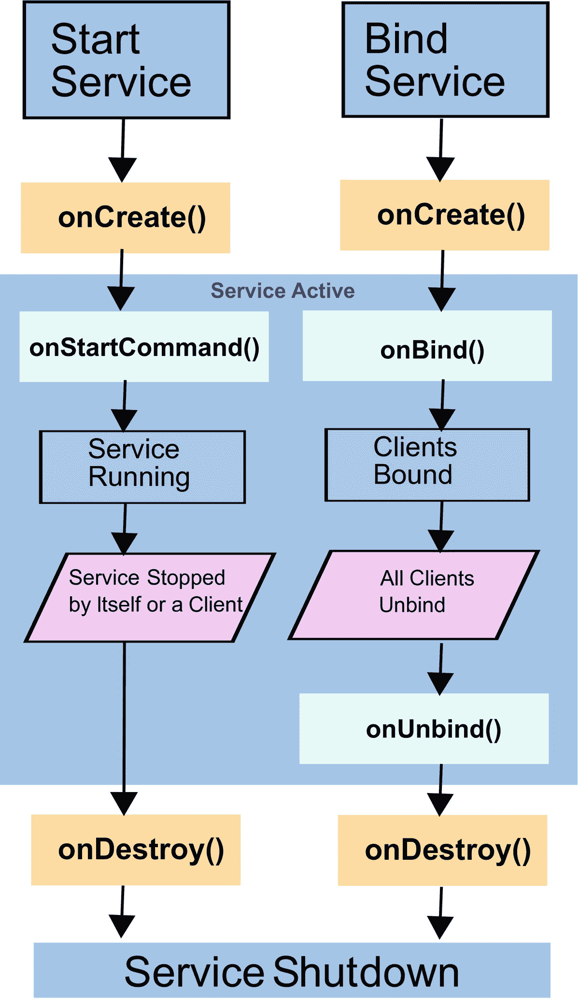

# 四、服务

服务是在没有用户界面的情况下运行的组件，并且在概念上与长期运行的流程密切相关。它们独立于*状态栏*或*祝酒词*中的通知。服务可以由应用启动，也可以由应用绑定，或者两者都有。

服务有两种风格:前台服务和后台服务。虽然乍一看，谈论“前台”服务似乎是矛盾的，因为许多人倾向于说“服务在后台运行”，但前台服务确实存在。前台和后台服务之间的区别是至关重要的，因为它们的行为是不同的。

### 警告

不要将服务误解为运行任何需要在后台计算的东西的构造，换句话说，不要干扰 GUI 活动。如果你需要一个不干扰 GUI 的进程，但是在你的应用不活动的时候没有资格运行，也不能在你的应用之外使用，考虑使用线程。更多信息见第 [10](10.html) 章。

## 前台服务

不同 Android 版本的前台服务的内在功能有所不同。Android 8.0 (API level 26)之前的前台服务只是在状态栏中有一个条目的后台服务，对 Android 操作系统如何处理它们没有严格的影响，而在 Android 8.0 (API level 26)中，前台服务遵循一种特殊的符号，并得到 Android 操作系统的更多关注，使它们不太可能因资源短缺而被终止。以下是一些细节:

*   **Android 8.0(API 26 级)之前的前台服务**是在状态栏中只是呈现一个通知条目的服务。需要使用服务的客户端组件不知道启动的服务是否是前台服务；它只是通过`startService(intent)`启动服务。参见第十二章[的](12.html)。

*   **从 Android 8.0 (API 等级 26)开始的前台服务**在用户知道它们的情况下运行。他们*必须*通过状态栏中的通知来干预操作系统。客户端组件通过调用`startForeroundService(intent)`显式启动前台服务，服务本身必须在几秒钟内通过调用`startForeground(notificationId, notification)`告诉 Android OS 它想要作为前台服务运行。

前台服务的一个显著的生命周期特征是它不太可能因为可用资源短缺而被 Android 杀死。然而，文件对此并不明确。有时你会读到“不会被杀死”，有时会读到“不太可能被杀死”此外，Android 处理这些事情的方式会随着新版本的 Android 而改变。一般来说，你应该保守，做最坏的打算。在这种情况下，阅读“不太可能被杀死”,并采取预防措施，如果服务在您的应用执行某些工作时停止运行。

## 后台服务

后台服务在后台运行；也就是说，它们不会在状态栏中显示条目。然而，他们被允许使用*祝酒辞*向用户发送短通知消息。与前台服务相比，后台服务更脆弱，因为 Android 希望它们与用户活动的联系更松散，因此当资源短缺时，更容易决定终止它们。

从 Android 8.0 (API level 26)开始，如果您以旧的方式实例化后台服务，会有一些限制，并且建议转向使用 *JobScheduler* 方法。如果以下情况不成立，运行在 Android 8.0 或更新版本上的应用将被视为在后台运行:

*   该应用有一个可见的活动，当前活动或暂停。

*   app 有一个前台服务，换句话说，一个服务在运行过程中调用了`startForegound()`。

*   另一个前台应用连接到它，要么通过使用它的服务之一，要么通过将其用作内容供应器。

一旦一个 Android 8.0 应用作为后台应用开始它的生命，或者被切换到后台应用，它在被认为*空闲*之前有几分钟的时间。一旦空闲，应用的后台服务就会停止。作为一个例外，一个后台应用将进入*白名单*，如果它处理用户可见的任务，就被允许执行后台服务。示例包括处理“Firebase Cloud Messaging”消息、接收广播(如 SMS 或 MMS 消息)、执行通知中的`PendingIntent`(在原始应用的许可下由不同应用执行的意图)或启动`VpnService`。

从 Android 8.0 开始，以前通过执行后台作业完成的大多数事情都被认为有资格由 JobScheduler API 来处理；更多信息见第 [8](08.html) 章。

## 声明服务

服务在应用的`AndroidManifest.xml`文件中声明如下:

```kt
<?xml version="1.0" encoding="utf-8"?>
<manifest ...>
    <application ...>
        <activity ...>
        </activity>
        <service
             android:name=".MyService"
             android:enabled="true"
             android:exported="true">
        </service>
    </application>
</manifest>

```

可用标志见表 [4-1](#Tab1) 。

表 4-1

服务的清单标志

<colgroup><col class="tcol1"> <col class="tcol2"></colgroup> 
| 

名字

 | 

描述

 |
| --- | --- |
| `android:description` | 这是指向服务描述的资源 ID。你应该使用它，因为用户可以杀死服务，但如果你告诉他们你的服务是做什么的，这种情况就不太可能发生。 |
| `android:directBootAware` | 这个可以是`true`也可以是`false`。默认是`false`。如果`true`，即使重启后设备尚未解锁，服务也可以运行。Android 7.0(API 24 级)引入了直接引导模式。请注意，直接引导感知服务必须将其数据存储在设备的受保护存储中。 |
| `android:enabled` | 这个可以是`true`也可以是`false`。默认是`true`。如果`false`，服务被有效禁用。对于生产服务，通常不会将它设置为`false`。 |
| `android:exported` | 这个可以是`true`也可以是`false`。这指定了其他应用是否可以使用该服务。如果没有意图过滤器，默认为`false`，否则为`true`。意图过滤器的存在意味着外部使用，因此这种区别。 |
| `android:icon` | 这是图标资源 ID。默认为应用的图标。 |
| `android:isolatedProcess` | 这个可以是`true`也可以是`false`。默认是`false`。如果`true`，服务无法与系统通信，只能通过服务方法。使用这个标志实际上是一个好主意，但是在大多数情况下你的服务需要和系统对话，所以你不得不离开它`false`，除非这个服务真的是自包含的。 |
| `android:label` | 这是向用户显示的服务标签。默认为应用的标签。 |
| `android:name` | 这是服务类的名称。如果您使用一个点作为第一个字符，它会自动加上在`manifest`元素中指定的包名。 |
| `android:permission` | 这是伴随此服务的权限名称。默认值是`application`元素中的`permission`属性。如果未指定并且默认值不适用，则服务将不受保护。 |
| `android:service` | 这是服务进程的名称。如果指定，服务将在其自己的进程中运行。如果它以冒号(`:`)开头，该过程将是应用的私有过程。如果它以小写字母开头，那么产生的进程将是一个全局进程。可能会有安全限制。 |

`<service>`元素允许以下子元素:

*   **<意图过滤>**

    这可以是零个、一个或多个意图过滤器。第 [3](03.html) 章对它们进行了描述。

*   **<元数据>**

    这是一个任意的名称值对，形式为`<meta-data android:name="..." android:resource="..." android:value="..." />`。你可以有几个这样的元素，它们被放入一个叫做`PackageItemInfo.metaData`的`android.os.Bundle`元素中。

作为一名专业开发人员，理解什么是*进程*以及 Android 操作系统如何处理它是非常重要的；见过程控制清单中的`android:service`标志。这可能很棘手，因为过程内部往往会随着新的 Android 版本而变化，如果你读博客，它们似乎每分钟都在变化。事实上，*进程*是一个计算单元，由 Android 操作系统启动以执行计算任务。此外，当 Android 决定耗尽系统资源时，它会停止运行。如果你决定停止使用某个特定的应用，并不意味着相应的进程会自动终止。每当您第一次启动一个应用，并且您没有明确地告诉该应用使用另一个应用的进程时，就会创建并启动一个新的进程，并且随着后续计算任务的存在，进程会被使用或新的进程会被启动，这取决于它们的设置以及彼此之间的关系。

除非您在清单文件中明确指定服务特征，否则由应用启动的服务将在应用的进程中运行。这意味着服务可能会随着应用而存在，也不可避免地会消亡。一个进程需要启动才能真正活起来，但是在 app 主进程中运行的时候，app 死了就死了。这意味着服务的资源需求关系到应用的资源需求。在以前资源稀缺的时候，这比现在更强大的设备更重要，但知道这一点还是有好处的。如果一项服务需要大量资源，而资源短缺，那么是否需要杀死整个应用或只是那个贪婪的服务来释放资源就有所不同了。

然而，如果您通过`android:service` manifest 条目告诉服务使用它自己的进程，服务的生命周期可以由 Android 操作系统独立处理。你必须做出决定:要么让它使用自己的进程，并接受一个应用可能出现的进程激增，要么让它们在一个进程中运行，并更紧密地耦合生命周期。

让几个计算单元在一个进程中运行还有另一个后果:它们不会并发运行！这对于 GUI 活动和进程来说是至关重要的，因为我们知道 GUI 活动必须很快才能不妨碍用户交互，而且服务在概念上是绑定到长时间运行的计算的。摆脱这种困境的一种方法是使用异步任务或线程。第 10 章将会更多地讨论并发性。

如果服务需要寻址受*设备保护的存储*，就像清单中的`android:directBootAware`标志触发的直接引导模式一样，它需要访问一个特殊的上下文。

```kt
val directBootContext:Context =
      appContext.createDeviceProtectedStorageContext()
// For example open a file from there:
val inStream:FileInputStream =
      directBootContext.openFileInput(filename)

```

通常情况下，您不应该使用此上下文，只有在特殊服务需要在引导过程后立即激活时才使用。

## 服务类别

服务必须扩展下列类或其子类之一:

```kt
android.app.Service

```

如前所述，它们必须在应用的`AndroidManifest.xml`文件中声明。

来自`android.app.Service`的接口方法在在线文本指南的“意图组成部分”一节中有所描述。

请注意，有两种方法可以停止通过`startService()`或`startForeroundService`显式启动的服务:服务通过调用`stopSelf()`或`stopSelfResult()`或从外部调用`stopService()`来自行停止。

## 启动服务

服务可以从任何组件显式启动，这些组件是`android.content.Context`的子类或者可以访问`Context`。活动、其他服务、广播接收器和内容供应器都是如此。

要显式启动服务，您需要一个适当的意图。我们基本上有两种情况:首先，如果服务与服务的客户端(调用者)在同一个应用中，您可以为从 Android 8.0 (API 级别 26)开始定义的前台服务编写以下代码:

```kt
val intent = Intent(this, TheService::class.java)
startService(intent)

```

对于正常服务，或者

```kt
val intent = Intent(this, TheService::class.java)
if (Build.VERSION.SDK_INT >= Build.VERSION_CODES.O) {
    startForegroundService(intent)
} else {
    startService(intent)
}

```

所以，我们可以直接引用服务类。如果您是一名新的 Kotlin 开发人员，乍一看,`TheService::class.java`符号可能看起来很奇怪；这就是 Kotlin 提供 Java 类作为参数的方式。(对于 Android 8.0 (API 级别 26)之前的版本，您可以正常启动它。)

### 注意

因为意图通过使用各种`putExtra()`方法之一允许通用的额外属性，所以我们也可以将数据传递给服务。

第二种情况是，如果我们想要启动的服务是另一个应用的一部分，因此是一个*外部*服务。然后，您必须在服务声明中添加一个意图过滤器。这里有一个例子:

```kt
<service
    android:name=".MyService"
    android:enabled="true"
    android:exported="true">
    <intent-filter>
       <action android:name="<PCKG_NAME>.START_SERVICE" />
    </intent-filter>
</service>

```

在这个例子中，`<PCKG_NAME>`是 app 的包名，如果你愿意，你可以写一个不同的标识符来代替`START_SERVICE`。现在，在服务客户端内部，您可以编写以下代码来启动和停止外部服务，其中在 intent 构造函数内部，您必须编写与服务的 intent filter 声明中相同的字符串:

```kt
val intent = Intent("<PCKG_NAME>.START_SERVICE")
intent.setPackage("<PCKG_NAME>")
startService(intent)

// ... do something ...

stopService(intent)

```

`setPackage()`语句在这里很重要(当然您必须替换服务的包名)；否则，将应用安全限制，并且您会收到一条错误消息。

## 绑定到服务

开始一项服务是故事的一部分。另一部分是在它们运行时使用它们。这就是服务的*绑定*的用途。

要创建可以绑定到同一个应用或从同一个应用绑定的服务，请编写如下代码:

```kt
/**
 * Class used for binding locally, i.e. in the same App.
 */
class MyBinder(val servc:MyService) : Binder() {
    fun getService():MyService {
        return servc
    }
}

class MyService : Service() {
    // Binder given to clients
    private val binder: IBinder = MyBinder(this)

    // Random number generator
    private val generator: Random = Random()

    override
    fun onBind(intent: Intent):IBinder  {
        return binder
    }

    /** method for clients */
    fun getRandomNumber():Int {
        return generator.nextInt(100)
    }
}

```

要从同一应用内部绑定到此服务，请在使用客户端的服务内部编写以下代码:

```kt
val servcConn = object : ServiceConnection {
    override
    fun onServiceDisconnected(compName: ComponentName?) {
        Log.e("LOG","onServiceDisconnected: " + compName)
    }
    override
    fun onServiceConnected(compName: ComponentName?,
                           binder: IBinder?) {
        Log.e("LOG","onServiceConnected: " + compName)
        val servc = (binder as MyBinder).getService()
        Log.i("LOG", "Next random number from service: " +
             servc.getRandomNumber())
    }
    override
    fun onBindingDied(compName:ComponentName) {
        Log.e("LOG","onBindingDied: " + compName)
    }
}
val intent = Intent(this, MyService::class.java)
val flags = BIND_AUTO_CREATE
bindService(intent, servcConn, flags)

```

在这里，`object: ServiceConnection {...}`构造是 Kotlin 通过创建匿名内部类的对象来实现接口的方式，就像 Java 中的`new ServiceConnection(){...}`。这个构造在 Kotlin 中被称为*对象表达式*。在这种情况下，意图构造函数中的`this`指的是一个`Context`对象。你可以像这样在活动中使用它。如果变量中有`Context`,请在此处使用该变量的名称。

当然，除了日志记录，你应该做更有意义的事情。特别是在`onSeviceConnected()`方法中，您可以将绑定器或服务保存在一个变量中以备将来使用。尽管如此，还是要确保对死亡的绑定或死亡的服务连接做出适当的反应。例如，您可以尝试再次绑定服务，告诉用户，或者两者都做。

前面的代码会在您绑定到服务时自动启动该服务，但它还不存在。这是通过以下陈述实现的:

```kt
val flags = BIND_AUTO_CREATE
[...]

```

如果因为确定服务正在运行而不需要，可以省略。然而，在大多数情况下，最好包含该标志。以下是可用于设置绑定特征的其他标志:

*   我们刚刚用了那个。这意味着如果服务还没有启动，它会自动启动。有时你会读到，如果你绑定到一个服务，那么显式地启动它是不必要的，但是只有当你设置了这个标志时，这才是正确的。

*   `BIND_DEBUG_UNBIND`:这导致保存下一个`unbindService()`的调用栈，以防后续的 unbind 命令出错。如果发生这种情况，将会显示更详细的诊断输出。因为这会造成内存泄漏，所以该特性只应用于调试目的。

*   `BIND_NOT_FOREGROUND`:仅当客户端运行在前台进程中，目标服务运行在后台进程中时才适用。使用此标志，绑定过程不会将服务提升到前台调度优先级。

*   `BIND_ABOVE_CLIENT`:用这个标志，我们指定服务比客户端(即服务调用者)更重要。在资源短缺的情况下，系统将在调用服务之前终止客户端。

*   这个标志告诉 Android 操作系统，你愿意接受 Android 将绑定视为非关键的，并在内存不足的情况下终止服务。

*   `BIND_WAIVE_PRIORITY`:这个标志导致将服务调用的调度留给服务运行的流程。

只需将它们添加到适合您需求的组合中。

### 注意

从`BroadcastReceiver`组件内部绑定是不可能的，除非`BroadcastReceiver`已经通过`registerReceiver(receiver.intentfilter)`注册。在后一种情况下，接收器的寿命与注册组件相关。但是，您可以从广播接收器传递用于启动(换句话说，不绑定)服务的 intent 内部的指令字符串。

要绑定到外部服务，换句话说，绑定到属于另一个应用的服务，您不能使用与内部服务相同的绑定技术。原因是我们使用的`IBinder`接口不能直接访问服务类，因为该类在进程边界上是不可见的。然而，我们可以将在服务和服务客户机之间传输的数据包装到一个`android.os.Handler`对象中，并使用该对象将数据从服务客户机发送到服务。为了实现这一点，我们首先需要为服务定义一个用于接收消息的`Handler`。这里有一个例子:

```kt
internal class InHandler(val ctx: Context) : Handler() {
    override
    fun handleMessage(msg: Message) {
        val s = msg.data.getString("MyString")
        Toast.makeText(ctx, s, Toast.LENGTH_SHORT).show()
    }
}
[...]
class MyService : Service() {
    val myMessg:Messenger = Messenger(InHandler(this))
    [...]
}

```

除了创建一个`Toast`消息，当消息到达时，你当然可以做更多有趣的事情。现在在服务的`onBind()`方法中，我们返回 messenger 提供的 binder 对象。

```kt
override
fun onBind(intent:Intent):IBinder {
    return myMessg.binder
}

```

至于在`AndroidManifest.xml`文件中的条目，我们可以写得和*启动*远程服务时一样。

在服务客户机中，您可以添加一个`Messenger`属性和一个`ServiceConnection`对象。这里有一个例子:

```kt
var remoteSrvc:Messenger? = null
private val myConnection = object : ServiceConnection {
    override
    fun onServiceConnected(className: ComponentName,
                           service: IBinder) {
        remoteSrvc = Messenger(service)
    }
    override
    fun onServiceDisconnected(className: ComponentName) {
        remoteSrvc = null
    }
}

```

要实际执行绑定，您可以像处理内部服务一样进行。例如，在活动的`onCreate()`方法中，您可以编写以下代码:

```kt
val intent:Intent = Intent("<PCKG_NAME>.START_SERVICE")
intent.setPackage("<PCKG_NAME>")
bindService(intent, myConnection, Context.BIND_AUTO_CREATE)

```

这里，适当地用服务包的名称代替`<PCKG_NAME>`。

现在，要跨越流程边界从客户端向服务发送消息，您可以编写以下代码:

```kt
val msg = Message.obtain()
val bundle = Bundle()
bundle.putString("MyString", "A message to be sent")
msg.data = bundle
remoteSrvc?.send(msg)

```

注意，在这个例子中，您不能将这些行添加到活动的`onCreate()`方法中的`bindService()`语句之后，因为`remoteSrvc`只有在连接启动后才会获得一个值。但是你可以把它添加到`ServiceConnection`类的`onServiceConnected()`方法中。

### 注意

在前面的代码中，没有采取任何预防措施来确保连接的完整性。您应该为生产性代码添加健全性检查。此外，在`onStop()`方法中解除服务绑定。

## 服务发送的数据

到目前为止，我们一直在讨论从服务客户端发送到服务的消息。从服务到服务客户机的相反方向发送数据也是可能的；最好是通过在客户端内部使用一个额外的`Messenger`、一个广播消息或者一个`ResultReceiver`类来实现。

对于第一种方法，在服务客户端中提供另一个`Handler`和`Messenger`，一旦客户端接收到一个`onServiceConnected()`回调，发送一个`Message`给服务，第二个`Messenger`由`replyTo`参数传递。

```kt
internal class InHandler(val ctx: Context) : Handler() {
    override
    fun handleMessage(msg: Message) {
        // do something with the message from the service
    }
}

class MainActivity : AppCompatActivity() {
    private var remoteSrvc:Messenger? = null
    private var backData:Messenger? = null

    private val myConn = object : ServiceConnection {
      override
      fun onServiceConnected(className: ComponentName,
              service: IBinder) {
          remoteSrvc = Messenger(service)
           backData = Messenger(
                InHandler(this@MainActivity))

           // establish backchannel
           val msg0 = Message.obtain()

           msg0.replyTo = backData
           remoteSrvc?.send(msg0)

           // handle forward (client -> service)
           // connectivity...
    }

    override
    fun onServiceDisconnected(clazz: ComponentName) {
         remoteSrvc = null
    }
}

    override fun onCreate(savedInstanceState: Bundle?) {
        super.onCreate(savedInstanceState)
        setContentView(R.layout.activity_main)

        // bind to the service, use ID from the manifest!
        val intent = Intent("<PCKG>.START_SERVICE")
        intent.setPackage("<PCKG>")
        val flags = Context.BIND_AUTO_CREATE
        bindService(intent, myConn, flags)
    }
}

```

然后，服务可以使用这个消息，提取`replyTo`属性，并使用它向服务客户机发送消息。

```kt
internal class IncomingHandler(val ctx: Context) :
         Handler() {
    override
    fun handleMessage(msg: Message) {
        val s = msg.data.getString("MyString")
        val repl = msg.replyTo
        Toast.makeText(ctx, s, Toast.LENGTH_SHORT).show()

        Log.e("IncomingHandler", "!!! " + s)
        Log.e("IncomingHandler", "!!! replyTo = " + repl)

        // If not null, we can now use the 'repl' to send
        // messages to the client. Of course we can save
        // it elsewhere and use it later as well
        if(repl != null) {
          val thr = Thread( object : Runnable {
            override fun run() {
                Thread.sleep(3000)
                val msg = Message.obtain()
                val bundle = Bundle()
                bundle.putString("MyString",
                      "A reply message to be sent")
                 msg.data = bundle
                repl?.send(msg)
            }
          } )
          thr.start()
        }
    }
}

```

其他两种方法，使用广播消息或`ResultReceiver`类，在第 [5](05.html) 和 [12](12.html) 章节中处理。

## 服务子类

到目前为止，我们一直使用`android.app.Service`作为我们描述的服务的基类。不过，Android 提供的其他类也可以用作基类，只是语义不同。对于 Android 8.0，有不少于 20 个服务类或基类可以使用。你可以在 Android API 文档的“已知直接子类”部分看到它们。

### 注意

在写这本书的时候，你可以在 [`https://developer.android.com/reference/android/app/Service.html`](https://developer.android.com/reference/android/app/Service.html) 找到这个文档。

最重要的服务类别有以下三种:

*   这是我们到目前为止一直在用的一款。这是最基本的服务类。除非您在中使用多线程*，否则服务类或服务被显式配置为在另一个进程中执行，服务将在服务调用者的主线程中运行。如果这是 GUI 线程，并且您不希望服务调用运行得很快，那么强烈建议您将服务活动发送到后台线程。*

*   `android.app.IntentService`:虽然服务在设计上不会自然地同时处理主线程传入的启动请求，但是`IntentService`使用一个专用的工作线程来接收多个启动消息。尽管如此，它只使用一个线程来处理启动请求，所以它们被一个接一个地执行。`IntentService`类负责正确地停止服务，所以你自己不需要关心这个。您必须在被覆盖的`onHandleIntent()`方法中为每个启动请求提供服务要完成的工作。因为基本上你不需要其他任何东西，所以`IntentService`服务很容易实现。注意，从 Android 8.0 (API 级别 26)开始，限制适用于后台进程，因此在适当的情况下，可以考虑使用`JobIntentService`类来代替。

*   `android.support.v4.app.JobIntentService`:这使用了一个`JobScheduler`来对服务执行请求进行排队。从 Android 8.0(API 26 级)开始，考虑使用这个服务基类进行后台服务。要实现这样的服务，基本上必须创建一个`JobIntentService`的子类，并覆盖方法`onHandleWork(intent: Intent): Unit`来包含服务的工作负载。

## 服务生命周期

在前面几节中描述了各种服务特征之后，从鸟瞰的角度来看，服务的实际生命周期可能比活动的生命周期更容易。但是，要注意服务可能会在后台运行。此外，因为服务更容易受到 Android 操作系统强制停止的影响，所以在与服务客户端通信时，它们可能需要特别注意。

在您的服务实现中，您可以覆盖这里列出的任何生命周期回调，例如，在开发或调试时记录服务调用信息:

*   `onCreate()`

*   `onStartCommand()`

*   `onBind()`

*   `onUnbind()`

*   `onRebind()`

*   `onDestroy()`

图 [4-1](#Fig1) 显示了服务生命周期的概述



图 4-1

服务生命周期

## 更多服务特征

以下是关于服务的更多观察:

*   服务与`AndroidManifest.xml`中的活动一起被声明。一个常见的问题是它们如何相互作用。有人需要调用服务来使用它们，但这也可以通过其他服务、其他活动甚至其他应用来完成。

*   出于性能和稳定性原因，不要在活动的`onResume()`和`onPause()`方法期间绑定或解除绑定。如果您只需要在活动可见时与服务交互，请在`onStart()`和`onStop()`方法中绑定和解除绑定。如果在活动停止时和在后台也需要服务连接，请在`onCreate()`和`onRestore()`方法中绑定和解除绑定。

*   在远程连接操作中(服务存在于另一个应用中)，捕捉并处理`DeadObjectException`异常。

*   如果您覆盖了服务的`onStartCommand(intent: Intent, flags: Int, startId: Int)`方法，首先确保也调用方法`super.onStartCommand()`,除非您有充分的理由不这样做。接下来，对传入的`flags`参数做出适当的反应，该参数告知这是否是一个自动后续启动请求，因为之前的启动尝试失败了。最终这个方法在离开`onStartCommand()`方法后返回一个描述服务状态的整数；有关详细信息，请参见 API 文档。

*   从服务外部调用`stopService()`或从服务内部调用`stopSelf()`并不能保证服务立即停止。预计这项服务会持续一段时间，直到 Android 真的停止它。

*   如果服务没有被设计成对绑定请求做出反应，并且您覆盖了服务的`onBind()`方法，那么它应该返回`null`。

*   虽然没有明确禁止，但是对于设计用于通过绑定与服务客户端通信的服务，可以考虑禁止由`startService()`启动该服务。在这种情况下，您*必须在`bindService()`方法调用中*提供`Context.BIND_AUTO_CREATE`标志。