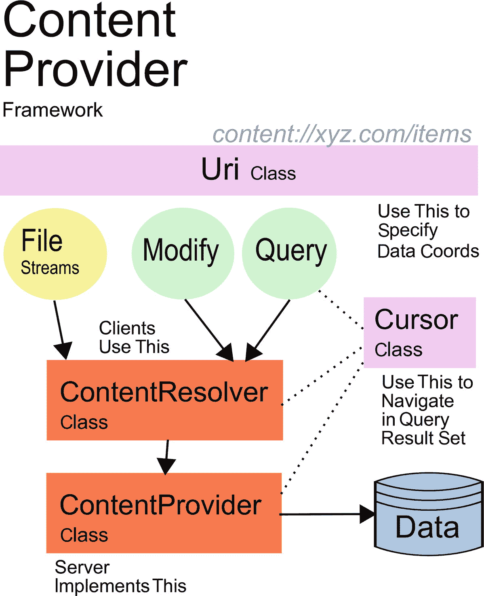

# 6.内容供应器

本章将介绍内容供应器。

## 内容供应器框架

内容供应器框架允许以下内容:

*   使用其他应用提供的(结构化)数据

*   提供(结构化)数据供其他应用使用

*   将数据从一个应用复制到另一个应用

*   向搜索框架提供数据

*   向与数据相关的特殊 UI 小部件提供数据

*   凭借定义良好的标准化接口完成所有这些工作

传递的数据可以具有严格定义的结构，例如数据库中具有定义的列名和类型的行，但它也可以是没有任何关联语义的文件或字节数组。

如果您的应用关于数据存储的要求不符合前面的任何情况，您就不需要实现内容提供者组件。请改用普通的数据存储选项。

### 注意

没有严格禁止应用向自己的组件提供数据或使用自己的数据提供者来访问内容；然而，在考虑内容供应器时，您通常会想到应用间的数据交换。但是如果你需要的话，你总是可以把应用内的数据交换模式看作是应用间通信的一个简单的特例。

如果我们想要创建内容感知型应用，无论是提供内容还是消费内容，都需要考虑以下主要问题:

*   app 如何提供内容？

*   应用如何访问其他应用提供的内容？

*   应用如何处理其他应用提供的内容？

*   我们如何保护所提供的数据？

我们将在接下来的章节中探讨这些主题。图 [6-1](#Fig1) 为轮廓图。



图 6-1

内容供应器框架

## 提供内容

内容可以由您的应用以及系统应用提供。想想相机拍摄的照片或联系人列表中的联系人。如果我们首先看内容提供方，那么内容提供者框架就更容易理解了。在后面的部分中，我们还将研究消费者和其他主题。

首先，我们需要知道数据存储在哪里。然而，内容提供者框架并不假设数据实际上来自哪里。它可以存在于文件、数据库、内存存储或任何你能想到的地方。这改善了应用的维护。例如，在早期阶段，数据可能来自文件，但后来你可能会转向数据库或云存储，潜在的消费者不必关心这些变化，因为他们不必改变他们访问你的内容的方式。因此，内容提供者框架为您的数据提供了一个抽象层。

您需要实现来提供内容的单一接口是下面的抽象类:

```java
android.content.ContentProvider

```

在接下来的部分中，我们将从用例的角度来看这个类的实现。

### 正在初始化提供程序

您必须实现以下方法:

```java
ContentProvider.onCreate()

```

当内容提供者被实例化时，这个方法被 Android 操作系统调用。您可以在这里初始化内容提供者。但是，您应该避免将耗时的初始化过程放在这里，因为实例化并不一定意味着内容提供者将被实际使用。

如果你在这里没有什么有趣的事情要做，就把它实现为一个空方法。

为了在实例化时找到更多关于内容提供者运行环境的信息，您可以覆盖它的`attachInfo()`方法。在那里，您将被告知内容提供者运行的上下文，并获得一个`ProviderInfo`对象。只是别忘了也从内部呼叫`super.attachInfo()`。

### 查询数据

对于查询类似数据库的数据集，有一个方法必须实现，另外两个方法可以选择实现。

```java
abstract fun query(        // ----- Variant A -----
    uri:Uri,
    projection:Array<String>,
    selection:String,
    selectionArgs:Array<String>,
    sortOrder:String) : Cursor

                           // ----- Variant B -----
// You don't have to implement this. The default
// implementation calls variant A, but disregards the
// 'cancellationSignal' argument.
fun query(
    uri:Uri,
    projection:Array<String>,
    selection:String,
    selectionArgs:Array<String>,
    String sortOrder:String,
    cancellationSignal:CancellationSignal) : Cursor

                           // ----- Variant C -----
// You don't have to implement this. The default
// implementation converts the bundle argument to
// appropriate arguments for calling variant B.
// The bundle keys used are:
//     ContentResolver.QUERY_ARG_SQL_SELECTION
//     ContentResolver.QUERY_ARG_SQL_SELECTION_ARGS
//     ContentResolver.QUERY_ARG_SQL_SORT_ORDER -or-
//         ContentResolver.QUERY_ARG_SORT_COLUMNS
//         (this being a String array)
fun query(
    uri:Uri,
    projection:Array<String>,
    queryArgs:Bundle,
    cancellationSignal:CancellationSignal) : Cursor

```

这些方法并不用于呈现图像和声音等文件数据。但是，返回文件数据的链接或标识符是可以接受的。

在下面的列表中，我按名称和变量描述了所有参数:

*   `uri`:这是一个重要的参数，指定查询在数据空间中的类型坐标。通过适当地指定这个参数，内容消费者将会知道他们对什么样的数据感兴趣。因为 URIs 是如此重要，我们在他们自己的部分描述他们；请参见下面“提供内容”一节中的“设计内容 URIs”。该参数对于变型 A、B 和 c 具有相同的含义。

*   `projection`:这将告诉实现请求者对哪些列感兴趣。看看存储数据的 SQL 数据库类型，它列出了应该包含在结果中的列名。然而，对于一对一的映射没有严格的要求。请求者可能会要求一个选择参数`X`，而`X`的值可能会以你可能想到的任何方式计算出来。如果`null`，返回所有字段。该参数对于变型 A、B 和 c 具有相同的含义。

*   `selection`:这仅适用于变量 A 和 b。这为要返回的数据指定了一个选择。内容提供者框架没有假设这个选择参数应该是什么样子。这完全取决于实现，内容请求者必须服从实现的定义。然而，在许多情况下，您会有类似于 SQL 选择字符串的东西，比如这里的`name = Jean AND age < 45`。如果`null`，返回所有数据集。

*   `selectionArgs`:选择参数可能包含类似`?`的占位符。如果是这样，要为占位符插入的值在该数组中指定。同样，这个框架在这里没有做严格的假设，但是在大多数情况下，`?`充当占位符，就像在 SQL 中的`name = ? AND age < ?`一样。如果没有选择占位符，这可能是`null`。

*   `sortOrder`:这仅适用于变量 A 和 b。这指定了要返回的数据的排序顺序。内容提供者框架在这里没有规定语法，但是对于类似 SQL 的访问，这通常类似于`name DESC, or ASC`。

*   `queryArgs`:这仅适用于变量 c。所有三个选择、选择参数和排序顺序可以使用`android.os.Bundle`对象指定，也可以不指定。按照惯例，对于类似 SQL 的查询，包键如下:
    *   `ContentResolver.QUERY_ARG_SQL_SELECTION`

    *   `ContentResolver.QUERY_ARG_SQL_SELECTION_ARGS`

    *   `ContentResolver.QUERY_ARG_SQL_SORT_ORDER`

*   `cancellationSignal`:这仅适用于变体 B 和 c，如果这不是`null`，您可以用它来取消当前操作。Android 操作系统会适当地通知请求者。

所有的查询方法都应该返回一个`android.database.Cursor`对象。这允许您迭代数据集，约定每个数据集包含一个`_id`键控技术 ID。参见下面“提供内容”一节中的“基于 AbstractCursor 的光标类”和“设计内容 URIs ”,了解如何设计合适的光标对象。

### 修改内容

内容供应器不仅允许你阅读内容，还允许你修改内容。为此，存在以下方法:

```java
abstract fun insert(
   Uri uri:Uri,
   values:ContentValues) : Uri

// You don't have to overwrite this, the default
// implementation correctly iterates over the input
// array and calls insert(...) on each element.
fun bulkInsert(
    uri:Uri,
    values:Array<ContentValues>) : Int

abstract fun update(
    uri:Uri,
    values:ContentValues,
    selection:String,
    selectionArgs:Array<String>) : Int

abstract fun delete(
    uri:Uri,
    selection:String,
    selectionArgs:Array<String>) : Int

```

这些参数及其含义如下:

*   `uri`:指定数据在数据空间中的类型坐标。通过适当地指定这个参数，内容消费者将会知道他们的目标是哪种*类型的*数据。注意，对于删除或更新单个数据集，通常假设 URI 包含 URI 路径末端的数据的(技术)ID，例如`content://com.android.contacts/contact/42`。

*   `values`:这些是要插入或更新的值。您可以使用这个类的各种`get*()`方法来访问这些值。

*   `selection`:指定选择要更新或删除的数据。内容提供者框架没有假设这个选择参数应该是什么样子。这完全取决于实现，内容请求者必须服从实现的定义。然而，在许多情况下，您会有类似于 SQL 选择字符串的东西，比如这里的`name = Jean AND age < 45`。如果选择`null`，数据集的所有项目都将被处理。

*   `selectionArgs`:选择参数可能包含类似`?`的占位符。如果是这样，要为占位符插入的值在该数组中指定。同样，框架在这里没有做严格的假设，但是在大多数情况下，`?`充当占位符，就像在`name = ? AND age < ?`中一样，就像 SQL 一样。如果没有选择占位符，可能是`null`。

`insert()`方法应该返回指定插入数据的 URI。这个返回值可能是`null`，所以这里没有严格要求返回什么东西。如果它返回一些东西，这应该包含技术 ID。所有的`Int`-返回方法都应该返回受影响数据集的数量。

如果您不希望内容提供者能够修改任何数据，那么您可以为所有的插入、更新和删除方法提供空的实现，并让它们返回`0`或`null`。

### 完成 ContentProvider 类

为了完成您的`ContentProvider`类的实现，除了查询、插入、更新和删除方法之外，您必须再实现一个方法。

```java
abstract getType(uri:Uri) : String

```

这将任何可用的 URI 映射到适当的 MIME 类型。例如，对于一个可能的实现，您可以按如下方式使用 URIs:

```java
ContentResolver.CURSOR_DIR_BASE_TYPE + "/vnd.<name>.<type>"
ContentResolver.CURSOR_ITEM_BASE_TYPE + "/vnd.<name>.< type>"

```

URIs 分别指*可能*多项，或*至多*一项。对于`<name>`，使用一个全球唯一的名称，可以是反向公司域名或包名，也可以是其重要部分。对于`<type>`，使用定义表名或数据域的标识符。

## 注册内容供应器

一旦您完成了`ContentProvider`实现，您必须将它注册到`AndroidManifest.xml`文件中，如下所示:

```java
<provider android:authorities="list"
          android:directBootAware=["true" | "false"]
          android:enabled=["true" | "false"]
          android:exported=["true" | "false"]
          android:grantUriPermissions=["true" | "false"]
          android:icon="drawable resource"
          android:initOrder="integer"
          android:label="string resource"
          android:multiprocess=["true" | "false"]
          android:name="string"
          android:permission="string"
          android:process="string"
          android:readPermission="string"
          android:syncable=["true" | "false"]
          android:writePermission="string" >
    ...
</provider>

```

表 [6-1](#Tab1) 描述了这些属性。

表 6-1

<provider>元素</provider>

<colgroup><col class="tcol1"> <col class="tcol2"></colgroup> 
| 

属性(在每个属性前添加`android:`)

 | 

描述

 |
| --- | --- |
| `authorities` | 这是以分号分隔的权威列表。在许多情况下，这将只是一个，并且您通常使用 app(包)名称或`ContentProvider`实现的完整类名。没有默认值，您必须至少有一个。 |
| `directBootAware` | 这指定了内容供应器是否可以在用户解锁设备之前运行。默认为`false`。 |
| `enabled` | 这指定是否启用内容提供者。默认为`true`。 |
| `exported` | 这指定了其他应用是否可以访问此处的内容。根据您的应用的架构，访问可能被限制为来自同一应用的组件，但通常您希望其他应用访问内容，因此将其设置为`true`。从 API 级开始，默认为`false`。在此之前，该标志并不存在，应用的行为是这样设置为`true`。 |
| `grantUriPermissions` | 这指定是否可以临时授予其他应用通过 URI 访问此供应器的内容的权限。*临时授予*是指由`<permission>`、`<readPermission>`或`writePermission`定义的许可拒绝，如果内容访问客户端被带有`intent.addFlags(Intent.FLAG_GRANT_*_URI_PERMISSION)`的意图调用，则该许可被临时覆盖。如果将该属性设置为`false`，仍然可以通过设置一个或多个`<grant-uri-permission>`子元素来授予更细粒度的临时权限。默认为`false`。 |
| `icon` | 这指定了用于提供程序的图标的资源 ID。默认情况下使用父组件的图标。 |
| `initOrder` | 在这里，您可以为同一个应用的内容提供者实例化强加一些顺序。较大的数字首先被实例化。请小心使用，因为启动顺序依赖关系可能表明应用设计不好。 |
| `label` | 这指定了标签要使用的字符串资源 ID。默认是 app 的`label`。 |
| `multiprocess` | 如果设置为`true`，在多个进程中运行的应用可能会运行多个内容提供者实例。否则，至多存在一个内容提供者的实例。默认为`false`。 |
| `name` | 这指定了`ContentProvider`实现的完全限定类名。 |
| `permission` | 这是设置`readPermission`和`writePermission`的便捷方式。指定后者之一具有优先权。 |
| `process` | 如果希望内容提供者在应用本身之外的另一个进程中运行，请指定一个进程名称。如果以冒号(:)开头，则该进程将是应用的私有进程；如果以小写字母开头，将使用全局流程(需要许可)。默认是在应用的进程中运行。 |
| `readPermission` | 这是客户端必须拥有的读取内容供应器的内容的许可。借助于`grantUriPermissions`属性，您可以让没有该权限客户机仍然访问内容。 |
| `syncable` | 这指定了内容供应器的数据是否应该与服务器同步。 |
| `readPermission` | 这是客户端必须拥有的对内容供应器的内容进行写入的许可。借助于`grantUriPermissions`属性，您可以让没有该权限客户机仍然访问内容。 |

如果您使用`grantUriPermissions`将 URI 权限临时授予由隐式意图调用的其他应用的组件，您必须小心地定制这样的意图。首先添加标志`Intent.FLAG_GRANT_READ_URI_PERMISSION`，然后在 intent 的`data`字段中添加您希望允许访问的 URI。这里有一个例子:

```java
intent.action =
      "com.example.app.VIEW" // SET INTENT ACTION
intent.flags =
      Intent.FLAG_ACTIVITY_NEW_TASK
intent.addFlags(Intent.FLAG_GRANT_READ_URI_PERMISSION)
      // GRANT TEMPORARY READ PERMISSION
intent.data = Uri.parse("content://<AUTHORITY>/<PATH>")
      // USE YOUR OWN!
startActivity(intent)

```

在被调用组件的意图过滤器中，您必须指定一个`<data>`元素，并且它必须包含一个适当的 URI *和一个 MIME 类型*。尽管我们没有明确说明，但是必须指定 MIME 类型的原因是，Android 操作系统使用内容供应器的`getType(Uri)`方法来自动添加 MIME 类型，同时解析意图。这里有一个例子:

```java
<intent-filter>
    <action android:name=
          "de.pspaeth.crcons.VIEW"/>
    <category android:name=
          "android.intent.category.DEFAULT"/>
    <data android:mimeType="*/*"
          android:scheme="content"
          android:host="*"
          android:pathPattern=".*"/>
</intent-filter>

```

然后被调用的组件被授权以指定的方式访问这个 URI。在它完成工作之后，它应该调用`revokeUriPermission(String, Uri, Int)`来撤销它已经被给予的临时许可。

```java
revokePermission(getPackageName(), uri,
    Intent.FLAG_GRANT_READ_URI_PERMISSION
    and Intent.FLAG_GRANT_WRITE_URI_PERMISSION)

```

在`<provider>`元素中，您可以添加几个子元素，如下所示:

*   `meta-data` :

    ```java
    <meta-data android:name="string"
           android:resource="resource specification"
           android:value="string" />

    ```

这是必须指定`resource`或`value`的地方。如果使用`resource`，一个资源 ID 比如`@string/someString`会将资源 ID 本身分配给元条目，而使用`value`和`@string/someString`会将资源的*内容*分配给元条目。

*   `grant-uri-permission` :

    ```java
    <grant-uri-permission android:path="string"
                    android:pathPattern="string"
                    android:pathPrefix="string" />

    ```

这将授予特定的 URI 权限(使用该子项的零到多个实例)。只有当父节点的属性`grantUriPermissions`被设置为`false`时，这个子节点才允许访问特定的 URIs。使用这些属性中的一个:`path`表示完整的 URI，`pathPrefix`表示以该值开始的 URIs，`pathPattern`允许通配符(`X*`表示任意字符 *X* 的零到多次重复，`.*`表示任意字符的零到多次重复)。

*   `path-permission` :

    ```java
    <path-permission android:path="string"
                 android:pathPrefix="string"
                 android:pathPattern="string"
                 android:permission="string"
                 android:readPermission="string"
                 android:writePermission="string" />

    ```

要定义内容提供者可以提供的数据子集，可以使用该元素指定路径和所需的权限。`path`属性指定一个完整的路径，`pathPrefix`属性允许匹配路径的初始部分，`pathPattern`是一个完整的路径，但是带有通配符(`*`匹配前面字符的零到多次出现，`.*`匹配任何字符的零到多次出现)。属性`permission`指定了读和写权限，属性`readPermission`和`writePermission`区分了读和写权限。如果指定了后两者之一，它优先于`permission`属性。

### 设计内容 URIs

URIs 描述了内容请求者感兴趣的数据领域。考虑到 SQL，这应该是表名。然而，URIs 可以做得更多。URI 的官方语法如下:

```java
scheme:[//[user[:password]@]host[:port]]
      [/path][?query][#fragment]

```

你可以看到`user`、`password`和`port`部分是可选的，事实上你通常不会在 Android 环境中指定它们。然而，它们并没有被禁止，而且在某些情况下是有意义的。然而,`host`部分在最普遍的意义上被解释为提供某种东西，这也正是它在这里的解释方式,“某种东西”就是数据。为了让这个概念更加清晰，Android 的`host`部分通常被称为*权威*。例如，在联系人系统应用中，权限将是`com.android.contacts`。(不要用字符串；请改用类常量字段。有关更多信息，请参见“合同”部分。)按照惯例`scheme`通常是`content`。所以，URI 的一般交往是从下面开始的:

```java
content://com.android.contacts

```

URI 的`path`部分指定了数据域，即 SQL 中的表。例如，联系人内的用户简档数据通过以下方式来处理:

```java
content://com.android.contacts/profile

```

在这个例子中，path 只有一个元素，但是 In 可以更复杂，比如`pathpart1/pathpart2/pathpart3`。

URI 也可以有一个指定选择的查询部分。查看来自类`android.content.ContentProvider`的查询方法，我们已经有能力在 API 的基础上指定一个选择，但是它是完全可以接受的，尽管不是强制性的，也允许在 URI 中使用查询参数。如果您需要将几个元素放入查询参数，您可以遵循通常的惯例使用`&`作为分隔符，就像在`name=John&age=37`中一样。

片段指定了次要资源，并且不经常被内容提供者使用。但是你可以用它，如果它对你有帮助的话。

由于 URI 是如此通用的构造，并且猜测正确的 URIs 来访问某些应用提供的内容几乎是不可能的，所以内容供应器应用通常会提供一个契约类来帮助为手头的任务构建正确的 URIs。

### 构建内容接口契约

客户端用来访问数据的 URIs 代表了访问内容的接口。因此，有一个中心位置是个好主意，客户可以在这里找到要使用的 URIs。Android 文档建议为此使用内容契约类。这类课程的大纲如下所示:

```java
class MyContentContract {
    companion object {
        // The authority and the base URI
        @JvmField
        val AUTHORITY = "com.xyz.whatitis"
        @JvmField
        val CONTENT_URI = Uri.parse("content://" +
                          AUTHORITY)

        // Selection for ID bases query
        @JvmField
        val SELECTION_ID_BASED = BaseColumns._ID +
                          " = ? "

    }
        // For various tables (or item types) it is
        // recommended to use inner classes to specify
        // them. This is just an example
        class Items {
            companion object {
                // The name of the item.
                @JvmField
                val NAME = "item_name"

                // The content URI for items

                @JvmField
                val CONTENT_URI = Uri.withAppendedPath(
                      MyContentContract.CONTENT_URI, "items")
                // The MIME type of a directory of items
                @JvmField
                val CONTENT_TYPE =
                      ContentResolver.CURSOR_DIR_BASE_TYPE +
                      "/vnd." + MyContentContract.AUTHORITY +
                      ".items"
                // The mime type of a single item.
                @JvmField
                val CONTENT_ITEM_TYPE =
                      ContentResolver.CURSOR_ITEM_BASE_TYPE +
                      "/vnd." + MyContentContract.AUTHORITY +
                      ".items"

              // You could add database column names or
              // projection specifications here, or sort
              // order specifications, and more
              // ...
        }
    }
}

```

当然，接口设计的一部分必须是为类、字段名称和字段值使用有意义的名称。

### 注意

契约类中描述的接口*而不是*必须对应于实际的数据库表。从概念上将接口从实际实现中分离出来是完全可行和有益的，并且还提供了表连接或其他项目类型，这些类型是以您可能想到的任何方式派生的。

这里有一些关于这个结构的注释:

*   If you can make sure clients will be using only Kotlin as a platform, this can be written in a much shorter way without any boilerplate code.

    ```java
    object MyContentContract2 {
      val AUTHORITY = "com.xyz.whatitis"
      val CONTENT_URI = Uri.parse("content://"
                        + AUTHORITY)
      val SELECTION_ID_BASED =
            BaseColumns._ID + " = ? "
      object Items {
          val NAME = "item_name"
          val CONTENT_URI =
                Uri.withAppendedPath(
                MyContentContract.CONTENT_URI, "items")
          val CONTENT_TYPE =
                ContentResolver.CURSOR_DIR_BASE_TYPE +
                "/vnd." + MyContentContract.AUTHORITY +
                ".items"
          val CONTENT_ITEM_TYPE =
                ContentResolver.CURSOR_ITEM_BASE_TYPE +
                "/vnd." + MyContentContract.AUTHORITY +
                ".items"
      }
    }

    ```

    然而，如果我们想让 Java 客户机也使用这个接口，我们必须使用所有那些伴随对象和`@JvmObject`声明和修饰符。

*   使用伴随对象和`JvmObject`注释允许编写`TheClass.THE_FIELD`,就像 Java 中的静态字段一样。

*   您可以考虑向您的客户提供一个等价的 Java 构造，这样如果他们只使用 Java，就不必学习 Kotlin 语法。

*   `Uri.parse()`和`Uri.withAppendedPath()`方法调用只是使用`Uri`类的两个例子。这个类包含了更多的方法来帮助管理构造正确的 URIs。

*   您还可以在契约类中提供帮助器方法。如果这样做，请确保接口类不依赖于其他类，并在`fun`函数声明中添加一个修饰符`JvmStatic`,使其可以从 Java 中调用。

然后，您可以向任何可能使用您的内容供应器应用的客户端公开提供这个契约类(或者多个类，如果您希望使用 Kotlin 和 Java 来记录接口的话)。

### 基于 AbstractCursor 和相关类的游标类

来自`ContentProvider`的所有`query*()`方法返回一个`android.database.Cursor`对象。从包中你可以看到这是一个以数据库为中心的类，这实际上是 Android 的一个小设计缺陷，因为内容接口应该是访问方法不可知的。

此外，`Cursor`接口是一个随机访问接口，供想要浏览结果集的客户机使用。您可以使用游标类的基本实现`android.database.AbstractCursor`；它已经实现了几个接口方法。为此，编写`class MyCursor : AbstractCursor { ... }`或`val myCursor = object : AbstractCursor { ... }`并实现所有抽象方法，并覆盖该类的一些其他方法来做有意义的事情。

*   `override fun getCount(): Int`

    这指定了可用数据集的数量。

*   `override fun getColumnNames(): Array<String>`

    这指定了列名的有序数组。

*   `override fun getInt(column: Int): Int`

    这会得到一个长值(列索引从零开始)。

*   `override fun getLong(column: Int): Long`

    这会得到一个长值(列索引从零开始)。

*   `override fun getShort(column: Int): Short`

    这将获得一个短值(列索引从零开始)。

*   `override fun getFloat(column: Int): Float`

    这将获得一个浮点值(列索引从零开始)。

*   `override fun getDouble(column: Int): Double`

    这会得到一个双精度值(列索引从零开始)。

*   `override fun getString(column: Int): String`

    这将获得一个字符串值(列索引从零开始)。

*   `override fun isNull(column: Int): Boolean`

    这表明该值是否为`null`(列索引从零开始)。

*   `override fun getType(column: Int): Int`

    你可以不覆盖这个，但是如果不覆盖，它总会返回`Cursor.FIELD_TYPE_STRING`，假设`getString()`总会返回有意义的东西。对于更细粒度的控制，让它返回`FIELD_TYPE_NULL`、`FIELD_TYPE_INTEGER`、`FIELD_TYPE_FLOAT`、`FIELD_TYPE_STRING`或`FIELD_TYPE_BLOB`中的一个。列索引是从零开始的。

*   `override fun getBlob(column: Int): ByteArray`

    如果您想要支持 blobs，请覆盖它。否则，将抛出一个`UnsupportedOperationException`。

*   `override fun onMove(oldPosition: Int, newPosition: Int): Boolean`

    虽然没有标为`abstract`，但是你*必须*覆盖这个。您的实现必须将光标移动到结果集中的相应位置。可能的值范围从`-1`(第一个位置之前；不是有效位置)到`count`(在最后一个位置之后；不是有效的位置)。如果移动成功，让它返回`true`。如果你不覆盖它，什么都不会发生，函数总是返回`true`。

`AbstractCursor`还提供了一个名为`fillWindow(position: Int, window: CursorWindow?): Unit`的方法，可以用来根据查询结果集填充一个`android.database.CursorWindow`对象。参见`CursorWindow`的在线 API 文档，继续该方法。

除了`AbstractCursor`，`Cursor`接口还有几个(抽象的)实现可以使用，如表 [6-2](#Tab2) 中所总结的。

表 6-2

更多游标实现

<colgroup><col class="tcol1"> <col class="tcol2"></colgroup> 
| 

里面的名字`android.database`

 | 

描述

 |
| --- | --- |
| `AbstractWindowedCursor` | 它继承自`AbstractCursor`并拥有一个保存数据的`CursorWindow`对象。子类负责在他们的`onMove(Int, Int)`操作中用数据填充光标窗口，必要时分配一个新的光标窗口。与`AbstractCursor`相比，它更容易实现，但是你必须给`onMove()`增加很多功能。 |
| `CrossProcessCursor` | 这是一个游标实现，允许从远程进程使用它。它只是对`android.database.Cursor`接口的扩展，包含另外三个方法:`fillWindow(Int, CursorWindow)`、`getWindow(): CursorWindow`和`onMove(Int, Int): Boolean`。它不提供任何自己的实现；你必须覆盖所有在`Cursor`中定义的方法。 |
| `CrossProcessCursorWrapper` | 这是一个游标实现，允许从远程进程使用它。它实现了`CrossProcessCursor`并持有一个`Cursor`委托，这个委托也可以是一个`CrossProcessCursor`。 |
| `CursorWrapper` | 它保存了一个`Cursor`委托，所有的方法调用都被转发到这个委托。 |
| `MatrixCursor` | 这是一个完整的`Cursor`实现，数据在内存中存储为一个`Object`数组。你必须使用`addRow(...)`来添加数据。内部类`MatrixCursor.RowBuilder`可以用来构建供`MatrixCursor.addRow(Array<Object>)`使用的行。 |
| `MergeCursor` | 使用它透明地合并或连接光标对象。 |
| `sqlite.SQLiteCursor` | 这是一个由 SQLite 数据库支持的数据的`Cursor`实现。使用其中一个构造函数将游标与 SQLite 数据库对象连接起来。 |

### 基于光标接口的光标类

一种更低级的实现游标的方法不是依赖于`AbstractCursor`，而是自己实现所有的接口方法。

然后，您可以像在`class MyCursor : Cursor { ... }`中一样使用子类化，或者像在`val myCursor = object : Cursor { ... }`中一样使用匿名对象。在线文本指南中的“光标界面”一节描述了所有界面方法。

### 在提供者代码中调度 URIs

为了简化传入 URIs 的调度，类`android.content.UriMatcher`派上了用场。如果您有与查询相关的 URIs，例如:

```java
people                #list all people from a directory
people/37             #inquire a person with ID 37
people/37/phone       #get phone info of person with ID 37

```

并且想要使用一个简单的`switch`语句，你可以在你的类或对象中编写如下代码:

```java
val PEOPLE_DIR_AUTHORITY = "directory"
val PEOPLE = 1
val PEOPLE_ID = 2
val PEOPLE_PHONES = 3
val uriMatcher = UriMatcher(UriMatcher.NO_MATCH)
init {
    uriMatcher.addURI(PEOPLE_DIR_AUTHORITY,
        "people", PEOPLE)
    uriMatcher.addURI(PEOPLE_DIR_AUTHORITY,
        "people/#", PEOPLE_ID)
    uriMatcher.addURI(PEOPLE_DIR_AUTHORITY,
        "people/#/phone", PEOPLE_PHONES)
}

```

这里，`#`代表任意数字，`*`匹配任意字符串。

在您的`ContentProvider`实现中，您可以使用下面的构造来分派传入的字符串 URL:

```java
when(uriMatcher.match(url)) {
    PEOPLE ->
      // incoming path = people, do s.th. with that...
    PEOPLE_ID ->
      // incoming path = people/#, do s.th. with that...
    PEOPLE_PHONES ->
      // incoming path = people/#/phone, ...
    else ->
      // do something else
}

```

### 提供内容文件

内容提供者不仅可以访问类似数据库的内容，还可以公开检索类似文件的数据的方法，比如图像或声音文件。为此，提供了以下方法:

*   `override fun getStreamTypes(uri:Uri, mimeTypeFilter:String) : Array<String>`

    如果您的内容供应器提供文件，请覆盖此方法以允许客户端在给定 URI 的情况下确定支持的 MIME 类型。`mimeTypeFilter`不应该是`null`，可以用它来过滤输出。它支持通配符，所以如果客户端想要检索所有值，它会在这里写`*/*`，您的提供者代码需要正确处理这一点。输出还必须包含所有那些可能是由提供程序执行的适当类型转换的结果的类型。这可能会返回`null`来指示空的结果集。例如`image/png`或`audio/mpeg`。

*   `override fun openFile(uri:Uri, mode:String): ParcelFileDescriptor`

    Override this to handle requests to open a file blob. The parameter `mode` must be one of the following (there is no default):
    *   `r`用于只读访问

    *   `w`用于只写访问(如果数据已经存在，则首先擦除)

    *   `wa`，类似于`w`，但可能附加数据

    *   `rw`用于阅读和添加文字

    *   `rwt`，与`rw`类似，但会截断现有数据

    要了解如何处理返回的`ParcelFileDescriptor`，请参阅列表后的文本。

*   `override fun openFile(uri:Uri, mode:String, signal:CancellationSignal): ParcelFileDescriptor`

    这与`openFile(Uri, String)`相同，但是客户端可能会在读取文件的过程中发出取消信号。提供者可以保存`signal`对象，并通过定期调用`signal`对象上的`throwIfCancelled()`来捕捉客户端的取消请求。

*   `override fun openAssetFile(uri:Uri, mode:String): AssetFileDescriptor`

    这类似于`openFile(Uri, String)`，但是它可以由需要能够返回文件的子部分的提供者实现，这些子部分通常是他们的 APK 中的素材。为了实现这一点，您可能想要使用`android.content.res.AssetManager`类。您可以在上下文的`asset`字段中找到它，所以例如在一个活动中，您可以直接使用`asset`来寻址`AssetManager`。

*   `override fun openAssetFile(uri:Uri, mode:String, signal:CancellationSignal): AssetFileDescriptor`

    这与`openAssetFile(Uri, String)`相同，但允许从客户端取消。提供者可以保存`signal`对象，并通过定期调用`signal`对象上的`throwIfCancelled()`来捕捉客户端的取消请求。

*   `override fun : openTypedAssetFile(uri:Uri, mimeTypeFilter:String, opts:Bundle): AssetFileDescriptor`

    如果您想让客户端能够读(而不是写！)按 MIME 类型的素材数据。默认实现将`mimeTypeFilter`与它从`getType(Uri)`获得的任何东西进行比较，如果它们匹配，它就简单地转发给`openAssetFile(...)`。

*   `override fun : openTypedAssetFile(uri:Uri, mimeTypeFilter:String, opts:Bundle, signal:CancellationSignal): AssetFileDescriptor`

    这与`openTypedAssetFile(Uri, String, Bundle)`相同，但允许从客户端取消。提供者可以保存`signal`对象，并通过定期调用`signal`对象上的`throwIfCancelled()`来捕捉客户端的取消请求。

*   `override fun <T : Any?> openPipeHelper(uri: Uri?, mimeType: String?, opts: Bundle?, args: T, func: PipeDataWriter<T>?): ParcelFileDescriptor`

    这是一个实现`openTypedAssetFile(Uri, String, Bundle)`的辅助函数。它创建了一个数据管道和一个后台线程，允许您将生成的数据流回客户端。这个函数返回一个新的`ParcelFileDescriptor`。工作完成后，调用者必须关闭它。

*   `override fun openFileHelper(uri:Uri, mode:String): ParcelFileDescriptor`

    对于子类来说，这是一个方便的方法。默认实现打开一个文件，其路径由使用提供的 URI 的`query()`方法的结果给出。对于文件路径，`_data`成员从查询结果中提取，结果集计数必须是`1`。

那些返回`ParcelFileDescriptor`对象的方法可以调用如下适当的构造函数来为文件构建输入和输出流:

```java
val fd = ... // get the ParcelFileDescriptor
val inpStream =
  ParcelFileDescriptor.AutoCloseInputStream(fd)
val outpStream =
  ParcelFileDescriptor.AutoCloseOutputStream(fd)

```

一旦工作完成，您必须在流上使用`close()`方法。`Auto`表示当您关闭流时，`ParcelFileDescriptor`会自动为您关闭。

类似地，那些返回`AssetFileDescriptor`对象的方法可以调用如下适当的构造函数来为文件构建输入和输出流:

```java
val fd = ... // get the AssetFileDescriptor
val inpStream =
  AssetFileDescriptor.AutoCloseInputStream(fd)
val outpStream =
  AssetFileDescriptor.AutoCloseOutputStream(fd)

```

同样，一旦工作完成，您必须在流上使用`close()`方法；当您关闭流时，只有`AssetFileDescriptor`会自动为您关闭。

### 通知监听器数据更改

通过其`ContentResolver`字段(例如`Activity.contentResolver`)寻址内容提供者的客户端可以通过调用以下内容来注册以获得内容变化的通知:

```java
val uri = ... // a content uri
contentResolver.registerContentObserver(uri, true,
    object : ContentObserver(null) {
      override fun onChange(selfChange: Boolean) {
        // do s.th.
      }
      override fun onChange(selfChange: Boolean,
            uri: Uri?) {
        // do s.th.
      }
    }
)

```

`registerContentObserver()`的第二个参数指定子 URIs(URI 加上任何其他路径元素)是否也会导致通知。`ContentObserver`的构造函数参数也可以是一个`Handler`对象，用于在不同的线程中接收`onChange`消息。

要做到这一点，在内容提供者端，您可能需要注意事件是否被正确发出。例如，在任何数据修改方法中，都应该添加以下内容:

```java
context.contentResolver.notifyChange(uri, null)

```

此外，为了使更改监听防弹，您可能想要通知由`query()`方法返回的任何`Cursor`对象。为此，`cursor`有一个`registerContentObserver()`方法，可以用来收集基于光标的内容观察者。内容供应器然后也可以向那些内容观察者发送消息。

## 扩展内容提供者

我们已经看到内容供应器允许访问类似数据库的内容和文件。如果您不太喜欢这种方式，或者对内容供应器应该能够做什么有自己的想法，您可以如下实现`call()`方法:

```java
override call(method:String, arg:String, extras:Bundle):
 Bundle {
      super.call(method, arg, extras)
      // do your own stuff...
}

```

这样，您可以设计自己的内容访问框架。当然，您应该告知可能的客户如何使用该接口，例如，在 contract 类中。

### 警告

没有安全检查适用于调用此方法。您必须自己实现适当的安全检查，例如通过在上下文中使用`checkSelfPermission()`。

### 通过 URI 规范化实现客户端访问一致性

查询结果通常包含 id、列表索引号或其他依赖于一些短期数据库上下文的信息。例如，一个查询可能返回 23、67 或 56 这样的商品 ID，如果您需要获得某个商品的详细信息，您可以使用包含该 ID 的另一个 URI 再次查询，例如`content://com.xyz/people/23`。这种 URIs 的问题是，客户通常不会保存它们供以后检索。同时，ID 可能已经改变，因此 URI 不太可靠。

为了克服这个问题，内容供应器可以实现 *URI 规范化*。为此，您的内容提供者类必须实现这两个方法:

*   `canonicalize(url:Uri): Uri:`

    Let this method return a canonicalized URI, for example, by adding some domain-specific query parameters as follows:

    ```java
    content://com.xyz/people/23   ->
    content://com.xyz/people?
          firstName=John&
          lastName=Bird&
          Birthday=20010534&
          SSN=123-99-1624

    ```

*   `uncanonicalize(url:Uri): Uri:`

    这与`canonicalize()`正好相反。如果项目丢失并且无法执行取消定位，则让它返回`null`。

## 消费内容

为了消费内容，内容供应器客户端使用一个`android.content.ContentResolver`对象。任何包含活动、服务等的`Context`对象都提供了一个名为`getContentResolver()`的对象，或者用 Kotlin 更简洁地表示，只需编写`contentResolver`。

### 使用内容解析器

要访问类似数据库的内容，您可以使用以下`ContentProvider`方法之一:

*   `insert(url: Uri, values: ContentValues): Int`

    这将插入一条记录。

*   `delete(url: Uri, where: String, selectionArgs: Array<String>): Int`

    这将删除记录。

*   `update(uri: Uri, values: ContentValues, where: String, selectionArgs: Array<String>): Int`

    这将更新记录。

*   `query(uri: Uri, projection: Array<String>, queryArgs: Bundle, cancellationSignal: CancellationSignal): Cursor`

    这将根据给定的参数查询内容。

*   `query(uri: Uri, projection: Array<String>, selection: String, selectionArgs: Array<String>, sortOrder: String, cancellationSignal: CancellationSignal): Cursor`

    这将根据给定的参数查询内容。

*   `query(uri: Uri, projection: Array<String>, selection: String, selectionArgs: Array<String>, sortOrder: String): Cursor`

    这将根据给定的参数查询内容。

如前所述，它们的签名和含义与相应的`ContentProvider`方法密切相关。另外，看看在线 API 参考。

要改为访问文件内容，您可以使用以下方法之一:

*   `openAssetFileDescriptor(uri: Uri, mode: String, cancellationSignal: CancellationSignal): AssetFileDescriptor`

    这将打开内部(素材)文件。

*   `openAssetFileDescriptor(uri: Uri, mode: String): AssetFileDescriptor`

    这将打开内部(素材)文件，没有取消信号。

*   `openTypedAssetFileDescriptor(uri: Uri, mimeType: String, opts: Bundle, cancellationSignal: CancellationSignal): AssetFileDescriptor`

    这将打开类型化的内部(素材)文件。

*   `openTypedAssetFileDescriptor(uri: Uri, mimeType: String, opts: Bundle): AssetFileDescriptor`

    这将打开类型化的内部(素材)文件，没有取消信号。

*   `openFileDescriptor(uri: Uri, mode: String, cancellationSignal: CancellationSignal): ParcelFileDescriptor`

    这将打开文件。

*   `openFileDescriptor(uri: Uri, mode: String): ParcelFileDescriptor`

    这将打开文件，没有取消信号。

*   `openInputStream(uri: Uri): InputStream`

    这将打开一个输入流。

*   `openOutputStream(uri: Uri, mode: String): OutputStream`

    这会打开一个输出流。

*   `openOutputStream(uri: Uri): OutputStream`

    这将在`w`模式下打开一个输出流。

`open*Descriptor()`方法同样与“提供内容”部分中相应的`ContentProvider`方法密切相关。另外两个，`openInputStream()`和`openOutputStream()`，是更容易访问文件(流)数据的便利方法。

如前所述，要注册内容观察者，以便在内容更改时获得异步信号，请使用以下方法之一:

*   `registerContentObserver(uri: Uri, notifyForDescendants: Boolean, observer: ContentObserver)`

*   `unregisterContentObserver(observer: ContentObserver)`

要使用通过实现其`call()`方法来展示扩展的内容提供者，可以使用内容解析器的相应的`call()`方法

*   `call(uri: Uri, method: String, arg: String, extras: Bundle)`

### 访问系统内容供应器

Android 操作系统及其预装的应用提供了几个内容供应器组件。在在线 API 文档中，您可以在“android.provider/Classes”部分找到内容提供者契约类。以下部分总结了它们是什么以及如何访问它们。

#### BlockedNumberContract

这将显示一个包含被阻止号码的表。只有系统、默认电话应用、默认短信应用和运营商应用可以访问此表，但`canCurrentUserBlockNumbers()`除外，它可以由任何应用调用。例如，要使用它，您可以这样写:

```java
val values = ContentValues()
values.put(BlockedNumbers.COLUMN_ORIGINAL_NUMBER,
      "1234567890")
Uri uri = contentResolver.insert(
      BlockedNumbers.CONTENT_URI, values)

```

#### 日历合同

这是一个相当复杂的内容提供者，有许多表。例如，我们正在访问日历列表并在此添加一个事件:

```java
val havePermissions =
    ContextCompat.checkSelfPermission(this,
              Manifest.permission.WRITE_CALENDAR)
    == PackageManager.PERMISSION_GRANTED
    && ContextCompat.checkSelfPermission(this,
              Manifest.permission.READ_CALENDAR)
    == PackageManager.PERMISSION_GRANTED
if(!havePermissions) {
    // Acquire permissions...
}else{
    data class CalEntry(val name: String, val id: String)
    val calendars = HashMap<String, CalEntry>()
    val uri = CalendarContract.Calendars.CONTENT_URI
    val cursor = contentResolver.query(
          uri, null, null, null, null)
    cursor.moveToFirst()
    while (!cursor.isAfterLast) {
        val calName = cursor.getString(
            cursor.getColumnIndex(
                CalendarContract.Calendars.NAME))
        val calId = cursor.getString(
            cursor.getColumnIndex(
                CalendarContract.Calendars._ID))
        calendars[calName] = CalEntry(calName, calId)

        cursor.moveToNext()
    }
    Log.e("LOG", calendars.toString())

    val calId = "4" // You should instead fetch an
                    // appropriate entry from the map!
    val year = 2018
    val month = Calendar.AUGUST
    val dayInt = 27
    val hour = 8
    val minute = 30

    val beginTime = Calendar.getInstance()
    beginTime.set(year, month, dayInt, hour, minute)
    val event = ContentValues()
    event.put(CalendarContract.Events.CALENDAR_ID,
          calId)
    event.put(CalendarContract.Events.TITLE,
          "MyEvent")
    event.put(CalendarContract.Events.DESCRIPTION,
          "This is test event")
    event.put(CalendarContract.Events.EVENT_LOCATION,
          "School")
    event.put(CalendarContract.Events.DTSTART,
          beginTime.getTimeInMillis())
    event.put(CalendarContract.Events.DTEND,
          beginTime.getTimeInMillis())
    event.put(CalendarContract.Events.ALL_DAY,0)
    event.put(CalendarContract.Events.RRULE,
          "FREQ=YEARLY")
    event.put(CalendarContract.Events.EVENT_TIMEZONE,
          "Germany")
    val retUri = contentResolver.insert(
          CalendarContract.Events.CONTENT_URI, event)
    Log.e("LOG", retUri.toString())
}

```

我们没有实现权限查询；权限在第 [7](07.html) 章中有详细描述。

#### 呼叫日志

这是一个列出已拨和已接呼叫的表格。下面是一个列表示例:

```java
val havePermissions =
      ContextCompat.checkSelfPermission(this,
           Manifest.permission.READ_CALL_LOG)
               == PackageManager.PERMISSION_GRANTED
      && ContextCompat.checkSelfPermission(this,
           Manifest.permission.WRITE_CALL_LOG)
               == PackageManager.PERMISSION_GRANTED
if(!havePermissions) {
    // Acquire permissions...
}else {
    val uri = CallLog.Calls.CONTENT_URI
    val cursor = contentResolver.query(
          uri, null, null, null, null)
    cursor.moveToFirst()
    while (!cursor.isAfterLast) {
        Log.e("LOG", "New entry:")
        for(name in cursor.columnNames) {
            val v = cursor.getString(
                  cursor.getColumnIndex(name))
            Log.e("LOG","  > " + name + " = " + v)
        }
        cursor.moveToNext()
    }
}

```

我们没有实现权限查询；权限在第 [7](07.html) 章中有详细描述。表格 [6-3](#Tab3) 描述了表格的栏目。

表 6-3

调用日志表列

<colgroup><col class="tcol1"> <col class="tcol2"></colgroup> 
| 

名字

 | 

描述

 |
| --- | --- |
| `date` | 自纪元以来的调用日期，以毫秒为单位。 |
| `transcription` | 通话或语音邮件条目的转录。 |
| `photo_id` | 关联照片的缓存照片 ID。 |
| `subscription_component_ name` | 用于发出或接收呼叫的帐户的组件名称。 |
| `type` | 呼叫的类型。(在`CallLog.Calls`中的常量名称)之一:`INCOMING_TYPE``OUTGOING_TYPE``MISSED_TYPE``VOICEMAIL_TYPE``REJECTED_TYPE``BLOCKED_TYPE``ANSWERED_EXTERNALLY_TYPE` |
| `geocoded_location` | 与此呼叫关联的号码的地理编码位置。 |
| `presentation` | 由网络设置的号码表示规则。`CallLog.Calls`中的常量名称之一:`PRESENTATION_ALLOWED``PRESENTATION_RESTRICTED``PRESENTATION_UNKNOWN``PRESENTATION_PAYPHONE` |
| `duration` | 以秒为单位的呼叫持续时间。 |
| `subscription_id` | 用于拨打或接听电话的帐户的标识符。 |
| `is_read` | 该项目是否已被用户阅读或消费(0= `false`，1= `true`)。 |
| `number` | 用户输入的电话号码。 |
| `features` | 描述呼叫特征的位掩码，由(常量名称在`CallLog.Calls` ): `FEATURES_HD_CALL`组成:呼叫是 HD。`FEATURES_PULLED_EXTERNALLY`:呼叫被外部拔出。`FEATURES_VIDEO`:通话有视频。`FEATURES_WIFI`:通话是 WIFI 通话。 |
| `voicemail_uri` | 语音邮件条目的 URI(如果适用)。 |
| `normalized_number` | 电话号码的缓存规范化(E164)版本(如果存在)。 |
| `via_number` | 对于来话呼叫，是通过其接收呼叫的辅助线路号码。当 SIM 卡有多个相关的电话号码时，该值表示与 SIM 卡相关的号码被呼叫。 |
| `matched_number` | 与此项匹配的联系人的缓存电话号码(如果存在)。 |
| `last_modified` | 上次插入、更新行或将其标记为已删除的日期。以毫秒为单位。只读。 |
| `new` | 呼叫是否已被确认(0= `false`，1= `true`)。 |
| `numberlabel` | 与电话号码相关联的自定义号码类型的缓存号码标签(如果存在)。 |
| `lookup_uri` | 缓存的 URI，用于查找与电话号码关联的联系人(如果存在)。 |
| `photo_uri` | 与电话号码关联的图片的缓存照片 URI(如果存在)。 |
| `data_usage` | 呼叫的数据使用情况，以字节为单位。 |
| `phone_account_address` | 无证。 |
| `formatted_number` | 缓存的电话号码，使用基于用户拨打或接听电话时所在国家的规则进行格式化。 |
| `add_for_all_users` | 无证。 |
| `numbertype` | 与电话号码相关联的缓存号码类型(如果适用)。(在`CallLog.Calls`中的常量名称)之一:`INCOMING_TYPE``OUTGOING_TYPE``MISSED_TYPE``VOICEMAIL_TYPE``REJECTED_TYPE``BLOCKED_TYPE ANSWERED_EXTERNALLY_TYPE` |
| `countryiso` | 用户接听或拨打电话的国家/地区的 ISO 3166-1 双字母国家/地区代码。 |
| `name` | 与电话号码相关联的缓存名称(如果存在)。 |
| `post_dial_digits` | 已拨号码的后拨部分。 |
| `transcription_state_id` | 无证。 |
|   | 表条目的(技术)ID。 |

#### 联系人合同

这是一份描述电话联系的复杂合同。联系信息存储在三层数据模型中。

*   `ContactsContract.Data`:

    任何种类的个人数据。

*   `ContactsContract.RawContacts`:

    描述一个人的一组数据。

*   `ContactsContract.Contacts`:

    一个人的聚合视图，可能与`RawContacts`表中的几行相关。由于它的聚合特性，它只能部分写入。

还有更多合同相关的表被描述为`ContactsContract`的内部类。为了让您入门，我们没有解释联系人内容提供者的所有可能的用例，而是给出了代码，列出了前面列出的三个主表的内容，显示了单个新联系人在那里写了什么，否则请参考`ContactsContract`类的在线文档。要列出三个表的内容，请使用以下内容:

```java
fun showTable(tbl:Uri) {
   Log.e("LOG", "##################################")
   Log.e("LOG", tbl.toString())
   val cursor = contentResolver.query(
         tbl, null, null, null, null)
   cursor.moveToFirst()
   while (!cursor.isAfterLast) {
      Log.e("LOG", "New entry:")
      for(name in cursor.columnNames) {
         val v = cursor.getString(
               cursor.getColumnIndex(name))
         Log.e("LOG","  > " + name + " = " + v)
       }
       cursor.moveToNext()

   }
}
...
showTable(ContactsContract.Contacts.CONTENT_URI)
showTable(ContactsContract.RawContacts.CONTENT_URI)
showTable(ContactsContract.Data.CONTENT_URI)

```

如果您使用 Android 预装的联系人应用创建了一个新联系人，在`Contacts`视图表中，您会发现以下新条目(此处仅显示重要的列):

```java
_id = 1
display_name_alt = Mayer, Hugo
sort_key_alt = Mayer, Hugo
has_phone_number = 1
contact_last_updated_timestamp = 1518451432615
display_name = Hugo Mayer
sort_key = Hugo Mayer
times_contacted = 0
name_raw_contact_id = 1

```

作为表`RawContacts`中的一个关联条目，您会发现以下内容:

```java
_id = 1
account_type = com.google
contact_id = 1
display_name_alt = Mayer, Hugo
sort_key_alt = Mayer, Hugo
account_name = pmspaeth1111@gmail.com
display_name = Hugo Mayer
sort_key = Hugo Mayer
times_contacted = 0
account_type_and_data_set = com.google

```

显然，您会在前面列出的`Contacts`视图中发现许多条目。相关联的是`Data`表中的零到多个条目(只显示了最重要的)。

```java
Entry:
  _id = 3
  mimetype = vnd.android.cursor.item/phone_v2
  raw_contact_id = 1
  contact_id = 1
  data1 = (012) 345-6789

Entry:
  _id = 4
  mimetype = vnd.android.cursor.item/phone_v2

  raw_contact_id = 1
  contact_id = 1
  data1 = (098) 765-4321

Entry:
  _id = 5
  mimetype = vnd.android.cursor.item/email_v2
  raw_contact_id = 1
  contact_id = 1
  data1 = null

Entry:
  _id = 6
  mimetype = vnd.android.cursor.item/name
  raw_contact_id = 1
  contact_id = 1
  data3 = Mayer
  data2 = Hugo
  data1 = Hugo Mayer

Entry:
  _id = 7
  mimetype = vnd.android.cursor.item/nickname
  raw_contact_id = 1
  contact_id = 1
  data1 = null

Entry:
  _id = 8
  mimetype = vnd.android.cursor.item/note
  raw_contact_id = 1
  contact_id = 1
  data1 = null

```

您可以看到,`Data`表中的行对应于 GUI 中的编辑字段。您看到两个电话号码，一个名一个姓，没有昵称，也没有电子邮件地址。

#### 文件合同

与我们在这里看到的其他契约不同，这不是一个内容契约。对应的是`android.provider.DocumentsProvider`，是`android.content.ContentProvider`的子类。我们将在本章的后面讨论文档提供者。

#### FontsContract

这是一份处理可下载字体的合同，不对应内容供应器。

#### 媒体库

媒体存储处理内部和外部存储设备上所有媒体相关文件的元数据。这包括音频文件、图像和视频。此外，它以一种与用法无关的方式处理文件。这意味着媒体和非媒体文件与媒体文件相关。根类`android.provider.MediaStore`本身不包含特定于内容提供者的素材，但是下面的内部类包含:

*   `MediaStore.Audio`

    音频文件。包含更多的音乐专辑、艺术家、音频文件本身、流派和播放列表的内部类。

*   `MediaStore.Images`

    图像。

*   `MediaStore.Videos`

    视频。

*   `MediaStore.Files`

    一般文件。

您可以通过浏览在线 API 文档来研究任何媒体存储表。对于您自己的实验，您可以从整个表开始，注意常量`EXTERNAL_CONTENT_URI`和`INTERNAL_CONTENT_URI`，或者方法`getContentUri()`，然后通过我们之前已经使用过的相同代码发送它们。

```java
showTable(MediaStore.Audio.Media.getContentUri(
      "internal"))    // <- other option: "external"

fun showTable(tbl:Uri) {
  Log.e("LOG", "#######################################")
  Log.e("LOG", tbl.toString())
  val cursor = contentResolver.query(
        tbl, null, null, null, null)
  cursor.moveToFirst()
  while (!cursor.isAfterLast) {
    Log.e("LOG", "New entry:")
    for(name in cursor.columnNames) {
      val v = cursor.getString(
           cursor.getColumnIndex(name))
      Log.e("LOG","  > " + name + " = " + v)
    }
    cursor.moveToNext()
  }
}

```

#### 设置

这是一个处理各种全局和系统级设置的内容提供者。以下是 contract 类中作为常量的主要 URIs:

*   `Settings.Global.CONTENT_URI`:

    Global settings. All entries are triples of the following:
    *   `_id`

    *   `android.provider.Settings.NameValueTable.NAME`

    *   `android.provider.Settings.NameValueTable.VALUE`

*   `Settings.System.CONTENT_URI`:

    Global system-level settings. All entries are triples of the following:
    *   `_id`

    *   `android.provider.Settings.NameValueTable.NAME`

    *   `android.provider.Settings.NameValueTable.VALUE`

*   `Settings.Secure.CONTENT_URI`:

这是一个安全的系统设置。应用不允许改变它。所有条目都是以下内容的三元组:

*   `_id`

*   `android.provider.Settings.NameValueTable.NAME`

*   `android.provider.Settings.NameValueTable.VALUE`

为了研究这些表，请看一下`android.provider.Settings`的在线 API 文档。它描述了所有可能的设置。要列出完整的设置，您可以使用与前面的`ContactsContract`契约类相同的函数。

```java
showTable(Settings.Global.CONTENT_URI)
showTable(Settings.System.CONTENT_URI)
showTable(Settings.Secure.CONTENT_URI)
...
fun showTable(tbl:Uri) {
  Log.e("LOG", "##################################")
  Log.e("LOG", tbl.toString())
  val cursor = contentResolver.query(
        tbl, null, null, null, null)
  cursor.moveToFirst()
  while (!cursor.isAfterLast) {
    Log.e("LOG", "New entry:")
    for(name in cursor.columnNames) {
      val v = cursor.getString(
            cursor.getColumnIndex(name))
      Log.e("LOG","  > " + name + " = " + v)
    }
    cursor.moveToNext()
  }
}

```

你的应用不需要特殊权限来读取设置。然而，只可能对`Global`和`System`表进行写操作，并且您还需要一个特殊的构造来获得权限。

```java
if(!Settings.System.canWrite(this)) {
    val intent = Intent(
          Settings.ACTION_MANAGE_WRITE_SETTINGS)
    intent.data = Uri.parse(
          "package:" + getPackageName())
    startActivity(intent)
}

```

通常，您通过调用以下命令来获取权限:

```java
ActivityCompat.requestPermissions(this,
      arrayOf(Manifest.permission.WRITE\_SETTINGS), 42)

```

然而，当设置权限时，这个请求会被当前的 Android 版本立即拒绝。因此，您不能使用它，而是需要调用前面所示的 intent。

要访问某个条目，可以再次使用 contract 类中的常量和方法。

```java
val uri = Settings.System.getUriFor(
      Settings.System.HAPTIC_FEEDBACK_ENABLED)
Log.e("LOG", uri.toString())
val feedbackEnabled = Settings.System.getInt(
          contentResolver,
          Settings.System.HAPTIC_FEEDBACK_ENABLED)
Log.e("LOG", Integer.toString(feedbackEnabled))

Settings.System.putInt(contentResolver,
      Settings.System.HAPTIC_FEEDBACK_ENABLED, 0)

```

### 警告

虽然可以为某个设置获取单独的 URI，但是您不应该使用`ContentResolver.update()`、`ContentResolver.insert()`和`ContentResolver.delete()`方法来改变值。相反，请使用 contract 类提供的方法。

#### SyncStateContract

浏览器应用、联系人应用和日历应用使用此合约来帮助将用户数据与外部服务器同步。

#### 用户词典

这是指允许您管理和使用基于词典的预测输入的内容供应器。从 API level 23 开始，用户词典只能在输入法编辑器或拼写检查框架中使用。对于现代应用，你不应该试图从另一个地方使用它。因此，该合同仅起信息作用。

#### 语音邮件合同

该合同允许访问涉及语音邮件供应器的信息。它主要由两个由内部类描述的表组成。

*   `VoicemailContract.Status`

一个语音邮件源应用使用这个契约来告诉系统它的状态。

*   `VoicemailContract.Voicemails`

    这包含实际的语音邮件。

您可以列出这些表格的内容。例如，对于`Voicemails`表，编写以下内容:

```java
val uri = VoicemailContract.Voicemails.CONTENT_URI.
      buildUpon().
      appendQueryParameter(
         VoicemailContract.PARAM_KEY_SOURCE_PACKAGE,
         packageName)
      .build()
showTable(uri)

fun showTable(tbl:Uri) {
  Log.e("LOG", "####################################")
  Log.e("LOG", tbl.toString())
  val cursor = contentResolver.query(
        tbl, null, null, null, null)
  cursor.moveToFirst()
  while (!cursor.isAfterLast) {
    Log.e("LOG", "New entry:")

    for(name in cursor.columnNames) {
      val v = cursor.getString(
            cursor.getColumnIndex(name))
      Log.e("LOG","  > " + name + " = " + v)
    }
    cursor.moveToNext()
  }
}

```

添加`VoicemailContract.PARAM_KEY_SOURCE_PACKAGE` URI 参数很重要；否则，您会得到一个安全异常。

### 批量访问内容数据

`android.content.ContentProvider`类允许您的实现使用以下内容:

```java
applyBatch(
      operations: ArrayList<ContentProviderOperation>):
      Array<ContentProviderResult>

```

默认实现遍历列表并依次执行每个操作，但是您也可以重写方法以使用自己的逻辑。参数中提供的`ContentProviderOperation`对象描述了要执行的操作。它可以是更新、删除和插入之一。

为了方便起见，该类提供了一个生成器，您可以按如下方式使用它:

```java
val oper:ContentProviderOperation =
        ContentProviderOperation.newInsert(uri)
             .withValue("key1", "val1")
             .withValue("key2", 42)
       .build()

```

## 保护内容

从您在`AndroidManifest.xml`中声明一个内容提供者并通过将其`exported`属性设置为`true`来导出它的那一刻起，其他应用就被允许访问该提供者公开的完整内容。

这可能不是您想要的敏感信息。作为一种补救措施，要对内容或部分内容施加限制，可以向`<provider>`元素或其子元素添加与权限相关的属性。

您基本上有以下选择:

1.  **通过一个标准保护所有内容**

    To do so, use the `permission` attribute of `<provider>` as follows:

    ```java
    <provider ...
            android:permission="PERMISSION-NAME"
            ... >
        ...
    </provider>

    ```

    Here, `PERMISSION-NAME` is a system permission or a permission you defined in the `<permission>` element of the app. If you do it that way, the complete content of the provider is accessible only to such clients that successfully acquired exactly this permission. More precisely, any read or write access requires clients to have this permission. If you need to distinguish between *read* permission and *write* permission, you can instead use the `readPermission` and `writePermission` attributes. If you use a mixture, the more specific attributes win.
    *   `permission = A ® writePermission = A, readPermission = A`

    *   `permission = A, readPermission = B ® writePermission = A, readPermission = B`

    *   `permission = A, writePermission = B ® writePermission = B, readPermission = A`

    *   `permission = A, writePermission = B, readPermission = C ® writePermission = B, readPermission = C`

2.  **保护特定的 URI 路径**

    By using the `<path-permission>` subelement of `<provider>`, you can impose restrictions on specific URI paths.

    ```java
    <path-permission android:path="string"
               android:pathPrefix="string"
               android:pathPattern="string"
               android:permission="string"
               android:readPermission="string"
               android:writePermission="string" />

    ```

    在`*permission`属性中，您指定权限名称和权限范围，就像前面描述的通过一个标准保护所有内容一样。对于路径规范，您可以使用三个可能的属性中的一个:`path`用于精确的路径匹配，`path- Prefix`用于匹配路径的开头，`pathPattern`允许通配符(`X*`用于任意字符的零到多次出现，`.*`用于任意字符的零到多次出现)。因为可以使用几个`<path-permission>`元素，所以可以在内容提供者中构建细粒度的权限结构。

3.  **许可豁免**

    By using the `grantUriPermission` attribute of the `<provider>` element, you can temporarily grant permissions to components called by intent from the app that owns the content provider. If you set `grantUriPermission` to `true` and the intent for calling the other component gets constructed using the help of this:

    ```java
    intent.addFlags(
        Intent.FLAG_GRANT_READ_URI_PERMISSION)
    /*or*/
    intent.addFlags(
        Intent.FLAG_GRANT_WRITE_URI_PERMISSION)
    /*or*/
    intent.addFlags(
    Intent.FLAG_GRANT_WRITE_URI_PERMISSION and
    Intent.FLAG_GRANT_READ_URI_PERMISSION)

    ```

    then the called component will have full access to all content of the provider. You can instead set `grantUriPermission` to `false` and add subelements.

    ```java
    <grant-uri-permission android:path="string"
                    android:pathPattern="string"
                    android:pathPrefix="string" />

    ```

然后，您以更细粒度的方式控制豁免。为了让这两者都有意义，显然必须让由`*permission`属性设置的限制生效；否则，你没有什么可以豁免的。元素属性的规则如前所述:`path`用于精确的路径匹配，`pathPrefix`用于匹配路径的起点，`pathPattern`允许通配符(`X*`用于任意字符 X 的零到多次出现，`.*`用于任意字符的零到多次出现)。

## 为搜索框架提供内容

Android 搜索框架为用户提供了一个功能，可以通过任何方式和使用任何数据源来搜索任何可用的数据。我们将在第 8 章讨论搜索框架；目前，重要的是要知道内容供应器在以下方面发挥的作用:

*   最近的查询建议

*   自定义建议

对于这两者，您提供特殊的内容提供者子类，并将它们作为任何其他内容提供者添加到`AndroidManifest.xml`。

## 文档供应器

文档提供程序是存储访问框架(SAF)的一部分。它允许以文档为中心的数据访问视图，还展示了文档目录的分层超结构。

### 注意

SAF 包含在 API 级中。截至 2018 年 2 月，超过 90%的活跃 Android 设备都使用该版本。在此之前，您不能将 SAF 用于设备，但是如果您真的需要涵盖剩余的 10%，您仍然可以将文档作为由内容提供者协调的普通内容来提供，并提取出 SAF 和遗留提供者都可以使用的代码。

文档提供者的主要思想是，你的应用提供对文档的访问，无论相应的数据存储在哪里，并且不关心文档和文档结构如何呈现给用户或其他应用。文档提供者数据模型由一个到多个从根节点开始的树组成，子节点或者是文档，或者是跨越子树的目录，还有其他目录和文档。因此，它类似于文件系统中的数据结构。

从文档提供者开始，创建一个实现`android.provider.DocumentsProvider`的类，它本身是`android.content.ContentProvider`的一个专门化子类。至少，您必须实现这些方法:

*   `override fun onCreate(): Boolean`:

使用它来初始化文档提供程序。因为这是在应用的主线程上运行的，所以你不能在这里执行冗长的操作。但是您可以准备对提供者的数据访问。如果提供者加载成功，则返回`true`，否则返回`false`。

*   `override fun queryRoots(projection: Array<out String>?): Cursor`:

    This is supposed to query the roots of the provider’s data structure. In many cases, the data will fit into one tree, and you thus need to provide just one root, but you can have as many roots as makes sense for your requirements. The `projection` argument may present a list of columns to be included in the result set. The names are the same as the `COLUMN_*` constants inside `DocumentsContract.Root`. It may be `null`, which means return all columns. The method must return cursors with at a maximum the following fields (shown are the constant names from `DocumentsContract.Root`):
    *   `COLUMN_AVAILABLE_BYTES` (long):根下可用字节。可选，可以是`null`表示`unknown`。

    *   `COLUMN_CAPACITY_BYTES` (long):该根处的树的容量，以字节为单位。想想文件系统的容量。可选，可以是`null`表示`unknown`。

    *   `COLUMN_DOCUMENT_ID`:该根对应的目录的 ID(字符串)。必需的。

    *   `COLUMN_FLAGS`:应用于根的标志(int)。(在`DocumentsContract.Root`中的常数)的组合:
        *   `FLAG_LOCAL_ONLY`(设备本地，无网络接入)，

        *   `FLAG_SUPPORTS_CREATE`(根下至少有一个文档支持创建内容)

        *   `FLAG_SUPPORTS_RECENTS`(可以查询 root 来显示最近更改的文档)

        *   `FLAG_SUPPORTS_SEARCH`(该树允许搜索文档)

    *   `COLUMN_ICON` (int):根的图标资源 ID。必选。

    *   `COLUMN_MIME_TYPES`(字符串):支持的 MIME 类型。如果不止一个，使用换行符`\n`作为分隔符。可选的，可能是`null`来表示支持所有的 MIME 类型。

    *   `COLUMN_ROOT_ID`(字符串):根的唯一 ID。必选。

    *   `COLUMN_SUMMARY`(字符串):该根的摘要；可能会显示给用户。可选，可以是`null`表示“未知”

    *   `COLUMN_TITLE`(字符串):根的标题，可能会显示给用户。必选。

如果这组根改变了，你必须用`DocumentsContract.buildRootsUri`调用`ContentResolver.notifyChange`来通知系统。

*   `override fun queryChildDocuments(parentDocumentId: String?, projection: Array<out String>?, sortOrder: String?): Cursor`:

    Return the immediate children documents and subdirectories contained in the requested directory. Apps targeting at API level 26 or higher should instead implement `fun queryChildDocuments(parentDocumentId: String?, projection: Array<out String>?, queryArgs: Bundle?): Cursor` and in this method use the following:

    ```java
    override fun queryChildDocuments(
          parentDocumentId: String?,
          projection: Array<out String>?,
          sortOrder: String?): Cursor {
        val bndl = Bundle()
            bndl.putString(
                ContentResolver.QUERY_ARG_SQL_SORT_ORDER,
                sortOrder)
            return queryChildDocuments(
                parentDocumentId, projection, bndl)

        }

    ```

*   `override fun queryChildDocuments(parentDocumentId: String?, projection: Array<out String>?, queryArgs: Bundle?): Cursor`:

    Return the immediate children documents and subdirectories contained in the requested directory. The bundle argument contains query parameters as keys.

    ```java
    ContentResolver.QUERY_ARG_SQL_SELECTION
    ContentResolver.QUERY_ARG_SQL_SELECTION_ARGS
    ContentResolver.QUERY_ARG_SQL_SORT_ORDER -or-
         ContentResolver.QUERY_ARG_SORT_COLUMNS
         (this being a String array)

    ```

`parentDocumentId`是我们想要列出的目录的 ID，在`projection`中，您可以指定应该返回的列。使用来自`DocumentsContract.Document`的常量`COLUMN_*`列表。或者写`null`返回所有栏目。结果`Cursor`最大返回以下字段(关键字是`DocumentsContract.Document`中的常量):

*   `COLUMN_DISPLAY_NAME`(字符串):文档的显示名称，用作向用户显示的主标题。必选。

*   `COLUMN_DOCUMENT_ID`(字符串):单据的唯一标识。必选。

*   `COLUMN_FLAGS`:文档的标志。(来自`DocumentsContract.Document`的常量名称)的组合:
    *   `FLAG_SUPPORTS_WRITE`(支持写作)

    *   `FLAG_SUPPORTS_DELETE`(支持删除)

    *   `FLAG_SUPPORTS_THUMBNAIL`(支持缩略图表示)

    *   `FLAG_DIR_PREFERS_GRID`(对于目录，如果它们应该显示为网格)

    *   `FLAG_DIR_PREFERS_LAST_MODIFIED`(对于目录，优先按“最后修改时间”排序)

    *   `FLAG_VIRTUAL_DOCUMENT`(没有 MIME 类型的虚拟文档)

    *   `FLAG_SUPPORTS_COPY`(支持复制)

    *   `FLAG_SUPPORTS_MOVE`(在树内移动，被支撑)

    *   `FLAG_SUPPORTS_REMOVE`(从层级结构中移除，不删除，支持)

*   `COLUMN_ICON` (int):文档的特定图标资源 ID。可能是`null`使用系统默认。

*   `COLUMN_LAST_MODIFIED` (long):上次修改文档的时间戳，从 UTC 1970 年 1 月 1 日 00:00:00.0 开始，以毫秒为单位。必需，但如果未定义，可能是`null`。

*   `COLUMN_MIME_TYPE`(字符串):文档的 MIME 类型。必选。

*   `COLUMN_SIZE` (long):文档的大小，以字节为单位，如果未知，则为`null`。必选。

*   `COLUMN_SUMMARY`(字符串):一个文档的摘要；可以显示给用户。可选，可能是`null`。

对于与网络相关的操作，您可以部分返回数据，并在`Cursor`上设置`DocumentsContract.EXTRA_LOADING`,以表明您仍在获取额外的数据。然后，当网络数据可用时，您可以发送更改通知来触发重新查询并返回完整的内容。为了支持变更通知，您必须用一个相关的 URI 来触发`Cursor.setNotificationUri()`，可能是从`DocumentsContract.buildChildDocumentsUri()`开始。然后你可以用那个 URI 打电话给`ContentResolver.notifyChange()`发送变更通知。

*   `fun openDocument(documentId: String?, mode: String?, signal: CancellationSignal?): ParcelFileDescriptor`:

打开并返回请求的文档。这应该会返回一个可靠的`ParcelFileDescriptor`来检测远程调用者何时读或写完了文档。如果您在下载内容时阻止，您应该定期检查`CancellationSignal.isCanceled()`以中止放弃的打开请求。对于要返回的文档，参数为`documentId`。`mode`指定“打开”模式，如`r`、`w`或`rw`。应始终支持模式`r`。如果不支持传递模式，提供者应该抛出`UnsupportedOperationException`。如果模式是排他的`r`或`w`，您可以返回一个管道或套接字对，但是像`rw`这样的复杂模式意味着磁盘上有一个支持查找的普通文件。如果请求被取消，调用方可以使用`signal`。可能是`null`。

*   `override fun queryDocument(documentId: String?, projection: Array<out String>?): Cursor`:

返回单个请求文档的元数据。参数是用于返回文档 ID 的`documentId`和用于放入光标的列列表的`projection`。使用来自`DocumentsContract.Document`的常量。列表见`queryChildDocuments()`方法描述。如果在这里使用`null`，所有的列都将被返回。

在文件`AndroidManifest.xml`中，您可以像注册任何其他提供者一样注册文档提供者。

```java
<provider
    android:name="com.example.YourDocumentProvider"
    android:authorities="com.example.documents"
    android:exported="true"
    android:grantUriPermissions="true"
    android:permission=
          "android.permission.MANAGE_DOCUMENTS">
  <intent-filter>
    <action android:name=
          "android.content.action.DOCUMENTS_PROVIDER"/>
  </intent-filter>
</provider>

```

在前面的查询中，我们已经看到,`Cursor`对象返回标志来表示最近的文档和在树中的搜索应该得到支持。为此，您必须在您的`DocumentsProvider`实现中再实现一两个方法。

*   `override fun queryRecentDocuments(rootId: String, projection: Array<String>): Cursor`:

    这应该会返回请求的根目录下最近修改的文档。返回的文档要按`COLUMN_LAST_MODIFIED`降序排列，最多显示 64 个条目。最近的文档不支持更改通知。

*   `querySearchDocuments(rootId: String, query: String, projection: Array<String>): Cursor`:

    这应该会返回与所请求的根下的给定查询相匹配的文档。返回的文档应该按照相关性降序排列。对于慢速查询，您可以返回部分数据，并在游标上设置`EXTRA_LOADING`以指示您正在获取额外的数据。然后，当数据可用时，您可以发送更改通知来触发重新查询并返回完整的内容。为了支持变更通知，您必须将`setNotificationUri(ContentResolver, Uri)`与相关的`Uri`一起使用，可能来自`buildSearchDocumentsUri(String, String, String)`。然后您可以用那个`Uri`调用方法`notifyChange(Uri, android.database.ContentObserver, boolean)`来发送变更通知。

一旦您的文档提供者被配置并运行，客户端组件就可以使用`ACTION_OPEN_DOCUMENT`或`ACTION_CREATE_DOCUMENT`意图来打开或创建文档。Android 系统选择器将负责向用户呈现适当的文档；您不必为您的文档提供者提供自己的 GUI。

下面是这种客户端访问的一个示例:

```java
// An integer you can use to identify that call when the
// called Intent returns
val READ_REQUEST_CODE = 42

// ACTION_OPEN_DOCUMENT used in this example is the
// intent to choose a document like for example a file
// file via the system's file browser.
val intent = Intent(Intent.ACTION_OPEN_DOCUMENT)

// Filter to only show results that can be "opened", such
// as a file (as opposed to a list of informational items
 )
intent.addCategory(Intent.CATEGORY_OPENABLE)

// You can use a filter to for example show only images.
// To search for all documents instead, you can use "*/*"
// here.
intent.type = "image/*"

// The actual Intent call - the system will provide the
// GUI
startActivityForResult(intent, READ_REQUEST_CODE)

```

一旦从系统选择器中选择了一个项目，为了捕捉意图返回，您应该编写如下内容:

```java
override fun onActivityResult(requestCode:Int,
      resultCode:Int,
      resultData:Intent) {

  // The ACTION_OPEN_DOCUMENT intent was sent with the
  // request code READ_REQUEST_CODE. If the request
  // code seen here doesn't match, it's the
  // response to some other intent, and the code below
  // shouldn't run at all.

  if (requestCode == READ_REQUEST_CODE
        && resultCode == Activity.RESULT_OK) {
      // The document selected shows up in
      // intent.getData()
      val uri = resultData.data
      Log.i("LOG", "Uri: " + uri.toString())
      showImage(uri) // Do s.th. with it
  }
}

```

除了打开示例中所示的文件，您还可以对 intent 返回中收到的 URI 做其他事情。例如，您还可以发出一个查询来获取元数据，如前面的查询方法所示。由于`DocumentsProvider`继承自`ContentProvider`，您可以使用前面描述的方法为文档的字节打开一个流。