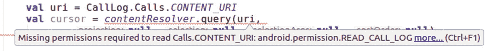

# 7.许可

保护敏感数据是应用开发过程中的一项重要任务。随着越来越多的手持设备上的应用被用于银行等敏感的日常任务，安全性变得越来越重要，并且在未来将继续如此。作为开发人员，你必须采取一切可能的预防措施，负责任地处理你的应用用户的数据。

完全涵盖每个可能的安全方面是一项具有挑战性的任务，它本身将会写满一整本书。幸运的是，有大量的在线资源可以让你了解 Android 操作系统安全问题的最新进展。只是要谨慎过滤掉不合适的信息。Android 操作系统在线资源中的以下安全相关主题是一个很好的起点:

```java
https://developer.android.com/training/best-security.html
https://developer.android.com/training/best-permissions-ids.html

```

如果这些链接在你阅读这本书时被破坏了，在你最喜欢的搜索引擎中搜索 *android 最佳实践安全*和 *android 最佳实践权限*，你会很容易找到这些资源。

话虽如此，我们仍然希望彻底解决 Android 操作系统中的*权限*系统，因为一旦你的应用处理敏感数据，这绝对是你作为一名开发人员必须有宾至如归的感觉的地方。权限增加了系统数据和功能的安全性；您可以使用预定义的权限，自己定义它们，或者通过在`AndroidManifest.xml`中编写适当的条目来声明它们。

## 权限类型

根据所需的保护级别，权限有几种类型。

*   *正常*:该级别对应低级别安全敏感信息。系统会自动授予此类权限，无需明确询问用户，但权限列在包描述中，可以使用系统设置 app 明确需求查询。

*   *危险*:该级别对应高级安全敏感信息。用户将被询问是否允许使用该权限。一旦允许某个应用，将会保存该许可，并且不会再次询问用户，直到重新安装该应用或使用“系统设置”应用明确撤销许可。

*   *签名*:该级别对应的是极高级别的安全敏感信息。只有使用与定义权限的应用相同的证书签名的应用才能获取它。系统将检查签名是否匹配，然后自动授予许可。这个级别只对同一个开发者开发的应用集合有意义。

*   *特殊*:对于一些用例，系统仅通过带外采集方法授予对某些系统资源的访问权。也就是说，对于权限`SYSTEM_ALERT_WINDOW`和`WRITE_SETTINGS`，您必须在清单*中声明它们，并且*调用特殊意图来获取它们。你给`SYSTEM_ALERT_WINDOW`用的意向动作是`Settings.ACTION_MANAGE_OVERLAY_PERMISSION`，给`WRITE_SETTINGS`用的意向动作是`Settings.ACTION_MANAGE_WRITE_SETTINGS`。只有在绝对必要的情况下，你的应用才应该使用这两个。

*   *特权或系统专用*:这些用于系统映像应用。你不应该使用它们。

权限集中在权限组中。其思想是，一旦用户接受了来自 G1 组的权限 A 的权限请求，就不需要对同一 G1 组的另一权限 B 进行另一权限查询。从用户体验的角度来看，只有当我们谈论危险类型的权限时，权限组才显示出效果；普通权限的权限组没有影响。

### 注意

权限到权限组的映射可能会随着 Android 的未来版本而改变。因此你的应用不应该依赖这样的映射。从开发的角度来看，您应该忽略权限组，除非您定义了自己的权限和权限组。

## 定义权限

Android 操作系统包括许多由各种内置应用或操作系统本身定义的权限。此外，作为开发人员，您可以定义自己的权限来保护应用或部分应用。

至于内置权限，是由系统定义的，如果你的 app 需要其中的一个或几个，你就声明使用它们(参见在线文字伴侣的“权限”部分)。然后，系统将根据保护级别决定如何处理这些权限请求。如果你的应用将敏感信息暴露给其他应用或系统，并且它不是由应用使用的权限*处理的，你可以在`AndroidManifest.xml`中定义你自己的权限。*

```java
<permission android:description="string resource"
      android:icon="drawable resource"
      android:label="string resource"
      android:name="string"
      android:permissionGroup="string"
      android:protectionLevel=["normal" | "dangerous" |
              "signature" | "signatureOrSystem"] />

```

在线文本指南的“清单顶级条目”一节中介绍了这些属性的含义。最起码，您必须提供`name`和`protectionLevel`属性，但是添加一个标签、图标和描述来帮助您的用户理解权限的作用无疑是一个好主意。

如果需要对权限进行分组，可以使用两种方法之一。

*   使用`<permission-group>`元素并将`permissionGroup`属性添加到`<permission>`；请参阅联机文本指南中的“清单顶级条目”一节。

*   使用`<permission-tree>`元素并相应地命名您的权限；请参见联机文本指南中的“清单顶级条目”一节。

如果您随后获得了某个组的权限，则来自同一组的同级权限将隐式包含在授予中。

### 警告

为了遵守安全准则，并使你的应用设计清晰稳定，请将你自己定义的权限数量保持在最低限度。

## 使用权限

要使用权限，在您的`AndroidManifest.xml`文件中添加一个或多个，如下所示:

```java
<uses-permission android:name="string"
      android:maxSdkVersion="integer" />

```

或者，如果您需要为 API 级别 23 或更高(Android 6.0)指定权限，请使用:

```java
<uses-permission-sdk-23 android:name="string"
      android:maxSdkVersion="integer" />

```

在这两种情况下，`name`属性指定了权限名称，而`maxSdkVersion`是该权限需求将考虑的最大 API 级别。这个特殊的`<uses-permission-sdk23>`元素来自 Android 6.0 权限语义的一个重大变化。如果您不在乎这种区别，就省略`maxSdkVersion`属性。

问题是，我们如何知道我们的应用到底需要哪些权限？答案有三个部分。



图 7-1

Android Studio 告诉你一个权限要求

*   Android Studio 告诉你你的应用需要一个权限。例如，如果你写了以下代码，Android Studio 会告诉你需要一定的许可(图 [7-1](#Fig1) ):

    ```java
    val uri = CallLog.Calls.CONTENT_URI
    val cursor = contentResolver.query(
              uri, null, null, null, null)

    ```

*   在开发和测试期间，你的应用崩溃了，在日志中你会看到这样一个条目:

    ```java
    Caused by: java.lang.SecurityException: Permission
    Denial: opening provider
    com.android.providers.contacts.CallLogProvider
    from
    ProcessRecord{faeda9c 4127:de.pspaeth.cp1/u0a96}
    (pid=4127, uid=10096) requires
    android.permission.READ_CALL_LOG or
    android.permission.WRITE_CALL_LOG

    ```

*   系统权限列表告诉您，您需要特定任务的特定权限。见表 [7-1](#Tab1) 。

一旦在顶层元素`<uses-permission>`中声明了权限的用法，它仍然必须连接到应用的组件。如果您想将权限一次连接到所有组件，这可以发生在`<application>`元素内部，或者更好的是，基于每个组件。在这两种情况下，都要在`permission`属性中声明权限，如下所示:

表 7-1

系统权限

<colgroup><col class="tcol1"> <col class="tcol2"> <col class="tcol3"></colgroup> 
| 

同意

 | 

组

 | 

描述

 |
| --- | --- | --- |
| `READ_CALENDAR` | `CALENDAR` | 允许阅读日历。清单条目:`android.permission.READ_CALENDAR` |
| `WRITE_CALENDAR` | `CALENDAR` | 允许写日历。清单条目:`android.permission.READ_CALENDAR` |
| `CAMERA` | `CAMERA` | 允许访问摄像机。清单条目:`android.permission.CAMERA` |
| `READ_CONTACTS` | `CONTACTS` | 从联系人表中读取。清单条目:`android.permission.READ_CONTACTS` |
| `WRITE_CONTACTS` | `CONTACTS` | 写入联系人表。清单条目:`android.permission.WRITE_CONTACTS` |
| `GET_ACCOUNTS` | `CONTACTS` | 允许从帐户服务中列出帐户。清单条目:`android.permission.GET_ACCOUNTS` |
| `ACCESS_FINE_LOCATION` | `LOCATION` | 允许应用访问细粒度的位置。清单条目:`android.permission.ACCESS_FINE_LOCATION` |
| `ACCESS_COARSE_LOCATION` | `LOCATION` | 允许应用访问大致位置。清单条目:`android.permission.ACCESS_COARSE_LOCATION` |
| `RECORD_AUDIO` | `MICROPHONE` | 允许录制音频。清单条目:`android.permission.RECORD_AUDIO` |
| `READ_PHONE_STATE` | `PHONE` | 允许读取电话状态(设备的电话号码、当前蜂窝网络信息、任何正在进行的呼叫的状态以及设备上注册的任何`PhoneAccounts`的列表)。清单条目:`android.permission.READ_PHONE_STATE` |
| `READ_PHONE_NUMBERS` | `PHONE` | 读取访问设备的电话号码。清单条目:`android.permission.READ_PHONE_NUMBERS` |
| `CALL_PHONE` | `PHONE` | 允许应用不通过拨号器用户界面发起电话呼叫。清单条目:`android.permission.CALL_PONE` |
| `ANSWER_PHONE_CALLS` | `PHONE` | 允许应用接听来电。清单条目:`android.permission.ANSWER_PHONE_CALLS` |
| `READ_CALL_LOG` | `PHONE` | 允许从呼叫日志表中读取。清单条目:`android.permission.READ_CALL_LOG` |
| `WRITE_CALL_LOG` | `PHONE` | 允许写入呼叫日志表。清单条目:`android.permission.WRITE_CALL_LOG` |
| `ADD_VOICEMAIL` | `PHONE` | 允许添加语音邮件。清单条目:`com.android.voicemail.permission.ADD_VOICEMAIL` |
| `USE_SIP` | `PHONE` | 允许使用 SIP 服务。清单条目:`android.permission.USE_SIP` |
| `PROCESS_OUTGOING_CALLS` | `PHONE` | 允许应用在拨出呼叫时看到正在拨打的号码，并可以选择将呼叫重定向到不同的号码或中止呼叫。清单条目:`android.permission.PROCESS_OUTGOING_CALLS` |
| `BODY_SENSORS` | `SENSORS` | 允许应用访问来自传感器的数据，用户使用这些数据来测量他们体内发生的情况。清单条目:`android.permission.BODY_SENSORS` |
| `SEND_SMS` | `SMS` | 允许发送短信。清单条目:`android.permission.SEND_SMS` |
| `RECEIVE_SMS` | `SMS` | 允许接收短信。清单条目:`android.permission.RECEIVE_SMS` |
| `READ_SMS` | `SMS` | 允许阅读短信。清单条目:`android.permission.READ_SMS` |
| `RECEIVE_WAP_PUSH` | `SMS` | 允许接收 WAP 服务信息。清单条目:`android.permission.RECEIVE_WAP_PUSH` |
| `RECEIVE_MMS` | `SMS` | 允许接收彩信。清单条目:`android.permission.RECEIVE_MMS` |
| `READ_EXTERNAL_STORAGE` | `STORAGE` | 允许从外部存储器读取。仅当 API 水平低于 19 时才需要。清单条目:`android.permission.READ_EXTERNAL_STORAGE` |
| `WRITE_EXTERNAL_STORAGE` | `STORAGE` | 允许写入外部存储器。仅当 API 水平低于 19 时才需要。清单条目:`WRITE_EXTERNAL_STORAGE` |

```java
...
<activity android:name=
        "com.example.myapp.ExampleActivity"
    android:permission=
        "com.eample.myapp.abcPermission"/>
...

```

## 获取权限

Android 操作系统处理权限的方式已经改变。在 Android 6.0(API 23 级)之前，询问用户的权限询问发生在安装过程中。从 API 级别 23 开始，发生了一个范式变化:权限查询发生在应用运行时。这使得许可系统更加灵活；你的应用的用户可能永远不会使用它的某些部分，因此请求允许这样做可能会惹恼他们。

这种方法的缺点是需要更多的编程工作。运行时权限查询必须包含在您的代码中。为此，在需要许可之前的任何合适的地方，添加以下内容:

```java
val activity = this
val perm = Manifest.permission.CAMERA
val cameraPermReturnId = 7239 // any suitable constant
val permissionCheck = ContextCompat.checkSelfPermission(
      activity, perm)
if (permissionCheck !=
          PackageManager.PERMISSION_GRANTED) {
    // Should we show an explanation?
  if (ActivityCompat.
      shouldShowRequestPermissionRationale(
            activity, perm)) {
      // Show an explanation to the user
      // *asynchronously* -- don't block
      // this thread waiting for the user's
      // response! After the user sees the
      // explanation, try again to request
      // the permission.
      val dialog = AlertDialog.Builder(activity) ...
             .create()
      dialog.show()
  } else {
      // No explanation needed, we can request
      // the permission.
      ActivityCompat.requestPermissions(activity,
            arrayOf(perm), cameraPermReturnId)
      // cameraPermReturnId is an app-defined
      // int constant. The callback method gets
      // the result of the request.
    }
}

```

该代码执行以下操作:

*   首先，我们检查许可是否已经被授予。如果之前授予了权限，则不会再次询问用户，除非重新安装应用或明确撤销权限。

*   `ActivityCompat.shouldShowRequestPermissionRationale()`方法检查是否应该向用户显示基本原理。这背后的想法是，如果用户拒绝权限查询请求几次，他们可能已经这样做了，因为对权限的需求没有得到很好的理解。在这种情况下，应用有机会告诉用户更多关于权限需求的信息。`shouldShowRequestPermissionRationale()`返回`true`的频率取决于 Android 操作系统。这里的例子显示了一个对话；您当然可以在这里做任何您想做的事情来通知用户。

*   `ActivityCompat.requestPermissions(...)`方法最后执行权限查询。这是异步发生的，所以调用会立即返回。

一旦对`ActivityCompat.requestPermissions(...)`的调用发生，用户就会被 Android 操作系统在你的应用之外询问他们是否想要授予许可。其结果将显示在异步回调方法中，如下所示:

```java
override
fun onRequestPermissionsResult(
      requestCode: Int, permissions: Array<String>,
      grantResults: IntArray) {
   when (requestCode) {
     cameraPermReturnId -> {
       // If request is canceled, the result
       // arrays are empty. Here we know it just
       // can be one entry
       if ((grantResults.isNotEmpty()
             && grantResults[0] ==
                 PackageManager.PERMISSION_GRANTED)) {
         // permission was granted
         // act accordingly...
       } else {
         // permission denied
         // act accordingly...
       }
       return
    }
    // Add other 'when' lines to check for other
    // permissions this App might request.
    else -> {
      // Ignore all other requests.
      // Or whatever makes sense to you.
    }
  }
}

```

这个方法需要在一个`android.content.Activity`类中实现。在其他情况下，这是不可能的。

## 获取特殊权限

在某些情况下使用`ActivityCompat.requestPermissions()`不足以获得权限`SYSTEM_ALERT_WINDOW`和`WRITE_SETTINGS`。对于这两种权限，您需要遵循不同的方法。

API 等级 23 及更高等级的许可`WRITE_SETTINGS`必须通过以下特殊方式获得:

```java
val backFromSettingPerm = 6183    // any suitable constant
if (Build.VERSION.SDK_INT >= Build.VERSION_CODES.M) {
    val activity = this
    if (!Settings.System.canWrite(activity)) {
        // This is just a suggestion: present a special
        // dialog to the user telling about the special
        // permission. Important is the Activity start
        AlertDialog dialog =
          new AlertDialog.Builder(activity)
            .setTitle(...)
            .setMessage(...)
            .setPositiveButton("OK", { dialog, id ->
                val intent = Intent(
                   Settings.ACTION_MANAGE_WRITE_SETTINGS)
                intent.data = Uri.parse("package:" +
                   getPackageName())
                 activity.startActivityForResult(intent,
                   backFromSettingPerm)
            }).setNegativeButton("Cancel",
                { dialog, id ->
                  // ...
            })
            .create();
         dialog.show();
         systemWillAsk = true;
    }
} else {
    // do as with any other permissions...
}

```

一旦达到这个目的，回调方法`onActivityResult()`就可以用来继续 GUI 流。

```java
override
protected fun onActivityResult(requestCode:Int,
      resultCode:Int, data:Intent) {
  if ((requestCode and 0xFFFF) == backFromSettingPerm) {
      if (resultCode == Activity.RESULT_OK) {
         // act accordingly...
      }
  }
}

```

对于`SYSTEM_ALERT_WINDOW`权限，您必须遵循相同的方法，但是使用`ACTION_MANAGE_OVERLAY_PERMISSION`来创建内容。

### 注意

对于这种特殊的`SYSTEM_ALERT_WINDOW`权限，如果应用是从 Google Play 商店安装的，并且 API 级别为 23 或更高，Google Play 商店将自动授予该权限。对于本地开发和测试，您必须使用所描述的意图。

## 功能要求和权限

在第 [2](02.html) 章中，我们看到通过`AndroidManifest.xml`中的`<uses-feature>`元素，你可以指定你的应用将使用哪些特性。这些信息对于 Google Play 商店了解您的应用发布后可以在哪些设备上运行非常重要。然而，如果您指定了这个需求，还有另一个重要的方面需要考虑:这些需求将隐含哪些权限，以及如何根据所使用的 API 级别来处理这些权限？

特性常量和 API 级别并不一定严格相关。比如在 API level 8 中加入了`android.hardware.bluetooth`功能，但是在 API level 5 中加入了相应的蓝牙 API。正因为如此，一些应用在能够使用`<uses-feature>`声明来声明它们需要 API 之前就已经能够使用 API 了。为了弥补这种差异，Google Play 假设某些硬件相关的权限表明默认情况下需要底层硬件功能。例如，使用蓝牙的应用必须请求在`<uses-permission>`元素中的`BLUETOOTH`权限，对于针对旧 API 级别的应用，Google Play 假设权限声明意味着应用需要底层的`android.hardware.bluetooth`功能。表 [7-2](#Tab2) 列出了隐含这些特性要求的权限。

请注意，`<uses-feature>`声明优先于表 [7-2](#Tab2) 中权限所隐含的特性。对于这些权限中的任何一个，您都可以通过在一个具有`android:required=”false”`属性的`<uses-feature>`元素中显式声明隐含特性来禁用基于隐含特性的过滤。例如，要禁用任何基于`CAMERA`权限的过滤，您可以将它添加到清单文件中:

表 7-2

暗示功能要求的权限

<colgroup><col class="tcol1"> <col class="tcol2"> <col class="tcol3"></colgroup> 
| 

种类

 | 

同意...

 | 

...隐含特征

 |
| --- | --- | --- |
| 蓝牙 | `BLUETOOTH` | `android.hardware.bluetooth` |
| `BLUETOOTH_ADMIN` | `android.hardware.bluetooth` |
| 照相机 | `CAMERA` | `android.hardware.camera`和`android.hardware.camera.autofocus` |
| 位置 | `ACCESS_MOCK_LOCATION` | `android.hardware.location` |
| `ACCESS_LOCATION_EXTRA_COMMANDS` | `android.hardware.location` |
| `INSTALL_LOCATION_PROVIDER` | `android.hardware.location` |
| `ACCESS_COARSE_LOCATION` | `android.hardware.locationandroid.hardware.location.network` (API 等级< 21) |
| `ACCESS_FINE_LOCATION` | `android.hardware.locationandroid.hardware.location.gps` (API 等级< 21) |
| 麦克风 | `RECORD_AUDIO` | `android.hardware.microphone` |
| 电话 | `CALL_PHONE` | `android.hardware.telephony` |
| `CALL_PRIVILEGED` | `android.hardware.telephony` |
| `MODIFY_PHONE_STATE` | `android.hardware.telephony` |
| `PROCESS_OUTGOING_CALLS` | `android.hardware.telephony` |
| `READ_SMS` | `android.hardware.telephony` |
| `RECEIVE_SMS` | `android.hardware.telephony` |
| `RECEIVE_MMS` | `android.hardware.telephony` |
| `RECEIVE_WAP_PUSH` | `android.hardware.telephony` |
| `SEND_SMS` | `android.hardware.telephony` |
| `WRITE_APN_SETTINGS` | `android.hardware.telephony` |
| `WRITE_SMS` | `android.hardware.telephony` |
| 无线网络 | `ACCESS_WIFI_STATE` | `android.hardware.wifi` |
| `CHANGE_WIFI_STATE` | `android.hardware.wifi` |
| `CHANGE_WIFI_MULTICAST_STATE` | `android.hardware.wifi` |

```java
<uses-feature android:name="android.hardware.camera"
              android:required="false" />

```

## 使用终端的权限处理

要查看您在设备上注册的权限，您可以浏览“系统设置”应用中的应用列表，或者更简单地使用 ADB shell 在终端中获取各种与权限相关的信息。

为此，通过 USB 将硬件设备连接到您的笔记本电脑或 PC，打开终端，`cd`到 SDK 安装中的`platform-tools`文件夹，在`./adb devices`中找到您的设备，然后输入以下内容:

```java
./adb shell -s <DEVICE-NAME>

```

如果只有一个设备，可以省略`-s`开关。

一旦进入 shell，您可以使用几个命令来获取权限信息。首先，您可以列出通过以下方式安装的所有软件包:

```java
cmd package list package

```

若要显示所有危险的权限，查看特定包的权限状态，或者授予或撤销一个或多个权限，可以使用以下内容:

```java
cmd package list permissions -d -g
dumpsys package <PACKAGE-NAME>
pm [grant|revoke] <PERMISSION-NAME> ...

```

### 注意

当前版本的`dumpsys`将显示请求的*和授予的*权限。不要被关于此事的旧博客条目所迷惑。