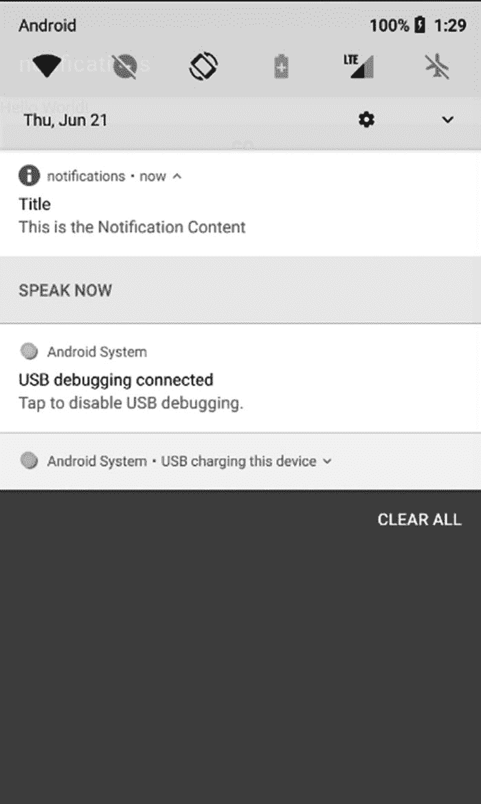
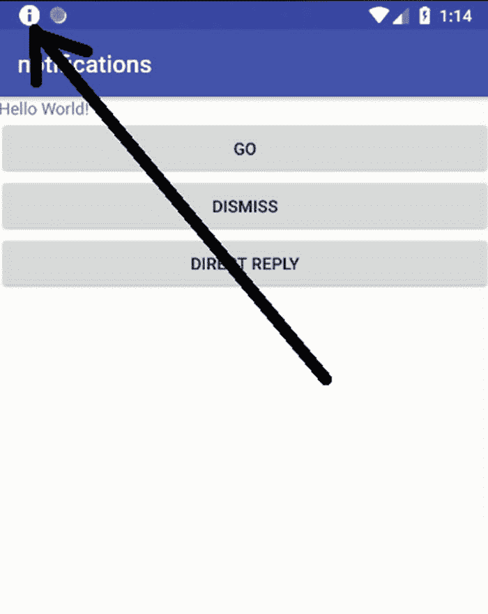
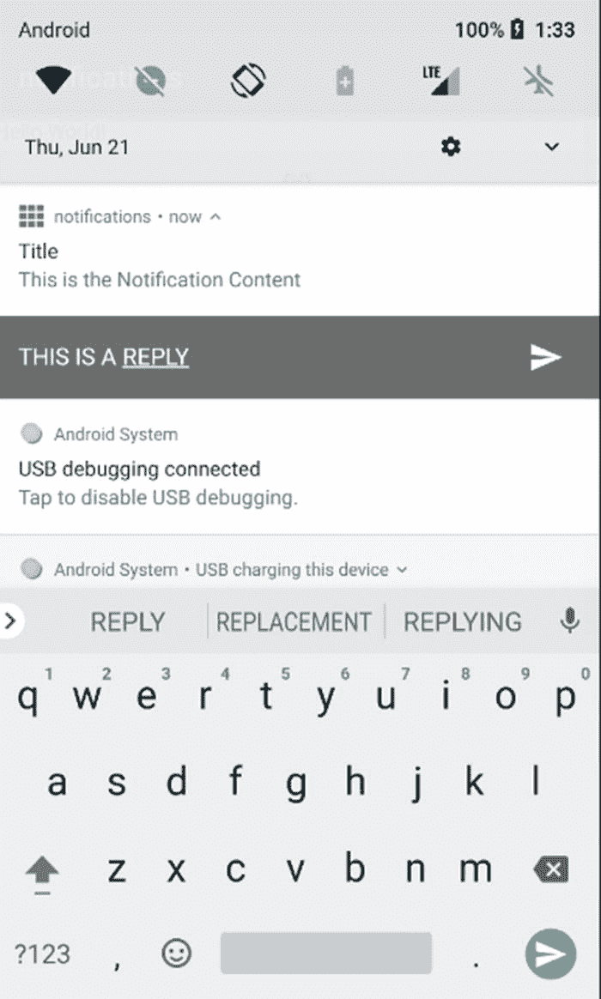
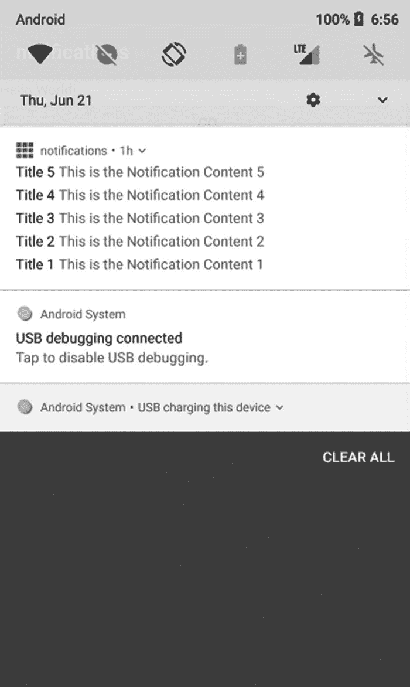
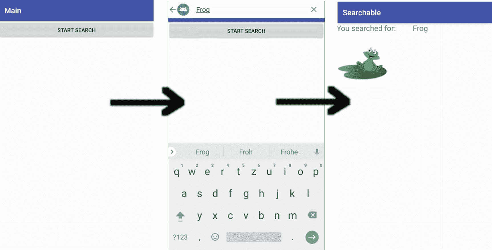
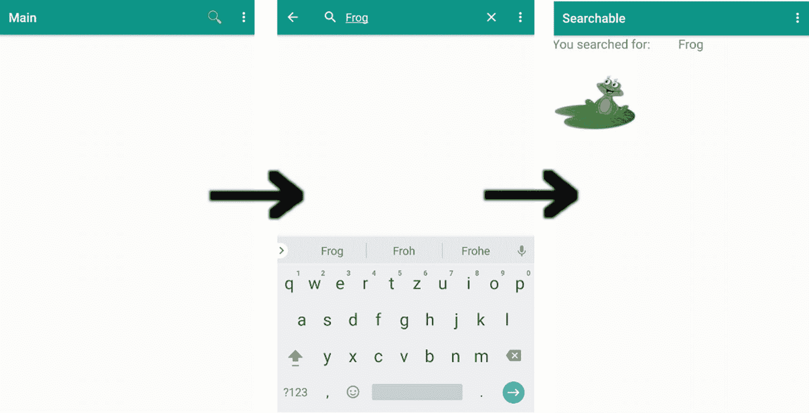
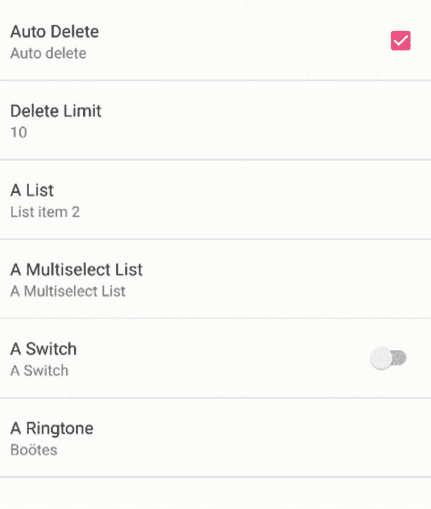

# 八、API

本章的主题是介绍 API，它是你的应用的基石。这些 API 包括以下内容:

*   数据库

*   行程安排

*   装载机

*   通知

*   警报管理器

*   联系人

*   搜索框架

*   位置和地图

## 数据库

Android 为处理数据库提供了两个领域:要么使用 Android OS 中包含的 SQLite 库，要么使用 Room architecture 组件。推荐使用后者，因为它在数据库和客户机之间增加了一个抽象层，简化了 Kotlin 对象和数据库存储对象之间的映射。您可以在在线文档中找到关于 SQLite 的详尽信息，也可以在网上找到很多例子。在本书中，我们讨论空间，因为由抽象引发的关注点分离有助于您编写更好的代码。此外，因为 Room 有助于避免样板代码，所以如果使用 Room 而不是 SQLite，就可以大大缩短数据库代码。

### 为房间配置您的环境

因为 Room 是一个支持架构组件，所以您必须在 Android Studio 构建脚本中配置它。为此，打开模块的`build.gradle`文件(不是项目中的文件！)并在顶层(不在任何花括号内)编写以下内容:

```kt
apply plugin: 'kotlin-kapt'

```

这是支持注释处理的 Kotlin 编译器插件。在`dependencies`部分，写下以下内容(三行；删除`implementation`和`kapt`后的换行符:

```kt
// Room
implementation
    "android.arch.persistence.room:runtime:1.0.0"
kapt
    "android.arch.persistence.room:compiler:1.0.0"

```

### 房间建筑

房间的设计考虑了易用性；你基本上处理三种对象。

*   *数据库*:表示数据库的持有者。用 SQL 语言的习惯用语来说，它包含了几个表。用一种技术不可知的方式来说，一个数据库包含几个实体容器。

*   *实体*:表示 SQL 世界中的一个表。从技术不可知的角度来说，这是一个以使用为中心的字段集合。例如，公司内部的员工或联系人持有关于如何与他人或合作伙伴通信的信息。

*   *数据访问对象(DAO)* :包含从数据库中检索数据的访问逻辑。因此，它充当程序逻辑和数据库模型之间的接口。每个实体类通常有一个 DAO，但是对于不同的组合可能有更多的 DAO。例如，您可以为两个雇员和联系人实体设置一个`EmployeeDao`和一个`ContactDao`，以及一个组合了雇员和联系人信息的`PersonDao`。

### 数据库

要声明数据库，您需要编写以下代码:

```kt
import android.arch.persistence.room.*

@Database(entities =
    arrayOf(Employee::class, Contact::class),
    version = 1)
abstract class MyDatabase : RoomDatabase() {
    abstract fun employeeDao(): EmployeeDao
    abstract fun contactDao(): ContactDao
    abstract fun personDao(): PersonDao
}

```

在`@Database`注释中，您声明了所有使用的实体类，并且作为抽象函数，您为 DAO 类提供了工厂方法。您不必实现这个抽象数据库类。房间库将根据签名和注释自动为您提供实现！当升级到不同的数据模型版本时，版本号将对您有所帮助；在接下来的几节中，您将了解到更多相关内容。

### 实体

接下来我们实现实体类，这在 Kotlin 中非常容易。

```kt
@Entity
data class Employee(
    @PrimaryKey(autoGenerate = true) var uid:Int = 0,
    var firstName:String,
    var lastName:String)

@Entity
data class Contact(
    @PrimaryKey(autoGenerate = true) var uid:Int = 0,
    var emailAddr:String)

```

您可以看到，我们需要为每个实体设置一个类型为`Int`的主键。`autoGenerate = true`负责自动使其独一无二。

由这些实体类定义的数据库表中的列名与变量名相匹配。如果你想改变它，你可以添加另外一个注释:`@ColumnInfo`。

```kt
@Entity
data class Employee(
    @PrimaryKey(autoGenerate = true) var uid:Int = 0,
    @ColumnInfo(name = "first_name") var firstName:String,
    @ColumnInfo(name = "last_name") var lastName:String)

```

这将导致使用`first_name`和`last_name`作为表的列名。

同样，表名取自实体类名，比如这些例子中的`Employee`和`Contact`。你也可以改变这一点；只需将参数`tableName`添加到`@Entity`注释中，如下所示:

```kt
@Entity(tableName = "empl")
data class Employee(
    @PrimaryKey(autoGenerate = true) var uid:Int = 0,
    @ColumnInfo(name = "first_name") var firstName:String,
    @ColumnInfo(name = "last_name") var lastName:String)

```

虽然通常使用单个整数值主键是个好主意，但是也可以使用组合键。为此，在`@Entity`中有一个额外的注释参数。这里有一个例子:

```kt
@Entity(tableName = "empl",
        primaryKeys = tableOf("first_name","last_name"))
data class Employee(
    @ColumnInfo(name = "first_name") var firstName:String,
    @ColumnInfo(name = "last_name") var lastName:String)

```

实体也可以有不会被持久化的字段。从设计的角度来看，这可能不是一个好主意，但是如果您需要这样一个字段，您可以添加它并使用如下的注释`@Ignore`:

```kt
@Entity(tableName = "empl")
data class Employee(
    @PrimaryKey(autoGenerate = true) var uid:Int = 0,
    var firstName:String = "",
    var lastName:String = "",
    @Ignore var salary:Int)

```

由于 Room 的实现方式，如果添加这样的`@Ignore`注释，*所有的*字段都必须分配默认值，即使没有使用。

### 关系

房间设计不允许实体之间的直接关系。例如，您不能将一列`Contact`实体添加为`Employee`实体的类成员。但是，可以声明外键关系，这有助于保持数据的一致性。

为此，添加一个`foreignKeys`注释属性，如下面的代码片段所示:

```kt
@Entity(
        foreignKeys = arrayOf(
            ForeignKey(entity = Employee::class,
                 parentColumns = arrayOf( "uid" ),
                 childColumns = arrayOf( "employeeId" ),
                 onDelete = ForeignKey.CASCADE,
                 onUpdate = ForeignKey.CASCADE,
                 deferred = true)),
        indices = arrayOf(
             Index("employeeId"))
)
@Entity
data class Contact(
        @PrimaryKey(autoGenerate = true) var uid:Int = 0,
        var employeeId:Int,
        var emailAddr:String)

```

以下是关于这一结构的几点说明:

*   在 Java 中，你可以写`@Entity(foreignKeys = @ForeignKey( ... )`。Kotlin 不允许在注释中包含注释。在这种情况下，使用构造函数作为替代，这可以归结为省略内部注释的`@`。

*   在 Java 注释中，属性值数组的写法类似于`name = { ..., ... }`。这不能在 Kotlin 中使用，因为花括号不充当数组初始值设定项。相反，使用了`arrayOf(...)`库方法。

*   `childColumns`属性指向*这个*实体中的引用键，在本例中为`Contact.employeeId`。

*   `parentColumns`属性指向被引用的外键实体，在本例中是`Employee.uid`。

*   `onDelete`属性告诉当父节点被删除时该做什么。值为`ForeignKey.CASCADE`意味着也自动删除所有子代，即关联的`Contact`实体。可能的值如下:
    *   `CASCADE`:将所有动作传输到父子关系树的根。

    *   什么都不要做。这是默认设置，如果关系因为更新或删除操作而中断，它会导致一个异常。

    *   `RESTRICT`:类似于`NO_ACTION`，但是当发生删除或更新时会立即进行检查。

    *   `SET_NULL`:如果发生父删除或更新，所有子键列都被设置为`null`。

    *   `SET_DEFAULT`:如果发生父删除或更新，所有子键列都被设置为默认值。

*   `onUpdate`属性告诉当父节点被更新时该做什么。值`ForeignKey.CASCADE`意味着也自动更新所有子代，这些子代是关联的`Contact`实体。可能的值与`onDelete`相同。

*   `deferred = true`设置将延迟一致性检查，直到数据库事务被提交。例如，如果父事务和子事务都在同一个事务中创建，这可能很重要。

*   外键必须是相应索引的一部分。这里`Contact.employeeId`获取索引。在接下来的几节中，您将了解更多关于索引的内容。

### 嵌套对象

尽管除了通过外键手动定义对象间关系之外，不可能定义对象间关系，但是您可以在对象端定义层次对象的嵌套。例如，来自以下雇员实体:

```kt
@Entity
data class Employee(
    @PrimaryKey(autoGenerate = true) var uid:Int = 0,
    var firstName:String,
    var lastName:String)

```

您可以将名和姓分离出来，改为写以下内容:

```kt
data class Name(var firstName:String, var lastName:String)

@Entity
data class Employee(
    @PrimaryKey(autoGenerate = true) var uid:Int = 0,
    @Embedded var name:Name)

```

请注意，这对数据模型的数据库端没有任何影响。关联的表仍然有列`uid`、`firstName`和`lastName`。由于这种嵌入对象的数据库标识与其字段的名称相关联，如果您有几个相同嵌入类型的嵌入对象，您必须使用如下的`prefix`属性来消除名称的歧义:

```kt
data class Name(var firstName:String, var lastName:String)

@Entity
data class Employee(
    @PrimaryKey(autoGenerate = true) var uid:Int = 0,
    @Embedded var name:Name,
    @Embedded(prefix="spouse_") var spouseName:Name)

```

这使得表格具有列`uid`、`firstName`、`lastName`、`spouse_firstName`和`spouse_lastName`。

如果您愿意，可以在可嵌入的类中使用房间注释。例如，您可以使用`@ColumnInfo`注释来指定定制的列名。

```kt
data class Name(
  @ColumnInfo(name = "first_name") var firstName:String,
  @ColumnInfo(name = "last_name") var lastName:String)

@Entity
data class Employee(
    @PrimaryKey(autoGenerate = true) var uid:Int = 0,
    @Embedded var name:Name)

```

### 使用索引

为了提高数据库查询性能，您可以声明一个或多个索引，用于某些字段或字段组合。对于唯一键，您不必这样做；这是自动为您完成的。但是对于您想要定义的任何其他索引，请编写如下内容:

```kt
@Entity(indices = arrayOf(
    Index("employeeId"),
    Index(value = arrayOf("country","city"))
    )
)
data class Contact(
        @PrimaryKey(autoGenerate = true) var uid:Int = 0,
        var employeeId:Int,
        var emailAddr:String,
        var country:String,
        var city:String)

```

这增加了一个索引，允许使用外键字段`employeeId`进行快速查询，并增加了另一个索引，用于给定国家和城市的快速查询。

如果您将`unique = true`作为属性添加到`@Index`注释中，Room 将确保该表中不能有两个条目对于该特定索引具有相同的值。例如，我们可以向`Employee`添加一个社会保险号(SSN)字段，并为其定义一个唯一的索引，如下所示:

```kt
@Entity(indices = arrayOf(
    Index(value = arrayOf("ssn"), unique = true)
    )
)
data class Employee(
    @PrimaryKey(autoGenerate = true) var uid:Int = 0,
    var ssn:String,
    @Embedded var name:Name)

```

如果您现在试图向数据库中添加两个具有相同 SSN 的雇员，Room 将抛出一个异常。

### 数据访问:DAOs

数据访问对象(Dao)提供了访问数据库的逻辑。我们已经看到，在数据库声明中，我们必须列出工厂方法中的所有 Dao，如下所示:

```kt
@Database(entities =
    arrayOf(Employee::class, Contact::class),
    version = 1)
abstract class MyDatabase : RoomDatabase() {
    abstract fun employeeDao(): EmployeeDao
    abstract fun contactDao(): ContactDao
    abstract fun personDao(): PersonDao
}

```

在这个例子中，我们声明了三个 Dao 供 Room 使用。对于实际的实现，我们不需要完全成熟的 DAO 类。声明接口或抽象类就够了，Room 会为我们完成剩下的工作。

例如，以下实体的 DAO 类:

```kt
@Entity
data class Employee(
    @PrimaryKey(autoGenerate = true) var uid:Int = 0,
    @ColumnInfo(name = "first_name") var firstName:String,
    @ColumnInfo(name = "last_name") var lastName:String)

```

可能看起来像这样:

```kt
@Dao
interface EmployeeDao {
    @Query("SELECT * FROM employee")
    fun getAll(): List<Employee>

    @Query("SELECT * FROM employee" +
        " WHERE uid IN (:uIds)")
    fun loadAllByIds(uIds: IntArray): List<Employee>

    @Query("SELECT * FROM employee" +
        " WHERE last_name LIKE :name")
    fun findByLastName(name: String): List<Employee>

    @Query("SELECT * FROM employee" +
        " WHERE last_name LIKE :lname AND " +
        "       first_name LIKE :fname LIMIT 1")
    fun findByName(lname: String, fname: String): Employee

    @Query("SELECT * FROM employee" +
        " WHERE uid = :uid")
    fun findById(uid: Int): Employee

    @Insert
    fun insert(vararg employees: Employee): LongArray

    @Update
    fun update(vararg employees: Employee)

    @Delete
    fun delete(vararg employees: Employee)
}

```

您可以看到我们在这里使用了一个接口，这是可能的，因为完整的访问逻辑是由方法签名和注释定义的。同样，对于插入、更新和删除，方法签名是所有房间需要的；它会通过查看签名向数据库发送正确的命令。

对于各种查询方法，我们使用`@Query`注释来提供正确的数据库命令。您可以看到，Room 足够智能，可以看出我们是要返回对象列表还是单个对象。此外，我们可以通过使用`:name`标识符将方法参数传递给伪 SQL。

`@Insert`注释允许添加属性`onConflict = "<strategy>"`,在这里您可以指定如果因为违反了惟一或主键约束而发生冲突时该做什么。常量内部给出了`<strategy>`的可能值:

*   `OnConflictStrategy.ABORT`中止交易

*   `OnConflictStrategy.FAIL`交易失败

*   `OnConflictStrategy.IGNORE`忽略冲突

*   `OnConflictStrategy.REPLACE`仅替换实体，否则继续交易

*   `OnConflictStrategy.ROLLBACK`回滚事务

前面使用的示例实体中的其他 Dao 看起来类似。`PersonDao`可能会执行外部连接来合并雇员和联系人实体:

```kt
@Dao
interface ContactDao {
    @Insert
    fun insert(vararg contacts: Contact)

    @Query("SELECT * FROM Contact WHERE uid = :uId")
    fun findById(uId: Int): List<Contact>

    @Query("SELECT * FROM Contact WHERE" +
           " employeeId = :employeeId")
    fun loadByEmployeeId(employeeId: Int): List<Contact>
}

data class Person(@Embedded var name:Name?,
                  var emailAddr: String?)
@Dao
interface PersonDao {
    @Query("SELECT * FROM empl" +
           " LEFT OUTER JOIN Contact ON" +
           "     empl.uid = Contact.employeeId" +
           " WHERE empl.uid = :uId")
    fun findById(uId: Int): List<Person>
}

```

### 可观察的查询

除了在查询发生时使用返回的实体或实体列表或实体数组执行查询之外，还可以检索查询结果*加上*注册一个观察器，当底层数据发生变化时会调用该观察器。

对于 DAO 类中的方法，实现这一点的构造如下所示:

```kt
@Query("SELECT * FROM employee")
    fun getAllSync(): LiveData<List<Employee>>

```

所以，你基本上在结果周围包装了一个`LiveData`类，这就是你可以对所有查询做的事情。

然而，只有当您添加相应的架构组件时，这才是可能的。为此，将以下内容添加到模块的`build.gradle`文件中:

```kt
implementation "android.arch.lifecycle:livedata:1.1.0"

```

这个`LiveData`对象现在允许添加一个观察者，如下所示:

```kt
val ld: LiveData<List<Employee>> =
      employeeDao.getAllSync()
ld.observeForever { l ->
    l?.forEach { empl ->
      Log.e("LOG", empl.toString())
      // do s.th. else with the employee
    }
}

```

如果您在观察者回调中更新 GUI 组件，这将非常有用。

### 警告

您的生产代码应该在做正确的内务处理方面做得更好。通过在代码中的适当位置调用`ld.removeObserver(...)`,`LiveData`对象应该取消观察者的注册。这里没有显示，因为我们只提供了代码片段，而内务处理必须在包含代码片段的代码*中完成。*

一个`LiveData`对象还允许添加一个绑定到生命周期对象的观察者。这是通过以下方式完成的:

```kt
val ld: LiveData<List<Employee>> =
      employeeDao.getAllSync()
val lcOwn : LifecycleOwner = ...
ld.observe(lcOwn, { l ->
    l?.forEach { empl ->
      Log.e("LOG", empl.toString())
      // do s.th. else with the employee
    }
} )

```

关于生命周期对象的详细信息，请查看`android.arch.lifecycle.LiveData`的在线 API 文档。

一种类似但可能更全面的方法是使用 RxJava/RxKotlin，这是 ReactiveX 的 Java/Kotlin 平台实现。这里我们不介绍 ReactiveX 编程，但是将它包含在查询中可以归结为将结果包装到 RxJava 对象中。举例来说，为了让您快速了解如何做到这一点，您可以编写以下代码:

```kt
@Query("SELECT * FROM employee" +
    " WHERE uid = :uid")
fun findByIdRx(uid: Int): Flowable<Employee> {
   [...] // Wrap query results into a Flowable
}

```

这将返回一个`Flowable`，允许*观察者*对*以异步方式对检索到的数据库行做出反应*。

要做到这一点，您必须在构建文件中包含 RxJava 支持(删除`implementation`后的换行符)。

```kt
// RxJava support for Room
Implementation
    "android.arch.persistence.room:rxjava2:1.0.0"

```

有关 RxKotlin 的更多详细信息，请参考关于 react vex 的在线资源或关于 react vex 的 Kotlin 语言绑定的 RxKotlin。

### 数据库客户端

为了在应用中包含 Room，我们需要知道如何获得数据库和 DAO 对象。为此，我们首先通过以下方式获取对数据库的引用:

```kt
fun fetchDb() =
    Room.databaseBuilder(
        this, MyDatabase::class.java,
        "MyDatabase.db")
    .build()
val db = fetchDb()

```

这将创建一个文件备份数据库。字符串参数是保存数据的文件的名称。如果要打开一个基于内存的数据库，比如出于测试目的，或者当应用停止时，您更喜欢速度而不是数据丢失，请使用下面的代码:

```kt
fun fetchDb() =
    Room.inMemoryDatabaseBuilder(
        this, MyDatabase::class.java)
    .build()
val db = fetchDb()

```

构建器允许以流畅的构建器风格进行某些配置活动。有趣的配置选项如表 [8-1](#Tab1) 所示。你只需在最后一次`.build()`呼叫前将它们锁住。在早期开发阶段，您可能经常使用的一个选项是通过使用以下方法放松前台操作限制:

表 8-1

房间生成器选项

<colgroup><col class="tcol1"> <col class="tcol2"></colgroup> 
| 

[计]选项

 | 

描述

 |
| --- | --- |
| `addCallback(RoomDatabase.Callback)` | 使用它向该数据库添加一个`RoomDatabase.Callback`。例如，您可以使用它在创建或打开数据库时执行一些代码。 |
| `allowMainThreadQueries()` | 使用它来禁用房间中没有主线程的限制。如果不使用这个，而试图在主线程中执行数据库操作，Room 会抛出异常。“空间”以这种方式运作是有充分理由的。GUI 相关的线程不应该因为冗长的数据库操作而被阻塞。因此，对于您的代码，您不应该调用此方法；只有在实验中避免处理异步性才有意义。 |
| `addMigrations(vararg Migration)` | 使用它来添加迁移计划。本章稍后将更详细地介绍迁移。 |
| `fallbackToDestructiveMigration()` | 如果缺少匹配的迁移计划(例如，对于从数据库中的数据版本*到`@Database`注释中指定的版本的必要升级，找不到注册的迁移计划)，Room 通常会抛出一个异常。如果您希望清除当前数据库，然后为新版本从头开始构建数据库，请使用此方法。* |
| `fallbackToDestructiveMigration(vararg Int)` | 这与`fallbackToDestructiveMigration()`相同，但仅限于某些起始版本。对于所有其他版本，如果缺少迁移计划，将会引发异常。 |

```kt
fun fetchDb() =
    Room.databaseBuilder(
        this, MyDatabase::class.java,
        "MyDatabase.db")
    .allowMainThreadQueries()
    .build()
val db = fetchDb()

```

然后，一旦有了数据库对象，只需以抽象的方式调用我们在数据库类内部定义的任何 DAO 工厂方法，Room 就会自动提供实现。例如，写下以下内容:

```kt
val db = ...
val employeeDao = db.employeeDao()
// use the DAO...

```

### 处理

房间允许在`EXCLUSIVE`模式下进行交易。这意味着，如果事务 A 正在进行，则在事务 A 完成之前，不允许其他进程或线程访问另一个事务 B 中的数据库。更准确地说，事务 B 必须等到 A 完成。

要在 Kotlin 的事务中运行一组数据库操作，可以编写以下代码:

```kt
val db = ...
db.runInTransaction { ->
    // do DB work...
}

```

如果闭包内的代码没有抛出任何异常，则事务被标记为“成功”。否则，事务将被回滚。

### 迁移数据库

要将数据库从应用的一个版本迁移到另一个版本，请在访问数据库时添加迁移计划，如下所示:

```kt
val migs = arrayOf(
  object : Migration(1,2) {
    override fun migrate(db: SupportSQLiteDatabase) {
      // code for the 1->2 migration...
      // this is already running inside a transaction,
      // don't add your own transaction code here!
    }
  }, object : Migration(2,3) {
    override fun migrate(db: SupportSQLiteDatabase) {
      // code for the 2->3 migration...
      // this is already running inside a transaction,
      // don't add your own transaction code here!
    }
  } // more migrations ...
    )

    private fun fetchDb() =
        Room.databaseBuilder(
              this, MyDatabase::class.java,
              "MyDatabase.db")
          .addMigrations(*migs)
          .build()

```

在这里使用 DAO 类显然是没有意义的，因为这样你就必须管理几个 DAO 变体，每个版本一个。这就是为什么在`migrate()`方法中，你需要在一个较低的层次上访问数据库，例如通过执行没有绑定到 Kotlin 对象的 SQL 语句。例如，假设您有一个`Employee`表。你从版本 1 升级到版本 2，需要增加一列`salary`，然后你从版本 2 升级到版本 3，需要另一列`childCount`。在前面代码中的`migs`数组内，您接着编写以下代码:

```kt
//...
object : Migration(1,2) {
  override fun migrate(db: SupportSQLiteDatabase) {
    db.execSQL("ALTER TABLE components "+
           "ADD COLUMN salary INTEGER DEFAULT 0;")
  }
}
//...
object : Migration(2,3) {
  override fun migrate(db: SupportSQLiteDatabase) {
    db.execSQL("ALTER TABLE components "+
           "ADD COLUMN childCount INTEGER DEFAULT 0;")
  }
}
//...
object : Migration(1,3) {
  override fun migrate(db: SupportSQLiteDatabase) {
    db.execSQL("ALTER TABLE components "+
           "ADD COLUMN salary INTEGER DEFAULT 0;")
    db.execSQL("ALTER TABLE components "+
           "ADD COLUMN childCount INTEGER DEFAULT 0;")
  }
}
//...

```

如果您同时提供小步迁移和大步迁移，则后者具有优先权。这意味着如果您有迁移计划 1 → 2、2 → 3 和 1 → 3，而系统要求迁移 1 → 3，则计划 1 → 3 将运行，而不是链 1 → 2 → 3。

## 行程安排

考虑到用户体验，以异步方式运行任务是一件重要的事情。至关重要的是，不要让冗长的操作扰乱前端流程，给人留下你的应用正在流畅地完成工作的印象。

然而，要编写稳定的应用，让重要的部分在后台运行并不容易。出现这种情况的原因有很多:设备可能会根据需要或因为电池电量低而关机，或者用户可能已经启动了一个更重要的优先级更高的应用，希望以低优先级模式临时运行后台作业。此外，Android 操作系统可能会因为其他原因(如资源短缺或超时条件适用)而决定中断或推迟后台作业。随着 Android 8 的出现，考虑执行后台任务的聪明方法变得更加重要，因为这个版本对程序部分的后台执行施加了严格的限制。

对于以异步方式运行作业，有几种技术，它们都有优缺点。

*   **Java 线程**

    Java 和 Kotlin 线程(记住，两者都针对同一个 Java 虚拟机)是一种在后台运行的底层技术。在 Kotlin 中，您可以使用这样简单的结构在后台线程中处理程序部分:

    ```kt
    Thread{-> do s.th.}.start()

    ```

    这是一种基本的方法，您可以从后台执行任务中获得高性能。然而，您已经完全耗尽了任何 Android OS 组件的生命周期，所以当 Android 进程的生命周期状态改变时，您并不能很好地控制长期运行的后台线程会发生什么。

*   **Java 并发类**

    Java 和 Kotlin 允许使用`java.util.concurrency`包中与并发相关的类。这是一种在后台运行的更高级的方法，具有改进的后台任务管理功能，但它仍然有超出 Android 组件生命周期控制的缺点。

*   报警管理器

    这最初是为在特定时间运行任务而设计的，如果您需要在特定时间向用户发送通知，可以使用它。从 API 级开始就有了。从 API level 19 (Android 4.4)开始，系统允许在某些情况下推迟警报。不利的一面是，你无法控制更一般的设备条件；当设备启动时，无论设备上发生了什么，它都会自行触发警报事件。

*   同步适配器

    这种方法是在 Android API level 5 中添加的。这对于同步任务特别有用。对于更一般的后台执行任务，您应该使用以下两种方法之一，Firebase JobDispatcher 或 JobScheduler。仅当您需要它提供的附加功能时，才使用其中之一。

*   **Firebase JobDispatcher**

    这是一个通用的多用途作业调度程序库，可以用于从 API 级别 14 开始的 Android 设备，目标是超过 99%的正在使用的 Android 设备。在网上找到 Firebase JobDispatcher 的全面完整的文档有点困难，但是您会找到足够多的例子来帮助您入门。尽管它不是 Android 操作系统核心的一部分，但它需要安装 Google Play 服务和 Google Play 商店。

*   **作业调度器**

    这是一个用于在 Android 操作系统上调度作业的集成库。它可以在任何 API 等级为 21 的设备上运行，这适用于 85%的 Android 设备。强烈推荐使用，除非你真的需要寻址 API 级之前的设备，也就是 Android 4.4 及以上版本。

第 [10 章](10.html)中介绍了更低级的方法；本节的其余部分是关于 Firebase 作业调度程序、作业调度程序和 AlarmManager 的。

### 作业调度程序

JobScheduler 是在任何 Android 设备中调度和运行后台任务的专用方法，从 API 级别 21 开始。Android 8 的文档强烈建议使用 JobSchedulers 来克服自 Android 8 以来强加的后台任务执行限制。

### 注意

如果您的目标 API 级别为 21 或更高(截至 2018 年 2 月，超过 85%的 Android 安装)，请使用 JobSchedulers 进行后台任务。

要开始使用 JobScheduler，我们首先实现作业本身。为此，实现类`android.app.job.JobService`，如下所示:

```kt
class MyJob : JobService() {
    var jobThread:Thread? = null

    override
    fun onStartJob(params: JobParameters) : Boolean {
        Log.i("LOG", "MyJob: onStartJob() : " +
              params.jobId)

        jobThread?.interrupt()
        jobThread = Thread {
            Log.i("LOG", "started job thread")
            // do job work...
            jobFinished(params, false) jobThread = null
            Log.i("LOG", "finished job thread")
        }
        jobThread.start()
        return true
    }

    override
    fun onStopJob(params:JobParameters) : Boolean {
        Log.i("LOG", "MyJob: onStopJob()")
        jobThread?.interrupt()
        jobThread = null
        return true
    }
}

```

实现中最重要的部分是`onStartJob()`方法。在那里，您将输入工作实际上应该做的工作。请注意，我们将实际工作推入了一个线程中。这很重要，因为`onStartJob()`方法运行在应用的主线程中，因此如果它在里面停留太久，会阻塞潜在的重要的其他工作。相反，启动线程会立即结束。此外，我们返回`true`，表明作业继续在后台线程中工作。一旦作业完成，它必须调用`jobFinished()`；否则，系统不会知道作业已经完成了它的工作。

被覆盖的`onStopJob()`方法是*而不是*正常作业生命周期的一部分。相反，当系统决定提前完成作业时，它会被调用。我们让它返回`true`来告诉系统，如果相应地配置了作业，允许重新调度作业。

为了完成作业实现，我们仍然必须在`AndroidManifest.xml`中配置服务类。为此，添加以下内容:

```kt
<service android:name=".MyJob"
         android:label="MyJob Service"
         android:permission=
               "android.permission.BIND_JOB_SERVICE" />

```

这里配置的权限是*而不是*一个“危险”的权限，所以你不必实现一个过程来获得这个权限。但是，您必须在此处添加此权限；否则，该作业会被忽略。

要实际调度由 JobScheduler 管理的作业，首先需要获得一个`JobScheduler`对象作为系统服务。然后可以构建一个`JobInfo`对象，最后向 JobScheduler 注册它。

```kt
val jsched = getSystemService(JobScheduler::class.java)
val JOB_ID : Int = 7766

val service = ComponentName(this, MyJob::class.java)
val builder = JobInfo.Builder(JOB_ID, service)
    .setMinimumLatency((1 * 1000).toLong())
          // wait at least 1 sec
    .setOverrideDeadline((3 * 1000).toLong())
          // maximum delay 3 secs

jsched.schedule(builder.build())

```

此示例计划作业的启动时间，最早在一秒钟后，最晚在三秒钟后。通过构造，它获得分配的 ID `7766`。这是在作业实现中传递给`onStartJob()`的一个值。数字只是一个例子；您可以使用任何唯一的 ID 号。

在构建`JobInfo`对象时，可以设置各种作业特性，如表 [8-2](#Tab2) 所示。

表 8-2

工单信息生成器选项

<colgroup><col class="tcol1"> <col class="tcol2"></colgroup> 
| 

方法

 | 

描述

 |
| --- | --- |
| `setMinimumLatency(minLatencyMillis: Long)` | 此作业应延迟指定的时间量，或更长时间。 |
| `setOverrideDeadline(maxExecutionDelayMillis: Long)` | 这是作业可以延迟的最长时间。 |
| `setPeriodic(intervalMillis: Long)` | 这将使作业重复进行，并设置重复间隔。实际间隔可以更高，但不会更低。 |
| `setPeriodic(intervalMillis: Long, flexMillis: Long)` | 这将使作业重复进行，并设置重复间隔和灵活性窗口。所以，真正的区间会在`intervalMillis``0.5``flexMillis`和`intervalMillis` `+ 0.5` `flexMillis`之间。这两个数字的最低可能值分别被箝位到`getMinPeriodMillis()`和`MAX( getMinFlexMillis(), 0.05 * intervalMillis )`。 |
| `setBackoffCriteria(initialBackoffMillis:Long, backoffPolicy:Int)` | 当您在作业实现内部编写`jobFinished(params, true)`时，可能会发生回退。您可以在这里指定在这种情况下会发生什么。`backoffPolicy`的可能值由以下常量给出:`JobInfo.BACKOFF_POLICY_LINEAR`:回退以`initialBackoffMillis retry`*`number`的间隔发生。* *`JobInfo.BACKOFF_POLICY_EXPONENTIAL`:回退间隔为`initialBackoffMillis` 2 *重试次数*。*  |
| `setExtras(extras: PersistableBundle)` | 这设置了可选的附加功能。这些额外的东西在作业实现中被传递给`onStartJob()`。 |
| `setTransientExtras(extras: Bundle)` | 这只适用于 API 等级 26 及以上。这将设置可选的未持久化的额外内容。这些额外的东西在作业实现中被传递给`onStartJob()`。 |
| `setPersisted(isPersisted: Boolean)` | 这将设置作业是否在设备重新启动后保持不变。它需要许可`android.Manifest.permission.RECEIVE_BOOT_COMPLETED`。 |
| `setRequiredNetworkType(networkType: Int)` | 这指定了运行作业需要满足的附加条件。这些是可能的参数值:`JobInfo.NETWORK_TYPE_NONE``JobInfo.NETWORK_TYPE_ANY``JobInfo.NETWORK_TYPE_UNMETERED``JobInfo.NETWORK_TYPE_NOT_ROAMING``JobInfo.NETWORK_TYPE_METERED` |
| `setRequiresBatteryNotLow(batteryNotLow: Boolean)` | 这只适用于 API 等级 26 及以上。这指定了运行作业需要满足的附加条件，即电池电量不能过低。`false`重置为不关心。 |
| `setRequiresCharging(requiresCharging: Boolean)` | 指定设备必须插上电源，这是作业运行所需满足的附加条件。`false`重置为不关心。 |
| `setRequiresDeviceIdle(requiresDeviceIdle: Boolean)` | 将设备必须处于空闲状态指定为运行作业所需满足的附加条件。`false`重置为不关心。 |
| `setRequiresStorageNotLow(storageNotLow: Boolean)` | 这只适用于 API 等级 26 及以上。这指定了运行作业所需满足的附加条件，即设备内存不能太低。`false`重置为不关心。 |
| `addTriggerContentUri(uri: JobInfo.TriggerContentUri)` | 这只适用于 API 等级 24 及以上。这将添加一个内容 URI，对其更改进行监控。如果发生变化，作业就会被执行。 |
| `setTriggerContentUpdateDelay(durationMs: Long)` | 这只适用于 API 等级 24 及以上。这将设置从检测到内容更改到安排作业之间的最小延迟时间(毫秒)。 |
| `setTriggerContentMaxDelay(durationMs: Long)` | 这只适用于 API 等级 24 及以上。这将设置从第一次检测到内容更改到安排作业之间允许的最大总延迟(以毫秒为单位)。 |
| `setClipData(clip:ClipData, grantFlags:Int)` | 这只适用于 API 等级 26 及以上。这将设置一个与该任务相关的`ClipData`。`grantFlags`的可能值如下:`FLAG_GRANT_READ_URI_PERMISSION``FLAG_GRANT_WRITE_URI_PERMISSION``FLAG_GRANT_PREFIX_URI_PERMISSION`(所有常量都在类`Intent`内。) |

### Firebase 作业调度程序

Firebase JobDispatcher 是 JobScheduler 的替代产品，适用于 Android API 之前的版本。

### 警告

Firebase JobDispatcher 库要求安装 Google Play 服务和 Google Play 商店。如果您的目标不是低于 21 的 API 级别，建议您使用 JobScheduler。

要使用 Firebase JobDispatcher，首先必须安装它。为此，将以下内容添加到您的模块的`build.gradle`文件中的`dependencies`部分:

```kt
implementation 'com.firebase:firebase-jobdispatcher:0.8.5'

```

作为第一步，实现一个作业类，如下所示:

```kt
import com.firebase.jobdispatcher.*

class MyJobService : JobService() {
    var jobThread:Thread? = null

    override fun onStopJob(job: JobParameters?): Boolean {
        Log.e("LOG", "onStopJob()")
        jobThread?.interrupt()
        jobThread = null
        return false // this job should not be retried
    }

    override fun onStartJob(job: JobParameters): Boolean {
       Log.e("LOG", "onStartJob()")

        jobThread?.interrupt()
        jobThread = Thread {
            Log.i("LOG", "started job thread")
            // do job work...
            jobFinished(job, false)
            // instead use true to signal a retry
            jobThread = null
            Log.i("LOG", "finished job thread")
        }
        jobThread?.start()

        return true // work is going on in the background
    }
}

```

然后在清单文件`AndroidManifest.xml`中注册作业，如下所示:

```kt
<service
      android:exported="false"
      android:name=".MyJobService">
    <intent-filter>
        <action android:name=
            "com.firebase.jobdispatcher.ACTION_EXECUTE"
/>
    </intent-filter>
</service>

```

要包括可用性检查，您必须执行以下步骤:

1.  Google Play 服务需要添加到 SDK 安装中。在 Android Studio 中，进入工具➤ Android ➤ SDK 管理器。在菜单中选择外观与行为➤系统设置➤ Android SDK。在 SDK 工具选项卡上，选择 Google Play 服务，然后单击确定按钮。

2.  右键单击项目，选择打开模块设置，然后在菜单中选择您的应用模块。转到 Dependencies 选项卡，通过单击+按钮添加库`com.google.android.gms:play-services`。

要在您的应用中实际安排作业，您可以获取服务，创建作业，然后使用以下命令注册该作业:

```kt
val gps = GoogleApiAvailability.getInstance().
      isGooglePlayServicesAvailable(this)
if(gps == ConnectionResult.SUCCESS) {
    // Create a new dispatcher using the Google Play
    // driver.
    val dispatcher = FirebaseJobDispatcher(
          GooglePlayDriver(this))

    val myJob = dispatcher.newJobBuilder()
            .setService(MyJobService::class.java)
               // the JobService that will be called
            .setTag("my-unique-tag")
               // uniquely identifies the job
            .build()

    dispatcher.mustSchedule(myJob)
} else {
    Log.e("LOG", "GooglePlayServices not available: " +
               GoogleApiAvailability.getInstance().
               getErrorString(gps))
}

```

此示例调度了一个具有基本作业调度特征的作业。对于更复杂的需求，作业生成器允许更多选项，如表 [8-3](#Tab3) 所示。只是在`.build()`方法之前链接它们。

表 8-3

作业调度程序选项

<colgroup><col class="tcol1"> <col class="tcol2"></colgroup> 
| 

方法

 | 

描述

 |
| --- | --- |
| `setService(Class)` | 这是 job 类(在 Kotlin 中你必须写`MyService::class.java`)。 |
| `setTag(String)` | 这是作业的唯一标识。 |
| `setRecurring(Boolean)` | 这将设置这是否是一个重复作业。 |
| `setLifetime(Int)` | 这将设置作业的生命周期。可能的值是`Lifetime.FOREVER`和`Lifetime.UNTIL_NEXT_BOOT`。使用`FOREVER`，即使在设备重启后，作业也会持续。 |
| `setTrigger(Trigger)` | 这将设置何时触发作业。可能的值如下:`Trigger.NOW`:立即开始工作`Trigger.executionWindow(windowStart: Int, windowEnd: Int)`:设置执行窗口(秒)`Trigger.contentUriTrigger(uris: List<ObservedUri>)`:手表内容 URIs |
| `setReplaceCurrent(Boolean)` | 这指定是否替换现有作业，前提是该作业具有相同的标签。 |
| `setRetryStrategy( RetryStrategy)` | 这将设置重试策略。可能的值如下:`RetryStrategy.DEFAULT_EXPONENTIAL`:指数型，如 30 秒、1 分钟、2 分钟、4 分钟、8 分钟等。`RetryStrategy.DEFAULT_LINEAR`:线性，如 30 秒、60 秒、90 秒、120 秒等。 |
| `setConstraints(vararg Int)` | 在这里，您可以设置作业运行所需满足的约束。可能的值如下:`Constraint.ON_ANY_NETWORK`:仅在网络可用时运行。`Constraint.ON_UNMETERED_NETWORK`:仅在无计量网络可用时运行。`Constraint.DEVICE_CHARGING`:仅当设备接通电源时运行。`Constraint.DEVICE_IDLE`:仅在设备空闲时运行。 |
| `setExtras(Bundle)` | 用它来设置额外的数据。这些将被传递给作业服务类中的`onStartJob()`。 |

### 警报管理器

如果您需要在特定时间执行操作，不管相关组件是否正在运行，报警管理器是您可以用于此类任务的系统服务。

关于报警管理器，您的设备处于以下状态之一:

*   **设备唤醒**

    设备正在运行。通常这也意味着屏幕是开着的，但是不能保证如果屏幕是关着的，设备就不再处于唤醒状态。虽然通常如果屏幕被关闭，设备会很快离开唤醒状态。细节取决于硬件和设备的软件配置。如果设备处于唤醒状态，报警管理器可以工作，但对于报警管理器触发事件来说，并不需要处于唤醒状态。

*   **设备锁定**

    设备被锁定，用户需要解锁后才能再次操作。锁定的设备*可能*导致设备进入睡眠状态；然而，锁定本身是一种安全措施，对报警管理器的功能没有主要影响。

*   **设备休眠**

    屏幕关闭，设备以低功耗模式运行。报警管理器触发的事件将能够唤醒设备，然后触发事件，但这需要明确指定。

*   **设备关闭**

    报警管理器停止工作，仅在下次打开设备时恢复工作。当设备关闭时，警报事件会丢失；这里没有类似重试的功能。

警报事件是下列事件之一:

*   一个未决事件被解雇。由于未决事件可能以服务、活动或广播为目标，所以警报事件可能启动活动或服务或发送广播。

*   一个*处理程序*被调用。这是向发出警报的同一个组件发送警报事件的直接版本。

要安排报警，首先需要将报警管理器作为系统服务，如下所示:

```kt
val alrm = getSystemService(AlarmManager::class.java)
// or, if API level below 23:
// val alrm = getSystemService(Context.ALARM_SERVICE)
//       as AlarmManager

```

然后你可以通过各种方法发出警报，如表 [8-4](#Tab4) 所示。如果对于 API 级别 24 或更高，您选择让监听器接收报警事件，关于如何使用相关处理程序的细节将在第 [10 章](10.html)中介绍。相反，如果您的目标是意图，那么所有相应的方法都有一个带有以下可能值的`type:Int`参数:

表 8-4

发出警报

<colgroup><col class="tcol1"> <col class="tcol2"></colgroup> 
| 

方法

 | 

描述

 |
| --- | --- |
| `set(type: Int, triggerAtMillis: Long, operation: PendingIntent): Unit` | 这将安排一个警报。根据类型调用和触发一个意图，并提供时间参数。从 API 级别 19 开始，警报事件传递对于优化系统资源的使用可能是不精确的。如果您需要精确的交付，请使用`setExact`方法之一。 |
| `set(type: Int, triggerAtMillis: Long, tag: String, listener: AlarmManager.OnAlarmListener, targetHandler: Handler): Unit` | 这需要 API 等级 24 或更高。是`set(Int, Long, PendingIntent)`的直接回调版本。`Handler`参数可以是`null`来调用应用主 looper 上的监听器。否则，侦听器的调用将从提供的处理程序内部执行。 |
| `setAlarmClock(info: AlarmManager.AlarmClockInfo, operation: PendingIntent): Unit` | 这需要 API 等级 21 或更高。这将安排一个由闹钟代表的闹铃。闹钟信息对象允许添加一个能够描述触发器的意图。系统可以选择向用户显示关于该警报的相关信息。除此之外，这个方法类似于`setExact(Int, Long, PendingIntent)`，但是隐含了`RTC_WAKEUP`触发器类型。 |
| `setAndAllowWhileIdle(type: Int, triggerAtMillis: Long, operation: PendingIntent): Unit` | 这需要 API 等级 23 或更高。与`set(Int, Long, PendingIntent)`类似，但即使系统处于低功耗空闲模式，该警报也将被允许执行。 |
| `setExact(type: Int, triggerAtMillis: Long, operation: PendingIntent): Unit` | 这需要 API 等级 19 或更高。这将安排在规定的时间准确发送警报。 |
| `setExact(type: Int, triggerAtMillis: Long, tag: String, listener: AlarmManager.OnAlarmListener, targetHandler: Handler): Unit` | 这需要 API 等级 24 或更高。`setExact(Int, Long, PendingIntent)`的直接回调版本。`Handler`参数可以是`null`来调用应用主 looper 上的监听器。否则，侦听器的调用将从提供的处理程序内部执行。 |
| `setExactAndAllowWhileIdle( type: Int, triggerAtMillis: Long, operation: PendingIntent): Unit` | 这需要 API 等级 23 或更高。与`setExact(Int, Long, PendingIntent)`类似，但即使系统处于低功耗空闲模式，该警报也将被允许执行。 |
| `setInexactRepeating(type: Int, triggerAtMillis: Long, intervalMillis: Long, operation: PendingIntent): Unit` | 这安排了一个重复的警报，它有不精确的触发时间要求；例如，每小时重复一次的警报，但不一定是在每小时的顶部。 |
| `setRepeating(type: Int, triggerAtMillis: Long, intervalMillis: Long, operation: PendingIntent): Unit` | 这将安排重复报警。从 API 级开始，这个和`setInexactRepeating()`一样。 |
| `setWindow(type: Int, windowStartMillis: Long, windowLengthMillis: Long, operation: PendingIntent): Unit` | 这将安排在给定的时间窗口内发送警报。 |
| `setWindow(int type: Int, windowStartMillis: Long, windowLengthMillis: Long, tag: String, listener: AlarmManager.OnAlarmListener, targetHandler: Handler) : Unit` | 这需要 API 等级 24 或更高。这是`setWindow(int, long, long, PendingIntent)`的直接回调版本。`Handler`参数可以是`null`来调用应用主 looper 上的监听器。否则，侦听器的调用将从提供的处理程序内部执行。 |

*   `AlarmManager.RTC_WAKEUP`

    time 参数是以 UTC 表示的挂钟时间(自 1970 年 1 月 1 日 00:00:00 开始的毫秒数)；如有必要，设备将被唤醒。

*   `AlarmManager.RTC`

    time 参数是以 UTC 表示的挂钟时间(自 1970 年 1 月 1 日 00:00:00 开始的毫秒数)。如果设备处于睡眠状态，事件将被丢弃，并且不会触发警报。

*   `AlarmManager.ELAPSED_REALTIME_WAKEUP`

    time 参数是自上次启动以来的时间，以毫秒为单位，包括睡眠时间。如果需要，设备将被唤醒

*   `AlarmManager.ELAPSED_REALTIME`

    time 参数是自上次启动以来的时间，以毫秒为单位，包括睡眠时间。如果设备处于睡眠状态，事件将被丢弃，并且不会触发警报。

报警管理器还有几个辅助方法，如表 [8-5](#Tab5) 所述。

表 8-5

辅助报警管理器方法

<colgroup><col class="tcol1"> <col class="tcol2"></colgroup> 
| 

方法

 | 

描述

 |
| --- | --- |
| `cancel(operation: PendingIntent) : Unit` | 这将删除任何具有匹配意图的警报。 |
| `cancel(listener: AlarmManager.OnAlarmListener): Unit` | 这将删除任何预定发送给给定`AlarmManager.OnAlarmListener`的警报。 |
| `getNextAlarmClock() : AlarmManager.AlarmClockInfo` | 这将获得当前预定的下一个闹钟的信息。 |
| `setTime(long millis): Unit` | 这将设置系统挂钟时间 UTC(自 1970 年 1 月 1 日 00:00:00 起的毫秒数)。 |
| `setTimeZone(String timeZone): Unit` | 这将设置系统的持续默认时区。 |

## 装载机

加载器用于在后台加载数据。主要使用模式如下:

1.  需要在一个可能很耗时的过程中加载数据，例如，在单击按钮后的 UI 线程中，或者从代码中的任何其他位置。因为加载预计需要一些时间，所以您希望加载在后台进行，例如，不要干扰 UI。

2.  你从上下文中得到`LoaderManager`。在 Kotlin 的 activities 中，您只需使用伪 getter `loaderManager`。

3.  您实现并提供了一个`LoaderManager.LoaderCallbacks`的子类。这个类的主要职责是构造一个`android.content.Loader`并提供加载状态回调函数。

4.  您在`LoaderManager`上调用`init(...)`，并传递回调的实现。

5.  您对回调事件做出反应。

查看加载器框架的在线 API 文档，有两点值得一提。

*   几乎所有的描述和所有的例子(以及几乎所有你能在网上找到的例子)都建议使用加载器框架类的兼容性库。这是为了向后兼容。事实是，你不必那样做。加载器框架已经存在很长时间了，确切地说是从 API 11 级开始，并且由于您可能不关心 API 11 以下的不到 1%的使用中版本，所以使用加载器框架类的兼容性库的需求可能不会太高。

*   阅读文档，似乎有必要将加载器与片段结合使用。事实是，加载器框架与片段*本身*无关；如果你愿意，你可以使用片段，但不是必须的。因此，您也可以将加载器用于标准活动。

在下面的段落中，我们给出了一个使用加载器框架的基本例子。尝试它，并根据您的需要扩展它。

如上所述，在一个活动中，我们已经有了一个`LoaderManager`;只需使用`loaderManager`，科特林将其内部转录为`getLoaderManager()`。

接下来我们提供一个`LoaderManager.LoaderCallbacks`的实现。您可以使用自己的类，但是为了简单起见，您可以直接在您的活动上实现它，如下所示:

```kt
class MainActivity : AppCompatActivity(),
        LoaderManager.LoaderCallbacks<MyData> {
    val LOADER_ID = 42
    var loaded:MyData? = null

    // other fields and methods...

    override fun onCreateLoader(id: Int, args: Bundle?):
          Loader<MyData>? {
        Log.e("LOG", "onCreateLoader()")
        return makeLoader()
    }

    override fun onLoadFinished(loader: Loader<MyData>?,
          data: MyData?) {
        Log.e("LOG", "Load finished: " + data)
        loaded = data
        // show on UI or other actions...
    }

    override fun onLoaderReset(loader: Loader<MyData>?) {
        Log.e("LOG", "onLoaderReset()")
        loaded = null
        // remove from UI or other actions...
    }
}

```

我们这里有以下内容:

*   `LOADER_ID`是加载器的唯一 ID。一个应用可能有几个加载器在工作，所以加载器框架需要能够区分不同的加载器。

*   `var loaded:MyData? = null`稍后将从加载过程中接收结果。请注意，没有必要保留对`Loader`本身的引用，实际上您也不应该这样做，因为加载器框架将负责加载器的生命周期。

*   方法`onCreateLoader()`、`onLoadFinished()`、`onLoadReset()`描述了`LoaderManager.LoaderCallbacks`的实现。注意，后两个是侦听器，而第一个(其名称有点混乱)是用于创建加载器的工厂方法。该框架将负责仅在需要构建加载程序时调用的`onCreateLoader()`。如果某个 ID 的加载器存在并且没有被放弃，那么它将被重用，并且这个方法不会被调用。

在我们的活动中，我们放置了方法`makeLoader()`来构建一个加载器。`android.content.Loader`需要被子类化才能有可用的加载器。提供了两种实现:`android.content.AsyncTaskLoader`和`android.content.CursorLoader`。加载器`CursorLoader`可用于从内容供应器处加载类似表格的内容，而`AsyncTaskLoader`更通用，将从`AsyncTask`内部加载数据。对于此处所示的示例，我们使用后一种方法:

```kt
fun makeLoader():Loader<MyData> {
  val res =
  @SuppressLint("StaticFieldLeak")
  object : AsyncTaskLoader<MyData>(this@MainActivity) {
      val myData: MutableList<String> =
            ArrayList<String>()
      var initLoaded = false

      override fun loadInBackground(): MyData {
           Log.e("LOG",
                "AsyncTaskLoader.loadInBackground()")
                Log.e("LOG", "Thread: " +
                      Thread.currentThread().toString())
                for (i in 0..9) {
                   Log.e("LOG", i.toString())
                    myData.add("Item " + i.toString())
                    Thread.sleep(1000)
                   if (isLoadInBackgroundCanceled)
                       throw OperationCanceledException(
                             "Canceled")
                }
                return MyData(myData)
      }

      override fun onStartLoading() {
           Log.e("LOG",
                "AsyncTaskLoader.onStartLoading()")
          super.onStartLoading()
           if (!initLoaded)
              forceLoad()
           initLoaded = true
      }
  }
  return res
}

```

以下是一些注意事项:

*   `@SuppressLint(”StaticFieldLeak”)`将抑制 Android Studio 内部给出的关于可能内存泄漏的警告。加载器的生命周期由加载器框架控制，`makeLoader()`将返回一个可重用的加载器，因此可能的泄漏被减轻了。相反，通过将它移动到一个静态字段，这在 Kotlin 中意味着将其作为一个*对象*提供，在这里并不容易做到，因为我们需要一个对构造`AsycTaskLoader`的活动的引用。

*   我们提供了布尔型的`initLoaded`字段，以确保加载将通过第一次调用`forceLoad()`来实际启动。

*   按照设计，`loadInBackground()`方法在后台线程中被调用。这是装载实际发生的地方。在这个例子中，我们只是从 0 数到 9。在真实世界的场景中，你当然会在这里做更多有趣的事情。

*   为了帮助框架保持一个正确的加载器状态，在`loadInBackground()`内部你应该定期检查`isLoadInBackgroundCanceled`并采取相应的行动。在这个例子中，我们抛出了一个`OperationCanceledException`，它不会破坏你的应用，但是会被加载器框架处理。事实上，它将被向上传输，并最终调用`onLoaderReset()`回调方法。

*   方法`onStartLoading()`被框架调用；你不必亲自去做。

现在唯一缺少的就是开始或者停止装载。如果在 UI 中使用两个按钮，相应的方法如下所示:

```kt
fun go(view: View) {
    loaderManager.initLoader(LOADER_ID,null,this)
}

fun dismiss(view: View) {
    loaderManager.getLoader<MyData>(LOADER_ID)?.
         cancelLoad()
    loaderManager.destroyLoader(LOADER_ID)
}

```

`cancelLoad()`方法是告诉加载器取消其加载操作所必需的，而`destroyLoader()`方法将从加载器框架中注销加载器。

## 通知

通知是应用可以在其正常 GUI 流之外呈现给用户的消息。通知显示在屏幕的特殊区域，最突出的是屏幕顶部的状态栏和通知抽屉内，特殊对话框中，锁定屏幕上，配对的 Android Wear 设备上，或应用图标徽章上。智能手机示例见图 [8-1](#Fig1) 和 [8-2](#Fig2) 。在用户展开通知抽屉后，您可以看到通知图标和通知内容。



图 8-2

通知内容



图 8-1

智能手机通知

通知还允许操作，比如点击时调用自定义活动，或者它们可以包含特殊的操作按钮，甚至用户可以填写的编辑字段。同样，虽然通知主要是为了显示简短的文本片段，但在当前的 Android 版本中，也可以显示更长的文本。

在线 API 文档建议使用支持库中的 NotificationCompat API。使用这个兼容层允许旧版本在后来才可用的特性上呈现相似的或无操作的变体，从而简化了开发。虽然使用这个兼容层消除了开发人员在代码中呈现许多分支以照顾不同 Android API 级别的负担，但必须注意不要因为过度依赖最新的通知 API 功能而使应用不可用。

为了确保兼容 API 在 Android Studio 中对您的项目可用，请在`dependencies`部分检查您的模块的`build.gradle`设置(只有一行；删除`implementation`后的换行符。

```kt
implementation
    "com.android.support:support-compat:27.0.2"

```

以下部分概述了通知 API。随着该 API 在过去几年中的显著发展，请参考在线文档以获得所有通知功能的更详细描述。

### 创建和显示通知

要创建和显示通知，您需要为点击和附加操作按钮准备操作意图，使用通知构建器来构造通知，注册通知通道，最后让框架显示通知。一个例子是这样的:

```kt
val NOTIFICATION_CHANNEL_ID = "1"
val NOTIFICATION_ID = 1

// Make sure this Activity exists
val intent = Intent(this, AlertDetails::class.java)
intent.flags = Intent.FLAG_ACTIVITY_NEW_TASK
      //or Intent.FLAG_ACTIVITY_CLEAR_TASK
val tapIntent = PendingIntent.getActivity(this, 0,
      intent, 0)

// Make sure this broadcast receiver    exists and can
// be called by explicit Intent like this
val actionIntent = Intent(this, MyReceiver::class.java)
actionIntent.action = "com.xyz.MAIN"
actionIntent.putExtra(EXTRA_NOTIFICATION_ID, 0)
val actionPendingIntent =
   PendingIntent.getBroadcast(this, 0, actionIntent, 0)

val builder = NotificationCompat.Builder(this,
      NOTIFICATION_CHANNEL_ID)
   .setSmallIcon( ... an icon resource id... )
   .setContentTitle("Title")
   .setContentText("Content Content Content Content ...")
   .setPriority(NotificationCompat.PRIORITY_DEFAULT)
   // add the default tap action
   .setContentIntent(tapIntent)
   .setAutoCancel(true)
   // add a custom action button
   .addAction( ... an icon resource id ...,
       "Go",
       actionPendingIntent)

buildChannel(NOTIFICATION_CHANNEL_ID)

val notificationManager =
      NotificationManagerCompat.from(this)
notificationManager.notify(
      NOTIFICATION_ID, builder.build())

```

Android API 级别 26 及以上(Android 8.0)需要函数`buildChannel()`。其内容如下:

```kt
fun buildChannel(channelId:String) {
  if (Build.VERSION.SDK_INT >= Build.VERSION_CODES.O) {
    // Create the NotificationChannel, but only
    // on API 26+ only after that it is needed
    val channel = if (Build.VERSION.SDK_INT >=
               Build.VERSION_CODES.O) {
        NotificationChannel(channelId,
              "Channel Name",
               NotificationManager.IMPORTANCE_DEFAULT)
    } else {
        throw RuntimeException("Internal error")
    }
    channel.description = "Description"
    // Register the channel with the system
    val notificationManager =
      if (Build.VERSION.SDK_INT >=
               Build.VERSION_CODES.M) {
        getSystemService(
              NotificationManager::class.java)
      } else {
        throw RuntimeException("Internal error")
      }
    notificationManager.
          createNotificationChannel(channel)
  }
}

```

下面是对其他代码的解释:

*   通知本身需要一个唯一的 ID；我们把它保存在`NOTIFICATION_ID`里面。

*   此处用于发送广播的操作按钮仅用于示例。允许没有动作按钮。

*   `setAutoCancel(true)`将导致用户点击通知后自动取消通知。只有在同时使用了`setContentIntent()`的情况下才有效。

*   只有 API 级别 26 或更高(Android 8.0)才需要创建通知通道。为了让 Android Studio 不抱怨兼容性问题，外层`if`内部多余的检查是必要的。

*   对于所有字符串，您应该在可行的情况下使用资源 id；否则，请使用更符合您需求的文本。

### 添加直接回复

从 API level 24 (Android 7.0)开始，您可以允许用户输入文本作为对通知消息的回复。这方面的一个主要用例当然是来自消息传递系统的通知消息，比如聊天客户端或电子邮件。示例见图 [8-3](#Fig3) 。



图 8-3

回复通知

因为低于 24 的 API 等级不能提供这个功能，所以你的应用不应该依赖这个功能。通常这很容易实现。对于 API 级别 23 或更低的应用，通过点击通知调用的活动当然可以包含一个在需要时进行回复的工具。

发出具有回复功能的通知的方法可能如下所示:

```kt
fun directReply(view:View) {
    // Key for the string that's delivered in the
    // action's intent.
    val KEY_TEXT_REPLY = "key_text_reply"
    val remoteInput = RemoteInput.Builder(KEY_TEXT_REPLY)
            .setLabel("Reply label")
            .build()

    // Make sure this broadcast receiver exists
    val CONVERSATION_ID = 1
    val messageReplyIntent =
          Intent(this, MyReceiver2::class.java)
    messageReplyIntent.action = "com.xyz2.MAIN"
    messageReplyIntent.putExtra("conversationId",
         CONVERSATION_ID)

    // Build a PendingIntent for the reply
    // action to trigger.
    val replyPendingIntent = PendingIntent.
          getBroadcast(applicationContext,
              CONVERSATION_ID,
              messageReplyIntent,
               PendingIntent.FLAG_UPDATE_CURRENT)

    // Create the reply action and add the remote input.
    val action = NotificationCompat.Action.Builder(
          ... a resource id for an icon ...,
          "Reply", replyPendingIntent)
          .addRemoteInput(remoteInput)
          .build()

    val builder = NotificationCompat.Builder(this,
          NOTIFICATION_CHANNEL_ID)
    .setSmallIcon(... a resource id for an icon ...)
    .setContentTitle("Title")
    .setContentText("Content Content Content ...")
    .setPriority(NotificationCompat.PRIORITY_DEFAULT)
    // add a reply action button
    .addAction(action)

    buildChannel(NOTIFICATION_CHANNEL_ID)

    val notificationManager =
          NotificationManagerCompat.from(this)
    notificationManager.notify(
           NOTIFICATION_ID, builder.build())
}

```

以下是关于这段代码的一些注释:

*   `KEY_TEXT_REPLY`用于标识意向接收方的回复文本。

*   `CONVERSATION_ID`用于标识会话链；在这里，通知和接收回复的意图必须知道它们相互引用。

*   像往常一样，确保在生产代码中使用字符串资源和适当的文本。

当通知出现时，它将包含一个回复按钮，当用户单击它时，系统将提示输入一些回复文本，然后这些文本将被发送给意向接收方(本例中为`messageReplyIntent`)。

回复文本的目的接收方可能会有一个如下所示的接收回调:

```kt
override fun onReceive(context: Context,
          intent: Intent) {
    Log.e("LOG", intent.toString())
    val KEY_TEXT_REPLY = "key_text_reply"

    val remoteInput = RemoteInput.
          getResultsFromIntent(intent)
    val txt = remoteInput?.
          getCharSequence(KEY_TEXT_REPLY)?:"undefined"
    val conversationId =
          intent.getIntExtra("conversationId",0)
    Log.e("LOG","reply text = " + txt)

    // Do s.th. with the reply...

    // Build a new notification, which informs the user
    // that the system handled their interaction with
    // the previous notification.
    val NOTIFICATION_CHANNEL_ID = "1"
    val repliedNotification =
          NotificationCompat.Builder(context,
                NOTIFICATION_CHANNEL_ID)
      .setSmallIcon(android.R.drawable.ic_media_play)
      .setContentText("Replied")
      .build()

    buildChannel(NOTIFICATION_CHANNEL_ID)

    // Issue the new notification.
    val notificationManager =
          NotificationManagerCompat.from(context)
    notificationManager.notify(conversationId,
          repliedNotification)
}

```

以下是关于这种方法的一些注意事项:

*   使用与回复输入相同的键，通过使用`RemoteInput.getResultsFromIntent()`获取回复文本

*   获取我们作为额外值添加到 intent 中的对话 ID

*   做任何适当的事情来处理回复

*   通过设置另一个通知对回复进行回复

### 通知进度条

要将进度条添加到通知中，请将以下内容添加到生成器中，并将`PROGRESS_MAX`作为最大整数值，并将`PROGRESS_CURRENT 0`放在开头:

```kt
.setProgress(PROGRESS_MAX, PROGRESS_CURRENT, false)

```

或者，如果您想要一个不确定的进度条，您可以使用以下命令:

```kt
.setProgress(0, 0, true)

```

在执行该工作的后台线程中，您可以通过使用新的`currentProgress`值定期执行以下操作来更新确定的进度条:

```kt
builder.setProgress(PROGRESS_MAX, currentProgress, false)
notificationManager.notify(
      NOTIFICATION_ID, builder.build())

```

要完成一个确定的或不确定的进度条，您可以编写以下代码:

```kt
builder.setContentText("Download complete")
       .setProgress(0,0,false)
notificationManager.notify(
      NOTIFICATION_ID, builder.build())

```

### 可扩展通知

通知不必只包含短消息；使用可扩展的特征，可以向用户显示更多的信息。

有关如何操作的详细信息，请参考在线文档。例如，在您喜欢的搜索引擎中输入*Android create expandable notification*，即可找到相应的页面。

### 纠正活动导航

为了改善用户体验，可以添加从通知内部启动的活动的预期任务行为。例如，如果您单击 back 按钮，堆栈中下面的活动将被调用。为此，您必须在`AndroidManifest.xml`中定义一个活动层次结构，例如，如下所示:

```kt
<activity
    android:name=".MainActivity"
    ... >
</activity>
<!-- MainActivity is the parent for ResultActivity -->
<activity
    android:name=".ResultActivity"
    android:parentActivityName=".MainActivity" />
    ...
</activity>

```

然后，您可以使用一个`TaskStackBuilder`来为调用的 intent 扩充任务堆栈。

```kt
// Create an Intent for the Activity you want to start
val resultIntent =
      Intent(this, ResultActivity::class.java)
// Create the TaskStackBuilder
val stackBuilder = TaskStackBuilder.create(this)
stackBuilder.
      addNextIntentWithParentStack(resultIntent)
// Get the PendingIntent containing the back stack
val resultPendingIntent =
      stackBuilder.getPendingIntent(
           0, PendingIntent.FLAG_UPDATE_CURRENT)
// -> this can go to .setContentIntent() inside
//    the builder

```

有关活动和任务管理的更多详细信息，请参见第 [3](03.html) 章。

### 分组通知

从 API level 24 (Android 7.0)开始，可以对通知进行分组，以改进以某种方式相关的几个通知的表示。要创建这样一个组，您只需将以下内容添加到构建器链中，其中`GROUP_KEY`是您选择的字符串:

```kt
.setGroup(GROUP_KEY)

```

如果需要自定义排序，默认是按进货日期排序；您可以使用构建器中的方法`setSortKey()`。然后根据给定的键进行字典排序。通知抽屉内的分组可能如图 [8-4](#Fig4) 所示。



图 8-4

通知组

对于低于 24 的 API 级别，如果没有某种 Android 管理的组自动摘要，您可以添加一个通知摘要。为此，只需像创建任何其他通知一样创建一个通知，但是在构建器链中另外调用`.setGroupSummary(true)`。确保来自群组*和*摘要的所有通知使用相同的`setGroup(GROUP_KEY)`。

### 警告

因为至少在 API 级别 27 中有一个错误，你必须为要启用的分组添加一个摘要通知。因此，建议是，无论你的目标是什么 API 级别，都要添加一个通知摘要。

对于摘要，您可能希望定制显示样式，以显示适当数量的摘要项目。为此，您可以在构建器链中使用如下结构:

```kt
.setStyle(NotificationCompat.InboxStyle()
                .addLine("MasterOfTheUniverse Go play PacMan")
                .addLine("Silvia Cheng        Party tonite")
                .setBigContentTitle("2 new messages")
                .setSummaryText("xyz@example.com"))

```

### 通知渠道

从 Android 8.0 (API level 26)开始，引入了另一种通过*通知通道*对通知进行分组的方式。这样做的目的是让设备用户能够更好地控制系统如何对通知进行分类和区分优先级，以及通知呈现给用户的方式。

要创建通知通道，您需要编写下面的代码，我们已经在前面的章节中看到了:

```kt
if (Build.VERSION.SDK_INT >= Build.VERSION_CODES.O) {
    // Create the NotificationChannel, but only
    // on API 26+ only after that it is needed
    val channel = if (Build.VERSION.SDK_INT >=
               Build.VERSION_CODES.O) {
        NotificationChannel(channelId,
              "Channel Name",
               NotificationManager.IMPORTANCE_DEFAULT)
    } else {
        throw RuntimeException("Internal error")
    }
    channel.description = "Description"
    // Register the channel with the system
    val notificationManager =
      if (Build.VERSION.SDK_INT >=
              Build.VERSION_CODES.M) {
        getSystemService(
              NotificationManager::class.java)
      } else {
        throw RuntimeException("Internal error")
      }
    notificationManager.
           createNotificationChannel(channel)
}

```

说到 Kotlin 语言样式，这看起来有点笨拙。引入多余的`if`结构是为了让 Android Studio 不会抱怨兼容性问题。根据您的需要修改通道 ID、通道名称和通道构造函数中的重要性，就像描述文本一样。

对了，最后一行的`createNotificationChannel()`方法是幂等的。如果具有相同特征的通道已经存在，则不会发生任何事情。

在`NotificationChannel`构造函数中，可能的重要性级别有:`IMPORTANCE_HIGH`表示声音和提醒通知，`IMPORTANCE_DEFAULT`表示声音，`IMPORTANCE_LOW`表示没有声音，`IMPORTANCE_MIN`表示既没有声音也没有状态栏。

话虽如此，如何处理通知通道取决于用户。在您的代码中，您仍然可以读取用户通过使用通过`getNotificationChannel()`或`getNotificationChannels()`从管理器获得的`NotificationChannel`对象的`get*()`方法之一所做的设置。有关详细信息，请参考在线 API 文档。

还有一个通知通道设置用户界面，您可以使用它来调用:

```kt
val intent = Intent(
      Settings.ACTION_CHANNEL_NOTIFICATION_SETTINGS)
intent.putExtra(Settings.EXTRA_APP_PACKAGE,
      getPackageName())
intent.putExtra(Settings.EXTRA_CHANNEL_ID,
      myNotificationChannel.getId())
startActivity(intent)

```

您可以通过分组的方式进一步组织通知渠道，例如，将与工作相关的渠道和私人类型的渠道分开。要创建一个组，您需要编写以下代码:

```kt
val groupId = "my_group"
// The user-visible name of the group.
val groupName = "Group Name"
val notificationMngr =
    getSystemService(Context.NOTIFICATION_SERVICE)
    as NotificationManager
notificationMngr.createNotificationChannelGroup(
      NotificationChannelGroup(groupId, groupName))

```

然后，您可以通过使用其`setGroup()`方法将该组添加到每个通知通道。

### 通知徽章

从 Android 8.0 (API level 26)开始，一旦通知到达系统，应用的图标上会出现一个*通知标记*。例如参见图 [8-5](#Fig5) 。


图 8-5

通知徽章

您可以使用表 [8-6](#Tab6) 中列出的`NotificationChannel`方法之一来控制该徽章。

表 8-6

通知徽章

<colgroup><col class="tcol1"> <col class="tcol2"></colgroup> 
| 

方法

 | 

描述

 |
| --- | --- |
| `setShowBadge(Boolean)` | 这指定是否显示工卡。 |
| `setNumber(Int)` | 长按带有徽章的应用图标将显示已收到的通知数量。您可以使用这种方法根据自己的需要定制这个数字。 |
| `setBadgeIconType(Int)` | 长按带有徽章的应用图标将显示与通知关联的图标。您可以使用此方法定制图标的大小。可能的值在`NotificationCompat` : `BADGE_ICON_NONE`、`BADGE_ICON_SMALL`和`BADGE_ICON_LARGE`类中作为常数给出。 |

## 联系人

管理和使用联系人是手持设备必须真正擅长的任务之一。毕竟，手持设备，尤其是智能手机，通常习惯于与他人交流，而联系人是抽象的实体，代表着人、团体、公司或其他“事物”，您可以用它们作为交流需求的地址点。

随着联系人如此重要，内置联系人框架在 Android 的历史上变得相当复杂。幸运的是，如果我们限制自己只看后端部分，忽略本书其他章节中描述的用户界面特性，复杂性可以有所降低。下面是对联系人框架的描述:

*   查看内部，尤其是使用的数据库模型

*   了解如何读取联系人数据

*   了解如何写入联系人数据

*   调用系统活动来处理单个联系人

*   同步联系人

*   使用快速联系徽章

### 联系人框架内部

与内容框架通信的基类是`android.content.ContentResolver`类。这很有意义，因为联系数据非常适合内容供应器处理的内容。因此，您经常使用内容供应器操作来处理联系人数据。更多信息参见第 [6 章](06.html)。

数据模型由三个主表组成:`Contacts`、`Raw Contacts`、`Data`。此外，还存在一些用于管理任务的辅助表。您通常不必处理任何类型的直接表访问，但是如果您感兴趣，可以看看在线 contacts 框架文档和`ContactsContract`类的文档，它们详细描述了 contacts 的内容提供者契约。

如果您想直接查看 contacts 表，使用虚拟或根设备的 ADB，您可以在终端中使用`cd SDK_INST/platform-tools ; ./adb root ; ./adb shell`创建对您的设备的 shell 访问；参见第 [18 章](18.html)了解更多信息，并从那里研究如下表格:

```kt
cd /data
find . -name 'contacts*.db'
# <- this is to locate the contacts DB
cd <folder-for-contacts-db>
sqlite3 <name-of-contacts-db-file>

```

例如，输入`.header on`打开表头输出，`.tables`列出所有表名，`select * from raw_contacts;`列出`Raw Contacts`表。

### 阅读联系人

为了根据某种标准读取大量联系人，您应该按照“加载器”一节中的描述创建一个加载器。为了稍微提高代码质量，我们将加载责任放在我们自己的类上，并编写以下代码:

```kt
import android.app.Activity
import android.app.LoaderManager
import android.content.CursorLoader
import android.content.Loader
import android.database.Cursor
import android.os.Bundle
import android.provider.ContactsContract
import android.util.Log
import android.net.Uri.withAppendedPath

class ContactsLoader(val actv: Activity?,
                     val search:String):
         LoaderManager.LoaderCallbacks<Cursor> {
    override fun onCreateLoader(id: Int, args: Bundle?):
             Loader<Cursor>? {
        Log.e("LOG", "onCreateLoader()")

        val PROJECTION = arrayOf(
            ContactsContract.Contacts._ID,
            ContactsContract.Contacts.LOOKUP_KEY,
            ContactsContract.Contacts.DISPLAY_NAME_PRIMARY)

        val SELECTION =
            ContactsContract.Contacts.DISPLAY_NAME_PRIMARY
            + " LIKE ?"
        val selectionArgs = arrayOf("%" + search + "%")

        val contentUri =
             ContactsContract.Contacts.CONTENT_URI
        Log.e("LOG", contentUri.toString())

        // Starts the query
        return CursorLoader(
                 actv,
                 contentUri,
                 PROJECTION,
                 SELECTION,
                 selectionArgs,
                 null
        )
    }

    override fun onLoadFinished(loader: Loader<Cursor>,
                                data: Cursor) {
         Log.e("LOG", "Load finished: " + data)
         if(data.moveToFirst()) {
            do {
                Log.e("LOG", "Entry:")
                data.columnNames.forEachIndexed { i, s ->
                    Log.e("LOG", " -> " + s + " -> "
                          + data.getString(i))
                }
            } while (data.moveToNext())
         }
         // show on UI or other actions...
    }

    override fun onLoaderReset(loader: Loader<Cursor>?) {
         Log.e("LOG", "onLoaderReset()")
        // remove from UI or other actions...
    }
}

```

由于我们在这里将`ContactsContract.Contacts.CONTENT_URI`用作 URI，这将在`Contacts`表中进行搜索，返回基本的联系人数据。

要初始化和启动加载程序，剩下要做的事情就是，例如，在您的活动中:

```kt
val searchStr = "" // or whatever
val ldr = ContactsLoader(this, searchStr)
loaderManager.initLoader(0, null, ldr)

```

相反，如果您想在包含电话号码、电子邮件地址等信息的`Data`表中进行搜索，您可以在`ContactsLoader.onCreateLoader()`中编写以下内容:

```kt
...
val PROJECTION = arrayOf(
        ContactsContract.Data._ID,
        ContactsContract.Data.DISPLAY_NAME_PRIMARY,
        ContactsContract.CommonDataKinds.Email.ADDRESS)

val SELECTION =
  ContactsContract.CommonDataKinds.Email.ADDRESS
      + " LIKE ? " + "AND "
      + ContactsContract.Data.MIMETYPE + " = '"
      + ContactsContract.
            CommonDataKinds.Email.CONTENT_ITEM_TYPE
      + "'"

val selectionArgs = arrayOf("%" + search + "%")

val contentUri = ContactsContract.Data.CONTENT_URI
Log.e("LOG", contentUri.toString())
...

```

你也可以使用特殊的 URIs。例如，要通过电子邮件地址查找联系人，您可以使用内容 URI `ContactsContract.CommonDataKinds.Email.CONTENT_URI`。

作为第三种可能性，`ContactsContract.Contacts.CONTENT_FILTER_URI`给出的 URI 允许在 URI 中添加搜索条件，而不是在`CursorLoader`构造函数中指定它们。

```kt
...
val PROJECTION : Array<String>? = null
val SELECTION : String? = null
val selectionArgs : Array<String>? = null

val contentUri = Uri.withAppendedPath(
        ContactsContract.Contacts.CONTENT_FILTER_URI,
         Uri.encode(search))
Log.e("LOG", contentUri.toString())
...

```

注意，在这种情况下，不允许传递空字符串(`""`)作为搜索标准。

### 书写联系人

插入或更新联系人最好在批处理模式下进行。您从项目类型`ContentProviderOperation`的列表开始，并用如下操作填充它:

```kt
import android.content.Context
import android.content.ContentProviderOperation
import android.content.ContentResolver
import android.provider.ContactsContract
import android.content.ContentValues.TAG
import android.util.Log
import android.widget.Toast

class ContactsWriter(val ctx:Context, val contentResolver:
        ContentResolver) {
  val opList = mutableListOf<ContentProviderOperation>()

  fun addContact(accountType:String, accountName:String,
                 firstName:String, lastName:String,
                 emailAddr:String, phone:String) {
      val firstOperationIndex = opList.size

```

在这个方法中，我们首先创建一个新的联系人。`Contacts`表将自动填充；无论如何，直接访问是不可能的。需要设备的用户帐户和帐户类型；否则，操作将会失败！

```kt
// Creates a new raw contact.
var op = ContentProviderOperation.newInsert(
      ContactsContract.RawContacts.CONTENT_URI)
     .withValue(
        ContactsContract.RawContacts.ACCOUNT_TYPE,
        accountType)
     .withValue(
       ContactsContract.RawContacts.ACCOUNT_NAME,
        accountName)
opList.add(op.build())

```

接下来，仍然在该方法中，我们为新行创建一个显示名称。这是表`StructuredName`中的一行。

```kt
// Creates the display name for the new row
    op = ContentProviderOperation.newInsert(
          ContactsContract.Data.CONTENT_URI)
       // withValueBackReference will make sure the
       // foreign key relations will be set
       // correctly
       .withValueBackReference(
          ContactsContract.Data.RAW_CONTACT_ID,
          firstOperationIndex)
       // The data row's MIME type is StructuredName
       .withValue(ContactsContract.Data.MIMETYPE,
         ContactsContract.CommonDataKinds.
              StructuredName.CONTENT_ITEM_TYPE)
        // The row's display name is the name in the UI.
        .withValue(ContactsContract.CommonDataKinds.
               StructuredName.DISPLAY_NAME,
               firstName + " " + lastName)
    opList.add(op.build())

```

同样，我们添加电话号码和电子邮件地址。

```kt
// The specified phone number
op = ContentProviderOperation.newInsert(
      ContactsContract.Data.CONTENT_URI)
    // Fix foreign key relation
    .withValueBackReference(
      ContactsContract.Data.RAW_CONTACT_ID,
           firstOperationIndex)
    // Sets the data row's MIME type to Phone
    .withValue(ContactsContract.Data.MIMETYPE,
               ContactsContract.CommonDataKinds.
                     Phone.CONTENT_ITEM_TYPE)
    // Phone number and type
    .withValue(ContactsContract.CommonDataKinds.
          Phone.NUMBER, phone)
    .withValue(ContactsContract.CommonDataKinds.
          Phone.TYPE,
              android.provider.ContactsContract.
              CommonDataKinds.Phone.TYPE_HOME)
opList.add(op.build())

// Inserts the email
op = ContentProviderOperation.newInsert(
      ContactsContract.Data.CONTENT_URI)
// Fix the foreign key relation
.withValueBackReference(
      ContactsContract.Data.RAW_CONTACT_ID,
  firstOperationIndex)
// Sets the data row's MIME type to Email
.withValue(ContactsContract.Data.MIMETYPE,
            ContactsContract.CommonDataKinds.
               Email.CONTENT_ITEM_TYPE)
// Email address and type
.withValue(ContactsContract.CommonDataKinds.
      Email.ADDRESS, emailAddr)
.withValue(ContactsContract.CommonDataKinds.
      Email.TYPE,
  android.provider.ContactsContract.
      CommonDataKinds.Email.TYPE_HOME)

```

最后，在结束方法之前，我们添加一个屈服点。这没有功能上的影响，但是引入了一个中断，因此系统可以做其他工作来提高可用性。以下代码片段也包含该类的其余部分:

```kt
    // Add a yield point.
    op.withYieldAllowed(true)

    opList.add(op.build())
}

fun reset() {
    opList.clear()
}

fun doAll() {
    try {
         contentResolver.applyBatch(
             ContactsContract.AUTHORITY,
             opList as ArrayList)
    } catch (e: Exception) {
        // Display a warning
        val duration = Toast.LENGTH_SHORT
        val toast = Toast.makeText(ctx,
            "Something went wrong", duration)
         toast.show()
        // Log exception
        Log.e("LOG", "Exception encountered "+
             "while inserting contact: " + e, e)
        }
    }
}

```

这使用了一个固定的电话类型和一个固定的电子邮件类型，但是我想你明白了。此外，确保在生产代码中使用资源字符串，而不是硬编码的字符串，如下所示。要使用该类，您必须在活动内部完成以下工作:

```kt
val cwr = ContactsWriter(this, contentResolver)
cwr.addContact("com.google","user@gmail.com",
    "Peter","Kappa",
    "post@kappa.com","0123456789")
cwr.addContact("com.google","user@gmail.com",
    "Hilda","Kappa",
    "post2@kappa.com","0123456789")
cwr.doAll()

```

为了更新联系人条目，我们在`ContactsWriter`类中引入了另一个函数。

```kt
fun updateContact(id:String, firstName:String?,
    lastName:String?, emailAddr:String?, phone:String?) {
  var op : ContentProviderOperation.Builder? = null
  if(firstName != null && lastName != null) {
    op = ContentProviderOperation.newUpdate(
           ContactsContract.Data.CONTENT_URI)
      .withSelection(ContactsContract.Data.CONTACT_ID +
          " = ? AND " + ContactsContract.Data.MIMETYPE +
          " = ?",
          arrayOf(id, ContactsContract.CommonDataKinds.
                     StructuredName.CONTENT_ITEM_TYPE))
      .withValue(ContactsContract.Contacts.DISPLAY_NAME,
          firstName + " " + lastName)
    opList.add(op.build())
  }
  if(emailAddr != null) {
    op = ContentProviderOperation.newUpdate(
           ContactsContract.Data.CONTENT_URI)
      .withSelection(ContactsContract.Data.CONTACT_ID +
          " = ? AND " + ContactsContract.Data.MIMETYPE +
          " = ?",
           arrayOf(id, ContactsContract.CommonDataKinds.
                      Email.CONTENT_ITEM_TYPE))
      .withValue(ContactsContract.CommonDataKinds.Email.
                 ADDRESS, emailAddr)
    opList.add(op.build())
  }
  if(phone != null) {
    op = ContentProviderOperation.newUpdate(
           ContactsContract.Data.CONTENT_URI)
      .withSelection(ContactsContract.Data.CONTACT_ID +
          " = ? AND " + ContactsContract.Data.MIMETYPE +
          " = ?",
          arrayOf(id, ContactsContract.CommonDataKinds.
                     Phone.CONTENT_ITEM_TYPE))
      .withValue(ContactsContract.CommonDataKinds.Phone.
                 NUMBER, phone)
    opList.add(op.build())
  }
}

```

作为输入，需要来自`Raw Contacts`表的 ID 键；任何不是`null`的函数参数都会被更新。例如，您可以在活动中编写以下内容:

```kt
val rawId = ...
val cwr = ContactsWriter(this, contentResolver)
cwr.updateContact(rawId, null, null,
                  "postXXX@kappa.com", null)
cwr.doAll()

```

作为最后一个功能，我们添加了删除联系人的可能性，也是基于 ID。

```kt
fun delete(id:String) {
    var op = ContentProviderOperation.newDelete(
        ContactsContract.RawContacts.CONTENT_URI)
    .withSelection(ContactsContract.RawContacts.
          CONTACT_ID + " = ?",
          arrayOf(id))
    opList.add(op.build())
}

```

使用它类似于更新。

```kt
val rawId = ...
val cwr = ContactsWriter(this, contentResolver)
cwr.delete(rawId)
cwr.doAll()

```

### 使用联系人系统活动

要读取或更新单个联系人，您可以避免编写自己的用户界面。只需使用系统活动来访问联系人。创建单个联系人的合适意向调用如下所示:

```kt
val intent = Intent(Intents.Insert.ACTION)
intent.setType(ContactsContract.RawContacts.CONTENT_TYPE)
intent.putExtra(Intents.Insert.EMAIL, emailAddress)
      .putExtra(Intents.Insert.EMAIL_TYPE,
 CommonDataKinds.Email.TYPE_WORK)
      .putExtra(Intents.Insert.PHONE, phoneNumber)
      .PutExtra(Intents.Insert.PHONE_TYPE, Phone.
 TYPE_WORK)
startActivity(intent)

```

这将打开用于创建新联系人的联系人屏幕，并预先填写给定的字段。

相反，要编辑现有的联系人，在获得查找关键字和原始联系人 ID 后，如前所示，编写以下内容:

```kt
val uri = Contacts.getLookupUri(id, lookupKey)
val intent = Intent(Intent.ACTION_EDIT)
// the following must be done in _one_ call, do not
// chain .setData() and .setType(), because they
// overwrite each other!
intent.setDataAndType(uri, Contacts.CONTENT_ITEM_TYPE)
// starting at API level 15, this is needed:
intent.putExtra("finishActivityOnSaveCompleted", true)

// now put any data to update, for example
intent.putExtra(Intents.Insert.EMAIL, newEmail)
...
startActivity(intent)

```

### 同步联系人

在这里，我们提供了一个简短的大纲，如果你想写一个你的设备和服务器之间的联系人同步应用该怎么做。

1.  构建`android.app.Application`的子类，在文件`AndroidManifest.xml`的`<application>`标签内注册为`name`。在它的`onCreate()`回调中，实例化一个`SyncAdapter`并提供一个`SyncAdapter`服务可以获取这个实例的方法。

2.  构建系统可用于同步的可绑定服务组件。

3.  实现`SyncAdapter`，例如通过子类化`AbstractThreadedSyncAdapter`。

4.  提供一个 XML 文件来告诉系统关于适配器的信息。该程序在`AbstractThreadedSyncAdapter`的在线 API 文档中有描述。

5.  可选地提供用于认证的服务。`AccountManager`启动该服务以开始认证过程。当系统想要验证应用同步适配器的用户帐户时，它调用服务的`onBind()`方法来获取验证者的`IBinder`。

6.  可选地提供一个子类`AbstractAccountAuthenticator`，它处理认证请求。

### 使用快速联系徽章

*快速联系徽章*允许你使用一个 GUI 部件，你的用户可以点击它来查看联系人的详细信息，并从那里采取任何合适的行动，如发送电子邮件、发出呼叫或任何有意义的事情。该详细信息屏幕由系统显示；你不必在你的应用中实现它。见图 [8-6](#Fig6) 。


图 8-6

快速联系徽章

要生成这样的快速联系人徽章，您必须在布局文件中添加以下内容:

```kt
<QuickContactBadge
          android:id="@+id/quickBadge"
          android:layout_width="60dp"
          android:layout_height="60dp"
          android:scaleType="centerCrop"/>

```

在您的代码中，您必须将徽章连接到从联系人提供程序获得的以下信息:原始联系人 ID、查找关键字和缩略图 URI。相应的代码可能如下所示:

```kt
val id = row[ContactsContract.Contacts._ID]
val lookup = row[ContactsContract.Contacts.
      LOOKUP_KEY]
val photo = row[ContactsContract.Contacts.
      PHOTO_THUMBNAIL_URI]

```

例如，这里的`row`是从 contacts 内容供应器查询中获得的地图。在这种情况下，`Raw Contact`中的一个查询就足够了；你不需要也查询`Data`表。

在这里，我们按如下方式配置徽章，例如，在您通过用户界面活动加载联系人信息之后:

```kt
val contactUri = ContactsContract.Contacts.getLookupUri(
      id?.toLong()?:0,
      lookup)
quickBadge.assignContactUri(contactUri)
val thumbnail =
       loadContactPhotoThumbnail(photo.toString())
quickBadge.setImageBitmap(thumbnail)

```

这里，`loadContactPhotoThumbnail()`功能加载缩略图图像数据。

```kt
private fun loadContactPhotoThumbnail(photoData: String):
       Bitmap? {
  var afd: AssetFileDescriptor? = null
  try {
      val thumbUri = Uri.parse(photoData)
       afd = contentResolver.
            openAssetFileDescriptor(thumbUri, "r")
       afd?.apply {
           fileDescriptor?.apply {
               return BitmapFactory.decodeFileDescriptor(
                      this, null, null)
           }
       }
  } catch (e: FileNotFoundException) {
      // Handle file not found errors ...
  } finally {
      afd?.close()
  }
  return null
}

```

## 搜索框架

搜索框架允许您无缝地将搜索功能添加到您的应用中，并将您的应用注册为 Android 操作系统中的可搜索项目供应器。

谈到用户界面，您有两种选择。

*   打开搜索对话框

*   通过`SearchView`向用户界面添加搜索小工具

更准确地说，要在你的应用中包含搜索功能，你必须这样做:

1.  以 XML 文件的形式提供可搜索的配置。

2.  提供一个活动，该活动(a)能够接收搜索查询，(b)在应用数据内执行搜索，以及(c)显示搜索结果。

3.  提供一个对话框或搜索小部件。

本节的其余部分将介绍这些要求。

### 可搜索的配置

可搜索的配置是一个名为`searchable.xml`的文件，它位于项目的文件夹`/res/xml`中。该文件最基本的内容如下:

```kt
<?xml version="1.0" encoding="utf-8"?>
<searchable xmlns:android=
      "http://schemas.android.com/apk/res/android"
  android:label="@string/app_label"
  android:hint="@string/search_hint" >
</searchable>

```

`@string/...`指向本地化的字符串资源。`@string/app_label`指向一个标签，应该等于`<application>`元素的`label`属性的名称。另一个是`@string/search_hint`，如果还没有输入任何内容，它将显示在搜索字段中。这是推荐的，应该显示类似于`Search <content>`的内容，而`<content>`是针对你的应用提供的数据的。还有更多可能的属性和一些可选的子元素；我们将在下面的章节中提到一些。有关完整列表，请参见“可搜索配置”部分的在线文档。

### 可搜索的活动

对于在应用中处理搜索相关问题的活动，从它在`AndroidManifest.xml`中的声明开始。活动需要有一个特殊的签名，如下所示:

```kt
<activity android:name=".SearchableActivity" >
  <intent-filter>
    <action android:name=
          "android.intent.action.SEARCH" />
  </intent-filter>
  <meta-data android:name="android.app.searchable"
              android:resource="@xml/searchable"/>
</activity>

```

活动名称由你决定；所有其他标签和属性必须如这里所示。

接下来，我们让这个活动接收搜索请求。这是在它的`onCreate()`回调中完成的，如下所示:

```kt
override fun onCreate(savedInstanceState: Bundle?) {
  super.onCreate(savedInstanceState)
  setContentView(R.layout.activity_searchable)

  // This is the standard way a system search dialog
  // or the search widget communicates the query
  // string:
  if (Intent.ACTION_SEARCH == intent.action) {
    val query =
         intent.getStringExtra(SearchManager.QUERY)
    doMySearch(query)
  }

  // More initialization if necessary...
}

```

`doMySearch()`函数应该执行搜索并在`SearchableActivity`中显示结果。这样做的方式完全取决于应用；这可能是一个数据库搜索或使用内容供应器或任何你想要的搜索。

### 搜索对话框

对于任何打开系统搜索对话框并让它将输入的查询传递给`SearchableActivity`的活动，您在`AndroidManifest.xml`中编写以下内容:

```kt
<activity android:name=".SearchableActivity" >
  <!-- same as above -->
</activity>
<activity android:name=".MainActivity"
          android:label="Main">
  <!-- ... -->

  <!-- Enable the search dialog and let it send -->
  <!-- the queries to SearchableActivity -->
  <meta-data android:name=
        "android.app.default_searchable"
             android:value=
        ".SearchableActivity" />
</activity>

```

这个例子允许`MainActivity`打开系统的搜索对话框。事实上，你可以在你的应用中使用任何合适的活动来达到这个目的。

要在搜索活动中打开搜索对话框，请编写以下内容:

```kt
onSearchRequested()

```

### 注意

通常直接执行以`on...`开头的明显回调函数有一股臭味。你通常这样做是为了半合法的捷径。我们之所以要在这里做，是因为你的设备可能有一个专用的搜索按钮。在这种情况下，`onSearchRequested()`被系统调用，它是一个真正的回调方法。因为这样的按钮是可选的，但是，有必要在你的应用中提供一个搜索启动器。

图 [8-7](#Fig7) 显示了基于对话框的搜索流程。



图 8-7

基于对话的搜索流程

### 搜索小部件

您可以在 UI 中放置一个`<SearchView>`小部件，而不是打开系统搜索对话框。虽然原则上你可以把它放在任何你喜欢的地方，但是建议你把它放在动作栏里。为此，如果您已经设置了一个动作栏并在那里定义了一个菜单，那么在 XKML 菜单定义中您可以编写以下代码:

```kt
<menu xmlns:android=
    "http://schemas.android.com/apk/res/android"
      xmlns:app=
    "http://schemas.android.com/apk/res-auto">

  <!-- Usually you have Settings in any menu -->
  <item android:id="@+id/action_settings"
        android:title="Settings"
         app:showAsAction="never"/>

  <item android:id="@+id/action_search"
        android:title="Search"
        app:showAsAction="ifRoom|collapseActionView"
        app:actionViewClass=
              "android.support.v7.widget.SearchView"
      android:icon=
              "@android:drawable/ic_menu_search"/>

  <!-- more items ... ->
</menu>

```

接下来需要在你的应用中做什么来连接小部件和搜索框架，如下所示:

```kt
// Set the searchable configuration
val searchManager = getSystemService(SEARCH_SERVICE)
      as SearchManager
val searchView = menu.findItem(R.id.action_search).
      actionView as SearchView
searchView.setSearchableInfo(
      searchManager.getSearchableInfo(componentName))
// Do not iconify the widget; expand it by default:
searchView.setIconifiedByDefault(false)

```

就是这样！流程如图 [8-8](#Fig8) 所示(您可以点击操作栏中的搜索图标)。



图 8-8

基于小部件的搜索流

### 搜索建议

有两种方法可以帮助用户输入搜索查询字符串。你可以让系统记忆下一次使用搜索时的查询，你也可以让你的应用提供完全可定制的建议。

#### 最近的查询和建议

对于最近的查询建议，您实现了一个内容提供者子类`SearchRecentSuggestionsProvider`,并像其他内容提供者一样将其添加到`AndroidManifest.xml`。一个基本但已经完全实现的内容提供者如下所示:

```kt
class RecentsProvider :
        SearchRecentSuggestionsProvider {
    val AUTHORITY = "com.example.RecentsProvider"
    val MODE = DATABASE_MODE_QUERIES

    init {
        setupSuggestions(AUTHORITY, MODE)
    }
}

```

在`/res/xml/searchable.xml`中注册如下:

```kt
<?xml version="1.0" encoding="utf-8"?>
<searchable xmlns:android=
        "http://schemas.android.com/apk/res/android"
     android:label="@string/app_label"
     android:hint="@string/search_hint"
     android:searchSuggestAuthority=
         "com.example.RecentsProvider"
     android:searchSuggestSelection=
         " ?">
</searchable>

```

New 是最后两个属性。这里的`android:searchSuggestAuthority`属性绘制了一个到提供者的连接。

内容供应器仍必须在`AndroidManifest.xml`注册。例如，内容如下:

```kt
<provider
    android:name=".RecentsProvider"
    android:authorities="com.example.RecentsProvider"
    android:enabled="true"
    android:exported="true">
</provider>

```

这将从自动生成的数据库中读取以前的查询。剩下要做的就是添加搜索查询。为此，在`SearchableActivity`类中编写以下代码:

```kt
override fun onCreate(savedInstanceState: Bundle?) {
  super.onCreate(savedInstanceState)
  setContentView(R.layout.activity_searchable)

  // This is the standard way a system search dialog
  // or the search widget communicates the query
  // string:
  if (Intent.ACTION_SEARCH == intent.action) {
    val query =
        intent.getStringExtra(SearchManager.QUERY)

    // Add it to the recents suggestion database
    val suggestions = SearchRecentSuggestions(this,
         RecentsProvider.AUTHORITY, RecentsProvider.MODE)
    suggestions.saveRecentQuery(q, null)

    doMySearch(query)
  }

  // More initialization if necessary...
}

```

`saveRecentQuery()`方法的第二个参数可以是用于注释目的的第二行。要做到这一点，您必须使用`RecentsProvider`中的`val MODE = DATABASE_MODE_QUERIES`或`DATABASE_MODE_2LINES`，并想办法在`SearchableActivity`类中检索注释文本。

#### 自定义建议

与最近的建议相比，自定义建议更有效。它们可以完全特定于应用或领域，您可以为用户提供智能建议，为当前用户操作量身定制。与最近的建议相比，你可以通过遵守某些规则来实现和注册一个`ContentProvider`。

*   The Android OS will fire `ContentProvider.query(uri, projection, selection, selectionArgs, sortOrder` calls with URIs like the following:

    ```kt
    content://your.authority/
        optional.suggest.path/
        SUGGEST_URI_PATH_QUERY/
        <query>

    ```

    这里，`your.authority`是内容提供者权限，`/optional.suggest.path`可以由搜索配置添加用于消除歧义，`SUGGEST_URI_PATH_QUERY`是常量`SearchManager.SUGGEST_URI_PATH_QUERY`的值。`<query>`包含要搜索的字符串。只有在搜索配置中正确配置后，`selection`和`selectionArgs`参数才会被填充。

*   结果`Cursor`必须返回以下字段(显示的是常量名称):这是您必须提供的(技术上)唯一 ID。这是搜索建议。(可选)这是第二个不太重要的字符串，表示注释文本。这是与意向一起发送的意向数据成员。这是要附加到 intent `data`成员的字符串。这是有目的地发送的额外数据。这是原始查询字符串。
    *   `BaseColumns._ID`

        This is a (technically) unique ID you must provide.
    *   `SearchManager.SUGGEST_COLUMN_TEXT_1`

        This is the search suggestion.
    *   `SearchManager.SUGGEST_COLUMN_TEXT_2`

        (optional) This is a second, less important string representing an annotation text.
    *   `SearchManager.SUGGEST_COLUMN_ICON_1`

        (可选)这是要在左侧显示的图标的可绘制资源 ID、内容或文件 URI 字符串。

    *   `SearchManager.SUGGEST_COLUMN_ICON_2`

        (可选)这是要在右侧显示的图标的可绘制资源 ID、内容或文件 URI 字符串。

    *   `SearchManager.SUGGEST_COLUMN_INTENT_ACTION`

        (可选)这是一个 intent 操作字符串，用于在建议被单击时调用 intent。

    *   `SearchManager.SUGGEST_COLUMN_INTENT_DATA`

        This is an intent data member to be sent with the intent.
    *   `SearchManager.SUGGEST_COLUMN_INTENT_DATA_ID`

        This is a string to be appended to the intent
    *   `SearchManager.SUGGEST_COLUMN_INTENT_EXTRA_DATA`

        This is extra data to be sent with the intent.
    *   `SearchManager.SUGGEST_COLUMN_QUERY`

        This is the original query string.
    *   `SearchManager.SUGGEST_COLUMN_SHORTCUT_ID`

        这在为*快速搜索框*提供建议时使用。它指示是否应该将搜索建议存储为快捷方式，以及是否应该对其进行验证。

    *   `SearchManager.SUGGEST_COLUMN_SPINNER_WHILE_ REFRESHING`

        这在为快速搜索框提供建议时使用；当此建议的快捷方式在快速搜索框中刷新时，应该显示一个微调器，而不是来自`SUGGEST_COLUMN_ICON_2`的图标。

让我们尝试为自定义建议构建一个有效的示例。我们从前面描述的最近建议提供者的工作示例开始。使用对话框还是小部件方法并不重要。请注意，不同之处在于内容提供者和搜索配置。

对于由文件`/res/xml/searchable.xml`定义的搜索配置，输入以下内容:

```kt
<?xml version="1.0" encoding="utf-8"?>
<searchable xmlns:android=
      "http://schemas.android.com/apk/res/android"
    android:label=
      "@string/app_label"
    android:hint=
      "@string/search_hint"
    android:searchSuggestAuthority=
      "com.example.CustomProvider"
    android:searchSuggestIntentAction=
      "android.intent.action.VIEW">
</searchable>

```

接下来，我们定义一个新的内容供应器。

```kt
class CustomProvider : ContentProvider() {
  override fun query(uri: Uri,
           projection: Array<String>?,
           selection: String?,
           selectionArgs: Array<String>?,
          sortOrder: String?): Cursor? {
     Log.e("LOG", "query(): " + uri +
             " - projection=" +
                 Arrays.toString(projection) +
             " - selection=" + selection +
             " - selectionArgs=" +
                 Arrays.toString(selectionArgs) +
             " - sortOrder=" + sortOrder)
     return null
  }

  override fun delete(uri: Uri, selection: String?,
        selectionArgs: Array<String>?): Int {
      throw UnsupportedOperationException(
          "Not yet implemented")
  }

  override fun getType(uri: Uri): String? {
      throw UnsupportedOperationException(
          "Not yet implemented")
  }

  override fun insert(uri: Uri, values: ContentValues?):
        Uri? {
      throw UnsupportedOperationException(
          "Not yet implemented")
  }
  override fun onCreate(): Boolean {
      return false
  }

  override fun update(uri: Uri, values: ContentValues?,
        selection: String?,
        selectionArgs: Array<String>?): Int {
      throw UnsupportedOperationException(
          "Not yet implemented")
  }
}

```

在`AndroidManifest.xml`中注册。

```kt
<provider
    android:name=".CustomProvider"
    android:authorities="com.example.CustomProvider"
    android:enabled="true"
    android:exported="true">
</provider>

```

这是目前为止当用户开始搜索时发生的情况:

1.  每当用户输入或删除一个字符时，系统将通过查看它需要的`searchSuggestAuthority`属性来进入它看到的搜索配置，因此它可以用分配给它的这个权限来寻址内容供应器。

2.  通过查看`AndroidManifest.xml`，它看到这个授权连接到提供者类`CustomProvider`。

3.  它调用这个提供者上的一个`query()`,并期望一个`Cursor`返回定制的建议。

4.  如果用户点击一个建议，凭借设置为`android.intent.action.VIEW`的`searchSuggestIntentAction`属性，`SearchableActivity`的`onCreate()`将看到带有`VIEW`动作的输入意图。

到目前为止，我们让`query()`方法返回`null`，这相当于*没有*建议，但是我们添加了一个日志记录语句，所以我们可以看到`query()`方法得到了什么。例如，当用户输入`sp`时，到目前为止的参数将如下所示:

```kt
query(): content://com.example.CustomProvider/
        search_suggest_query/sp?limit=50
  projection=null
  selection=null
  selectionArgs=null
  sortOrder=null

```

搜索框架发送给`query()`方法的参数可以通过各种搜索配置属性进行大量定制。然而，现在我们建议您参考在线文档，并继续从第一个`uri`参数中提取信息。如何构建`Cursor`对象在第 [6](06.html) 章中有描述；对于这个例子，我们使用一个`MatrixCursor`，而不是返回`null`，例如，我们可以从`SearchableActivity`内部返回以下内容:

```kt
override fun query(uri: Uri,
                    projection: Array<String>?,
                    selection: String?,
                    selectionArgs: Array<String>?,
                    sortOrder: String?): Cursor? {
      Log.e("LOG", "query(): " + uri +
              " - projection=" +
                  Arrays.toString(projection) +
              " - selection=" + selection +
              " - selectionArgs=" +
                   Arrays.toString(selectionArgs) +
              " - sortOrder=" + sortOrder)

      val lps = uri.lastPathSegment // the query
      val qr = uri.encodedQuery     // e.g. "limit=50"

      val curs = MatrixCursor(arrayOf(
              BaseColumns._ID,
              SearchManager.SUGGEST_COLUMN_TEXT_1,
              SearchManager.SUGGEST_COLUMN_INTENT_DATA
      ))
      curs.addRow(arrayOf(1, lps + "-Suggestion 1",
           lps + "-Suggestion 1"))
      curs.addRow(arrayOf(2, lps + "-Suggestion 2",
           lps + "-Suggestion 2"))

      return curs
}

```

这个例子只提供了一些愚蠢的建议；你可以给`MatrixCursor`写一些更巧妙的东西。

作为最后一项修改，您可以将您的搜索建议提供给系统的*quic*T3】k 搜索框。你所要做的就是将`android:includeInGlobalSearch = true`添加到你的搜索配置中。用户必须允许此连接的设置生效。

## 位置和地图

手持设备可以跟踪它们的地理位置，并且它们可以与地图服务交互，以图形方式干扰用户的位置需求。地理位置不仅仅是纬度和经度的数字，还包括街道地址和兴趣点。虽然这肯定是一个重要的伦理问题，应用可以在多大程度上跟踪用户的个人生活，但有趣的应用和游戏的可能性是无限的。在本节中，我们将讨论技术上的可能性。只是要小心你的用户的数据，并对他们的行为保持透明。

Android OS 本身包含一个位置框架，在包`android.location`中有类。然而，谷歌的官方立场是倾向于 Google Play 服务位置 API，因为它更精细，使用起来更简单。我们遵循这个建议，在下面的段落中讨论服务 API。位置是指找出设备的地理位置，作为一个经纬度对，并找出街道名称、门牌号和给定地理位置的其他感兴趣的点。

要使服务位置 API 对您的应用可用，请将以下内容作为依赖项添加到您的应用模块的`build.gradle`文件中(只有两行；删除`implementation`后的换行符):

```kt
implementation
   'com.google.android.gms:play-services-location:11.8.0'
implementation
   'com.google.android.gms:play-services-maps:11.8.0'

```

### 最后已知位置

获取设备位置的最简单方法是获取*最后已知的位置*。为此，请在您的应用请求权限中添加以下内容:

```kt
<uses-permission android:name=
    "android.permission.ACCESS_COARSE_LOCATION"/>
<uses-permission android:name=
    "android.permission.ACCESS_FINE_LOCATION"/>

```

小于 10 码的 GPS 分辨率需要`FINE`位置许可，而大约 100 码的更粗的基于网络的分辨率需要`COARSE`位置许可。将两者都添加到清单文件中给了我们最多的选择，但是根据您的需要，您可以继续使用粗略的选项。

然后，在您的组件内部(例如，在`onCreate()`内部)，您如下构造一个`FusedLocationProviderClient`:

```kt
var fusedLocationClient: FusedLocationProviderClient? =
    null

override fun onCreate(savedInstanceState: Bundle?) {
  super.onCreate(savedInstanceState)

  ...

  fusedLocationClient = LocationServices.
         getFusedLocationProviderClient(this)
}

```

在应用中的任何需要的地方，您都可以使用它来获取最近的已知位置。

```kt
if (checkPermission(
       Manifest.permission.ACCESS_COARSE_LOCATION,
       Manifest.permission.ACCESS_FINE_LOCATION)) {
  fusedLocationClient?.lastLocation?.
          addOnSuccessListener(this,
      {location : Location? ->
          // Got last known location. In some rare
          // situations this can be null.
          if(location == null) {
              // TODO, handle it
          } else location.apply {
              // Handle location object
              Log.e("LOG", location.toString())
          }
      })
}

```

这里，`checkPermission()`按照第 [7 章](07.html)中的描述检查并可能获取所需的权限。例如，这可能是以下内容:

```kt
val PERMISSION_ID = 42
private fun checkPermission(vararg perm:String) :
      Boolean {
  val havePermissions = perm.toList().all {
      ContextCompat.checkSelfPermission(this,it) ==
            PackageManager.PERMISSION_GRANTED
  }
  if (!havePermissions) {
    if(perm.toList().any {
      ActivityCompat.
      shouldShowRequestPermissionRationale(this, it)}
    ) {
        val dialog = AlertDialog.Builder(this)
            .setTitle("Permission")
            .setMessage("Permission needed!")
            .setPositiveButton("OK",{
                id, v ->
                ActivityCompat.requestPermissions(
                    this, perm, PERMISSION_ID)
            })
            .setNegativeButton("No",{
                 id, v ->
            })
            .create()
        dialog.show()
    } else {
      ActivityCompat.requestPermissions(this, perm,
          PERMISSION_ID)
    }
    return false
  }
  return true
}

```

为了简单起见，我使用字符串作为按钮标签和消息。对于生产代码，请确保使用资源！如有必要，函数`checkPermission()`试图从系统活动中获取许可。无论用户是否授予权限，从该活动返回后，您的应用可能会相应地对结果做出反应。

```kt
override
fun onRequestPermissionsResult(requestCode: Int,
         permissions: Array<String>,
         grantResults: IntArray) {
   when (requestCode) {
     PERMISSION_ID -> {
         ...
     }
     ...
   }
}

```

### 警告

“最后已知地点”的概念有些模糊。例如，在仿真设备中，通过所提供的设备控制来设置位置以改变最后已知的位置是不够的。只有在像 Google Maps 这样的应用使用位置更新机制之后，这里描述的代码才会返回正确的值。以下部分描述的机制更复杂，但也更可靠。

### 跟踪位置更新

如果您的应用需要跟踪位置变化的更新，您可以采用不同的方法。首先，所需的权限与前面提到的最后一个已知位置的权限相同，因此没有任何变化。不同之处在于向*融合位置供应器*请求定期更新。为此，我们需要定义一个位置设置对象。令人困惑的是，对应的类被称为`LocationRequest`(如果称为`LocationRequestSettings`或其他什么会更好)。要创建一个，请编写以下内容:

```kt
val reqSetting = LocationRequest.create().apply {
      fastestInterval = 10000
      interval = 10000
      priority = LocationRequest.PRIORITY_HIGH_ACCURACY
      smallestDisplacement = 1.0f
}

```

`.apply`构造让我们可以更快地配置对象。例如，`fastestInterval = 10000`在内部被翻译成`reqSetting.setFastestInterval(10000)`。各个设置的含义如下:

*   `fastestInterval`

    位置提供程序的最快总更新时间间隔(毫秒)。

*   `interval`

以毫秒为单位的请求间隔。这个设置只是近似的。

*   `priority`

    The requested accuracy. This setting influences the battery usage. The following are possible values (constants from `LocationRequest`):
    *   只有当其他请求者主动请求更新时，才获取被动更新

    *   `PRIORITY_LOW_POWER`:仅在“城市”级别更新

    *   `PRIORITY_BALANCED_POWER_ACCURACY`:仅在“城市街道”级别更新

    *   `PRIORITY_HIGH_ACCURACY`:使用可能的最高精度

    该值将根据可用权限进行内部调整。

*   `smallestDisplacement`

    这是触发更新消息所需的最小位移，以米为单位。

通过定位请求设置，我们检查系统是否能够满足我们的请求。这发生在以下代码片段中:

```kt
val REQUEST_CHECK_STATE = 12300 // any suitable ID
val builder = LocationSettingsRequest.Builder()
        .addLocationRequest(reqSetting)
val client = LocationServices.getSettingsClient(this) client.checkLocationSettings(builder.build()).
        addOnCompleteListener { task ->
    try {
        val state: LocationSettingsStates = task.result.
               locationSettingsStates
        Log.e("LOG", "LocationSettings: \n" +
          " BLE present: ${state.isBlePresent} \n" +
          " BLE usable: ${state.isBleUsable} \n" +
          " GPS present: ${state.isGpsPresent} \n" +
          " GPS usable: ${state.isGpsUsable} \n" +
          " Location present: " +
               "${state.isLocationPresent} \n" +
          " Location usable: " +
               "${state.isLocationUsable} \n" +
          " Network Location present: " +
               "${state.isNetworkLocationPresent} \n" +
          " Network Location usable: " +
               "${state.isNetworkLocationUsable} \n"
        )
    } catch (e: RuntimeExecutionException) {
        if (e.cause is ResolvableApiException)
            (e.cause as ResolvableApiException).
              startResolutionForResult(
                     this@MainActivity,
                     REQUEST_CHECK_STATE)
    }
}

```

这将异步执行检查。如果要求高精度，而设备的设置不允许基于 GPS 数据进行更新，则会调用相应的系统设置对话框。后一种情况在异常捕捉中发生得有些尴尬。相应的系统意图调用的结果如下:

```kt
override fun onActivityResult(requestCode: Int,
      resultCode: Int, data: Intent) {
  if (requestCode and 0xFFFF == REQUEST_CHECK_STATE) {
      Log.e("LOG", "Back from REQUEST_CHECK_STATE")
      ...
  }
}

```

设置正确且拥有足够的权限后，我们现在可以通过以下方式注册位置更新:

```kt
val locationUpdates = object : LocationCallback() {
    override fun onLocationResult(lr: LocationResult) {
        Log.e("LOG", lr.toString())
        Log.e("LOG", "Newest Location: " + lr.locations.
 last())
        // do something with the new location...
    }
}
fusedLocationClient?.requestLocationUpdates(reqSetting,
      locationUpdates,
      null /* Looper */)

```

要停止位置更新，您可以将`locationUpdates`移动到一个类字段，并通过以下方式响应停止请求:

```kt
fun stopPeriodic(view:View) {
  fusedLocationClient?.
        removeLocationUpdates(locationUpdates)
}

```

### 地理编码

`Geocoder`类允许您确定给定地址的地理坐标(经度、纬度),或者相反，给定地理坐标的可能地址。这些过程被称为*正向*和*反向地理编码*。`Geocoder`类在内部使用一个在线 Google 服务，但是细节隐藏在实现内部。作为开发人员，你可以使用`Geocoder`类，而不需要了解数据来自哪里。

本节讲的是*反向*地理编码。我们使用一个带有经度和纬度的`Location`对象来查找附近的街道名称。首先，我们必须决定如何处理可能需要长时间运行的操作。为了进行查找，网络操作是必要的，并且在线服务需要查找巨大的数据库。一个`IntentService`将为我们完成这项工作，我们从返回值的方法中选择一个由 intent extras 传递的`ResultReceiver`。首先，我们在服务和服务客户之间定义了一种包含一些常量的类的契约。

```kt
class GeocoderConstants {
  companion object Constants {
      val SUCCESS_RESULT = 0
      val FAILURE_RESULT = 1
      val PACKAGE_NAME = "<put your package name here>"
      val RECEIVER = "$PACKAGE_NAME.RECEIVER"
      val RESULT_DATA_KEY =
          "$PACKAGE_NAME.RESULT_DATA_KEY"
      val LOCATION_DATA_EXTRA =
          "$PACKAGE_NAME.LOCATION_DATA_EXTRA"
  }
}

```

现在完整的服务类如下所示。

```kt
class FetchAddressService :
      IntentService("FetchAddressService") {
      override
      fun onHandleIntent(intent: Intent?) {
          val geocoder = Geocoder(this, Locale.getDefault())
          var errorMessage = ""

          // Get the location passed to this service through
          // an extra.
          val location = intent?.getParcelableExtra(
                   GeocoderConstants.LOCATION_DATA_EXTRA)
              as Location

          // Get the Intent result receiver
          val receiver = intent.getParcelableExtra(
              GeocoderConstants.RECEIVER) as ResultReceiver

          var addresses: List<Address>? = null
          try {
              addresses = geocoder.getFromLocation(
                      location.getLatitude(),
                      location.getLongitude(),
                      1) // Get just a single address!
          } catch (e: IOException) {
              // Catch network or other I/O problems.
               errorMessage = "service_not_available"
               Log.e("LOG", errorMessage, e)
          } catch (e: IllegalArgumentException) {
              // Catch invalid latitude or longitude values.
               errorMessage = "invalid_lat_long_used"
               Log.e("LOG", errorMessage + ". " +
                    "Latitude = " + location.getLatitude() +
                    ", Longitude = " +
                     location.getLongitude(), e)
         }

         if (addresses == null || addresses.size == 0) {
             // No address was found.
             if (errorMessage.isEmpty()) {
                  errorMessage = "no_address_found"
                  Log.e("LOG", errorMessage)
             }
             deliverResultToReceiver(
             receiver,
              GeocoderConstants.FAILURE_RESULT,
               errorMessage)
     } else {
         val address = addresses[0]
         val addressFragments =
                (0..address.maxAddressLineIndex).
               map { i -> address.getAddressLine(i) }
         val addressStr = addressFragments.joinToString(
                separator =
                    System.getProperty("line.separator"))
          Log.i("LOG", "address_found")
          deliverResultToReceiver(
               receiver,
                GeocoderConstants.SUCCESS_RESULT,
                addressStr)
     }
  }

  private fun deliverResultToReceiver(
        receiver:ResultReceiver,
        resultCode: Int,
        message: String) {
   val bundle = Bundle()
   bundle.putString(GeocoderConstants.RESULT_DATA_KEY,
        message)
   receiver.send(resultCode, bundle)
   }
}

```

同样，对于生产性代码，您应该使用资源字符串而不是文字，如下例所示。服务必须在`AndroidManifest.xml`中注册。

```kt
<service android:name=".FetchAddressService"
         android:exported="false"/>

```

为了使用这个服务，我们首先构建一个`ResultReceiver`类并检查权限。例如，我们使用最后已知的位置来调用服务。

```kt
class AddressResultReceiver(handler: Handler?) :
      ResultReceiver(handler) {
  override
  fun onReceiveResult(resultCode: Int,
                      resultData: Bundle) {
    val addressOutput =
              resultData.getString(
                   GeocoderConstants.RESULT_DATA_KEY)
          Log.e("LOG", "address result = " +
                 addressOutput.toString())
          ...
    }
  }
  val resultReceiver = AddressResultReceiver(null)
  fun startFetchAddress(view:View) {
    if (checkPermission(
          Manifest.permission.ACCESS_COARSE_LOCATION,
          Manifest.permission.ACCESS_FINE_LOCATION))
    {
        fusedLocationClient?.lastLocation?.
            addOnSuccessListener(this, {
                 location: Location? ->
               if (location == null) {
                 // TODO
               } else location.apply {
                  Log.e("LOG", toString())
                  val intent = Intent(
                     this@MainActivity,
                       FetchAddressService::class.java)
                 intent.putExtra(
                   GeocoderConstants.RECEIVER,
                    resultReceiver)
                 intent.putExtra(
                   GeocoderConstants.LOCATION_DATA_EXTRA,
                    this)
                 startService(intent)
               }
        })
  }
}

```

你可以看到我们使用了明确的意图。这就是为什么我们在`AndroidManifest.xml`的服务声明中不需要意图过滤器。

### 使用 ADB 获取位置信息

出于开发和调试目的，您可以使用 ADB 获取连接到您的 PC 或笔记本电脑的设备的位置信息。

```kt
./adb shell dumpsys location

```

有关 CLI 命令的更多信息，请参见第 [18](18.html) 章。

### 地图

将地图添加到与位置相关的应用可以极大地提高用户的可用性。要添加 Google API 地图，最简单的方法就是使用 Android Studio 提供的向导。请遵循以下步骤:

1.  添加地图活动:右键单击您的模块，在菜单中选择新➤活动➤画廊，并从画廊选择谷歌地图活动。单击下一步。在随后的屏幕上，根据您的需要输入活动参数。然而，选择一个合适的活动名称基本上是你所需要的。缺省值在大多数情况下是有意义的。

2.  你需要一个 API 密匙来使用谷歌地图。为此，在文件`/res/values/google_maps_api.xml`中，找到注释中的链接；它可能看起来像 [`https://console.developers.google.com/flows/enableapi?`](https://console.developers.google.com/flows/enableapi?) `...`。在浏览器中打开此链接，并按照其中的说明进行操作。最后，输入在线生成的密钥，作为该文件中`<string name = "google_maps_key" ... >`元素的文本。

我们现在有一个为我们准备的 activity 类，一个可以包含在我们的应用中的片段布局文件，以及一个允许我们从 Google 服务器获取地图数据的注册 API 键。

为了包含由`/res/layout/activity_maps.xml`定义的片段，您在布局中编写以下内容，其大小根据您的需要进行调整:

```kt
<include
    android:layout_width="fill_parent"
    android:layout_height="250dp"
    layout="@layout/activity_maps" />

```

在代码中，我们首先添加一个代码片段来从服务器获取地图。您可以在您的`onCreate()`回调中这样做，如下所示:

```kt
override fun onCreate(savedInstanceState: Bundle?) {
    ...
    val mapFragment = supportFragmentManager
            .findFragmentById(R.id.map)
         as SupportMapFragment
    mapFragment.getMapAsync(this)
}

```

这里，`R.id.map`指向`/res/layout/activity_maps`里面的地图 ID。`xml`。

接下来，我们添加一个回调函数，当地图被加载并准备好接收命令时会调用这个回调函数。为此，我们扩展了处理地图的活动，以实现接口`com.google.android.gms.maps.OnMapReadyCallback`。

```kt
class MainActivity : AppCompatActivity(),
      OnMapReadyCallback { ... }

```

添加回调实现。这里有一个例子:

```kt
/**
  * Use this to save and manipulate the map once
  * available.
  */
 override fun onMapReady(map: GoogleMap) {
     // Add a marker in Austin, TX and move the camera
     val austin = LatLng(30.284935, -97.735464)
     map.addMarker(MarkerOptions().position(austin).
         title("Marker in Austin"))
     map.moveCamera(CameraUpdateFactory.
        newLatLng(austin))
 }

```

如果设备上没有安装 Google Play 服务，系统会自动提示用户安装。当然，地图对象可以保存为一个类对象字段，您可以用它做许多有趣的事情，包括添加标记、线条、缩放、移动等等。在`com.google.android.gms.maps.GoogleMap`的在线 API 文档中描述了这些可能性。

## 偏好；喜好；优先；参数选择

首选项允许用户更改应用执行某些功能的方式。与用户在应用的功能工作流程中给出的输入相反，偏好设置不太可能被更改，因此对偏好设置的访问通常由应用菜单中的单个偏好设置条目提供。

作为开发人员，您可能会决定从头开始为首选项开发特殊的活动，但您不必这样做。事实上，Android 操作系统提供的首选项 API 非常通用，允许您以标准方式呈现首选项或设置对话框，让您的应用看起来更专业。此外，您不必自己实现 GUI。

要从一个示例首选项工作流开始，请创建一个类，如下所示:

```kt
class MySettingsFragment : PreferenceFragment(),
    SharedPreferences.OnSharedPreferenceChangeListener {
  companion object {
      val DELETE_LIMIT = "pref_key_delete_limit"
      val LIST = "pref_key_list"
      val RINGTONE = "pref_key_ringtone"
  }

  override fun onSharedPreferenceChanged(
         sharedPreferences: SharedPreferences?,
         key: String?) {
    sharedPreferences?.run {
        when(key) {
           DELETE_LIMIT -> {
            findPreference(key).summary =
                   getString(key, "") ?: "10"
           }
           LIST -> {
             findPreference(key).summary =
                  (findPreference(key) as ListPreference).
                  entry
           }
           RINGTONE -> {
             val uriStr = getString(key, "") ?: ""
             findPreference(key).summary =
                     getRingtoneName(Uri.parse(uriStr))
           }
      }
  }
}

  override fun onCreate(savedInstanceState: Bundle?) {
    super.onCreate(savedInstanceState)
    // Load the preferences from an XML resource
    addPreferencesFromResource(R.xml.preferences)

    val sharedPref = PreferenceManager.
           getDefaultSharedPreferences(activity)
    sharedPref.registerOnSharedPreferenceChangeListener(
          this)

    with(sharedPref) {
      findPreference(DELETE_LIMIT).summary =
          getString(DELETE_LIMIT, "10")
      findPreference(LIST).summary =
          (findPreference(LIST) as ListPreference).let {
              val ind = Math.max(0, it.findIndexOfValue(
  it.value))
              resources.getStringArray(listentries)[ind]
           }
      findPreference(RINGTONE).summary =
          getRingtoneName(
                Uri.parse(getString(RINGTONE, "") ?: ""))
    }
  }

  fun getRingtoneName(uri:Uri):String {
      return activity.contentResolver.
              query(uri, null, null, null, null)?.let {
           it.moveToFirst()
           val res = it.getString(
                  it.getColumnIndex(
                  MediaStore.MediaColumns.TITLE))
            it.close()
            res
      } ?: ""
  }
}

```

这定义了一个具有以下参数的片段:

*   在创建时，它设置首选项资源，稍后将对此进行描述。

*   在创建时，它使用`PreferenceManager`访问首选项 API。我们用它来设置一个首选项更改监听器，这样我们就可以在首选项更改时更新 UI。此外，我们获取几个首选项来准备首选项 UI，并设置在首选项中显示的“摘要”行。

*   监听器`onSharedPreferenceChanged()`用于更新适用首选项的摘要行。

实际的首选项布局在`res/xml/`中定义，在本例中，作为一个资源文件`preferences.xml`，包含以下内容:

```kt
<?xml version="1.0" encoding="utf-8"?>
<PreferenceScreen xmlns:android=
      "http://schemas.android.com/apk/res/android">
  <CheckBoxPreference
      android:key="pref_key_auto_delete"
      android:summary="Auto delete"
      android:title="Auto delete"
      android:defaultValue="false" />
  <EditTextPreference
      android:key="pref_key_delete_limit"
      android:dependency="pref_key_auto_delete"
      android:summary="Delete Limit"
      android:title="Delete Limit"
      android:defaultValue="10" />
  <ListPreference android:key="pref_key_list"
      android:summary="A List"
      android:title="A List"
      android:entries="@array/listentries"
      android:entryValues="@array/listvalues"
      android:defaultValue="1" />
  <MultiSelectListPreference
      android:key="pref_key_mslist"
      android:summary="A Multiselect List"
      android:title="A Multiselect List"
      android:entries="@array/listentries"
      android:entryValues="@array/listvalues"
      android:defaultValue="@array/multiselectdefaults"/>
  <SwitchPreference
      android:key="pref_key_switch"
      android:summary="A Switch"
      android:title="A Switch"
      android:defaultValue="false" />
  <RingtonePreference
      android:key="pref_key_ringtone"
      android:summary="A Ringtone"
      android:title="A ringtone"
      />
</PreferenceScreen>

```

这里使用的键必须与前面定义的片段中使用的键字符串相匹配。请注意，为了简单起见，我在该文件中使用了普通字符串。对于生产环境，您当然应该参考资源字符串。

此外，在`res/values`中添加一个文件`arrays.xml`，并在其中为我们在示例中使用的各种数组编写以下内容:

```kt
<?xml version="1.0" encoding="utf-8"?>
<resources>
  <string-array name="listentries">
      <item>List item 1</item>
      <item>List item 2</item>
      <item>List item 3</item>
  </string-array>
  <string-array name="listvalues">
      <item>1</item>
      <item>2</item>
      <item>3</item>
  </string-array>
  <string-array name="multiselectdefaults">
      <item>1</item>
      <item>3</item>
  </string-array>
</resources>

```

剩下的就是在你的应用中插入偏好设置的地方。例如，您可以在适当的位置添加以下内容:

```kt
<FrameLayout
    android:id="@+id/prefsFragm"
    android:layout_width="match_parent"
    android:layout_height="match_parent" />

```

在应用调用中，启动偏好设置工作流程。

```kt
fragmentManager.beginTransaction()
         .replace(prefsFragm.id, MySettingsFragment())
         .commit()

```

为了使我们在`preferences.xml`中定义的各种默认值生效，您必须在应用中首先访问首选项的任何地方调用以下内容:

```kt
PreferenceManager.setDefaultValues(
      this, preferences.id, false)

```

这可以在活动的`onCreate()`回调中完成。图 [8-9](#Fig9) 显示了该偏好示例。



图 8-9

首选项屏幕

对于更多的设置，到目前为止设计的设置屏幕可能有点难以阅读。要添加一些结构，您可以将设置项目分组并添加组标题。这在`preferences.xml`文件中完成，如下所示:

```kt
<?xml version="1.0" encoding="utf-8"?>
<PreferenceScreen xmlns:android=
      "http://schemas.android.com/apk/res/android">
  ...
  <PreferenceCategory
        android:title="Category Title">
      <SwitchPreference
          android:key="pref_key_switch"
          android:summary="A Switch"
          android:title="A Switch"
          />
      <RingtonePreference
          android:key="pref_key_ringtone"
          android:summary="A Ringtone"
          android:title="A Ringtone"
          />
  </PreferenceCategory>
  ...

```

相反，您可以让条目打开一个首选项子屏幕。为此，再次在`preferences.xml`中，你写下以下内容:

```kt
<?xml version="1.0" encoding="utf-8"?>
<PreferenceScreen xmlns:android=
      "http://schemas.android.com/apk/res/android">
  ...
  <PreferenceScreen
        android:title="Subscreen Title"
        android:persistent="false">
      <SwitchPreference
               android:key="pref_key_switch"
               android:summary="A Switch"
               android:title="A Switch"
              />
      <RingtonePreference
           android:key="pref_key_ringtone"
           android:summary="A Ringtone"
           android:title="A Ringtone"
          />
  </PreferenceScreen>
  ...

```

高级首选项功能包括标准化的标题内容方式来呈现首选项，覆盖设置项 UI，创建您自己的首选项 UI，以及调整首选项数据位置。有关详细信息，请参考设置 API 的在线文档。