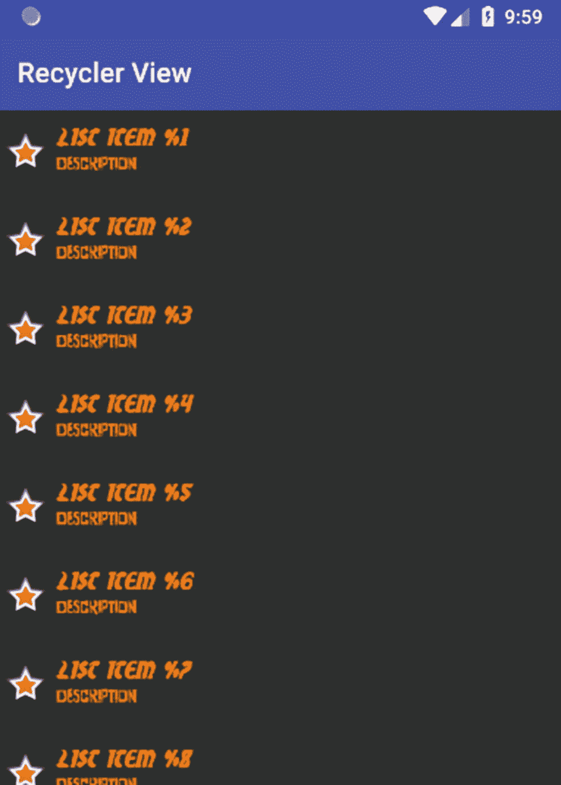
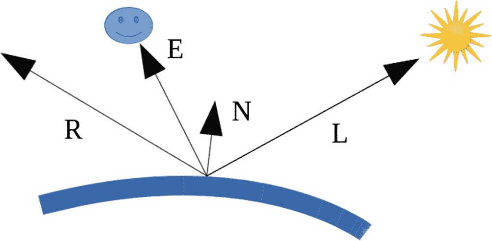
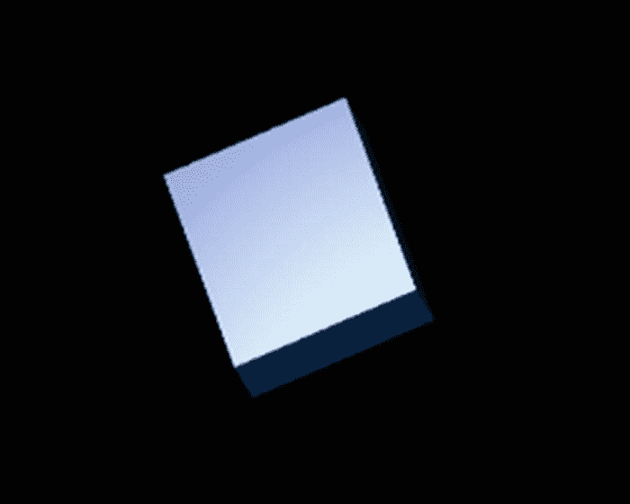

# 九、用户界面

用户界面当然是任何终端用户应用最重要的部分。对于企业使用，没有用户界面的应用是可能的，但即使这样，在大多数情况下，你也会有一些基本的用户界面，如果没有其他原因，只是为了避免 Android 操作系统在资源管理任务中太容易杀死你的应用。

在这一章中，我们不会讨论 Android 用户界面开发的基础知识。相反，你应该已经阅读了一些入门书籍或者阅读了官方教程(或者你可以在网上找到的其他教程)。我们在这里做的是覆盖几个重要的 UI 相关的问题，帮助你创建更稳定的应用或者有特殊需求的应用。

## 后台任务

Android 依赖于单线程执行模型。这意味着当一个应用启动时，默认情况下它只启动一个线程，称为*主线程*，在这个线程中所有的动作都会运行，除非你明确地使用后台线程来完成某些任务。这自然意味着，如果您有长时间运行的任务会中断流畅的 UI 工作流，您必须采取特殊的预防措施。对于现代应用来说，在用户点击一个按钮后用户界面冻结是不可接受的，因为这个动作会导致一个过程运行几秒钟或更长时间。因此，将长期运行的任务放到后台是至关重要的。

一种完成将事物放入背景的方法是使用`IntentService`物体，如第 [4 章](04.html)所述。然而，根据具体情况，将所有后台工作放入服务中可能会破坏你的应用设计；此外，在一台设备上运行太多服务将无助于保持较低的资源使用率。另一种选择是使用第 [8](08.html) 章所述的装载机。然而，对于低级任务，最好使用更低级的方法。这里有几个选项，我们将在下面几节中介绍。

### Java 并发

在底层，您可以使用 Java 线程和来自`java.util.concurrent`包的类来处理后台作业。从 Java 7 开始，这些类变得非常强大，但是您需要完全理解所有选项和含义。

你会经常读到从 Android 操作系统内部直接处理线程并不是一个好主意，因为线程对于系统资源来说是非常昂贵的。虽然这对于旧设备和旧版本的 Android 来说是正确的，但现在情况已经不同了。对我来说，在摩托罗拉 Moto G4 上进行一个简单的测试，启动 1000 个线程，等待所有线程运行，每个线程大约需要 0.0006 秒。因此，如果您习惯于 Java 线程，并且线程启动时间少于一毫秒对您来说是好事，那么不使用 Java 线程就没有性能上的理由。然而，你必须考虑到线程运行在任何 Android 组件生命周期之外，所以如果你使用线程，你必须手动处理生命周期问题。

在 Kotlin 中，线程很容易定义和启动。

```java
val t = Thread{ ->
  // do background work...
}.also { it.start() }

```

注意，Android 不允许从线程内部访问 UI。您必须按如下方式操作:

```java
val t = Thread{ ->
  // do background work...
  runOnUiThread {
    // use the UI...
  }
}.also { it.start() }

```

### AsyncTask 类

一个`AsyncTask`对象是一个中级助手类，用于在后台运行一些代码。您覆盖它的`doInBackground()`方法来做一些后台工作，如果您需要与 UI 通信，您还实现`onProgressUpdate()`来做通信，并从后台工作内部触发`publishProgress()`来触发它。

### 注意

如果你创建类似于`val at = object : AsyncTask< Int, Int, Int >() { ... }`的`AsyncTask`对象，Android Studio 将会警告你可能的内存泄漏。这是因为在内部将保存对背景代码的静态引用。可以通过用`@SuppressLint("StaticFieldLeak")`注释该方法来取消警告。

### 警告

多个`N AsyncTask`任务不会导致所有`N`任务的并行执行。相反，它们都在*的一个*后台线程中顺序运行。

### 经理人

`Handler`是维护消息队列的对象，用于异步处理消息或`Runnable`对象。您可以将`Handler`用于异步流程，如下所示:

```java
var handlerThread : HandlerThread? = null
// or: lateinit var handlerThread : HandlerThread
...
fun doSomething() {
  handlerThread = handlerThread ?:
        HandlerThread("MyHandlerThread").apply {
    start()
  }
  val handler = Handler(handlerThread?.looper)

  handler.post {
    // do s.th. in background
  }
}

```

如果您创建一个`HandlerThread`,如下面的代码片段所示，所有发布的内容都会在后台运行，但是它会在后台按顺序执行。这意味着`handler.post{}; handler.post{}`将连续运行帖子。但是，您可以创建更多的`HandlerThread`对象来并行处理帖子。对于真正的并行性，每次执行都必须使用一个`HandlerThread`。

### 注意

在 Java 7 中推出新的`java.util.concurrent`包之前很久，Android 中就引入了处理程序。如今，对于您自己的代码，您可能会决定在不遗漏任何东西的情况下优先选择泛型 Java 类而不是`Handler`。然而，处理程序经常出现在 Android 的库中。

### 装载机

加载器也在后台工作。它们主要用于从外部源加载数据。第[章和第](08.html)章对装载机进行了描述。

## 支持多种设备

设备兼容性是应用的一个重要问题。当你创建一个应用时，你的目标当然是解决尽可能多的设备配置，并确保在某个设备上安装你的应用的用户可以实际使用它。兼容性归结为以下几点:

*   寻找一种方法，让您的应用可以在不同的屏幕功能下运行，包括像素宽度、像素高度、像素密度、色彩空间和屏幕形状

*   找到一种方法让你的应用可以运行不同的 API 版本

*   找到一种方法，让你的应用可以运行不同的硬件功能，包括传感器和键盘

*   找到一种方法来过滤你的应用在 Google Play 商店中的可见性

*   可能为一个应用提供不同的 apk，具体取决于设备特性

在这一章中，我们讨论与 UI 相关的兼容性问题；我们关注屏幕和用户输入能力。

### 屏幕尺寸

要让您的应用在不同的屏幕尺寸上看起来都很漂亮，您可以执行以下操作:

*   **使用灵活的布局**

    避免指定绝对位置和绝对宽度。取而代之的是，使用允许“在右边”或“使用一半的可用空间”或类似规格的布局。

*   **使用替代布局**

    使用替代布局是提供不同屏幕尺寸的有力手段。布局 XML 文件可以放在不同的目录中，其名称包含大小过滤器。例如，您可以将一个布局放入文件`res/layout/main_activity.xml`中，将另一个放入`res/layout-sw480dp/main_activity.xml`中，表示“最小宽度”为 480dp(适用于 5 英寸或更大的手机屏幕)。Android 开发人员文档中的“提供资源”和“提供替代资源”文档对命名模式进行了广泛的在线描述。然后，Android 操作系统会在用户设备上运行时自动选择最匹配的布局。

*   **使用可拉伸图像**

    您可以为 UI 元素提供*九片*位图。在这样的图像中，你提供一个 1 像素宽的边框，告诉图像的哪些部分可以重复以拉伸图像，哪些部分可以用于内部内容。这种九补丁图像是带有后缀`.9.png`的 PNG 文件。Android Studio 允许将常规 png 转换为九补丁 png；为此，请使用上下文菜单。

### 像素密度

设备具有不同的像素密度。为了让你的应用尽可能的独立于设备，只要你需要像素大小，就使用*独立于密度的像素*大小，而不是*像素大小*。与密度无关的像素大小使用 dp 作为单位，而像素使用 px。

此外，您还可以根据不同的密度提供不同的布局文件。该分离类似于前面描述的不同屏幕尺寸的分离。

### 声明受限屏幕支持

在某些情况下，你想要通过说某些屏幕特征不能被使用来限制你的应用。很明显，你想避免这样的情况，但是万一不可避免，你可以在`AndroidManifest.xml`里这么做。

*   告诉应用，某些活动可以在 API level 24 (Android 7.0)或更高版本上可用的多窗口模式下运行。为此，使用属性`android:resizeableActivity`并将其设置为`true`或`false`。

*   告诉某些活动，它们应该在特定的宽高比之上用字母框起来(加上适当的边距)。为此，使用属性`android:maxAspectRatio`并将纵横比指定为一个值。对于 Android 7.1 和更早的版本，在`<application>`元素中重复这个设置，就像在`<meta-data android:name = "android.max_aspect" android:value = "s.th." />`中一样。

*   通过在一个`<supports-screens>`元素中使用`largestWidthLimitDp`属性，告诉某些活动它们不应该超过某个限制。

*   使用更多的`<supports-screens>`和`<compatible-screens>`元素和属性，如第 [2](02.html) 章所述。

### 检测设备功能

从应用内部，您可以检查某些功能，如下所示:

```java
if(packageManager.
      hasSystemFeature(PackageManager.FEATURE_...)) {
  // ...
}

```

这里，`FEATURE_...`是来自`PackageManager`内部的各种常量之一。

特征信息的另一个来源是`Configuration`。在 Kotlin 中，从活动内部，您可以通过以下方式获得配置对象:

```java
val conf = resources.configuration

```

从那里，获得有关正在使用的颜色模式、可用键盘、屏幕方向和触摸屏功能的信息。要获得屏幕的大小，您可以编写以下代码:

```java
val size = Point()
windowManager.defaultDisplay.getSize(size)
// or (getSystemService(Context.WINDOW_SERVICE)
//    as WindowManager).defaultDisplay.getSize(size)
val (width,height) = Pair(size.x, size.y)

```

要获得解决方案，您可以使用以下方法:

```java
val metrics = DisplayMetrics()
windowManager.defaultDisplay.getMetrics(metrics)
val density = metrics.density

```

## 编程式用户界面设计

通常 UI 设计是通过在一个或多个 XML 布局文件中声明 UI 对象(`View`对象)和容器(`ViewGroup`对象)来实现的。虽然这是设计 UI 的建议方式，而且大多数人可能会告诉你不应该做任何其他事情，但是有理由从 XML 中去掉布局设计，用程序布局来代替。

*   你需要更多的动态布局。例如，您的应用通过用户操作添加、移除或移动布局元素。或者您想创建一个游戏，其中的游戏元素由动态移动、出现和消失的`View`对象表示。

*   您的布局是在服务器上定义的。尤其是在公司环境中，定义服务器上的布局是有意义的。每当应用的布局发生变化时，您不需要在所有设备上安装新版本。相反，只需要更新中央布局引擎。

*   您定义了一个布局构建器，与 XML 相比，它允许以一种更有表现力和更简洁的方式在 Kotlin 中指定布局。例如，看看下面哪个是有效的 Kotlin 语法:

    ```java
    LinearLayout(orientation="vertical") {
      TextView(id="tv1",
            width="match_parent", height="wrap_content")
      Button(id="btn1", text="Go",
            onClick = { btn1Clicked() })
    }

    ```

*   您需要 XML 中没有定义的特殊结构。虽然标准的方法是尽可能用 XML 定义所有内容，其余的用代码完成，但是您可能更喜欢单一技术的解决方案，在这种情况下，您必须在代码内部完成所有工作。

请注意，如果您放弃通过 XML 文件的描述性布局，而使用编程性布局，您必须手动处理不同的屏幕尺寸、屏幕密度和其他硬件特征。虽然这总是可能的，但在某些情况下，这可能是一个复杂且容易出错的过程。某些特征，比如 UI 元素的大小，用 XML 表达比用代码表达要容易得多。

从编程式 UI 设计开始，如果在 XML 中定义一个容器并在代码中使用它，这是最容易的。我这样说是因为布局对于如何以及何时放置它们的子元素有自己的想法，所以如果您的代码对于如何以及何时放置视图有另外的想法，您可能会陷入时间、布局和剪辑问题的噩梦中。一个好的候选人是`FrameLayout`，如下所示:

```java
<?xml version="1.0" encoding="utf-8"?>
<FrameLayout
  xmlns:android =
        "http://schemas.android.com/apk/res/android"
  android:id="@+id/fl"
  android:layout_width="match_parent"
  android:layout_height="match_parent">
</FrameLayout>

```

将此用作布局 XML 文件，比如说`/res/layout/activity_main.xml`，并编写以下示例活动:

```java
class MainActivity : AppCompatActivity() {
  var tv:TextView? = null
  override fun onCreate(savedInstanceState: Bundle?) {
      super.onCreate(savedInstanceState)
      setContentView(R.layout.activity_main)

      // For example add a text at a certain position
      tv = TextView(this).apply {
          text = "Dynamic"
          x = 37.0f
          y = 100.0f
      }
     fl.addView(tv)
  }
}

```

要添加一个按钮来移动前一个示例中的文本，您可以编写以下代码:

```java
val WRAP = ViewGroup.LayoutParams(
                ViewGroup.LayoutParams.WRAP_CONTENT,
                ViewGroup.LayoutParams.WRAP_CONTENT)
fl.addView(
      Button(this).apply {
        text = "Go"
        setOnClickListener { v ->
          v?.run {
            x += 30.0f *
                (-0.5f + Math.random().toFloat())
            y += 30.0f *
                (-0.5f + Math.random().toFloat())
           }
        }
      }, WRAP
)

```

如果你不需要完全的控制，并且想要一个布局对象按照它被设计的方式来做它的子元素的定位和大小调整工作，例如，添加子元素到其他布局类型，比如一个`LinearLayout`，这在代码内部是可能的。不需要通过`setX()`或`setY()`明确设定位置，只需使用`addView()`方法即可。在某些情况下，你必须使用`layoutObject.invalidate()`来触发重新布局。后者必须从 UI 线程内部或`runOnUiThread{ ... }`内部完成。

## 适配器和列表控件

经常需要显示具有可变数量项目的列表，尤其是在公司环境中。虽然具有各种子类的`AdapterView`和`Adapter`对象已经存在了一段时间，但我们还是专注于相对较新且性能较高的*回收器视图*。您将看到，使用 Kotlin 的简明性，实现回收器视图以优雅和全面的方式进行。

基本的 ide 如下:你有一个数组或一个列表或另一个数据项的集合，可能来自一个数据库，你想把它们发送到一个单一的 UI 元素来完成所有的表示，包括呈现所有可见的项目，并在必要时提供滚动功能。每个项目的表示要么应该依赖于一个*项目* XML 布局文件，要么从代码内部动态生成。从每个数据项的成员到该项的 UI 表示中相应的视图元素的映射将由一个*适配器*对象来处理。

对于回收器视图，这一切都以一种简单的方式发生，但是首先我们必须包含一个支持库，因为回收器视图不是框架的一部分。为此，在您的*模块*的`build.gradle`文件中，添加以下内容:

```java
implementation
      'com.android.support:recyclerview-v7:26.1.0'

```

将此内容添加到`dependencies{ ... }`部分(在一行上；删除`implementation`后的换行符。

要告诉应用我们希望使用回收器视图，请在您的活动布局文件中添加以下内容:

```java
<android.support.v7.widget.RecyclerView
    android:id="@+id/recycler_view"
    android:scrollbars="vertical"
       ... />

```

指定其他`View`的布局选项。

对于列表中某个项目的布局，在`res/layout`中创建另一个布局文件，比如说`item.xml`，其示例内容如下:

```java
<?xml version="1.0" encoding="utf-8"?>
<RelativeLayout xmlns:android="http://schemas.android.com/
   apk/res/android"
                android:layout_width="fill_parent"
                android:layout_height="?android:attr/
   listPreferredItemHeight"
                android:padding="8dip" >

<ImageView
    android:id="@+id/icon"
    android:layout_width="wrap_content"
    android:layout_height="fill_parent"
    android:layout_alignParentBottom="true"
    android:layout_alignParentTop="true"
    android:layout_marginRight="8dip"
    android:contentDescription="TODO"
    android:src="@android:drawable/star_big_on" />

<TextView
    android:id="@+id/secondLine"
    android:layout_width="fill_parent"
    android:layout_height="26dip"
    android:layout_alignParentBottom="true"
    android:layout_alignParentRight="true"
    android:layout_toRightOf="@id/icon"
    android:singleLine="true"
    android:text="Description"
    android:textSize="12sp" />

<TextView
    android:id="@+id/firstLine"
    android:layout_width="fill_parent"
    android:layout_height="wrap_content"
    android:layout_above="@id/secondLine"
    android:layout_alignParentRight="true"
    android:layout_alignParentTop="true"
    android:layout_alignWithParentIfMissing="true"
    android:layout_toRightOf="@id/icon"
    android:gravity="center_vertical"
    android:text="Example application"
    android:textSize="16sp" />
</RelativeLayout>

```

如前所述，您也可以省略这一步，只从代码内部定义一个项目的布局！接下来，我们提供一个适配器。在科特林，这可能很简单，如下所示:

```java
class MyAdapter(val myDataset:Array<String>) :
      RecyclerView.Adapter
            <MyAdapter.Companion.ViewHolder>() {
  companion object {
      class ViewHolder(val v:RelativeLayout) :
            RecyclerView.ViewHolder(v)
  }

  override
  fun onCreateViewHolder(parent:ViewGroup,
          viewType:Int) : ViewHolder {
      val v = LayoutInflater.from(parent.context)
              .inflate(R.layout.item, parent, false)
            as RelativeLayout
      return ViewHolder(v)
  }

  override
  fun onBindViewHolder(holder:ViewHolder,
                       position:Int) {
      // replace the contents of the view with
      // the element at this position
      holder.v.findViewById<TextView>(
            R.id.firstLine).text =
            myDataset[position]
  }

  override
  fun getItemCount() : Int = myDataset.size
}

```

下面是该列表的一些注释:

*   “同伴对象”内部的类是 Kotlin 声明静态内部类的方式。它将每个数据项的引用指定为一个 UI 元素。更准确地说，回收器视图将只在内部保存表示可见的项目所需的视图持有者。

*   只有在真正需要时，才会调用函数`onCreateViewHolder()`来创建视图保持器。更准确地说，它的调用频率或多或少取决于向用户显示项目的需要。

*   函数`onBindViewHolder()`将一个可视视图持有者与某个数据项连接起来。这里我们必须替换视图持有者视图的内容。

在活动内部，定义回收器视图所需的全部内容如下:

```java
with(recycler_view) {
  // use this setting to improve performance if you know
  // that changes in content do not change the layout
  // size of the RecyclerView
  setHasFixedSize(true)
  // use for example a linear layout manager
  layoutManager = LinearLayoutManager(this@MainActivity)
  // specify the adapter, use some sample data
  val dataset = (1..21).map { "Itm" + it }.toTypedArray()
  adapter = MyAdapter(dataset)
}

```

这将看起来如图 [9-1](#Fig1) 所示。以下是该程序的有用扩展:

*   向所有项目添加点击监听器

*   使项目可选

*   使物件或物件部件可编辑

*   自动对底层数据的变化做出反应

*   定制图形过渡效果

对于所有这些，我参考了回收视图的在线文档。然而，这里给出的代码应该给你一个好的起点。



图 9-1

recycler view(回收视图)

## 样式和主题

Android 应用默认使用的预定义样式已经为专业外观的应用提供了一个良好的起点。然而，如果你想应用你公司的风格指南，或者创建一个视觉上杰出的应用，创造你自己的风格是值得努力的。更好的是，创建你自己的主题，它是应用于 UI 元素组的样式集合。

样式和主题作为 XML 文件在`res/values/`中创建。要创建一个新的主题，您可以使用或创建一个名为`themes.xml`的文件，并编写如下内容:

```java
<?xml version="1.0" encoding="utf-8"?>
<resources>
  <style name="MyTheme" parent="Theme.AppCompat">
      <item name="colorPrimary">
            @color/colorPrimary</item>
      <item name="colorPrimaryDark">
            @color/colorPrimaryDark</item>
      <item name="colorAccent">
            @color/colorAccent</item>
      <item name="android:textColor">
            #FF0000</item>
      <item name="android:textSize"> 22sp</item>
  </style>
</resources>

```

这里有一些关于这方面的注意事项:

*   `parent`属性很重要。它表明我们想要创建一个主题，覆盖兼容性库中的部分主题。

*   因为命名模式 Theme + DOT + AppCompat，我们可以推断主题`Theme.AppCompat`继承了主题`Theme`。这种点诱导的遗传可能有更多的元素。

*   我们可以使用它的一个子主题来代替父主题`Theme.AppCompat`。你可以看到它们的列表；在 Android Studio 中单击 AppCompat 部分，然后按 Ctrl+b。Android Studio 将打开一个文件，其中包含所有子主题的列表，例如`Theme.AppCompat.CompactMenu`、`Theme.AppCompat.Light`等等。

*   在示例中，我们看到了两种覆盖样式的方法。那些以`android:`开头的引用了为 UI 元素定义的样式设置，就像我们想在一个布局文件中设置样式一样。您可以在所有视图的在线 API 文档中找到它们。然而，更好的做法是，在开头使用不带`android:`的标识符，因为这些标识符指的是实际构成主题的抽象样式标识符。如果在在线文档中搜索 *R.styleable.Theme* ，你会得到一个可能的项目名称列表。

*   这些年来，造型系统变得越来越复杂。如果你够勇敢并且有一些时间，你可以通过在父母上重复按 Ctrl+B 来浏览 Android Studio 中的所有文件。

*   `@color/...`指的是`res/values/colors.xml`文件中的条目。你应该采用这种方法，在你的应用模块的`res/values/colors.xml`文件中定义新的颜色。

*   `<item>`元素的值可以通过`@style/...`引用样式。例如，使用项目`<item name="buttonStyle">@style/Widget.AppCompat.Button</item>`。您也可以覆盖这些项目；在`styles.xml`中定义自己的风格并参考就可以了。

要立即为整个应用使用新主题，您需要在清单文件`AndroidManifest.xml`中编写以下内容:

```java
<manifest ... >
  <application android:theme="@style/MyTheme" ... >
  </application>
</manifest>

```

### 注意

您不必使用完整的主题来覆盖样式。相反，您可以覆盖或创建单个样式，然后应用于单个小部件。然而，使用主题可以极大地提高应用的设计一致性。

您可以将样式分配给不同的 API 级别。为此，例如，创建一个名为`res/values-v21/`的文件夹或任何适合你的级别编号。如果当前的 API 等级大于或等于这个数字的话，那么文件夹中的样式就会被另外应用*和*。

## XML 中的字体

从 API 级别 26 开始的 Android 版本(Android 8.0)，以及使用支持库 26 的早期版本，允许您以 TTF 或 OTF 格式添加自己的字体。

### 注意

要使用这个支持库，在你的模块的`build.gradle`文件中，在`dependencies`部分添加`implementation 'com.android.support:appcompat-v7:26.1.0'`。

添加字体文件，创建字体资源目录:选择新➤ Android 资源目录，输入**字体**作为目录名，输入**字体**作为资源类型，点击确定。将字体文件复制到新资源目录中，但是首先将所有文件名转换为只包含后缀前允许的字符( *a* 到 *z* ，0 到 9，_)。

要应用新字体，使用如下的`android:fontFamily`属性:

```java
<TextView ...
  android:fontFamily="@font/<FONT_NAME>"
/>

```

这里，`<FONT_NAME>`是不带后缀的字体文件名。

要添加不同字体样式的字体，假设您在`font`资源文件夹中有字体`myfont_regular.ttf`、`myfont_bold.ttf`、`myfont_italic.ttf`和`myfont_bold_italic.ttf`。通过选择新的➤字体资源文件添加文件`myfont.xml`。在该文件中写入以下内容:

```java
<?xml version="1.0" encoding="utf-8"?>
<font-family
    xmlns:android=
         "http://schemas.android.com/apk/res/android"
    xmlns:app=
         "http://schemas.android.com/apk/res-auto">
  <font
          android:fontStyle="normal"
          app:fontStyle="normal"
          android:fontWeight="400"
          app:fontWeight="400"
          android:font="@font/myfont_regular"
          app:font="@font/myfont_regular"/>
  <font
          android:fontStyle="normal"
          app:fontStyle="normal"
          android:fontWeight="700"
          app:fontWeight="700"
          android:font="@font/myfont_bold"
          app:font="@font/myfont_bold"/>
  <font
          android:fontStyle="italic"
          app:fontStyle="italic"
          android:fontWeight="400"
          app:fontWeight="400"
          android:font="@font/myfont_italic"
          app:font="@font/myfont_italic"/>
  <font
          android:fontStyle="italic"
          app:fontStyle="italic"
          android:fontWeight="700"
          app:fontWeight="700"
          android:font="@font/myfont_bold_italic"
          app:font="@font/myfont_bold_italic"/>
</font-family>

```

忽略 Android Studio 的版本警告；为了兼容，所有属性都使用一个标准命名空间和一个兼容命名空间。

然后，您可以使用这个 XML 文件的名称，不带后缀，用于`android:fontFamily`属性内的 UI 视图。

```java
<TextView ...
  android:fontFamily="@font/myfont"
  android:textStyle="normal"
/>

```

作为`textStyle`，你现在也可以使用`italic`或`bold`或`bold|italic`。

## 二维动画

动画让你的应用看起来更有趣，虽然太多的动画可能看起来很古怪，但是适量的动画可以帮助你的用户理解你的应用是做什么的。

Android 操作系统提供了几种你可以使用的动画技术，我们将在下面的章节中描述它们。

### 自动动画布局

添加动画的一个简单方法是使用内置的布局自动动画。你所要做的就是将`android:animateLayoutChanges="true"`添加到布局声明中。这里有一个例子:

```java
<LinearLayout
  ...
  android:animateLayoutChanges="true"
  ...
/>

```

### 动画位图

你可以通过提供不同版本的位图并让 Android 在它们之间切换来给位图添加动画。首先将所有图像添加到`res/drawable`，例如`img1.png`、`img2.png`，...，`img9.png`。然后在同一个文件夹中创建一个文件，例如,`anim.xml`,并在文件中写入以下内容:

```java
<?xml version="1.0" encoding="utf-8"?>
<animation-list
        xmlns:android=
          "http://schemas.android.com/apk/res/android"
        android:oneshot="false">
    <item android:drawable="@drawable/img1"
          android:duration="250" />
    <item android:drawable="@drawable/img2"
          android:duration="250" />
    ...
    <item android:drawable="@drawable/img9"
          android:duration="250" />
</animation-list>

```

这里，每个位图幻灯片的持续时间以毫秒为单位。要使其不重复，请设置`android:oneshot="true"`。将图像作为`ImageView`添加到布局中，如下所示:

```java
<ImageView
    android:id="@+id/img"
    android:adjustViewBounds="true"
    android:scaleType="centerCrop"
    android:layout_width="match_parent"
    android:layout_height="wrap_content"
    android:background="@drawable/anim1" />

```

这将准备动画，但需要从程序内部启动，如下所示:

```java
img.setBackgroundResource(R.drawable.anim1)
img.setOnClickListener{
    val anim = img.background as AnimationDrawable
    anim.start()
}

```

这里，当用户单击图像时，动画开始。

### 属性动画

属性动画框架允许你制作任何你能想到的动画。使用类`android.animation.ValueAnimator`，您可以指定以下内容:

*   持续时间和重复模式

*   插值的类型

*   动画期间的时间插值

*   值更新的监听器

然而，大多数时候你会使用`android.animation.ObjectAnimator`类，因为它已经面向对象和它们的属性，所以你不必实现监听器。这个类有各种静态工厂方法来创建`ObjectAnimator`的实例。在参数中，您可以指定要制作动画的对象、要使用的该对象的属性的名称以及在动画制作过程中要使用的值。然后你可以在对象上设置一个特定的插值器(默认为`AccelerateDecelerateInterpolator`，缓慢开始和结束，在加速和减速之间)，并添加一个值更新监听器(在`onAnimationUpdate()`中设置)，例如，如果一个`View`类型的目标对象需要被告知它必须更新自己(通过调用`invalidate()`)。

例如，我们在一个`FrameLayout`中定义了一个`TextView`对象，并以加速的方式将它从`x=0`移动到`x=500`。布局文件包含以下内容:

```java
<FrameLayout
      android:id="@+id/fl"
      android:layout_width="match_parent"
      android:layout_height="400dp">
      <TextView
          android:id="@+id/tv"
          android:layout_width="wrap_content"
          android:layout_height="wrap_content"
          android:text="XXX"/>
</FrameLayout>

```

例如，在单击按钮后，在代码中编写以下内容:

```java
val anim = ObjectAnimator.ofFloat(tv, "x", 0.0f, 500.0f)
    .apply {
      duration = 1000 // default is 300ms
      interpolator = AccelerateInterpolator()
    }
anim.start()

```

### 注意

这只有在所讨论的对象(这里是一个`TextView`)具有指定属性(这里是一个`x`)的 setter 方法时才起作用。更准确地说，对象需要一个`setX(Float)`，然而这是所有`View`对象的情况。

### 警告

根据 UI 对象所处的布局，您的收获会有很大的不同。毕竟，布局对象可能有自己的想法如何定位对象，阻碍动画。A `FrameLayout`这里挺帅的，但是你要做代码里面所有的布局。

使用`android.animation.AnimatorSet`，你也可以设计一组动画。在线 API 文档会告诉你更多关于如何使用它的信息。

### 查看属性动画

通过施加某些约束，一些与`View`相关的属性也可以使用`android.view.ViewPropertyAnimator`来制作动画。与一般的属性动画相比，这似乎不太具有侵入性，但是只有少量的属性可以被动画化，并且只有绘图受到动画的影响。如果视图移开，点击监听器的位置会变得孤立。

此外，您可以使用它来平移视图、缩放视图、旋转视图以及淡入或淡出视图。有关详细信息，请参见在线文档。

作为内置视图属性动画的扩展，您可能想看看 Fling 动画。这种类型的动画对移动的对象施加摩擦力，让动画看起来更自然。要找到关于 Fling 动画的信息，请在您最喜欢的搜索引擎中搜索 *android fling 动画*。

### 春季物理学

将弹簧物理学添加到动画中可以使移动更加真实，从而改善用户体验。要添加 spring physics，需要包含相应的支持库。在你的模块的`build.gradle`文件中，在`dependencies`元素中添加`implementation 'com.android.support:support-dynamic-animation:27.1.0'`。

详情请参考`android.support.animation.SpringAnimation`类的在线 API 文档。以下是最重要的设置:

*   在构造函数内，设置属性。可用的属性有 alpha、平移、旋转、滚动值和缩放。

*   添加侦听器；使用`addUpdateListener()`和/或`addEndListener()`。

*   使用`setStartVelocity()`以初始速度开始动画(默认为 0.0f)。

*   使用`getSpring().setDampingRatio()`或 Kotlin 中的`.spring.dampingRatio = ...`设置阻尼系数。

*   使用`getSpring().setStiffness()`或 Kotlin 中的`.spring.stiffness = ...`设置弹簧刚度。

使用`start()`或`animateToFinalPosition()`启动动画。这必须发生在 GUI 线程或`runOnUiThread { ... }`内部。

以下是按钮按下后的弹簧动画示例:

```java
val springAnim = SpringAnimation(tv, DynamicAnimation.
 TRANSLATION_X, 500.0f).apply {
  setStartVelocity(1.0f)
  spring.stiffness =
      SpringForce.STIFFNESS_LOW
  spring.dampingRatio =
      SpringForce.DAMPING_RATIO_LOW_BOUNCY
}
springAnim.start()

```

### 过渡

过渡框架允许您在不同的布局之间应用动画过渡。你基本上从开始布局和结束布局创建`android.transition.Scene`对象，然后让`TransitionManager`动作。这里有一个例子:

```java
val sceneRoot:ViewGroup = ...

// Obtain the view hierarchy to add as a child of
// the scene root when this scene is entered
val startViewHierarchy:ViewGroup = ...

// Same for the end scene
val endViewHierarchy:ViewGroup = ...

// Create the scenes
val startScene = Scene(sceneRoot, startViewHierarchy)
val endScene = Scene(sceneRoot, endViewHierarchy)

val fadeTransition = Fade()
TransitionManager.go(endScene, fadeTransition)

```

例如，`sceneRoot`可以是一个`FrameLayout`布局，其中的过渡应该发生在内部。然后你可以在开始的时候在里面添加起始布局(`startViewHierarchy`)。前面的代码将建立到结束布局的过渡(`endViewHierarchy`)，所有这些都发生在`sceneRoot`的中的*。*

这种转换可以在代码内部指定，也可以作为特殊的 XML 文件指定。有关详细信息，请参见在线文档。

### 警告

某些限制适用。不是所有的`View`类型都会正确地参与到这样的布局转换中。然而，可以通过使用`removeTarget()`方法从转换中排除元素。

### 使用转场开始活动

当一个活动被另一个活动替换时，可以为第一个活动指定退出转换，为第二个活动指定进入转换，并允许普通视图元素的平滑转换。这种转换可以由特殊的 XML 文件指定，也可以从代码内部指定。我们以 XML 的方式简要描述了后者；有关更多详细信息，请参考在线文档。

这种切换适用于 API 级别 21 (Android 5.0)及以上。为了确保您的代码能与之前的版本一起工作，我们在下面的代码片段中编写了一个检查:

```java
if (Build.VERSION.SDK_INT >=
      Build.VERSION_CODES.LOLLIPOP) ...

```

要设置一个*退出*和一个*进入*转换，请在两个活动中使用以下代码片段:

```java
override fun onCreate(savedInstanceState: Bundle?) {
    super.onCreate(savedInstanceState)

    if (Build.VERSION.SDK_INT >=
          Build.VERSION_CODES.LOLLIPOP) {
        with(window) {
            requestFeature(
                  Window.FEATURE_CONTENT_TRANSITIONS)
            exitTransition = Explode()
            // if inside the CALLED transition,
            // instead use:
            // enterTransition = Explode()

            // use this in the CALLED transition to
            // primordially start the enter transition:
            // allowEnterTransitionOverlap = true
        }
    } else {
        // Go without transition - this can be empty
    }

    ...
}

```

在这里，你可以选择`Slide()`、`Fade()`或`AutoTransition()`来代替`Explode()`。`Slide()`和`Fade()`做显而易见的事情；`AutoTransition`淡出不常用的元素，移动常用元素并调整大小，然后淡入新元素。

### 注意

`requestFeature()`方法必须发生在`onCreate()`的开头。

仅当您通过以下方式开始新活动时，转换才会被激活:

```java
if (Build.VERSION.SDK_INT >=
      Build.VERSION_CODES.LOLLIPOP) {
  startActivity(intent,
      ActivityOptions.
      makeSceneTransitionAnimation(this).toBundle())
}else{
  startActivity(intent)
}

```

当名为的*活动存在时，您可以使用`Activity.finishAfterTransition()`而不是通常的`finish()`来更好地处理反向转换。同样，你必须把它放进一张`if (Build.VERSION.SDK_INT >= Build.VERSION_CODES.LOLLIPOP)`支票里。*

为了改善用户体验，您可以识别两个活动共有的元素，并让转换框架以特殊的方式处理它们。为此，您需要做两件事。

*   Give the common UI elements a special *transition name*.

    ```java
    if (Build.VERSION.SDK_INT >=
          Build.VERSION_CODES.LOLLIPOP) {
      img.transitionName = "imgTrans"
          // for a certain "img" UI element
    }

    ```

    该名称必须是唯一的，并且在调用和被调用活动中，该设置都应该发生在`onCreate()`内部。

*   将`ActivityOptions.makeSceneTransitionAnimation(this)`替换为以下内容:

    ```java
    ActivityOptions.
        makeSceneTransitionAnimation(
            this@MainActivity,
            UPair.create(img,"imgTrans"),
            ...more pairs...
        )

    ```

这里，`UPair`是避免名称冲突的重要别名:`import android.util.Pair as UPair`。

然后，您可以使用`AutoTransition()`转换在动画过程中以特殊方式处理这些常见的 UI 元素。

## 快速图形 OpenGL ES

对于 Android 应用，您可以使用行业标准的 OpenGL ES 来渲染 2D 和 3D 的高性能图形。用户界面的开发与标准的 Android 操作系统有很大的不同，你必须花一些时间来学习如何使用 OpenGL ES。然而，最终你可能会得到出色的图形，这是值得的。

### 注意

如果 Android 操作系统用户界面提供相同的功能并且性能不是问题，那么使用 OpenGL ES 就没有意义。

OpenGL ES 有不同的版本:1。 *x* ，2.0，3。 *x* 。而 1。 *x* 和后来的版本，2.0 和 3 的区别。 *x* 没那么大。但是设置 3。 *x* 作为一个严格的要求，你会错过大约三分之一的潜在用户(到 2018 年初)，所以建议是这样的:

*   为 OpenGL ES 2.0 开发，只有当你真的需要它时才添加 3。 *x* 特征。如果用 3。 *x* ，你最好为不会说话的设备提供后备 3。 *x* 。

在下面的章节中，我们将讨论 2.0 版。

### 注意

框架和本地开发工具包(NDK)都支持 OpenGL ES for Android。在这本书里，我们将把更多的重量放在框架类上。

OpenGL ES 是非常通用的，使用模式可能是无穷无尽的。涵盖 OpenGL ES 提供的所有内容超出了本书的范围，但是我将给出以下场景来帮助您入门:

*   配置活动以使用 OpenGL ES

*   提供一个自定义的`GLSurfaceView`类来保存 OpenGL 场景

*   提供两个图形图元:一个使用顶点缓冲区和着色器程序的三角形，一个使用顶点缓冲区、索引缓冲区和着色器程序的四边形

*   提供渲染器来绘制图形

*   简要概述如何引入视图投影

*   简要概述如何添加运动

*   简要概述如何添加光线

*   简要概述如何对用户输入做出反应

### 在活动中显示 OpenGL 图面

您可以通过以下方式使自定义 OpenGL 视图元素成为在活动中显示的唯一 UI 元素:

```java
class MyActivity : AppCompatActivity() {
  var glView:GLSurfaceView? = null

  override fun onCreate(savedInstanceState: Bundle?) {
      super.onCreate(savedInstanceState)

      // Create a GLSurfaceView instance and set it
      // as the ContentView for this Activity.
      glView = MyGLSurfaceView(this)
      setContentView(glView)
  }
}

```

这里，`MyGLSurfaceView`是我们将要定义的自定义`GLSurfaceView`。

或者，您可以使用一个普通的 XML 布局文件，并在其中添加定制的`GL`视图，例如，编写以下代码:

```java
<com.example.opengl.glapp.MyGLSurfaceView
    android:layout_width="400dp"
    android:layout_height="400dp"/>

```

这里，您必须指定自定义`GL`视图类的完整类路径。

### 创建自定义 OpenGL 视图元素

定制 OpenGL 视图元素可以像子类化`android.opengl.GLSurfaceView`一样简单，为图形数据指定一个渲染器，一个渲染模式，可能还有用户交互的监听器。然而，我们想更进一步，包括 OpenGL ES 版本检查，以便您可以决定是否包括 OpenGL ES 3。 *x* 构造是可能的。代码内容如下:

```java
import android.app.ActivityManager
import android.content.Context
import android.opengl.GLSurfaceView
import android.util.Log
import javax.microedition.khronos.egl.EGL10

class MyGLSurfaceView(context: Context) :
      GLSurfaceView(context) {
  val renderer: MyGLRenderer
  var supports3x = false
  var minVers = 0

  init {
      fetchVersion()

      // Create an OpenGL ES 2.0 context
      setEGLContextClientVersion(2)

      // We set the 2.x context factory to use for
      // the view
      setEGLContextFactory()

      // We set the renderer for drawing the graphics
      renderer = MyGLRenderer()
      setRenderer(renderer)

      // This setting prevents the GLSurfaceView frame
      // from being redrawn until you call
      // requestRender()
      renderMode = GLSurfaceView.RENDERMODE_WHEN_DIRTY
  }

  private fun fetchVersion() {
      val activityManager =
            context.getSystemService(
                Context.ACTIVITY_SERVICE)
            as ActivityManager
      val configurationInfo =
            activityManager.deviceConfigurationInfo
      val vers = configurationInfo.glEsVersion
          // e.g. "2.0"
      supports3x = vers.split(".")[0] == "3"
      minVers = vers.split(".")[1].toInt()
      Log.i("LOG", "Supports OpenGL 3.x = " +
          supports3x)
      Log.i("LOG", "OpenGL minor version = " +
          minVers)
  }

  private fun setEGLContextFactory() {
      val EGL_CONTEXT_CLIENT_VERSION = 0x3098
          // from egl.h c-source
      class ContextFactory :
            GLSurfaceView.EGLContextFactory {
        override fun createContext(egl: EGL10,
              display: javax.microedition.khronos.
                       egl.EGLDisplay?,
              eglConfig: javax.microedition.khronos.
                         egl.EGLConfig?)
        :javax.microedition.khronos.egl.EGLContext? {
            val attrib_list =
                intArrayOf(EGL_CONTEXT_CLIENT_VERSION,
                           2, EGL10.EGL_NONE)
            val ectx = egl.eglCreateContext(display,
                eglConfig,
                EGL10.EGL_NO_CONTEXT,
                attrib_list)
          return ectx
        }

        override fun destroyContext(egl: EGL10,
              display: javax.microedition.khronos.
                       egl.EGLDisplay?,
              context: javax.microedition.khronos.
                       egl.EGLContext?) {
            egl.eglDestroyContext(display, context)
        }
      }
      setEGLContextFactory(ContextFactory())
  }
}

```

然后可以用`.supports3x`看看 OpenGL ES 3。支持 *x* ，如果需要，使用`.minVers`作为次要版本号。这个类使用的渲染器马上就会被定义。另外，请注意，由于`RENDERMODE_WHEN_DIRTY`，重绘只在需要时发生。如果您需要完全动态的更改，那么就把那一行注释掉。

### 带有顶点缓冲区的三角形

一个负责绘制图元的类，在本例中是一个简单的三角形，如下所示:

```java
class Triangle {
  val vertexShaderCode = """
      attribute vec4 vPosition;
      void main() {
        gl_Position = vPosition;
      }
      """.trimIndent()

  val fragmentShaderCode = """
      precision mediump float;
      uniform vec4 vColor;
      void main() {
        gl_FragColor = vColor;
      }
      """.trimIndent()

  var program:Int? = 0

  val vertexBuffer: FloatBuffer

  var color = floatArrayOf(0.6f, 0.77f, 0.22f, 1.0f)

  var positionHandle: Int? = 0
  var colorHandle: Int? = 0

  val vertexCount =
        triangleCoords.size / COORDS_PER_VERTEX
  val vertexStride = COORDS_PER_VERTEX * 4
        // 4 bytes per vertex

  companion object {
      // number of coordinates per vertex
      internal val COORDS_PER_VERTEX = 3
      internal var triangleCoords =
            floatArrayOf( // in counterclockwise order:
              0.0f, 0.6f, 0.0f,   // top
              -0.5f, -0.3f, 0.0f, // bottom left
              0.5f, -0.3f, 0.0f   // bottom right
      )
}

```

在类的`init`块中，着色器被加载和初始化，顶点缓冲区被准备好。

```java
init {
     val vertexShader = MyGLRenderer.loadShader(
           GLES20.GL_VERTEX_SHADER,
           vertexShaderCode)
     val fragmentShader = MyGLRenderer.loadShader(
           GLES20.GL_FRAGMENT_SHADER,
           fragmentShaderCode)

     // create empty OpenGL ES Program
     program = GLES20.glCreateProgram()

     // add the vertex shader to program
     GLES20.glAttachShader(program!!, vertexShader)

     // add the fragment shader to program
     GLES20.glAttachShader(program!!, fragmentShader)

     // creates OpenGL ES program executables
     GLES20.glLinkProgram(program!!)

     // initialize vertex byte buffer for shape
     // coordinates
     val bb = ByteBuffer.allocateDirect(
              // (4 bytes per float)
              triangleCoords.size * 4)
     // use the device hardware's native byte order
     bb.order(ByteOrder.nativeOrder())

     // create a floating point buffer from bb
     vertexBuffer = bb.asFloatBuffer()
     // add the coordinates to the buffer
     vertexBuffer.put(triangleCoords)
     // set the buffer to start at 0
     vertexBuffer.position(0)
}

```

`draw()`方法执行渲染工作。注意，通常在 OpenGL 渲染中，这个方法必须运行得非常快。在这里，我们只是移动参考:

```java
fun draw() {
    // Add program to OpenGL ES environment
    GLES20.glUseProgram(program!!)

    // get handle to vertex shader's vPosition member
    positionHandle = GLES20.glGetAttribLocation(
          program!!, "vPosition")

    // Enable a handle to the triangle vertices
    GLES20.glEnableVertexAttribArray(
          positionHandle!!)

    // Prepare the triangle coordinate data
    GLES20.glVertexAttribPointer(positionHandle!!,
            COORDS_PER_VERTEX,
            GLES20.GL_FLOAT, false,
            vertexStride, vertexBuffer)

    // get handle to fragment shader's vColor member
    colorHandle = GLES20.glGetUniformLocation(
          program!!, "vColor")

    // Set color for drawing the triangle
    GLES20.glUniform4fv(colorHandle!!, 1, color, 0)

    // Draw the triangle
    GLES20.glDrawArrays(GLES20.GL_TRIANGLES, 0,
          vertexCount)

    // Disable vertex array
    GLES20.glDisableVertexAttribArray(
          positionHandle!!)
  }
}

```

要了解如何从渲染器内部使用这个三角形类，请参见下一节。

### 具有顶点缓冲区和索引缓冲区的四边形

在 OpenGL 中，多于三个顶点的多边形最好被描述为将尽可能多的三角形粘合在一起。所以，对于一个四边形，我们需要两个三角形。显然，一些顶点出现了几次:如果我们有一个四边形 A-B-C-D，我们需要声明三角形 A-B-C 和 A-C-D，因此顶点 A 和 C 各使用两次。

多次将顶点上传到图形硬件不是一个好的解决方案，这就是为什么有*索引列表*的原因。我们上传顶点 A、B、C 和 D，以及一个列表 0、1、3 和 2，将*指向顶点列表*，并将这两个三角形描述为一个三角形带(第一个是 0-1-3，第二个是 1-3-2)。四元菜单的相应代码如下所示:

```java
class Quad {

  val vertexBuffer: FloatBuffer
  val drawListBuffer: ShortBuffer

  val vertexShaderCode = """
      attribute vec4 vPosition;
      void main() {
        gl_Position = vPosition;
      }
      """.trimIndent()

  val fragmentShaderCode = """
      precision mediump float;
      uniform vec4 vColor;
      void main() {
        gl_FragColor = vColor;
      }
      """.trimIndent()

  // The shader program
  var program:Int? = 0

  var color = floatArrayOf(0.94f, 0.67f, 0.22f, 1.0f)

  val vbo = IntArray(1) // one vertex buffer
  val ibo = IntArray(1) // one index buffer

    var positionHandle: Int? = 0
    var colorHandle: Int? = 0

    companion object {
        val BYTES_PER_FLOAT = 4
        val BYTES_PER_SHORT = 2
        val COORDS_PER_VERTEX = 3
        val VERTEX_STRIDE = COORDS_PER_VERTEX *
              BYTES_PER_FLOAT
        var quadCoords = floatArrayOf(
                -0.5f, 0.2f, 0.0f, // top left
                -0.5f, -0.5f, 0.0f, // bottom left
                0.2f, -0.5f, 0.0f, // bottom right
                0.2f, 0.2f, 0.0f) // top right
        val drawOrder = shortArrayOf(0, 1, 3, 2)
              // order to draw vertices
}

```

对于前面的三角形，我们初始化了`init`块中的着色器和缓冲区。

```java
init {
    val vertexShader = MyGLRenderer.loadShader(
          GLES20.GL_VERTEX_SHADER,
          vertexShaderCode)
  val fragmentShader = MyGLRenderer.loadShader(
          GLES20.GL_FRAGMENT_SHADER,
          fragmentShaderCode)

  program = GLES20.glCreateProgram().apply {
      // add the vertex shader to program
      GLES20.glAttachShader(this, vertexShader)

      // add the fragment shader to program
      GLES20.glAttachShader(this, fragmentShader)

      // creates OpenGL ES program executables
      GLES20.glLinkProgram(this)
  }

  // initialize vertex byte buffer for shape coords
  vertexBuffer = ByteBuffer.allocateDirect(
          quadCoords.size * BYTES_PER_FLOAT).apply{
      order(ByteOrder.nativeOrder())
  }.asFloatBuffer().apply {
      put(quadCoords)
      position(0)
  }

  // initialize byte buffer for the draw list
  drawListBuffer = ByteBuffer.allocateDirect(
          drawOrder.size * BYTES_PER_SHORT).apply {
      order(ByteOrder.nativeOrder())
  }.asShortBuffer().apply {
      put(drawOrder)
      position(0)
  }

  GLES20.glGenBuffers(1, vbo, 0);
  GLES20.glGenBuffers(1, ibo, 0);
  if (vbo[0] > 0 && ibo[0] > 0) {
      GLES20.glBindBuffer(GLES20.GL_ARRAY_BUFFER,
          vbo[0])
      GLES20.glBufferData(GLES20.GL_ARRAY_BUFFER,
          vertexBuffer.capacity() * BYTES_PER_FLOAT,
          vertexBuffer, GLES20.GL_STATIC_DRAW)
      GLES20.glBindBuffer(
          GLES20.GL_ELEMENT_ARRAY_BUFFER, ibo[0])
      GLES20.glBufferData(
          GLES20.GL_ELEMENT_ARRAY_BUFFER,
          drawListBuffer.capacity() *
                BYTES_PER_SHORT,
          drawListBuffer, GLES20.GL_STATIC_DRAW)

      GLES20.glBindBuffer(
          GLES20.GL_ARRAY_BUFFER, 0);
      GLES20.glBindBuffer(
          GLES20.GL_ELEMENT_ARRAY_BUFFER, 0)
  } else {
      //TODO: some error handling
  }
}

```

`draw()`方法执行渲染，就像我们之前描述的三角形类一样。

```java
fun draw() {
    // Add program to OpenGL ES environment
    GLES20.glUseProgram(program!!)

    // Get handle to fragment shader's vColor member
    colorHandle = GLES20.glGetUniformLocation(
          program!!, "vColor")
    // Set color for drawing the quad
    GLES20.glUniform4fv(colorHandle!!, 1, color, 0)

    // Get handle to vertex shader's vPosition member
    positionHandle = GLES20.glGetAttribLocation(
          program!!, "vPosition")

    // Enable a handle to the vertices
    GLES20.glEnableVertexAttribArray(
          positionHandle!!)

    // Prepare the coordinate data
    GLES20.glVertexAttribPointer(positionHandle!!,
          COORDS_PER_VERTEX,
          GLES20.GL_FLOAT, false,
          VERTEX_STRIDE, vertexBuffer)

    // Draw the quad
    GLES20.glBindBuffer(
          GLES20.GL_ARRAY_BUFFER, vbo[0]);

    // Bind Attributes
    GLES20.glBindBuffer(
          GLES20.GL_ELEMENT_ARRAY_BUFFER, ibo[0])
    GLES20.glDrawElements(GLES20.GL_TRIANGLE_STRIP,
          drawListBuffer.capacity(),
          GLES20.GL_UNSIGNED_SHORT, 0)

    GLES20.glBindBuffer(
          GLES20.GL_ARRAY_BUFFER, 0)
    GLES20.glBindBuffer(
          GLES20.GL_ELEMENT_ARRAY_BUFFER, 0)

    // Disable vertex array
    GLES20.glDisableVertexAttribArray(
          positionHandle!!)
  }
}

```

在着色器程序的构造器中，顶点缓冲区和索引缓冲区被上传到图形硬件。在可能经常被调用的`draw()`方法中，只使用指向上传缓冲区的指针。这个`Quad`类的用法将在下一节中描述。

### 创建和使用渲染器

渲染器负责绘制图形对象。因为我们使用的是`android.opengl.GLSurfaceView`的子类，所以渲染器必须是`GLSurfaceView.Renderer`的子类。由于类`Triangle`和`Quad`有它们自己的着色器，除了一些样板代码，渲染器需要做的就是实例化一个四边形和一个三角形，并使用它们的`draw()`方法。

```java
class MyGLRenderer : GLSurfaceView.Renderer {
  companion object {
      fun loadShader(type: Int, shaderCode: String)
            : Int {
        // create a vertex shader type
        //      (GLES20.GL_VERTEX_SHADER)
        // or a fragment shader type
        //      (GLES20.GL_FRAGMENT_SHADER)
        val shader = GLES20.glCreateShader(type)

        // add the source code to the shader and
        // compile it
        GLES20.glShaderSource(shader, shaderCode)
        GLES20.glCompileShader(shader)

        return shader
      }
  }

  var triangle:Triangle? = null
  var quad:Quad? = null

  // Called once to set up the view's OpenGL ES
  // environment.
  override
  fun onSurfaceCreated(gl: GL10?, config:
        javax.microedition.khronos.egl.EGLConfig?) {
    // enable face culling feature
    GLES20.glEnable(GL10.GL_CULL_FACE)
    // specify which faces to not draw
    GLES20.glCullFace(GL10.GL_BACK)
    // Set the background frame color
    GLES20.glClearColor(0.0f, 0.0f, 0.0f, 1.0f)
  }

  // Called for each redraw of the view.
  // If renderMode =
  // GLSurfaceView.RENDERMODE_WHEN_DIRTY
  // (see MyGLSurfaceView)
  // this will not be called every frame
  override
  fun onDrawFrame(unused: GL10) {
    // Redraw background color
    GLES20.glClear(GLES20.GL_COLOR_BUFFER_BIT)

    triangle = triangle ?: Triangle()
    triangle?.draw()
    quad = quad ?: Quad()
    quad?.draw()
  }

  override
  fun onSurfaceChanged(unused: GL10, width: Int,
        height: Int) {
    GLES20.glViewport(0, 0, width, height)
  }
}

```

### 规划

一旦我们开始使用第三维，我们需要谈论投影。投影描述了三维顶点如何映射到二维屏幕坐标。到目前为止，我们构建的`Triangle`和`Quad`图形图元都使用它们自己的着色器程序。虽然这给了我们最大的灵活性，但为了避免着色器程序的激增，最好提取着色器程序并在渲染器中只使用一个。此外，投影计算只需要在一个地方完成。

此外，我们让渲染器准备`N`乘以两个缓冲区对象，每个对象一对顶点和索引缓冲区，并为每个图形图元构造函数提供相应的句柄。新的`Square`类如下所示:

```java
class Square(val program: Int?,
            val vertBuf:Int, val idxBuf:Int) {
  val vertexBuffer: FloatBuffer
  val drawListBuffer: ShortBuffer

  var color = floatArrayOf(0.94f, 0.67f, 0.22f, 1.0f)

  companion object {
      val BYTES_PER_FLOAT = 4
      val BYTES_PER_SHORT = 2
      val COORDS_PER_VERTEX = 3
      val VERTEX_STRIDE = COORDS_PER_VERTEX *
          BYTES_PER_FLOAT
      var coords = floatArrayOf(
              -0.5f, 0.2f, 0.0f, // top left
              -0.5f, -0.5f, 0.0f, // bottom left
              0.2f, -0.5f, 0.0f, // bottom right
              0.2f, 0.2f, 0.0f) // top right
      val drawOrder = shortArrayOf(0, 1, 3, 2)
            // order to draw vertices
}

```

该类不再包含着色器代码，所以留给`init`块的是准备缓冲区以使用以下代码:

```java
init {
    // initialize vertex byte buffer for shape
    // coordinates
    vertexBuffer = ByteBuffer.allocateDirect(
            coords.size * BYTES_PER_FLOAT).apply{
        order(ByteOrder.nativeOrder())
    }.asFloatBuffer().apply {
        put(coords)
        position(0)
    }

    // initialize byte buffer for the draw list
    drawListBuffer = ByteBuffer.allocateDirect(
            drawOrder.size * BYTES_PER_SHORT).apply {
        order(ByteOrder.nativeOrder())
    }.asShortBuffer().apply {
        put(drawOrder)
        position(0)
    }

    if (vertBuf > 0 && idxBuf > 0) {
        GLES20.glBindBuffer(GLES20.GL_ARRAY_BUFFER,
              vertBuf)
        GLES20.glBufferData(GLES20.GL_ARRAY_BUFFER,
                vertexBuffer.capacity() *
                      BYTES_PER_FLOAT,
                vertexBuffer, GLES20.GL_STATIC_DRAW)

        GLES20.glBindBuffer(
              GLES20.GL_ELEMENT_ARRAY_BUFFER, idxBuf)
        GLES20.glBufferData(
              GLES20.GL_ELEMENT_ARRAY_BUFFER,
              drawListBuffer.capacity() *
                      BYTES_PER_SHORT,
              drawListBuffer, GLES20.GL_STATIC_DRAW)

        GLES20.glBindBuffer(
              GLES20.GL_ARRAY_BUFFER, 0)
        GLES20.glBindBuffer(
              GLES20.GL_ELEMENT_ARRAY_BUFFER, 0)
    } else {
        //TODO: error handling

    }
}

```

`draw()`方法与以前没有实质性的不同。这次我们使用构造函数中提供的着色器程序。同样，这个方法运行速度很快，因为它只在引用周围移动。

```java
fun draw() {
    // Add program to OpenGL ES environment
    GLES20.glUseProgram(program!!)

    // get handle to fragment shader's vColor member
    val colorHandle = GLES20.glGetUniformLocation(
          program!!, "vColor")
    // Set color for drawing the square
    GLES20.glUniform4fv(colorHandle!!, 1, color, 0)

    // get handle to vertex shader's vPosition member
    val positionHandle = GLES20.glGetAttribLocation(
          program!!, "vPosition")

    // Enable a handle to the vertices
    GLES20.glEnableVertexAttribArray(
          positionHandle!!)

    // Prepare the coordinate data
    GLES20.glVertexAttribPointer(positionHandle!!,
            COORDS_PER_VERTEX,
            GLES20.GL_FLOAT, false,
            VERTEX_STRIDE, vertexBuffer)

    // Draw the square
    GLES20.glBindBuffer(GLES20.GL_ARRAY_BUFFER,
          vertBuf)
    GLES20.glBindBuffer(
          GLES20.GL_ELEMENT_ARRAY_BUFFER, idxBuf)
    GLES20.glDrawElements(GLES20.GL_TRIANGLE_STRIP,
            drawListBuffer.capacity(),
            GLES20.GL_UNSIGNED_SHORT, 0)

    GLES20.glBindBuffer(
          GLES20.GL_ARRAY_BUFFER, 0)
    GLES20.glBindBuffer(
          GLES20.GL_ELEMENT_ARRAY_BUFFER, 0)

    // Disable vertex array
    GLES20.glDisableVertexAttribArray(
          positionHandle!!)
  }
}

```

这里，在构造函数中，我们获取程序的句柄，一个顶点缓冲区名称(一个整数)和一个索引缓冲区名称(另一个整数)，此外，我们准备并上传顶点和索引缓冲区到图形硬件。让一个新的`Triangle`类使用相同的方法是留给你的一个练习。

新的渲染器类现在包含着色器程序，并为缓冲区准备句柄。但是我们更进一步，还增加了投影矩阵。

```java
class MyGLRenderer : GLSurfaceView.Renderer {
  companion object {
      fun loadShader(type: Int, shaderCode: String)
            : Int {
        // create a vertex shader type
        // (GLES20.GL_VERTEX_SHADER)
        // or a fragment shader type
        // (GLES20.GL_FRAGMENT_SHADER)
        val shader = GLES20.glCreateShader(type)

        // add the source code to the shader and
        // compile it
        GLES20.glShaderSource(shader, shaderCode)
        GLES20.glCompileShader(shader)

        return shader
      }
  }

  val vertexShaderCode = """
      attribute vec4 vPosition;
      uniform mat4 uMVPMatrix;
      void main() {
        gl_Position = uMVPMatrix * vPosition;
      }
      """.trimIndent()

  val fragmentShaderCode = """
      precision mediump float;
      uniform vec4 vColor;
      void main() {
        gl_FragColor = vColor;
      }
      """.trimIndent()

  var triangle:Triangle? = null
  var square:Square? = null
  var program:Int? = 0

  val vbo = IntArray(2) // vertex buffers
  val ibo = IntArray(2) // index buffers

  val vMatrix:FloatArray = FloatArray(16)
  val projMatrix:FloatArray = FloatArray(16)
  val mvpMatrix:FloatArray = FloatArray(16)

```

当 OpenGL 渲染准备就绪时，系统只调用一次方法`onSurfaceCreated()`。我们用它来设置一些渲染标志和初始化着色器。

```java
// Called once to set up the view's
// OpenGL ES environment.
override fun onSurfaceCreated(gl: GL10?, config:
      javax.microedition.khronos.egl.EGLConfig?) {
  // enable face culling feature
  GLES20.glEnable(GL10.GL_CULL_FACE)
  // specify which faces to not draw
  GLES20.glCullFace(GL10.GL_BACK)

  // Set the background frame color
  GLES20.glClearColor(0.0f, 0.0f, 0.0f, 1.0f)

  val vertexShader = loadShader(
            GLES20.GL_VERTEX_SHADER,
            vertexShaderCode)
  val fragmentShader = loadShader(
            GLES20.GL_FRAGMENT_SHADER,
            fragmentShaderCode)

  // create empty OpenGL ES Program
  program = GLES20.glCreateProgram()

  // add the vertex shader to program
  GLES20.glAttachShader(program!!, vertexShader)

  // add the fragment shader to program
  GLES20.glAttachShader(program!!, fragmentShader)

  // creates OpenGL ES program executables
  GLES20.glLinkProgram(program!!)

  GLES20.glGenBuffers(2, vbo, 0) // just buffer names
  GLES20.glGenBuffers(2, ibo, 0)

  // Create a camera view and an orthogonal projection
  // matrix
  Matrix.setLookAtM(vMatrix, 0, 0f, 0f, 3.0f, 0f,
        0f, 0f, 0f, 1.0f, 0.0f)
  Matrix.orthoM(projMatrix,0,-1.0f,1.0f, -1.0f, 1.0f,
        100.0f, -100.0f)
}

```

视图的每次重绘都会调用回调方法`onDrawFrame()`。如果`renderMode = GLSurfaceView.RENDERMODE_WHEN_DIRTY`，参见`MyGLSurfaceView`类。然而，只有在检测到变化时，才不会在每一帧都调用这个函数。下面的代码片段也关闭了该类:

```java
override fun onDrawFrame(unused: GL10) {
    // Redraw background color
    GLES20.glClear(GLES20.GL_COLOR_BUFFER_BIT)

    GLES20.glUseProgram(program!!)
    val muMVPMatrixHandle = GLES20.glGetUniformLocation
(
          program!!, "uMVPMatrix");
    Matrix.multiplyMM(mvpMatrix, 0,
          projMatrix, 0, vMatrix, 0)

    // Apply the combined projection and camera view
    // transformations
    GLES20.glUniformMatrix4fv(muMVPMatrixHandle, 1,
          false, mvpMatrix, 0);

    triangle = triangle ?:
          Triangle(program,vbo[0],ibo[0])
    triangle?.draw()

    square = square ?:
          Square(program,vbo[1],ibo[1])
    square?.draw()
  }

  override
  fun onSurfaceChanged(unused: GL10, width: Int,
        height: Int) {
      GLES20.glViewport(0, 0, width, height)
  }
}

```

你可以看到投影矩阵是在 Kotlin 代码中计算的，但它们是作为 shader *uniform* 变量上传的，并在顶点着色器中使用。

将投影应用于三维对象更有意义。作为这种 3D 对象的一般假设，我们期望如下:

*   四维齐次坐标中的顶点坐标

*   指定给顶点的 RGBA 颜色

*   指定给顶点的面法线

使用四个坐标值而不是通常的三个(x，y，z)有助于透视投影。分配给顶点的颜色可以从着色器代码内部使用，以应用着色方案。但是它也可以被忽略或者用于非着色目的。这完全取决于着色器代码。法线有助于真实的照明。

渲染器只获取新的着色器代码，如下所示:

```java
val vertexShaderCode = """
      attribute vec4 vPosition;
      attribute vec4 vNorm;
      attribute vec4 vColor;

      varying vec4 fColor;
      varying vec4 fNorm;

      uniform mat4 uMVPMatrix;

      void main() {
        gl_Position = uMVPMatrix * vPosition;
        fColor = vColor;
        fNorm = vNorm;
      }
      """.trimIndent()

  val fragmentShaderCode = """
      precision mediump float;
      varying vec4 fColor;
      varying vec4 fNorm;

      void main() {
        gl_FragColor = fColor;
      }
      """.trimIndent()

```

作为一个示例 3D 对象，我根据顶点颜色和目前忽略的法线，用插值着色呈现了一个立方体。

```java
class Cube(val program: Int?, val vertBuf:Int,
      val idxBuf:Int) {
  val vertexBuffer: FloatBuffer
  val drawListBuffer: ShortBuffer

```

companion 对象包含立方体所需的所有坐标和索引。

```java
companion object {
    val BYTES_PER_FLOAT = 4
    val BYTES_PER_SHORT = 2
    val COORDS_PER_VERTEX = 4
    val NORMS_PER_VERTEX = 4
    val COLORS_PER_VERTEX = 4
    val VERTEX_STRIDE = (COORDS_PER_VERTEX +
          NORMS_PER_VERTEX +
          COLORS_PER_VERTEX) * BYTES_PER_FLOAT
    var coords = floatArrayOf(
            // positions + normals + colors
            // --- front
            -0.2f, -0.2f, 0.2f, 1.0f,
                  0.0f, 0.0f, 1.0f, 0.0f,
                        1.0f, 0.0f, 0.0f, 1.0f,
            0.2f, -0.2f, 0.2f, 1.0f,
                  0.0f, 0.0f, 1.0f, 0.0f,
                        1.0f, 0.0f, 0.0f, 1.0f,
            0.2f, 0.2f, 0.2f, 1.0f,
                  0.0f, 0.0f, 1.0f, 0.0f,
                        1.0f, 0.0f, 0.0f, 1.0f,
            -0.2f, 0.2f, 0.2f, 1.0f,
                   0.0f, 0.0f, 1.0f, 0.0f,
                         1.0f, 0.0f, 0.0f, 1.0f,
            // --- back
            -0.2f, -0.2f, -0.2f, 1.0f,
                   0.0f, 0.0f, -1.0f, 0.0f,
                         0.0f, 1.0f, 0.0f, 1.0f,
            0.2f, -0.2f, -0.2f, 1.0f,
                  0.0f, 0.0f, -1.0f, 0.0f,
                        0.0f, 1.0f, 0.0f, 1.0f,
            0.2f, 0.2f, -0.2f, 1.0f,
                  0.0f, 0.0f, -1.0f, 0.0f,
                        0.0f, 1.0f, 0.0f, 1.0f,
            -0.2f, 0.2f, -0.2f, 1.0f,
                   0.0f, 0.0f, -1.0f, 0.0f,
                         0.0f, 1.0f, 0.0f, 1.0f,
            // --- bottom
            -0.2f, -0.2f, 0.2f, 1.0f,
                   0.0f, -1.0f, 0.0f, 0.0f,
                         0.0f, 0.0f, 1.0f, 1.0f,
            0.2f, -0.2f, 0.2f, 1.0f,
                  0.0f, -1.0f, 0.0f, 0.0f,
                        0.0f, 0.0f, 1.0f, 1.0f,
            0.2f, -0.2f, -0.2f, 1.0f,
                  0.0f, -1.0f, 0.0f, 0.0f,
                        0.0f, 0.0f, 1.0f, 1.0f,
            -0.2f, -0.2f, -0.2f, 1.0f,
                   0.0f, -1.0f, 0.0f, 0.0f,
                         0.0f, 0.0f, 1.0f, 1.0f,
            // --- top
            -0.2f, 0.2f, 0.2f, 1.0f,
                   0.0f, 1.0f, 0.0f, 0.0f,
                         1.0f, 0.0f, 1.0f, 1.0f,
            0.2f, 0.2f, 0.2f, 1.0f,
                  0.0f, 1.0f, 0.0f, 0.0f,
                        1.0f, 0.0f, 1.0f, 1.0f,
            0.2f, 0.2f, -0.2f, 1.0f,
                  0.0f, 1.0f, 0.0f, 0.0f,
                        1.0f, 0.0f, 1.0f, 1.0f,
            -0.2f, 0.2f, -0.2f, 1.0f,
                   0.0f, 1.0f, 0.0f, 0.0f,
                         1.0f, 0.0f, 1.0f, 1.0f,
            // --- right
            0.2f, -0.2f, 0.2f, 1.0f,
                  1.0f, 0.0f, 0.0f, 0.0f,
                        0.0f, 1.0f, 1.0f, 1.0f,
            0.2f, 0.2f, 0.2f, 1.0f,
                  1.0f, 0.0f, 0.0f, 0.0f,
                        0.0f, 1.0f, 1.0f, 1.0f,
            0.2f, 0.2f, -0.2f, 1.0f,
                  1.0f, 0.0f, 0.0f, 0.0f,
                        0.0f, 1.0f, 1.0f, 1.0f,
            0.2f, -0.2f, -0.2f, 1.0f,
                  1.0f, 0.0f, 0.0f, 0.0f,
                        0.0f, 1.0f, 1.0f, 1.0f,
            // --- left
            -0.2f, -0.2f, 0.2f, 1.0f,
                   -1.0f, 0.0f, 0.0f, 0.0f,
                          1.0f, 1.0f, 0.0f, 1.0f,
            -0.2f, 0.2f, 0.2f, 1.0f,
                   -1.0f, 0.0f, 0.0f, 0.0f,
                          1.0f, 1.0f, 0.0f, 1.0f,
            -0.2f, 0.2f, -0.2f, 1.0f,
                   -1.0f, 0.0f, 0.0f, 0.0f,
                          1.0f, 1.0f, 0.0f, 1.0f,
            -0.2f, -0.2f, -0.2f, 1.0f,
                   -1.0f, 0.0f, 0.0f, 0.0f,
                          1.0f, 1.0f, 0.0f, 1.0f
  )
  val drawOrder = shortArrayOf( // vertices order
          0, 1, 2,     0, 2, 3,     // front
          4, 6, 5,     4, 7, 6,     // back
          8, 10, 9,    8, 11, 10,   // bottom
          12, 13, 14   12, 14, 15,  // top
          16, 18, 17   16, 19, 18,  // right
          20, 21, 22   20, 22, 23,  // left
     )
}

```

和前面的清单一样，我们使用`init`块来准备和初始化着色器所需的缓冲区。

```java
init {
    // initialize vertex byte buffer for shape
    // coordinates, normals and colors
    vertexBuffer = ByteBuffer.allocateDirect(
            coords.size * BYTES_PER_FLOAT).apply{
        order(ByteOrder.nativeOrder())
    }.asFloatBuffer().apply {
        put(coords)
        position(0)
    }

    // initialize byte buffer for the draw list
    drawListBuffer = ByteBuffer.allocateDirect(
            drawOrder.size * BYTES_PER_SHORT).apply {
        order(ByteOrder.nativeOrder())
    }.asShortBuffer().apply {
        put(drawOrder)
        position(0)
    }

    if (vertBuf > 0 && idxBuf > 0) {
        GLES20.glBindBuffer(
              GLES20.GL_ARRAY_BUFFER, vertBuf)
        GLES20.glBufferData(GLES20.GL_ARRAY_BUFFER,
                vertexBuffer.capacity() *
                      BYTES_PER_FLOAT,
                vertexBuffer, GLES20.GL_STATIC_DRAW)

        GLES20.glBindBuffer(
              GLES20.GL_ELEMENT_ARRAY_BUFFER, idxBuf)
        GLES20.glBufferData(
                GLES20.GL_ELEMENT_ARRAY_BUFFER,
                drawListBuffer.capacity() *
                        BYTES_PER_SHORT,
                  drawListBuffer, GLES20.GL_STATIC_DRAW)

          GLES20.glBindBuffer(
                GLES20.GL_ARRAY_BUFFER, 0)
          GLES20.glBindBuffer(
                  GLES20.GL_ELEMENT_ARRAY_BUFFER, 0)
      } else {
          // TODO: error handling
      }
}

```

这次渲染图形的`draw()`方法如下:

```java
fun draw() {
    // Add program to OpenGL ES environment
    GLES20.glUseProgram(program!!)

    // get handle to vertex shader's vPosition member
    val positionHandle =
        GLES20.glGetAttribLocation(program,
                                   "vPosition")
    // Enable a handle to the vertices
    GLES20.glEnableVertexAttribArray(positionHandle)
    // Prepare the coordinate data
    GLES20.glVertexAttribPointer(
            positionHandle, COORDS_PER_VERTEX,
            GLES20.GL_FLOAT, false,
            VERTEX_STRIDE, vertexBuffer)

    // !!!!!!!!!!!!!!!!!!!!!!!!!!!!!!!!!!!!!!!!!!!!!!!
    // Buffer offsets are a little bit strange in the
    // Java binding - for the normals and colors we
    // create new views and then reset the vertex
    // array
    // !!!!!!!!!!!!!!!!!!!!!!!!!!!!!!!!!!!!!!!!!!!!!!!

    // get handle to vertex shader's vPosition member
    vertexBuffer.position(COORDS_PER_VERTEX)
    val normBuffer = vertexBuffer.slice()
          // create a new view
    vertexBuffer.rewind()
          // ... and rewind the original buffer
    val normHandle = GLES20.glGetAttribLocation(
          program, "vNorm")
    if(normHandle >= 0) {
      // Enable a handle to the vertices
      GLES20.glEnableVertexAttribArray(normHandle)
      // Prepare the coordinate data
      GLES20.glVertexAttribPointer(normHandle,
          COORDS_PER_VERTEX,
          GLES20.GL_FLOAT, false,
          VERTEX_STRIDE, normBuffer)
    }

    // get handle to vertex shader's vColor member
    vertexBuffer.position(COORDS_PER_VERTEX +
                          NORMS_PER_VERTEX)
    val colorBuffer = vertexBuffer.slice()
          // create a new view
    vertexBuffer.rewind()
          // ... and rewind the original buffer
    val colorHandle = GLES20.glGetAttribLocation(
          program, "vColor")
    if(colorHandle >= 0) {
      // Enable a handle to the vertices
      GLES20.glEnableVertexAttribArray(colorHandle)
      // Prepare the coordinate data
      GLES20.glVertexAttribPointer(colorHandle,
          COLORS_PER_VERTEX,
          GLES20.GL_FLOAT, false,
          VERTEX_STRIDE, colorBuffer)
    }

    // Draw the cube

    GLES20.glBindBuffer(GLES20.GL_ARRAY_BUFFER,
          vertBuf)
    GLES20.glBindBuffer(
          GLES20.GL_ELEMENT_ARRAY_BUFFER, idxBuf)
    GLES20.glDrawElements(GLES20.GL_TRIANGLES,
            drawListBuffer.capacity(),
            GLES20.GL_UNSIGNED_SHORT, 0)

    GLES20.glBindBuffer(GLES20.GL_ARRAY_BUFFER,0)
GLES20.glBindBuffer(GLES20.GL_ELEMENT_ARRAY_BUFFER,0)
    // Disable attribute arrays
    GLES20.glDisableVertexAttribArray(positionHandle)
    if(normHandle >= 0)
       GLES20.glDisableVertexAttribArray(normHandle)
    if(colorHandle >= 0)
       GLES20.glDisableVertexAttribArray(colorHandle)
  }
}

```

### 移动

到目前为止，我们的对象是静态的，由于类`MyGLSurfaceView`中的`renderMode = GLSurfaceView.RENDERMODE_WHEN_DIRTY`，重绘只在需要时发生。如果你使用`GLSurfaceView.RENDERMODE_CONTINUOUSLY`，每一帧都会重新绘制。

请注意，您仍然可以并且应该使用顶点和索引缓冲区来填充着色器。你可以通过调整 Kotlin 中的矩阵或直接编辑着色器代码来轻松引入运动，例如在添加更多的*统一*变量之后。

### 光

可以在*片段着色器*代码中添加光照。这一次我们将不得不使用法向量，因为它们决定了光线如何在表面元素上反射。如果我们引入光，我们需要告诉它的位置在哪里。为此，在渲染器的配套对象中添加以下内容:

```java
val lightPos = floatArrayOf(0.0f, 0.0f, 4.0f, 0.0f)

```

随着着色器代码变得越来越复杂，我们应该找出如何获得错误消息。为此，您可以在渲染器的`loadShader()`函数中添加以下内容:

```java
val statusShader = IntArray(1)
GLES20.glGetShaderiv(shader, GLES20.GL_COMPILE_STATUS,
      IntBuffer.wrap(statusShader))
if (statusShader[0] == GLES20.GL_FALSE) {
  val s = GLES20.glGetShaderInfoLog(shader)
  Log.e("LOG", "Shader compilation: " + s)
}

```

同样，在程序链接后，添加以下代码片段:

```java
val statusShader = IntArray(1)
GLES20.glGetShaderiv(program!!, GLES20.GL_LINK_STATUS,
      IntBuffer.wrap(statusShader))
if (statusShader[0] == GLES20.GL_FALSE) {
  val s = GLES20.glGetShaderInfoLog(program!!)
  Log.e("LOG", "Shader linking: " + s)
}

```

新的顶点着色器根据旋转和缩放传输一个变换的法向量，*而不是*包括平移(这就是为什么法向量的第四个分量为 0.0)，以及一个变换的位置向量，这次包括平移。

```java
val vertexShaderCode = """
    attribute vec4 vPosition;
    attribute vec4 vNorm;
    attribute vec4 vColor;

    varying vec4 fColor;
    varying vec3 N;
    varying vec3 v;

    uniform mat4 uVMatrix;
    uniform mat4 uMVPMatrix;

    void main() {
      gl_Position = uMVPMatrix * vPosition;
      fColor = vColor;
      v = vec3(uVMatrix * vPosition);
      N = normalize(vec3(uVMatrix * vNorm));
    }
    """.trimIndent()

```

注意，我们也传输顶点颜色，尽管我们不再使用它们。但是，您可以合并颜色信息，这样我们就不会删除它。下面的代码忽略顶点颜色。

新的片段着色器从顶点着色器获取插值位置和法线，为灯光位置添加统一变量，在我们的示例中，使用 Phong 着色模型来应用灯光。

```java
val fragmentShaderCode = """
precision mediump float;
varying vec4 fColor;
varying vec3 N;
varying vec3 v;
uniform vec4 lightPos;

void main() {
  vec3 L = normalize(lightPos.xyz - v);
  vec3 E = normalize(-v); // eye coordinates!
  vec3 R = normalize(-reflect(L,N));

  //calculate Ambient Term:
  vec4 Iamb = vec4(0.0, 0.1, 0.1, 1.0);

  //calculate Diffuse Term:
  vec4 Idiff = vec4(0.0, 0.0, 1.0, 1.0) *
      max(dot(N,L), 0.0);
  Idiff = clamp(Idiff, 0.0, 1.0);

  // calculate Specular Term:
  vec4 Ispec = vec4(1.0, 1.0, 0.5, 1.0) *
      pow(max(dot(R,E),0.0),
        /*shininess=*/5.0);
  Ispec = clamp(Ispec, 0.0, 1.0);

  // write Total Color:
  gl_FragColor = Iamb + Idiff + Ispec;
  //gl_FragColor = fColor; // use vertex color instead
}
""".trimIndent()

```

不要忘记在渲染器的`onDrawFrame()`函数中添加一个灯光位置的句柄。

```java
// The light position
val lightPosHandle = GLES20.glGetUniformLocation(
      program!!, "lightPos");
GLES20.glUniform4f(lightPosHandle,
      lightPos[0],lightPos[1],lightPos[2],lightPos[3])

```

Phong 着色算法中使用的矢量如图 [9-2](#Fig2) 所示。你会发现在着色器代码中使用相同的向量名称。



图 9-2

Phong 着色向量

您可以通过使用统一的颜色组件来增加灯光的动态效果。为了简单起见，我将它们硬编码在片段着色器中(所有那些`vec4(...)`构造函数)。一个发光的立方体看起来像图 [9-3](#Fig3) 。



图 9-3

发光的立方体

### 口感

OpenGL 中的图像由*纹理*处理，这些纹理是上传到图形硬件的位图数据，通常跨越由纹理定义的表面。为了允许纹理，我们在前面几节中介绍的渲染器的伙伴对象获得了另一个函数，从 Android resources 文件夹加载可纹理化的图像。

```java
companion object {
    ...
    fun loadTexture(context: Context, resourceId: Int):
          Int {
    val textureHandle = IntArray(1)

    GLES20.glGenTextures(1, textureHandle, 0)

    if (textureHandle[0] != 0) {
       val options = BitmapFactory.Options().apply {
           inScaled = false  // No pre-scaling
       }

       // Read in the resource
       val bitmap = BitmapFactory.decodeResource(
           context.getResources(),
           resourceId, options)

       // Bind to the texture in OpenGL
       GLES20.glBindTexture(GLES20.GL_TEXTURE_2D,
           textureHandle[0])

       // Set filtering
       GLES20.glTexParameteri(GLES20.GL_TEXTURE_2D,
           GLES20.GL_TEXTURE_MIN_FILTER,
           GLES20.GL_NEAREST)
       GLES20.glTexParameteri(GLES20.GL_TEXTURE_2D,
           GLES20.GL_TEXTURE_MAG_FILTER,
           GLES20.GL_NEAREST)

       // Load the bitmap into the bound texture.
       GLUtils.texImage2D(GLES20.GL_TEXTURE_2D, 0,
           bitmap, 0)

       // The bitmap is no longer needed.
       bitmap.recycle()
   }else{
       // TODO: handle error
   }
   return textureHandle[0]
}

```

此外，渲染器为顶点和片段着色器获取新代码。

```java
val vertexShaderCode = """
    attribute vec4 vPosition;
    attribute vec2 vTexture;
    attribute vec4 vColor;

    varying vec2 textureCoords;
    varying vec4 fColor;

    uniform mat4 uMVPMatrix;

    void main() {
      gl_Position = uMVPMatrix * vPosition;
      textureCoords = vTexture;
      fColor = vColor;
    }
    """.trimIndent()

val fragmentShaderCode = """
    precision mediump float;
    uniform sampler2D texture;  // The input texture.
    varying vec2 textureCoords;
    varying vec4 fColor;

    void main() {
      gl_FragColor = texture2D(texture, textureCoords);
      // use vertex color instead:
      // gl_FragColor = fColor;
    }
    """.trimIndent()

```

属性`vTexture`对应于对象顶点定义中的新数据段。`uniform sampler2D texture;`描述与 Kotlin 代码中定义的纹理对象的连接。

作为一个样本对象，我们定义了一个平面，它类似于我们之前定义的`Cube`类中的一个面，除了额外提供纹理。

```java
class Plane(val program: Int?, val vertBuf:Int,
      val idxBuf:Int, val context: Context) {

   val vertexBuffer: FloatBuffer
   val drawListBuffer: ShortBuffer

   // Used to pass in the texture.
   var textureUniformHandle: Int = 0
   // A handle to our texture data
   var textureDataHandle: Int = 0

```

companion 对象用于定义坐标和一些常数。

```java
companion object {
    val BYTES_PER_FLOAT = 4
    val BYTES_PER_SHORT = 2
    val COORDS_PER_VERTEX = 4
    val TEXTURE_PER_VERTEX = 2
    val NORMS_PER_VERTEX = 4
    val COLORS_PER_VERTEX = 4
    val VERTEX_STRIDE = (COORDS_PER_VERTEX +
          TEXTURE_PER_VERTEX +
          NORMS_PER_VERTEX +
          COLORS_PER_VERTEX) * BYTES_PER_FLOAT
    var coords = floatArrayOf(
            // positions, normals, texture, colors
            -0.2f, -0.2f, 0.2f, 1.0f,
                0.0f, 0.0f, 1.0f, 0.0f,
                   0.0f, 1.0f,
                      1.0f, 0.0f, 0.0f, 1.0f,
            0.2f, -0.2f, 0.2f, 1.0f,
                0.0f, 0.0f, 1.0f, 0.0f,
                    1.0f, 1.0f,
                        1.0f, 0.0f, 0.0f, 1.0f,
            0.2f, 0.2f, 0.2f, 1.0f,
               0.0f, 0.0f, 1.0f, 0.0f,
                   1.0f, 0.0f,
                       1.0f, 0.0f, 0.0f, 1.0f,
            -0.2f, 0.2f, 0.2f, 1.0f,
                0.0f, 0.0f, 1.0f, 0.0f,
                    0.0f, 0.0f,
                        1.0f, 0.0f, 0.0f, 1.0f
    )
    val drawOrder = shortArrayOf( // vertices order
            0, 1, 2,     0, 2, 3
    )
}

```

在`init`块中，缓冲区被定义和初始化，我们还加载了一个纹理图像。

```java
init {
    // initialize vertex byte buffer for shape
    // coordinates
    vertexBuffer = ByteBuffer.allocateDirect(
            coords.size * BYTES_PER_FLOAT).apply{
        order(ByteOrder.nativeOrder())
    }.asFloatBuffer().apply {
        put(coords)
        position(0)
    }

    // initialize byte buffer for the draw list
    drawListBuffer = ByteBuffer.allocateDirect(
            drawOrder.size * BYTES_PER_SHORT).apply {
        order(ByteOrder.nativeOrder())
    }.asShortBuffer().apply {
        put(drawOrder)
        position(0)
    }

    if (vertBuf > 0 && idxBuf > 0) {
        GLES20.glBindBuffer(GLES20.GL_ARRAY_BUFFER,
            vertBuf)
        GLES20.glBufferData(GLES20.GL_ARRAY_BUFFER,
            vertexBuffer.capacity() * BYTES_PER_FLOAT,
            vertexBuffer, GLES20.GL_STATIC_DRAW)

        GLES20.glBindBuffer(
            GLES20.GL_ELEMENT_ARRAY_BUFFER, idxBuf)
        GLES20.glBufferData(
            GLES20.GL_ELEMENT_ARRAY_BUFFER,
            drawListBuffer.capacity() *
                BYTES_PER_SHORT,
            drawListBuffer, GLES20.GL_STATIC_DRAW)

        GLES20.glBindBuffer(GLES20.GL_ARRAY_BUFFER, 0)
        GLES20.glBindBuffer(
            GLES20.GL_ELEMENT_ARRAY_BUFFER, 0)
    } else {
        // TODO: handle error
    }

    // Load the texture
    textureDataHandle =
        MyGLRenderer.loadTexture(context,
        R.drawable.myImage)
}

```

`draw()`回调用于绘制包括纹理在内的缓冲区。在下面的代码片段中，我们还关闭了该类。

```java
fun draw() {
    // Add program to OpenGL ES environment
    GLES20.glUseProgram(program!!)

    // get handle to vertex shader's vPosition member
    val positionHandle =
        GLES20.glGetAttribLocation(program,
        "vPosition")
    // Enable a handle to the vertices
    GLES20.glEnableVertexAttribArray(positionHandle)
    // Prepare the coordinate data
    GLES20.glVertexAttribPointer(positionHandle,
        COORDS_PER_VERTEX,
        GLES20.GL_FLOAT, false,
        VERTEX_STRIDE, vertexBuffer)

    // !!!!!!!!!!!!!!!!!!!!!!!!!!!!!!!!!!!!!!!!!!!!!!
    // Buffer offsets are a little bit strange in the
    // Java binding - For the other arrays we create
    // a new view and then reset the vertex array
    // !!!!!!!!!!!!!!!!!!!!!!!!!!!!!!!!!!!!!!!!!!!!!!

    // get handle to vertex shader's vNorm member
    vertexBuffer.position(COORDS_PER_VERTEX)
    val normBuffer = vertexBuffer.slice()
        // create a new view
    vertexBuffer.rewind()
       // ... and rewind the original buffer
    val normHandle =
       GLES20.glGetAttribLocation(program, "vNorm")
    if(normHandle >= 0) {
       // Enable a handle to the vertices
       GLES20.glEnableVertexAttribArray(normHandle)
       // Prepare the coordinate data
       GLES20.glVertexAttribPointer(normHandle,
           COORDS_PER_VERTEX,
           GLES20.GL_FLOAT, false,
           VERTEX_STRIDE, normBuffer)
    }

    // get handle to vertex shader's textureCoords
    vertexBuffer.position(COORDS_PER_VERTEX +
        NORMS_PER_VERTEX)
    val textureBuffer = vertexBuffer.slice()
        // create a new view
    vertexBuffer.rewind()
        // ... and rewind the original buffer
    val textureHandle =
        GLES20.glGetAttribLocation(program,
        "vTexture")
    if(textureHandle >= 0) {
        // Enable a handle to the texture coords
        GLES20.glEnableVertexAttribArray(
            textureHandle)
        // Prepare the coordinate data
        GLES20.glVertexAttribPointer(textureHandle,
            COORDS_PER_VERTEX,
            GLES20.GL_FLOAT, false,
            VERTEX_STRIDE, textureBuffer)
    }

    // get handle to vertex shader's vColor member
    vertexBuffer.position(COORDS_PER_VERTEX +
        NORMS_PER_VERTEX + TEXTURE_PER_VERTEX)
    val colorBuffer = vertexBuffer.slice()
        // create a new view
    vertexBuffer.rewind()
        // ... and rewind the original buffer
    val colorHandle =
        GLES20.glGetAttribLocation(program, "vColor")
    if(colorHandle >= 0) {
        // Enable a handle to the vertices
        GLES20.glEnableVertexAttribArray(colorHandle)
        // Prepare the coordinate data
        GLES20.glVertexAttribPointer(colorHandle,
            COLORS_PER_VERTEX,
            GLES20.GL_FLOAT, false,
            VERTEX_STRIDE, colorBuffer)
    }
    textureUniformHandle =
        GLES20.glGetUniformLocation(program,
        "texture")
    if(textureHandle >= 0) {
        // Set the active texture unit to
        // texture unit 0.
        GLES20.glActiveTexture(GLES20.GL_TEXTURE0)
        // Tell the texture uniform sampler to use
        // this texture in the shader by binding to
        // texture unit 0.
       GLES20.glUniform1i(textureUniformHandle, 0)
    }

    // Draw the plane
    GLES20.glBindBuffer(GLES20.GL_ARRAY_BUFFER,
        vertBuf)
    GLES20.glBindBuffer(
        GLES20.GL_ELEMENT_ARRAY_BUFFER, idxBuf)
    GLES20.glDrawElements(GLES20.GL_TRIANGLES,
            drawListBuffer.capacity(),
            GLES20.GL_UNSIGNED_SHORT, 0)

    GLES20.glBindBuffer(GLES20.GL_ARRAY_BUFFER, 0)
    GLES20.glBindBuffer(
        GLES20.GL_ELEMENT_ARRAY_BUFFER, 0)

    // Disable vertex array
    GLES20.glDisableVertexAttribArray(
        positionHandle)
    if(normHandle >= 0)
        GLES20.glDisableVertexAttribArray(
        normHandle)
    if(textureHandle >= 0)
        GLES20.glDisableVertexAttribArray(
        textureHandle)
    if(colorHandle >= 0)
        GLES20.glDisableVertexAttribArray(
        colorHandle)
  }
}

```

### 用户输入

为了响应用户触摸事件，你所要做的就是覆盖函数`onTouchEvent( e: MotionEvent ) : Boolean { ... }`。你接收到的`MotionEvent`能够告诉你很多事情。

*   *触摸事件*:向下触摸和向上触摸

*   *移动事件*:触摸时移动

*   *指针事件*:第二，第三，...手指触摸

除此之外，还注册了几个事件；参见`MotionEvent`的在线文档。

如果我们想要监听触摸和移动事件，这种监听器的最小实现如下所示:

```java
override
fun onTouchEvent(event: MotionEvent): Boolean {
    var handled = true
    when(event.actionMasked) {
        MotionEvent.ACTION_DOWN -> {
            Log.e("LOG","Action: ACTION_DOWN " +
                  event.toString())
        }
        MotionEvent.ACTION_UP -> {
            Log.e("LOG","Action: ACTION_UP " +
                  event.toString())
        }
        MotionEvent.ACTION_MOVE -> {
            Log.e("LOG","Action: MOVE " +
                  event.toString())
        }
        else -> handled = false
    }
    return handled || super.onTouchEvent(event)
}

```

您可以看到，当我们的侦听器处理事件时，我们返回`true`。如果我们收到一个`ACTION_DOWN`事件，返回`true`是很重要的；否则，移动和上移操作都将被忽略。

### 注意

我们检查事件对象的`actionMasked`访问器，而不是通常建议的`action`访问器。这样做的原因是，如果发生多点触摸事件，`action`访问器可能包含额外的位。被掩盖的变体更可靠。

## 带有可移动项目的用户界面设计

如果你的应用需要可移动的 UI 元素，你应该使用`FrameLayout`类或者它的子类。我们想自己处理 UI 元素的位置，不希望布局类干扰它。`FrameLayout`类不动态定位它的元素，所以使用它是这种定位的好选择。

如果您希望您的视图是可移动的，您可以创建一个子类并覆盖它的`onTouchEvent()`方法。例如，假设您有一个`ImageView`并希望它是可移动的。为此，创建一个子类，如下所示:

```java
class MyImageView : ImageView {
  constructor(context: Context)
      : super(context)
  constructor(context: Context, attrs: AttributeSet)
      : super(context, attrs)

  var dx : Float = 0.0f
  var dy : Float = 0.0f

  override
  fun onTouchEvent(event: MotionEvent): Boolean {
      var handled = true
      when(event.actionMasked) {
          MotionEvent.ACTION_DOWN -> {
              //Log.e("LOG","Action: ACTION_DOWN " +
              //event.toString())
              dx = x - event.rawX
              dy = y - event.rawY
          }
          MotionEvent.ACTION_UP -> {
              //Log.e("LOG","Action: ACTION_UP " +
              //event.toString())
          }
          MotionEvent.ACTION_MOVE -> {
              //Log.e("LOG","Action: MOVE " +
              //event.toString())
              x = event.rawX + dx
              y = event.rawY + dy
          }
          else -> handled = false
      }
      return handled || super.onTouchEvent(event)
  }
}

```

相反，如果您希望通过代码中的一个点来处理移动，您可以做两件事情中的一件。

*   您可以为可移动视图创建一个基类，并让所有 UI 元素都继承它。

*   您可以将触摸事件侦听器添加到布局容器中。但是，您必须提供一些逻辑，通过检查像素坐标边界来找到被触摸的 UI 元素。

## 菜单和操作栏

如果你想给你的用户提供一个可选择的列表，菜单和操作栏是重要的用户界面元素。在下面的章节中，我们将介绍不同种类的菜单，并解释何时以及如何使用它们。

### 选项菜单

选项菜单显示在应用栏内。Android Studio 将通过应用栏帮助你开始开发应用。如果您想自己做，在您的布局中添加以下内容:

```java
<android.support.design.widget.AppBarLayout
    android:layout_width="match_parent"
    android:layout_height="wrap_content"
    android:theme="@style/AppTheme.AppBarOverlay">

    <android.support.v7.widget.Toolbar
        android:id="@+id/toolbar"
        android:layout_width="match_parent"
        android:layout_height="?attr/actionBarSize"
        android:background="?attr/colorPrimary"
        app:popupTheme="@style/AppTheme.PopupOverlay"/>
</android.support.design.widget.AppBarLayout>

```

在 activity 的`onCreate(...)`方法中，我们需要告诉 Android OS 我们正在使用一个应用栏。为此，请通过以下方式注册应用栏:

```java
setSupportActionBar(toolbar)

```

同样，在活动中，覆盖`onCreateOptionsMenu(...)`来创建菜单，覆盖`onOptionsItemSelected(...)`来监听菜单点击事件。

```java
override
fun onOptionsItemSelected(item: MenuItem): Boolean {
  when (item.getItemId()) {
      menu_item1 -> {
          Toast.makeText(this,"Item 1",
                Toast.LENGTH_LONG).show()
          return true
      }
      menu_item2 -> {
          Toast.makeText(this,"Item 2",
                Toast.LENGTH_LONG).show()
          return true
      }
      else -> return
            super.onOptionsItemSelected(item)
  }
}

override
fun onCreateOptionsMenu(menu: Menu): Boolean {
  val inflater = menuInflater
  inflater inflate(R.menu.my_menu, menu)
  return true
}

```

剩下的就是菜单本身的定义了。在`res/menu`中，添加一个名为`my_menu.xml`的 XML 文件，内容如下:

```java
<?xml version="1.0" encoding="utf-8"?>
<menu xmlns:android=
      "http://schemas.android.com/apk/res/android">
  <item android:id="@+id/menu_item1"
      android:title="@string/title_item1"/>
  <item android:id="@+id/menu_item2"
      android:title="@string/title_item2"/>
</menu>

```

这里，`<item>`元素接受更多的属性；更多信息参见在线文档(搜索 *Android 菜单资源*)。特别有趣的是`android:showAsAction`属性。将它设置为`ifRoom`允许将菜单项作为一个单独的动作元素突出地放在动作栏中。

### 上下文菜单

在注册的视图上长时间点击后会出现一个上下文菜单。要进行注册，在活动内部调用`registerForContextMenu()`并提供视图作为参数。

```java
override fun onCreate(savedInstanceState: Bundle?) {
    ...
    registerForContextMenu(myViewId)
}

```

如果您希望上下文菜单在几个视图中显示，可以多次这样做。

一旦注册了上下文菜单，就可以通过覆盖活动中的`onCreateContextMenu(...)`来定义它，此外还可以覆盖`onContextItemSelected`来监听菜单选择事件。这里有一个例子:

```java
override
fun onCreateContextMenu(menu: ContextMenu, v: View,
                        menuInfo: ContextMenuInfo?) {
    super.onCreateContextMenu(menu, v, menuInfo)
    val inflater = menuInflater
    inflater.inflate(R.menu.context_menu, menu)
}

override
fun onContextItemSelected(item: MenuItem): Boolean {
    when (item.itemId) {
        ctxmenu_item1 -> {
            Toast.makeText(this,"CTX Item 1",
                  Toast.LENGTH_LONG).show()
        }
        ctxmenu_item2 -> {
            Toast.makeText(this,"CTX Item 2",
            Toast.LENGTH_LONG).show()
        }
        else -> return
              super.onContextItemSelected(item)
    }
    return true
}

```

XML 定义进入标准菜单 XML 文件，例如`res/context_menu.xml`。

```java
<?xml version="1.0" encoding="utf-8"?>
<menu xmlns:android=
    "http://schemas.android.com/apk/res/android">
  <item android:id="@+id/ctxmenu_item1"
        android:title="@string/ctxtitle_item1"/>
  <item android:id="@+id/ctxmenu_item2"
        android:title="@string/ctxtitle_item2"/>
</menu>

```

也可以通过在活动中使用`openContextMenu( someView )`以编程方式打开上下文菜单。

### 上下文动作模式

*上下文动作模式*负责上下文相关的应用栏。虽然应用栏对应用是静态的，但上下文操作模式是视图特定的。对于这种上下文菜单，您必须执行以下操作:

1.  实现`ActionMode.Callback`接口。
    *   在`onCreateActionMode(...)`中创建菜单，类似于前面显示的标准上下文菜单的`onCreateContextMenu()`。

    *   在`onPrepareActionMode(...)`里面返回`false`，除非你需要特殊的准备步骤。

    *   实现`onActionItemClicked(...)`监听触摸事件。

2.  为标准上下文菜单创建一个菜单 XML 资源文件。

3.  在您的代码中，通过调用`startActionMode( theActionModeCallback )`打开上下文动作模式。

### 弹出式菜单

虽然与上下文相关的菜单主要用于不经常更改的设置，但属于前端工作流的菜单最好实现为弹出菜单。弹出菜单通常是用户与特定视图交互的结果，因此弹出菜单被分配给 UI 元素。

在一些用户操作之后显示视图的弹出菜单就像调用一个函数一样简单。

```java
fun showPopup(v: View) {
   PopupMenu(this, v).run {
     setOnMenuItemClickListener { menuItem ->
       Toast.makeText(this@TheActivity,
             menuItem.toString(),
             Toast.LENGTH_LONG).show()
       true
     }
     menuInflater.inflate(popup, menu)
     show()
   }
}

```

像往常一样，您还需要在`res/menu`资源中定义菜单。例如，它是一个名为`popup.xml`的文件(如`inflate(...)`的第一个参数所示)。

## 进度条

对于需要几秒钟时间的任务，显示进度条是改善用户体验的好方法。要实现进度条，在你的布局中添加一个`ProgressBar`视图。无论是在 XML 布局文件中还是在 Kotlin 程序中，都没有关系。在 XML 中，您可以编写以下内容:

```java
<ProgressBar
    android:id="@+id/progressBar"
    android:layout_width="wrap_content"
    android:layout_height="wrap_content"
/>

```

对于不确定的进度条(如果您不能将进度表示为百分比值)或下面的确定的进度条(在更新进度条时您知道百分比)。

```java
<ProgressBar
    android:id="@+id/progressBar"
    style="@android:style/Widget.ProgressBar.Horizontal"
    android:layout_width="wrap_content"
    android:layout_height="wrap_content"
    android:progress="0"
    />

```

在代码中，您可以使用以下命令来切换不确定进度条的可见性:

```java
progressBar.visibility = View.INVISIBLE
// or .. = View.VISIBLE

```

要为确定的进度条设置进度值，请参见以下示例:

```java
with(progressBar) {
    if (Build.VERSION.SDK_INT >= Build.VERSION_CODES.O)
        min = 0
    max = 100
}
var value = 0
Thread {
    while(value < 100) {
        value += 1
        Thread.sleep(200)
        runOnUiThread {
            progressBar.progress = value
        }
    }
    progressBar.visibility = View.INVISIBLE
}.start()

```

这里，我们使用一个后台线程来模拟长时间运行的任务。在现实世界的应用中，后台会发生一些更合理的事情。也许你用一个`AsyncTask`来代替一个线程。

## 使用片段

一个*片段*是一个活动的可重用的、模块化的部分。如果你开发一个没有片段的应用，你会有很多活动互相调用。问题是，在大屏幕设备上，如果活动彼此之间保持紧密联系，这可能不是最佳解决方案。例如，考虑一个活动中一些项目的列表和另一个活动中一个选定项目的详细视图。在小型设备上，一旦用户单击列表活动中的一项，就启动细节活动是完全可以接受的。然而，在更大的屏幕上，如果两个视图，列表和细节，同时显示，可能会改善用户体验。

这就是碎片派上用场的地方。您不用在活动之间切换，而是创建几个片段，它们是同一个活动的一部分。然后，根据设备的不同，您可以选择单窗格视图或双窗格视图。

如果您从一个只包含活动的应用中执行转换，那么开发片段是很容易的。片段和活动一样有生命周期，生命周期回调和活动的生命周期回调是相似的。这就是故事变得有点复杂的地方，因为容器活动的生命周期和所包含的片段的生命周期是相互联系的，而且片段还表现出专用的调用堆栈行为。片段的在线文档为您提供了所有片段相关问题的详细参考；在这一节中，我们将调查限制在创建和使用片段的基本方面。

### 创建片段

要创建片段，您有两个选择:要么在布局文件中指定`Fragment`元素，要么从 Kotlin 代码中以编程方式添加片段。

要使用 XML 方式将片段添加到您的应用中，您需要在布局文件中确定添加片段的适当位置，并编写以下内容:

```java
<fragment android:name=
      "com.example.android.fragments.TheFragment"
    android:id="@+id/fragment_id1"
    android:layout_weight="..."
    android:layout_width="..."
    android:layout_height="..." />

```

布局参数将根据您的应用的布局需求进行选择。对于不同的设备，更确切地说是不同的屏幕尺寸，您可以提供几个不同的布局文件，在不同的位置包含不同数量的片段。

对于由 XML 文件中的`name`属性指定的片段类，从如下所示的最小片段开始:

```java
import android.support.v4.app.Fragment
...
class MyFragment : Fragment() {
  override
  fun onCreateView(inflater: LayoutInflater?,
        container: ViewGroup?,
        savedInstanceState: Bundle?): View? {
      return inflater!!.inflate(
          my_fragment, container, false)
  }
}

```

将名为`my_fragment.xml`的布局文件添加到`res/layout`资源文件夹中。

要从 Kotlin 代码内部添加片段，您需要标识一个布局容器或`ViewGroup`来放置片段，然后使用片段管理器来执行插入。

```java
with(supportFragmentManager.beginTransaction()) {
    val fragment = MyFragment()
    add(fragm_container.id, fragment, "fragmTag")
    val fragmentId = fragment.id // can use that later...
    commit()
}

```

例如，这可能发生在活动的`onCreate()`回调中，或者更动态地发生在任何其他合适的位置。例如，`fragm_container`是布局 XML 中的一个`<FrameLayout>`元素。

### 注意

当将片段添加到事务中时，片段从片段管理器获取其 ID。在此之前不能使用它，如果在 Kotlin 代码中添加片段，也不能提供自己的 ID。

### 处理来自活动的片段

处理来自内部活动的片段包括以下内容:

*   添加片段，如前面的“创建片段”一节所示

*   给定 ID 或标签，获取对片段的引用

*   处理后堆栈

*   为生命周期事件注册监听器

对于所有这些需求，您可以使用`getSupportFragmentManager()`，它为您提供了能够完成所有这些工作的片段管理器，或者在 Kotlin 中，只需使用下面的访问器来获取引用:

```java
supportFragmentManager

```

### 注意

还有一个名字里没有“支持”的`fragmentManager`。这一点指向框架的片段管理器，而不是支持库片段管理器。然而，使用支持片段管理器提高了与旧 API 级别的兼容性。

### 与碎片交流

活动可以通过使用片段管理器和基于它们的 ID 或标签查找片段来与它们的片段进行通信。

```java
val fragm = supportFragmentManager.
      findFragmentByTag("fragmTag")
// or val fragm = supportFragmentManager.
//          findFragmentById(fragmId)

```

但是碎片也能和它们的活动对话。这可能意味着糟糕的应用设计，因为片段应该是自包含的实体。如果您仍然需要它，您可以在 fragment 类中使用`getActivity()`,或者在 Kotlin 中简单地使用这个来访问它:

```java
activity

```

从那里，一个片段甚至可以获取对其他片段的引用。

## 应用小部件

应用小部件是一种专用类型的应用，在其他应用中显示信息性消息和/或控制器，尤其是主屏幕。应用小部件被实现为特殊的广播接收器，因此，一旦回调方法完成了它们的工作，几秒钟过去了，它们就会被 Android 操作系统杀死。如果您需要运行更长的流程，可以考虑从应用小部件内部启动服务。

要开始创建一个应用小部件，在`AndroidManifest.xml`中编写以下内容作为`<application>`的子元素:

```java
<receiver android:name=".ExampleAppWidgetProvider" >
    <intent-filter>
        <action android:name="android.appwidget.action.
 APPWIDGET_UPDATE" />
    </intent-filter>
    <meta-data android:name="android.appwidget.provider"
               android:resource="@xml/
 example_appwidget_info" />
</receiver>

```

接下来，在资源中创建元数据。在`res/xml`中创建一个名为`example_appwidget_info.xml`的新文件，并在其中写入以下内容:

```java
<appwidget-provider xmlns:android=
      "http://schemas.android.com/apk/res/android"
    android:minWidth="40dp"
    android:minHeight="40dp"
    android:updatePeriodMillis="86400000"
    android:resizeMode="horizontal|vertical"
    android:widgetCategory="home_screen">
</appwidget-provider>

```

剩下的工作是创建广播侦听器类。为了这个目的，从类`android.appwidget.AppWidgetProvider`继承是最容易的。例如，编写以下内容:

```java
class ExampleAppWidgetProvider : AppWidgetProvider() {
  override
  fun onUpdate(context: Context,
        appWidgetManager: AppWidgetManager,
        appWidgetIds:IntArray) {
      // Perform this loop procedure for each App
      // Widget that belongs to this provider
      for(appWidgetId in appWidgetIds) {
          // This is just an example, you can do other
          // stuff here...
          // Create an Intent to launch MainActivity
          val intent = Intent(context,
                MainActivity::class.java)
          val pendingIntent = PendingIntent.
                getActivity(context, 0, intent, 0)

          // Attach listener to the button
          val views =
                RemoteViews(context.getPackageName(),
                R.layout.appwidget_provider_layout)
          views.setOnClickPendingIntent(
                R.id.button, pendingIntent)

          // Tell the AppWidgetManager to perform an
          // update on the app widget
          appWidgetManager.updateAppWidget(
                appWidgetId, views)
      }
  }
}

```

因为一个*应用小部件提供者*可以提供几个应用小部件，所以我们必须在设置中经历一个循环。由于这需要一个布局文件`ciappwidget_provider_layout.xml`，我们在`res/layout`中创建这个文件，并编写如下内容:

```java
<?xml version="1.0" encoding="utf-8"?>
<RelativeLayout
   xmlns:android=
         "http://schemas.android.com/apk/res/android"
   android:layout_width="match_parent"
   android:layout_height="match_parent"
   android:orientation="horizontal">

   <Button
      android:id="@+id/button"
      android:layout_width="match_parent"
      android:layout_height="wrap_content"
      android:text="Go"/>
</RelativeLayout>

```

### 注意

并非所有布局容器和视图都允许出现在应用小部件的布局文件中。您可以使用其中的一种:`FrameLayout`、`LinearLayout`、`RelativeLayout`、`GridLayout`、`AnalogClock`、`Button`、`Chronometer`、`ImageButton`、`ImageView`、`ProgressBar`、`TextView`、`ViewFlipper`、`ListView`、`GridView`、`StackView`和`AdapterViewFlipper`。

### 注意

用户仍然必须决定通过长时间点击应用图标来激活应用小部件，然后将其放在主屏幕上。因为不是所有用户都知道这一点，所以应用的功能不应该取决于它是否在主屏幕上被设置为应用小部件。

应用小部件可以附加一个配置活动。一旦用户试图将应用小部件放在主屏幕上，就会调用这个特殊的活动。然后可以要求用户进行一些关于外观或功能的设置。要安装这样的活动，您需要在`AndroidManifest.xml`中编写以下内容:

```java
<activity android:name=".ExampleAppWidgetConfigure">
  <intent-filter>
    <action android:name=
        "android.appwidget.action.APPWIDGET_CONFIGURE"/>
  </intent-filter>
</activity>

```

这里显示的意图过滤器很重要；它告诉系统活动的这种特殊性质。

然后，必须将 app widget 配置活动添加到 XML 配置文件`example_appwidget_info.xml`中。使用配置器类的全限定名称，添加以下内容作为附加属性:

```java
android:configure=
      "full.class.name.ExampleAppWidgetConfigure"

```

要求配置活动本身返回应用小部件 ID，如下所示:

```java
class ExampleAppWidgetConfigure : AppCompatActivity() {
  var awi:Int = 0

  override fun onCreate(savedInstanceState: Bundle?) {
      super.onCreate(savedInstanceState)
      setContentView(R.layout.activity_conf)

      awi = intent.extras.getInt(
            AppWidgetManager.EXTRA_APPWIDGET_ID)
      Toast.makeText(this,"" + awi, Toast.LENGTH_LONG).
            show()
      // do more configuration stuff...
  }

  fun goBack(view: View) {
      // just an example...
      val data = Intent()
      data.putExtra(AppWidgetManager.EXTRA_APPWIDGET_ID,
            awi)
      setResult(RESULT_OK, data)
      finish()
  }
}

```

### 注意

第一次配置活动退出时，app 小部件的`onUpdate()`方法没有被调用*。如果需要，相应地调用应用小部件管理器上的`updateAppWidget()`是配置活动的责任。*

## 拖放

Android 支持任何类型的 UI 元素和布局的拖放。

*   该应用定义了一个手势，该手势定义了拖动操作的开始。你完全可以自由定义这个手势；通常的候选操作是触摸或触摸并移动操作，但是您也可以通过编程启动拖动操作。

*   如果拖放指定了某种数据传输，您可以将类型为`android.content.ClipData`的数据片段分配给拖动操作。

*   参与这个拖放操作的视图(这包括*任何*拖动源和*所有*可能的拖放目标)得到一个定制的`View.OnDragListener`对象。

*   在拖动过程中，被拖动的目标在视觉上由移动的*阴影*对象表示。你可以自由定义它。它可以是一个星形、一个方框或任何类似拖动源的图形。你只需要告诉系统如何绘制它。拖动操作过程中的定位由 Android 操作系统自动处理。因为拖动源在拖动操作期间保持在原位，所以布局始终保持静态，并且拖动不会妨碍布局管理器的布局操作。

*   当拖动阴影进入可能的拖放目标区域时，监听器会得到通知，您可以做出反应，例如，更改拖放候选对象的视觉外观。

*   因为所有拖动源和可能的拖放目标都知道各种不同的拖动状态，所以您可以通过使用不同的视图外观自由地直观地表达出来。

*   一旦发生丢弃，监听器会得到通知，您可以自由地对这种丢弃事件做出反应。

也可以不使用专用的拖放侦听器，而是覆盖参与拖放操作的视图的某些特定方法。这样做的缺点是，您必须在布局描述中使用定制的视图，这使得它的可读性有点差。此外，从体系结构的角度来看，视图知道太多发生在它们之间的事情，这是一个外部问题，因此最好由外部对象来处理。因此，我们遵循监听器方法，并在接下来的部分中描述这种方法到底要做什么。

### 定义拖动数据

如果您的拖放操作定义了某种从一个视图表示的对象到另一个对象的数据传输，您可以定义一个`ClipData`对象，例如，如下所示:

```java
val item = ClipData.Item(myView.tag.toString())
val dragData = ClipData(myView.tag.toString(),
      arrayOf(MIMETYPE_TEXT_PLAIN), item)

```

构造函数的第一个参数是剪辑数据的用户可读标签，第二个参数通过分配适当的 MIME 类型来描述内容的类型，`item`参数表示要传输的数据，这里是视图的`tag`属性给出的字符串。其他项类型是意图和 URIs，在`ClipData.Item`的构造函数中指定。

### 定义拖动阴影

拖动阴影是在拖动过程中绘制在手指下方的可见元素。您可以按如下方式定义对象中的阴影:

```java
class DragShadow(val resources: Resources, val resId:Int,
      view: ImageView) : View.DragShadowBuilder(view) {
  val rect = Rect()

  // Defines a callback that sends the drag shadow
  // dimensions and touch point back to the
  // system.
  override
  fun onProvideShadowMetrics(size: Point, touch: Point) {
      val width = view.width
      val height = view.height

      rect.set(0, 0, width, height)

      // Back to the system through the size parameter.
      size.set(width, height)

      // The touch point's position in the middle
      touch.set(width / 2, height / 2)
  }

  // Defines a callback that draws the drag shadow in a
  // Canvas
  override
  fun onDrawShadow(canvas: Canvas) {
      canvas.drawBitmap(
      BitmapFactory.decodeResource(
            resources, resId),
      null, rect, null)
  }
}

```

这个例子画了一个位图资源，但是你可以在这里做任何你想做的事情。

### 开始拖动

要开始拖动，您可以调用 API 级别为 24 或更高的`startDragAndDrop()`,或者调用作为拖动源的视图对象上的`startDrag()`。这里有一个例子:

```java
theView.setOnTouchListener { view, event ->
    if(event.action == MotionEvent.ACTION_DOWN) {
        val shadow = DragShadow(resources,
              R.the_dragging_image, theView)

        val item = ClipData.Item(frog.tag.toString())
        val dragData = ClipData(frog.tag.toString(),
              arrayOf(MIMETYPE_TEXT_PLAIN), item)

        if (Build.VERSION.SDK_INT >=
              Build.VERSION_CODES.N) {
          theView.startDragAndDrop(dragData, shadow,
                null, 0)
        } else {
          theView.startDrag(dragData, shadow,
                null, 0)
        }
    }
    true
}

```

如果拖动操作是*而不是与数据类型相关联的*，你也可以让`dragData`是`null`。在这种情况下，您不必构建一个`ClipData`对象。

### 监听拖动事件

拖放操作过程中发生的一整套事件由拖放侦听器控制。这里有一个例子:

```java
class MyDragListener : View.OnDragListener {
  override
  fun onDrag(v: View, event: DragEvent): Boolean {
      var res = true
      when(event.action) {
          DragEvent.ACTION_DRAG_STARTED -> {
              when(v.tag) {
                  "DragSource" -> { res = false
                        /*not a drop receiver*/ }
                  "OneTarget" -> {
                      // could visibly change
                      // possible drop receivers
                  }
              }
          }
          DragEvent.ACTION_DRAG_ENDED -> {
              when(v.tag) {
                  "OneTarget" -> {
                      // could visibly change
                      // possible drop receivers
                  }
              }
          }
          DragEvent.ACTION_DROP -> {
              when(v.tag) {
                  "OneTarget" -> {
                      // visually revert drop
                      // receiver ...
                  }
              }
              Toast.makeText(v.context, "dropped!",
                    Toast.LENGTH_LONG).show()
          }
          DragEvent.ACTION_DRAG_ENTERED -> {
              when(v.tag) {
                  "OneTarget" -> {
                      // could visibly change
                      // possible drop receivers
                  }
              }
          }
          DragEvent.ACTION_DRAG_EXITED -> {
              when(v.tag) {
                  "OneTarget" -> {
                      // visually revert drop
                      // receiver ...
                  }
              }
          }
      }
      return res
  }
}

```

您可以看到，我们正在监听拖动开始和结束事件、阴影进入或退出可能的拖放区域以及拖放事件。正如所指出的，你如何应对所有这些事件完全取决于你自己。

### 注意

在这个例子中，我们使用一个分配给视图的`tag`属性来标识作为拖放操作一部分的视图。事实上，你也可以使用 ID 或者任何你能想到的方法。

剩下的在活动的`onCreate()`回调里面；您向参与拖放操作的所有视图注册侦听器。

```java
override fun onCreate(savedInstanceState: Bundle?) {
  super.onCreate(savedInstanceState)
  setContentView(R.layout.activity_main)

  theView.setOnTouchListener ...

  val dragListener = MyDragListener()
  theView.setOnDragListener(dragListener)
  otherView.setOnDragListener(dragListener)
  ...
}

```

## 多点触摸

Android 操作系统中的多点触摸事件非常容易处理。你所需要做的就是覆盖一个`View`或者一个`ViewGroup`元素的`onTouchEvent()`方法。在`onTouchEvent()`中，你获取被屏蔽的动作并对其进行操作。

```java
frog.setOnTouchListener { view, event ->
    true
}

```

### 注意

在旧版本的 Android 中，你通常像在`event.action`中那样调度动作。对于多点触摸手势，最好在`maskedAction`上操作。

在监听器内部，您通过`event.actionMasked`获得屏蔽的动作，并将其传递给一个`when(){ .. }`语句。

神奇之处在于这个监听器被所有手指(这里称为*指针*)连续调用。要找出当前有多少手指被注册，您可以使用`event.pointerCount`，如果您想知道该事件属于您的哪个手指，可以使用`val index = event.actionIndex`。因此，起点如下:

```java
theView.setOnTouchListener { view,event ->
  fun actionToString(action:Int) : String = mapOf(
    MotionEvent.ACTION_DOWN to "Down",
    MotionEvent.ACTION_MOVE to "Move",
    MotionEvent.ACTION_POINTER_DOWN to "Pointer Down",
    MotionEvent.ACTION_UP to "Up",
    MotionEvent.ACTION_POINTER_UP to "Pointer Up",
    MotionEvent.ACTION_OUTSIDE to "Outside",
    MotionEvent.ACTION_CANCEL to "Cancel").
          getOrDefault(action,"")

  val action = event.actionMasked
  val index = event.actionIndex
  var xPos = -1
  var yPos = -1
  Log.d("LOG", "The action is " +
        actionToString(action))

  if (event.pointerCount > 1) {
    Log.d("LOG", "Multitouch event")
    // The coordinates of the current screen contact,
    // relative to the responding View or Activity.
    xPos = event.getX(index).toInt()
    yPos = event.getY(index).toInt()
  } else {
    // Single touch event
    Log.d("LOG", "Single touch event")
    xPos = event.getX(index).toInt()
    yPos = event.getY(index).toInt()
  }

  // do more things...

    true
}

```

## 画中画模式

从 Android 8.0 (API 级别 26)开始，存在一种画中画模式，其中活动被缩小并固定在屏幕的边缘。如果活动播放视频，并且您希望视频在另一个活动出现时继续播放，这将非常有用。

要启用画中画模式，在`AndroidManifest.xml`内将以下属性添加到`<activity>`:

```java
android:resizeableActivity="true"
android:supportsPictureInPicture="true"
android:configChanges=
    "screenSize|smallestScreenSize|
     screenLayout|orientation"

```

然后，在你的应用中，只要可行，你就可以使用以下命令启动画中画模式:

```java
enterPictureInPictureMode()

```

如果进入或退出画中画模式，您可能需要更改布局，然后再恢复。为此，覆盖`onPictureInPictureModeChanged( isInPictureInPictureMode : Boolean, newConfig : Configuration )`并做出相应反应。

## 文本到语音

文本到语音框架允许将文本转换为音频，或者直接发送到音频硬件，或者发送到文件。使用相应的`TextToSpeech`类很容易，但是您应该确保所有必要的资源都已加载。为了这个目的，一个带有动作的意图`TextToSpeech.Engine.ACTION_CHECK_TTS_DATA`应该被激发。有望回归`TextToSpeech.Engine.CHECK_VOICE_DATA_PASS`；如果没有，用动作`TextToSpeech.Engine.ACTION_INSTALL_TTS_DATA`调用另一个意图，让用户将文本安装到语音数据中。

执行以下所有操作的示例活动:

```java
class MainActivity : AppCompatActivity() {
  companion object {
      val MY_DATA_CHECK_CODE = 42
  }

  var tts: TextToSpeech? = null

  override
  fun onCreate(savedInstanceState: Bundle?) {
      super.onCreate(savedInstanceState)
      setContentView(R.layout.activity_main)

      val checkIntent = Intent()
      checkIntent.action = TextToSpeech.Engine.
            ACTION_CHECK_TTS_DATA
      startActivityForResult(checkIntent,
            MY_DATA_CHECK_CODE)
  }

  fun go(view: View) {
       tts?.run {
           language = Locale.US
           val myText1 = "Did you sleep well?"
           val myText2 = "It's time to wake up."
           speak(myText1, TextToSpeech.QUEUE_FLUSH, null)
           speak(myText2, TextToSpeech.QUEUE_ADD, null)
       }
  }

  override
  fun onActivityResult(requestCode: Int,
      resultCode: Int, data: Intent) {
  if (requestCode == MY_DATA_CHECK_CODE) {
    if (resultCode ==
          TextToSpeech.Engine.CHECK_VOICE_DATA_PASS) {
      // success, create the TTS instance
      tts = TextToSpeech(this, { status ->
        // do s.th. if you like
      })
    } else {
      // data are missing, install it
      val installIntent = Intent()
      installIntent.action =
          TextToSpeech.Engine.ACTION_INSTALL_TTS_DATA
      startActivity(installIntent)
    }
   }
  }
}

```

这个例子还包含了一个`go()`方法，例如可以通过按下按钮来触发。我会准备一些演讲稿，并立即发送到扩音器上。

如果你想把音频写到一个文件，使用`tts.synthesizeToFile()`方法。您可以在`TextToSpeech`的在线文档中找到更多详细信息。