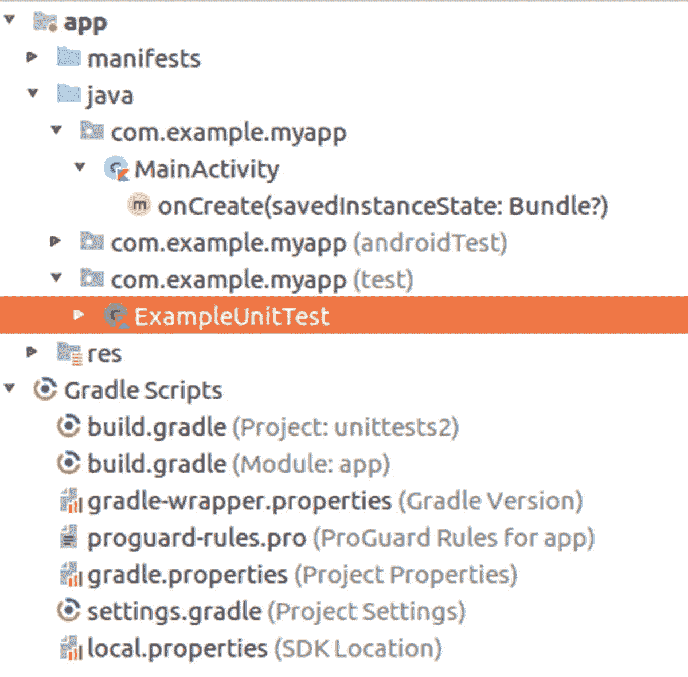

# 14.测试

关于信息技术中的测试已经说了很多。在过去的几十年中，测试获得了广泛的关注，这有三个原因。

*   测试是开发者和用户之间的接口。

*   测试在某种程度上是可以被设计的。

*   测试有助于增加利润。

开发人员往往对他们的软件有偏见。这么说并没有冒犯的意思。很自然，如果你在某个主题上花了很多时间，你可能会失去预测新用户脑子里在想什么的能力。因此，强烈建议定期走出你的开发人员角色，问自己这样一个问题，“假设我对应用程序一无所知，如果我进入这个 GUI 工作流，它是否有意义，它是否容易遵循，是否很难犯不可恢复的错误？”测试对此有所帮助。它迫使开发人员扮演最终用户的角色，并问这个问题。

发展远不是一门工业工程科学。这是好消息也是坏消息。如果它有一个强大的工程路径，那么遵循一致同意的开发模式会更容易，其他开发人员也会更容易理解你在做什么。另一方面，不那么精确的可工程化也为更多的创造力打开了领域，并允许开发成为一门艺术。如今的测试倾向于优先考虑可工程性。这源于这样一个事实，你可以精确地说出软件应该做什么，完全不知道一行代码。因此，部分测试并不关心事情是如何在编码层面上完成的，从而消除了开发需求如何得到满足的过多可能性。这对于低级别的单元测试来说是不正确的，但是即使对于那些单元测试，你也可以看到软件工件契约和测试方法的强烈重叠。因此，测试可操作性的等级比单纯的开发要高一些。然而，因为测试只是开发过程的一个方面，作为一名开发人员，仍然有可能拥有一份有趣的工作，同时生活在两个世界中。你可以在开发代码时成为艺术家，在编写测试时成为工程师。

在开发链的另一端，根据您的意图，您可能希望让最终用户为您的应用程序花费一些钱。测试显然有助于避免因为你没有预料到的错误而产生的挫折感，让公众更容易购买你的应用。

关于 Android 的测试已经说了很多，你可以在 Android 官方文档中找到很好的信息和入门或高级视频。本章的其余部分应该被看作是关于测试问题的建议和经验知识的集合。我不打算介绍测试，涵盖它的每一个方面，但是我希望我可以给你一个你自己更深入研究的起点。

## 单元测试

单元测试针对类级别，测试应用程序的底层功能。我所说的“功能性”是指单元测试通常检查方法调用的输入和输出之间的确定性关系，可能但不一定以确定、直接的方式包括类实例的状态变量。

### 标准单元测试

在 Android 环境中，标准单元测试的运行不依赖于设备硬件或任何 Android 框架类，因此可以在开发机器上执行。

它们通常对库有用，而不是 GUI 相关的功能，这就是为什么这种单元测试的适用性在某种程度上对大多数 Android 应用程序是有限的。

然而，如果您的应用程序的类包含方法调用，并且您可以在给定各种输入集的情况下预测调用结果，那么使用标准单元测试是有意义的。将单元测试添加到您的应用程序中很容易。事实上，如果你使用 Android Studio 开始一个新项目，单元测试已经为你设置好了，你甚至会得到一个样本测试类，如图 [14-1](#Fig1) 所示。



图 14-1

初始单元测试设置

因此，您可以立即开始使用该测试类作为例子来编写单元测试；只需在源代码的`test`部分添加更多的测试类。

### 注意

虽然在技术上没有必要，但是一个常见的惯例是对测试类使用与被测试类相同的名称，加上`Test`。所以，`com.example.myapp.TheClass`的测试类应该叫做`com.example.myapp.TheClassTest`。

要在 Android Studio 中运行单元测试，右键单击`test`部分并选择 Run Tests in 或 Debug Tests in。

### 使用存根 Android 框架的单元测试

默认情况下，用于执行单元测试的 Gradle 插件包含一个 Android 框架的存根版本，每当调用 Android 类时都会抛出异常。

您可以通过将以下内容添加到应用程序的`build.gradle`文件来更改此行为:

```java
android {
  ...
  testOptions {
    unitTests.returnDefaultValues = true
  }
}

```

任何对 Android 类的方法的调用都不做任何事情，并根据需要返回`null`。

### 模拟 Android 框架的单元测试

如果您需要从单元测试内部访问 Android 类，并期望它们做真实的事情，使用社区支持的 Robolectric 框架作为单元测试实现是一个有效的选择。使用 Robolectric，您可以模拟点击按钮、读写文本以及许多其他与 GUI 相关的活动。尽管如此，所有这些都在您的开发机器上运行，这大大加快了测试速度。

要允许您的项目使用 Robolectric，请将以下内容添加到您的应用程序的`build.gradle`文件中:

```java
android {
  testOptions {
      unitTests {
          includeAndroidResources = true
      }
  }
}

dependencies {
  ...
  //testImplementation 'junit:junit:4.12'
  testImplementation "org.robolectric:robolectric:3.8"
}

```

例如，一个测试类模拟点击一个`Button`，然后检查点击动作是否更新了一个`TextView`，如下所示:

```java
package com.example.robolectric

import org.junit.runner.RunWith
import org.robolectric.RobolectricTestRunner
import org.robolectric.shadows.ShadowApplication
import android.content.Intent
import android.widget.Button
import android.widget.TextView
import org.junit.Test
import org.robolectric.Robolectric
import org.junit.Assert.*

@RunWith(RobolectricTestRunner::class)
class MainActivityTest {
  @Test
  fun clickingGo_shouldWriteToTextView() {
      val activity = Robolectric.setupActivity(
            MainActivity::class.java!!)
      activity.findViewById<Button>(R.id.go).
            performClick()
      assertEquals("Clicked",
            activity.findViewById<TextView>(
            R.id.tv).text)
  }
}

```

通过右键单击`test`部分并选择 Run Tests in 或 Debug Tests in，您可以像任何普通的单元测试一样开始那个测试。

更多测试选项和详情，请参见 Robolectric 主页 [`www.robolectric.org`](http://www.robolectric.org) 。

### 模拟单元测试

模仿意味着您让测试挂钩到 Android OS 函数的调用，并通过模仿它们的功能来模拟它们的执行。

如果你想在单元测试中包含模仿，Android 开发者文档建议你使用 Mockito 测试库。我建议更进一步，使用 PowerMock，它位于 Mockito 之上，但增加了更多功能，比如模仿静态或最终类。

要启用 PowerMock，请将以下内容添加到您的应用程序的`build.gradle`文件中(删除`powermock:`后的换行符):

```java
android {
  ...
  testOptions {
      unitTests.returnDefaultValues = true
  }
}

dependencies {
  ...
  testImplementation ('org.powermock:
        powermock-mockito-release-full:1.6.1') {
      exclude module: 'hamcrest-core'
      exclude module: 'objenesis'
  }
  testImplementation 'org.reflections:reflections:0.9.11'
 }
}

```

不要删除或注释掉`dependencies`部分中的`testImplementation 'junit:junit:4.12'`行，因为仍然需要它。`unitTests.returnDefaultValues = true`条目负责单元测试的存根 Android 实现，以防万一，不抛出异常。`reflections`包用于扫描包来搜索测试类。

作为一个重要的例子，我给出了一个向数据库写入条目的活动。我们将模拟实际的数据库实现，但仍然希望确保创建必要的表并执行`insert`语句。该活动如下所示:

```java
class MainActivity : AppCompatActivity() {

  override fun onCreate(savedInstanceState: Bundle?) {
      super.onCreate(savedInstanceState)
      setContentView(R.layout.activity_main)
  }

  fun save(v: View) {
      saveInDb(et.text.toString())
  }

  fun count(v: View) {
      val db = openOrCreateDatabase("MyDb",
            MODE_PRIVATE, null)
      with(db) {
          val resultSet = rawQuery(
                "Select * from MyItems", null)
          val cnt = resultSet.count
          Toast.makeText(this@MainActivity,
                "Count: ${cnt}", Toast.LENGTH_LONG).
                show()
      }
      db.close()
}

private fun saveInDb(item:String) {
    val tm = System.currentTimeMillis() / 1000
    val db = openOrCreateDatabase("MyDb",
          MODE_PRIVATE, null)
    with(db) {
        execSQL("CREATE TABLE IF NOT EXISTS " +
              "MyItems(Item VARCHAR,timestamp INT);")
        execSQL("INSERT INTO MyItems VALUES(?,?);",
              arrayOf(item, tm))
    }
    db.close()
  }
}

```

相应的布局文件如下所示:

```java
<?xml version="1.0" encoding="utf-8"?>
<LinearLayout
  xmlns:android=
        "http://schemas.android.com/apk/res/android"
  xmlns:app="http://schemas.android.com/apk/res-auto"
  xmlns:tools="http://schemas.android.com/tools"
  android:layout_width="match_parent"
  android:layout_height="match_parent"
  tools:context="com.example.powermock.MainActivity"
  android:orientation="vertical">

  <EditText
      android:id="@+id/et"
      android:layout_width="match_parent"
      android:layout_height="wrap_content"
      android:text=""/>
  <Button
      android:id="@+id/btnSave"
      android:text="Save"
      android:layout_width="match_parent"
      android:layout_height="wrap_content"
      android:onClick="save"/>
  <Button
      android:id="@+id/btnCount"
      android:text="Count"
      android:layout_width="match_parent"
      android:layout_height="wrap_content"
      android:onClick="count"/>
</LinearLayout>

```

它包含一个 ID 为`et`的`EditText`视图元素和两个调用活动的方法`save()`和`count()`的按钮。

对于测试本身，在源代码的`test`部分创建一个类`MainActivityTest`。内容如下:

```java
import android.database.sqlite.SQLiteDatabase
import org.junit.Test
import org.junit.runner.RunWith
import org.mockito.ArgumentMatcher
import org.powermock.core.classloader.annotations.
      PrepareForTest
import org.powermock.modules.junit4.PowerMockRunner
import org.mockito.BDDMockito.*
import org.mockito.Matchers
import org.powermock.reflect.Whitebox

@RunWith(PowerMockRunner::class)
@PrepareForTest(MainActivity::class)
class MainActivityTest {

@Test
fun table_created() {
    val activity = MainActivity()
    val activitySpy = spy(activity)
    val db = mock(SQLiteDatabase::class.java)

    // given
    given(activitySpy.openOrCreateDatabase(
          anyString(), anyInt(), any())).willReturn(db)

    // when
    Whitebox.invokeMethod<Unit>(
          activitySpy,"saveInDb","hello")

    // then
    verify(db).execSQL(Matchers.argThat(
          object : ArgumentMatcher<String>() {
        override
        fun matches(arg:Any):Boolean {
            return arg.toString().matches(
            Regex("(?i)create table.*\\bMyItems\\b.*"))
        }
    }))

}

    @Test
    fun item_inserted() {
        val activity = MainActivity()
        val activitySpy = spy(activity)
        val db = mock(SQLiteDatabase::class.java)

        // given
        given(activitySpy.openOrCreateDatabase(
              anyString(), anyInt(), any())).willReturn(db)

        // when
        Whitebox.invokeMethod<Unit>(
              activitySpy,"saveInDb","hello")

        // then
        verify(db).execSQL(Matchers.argThat(
              object : ArgumentMatcher<String>() {
            override
            fun matches(arg:Any):Boolean {
                return arg.toString().matches(
                Regex("(?i)insert into MyItems\\b.*"))
            }
        }), Matchers.argThat(
              object : ArgumentMatcher<Array<Any>>() {
            override
            fun matches(arg:Any):Boolean {
                val arr = arg as Array<Any>
                return arr[0] == "hello" &&
                      arr[1] is Number
            }
        }))
    }
}

```

`@RunWith(PowerMockRunner::class)`将确保 PowerMock 被用作单元测试运行程序，并且`@PrepareForTest(MainActivity::class)`准备了`MainActivity`类，所以即使它被标记为`final`(这是 Kotlin 默认的做法)，它也可以被模拟。

第一个函数`table_created()`应该确保在必要时创建表。它的作用如下:

*   我们实例化`MainActivity`，这是可能的，因为实例化不调用 Android 框架类。

*   我们将`MainActivity`实例包装成一个*间谍*。这允许我们挂钩方法调用来模拟实际的实现。

*   我们创建了一个对`SQLiteDatabase`的模拟，这样我们就可以在不实际使用真实数据库的情况下挂钩数据库操作。

*   接下来的`//given`、`//when`和`//then`部分遵循 BDD 开发风格。

*   在`//given`部分中，我们模拟出活动的`openOrCreateDatabase()`调用，并让它返回我们的模拟数据库。

*   在`//when`内部，我们称活动类的`private`方法为`saveInDb()`。在测试开发中调用私有方法是不被允许的，但是在这里我们没有其他的机会，因为我们不能使用`save()`方法并让它在没有更复杂工作的情况下访问`EditText`视图。由于所有的模拟准备，这个调用到达了真实的 activity 类，但是将使用模拟的数据库而不是真实的数据库。

*   在`//then`部分，我们可以检查`saveInDb()`的调用是否调用了适当的数据库操作来创建必要的表。为此，我们使用了一个`ArgMatcher`，它允许我们检查适当的方法调用参数。

测试函数`item_inserted()`做了几乎相同的事情，但是检查是否有合适的`insert`语句被发送到数据库。

在 Android Studio 中使用 PowerMock 作为 Kotlin 的单元测试运行程序有一个缺点:通常你可以使用*包*的上下文菜单来运行所有的单元测试，但是由于某些原因，这对于 PowerMock 和 Kotlin 来说并不适用。作为一种变通方法，我将一个单独的测试类作为一个套件，调用它在包中可以找到的所有测试类。这就是我们在 Gradle 构建文件中添加`testImplementation 'org.reflections:reflections:0.9.11'`的原因。

```java
@RunWith(TestAll.TestAllRunner::class)
class TestAll {
  class TestAllRunner(klass: Class<*>?,
        runners0: List<Runner>) :
        ParentRunner<Runner>(klass) {
      private val runners: List<Runner>

      constructor(clazz: Class<*>) : t
            his(clazz, listOf<Runner>()) {
      }

      init {
          val classLoadersList = arrayOf(
                  ClasspathHelper.contextClassLoader(),
                  ClasspathHelper.staticClassLoader())

          val reflections = Reflections(
                ConfigurationBuilder()
                  .setScanners(SubTypesScanner(false),
                        TypeAnnotationsScanner())
                  .setUrls(ClasspathHelper.
                        forClassLoader(
                        *classLoadersList))
                  .filterInputsBy(FilterBuilder().
                        include(FilterBuilder.
                        prefix(
                        javaClass.`package`.name))))

          runners = reflections.getTypesAnnotatedWith(
                RunWith::class.java).filter {
              clazz ->
              clazz.getAnnotation(RunWith::class.java).
                    value.toString().
                    contains(".PowerMockRunner")
          }.map { PowerMockRunner(it) }
      }

      override fun getChildren(): List<Runner> = runners

      override fun describeChild(child: Runner):
            Description = child.description

      override fun runChild(runner: Runner,
            notifier: RunNotifier) {
          runner.run(notifier)
      }
    }
}

```

这个类提供了自己的测试运行器实现，它使用`init ...`块中的`reflections`库来扫描包中的测试类。您现在可以在这个`TestAll`类上运行测试，它将依次运行它在包中找到的所有测试类。

## 集成测试

集成测试介于在开发机器上进行细粒度测试的单元测试和在真实或虚拟设备上运行的成熟的用户界面测试之间。集成测试也在设备上运行，但它们并不测试整个应用程序，而是在一个隔离的执行环境中测试选定的组件。

集成测试发生在源代码的`androidTest`部分。你还需要在应用程序的`build.gradle`文件中添加几个包，如下所示(去掉`androidTestImplementation`后的换行符):

```java
dependencies {
  ...
  androidTestImplementation
      'com.android.support:support-annotations:27.1.1'
  androidTestImplementation
      'com.android.support.test:runner:1.0.2'
  androidTestImplementation
      'com.android.support.test:rules:1.0.2'
}

```

### 测试服务

要测试具有绑定的服务，请编写如下代码:

```java
@RunWith(AndroidJUnit4::class)
class ServiceTest {

  // A @Rule wraps around the test invocation - here we
  // use the 'ServiceTestRule' which makes sure the
  // service gets started and stopped correctly.
  @Rule @JvmField
  val mServiceRule = ServiceTestRule()

  @Test
  fun testWithBoundService() {
      val serviceIntent = Intent(
          InstrumentationRegistry.getTargetContext(),
          MyService::class.java
      ).apply {
          // If needed, data can be passed to the
          // service via the Intent.
          putExtra("IN_VAL", 42L)
      }

      // Bind the service and grab a reference to the
      // binder.
      val binder: IBinder = mServiceRule.
            bindService(serviceIntent)

      // Get the reference to the service
      val service: MyService =
            (binder as MyService.MyBinder).getService()

      // Verify that the service is working correctly.
      assertThat(service.add(11,27), `is`(38))
  }
}

```

这用一个`add(Int, Int)`服务方法测试了一个名为`MyService`的简单服务。

```java
class MyService : Service() {
  class MyBinder(val servc:MyService) : Binder() {
      fun getService():MyService {
          return servc
      }
  }
  private val binder: IBinder = MyBinder(this)

  override fun onBind(intent: Intent): IBinder = binder

  fun add(a:Int, b:Int) = a + b
}

```

要运行集成测试，右键单击源代码的`androidTest`部分，并选择 Run Tests in。这将创建并上传一个 APK 文件，通过`InstrumentationRegistry.getTargetContext()`创建一个集成测试上下文，然后在设备上运行测试。

### 测试意向服务

除了官方文档声明，基于`IntentService`类的服务也可以进行集成测试。您不能使用`@Rule ServiceTestRule`来处理服务生命周期，因为意向服务有自己的何时开始和停止的想法。但是你可以自己处理生命周期。作为一个例子，我给出了一个简单意向服务的测试，该服务工作 10 秒钟，并通过一个`ResultReceiver`不断发回数据。

服务本身如下所示:

```java
class MyIntentService() :
    IntentService("MyIntentService") {
  class MyResultReceiver(val cb: (Double) -> Unit) :
        ResultReceiver(null) {
      companion object {
          val RESULT_CODE = 42
          val INTENT_KEY = "my.result.receiver"
          val DATA_KEY = "data.key"
      }
      override
      fun onReceiveResult(resultCode: Int,
            resultData: Bundle?) {
          super.onReceiveResult(resultCode, resultData)
          val d = resultData?.get(DATA_KEY) as Double
          cb(d)
      }
  }
  var status = 0.0
  override fun onHandleIntent(intent: Intent) {
      val myReceiver = intent.
              getParcelableExtra<ResultReceiver>(
                      MyResultReceiver.INTENT_KEY)
      for (i in 0..100) {
          Thread.sleep(100)
          val bndl = Bundle().apply {
              putDouble(MyResultReceiver.DATA_KEY,
                    i * 0.01)
          }
          myReceiver.send(MyResultReceiver.RESULT_CODE, bndl)
      }
  }
}

```

这里是测试类，也在源代码的`androidTest`部分:

```java
@RunWith(AndroidJUnit4::class)
class MyIntentServiceTest {

  @Test
  fun testIntentService() {
      var serviceVal = 0.0

      val ctx = InstrumentationRegistry.
            getTargetContext()
      val serviceIntent = Intent(ctx,
            MyIntentService::class.java
      ).apply {
          `package`= ctx.packageName
          putExtra(
              MyIntentService.MyResultReceiver.
                    INTENT_KEY,
              MyIntentService.MyResultReceiver( { d->
                      serviceVal = d
              }))
      }
      ctx.startService(serviceIntent)

      val tm0 = System.currentTimeMillis() / 1000
      var ok = false
      while(System.currentTimeMillis() / 1000 - tm0
            < 20) {

      if(serviceVal == 1.0) {
          ok = true
          break
      }
      Thread.sleep(1000)
    }

    assertThat(ok, `is`(true))
  }
}

```

这个测试调用服务，监听一会儿它的结果，当它检测到服务按预期完成了它的工作时，让测试通过。

### 测试内容提供商

为了测试内容提供商，Android 提供了一个名为`ProviderTestCase2`的特殊类，它启动一个隔离的临时环境，因此测试不会干扰用户的数据。例如，一个测试用例如下所示:

```java
@RunWith(AndroidJUnit4::class)
class MyContentProviderTest :
    ProviderTestCase2<MyContentProvider>(
    MyContentProvider::class.java,
    "com.example.database.provider.MyContentProvider") {

  @Before public override   // "public" necessary!
  fun setUp() {
      context = InstrumentationRegistry.
            getTargetContext()
      super.setUp()

      val mockRslv: ContentResolver = mockContentResolver
      mockRslv.delete(MyContentProvider.CONTENT_URI,
            "1=1", arrayOf())
  }

  @Test
  fun test_inserted() {
      val mockCtx: Context = mockContext
      val mockRslv: ContentResolver = mockContentResolver

      // add an entry
      val cv = ContentValues()
      cv.put(MyContentProvider.COLUMN_PRODUCTNAME,
            "Milk")
      cv.put(MyContentProvider.COLUMN_QUANTITY,
            27)
      val newItem = mockRslv.insert(
            MyContentProvider.CONTENT_URI, cv)

      // query all
      val cursor = mockRslv.query(
            MyContentProvider.CONTENT_URI,
            null, null, null)
      assertThat(cursor.count, `is`(1))

      cursor.moveToFirst()
      val ind = cursor.getColumnIndex(
            MyContentProvider.COLUMN_PRODUCTNAME)
      assertThat(cursor.getString(ind), `is`("Milk"))
  }
}

```

内容提供商对使用的列名、权限和 URI 有偏见。对于测试用例来说，重要的是使用模拟的内容解析器与内容提供者对话。

### 注意

注意`setUp()`中前两行的顺序。这和你在 2018 年 5 月起的安卓开发者文档里能读到的不一样。这里的医生是错的。

### 测试广播接收器

对于测试广播接收机，Android 测试框架并不特别关注。被测广播接收机实际做什么也很重要。假设它会产生某种副作用，例如向数据库中写入一些东西，那么您可以使用我们之前为内容提供者使用的相同测试上下文来模拟该数据库操作。

例如，如果您从`androidTest`源部分中查看下面的测试用例:

```java
import android.support.test.InstrumentationRegistry
import android.support.test.runner.AndroidJUnit4
import org.junit.Test
import org.junit.runner.RunWith
import org.junit.Assert.*
import org.hamcrest.Matchers.*
import android.content.Intent

@RunWith(AndroidJUnit4::class)
class BroadcastTest {
  @Test
  fun testBroadcastReceiver() {
      val context = InstrumentationRegistry.
            getTargetContext()

      val intent = Intent(context,
            MyReceiver::class.java)
      intent.putExtra("data", "Hello World!")
      context.sendBroadcast(intent)

      // Give the receiver some time to do its work
      Thread.sleep(5000)

      // Check the DB for the entry added
      // by the broadcast receiver
      val db = MyDBHandler(context)
      val p = db.findProduct("Milk")
      assertThat(p, isA(Product::class.java))
      assertThat(p!!.productName, `is`("Milk"))
  }
}

```

你可以看到我们使用了由`InstrumentationRegistry.getTargetContext()`提供的上下文。这将确保广播接收机和稍后的测试所使用的数据库为其数据使用临时空间。

您可以像启动任何其他集成测试一样启动此测试，方法是右键单击它或它所在的包，然后选择 Run 或 Run Tests in。

## 用户界面测试

进行用户界面测试，你可以研究用户故事，看看你的应用程序作为一个整体是否像预期的那样运行。这是两个框架:

*   表达

    使用 Espresso 编写针对您的应用程序的测试，忽略任何 interapp 活动。使用 Espresso，您可以做一些事情，例如当某个`View` ( `Button`、`TextView`、`EditText`等)出现时，做一些事情(输入文本，执行点击)，然后您可以检查是否出现一些后置条件。

*   **UI 自动机**

    使用 UI Automator 编写跨多个应用程序的测试。使用 UI Automator，您可以检查布局以找出活动的 UI 结构，模拟活动的动作，并检查 UI 元素。

有关如何使用它们的详细信息，请参考在线文档。例如，在您最喜欢的搜索引擎中输入 *android 自动化 ui 测试*来查找资源。