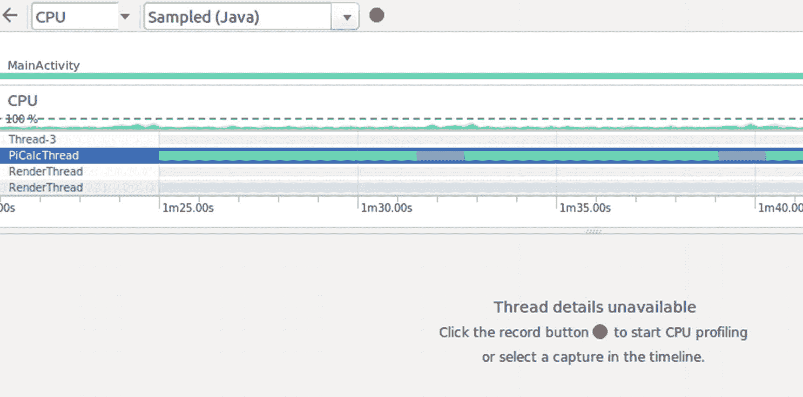
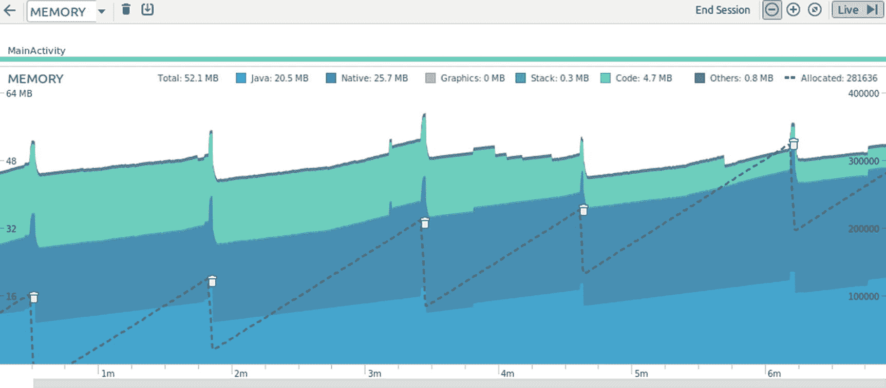
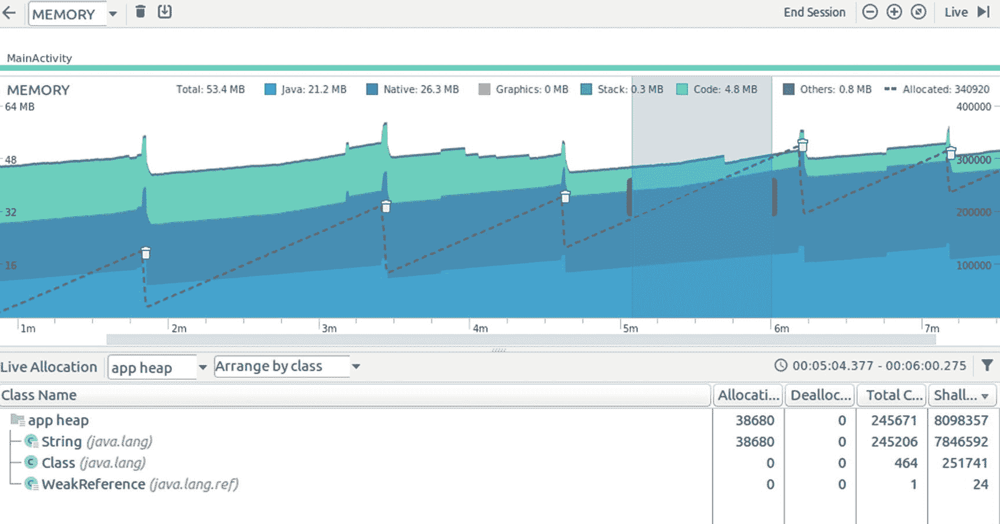

# 十五、故障排除

在前一章，我们讨论了测试你的应用的方法。如果测试失败，日志通常会告诉你到底发生了什么，如果这还不够，你可以扩展应用的日志来查看哪里出错了。

但是，即使有最好的测试概念，你的应用仍然有可能不像预期的那样运行。首先，从功能角度来看，它有时可能做不了正确的事情。其次，从非功能的角度来看，它可能表现不佳，这意味着随着时间的推移，它会耗尽内存资源，或者在速度方面表现不佳。

在这一章中，我们将讨论修复你的应用可能暴露的问题的技术。我们将讨论日志记录、调试和监控，以及 Android Studio 和 SDK 中的工具在这些主题方面对我们的帮助。

## 记录

登录 Android 很容易；您只需导入`android.util.Log`，并在代码中编写类似`Log.e("LOG", "Message")`的语句来发布日志消息。Android Studio 随后会帮助您收集、过滤和分析日志记录。

虽然使用这种日志功能进行开发非常方便，但是在发布应用时，就会出现问题。您不希望影响应用的性能，文档建议删除所有日志记录，这基本上等于否定了您在日志记录中所做的所有工作。如果您的用户后来报告了问题，您可以添加日志记录语句进行故障排除，在修复完成后再删除它们，以此类推。

为了纠正这个过程，我建议从一开始就在日志记录周围添加一个简单的包装器。

```kt
class Log {
  companion object {
      fun v(tag: String, msg: String) {
          randroid.util.Log.v(tag, msg)
      }

      fun v(tag: String, msg: String, tr: Throwable) {
          android.util.Log.v(tag, msg, tr)
      }

      fun d(tag: String, msg: String) {
          android.util.Log.d(tag, msg)
      }

      fun d(tag: String, msg: String, tr: Throwable) {
          android.util.Log.d(tag, msg, tr)
      }

      fun i(tag: String, msg: String) {
          android.util.Log.i(tag, msg)
      }

      fun i(tag: String, msg: String, tr: Throwable) {
          android.util.Log.i(tag, msg, tr)
      }

      fun w(tag: String, msg: String) {
          android.util.Log.w(tag, msg)
      }

      fun w(tag: String, msg: String, tr: Throwable) {
          android.util.Log.w(tag, msg, tr)
      }

      fun w(tag: String, tr: Throwable) {
          android.util.Log.w(tag, tr)
      }

      fun e(tag: String, msg: String) {
          android.util.Log.e(tag, msg)
      }

      fun e(tag: String, msg: String, tr: Throwable) {
          android.util.Log.e(tag, msg, tr)
      }
  }
}

```

然后，您可以使用与 Android 标准相同的简单日志记录符号，但是以后您可以自由地更改日志记录实现，而不需要修改其余的代码。例如，您可以添加一个简单的开关，如下所示:

```kt
class Log {
  companion object {
      val ENABLED = true

      fun v(tag: String, msg: String) {
          if(!ENABLED) return
          // <- add this to all the other statements
          android.util.Log.v(tag, msg)
      }
      ...
  }
}

```

或者，您可以只为虚拟设备启用日志记录。不幸的是，没有简单可靠的方法来确定你的应用是否运行在虚拟设备上。博客中介绍的所有解决方案都有其优点和缺点，并且可能会因新的 Android 版本而发生变化。相反，您可以做的是将构建变量传输到您的应用。为此，在您的应用的`build.gradle`文件中添加以下内容:

```kt
buildTypes {
    release {
        ...
        buildConfigField "boolean", "LOG", "false"
    }
    debug {
        ...
        buildConfigField "boolean", "LOG", "true"
    }
}

```

然后，在日志实现中，您只需替换以下内容:

```kt
val ENABLED = BuildConfig.LOG

```

它为调试 apk 打开日志记录，否则关闭日志记录。

使用完全不同的日志实现也是可能的。例如，要将日志切换到 Log4j，请在应用的`build.gradle`文件的`dependencies`部分添加以下内容(删除`implementation`后的换行符):

```kt
implementation
  'de.mindpipe.android:android-logging-log4j:1.0.3'
implementation
  'log4j:log4j:1.2.17'

```

要实际配置日志记录，请在您的自定义`Log`类中添加以下内容:

```kt
companion object {
  ...
  private val mLogConfigrator = LogConfigurator().apply {
      fileName = Environment.
          getExternalStorageDirectory().toString() +
          "/" + "log4j.log"
      maxFileSize = (1024 * 1024).toLong()
      filePattern = "%d - [%c] - %p : %m%n"
      maxBackupSize = 10
      isUseLogCatAppender = true
      configure()
  }

  private var ENABLED = true // or, see above
  // private var ENABLED = BuildConfig.LOG

  fun v(tag: String, msg: String) {
      if(!ENABLED) return
      Logger.getLogger(tag).trace(msg)
      // <- add similar lines to all the other
      // statements
  }
  ...
}

```

这个例子将日志写到由`Environment.getExternalStorageDirectory()`返回的目录中，这个目录在设备上通常映射到`/sdcard`。你也可以在其他地方这样做。如果您使用这里显示的外部存储器，不要忘记检查并可能获得适当的写权限！更准确地说，您需要在您的`AndroidManifest.xml`文件中包含以下内容:

```kt
<uses-permission android:name=
      "android.permission.WRITE_EXTERNAL_STORAGE"/>

```

一旦你的应用开始记录到设备内部的文件，你就可以通过使用文件浏览器从 Android Studio 内部轻松访问日志文件。通过查看➤工具 Windows ➤设备文件资源管理器启动它。然后双击打开日志文件，如图 [15-1](#Fig1) 所示。


图 15-1

访问设备上的日志文件

提高性能的最后一个方法是使用 lambdas 进行日志记录活动。为此，在您的自定义记录器中使用如下记录方法:

```kt
fun v(tag: String, msg: ()->String) {
      if(!ENABLED) return
      Logger.getLogger(tag).trace(msg.invoke())
}
... similar for the other statements

```

然后，在代码中发出如下日志消息:

```kt
Log.v("LOG",
      {-> "Number of items added = " + calculate()})

```

这种方法的优点是，如果未启用日志记录，则不会计算日志记录消息，从而为应用的生产版本增加了一些性能提升。

## 排除故障

从 Android Studio 内部调试就不多说了；它只是像预期的那样工作。

您在代码中设置断点，一旦程序流到达断点，您就可以单步执行程序的其余部分，并观察程序做什么以及变量如何更改它们的值。

## 性能监控

Android Studio 有一个非常强大的性能监视器，可以让您分析到方法级别的性能问题。要使用它，您必须首先找到一种方法，在循环中运行易受性能问题影响的那部分代码。您可以尝试使用测试来实现这一点，但是在代码中临时添加人工循环也是可行的。

然后，随着循环的运行，在 Android Studio 中打开视图➤工具 Windows ➤ Android Profiler。分析器首先抱怨高级分析没有启用，如图 [15-2](#Fig2) 所示。


图 15-2

高级分析警报

通过单击蓝色的运行配置链接来启用它。确保选中该框，如图 [15-3](#Fig3) 所示，然后点击确定。


图 15-3

高级分析设置

轮廓监视器随即出现，如图 [15-4](#Fig4) 所示。除了 CPU 分析，它还包含内存使用分析和网络监视器。


图 15-4

剖面仪通道

在那里，单击 CPU 通道将视图缩小到您在图 [15-5](#Fig5) 中看到的性能监视器图。


图 15-5

CPU 分析部分

滚动下方窗格中的线程，然后可以尝试查找可疑的线程。对于我在这里运行的示例，您可以看到 Thread-4 做了相当多的工作。将其重命名为 PiCalcThread(app 计算 pi)然后点击会显示一条信息，提示还没有捕获到数据，如图 [15-6](#Fig6) 所示。



图 15-6

CPU 分析线程

在窗格的顶部，可以看到捕捉控件，如图 [15-7](#Fig7) 所示。


图 15-7

CPU 分析捕获控件

对于我们即将开始的捕获，您可以从以下选项中进行选择:

*   *Sampled (Java)* :选择此项以定期捕获应用的调用堆栈。这是侵入性最小的捕捉方式，你通常会选择这个。

*   *Instrumented (Java):* 选择此项为应用中的每个方法调用的*收集数据。这本身将引入高性能影响，并将收集大量数据。如果样本变量不能提供足够的信息，请选择此项。*

*   *Sampled (Native)* :这个只能在 Android 8 (API 等级 26)开始的设备上使用。它将对本地调用进行采样。这深入到了 Android 的内部，你通常只会用这个进行深度分析。

一旦你选择了你的捕捉模式，点击红色的球开始捕捉。让捕获运行一段时间，然后结束它并开始分析收集的数据。Android Studio 为每个线程提供了不同的收集数据视图，并且各有千秋。一张*火焰图*见图 [15-8](#Fig8) ，一张*俯视图*见图 [15-9](#Fig9) 。


图 15-9

自上而下的图表


图 15-8

火焰图

对于这个例子，浏览图表可以看到，在`BigDecimal.divide()`中消耗了相当多的 CPU 能力。为了提高这个例子的性能，您可以尽量避免过于频繁地调用这个方法，或者您可以尝试找到一个替代方法。

作为分析的额外辅助，您可以打开过滤器。点击控制器面板右侧的过滤符号，如图 [15-10](#Fig10) 所示。Android Studio 随后会高亮显示图表中匹配的条目，如图 [15-11](#Fig11) 所示。


图 15-11

分析过滤器已打开


图 15-10

分析过滤器

有关性能监控的更多信息和细节，请参见 Android Studio 的文档。

## 内存使用监控

除了分析应用的性能，如前一章所示，Android Studio 的分析器还可以帮助您找到内存泄漏或与内存管理不善相关的问题。同样，将有问题的代码部分放入一个循环中并启动它。通过查看➤工具 Windows ➤ Android Profiler 打开 profiler。选择内存通道，分析器会立即显示内存使用图，如图 [15-12](#Fig12) 所示。


图 15-12

内存监视器

运行一段时间后，您可以看到内存使用率上升。这是因为在示例应用中，我添加了一个人为的内存泄漏。参见图 [15-13](#Fig13) 。



图 15-13

更长时间的内存分析

要开始分析，请使用鼠标选择适当的区域。然后视图立即切换到使用统计视图，如图 [15-14](#Fig14) 所示。



图 15-14

内存分析，已选择

要找到漏洞，请从“按类排列”模式切换到“按调用堆栈排列”通过单击、双击和/或按 Enter 键进入树。最终结果可能如图 [15-15](#Fig15) 所示。


图 15-15

内存分析，详细信息

几乎有 40，000 个分配的橙色线属于`run() (com.example.perfmonitor.A$go$1`，这正是我放置内存泄漏的点。

```kt
class A {
  fun go(l:MutableList<String>) {
      Thread {
          while (true) {
              l.add("" + System.currentTimeMillis())
              Thread.sleep(1)
          }
      }.start()
  }
}

```

如果这还不足以解决内存问题，您可以获取一个堆转储。为此，单击 profiler 窗口标题中的堆转储符号，如图 [15-16](#Fig16) 所示。


图 15-16

进行堆转储

然后，您可以使用前面介绍的相同技术，或者将堆导出为 HPROF 文件，并使用其他工具来分析转储。要执行这样的导出，单击堆转储视图左上角的导出图标，如图 [15-17](#Fig17) 所示。


图 15-17

保存堆转储

### 注意

这样的堆转储允许您确定对象引用关系——这超出了 Android Studio 的内存分析。这使您能够最大限度地了解内存结构，但是需要一些时间来熟悉堆转储分析工具并找到正确的答案。