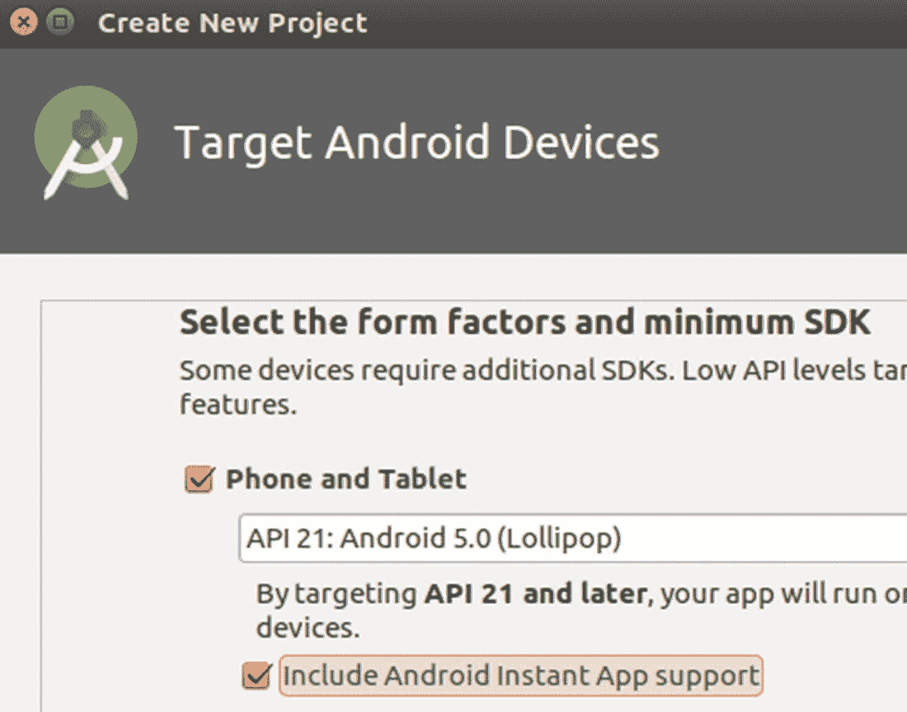
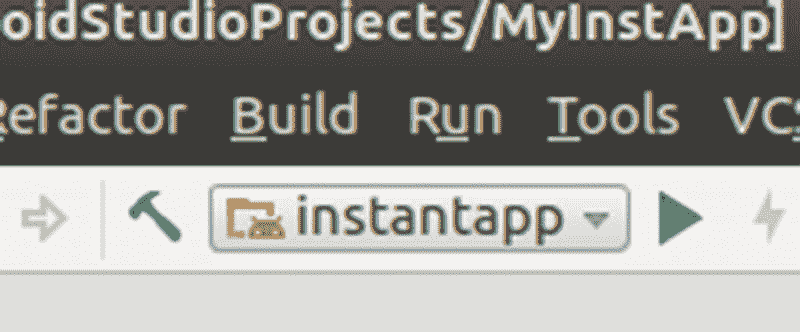
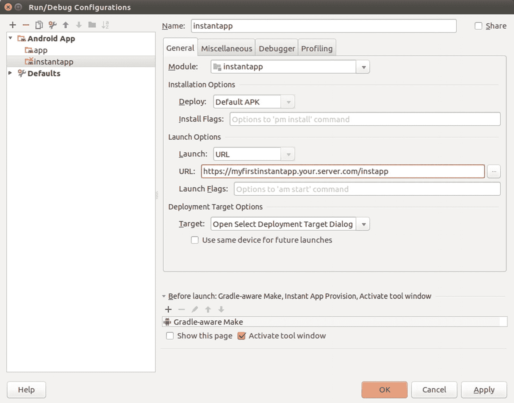

# 17.即时应用

即时应用允许设备用户使用应用，而无需实际安装它们。在 Google Play 商店上，你有时会看到的“尝试”按钮会启动这样一个即时应用。

## 开发即时应用

要开发即时应用，在创建 Android 应用时可以使用一个开关，如图 [17-1](#Fig1) 所示。



图 17-1

添加即时应用功能

比方说你给项目取名`instantapp`；该向导创建了四个模块，如下所示:

*   **基地**

    包含普通可安装应用变体和即时应用的基础。与许多博客所建议的相反，你不需要在这里放任何重要的东西。Android Studio 在这个模块中只创建了两个文件:一个是包含标记符`baseFeature true`的`build.gradle`文件，另一个是添加组件和代码时不需要调整的非常基本的`AndroidManifest.xml`文件。由于构建文件，基本模块依赖于可安装应用和即时应用变体。

注意:对于干净的设计纯粹主义者来说，可安装应用和即时应用都依次依赖于基础模块，这听起来像是一种循环依赖。但是，这种依赖性不能理解为 Java 包依赖性！

*   **app**

    包含可安装应用的构建说明。这不包含代码，因为可安装应用和即时应用共享相同的代码基础，这将进入`feature`模块。

*   **即时应用**

    包含即时应用的构建说明。这也不包含代码。

*   **功能**

    可安装应用和即时应用的共享代码在这里。

截至 2018 年 5 月，向导的输出与 Google Play 商店的预期不匹配。为了避免以后推出即时应用时出现问题，请更改`feature`模块的`AndroidManifest.xml`文件，并为`http`方案添加另一个`<data>`元素，如下所示:

```java
<data
    android:host="myfirstinstantapp.your server.com"
    android:pathPattern="/instapp"
    android:scheme="https"/>
<data
    android:scheme="http"/>

```

此外，意图过滤器必须添加属性`android:autoVerify = "true"`。Play store 会检查它，如果它丢失了，就会投诉。

其余的开发与正常的 Android 应用开发没有实质性的不同。只是运行即时 app 和你所知道的不一样。我们将在接下来的章节中讨论这一点。

## 在模拟器上测试即时应用

即时应用可以在模拟器上测试。为此，确保选择的运行配置显示`instantapp`，如图 [17-2](#Fig2) 所示。



图 17-2

运行配置

此外，如果您从按下灰色小三角时弹出的菜单中打开编辑配置，您应该会看到选择了 URL 启动方法，如图 [17-3](#Fig3) 所示。



图 17-3

发射方法

对于在仿真设备上运行，输入的 URL 是否存在并不重要，但它必须与来自模块`feature`的`AndroidManifest.xml`的意图过滤器内的主机规范相匹配。否则，配置屏幕会报错。

### 警告

对于开发来说，添加一个`android:port`属性会导致问题。根据你的具体情况，当你想推出你的应用时，你可能需要一个，但是在开发期间不要使用它，或者把它注释掉！

## 构建部署工件

在推出即时应用之前，你必须为可安装应用和即时应用创建签名的 apk。

### 警告

两个变体和基本模块都需要有相同的版本信息，如它们的`build.gradle`文件所示。

为了创建部署工件，对`app`和`instantapp`进行两次构建➤生成签名的 APK。

可安装应用的部署工件通常是一个`.apk`文件，而即时应用是一个 zip 文件。

## 准备深层链接

深层链接是显示在网页或应用中的 URL，并链接到即时应用的功能。每当用户点击或点击一个 URL 时，借助于推出的即时应用的意图过滤器，相应的功能会立即下载并启动，而无需安装。

对于生产应用，连接到即时应用的 URL 必须存在，并且域的根必须有一个名为`.well-known/assetlinks.json`的文件。顺便说一句，谷歌验证你所指的域名存在，是你的。这个文件的结构在在线文档中有解释，但是 Android Studio 也有一个向导:进入工具➤应用链接助手。

如果手动生成文件`assetlinks.json`，则需要输入证书指纹。除非您已经拥有它，否则您可以通过以下方式获得它:

```java
keytool -list -v -keystore my-release-key.keystore

```

这种文件的一个示例如下，其中指纹被裁剪:

```java
[{
  "relation":
      ["delegate_permission/common.handle_all_urls"],
  "target": {
    "namespace": "android_app",
    "package_name": "com.example",
    "sha256_cert_fingerprints":
        ["14:6D:E9:83:C5:73:06...50"]
  }
}]

```

## 推出即时应用

要使用 Google Play 控制台推出即时应用，您必须创建一个新应用，然后推出可安装应用和即时应用。

在此过程中，Play console 将执行各种检查，以查看您的应用中的所有配置是否正确，它还将检查您的服务器是否如前一部分所述设置正确。