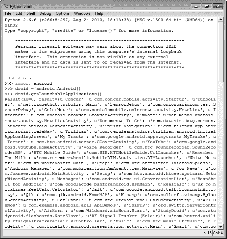
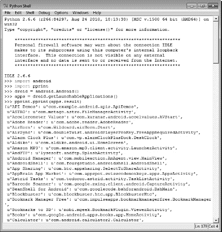
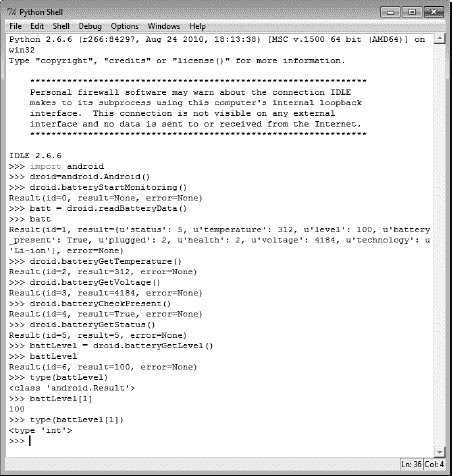
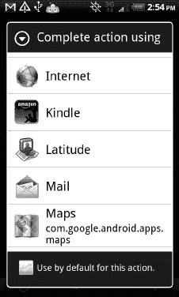
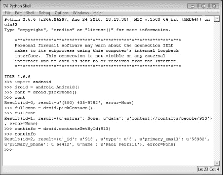
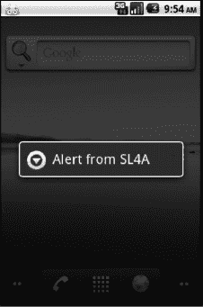
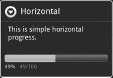

# 五、探索 Android API

本章将深入研究 Android 应用编程接口(API ),并展示如何使用 Python 调用不同的函数。

 **注意** Python 无法通过 SL4A 的 r3 版本访问每一个 Android API。其他语言如 BeanShell 确实有这种能力，并且将用于查看一些缺失的功能。

本章将在很大程度上依赖于对[第 1 章](01.html#ch1)中介绍的概念的基本理解。主题包括 Android 活动和意图、JSON、Python 类型和 RPC。我将带您浏览每个 API facade，并在适当的地方包括如何使用它们的例子。它们都有自己的描述性名称，比如`cameraCapturePicture`和`recognizeSpeech`。

所有与 Android API 的双向通信都使用 JSON 作为传递数据的底层结构。如果你跳过了 JSON 的部分，你可能想回到[第 1 章](01.html#ch1)并阅读这一部分。JSON 并不复杂，但是如果您不知道自己在看什么，它可能会有些混乱。Python 很好地处理了 JSON，甚至有一个内置的过程`pprint`，可以很好地打印 JSON 结构。[图 5-1](#fig_5_1) 显示了不使用 pretty print 例程时 API 调用`getLaunchableApplications`的返回结果。

***图 5-1。**getLaunchableApplications API 调用的 JSON 返回示例*

[图 5-2](#fig_5_2) 显示了相同的结果，但是使用了`pprint`模块，以一种更加易读的形式。

***图 5-2。**使用 pprint 格式化的 getLaunchableApplications JSON 示例*

另一个概念，我假设你在这一点上理解是一个 Android 活动。SL4A 提供了一个启动并忘记(或启动并等待)Android 活动完成的接口。

### 探索 Android APIs

在 Python 中，所有 SL4A API 调用都返回一个包含三个字段的对象:

*   `id`:与 API 调用相关的严格递增的数字 ID
*   `result`:API 调用的返回值，如果没有返回值则为`null`
*   `error`:对发生的任何错误的描述，如果没有发生错误，则为`null`

`android.py`文件用三种方法定义了一个 Android 类。通过研究`_rpc`方法，可以了解 API 请求是如何使用 RPC 调用和 JSON 传递给底层操作系统的:

`def _rpc(self, method, *args):
data = {'id': self.id,
'method': method,
'params': args}
request = json.dumps(data)
self.client.write(request+'\n')
self.client.flush()
response = self.client.readline()
self.id += 1
result = json.loads(response)
if result['error'] is not None:
print result['error']
# namedtuple doesn't work with unicode keys.
return Result(id=result['id'], result=result['result'],
error=result['error'], )`

同样的基本概念也适用于其他语言。在 BeanShell 中，代码如下所示:

`call(String method, JSONArray params) {
JSONObject request = new JSONObject();
request.put("id", id);
request.put("method", method);
request.put("params", params);
out.write(request.toString() + "\n");
out.flush();
String data = in.readLine();
if (data == null) {
return null;
}
return new JSONObject(data);
}`

### 安卓外观

第 1 章讨论了 SL4A 用来向底层 Android API 传递信息的 RPC 机制的基础知识。每个支持的 API 函数在每种 SL4A 语言中都有一个对应的接口，称为 *facade* ，带有 API 所需的适当参数。这些参数中有些是强制性的，有些是可选的。[表 5-1](#tab_5_1) 显示了顶层立面以及它们提供的访问功能。附录 A 包含所有 SL4A API 调用的完整列表。

***表 5-1。**安卓 API 外观*

<colgroup><col align="left" valign="top" width="25%"> <col align="left" valign="top" width="65%"></colgroup> 
| `ActivityResultFacade` | 设置活动的返回值 |
| `AndroidFacade` | 常见的 Android 功能 |
| `ApplicationManagerFacade` | 获取有关已安装应用的信息 |
| `BatteryManagerFacade` | 公开电池管理器 API |
| `BluetoothFacade` | 允许访问蓝牙功能 |
| `CameraFacade` | 所有与摄像机相关的操作 |
| `CommonIntentsFacade` | 通用 Android 意图 |
| `ContactsFacade` | 提供对联系人相关功能的访问 |
| `EventFacade` | 公开作为 RPC 从事件队列读取的功能和作为纯 Java 函数写入事件队列的功能 |
| `EyesFreeFacade` | 为 API 3 或更低版本提供文本到语音(TTS)服务 |
| `LocationFacade` | 暴露与`LocationManager`相关的功能 |
| `MediaPlayerFacade` | 展示基本的`mediaPlayer`功能 |
| `MediaRecorderFacade` | 记录媒体 |
| `PhoneFacade` | 暴露`TelephonyManager`功能 |
| `PreferencesFacade` | 允许访问`Preferences`界面 |
| `SensorManagerFacade` | 暴露与`SensorManager`相关的功能 |
| `SettingsFacade` | 公开电话设置功能 |
| `SignalStrengthFacade` | 显示信号强度功能 |
| `SmsFacade` | 提供对 SMS 相关功能的访问 |
| `SpeechRecognitionFacade` | 包含与 Android 语音转文本功能相关的 RPC 实现 |
| `TextToSpeechFacade` | 为 API 4 或更高版本提供 TTS 服务 |
| `ToneGeneratorFacade` | 产生双音多频音 |
| `UiFacade` | 创建和处理对话框中的信息 |
| `WakeLockFacade` | 展示了`PowerManager`的一些功能(特别是唤醒锁) |
| `WebCamFacade` | 从前置摄像头捕捉视频 |
| `WifiFacade` | 管理 WiFi 无线电的所有方面 |

#### 活动结果面

这个 facade 提供了一种机制来显式地设置脚本如何将信息作为活动返回。每当使用 Android API 调用`startActivityForResult()`启动脚本 APK 时都会用到它。使用这种方法意味着您的脚本将返回某种结果，设置结果的类型(`resultValue`)和`RESULT_CANCELED` (0)或`RESULT_OK` (-1)是很重要的。

#### 雄激素

这个外观有点包罗万象，提供了 Android 操作系统(OS)的许多可用功能。有检查当前执行包版本号(`getPackageVersion`和`getPackageVersionCode`)和 SL4A 版本(`requiredVersion`)的功能。第二个提供了一个很好的机制，在您的代码需要一些特定于版本的特性时，可以检查 SL4A 的最低版本。

这个 facade 里有几个弃用的调用，包括`getInput`和`getPassword`。两者都被更新的 Android API 调用所取代，但是仍然支持旧的脚本。[图 5-3](#fig_5_3) 显示了如果你使用一个废弃的 API 调用，你会看到什么。

***图 5-3。**不推荐使用的 API 调用的通知消息*

每当您使用不推荐使用的函数时，SL4A 都会在您的通知窗口中添加一条消息。您将在这里找到启动 Android 活动并等待结果的函数，或者只是启动并返回。像 Windows 和 Linux 一样，Android 支持剪贴板的概念，用于在应用之间复制和粘贴信息。您可以使用函数`getClipboard`和`setClipboard` functionsfunction 从脚本中完成此操作。

`log`和`notify`功能提供了显示(`notify`)或保存(`log`)信息的方法，以便使用 logcat 应用查看。还有一个常用的`makeToast`功能，它只是在设备屏幕上短暂闪烁一条信息，然后删除它。如果您希望通过振动设备引起用户的注意，您可以使用`vibrate`功能。`sendEmail`功能将启动一个发送电子邮件的活动(该活动将取决于您在设备上加载的能够发送电子邮件的应用)并填充`recipient`、`subject`、`body`和`attachment`字段。您将不得不使用该应用来实际发送消息。在下一章中，我将向您展示另一种不需要外部活动就能发送电子邮件的方法。

在引言中，我解释了 Android 架构，以及活动如何适应不同应用的执行。SL4A 的早期版本包括启动活动(`startActivity`)和启动活动并等待结果(`startActivityForResult`)的能力。SL4A r4 引入了两个额外的函数，允许您使用意图(`startActivityIntent`)启动活动，以及使用结果意图(`startActivityForResultIntent`)启动活动。SLA r4 中的另一个新函数调用是`makeIntent`。需要此函数来创建一个 intent，供需要 intent 的任何一个`startActivity`调用使用。这个函数的返回是一个表示意图的对象。

SL4A r4 还在 Android facade 中引入了`getConstants`函数，帮助您确定特定 Android 类中有哪些常量可用。当您想要查询内容供应器，但是不知道有什么可用时，这个函数非常方便。下面的一行代码演示了如何使用该调用来显示联系人提供程序中可用的常量:

`res=droid.getConstants("android.provider.ContactsContract$CommonDataKinds$Phone").result`

Android 2.2 将从联系人提供程序返回总共 99 个常量。以下是一些常量的简短列表:

`{u'AGGREGATION_MODE': u'aggregation_mode',
u'AVAILABLE': 5,
u'AWAY': 2,
u'CONTACT_ID': u'contact_id',
u'CONTACT_PRESENCE': u'contact_presence',
u'CONTACT_STATUS': u'contact_status',
u'CONTACT_STATUS_ICON': u'contact_status_icon',
u'CONTACT_STATUS_LABEL': u'contact_status_label',
u'CONTACT_STATUS_RES_PACKAGE': u'contact_status_res_package',
u'CONTACT_STATUS_TIMESTAMP': u'contact_status_ts',
u'CONTENT_FILTER_URI': u'content://com.android.contacts/data/phones/filter',
u'CONTENT_ITEM_TYPE': u'vnd.android.cursor.item/phone_v2',
u'CONTENT_TYPE': u'vnd.android.cursor.dir/phone_v2',
u'CONTENT_URI': u'content://com.android.contacts/data/phones',
u'CUSTOM_RINGTONE': u'custom_ringtone',
u'DATA': u'data1',
u'DATA1': u'data1',
u'DATA2': u'data2',
u'DATA_VERSION': u'data_version',
u'DELETED': u'deleted',
u'DISPLAY_NAME': u'display_name',
u'DISPLAY_NAME_ALTERNATIVE': u'display_name_alt',
u'DISPLAY_NAME_PRIMARY': u'display_name',
u'DISPLAY_NAME_SOURCE': u'display_name_source',
u'DO_NOT_DISTURB': 4,
u'HAS_PHONE_NUMBER': u'has_phone_number',
u'IDLE': 3,
u'INVISIBLE': 1,
u'IN_VISIBLE_GROUP': u'in_visible_group',` `u'IS_PRIMARY': u'is_primary',
u'LAST_TIME_CONTACTED': u'last_time_contacted',
u'LOOKUP_KEY': u'lookup',
u'MIMETYPE': u'mimetype',
u'NAME_RAW_CONTACT_ID': u'name_raw_contact_id',
u'NAME_VERIFIED': u'name_verified',
u'NUMBER': u'data1',
u'_COUNT': u'_count',
u'_ID': u'_id'}`

同样的`getConstants`函数可以用来获得`android.content.Intent`中所有可用常数的列表。这将包括所有标准的 Android 意图。下面是将列表打印到控制台的一小段代码:

`import android
droid = android.Android()
myconst = droid.getConstants("android.content.Intent").result
for c in myconst:
print c,"=",myconst[c]`

运行此代码的结果将产生一个格式良好的列表，如下所示:

`ACTION_AIRPLANE_MODE_CHANGED = android.intent.action.AIRPLANE_MODE
ACTION_ALARM_CHANGED = android.intent.action.ALARM_CHANGED
ACTION_ALL_APPS = android.intent.action.ALL_APPS
ACTION_ANSWER = android.intent.action.ANSWER
ACTION_APP_ERROR = android.intent.action.APP_ERROR
ACTION_ATTACH_DATA = android.intent.action.ATTACH_DATA
ACTION_BATTERY_CHANGED = android.intent.action.BATTERY_CHANGED
ACTION_BATTERY_LOW = android.intent.action.BATTERY_LOW
ACTION_BATTERY_OKAY = android.intent.action.BATTERY_OKAY
ACTION_BOOT_COMPLETED = android.intent.action.BOOT_COMPLETED
ACTION_BROADCAST_KEYEVENT = android.intent.action.BROADCAST_KEYEVENT
ACTION_BROADCAST_MOTIONEVENT = android.intent.action.BROADCAST_MOTIONEVENT
ACTION_BROADCAST_TRACKBALLEVENT = android.intent.action.BROADCAST_TRACKBALLEVENT
ACTION_BUG_REPORT = android.intent.action.BUG_REPORT
ACTION_CALL = android.intent.action.CALL
ACTION_CALL_BUTTON = android.intent.action.CALL_BUTTON
ACTION_CALL_EMERGENCY = android.intent.action.CALL_EMERGENCY
ACTION_CALL_PRIVILEGED = android.intent.action.CALL_PRIVILEGED
ACTION_CAMERA_BUTTON = android.intent.action.CAMERA_BUTTON
ACTION_CHECK_CONTACT_DB_CORRUPT = android.intent.action.ACTION_CHECK_CONTACT_DB_CORRUPT
ACTION_CHOOSER = android.intent.action.CHOOSER
ACTION_CLOSE_SYSTEM_DIALOGS = android.intent.action.CLOSE_SYSTEM_DIALOGS
ACTION_CONFIGURATION_CHANGED = android.intent.action.CONFIGURATION_CHANGED
ACTION_CONTACTS_CHANGE = anddroid.intent.action.CONTACTS_CHANGE
ACTION_CONTACTS_DB_READY = android.intent.action.CONTACTS_DB_READY
ACTION_CONTACT_DATABASE_CORRUPT = android.intent.action.CONTACT_DB_CORRUPT
ACTION_CREATE_SHORTCUT = android.intent.action.CREATE_SHORTCUT
ACTION_DATE_CHANGED = android.intent.action.DATE_CHANGED
ACTION_DEFAULT = android.intent.action.VIEW
ACTION_DELETE = android.intent.action.DELETE` `ACTION_DELETE_THREAD_MSG = android.intent.action.DELETE_THREAD_MSG
ACTION_DEVICE_STORAGE_LOW = android.intent.action.DEVICE_STORAGE_LOW
ACTION_DEVICE_STORAGE_OK = android.intent.action.DEVICE_STORAGE_OK
ACTION_DIAL = android.intent.action.DIAL
ACTION_DIALER_NEED_CHANGE = android.intent.action.DIALER_NEED_CHANGE
ACTION_DOCK_EVENT = android.intent.action.DOCK_EVENT
ACTION_EDIT = android.intent.action.EDIT`

有了这些信息，你就可以使用`makeIntent`功能和`startActivityForResultIntent`来访问隐藏在 Android 操作系统深处的几乎任何功能。这里有一小段使用这种技术来显示您的通话记录:

`import android
droid = android.Android()
myconst = droid.getConstants("android.provider.CallLog$Calls").result
calls=droid.queryContent(myconst["CONTENT_URI"],["name","number","duration"]).result
for call in calls:
print call`

注意，这段代码首先使用`getConstants`函数来确定`CONTENT_URI`的值，然后使用`queryContent`(`ContactsFacade`的一部分)调用来实际返回结果。

#### 应用管理学院

这个 facade 中的四个函数可以列出所有可用的和正在运行的包，启动一个活动，或者强制停止一个包。您可以使用这些调用来编写自己的任务管理器或终止一组特定的包。请注意，`getLaunchableApplications`调用可能需要一段时间返回结果，这取决于您在设备上加载的应用数量。[图 5-1](#fig_5_1) 显示了原始 JSON 格式的部分应用列表，而[图 5-2](#fig_5_2) 显示了使用`pprint`函数格式化的相同列表。

#### 电池组管理学院

任何与你的设备电池有关的东西都在这里。这个门面是一个谈论监控概念的好地方。在许多其他情况下，为了收集有意义的数据，您必须启动和停止对某种类型信息的监控。图 5-4 展示了一个使用这些 API 调用的交互式会话的例子。

这也是指出每个 API 调用返回的信息中的一些差异的好地方。Python IDLE 工具使得从工作站键盘舒适地探索不同的调用变得非常容易。这是假设您已经在设备上启动了 SL4A，启动了一个服务器，并使用 ADB 连接到它(如果这些都没有意义，请参见[第 2 章](02.html#ch2))。在接下来的例子中，你会看到三个箭头，如`>>>`所示，表示来自 IDLE 的提示。如果您想自己尝试代码，请不要键入这些内容。

正如第一章中提到的，Python 中的一切都是对象。API 调用的每个返回都是一个结果对象。如果您检查来自`_rpc`方法的最后一行，您将看到以下内容:

`return Result(id=result['id'], result=result['result'],
error=result['error'], )`

要访问 Python 调用的结果，可以将它赋给一个变量，然后计算结果，如下所示:

`>>> apps = droid.getLaunchableApplications()
>>> pprint.pprint(apps.result)`

要确定 Python 中对象的类型，可以使用`type()`函数，如下所示:

`>>> type(apps)
<class 'android.Result'>
>>> type(apps.result)
<type 'dict'>`

这表示`apps`是从类`android.Result`派生的对象。下面一行显示了`apps.result`的类型是`dict`，这在 Python 中实质上是一个键/值对。在 Java 中，这将被表示为一个`Map`对象。[图 5-4](#fig_5_4) 显示了检查不同电池管理 API 调用返回的结果。

***图 5-4。**电池管理 API 调用示例*

#### 蓝星脸

Android 设备拥有广泛的蓝牙功能，这可能是你在移动设备上想不到的。`BluetoothFacade`提供对所有这些功能的访问，从基本的连接特性到发送和接收 ASCII 和二进制数据。最简单的层次是用于控制连接的`bluetoothAccept`、`bluetoothConnect`、`bluetoothMakeDiscoverable`和`bluetoothStop`。您还可以使用`checkBluetoothState`和`toggleBluetoothState`来简单地打开和关闭蓝牙无线电，或者只是检查它处于什么状态。虽然`toggleBluetoothState`功能听起来像是简单地翻转蓝牙无线电的当前状态，但它实际上会用一个可选参数将其设置为您想要的状态。默认情况下，这将在设备上弹出一个请求许可的屏幕，如图[图 5-5](#fig_5_5) 所示。

***图 5-5。**蓝牙 API 提示权限*

`BluetoothFacade`还支持与设备之间的数据传输。这里的选项包括发送/接收 ASCII 字符的`bluetoothRead`和`bluetoothWrite`。还有一个`bluetoothReadLine`可以读取整行文本。发送和接收二进制数据有`bluetoothWriteBinary`和`bluetoothReadBinary`。这两个功能使得使用蓝牙向/从您的设备传输二进制文件成为可能。

#### 照相机

当你从一个剧本中拍摄一张照片时，你基本上有两种选择。你可以抓拍相机当前正在拍摄的任何东西(`cameraCapturePicture`)，或者启动图像捕捉应用(`cameraInteractiveCapturePicture`)。这是严格用于使用设备背面的镜头。对于带有前置摄像头的设备，有`WebCamFacade`。应该注意，这两个 API 调用都要求您在设备上传递一个路径来存储图像。如果您不熟悉如何访问不同的目录，您应该花些时间浏览您的设备。在大多数设备上，通常会有一个名为`sdcard`的可移动设备。安卓相机应用在`/sdcard/DCIM/100Media`存储图片。

顺便说一下，你应该知道 Android 有一个媒体扫描仪应用，它可以查找特定的文件类型，例如图片的`.jpg`，并将这些图像添加到默认应用的浏览列表中，例如 Gallery。如果您不希望这种情况发生，您可以使用带有前导句点的隐藏目录，例如`/sdcard/.donotscan`。你也可以添加一个名为`.nomedia,`的文件，Android 应该会忽略该目录中的媒体文件。

#### 普通意向下降

Android 操作系统的 2.x 版本通过`CommonIntentsFacade`提供了一组通用意图。对于扫描条形码，有`scanBarcode`功能。底层代码将试图解释您正在扫描的内容，然后将其作为结果呈现出来。为了测试这个功能，我使用了几行 Python 代码来启动条形码扫描仪，然后用它的二维码指向 SL4A 主页，以下载`.apk`文件。这是我得到的:

`>>> import android
>>> droid = android.Android()
>>> res = droid.scanBarcode()
>>> res.result
{u'extras': {u'SCAN_RESULT': u'http://android-scripting.googlecode.com/files/sl4a_r3.apk',
u'SCAN_RESULT_FORMAT': u'QR_CODE'}}`

接下来是`search` API 函数。您可以使用通用字符串调用此 API 函数，如下所示:

`>>> search('pizza')`

接下来会发生什么取决于您的设备上有多少不同的应用能够执行搜索。[图 5-6](#fig_5_6) 显示了典型安卓手机上的几个选项。你可以选择一个应用并将其设为默认，但它可能不会给你想要的结果。调用`pick`函数显示基于作为参数传递的统一资源标识符(URI)选择的内容。您可以使用它来显示具有以下代码的联系人列表:

`>>> import android
>>> droid = android.Android()
>>> droid.pick('u'content://contacts/people')`

`view` API 函数基于作为参数传递的 URI 启动一个查看动作。这个函数还接受两个可选参数:`type`是一个表示 URI MIME 类型的字符串，`extras`是一个 JSON 对象，包含意图所需的任何额外信息的映射。理解如何使用 API 调用需要了解一些意图和 URIs。基础知识包含在第二章中，尽管重温一下谷歌 Android 开发者网站也无妨。

如果你只是想启动联系人应用，那么使用`viewContacts`。这个函数使用启动活动调用来简单地启动应用，然后返回给调用者。如果您的设备上碰巧存储了任何 HTML 内容，您可以使用`viewHtml`功能来显示它。它需要一个完整的文件路径作为单个参数。要在地图上搜索某样东西，请使用带有字符串参数的`viewMap`函数，该参数包含您要查找的内容。这将启动地图应用，搜索栏包含您的搜索字符串。

***图 5-6。**搜索 API 函数的结果*

#### 联系

这个外观让您可以访问任何与联系人有关的东西。如果你只是想得到一个包含你设备上所有联系人的大列表，使用`contactsGet`。您可能希望首先使用`contactsGetAttributes`呼叫来找出每个联系人的可用信息。随着谷歌改进他们的产品，这个列表可能会随着时间的推移而改变。在检索整个列表之前，您可能想使用的另一个调用是`contactsGetCount`。这只是返回存储在设备上的联系人总数。

如果您需要选择一个特定的联系人用于其他操作，请使用`pickContact`功能。这将启动 People 应用，并显示搜索框和键盘。请注意，它返回指向所选联系人的意图。如果你只需要一个联系人的电话号码，你可以使用`pickPhone`功能。这将像以前一样显示联系人列表，但只在您选择姓名后给出相关的电话号码。该函数返回作为结果一部分的电话号码。这里最后两个函数是`contactsGetById`和`contactsGetIds`。这两者结合在一起，允许您只使用 ID 来选择特定的联系人。[图 5-7](#fig_5_7) 显示了这些功能中的一部分。

***图 5-7。**不同联系人 API 函数的结果*

SL4A r4 为 contacts facade 引入了一个新的`queryContent`函数。这个函数总共有五个参数，为了完全定义您希望查询返回的内容，您需要传递它。第一个参数是您希望查询的内容供应器的 URI。对于联系人数据库，这将是`content://com.android.contacts/data/phones`。其余的参数是可选的，但是如果你想使用默认值，你必须传递关键字'`None`'。第二个参数是数据库中您希望返回的列的列表。第三个参数是一个选择过滤器，用于选择要从数据库返回的特定行。最后两个参数是`selectionArgs`和`order`。

下面的一小段代码展示了如何使用这个函数:

`import android
droid = android.Android()
contacts = droid.queryContent('content://com.android.contacts/data/phones',\
['display_name','data1'],None,None,None).result
for c in contacts:
print c`

您还需要安装至少`PythonForAndroid_r6.apk`来运行这个例子。也就是说，您应该会看到该代码片段的输出，如下所示:

`[{u'data1': u'321-555-1212', u'display_name': u'John Doe'},
{u'data1': u'321-555-1212', u'display_name': u'Jane Doe'},
{u'data1': u'321-555-1212', u'display_name': u'Jed Doe'},
{u'data1': u'321-555-1234', u'display_name': u'John Smith'},
{u'data1': u'321-555-1234', u'display_name': u'Jane Smith'},
{u'data1': u'321-555-1234', u'display_name': u'Jill Smith'},
{u'data1': u'800-555-1212', u'display_name': u'Toll Free'}]`

#### 活动能力

Android 操作系统保留了一个事件队列，用于在应用之间异步传递信息。这个外观让您可以访问操作 Android 事件的函数。如果你只是想清除事件缓冲区，只需调用`eventClearBuffer`。要在队列中添加或删除事件，应该使用`eventPost`或`eventPoll`。为了等待一个事件，使用带有参数`eventName`的`eventWaitFor`，但是要注意这将阻止进一步的执行，直到指定的事件发生。

使用 SL4A API wiki 中的示例代码可以看到一个事件示例。我更新了代码以使用 SL4A r4 函数，如下所示:

`import android, time
droid = android.Android()
droid.startSensingTimed(1,1000)
e = droid.eventPoll(1).result
event_entry_number = 0
x = e[event_entry_number]['data']['xforce']`

函数是实现模态对话框的一种方式，我将在后面的章节中演示。如果您正在构建一个多线程的应用，它也可以作为一个跨线程的通信媒介。

#### 裸眼立面

这个 facade 为 API 3 或更低版本提供 TTS 服务。这里唯一的函数是`ttsSpeak`，它使用 TTS 功能输出传递的字符串。

#### 定位面

通过 GPS 或使用有关你当前使用的手机信号塔的信息，功能可以让你随时知道你在哪里。如果您使用`getLastKnownLocation`功能，您将获得的信息可能是最新的，也可能不是。为了确保获得相关信息，您必须调用`startLocating`调用。随后调用`readLocation`，您应该会看到如下结果:

`Result(id=6, result={u'network': {u'altitude': 0, u'provider': u'network', u'longitude':
-84.480000000000004, u'time': 1296595452577L, u'latitude': 31.392499999999998, u'speed':
0, u'accuracy': 1000}}, error=None)`

`startLocating`将仅使用当前启用的位置资源。这意味着除非您已经启用了 GPS，否则您将无法获得 GPS 定位。使用`stopLocating`呼叫停止收集位置数据。这个 facade 中最后一个可用的函数是`geocode`，您可以将它与`readLocation`或`getLastKnownLocation`结合使用，以获得给定纬度和经度的地址列表。

将先前的位置输入到`geocode`会返回以下内容:

`Result(id=7, result=[{u'locality': u'Milford', u'sub_admin_area': u'Baker', u'admin_area':
u'Georgia', u'feature_name': u'Milford', u'country_code': u'US', u'country_name':
u'United States'}], error=None)`

请记住，此功能需要活跃的互联网连接来进行实际查找。

#### 中型师学院

如果您想播放音乐或视频内容，可以使用这个外观。SL4A r4 使这个函数成为 API 的正式部分。可用的功能提供了打开、关闭、播放、暂停和查找媒体文件中某个位置的方法。功能`mediaIsPlaying`、`mediaPlayInfo`和`mediaPlayList`提供关于媒体播放器当前状态的信息。请记住，这些功能实际上并不操作媒体播放器应用；他们推出了媒体播放器服务。如果您想启动媒体播放器，可以使用`startActivity`来启动。

函数名很明显:`mediaPlay`、`mediaPlayClose`、`mediaPlayPause`、`mediaPlaySeek`、`MediaPlayStart`。您将需要使用`mediaPlay`来实际加载由 URL 指定的媒体资源。如果你正在创建一个类似背景噪声播放器的东西，函数`mediaPlaySetLooping`是最后一个你可能会觉得方便的函数。

#### 中间商唱片公司

MediaRecorder facade 让您可以访问音频和视频录制功能。您必须为输出文件提供有效的路径，否则调用将失败。如果您只是想启动视频捕捉应用，请使用`startInteractiveVideoRecording`功能。要开始录音，使用`recorderStartMicrophone`功能。对于录像，使用`recorderCaptureVideo`功能。如果您使用其中任何一个，您必须显式调用`recorderStop`来结束先前开始的记录。

#### PhoneFacade

每部 Android 手机都可以通过编程实现基本的手机操作。这个外观还包括许多特定于网络的功能。如果设备上没有可用的功能，有些功能会直接返回，没有任何信息。这种行为的一个例子是`getCellLocation`调用。如果你在 CDMA 手机上打这个电话，结果将是一无所获。如果要监控手机状态，必须先调用`startTrackingPhoneState`功能。`readPhoneState`函数返回当前状态以及任何来电的电话号码。

打电话有两种基本方式。首先是`phoneCallNumber`和`phoneDialNumber`函数。这些函数将字符串形式的电话号码作为唯一的参数。两者的区别在于,`phoneCallNumber`函数将实际发出呼叫；`phoneDialNumber`将使用您传递的号码打开电话拨号器，就像在键盘上输入一样。

您也可以使用`phoneCall`或`phoneDial`功能用 URI 弦拨号。您可以传递由`pickContact`函数返回的意图，它将调用该联系人的主要号码。要在 Python 中做到这一点，您需要提取由`pickContact`函数返回的意图。在 Python 中，应该是这样的:

`cont = droid.pickContact()
droid.phoneDial(cont[1]['data'])`

#### 偏好

如果您希望构建一个有自己偏好设置的应用，您将需要这个 facade。SL4A r4 版本支持三个功能:`prefGetAll`、`prefGetValue`和`prefPutValue`。默认情况下，这三者都在共享首选项存储上运行，其中包含使用情况跟踪首选项。以下是您将从 IDLE 中看到的内容:

`>>> import android
>>> droid = android.Android()
>>> pref = droid.prefGetAll()
>>> pref
Result(id=0, result={u'usagetracking': False, u'present_usagetracking': False}, error=None)`

要创建自己的首选项文件，您需要添加一个文件名作为参数传递给`Get`和`Put`例程，如下所示:

`>>> droid.prefPutValue('GPSTracking', True, 'myprefs')
Result(id=7, result=None, error=None)
>>> droid.prefGetValue('GPSTracking','myprefs')
Result(id=9, result=True, error=None)`

#### 传感器管理人员的能力

每个 Android 设备都有一个或多个传感器可供应用使用。至少，有一个加速度计来确定屏幕的方向。`SensorManager` facade 提供了对 Android 当前支持的所有传感器的访问。这也是另一种需要你开始和停止感知过程的门面类型，因为这发生在后台。要开始和停止感应，使用`startSensing`和`stopSensing`功能调用。一旦您开始感测并等待一段时间以允许收集传感器数据，数据将可用。

最高层是`readSensors`函数调用。以下示例显示了此函数返回的数据:

`>>> res = droid.readSensors()
>>> import pprint
>>> pprint.pprint(res.result)
{u'accuracy': 3,
u'azimuth': -2.734636402130127,
u'pitch': -1.0204463958740235,
u'roll': 0.034272377938032152,
u'time': 1296683466.802,
u'xforce': -0.14982382999999999,
u'xmag': 13.75,
u'yforce': 8.6625409999999992,
u'ymag': -38.4375,
u'zforce': 5.3664170000000002,
u'zmag': 15.375}`

有单独的函数调用返回特定的信息:`sensorsGetAccuracy`、`sensorsGetLight`、`sensorsReadAccelerometer`、`sensorsReadMagnetometer`、`sensorsReadOrientation`。调用这些函数的结果如下所示:

`>>> droid.sensorsGetAccuracy()
Result(id=7, result=3, error=None)
>>> droid.sensorsGetLight()
Result(id=8, result=None, error=None)
>>> droid.sensorsReadAccelerometer()
Result(id=9, result=[-0.14982382999999999, 8.7306430000000006, 5.4345189999999999],
error=None)
>>> droid.sensorsReadMagnetometer()` `Result(id=10, result=[11.25, -37.6875, 13.3125], error=None)
>>> droid.sensorsReadOrientation()
Result(id=11, result=[-2.7596172332763671, -1.0129913330078124, 0.035179258137941358], 
error=None)`

加速度计和磁力计函数返回 X、Y 和 z 值列表。方向返回方位角、俯仰角和滚动角列表。在 SL4A r4 中，`startSensing`功能已被弃用，代之以`startSensingThreshold`和`startSensingTimed`。在许多情况下，当您需要使用传感器时，您要么希望根据时间来检测运动，要么希望设备跨越某个运动阈值。`startSensingThreshold`功能允许您在方位、运动(加速度计)、方向(磁力计)或光线超过特定阈值时，将传感器事件记录到事件队列中。如果您希望使用多个传感器，您必须多次调用`startSensingThreshold`来启用每个传感器的特定阈值。`startSensingTimed`函数采用两个参数来确定要记录哪个传感器(1 = all，2 =加速度计，3 =磁力计，4 =光)，以及一个`delayTime`(以毫秒为单位)参数来指定读数之间的时间间隔。

#### 集合完毕

这种外观让您可以访问手机上的所有不同设置:铃声音量、屏幕亮度等。当你考虑为你的设备编写脚本时，这可能是更有用的外观之一。后面的章节将使用这些函数调用来演示 SL4A 的强大功能。现在，让我们来看看有什么可用的。

有三个函数调用简单地检查某个东西的状态。这些包括`checkAirplaneMode`、`checkRingerSilentMode`和`checkScreenOn`。这三个函数都返回一个布尔值，表明模式是开(`True`)还是关(`False`)。要知道`checkScreenOn`至少要求 API 等级 7 以上(安卓 2.1)。要更改`AirplaneMode`或`RingerSilentMode`，您可以使用`toggleAirplaneMode`或`toggleRingerSilentMode`。这些函数类似于其他切换函数，因为您可以通过传递可选参数来显式设置模式。返回的结果将反映设备的当前状态。还有一个`toggleVibrateMode`来设置设备只有在铃声启用时才振动，否则在收到新通知时振动。

其余的函数要么获取特定的设置，要么为某个设置设置一个值。为了得到一个值，你使用`getMaxMediaVolume`、`getMaxRingerVolume`、`getMediaVolume`、`getRingerVolume`、`getScreenBrightness`、`getScreenTimeout`和`getVibrateMode`。要设置数值，应该使用`setMediaVolume`、`setRingerVolume`、`setScreenBrightness`和`setScreenTimeout`。

#### 信号强度外观

如果你想知道或显示你的信号有多好，你应该使用这个门面。首先，您必须调用`startTrackingSignalStrengths`函数来开始收集数据。接下来，您应该调用 readSignalStrengths 来实际读取数据。它将返回如下内容:

`>>> droid.readSignalStrengths().result
{u'cdma_ecio': -70, u'evdo_dbm': -98, u'cdma_dbm': -97, u'evdo_ecio': -1515,
u'gsm_signal_strength': 99, u'gsm_bit_error_rate': -1}`

一旦你完成了，你应该发出`stopTrackingSignalStrengths`来关闭这个进程。

#### smsf acad

这个外观允许您操作手机上存储的 SMS 消息。它有许多删除、阅读、标记和发送短信的功能。短信是谷歌决定让属性更灵活的另一个领域。`smsGetAttributes`函数返回当前定义的可用属性列表。使用 Python 和`pprint`函数将显示以下内容:

`>>> pprint.pprint(droid.smsGetAttributes().result)
[u'_id',
u'thread_id',
u'toa',
u'address',
u'person',
u'date',
u'protocol',
u'read',
u'status',
u'type',
u'reply_path_present',
u'subject',
u'body',
u'sc_toa',
u'report_date',
u'service_center',
u'locked',
u'index_on_sim',
u'callback_number',
u'priority',
u'htc_category',
u'cs_timestamp',
u'cs_id',
u'cs_synced',
u'error_code',
u'seen']`

如果您想知道设备上当前存储了多少条短信，请使用`smsGetMessageCount`。该函数有一个必需的布尔参数，用于指示您是希望统计未读邮件还是所有邮件。如果你没有给它传递一个参数，你会得到这样一个错误信息:

`>>> droid.smsGetMessageCount()
com.googlecode.android_scripting.rpc.RpcError: Argument 1 is not present
Result(id=24, result=None, error=u'com.googlecode.android_scripting.rpc.RpcError: Argument 1
is not present')`

用`True`或`False`作为参数调用它将返回一个整数计数，如下所示:

`>>> droid.smsGetMessageCount(True).result
0
>>> droid.smsGetMessageCount(False).result
228`

操纵单个消息是通过 ID 完成的。调用`smsGetMessageIds`将返回所有消息 id 的列表或未读消息，这取决于传递的布尔参数。这只是返回一个数字列表，所以如果你真的想用它们做什么，你必须得到所有的消息。有两种方法可以做到这一点。要么调用`smsGetMessages`获取所有信息，要么遍历由`smsGetMessageIds`返回的消息 id 列表，然后使用`smsGetMessageById`分别获取每个消息 id。

如果您只想处理未读邮件，您可以设置传递给任何 GetMessage 调用的布尔值。然后，您可以使用`smsMarkMessageRead`或`smsDeleteMessage`来处理每条消息。最后，还有真正发送短信的`smsSend`。这个函数有两个参数:目的地址(通常是电话号码)和消息的实际文本。

#### 演讲认知面

您可以使用这个外观将语音识别添加到您的脚本中。它只有一个名为`recognizeSpeech`的函数调用。有三个可选参数，包括提示字符串、通知识别器预期使用不同于默认语言的语音的语言字符串，以及告诉识别器首选哪个语音模型的语言模型字符串。它返回一个字符串，表示尽最大努力将语音转换为文本。如果它不能解释它，你将得到一个空字符串。下面是我调用这个函数，说“西班牙的雨主要落在平原上”时得到的结果:

`>>> droid.recognizeSpeech()
Result(id=2, result=u'the rain in spain falls mainly on the plane', error=None)`

#### TextToSpeechFacade

这些函数为 API4 和更高版本提供 TTS 服务。要让设备“说出”一个短语，您可以使用`ttsSpeak`函数，向它传递一个包含该短语的字符串。发出此调用后，控制权会立即传递回调用脚本。您必须使用功能`ttsIsSpeaking`来确定语音功能是否已经完成。

#### 音发生器面

如果您需要为特定功能(如与交互式语音应答应用交互)生成 DTMF 音调，这款电话正适合您。要使用它，您必须调用`generateDtmfTones`，传入一个表示您希望生成的数字的字符串。可选的整数参数允许您改变每个音的持续时间，默认值为 100 毫秒。

#### 简易性

这个 facade 提供了创建用户界面元素所需的所有函数，比如文本框、复选框、日期选择器等等。其中一些函数是*单动作*，这意味着你只需要调用它们一次就能得到响应。这些功能还会阻止或等待用户完成操作并关闭对话框。两个单动作、与输入相关的对话框是`dialogGetInput`和`dialogGetPassword`。两者都有可选参数来设置标题、提示消息和默认输入。[图 5-8](#fig_5_8) 显示了以下代码的结果:

`>>> droid.dialogGetInput(u'My Title', u'My Message')`

***图 5-8。**对话输入示例*

这个外观中有许多函数需要两次调用来实际显示对话框，第三次调用来获得响应。这个过程包括用一个调用来设置对话框，然后用一个对`dialogShow`的调用来呈现它。[图 5-9](#fig_5_9) 显示了`dialogCreateAlert`的一个例子。

***图 5-9。**对话示例创建警报*

这个特殊的对话框旨在向用户呈现某种类型的警告信息，这需要在设备上执行任何操作之前进行确认。它不会返回任何信息，也不会阻止任何进一步的程序执行。您可以通过按下一个硬件按钮或调用`dialogDismiss`以编程方式关闭对话框。

对于其他要返回信息的 UI 元素，您需要调用`dialogGetResponse`来实际获取数据。这里的顺序很重要，因为`dialogGetResponse`实际上会阻塞，直到用户关闭对话框。您应该检查结果变量，以确定用户是实际输入了数据还是按下了 Cancel 按钮。要提示并实际获得与`dialogCreateTimePicker,`的时间，请执行以下操作:

`>>> droid.dialogCreateTimePicker()
Result(id=22, result=None, error=None)
>>> droid.dialogShow()
Result(id=23, result=None, error=None)
>>> droid.dialogGetResponse()
Result(id=24, result={u'hour': 15, u'minute': 53, u'which': u'positive'}, error=None)`

您可以在使用 Python 和 IDLE 时看到调用`dialogGetResponse`的结果，因为提示会消失，直到您关闭对话框。如果用户单击 Cancel 按钮，您将在`'which'`参数中得到一个正的返回，如下所示:

`>>> droid.dialogGetResponse()
Result(id=26, result={u'hour': 0, u'minute': 0, u'which': u'negative'}, error=None)`

有三个函数调用允许您设置警告框中显示的按钮文本。这里有一个简短的 Python 例程来演示`dialogSetPositiveButtonText`、`dialogSetNegativeButtonText`和`dialogSetNeutralButtonText`的用法。[图 5-10](#fig_5_10) 显示了实际的对话框。

`import android

droid = android.Android()

title = 'Alert'
message = ('This alert box has 3 buttons '
'and waits for you to press one.')
droid.dialogCreateAlert(title, message)
droid.dialogSetPositiveButtonText('Yes')
droid.dialogSetNegativeButtonText('No')
droid.dialogSetNeutralButtonText('Cancel')
droid.dialogShow()
response = droid.dialogGetResponse().result

print ['which'] in ('positive', 'negative', 'neutral')`

***图 5-10。**多按钮警告对话框示例*

下一组对话框功能包含多个元素，必须在显示它们之前进行设置。这些元素包括以单项或多项选择方式进行选择的项目列表。[图 5-11](#fig_5_11) 显示了使用`dialogSetItems`创建列表。下面是设置项目列表的一小段 Python 代码:

`droid.dialogCreateAlert(title)
droid.dialogSetItems(['one', 'two', 'three'])
droid.dialogShow()
response = droid.dialogGetResponse().result`

***图 5-11。**多选项警告对话框示例*

这个主题的一个小变化是使用`dialogSetSingleChoiceItems`或`dialogSetMultiChoiceItems`来创建一个项目列表，用单选按钮或复选框来选择项目。使用`dialogSetItems`和`dialogSetSingleChoiceItems`的唯一真正区别是带有单选按钮和确认选择和返回按钮的可视显示。下面是使用`dialogSetSingleChoiceItems`的代码:

`droid.dialogCreateAlert(title)
droid.dialogSetSingleChoiceItems(['One', 'Two', 'Three'])
droid.dialogSetPositiveButtonText('Done')
droid.dialogShow()`

对于多选选项，还需要一次函数调用来获取选中的项目:`dialogGetSelectedItems`。在这个例子中，操作的顺序也很重要。您必须等待用户实际选择项目并关闭对话框，然后才能尝试读取它们。因此，您必须在调用`dialogGetResponse`之后插入对`dialogGetSelectedItems`的调用。[图 5-12](#fig_5_12) 显示了对话框的样子。下面的代码片段展示了如何使用这个调用来创建对话框并获得响应:

`droid.dialogCreateAlert(title)
droid.dialogSetMultiChoiceItems(['One', 'Two', 'Three'])
droid.dialogSetPositiveButtonText('Done')
droid.dialogShow()
droid.dialogGetResponse()
ans = droid.dialogGetSelectedItems()`

***图 5-12。**多选警告对话框示例*

选择选项一和三的结果如下:

`Result(id=5, result=[0, 2], error=None)`

在 Python 中，结果实际上是代表所选选项的值列表(从零开始)。如果您有任何需要一些时间才能完成的脚本代码，您应该使用进度对话框来通知用户。可用的两个选项是`dialogCreateHorizontalProgress`和`dialogCreateSpinnerProgress`。要更新进度设置，您必须呼叫`dialogSetCurrentProgress`。还有`dialogSetMaxProgress`来定义终点。[图 5-13](#fig_5_13) 显示了用以下代码生成的水平进度条:

`import android
import time

droid = android.Android()

title = 'Horizontal'
message = 'This is simple horizontal progress.'
droid.dialogCreateHorizontalProgress(title, message, 100)
droid.dialogShow()
for x in range(0, 99):
time.sleep(0.1)
droid.dialogSetCurrentProgress(x)
droid.dialogDismiss()`

***图 5-13。**水平进度对话框示例*

请注意，您必须调用`dialogDismiss`才能真正让进度对话框消失。微调器进度对话框是用`dialogCreateSpinnerProgress`创建的，用于显示移动的东西，让用户知道正在进行加工。和水平进度对话框一样，你必须调用`dialogDismiss`来关闭微调对话框。

Android 为应用提供了两种类型的菜单:上下文和选项。一个*上下文菜单*类似于你在桌面操作系统中右击鼠标时看到的内容。*选项菜单*是您在脚本运行时按下设备菜单按钮时看到的内容。然后，用户可以设置偏好，甚至以相对标准的 Android 方式退出脚本。您可以使用`addContextMenuItem`或`addOptionsMenuItem`向这些菜单添加项目。要清除任一菜单，使用`clearContextMenu`或`clearOptionsMenu`。

最后的 UI 对话框元素是`webViewShow`。这个对话框向 SL4A 脚本打开了 HTML 表单的世界，并将在后面的章节中用来构建一个全功能的应用。现在，让我们假设它将使用传递给它的 URL 显示一个 WebView。如果设置为`True`，可选的`wait`布尔参数将导致脚本阻塞，直到用户退出 WebView。第八章使用这个外观来构建一些基于对话框的用户界面例子。

#### 醒脑脸

在移动设备应用领域，有一个概念是将设备锁定在唤醒状态，以允许一些关键过程完成。这对你的电池寿命有潜在的危险，应该只在短时间内使用。它也可以用于像视频播放器这样的应用，以防止正常的屏幕关闭。为创建唤醒锁而提供的函数调用包括`wakeLockAcquireBright`、`wakeLockAcquireDim`、`wakeLockAcquireFull`和`wakeLockAcquirePartial`。每一个都影响屏幕亮度和 CPU 状态。当你的应用不再需要唤醒锁时，它调用`wakeLockRelease`函数来关闭它。

#### 网络广播学院

Android 设备上的网络摄像头是前置摄像头。使用`webcamStart`或`webcamStop`来启动或停止网络摄像头。当您启动网络摄像头时，您可以使用分辨率、质量和端口号的默认设置，或者将它们作为选项传入。还有一个单独的功能，`webcamAdjustQuality`，用于在播放视频时调整质量。

#### wif academy

通过`WifiFacade`，你可以完全控制你设备上的 WiFi 收音机。基本操作是`checkWifiState`和`toggleWifiState`。这些函数的操作方式与其他类似命名的函数非常相似，这意味着您可以向`toggleWifiState`传递一个布尔值来隐式启用或禁用 WiFi 无线电。对`wifiDisconnect`、`wifiReconnect`和`wifiReassociate`的调用顾名思义。要检索当前活动接入点的信息，使用`wifiGetConnectionInfo`。

您可以使用剩余的函数调用来构建一个 WiFi 扫描应用。可用的函数调用有`wifiStartScan`、`wifiGetScanResults`、`wifiLockAcquireFull`、`wifiLockAcquireScanOnly`、`wifiLockRelease`。如果您想独享 WiFi 广播，您应该拨打`wifiLockAcquireFull`或`wifiLockAcquireScanOnly`。确保完成后调用`wifiLockRelease`，否则其他应用将无法连接到 WiFi。

### 总结

本章的重点是让你熟悉 SL4A 提供的 Android APIs。例子给出了所有使用的 Python 和运行在 Windows 上的空闲应用。通过使用相同的基本方法，您应该能够在 Linux 或 Mac OS X 上重复这些示例。在下一章中，我将开始实际创建您可以立即投入使用的真实脚本。

以下是你想从这一章中记住的一些事情。

*   **物是人非**:SL4A 项目是一个动态的项目，新的版本经常会给 API 带来变化。如果某个特定的功能被替换了，你会收到一个通知。
*   **了解你的门面** : SL4A 使用门面的概念来模仿原生 Android API 调用。这将有助于您了解本地调用是如何工作的，尤其是对于像`startActivity`和`makeIntent`这样的东西。
*   不要害怕尝试:模拟器是测试许多 API 调用的好地方。不幸的是，并非所有的功能都可以在模拟器中工作。传感器、摄像头、WiFi 和网络摄像头只能在真实设备上工作。在一台设备上测试这些功能不会对你造成任何伤害。所以去尝试一下吧。
*   **阅读文档**:我知道有时候阅读文档有多难。在使用 Android 和 SL4A 的情况下，如果你只是做一点阅读，它可以节省你的时间和挫折。谷歌搜索也可以成为你的朋友。