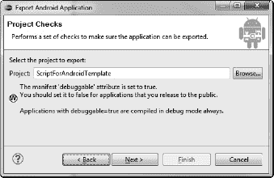
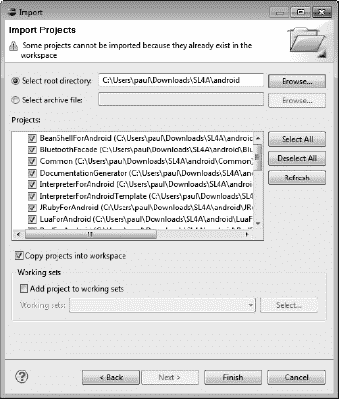

# 十、打包和分发

本章将介绍使用 Eclipse 和 QR 码打包和分发脚本的方法。

本章将涵盖以下主题:

*   使用二维码分发脚本
*   构建可分发的应用
*   使用 Eclipse 创建一个`.apk`文件

虽然这本书的大部分内容都是关于创建供个人使用的脚本，但是使用 SL4A 构建一个商业 Android 应用还是很有可能的。一旦完成，你需要一种方法来分发你的应用，让其他人也能享受它。这一章将会介绍几种你可以做到的方法。

### 二维码

如果你有一个相对较短的脚本想要分享，快速响应(QR)码是发布你的作品的一个很好的方式。大多数 Android 设备都包含一个原生条形码扫描仪应用(ZXing)，SL4A 甚至支持直接将二维码导入编辑器。它也可以从 Android 市场获得。当您启动 SL4A 时，您应该会看到设备上的`scripts`目录中的文件列表。如果你按下硬件菜单按钮，你会在左上角看到一个添加按钮(见[图 10-1](#fig_10_1) )。

***图 10-1。**菜单按钮弹出对话框*

如果您按下添加，您将得到一个菜单，其中包含任何已安装的解释器、Shell 和扫描条形码的文件(参见[图 10-2](#fig_10_2) )。

***图 10-2。**添加菜单*

如果你在谷歌上快速搜索 SL4A 二维码，你会发现很多条目，人们在博客或个人网站上使用二维码分享他们的脚本。一个二维码只能编码 4296 个字符的内容，所以你的脚本必须简短。有几个网站可以粘贴文本，并为您创建一个二维码。SL4A 维基参考资料`http://zxing.appspot.com/generator`。以下是附带的说明:

1.  打开内容下拉列表，然后选择文本。
2.  在文本内容的第一行，输入脚本的名称(例如，`hello_world.py`)。
3.  在那下面，粘贴脚本内容。
4.  打开大小下拉列表并选择 l。
5.  单击生成。
6.  嵌入生成的条形码图像或与朋友分享。

[图 10-3](#fig_10_3) 显示了使用此处显示的`makeToast.py`代码从`[http://zxing.appspot.com/generator](http://zxing.appspot.com/generator)`生成二维码的结果:

`import android

droid = android.Android()
name = droid.getInput("Hello!", "What is your name?")
droid.makeToast("Hello, %s" % name.result)`

***图 10-3。**二维码生成使用`http://zxing.appspot.com`*

如果你有一个简短的脚本要分享，并且有一个分享的地方，比如博客或网站，二维码给了你一个很好的选择。

### 应用包

Android 应用通常以扩展名为`.apk`的单个文件或包分发。Android 包本质上是一个类似于`.jar`或`.zip`文件的存档文件。每个`.apk`包含一些必须存在的强制文件，否则应用不会安装。最重要的文件是`AndroidManifest.xml.`这个文件描述了应用在上下文中所需的资源和权限。根据 Android 文档，除了声明应用的组件之外，清单还做了许多事情:

*   标识应用需要的任何用户权限，例如对用户联系人的 Internet 访问或读取权限
*   根据应用使用的 API，声明应用所需的最低 API 级别
*   声明应用使用或需要的硬件和软件功能，如摄像头、蓝牙服务或多点触摸屏
*   指定应用需要链接的 API 库(除了 Android 框架 API)，例如 Google Maps 库

创建 Android 项目有很多选择。一种方法是从命令行手动创建一个新项目。它包括使用`android`命令和一些参数。[图 10-4](#fig_10_4) 显示了在 Windows 命令提示符下运行该命令的结果。

***图 10-4。**命令行项目创建*

当您使用命令行工具`android`来构建您的项目时，它会在`AndroidManifest.xml`文件中正确设置。下面是从[的命令行得到的那个文件的样子图 10-4](#fig_10_4) :

`<?xml version="1.0" encoding="utf-8"?>
<manifest xmlns:android="http://schemas.android.com/apk/res/android"
package="com.example.myfirstapp"
android:versionCode="1"
android:versionName="1.0">
<application android:label="@string/app_name" android:icon="@drawable/icon">
<activity android:name="MyFirstApp"
android:label="@string/app_name">
<intent-filter>
<action android:name="android.intent.action.MAIN" />
<category android:name="android.intent.category.LAUNCHER" />
</intent-filter>
</activity>
</application>
</manifest>`

命令行方法创建了一个基本的项目框架，需要做一些调整才能使它像 SL4A 项目一样工作。幸运的是，SL4A 人员已经完成了大部分工作。你需要做的第一件事就是从 SL4A 项目网站(`http://android-scripting.googlecode.com/hg/android/script_for_android_template.zip`)下载脚本模板文件。[图 10-5](#fig_10_5) 显示了`script_for_android_template.zip`文件中的内容。

***图 10-5。**script _ for _ Android _ template . zip 文件内容*

提供的`AndroidManifest.xml`文件包含您明确授予访问权限的项目或属性列表。SL4A 站点提供的模板文件包含了一个完整的列表，但是大部分条目都被注释掉了。它将如下所示:

`<!-- <uses-permission
android:name="android.permission.VIBRATE" /> -->`

每个有效的权限行应该如下所示:

`<uses-permission android:name="android.permission.VIBRATE"></uses-permission>
<uses-permission android:name="android.permission.WRITE_EXTERNAL_STORAGE"></uses-permission>`

一旦你下载了模板，你就可以开始构建你的可发布项目，也就是所谓的`.apk`文件。最简单的方法是使用 Eclipse。我将使用虚拟脚本模板带您完成这些步骤。第一步是将模板导入 Eclipse。[图 10-6](#fig_10_6) 和 [10-7](#fig_10_7) 显示了您需要浏览的两个对话框。

***图 10-6。** Eclipse 项目导入对话框*

当你点击下一步按钮时，你应该会看到一个类似于图 10-7 中的对话框。如果您在选择归档文件选项的同一行单击浏览按钮，您将能够导航到该目录并选择`script_for_android_template.zip`文件。

***图 10-7。** Eclipse 项目导入对话框:归档文件选择*

在构建项目之前，必须在属性页上进行一项更改。为此，请从“窗口”菜单中打开“首选项”对话框。展开 Java 菜单项，后跟构建路径。此时，你的对话框应该类似于图 10-8 中的对话框。选择“类路径变量”项，然后单击“新建”按钮。这将弹出另一个类似于[图 10-9](#fig_10_9) 中的对话框。

 **注意**您可能需要在`ScriptForAndroidTemplate`下添加一个名为`gen`的目录。我第一次尝试构建项目时遇到了一个错误，因为这个目录丢失了。`script_for_android_template.zip`文件的后续版本可能会对此进行更正。

***图 10-8。** Eclipse 项目首选项对话框*

ANDROID_SDK 变量必须指向您的 Android SDK 的安装路径。在我的情况下，这是在我的下载目录下。如果您在 Windows 上使用 SDK 的安装程序可执行文件，您的路径可能类似于`C:/Program Files/Android/android-sdk/`。最好的办法是单击文件夹按钮并导航到目录。

***图 10-9。**新建类路径变量条目对话框*

如果您展开新导入的`ScriptForAndroidTemplate`，您应该在 Eclipse Pydev Package Explorer 窗口中看到类似于[图 10-10](#fig_10_10) 的内容。

***图 10-10。**导入模板项目的浏览器视图*

此时，您应该已经准备好构建项目了。首先从项目菜单中运行清理工具来确保旧项目或以前的构建没有任何问题，这是一个不错的主意。我养成了每次都这样做的习惯，只是为了更好地衡量。如果项目构建成功，您应该不会在 Problems 选项卡上看到任何条目(参见[图 10-11](#fig_10_11) )。

***图 10-11。**问题和控制台标签应该是空的*

至此，我们已经有了一个准备打包的 Android 应用。这是 Eclipse 真正闪光的地方。在“文件”菜单上，选择“导出”。你应该会看到一个类似[图 10-12](#fig_10_12) 的对话框。

***图 10-12。** Eclipse Android 包导出对话框*

点击下一步按钮将弹出一个类似于图 10-13 中[的对话框。此对话框让您知道您将要导出当前设置为可调试的项目。在开发过程中，这不是问题，但是在将应用发布给其他人使用之前，您会希望对其进行更改。](#fig_10_13)

***图 10-13。** Eclipse 导出项目检查*

接下来的三个对话框处理应用的签名。每个 Android 应用在安装之前都必须进行数字签名。如果这是您第一次经历这个过程，那么您必须生成一个新的密钥库和一个要使用的密钥。点击图 10-13 中[对话框的下一步按钮，将出现图 10-14](#fig_10_13) 中[所示的对话框。](#fig_10_14)

***图 10-14。**项目密钥库选择对话框*

在这里，您可以选择一个文件来保存您的密钥库和一个密码来保护它。密码必须至少包含六个字符，并且应该是您容易记住的内容。单击“下一步”按钮会将您带到另一个对话框，您将在其中输入生成新密钥的信息。[图 10-15](#fig_10_15) 显示了密钥创建对话框。

***图 10-15。**密钥创建对话框*

请注意有效性字段。您可以创建一个有效期为任意年数的密钥，从 1 到 99 这样的大数字。最后一个对话框允许你指定`.apk`文件的位置。

***图 10-16。**文件`.apk`的目的目录*

现在我们已经生成了一个`.apk`文件，我们可以在模拟器中测试它。有两种方法可以做到这一点:直接从 Eclipse 或者从命令行使用 ADB 工具。我个人更喜欢命令行，但我是相当老派的。要使用 ADB 进行安装，请打开终端窗口，将当前目录更改为您选择作为`.apk`文件目标的目录，并键入以下内容:

`adb install ScriptForAndroidTemplate.apk`

如果安装成功完成，您应该会在模拟器中看到一个名为虚拟脚本的条目，如图 10-17 中的[所示。](#fig_10_17)

***图 10-17。**安装了虚拟脚本的模拟器屏幕*

如果你将`ScriptForAndroidTemplate.apk`文件安装到没有安装 SL4A 的设备上，你会看到一个弹出对话框，如图 10-18 中的[所示。](#fig_10_18)

***图 10-18。**缺少 Python 解释器提示*

单击 Yes 按钮将引导您完成为 SL4A 安装 Python 解释器的过程。一旦该过程完成，您应该能够通过单击它来运行虚拟脚本应用。如果您碰巧没有正确设置`AndroidManifest.xml`文件中的所有权限，您会得到类似于[图 10-19](#fig_10_19) 中的通知。

***图 10-19。**权限通知缺失*

要解决这个问题，您必须手动编辑`AndroidManifest.xml`文件，或者在 Eclipse 中打开该文件并在那里进行更改。Eclipse 方法要安全和快速得多，所以我们将在这里讨论它。要打开该文件，只需在 Package Explorer 窗口中双击`AndroidManifest.xml`。你应该会看到一个类似于[图 10-20](#fig_10_20) 中的对话框。

***图 10-20。** Eclipse Android 清单权限标签*

从[图 10-20](#fig_10_20) 中可以看到，这个`AndroidManifest.xml`文件中唯一的权限是允许访问互联网。如果你点击添加按钮，你会看到一个类似[图 10-21](#fig_10_21) 的对话框。

***图 10-21。**创建一个新的 Android 清单权限元素*

我们需要选择使用权限来添加新元素。选择使用权限，然后单击确定按钮。接下来，您需要使用下拉框选择一个权限名称，该下拉框包含所有允许的值供您选择。我们需要标有`android.permission.VIBRATE`的那个。[图 10-22](#fig_10_22) 显示了选择的数值。

***图 10-22。**选择 android.permission.VIBRATE*

完成后，您可以单击 Eclipse 主菜单下的小磁盘图标来保存您的更新。现在，您需要返回项目清理和导出过程，以创建一个新的`.apk`文件。

### 打包自己的应用

既然您已经知道如何使用模板打包应用，我们将使用相同的基本方法来打包我们自己的应用。对于单个 Python 脚本文件来说，这个过程非常简单。首先，在 Eclipse 中右键单击项目，然后从菜单中选择 copy，制作模板的副本。接下来，右键单击 Package Explorer 窗口的空白区域，并从菜单中选择 Paste。这将呈现一个类似[图 10-23](#fig_10_23) 的弹出窗口。为您的新项目命名，然后单击 OK。

***图 10-23。** Eclipse 复制项目对话框*

现在到了插入脚本的部分。复制您的脚本并将其粘贴到`res/raw`目录中。这里最简单的事情就是删除现有的`script.py`文件，并将你的脚本重命名为`script.py`。这样，您就不必更改引用`script.py`的任何其他位置。你还需要重命名默认的包`com.dummy.fooforandroid` / *`your_package_name`* 。您可以使用 Eclipse 重构/重命名工具来完成这项工作。然后需要更新`AndroidManifest.xml`中的`package`属性来引用 *`your_package_name`* 。

此时，您应该能够完成构建和导出过程，为您的脚本创建一个`.apk`文件。

### 蚂蚁建筑

对于真正的铁杆命令行迷来说，还有 Ant。如果你想走这条路，你需要一个 Mac OS X 或者 Linux 盒子。配置脚本是`.sh`文件，因此它们必须在这些操作系统的终端上运行。首先，您需要下载并解压缩上一节中使用的相同模板文件。您还需要将`ANDROID_SDK`变量设置为指向 Android SDK 的根目录。这看起来是这样的:

`unzip -d <path/project_directory> script_for_android_template.zip
export ANDROID_SDK=<SDK_root>`

接下来，您需要如下执行`configure_package.sh`脚本:

`sh configure_package.sh <your_fully_qualified_package_name>`

如果您在模板中配置实际的虚拟包，命令应该是这样的:

`sh configure_package.sh com.dummy.fooforandroid`

此时，您需要将您的 Python 脚本复制到`res/raw`目录中，并替换现有的`script.py`文件。同样，如果你把你的剧本重新命名为`script.py`，会更容易。您将需要手动编辑`AndroidManifest.xml`来取消注释您的脚本需要的所有权限。实际的构建和运行过程使用了`run-tests.sh`脚本。要构建您的包，您需要打开一个终端窗口并导航到您的项目目录的根目录。命令`ant debug`将在项目`/bin`目录下创建一个名为`<*your_project_name*>-debug.apk`的`.apk`文件。该文件将使用调试密钥签名，并使用`zipalign`工具对齐。

构建发布版本稍微复杂一些。首先，您必须用合适的证书签署您的应用。如果您计划在 Android market 上发布您的应用，您的有效期必须在 2033 年 10 月 22 日之后结束。调试证书使用以下默认值:

*   密钥库名称:`"debug.keystore"`
*   密钥库密码:`"android"`
*   按键别名:`"androiddebugkey"`
*   密钥密码:`"android"`
*   CN: `"CN=Android Debug,O=Android,C=US"`

您的私有释放密钥必须为所有这些值使用不同的字段。对于私钥，您有两种选择:从证书发行商那里购买一个或者自己创建一个。Java 开发工具包(JDK)附带了一个`keytool`工具，它将为您生成一个自签名密钥。你还需要 JDK 的`jarsigner`工具。下面是生成私钥的命令行示例:

`keytool -genkey -v -keystore my-release-key.keystore -alias alias_name -keyalg RSA –keysize
2048 -validity 10000`

使用有效的密钥，您可以使用命令`ant release`构建应用的发布版本。默认情况下，Ant 构建脚本编译应用`.apk`而不对其进行签名。您必须使用`jarsigner`工具来实际签署`.apk`文件。您可以使用以下命令来完成它:

`jarsigner -verbose -keystore my-release-key.keystore my_application.apk alias_name`

验证您的`.apk`文件是否正确签名是个好主意。您也可以使用`jarsigner`命令:

`jarsigner -verify my_signed.apk`

如果您想了解更多信息，可以添加`-verbose`或`-certs`。此时，剩下的就是运行`zipalign`工具来确保所有未压缩的数据都正确对齐。这个工具实际上是调整最终的包，使所有文件都在 4 字节边界上对齐。这极大地提高了应用加载性能，并减少了正在运行的应用消耗的内存量。下面是运行`zipalign`的命令行:

`zipalign -v 4 *your_project_name*-unaligned.apk *your_project_name*.apk`

这应该是创建一个完全可发布的 Android 应用所需的最后一步。最后，您可能希望考虑更新您的模板项目，以包含核心 SL4A 可执行文件的最新版本，因为它们会不断更新。为此，您需要下载最新版本的`script_for_android_teplate.zip`并解压以下文件:

`libs/script.jar
libs/armeabi/libcom_googlecode_android_scripting_Exec.so`

将这些文件复制到项目中的相同位置，然后使用 Eclipse 进行刷新清理构建或使用 Ant 进行重建。

### 编译 SL4A

如果您想确保您拥有 SL4A 的绝对最新和最棒的版本，您必须从源代码编译它。如果您正在寻找一个稳定的版本，这可能有点冒险，但是它也可能修复您的应用需要的一个问题。不管怎样，如果你想编译 SL4A，这就是你需要做的。您需要做的第一件事是获得 SL4A 源代码树的副本。你要知道 SL4A 是用 Mercurial 做源代码管理工具的。你可以从它的下载页面(`[http://mercurial.selenic.com/downloads](http://mercurial.selenic.com/downloads)`)获得一份适用于各种 Linux 发行版、Mac OS X 和 Windows 的 Mercurial 客户端。

出于本章的目的，我将在 Windows 7 64 位机器上使用 TortoiseHg。下载页面提供了许多选项，包括一些不需要管理员权限的选项。我选择了 TortoiseHg 2.0.4 和 Mercurial 1 . 8 . 3–x64 Windows 选项。此选项提供了与 Windows 资源管理器的集成，使得将任何存储库克隆到本地驱动器上的特定位置变得非常简单。一旦您安装了客户端，您将需要克隆源代码树。在 Windows 中，你可以在文件资源管理器中右键单击你想要创建克隆的目录，然后选择 TortoiseHg 和 clone，如图[图 10-24](#fig_10_24) 所示。

***图 10-24。**创建 SL4A 源树的克隆*

选择克隆选项将启动另一个对话框，您必须在其中指定存储库的源 URL 和本地计算机上的目标位置。我使用的网址如下:

`https://rjmatthews62-android-scripting.googlecode.com/hg/`

实际的官方网址是:

`https://android-scripting.googlecode.com/hg/`

在撰写本文时，这似乎是包含所有补丁和更新的最新位置。[图 10-25](#fig_10_25) 显示了您必须输入该 URL 的对话框。

***图 10-25。**选择 SL4A 源树位置*

一旦下载了整个树，就需要将其导入 Eclipse。为此，打开 Eclipse 并从 File 菜单中选择 Import。因为文件已经存在于本地磁盘上，所以您必须使用选择根目录选项。单击浏览按钮导航到执行克隆操作的位置。[图 10-26](#fig_10_26) 显示了选择克隆目录后的对话框。

***图 10-26。**从本地目录导入 Eclipse】*

此时，您不需要克隆的源代码树中的所有项目。您可以通过右键单击每个项目并选择“关闭项目”来删除以下内容:

*   `BeanShellForAndroid`
*   `DocumentationGenerator`
*   `InterpreterForAndroidTemplate`
*   `JRubyForAndroid`
*   `LuaForAndroid`
*   `PerlForAndroid`
*   `RhinoForAndroid`
*   `TclForAndroid`

现在，您应该准备好执行项目构建，然后执行项目清理全部清理。我不得不再次将`gen`目录添加到许多项目中。一旦这样做了，你应该做一个干净的构建，一切都应该是好的。此时你应该会看到一个类似[图 10-27](#fig_10_27) 的月食窗口。

***图 10-27。**建造 SL4A 后的月食窗口*

现在我们需要添加我们的模板项目来创建我们的最终应用。为此，右键单击`ScriptForAndroidTemplate`文件夹并制作副本。然后通过右键单击包资源管理器区域并选择粘贴来粘贴新副本。这将是我们的目标应用。要将这个副本连接到 SL4A 克隆，您需要展开项目并右键单击`build.xml`文件。选择运行方式，然后选择 Ant 构建。如果需要，您可以在此时重命名您的项目。又一个干净的构建，你应该有一个工作的`.apk`准备好测试了。

要测试该应用，要么将一个真实的设备连接到您的工作站，要么直接使用模拟器。在 Eclipse 中，你只需右击模板的副本，选择运行方式，然后选择 Android 应用(见图 10-28 )。

***图 10-28。**建造 SL4A 后的月食窗口*

此时，您的应用有了一个`.apk`文件，SL4A 有了一个`.apk`文件。如果你分发你的应用`.apk`文件，会提示用户必须先安装 Python 2.6.2(参见[图 10-18](#fig_10_18) )。

### 点睛之笔

如果你打算将你的剧本公之于众，你需要做一些调整。默认模板包括一个名为`res`的资源目录。在这个目录中有许多子目录，包含应用使用的各种文件——包括当您浏览设备上的应用时会看到的代表图标的图像，以及将出现在该图标下的名称。要更改名称，您需要编辑`values`子目录中的`strings.xml`文件。下面是该文件在默认模板中的样子:

`<?xml version="1.0" encoding="utf-8"?>
<resources>
<string name="hello">Hello World!</string>
<string name="app_name">Dummy Script</string>
</resources>`

要更改名称，只需更改`"app_name">Dummy Script`行来反映应用的名称。您可能想要更改的另一件事是应用图标。为此，您可以使用 Android SDK 提供的`draw9patch`工具。这可以通过简单地输入`draw9patch`从终端窗口启动。[图 10-29](#fig_10_29) 显示了加载了默认 SL4A 脚本标志的`draw9patch` app。

 **注意**安卓图标默认使用`.png`格式。术语*九补丁*指的是一个标准的 PNG 图像，包括一个 1 像素宽的边框。它通常用于图像必须拉伸以适应不同长度的文本标签的按钮。

***图 10-29。**载入 SL4A 图标的 Draw9patch 应用*

一旦程序运行，你可以拖拽一个图像并放到打开的窗口中，或者使用文件打开 9 补丁选项。当你完成后，在文件菜单上有一个保存 9 补丁选项来保存你的工作。

### 蜿蜒向下

SL4A 为希望开发市场现成应用的有抱负的程序员和希望自动化一些功能以使他们的移动生活更轻松的精明的智能手机用户提供了理想的解决方案。对于精通 Python 的人来说，这是利用他们的编程技能使用任何 Android 设备的绝佳机会，就像使用台式机或笔记本电脑一样。对一些人来说，甚至有可能用基于安卓系统的平板电脑取代笔记本电脑。随着移动设备处理和存储能力的提高，这种可能性只会越来越大。

SL4A 真正伟大的地方在于它的开源特性。随着该项目越来越广为人知，将有更多的用户转化为更广泛的受众和更大的参与。开发工作的新贡献者增加了重要的新特性，例如使用任何原生 Python 库的能力。对谷歌电视等其他 Android 平台的更新应该也允许 SL4A 在那里运行。Google groups 上有一个相当活跃的论坛，你可以在那里提问并获得帮助。

试用 SL4A 并没有你想象的那么难。你真的不能做任何对你的设备直接有害的事情，尽管它可能会增加你的数据账单，这取决于你的脚本做什么。最安全的入门方式是使用 Android 模拟器。通读本书中的章节将为您使用 SL4A 让您的 Android 设备做您从未想过可能的事情打下坚实的基础。

### 总结

本章非常详细地描述了如何为 SL4A 脚本构建可分发的包。

以下是本章的要点:

*   **创建二维码**:二维码给你一个快速简单的方法来分发任何人都可以直接加载到 Android 设备上的简短脚本。
*   **构建** `.apk` **文件**:如果你想使用 Android market 发布你的应用，你必须学会如何构建`.apk`文件。
*   使用 Eclipse:它使得构建和测试可分发应用的过程变得更加容易。
*   美化你的应用:如果你想让你的用户真正使用它，你真的需要花些时间为你的应用创建一个图标。