# 二、设置 Android5 可穿戴设备应用开发工作站

现在你已经有了一些关于可穿戴设备的基础知识，以及 Android 5 增加了什么让可穿戴应用令人难忘，本章将帮助你建立另一种类型的基础。您的开发工作站是实现 Pro Android 可穿戴设备应用开发目标的最重要的硬件和软件组合。在这里，我将花一些时间预先考虑您将需要的硬件和软件基础设施，您将需要将一个专业的、全面的、Android 软件开发工作站与您的软件开发箭筒中的一打箭放在一起(奇怪的类比组合，不是吗？罗宾汉和棒球)。然后，无论你开发什么类型的可穿戴应用，你都将拥有这本书剩余部分所需的一切！

我们还将摆脱所有那些关于组装一个 100%专业的 **Pro Android 可穿戴设备生产工作站**的繁琐任务。

因为本书的读者通常希望使用相同的 Android 可穿戴应用软件开发环境进行开发，所以我将在本章概述所有步骤，以组装一个完全**精心设计的** Android Studio 开发工作站。你需要这样做，因为本书的所有读者都需要平等地体验你在本书课程中学到的一切。您将了解在哪里下载以及如何安装这个星球上最令人印象深刻的一些开源软件包！

创建 Android 工作站的工作流程

看完硬件需求后，你要做的第一件事是下载并安装整个 Java **软件开发包** (SDK) ，甲骨文称之为 **Java SE 7 JDK** (Java 开发包)。从 Android Studio 1.0 开始，Android OS 使用 Java 标准版(SE)版本 7 更新 71。Android Studio 1.2 使用 Java 7 update 79，在我对这本书进行第二次编辑时，我刚刚升级到它。当你读到这篇文章时，它很可能使用的是比那更高的版本！这就是软件开发的本质。

需要注意的是，Java 版本 8 也存在，并于 2014 年第二季度发布。Java 8 包含了强大的 JavaFX APIs，将 Java 编程语言变成了强大的新媒体引擎。Java 7 对 JavaFX 的支持确实存在于 Android OS 之外，如果你想使用 JavaFX，有一个让 JavaFX 新媒体应用在 Android 5 下工作的工作流程。因此，开源开发(Android OS、XML、Java7、Java8、JavaFX、HTML5、CSS、JavaScript 和 OpenGL)的未来已经到来！

你将下载并安装的第二个东西是 **Android Studio** ，你可以从谷歌 developer.android.com 的**网站获得。Android Studio 1.0 实际上是一个软件包，由**IntelliJ IDEA**(Android 集成开发环境)和一个 Android 开发工具 **ADT 5 插件**组成。在 Android 4.4 之前，Eclipse IDE、Android SDK 和 ADT 插件都是单独安装的，这使得安装很困难。**

这个 ADT 插件现在是 Android Studio 不可或缺的一部分，**桥接****Android SDK**，它也是 Android Studio 下载的一部分，带有 IntelliJ IDEA 的版本 14。ADT 插件将这种 IntelliJ Java 思想融入 IntelliJ Android Studio 思想。值得注意的是，IntelliJ 仍然可以用于简单的 Java SE 7 应用开发。IntelliJ 还支持 Java 8 和 JavaFX。

在你的 Android Studio 可穿戴设备应用开发环境建立之后，你将下载并安装**新媒体素材开发**工具，这些工具将与 Android Studio 结合使用(但不在 Android Studio 之内),用于数字图像编辑(GIMP)、数字视频编辑和特效(EditShare Lightworks)、数字音频混音、甜味和编辑(Audacity)以及 3D 建模、渲染和动画(Blender)等。

您将下载和安装的所有这些软件开发工具将接近匹配昂贵的付费软件包的所有主要功能集，例如来自 Apple (Final Cut Pro)、Autodesk (3D Studio Max)或 Adobe (Photoshop、Premiere 或 After Effects)的软件包。

开源软件可以免费下载、安装甚至升级，并且每天都在不断增加功能，变得越来越专业。在过去的十年或二十年里，你会完全惊讶于开源软件包变得多么专业；如果你还没有经历过这些，你将会以一种主要的方式经历这些！

Android 开发工作站:硬件基础

因为您将在本章中整合本书期间使用的 Pro Android 可穿戴设备应用开发工作站的基础，所以让我们先花点时间回顾一下 Android Studio 1.0 开发工作站的硬件要求，因为这是影响您开发性能(速度)的因素。这显然和软件本身一样重要，因为硬件运行软件。

Android Studio 的最低要求包括 **2GB** 内存、 **2GB** 硬盘空间、720p **高清** ( **1280 乘 800** )显示屏。接下来，让我们讨论一下使用 Android Studio 可穿戴工作站需要什么，从将 1280 x 800 的高清显示器升级到**1920 x 1080**的真正高清显示器开始！

我建议至少使用一个**英特尔 i7 四核**处理器，或者一个 **AMD 64 位八核**处理器，至少有 **8GB** 的 **DDR3 1600** 内存。我用的是八核 **AMD 8350** 配 **16GB** 的 **DDR3 1866** 。英特尔也有一个六核 i7 处理器。这相当于拥有 12 个内核，因为每个 i7 内核可以托管两个线程；同样，对于 64 位操作系统线程调度算法来说，i7 四核应该看起来像八个内核。

也有高速 **DDR3 1866** 和 **DDR3 2133** 时钟速度内存模块组件可用。数字越大，表示内存访问速度越快。要计算内存循环的**实际兆赫速度**，将该数字除以 **4** (1333 = 333Mhz，1600 = 400Mhz，1866 = 466Mhz，2133 = 533Mhz 时钟速率)。内存访问速度是一个主要的工作站**性能因素** ，因为您的处理器通常会受到处理器内核访问它需要处理的数据(在内存中)的速度的“瓶颈”限制。

当您的工作站运行时，所有这些高速处理和内存访问都在您的工作站内部进行，因此保持一切冷却也很重要，这样您就不会遇到“散热问题”我建议使用宽**全塔式**机箱，带**120 毫米**或**200 毫米**散热风扇(至少一两个)，以及 CPU 上的**系留液体感应散热风扇**。需要注意的是，系统运行的温度越低，运行的速度就越快，持续的时间也就越长，所以在工作站上安装大量的静音风扇吧！

如果你真的想要最大的性能，特别是在模拟 AVDs (Android 虚拟设备)进行快速原型开发或测试时，我将在第五章中介绍，安装一个 **SSD** (固态硬盘)驱动器作为主硬盘驱动器，您的应用和操作软件将从这里加载。为您的 **D:\** 硬盘使用传统的 **HDD** (硬盘驱动器)硬件，用于较慢的数据存储。

就操作系统而言，我使用的是 64 位 Windows 8.1 操作系统，它的内存效率相当高。Linux 64 位操作系统的内存效率极高。我推荐使用 64 位操作系统，这样你就可以寻址 3GB 以上的内存了！

Android 开发工作站:软件基础

为了创建一个全面的 Android 应用开发工作站，您将安装我将在本书后面向您介绍的所有主要类型的开源软件。首先，您将安装 JavaSE 7、Android Studio 以及 Gimp、Lightworks、Blender3D 和 Audacity，它们也都是开源软件包和编程语言(Android 使用 Java、XML、CSS 和 HTML5)。因此，你将组装一个 100%开源的工作站(除非你使用的是 Windows 8.1 操作系统，这是一个付费软件)。我还在本章末尾推荐了其他的免费软件，这样你就可以组装一个大型生产工作站了！

因为开源软件已经达到了付费开发软件包的专业水平，也因为我希望你们所有人都能够参与进来，所以我也会使用开源。使用开源软件包，如 Java、IntelliJ、Blender3D、GIMP、Audacity、Lightworks 等，您可以组装一个免费的新媒体应用开发工作站，与付费软件工作站相媲美，后者可能要花费您所在国家的几千个货币单位(仅是为了使本书国际化)。

对于那些刚刚购买了新的 Pro Android 可穿戴开发工作站 PC 并打算从头开始组装整个开发软件套件的人，我将介绍一个完整的工作流程，从 Java 7 开始，然后添加 Android Studio，最后是每个主要类型的各种媒体内容开发软件包:数字图像、数字视频编辑、3D 和数字音频编辑。如果你有 Macintosh，大多数开源软件都支持该平台以及流行的 Linux 发行版，甚至 Oracle 的 Open Solaris。

Java 7:为 Android Studio 安装基础

你要做的第一件事是访问 **Oracle** 网站，下载并安装最新的 **Java 7 JDK** 环境，在撰写本书时，该环境是 **Java SE 7u71** 、，如图图 2-1 所示。

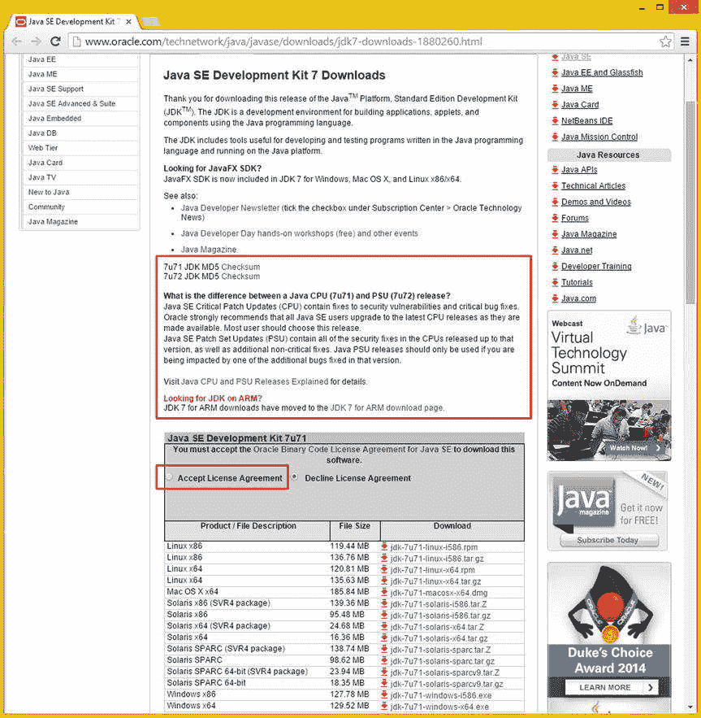

图 2-1 。Oracle TechNetwork 网站 Java SE 7 下载部分；为您的操作系统找到最新的 Java SE 7 JDK

网址在图 2-1 的地址栏里，或者你可以简单 Google **Java SE 7 JDK 下载**。这将为您提供 Java web 页面的最新链接，我也将把它放在这里，以防您想简单地剪切和粘贴它:

```java
[www.oracle.com/technetwork/java/javase/downloads/jdk7-downloads-1880260.html](http://www.oracle.com/technetwork/java/javase/downloads/jdk7-downloads-1880260.html)
```

将网页右侧的滚动条拉到页面中间，显示 **Java SE 开发工具包 7u71** (或更高版本**7u 79**)下载链接表，如图 2-1 最底部的所示。你也可以阅读位于下载链接表正上方的新 CPU 和 PSU Java 发布版本的解释；例如，在本书中，我将使用 Java 7u71。

一旦您点击此下载链接表格左上角的**接受许可协议** 单选按钮，链接将变为**粗体**，您将能够点击您想要使用的链接。如果您使用的是 Windows，并且您的操作系统是 64 位，请使用 **Windows x64** 链接，否则请使用 **Windows x86** 链接。我在我的 Windows 7 和 Windows 8.1 工作站上使用的是这些链接中描述的“Windows x64”，这是 Windows 的 64 位版本。

确保使用这个 **Java SE 开发工具包 7u71** 下载链接，不要使用 **JRE** 下载(Java 运行时版)链接。JRE 是 JDK 7u71 的一部分，因此您不必担心单独获得 Java 运行时。如果您想知道，您将确实使用 JRE 来启动和运行 IntelliJ IDE，，并且您将使用该软件包内的 JDK 来提供 Java 核心类基础，该基础用作 Android OS 基于 Java 的 API 类的基础。

确保**而不是**从普通(当前、最新的 Java)下载页面下载 JDK 8u25 或 JDK 8u25 捆绑包，其中包括 NetBeans 8.0，因为 Android 5 使用 Java 7u71 和 IntelliJ IDEA，**而不是【the NetBeans 8.0.1 IDE 作为其 ADT 插件，所以在您的工作过程中要非常小心这个特定的初始 Java 7 JDK 基础软件安装步骤！**

实际上，我在 JavaFX 开发中使用了不同的 Windows 7 工作站，其中安装了 Java SE 8u25 和 NetBeans 8，我还有另一个 HTML 开发工作站，其中安装了 Java SE 8u25 和 NetBeans 8.0(仅限)。

在运行此安装之前，您应该使用您的 Windows **控制面板**，通过**添加或删除程序** (XP 和更旧版本)或**程序和功能** (Windows Vista、7 和 8.1)工具，删除您的旧版本 Java。

这将是必要的，尤其是如果您的工作站不是全新的，那么您最新的 Java SE 7u71 和 JRE 7u71 是目前安装在 Android Studio 可穿戴工作站上的唯一 Java 版本。

安装可执行文件下载完成后，打开它，双击 EXE 文件启动**设置**对话框，在系统上安装最新的 Java SE 7u71 JDK，如图 2-2 左侧所示。点击**下一个**按钮进入**自定义设置**对话框，如图 2-2 中间所示。再次点击下一步按钮，进入**提取安装程序进度**对话框，如图图 2-2 右侧所示。提取安装软件后，您可以选择安装文件夹。

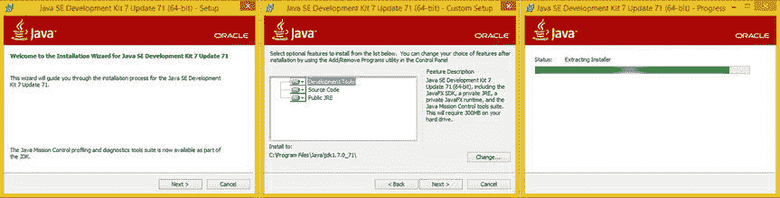

图 2-2 。Java SE 7 JDK 提取；单击“下一步”按钮继续提取

使用图 2-3 左侧显示的目标文件夹对话框中默认的**C:\ program files \ Java \ JRE 7**，然后点击**下一步**按钮。这将在该文件夹中安装 Java 运行时版本(JRE)版本。

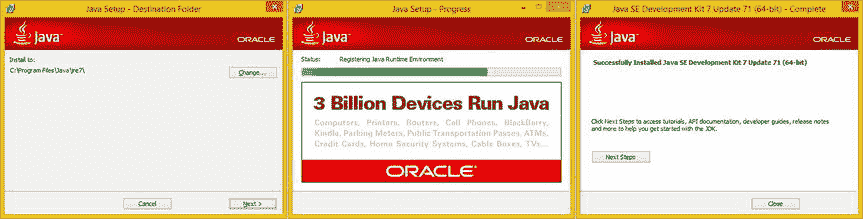

图 2-3 。Java 7 JDK 安装；单击“下一步”按钮进行安装，然后关闭按钮

有趣的是，出于某种原因，安装程序没有要求您指定 JDK 文件夹名称，可能是因为它希望 Java JDK 始终是一个固定的名称。这个 JDK 文件夹将被命名为**C:\ program files \ Java \ JDK 1 . 7 . 0 _ 71**，你会注意到在内部 Java 7 实际上被称为 Java 1.7.0。因此 Java 6 应该是 1.6.0，Java 8 应该是 1.8.0。例如，如果您正在使用搜索工具查找 Java 版本，或者只是为了炫耀，了解这一点是很有用的！

一旦你点击下一步按钮，你将得到 **Java 安装进度**对话框，如图 2-3 中的中间所示。一旦 Java 7 完成安装，你将最终看到你的**完成**对话框，可以在图 2-3 的右侧看到。恭喜你！您已经成功安装了 Java！

请记住，您没有下载 JRE 的原因是因为它是 JDK 安装的一部分。这个 Java Runtime Edition 是一个可执行程序(平台),一旦您的 Java 软件被编译成应用，它就可以运行该软件，因此需要最新的 JRE 来运行 IntelliJ，正如您现在所知道的，IntelliJ 是 100%完全使用 Java SE 平台编写的。

一旦 Java 7u71(或更高版本)JDK 安装在您的工作站上，您就可以从`developer.android.com`网站下载并安装最新的 **Android Studio** 软件安装程序。随着你安装的每一层 Pro Android 可穿戴设备开发软件，这变得越来越令人兴奋！

您还可以使用相同的**程序和功能**或**控制面板中的添加或删除程序**工具，您可能最近使用过它来删除旧的 Java 版本，甚至确认新的 Java 安装是否成功，以删除当前可能安装在您的 Android 开发工作站上的任何 Android 4 开发环境的任何旧版本。

现在你已经准备好在 Java 7 之上添加第二层 Android 可穿戴应用开发软件(Android Studio 1.0 和 IntelliJ)。

Android Studio 1.0:下载 Android 5 创意

此过程的第二步是访问`developer.android.com`网站，从 Android 开发者网站的/sdk/文件夹下载并安装 Android Studio 软件安装程序文件，网址如下:

```java
[`developer.android.com/sdk/index.html`](https://developer.android.com/sdk/index.html)
```

在 Android 开发者网站的主页上，点击网站主页左下方的**Get SDK**按钮即可进入该页面。这将把你带到本网站的 SDK 部分，如在图 2-4 的右侧所示。你也可以从 **Android Studio 概述**页面进入网页，如图 2-4 左侧的。Android Studio 概览页面位于以下 URL:

```java
[`developer.android.com/tools/studio/index.html`](http://developer.android.com/tools/studio/index.html)
```

一旦进入 **Android Studio SDK** 页面，点击左下方的**下载 Android Studio** 灰绿色按钮，下载 Android Studio for Windows，如图图 2-4 所示。这将带你到一个下载页面。

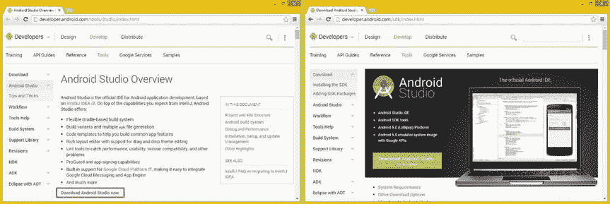

图 2-4 。Android Studio 下载链接(左)和下载页面(右)；点击绿色的下载 Android Studio 按钮

如图 2-5 中的所示，实际的 Android Studio 下载页面在顶部包含一个部分，概述了 **Android 软件开发工具包许可协议**。该协议通常被称为最终用户许可协议(EULA)， ，它规定了您可以和不可以使用 Android 5 Studio SDK、IDEA、软件、工具、编解码器和 APK(应用包)做什么。

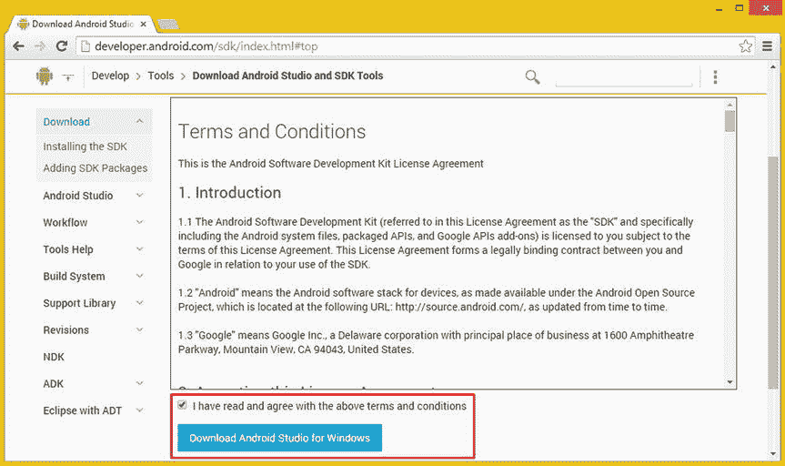

图 2-5 。选择“我已经阅读并同意条款和条件”复选框，然后单击蓝色的下载 Android Studio for Windows 按钮

仔细阅读本网页的**条款和条件**部分，如有必要，与您的法律部门一起，然后点击底部声明旁边的复选框，内容为:**我已阅读并同意上述条款和条件**，如图 2-5 中以红色突出显示的内容。

一旦这个复选框被激活(选中)，你现在应该可以看到一个蓝色的下载 Android Studio for Windows 按钮。下载站点会自动检测您的操作系统，以及您的操作系统支持的位级别(32 位或 64 位)。这应该与工作站相匹配，所以如果你有 64 位处理器(CPU)，你也应该有 64 位操作系统。

如果您下载了用于 Windows x64 或 Linux x64 的 Java 7u71 JDK，那么您将拥有 64 位版本的 Android Studio 相反，如果您为 32 位 x86 操作系统选择了 Java 7u71，那么您将拥有 32 位版本的 Android Studio。

激活后，点击**下载 Android Studio** 蓝色按钮，开始下载过程。如果你的网络连接速度很慢(调制解调器或 ISDN)，这可能需要一两个小时。如果有 DSL 或 4G 连接，大概需要半个小时。如果你有光纤连接，应该只需要一两分钟。

下载完成后，您将启动一个软件安装程序，该程序将设置 Android 5 SDK 和集成开发环境(IDE ),以便在您的 Pro Android 可穿戴设备开发工作站上使用。这些文件以前是用 ZIP 文件安装的，所以这是一个很大的改进！值得注意的是，这些文件的大小也是随时变化的，所以如果在你写这本书的时候和你写这本书的时候之间 SDK 发生了变化，它们可能会有所不同。

在这个 Android Studio“捆绑包”在版本 4 中可用之前，设置这个 Android IDE 是一个复杂的过程，需要大约 50 个或更多的步骤。这些包括安装 Java SDK，然后是 Android SDK，然后是 Android 插件，然后配置插件以查看 Android SDK。现在设置 Android 5 开发环境简单多了！

新的捆绑方法通过包括 IntelliJ IDE 以及所有 Android SDK 和插件组件来完成所有这些 Android SDK 和插件配置，这允许所有这些配置工作由 Google 的人员提前完成，而不是由在家的开发人员完成。

安装 Android Studio: IntelliJ IDEA 和 Android SDK

下载完成后，您需要做的第一件事是找到您刚刚下载的文件。它应该在你的操作系统的**下载**文件夹中，或者在我的情况下，我为这个下载指定了我的**软件**文件夹，所以我导航到那个文件夹找到然后启动它。

如果您不知道浏览器在下载文件后将其放在了哪里，您也可以右键单击位于浏览器下载进度窗口中的下载文件，并选择文件夹中的**视图选项。如果右键单击不起作用，文件名旁边应该有一个向下箭头，它会显示一个下拉菜单项列表。**

下载进度选项卡通常位于每个浏览器的底部状态栏区域，或者可以通过下载菜单选项或浏览器右上角的图标来访问(通常是三个黑色条形，表示可以通过该图标访问菜单列表)。

在我的情况下，这个文件被称为**android-studio-bundle-135.1641136.exe**(我告诉过你它是一个软件包)，我将在我的 64 位 Windows 8.1 工作站上使用它。一旦找到 EXE 文件，**右击**并从上下文菜单中选择**以管理员身份运行**选项。这将启动一个 Android Studio 设置对话框，如图 2-6 左侧所示。

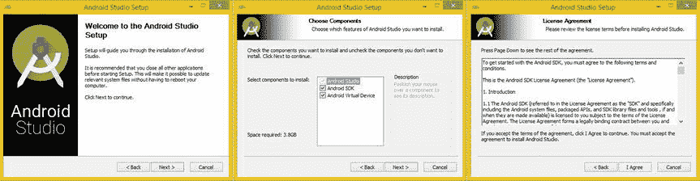

图 2-6 。启动 Android Studio 安装程序(左)，选择默认组件(中)，同意许可(右)

一旦你有了**欢迎来到 Android Studio 设置**对话框，点击**下一步**按钮，这将带你到**选择组件**对话框，如图 2-6 中间的所示。接受默认组件安装选择，然后单击**下一步**按钮。这将把你带到一个**许可协议**对话框，如图 2-6 右侧的所示。点击**我同意**按钮，将进入**配置设置**对话框，如图 2-7 左侧所示。接受 Android Studio 和 Android SDK 的默认安装位置，然后单击**下一个**按钮继续。

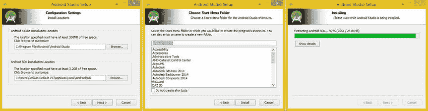

图 2-7 。接受默认区域设置(左)，接受 Android Studio 名称，点击安装(中)，安装对话框(右)

在**选择开始菜单文件夹**对话框中，如图 2-7 中间所示，确保文件夹名为 **Android Studio** ，然后点击**安装**按钮开始安装过程。然后你会看到一个**安装**对话框，如图 2-7 右侧所示，它会显示哪些组件被提取并安装在你的工作站上。如果您想查看进度条之外的更多细节，请单击该对话框中的**显示细节**按钮。

一旦提取和安装过程完成，你会看到**完成 Android Studio 设置**对话框，显示在图 2-8 的左侧。保持选择**启动 Android Studio** 选项。接下来，单击**完成**按钮，这将启动 Android Studio，这样您就可以确保安装创建了一个可用的 IDE。在图 2-8 的中间和右边部分显示了启动屏幕和设置向导。你可以看到 Android SDK 已经安装并且是最新的，所以你完成了！

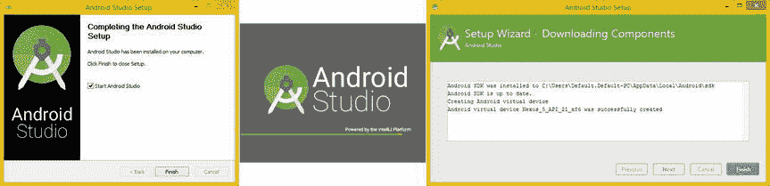

图 2-8 。选择启动 Android Studio 复选框(左)，启动屏幕(中)，确认安装组件(右)

点击**完成**按钮，然后启动 Android Studio，如图 2-9 左侧所示。在对话框的左下方，你会看到一个**检查**立即更新链接，你应该点击这个以确保你的 Android Studio 想法是完全最新的，它应该是最新的，因为你刚刚下载并安装了它！正如你在图 2-9 的右上方看到的，我点击了链接，得到了一个**检查更新**进度条，然后是**更新信息**对话框，在图 2-9 的右下方看到，告诉我我有最新版本的 Android Studio。

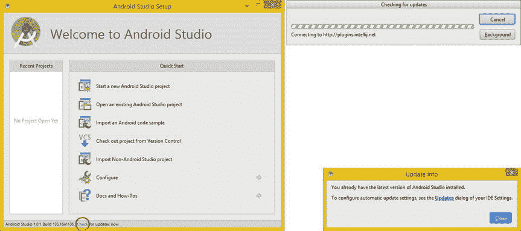

图 2-9 。检查更新(左下角突出显示)、进度条(右上角)、更新信息对话框(右下角)

在本章的剩余部分，您将下载并安装您需要的其他工具。

专业数字影像软件:GIMP 2.8.14

GIMP 是一个类似于 Photoshop 的**数字图像**软件包，目前的版本是 2.8.14。3.0 版本预计将于 2015 年推出。

GIMP 有许多重要的工具来创建您的 Pro Android 可穿戴应用所需的数字图像素材，包括数字图像处理、遮罩、alpha 通道透明、自动路径创建、矢量(SVG)路径处理、图层合成等等。

要访问 GIMP 网站，您可以在 Google 搜索框中输入 GIMP，也可以输入该网站的 URL，直接进入 GIMP 主页。非营利组织的网址(。ORG) GIMP 2.8.14 网站采用以下格式:

```java
www.gimp.org/
```

当 GIMP 2 主页出现时，如图 2-10 中的所示，你会在页面的中上方看到一个橙色的**下载**按钮，在网站主页的右上方还有一个橙色的**下载**链接。您将点击其中任何一个来访问 GIMP 2.8.14 `www.gimp.org/downloads`页面。

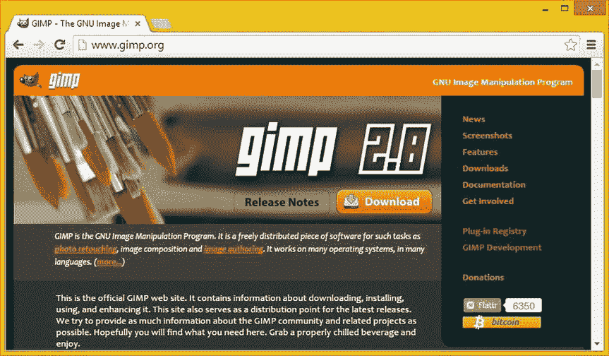

图 2-10 。转到`gimp.org`站点，点击橙色的下载按钮来获得 GIMP 的最新版本

可以下载专门为 Windows Vista、XP、7、8.1、Linux(通用)、Mac OS/X、BSD、Solaris、Debian、Mandriva、Fedora、Open SUSE、Ubuntu 编译的版本。GIMP 支持这些操作系统的 32 位和 64 位版本。只需点击操作系统的下载链接，将软件下载到您的 Pro Android 可穿戴应用开发工作站。

直到最近，GIMP 2 还是托管在 SourceForge 上，但是该公司决定自己托管在 HTTP 和 Torrent 服务器上，因为一些关于广告客户选择加入的活动，GIMP 的创建者并不支持。我使用标准的 HTTP 链接启动了 64 位 Windows 8.1 GIMP 2.8.14 下载，效果非常好。接下来，我们来看看 Lightworks 12 数字视频编辑和特效开源软件包。

下载完成后，启动安装程序 EXE，，它应该被命名为**gimp-2.8.14-setup-1.exe**，除非有更高版本可用(2.10 版本预计将于 2015 年在 Q1 发布，3.0 版本将于 2015 年晚些时候发布)。你可以右键点击一个安装程序，然后**以管理员**身份运行来启动它。

专业数字视频编辑:Lightworks 12

EditShare Lightworks 曾经是一款(昂贵的)付费数字视频编辑和特效软件，时至今日，它与领先的数字视频编辑包(FinalCut Pro X 和 After Effects)展开了正面竞争。

您可以在 EditShare 网站上的`www.editshare.com`或 Lightworks 网站上的`www.lwks.com`找到关于这款领先的数字视频编辑 FX 软件包的更多信息，您也可以在那里注册获得该软件的副本，一旦完成，您就可以下载该软件供自己免费使用。

当 EditShare 将 Lightworks 开源后，它成为了第三个免费开源软件(第一个是 GIMP，第二个是 Blender3D ),能够在其新媒体制作类型(数字视频编辑、合成、特效应用和压缩)中与付费软件包进行功能竞争。事实上，EditShare 因其处理速度和创新的用户界面方法赢得了 NAB“最佳展示”奖。

Lightworks 是第一批重写代码以在 GPU(图形卡，如 nVidia GeForce 或 AMD ATI 镭龙)上运行的软件包之一。GPU 处理效果和编码的速度比 CPU 快一个数量级，包括 GIMP 在内的许多其他软件包现在也在代码中实现基于 GPU 的处理。

一旦您在此 Lightworks 网站上注册，您将能够为您的公司创建一个视频编辑器配置文件，并登录以便能够为您在本章中组装的内容开发工作站下载一份 Lightworks 12.1。因为 EditShare Lightworks 是一款非常有价值的软件，你需要注册才能获得它，我并不反对，因为这款软件以前的价格高达四位数。

一旦你注册成为一名骄傲的 Lightworks 12 用户，你可以点击位于网站菜单右上角的**下载**按钮，你会看到三个不同操作系统版本的标签——Mac、Linux 和 Windows——以及该软件的工具和文档标签。

单击与您的操作系统的位级别相匹配的红色下载按钮，或者如果您想要正在开发的最新测试版本，请单击蓝色下载按钮。下载后，使用默认设置安装它，为它创建一个快速启动图标，并启动它以确保它与您的工作站正常工作，就像您对其他软件所做的那样。

在图 2-11 中可以看到 2014 年第四季度发布的 EditShare Lightworks 版本 12 的下载页面。单击代表您的操作系统的选项卡，然后下载 75MB 软件安装程序。我下载了适用于 Windows 8.1 的 Lightworks 64 位版本 12.0.2。

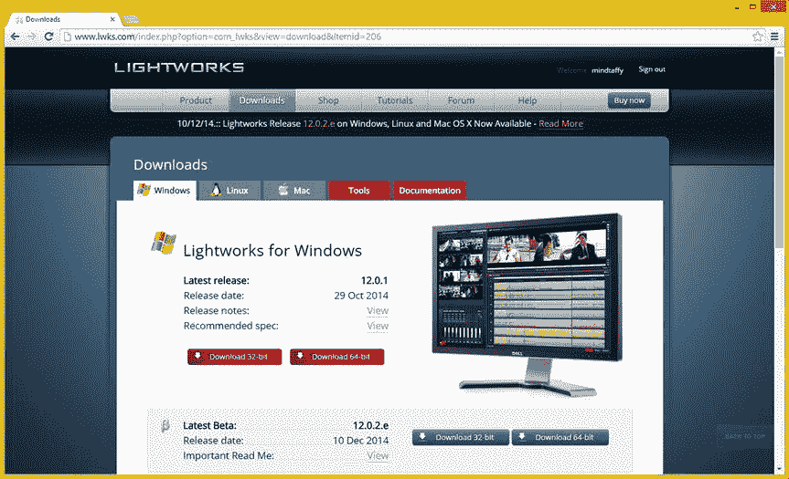

图 2-11 。转到`lwks.com`网站，注册并点击与您的系统匹配的操作系统选项卡和下载按钮

现在你已经有了 2D 图像和视频编辑软件包，你可能也应该有 3D 和数字音频编辑软件包了！

专业 3D 建模和动画:Blender

接下来让我们来看看世界上最流行的开源软件包之一， **Blender** 3D 建模 、渲染和动画 软件包，它可以在 Blender 网站的以下 URL 找到:

```java
www.blender.org/
```

Blender 有一个非常活跃的开发社区，并且每个月都有更新，有时甚至会更频繁。我可以想象，在你读到这本书的时候，会有一个更高版本的软件，但是，这一节中的所有内容仍然适用。也有用 Blender 制作的 3D 电影，以防万一你想掌握这个软件，然后成为一个主要的电影制作人！

在图 2-12 中可以看到，`Blender.org`主页上还有一个**下载 Blender 2.72b** 蓝色按钮，同样会带你进入 Blender 下载页面，在这里你可以选择 32 位或 64 位版本的 Blender for Windows。Blender 也适用于 Linux、Mac、Unix 和 Solaris。

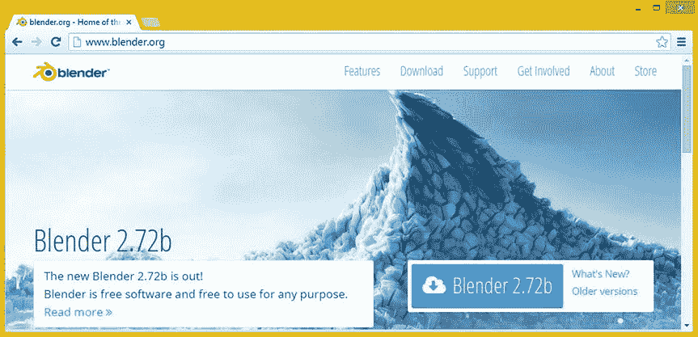

图 2-12 。转到`blender.org`网站，点击云图标上的蓝色下载按钮

这个站点将**自动检测**您当前运行的操作系统版本，由于我运行的是 Windows 8，您将在图 2-13 中看到，Blender for Windows 选项卡被选中，显示一个蓝色的主要软件下载区域。

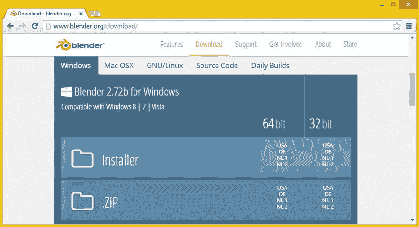

图 2-13 。第`blender.org/download/`页；选择顶部的操作系统选项卡，然后单击您的操作系统类型的安装程序链接

正如你所看到的，世界上有许多不同的下载服务器托管这个非常受欢迎的软件包，所以如果你在荷兰或德国，你可以点击这些链接更快地下载软件(或者至少离你更近)。

因为我有运行 Windows XP (32 位)、Windows Vista (32 位)、Windows 7 (64 位)和最近的 Windows 8.1 (64 位)的新媒体内容制作工作站，所以我已经下载了这两个版本的 Blender，如果你回头看一下图 2-13 中显示的截图，就可以看到这一点。单击与您的操作系统配置(32 位或 64 位)匹配的版本(操作系统位级),然后下载 Blender 的相应版本。

一旦你的下载完成，启动安装程序 EXE，它应该被命名为**blender-2.72-windows32.exe**或**blender-2.72-windows64.exe**，除非更新的版本已经可用(版本 2.8 预计在 2015 年推出)。安装完成后，右键单击图标或可执行文件，选择**固定到任务栏**选项，创建一个快速启动图标。

专业数字音频编辑:Audacity 2.0.6

**Audacity** 项目 托管在`sourceforge.net`上，这是一个开源软件开发网站，如果你还不知道这个网站，你可能会发现搜索你感兴趣的软件非常有趣！要访问 Audacity 项目，进入`audacity.sourceforge.net`网址，你会看到一个**下载 Audacity 2.0.6** 链接， 如图图 2-14 所示。

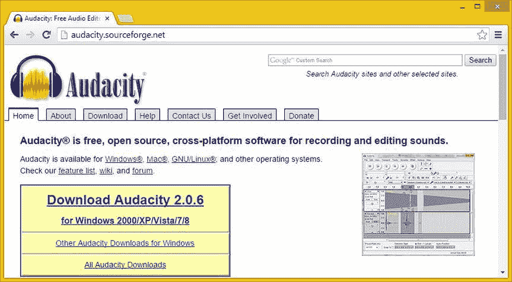

图 2-14 。转到 SourceForge 网站上的`audacity.sourceforge.net`页面，点击下载 Audacity

请注意，32 位 Audacity 支持几十年前的操作系统，如已有十多年历史的 Windows 2000 和现在已有近十年历史的 Windows XP。我希望你的 Android 可穿戴设备开发工作站使用的是 Windows 7 或 Windows 8.1 操作系统，因为 Windows 8.1 的内存效率现在几乎和 Linux 一样高了！

一旦下载了 Audacity 安装程序文件，您就可以启动它并继续安装这个功能丰富的数字音频编辑软件。它问你的第一件事是你想用什么语言运行这个软件，我选择了默认语言，**英语**。然后我点击了一个**下一个**按钮，读取信息。然后，我再次单击 Next 按钮，接受默认的安装位置，并创建了桌面图标。最后，我点击了**安装**按钮，得到了**安装**进度条对话框，以及关于 Audacity 项目的更多信息，还有最后一个对话框，在那里我可以点击**完成**按钮来退出安装软件。

如果你愿意，你可以按照我用 Blender 做的相同的工作过程，通过右键单击 Audacity 2.0 图标并选择**固定到任务栏**，在任务栏上放置一个快速启动快捷图标。您可以通过将启动图标拖动到任务栏上您喜欢的任何位置来重新定位它们。

现在 Audacity 已经安装好了，您可以启动音频编辑软件并确保它在您的系统上工作。通过快速启动图标或双击桌面上的图标来启动 Audacity。你应该看到一个新的空白项目，如图 2-15 所示，在桌面上打开。在本书的后面，你将使用 Audacity 为你的 Android UI 元素对象添加音效， ，比如你的按钮和 ImageButton 对象。

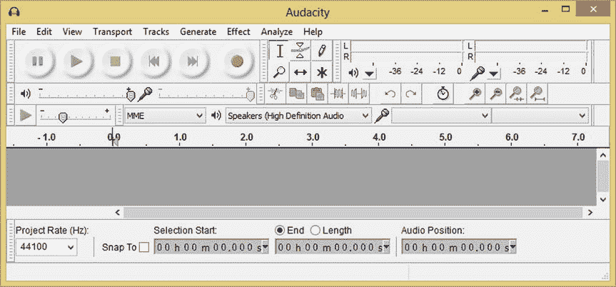

图 2-15 。启动 Audacity，确保它能在您的可穿戴设备开发工作站上正常运行

接下来让我们下载领先的开源用户界面设计原型软件包 Pencil 2.0.5。这适用于 Windows、Linux 和 Macintosh，并以所谓的“模板”包的形式支持 Android 和 HTML5 用户界面，这些包适用于 Android 4、iOS、Dojo JS、Ext JS Neptune，将来可能还会支持 Android 5。如果你喜欢绘制 UI 设计，你会喜欢铅笔！

专业 UI 设计线框化:铅笔项目 2.0.5

接下来，您将下载并安装一个名为 **Pencil** 的用户界面(UI) **线框化**或**原型化**工具，目前版本为 2.0.5。在谷歌上搜索 Pencil 或直接进入以下网址，可以在图 2-16 的顶部看到:

```java
http://pencil.evolus.vn
```

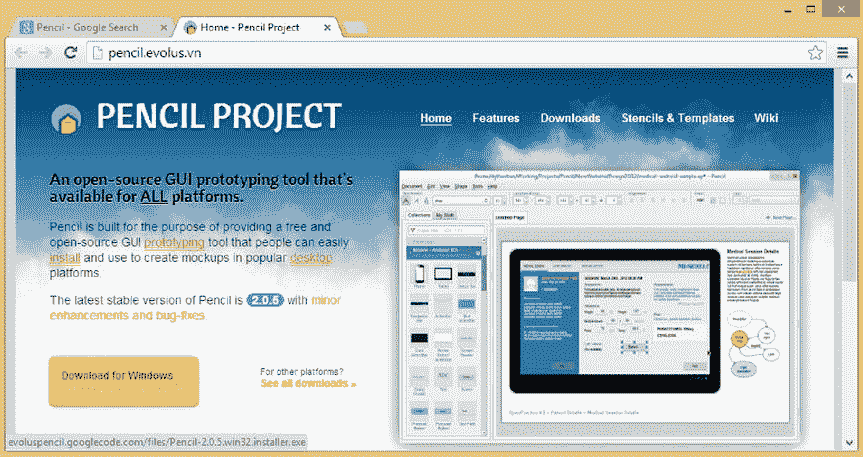

图 2-16 。进入`pencil.evolus.vn`网站，点击橙色下载按钮下载 Pencil 2.0.5

当 Pencil 项目主页出现时，点击橙色的**下载**按钮，下载 22MB 软件安装程序可执行文件。这应该被命名为类似于 Pencil-2.0.5.win32.installer.exe 的**。Pencil 只使用 32 位二进制，因为软件不需要 64 位提供的功能。**

 **一旦下载完成，启动安装程序，当它完成时，右键单击你的桌面图标或开始菜单图标(甚至在一个可执行文件上)并选择**固定到任务栏**选项来创建软件的**快速启动图标**快捷方式。我的 Windows 8.1 任务栏如图图 2-17；注意我已经添加了**字体**、**计算器**、**文本**和**文件管理**工具。


图 2-17 。显示快速启动任务栏，带有关键的操作系统工具、新媒体软件和 Android Studio

现在，为了彻底起见，让我们安装一个完整的商业生产软件套件，以防您需要为未来的 Android 可穿戴设备软件开发项目整理报价、电子表格甚至合同！

专业商业软件套件:OpenOffice 4

为了 100%确保您的 Android 开发工作站已经安装了您的专业 Android 可穿戴设备应用开发业务所需的一切，让我们以另一个名为 OpenOffice 4 的软件包来结束这一令人印象深刻的专业软件安装，该软件包最初来自 Java 的制造商 Sun Microsystems，被 Oracle 收购，并在开源后移交给 Apache。

在谷歌上搜索 Apache Open Office，或者访问`www.openoffice.org`网站，然后单击**我想下载 OpenOffice 4** 链接，或者访问 Open Office 4.1.1 下载页面，该页面位于以下 URL，如果您想直接在浏览器中键入该 URL:

```java
[`www.openoffice.org/download/index.html`](https://www.openoffice.org/download/index.html)
```

正如你在图 2-18 中看到的，网站可以检测到你正在使用的操作系统和位级别，以及你正在使用的语言！

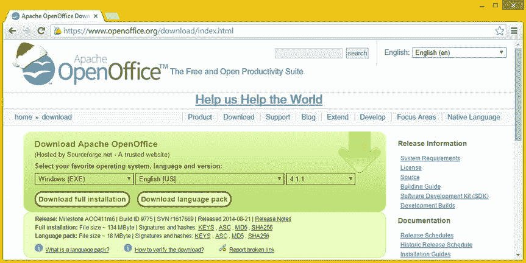

图 2-18 。Apache OpenOffice 4.1.1 下载页面，已经自动检测到我的 64 位 Windows 8.1 操作系统

一旦你进入/download/页面，如图 2-18 所示，点击绿色箭头为你的操作系统下载最新版本的 office 套件，在我的例子中是 Windows 8.1(该网站为我自动检测)。这个下载差不多有 135MB，包含了六个以上的生产力软件包，包括一个文字处理器、一个电子表格和一个数据库。

下载完成后，启动你的 installer EXE，完成后右击图标或可执行文件，选择 **Pin to Taskbar** 选项，为软件创建**快速启动图标**快捷方式。

接下来，我将告诉你一些其他的开源和负担得起的 3D 软件包，我用它们来为我的客户创造新的媒体内容。

其他开源和负担得起的媒体软件

还有很多其他的开源软件包，如果你想要的话都有，包括 **SketchUp** (建筑渲染) **TerraGen3** (虚拟世界创作)**true space**(3D)**Wings**3D、 **Bishop** 3D、 **POV Ray** 3.7 (3D 渲染) **Rosegarden** (音乐作曲、MIDI 和配乐) **Qtractor** (声音

还有一些非常实惠的 3D 软件包你也应该看看，包括 NeverCenter **SILO** 2.3(四边形 3D 建模)**Moment of Inspiration**3(NURBs 3D 建模) **Vue 3D** (3D 世界生成) **Hexagon** 2.5(多边形 3D 建模)【Auto-Des-Sys **Bonzai** (3D 建模)以及 NewTek **Lightwave** 3D (3D 建模、3D 动画

我在每个新媒体内容制作工作站上安装了这些专业开源软件包。这允许你为你所有的制作人创建完全加载的 3D 制作工作站，唯一的成本是硬件，你可以在沃尔玛花 300 到 600 美元买到。

恭喜你！您现在已经组装了专业级的 Android 可穿戴应用和新媒体内容开发工作站，您现在可以利用它来创建专业的 Android 可穿戴应用，并在世界未发现之前开发用户界面设计和用户体验！

接下来，让我们快速概述一下您将在本书的课程中学习的一些内容，现在您已经了解了可穿戴设备、Android 5 材质设计，并设置了您将用于开发可穿戴应用的 Pro Android 可穿戴设备开发工作站。

摘要

在这一章中，您完全设置了您的全面的 Pro Android 可穿戴设备 Android Studio 应用开发工作站，学习了硬件要求(以及您真正应该拥有的东西)以及关于开源软件的所有内容，在过去的十年或二十年中，开源软件最终变得像付费软件包一样专业，这些软件包可能很容易就要花费数千美元！

您下载并安装了 Java SE 7、Android Studio、新媒体内容制作软件、(可选)用户界面设计原型、商业生产力工具，您下载并安装了世界上最令人印象深刻的开源软件包。

你这样做是为了给你的 Pro Android 可穿戴设备和设备应用开发工作流程打下基础，你将在本书中进行这项工作。我决定让你先安装所有的软件，而不是在你进行的时候安装这些软件包。我这样做是为了防止你想在实际阅读本书之前探索这些强大、令人兴奋的新媒体内容制作软件包的许多功能。我认为这很公平。

这个过程最棒的一点是，你是通过使用开源、100%免费的商业用途和专业级应用软件包来完成的，如果你仔细想想，这是非常惊人的。

你从下载安装甲骨文 **Java SE 7u72 JDK** 或者 **Java 开发包**开始，这是 Java 7 编程语言的 SDK。这个 Java JDK 是使用 Eclipse 以及为消费电子设备的 Android 操作系统平台开发应用软件所必需的。

然后你访问了 **Android Developer** 网站，下载并安装了 **Android Studio Bundle** ，它在你的 Java SE 7 编程软件开发环境之上构建了 **IntelliJ IDEA** 以及所有的 **Android Developer Tool** 插件。

接下来，您下载并安装了 **GIMP 2.8.14** ，这是一个强大的数字图像编辑包，可用于 Windows、Linux 和 Macintosh 操作系统。

然后你下载并安装了 **Lightworks 12** ，这是一个数字视频编辑和特效包，最近作为开源发布，目前可用于所有流行的操作系统。

然后，您下载并安装了 **Blender 2.72** ，这是一款适用于 Windows、Linux 和 Mac OSs 的专业 3D 建模、渲染和动画工具。

接下来，您下载并安装了 **Audacity 2.0.6** ，这是一个可用于 Windows、Linux 和 Mac OSs 的开源数字音频编辑工具。

然后您下载并安装了 **Pencil 2.0.5** ，这是一个流行的 UI 线框和原型工具，可用于 Windows、Linux 和 Mac OSs。

最后，您安装了 Apache **Open Office 4.1.1** ，只是为了确保您拥有一个完全完善的开源工作站。

在下一章中，您将了解 Android 5 的所有新功能，从而为 Android 5 操作系统为您的定制可穿戴设备应用开发提供的功能打下坚实的基础。**