# 四、探索 Android Studio：熟悉 IntelliJ IDEA

现在你已经对 Android 中的新特性有了一个全面的概述，包括新的材质设计范例和其他 Android 5 的新特性，本章将看看 Android Studio 的**集成开发环境** ， **IntelliJ IDEA** 。在第二章的中，您已经完成了开发工作站的组装，所以现在剩下要做的就是让您了解 IDE 软件工具的详细情况，您将在本书中使用该工具。一旦解决了这个问题，您就可以在本书接下来的 13 章中专注于 Java 7 编码或 XML 标记。

让我们先看看 IntelliJ 如何让您了解它的所有特性，然后看看如何使用 Android **SDK 管理器**找出当前安装了哪些 Android APIs。我想向您展示如何确保为 Wear 和 Android TV 安装所有最新的 API，这样您就可以在升级 IDE 方面进行一些练习。

在那之后，你将在这一章的剩余部分学习你的 IntelliJ 思想将如何被布局以及它的各种功能组件。然后，我将解释如何使用 IDEA 的一些特性和功能，以及 IDEA 与 Android SDK 的接口来构建可穿戴应用。我将向您展示如何使用 SDK 管理器，以便您可以安装 API 来开发 Google cloud 可穿戴应用。然后，我将向您展示如何创建 Wear 智能手表应用，以及 Wear 组件的工作原理。

更新 IntelliJ IDEA:使用更新信息对话框

如果您还没有这样做，请使用您在第二章中创建的快速启动图标启动 Android Studio 环境。这将启动 IntelliJ IDEA，它是 Android Studio 的基础，取代了 Android 4 . x 版和之前版本中使用的 Eclipse ADT IDE。

正如你在图 4-1 中看到的，如果 Android Studio 有更新，你的欢迎使用 Android Studio 启动屏幕会在右上角有一个浅绿色的更新信息消息。幸运的是，当我今天发布时，有一个从 1.0.1 到 1.0.2 的更新，所以我可以向您展示更新中涉及的工作流程，因为您很可能会在可穿戴应用开发的某个时间点遇到这种情况。

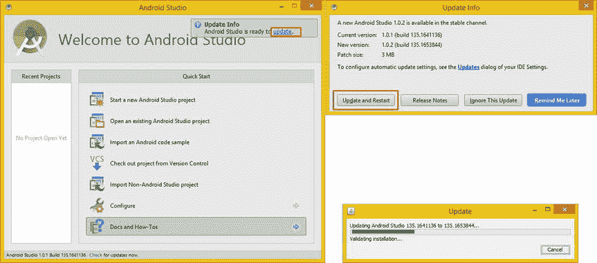

图 4-1 。启动 Android Studio，单击 update 链接，单击 Update and Restart 按钮，然后更新 IDE

点击图 4-1 中红色框中突出显示的蓝色更新链接，启动 Android Studio 更新流程。这将打开一个对话框，显示在图 4-1 的右上角，它会给你当前的构建，当前的版本号，以及补丁的大小。这个补丁只会更新你的 Android Studio 安装中已经改变的部分。这被称为增量更新，这比再次下载完整的 1gb(可能更多)Android Studio 开发环境更可取，因为这是多余的。点击**更新重启**按钮，你会看到更新进度条对话框，如图图 4-1 右下方所示，你将会更新到 Android Studio 的最新版本。

探索 IntelliJ IDEA:帮助、提示和键映射

在你更新并重新启动 Android Studio (IntelliJ IDEA)后，欢迎使用 Android Studio 屏幕的左下方会显示最新的版本号，是 1.0.2，如图图 4-2 所示。点击图 4-2 左下方的文档和操作选项。这将打开文档和操作面板，显示在图 4-2 的右侧。

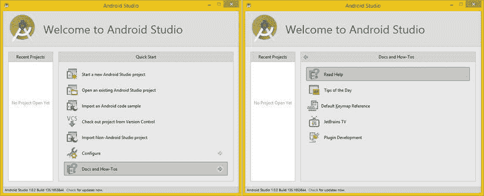

图 4-2 。一旦 Android Studio 重启，点击文档和操作选项来浏览 IntelliJ 文档

正如你所看到的，有许多对你的想法学习曲线爬升有帮助的领域供你探索，包括**阅读帮助**文档，你将在接下来看到，**每日提示**对话框，**默认键盘映射参考，**，如果你有无限的带宽， **JetBrains TV** 。

JetBrains 是这个 IntelliJ 想法的开发者。如果你想为 IntelliJ 开发第三方插件,这超出了本书的范围，也可以选择接受这方面的培训。

点击文档和操作面板顶部的**阅读帮助**选项，打开他们网站的 IntelliJ IDEA 帮助部分，可以在图 4-3 中看到。有关新功能、帮助系统、快速入门指南、基本思想概念、教程部分和类似参考资料的信息按逻辑分组。

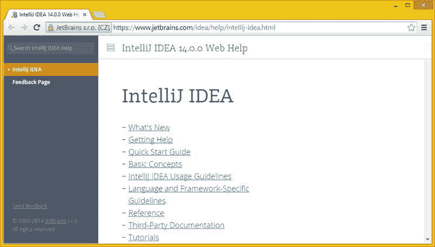

图 4-3 。点击阅读帮助选项打开 JetBrains IntelliJ IDEA 第 14 版网络帮助网站

如果你想掌握集成开发环境，我建议你在某个时候通读所有这些材质，在本书的过程中，你将使用集成开发环境来开发 Pro Android 可穿戴设备应用。在本章中，我还将介绍 IntelliJ 思想的基础。

点击**获取帮助**链接，查看您有哪些关于 IntelliJ IDEA 的帮助选项。正如你在图 4-4 中看到的，点击链接将在网站的左侧内容导航窗格中打开一个子面板，以链接的形式显示更多的细节，你可以点击它来探索 IntelliJ IDEA 帮助系统的不同区域。


图 4-4 。单击左侧导航窗格中的获取帮助导航链接，并仔细阅读列出的小节

其中包括如何使用帮助主题、如何使用“日积月累”对话框、如何使用 IntelliJ 在线资源、如何使用 IDEA 生产力指南、如何报告您在 IntelliJ IDEA 安装(或功能)中遇到的任何问题、如何提交关于您希望在未来版本中看到哪些功能的反馈，以及如果您喜欢使用键盘快捷键而不是鼠标和 IDEA 菜单系统，您的按键映射参考。

在这一章的后面，我将回顾一些在概念部分阐述的核心 IntelliJ IDEA 概念，如图 4-4 中用灰色突出显示的。我会这样做，这样在你开始在第五章和本书的整个篇幅中认真使用这些概念之前，你已经对这个想法有了一些核心概念。

如果你是好奇型的，现在就去浏览一些在线资料，这样当我在本书后面开始认真讨论它时，你就熟悉它了。

接下来，让我们看看 Android Studio 启动屏幕上的配置菜单，了解如何使用 SDK 管理器工具来定制您的想法。

配置 Android Studio:使用 SDK 管理器

因为这是一个 Pro Android 标题，所以您可能有一些使用 Eclipse ADT IDE 进行 Android 4.4(和更早版本)应用开发的经验，它包括一个 **Android SDK 管理器**菜单选项和对话框。在 IntelliJ IDEA 中也可以通过使用**配置 SDK 管理器**面板序列来访问该工具，如图图 4-5 所示。

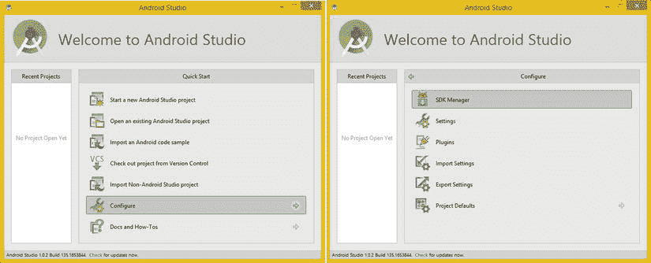

图 4-5 。单击返回箭头返回到快速入门，然后单击配置选项和 SDK 管理器选项

Android Studio 配置面板 还可以访问您的 IntelliJ IDEA **设置**的对话框，管理 IntelliJ IDEA 的**插件**，并设置**导入**和**导出**参数。

你真的应该花些时间来探索这些对话。在本书中，您也将使用其中的一些对话框，这样您将获得一些在 Pro Android 可穿戴设备开发工作流程中最大限度地使用 IntelliJ IDEA 的实践经验。

一旦你点击 SDK 管理器选项，如图 4-5 顶部所示，这将打开 Android SDK 管理器对话框，如图图 4-6 所示。请注意，在对话框的底部有一个抓取 URL 进度条，它可以到达下载安全套接字层(dl-ssl)谷歌服务器的存储库，并根据 Android 5 谷歌服务器上的最新 API 检查您想法中的所有内容。这是为了让下一个对话框可以推荐您安装的软件包，以便您可以将您的 Android Studio (IntelliJ 14 IDEA)升级到最新的功能，或硬件平台(Wear SDK、Android TV、Auto SDK 等。)支撑位。

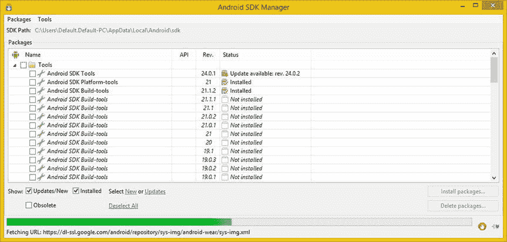

图 4-6 。一旦你启动 Android SDK 管理器，你会看到抓取 URL 的进度条 加载 API

正如你在图 4-7 中看到的，这个 Android SDK 管理器将填充那些它认为你应该选中的复选框，以调用更新或新的 API。

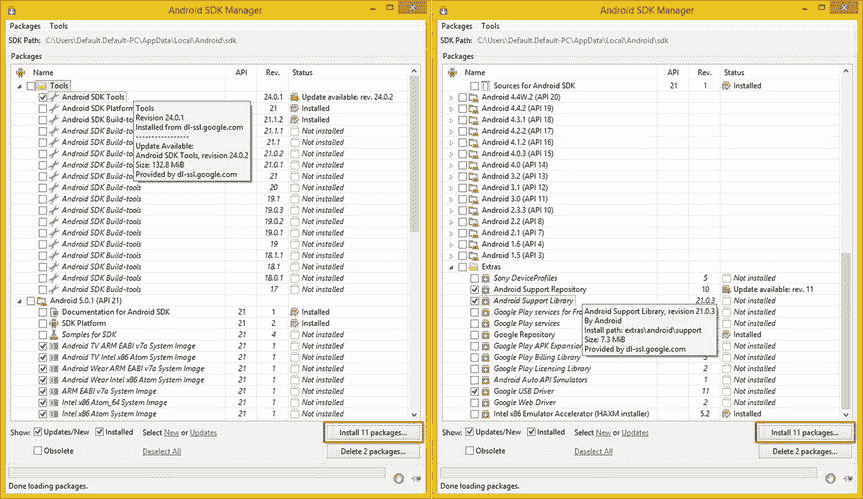

图 4-7 。Android SDK 管理器对话框(左上，右下)默认谷歌 USB 驱动选择 

Android Studio 1.0.2 有更新，或者你可以将其视为 Android Studio 1.0.2 的新 API，这里描述为 Android SDK 工具版本 24.0.2，这是一个**内部编号模式** ，显示在 Rev(ision)列中。

此外，还为 Android Wear 或 Android TV 提供了七种新的系统映像，适用于 ARM 和英特尔(Atom)处理器硬件。我按照建议检查了它们，因为在第五章的例子中需要它们，在那里我将介绍你的 AVD (Android 虚拟设备)模拟器的创建。这些可以在图 4-7 的左下方看到，我不得不把它(对话框)剪成两半以适合页面。

在图 4-7 的右侧，可以看到底部有新的 Android 5 支持工具(新的支持资源库和新的支持库)，以及新的 Google USB 驱动(版本 11)。支持库及其存储库非常重要，因为它们提供了向后兼容性。使用支持库可以让你为 Android 5 开发，并且仍然支持早期版本的操作系统，如 2.3.7 (Kindle Fire)和 4.x。

你也可以使用这个 Android SDK 管理器对话框来安装“额外的东西”，比如 Google Web Driver，它们显示在图 4-7 的右下角。

一旦你点击 **Install 11 Packages** 按钮，这些都将被安装(或更新)到你的 Android Studio 中，正如你现在所知道的，这是 IntelliJ IDEA 的 14 版本和 Android 5.0.2 SDK 的融合。如果 Android Studio 是 1.0.2，那么 Android OS 将是 5.0.2。

在你安装任何 API 之前，本质上是新的软件包，你必须同意他们的每个许可“条款和条件”，显示在图 4-8 的**选择要安装的包**对话框中。选择以红色突出显示的接受许可证单选按钮，并单击**安装**按钮继续安装。

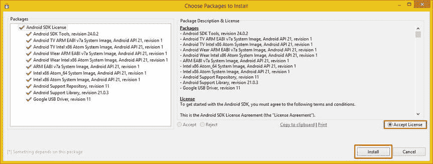

图 4-8 。选择要安装的软件包对话框和以及接受许可协议

我点击了安装按钮，本来应该是一个相当长的安装过程在不到五秒钟内就过去了！在我点击安装按钮几秒钟后，出现了如图 4-9 所示的对话框。这让我有点困惑，所以我等着看是否会弹出下载日志对话框。果然如此，并充满了错误启动！哦天啊！

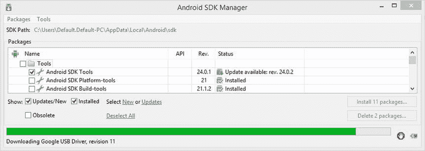

图 4-9 。显示下载 SDK 更新进度对话栏 ，位于对话框底部

我选择安装的每个软件包都出现了“下载中断:错误记录 MAC”的错误，如图 4-10 中的所示。

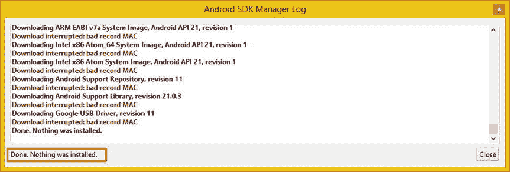

图 4-10 。显示 Android SDK 管理器日志对话框，下载中断:坏记录 MAC 错误 

注意日志对话框的左下方，在图 4-10 的中用红色突出显示，说明安装已经完成，而**没有安装任何东西**！因此，我的预感是正确的，当我谷歌这个错误时，我没有找到这个问题的解决方案，所以我决定尝试以一个**系统管理员**的身份启动 Android Studio，这样我就有了顶级管理员权限。我将向您展示这个工作过程，因为当软件安装不起作用时，这总是我尝试的第二种方法，因为有时文件试图写入硬盘驱动器，但没有权限这样做！

以管理员身份运行:使用管理员权限 安装

在 Windows 中调用*管理员运行*命令有两种方式，如图图 4-11 和图 4-12 所示。很少有开发者知道的很酷的快捷方式是右击 Android Studio 任务栏启动图标，选择 **Android Studio 以管理员身份运行**。这显示在图 4-11 中，还有一个更复杂的 **Android Studio 属性**方法，我将在下面解释。

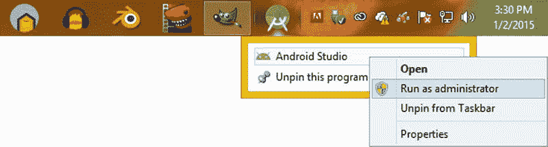

图 4-11 。右击 Android Studio 图标，选择以管理员身份运行

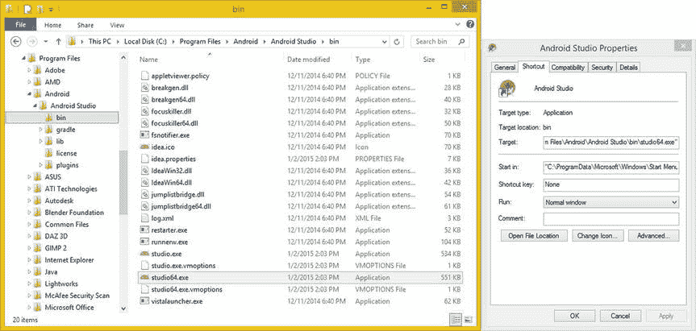

图 4-12 。在 bin 子文件夹中查找 studio64 可执行文件；右键单击并选择属性以查看其属性对话框(如右侧所示)

从同一个菜单中，您还可以选择属性菜单选项，并打开 Android Studio 文件的属性对话框，它会告诉您 EXE 文件的名称以及它在硬盘驱动器上的位置。

有了这些信息，您就可以在 Windows 资源管理器(或 Linux OS 文件管理工具)中右键单击该文件，然后选择**以管理员身份运行**选项。从那时起，在您再次使用一个**配置的 SDK 管理器**序列之前，您以管理员身份启动 Android Studio。然后再次尝试更新(升级)，这一次，用管理员权限！

图 4-12 显示了带有目标文件夹的 **Android Studio 属性**对话框，以及您想要使用**studio64.exe**(64 位版本)作为文件的事实，您将使用与图 4-11 中所示完全相同的菜单序列右键单击并启动。

正如你在图 4-13 中看到的，安装现在正以极其缓慢的速度进行，这意味着这一次，我得到了一个非常不同的结果！这意味着更新可能会成功，所以如果没有日志对话框弹出，以管理员身份运行将解决问题。

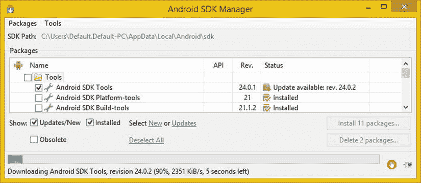

图 4-13 。使用 SDK 管理器对话框下载任何新的 Android SDK 更新

我想向您展示这个 SDK 管理器 API 更新困境的解决方案，以防您遇到它，因为没有很多网站提供这个关于如何作为管理员启动 IntelliJ IDEA 的快速而简单的变体！

值得注意的是，您不必总是以管理员身份启动 Android Studio 1 . 0 . 2(IntelliJ IDEA 14)来使用开发环境，只有当您尝试更新 SDK 环境并遇到与读取或写入操作系统硬盘驱动器上被视为“敏感”(或特权)的文件相关的错误时才需要这样做。

在第二次尝试之后，我没有弹出 Android SDK 管理器日志对话框(窗口)!相反，在这个安装过程的最后，我看到了 **Android Tools 更新的**消息对话框，可以在图 4-14 中看到。

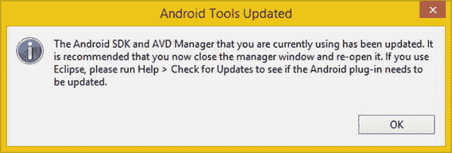

图 4-14 。一旦你更新了你的 SDK，你会看到 Android 工具更新对话框

该对话框建议关闭 SDK 管理器窗口，然后重新打开它。我把这个建议带到了下一个层次，关闭了 Android Studio (IntelliJ IDEA)并重新启动它，将最新版本加载到内存中。我这样做是为了 100%确保内存中的一切都是 Android Studio 1.0.2“干净的”

让我们再次使用**配置 SDK 管理器**选项窗格序列，你会看到 Android SDK 管理器显示它现在已经安装。这显示在图 4-15 中，如你所见，在你试图更新或安装的东西旁边有一个文件夹检查已安装图标。

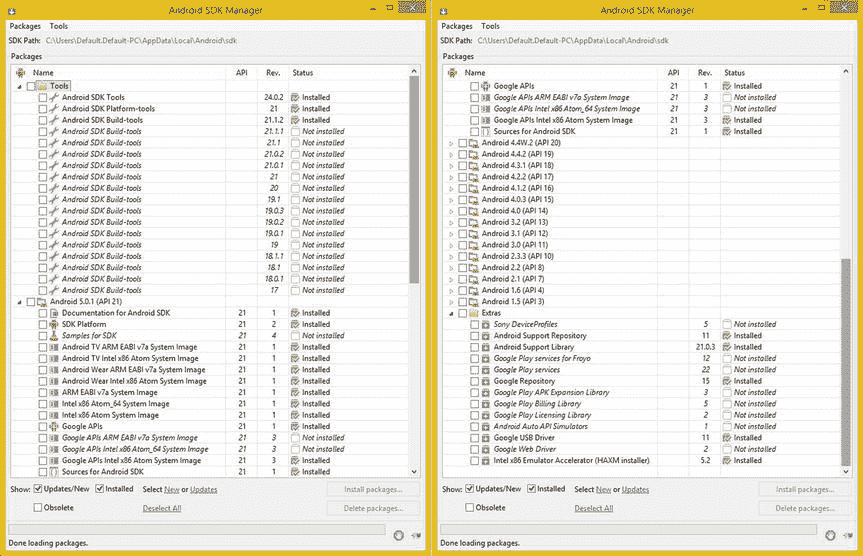

图 4-15 。使用配置 SDK 管理器序列来启动 SDK 管理器并确认安装

在启动 Android Studio 时，只要你看到绿色的小更新对话框，你就会想要执行这个工作过程(参考图 4-1 )。

这个绿色的对话框(实际上更像是一个警告贴)会告诉你 Android Studio (IntelliJ IDEA)有一个更新正在等待。这将提醒您还需要使用您的**配置 SDK 管理器**面板序列，因为 SDK、驱动程序、库、存储库、服务和系统映像的更新几乎总是与 IntelliJ IDEA 本身的每个主要(和次要)更新同步进行！

接下来，我想给你一个 IntelliJ IDEA 的快速概述，并介绍有关它如何工作的概念，以便你在我在本章稍后实际使用该想法创建 Android 项目之前有一个鸟瞰图，以及在第五章当你将创建 AVD 仿真器(虚拟设备)时，你知道如何创建和测试 Android 项目。

学习 IntelliJ IDEA 基础知识:项目和 SDK

IntelliJ IDEA 文档包含两个主要级别。如果你仔细回顾一下，你会发现这一点。其中一些将适用于作为 Android 应用开发人员的您，一些将适用于 Google 的 Android Studio 开发团队，因为它涉及到集成定制的 SDK 并将它们插入 IntelliJ IDEA 以创建平台，如您刚刚升级到的 Android Studio 1.0.2(或更高版本)平台。

IntelliJ 项目级别:开发 Android 应用

当您使用 IntelliJ 思想时，您需要为您的每个应用创建一个“项目”。您将在本章的稍后部分执行此操作，这样您就可以看到所涉及的工作流程。IntelliJ 项目用于将应用组织成功能开发组件素材。作为一名专业的 Android 开发人员，您知道这包括 Java 代码、XML 标记、数字图像、数字视频、数字音频、build.gradle 和 AndroidManifest.xml 文件，以及您刚刚在 SDK 管理器中安装的组件，这些组件也需要在您的应用中，以便为您在 Java 或 Android SDK 代码基础上编码(和标记)的内容提供基础。

一个完成的或“编译的”可穿戴应用的 APK(应用包)可能看起来像一个文件，但它实际上包含大量离散的或“隔离的”模块，这些模块提供类似于 Java 中的包的代码组织。IntelliJ IDEA 项目定义了在任何给定的可穿戴应用中使用哪些模块。

这种项目方法允许开发人员以高度可视化的方式在 ide(集成开发环境)内将项目组合在一起，并使用可视化开发编辑器将这些功能模块联系在一起。这类似于文字处理器，但它是为编写代码而不是业务文档而优化的，并且通常使用缩写 IDE。

澄清一下，这个 IntelliJ IDEA“项目”并不包含您实际的开发素材，在 IntelliJ 术语中称为“工件”，如媒体素材、Java 代码、XML 标记、编译构建脚本、文档等。这些项目是 IntelliJ 思想的最高组织级别，它们定义了项目范围的设置、模块和库的集合，以及对项目中用于创建应用的各种资源(文件)的引用。正如您所看到的，这个 IntelliJ 项目实际上把所有东西都绑定在了一个项目文件中，这当然是 IDE 生成应用所必需的！

IntelliJ 项目文件格式:文件、文件夹和配置

IntelliJ IDEA 将使用纯文本 XML 文件格式存储项目的配置数据及其组成部分。这将使您更容易管理，因为 XML 是一种相对简单的编辑或调试格式，如果需要，您还可以使用这种 XML 数据格式更容易地与他人共享项目配置数据。IntelliJ 开发人员可以使用两种类型的配置数据格式来存储您的 Android Studio 可穿戴设备应用项目配置数据。这些格式包括基于目录和基于文件的格式。

IntelliJ IDEA 基于目录的数据格式

当一个基于目录的数据格式 被用于 IntelliJ IDEA 项目时，你会发现**。IntelliJ 项目文件夹结构中的 idea** 目录。这个。idea 子目录将包含上一节提到的 XML 配置文件的集合。

这些 XML 文件中的每一个都只包含整个项目配置数据的逻辑部分。文件名反映了 IntelliJ IDEA 项目中的功能区域。这样，使用这种逻辑文件命名方法，您要找的东西将很容易找到。

例如，您可能会看到包含与项目编译方式相关的 xml 标记的 **compiler.xml** 文件，与项目实现编码方式相关的 **encodings.xml** 文件，或者包含 Android Studio 应用项目所需模块的 **modules.xml** 文件。

几乎所有这些文件都包含对项目本身至关重要的信息。这将包括文件名和所需组件模块和库的位置，或者可能是编译器设置或其他 IDEA 配置设置。这些文件可以(也应该)保持在版本控制之下，就像项目中的所有其他文件一样。

然而，这种文件命名方法有一个例外，它被命名为 **workspace.xml** 。这个 XML 文件将包含您所有的首选项设置，例如意见编辑窗格的位置和各种编辑器 UI 窗口的位置。该文件还包含您的 VCS(版本控制系统)和历史设置。

此工作区文件还可以包含与 IntelliJ IDEA 集成开发环境相关的任何其他数据。因此，您可能不希望公开共享这个文件，除非您希望人们模仿您的 IDE！

基于 IntelliJ IDEA 文件的数据格式

还有一种基于文件的配置格式 ，当您希望在一个项目目录中只放置两个配置文件时，应该与 IntelliJ 一起使用。其中一个文件以一个**为特色。ipr** 扩展名，代表 **IntelliJ 项目**。该文件将存储主要 IntelliJ IDEA 项目的配置信息。

其他更次要的文件将使用一个**。iws** 扩展名，代表 **IntelliJ 工作区**，这个文件存储了你的个人工作区设置。这个。iws 文件不应置于版本控制之下，而您的。如果您使用版本控制，ipr 文件可以(也应该)被置于版本控制之下。

基于文件的配置文件格式还可以转换为基于目录的配置文件格式(更多信息，请参见 JetBrains 网站上的“将项目转换为基于目录的格式”)。

IntelliJ 特性 : SDK、语言支持和自动编码

要开发任何类型的应用，您总是需要使用软件开发工具包(SDK)。与 Android Studio 相关的一个例子是 Android SDK，它运行在 Java 7 软件开发工具包之上，Oracle 称之为 JDK。

IntelliJ IDEA 本身不包含任何 SDK 然而，这个 Android Studio 1.x 捆绑的 IntelliJ IDEA 和 Android SDK 是基于 Java 7 JDK 的，如你所知，来自第二章第一章。通常，在您开始编写任何应用代码之前，您必须下载并安装一个受支持的 SDK，然后配置它以便在 IntelliJ IDEA 中使用。

您可以在首次创建应用项目时指定 SDK，甚至可以在以后指定 SDK。要在 IntelliJ IDEA 中定义 SDK，您需要做的是指定 SDK 的名称及其位置。

硬盘驱动器上的位置是磁盘字母和目录路径，通常称为 SDK 的“主”目录，类似于 Java 使用的术语。这将是你安装 SDK 的目录，由于你已经在第二章中安装了 Java 7 JDK，你可能记得对于 Java 来说是**C:/program files/Java/JDK 1 . 7 . 0 _ 71**。

让我们来看看 IntelliJ 思想可以支持(使用)的一些流行的开发环境，以防您计划在 Flash(使用 Flex 或 AIR)以及 Java SE 或 Java ME 中开发应用，当然，使用 Android Studio 1 . 0 . 2(Android 5 . 0 . 2)。也有允许其他开发平台的第三方插件。

IntelliJ 支持的流行 SDK:Android、Java 和 Flash

IntelliJ IDEA 使用的一些最广泛的软件开发平台包括开源的 Java 8 SE、Java 8 ME、Java 7 SE 和 Android Studio，以及 Adobe 的付费软件 Flash，这些软件目前在许多嵌入式设备(智能手机、平板电脑、智能手表、智能眼镜、iTV 电视机、游戏控制台、机顶盒、电子书阅读器、家庭媒体中心)上并不真正受支持，因为 Flash 是非常数据密集型的，而且制造商实施起来也很昂贵(它不是开源的)。

Java 7 或 8 SDK (JDK)涵盖了 Java 桌面(Java SE)和企业(Java EE)应用，以及 Java mobile (Java ME)或 Java Embedded (Java SE Embedded 和 Java ME Embedded)应用的开发。JavaFX 现在也是 Java 7 和 Java 8 的一部分，所以它包含在 Java 的所有版本中。如果你感兴趣的话，我写了【Java 8 游戏开发入门(2014 年出版)来讨论这个话题。

Android SDK，一旦使用 Android Studio 1.x 捆绑包与 IntelliJ 预集成，就用于为 Android 5 和更早的设备开发应用(使用前面讨论的 Android 支持 API 向后兼容库)。

也有 Adobe Flex 和 Adobe AIR SDKs 用于为 Adobe Flash 平台开发应用，到目前为止，Adobe Flash 平台的受欢迎程度已经下降了十年。由于免费用于商业用途，开源平台的使用量激增，从苹果、Adobe 和 MS Windows 等付费平台夺走了市场份额，因为媒体开发商的零成本功能水平相似。这就是为什么你会看到这么多基于 HTML5 和 Android 的设备。

还支持 Flexmojos SDK，它将启动 Adobe Flex 编译器和调试器。需要注意的是，当 Flexmojos 项目打开时，IntelliJ IDEA 会自动创建这个 SDK。

最后，还有“本地”IntelliJ IDEA 平台插件 SDK，用于为 IntelliJ IDEA 开发定制的插件。IntelliJ IDEA 安装本身将充当 IntelliJ IDEA 平台插件 SDK。

IntelliJ 支持的流行语言:Java 8、XML 和 Groovy

现代软件应用的开发目前涉及在一个单一的开发基础设施中使用几种(不相关的)编程语言。这描述了一个叫做**多语言**编程环境的开发环境。Android Studio 1.x 就是一个很好的例子，因为它使用 Java 7 进行编码，使用 XML 标记进行快速对象定义。

作为一名专业的 Android 开发人员，您知道这些对象后来被“膨胀”, XML 标记结构被转换成 Java 对象。IntelliJ IDEA 是多语言编程的专业 IDE，这也是 Google 在 Android Studio 1.x 和 Android 5(以及更早版本)开发中采用它的原因。

IntelliJ IDEA 的这个免费版本支持的主要编程语言包括 Java 8(和 lambda expression)以及早期的 Java 支持，包括与 Android Studio 一起使用的 Java 7(没有 lambda expression 支持)，以及 XML 和 XSL。XML 广泛用于 Android 应用开发，因此 IntelliJ 非常适合 Android 5。IntelliJ 还支持 **Groovy** ，这通常不用于 Android 应用开发，但是正如您可能想象的那样，Groovy 群体已经找到了一种方法来使 Android 的 Groovy 开发成为现实，所以如果您使用 Groovy，那么您很幸运，所有支持的 IntelliJ 语言都可以一起工作！Android Studio 中的 Gradle 构建系统使用 Groovy 语法。

IntelliJ IDEA 的“终极”版本支持大量高级语言，如 Java Server Pages (JSP 和 JSPX)、Flex、ActionScript、HTML5、CSS3、JavaScript、SQL、PHP、Spring 和许多其他语言。

最终成本大约是 500 美元购买(第一次)或 300 美元升级。创业公司有 50%的折扣，学生和教师也有免费版本。符合开源软件定义以及 IntelliJ 许可和升级(“购买”页面)网页上定义的一组附加标准的非商业操作系统软件项目可以获得免费的开源许可证。也有用于教育和培训目的的免费版本，所以事实证明 JetBrains 是一家相当慷慨的公司！

IntelliJ 自动编码功能:突出显示、格式化和折叠

像 NetBeans (JavaFX，HTML5)或 Eclipse (Java) IDE 软件包一样，IntelliJ IDE 具有许多高级功能，就像文字处理器具有的编写功能一样，只有这些功能用于辅助代码编程。

IntelliJ 代码突出显示、文件模板、代码完成和代码生成

最明显的特点是**根据使用情况用不同的颜色突出显示** ，这是文字处理器不会对你的文字做的。语法和错误突出显示在所有的 ide 中都很常见，但是 IntelliJ 看起来是所有 ide 中最专业的，因为它是免费版本的最终(或付费)版本。尽管 IntelliJ IDEA 中使用的默认颜色是行业标准颜色，但如果愿意，您也可以更改代码颜色值。

代码高亮颜色可以在**设置**对话框的**颜色和字体**部分中配置，您可以在图 4-5 的右侧看到，从上往下数第二个，您可能已经研究过了，正如我之前建议您做的那样。

还有另一个很酷的特性叫做“文件模板”，它允许 IntelliJ 为 IDE 支持的语言创建我称之为**引导** ，或者部分编码(这些也被称为**存根** )。这使得 IntelliJ 能够创建“空”的类和方法，例如 Java 7 或 XML 1.0 标记。

所有 IDE 软件中都有另一个流行的特性，叫做**代码** **完成** ，它会查看您正在编写的代码的上下文，并为您完成部分代码。还有**代码生成**，它与文件模板的功能密切相关，提供了您的引导代码“片段”，您可以根据需要进行修改。

IntelliJ 代码格式化、代码折叠、搜索和替换、宏和文档

IntelliJ IDEA 不仅为您编写代码并为代码着色，以使事情变得更容易，它还以其他酷的方式格式化、隐藏(和显示)和自动化您的编程。

帮助你组织和更好地了解程序逻辑的特性之一叫做**代码折叠** 。代码折叠通常会在主要代码块的左侧使用加号(+)或减号(-)图标，例如 Java 7 中的类和方法，以允许您“折叠”这些程序结构，这样您就可以在屏幕上有更多的空间来处理其他代码结构，或者鸟瞰您正在处理的 Java 类的代码结构。

如您所料，IntelliJ 允许您快速访问 Android API 文档，以便您可以快速轻松地研究常量、接口、方法或类。Android 5 API 已经变得如此庞大，以至于这个功能成为你可穿戴应用开发的重要补充。

随着代码变得越来越复杂，另一个变得越来越有价值的自动化特性包括在编辑窗格中使用宏。宏是自动化的工作过程，可以追溯到早期的大型机计算、DOS 和批处理。

还有其他一些有用的功能，比如可以打开控制台窗口，这样就可以在不脱离 IntelliJ 思想的情况下交互式地执行命令。

除了代码编辑辅助功能，IntelliJ IDEA 还支持调试 Java、JavaScript、PHP 和 Adobe Flash (Flex)应用。目前，Mozilla Firefox 和 Google Chrome 浏览器都支持 JavaScript 相关应用的调试。现在，让我们创建一个可穿戴应用！

创建 Android 可穿戴应用 :使用 IntelliJ

现在是使用快速启动快捷方式启动 Android Studio 的时候了，这次不是点击配置或文档和操作选项，而是点击启动一个新的 Android Studio 项目选项，如图 4-16 中的选择。

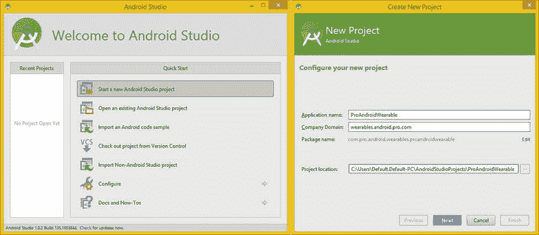

图 4-16 。选择开始一个新的 Android Studio 项目；将你的应用命名为 ProAndroidWearable

将您的应用命名为 **ProAndroidWearable** 并将【wearables.android.pro.com 设置为您的域，然后单击**下一步**按钮。在接下来的对话框中，如图图 4-17 所示，从下拉列表中选择**Android 4.3 Jelly Bean API Level 18**，然后勾选磨损复选框选项。保持选中电话和平板电脑复选框选项(因为这是默认的应用开发选项)。

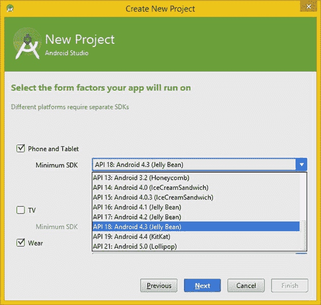

图 4-17 。选择 API 18、穿戴、手机和平板电脑

一旦你点击**下一个**按钮，你将被带到一个**添加一个活动到移动**对话框，如图图 4-18 所示。选择 **Add No Activity** 选项，显示在该对话框的左上角，以便不为上一对话框的电话或平板电脑选项部分创建活动。

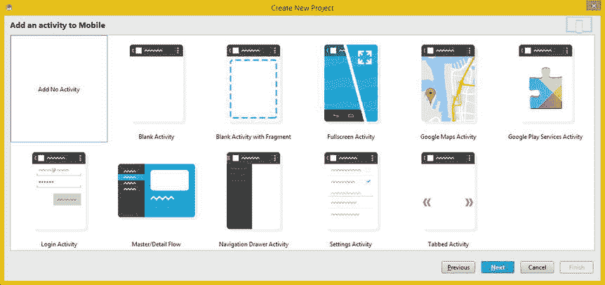

图 4-18 。在“向手机添加活动”对话框中选择“不添加活动”选项(适用于手机和平板电脑选项)

一旦你点击**下一个**按钮，你将得到第四个对话框，**添加一个活动佩戴**对话框，在这里你将选择你的**空白佩戴活动**选项，正如你在图 4-19 中看到的，显示了圆形和方形 Android Wear 智能手表屏幕(活动)配置。选择空白穿戴活动后，点击**下一个**按钮，您可以为穿戴式应用命名主活动，并让 IntelliJ 在下一个对话框中设置(生成代码)引导 XML 文件。

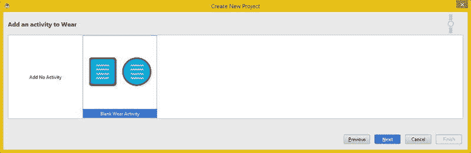

图 4-19 。在“添加要穿戴的活动”对话框中选择“空白穿戴活动”选项，然后单击“下一步”按钮

在**为您的新文件**选择选项对话框中，可以在图 4-20 中看到，接受 Android Studio 建议的 Android 5 Java 和 XML 文件命名约定，并将您的主 Java 引导**MainActivity.java**和主 XML 用户界面布局容器文件 **activity_main.xml** 命名。Wear UI 布局容器 XML 文件分别以 round_ 和 square_ 作为文件名的前缀，这对我来说似乎合乎逻辑。

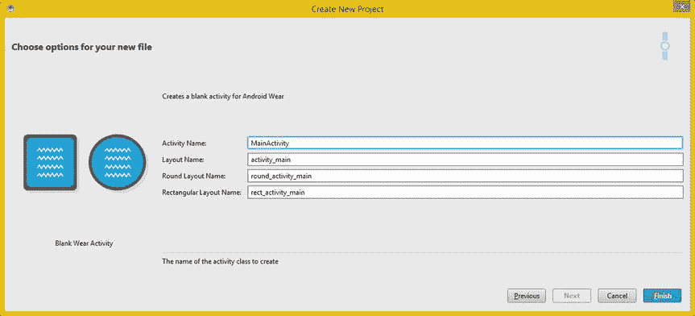

图 4-20 。在“为新文件选择选项”对话框中，接受标准的 Java 和 XML 文件名约定

点击**完成**按钮后，会出现一个 Windows 安全警告对话框，如图 4-21 左侧所示。点击允许访问按钮，这样 Android Studio 就可以继续启动，用 Gradle 构建一个项目，如图图 4-21 右侧的构建对话框所示。

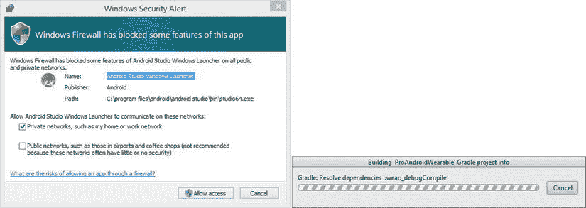

图 4-21 。单击“Windows 安全警报”对话框中的“允许访问”按钮，解除对 Windows 防火墙的阻止

一旦 Android Studio (IntelliJ IDEA)启动你的引导程序项目，你会看到日积月累对话框，也可以使用**文档和操作日积月累**面板序列来访问，如图图 4-22 所示。


图 4-22 。IntelliJ 启动后，日积月累对话框将会打开

你可以点击**下一个提示**按钮，在图 4-22 中以蓝色显示，或者你可以点击它左边的**上一个提示**按钮向后循环提示队列，如果你是一个不墨守成规的人，阅读所有这些关于 IntelliJ IDEA 的热门提示，我强烈推荐。

完成日积月累后，点击下一个提示按钮右侧的**关闭**按钮，关闭日积月累对话框。然后全屏打开 Android Studio IntelliJ IDEA，这样您就可以接下来查看它，因为它第一次在其中打开了您的 Pro Android 可穿戴设备项目！这种实际使用越来越令人兴奋！

正如你在图 4-23 中看到的，左边有一个项目窗格，里面有你的 ProAndroidWearable 项目结构。中间的编辑器窗格目前有两个选项卡，一个用于 Android 5 中使用的 Java 7 代码，接下来您将看到，另一个用于 XML 用户界面布局标记，这是任何 IDEA 启动时打开的默认选项卡。

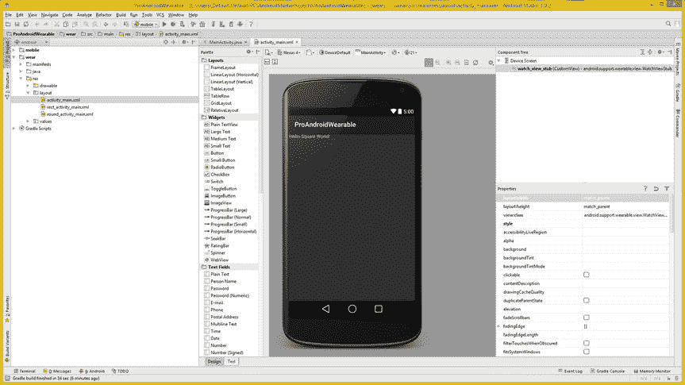

图 4-23 。一旦你完成了项目创建过程，新项目将会打开

XML 选项卡有一个设计模式，默认情况下在启动时显示，并在编辑窗格的左下方使用一个标有“design”的蓝色选项卡来指示在它的右边有一个标记为“text”的白色标签，您将使用它来手工编写 XML 标记(从头开始)，因为这是一个 Pro Android 标题！design 选项卡有一个呈现引擎，用于显示 XML 标记在 Android 硬件设备上的外观。这不如 AVD 仿真器精确，您将在第五章中设置 AVD 仿真器，在那里您将学习如何创建和配置仿真器。

IntelliJ 中的设计编辑器提供了一个拖放式用户界面，用于添加 UI 小部件和设置它们的属性(如果您喜欢这些术语，可以称之为属性或参数)。这些小部件在左侧的**面板**窗格中，可以拖动到智能手机预览界面，将它们添加到设计中。

当一个给定的 UI 小部件被选中进行编辑时，每个小部件的属性显示在图 4-23 的右下角。该窗格名为**属性** ，将包含所选用户界面小部件支持的任何**属性**(或**参数**，也称为属性)以供进一步定制。

还有**组件树**窗格，在图 4-23 中 XML 编辑区的右上方，显示了当前正在使用的 widget 组件，比如那些已经添加到当前设计预览中的 UI widgets。

这个窗格给你一个鸟瞰图，本质上是顶级的 UI 设计层次结构。这是为复杂的 UI 设计层次结构使用而提供的，就像 Java 编辑窗格中提供的代码折叠一样，以便在代码变得更复杂时使事情变得更容易。

接下来，单击 XML 编辑器窗格左下方的文本选项卡，使其变为蓝色，并向您显示创建预览的 XML 标记结构，您会在中注意到，图 4-24 现在显示在 XML 编辑区域的右侧，而不是中间。

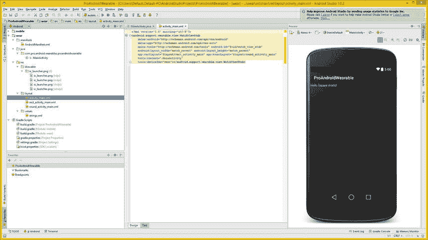

图 4-24 。单击底部的文本选项卡，展开工程窗格文件树，并选择加入或退出使用统计

接下来，使用 IntelliJ 左侧项目窗格中的向右箭头图标打开该窗格中所有已关闭的文件夹。您的项目已经有了一个 Java 文件、四个 PNG 图像素材、三个 XML 布局文件、一个包含字符串值的 XML 文件和六个 Gradle 脚本，它们用于“构建”您的可穿戴设备应用。

当我在第七章谈到 Java 代码和 XML 标记时，你将开始了解关于这个 Java 代码(和 XML 标记)正在做什么的细节。

接下来，单击 IntelliJ IDEA 中间编辑窗格左上角的 MainActivity.java 选项卡，查看使用新的 Android 项目系列对话框为您创建的 Java 代码。

让我们来看看 Android Studio 为您创建的 bootstrap Java 代码，看看它是从哪里获得的。您的第一个 Java 包语句来自右侧的图 4-16 所示的对话框，它将您的公司目录字段与您的应用名称字段连接起来，以创建以下 Java 包语句:

```java
package com.pro.android.wearables.proandroidwearable;
```

然后是导入语句。这些导入了四个 Android 类: **Bundle** 、 **Activity** 、 **TextView** 和 **WatchViewStub** 。这些是创建活动对象、保存应用状态和创建 UI 小部件(视图对象)所需要的。这四个初始导入语句的 Java 代码(随着您添加更多的小部件和函数，将会添加更多)如下所示:

```java
import android.app.Activity;
import android.os.Bundle;
import android.support.wearable.view.WatchViewStub;
import android.widget.TextView;
```

生成的 Java 代码的重要部分是 **MainActivity** 类，它是 Android Activity 类的**子类**。你知道这是**类层次**的方法是因为它是通过 Java **extends** 关键字的使用来表示的:

```java
public class MainActivity extends Activity {
    private TextView mTextView;
    @Override
    protected void onCreate(Bundle savedInstanceState) {
        super.onCreate(savedInstanceState);
        setContentView(R.layout.activity_main);
        final WatchViewStub stub = (WatchViewStub) findViewById(R.id.watch_view_stub);
        stub.setOnLayoutInflatedListener(new WatchViewStub.OnLayoutInflatedListener() {
            @Override
            public void onLayoutInflated(WatchViewStub stub) {
                mTextView = (TextView) stub.findViewById(R.id.text);
            }
        });
    }
}
```

让我们来看看这个 Java 代码体的内部是什么，如图 4-25 所示。我将在这里介绍这一点，这样您就知道这些 Java 类和您的文件中的 XML 标记之间的相互联系了。第一行代码声明了一个名为 mTextView 的 TextView 小部件，因此现在使用了一半的 import 语句，因为 Activity import 用于 MainActivity 子类，TextView import 用于这个 TextView 小部件。

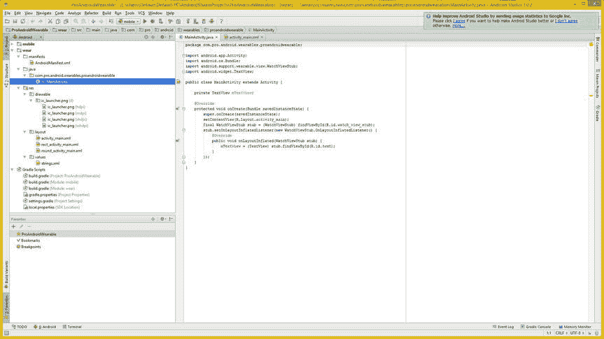

图 4-25 。单击顶部的 MainActivity.java 选项卡，展开项目窗格文件树，并选择加入或退出使用统计数据

作为一名专业的 Android 开发人员，您可能知道，您必须始终为您为 Android 应用创建的活动@Override 一个 **onCreate( )** 方法 。如果你需要回顾 Android 开发，我刚刚在 2014 年第三季度为绝对初学者写了第三版 *Android 应用* (Apress)，非常详细地涵盖了所有内容。这个方法调用使用您导入的 **Bundle** class 来创建状态内存(内存中与活动实例相关的所有状态或设置)Bundle，它被恰当地命名为 **savedInstanceState** 。如果 Android 因为任何原因不得不将您的活动从内存中交换出来，这个小 Bundle 对象将允许 Android OS 完全按照用户离开时的样子重建您的活动，因此用户甚至不知道该活动已经暂时从系统内存中删除。

你在里面看到的第一样东西。onCreate()方法的结构是`super.onCreate(savedInstanceState);`语句。这将通过使用父 Activity 类来创建(或者使用 Bundle 对象重新创建，如果 Android 已经从内存中删除了该活动的话)Activity 对象。onCreate()方法，使用 Java **super** 关键字从父 Activity 类调用该方法。

下一个代码语句是每个 Android 应用必须设置用户界面布局容器的语句。这是您的 setContentView()方法 调用，它引用了 activity_main.xml 文件，您之前在 activity_main.xml 选项卡中看到了该文件。这就是 XML UI 定义如何连接到可穿戴应用的 Java 7 代码。

下一行代码是使用第四个 WatchViewStub import 语句将可穿戴应用的 Android 应用部分连接到可穿戴应用本身，因此现在您已经使用了所有导入的类。您创建一个名为 **stub** 的 WatchViewStub 对象，并通过使用 **findViewById( )** 方法 调用，用已经在 activity_main.xml 文件中定义的 **watch_view_stub** UI 小部件加载它。

接下来，使用一个. setOnLayoutInflatedListener()方法 将一个侦听器附加到名为 Stub 的 WatchViewStub 对象。在 watch_view_stub XML 布局定义膨胀后，该方法内的代码将被**触发**。

这个构造将确保可穿戴设备 UI 定义在。onLayoutInflated()方法 结构被执行。注意这里面。setOnLayoutInflatedListener()方法，一个**新的**。onLayoutInflatedListener()对象是在参数区创建的。

这个。onLayoutStubListener()方法 通过使用包含该方法的 WatchViewStub 类的路径引用来调用。这是非常密集的 Java 代码，它设置了您的整个侦听器结构，以及在 UI 布局膨胀后它将要做什么。这些都是只用了六行 Java 代码就完成的。

在 onLayoutInflated()方法中，将使用 ID 为 **text** 的 TextView UI 小部件的 XML 定义来加载 mTextView TextView 对象。如您所见，没有 TextView 小部件或任何其他 ID 为 text 的小部件，因此您需要打开其他 XML UI 布局容器文件之一。这是通过**右键单击**项目窗格中的 **rect_activity_main.xml** 文件名并选择**跳转到源代码**菜单项来完成的，这在 IntelliJ 行话中的意思是“在中央编辑区域的选项卡中打开文件”

正如你在图 4-26 的 rect_activity_main.xml 选项卡中看到的，有一个名为 **@+id/text** 的 TextView 小部件，这是 Java 代码在。使用 findViewById()的 onLayoutInflated()方法结构。

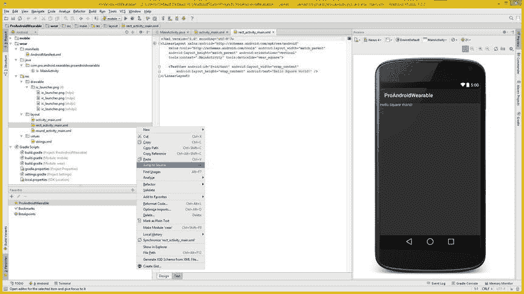

图 4-26 。右键单击 rect_activity_main.xml 文件，选择跳转到源菜单选项以在选项卡中打开

如果您想查看 rect_activity_main.xml 选项卡中的 UI 定义是如何在 activity_main.xml UI 定义中引用的，如图 4-24 中的所示，请查看第 7 行。如果您想在 IntelliJ 中打开行号，右键单击 XML 标记窗格左侧的灰色列，并选择**显示行号**选项。第 7 行类似于下面的标记:

```java
app:rectLayout="@layout/rect_activity_main" app:roundLayout="@layout/round_activity_main"
```

这两个应用:对 rectLayout 和 roundLayout 属性的引用是 Android Wear 查看的属性，以确定将哪个 UI 设计用于矩形(方形)或圆形的智能手表。

现在你已经知道了在 bootstrap 项目中所有的东西是如何连接在一起的，接下来你需要做的就是确保你的 AVD 仿真器已经就位，并准备好用于本书的其余部分。恭喜你！你进步很大。

摘要

在本章中，您了解了 IntelliJ IDEA 的所有内容，以及 Android Studio 如何将他们的 Android 5 SDK 和 Java JDK 结合起来，将其变成一个定制的 Pro Android 可穿戴设备应用集成开发环境软件工具。

您还学习了如何使用 **SDK 管理器**来查看安装了哪些 SDK，以及安装本书中需要的其他功能。你知道了鲜为人知的**以管理员身份运行**的技巧，除了你试图将 Android Studio 1.0.1 更新到 Android Studio 1.0.2 时遇到的情况之外，它还可以解决许多其他失败的安装场景。幸运的是，有一个更新可用，所以我可以向您展示这个小技巧，让您在整个操作系统板的读或写权限。

您已经了解了 IntelliJ IDEA 版本 14 的所有内容:如何更新它，如何了解它的特性，以及它的项目结构、文件、文件夹层次结构和配置文件。您了解了 SDKs IntelliJ 将支持什么，以及什么版本的 IntelliJ(免费与付费)支持哪些编程语言。您了解了无数的编程特性，这些特性将使您的编码工作变得更加容易。

最后，您创建了自己的 **ProAndroidWearable** 应用，这样您就可以探索智能 IDE 了。您了解了 Java 7 和 XML 标记，并了解了 Java 代码的作用以及它是如何链接到(连接到)XML 标记 UI 定义文件的。

在关于 AVD 的下一章中，您将确切地了解如何为定制的可穿戴设备设置 Android **AVD 仿真器**，并获得一些关于 AVD 创建、配置、设置和定制的经验。