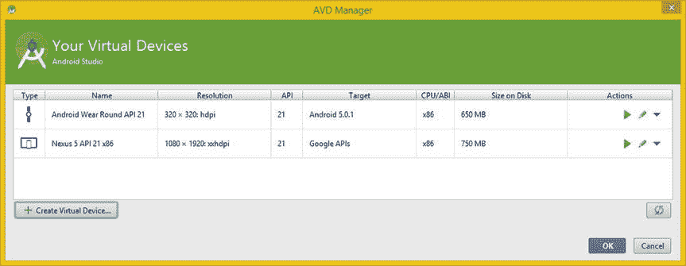
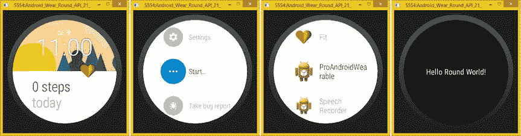

# 五、Android 虚拟设备：设置可穿戴设备应用模拟器

现在你已经对 Android Studio 的特性有了一个大概的了解，本章将讨论 Android 虚拟设备(AVD)，它是一个软件模拟器。

这些之所以重要，是因为它们允许你更快地测试你的 Pro Android 可穿戴设备应用，而不必在每次你想测试应用的 Java 代码或 XML 标记时，通过 USB 电缆将你的 APK 文件传输到硬件设备(尽管你确实在第四章中安装了最新的 USB 驱动程序，以防你想这样做)。

让我们首先为方形和圆形佩戴硬件(智能手表外设)创建 avd。您将为基于英特尔 x86 的智能手表和基于 ARM EABI7 的智能手表执行此操作。这是可能的，因为 x86 和 ARM 系统映像是您在更新到 Android OS 5.0.2 时使用 SDK 管理器在第四章中安装的。

之后，你将在本章的剩余部分学习你的 AVDs 如何与 IntelliJ IDEA 中的 Android 5 可穿戴设备应用开发项目的其余部分进行接口。您将了解如何在开发过程中的任何给定时间选择使用哪个 AVD 仿真器来测试您的应用。这对于 Wear 应用开发非常重要，因为您将需要创建方形和圆形版本的 UI 设计，正如在第四章中详细讨论的那样，当您了解到 WatchViewStub 对象如何允许 Android 操作系统检测和提供针对用户智能手表形状的正确 UI 设计时。

使用 AVD 管理器:创建磨损模拟器

如果您还没有这样做，请使用您在第二章中创建的快速启动图标启动 Android Studio 开发环境。这将启动 IntelliJ IDEA 并显示你在第四章中创建的 ProAndroidWearable 项目。点击 IDE 顶部的**工具**菜单，如图图 5-1 所示，点击 **Android** 菜单，显示带有 **AVD 管理器**选项的子菜单。还要注意，AVD 管理器下面是 SDK 管理器选项，所以如果您想知道如何在项目模式下进入 IntelliJ 后访问 SDK 对话框，这是您将如何完成的。

图 5-1 。使用 IntelliJ 中的工具 Android  AVD 管理器菜单序列并启动 AVD 管理器

这将打开 **AVD 管理器**对话框和一个当前安装的 AVD 仿真器列表，称为**你的虚拟设备**屏幕，如图图 5-2 所示。

图 5-2 。使用 AVD 管理器对话框左下角的创建虚拟设备按钮创建 AVD

该对话框列出了当前安装在 IntelliJ IDEA 中的基本 avd 和默认软件安装，包括摩托罗拉的 Android 5 操作系统兼容的 **Nexus 5** API Level 21，用于英特尔凌动 x86 处理器仿真。对于那些没有听到行业新闻的人来说，谷歌几年前收购了摩托罗拉。

在对话框的左下方，有一个标记为“创建虚拟设备”的按钮。点按此按钮可调出第二级 AVD 创建。

AVD 管理器中的第二级对话框用于**选择**虚拟设备配置**对话框中的硬件**，如图 5-3 中的所示。它列出了所有当前预定义的**手机**、**平板电脑**、**佩戴、**和**电视**硬件，并通过对话框左侧的**类别**按钮对其进行分类和组织。正如您在图 5-3 中看到的，“真正的智能手表”并不是智能手表的外设，而是被列在手机部分，因为它们可以作为一部手机绑在您的手腕上。我在图 5-3 中高亮显示了 **Neptune Pine 智能手表**，这样你就可以看到**属性**是如何列在右边的。

图 5-3 。请注意，Neptune Pine 智能手表是一款完整的 Android(手机)设备，不在 Android Wear 之下

点击对话框左侧的 **Wear** 按钮，查看 IntelliJ IDEA 中列出了哪些内置的 Android Wear 设备选项。

Android Wear Square 有预定义的智能手表仿真器，Android Wear Round 也有，如图图 5-4 所示。让我们首先为英特尔凌动(x86)处理器创建 Android Wear Round AVD 仿真器。

图 5-4 。选择 Android Wear Round 硬件仿真器，然后单击蓝色的“下一步”按钮来定义它的使用

选择 **Android Wear Round** 条目，在图 5-4 中以蓝色显示选中，然后点击蓝色**下一步**按钮。这将带你进入第三层，进入**系统映像**对话框，如图 5-5 所示。请注意，该对话框中列出了两种不同的硬件版本，ARM 和 Intel 处理器。您将为这两种类型的穿戴硬件创建仿真器，因为有些智能手表产品基于 ARM，有些基于 Intel。选择 **Lollipop x86 API Level 21** 选项，然后单击**下一步**进入系列中的下一个对话框，在这里您可以为英特尔凌动 x86 Android Wear Round 智能手表 AVD 仿真器定义仿真器选项。

图 5-5 。为 Android Wear 选择一个英特尔 x86 Lollipop 系统映像，该映像是使用 SDK 管理器安装的

对话框系列中的第四层是**验证配置**对话框，如图 5-6 中的所示。您将在**仿真性能**部分看到两个复选框，一个用于 **GPU 仿真**，另一个用于存储最后一个仿真器状态的**内存快照**，用于更快地加载仿真器。我假设你接受了我在第二章中的建议，并且有一个 SSD 硬盘，所以**使用** **主机 GPU** 选项更值得选择，因为它允许 3D **OpenGL** 被模拟。需要注意的是，这两个复选框不能同时选中。你将不得不在这两个重要的模拟器津贴之间做出选择，所以要小心选择！

图 5-6 。选择使用主机 GPU 以使仿真器图形能够在工作站的图形适配器上运行，然后单击完成

一旦你点击**完成**按钮，如图 5-6 右下方所示，你将被带到**你的** **虚拟设备**对话框，如图 5-7 所示。

图 5-7 。一旦您单击完成，Android Wear Round API 21 x86 AVD 将在虚拟设备中列出

再次点击对话框左下方的**创建虚拟设备**按钮，如图图 5-7 所示，接下来我们创建一个 Android Wear Square API 21 AVD。在选择硬件对话框中，如图图 5-8 所示，这次选择 **Android Wear Square** 设备，如蓝色选中所示。请再次注意，右侧列出了有关该 AVD 仿真器规格的信息，在本例中为**小**尺寸、**长**比率、 **HDPI** 密度和 **280 DP** 。

图 5-8 。选择 Android Wear Square 硬件模拟器，然后单击下一步按钮定义它以供使用

点击蓝色**下一个**按钮，将打开**系统镜像**对话框，如图图 5-9 所示。再次选择一个 **Lollipop API Level 21 x86** 系统镜像。

图 5-9 。为 Android Wear 选择一个英特尔 x86 Lollipop 系统映像，它是通过 SDK 管理器安装的

点击蓝色**下一个**按钮，进入**验证配置**对话框，如图图 5-10 所示。我再次使用**使用** **主机 GPU** 选项，因为我有一个高级 3D 显卡，我是一个 3D 建模师和动画师，我计划最终在我的 Android 应用中使用 OpenGL。值得注意的是，许多对话框在升级过程中“滞后”了一个版本。因此，即使你在第四章中确保你是 5.0.2“干净的”，诸如更新对话框文本反馈信息的细节，例如，现在是 Android 5.0.2 x86 的 Android 5.0.1 x86，并没有进入当前正在使用的对话框 UI 标签的更新！

图 5-10 。选择使用主机 GPU 以使仿真器图形能够在工作站的图形适配器上运行

点击**完成**，返回**虚拟设备**对话框，如图图 5-11 所示。

图 5-11 。用于圆形和方形智能手表的英特尔凌动 Android Wear AVD 仿真器已经问世

我建议使用与基于英特尔凌动的智能手表完全相同的工作流程，这也可以在图 5-4 到 5-11 中看到，并创建使用 ARM 处理器技术的 AVD 仿真器。如果你这样做了，当你需要它们进行 Android Wear Round 和 Android Wear Square 测试时，你将拥有所有四个仿真器。在本书中，我将遵循“第一次就做对”的工作流程，所以当你在那个对话框中时，做好你需要的一切。

图 5-12 显示了**你的虚拟设备**对话框，在这四个 Android Wear AVD 模拟器都被创建之后。

图 5-12 。适用于圆形或方形智能手表的英特尔凌动或 ARM Android Wear AVD 仿真器，随时可用

现在，您已经有了为 Android Studio IntelliJ IDEA 创建 ARM 和英特尔 AVD 仿真器的一些实践，您将为测试您的 Pro Android 可穿戴应用做好准备。

接下来，让我们看看如何使用这些 AVD 仿真器来测试您在第四章中创建的 ProAndroidWearable 应用。

使用穿戴模拟器:测试你的可穿戴应用

Android Studio IntelliJ IDEA 中的仿真器设置是通过**运行/调试配置**对话框访问的，当您更新和探索 Android 5 的 IntelliJ 高级集成开发环境时，您可能已经仔细阅读过第四章中的配置对话框。

正如你在图 5-13 中所看到的，这也可以从你的项目内部访问，通过使用一个**运行编辑配置**菜单序列，它以蓝色突出显示。单击 IntelliJ IDEA 顶部的**运行**菜单，并选择编辑配置菜单项以打开对话框。

图 5-13 。使用运行编辑配置菜单序列来设置您想要使用的 AVD 仿真器

在图 5-14 中可以看到，主要有三个选项卡:**通用**、 **LogCat** 和**仿真器**。在这里，您将看到如何使用 LogCat (日志编目)，因为您开始产生需要在本书的过程中纠正的错误。LogCat 是你在开发工作过程中真正需要考虑的东西，这就是为什么我没有在第四章中讨论 LogCat 的功能。

你可能认为仿真器选项卡是你需要设置 AVD 仿真器的地方，然而，事实上在常规选项卡的底部有一个**目标设备** 部分，在那里设置该功能用于 IntelliJ。

正如你在底部的图 5-14 中看到的，在 IntelliJ 中有几个选项可以设置用于测试你的可穿戴设备应用的目标设备。从使用仿真器 AVD 到使用你在第四章中更新的 USB 驱动程序，再到指示 IntelliJ 就使用哪个设备(仿真器或真实硬件)来测试你的 Android Wear 应用的 Java 代码和 XML 标记进行投票。

图 5-14 。在常规选项卡中，选择模拟器目标设备单选按钮，并设置下拉选择器

如果您想手动选择目标设备，每次使用跑步或跑步佩戴图标或菜单序列时，您都需要选择位于**显示选择器对话框**选项旁边的单选按钮。每次你用这个配置设置在 IntelliJ 中开始运行磨损或调试操作时，Android Studio IntelliJ IDEA 都会为你显示一个**选择设备**对话框。

如果选择 USB 设备选项，IntelliJ 将在应用启动时检测插入的 USB 设备，然后用于测试目的。如果你有一个智能手表，这将是你的最佳选择！

因为我不能假设所有的读者都将拥有一个 Wear 智能手表，所以在本书的过程中，我将主要使用 Android Wear Square 和 Android Wear Round AVD 模拟器来测试可穿戴设备应用。这就引出了第三个仿真器选项。

如果您选择第三个仿真器单选按钮，您将能够从下拉菜单中选择**首选 Android 虚拟设备**设置。这是用您在本章前面创建的 AVD 仿真器填充的。

我将首先选择 **Android Wear Round API 21** (英特尔凌动)，您接下来将测试它，以确保它能够正常工作。在本章中，您还将测试您的 ARM AVD 仿真器和 Android Wear Square AVD，以便了解它们作为硬件仿真器的外观和工作方式。

如果您打算更改 AVD 模拟器，并在 USB 驱动程序(外部硬件设备)和使用 AVD 模拟器之间来回切换，您将需要尝试使用显示选择器对话框单选按钮选项。这将允许你在每次点击**运行图标**(看起来像一个绿色视频播放器传输按钮)或使用**运行运行穿戴**菜单序列来测试你的应用时，选择你想要如何测试可穿戴设备应用。

使用 IntelliJ Run:在 Round Wear 中运行可穿戴应用

让我们使用 **Run  Run** 菜单序列，执行名为 ProAndroidWearable 的 bootstrap 可穿戴应用，它是您在第四章中创建的。我得到一个错误，显示在截图左下方的图 5-15 中。我还在这张截图中显示了**运行运行**菜单序列。正如你所看到的，我的系统，碰巧是 AMD FX-8350，似乎在运行英特尔 HAXM x86 仿真时遇到了问题。这可能是由于英特尔和 AMD 在 CPU 和 GPU 市场上的激烈竞争，因此，发生这种情况并不奇怪。

图 5-15 。使用运行运行菜单序列尝试并启动 AVD 注意输出中的错误(底部)

让我们来看看让英特尔 HAXM 正常工作的正确工作过程，以防 HAXM 错误信息发生在您身上！

安装英特尔硬件扩展管理器:intelhaxm.exe

打开操作系统文件管理工具，使用搜索栏，输入**英特尔 axm** 或【intelhaxm.exe 搜索词，如图 5-16 顶部红色突出显示的。这将为您找到**intelhaxm-android.exe**文件。

图 5-16 。使用文件管理工具搜索 intelhaxm.exe 文件，然后右键单击该文件并选择以管理员身份运行

您实际上可以右键单击该文件(结果)，如图 5-16(??)所示，并使用“以管理员身份运行”菜单选项在您的系统上安装英特尔**硬件加速执行管理器** (HAXM) ，以消除您在 Android Studio IntelliJ IDEA 中遇到的 HAXM 错误。

在我的系统上，我在一个 **VT 不支持**对话框中收到了可怕的“此计算机不支持英特尔虚拟化技术”错误消息，如图 5-17 左侧所示。对我来说幸运的是，在这种情况下，我安装了所有的 AVD 类型，并且仍然可以在我的 Android 可穿戴应用开发中使用 ARM AVD。我可以继续写这本书！

图 5-17 。如果你像我一样使用强大的 AMD 8 核 FX 处理器，你就要倒霉了！

一旦我点击 **OK** 按钮，如图 5-17 左侧所示，我收到这个“英特尔硬件加速执行管理器安装向导提前结束”对话框，如图 5-17 右侧所示，于是我点击**完成**。

如果您没有看到图 5-17 中所示的对话框，请安装英特尔 HAXM，这应该可以解决您可能在 IntelliJ IDEA 的运行/调试/编译输出窗格和 IDEA 底部标签中得到的任何错误消息(这些显示在图 5-15 中的)。

切换 AVD:在圆形佩戴臂 AVD 中运行应用

因为我无法模拟这款英特尔凌动 Android Wear Round AVD，所以我回到运行/调试配置对话框，如图 5-18 中的所示，使用图 5-13 中的**运行编辑配置**菜单。我从下拉列表中选择了 **Android Wear Round API 21 2** 选项。因为我在几分钟前刚刚创建了所有这些 avd，所以我知道这是 ARM 版本，所以我可以使用这个仿真器向您展示如何测试您的 ProAndroidWearable 应用。

图 5-18 。选择您的 ARM Android Wear Round API 21 2 AVD(请注意，英特尔 AVD 现在以红色标记)

这次我将让您点击 IntelliJ 顶部的绿色播放(运行)图标 。正如你将在本章中看到的，有几种方法可以运行你的可穿戴设备应用。一旦你点击运行图标，你会看到在图 5-19 底部显示的输出窗格，它显示了大量与在 AVD 仿真器内运行你的应用相关的技术信息。最后一行写着“创建窗口”(包含仿真器)，位于 **30，30** (操作系统桌面的右上角)，大小适合一个 **320x320** 圆形 AVD 仿真器。如果你想看一看这是什么样子，它显示在图 5-20 中，在我的系统上第一次启动！

图 5-19 。点击顶部绿色的运行(播放)图标，运行 ARM 模拟器；请注意输出选项卡(底部)中的统计数据

当你第一次运行和启动 Android Wear AVDs 时，它完全模拟了你第一次运行任何智能手表产品时的体验。你将看到的屏幕序列可以在图 5-20 中看到，其中一个屏幕显示 Android Wear 应用不在你的手机上。

图 5-20 。首次发射显示精确的磨损仿真；当你第一次打开智能手表时，它会显示这个

如果您使用鼠标将模拟器屏幕滑动到一侧，您将看到其他屏幕，建议您从谷歌 Play 商店安装 Android Wear 应用，以便 Wear 智能手表外围设备可以正常工作。需要注意的是，这不是必需的；这只是模拟器在试图模拟真实世界的 Android Wear 体验时异常准确。还要注意在图 5-20 的最右边，如果你没有用 AVD 仿真器做任何事情(一分钟后),也会显示一个项目 Volta 电源关闭(关闭)屏幕。

如果关闭 AVD 仿真器，单击**红色 X** 关闭窗口，并使用 IntelliJ 中的运行进程简单地重新启动它。我将向您展示另一种直接运行您的应用的方法，即使用右键单击上下文相关的基于菜单的工作流程。点击**MainActivity.java**标签，如图 5-21 中上部所示，然后在编辑窗格的右侧点击右键，选择**运行‘主活动’**菜单选项，再次启动您在**运行编辑配置**运行/调试对话框中选择的 AVD。

图 5-21 。从项目中启动 AVD 的另一种方法是在代码区域右键单击并选择 Run 'MainActivity '

第二次启动 AVD 时，你会看到一系列不同的 AVD 启动屏幕，这些屏幕会告诉你正在加载、针对穿戴设备优化、正在启动等应用的数量。你还会看到一个穿戴启动标志屏幕，以及一个智能手表屏幕，上面有云与充电的时间和指示器，以及“Ok Google”，如图图 5-22 所示。

图 5-22 。AVD 优化和启动应用，显示 Android Wear 启动徽标，以及 Ok Google time 屏幕

一旦你获得了默认的 Android Wear 主屏幕(时间)，你就可以在屏幕上滑动鼠标并下拉不同的手表表面，如图 5-23 的最左侧所示。也可以上下滑动；这将滚动不同的选项，如图 5-23 的的第二个窗格所示。

图 5-23 。一旦模拟器启动，滑动屏幕找到开始按钮，然后滑动找到 ProAndroidWearable 应用

向下滚动并找到蓝色的开始选项，然后点击它进入应用屏幕，可以在图 5-23 的第三个窗格中看到。

您可以上下滚动启动应用屏幕，直到找到您的 **ProAndroidWearable** 应用，当您单击它时，它将启动。这将运行引导应用并显示 Hello Round World！消息。这个文本字符串对象包含在一个 TextView 小部件中，这个小部件可以在 activity_main.xml 文件中引用的 **round_activity_main.xml** 文件中找到。

我用浅蓝色突出显示了图 5-19 中的标记引用。我是通过在 XML 文件引用上单击鼠标光标来做到这一点的，所以在这个引用中寻找一个插入条。这是 Android 操作系统查看您正在使用的仿真器(或智能手表硬件)的地方，然后调用正确的 UI 布局设计 XML 定义文件，该文件将适合该类型的智能手表外观！作为开发人员，你将提前定义这一点，在本书的课程中，我将专注于智能手表的 UI 设计。

切换 AVD:在方形佩戴臂 AVD 中运行应用

进入 IntelliJ，使用**运行编辑配置**工作流程，如图图 5-13 (此处不重复截图)，选择**Android Wear Square API 21 2**(ARM，除非你的 Intel AVDs 在工作，你自己选择)。然后使用图 5-15 、图 5-19 或图 5-21 中所示的**运行**方法，这次在 Android Wear Square AVD 仿真器中运行可穿戴应用，以便您可以看到用户体验与 Android Wear Round AVD 仿真器相比如何。

请注意，每当您更改 Android 虚拟设备仿真器时，都会出现一个“等待 adb”进度条对话框，因为 IntelliJ IDEA 需要将新的 AVD 仿真器系统映像定义加载到系统内存中。这个进度条显示在图 5-24 中，如果您有一个带 SSD 硬盘的快速多核系统，它应该最多只显示几秒钟。

图 5-24 。如果你在 IntelliJ 中切换到一个不同的 AVD 仿真器，你会得到等待 adb 进度条

在这个进度条消失之后，你的 Android Wear 方形模拟器会出现在和之前的 Android Wear 圆形模拟器相同的位置(你桌面的右上方)。正如你在图 5-25 中看到的，会出现一个稍等(加载)的屏幕，然后你会看到和你在 Android Wear Round 模拟器上看到的相同的连接屏幕。

图 5-25 。当你第一次启动 AVD 时，它会模拟真正的智能手表会做什么

使用 Android Wear Round AVD 模拟器，如果你不使用模拟器，就像 Project Volta 与你的智能手表一样，如果你在启动后一分钟左右不使用它，你的 AVD 就会自动关闭。

出于这个原因，我建议在你的 Android Wear 模拟器中启动 ProAndroidWearable 应用后立即测试它！人们可能会认为，开发人员会急切地想看看他们的 Java 编程逻辑或 XML UI 设计是否工作正常，因此让 AVD 进入“省电”模式很少会成为问题。

一旦你的模拟器已经加载，你将得到一个“配对！”屏幕，模拟穿戴设备与智能手机或平板电脑的配对，如图 5-26 左侧所示。该屏幕消失后，您将看到一个**您一切就绪！**屏幕，告诉你**向上滑动进入**，显示在图 5-26 的右侧。

图 5-26 。一旦你得到配对的屏幕，你就一切就绪了！屏幕，向上滑动！

如果你在这一点上向下滑动屏幕，你会看到一个列表，列出了你可以用可穿戴设备做的各种事情，就像你用 Android Wear Round AVD 做的一样，如左侧窗格中的图 5-27 所示。找到开始图标并点击它来加载设备上的应用。接下来，找到你的 ProAndroidWearable 应用，点击它。一旦你这样做了，你会看到你的应用正在运行，如图 5-27 中的右窗格所示。

图 5-27 。找到开始菜单和 ProAndroidWearable 应用，并启动它运行

因为有圆形和方形智能手表，所以你需要在这些模拟器上测试你的应用，以确保你的应用在这两种类型的屏幕上都可以工作。一些顶级制造商，如 LG 电子，甚至拥有这两种类型的屏幕。LG 目前正在提供 G(方形)和 R(圆形)智能手表产品。

摘要

在本章中，您学习了如何为您的 Pro Android 可穿戴设备 IntelliJ 开发环境创建**软件仿真**。这些被称为 **Android 虚拟设备**，也被称为 **AVDs** ，使用 IntelliJ IDEA 中的运行/调试对话框创建，并使用**运行编辑配置**菜单序列访问。

首先，您学习了如何使用 AVD 管理器来创建在 Android Studio 中使用的 AVD 模拟器(IntelliJ IDEA)。您为英特尔凌动处理器和 ARM 处理器创建了 Android Wear 圆形和 Android Wear 方形 AVD 仿真器。这样做是为了让您有四个不同的模拟器用于您的 Android 开发工作流程。

当我试图为英特尔凌动运行 Android Wear Round AVD 时，我在 IntelliJ 的输出窗格中收到一条错误消息。因此，我借此机会向您展示了如何在工作站上找到并安装英特尔的硬件加速执行管理器( **HAXM** ),以防您遇到同样的问题。

我发现英特尔不支持 AMD 处理器(这并不奇怪)，所以我将不得不在我的 Pro Android 可穿戴设备开发工作流程中使用这些 ARM AVDs。接下来，您学习了如何实际使用这些 AVD 来运行您的 ProAndroidWearable 应用，以及如何导航 AVD 仿真模式。

在本书的下一部分，你将开始学习关于如何开发 Android 可穿戴应用和添加可穿戴功能的细节。