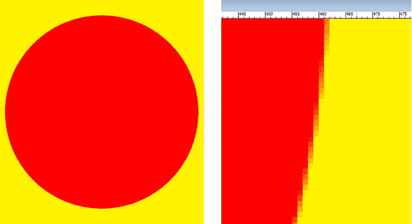

# 六、Android 表盘设计简介：考虑因素和概念

现在，您已经掌握了一些关于 Android 5 及其新功能、材质设计、Android Studio IntelliJ IDEA 和 AVD 仿真器的“基础知识”,并且已经设置、更新和配置了一个开源 Pro Android 可穿戴设备应用开发工作站，现在是时候进入正题，了解 Android 5 API 中直接应用于并影响可穿戴设备应用开发的各个部分了。

你已经在第四章中学习了如何创建一个全新的 ProAndroidWearable 应用(我想给你一个好的开始)，所以在这一章你将开始学习最流行的 Android Wear SDK 应用。这被称为表盘 API ，由谷歌发布，使开发者能够创建定制的表盘，将适用于所有智能手表型号。

因为人们对如何在 Wear SDK 中创建表盘非常感兴趣，尽管它很复杂，但它为创建其他一些更高级类型的可穿戴应用提供了基础，所以我将在本书中详细介绍表盘。我将在第十七章中讲述更多高级 Android 可穿戴开发主题。我们先来看一下表盘设计考虑因素；之后，在接下来的几章中，你将学习一些高级的图形设计概念。

表盘设计:注意事项和指南

谷歌的 Android Wear SDK 最近在 Android Studio 1.x 中引入了一个 **Watch Faces API** ，允许开发者创建定制的表盘。这使得开发人员可以使用定制的设计来创建智能手表“皮肤”或“面孔”，这些设计基于 Java 代码、XML 用户界面和新媒体素材(如 SVG(形状)、PNG(图像)和 UI 小部件)的组合。

这些 Watch Faces 应用可以简单地以一种新的独特方式告诉用户现在是什么时间，它们还可以向手表佩戴者显示上下文相关的信息，如通知、天气、健康信息、收到的短信、电话呼叫者姓名以及用户希望实时访问的类似信息，以改善他们的日常生活。Watch Faces API 允许 Android 5 开发者创建一个将所有这些数据集成到一个无缝用户体验中的设计。

手表面向用户界面:艺术与功能的无缝融合

您的 Watch Faces UI 设计将从您的 **activity_main 开始。** **xml** 文件，您在第四章中创建了该文件，然后在 **square_activity_main 中从前进到更定制的设计。** **xml** 和**round _ activity _ main . XML**文件如您所知，这些文件保存了您不同的 watch faces UI 设计类型，我将很快介绍这些类型。

正如你可能想象的那样，表盘设计将图形、算法和数据完美融合，创造出一种视觉用户体验，以一种美丽的方式向用户告知各种类型的信息，而无需任何额外的观看工作。

作为 Watch Faces API 开发人员，您的目标是创建优雅、清晰、有条理且有吸引力的用户界面布局，能够适应不同的智能手表显示类型、屏幕形状和边框大小。

在本章和本书的其余部分，您将学习如何设计 Watch Faces UI，以及如何为用户提供颜色和外观选项。这将使您的用户能够使用适合他们生活方式的穿戴式智能手表设备来创建他们自己的个性化手表面孔用户体验。

您还需要考虑 Android OS 用户界面元素将如何与 Watch Faces 应用设计进行交互，包括电池电量、蓝牙或 4G LTE 信号指示灯等系统图标。在本章的后面，我将讨论在你的表盘设计的 UI 设计布局中定位它们的各种选项。

手表面临电源使用:互动和环境模式

Android Watch Faces API 要求开发者为他们的 Watch Faces 应用提供两种不同的用电模式。这些被称为交互(彩色)模式和环境(灰度)模式。你的表盘 UI 设计需要考虑这些不同的功耗模式。我将讨论如何优化这两种模式的设计。

通常，如果表盘设计在环境模式下看起来很专业，那么在交互(色彩)模式下会看起来更原始。相反的情况并不总是如此，因为在交互模式下形成对比的某些颜色在灰度模式下可能会显示出相同的灰度，因此，Watch Faces API 图形设计将比您想象的要复杂得多。

观看面孔互动模式:全彩色，30 FPS 动画

你的 Watch Faces 智能手表皮肤 UI 设计中最高级别的模式是**交互模式**，它允许你的手表 Faces 设计使用全彩和动画。在交互模式下，当用户移动手腕看手表表面时，他们的屏幕会切换到交互模式。

您的手表表面(或皮肤)图形设计可以在交互模式下使用全彩色像素和高帧率动画。这并不是说你应该使用高帧率动画，如果你可以避免这样做的话，因为它使用电源的速度比静态交互模式的表盘设计要快得多。

观看面孔环境模式:每分钟更新的灰度

Watch Faces 智能手表皮肤 UI 设计中的下一个最高级别模式将是**环境模式**。这种模式将通过使用更少的颜色(在选定的几个型号上)或使用灰度或黑白来代表您的手表表面 UI 设计，帮助智能手表设备节省电力。您的 UI 设计可以让您的用户清楚地看到，他们的智能手表屏幕处于环境模式，只使用灰度颜色作为表盘设计组件。

重要的是不要在环境模式中使用大量的纯白(完全打开#FFFFFF 白色像素颜色值)。这是因为与黑色背景相比，它会耗尽电池寿命，并会分散用户的注意力。

在环境模式下，智能手表显示屏每分钟只会更新一次。出于这个原因，手表表面 UI 设计应该只在环境模式下更新小时和分钟。只有在互动模式下，并且只有在表盘需要时，才应该显示秒。

当智能手表设备切换到环境模式时，Android 操作系统会提醒你的表盘应用，正如你将在本书的这一部分中看到的那样。您可以创建一个专门用于此模式的表盘环境模式设计。因此，如果你真的想设计 Watch Faces 应用，你需要在像素级别设计你的图形，以适应所有这些不同的模式，包括那些超低功耗模式，我将在本章的下一节介绍。

手表表面节能:低位和烧伤保护

今天所有最新的 Android Wear 智能手表设备都利用了各种不同的显示屏硬件技术。其中包括 **LCD** (液晶显示器) **LED** (发光二极管)**有机发光二极管**(有机发光二极管) **AMOLED** (有源矩阵有机发光二极管)，高通 **Mirasol** 前光技术。

这些显示器像素阵列制造方法中的每一种都有其自身的优点和节能考虑。为你的表盘设计环境模式显示屏的一个重要考虑因素是它如何影响电池寿命甚至屏幕老化，这可能会影响一些屏幕技术，如 AMOLED 和有机发光二极管。

如果您想在 Java 编码和 XML 设计中获得细节，可以配置 watch face 应用，根据每个设备上可用的屏幕类型显示不同的环境设计图形。我将在本书的这一部分讨论所有这些屏幕类型常数和更复杂的手表表面 API 考虑因素，以便您可以为所有屏幕类型的手表表面设计最佳的整体设计。

低位超节能:考虑因素和技术

当处于环境模式时，诸如有机发光二极管或透反射 LED 的一些显示屏技术中的像素将是“开”或白色，或者“关”或黑色。在这些情况下的环境模式，即在这些屏幕类型上，如华硕 ZenWatch，通常被称为“低位”环境模式。

当为低位环境模式设计时，仅使用黑白颜色，避免使用灰度值，因为它们在低位显示器上不起作用。确保在使用低位环境模式的设备上测试您的 UI 设计。

这意味着您需要在绘制样式中禁用抗锯齿，我将在本书的后面讨论这一点，本书涵盖了图形设计概念，如抗锯齿、alpha 通道、混合模式以及实现这些概念所需的工作流程。

老化保护和预防:考虑因素和技术

AMOLEDs 和 OLEDs 等显示屏会产生像素老化，就像旧的阴极射线管(CRT)屏幕长时间显示同一图像一样，在设计时，您应该最大限度地减少白色像素着色，这既是为了提高能效，也是为了最大限度地减少显示屏老化效应。

当这些类型的显示屏在环境模式下运行时，操作系统会将显示屏的内容周期性地移动几个像素，这将有助于避免这种像素老化现象。

对于低比特环境模式设计，最小化屏幕老化的关键是保持 90%的像素为黑色。用低位环境模式中的轮廓形状替换常规环境模式设计中的实心灰度形状，以提供老化保护。

另一个好主意是替换用像素(矩阵)图案填充的灰度图像区域。对于模拟(圆形)表盘设计，挖空一个中心(指针相遇的地方)区域，这样当手表处于低位环境模式时，可以避免手表中心的像素老化。

手表表面 UI 设计形状:方形与圆形

如果你要成为一名专业的 Watch Faces API 开发人员，那么你需要学习如何优化你的 Java 代码、XML 标记、UI 设计和图形设计，以适应方形和圆形设备。这可以通过使用适合两种形状的单一设计或者通过提供两种不同的设计来实现。

如果你提供两种不同的设计，那么你可以使用 Android 操作系统的功能来检测脸型。在本书的这一部分，我将讨论如何在 Java 代码和 XML 标记中做到这一点。

正如你所料，一些表盘设计概念在这种或那种格式下可能会更好。然而，通过一点巧妙的设计，您可以创建一个混合设计,允许用户使用手表表面，而不管他们的智能手表使用的显示屏格式。

让我们回顾一下一些 Watch Faces API 设计指南，它们将帮助您的 Watch Faces 应用跨越方形和圆形设备。

手表表面概念设计:创造一个灵活的设计概念

表盘设计的视觉功能应适用于圆形和方形两种形式。你的表盘的视觉功能应该足够灵活,无需任何调整就能以任何一种形式显示。

然而，一些手表表面设计概念最终将需要不同的执行，即不同的 Java 代码、不同的 XML 标记、不同的图形设计和不同的动画，跨越方形和圆形屏幕。

手表外观风格设计:使用一套通用的设计风格

类似于您将 CSS3 用于 HTML5 应用和网站，或者将样式、主题和材质设计用于 Android 应用，使用一组风格化的颜色、线条粗细、阴影、渐变、图形设计元素、动画和其他设计元素来绘制方形和圆形 Watch Faces 应用版本之间的视觉联系。

通过使用相似的调色板或一致的视觉元素，您的方形和圆形表盘的整体 UI 设计的外观将看起来像是为每个表盘形状定制的，同时仍然保留表盘应用设计是同一视觉系统的一部分的感觉。

表盘设计类型:圆形模拟与方形数字

你的一些表盘设计概念可能会采用传统模拟时钟的格式，因为这是几个世纪以来最受欢迎的计时外观，它采用径向(圆形)方式，带有时针、分针和秒针的中心支点。

使用这种传统的表盘设计方案，开发人员将有机会吸收圆角区域，这些区域在将这种设计转换为方形表盘格式时将不可避免地出现。

这将给你的表盘设计过程带来创造性的火花，因为你试图发现创新和有吸引力的方式来扩展和探索这个额外的表盘屏幕“房地产”这可能包括装饰元素、操作系统指示器、动画元素、功能用户界面元素、日期相关指示器或日历日期信息。

手表界面集成:吸收操作系统功能

Android Watch Faces API 要求您在手表 Faces 的设计中吸收所有必要的操作系统功能，以便您的设计适应基本的 Android Wear UI 元素，如状态、状态和通知。

这些由操作系统渲染(控制)的 UI 元素为你的 Watch Face 用户提供关于他们可穿戴硬件的状态信息(电源、信号等)。)并显示来自运行 Wear 外设应用的用户手机或平板电脑上的服务的各种类型的通知。

出于这个原因，有一个在逻辑位置显示关键操作系统 UI 元素并在表盘设计中明确定义的表盘设计工作流程是很重要的。例如，确保操作系统提供的 UI 元素和消息不会被任何 Watch Faces 图形设计或 UI 设计元素所掩盖。

Android 通知:CardView UI 布局消息

Android“Cards”是 Android 5 中的一个新通知系统，它在可穿戴外设和其主机移动设备之间架起了信息桥梁。这是大多数可穿戴应用通知终端用户各种事情的方式。用户可能会在他们的可穿戴设备上收到关于电子邮件或文本消息的通知。作为一名表盘开发者，你需要在你的设计中支持大卡片和小卡片。您的 watch faces 应用可以指定您对卡片大小的偏好，但用户可以覆盖此设置。用户也可以通过向下滑动来暂时隐藏卡片。

一张 **Peek 卡片** 是通知流中最上面的卡片，将会出现在智能手表屏幕的底部。一个**可变 Peek 卡**有一个高度属性，由通知内的文本量决定。一个**小 Peek 卡**会给表盘设计留下更多空间。圆形模拟指针的表盘通常使用小 Peek 卡。如果可变 Peek 卡的最大高度上方的时间清晰可见，如果您愿意，您可以选择使用可变 Peek 卡。可变 Peek 卡将显示更多通知信息，但是，下半部分带有信息的手表表面最好使用小 Peek 卡。

需要注意的是，当 Peek 卡的边界(尺寸)发生变化时，您的 Android 5 操作系统会通知您的表盘设计(Java 代码)。因此，如果 Peek Card Bounds 对象发生变化，您的 Java 代码将交互地重新排列表盘设计中的用户界面和图形设计元素，从而使交互重新排列成为必要。

Android 硬件状态指示器:硬件模式状态

Android **状态指示器**用于告诉用户可穿戴设备的状态，例如它还剩多少电量，它是否正在充电，或者它是否处于飞行模式。在设计表盘时，你需要考虑这些指示器图标如何融入表盘的视觉设计。

智能手机或平板电脑上的 Android 状态指示器出现在状态栏中，这并不奇怪；然而，在表盘设计中，它们可以放置在可穿戴设备显示屏周围的几个固定位置。

Android CardView 类用于在材质设计下创建新的“卡片”范例。如果您需要支持更大的 Peek 卡，状态指示器图标的指示器位置应该靠近表盘设计的顶部或中心。如果你把硬件状态图标放在表盘设计的底部，操作系统将被迫使用小的 Peek 卡。

如果表盘周边包含重要的视觉元素，例如装饰元素、刻度或数字，则将指示器置于表盘设计的中央。

安卓热门词汇布局:OK 谷歌短语

将 Android 操作系统功能集成到 Watch Faces UI 设计中要记住的另一个重要因素是，要为 Android“热门词汇”留出空间。Android 的热门词汇是短语 **OK Google** ，它在启动时显示，告诉用户他们可以通过使用语音识别技术与手表进行交互，包括预定义的语音命令。

当你的用户打开他们的可穿戴设备时，这个热门词汇会在智能手表显示屏上出现几秒钟。在用户说 OK Google 五次后，热门词汇不再出现，因此，Android 操作系统 UI 元素的放置没有状态图标或卡片那么重要。

你应该避免使用 Android hotword 位置来掩盖手表外观设计的重要 UI 元素。还有针对热门词和状态指示器的“背景保护”UI 元素设置，可以帮助**增加对比度**(可读性)。应该打开这些 UI 元素选项，除非您的设计是定制的，使 UI 元素以最大对比度出现在它的顶部(例如，使用没有图案的深色)。

Android 外设连接:Wear Companion 应用

Android Wear companion 应用是“主机”智能手机或平板电脑与“外围”Android Wear 智能手表硬件之间的桥梁。此应用将允许您的用户访问应用中的所有表盘设计，并允许他们从包含的设计中进行选择，以及更改他们的设置，如颜色、数字、风格、动画、功能等。

观察面孔清单:你不需要提供一个启动图标

所有可用的 Watch Faces 应用都可以从 Android Wear 配套应用或您捆绑的第三方应用中访问。因此，您的应用启动器图标适用于捆绑的外设(智能手机或平板电脑)应用，而不是 Watch Faces 应用。

因此，任何 Android Wear Watch Faces 应用都不需要在 AndroidManifest.xml 文件中声明独立的应用启动器图标。

观察面孔控制面板:您的设置对话框面板

如果您的设计有需要使用设置对话框设置的有用选项，您的手表面孔设计也可以有一个手表面孔设置面板。设置对话框(或面板)可以使用表盘本身或使用安装在用户智能手机或平板电脑上的配套应用的(更大)显示屏来访问。

您应该在表盘上设计表盘设置，以限制开或关(称为二进制)选择。你也可以使用 **ListView** objects (类)来实现可滚动的设置列表。

智能手机或平板电脑上 Wear companion 应用的设置可能包括更复杂的配置项目，除了您在 watch face UI 设计上提供的基本设置之外。

在大多数情况下，你可以使用标准的 UI 布局容器类(UI 组件)，比如 Android **CardView** 类，来设计一个设置对话框或者设置面板，这一点你将在本书后面学到。

当你成为一名更高级的 Android Watch Faces API 开发人员时，一旦你建立了设计表盘的可靠工作流程，你可能还想探索其他更复杂、更有创意的设置选项设计。

观察面孔功能:功能数据集成

现在我已经介绍了表面设计规则和表单，接下来我将介绍表面函数。您的表盘设计可以向用户显示“上下文相关”的数据，如外面的天气、月相或代表夜间、日出、正午或日落的颜色以及类似的文本数据表示，这将把原始数据转化为表盘设计图形。

表盘设计通常会通过改变表盘设计的颜色、样式或图形设计来可视化不同类型的外部数据。这是使用 Java 代码和 XML 标记完成的。让我们来看看为表盘设计增加功能的诸多考虑因素。

数据可视化:您希望用户看到的数据

在涉及数据集成的表盘设计中，第一步是图形设计，它将赋予数据本身以生命或视觉效果。

决定你的表盘将如何定义你的观众对你想作为表盘设计的一部分显示的数据的看法。你对数据的视觉概念化应该容易被用户识别或理解。此外，您的手表设计试图可视化的数据需要得到真实用户日常需求的支持，以及将这些数据应用于现实世界的需求。

你需要想一想，当最终用户看到表盘设计后，你想让他们知道什么。他们会理解你的设计试图用你选择的颜色、风格变化或图形设计来传达什么吗？

一旦你设计了你的数据可视化并对其进行了测试，以确保用户能够识别你的设计是如何可视化他们感兴趣的数据的，接下来你需要做的就是确定表盘将如何获得你要可视化的数据。

数据整合:表盘设计与数据的融合

如果您要可视化数据，而不仅仅是一天中的时间，请设计 watch faces 应用，使其包含与时间数据密切相关的其他有用类型的数据，这些数据是 watch faces 的核心。

时间数据中包含的逻辑数据类型当然包括日期，可能还有计时器(秒表)、闹钟、日历约会、时区功能、天气预报、月相，甚至可能还有位置或健身数据。

您还需要找到一种方法，将数据可视化与您的表盘设计无缝集成，当观众快速浏览表盘应用时，创造性地激发他们使用颜色、文本、样式或自定义图形设计来消费您正在可视化的数据。

您的设计在可视化和整合外部数据方面的出色表现将直接关系到表盘应用的受欢迎程度。因此，你需要避免在基于时间的表盘上覆盖额外的数据，而不是使用灵感设计，以巧妙的方式将其无缝集成到整体设计中。

在设计数据集成时，您需要考虑如何通过您用于表盘的设计来表达这种类型的数据。例如，如果您正在设计一个与天气相关的表盘，请使用反映当天当前温度范围的颜色渐变，因此 80 到 100 度的范围可以用橙色到红色来表示，20 到 40 度的范围可以用白色到浅蓝色来表示。

数据同化:使用简单、统一的设计目标

一旦决定了如何可视化数据，并达成了手表外观概念决策，就该使用 Java 代码、XML 标记和数字图像(例如 GIMP)来实现您想要的 UI 设计了。

最受欢迎的表盘设计最终将是简单而优雅的设计。能够通过简单的一瞥传达大量信息的表盘将在服装市场大受欢迎。能够提供表达不同类型数据的统一设计的表盘将被认为是谷歌 Play 商店中最“天才”的表盘。

为了精心制作一个单一的表盘数据可视化“信息”，你必须在设计中对你想要可视化的最重要的数据进行排序。例如，不要试图在表盘上显示一个全面的天气预报，你可以使用一个图形设计来显示你外出时天空的样子(晴天、多云、星星、雨、雪等等)。

如果你显示的是基于文本的信息，在任何给定的时间尽量减少屏幕上的字符数。例如，如果您正在添加日历功能，而不是试图显示整个月的日历事件，您的设计应该只显示一个或最多两个即将到来的事件。

利用“逆向归约”的过程，我将在下面讨论，你将能够在设计中精心制作一个单一的数据表达。

观察面部发展:从基础开始，然后逐步增加

确保你的腕表表盘设计工作流程从仔细考虑你的腕表表盘将为你的最终用户提供什么开始。这将使您深入了解最终用户的需求和期望，从而构建出一个成功的 watch face 应用，这也是本书讨论的主题。

让其他智能手表爱好者来运行一个概念，看看关于设计概念的共识是否是好的和受欢迎的，这总是一个好主意。你还应该在开发时彻底测试你的表盘设计，甚至实施一个“beta 测试计划”,并让其他智能手表用户确认你对表盘设计的任何设计假设。

在餐巾纸上画出表盘设计的草图，然后让一两个智能手表最终用户告诉你他们对设计的看法，以及他们会用它来做什么，这可能是一个很好的主意。

不要假设你会在第一次尝试时就开发出一个史诗般的表盘设计，因为这不太可能发生。您需要结合不同的设计场景，尝试不同类型数据的表盘设计和数据组合。在开始编码之前，你还应该确保用实际的手表屏幕来测试你的表盘设计。

手表表面图形设计:多媒体概念

让我们来看看 Android 5 中不同类型的图形概念和支持，您可能会在表盘设计中使用它们。你将在 Watch Faces 设计中使用的主要素材是**矢量插图**，在 Android 中称为形状和渐变，以及**位图图像**，它们使用 JPEG、WebP 和 PNG 等图形文件格式，以及**动画**，它们支持**矢量** **动画** 和**位图动画**，并将这两种类型的多媒体带入第四维(随时间移动)。

让我们先了解一下最具数据压缩性的图形技术，矢量插图，它仅使用代码完成，然后介绍 Android 中支持的位图和图形格式以及核心数字图像概念，最后研究如何在 Android 中实现动画，使用 XML 标记结合位图图像资源和矢量代码。在我介绍完所有这些内容之后，您就可以开始研究 Java 编码、XML 标记和创建手表外观所需的图形设计工作流程了！

矢量观察面孔:使用 SVG、形状和渐变

可用于表盘设计的数据优化最多的新媒体素材类型是**数字插图**，俗称**矢量图形** 。如果你熟悉 Adobe Illustrator 或者 InkScape，那么你已经知道矢量图形涉及**线条**、**曲线**、**笔画**、**填充**、**渐变**。

矢量图形的主要开源文件格式称为**SVG**??，代表**可缩放矢量**图形 。所有流行的开源平台都支持 SVG 数据，包括 Android，以及 HTML5 和 JavaFX (Java 8)。

作为一名专业的 Android 开发人员，您知道 Android 中的多媒体素材是使用 **Drawable** 对象来表示的。矢量形状将使用 **ShapeDrawable** 类来创建矢量形状的轮廓，并可以使用 **GradientDrawable** 类的渐变填充形状。您的 Watch Faces 应用可以仅使用 Java 代码，或结合 XML 定义文件使用 Java 代码，在智能手表屏幕上创建这些可缩放的矢量图形元素。

值得注意的是，整个 Watch Faces 应用只能使用 SVG 创建，这意味着它们将是 100%的 Java 代码和 XML 标记。因此，这些应用 APK 文件的文件大小会特别小，因为 APK 文件中没有新的媒体素材(数字图像文件)存储。

某些表盘设计元素特别适合可伸缩的矢量元素。例如，线条可用于时针、分针和秒针，文字可用于数字和罗马数字，圆形元素可用于表圈或计时元素。

通常会有一些矢量图形元素、位图和动画的组合用于手表外观设计，所以接下来让我们看看 Android 的 BitmapDrawable 对象，以及其他支持的数字图像格式，甚至一些重要的数字图像概念，以便您在本书的剩余部分更好地理解我所谈论的内容。

位图观察面:位图格式和图像概念

因为你将使用数字图像来设计你的表盘，并且数字图像也是你在 Android 中的动画绘制对象的基础，我将花一些时间来为那些不是专业数字图像编辑的人提供理解本书概念所需的基础知识。Android 5 支持许多流行的开源数字图像文件格式，其中一些格式，如 GIF，已经存在了几十年。接下来让我们看看这些。

Android 数字图像格式支持:PNG、JPEG、WebP 和 GIF

Android 5 支持的数字图像格式从你几十年前的 Compuserve 图形信息格式( **GIF** ) 和古老的联合图像专家组( **JPEG** )格式，到最近的便携式网络图形( **PNG** ) 和网络照片( **WebP** )格式。我将按照起源的顺序介绍这些内容，从旧的(不太理想的)GIF 到最新的 WebP 格式。

Android 5 操作系统仍然支持 Compuserve GIF，但是不建议日常使用。GIF 是一种**无损**数字图像文件格式，因为它不会丢弃任何图像数据来达到更好的压缩效果。GIF 压缩算法被称为**编解码器** (编码器-解码器)，不像其他格式那样精细(意思是:强大)。它只允许**索引颜色**，我将在本章稍后介绍。也就是说，如果已经创建了所有图像资源，并且它们使用 GIF 格式，您仍然可以毫无问题地使用它们，除了手表表面的视觉质量下降之外。

Android 支持的下一个最古老的数字图像文件格式是 JPEG，它使用**真彩色**深度而不是索引颜色深度。JPEG 是一种**有损**的数字图像文件格式。该术语来源于这样一个事实，即它“丢弃”或丢失原始图像数据，以便能够实现更小的文件大小。JPEG 格式可以将影像压缩到或超过一个数量级(或者十倍，如果你想知道的话)。

需要注意的是，原始图像数据(称为“raw”或未压缩图像数据)在通过 JPEG 编解码器编码进行压缩后是不可恢复的。因此，在通过 JPEG 数字图像压缩算法运行图像之前，您应该确保保存您的原始(未压缩)图像。

如果你在压缩后放大 JPEG 图像，你会看到变色的区域，而这些区域在原始图像中是不存在的。JPEG 图像数据中的这些退化区域在数字图像行业中被称为**压缩伪像**。使用有损图像压缩时会出现压缩伪像。

这是 JPEG 文件格式不是 Android 中强烈推荐使用的数字图像格式的主要原因。Android 5 应用开发中最推荐使用的图像格式是 PNG 文件格式。PNG 在数字图像行业读作“ping”。PNG 既有索引颜色版本，称为 **PNG8** (或 PNG5，如果你只需要使用 32 种颜色)，你将在本章的后面发现，也有真彩色版本，称为 **PNG24** (无 alpha 通道)或 **PNG32** (有 alpha 通道)。我将在本章的后面讨论数字图像 alpha 通道的概念，因为它非常重要。

我使用的 PNG8 和 PNG24 编号扩展表示颜色支持的**位深度**，因此带有 alpha 通道的 truecolor PNG 在技术上可以称为 PNG32。同样，使用 16 色的 PNG 应该说是 PNG4，使用 64 色的 PNG 应该称为 PNG6，使用 128 色的 PNG 应该称为 PNG7 等等。推荐 Android 5 使用 PNG 格式的原因是它使用无损压缩。这将提供高图像质量以及良好的数字图像数据压缩效率。

最新的图像格式是在 Google 收购 ON2(WebP 图像格式)时添加到 Android 5 中的。Android 2.3.7 支持这种格式，支持图像读取或回放，Android 4.0 或更高版本支持图像写入或数字图像文件保存。

如果你想知道，Android 中的图像写入支持将与你的 Android 相机一起使用，因此你的用户可以通过远程网络服务器将图像保存或写入他们的 SD 卡或云。WebP 是 WebM 视频编码器文件格式的静态图像版本。WebM 在业内也被称为 ON2 VP8 视频编解码器，它被谷歌收购，然后宣布(也称为“发布”)开源可用性。

手表表面数字图像的基础:像素

数字影像由 2D 阵列或网格组成。这些包含通常称为**像素**?? 的数据元素。这个行业术语是单词**图片**(有人称这些为“pix”)和**元素**(如果你缩短单词元素，就得到时髦的单词“els”)。

您的数字图像素材中的像素数量用一个叫做**分辨率** 的术语来表示。这是图像的**宽度**(用 X 轴的 W 或 X 表示)和**高度**(用 Y 轴的 H 或 Y 表示)的像素数。图像素材的分辨率通常使用两个(X 和 Y)数字表示，中间有一个“X”，或者使用单词“by”，例如 **800x480** 或作为 **800 乘 480** 像素。

要找到 2D 图像中的像素总数，只需将宽度像素乘以高度像素。例如，HDTV 分辨率为 1920 x 1080 的图像包含 2，073，600 个像素，即超过 200 万个像素。这也被称为**两百万像素**。图像中的像素越多，可以说其分辨率越高，从而提供更高的视觉质量。

就像数码相机一样，从 300 万像素的智能手机相机到 7500 万像素的数码单反相机，数码图像网格或阵列中的像素越多，使用图像可以达到的质量水平就越高。这就是 4K **UHDTV** 屏幕越来越受欢迎的原因，这种屏幕的分辨率为 4096×2160。Android 通过 4K UHDTV 支持智能手表分辨率。

面向数字图像的手表形状:图像纵横比

更复杂的方面(无意双关！)的数字图像分辨率将是**图像纵横比** ，这一概念也适用于 Android 5 设备硬件显示器。纵横比是宽度与高度的比率**，或者 **W:H** ，或者如果你喜欢用 X 轴和 Y 轴来思考，它将是 **X:Y** 。纵横比将定义图像或显示屏的**形状**，即图像或显示屏可能是方形或矩形(通常称为宽屏)。手表表面有一个正方形的长宽比。**

 **1:1 纵横比的显示器(或数字图像)是完美的正方形，2:2 或 3:3 纵横比的图像也是如此。重要的是要注意，是这两个数字之间的**比率**定义了图像或屏幕的形状，而不是数字本身。这就是为什么这被称为纵横比，尽管它通常被简称为图像“纵横比”。

图像宽高比通常表示为宽高比冒号两边可以达到的最小的一组或一对数字。如果你在高中时注意过，当你学习最低(或最少)公分母时，长宽比数学将非常容易。

我通过继续将每边除以 2 来执行数学入学考试。以一个相当常见的 **1280 乘 1024 SXGA** 分辨率为例，1280:1024 的一半就是 640:512；一半的话，就是 320:256；一半是 160:128；其中一半也是 80:64。一半是 40:32；一半是 20:16；一半是 10:8，一半是 5:4，所以 SXGA 屏幕使用的是 **5:4 的纵横比**。

有趣的是，所有上述纵横比都是相同的纵横比，因此都是有效的！因此，如果你想采取真正简单的方法，用冒号替换图像分辨率中的“x ”,你就有了图像的长宽比，尽管像我在这里所做的那样，将其提取到最低的格式，这要有用得多，并且是行业标准的做法。

最初的个人电脑屏幕使用更方形的 4:3 宽高比，早期的 2:3 宽高比 CRT 电视机也几乎是方形的。冒号两边的这些数字大小越接近，图像或屏幕纵横比就越方。永远记住，相同的数字代表一个正方形的长宽比，除非其中一个数字是 1。2:1 宽屏幕显示，3:1 宽屏幕显示将是彻头彻尾的全景，如果它真的出现的话！

当前的显示器市场趋势当然是向宽屏和超高分辨率显示器发展。Android 5 手表表面可能会改变这种趋势，回到方形长宽比。方形屏幕正被用于各种新的消费设备，其中之一是 Android 5 智能手表。

给你的数码图像上色:RGB 色彩理论

现在，您已经了解了数字图像像素，它们在 2D 矩形阵列中的排列方式，以及定义矩形形状的长宽比，下一个逻辑方面(同样没有双关语)是如何为每个像素分配颜色值。像素颜色由三种颜色定义:红色、绿色和蓝色(或 RGB)。这些在每个像素中以不同的量存在。Android 显示屏利用**加色**颜色，这是每个 RGB **颜色平面** 的光波长可以加在一起的地方。加色用于创建数千万种不同的颜色值。这用于流行的 LED、LCD 和有机发光二极管显示器，后者用于智能手表、智能手机、iTV 电视机或平板电脑。加色与减色相反，减色用于打印机。

你可以用来混合的 RGB“色调”或光强的数量，决定了你能够复制的颜色总量。在今天的数字设备中，我们可以为每种 RGB 颜色产生 256 级光强度。为每个图像像素生成颜色，因此对于每个 RGB 数据值，图像中的每个像素将具有 256 级颜色强度。这些 RGB“板”或“平面”中的每一个对于每种 RGB 颜色将使用一个字节的数据。

手表表面数字图像的颜色量:颜色深度

用于表示数字图像素材中颜色数据的位数被称为该图像的**色深** 。重要的是要注意，在数字图像中，少于八位可以用来表示图像中的颜色量。这只适用于当你使用“索引”颜色模型时，我将在这一节讨论。

数字图像行业中有几种常见的颜色深度，我将在这里概述最常见的颜色深度，以及在 Android 操作系统中使用它们的数字图像文件格式。最低色深存在于八位索引彩色数字图像格式中。索引彩色图像将使用每像素 **256 个总颜色值**，并将使用 **GIF** 或 **PNG8** 图像格式来包含这些索引彩色数字图像数据。

索引彩色图像没有(RGB)色彩平面，因此它通常比真彩色 RGB 图像小三倍。相反，它使用多达 256 个最大颜色值的“调色板”来表示数字图像中的所有颜色。这个**调色板**是使用压缩算法(编解码器)来“挑选”的，该算法会在数字图像中找到最常用的颜色。

一个 **24 位**颜色或**真彩色**深度图像具有每个 RGB **色板**(也称为**颜色平面**)的完整八位颜色数据值。这些真彩色图像每像素能够显示 1600 万种潜在颜色。这被计算为 256 `×` 256 `×` 256，等于 16，777，216 种颜色。

使用 24 位色深将为您提供最高的数字图像质量水平，这就是为什么 Android 更喜欢使用 PNG24 或 JPEG 图像文件格式。因为 PNG24 是无损的，这意味着它在压缩过程中不会损失任何质量，所以它提供了最高质量的压缩和最低的原始数据损失，以及最高质量的颜色深度。

因此，就 Android 而言，PNG24 是首选的数字图像格式。这是因为使用 PNG 可以在所有 Android 5 应用中产生最高质量的视觉效果。

值得注意的是，目前存在更高色深(每个 RGB 通道 16 位数据)的图像，这是 i3D 游戏行业流行的。这种颜色深度被称为 HDRI(高动态范围图像)。

在表盘上显示颜色:使用十六进制记数法

现在你已经知道了什么是色深，颜色是由任何给定图像中三种不同颜色通道的组合来表示的，让我们看看，作为程序员，我们将如何在 Android 应用中表示这三种 RGB 颜色值，以便我们能够创建可见色谱中的任何颜色。

需要注意的是，在 Android 5 操作系统中，颜色不仅用于称为 BitmapDrawable 对象的数字图像素材，还用于可扩展的矢量图形，如颜色填充和渐变，这一点您在前面已经了解过。颜色数据值也用于设置 UI 颜色，例如用户界面屏幕中使用的背景颜色值，或者用于用颜色填充字体轮廓的 textColor 值。

在 Android 5 中，不同级别的 RGB 颜色强度使用**十六进制符号**表示为数据值。十六进制记数法是基于几十年前用来表示 16 位数据值的最初的 **Base16** 计算机记数法。十进制记数法将从 0 计数到 9，而十六进制记数法将从 0 计数到 F，其中 F 表示十进制值 15。从 0 到 15 的计数给出了 16 个数据值。

为了告诉 Android 你给它的是十六进制值，你可以在 Base16 值的前面加上**磅符号** ，也称为**散列标签**，就像这样: **#FFFFFF** 。这个十六进制记数法数据值代表一种颜色**白色**，因为如果你将红色、绿色和蓝色光波长混合在一起，你得到的光颜色将是白色，有时被认为根本没有颜色！

因为这种 24 位十六进制表示中的每个槽代表一个 16 进制值，所以要获得每种 RGB 颜色所需的 256 个值将占用其中的两个槽，因为 16 `×` 16 等于 256。因此，对于一个 24 位的映像，在您的 hash 标签后需要 6 个槽，对于一个 32 位的映像，在您的 hash 标签后需要 8 个槽。在本章的下一节，我将介绍什么是 32 位图像，以及它们的用途。

十六进制数据槽以下列格式表示 RGB 值: **#RRGGBB** 。因此，对于白色，该十六进制颜色数据值表示中的所有红色、绿色和蓝色通道处于全开的最大亮度或 FF，这将是 16 `×` 16，并且对于每个 RGB 颜色通道是完整的 256 个数据值。正如你所看到的，我使用了不同的行业术语(颜色通道、颜色平面、颜色板),你会发现这些术语在图形设计行业中被广泛使用。如果你愿意，所有这些数字图像术语可以互换使用。

如果你把所有的颜色加起来，你会得到白光。以不同的量，它们会产生颜色！颜色**黄色**由打开的红色和绿色通道以及关闭的蓝色通道表示，因此黄色的十六进制符号表示将是 **#ffFF00** ，其中红色和绿色通道槽将完全打开，使用 FF 表示颜色强度(级别)值 256，蓝色通道槽完全关闭，使用 00 表示零值。

正如我在本节前面提到的，还有一个 **32 位**图像色深，其数据值使用一个 **ARGB** 颜色通道模型来表示。在这个模型中，A 代表 **alpha** ，是 **alpha 通道** 的简称。在本章的下一节，我将更详细地介绍图像 alpha 和 alpha 通道的概念，我还将介绍更高级(相关)的概念**像素混合**。

您的 ARGB 颜色通道模型数据值的十六进制符号数据槽将保存以下格式的数据:**# aarggbb**。因此，为了表示完全不透明的白色，十六进制颜色数据值表示中的所有 alpha、红色、绿色和蓝色通道都应该处于最大亮度(和最大不透明度)。使用 FF 值将 alpha 通道设置为完全不透明，因此完整的十六进制值将是 **#FFFFFFFF** 。

另一方面， **100%透明的阿尔法通道**由设置为零的阿尔法槽表示。因此，一个完全透明的图像像素可以配置为#00FFFFFF，或#0000000，甚至#00F7D9C4，如果你喜欢。

这里需要注意的是，如果一个图像 alpha 通道被设置为透明的，那么由最后六个十六进制数据槽值表示的每个像素颜色数据值甚至都无关紧要！这是因为对于特定像素的 ARGB (alpha 通道加颜色)数据值，100%透明度数据值将覆盖使用“像素需要与完全透明的设置合成”的任何颜色值。

在表盘中表现透明度:使用 Alpha 通道

这一节将介绍数字图像如何在被称为**图像合成** 的过程中**合成**在一起。这是由被称为数字图像排版师的专业图形艺术家完成的。

数字图像合成是将不止一层数字图像(一张照片)混合在一起的过程。这样做是为了获得更复杂的图像。显示屏上的合成图像看起来就像是一个单独的图像。事实上，图像合成实际上是一个堆栈中的集合，由多个无缝合成的数字图像**层**组成。为了能够实现无缝的图像合成，每个层中使用的图像需要使用与图像中的每个像素相关联的 alpha 通道(透明度级别)数据值。

您可以使用图像中每个像素的 alpha 值来精确控制该像素与具有相同图像**坐标**或位置的其他像素的**混合**，但是在其他层上，在该特定图像层的上方或下方。正是因为这种层堆叠范式，我将这种合成称为 3D，因为这些层沿着 **z 轴**堆叠，可以说具有特定的 **Z 顺序**。不要将此与 3D 建模软件(如 Blender3D)混淆，因为数字图像合成(层)堆叠的最终结果仍然是 2D 数字图像素材。

像所有通道一样，alpha 通道也支持 256 级透明度。它们使用 ARGB 数据值的十六进制表示形式中的前两个数据槽来表示，该十六进制表示形式有八个数据槽(32 位)，而不是用于表示 24 位图像的六个数据槽。24 位图像可以视为 32 位图像，带有不透明的 alpha 通道数据。除非需要透明度值，否则不要使用 32 位图像格式！

为了与图像合成相关，24 位图像不使用 alpha 通道，也不会用于图像合成，除非它是合成层堆栈中的底板(或背板)。另一方面，32 位图像将被用作其他需要在某些像素位置显示(通过透明度值)的内容之上的合成层。这些位于 24 位背板顶部的 32 位合成图像层使用像素透明度来创建最终的合成数字图像。所以你可能想知道如何有一个阿尔法通道，并使用数字图像合成因素到手表表面图形设计。

一个主要的优势是能够将看起来像单个图像的东西分割成多个组件层。这样做的原因是为了能够将 Java 代码逻辑应用到各个层元素，以便控制您无法单独控制的表盘设计的**组件部分**。

手表面孔中的算法图像合成:混合模式

图像合成还有一个更强大的方面，叫做**混合模式** 。如果您熟悉 Photoshop 或 GIMP，您会知道数字图像合成中的每个图层都将被设置为使用不同的混合模式。混合模式是**算法**，指定一个图层的像素如何与之前的图层(在该图层下面)混合(数学上)。

这些像素混合算法考虑了你的透明度，它们可以用来实现几乎任何你想要实现的合成效果。混合模式可以在 Android 5 中使用 **PorterDuff** 类实现。这个 PorterDuff 类为表盘设计者提供了与 Photoshop(或 GIMP)提供给数字图像工匠相同的混合模式。

与 Android 的主要区别在于混合模式可以使用定制的 Java 7 编程逻辑进行交互控制。对于我们这些 Watch Faces 开发者来说，这是令人兴奋的部分。一些强大的 Android PorterDuff 类混合模式包括**异或**、**屏幕**、**叠加**、**变暗**、**变亮**、**相乘**，或者**相加**。Apress 的*Pro Android Graphics*(2013)标题涵盖了如何在一个完整的图像合成管道中实现 PorterDuff 混合模式，如果你有兴趣深入 Android 5 的这一领域的更多细节。

屏蔽手表表面数字图像:利用阿尔法通道

alpha 通道最常见的用途之一是“遮盖”数字图像的某个区域。这创建了可以在图像合成层堆栈中使用的层。这对于观察表面设计显然很重要，因为指针、数字或装饰性组件等组件会用到它。

**蒙版** 是一个提取主题的过程，本质上是从你的源图像中剪切出主题，这样就可以把它放置(粘贴)到自己的透明层上。在本书的过程中，我将解释使用 GIMP 执行这个屏蔽过程的工作过程。

遮罩过程会在自己的图层上生成图像的一部分。被遮罩的主体将与源图像的其余部分隔离，但由于图层的透明度，它看起来好像仍在最终的图像合成中。一旦被遮罩的图像元素有了自己的 alpha 通道，您就可以对该元素进行旋转、着色、缩放或移动等操作，而不会影响图像合成的其余部分。

表盘设计的含义是显而易见的，这就是为什么我在这里介绍这一基础材质，也是为什么你将在本书后面使用蒙版工作流程，这样你就可以获得一些蒙版经验。

遮罩工作流程允许您将图像元素(主题材质)放入其他图像中使用，如手表脸或用于特殊效果应用。数字图像软件(Photoshop 和 GIMP)有许多工具和功能，专门用于蒙版，以及后来的图像合成。如果不创建蒙版，你就无法真正有效地进行图像合成，因此这是图形设计师和 Pro Android 可穿戴设备(和 Watch Faces)开发人员需要掌握的重要领域。

蒙版过程中最重要的考虑是在蒙版对象周围获得一个平滑但清晰的边缘，这样当你将它“放入”一个新的背景图像时，它看起来好像一开始就属于那里。

屏蔽的关键是正确的**选择**工作流程。使用数字图像软件选择工具(GIMP 2.8 中有半打这样的工具)以适当的方式和最佳的工作流程是“拉”出“干净”图像蒙版的关键(这是一个额外的很酷的行业术语，让你四处折腾，让你看起来既艺术又懂技术)。

如果要遮罩的对象周围有颜色一致的区域，这会使遮罩过程更容易。您可以在蓝屏或绿屏上拍摄对象，然后您可以使用“魔棒工具”和阈值设置来选择除对象之外的所有内容，然后反转选择集，以获得包含对象的选择集。

其他 GIMP 选择工具包含复杂的算法，可以查看图像中像素之间的颜色变化。这些在边缘检测中非常有用，可以用于其他类型的选择工作过程。

GIMP 剪刀边缘检测选择工具将允许您沿着您想要遮罩的对象的边缘拖动光标，而边缘检测选择工具的算法自动(基于其算法)放置选择边缘的精确、像素完美的位置。

平滑手表表面边缘:反走样的概念

抗锯齿是一种通常使用算法实现的成像技术。它的作用是找到图像中两种相邻颜色相遇的地方，并混合锯齿状边缘周围的像素。消除锯齿将沿着两个彩色区域之间的边缘添加混合颜色，以在视觉上平滑沿着(以前的)锯齿状边缘的混合颜色。这使得当图像缩小时，当像素不是单独可见时，锯齿边缘看起来更平滑。抗锯齿的作用是让你的眼睛看到更平滑的边缘，以消除通常所说的“锯齿”消除锯齿提供了令人印象深刻的效果，对需要看起来更平滑的边缘上的像素使用非常少(七或八个)的中间平均颜色值。

我说的中间色或平均色指的是一些颜色或色谱，它介于沿一条边相交的两种颜色之间。我创建了一个抗锯齿的可视化示例来展示效果。正如你在图 6-1 中看到的，我在黄色背景上创建了一个看似平滑的红色圆圈。我放大到那个圈的边缘，抓拍了一张截图。我把它放在缩小的圆圈旁边，以显示在圆圈边缘相互邻接的红色和黄色值之间的抗锯齿(橙色)值。请注意，有七个或八个平均颜色值。

图 6-1 。黄色背景上的红色圆圈(左)和显示抗锯齿的放大视图(右)

获得很好的抗锯齿效果的最好方法是使用正确的图像遮罩工作过程，对您可能使用的任何给定的选择工具使用正确的设置。实现你自己的抗锯齿效果的另一个技巧是在包含有锯齿状边缘的对象的透明层上使用具有非常低的模糊值(0.15 到 0.35)的**高斯模糊**工具。这将提供你在图 6-1 中看到的同样的反走样，不仅如此，它也将“模糊”你的阿尔法通道(蒙版)本身的透明度值。这将允许您使用任何背景图像消除 32 位图像对象的锯齿，您可能会尝试对其进行无缝合成。我将在本书的第十二章的中向你展示这些使用 GIMP 2.8 的很酷的数字图像合成技术，所以准备好学习如何成为一名数字图像合成 Android 可穿戴表盘设计师和开发者吧！接下来我们来看图像优化！

优化你的手表表面:数字图像压缩因子

有几个技术因素影响数字图像压缩，这是一个使用编解码器的过程，算法会查看您的图像数据，并找到一种方法将其保存为使用较少数据的文件。编解码器的编码器本质上是在图像中找到“数据模式”，并将它们转换成编解码器的解码器部分可以用来重建原始图像的数据形式。

有一些方法可以用来获得更高质量的图像压缩结果，这应该导致更小的文件大小以及更高的图像质量。具有小文件大小和高质量水平的图像可以说实现了**高度优化的数据足迹**。

这是优化数字影像的一个主要目标，即尽可能减少数据占用空间，同时获得高质量的视觉最终效果。让我们首先讨论对数据占用空间影响最大的图像属性，并研究这些方面如何对给定数字图像的数据占用空间优化有所贡献。有趣的是，这与我在本章后半部分所讲述的数字图像概念的顺序相似！

对您生成的图像文件大小(您的数据足迹)最重要的影响因素是像素数或数字图像的**分辨率**。这是合乎逻辑的，因为需要存储每个像素，以及这些像素的 RGB 颜色通道的颜色值。因此，在保持图像细节的同时，图像分辨率越小，图像文件就越小，因为数据越少。

原始(未压缩)图像大小可以使用以下公式计算:宽度`×`高度`×`颜色通道。因此，对于 24 位 RBG 图像，有三个(RGB)颜色通道，对于 32 位图像，有四个(ARGB)颜色通道。因此，一个未压缩的真彩色(24 位)VGA 图像将有 640 `×` 480 `×` 3，等于 921，600 字节的原始未压缩数据。如果将 921，600 除以 1，024(千字节中的字节数)，将得到原始 VGA 图像中的千字节数(900 KB 的偶数)。

正如您所看到的，颜色深度因此是图像中数据足迹的第二个最重要的因素，因为图像中的像素数乘以一个(8 位)或两个(16 位)或三个(24 位)或四个(32 位)颜色数据通道。这可能是索引彩色影像仍然被广泛使用的主要原因，通常是通过 PNG8 图像格式。像 PNG8 这样的无损压缩算法不会丢失任何图像数据(质量)，并且 PNG8 通常比 PNG32 少使用四分之一的数据，比 PNG24 少使用三分之一的数据，因此仅使用 PNG8 就可以减少 200%到 300%的数据占用空间。

可以增加图像数据占用空间的最后一个概念是 alpha 通道，因为添加 alpha 会为正在压缩的图像添加另一个八位颜色通道(透明度)。如果您需要 alpha 通道来定义透明度，为了支持您的图像的未来合成需求，没有其他选择，只能包括这些 alpha 通道数据。只要确保您没有使用 32 位图像格式来包含具有空(未使用的)alpha 通道的 24 位图像。

有趣的是，大多数用于遮罩图像中对象的 alpha 通道都可以很好地压缩。这是因为 alpha 通道包含具有很少灰度值的白色(不透明)或黑色(透明)填充区域。仅有的灰度值存在于黑色和白色之间边缘的像素中。这些反走样的面具。alpha 通道中的这些灰度值是抗锯齿值，如您所知，它们用于为图像合成提供视觉上平滑的边缘过渡。

这是因为在 alpha 通道图像遮罩中，八位透明度渐变是用定义 alpha 通道透明度级别的白色到黑色光谱(渐变)定义的。蒙版中每个对象边缘的灰度值实际上是将对象的颜色与目标背景图像中的颜色进行平均(混合)。这实质上提供了使用任何背景图像的实时反走样。

在表盘中使用索引彩色图像:抖动像素

如果用于创建图像的颜色变化不大，索引色图像可以模拟真彩色图像。索引彩色图像使用八位数据来定义图像颜色，使用 256 种最佳选择的颜色调色板，而不是三个 RGB 颜色通道。根据图像中使用的颜色数量，仅使用 256 种颜色来表示图像可能会导致一种称为**条带**的效果，即相邻颜色之间的转换不平滑。索引彩色图像编解码器有一个选项来纠正这种情况，称为“抖动”**抖动** 是沿着图像中两个相邻颜色区域之间的边缘创建**点图案**的过程。这会让你的眼睛误以为使用了第三种颜色。只有当 256 种颜色中的每一种都与其他 256 种颜色中的每一种相邻时(否则会更少)，抖动才会为我们提供 65，536 种颜色(256 乘以 256)的感知数量。

您可以看到创建额外颜色的潜力，并且您会惊讶于索引颜色图像在某些情况下可以实现的结果，即对于某些图像。我拍摄了一张真彩色图像，比如图 6-2 中的所示，并保存为索引色图像，向你展示抖动效果。看看这张奥迪 3D 图像中驾驶员侧后挡泥板上的抖动效果，因为它包含一个颜色渐变，当我将其保存为索引颜色时，它将显示抖动效果。

图 6-2 。真彩色源图像使用 16，777，216 种针对 8 位 PNG8 优化的颜色

我设置编解码器对 **PNG8** 图像进行编码，如图图 6-3 ，使用**五位**颜色(32 色)，这样你就可以清晰的可视化抖动效果。正如您所看到的，通过抖动算法，许多点图案被添加到相邻的颜色之间，从而产生了附加颜色的感觉。

图 6-3 。显示压缩设置为 32 色(五位色)的索引彩色图像中的抖动效果

有趣的是，在压缩 8 位索引彩色图像时，您可以选择使用少于 256 种颜色。这样做通常是为了减少数据占用空间。例如，使用 32 色可以获得良好效果的图像实际上是五位图像(PNG5)，尽管该格式通常称为 PNG8。请注意，您还将设置使用抖动的百分比。我通常选择 0%或 100%设置，但是你可以在这两个极端值之间的任何地方微调抖动效果。你也可以选择你的抖动算法类型。我使用**扩散**抖动，因为它可能会沿着不规则形状的渐变产生更平滑的渐变效果，就像你在奥迪挡泥板上的图 6-3 中看到的那样。

正如您可能想象的那样，抖动会将数据模式添加到图像中，这对编解码器的算法压缩来说更具挑战性。因此，抖动会增加几个百分点的数据占用空间。请务必比较应用和不应用抖动的文件大小，以确保抖动提供改进的视觉效果。

现在我已经介绍了静态数字图像的概念和技术，在我完成本章之前，a 将提供一些关于 Android 5 如何使用 Animation 和 AnimationDrawable 类(对象)的信息，以允许您使用动画将您学习的数字图像带到下一个级别。

动画手表表面:动画和动画可绘制

Android 5 OS 既有**位图动画**，又称**帧动画**，又有**矢量动画**，俗称**程序动画**。矢量动画在 Android 行话中被称为**补间动画**。Android 中的动画由两组不同的类处理。 **AnimationDrawable** 类处理帧动画，使用 **/res/drawable** 项目文件夹保存动画资源，而 **Animation** 类处理矢量动画，使用 **/res/anim** 项目文件夹保存程序动画定义。

手表表面的帧动画:AnimationDrawable 类

Android AnimationDrawable 类是实现通常称为“动画书”动画的方法，允许您快速连续播放一系列位图帧，以创建运动的幻觉。AnimationDrawable 类使开发人员能够使用强大的第三方工具，如 Blender 或 Lightworks，在 Android 5 的之外创建动画素材**。如果您想在 Android 中创建动画，您应该使用仅使用 Java 代码和 XML 的过程动画类。Apress 的 *Pro Android UI* (2014)标题非常详细地涵盖了这两个动画主题。**

使用 AnimationDrawable 类相当简单，因为您所要做的就是使用 GIF、JPEG、WebP 或 PNG 图像资源定义您的位图帧。这是通过使用 XML 格式来定义每个帧资源的文件名以及它在屏幕上显示的持续时间来完成的。然后，使用 Java 7 代码将这个 XML 文件“膨胀”成一个 AnimationDrawable 对象，然后可以使用 Java 7 方法来控制帧动画的新媒体资源的播放，并从这一点开始在 Watch Faces 应用中播放。与向量动画相比，帧动画资源使用更多的内存和更少的处理器，因为它很容易“翻转”帧，但这些帧必须保存在内存中才能做到这一点。向量动画使用非常少的内存来保存动画“移动”的代码，但处理器需要计算和“渲染”移动，从而创建动画数字插图。

表盘的补间动画:动画类

Android Animation 类是用代码(过程)而不是像素实现动画的一种不同方式。这种类型的动画允许定义什么叫做**变换** 。其中包括**平移**(移动)**旋转**(方向变化)**缩放**(大小变化)。

矢量动画允许开发者使用 **AnimationSet** 类定义复杂的变换“集合”。这些包括逻辑分组变换，包括移动(**平移**)、定向(**旋转**)和调整大小(**缩放**)。

Android 操作系统使用用户设备上的处理器将这些渲染到屏幕上，创造出一种运动的错觉。一个动画类让开发者能够在 Android 5 内部创建动画素材，只使用 XML 和 Java 代码，不需要外部的新媒体素材。有趣的是，程序动画不仅可以用于制作矢量形状、渐变和文本的动画，还可以变换位图资源，包括在帧制作动画时。我将在这一章的下一节，也就是我喜欢称之为“混合动画”的那一节讲述这个问题

使用 Animation 类不像使用 AnimationDrawable 那么容易，因为您必须使用 XML 标记或 Java 代码定义相当复杂的转换结构。这通常通过 XML 定义文件来完成，该文件用于定义分组旋转、缩放和移动变换的层次结构。这些利用了 Android 动画类的力量，其中包括一个**动画**、**动画集**(用于分组)，当然还有**旋转动画**、**缩放动画**、**平移动画**和**alpha 动画**类。正如你可能已经从本章的前一节中猜到的，这个 AlphaAnimation 类也允许你程序化地制作不透明度的动画，这将允许你淡入和淡出你的动画组件！这五个专门的转换类都是一个动画超类的直接子类**，所以这六个类将无缝地协同工作。**

使用 Java 7 代码，您的过程动画 XML 定义文件也将被“膨胀”到一个动画对象中，之后，Java 7 方法可用于从您的 Watch Faces 应用中的该点开始控制矢量动画的新媒体资源的回放。记住，Android 5 用的是 Java 7。

与帧动画相比，矢量动画资源使用更多的 CPU 处理资源和更少的系统内存资源。这是因为用户的硬件设备处理器正在使用数学、数据和代码实时渲染矢量动画。这需要进行大量的处理，但是只有很少的内存来保存随时间推移而被处理的向量和代码变量。

手表表面的混合动画:组合的力量

有趣的是，在我结束这一章之前，可以把你的 AnimationDrawable frame 动画 XML 定义和你的基于动画类的矢量动画 XML 定义结合起来。

这是通过将矢量动画应用于包含运行帧动画的 UI 元素来实现的。如果你设置正确，你将能够使用所有的 Android 动画类来实现更加复杂和奇妙的动画效果。

摘要

在这一章中，你学习了手表表面设计的注意事项和指导方针，你将需要在本书的其余部分创建手表表面。

您了解了手表面临的重要节能考虑，以及一些智能手表制造商(如华硕)使用的**互动**模式和**环境**模式，以及**低位**模式。你看了手表外观设计形状，以及如何在手表外观设计中吸收 Android 5 操作系统的功能，如硬件状态图标、热门词汇和通知卡消息。您还了解了创建专业应用所需的高级手表面孔设置对话框和数据集成注意事项。

接下来，我花了一些时间来确保您了解多媒体概念，我将使用这些概念来帮助您创建 Pro Android 可穿戴设备应用。这样，我在这一章中介绍了你需要的所有基础知识。

在下一章中，您将开始学习如何将 Java 代码和 XML 标记放在适当的位置，以形成 Watch Faces 设计和 Watch Faces 应用的基础。**