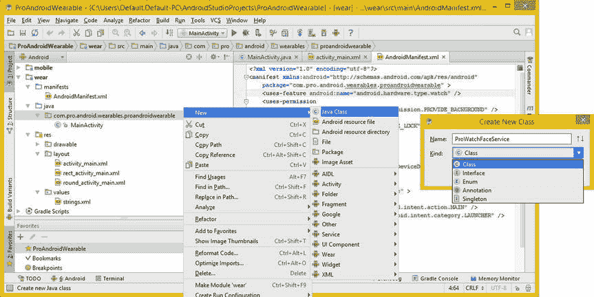
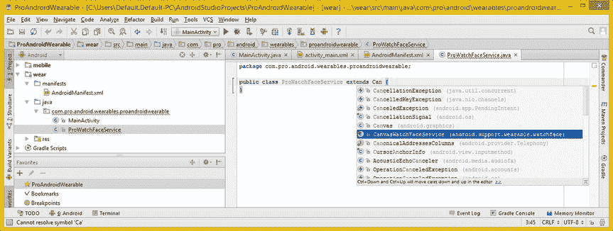
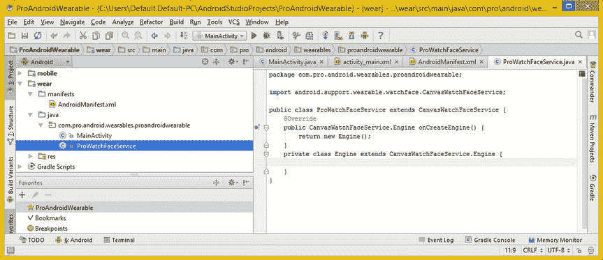
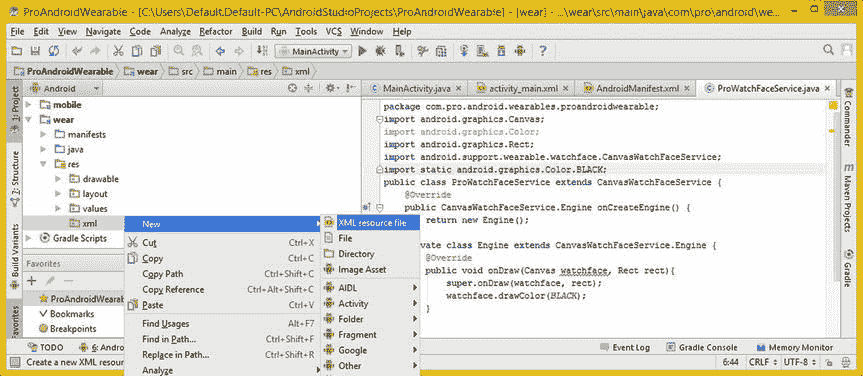
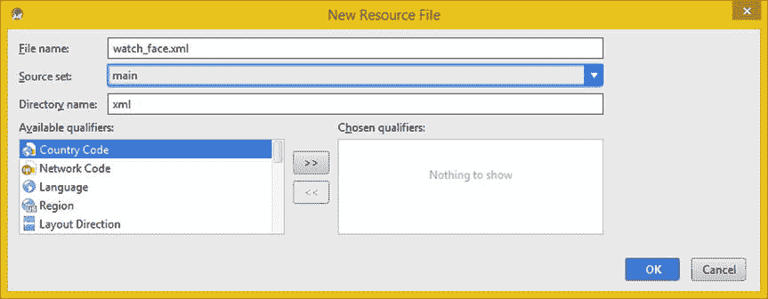

# 七、为穿戴设计表盘：创建表盘代码基础

现在，您已经掌握了有关 Android 表盘设计、数字图像和 Android 动画概念的基础知识，您可以开始编写表盘应用了，使用的是您在第章第 4 中开始的引导 Java 代码和 XML 标记。

因为在早期的代码中没有新的 Android 项目工作流程来创建 Watch Face Bootstrap 项目基础架构，所以本章将向您展示如何变形一个标准的 Wear 项目 Bootstrap 基础架构，将其转换为 Watch Faces 项目。在这个过程中，您将了解如何在 Android 中设置 Watch Face，它需要什么权限，Watch Faces 和 AndroidManifest XML 文件与标准应用有何不同，等等。

让我们首先看看 Gradle Build 配置文件及其引用的存储库和依赖项，然后向您的 Wear 和移动应用 AndroidManifest.xml 文件添加权限条目。

一旦这些就绪，您将学习如何创建一个新的 Java 类。这将创建**表盘服务**和**引擎**，它们将成为你的表盘设计和表盘处理代码的基础。之后，您将创建一个新的 **/res/xml** 资源目录，并创建一个 **watch_face.xml** 文件。创建动态壁纸范例需要这个文件，动态壁纸范例用于使 Watch Faces API 可操作。接下来，您将修改一些 Watch Face 预览可绘制素材，并将您的服务类和十几个相关参数添加到您的 AndroidManifest XML 文件中。我们开始吧！

分级脚本:设置分级构建依赖关系

如果您还没有这样做，请使用您在第二章中创建的快速启动图标启动 Android Studio 开发环境。这将启动 IntelliJ IDEA 并且显示你在第四章中创建的 ProAndroidWearable 项目。点击 IDE 左侧面板中 **Gradle Scripts** 文件夹旁边的箭头将其打开，如图图 7-1 所示。


图 7-1 。打开你的 ProAndroidWearable 项目中的 Gradle Scripts 文件夹，打开项目 build.gradle

右键单击主**build . gradle(Project:ProAndroidWearable)**文件，如图 7-1 左侧用蓝色突出显示的，选择**跳转到源代码**菜单选项，或者如果你愿意，简单地使用 **F4** 功能键快捷键。这将在 IDEA 的编辑区打开顶层(主)项目 Gradle 配置文件，如图 7-1 右三分之二所示。

这个顶级 build.gradle 文件将在 dependencies 部分使用一个(绿色)类路径引用，通过使用**com . Android . tools . Build:Gradle:1 . 0 . 0**，引用 Android 存储库服务器上的 **Android Gradle 构建工具**。

如果 Android Gradle 构建工具已经更新，那么版本编号可能会有所不同。这都是由 Android 新项目系列对话框正确设置的；在图 7-1 中要注意的重要事情是一个重要的信息:*注意:不要把你的应用依赖放在这里；它们属于单独的模块 build.gradle 文件。*因为一个 Android Wear 项目有一个 **Wear** 和一个 **Mobile** 组件，正如你在左边的 IntelliJ 项目导航器窗格中看到的，每个应用组件都有自己独特的 Gradle 构建脚本文件，我将在下面讨论。

将 Gradle build 依赖项放在与每个 Wear 和移动应用组件匹配的文件中很重要，这样 Gradle Build 才能正常工作。

接下来，右键单击移动**build . gradle(Module:mobile)**文件，图 7-2 左侧以蓝色突出显示的，选择**跳转到源代码**菜单选项，或者如果您愿意，也可以直接使用 **F4** 功能键快捷键。


图 7-2 。打开第二个 build.gradle 模块:ProAndroidWearable 项目中的移动 gradle 构建脚本

这是您的移动应用组件的 build.gradle 文件，它将包含您的**应用 ID** ，您的包名和类名的串联，即**com . pro . Android . wearables . proandroidwearable**，以及在 **API 级别 18** (Android 4.3)和 **API 级别 21** (Android 5)的**目标 SDK 版本**设置的**最低 SDK 版本**规范，如

在图 7-2 的底部，您将看到 Gradle **依赖关系**部分，引用 **wearApp 项目(':wear')** 项目类型和 **Android 支持库**的编译依赖关系，您在第四章中安装了该库，使用**com . Android . Support:app compat-V7:21 . 0 . 3**表示，以及 **Google Play 服务支持库**，使用

需要注意的是，您将会看到一些项目，比如那些仍在使用 Eclipse ADT IDE 的项目，它们在 Android 清单文件中设置了 Google Play 服务。这可以使用下面的**元数据**标签 : 来完成

```java
<application>
    <meta-data android:name="com.google.android.gms.version"
               android:value="@integer/google_play_services_version" />
</application>
```

因为您在 build.gradle 文件中设置了这个编译依赖项，所以您不需要在 Android Manifest XML 文件中包含这个<meta-data>标记，您将在本章中转换这个文件以便与 WatchFaces API 一起使用。稍后我会解释 **<元数据>** 标签是做什么的！</meta-data>

最后，右键单击 wear**build . gradle(Module:wear)**文件，如在图 7-3 左侧以蓝色突出显示的，并选择一个**跳转到源**菜单选项，或者如果你喜欢，简单地使用 **F4** 功能键快捷键。


图 7-3 。打开第三个 build.gradle 模块:在您的 ProAndroidWearable 项目中使用 gradle 构建脚本

这是智能手表(Wear SDK)应用组件的 build.gradle 文件，正如您所见，它还将包含您的应用 ID(??)以及 SDK 最低版本(??)规范。注意在这个 Gradle Build 规范文件中，这是为 Wear 设置的，在 **API 级别 21** (Android 5)，与 **API 级别 21** (Android 5)的**目标 SDK 版本**相同，如图 7-3 上半部分的 build.gradle 文件的 **android** 部分所示。

在图 7-3 的底部，你会看到梯度**依赖**部分。这个 Wear Gradle 构建规范将引用 Android Wear 支持库，而不是引用 **Android 支持库**、，而是引用 com . Google . Android . Support:wearable:1 . 1 . 0 存储库路径以及文件和版本字符串串联。有趣的是，Android 支持库位于 com . Android . Support；Wear 也在 com.google.android.support！

请注意，您将需要再次引用 **Google Play 服务支持库**，使用您在移动 Gradle 构建中使用的相同的**编译**语句。

Android 权限:Watch Face 使用-权限

单击左侧面板中 **Gradle Scripts** 文件夹旁边的向下箭头，关闭该文件夹，然后单击 **wear** 旁边的箭头打开该文件夹。接下来点击**manifest**文件夹旁边的箭头，同样打开该文件夹，显示 AndroidManifest.xml 文件，如图图 7-4 所示。右键单击**/wear/manifest/androidmanifest . XML**文件，如图 7-4 左侧蓝色高亮所示，选择**跳转到源**菜单选项，或者如果您愿意，可以简单地使用 **F4** 功能键快捷键。如你所见，这将打开 AndroidManifest.xml 文件，该文件是由你在第四章中使用的一系列新的 Android Studio 项目对话框创建的。


图 7-4 。添加两个< uses-permission >标签，用于提供 _ 背景和唤醒 _ 锁定穿戴清单

在指定智能手表硬件的< uses-feature >标签之后(或者之前，如果你愿意的话)添加两个 **< uses-permission >** 标签。uses-permission 属性是使用这个 XML 标记设置的，它定义了您的应用将从 Android 操作系统请求使用哪些权限。

注意，这些子标签需要“嵌套”在您的 **<清单>** 父标签中。这是因为< uses-permission >标签将访问 Android**manifest . permission**类中包含的常量值。如果你是好奇型的，想在一个地方看到 Android 操作系统允许的所有权限，请访问以下 URL:

```java
[`developer.android.com/reference/android/Manifest.permission.html`](http://developer.android.com/reference/android/Manifest.permission.html)
```

您将使用的权限之一没有列出，我将在下面解释原因！

uses-permission 属性使用 **android:name** 变量来设置预定义的操作系统常量，这些常量用于指定在 Android OS 中使用某些硬件(或软件)功能所需的权限。

如果您使用的常量不是 Manifest.permission 类的一部分，那么该常量需要以存储库路径开头，因此您会注意到在图 7-4 顶部突出显示的 **PROVIDE_BACKGROUND** 常量使用了一个**com . Google . Android . permission . PROVIDE _ BACKGROUND**常量引用，而 WAKE_LOCK 权限常量引用使用了一个 android.permission.WAKE_LOCK，这是一个较短的引用路径，直接访问现在可以在 Manifest.permission 类中看到的常量

如果您访问我之前包含的 Manifest.permissions URL，您会看到 WAKE_LOCK 常量用于启用允许使用 Android PowerManager 唤醒锁功能的权限，该功能可以防止硬件设备处理器休眠，并防止您的(智能手表)屏幕变暗。您需要添加到清单中的 XML 标记应该如下所示:

```java
<uses-permission android:name="com.google.android.permission.PROVIDE_BACKGROUND" />
<uses-permission android:name="android.permission.WAKE_LOCK" />
```

接下来，点击**移动**旁边的箭头打开该文件夹。接下来点击你的**Manifest**文件夹旁边的箭头打开那个文件夹，显示另一个 Android Manifest 文件，如图图 7-5 所示。右键单击这个**/mobile/manifest/androidmanifest . XML**文件，如在图 7-5 左侧以蓝色突出显示的，并且选择一个**跳转到源**菜单选项，或者如果你愿意，简单地使用你的 **F4** 功能键快捷键。将这两个相同的标记也添加到这个清单文件中，因为您的可穿戴权限需要是移动(手机或平板电脑)权限集的子集(或与之相等)。


图 7-5 。添加< uses-permission >标签用于移动清单的提供背景和唤醒锁

现在您已经准备好为您的 Watch Faces 应用创建核心类，您将把它命名为 ProWatchFaceService.java，并将使用 Android CanvasWatchFaceService 类作为它的超类。越来越令人兴奋了！

画布表面服务:一个表面引擎

本节将介绍驱动手表脸服务基础的类， **CanvasWatchFaceService** 和 **CanvasWatchFaceService。引擎**，以及它们在 Java 和 Android 类层次结构中的位置。您还将了解它们是如何在您当前的 ProAndroidWearable 项目代码库中实现的，您将把它转变为一个专业的 Watch Face 项目，这样，如果您想使用 Android 5 WatchFaces API 进行开发，您就知道如何做到这一点。

CanvasWatchFaceService 类:概述

Android**CanvasWatchFaceService**类是一个**公共抽象类** ，这意味着你必须对它进行子类化才能使用它。你将在本章的下一节中做这件事，在我提供了这个类本身及其来源的鸟瞰图之后，这将告诉你关于它正在做什么以及它从哪里获得这样做的能力的相当多的信息。

Java 类层次结构相当复杂，如下所示:

```java
java.lang.Object
  > android.content.Context
    > android.content.ContextWrapper
      > android.app.Service
        > android.service.wallpaper.WallpaperService
          > android.support.wearable.watchface.WatchFaceService
            > android.support.wearable.watchface.CanvasWatchFaceService
```

当然，Java 中的每个类和对象都是基于 **java.lang.Object** 的，而在 Android 中，**服务**类是基于**上下文**类的，因为服务将需要关于您的服务(在本例中是 **WatchFaceService** )试图完成什么的上下文信息。注意 WatchFaceService 是从 **WallpaperService** 继承而来的子类，它告诉你 Watch Face API 是基于 Android Wallpaper API 的，这就是为什么在本章中你必须实现 Wallpaper 对象和 BIND_WALLPAPER 功能。

CanvasWatchFaceService 类是一个基类，用于创建使用**画布**对象在显示屏上绘制手表表面的手表表面应用。这个类提供了一个无效**屏幕刷新**机制，类似于 **invalidate( )** 方法调用。方法调用是 Android 的基础，可以在**视图**类中找到，它允许视图对象被刷新。

创建 ProWatchFaceService 子类 : extends 关键字

现在让我们使用这个抽象的 CanvasWatchFaceService 类，并在这个 ProAndroidWearable 项目中创建一个全新的 Java 类。点击向右箭头图标打开你的 **/wear/java** 文件夹。接下来右键点击**com . pro . Android . wearables . proandroidwearable**(包)文件夹，然后选择 **New  Java Class** 菜单序列，如图 7-6 中蓝色部分所示。为了节省空间，我还将**创建新类**对话框放在了右边的截图中。从**种类**下拉菜单选择器中选择**类**选项，输入 **ProWatchFaceService** 的**名称**，最后点击**确定**按钮，创建新的 ProWatchFaceService WatchFace 服务和引擎子类。



图 7-6 。右键单击您的包文件夹并使用新的 Java 类来创建 ProWatchFaceService 类

一旦你创建了新的 Java 类，它将在一个编辑标签中为你打开，如图 7-7 的右三分之二所示。bootstrap 类为您提供了以下“空”公共类 Java 代码:

```java
package com.pro.android.wearables.proandroidwearable;
public class ProWatchFaceService {...}
```

您需要做的第一件事是添加 Java **extends** 关键字，您将在 ProWatchFaceService 类名之后插入该关键字，引用 CanvasWatchFaceService 超类，并为您的 ProWatchFaceService 类提供 Android CanvasWatchFaceService 超类的所有功能、算法、方法、变量和特性。

如果你输入 Java extends 关键字和这个超类名的前几个字母，IntelliJ IDEA 会为你下拉一个助手选择器对话框，如图图 7-7 所示，你可以找到并双击你的 CanvasWatchFaceService(Android . support . wearable . watch face package)选项，让 IntelliJ 为你完成代码的编写。现在您有了空的 ProWatchFaceService 子类，并准备在其中编写引擎。



图 7-7 。使用 extends 关键字从 CanvasWatchFaceService 创建 ProWatchFaceService 类的子类

在编写 WatchFaceService **引擎**类之前，让我们快速看一下 **CanvasWatchFaceService。Engine** 了解它能做什么。

CanvasWatchFaceService。发动机类别:发动机

CanvasWatchFaceService。引擎是一个**公共类**，它提供了调用 **onDraw( )** 方法的绘制引擎，以实际完成在智能手表屏幕上绘制(或在某些情况下制作动画)手表表面的繁重工作。Java 类层次仍然来自 **WallpaperService。然而，Engine** 远没有 CanvasWatchFaceService 复杂，看起来如下:

```java
java.lang.Object
  > android.service.wallpaper.WallpaperService.Engine
    > android.support.wearable.watchface.WatchFaceService.Engine
      > android.support.wearable.watchface.CanvasWatchFaceService.Engine
```

这个类提供了一个使用 onDraw()在画布上绘制的手表表面的实际实现。您将需要实现**。onCreateEngine( )** 方法，以便让您的类返回可用的引擎实现。这个类的构造函数方法将与 onCreateEngine()方法 结合，让 Android OS 返回新的引擎对象。

这是使用下面的 Java 构造函数方法结构来完成的，您将在本章的下一节中实现它:

```java
public CanvasWatchFaceService.Engine onCreateEngine() { return new Engine(); }
```

该类有许多强大的方法，您将在高级 Watch Face Java 代码开发中使用这些方法，一旦您在本章的后面建立了 Watch Face 代码基础，您将在本书的其余部分中添加这些方法。

最重要的方法之一是 **invalidate( )** 方法，，它使引擎重新绘制表盘屏幕。该方法将调度对 **onDraw(Canvas，Rect)** 方法的调用，请求引擎绘制动画或时间更新的下一帧。

有几个处理画布表面的 **onSurface( )** 方法调用，包括您的**。onSurfaceChanged(Surface holder holder，int format，int width，int height)** 方法，在这里你可以定义当一个表面表面发生变化时会发生什么，以及 **。onSurfaceCreated(Surface holder holder)**方法，在该方法中，您可以定义每当创建手表表面时发生什么。还有就是**。onsurfacererawedned(Surface holder holder)**方法，在这里您可以定义每当需要重画手表表面时发生什么。

还有就是**。** **postInvalidate( )** 方法，该方法请求 Android 操作系统发布一条消息，安排调用。onDraw(Canvas，Rect)方法，请求它绘制下一帧。现在让我们创建引擎类！

创建私有引擎类:使用 onCreateEngine()

在 ProWatchFaceService 类(在花括号内)中，您需要使用 Java @Override 关键字实现一个 CanvasWatchFaceService()构造函数方法。键入@Override 然后按回车键输入新的一行代码，然后键入 Java public 关键字并开始键入构造函数方法名 CanvasWatchFaceService()。

当 IntelliJ 弹出方法插入帮助器对话框时，如图图 7-8 所示，选择**CanvasWatchFaceService(Android . support . wearable . watch face)**选项，让 IntelliJ IDEA 为你编写 Java 代码语句。键入句点和单词 Engine，以访问完整的 CanvasWatchFaceService.engine 类路径。

此时，您所要做的就是在 public 关键字和类名之后添加上一节中讨论的 onCreateEngine()方法调用。在花括号内，添加**return new Engine()；**语句，创建您的表盘引擎的构造就创建好了。这将使用以下 Java 代码结构来完成:

```java
public CanvasWatchFaceService.Engine onCreateEngine( ) {
   return new Engine( );
}
```


图 7-8 。Add @Override，键入 Java 关键字 public 和字母 C，然后选择 CanvasWatchFaceService

一旦你把这个公共的 CanvasWatchFaceService。Engine onCreateEngine()就位，如图图 7-9 所示无误，你可以为你的引擎**私有内部类**编写一个结构，它将保存 onDraw()方法结构。


图 7-9 。添加 onCreateEngine()方法调用并返回 new Engine()；结构内部的语句

使用 Java private 关键字在名为 **Engine** 的 ProWatchFaceService 类中创建一个私有内部类，并使用 Java extends 关键字对 CanvasWatchFaceService 进行子类化。引擎类。你得到的结构应该看起来像下面的 Java 代码:

```java
private class Engine extends CanvasWatchFaceService.Engine {  // An Empty Class Structure  }
```

正如你在图 7-10 中看到的，代码是没有错误的，你已经准备好在这个私有引擎类中编写你的**公共 void onDraw( )** 方法了。



图 7-10 。编写一个名为 Engine 的空私有类来扩展 CanvasWatchFaceService。引擎等级

在 Engine 类中(在花括号中)，您需要实现一个公共的 void onDraw()方法，再次使用 Java Override 关键字。键入@Override，然后按 Return 键输入新的一行代码。然后键入 Java **public** 关键字和一个 **void** Java 返回类型，带有名为 **watchface** 的 Canvas 对象参数的 **onDraw( )** 方法名，名为 **rect** 的 Rect 对象参数，以及你的两个花括号，如图 7-11 所示。


图 7-11 。用 Canvas watchface 和 rect 对象参数编写空的公共 void onDraw 方法

在图 7-11 的底部可以看到，在**表盘**下面有一个绿色波浪下划线高亮。如果你把鼠标放在它上面，你会看到 IntelliJ 所关心的“参数‘watch face’从未被使用”。您现在可以忽略这个绿色(轻度警告级别)代码高亮显示，因为稍后您将调用这个 watchface Canvas 对象的. drawColor()方法。

还要注意 IntelliJ 添加到 Canvas 和 Rect 对象(类)中的红色。这意味着在代码中使用这些语句之前，您需要编写一个 import 语句。将 Canvas 和 Rect 对象传递到。CanvasWatchFaceService 中的 onDraw()方法。引擎超类使用 Java **super** 关键字，你将看到如何让 IntelliJ 为你编码这些导入语句。耐心是一种美德！

在 onDraw()方法的主体中，也就是在左花括号和右花括号中，键入 Java super 关键字和一个句点字符以打开 IntelliJ helper 对话框，显示您的超类中可以使用的方法。图 7-12 显示了 onDraw(Canvas canvas，Rect bounds)选择；一旦你双击这个，IntelliJ 会为你写一个 Java 代码语句，生成一个红色波浪线(严重错误级别)，我接下来会讨论这个(这也是我为什么拿这个具体的工作过程)。


图 7-12 。在 onDraw 方法内部，使用 Java super 关键字调用 onDraw(Canvas，Rect)方法

正如你在图 7-13 中看到的，如果你将鼠标悬停在红色波浪状错误高亮上，IntelliJ 会告诉你你的问题是什么。在这种情况下，显示 **android.graphics.Canvas** 和 **android.graphics.Rect** 的包和类，并显示错误“引擎中的 onDraw(Canvas，Rect)无法应用”。

这里使用了 import 语句的包和类名部分，这一事实应该会在您的思维过程中触发一个“import 语句”，所以您唯一需要知道的是如何让 IntelliJ 对这些进行编码。


图 7-13 。将鼠标悬停在突出显示的红色波浪错误上，查看 Canvas 和 Rect 类的问题

正如你在图 7-14 中看到的，如果你把鼠标放在画布上或者你的公共 void onDraw(Canvas watchface，Rect rect)方法声明中的 Rect 上，一个有点神秘的，缩写的？android.graphics.Rect？Alt+Enter”消息。我会把这个隐晦的信息翻译成“问题:为你导入你的 android.graphics.Rect 包和类？如果是，按 Alt 键，同时按回车键，我来编码！”你会发现，如果你将鼠标悬停在这些红色的类名上，并按下建议的 Alt-Enter 击键序列，IntelliJ 将为你编写两个导入语句，如你在图 7-15 中看到的。


图 7-14 。将鼠标悬停在代码中的红色画布和 Rect 类名上，并使用 Alt+Enter 导入这些类

现在是时候在 onDraw()方法的主体中使用 watchface Canvas 对象了。您将调用一个**。**draw color(int color)方法关闭此对象将画布的颜色设置为黑色。当然，这优化了表盘设计的功耗，因为黑色像素的功耗为零！

输入 **watchface** 对象名称，然后输入一个**句点**键，然后输入几个 drawColor 字符，会弹出一个帮助对话框，包含以字母 C 开头的绘制方法，如截图右下方的图 7-15 所示。双击 **drawColor(int color)** 选项，调用 watchface Canvas 对象的方法。现在，您所要处理的就是您的 **Color** 类参数，您将把它传递到方法调用中，并且您将完成基本引擎结构的编码，这将绘制黑色(空)的手表表面！


图 7-15 。键入 watchface Canvas 对象，并使用句点和 drawC 调出方法助手对话框

您可能已经注意到，我的方法是在试图获得更复杂的代码之前，先获得一个空的 Java 代码结构并使其工作。这是因为 Java 是复杂的语言，Android 5 是复杂的操作系统；因此，我通常从最底层的功能编码开始。

我的开发方法是从空的开始逐步构建，但是没有错误的代码构造具有所有需要的导入语句和编码语法(关键字、括号、花括号等)。)恰当地就位。

正如你在图 7-16 中看到的，我已经输入了一个**颜色**类名(对象)并按下**句号**键调出颜色常量助手对话框，这样我就可以找到我想用于表盘背景色的颜色。

出于省电的原因，我选择了 **Color 的颜色类常量。黑色(android.graphics)** ，如图 7-16 中蓝色选中所示。


图 7-16 。在 watchface.drawColor()方法中，键入颜色类并选择黑色

双击颜色后。黑色常量在帮助器对话框中，你会在 Java 代码编辑器窗格的左边看到一个**灯泡**，如图 7-17 左侧所示。您可以将鼠标悬停在图标上，或者单击图标旁边的下拉箭头，打开 IntelliJ 为您提供的关于您刚刚生成的这行代码的解决方案。

这条消息说“为 android.graphics.Color.BLACK 添加静态导入”，所以看起来 IntelliJ IDEA(或 Android Studio)希望您为 Color 而不是 Color 类添加导入语句。黑常数本身！

创建 Java 静态导入语句是为了提供一种类型安全的机制，用于在 Java 代码中包含常量，而不需要引用最初定义为常量的整个(在本例中为 Color)类。


图 7-17 。单击灯泡下拉箭头，并添加建议的静态导入

恭喜你！现在，您已经为您的 ProWatchFaceService 及其附带的引擎类建立了 Java 代码基础，包括您的核心 onDraw()方法，该方法目前在智能手表显示屏上绘制一个空白的黑色空手表表面。

这个核心。onDraw()方法最终会在必要时更新您的手表表面。诚然，这目前是一个空的 Java 结构，尽管它确实为您提供了一个空白的黑屏(画布)来创建您的 Watch Faces 设计，因此，您已经将它放在适当的位置，并且您正在一步步地学习这个 Watch Faces API 是如何实现的，以及它在幕后是如何工作的，这仍然是非常重要的。

你的代码现在没有错误了，这可以在图 7-18 中看到。您可以看到 color 类的三个导入语句，一个静态导入语句和一个不需要的(在 IntelliJ 中使用灰色显示)导入语句。这表明引用了 Color 类，但不需要完整的 import 语句。IntelliJ 有一个**代码优化导入**特性，一旦应用开发完成，你可以用它来删除所有不必要的导入语句。


图 7-18 。完成了私有类引擎和五个导入语句，一个静态

既然已经有了提供核心外观处理功能的 Java 代码，那么让我们完成所有 XML 基础标记。还有很多设置工作要做！

Watch Faces API 设置的 xml 部分将包括一个全新的 **/res/xml** 目录，XML 壁纸对象定义，您将完成移动应用和 wear 应用 AndroidManifest.xml 文件的变形，从默认的 Wear 应用引导到 Watch Faces API 应用兼容性。完成此操作后，您将能够创建面部图像预览。

表盘 XML 资源:创建和编辑 XML 文件

尽管您已经添加了与 Watch Faces API 相关的权限，并使用 Java 7 代码创建了 Watch Faces 呈现引擎，但是仍然需要使用 XML 标记来解决一些问题。

这些包括创建 XML 资源文件夹、壁纸对象定义，以及将<服务>声明添加到 AndroidManifest.xml 文件中。您还将添加(或删除)一些其他 XML 标记和参数条目，以便在两个(移动和穿戴)Android 清单 XML 定义文件中进行一些关键的调整。这将向您展示如何将 bootstrap Wear 应用“变形”为 Watch Faces API 应用，这也是本书本章的全部内容！让我们开始处理所有这些 XML 标记，这样您就可以完成这一基础章节，然后开始创建手表外观设计！

表盘壁纸:用 XML 创建壁纸对象

接下来你需要创建的是 **/res/xml/watch_faces.xml** 文件，它定义了你的壁纸对象并包含了手表 faces 的设计。正如您在图 7-19 中看到的，项目文件夹中还不存在一个 **/res/xml** 文件夹，因此您需要右键单击 **/wear/res** 文件夹，并使用**NewAndroid resource directory**菜单序列来创建保存 watch_faces.xml 文件所需的目录，您接下来将创建该文件来保存 XML**<wallpaper>**对象父标签和 xmlns


图 7-19 。右键点击/res 文件夹，选择新建安卓资源目录

调用该菜单序列后，将会看到一个**新建资源目录**对话框，如图图 7-20 所示。选择您的**资源类型**为 **xml** ，并将**目录名**设置为 **xml** 。重要的是要注意，如果您首先选择一个资源类型，IntelliJ 将为您命名目录。其他一切保持不变，然后点击 **OK** 按钮创建 XML 文件夹，如您所见，在图 7-21 中已经成功创建。


图 7-20 。选择一个 xml 资源类型，将把这个目录命名为/res/xml

右键单击 new /res/xml 文件夹，选择**新建 XML 资源文件**，如图图 7-21 所示，新建 **watch_faces.xml** 壁纸文件。



图 7-21 。右键单击/res/xml 目录，并选择新建 XML 资源文件

调用菜单序列后，你会看到一个**新建资源文件**对话框，如图图 7-22 所示。选择你的**源设置**为**主**，然后设置**文件名**为 **watch_face.xml** 。保持其他一切设置不变，然后单击 **OK** 按钮创建 watch_faces.xml 定义文件，正如您在图 7-23 中看到的，该文件已成功创建，并已在 IntelliJ IDEA 内的编辑窗格中打开进行编辑。



图 7-22 。将文件命名为 watch_face.xml，并将源设置为 main(保留默认值)

使用下面的 xml 标记进入 **< xml >** 版本容器标签和 **<壁纸>** 父标签，可以在图 7-23 的右半部分看到:

```java
<?xml version="1.0" encoding="utf-8"?>
<wallpaper xmlns:android="http://schemas.android.com/apk/res/android" />
```

这将在 Android 中创建壁纸对象，用于您的手表表面。


图 7-23 。右键单击 watch_face.xml，使用跳转到源代码在选项卡中查看它

现在，您已经将能够在 wear Android Manifest XML 文件中创建<服务>声明所需的一切就绪，这将声明您的 ProWatchFaceService(和引擎)以供使用，并使用父<服务>标签内的<元数据>子标签引用所有其他表盘图像预览和壁纸对象。

声明 WatchFace 服务:XML <service>标签</service>

在 IntelliJ 中点击您的 **wear** 应用的 **AndroidManifest.xml** 选项卡，这样您就可以声明您的**服务**以在 Watch Face 应用中使用。如图 7-24 中 IntelliJ 的**标题栏**所示，它显示了当前正在编辑的文件的路径。使用此功能可确保您编辑的是正确的(wear) AndroidManifest，而不是移动 AndroidManifest。我已经将 **< uses-feature >** 和**<uses-permission>**标签及其参数放在一行代码中，以便为您接下来将创建的<服务>父标签及其子标签结构腾出空间。

**<服务>** 标签本身有半打参数来配置它的使用，从 **BIND_WALLPAPER** 权限开始，它允许你的服务对象“绑定”**绑定**是指与你在上一节创建的壁纸对象建立“实时刷新”或实时更新的连接。您还需要给<服务>标签一个服务类名，即**。ProWatchFaceService** ，还有一个 **Pro 手表脸**的标签。最后，您需要为**allowed embedded**选项设置一个 **true** (on)标志，并为必需的 **taskAffinity** 参数(属性)添加一个**空字符串值**。这可以使用以下 XML 标记来完成:

```java
<service
  android:permission="android.permission.BIND_WALLPAPER"
  android:name=".ProWatchFaceService"
  android:label="Pro Watch Face"
  android:allowEmbedded="true"
  android:taskAffinity="" >
  <meta-data
    android:name="android.service.wallpaper"
    android:resource="@xml/watch_face" />
  <meta-data
    android:name="com.google.android.wearable.watchface.preview"
    android:resource="@drawable/preview_pro_square" />
  <meta-data
    android:name="com.google.android.wearable.watchface.preview_circular"
    android:resource="@drawable/preview_pro_circular" />
  <intent-filter>
    <action android:name="android.service.wallpaper.WallpaperService" />
    <category android:name="com.google.android.wearable.watchface.category.WATCH_FACE" />
  </intent-filter>
</service>
```


图 7-24 。添加定义服务的<服务>父标签和<元数据>子标签

在<service>父标签中还有三个<meta-data>子标签以及一个<intent-filter>子标签。我将首先介绍意图过滤器，因为只有一个，而且非常重要。意图过滤器子标签有两个自己的(嵌套的)子标签。一个是用于一个**动作**，它是一个**壁纸服务**类，是 WatchFaceService 类的超类。这是 ProWatchFaceService 类的 CanvasWatchFaceService 超类的超类。另一个子标签用于动作的**类别**，不出所料，它是一个 **WATCH_FACE** 常量。</intent-filter></meta-data></service>

我在这里详细介绍 CanvasWatchFaceService 类(及其嵌套的引擎类)的原因是，当需要查看意图过滤器设置时，您将理解 WallpaperService 是可绑定服务类的最高级类型，WATCH_FACE 类别实际上是为这个 WallpaperService 超类指出了一个 WatchFaceService 子类类型。

接下来，您需要添加 **<元数据>** 子标签，为这个 Watch Faces 服务声明定义某些东西。其中最重要的将定义 Wallpaper 对象，它是在上一节中使用 watch_face.xml 文件创建的，并在名为 android.service.wallpaper 的元数据标记中引用，该标记使用**Android:resource = " @ xml/watch _ face "**参数引用语法引用/res/xml 中的 XML 资源文件。

另外两个<meta-data>子标签将为表盘圆形和方形版本预览提供可绘制素材。接下来让我们来创建它们。</meta-data>

square watch face 预览的<meta-data>子标签将使用名称值**com . Google . Android . wearable . watch face . preview**，并引用您将在下一节创建的 XML 资源文件，该文件将使用**Android:resource = " @ drawable/preview _ pro _ square "**参数引用语法。注意在 name 参数中，默认的表盘屏幕形状类型是方形，而圆形将被编码为 **preview_circular** 。</meta-data>

注意在图 7-24 中 IntelliJ 是绿色波浪下划线突出单词 watchface，就像它对 Java 对象名做的一样。原来 IntelliJ 认为这是一个拼写错误，所以，希望在某个时候 IntelliJ 会更新它的字典，并在 watchface 和 WatchFaces API 中添加正确的拼写！

round watchface 预览的<meta-data>子标签将具有名称值**com . Google . Android . wearable . watch face . preview _ circular**和 XML 引用，该 XML 引用指向您将在下一节中使用**Android:resource = " @ Drawable/preview _ pro _ round "**参数引用语法创建的可绘制资源文件。</meta-data>

接下来，您需要创建这些 watchface.preview 素材并将其添加到正确的/res/drawable 文件夹中，因此，在我用一个完全加载(但为空)并配置好的 Watch Face API 应用结束本章之前，让我们来看一些数字图像素材放置工作，以向您展示这是如何完成的。

观看脸部图像预览:使用可绘制资源

下一步，你需要做的是删除下半部分图 7-24 中显示的手表表面预览图像的<meta-data>标签中的红色错误指示器文本高亮，将两个(方形和圆形)手表表面预览 **PNG** 图像复制到项目的 **wear** 部分的正确/res/drawable 文件夹中。我将使用第二部分后面一章中的预览图，包括图形设计素材创建和集成到表盘设计、代码、UI 设计、XML 标记和应用中。</meta-data>

预览图像的图像分辨率需要为 **320 x 320 像素**。这意味着这些图像是 HDPI(高密度像素图像)分辨率，因此需要进入**/wear/src/main/RES/drawable-hdpi**文件夹，以便 Android 5 找到它们。该文件夹可以在图 7-25 的左侧看到，也可以在图 7-26 的左侧看到。

在图书的资源库中找到 Pro Android 可穿戴设备档案中的 **preview_pro_square** 和 **preview_pro_circular** PNG 图片，复制到/**AndroidStudioProjects/ProAndroidWearable/wear/src/main/RES/drawable-hdpi/**文件夹中，如图图 7-25 所示。这些预览图像将与 watch faces 配套应用一起使用，该应用运行在手机或平板电脑上，向用户逐个像素地显示表盘的样子(表盘使用 320 像素)。


图 7-25 。将 preview_pro_circular 和 preview_pro_square 文件复制到 drawable-hdpi

一旦数字图像素材被正确复制到您的/wear/src/main/RES/drawable-hdpi/文件夹中，图 7-24 中出现的红色错误代码高亮将会消失。这可以在图 7-26 的右侧看到，现在 AndroidManifest.xml 标记也没有错误了。在这一章中，你已经取得了很大的进步！


图 7-26 。一旦将 PNG 资源复制到/res/drawable 文件夹中，错误就会消失

摘要

在本章中，您学习了如何通过使用 IntelliJ IDEA 将您的 Pro Android 可穿戴 bootstrap 应用变形为表盘应用，从而为您的**表盘应用**创建基础。

首先，您了解了项目中的 Gradle 脚本需要如何进行分层，以及如何设置它们以获得成功的 watch faces 应用层次结构。您了解了依赖性和存储库，以及如何使用 Gradle 设置 Google Play 服务。

接下来，您添加了创建 Watch Faces 应用所需的 Android 权限，并了解到您需要处理两个 Android 清单 XML 文件:一个用于可穿戴外围设备，另一个用于手机或平板电脑“主”移动设备。

之后，您学习了 Android CanvasWatchFaceService 类及其 Java 类层次结构，描述了它是如何使用上下文启动服务的对象，该服务创建用于创建 Watch Faces 引擎的壁纸，该引擎使用画布绘制到智能手表显示屏。有趣的是，一个 Java 层次结构可以向我们展示 Google 是如何在 Android 5 操作系统中实现他们的 WatchFaces API 的，不是吗？

然后你了解了 Android 的 CanvasWatchFaceService。引擎类及其层次结构，以及如何将其实现为 ProWatchFaceService 类的私有类。您学习了如何实现？onDraw()方法，并创建了一个空的 Watch Faces 服务引擎，该引擎将用于本书涵盖 Watch Faces API 的第二部分的剩余部分。

接下来，我讨论了手表外观 XML 定义，您创建了一个/res/xml 文件夹，然后创建了一个 watch_face.xml 文件，该文件定义了一个用于手表外观设计的墙纸对象。

然后，我讨论了 Wear Android 清单，您精心制作了服务入口，它定义了新的 ProWatchFaceService.java 类以及其他关键内容，如墙纸对象、意图过滤器和预览图像。

最后，您将手表表面预览图像放到一个可绘制的 HDPI 文件夹中，这样所有的 Java 代码和 XML 标记都变成了绿色，因此没有错误！

在下一章中，您将开始向公共 ProWatchFaceService 类和私有 Engine 类添加 Watch Face 特性。