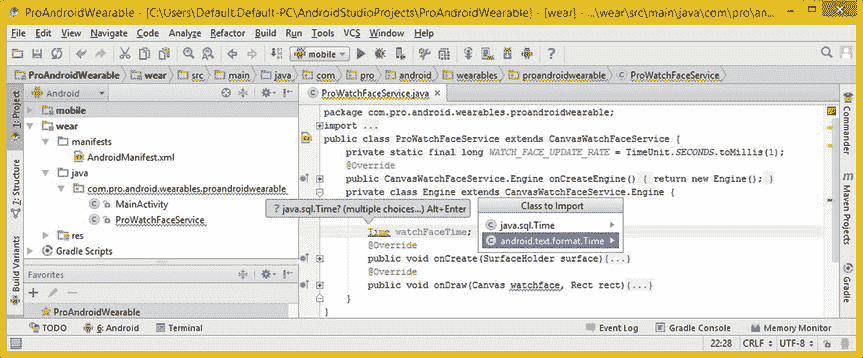
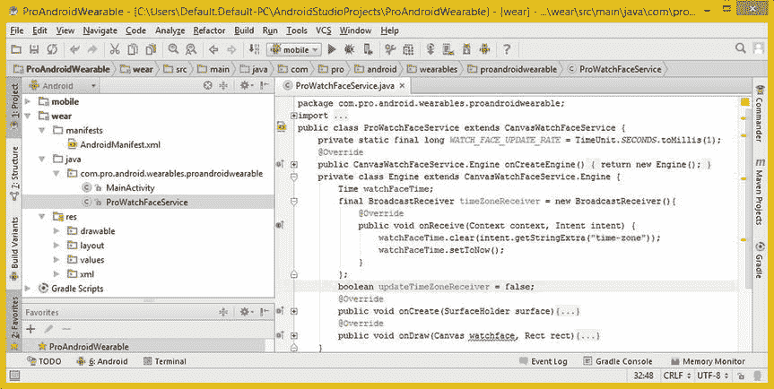
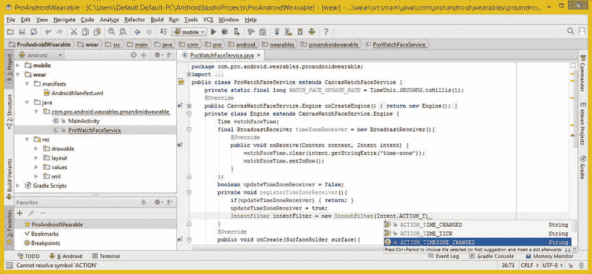

# 八、表盘计时引擎：使用时区、时间和广播接收器

现在您已经有了 CanvasWatchFaceService 子类和私有的 Engine 类，并且已经将 Gradle 脚本、XML 素材、Wallpaper 对象和预览素材安装到了它们应该安装的位置，您已经准备好开始学习更高级的 Java 工具类和 Android 类以及实现 WatchFaces API 的方法。

随着你在本书中逐步完成表盘的制作过程，主题会变得更加深入。在本章中，您将深入了解绘图表面，设置您的表盘样式、时区管理、time 对象和时区广播类，为了创建功能性表盘设计应用，需要实现这些内容。

您还将详细了解一下 **WatchFaceStyle** 类及其 **WatchFaceStyle。构建器**嵌套类。这些类将允许你建立和配置你在第六章中学到的必要参数。

你还会看到 Android 与时间相关的类和方法，比如**时间**和**时区**，以及 Android **SurfaceHolder** 类，最后是 Android**broadcast receiver**类和方法。这一章充满了关于 Java 和 Android 类的信息，所以，让我们开始吧！

你的 watch face Surface:Android Surface holder

你的表盘设计将通过使用一个 Android**surface holder**object 来“托管”。这个对象是兼容的，可以与安卓**画布**对象和你的**协同工作。onDraw( )** 方法，这两个方法都已经放在代码中，随着本章的深入，它们将扩展您对的使用。

在您用代码实现 SurfaceHolder 接口之前，我想给您一个概述。然后我将回顾一下 WatchFaceStyle 类，最后介绍关键的 WatchFaceService 和 WatchFaceService。引擎类，它包含了您将在接下来的几章中实现的大多数重要的 WatchFaces API 方法。

Android SurfaceHolder 界面:手表表面

Android WatchFaces API 使用一个 **SurfaceHolder** 对象作为最底层的对象来保存你的手表 Faces 设计。SurfaceHolder 是一个**公共抽象 Java 接口**，所以它定义了你需要实现的方法或常量，以便创建手表表面应用。它是**android . View . surface holder**包的成员，因为它是一种 Android 视图。

SurfaceHolder 对象旨在方便持有(承载)显示屏绘图表面。此界面允许您控制显示绘图表面的格式或大小，以及编辑其表面上的像素。

有一些方法可以用来监测表面的任何变化。通常使用 **SurfaceView** 类来访问这个接口，然而，WatchFaces API 通过**来访问它。onCreate( )** 方法。我将在 WatchFaceService 中介绍这个方法。本章的引擎部分简要讨论了 SurfaceHolder 和 WatchFaceStyle 类。

Android SurfaceHolder 接口包含三个嵌套类:两个是可以用来确定何时发生了对 WatchFace 表面的改变的接口，一个是用于坏表面类型异常错误处理的类。

**表面固定器。回调**接口可以在您的 Java 代码中实现，它允许您的 Watch Face 应用接收有关 SurfaceHolder 对象更改的信息。还有第二辆 **SurfaceHolder。回调 2** 实现 SurfaceHolder 的接口。回调接口，提供可以接收的附加回调。

**表面固定器。BadSurfaceTypeException** 类提供了一个从。lockCanvas()方法，该方法是从其类型已设置为**SURFACE _ TYPE _ PUSH _ BUFFERS**的 SurfaceHolder 对象调用的。

这个常量通常不会影响 Watch Faces 的设计和应用开发，我在这里包含它只是为了完整地涵盖这个类在 Android 操作系统中的所有实现。

该接口还包含大约十几个公共方法，其中几个可以用于 Watch Faces 设计。这些方法是抽象的，因此您必须用自己独特的代码来实现它们。它们在表 8-1 中列出。你可以在这里熟悉他们，这样你就知道他们能做什么。

表 8-1 。SurfaceHolder 接口方法以及数据类型、方法调用结构和用途

| 

方法类型

 | 

方法结构

 | 

方法目的

 |
| --- | --- | --- |
| 抽象虚空 | addCallback(SurfaceHolder。回拨回拨) | 添加回调接口 |
| 抽象曲面 | getSurface() | 访问曲面对象 |
| 抽象直肠 | getSurfaceFrame() | 获取当前尺寸 |
| 抽象布尔 | 正在创建( ) | 正在创建表面？ |
| 抽象画布 | lockCanvas() | 编辑表面像素 |
| 抽象画布 | lockCanvas（Rect dirtyRect） | 肮脏的直肠锁画布 |
| 抽象虚空 | removeCallback(SurfaceHolder。回调 cback) | 移除回拨 |
| 抽象虚空 | setFixedSize(int width，int height) | 使表面固定宽×高 |
| 抽象虚空 | setFormat(内部格式) | 设置像素格式 |
| 抽象虚空 | setKeepScreenOn(布尔 ScreenOn) | 保持屏幕显示选项 |
| 抽象虚空 | setSizeFromLayout() | 允许调整表面大小 |
| 抽象虚空 | unlockCanvasAndPost(画布) | 完成编辑表面 |

现在您已经对 SurfaceHolder 接口有了一个大致的了解，让我们看看如何使用 SurfaceHolder 为您将用于 Watch Faces API 设计的 Canvas 对象提供一个表面(Holder)。

一个 SurfaceHolder 对象:onCreate(surface holder surface)

如果您还没有这样做，请使用您在第二章中创建的快速启动图标启动 Android Studio 开发环境。这将启动 IntelliJ IDEA，并显示您在第四章中创建的 ProAndroidWearable 项目，其中您在第七章中添加了手表面孔。

关闭除**ProWatchFaceService.java**选项卡之外的所有编辑选项卡，如图图 8-1 所示，因为在本章中您将会在该选项卡上工作。您将从 WatchFaceService 添加方法。引擎类，你会在这一章的后面学到，第一个是**。onCreate( )** 方法，如图图 8-1 所示。


图 8-1 。向私有引擎类添加一个公共 void onCreate()方法，并在参数列表中键入 Sur

键入@ Override public void onCreate(){ } methodinfra structure，并在参数区域内键入 **Sur** 以触发 IntelliJ 调出一个助手对话框，其中包含该方法调用可以使用的所有对象(类)类型。找到**SurfaceHolder(Android . view package)**选项，双击它将 surface holder 对象插入到方法调用中，并将其命名为 **surface** ，因为这就是它的作用(holding)。

创建 SurfaceHolder 对象(名为 surface)的公共 void onCreate()方法结构将采用以下 Java 结构，如图 8-2 所示:

```java
@Override
public void onCreate(SurfaceHolder surface) { Your Java method body will go in here }
```


图 8-2 。键入 Java super 关键字，并选择 onCreate (SurfaceHolder)选项将其添加到

正如你在图 8-2 中看到的，如果你简单地在方法体中键入 Java 关键字 **super** 和**句点**键，IntelliJ IDEA 会提供一个方法助手对话框。您可以使用此对话框仔细阅读可用于的所有方法。onCreate()方法。

双击**onCreate(surface holder)void**选项并插入。onCreate()方法调用您的超类，使用您在公共 void onCreate(surface holder surface)方法构造中创建的**表面**对象。这会将名为 surface 的 SurfaceHolder 对象传递给超类。onCreate()方法，用于在更高级别进行处理。这就是你如何创建一个 SurfaceHolder 并在你的 WatchFace 中实现它。

你会在图 8-3 中注意到，如果你开始在 super.onCreate()方法调用参数区域中键入你的 SurfaceHolder 对象名(surface ), IntelliJ 会找到这个对象名，以及所有其他可用的兼容对象类型，并把它们放在一个大的帮助器对话框中供你选择。


图 8-3 。在中键入一个 s。onCreate()方法参数区，并从对话框中选择表面对象

现在你已经用这个把你的表面支架放好了。onCreate()方法调用，让我们使用 WatchFace Style 类构建一个 WatchFace 样式。

设置手表表面样式:Watch Face Style。建造者

WatchFaces API 包含您的 WatchFaceStyle 和 WatchFaceStyle。构建器类，用于构建和配置 Watch Faces 设计，满足您在第六章中了解到的许多 Android 设计需求。

这些考虑因素定义了你的 WatchFace 将如何吸收 Android 操作系统的考虑因素，例如状态栏指示器的位置，peek 卡支持，Google hotword 指示器的位置，等等。

Android WatchFaceStyle 类:设计手表的外观

Android **WatchFaceStyle** 类是**扩展**Object 类并实现 Java **Parcelable** 接口的**公共**类。这个类是**Android . support . wearable**包的一部分。这个 WatchFaceStyle 类的层次结构表明(由于层次结构中缺少任何其他类),它是由 Google 的 Android 开发团队“临时编码”的。创建该类是为了提供观察面孔样式，其层次结构如下所示:

```java
java.lang.Object
  > android.support.wearable.watchface.WatchFaceStyle
```

需要注意的是，这个 android.support.wearable 包中的可穿戴支持库类可能会发生变化。WatchFaceStyle 类提供了允许描述和配置手表外观的常量和方法。该类中概述的参数定义了 WatchFaceService 将如何在您的自定义手表表面设计上绘制 Android 的操作系统用户界面(UI)元素。

这个类的一个实例将被传递到一个方法中，您将在下一节中使用这个方法，称为**setWatchFaceStyle(WatchFaceStyle)**，用于您在**ProWatchFaceService.java**类中的私有**引擎**类中的 **onCreate** 方法。

为了构造您的 WatchFaceStyle 对象实例，您将使用 Java **new** 关键字来创建一个新的 WatchFaceStyle。生成器对象。这是在 setWatchFaceStyle()方法中使用来自您的类的**上下文**对象来完成的。

因此，WatchFaceStyle 类包含一个单独的嵌套类，名为 **WatchFaceStyle。建造者**。我将在本章的下一节详细介绍这一点。当你构建一个 WatchFace 样式时，你也将在后面的章节中使用这个嵌套类。

WatchFaceStyle 类包含 11 个重要的手表外观常量，您将在手表外观设计和应用开发中使用这些常量。这些显示在表 8-2 中，以及它们的正确名称和功能描述。

表 8-2 。WatchFaceStyle 类常量名称及其预期功能

| 

WatchFaceStyle 常量名称

 | 

WatchFaceStyle 常量函数

 |
| --- | --- |
| 环境 _ 窥视 _ 模式 _ 隐藏 | 当手表处于环境模式时隐藏窥视卡 |
| 环境 _ 峰值 _ 模式 _ 可见 | 当手表处于环境模式时，显示 peek 卡 |
| 背景 _ 可见性 _ 中断 | 简要显示了中断时的 peek 卡背景 |
| 背景 _ 可见性 _ 持久性 | 显示始终用于中断的 peek 卡背景 |
| 峰值模式短 | 使用单行文本显示查看卡 |
| 峰值模式变量 | 使用多行文本显示 peek 卡 |
| PEEK_OPACITY_MODE_OPAQUE | 使用不透明/实心背景显示 peek 卡 |
| 窥视 _ 不透明 _ 模式 _ 半透明 | 以半透明背景显示 peek 卡 |
| 保护 _ 热门词汇 _ 指示器 | 在 Hotword 中使用半透明黑色背景 |
| 保护状态栏 | 使用半透明黑色背景状态栏 |
| 保护整个屏幕 | 屏幕使用半透明的黑色背景 |

此 WatchFaceStyle 类包含允许您访问有关 WatchFaceStyle 的信息的公共方法。这些大多是**。get( )** 方法，这些方法与。稍后您将使用嵌套的 WatchFaceStyle 访问 set()方法。生成器类。接下来我会报道这堂课。

有一个**。describeContents( )** 描述 WatchFaceStyle 内容的方法，以及一个**。equals(Object otherObject)** 方法，用于比较 WatchFaceStyle 对象。有一个**。getComponent( )** 方法，该方法为指定样式的表盘组件获取一个值，并且您的标准继承了**。toString( )** ，**。hashCode( )** 和**。writeToParcel( )** 方法。

getter 方法包括一个**。getambientpekmode()**方法，显示手表处于环境模式时主 peek 卡将如何显示，以及一个**。getBackgroundVisibility( )** 方法显示如何为主 peek 卡设置背景显示。**。getcardppeekmode()**方法显示主 peek 卡将进入您的表盘显示屏多远，以及**。gethotworindicatorgravity()**方法显示您在表盘屏幕上放置 OK Google hotword 的位置。**。getPeekOpacityMode( )** 显示一个 Peek 卡不透明度设置，和一个**。getShowSystemUiTime( )** 显示您的 WatchFaceStyle 是否配置为在表盘上显示系统时间。

还有一个**。getStatusBarGravity( )** 方法调用，允许您轮询并找出屏幕上状态栏图标的位置，以及一个**。getViewProtectionMode( )** 允许您对表盘屏幕上的元素添加透明黑色背景色的设置进行投票，以便它们在表盘上可读。

最后，还有一个方法叫做**。getshowunreadcountimindicator()**轮询 WatchFaceStyle 对象，以确定 WatchFaceStyle 对象是否包含一个指示符，如果设置为 true 值，则该指示符显示还有多少**张未读的 peek 卡**要由用户从未读的 peek 卡输入流中读取。

接下来，我们来看看 WatchFaceStyle。生成器嵌套类及其许多外观样式方法。在创建和构建 WatchFaceStyle 对象时，您将在下一节后面的章节中使用这些方法中的大部分。

Android WatchFaceStyle。构建器类:构建样式

Android **WatchFaceStyle。构建器公共静态**类也有一个**扩展对象**，表明它也是为构建你的 WatchFaceStyle 对象而临时编写的。该类提供了用于创建 WatchFaceStyle 对象的“生成器方法”。Java 类层次结构如下所示:

```java
java.lang.Object
  > android.support.wearable.watchface.WatchFaceStyle.Builder
```

这是另一个可穿戴支持库类，可以在 **android.support.wearable** 包中找到，与 WatchFaceStyle 类一样，它也将在未来随着智能手表制造商改变其产品功能的方式而发生变化。例如，随着消费电子产品组件小型化的进展，以及这些小型化组件的价格随着时间的推移不断下降，更多的智能手表将不可避免地从外设转向完整的 Android 设备(如 Neptune Pine)。

WatchFaceStyle 的**公共构造函数方法** 。构建器对象使用一个**服务**，特别是您的 WatchFaceService 子类，在本例中是一个 **ProWatchFaceService** 类，以及它的上下文对象(this)，作为它的参数，使用以下格式:

```java
WatchFaceStyle.Builder(Service service)           // This is the Generic Constructor Method Format
WatchFaceStyle.Builder(ProWatchFaceService.this) // This is our specific Constructor Method Format
```

一个 Java **这个**关键字包含了 ProWatchFaceService 类的**上下文**，这个上下文对象包含了关于这个类的所有**相关信息**。

这个 WatchFaceStyle。构建器类包含**十个**公共方法调用。我将向你展示如何在你的**私有引擎**类的**中实现这些。onCreate( )** 方法。在本章的下一节中，当你把你的 WatchFaceStyle 对象添加到**ProWatchFaceService.java**类中时，你会做到这一点。

WatchFaceStyle 类中的核心方法是您的**。build( )** 方法，它实际上构建了 WatchFaceStyle 对象，使用了一种**只读**数据(对象)格式。这是因为 WatchFaceObject 应该在启动时使用。onCreate()方法，然后在 watch face 应用执行期间简单地读取。

**。setambientpekmode(int ambientpekmode)**方法允许您指定 peek 卡的**可见性**设置。这将决定当您的表盘处于环境模式时，是否会显示 Peek 卡。该方法使用表 8-2 中列出的前两个常数来确定表盘处于环境模式时是否显示或隐藏 Peek 卡。在这里，您将设置在环境模式下显示 peek 卡。

**。setBackgroundVisibility(int background visibility)**方法允许您指定如何显示 peek 卡的背景。该方法使用表 8-2 中列出的后两个常量来确定是否持续显示 Peek 卡背景。

**。setcardppeekmode(int peekMode)**方法允许你指定当一个表盘显示时，一张 peek 卡将覆盖表盘多远。该方法使用表 8-2 中列出的第三两个常数来确定有多少 Peek 牌将显示在你的表盘屏幕上。

**。setPeekOpacityMode(int peekOpacityMode)**方法允许你指定一个 Peek 卡片背景的不透明度为纯色或半透明背景。该方法使用表 8-2 中列出的第四个两个常数来确定 Peek 卡背景是纯色(不透明)还是半透明。

**。setview protection(int view protection)**方法允许你在 watch faces 屏幕上给 UI 元素添加深色半透明背景效果。该方法使用表 8-2 中列出的最后三个常量来确定状态栏、热门词或两者(整个屏幕)是否将被“保护”

**。sethotworindicatorgravity(int hotworindicatorgravity)**方法允许您设置一个位置常数(或多个常数)以将热门词定位在表盘上。参数使用一个或多个标准重力常数值。

**。setStatusBarGravity(int Status bargravity)**方法允许您设置表盘屏幕上状态栏图标的位置。该参数还使用一个或多个标准 Android 重力常数值。

**。setShowSystemUiTime(boolean showSystemUiTime)**方法调用允许你指定操作系统是否会在你的表盘设计上绘制时间。该方法的参数是一个简单的**真**或**假**值。

**。setshowunreadcountimindicator(boolean show)**方法允许您设置是否在状态栏图标旁边显示一个指示器，该指示器显示有多少张未读卡片等待读取。该方法的参数是一个简单的**真**或**假**值。您将在本章开发的手表 face 应用中使用一个真实值。

建立你的手表表面:使用。setWatchFaceStyle()

接下来让我们构建 WatchFaceStyle 对象，这样您就可以了解如何创建这个必需的 watch face 对象，它定义了您的 watch face 将如何吸收 Android OS 功能。您将把这个对象放在第`super.onCreate(surface);`行代码之后，这将为手表表面创建 SurfaceHolder 对象。

添加一行代码，键入单词集，启动 IntelliJ 方法助手对话框，如图 8-4 中的所示。找到您的**setWatchFaceStyle(WatchFaceStyle)WatchFaceStyle)**方法，双击它，将其添加到您正在创建的 Java 代码中，以实现 WatchFaceStyle 对象。


图 8-4 。在 super.onCreate()后添加一行代码，键入 set，并选择 setWatchFaceStyle 方法选项

在 setWatchFaceStyle()方法参数区域内，您将为该 WatchFaceStyle 嵌套您的构造函数方法。使用 Java **new** 关键字的生成器对象。这创建了一个更密集(也更复杂)的 Java 构造，但它也更紧凑，允许您使用不到十几行 Java 编程逻辑来构造和配置 WatchFaceStyle 对象。这甚至可能是一行(非常长的)Java 代码；然而，我将使用 IntelliJ IDEA 中的十几行来格式化它，以大大提高可读性！

setWatchFaceStyle()方法调用的主要 Java 构造和新的 WatchFaceStyle。嵌套在其中的 Builder()构造函数方法看起来像下面的 Java 代码，它也显示在图 8-5 中:

```java
setWatchFaceStyle( new WatchFaceStyle.Builder(ProWatchFaceService.this) );
```


图 8-5 。添加一行，键入一个句点以弹出方法帮助器对话框，并选择 sethotworindicatorgravity

将光标放在 WatchFaceStyle 之后，按 Return 键添加一行代码。Builder()方法的右括号，在 setWatchFaceStyle 语句的结束括号和分号之前，按**句点**键，选择一个**。sethotworindicatorgravity(int hotworindicatorgravity)**方法从 IntelliJ 弹出方法帮助器对话框，如图图 8-5 所示。

在参数区输入**重力**和一个**周期**，如图图 8-6 所示。


图 8-6 。在参数区域中键入重力对象，并使用句点键调出辅助对象对话框

双击**重力。底部**常量将 OK Google hotword 放置在表盘设计的底部，如图图 8-6 所示。接下来使用一个竖条 **|** 字符添加另一个**重力。方法调用参数区的 CENTER_HORIZONTAL** 常量。这将使热门词汇在表盘设计的底部水平居中。确保在竖线分隔符和重力常量之间没有空格，因为这将被编译器视为多个参数，而不是一个“统一的”重力连接参数。

接下来，让我们添加另一行代码。按下 period 键，从弹出的助手对话框中选择**setShowSystemUiTime(boolean showSystemUiTime)**选项，然后输入 **false** 的值，因为您将需要使用应用代码来控制所有显示的表盘时间。setWatchFaceStyle()方法结构现在应该类似于下面的 Java 7 编程逻辑:

```java
setWatchFaceStyle( new WatchFaceStyle.Builder(ProWatchFaceService.this)
        .setHotwordIndicatorGravity(Gravity.BOTTOM|Gravity.CENTER_HORIZONTAL)
        .setShowSystemUiTime(false)
);
```

接下来，我们来设置 Peek 卡配置设置，从背景可见性方法和常量值开始，如图图 8-7 所示。


图 8-7 。添加一个 setBackgroundVisibility()方法，在里面输入 WatchFaceStyle，选择 BACKGROUND _ VISIBILITY _ INTERRUPTIVE

在下面添加一行代码。setShowSystemUiTime()方法并在您的**中添加。setBackgroundVisibility( )** 方法调用。在方法参数区，输入 **WatchFaceStyle** ，按**句点**键打开助手对话框。使用此方法的**BACKGROUND _ VISIBILITY _ INTERRUPTIVE**常量值，当出现 Peek 卡时，允许您的表盘设计至少部分可见。这将使用以下 Java 代码结构来完成:

```java
setWatchFaceStyle( new WatchFaceStyle.Builder(ProWatchFaceService.this)
        .setHotwordIndicatorGravity(Gravity.BOTTOM|Gravity.CENTER_HORIZONTAL)
        .setShowSystemUiTime(false)
        .setBackgroundVisibility(WatchFaceStyle.BACKGROUND_VISIBILITY_INTERRUPTIVE)
);
```

接下来，我们把**加进去。setcardpekmode()**和**。setpeekocapacitymode()**方法调用完成 Peek 卡如何在交互模式下工作的配置。之后，您可以添加其他四种配置方法。使用表 8-2 中包含的 WatchFaceStyle 常量的 Peek 卡方法调用配置如图 8-8 中的所示，应该类似于下面的 Java 代码:

```java
setWatchFaceStyle( new WatchFaceStyle.Builder(ProWatchFaceService.this)
        .setHotwordIndicatorGravity(Gravity.BOTTOM|Gravity.CENTER_HORIZONTAL)
        .setShowSystemUiTime(false)
        .setBackgroundVisibility(WatchFaceStyle.BACKGROUND_VISIBILITY_INTERRUPTIVE)
        .setCardPeekMode(WatchFaceStyle.PEEK_MODE_SHORT)
        .setPeekOpacityMode(WatchFaceStyle.PEEK_OPACITY_MODE_TRANSLUCENT)
);
```


图 8-8 。添加。build()方法调用方法链的末尾来构建 WatchFaceStyle 对象

让我们添加最后四个 Watch Faces style 配置方法和常量，这样您就可以获得一些实践经验，为您的 Watch Faces API 实现和利用所有 Watch Faces style 对象属性。

接下来，您将在表盘处于环境模式时启用 Peek Cards，将状态栏定位在表盘设计的顶部中心，打开状态栏和 Hotword 的视图保护功能，并显示未读 Peek Cards 消息计数器。

必须结束使用 Java 点标记法的方法调用链的最后一个方法调用是。build()方法。请注意，您可以将这些单独的行链接在一起，作为一长行代码。我只是使用点连接符将链中的方法排列起来，以获得更好的可读性，这可以在最终的 Java 构造中看到，如图 8-8 所示:

```java
setWatchFaceStyle( new WatchFaceStyle.Builder(ProWatchFaceService.this)
     .setHotwordIndicatorGravity(Gravity.BOTTOM|Gravity.CENTER_HORIZONTAL)
     .setShowSystemUiTime(false)
     .setBackgroundVisibility(WatchFaceStyle.BACKGROUND_VISIBILITY_INTERRUPTIVE)
     .setCardPeekMode(WatchFaceStyle.PEEK_MODE_SHORT)
     .setPeekOpacityMode(WatchFaceStyle.PEEK_OPACITY_MODE_TRANSLUCENT)
     .setAmbientPeekMode(WatchFaceStyle.AMBIENT_PEEK_MODE_VISIBLE)
     .setStatusBarGravity(Gravity.TOP|Gravity.CENTER_HORIZONTAL)
     .setViewProtection(WatchFaceStyle.PROTECT_STATUS_BAR|WatchFaceStyle.PROTECT_HOTWORD_INDICATOR)
     .setShowUnreadCountIndicator(true)
     .build( )
);
```

接下来，让我们看看 Android(和 Java)计时相关的类，因为这些类提供了获取系统时间和更新表盘设计的功能，所以它可以实时显示正确的时间！

设置表盘时间:与时间相关的类

现在，您已经完全满足了您在第六章中了解到的操作系统功能同化要求，并创建了 Watch Faces SurfaceHolder 和 WatchFaceStyle 对象，它们是形成 WatchFace 设计的核心表面并使用 CanvasWatchFaceService 和 CanvasWatchFaceService 在其上显示所需操作系统功能所必需的。你在第七章中放置的引擎类，是时候学习 Java 7 和 Android 5 类和包中与时间相关的特性了。

这是您需要建立的下一个基础，以便您的表盘设计可以采用系统时间和时区值，并使用您决定实施的任何视觉设计范式将它们转换为表盘设计的表面显示。

Java 时间工具类:时间单位和时区

因为这个 WatchFaces API 旨在创建显示时间的应用，所以让我们仔细看看与时间相关的类。这些可以在 java.util 和 java.util.concurrent 包中找到，它们控制时间单位的转换，如小时、分钟、秒、毫秒、微秒、纳秒等，以及 GMT 时区之间的转换。

在时间单位之间转换:使用时间单位类

**公共枚举时间单元**类是 **java.lang.Enum <时间单元>** 类的子类，是 **java.util.concurrent** 包的一部分。类是一个枚举类，用于枚举 Java 7 应用中使用的时间单位，即提供时间单位的数字表示形式。

这个 TimeUnit 类的 Java 类层次结构如下所示:

```java
java.lang.Object
  > java.lang.Enum<TimeUnit>
    > java.util.concurrent.TimeUnit
```

TimeUnit 类(和对象)用于以任何指定的持续时间粒度单位表示持续时间。您将在 WATCH_FACE_UPDATE_RATE 常量中使用它来表示秒和毫秒，在简要讨论了这些 Java 7 TimeUnit 和 TimeZone 类之后，您将把它放入适当的位置。

这个类为开发人员提供了可以在离散时间单位之间转换时间的实用方法，因此得名。您可以使用这些方法来实现使用这些时间单位的计时和延迟操作。

需要注意的是，时间单位本身并不维护时间信息！它只是帮助开发人员组织或使用跨各种上下文对象单独维护的时间表示。因此，TimeUnit 对象可以被认为是一个实时的时间转换过滤器，适用于所有的声音设计师、视频特效编辑或动画师。

支持的时间单位属性在该类中表示为枚举常量。其中包括**天**、**小时**、**分钟**、**秒**、**毫秒**、**微秒**、**纳秒**。

一纳秒定义为千分之一微秒，一微秒定义为千分之一毫秒，一毫秒定义为千分之一秒，一分钟定义为 60 秒，一小时定义为 60 分钟，一天定义为 24 小时。

TimeUnit 类包含十几个用于控制和转换时间的方法，包括**。托米利斯(长持续时间)**，你将在 ProWatchFaceService.java 课上用到它。

还有半打其他的。此类中的 to()方法，包括。今天( )，。toHours()，。toSeconds()，。toNanos()和。托米克罗斯()。所有的。to( ) TimeUnit 类方法在参数区域采用一个长数据值。

接下来，我们来看看 TimeZone 类，这样你不仅可以将时间转换成不同的单位，还可以转换地球周围的时间！这对表盘设计的国际兼容性非常重要。

时区之间的转换:使用 TimeZone 类

Java **公共抽象时区**工具类扩展了一个 **java.lang.Object** 类。这意味着 TimeZone 工具类是临时编写的，以提供时区支持。该类是 **java.util** 包的一部分。这个 TimeZone 类有一个已知的直接子类 SimpleTimeZone，但是您将使用这个顶级 TimeZone 类。如果你想知道什么是已知的直接子类，它是 Java API 的一个直接子类。因此，你的直接子类将会是未知的直接子类，直到 Oracle 正式把它们变成 Java 9 的永久部分！

该时区类的 Java 类层次结构如下所示:

```java
java.lang.Object
  > java.util.TimeZone
```

TimeZone 类创建一个对象，用于表示一个**时区偏移量**。需要注意的是，TimeZone 类还会为您计算出夏令时调整，这很方便。

通常通过调用**来获得 TimeZone 对象。getDefault( )** 方法，该方法基于 Watch Face 应用当前运行的时区创建一个 TimeZone 对象。例如，对于在我居住的圣巴巴拉运行的 WatchFace 应用。getDefault()方法基于太平洋标准时间(也称为 PST)创建一个 TimeZone 对象。您可以使用**获得一个时区对象的 ID。getID( )** 方法调用，像这样:

```java
TimeZone.getDefault( ).getID( )
```

如果愿意，还可以通过调用。getTimeZone()方法与。getID()方法调用，使用以下 Java 点链接方法调用结构:

```java
TimeZone.getTimeZone( ).getID( )
```

为了正确使用这种方法，您需要知道时区 ID 值。例如，太平洋时区的时区 ID 是“美国/洛杉矶”如果您想创建一个加载了太平洋标准时间的 TimeZone 对象，您可以使用下面的 Java 语句:

```java
TimeZone timeZone = TimeZone.getTimeZone("America/Los_Angeles");
```

如果您不知道所有支持的时区 ID 值，您可以使用**。getAvailableIDs( )** 方法，然后遍历所有支持的时区 ID 值。您可以选择一个受支持的时区 ID，然后获取该时区。如果您想要使用的时区 ID 不是由当前支持的时区 ID 值之一表示的，则开发人员可以指定自定义时区 ID，以便生成自定义时区 ID。自定义时区 ID 的语法是 **CustomID** : **GMT 符号小时:分钟**。

当您创建 TimeZone 对象时，它将创建您的自定义时区 ID 属性。此 **NormalizedCustomID** 将使用以下语法进行配置:GMT 符号(一位数或两位数)小时:(两位数)分钟。其他可接受的格式包括 **GMT 标志小时分钟**和 **GMT 标志小时**。

符号可以是加号或减号(连字符),两位数小时的范围在 00 到 23 之间。分钟总是使用两位数字，从 00 到 59。

数字将始终是以下数字之一:0、1、2、3、4、5、6、7、8、9。

小时必须在 0 到 23 之间，分钟必须在 00 到 59 之间。例如，“GMT+10”表示比 GMT 早 10 小时，而“GMT+0010”表示比 GMT 早 10 分钟，因此“GMT+1010”将比 GMT 早 10 小时 10 分钟，依此类推。

时区数据格式与位置无关，数字必须取自 **Unicode** 标准的**基本拉丁**块。请注意，不能使用自定义时区 ID 来指定自定义夏令时转换计划，这一点很重要。如果您指定的字符串值与所需的语法不匹配，那么将使用“GMT”字符串值。

当您创建 TimeZone 对象时，它将创建您的自定义时区 ID 属性。这个 **NormalizedCustomID** 将使用以下语法进行配置:GMT Sign TwoDigitHours : Minutes。

符号可以是加号或减号，一位数小时的范围是从 1 到 9，两位数小时的范围是从 10 到 23。分钟也使用两位数字，范围从 00 到 59。例如， **TimeZone.getTimeZone("GMT-8 ")。getID( )** 将返回一个 GMT-08:00 数据值。

TimeZone 类有 **21** 个方法，我不会在这里详述，但是您将使用。getID()和。Watch Faces 应用代码中的 getDefault()方法。这将允许您获得 Android 用户使用的当前时区及其 id，以便您可以在用户的主机设备(手机或平板电脑)随时切换时区时，在 Watch Faces 应用中切换时区。表盘设计也将反映这一时区的变化。

如果你想更深入地了解所有这些强大的时区方法，你可以访问 docs.oracle.com 网站上的时区 URL:

```java
[`docs.oracle.com/javase/7/docs/api/java/util/TimeZone.html`](http://docs.oracle.com/javase/7/docs/api/java/util/TimeZone.html)
```

接下来，让我们通过在 ProWatchFaceService 类中使用一些与时间相关的 Java 7 代码，开始实现您已经学习过的一些类。之后，您将了解 Android BroadcastReceiver，以及它如何允许您从主机手机广播(和接收)与时间相关的数据，这些数据可用于设置表盘上的时区(实时)。

保持 Watch Face Time:Watch _ Face _ UPDATE 不变

让我们从添加与计时相关的 Java 代码开始，方法是添加定义表盘更新速率的常数。将使用一个时间单位来完成这项工作，您将为表盘使用一千(毫秒)的计时分辨率，因为您将使用秒针 。

如您所知，TimeUnit 类方法使用 long 数据类型，因为这是一个只在类内部使用的常量，所以让它成为一个私有的静态 final long 变量。您可以将它命名为 WATCH_FACE_UPDATE_RATE，因为这是它将在这个应用的上下文中表示的内容。

您将设置此常量等于时间单位值 1000，这里您将使用时间单位。SECONDS.toMillis(1)构造来设置该值。TimeUnit 类中的 SECONDS 常量表示您将秒作为时间单位来处理，而。toMillis(1)方法调用(和参数)将一秒转换为毫秒值，正如我已经提到的，它是 1000。

这个常量声明语句的 Java 代码应该放在 ProWatchFaceService.java 类的顶部，如图 8-9 所示，应该如下所示:

```java
private static final long WATCH_FACE_UPDATE_RATE = TimeUnit.SECONDS.toMillis(1);
```


图 8-9 。添加一个私有的静态 final long WATCH _ FACE _ UPDATE _ RATE 变量，并将其转换为毫秒

Android 类:时间、处理器和广播接收器

除了 WatchFaceService 和 WatchFaceService。引擎类，你已经在第七章中对其进行了子类化，我将在第九章的中对其方法进行更详细的探讨，还有一些其他重要的 Android 类也在手表表面设计中使用。我想在本节中详细介绍这些，并在公共 ProWatchFaceService 和私有 Engine 类中实现它们的一些关键方法，以向您展示如何在 Watch Faces 应用设计中使用这些类。

首先从 Android **Time** 类开始，这个类用来保存当前时间值，精确到秒。接下来，我将讨论 Android**broadcast receiver**类，它用于接收时区变化，最后，我将讨论**处理程序**类，它用于发送包含更新时区值的消息。

Android 时间类:使用秒的时间处理

Android **Time** 类是一个**公共**类，它扩展了 java.lang.Object 类。Time 类的类层次结构如下所示:

```java
java.lang.Object
  > android.text.format.Time
```

这个时间类是 Android 对 java.util.Calendar 和 java.util.GregorianCalendar 类的替代。这就是为什么您要在 Watch Faces API 中使用它。Time 对象(Time 类的一个实例)用于表示时间中的单个时刻，并使用**秒**来指定时间，就时间精度而言，这对于 Watch Face 应用的使用非常有用。需要注意的是，Time 类不是线程安全的，并且不考虑闰秒。然而，这些特征限制中没有一个给手表表面应用实现带来任何问题。

Time 类有许多日历(特定于日期和日期)问题，如果您将它用于以日历为中心的用途，建议您将 GregorianCalendar 类用于与日历相关的应用。

当使用 time 类执行时间计算时，算法目前使用 32 位整数数字表示。这限制了您从 1902 年到 2037 年的可靠时间范围表示，这意味着如果您将该类用于以日历为中心的表盘设计，您将需要在大约二十年后重写代码。时间对象的许多格式和解析都使用 ASCII 文本，因此，该类也不适合用于非 ASCII 时间处理，这不适用于 WatchFace 应用。

Time 类有三个重载的构造函数方法。其中一个允许您为时间对象指定时区，如下所示:

```java
Time(String timezoneId)
```

您将使用的构造函数方法，允许您在当前或默认时区中构造一个时间对象，如下所示:

```java
Time( )
```

第三个构造函数允许您通过将现有时间对象作为参数传递来制作现有时间对象的副本。例如，这应该用于“非破坏性编辑”目的，它看起来像这样:

```java
Time(Time other)
```

Time 类包含 26 个方法，我不打算在这里详细介绍。因为你只会使用**。**和**。使用 Watch Faces 应用进行方法调用，我将在这里详细介绍这些方法。如果您有兴趣了解 Time 类中的其他 24 种方法，您可以在 Android 开发者网站上找到这些信息:**

```java
[`developer.android.com/reference/android/text/format/Time.html`](http://developer.android.com/reference/android/text/format/Time.html)
```

**public void clear(String time zoneid)**方法被添加到 Android 的 API Level 3 中，当被调用时，它重置(清除)所有当前时间值，并将时区设置为 time zone 值，该值是在方法调用参数区域内使用 String 对象及其数据值指定的。

那个。clear()方法调用还会将时间对象的 **isDst** (是夏令时)属性(或特性)设置为具有一个**负**值，这表示夏令时是否有效(或无效)是“未知”的。

这个。clear()方法调用通常在。使用 setToNow()或其他 set()方法调用。这将确保在加载时间值之前清除时间对象并将其设置为当前时区。

**公共虚空** **。setToNow( )** 方法没有参数，当它被调用时，它将时间对象设置为当前时间，使用用户的 Android 操作系统和硬件设备中使用的设置。这个方法也被添加到 API Level 3 中，您将在 clear()方法调用之后使用它，使用下面的 Java 编程语句:

```java
watchFaceTime.clear(intent.getStringExtra("time-zone"));
watchFaceTime.setToNow( );
```

接下来，让我们在 Watch Face 应用中创建一个时间对象。之后，我将使用 Android BroadcastReceiver 类研究如何在主机(智能手机或平板电脑)和智能手表之间广播时区数据值。然后，我将使用 Handler 类和您将在 **updateTimeHandler** 对象中创建的自定义消息传递，深入了解系统时间本身是如何发送到智能手表的。

添加手表时间对象:手表时间

添加一个 **Time** 对象作为引擎类的第一行代码。选择图 8-10 中助手对话框中看到的 **android.text.format** 时间版本。


图 8-10 。在引擎类的顶部添加一个时间对象声明；选择 android.text.format 版本

将您声明使用的时间对象命名为 **watchFaceTime** 。一旦 Java 语句就绪，使用 **Alt+Enter** 快捷键和**import**Time 类。选择一个 **android.text.format.Time** 版本，如图图 8-11 所示。



图 8-11 。命名一个时间对象 watchFaceTime，用 Alt+Enter 导入时间类；选择 android.text.format.Time

既然您已经声明了 watchFaceTime 时间对象，那么是时候使用 Java **new** 关键字来构造对象了。您将在 onCreate()方法中完成这项工作，因为这是创建供 watch face 应用使用的内容的最佳位置。

构建时间对象的 Java 编程语句很简单，如图 8-12 中突出显示的，它应该如下所示:

```java
watchFaceTime = new Time( );
```


图 8-12 。在 Engine 类中，使用 Java new 关键字构造 watchFaceTime 时间对象

既然保存您的时间值的 Time 对象已经就绪，让我们看看如何广播当前时区设置。这样，如果用户正在旅行，或者手动更改时区，它将立即反映在表盘时间显示中。

Android 的 BroadcastReceiver 类:广播时间消息

Android 的公共抽象 BroadcastReceiver 类扩展了 java.lang.Object，有四个已知的直接子类:WakefulBroadcastReceiver、AppWidgetProvider、DeviceAdminReceiver 和 RestrictionsReceiver。这个 BroadcastReceiver 类的 Java 类层次结构如下所示:

```java
java.lang.Object
  > android.content.BroadcastReceiver
```

BroadcastReceiver 类提供意图广播(传递)方法。这个类提供了一个基础设施，允许你的手表在时区改变时接收 Android 操作系统发送的意图。

您将通过实现一个**private void****registerTimeZoneReceiver()**方法在您的 watch face 应用中动态注册该类的一个实例。每当观察面进入睡眠(不可见)然后醒来时，将调用此方法，设置 **updateTimeZoneReceiver** 标志并发送一个加载有 **ACTION_TIMEZONE_CHANGED** 常量的 **Intent** 对象。

然后，这个 TimeZoneChange 意图将确定用户的时区是否已经更改(自从他们的手表进入睡眠和醒来)，然后通过使用。registerReceiver()方法。在本章的下一节中，您将创建这个时区接收器广播接收器。TimeZone receiver broadcast receiver 对象会将您的时间对象设置为 Time zone 对象。这将确保您的表盘使用的时区始终是最新的。

这个 BroadcastReceiver 类有一个基本的 **BroadcastReceiver( )** 构造函数方法调用，它有 **18 个**方法。我不会在这里详细介绍所有这些，但是，我会介绍一下**。onReceive( )** 方法，您将在 Watch Face 应用中使用该方法。如果您想详细研究这个类，可以访问 Android 开发者网站，网址是:

```java
[`developer.android.com/reference/android/content/BroadcastReceiver.html`](http://developer.android.com/reference/android/content/BroadcastReceiver.html)
```

这个**公共抽象 void****on receive(Context Context，Intent intent)** 方法带两个参数。第一个是名为 Context 的上下文对象，它包含运行 BroadcastReceiver 的(私有)引擎类的上下文对象。第二个是名为 intent 的 Intent 对象，这是您的 timeZoneReceiver 对象将接收的 Intent 对象。这个方法是源自 API 级别 1 的原始 Android 方法，因为 BroadcastReceiver 对象是 Android 的核心构件。

调用此的方法。onReceive()方法，当你希望你的 BroadcastReceiver 对象接收意图广播时，registerReceiver。**。**register receiver(broadcast receiver，IntentFilter)方法也有**。unregister receiver(Broadcast receiver)**的对应物，这两者都将在本章中实现，以创建一个时区广播系统。

同样重要的是要注意，你不能在实现中启动任何弹出对话框。onReceive()方法，以及。onReceive()方法应该只响应**已知的** **操作系统动作** ，比如您将要使用的 **ACTION_TIMEZONE_CHANGED** 。实现应该忽略任何“意外的”(操作系统未知的)或自定义的意图。onReceive()方法实现可能会收到。

现在让我们实现 time zone receiver broadcast receiver 及其 **public void。onReceive( )** 方法放在私有引擎类的内部。

添加时区 BroadcastReceiver 对象:timeZoneReceiver

让我们在名为 watchFaceTime 的时间对象之后添加一个名为 timeZoneReceiver 的最终 BroadcastReceiver 对象，并使用 Java new 关键字，键入 BroadcastReceiver 的前几个字母以显示方法助手对话框。双击 broadcast receiver(Android . content)选项，将该构造方法插入到您的 Java 代码中，如图图 8-13 所示。


图 8-13 。在 watchFaceTime 对象之后添加最后一个名为 timeZoneReceiver 的 BroadcastReceiver 对象

单击 Java 7 代码行左侧红色错误灯泡旁边的下拉箭头指示器。选择**实现方法**选项，如图 8-14 左侧所示，在**选择方法实现**对话框中，如图 8-14 右侧所示，选择 **onReceive(context:Context，intent:Intent):void** ，点击 **OK** 按钮。


图 8-14 。添加 Java new 关键字和 BroadcastReceiver()构造函数方法；选择实施方法

单击 OK 后，IntelliJ IDEA 将为这个**public void on receive(Context Context，Intent intent){ }** 方法实现创建一个空的引导方法结构。现在，您需要做的就是清除 watchFaceTime 时间对象，并在名为 intent 的 Intent 对象中加载新的时区信息，该对象被传递到方法中。使用**访问时区字符串。getStringExtra( )** 方法使用名为“time-zone”的额外数据字段访问该时区数据，从而被意外调用。

完成之后，您所要做的就是使用**将您的 watchFaceTime 对象设置为当前系统时间。setToNow( )** 方法调用，您的 Time 对象现在被设置为正确的时区和时间信息。您的 Java 代码。onReceive()方法实现应该类似于下面的 Java 7 方法结构:

```java
@Override
public void onReceive(Context context, Intent intent) {
    watchFaceTime.clear(intent.getStringExtra("time-zone"));
    watchFaceTime.setToNow( );
}
```

正如你在图 8-15 中看到的，代码是无错的，你可以添加一个布尔标志变量，它会告诉你什么时候你的表盘进入睡眠状态，当它再次醒来时需要检查你的操作系统时区设置！接下来我们就这么做，然后我会解释更多关于 Android Handler 类的内容。


图 8-15 。在 onReceive()方法中添加。清除( )和。setToNow()方法调用 watchFaceTime 对象

关于这个 timeZoneReceiver，您需要做的最后一件事是创建一个布尔“flag”变量，它会告诉您何时需要更新这个 timeZoneReceiver。

让我们将标志命名为 **updateTimeZoneReceiver** 并将其设置为初始值 **false** ，如图图 8-16 所示，因为假设手表表面最初没有进入睡眠状态，并且。不需要调用 timeZoneReceiver 对象中的 onReceive()方法(如果将其设置为 true，则需要调用)。这个布尔标志需要以假开始。后来，在**。registerReceiver( )** ，这个布尔标志将被设置为 true，并且在**中。unRegisterReceiver( )** ，这个布尔标志将被设置回 false 以取消注册 BroadcastReceiver。

```java
boolean updateTimeZoneReceiver = false;
```



图 8-16 。在 timeZoneReceiver 之后添加一个布尔值 updateTimeZoneReceiver 变量，该变量的值设置为 false

这个布尔 updateTimeZoneReceiver 最初被设置为假值，指示 BroadcastReceiver 没有被注册使用。在下一节中，您将创建**。registerTimeZoneReceiver( )** 方法，该方法将该值设置为 **true** ，表示正在使用 BroadcastReceiver。

然后，您的 TimeZone receiver broadcast receiver 对象将更新 time zone 对象值，然后更新您的**。unregisterTimeZoneReceiver()**方法，也将在本章中创建，将把这个布尔值设置回 false。

让我们开始创建 register 和 unregister、TimeZoneReceiver 方法，这样我就可以进入 Handler 类和更多与时间相关的代码了！

调用您的时区接收器对象 : registerTimeZoneReceiver()

在布尔型 updateTimeZoneReceiver 变量下，创建**private void registerTimeZoneReceiver()**方法结构，并在其中创建 **if()条件语句**。在该 if()语句的求值区域内，键入 updateTimeZoneReceiver 对象的前几个字母，然后通过双击它从弹出的帮助器对话框中选择它。该选项在图 8-17 的底部以蓝色突出显示。


图 8-17 。创建一个私有的 void registerTimeZoneReceiver()方法，并通过键入 update 的前几个字母来添加一个 if 条件

完成该方法的初始条件 if()结构，如果您的 updateTimeZoneReceiver 布尔标志已经设置为 true 值，则提供该方法的出口。**if(updateTimeZoneReceiver)**构造等同于 true，而 **if(！updateTimeZoneReceiver)** 构造等同于 false，因为您将在。unregisterTimeZoneReceiver()方法。

因此，如果 updateTimeZomeReceiver 布尔标志已经设置为 true 值，下面的条件 if()语句结构将“脱离”此方法，也就是说，不做任何其他事情就退出此方法:

```java
if( updateTimeZoneReceiver ) { return; }
```

所以这里的逻辑是，如果接收者已经注册了，就不需要这个方法，所以让我们通过使用 Java **return** 关键字来退出。

一旦您确定您的 updateTimeZoneReceiver 布尔标志被设置为 false 值，由于您在上一节中创建的变量和初始化语句，它将出现在应用的开始处，您将通过使用下面的 Java 语句将布尔标志设置为一个 **true** 值，这可以在图 8-18 中看到:

```java
updateTimeZoneReceiver = true;
```


图 8-18 。如果 updateTimeZoneReceiver 为真，则返回(退出方法)；然后将 updateTimeZoneReceiver 设置为 true

你需要做的下一件事是创建你的 Intent 对象，它装载了**ACTION _ time zone _ CHANGED**Intent，这将告诉 Android OS 你希望从用户的系统设置区域确定什么。

这可以通过使用 Android **IntentFilter** 类来完成，因此您将需要创建一个复杂的 IntentFilter Java 语句来声明该类的用法，将 IntentFilter 对象命名为 **intentFilter** ，使用 **IntentFilter( )** 构造函数方法来构造该对象，最后通过使用 **Intent 来加载它，并更改时区意图。ACTION_TIMEZONE_CHANGED** 引用意图类(对象)常数值。

键入如图图 8-19 所示的 Java 语句，使用弹出的帮助器对话框查找正确的 Android 操作系统意图常量。当你键入单词 ACTION_ 时，这些填充助手对话框列表的意图常量就是我之前提到的已知操作系统动作，因为它们是使用**意图**类在 Android 操作系统中“硬编码”的。这就是常量的“引用路径”使用格式意图的原因。ACTION_TIMEZONE_CHANGED，因为常量在该类中。

图 8-19 底部显示的 Java 代码应该是这样的:

```java
IntentFilter intentFilter = new IntentFilter( Intent.ACTION_TIMEZONE_CHANGED );
```



图 8-19 。添加一个名为 IntentFilter 的 intentFilter，使用新关键字构造它，然后键入 Intent。动作 _T

最后，你需要使用**。registerReceiver( )** 方法调用来注册您的时区接收器 BroadcastReceiver 对象。这将一次性启用 timeZoneReceiver 对象，并将它发送到您刚刚在 IntentFilter 类中创建的 Intent 对象上。

这是通过使用下面的 Java 7 语句完成的，可以在图 8-20 中看到，它是使用 IntelliJ 弹出助手对话框创建的:

```java
ProWatchFaceService.this.registerReceiver( timeZoneReceiver, intentFilter );
```


图 8-20 。从 ProWatchFaceService 类的上下文(此关键字)中调用. registerReceiver()方法

这就叫**。registerReceiver** 方法，为您的 **ProWatchFaceService** 类关闭**上下文**对象，使用 Java **this** 关键字和点符号引用一个上下文对象，在编程语句的第一部分使用 **ProWatchFaceService.this** 。在您的方法调用参数区域中，您将传递一个**time zone receiver**broadcast receiver 对象，以及您在前面的代码行中使用**ACTION _ time zone _ CHANGED**Intent 对象创建和加载的 **intentFilter** 对象。

要创建它，键入 **ProWatchFaceService.this** 和一个**周期**，并选择**。注册 receiver(broadcast receiver receiver，IntentFilter filter)** 选项，将方法调用插入到你的编程语句中，如图图 8-20 底部所示。

现在，您所要做的就是将 timeZoneReceiver 对象指定为该方法的 BroadcastReceiver，并指定您创建的包含 ACTION_TIMEZONE_CHANGED Intent 对象的 intentFilter 对象。在你完成这些之后，你的 Java 代码将是没有错误的，如图 8-21 所示。registerTimeZoneReceiver()方法已准备就绪！


图 8-21 。在。registerReceiver()参数区域，调用带有 intentFilter 意图的 timeZoneReceiver 对象

接下来，您需要创建**。unregisterTimeZoneReceiver()**方法，该方法将注销 BroadcastReceiver 对象并将 updateTimeZone 布尔标志变量设置回其原始的 false 值。

调用您的时区接收器对象:registerTimeZoneReceiver()

在你个人的空虚之下。registerTimeZoneReceiver()方法，创建一个空的**private void unregisterTimeZoneReceiver()**方法结构，用下面的 Java 关键字和代码，如图 8-22 底部所示:

```java
private void unregisterTimeZoneReceiver( ) { your custom method code will go inside here }
```


图 8-22 。在 registerTimeZoneReceiver 方法后添加一个私有的 void unregisterTimeZoneReceiver()方法

在这个方法内部，创建另一个**条件 if()结构** 。在 if()语句的求值区域内，为 updateTimeZoneReceiver 对象键入 false 值，如果(！idspninfopath _ NV)，该值将是**。updateTimeZoneReceiver)** ，然后在大括号内的 return 语句为条件 if()语句的主体。如果您的布尔标志已经为假，这将退出该方法。否则，下一行代码将该标志设置为 false，这样当您注销接收方时，它将被设置回 false。代码结构应该如下所示，如图 8-23 中的所示:

```java
private void unregisterTimeZoneReceiver( ) {
    if(!updateTimeZoneReceiver) { return; }
    updateTimeZoneReceiver = false;
}
```


图 8-23 。添加一个条件 if(！updateTimeZoneReceiver)语句与 return 语句一起使用

接下来键入 **ProWatchFaceService.this** 上下文对象和一个**周期**，并选择**unregister receiver(broadcast receiver)**对话框选项，如图 8-24 中所示。


图 8-24 。将方法调用添加到。unregisterReceiver()关闭你的 ProWatchFaceService.this 上下文对象

在里面。unregisterReceiver()方法调用，传递 time zone receiver broadcast receiver 对象。这将取消注册 BroadcastReceiver 对象，从而允许再次使用该 BroadcastReceiver 对象来轮询您的手表界面用户使用的当前时区，如图 8-25 所示。


图 8-25 。将 time zone receiver broadcast receiver 对象作为。unregisterReceiver( )

您将在下一章实现这两个方法，那时我将介绍用于 Watch Faces API 的核心 WatchFaceService 类和方法。

摘要

在本章中，您学习了一些用于 Watch Faces 应用开发的 Java 工具类和 Android 类。它们包括 **SurfaceHolder** 类，你用来为你的手表表面创建表面，以及**手表表面风格。Builder** 类，您用它来为手表表面设计所需的 Android UI 元素。

接下来，我深入研究了 Android 时间相关的类，包括**时间**、**时间单位**和**时区**。我还解释了 **BroadcastReceiver** 类以及 **Intent** 对象，并且您学习了如何使用。 **registerReceiver( )** 和**。unregisterReceiver( )** 控制 BroadcastReceiver 对象的方法。在下一章中，您将使用这个时区广播系统，在每次表盘进入睡眠状态时检查用户的时区。

在下一章中，你将了解核心的 WatchFaceService。发动机方法。