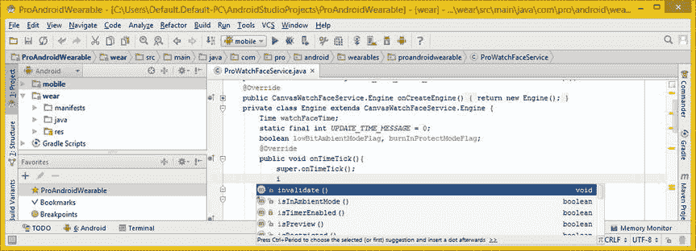

# 九、实现表盘引擎：核心表盘 API 方法

既然已经为 WatchFace 应用准备好了 Canvas SurfaceHolder、WatchFaceStyle、TimeZone、TimeUnit、Time 和 BroadcastReceiver 对象，就可以开始学习实现 WatchFaces API 的高级核心方法。

本章将深入探讨 CanvasWatchFacesService 和 CanvasWatchFacesService 的超类。ProWatchFaceService 类和 Engine 类所基于的引擎。了解一下 **WatchFaceService** 和 **WatchFaceService 很重要。Engine** 类，因为它们包含正确实现 WatchFaces API 所需的方法、属性和常量。

WatchFaceService 类包含您将在 Watch Face 应用中使用的常量，以及 WatchFaceService。引擎嵌套类包含 14 个方法，其中一半以上将在私有引擎类内的 **ProWatchFaceService** 公共类中实现。

本章的大部分讨论将集中在这些方法上，这些方法需要在核心 Watch Faces API 引擎功能的私有引擎类中实现。首先，我将解释如何使用 Android **处理程序**类在交互模式**下每秒更新一次手表表面时间。**然后我来解释安卓**消息**和**系统**。在本章中，你将会学到大量的 Android 类和方法，所以让我们开始实现核心的 WatchFaces API 方法。

WatchFace 秒时间引擎:使用处理程序

在我进入核心的 WatchFaceService 之前。引擎方法，还有一些与秒针时间动画相关的对象和方法需要你去实现。

在 Android 中，每秒更新一次秒针的方法是使用一个 Handler 对象。出于这个原因，我将给你一个 Android Handler 类的概述，然后你将创建一个**updateTimeHandler**Handler 对象和一个**。handleMessage( )** 实现表盘秒针时间更新编程逻辑的方法结构。

Android 的 Handler 类:处理时间更新消息

Android Handler 类是一个扩展 java.lang.Object 的公共类，这意味着它是临时编写的，用于实现 Android 操作系统的线程和消息处理。处理程序类的类层次结构如下所示:

```java
java.lang.Object
  > android.os.Handler
```

这个处理程序类有四个已知的直接子类:HttpAuthHandler、AsyncQueryHandler、AsyncQueryHandler。WorkerHandler 和 SslErrorHandler。

Handler 类(object)将允许您发送和处理与应用线程及其**消息队列**相关联的**消息**或**可运行**对象。您将使用一个消息对象来实现 updateTimeHandler 处理程序对象及其**。handleMessage( )** 方法。

每个处理程序对象实例将与一个单独的线程和该线程对象的 MessageQueue 对象相关联。当您创建新的 Handler 对象时，它被“绑定”到一个 Thread 对象和 MessageQueue 对象，这两个对象属于创建 Handler 对象的 Thread 对象。一旦构造了处理程序，该处理程序对象将为 MessageQueue 对象传递消息(和 runnables ),并在它们离开 MessageQueue 时对它们进行处理。

Handler 对象有两个主要用途:调度要处理的消息或要在未来某个时间执行的 runnables，以及将需要在应用主线程之外的线程上执行的操作排队。在本章的下一节，您将在 Watch Faces API 实现中使用前者。调度消息是使用. post(Runnable)方法完成的。postAtTime(Runnable，long)方法。postDelayed(Runnable，long)方法。senemptymessage(int)方法，。sendMessage(消息)，。sendMessageAtTime(Message，long)方法或 sendMessageDelayed(Message，long)方法。

这里您将使用**。sendmentymessage()**方法在**中调用。updateTimer( )** 方法，您将在实现 Handler 对象后编写该方法。

这些方法的 **post** 版本将允许您在 MessageQueue 对象收到可运行对象后对其进行排队，而这些方法的 **sendMessage** 版本允许开发人员对包含数据绑定对象的消息进行排队，这些数据绑定对象可以由处理程序对象的 **handleMessage(Message)** 方法进行处理，您需要在处理程序对象中实现这些方法。你将在这一章的下一节做那件事。

当向一个**处理程序**对象提交或发送时，您可以允许在 MessageQueue 对象准备就绪时立即处理该项，或者您可以指定一个延迟(在它被处理之前)或它被处理的绝对时间。这里您将使用前者，但是后两者将允许您实现超时、滴答或其他基于时间的行为。

当为 WatchFaces 应用创建一个进程时，**主线程**专用于托管这个 MessageQueue 对象。该对象管理“顶级”应用对象(Activity、BroadcastReceiver、Service)以及它们可能需要创建的任何显示窗口。

您可以创建自己的线程，并使用处理程序与主应用线程进行通信。在本章的例子中，您将创建一个 **updateTimeHandler** 。这是通过调用与以前相同的 post 或 sendMessage 方法来完成的，但是是从一个新的线程中。然后，消息(或 Runnable)将被调度到您的处理程序对象的 MessageQueue 对象中，并在使用消息对象请求时进行处理，至少在本章示例的实现中是这样。

Handler 类有一个嵌套类，名为 Handler 的**公共静态接口**。android.os 包中的回调。这个嵌套类提供了处理程序回调接口，您将在实例化处理程序时使用该接口，以避免必须实现您自己的自定义处理程序子类。这个嵌套类有一个方法，**。handle Message(Message Message)**，您将在 Java 代码中使用它来编写 updateTimeHandler 对象。

Handler 类有四个重载的公共构造函数方法，您将在本章的 Watch Faces API 实现中使用它们。您将使用的最简单的方法如下所示，包括 Java new 关键字:

```java
final Handler updateTimeHandler = new Handler( ) { Message Handling code will go in here }
```

如果你构造了处理程序。回调对象，可以使用以下构造函数方法格式:

```java
Handler(Handler.Callback callback)
```

您还可以使用以下处理程序构造函数方法格式提供您自己的自定义消息 Looper 对象:

```java
Handler(Looper looper)
```

Watch Faces API 实现不需要自定义 Looper 对象，它允许您为自定义线程创建 MessageQueue，因此我不会在本书中深入讨论这一点。也就是说，为了完整起见，我将在这里详细介绍处理程序构造函数方法。

第四个也是最后一个构造函数方法提供消息 Looper 对象并接受一个处理程序。回调对象中的同一个构造函数方法调用，如下面的代码所示:

```java
Handler(Looper looper, Handler.Callback callback)
```

Handler 类支持 30 种方法，我显然不能在这里详细介绍，所以我将在本章下一节的代码中介绍三种方法。如果您想详细研究所有 30 个，可以访问下面的开发人员网站 URL:

```java
http://developer.android.com/reference/android/os/Handler.html
```

您将在 updateTimeHandler 对象中实现的处理消息的主要方法是，您猜对了，**。handleMessage( )** 方法。这个**公共 void handle Message(Message msg)**方法将采用。handle Message(Message yourmessagename here)通用格式。该方法被添加到 API Level 1 中，因为它是 Android 操作系统的核心特性和功能。

您将使用另外两个 Handler 类方法从 updateTimeHandler 对象的“外部”与 Handler 对象对话，并在不再需要消息对象时将其从 MessageQueue 对象中删除。

**public final boolean senemptymessage(int what)**发送一个带有 **what** 数据值的空消息对象。这个方法也被添加到 API Level 1 中，如果一个消息对象被成功地放置到 MessageQueue 对象中，它将返回一个 **true** 值。正如您可能已经猜到的那样，如果失败，它将返回假值。

另一方面，**public final void remove messages(int what)**方法将删除任何和所有对消息对象的 what 属性使用整数代码的消息对象的未决调度。在 watch faces 应用的情况下，这将是零，它当前位于 MessageQueue 对象内部。接下来让我们看一下 Android Message 类，这样您将对将要使用的所有对象类型有一个总体的了解。

Android 的消息类:创建时间更新消息

Android **Message** 是一个 **public final** 类，它扩展了 java.lang.Object master 类，这意味着它是临时编写的，用于保存 Android 操作系统使用的消息对象。类的层次结构如下所示:

```java
java.lang.Object
  > android.os.Message
```

Message 类允许您创建、定义和实例化 Message 对象，该对象将包含您的消息描述以及任何需要发送到 Handler 对象的任意数据。在本例中，这将是您的 updateTimeHandler。

消息对象包含两个额外的 **int** 字段和一个**额外的对象**字段，允许您在大多数使用中避免使用任何额外的内存分配。鉴于消息类的构造函数方法是公共的，正如 Java 编程语言所要求的，创建消息对象的最佳代码是调用 Message.obtain()，或者在这里的示例中，调用**handler . sendemptymessage()**方法。这将从“回收的”消息对象的“池”中提取消息对象。

消息对象有许多数据字段。它们提供了属性、特性或数据字段(选择一个最适合您使用的术语)，您可以用它们来描述消息对象的内容，包括 arg1、arg2、obj、replyTo、sendingUid 和 what。这里您将使用 **what** 属性来发送消息对象中的**更新时间消息代码**。

如果只需要存储几个整数值， **public int arg1** 属性是使用 **Message.setData( )** 方法的“低开销”替代方法。一个 **public int arg2** 也用于提供两个整数数据值。

**公共对象 obj** 给你一个任意的对象作为消息对象的一部分，这样你就可以发送一个对象给消息对象的接收者。**公共信使 replyTo** 为你提供了一个(可选的)信使对象。Messenger 对象是另一种类型的对象，它允许实现基于消息的进程间通信。这允许在一个进程中创建指向(引用)处理程序的信使对象，并允许该处理程序跨另一个进程处理信使对象。

**public int sendingUid** 为您提供了一个可选字段，指示首先发送消息对象的 Uid(用户标识)。 **public int what** 用于提供开发者定义的消息代码。您将在代码中使用它来允许接收者(Handler 对象)能够识别消息是关于什么的，在本例中，观察面部计时。

Android Message 类有一个公共构造函数方法， **Message( )** 构造函数；但是，获取消息对象的首选方式是调用 Message.obtain()或 Message.sendMessage()方法调用之一，这将为您构造消息对象。

这个 Message 类有将近 24 个公共方法，在这里的 watch faces 开发中，您不会用到其中的任何一个，但是如果您有兴趣了解关于这些方法的更多信息，可以在开发人员的网站上找到详细信息:

```java
http://developer.android.com/reference/android/os/Message.html
```

创建秒针计时器:更新时间处理器

我们通过键入 Java 关键字 **final** 和类名(对象名) **Handler** 并在弹出的帮助器对话框中选择 **Handler (android.os)** 选项来创建最终的**updateTimeHandler**Handler 对象，如图图 9-1 所示。注意还有一个 java.util.logging.Handler 类，这就是我使用这个工作流程的原因，所以一定要选择正确的处理程序。


图 9-1 。使用弹出的帮助器对话框添加最终的处理程序对象声明，以找到 android.os 处理程序

一旦双击 **android.os.Handler** 类将其插入，您就已经将 Handler 对象声明为 final。这确保了它只被分配(到内存)一次，因此在应用运行期间，它被固定在系统内存的相同内存位置。

接下来，您将使用 Java new 关键字和 Handler()构造函数方法调用来完成名为 **updateTimeHandler、**的 Handler 对象。产生的空处理程序对象结构应该类似于下面的 Java 代码:

```java
final Handler updateTimeHandler = new Handler( ) { // An Empty Handler Object Structure };
```

正如你在图 9-2 中看到的，updateTimeHandler 对象的代码是无错的，你已经准备好编写**公共 void 了。handleMessage( )** 方法。此消息处理方法是在最终的 updateTimeHandler 处理程序对象的大括号内创建的，该对象实现了 updateTimeHandler 处理程序对象的消息对象处理功能。如前所述，这是实现所需的方法。一旦这样做了，处理程序对象就是“可行的”,其他方法可以从它调用。


图 9-2 。使用 Java new 关键字和 Handler()构造函数方法创建一个空的 updateTimeHandler

在 updateTimeHandler 对象内部，您将添加一个**@ Override public void****handle Message(Message)**方法结构，在弹出窗口中选择 **android.os.Message** 选项，如图图 9-3 所示，使用下面的 Java 代码:

```java
@Override
public void handleMethod(Message updateTimeMessage) { // Message object evaluation goes in here }
```


图 9-3 。编写一个公共的 void handleMessage(Message)方法，使用弹出菜单选择 android.os 消息

一旦你创造了空的。handleMessage()方法结构，如图图 9-4 所示，您将需要创建一些 Java 代码来评估名为 updateTimeMessage 的消息对象。这个消息对象将被自动传递到。每当 handleMessage()方法引用处理程序对象时。sendEmptyMessage()方法调用。这种引用的一个例子可以在下面这行 Java 代码中看到:

```java
updateTimeHandler.sendEmptyMessage(UPDATE_TIME_MESSAGE); // Send TimeZone Update Message to Handler
```


图 9-4 。带有 handleMessage()处理结构的(空)updateTimeHandler 处理程序对象现在已经就绪

实际上，在本章的后面，您将会创建这一行代码。

这个过程的下一步是评估传递到。handleMessage()方法使用一个 Java **开关**评估结构。这个结构将为每个消息对象的**什么**属性提供 case 语句。

消息对象使用 Java 点标记法可以引用什么属性或特性。对于 updateTimeMessage 消息对象，这将类似于 **updateTimeMessage.what** ，并且稍后将在 switch()语句的评估参数区域中引用，使用以下 Java 结构:

```java
switch(updateTimeMessage.what) { your case statements evaluating what attributes will go in here }
```

正如您在图 9-5 中所看到的，一旦您在评估参数区域中键入 switch()语句和 updateTimeMessage 消息对象，并按下句点键，您将看到一个弹出的帮助器对话框，其中包含您在本章上一节中了解到的属性。双击 what 属性，将其添加到交换机中。


图 9-5 。添加一个 Java switch 语句来计算 updateTimeMessage 对象的 what 属性

接下来您需要做的事情是在私有引擎类的顶部创建一个更新时间消息的 **what** 属性整数数据常量，这样您就可以在添加 case 评估语句之前准备好它。用于定义常数的 Java 关键字是 **static** 和 **final** ，因此您的 Java 编程语句声明了一个设置为初始**零**数据值并命名为 **UPDATE_TIME_MESSAGE** 的**整数**常数，如下所示:

```java
static final int UPDATE_TIME_MESSAGE = 0;
```

创建一个评估 what 属性的 Java switch 语句，从 **updateTimeMessage 对象**中调用，并在 UPDATE_TIME_MESSAGE 常量事例评估器中调用 invalidate()方法，然后中断 switch 语句。

```java
switch(updateTimeMessage.what) {
    case UPDATE_TIME_MESSAGE:
        invalidate( );
        break;
}
```

正如你在图 9-6 中看到的，你的 Java 代码现在没有错误，你已经准备好实现更多高级功能，当智能手表进入环境模式时，这些功能就会发挥作用。


图 9-6 。声明一个 UPDATE_TIME_MESSAGE 整数有价值，并为其添加 switch case 语句

现在是时候在 onDraw()方法体中使用 watchface Canvas 对象了。你会叫一个**。drawColor(int color)** 方法关闭此对象将画布的颜色设置为黑色。当然，这优化了表盘设计的功耗！你在第六章学得不错！

观看面孔时间计算:使用系统时间

您将制作的下一个 Java 代码构造将查看表盘模式(可见或开或关，以及环境与交互)，然后您将确定如果表盘可见并处于交互模式，是否需要 updateTimeHandler 来间接更新表盘设计。如果需要 updateTimeHandler，将以毫秒为单位的系统时间将用于计算下一整秒(相当于 1，000 毫秒的精确值)，并以。onDraw()方法，你将在第十章中编写这个方法。

Java 系统类:以毫秒为单位的访问时间

Java**public final System**class 扩展了 java.lang.Object master class，并提供对系统相关信息和资源的访问，包括您将使用的系统时间函数，以及标准系统 IO(输入和输出)。系统类层次结构如下所示:

```java
java.lang.Object
  > java.lang.System
```

该类中的所有方法都是以静态方式访问的，并且该类本身不能被实例化。所以不能有任何系统对象，但是会通过使用 System.methodCallName()方法引用系统函数。因此，要使用毫秒来引用系统时间，您的方法调用结构应该类似于下面的 Java 代码，您将在本章的下一节中使用它:

```java
System.currentTimeMillis( )
```

接下来，让我们使用自定义的 **isTimerEnabled( )** 方法编写代码，确定何时需要为您的表盘计算秒针或秒值。这样做之后，您可以实现这个方法来告诉您何时需要在 Handler 对象的 handleMessage( ) switch 语句的 Java 编程结构中计算秒针计时。

手表表面秒:计算秒针运动

您需要做的第一件事是创建一个方法，如果手表表面当前可见并且没有使用环境模式(这意味着它处于交互模式并且被用户查看),该方法将返回一个 true 值。在 updateTimeHandler 对象下添加一行代码，声明一个**私有布尔** **isTimerEnabled( )** 方法，如图图 9-7 所示。在方法体内，键入 Java **return** 关键字，然后单词**就是**，然后双击 **isVisible( )** method 选项，当它出现在 IntelliJ 弹出的方法选择器帮助器对话框中时，将其插入到您的代码中。


图 9-7 。通过键入 is，然后选择 isVisible()，创建带有 return 语句的私有布尔 isTimerEnabled()方法

接下来，输入 Java 逻辑 AND 运算符(&&)和 Java 逻辑 NOT(！)运算符，然后键入单词 is。这将弹出一个 IntelliJ 弹出方法帮助器对话框，您可以在其中选择一个**isinembientmode()**方法 选项，如图 9-8 中蓝色部分所示。接下来，双击该方法将其插入到代码中，并添加分号以完成 return 语句。你的代码应该没有错误，如图 9-9 所示。


图 9-8 。键入 Java 的&和&逻辑运算符 AND，and the not！符号，并且是，则选择 isInAmbientMode()

现在，您可以在条件 if()结构中调用这个 isTimerEnabled()方法，以确定智能手表是否在交互模式下运行。如果此方法返回一个 true 值，您可以将系统时间计算到最接近的整秒(精确到 1，000 毫秒)值，当秒正好出现在系统时钟中时，移动秒针。

在 UPDATE_TIME_MESSAGE 的 case 语句的 switch 构造中，在 invalidate()方法调用之后和 Java break 关键字之前添加一行代码。您需要首先将空的条件 if()语句放置到位，然后创建完整的第二个计时逻辑。

评估是否需要计算第二个计时的空条件 if()语句应类似于以下 Java 代码:

```java
If( isTimerEnabled( ) ) { Your Whole Second Timer Programming Logic Will Go In Here }
```

正如你在图 9-9 中看到的，你的代码是没有错误的，你已经准备好添加条件 if()语句来计算系统时间到最接近的整秒值，这将触发秒针在用户的表盘设计上再滴答一次。


图 9-9 。在 invalidate()之后和 break 关键字之前添加 if(isTimerEnabled( )){ }求值构造

对于这个最接近的整秒时间计算，您需要做的第一件事是使用 System.currentTimeMillis()方法调用获得系统时间，并将其赋给一个 long 变量，您将把它命名为 **msTime** 。

在条件 if()语句体中，声明一个 **long msTime** 变量，然后键入**等于** (=)运算符和**系统**类名。然后按**句号**键，弹出 IntelliJ 弹出方法帮助器对话框，如图图 9-10 所示。双击**current time millis()**method 选项，并将其插入到 Java 代码中，以完成声明、命名和设置该 msTime 变量的值的语句。


图 9-10 。通过键入 equals、System 和 period 声明一个名为 msTime 的长变量。然后选择 currentTimeMillis()

接下来，您需要计算一个**延迟值**，它代表当前系统时间和下一个 1000 毫秒值之间的毫秒数。这将代表下一个偶数(精确)秒，也就是你希望表盘设计中的秒针前进到表盘上的下一个刻度线的精确时间值。

如图 9-11 中的所示，您需要添加另一个名为 **msDelay** 的 **long** 变量，它将保存计算出的延迟值。这将表示直到下一个偶数毫秒发生之前的毫秒数。


图 9-11 。声明一个名为 msDelay 的长整型变量，然后键入= WATCH，select WATCH_FACE_UPDATE_RATE

键入 Java long 变量类型和 msDelay 变量名称，以及 equals 运算符和 WATCH_FACE_UPDATE_RATE 的前几个字母，这是在图 9-11 顶部看到的变量，它保存了每秒 1000 毫秒的时间分辨率值。

找到 **WATCH_FACE_UPDATE_RATE** 选项，IntelliJ 很可能将它放在列表的顶部，双击它将其插入到 Java 代码中。现在你所要做的就是找到当前时间和下一个完整秒之间的“delta”或毫秒差，你就完成了。

找到 delta 或时间延迟值的关键在于 Java **模**操作符。为了计算在调用下一个完整的秒针前进之前等待的 msDelay 时间，取 1，000 毫秒的 WATCH_FACE_UPDATE_RATE，并减去当前毫秒时间值和 1，000 毫秒时间分辨率的模(计算剩余或增量时间值),这将给出下一个完整秒之前的毫秒数。这可以使用下面的 Java 代码来完成，如图图 9-12 所示:

```java
long msDelay = WATCH_FACE_UPDATE_RATE - ( msTime % WATCH_FACE_UPDATE_RATE );
```


图 9-12 。使用 ms time modulo % WATCH _ FACE _ UPDATE _ RATE 计算下一整秒的偏移量

如您所见，代码现在已经完成并且没有错误，您已经准备好开始实现 **WatchFaceService** 类和 **WatchFaceService 的核心方法了。发动机**级。我将概述这个类及其嵌套的 Engine 类，然后您将实现其中的一些方法。

WatchFaces API:要实现的核心方法

这一节将介绍 WatchFaceService 和 WatchFaceService 中的核心 WatchFaces API 方法。引擎类。

Android WatchFaceService 类:核心常量

一个**公共抽象 WatchFaceService** 类扩展了一个 **WallpaperService** 类，后者扩展了一个 Service 类，后者扩展了一个 ContextWrapper 类，后者扩展了一个 Context 类，后者扩展了一个 java.lang.Object 类。两个已知的直接子类包括您将使用的 CanvasWatchFaceService 和 Gles2WatchFaceService。此类的层次结构如下所示:

```java
java.lang.Object
  > android.content.Context
    > android.content.ContextWrapper
      > android.app.Service
        > android.service.wallpaper.WallpaperService
          > android.support.wearable.watchface.WatchFaceService
```

WatchFaceService 和 WatchFaceService。我接下来将介绍的 Engine 是 WallpaperService 和 WallpaperService 的子类。分别是发动机。如果你想为可穿戴设备创建手表脸，你可以使用它来代替更普通的壁纸服务，你可以将它用于智能手机、平板电脑、电子阅读器和 iTV 电视机的壁纸应用。

WatchFaceService 对象，就像一个 WallpaperService，必须实现一个重要的方法 onCreateEngine()，你在第七章中实现了这个方法。正如你在第七章中所做的，这里你还必须创建(内部类)**私有类引擎**，扩展任一 WatchFaceService。Engine 或其已知的直接子类之一。

这个类还提供了“唤醒锁”，它将被保持，这样设备不会进入睡眠状态，直到一个表盘完成绘制。这是为了在智能手表处于环境模式时更新表盘。

这个类有一个名为 WatchFaceService 的嵌套类。引擎，这是 Watch Faces API 的实际实现。我将在接下来讨论这个问题。

这个类有五个常量，用于控制 watchface 设计中断(显示哪些通知)和硬件功能，如屏幕老化保护和低位(省电)环境模式。其中两个常量是字符串值，三个是整数值:

*   **INTERRUPTION_FILTER_ALL** 整数常量通过调用。getInterruptionFilter()方法。它也可以作为参数在。onInterruptionFilterChanged(int)方法，您将实现该方法。
*   **中断 _ 过滤 _ 无**整数常量通过调用。getInterruptionFilter()方法。它也可以作为参数在。onInterruptionFilterChanged(int)方法，您将实现该方法。
*   通过调用. getInterruptionFilter()方法返回整数常量**。它也可以作为参数在。onInterruptionFilterChanged(int)方法，您将实现该方法。**
*   **PROPERTY _ BURN _ IN _ PROTECTION**字符串常量会将一个 Bundle 对象传递给。onPropertiesChanged(Bundle)表示智能手表硬件是否支持老化保护。
*   **PROPERTY_LOW_BIT_AMBIENT** 字符串常量会将一个 Bundle 对象传递给。onPropertiesChanged(Bundle)指示是否有硬件设备支持低位环境模式的实现。

接下来，让我们在您的 Watch Face 应用中实现可以保存这些常量的变量。之后，我将介绍 WatchFaceService。引擎嵌套类，并且可以实现基于 Watch Faces API 的应用所需的核心方法。之后就可以重点在表盘表面绘制你的表盘设计了，这个我在第十章中有涉及，以及如何绘制表盘元素 ShapeDrawable 对象。

添加 WatchFaceService 常量:老化和低位

因为你想支持老化保护和低位环境模式，而且由于 WatchFaces API 目前没有这方面的方法(比如。isInAmbientMode()方法)，您已经在自定义的 isTimerEnabled()方法中使用了它，让我们添加布尔变量来保存这些标志。

您可以通过使用一个**复合**声明语句来声明这两个布尔标志变量，因为您没有特别设置任何默认值。需要注意的是，如果不声明任何布尔值，Java 对任何布尔变量的默认初始化值都将是 **false** 。

让我们为这些布尔标志提供逻辑名称，以表示它们做什么:让我们将它们命名为 **lowBitAmbientModeFlag** 和**burinprotectmodeflag**。您的 Java 复合语句应该如下所示，没有错误，并在图 9-13 的下半部分高亮显示:

```java
boolean lowBitAmbientModeFlag, burnInProtectModeFlag;
```


图 9-13 。在引擎类中为 lowBitAmbientModeFlag 和 burnInProtectModeFlag 添加布尔变量

是时候从 WatchFaceService 实现几个最重要的 Watch Faces API 方法了。引擎嵌套类。您将添加**。onDestroy( )** ，它在 CanvasWatchFaceService 中。引擎类，因为它需要“破坏”(从内存中删除)您的画布和任何相关的。onDraw()组件也在系统内存中。

来自 WatchFaceService。引擎类，我们来实现四个方法:**。onTimeTick( )** ，**。onVisibilityChanged( )** ，**。onAmbientModeChanged( )** 和**。getInterruptionFilter( )** 。记住，你已经实现了**。onCreate( )** ，尽管稍后在学习图形和。你的表盘设计的 onDraw()部分，我将在第十章中详细介绍。

Android WatchFaceService。引擎类:核心方法

Android 的 WatchFaceService 服务。Engine 类是一个**公共抽象**类，它扩展了 WallpaperService。引擎类，这意味着谷歌 Android 开发者主要通过使用 Wallpaper API 创建了一个 Watch Faces API。

这个类表示 Watch Faces API 的核心 Java 代码实现。您需要实现。onCreateEngine()方法，正如你在第七章中所做的那样(参见图 7-9 )，来返回表脸引擎实现。该类的 Java 类层次结构如下所示:

```java
java.lang.Object
  > android.service.wallpaper.WallpaperService.Engine
    > android.support.wearable.watchface.WatchFaceService.Engine
```

Android WatchFaceService。Engine 类有两个已知的直接子类:一个 **CanvasWatchFaceService。引擎**，您当前正在为 ProWatchFaceService 类使用它，以及 **Gles2WatchFaceService。引擎**，用于实现**OpenGL ES 2.0**WatchFaceService。发动机功能。

该类有一个公共构造函数方法， **WatchFaceService。Engine( )** 和 14 个公共方法，我将在这里与来自 CanvasWatchFaceService 的一个方法一起讨论。Engine (onDestroy())，这样您就知道所有核心的 Watch Faces API 方法能够提供什么了。

你已经创建了**虚空** **。onCreate**(surface holder)方法，用于在手表上创建变量和内存中的对象面服务引擎创建。

**虚空** **。onDestroy( )** 方法 实际上是在 CanvasWatchFaceService 的文档中描述的。Engine 类，在 Android 开发者网站上，但我将把它包含在这里，因为它将在本章中实现。此方法将删除 WatchFaceService。引擎，它还可以从 MessageQueue 对象中移除消息对象。请确保在调用 **super.onDestroy( )** 语句之前完成此操作。三种无效方法的用途是:

*   **虚空** **。当表盘处于**环境模式**时，每分钟调用一次 onTimeTick( )** 方法 来更新表盘的时间(时针和分针)。
*   **虚空** **。确定硬件设备的属性时，调用 onPropertiesChanged(Bundle properties)**方法 。此方法将用于设置您在上一节中创建的低位和老化标志。
*   **虚空** **。onVisibilityChanged(boolean visible)**方法 被调用来通知你表盘变得可见或隐藏。您将使用它来发送一个消息对象，以确保 TimeZone 对象与 Time 对象同步。该逻辑所做的是将 Time 对象设置为 TimeZone 对象值。这确保了时区总是设置正确。

此类中的两个方法与设置影响中的逻辑的属性有关。onDraw()方法。因为我在第十章中介绍了绘制逻辑，所以你将在那一章中实现接下来的两个方法:

*   一个**虚空** **。onAmbientModeChanged(boolean inAmbientMode)**方法 将在用户的硬件设备进入或退出其环境模式时被调用。
*   **虚空** **。当用户改变中断过滤器设置(常量)时，将调用 onInterruptionFilterChanged(int interruption filter)**方法 。

您已经在该类中实现了其中的一些方法，例如。isInAmbientMode()，还有一个方法可以用来修改已经创建好的手表表面样式对象。为了彻底起见，我接下来将介绍这两种方法:

*   **最后一个布尔** **。isinembientmode()**方法会返回你的布尔值，这个布尔值会告诉应用手表的表盘硬件是否处于环境模式。
*   **虚空** **。setWatchFaceStyle(watchface style)watchface style)**方法 将设置 watchface style 属性，以便您可以动态更改 UI 设置。

这个类还有三个 getter 方法，允许开发人员确定中断过滤器、Peek 卡定位和未读 Peek 卡计数的当前状态(设置):

*   **最终 int** **。getInterruptionFilter( )** 方法 返回用户选择的当前生效的中断过滤器常量。
*   **期末考试** **。getPeekCardPosition( )** 方法 使用 Rect 对象返回第一张正在看的卡片的屏幕位置 X 和 Y 坐标。
*   一个**最终 int** **。getUnreadCount( )** 方法

还有另外三个。on()方法 ，这些方法不会被实现，但是为了完整起见，我将在这里提到它们:

*   捆绑**。onCommand(String action，int x，int y，int z，Bundle extras，boolean resultRequested)** 实现 Android 的动态壁纸功能，用于拦截来自表盘设计表面的触摸事件。
*   **虚空。onPeekCardPositionUpdate(Rect Rect)**每当第一张 Peek 卡在表盘屏幕上定位时，调用方法，使用 Rect 对象给出其位置。
*   **虚空。onUnreadCountChanged(int count)**方法在“待读队列”中未读通知卡的数量发生变化时调用。

我将在这一章的剩余部分讨论尚未添加的核心 watch face 方法，这样您就可以在。onDraw()方法。

正在添加 WatchFaceService。引擎方法:核心函数

在本章的其余部分，我将讨论与时间和内存优化有关的其他核心表面方法。它们允许您检测表盘是否可见，以及用户当前使用的智能手表设备硬件配置可用的省电和屏幕老化保护模式。

一旦所有这些核心的表盘创建、样式、定时和广播接收器对象和方法都在您的代码中就位，您就可以专注于如何绘制您的表盘设计，这将在第十章中介绍。

在环境模式下显示时间。onTimeTick()方法

实现最简单的核心方法是**void**??。onTimeTick( ) 方法，所以让我们从它开始，并将其添加到私有引擎类的顶部。

添加 Java **@Override** 关键字，表示将要覆盖超类方法，并键入 **public void onTimeTick( )** 。在方法体内部，使用一个 Java **超级**关键字来传递**。对 CanvasWatchFaceService 的 onTimeTick( )** 方法调用。引擎超类。如图 9-14 所示，基本方法体的代码应该如下所示:

```java
@Override
public void onTimeTick( ) {
    super.onTimeTick( );
}
```


图 9-14 。添加公共 void onTimeTick()方法；在其中，使用 Java super 关键字调用父方法

使用弹出的帮助器对话框，如图 9-14 所示，选择方法调用。

您还需要在这个方法中使用。invalidate()方法调用，让 Android 知道更新表盘上的时间。确保将其放在 super.onTimeTick()超类方法调用之后。这就是超类需要为。onTimeTick()方法是在调用此方法之前处理的。invalidate()方法调用。那个。onTimeTick()方法结构应该类似于下面的代码，可以在图 9-15 和图 9-16 中看到:

```java
@Override
public void onTimeTick( ) {
    super.onTimeTick( );
    invalidate( );
}
```



图 9-15 。添加一个。调用 super.onTimeTick()后，invalidate()方法调用来更新观察面

如果你想让 IntelliJ 为你写代码，你可以简单地输入“I”并从弹出的帮助器方法对话框中选择 invalidate()方法或者你可以双击你想让 IntelliJ 为你写的方法，如图图 9-15 所示。

接下来让我们编写另一个相对简单的方法。onDestroy()方法。

从内存中移除表盘。onDestroy()方法

在。onTimeTick()方法，再次表明您将要覆盖超类方法，并键入 **public void onDestroy( )** 。在方法体内部，使用一个 Java **超级**关键字来传递这个**。onDestroy( )** 到 CanvasWatchFaceService。引擎超类。如果您还没有在 watchface 应用中实现 updateTimeZoneReceiver 函数，那么这就是您需要做的全部工作。

基本的代码。因此，onDestroy()方法体将类似于下面的 Java 方法结构:

```java
@Override
public void onDestroy( ) {
    super.onDestroy( );
}
```

因为您使用的是 BroadcastReceiver 对象，所以需要使用**从 MessageQueue 对象中移除 Message 对象。removeMessages( )** 方法调用。这需要在调用 super.onDestroy()方法之前**完成，否则这将永远不会发生，因为 WatchFaceService。引擎对象将不再存在，消息对象仍将在队列中。**

所以添加**@ Override public void on destroy(){ }**空方法结构，然后添加对 updateTimeHandler 对象的引用。接下来，按句点键，启动弹出的帮助器对话框，选择 **removeMessages(int what)** 选项，如图图 9-16 所示。


图 9-16 。添加公共 void onDestroy()方法；在其中，使用 updatetimehandler . remove messages()方法

在得到的**UPDATE TIME handler . remove messages()**方法调用的参数区内，键入 **UPDATE_TIME_MESSAGE** 消息对象常量，或者键入“U”，从弹出的帮助器对话框列表中选择。然后可以添加**super . on destroy()；** Java 代码语句，你就完事了！

那个。onDestroy()方法结构，在图 9-17 中显示为无错误，在您完成后应该看起来像下面的 Java 代码结构:

```java
@Override
public void onDestroy( ) {
    updateTimeHandler.removeMessages(UPDATE_TIME_MESSAGE);
    super.onDestroy( );
}
```


图 9-17 。使用 removeMessages()从 MessageQueue 中删除消息对象后，调用 super.onDestroy()

接下来，您将实现**。onPropertiesChanged( )** 方法，它只有 6 行代码，比前两个方法稍微复杂一些。

确定低位和老化模式:。onPropertiesChanged()

你需要做的下一件事是实现一个**。onPropertiesChanged( )** 方法 ，使用 Java **@Override** 关键字。这可以在图 9-18 的底部看到，它产生了下面的空 Java 方法结构:

```java
@Override
public void onPropertiesChanged(Bundle properties){ // The method implementation will go in here }
```


图 9-18 。创建一个空的@ Override public void on properties changed(Bundle properties)方法结构

该方法使用名为**属性**的 Android **Bundle** 对象，将一组智能手表属性传递给该方法进行处理。如你所见，在图 9-18 的底部，Bundle 类很可能需要被导入，所以在空方法中点击鼠标，使用 Alt+Enter 工作进程，让 IntelliJ 为你编写**import Android . OS . Bundle**import 语句。现在，您已经准备好编写方法体了。

在里面。在 PropertiesChanged()方法上，键入 Java **super** 关键字和一个**句点**，然后在弹出的帮助器对话框中选择**onproperties changed(Bundle properties)**选项，双击将其插入到 Java 语句中，如图 9-19 底部所示。


图 9-19 。键入 Java super 关键字，并选择 onPropertiesChanged(Bundle properties)选项

这将把名为 properties 的 Bundle 对象传递给超类，并且您将准备好在您在私有(内部)引擎类的顶部声明的低位和老化布尔变量中设置包含在 Bundle 对象中的属性。

在`super.onPropertiesChanged(properties);` Java 编程语句下，键入 **lowBitAmbientModeFlag** 布尔变量名、等号，然后是 properties Bundle 对象，您将使用它来调用方法调用。在 properties 之后，按下句点键以弹出方法帮助器对话框。

当弹出的方法帮助器对话框出现时，选择 **getBoolean(String key，boolean defaultValue)** 选项，或者双击它，这将插入。getBoolean()方法调用结构到你正在编码的 Java 语句中，如图图 9-20 所示。一旦使用完 IntelliJ 弹出助手对话框，Java 语句将如下所示:

```java
lowBitAmbientModeFlag = properties.getBoolean(PROPERTY_LOW_BIT_AMBIENT);
```


图 9-20 。键入 lowBitAmbientModeFlag 变量、等号、单词 properties 和句点

在里面。getBoolean()方法参数区，键入 a " **P** ，选择 **PROPERTY_LOW_BIT_AMBIENT** 常量，如图图 9-21 所示，我在本章前面已经讨论过。双击此选项可将 lowBitAmbientModeFlag 变量设置为此 LOW_BIT 常量的值。


图 9-21 。在。参数区获取 Boolean()方法，并选择 PROPERTY_LOW_BIT_AMBIENT

现在，您已经从 properties Bundle 对象中提取了低位环境模式标志设置，并将其设置为 lowBitAmbientModeFlag 变量，您需要对 burnInProtectModeFlag 变量执行完全相同的操作。

在 lowBitAmbientModeFlag Java 编程语句下面，键入**burinprotectmodeflag**布尔变量名、等号，然后是 properties Bundle 对象，您将使用它来调用方法调用。在 properties 之后，按句点键启动弹出的方法助手对话框。

当弹出的方法帮助器对话框出现时，选择 **getBoolean(String key，boolean defaultValue)** 选项，或者双击它，这将插入。getBoolean()方法调用结构到你正在编码的 Java 语句中，如图图 9-20 所示。一旦您使用完 IntelliJ 弹出助手对话框，您的 Java 语句将如下所示:

```java
burnInProtectModeFlag = properties.getBoolean(PROPERTY_BURN_IN_PROTECTION);
```

在里面。getBoolean()方法参数区，键入 a " **P** ，选择**PROPERTY _ BURN _ IN _ PROTECTION**常量，如图图 9-22 所示。双击常量，这会将 burnInProtectModeFlag 变量设置为这个 BURN_IN 常量的值，这样你的应用就知道用户的智能手表是否支持(实际上需要)老化保护。


图 9-22 。键入一个 burnInProtectModeFlag，将其设置为等于 properties . get boolean(BURN _ IN _ PROTECTION)

现在你已经知道用户的智能手表硬件支持什么样的特殊屏幕(显示)模式，接下来你需要实现的最复杂(也是最重要的)方法就是**。onVisibilityChanged( )** 方法。这个方法需要 10 行代码来实现，所以，现在就开始吧！

确定表盘是否可见:。onVisibilityChanged( )

除了。onDestroy()，您将首先使用 Java super 关键字和方法名调用一个超级方法调用，然后实现任何定制的编程逻辑，就像您对前面的方法结构所做的那样。

让我们通过添加 Java **@Override** 关键字和**public void onvisibility changed(boolean visible){ }**空方法结构来实现这一点。在里面输入 Java super 关键字和句点字符，然后选择 onVisibilityChanged(布尔可见)选项，如图图 9-23 所示。基本方法结构应该类似于下面的 Java 代码:

```java
@Override
public void onVisibilityChanged(boolean visible) {
    super.onVisibilityChanged(visible);
}
```


图 9-23 。创建 onVisibilityChanged()方法，键入 Java super 关键字，并调用 onVisibilityChanged()

这个方法的其余部分将由 if-else 条件结构组成，它将告诉手表表面应用在手表表面可见或不可见的情况下做什么。空的 if-else 条件语句如下所示，在图 9-24 中显示为无错误:

```java
public void onVisibilityChanged(boolean visible) {
    super.onVisibilityChanged(visible);
    if(visible) { visible=true statements here } else { visible=false statement here }
}
```


图 9-24 。在 super.onVisibilityChanged()方法后添加一个空的 if(visible){ } else { }条件结构

如果手表表面活跃起来(visible = true ),要做的第一件事是调用**registerTimeZoneReceiver()**方法来检查自手表进入睡眠状态以来时区是否发生了变化。在 if-else 条件构造的一个 **if(visible){ }** 部分，键入“r”字符并从帮助器对话框中选择一个 registerTimeZoneReceiver()选项，如图图 9-25 所示，并将此方法调用插入到条件 if-else 语句中。


图 9-25 。在 if(visible)结构中，键入“r”并选择 registerTimeZoneReceiver()方法调用

接下来您要做的是通过调用**来确保时区在 time 对象中设置正确。clear( )** 方法关闭了 **watchFaceTime** 对象。在参数区内，键入“Ti”，然后从弹出的帮助器对话框中选择一个**时区(java.util)** 类，如图图 9-26 所示。


图 9-26 。调用 watchFaceTime 时间对象的. clear()方法 并选择 TimeZone (java.util)选项

时区后，按下**周期**键，选择 **getDefault( )** 方法 ，如图图 9-27 所示。


图 9-27 。在 TimeZone 对象后键入一个句点，并从弹出帮助器中选择 getDefault( ) TimeZone 方法

双击**后。getDefault( ) TimeZone** 选项在弹出的帮助器对话框中，键入一个**句点**，这将启动另一个弹出的帮助器对话框，在这里可以选择一个 **getID( )** 方法。双击它，这将给出最终的 Java 语句，将时区重新加载到 Time 对象中。最终的 Java 语句，如图 9-28 所示，应该如下所示:

```java
watchFaceTime.clear( TimeZone.getDefault( ).getID( ) );
```

既然已经将当前时区对象加载到时间对象中，接下来需要做的就是使用**。setToNow( )** 方法调用将时间对象设置为当前时间，使用新加载的时区作为时间值应该设置的指导。在图 9-28 中显示没有错误的 Java 代码应该如下所示:

```java
watchFaceTime.setToNow( );
```


图 9-28 。键入 unregisterTimeZoneReceiver()方法的前几个字母，并在弹出窗口中双击它

现在，您只需构建 if-else 条件语句的 else{ }部分。这就是当用户的智能手表处于睡眠状态(表盘不可见)时，您希望表盘应用执行的操作。

就像当手表表面可见(true)时调用. registerTimeZoneReceiver()方法一样，您将类似地调用一个**。unregisterTimeZoneReceiver()**方法当表盘不可见(false)时，如图图 9-28 所示。

在 else{ }结构中键入“u ”,当出现方法帮助器弹出窗口时，选择您在第八章中创建的 unregisterTimeZoneReceiver()方法。双击它，让 IntelliJ 为您编写 Java 语句。你的无错方法现在完成了，如图图 9-29 所示。


图 9-29 。对 if(visibility)和 else{ }部分进行编码且无错误的 onVisibilityChanged()方法

恭喜你！现在，您已经实现了 WatchFaces API 应用的所有非图形部分！你现在已经准备好进入**。onDraw( )** 法！

摘要

在本章中，您学习了如何为您的 **WatchFace 应用**创建核心 Watch Face 服务引擎类方法。还有一些与。onDraw()相关的代码，我将留到下一章，那时你将开始学习矢量图形界面设计。

首先，我讨论了如何使用 Handler 对象和 Message 对象在手表表面实现秒针。您创建了一个 updateTimeHandler，它允许您每秒更新手表上的秒针。

接下来，我讨论了核心的 WatchFaces API 类:WatchFaceService 和 WatchFaceService.Engine。

在下一章中，您将开始向表盘应用添加矢量图形 2D 设计元素，并且您将学习如何仅使用代码创建表盘，因为矢量图形仅使用 SVG 或 Shape 类创建，即仅使用数学或代码。在第十一章中，你将学习如何使用位图图形来设计你的表盘。