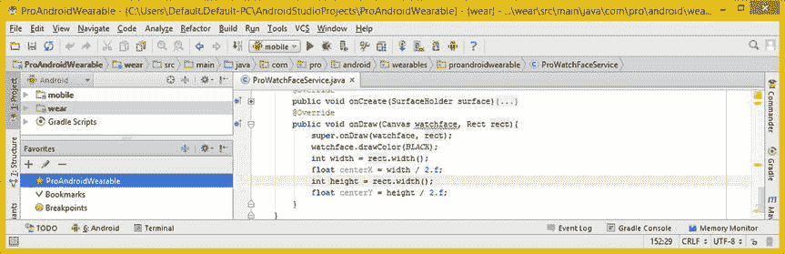
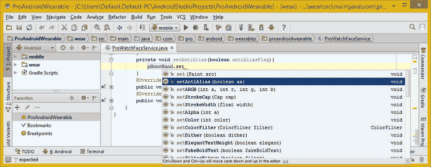
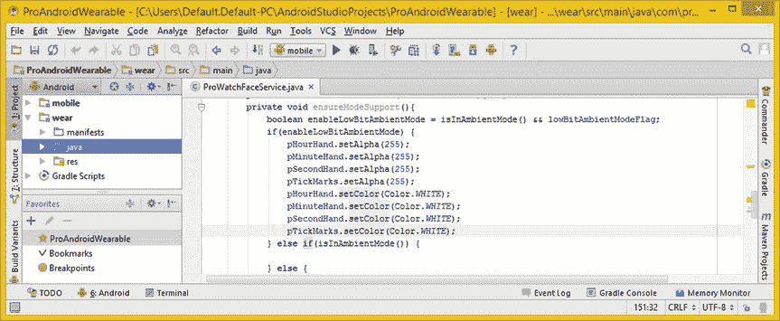
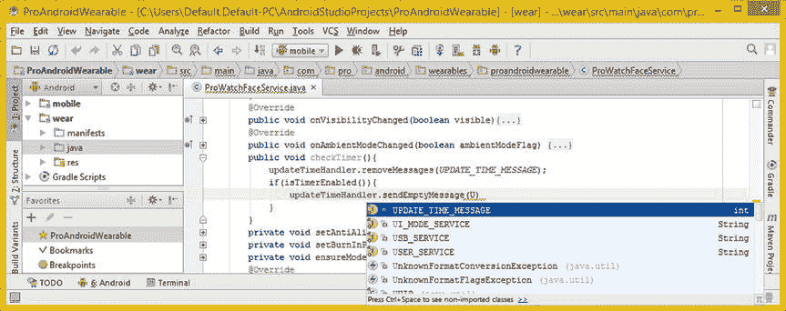

# 十、表盘矢量设计：为表盘使用矢量图形

现在，您已经准备好了大部分 WatchFaces API 基础设施，这些基础设施与您将使用**矢量图形**在其上“绘画”的画布对象没有直接关系，您已经准备好开始实现**。onDraw( )** 方法，学习矢量图形以及实现它们的 Android 类。

本章将深入探讨与画布对象一起使用的 Android 类，主要是 Android **Paint** 类和嵌套类，你可能已经猜到了，因为人们是在画布上绘画的！

您还将了解 Android **Canvas** 类和**。** **drawLine( )** 它包含的方法，你将使用它来绘制你的表盘设计的所有组件。

矢量图形绘制方法，如。drawLine()方法，使用 Paint 类(和 object)将 vector (Shape)对象绘制到画布上。到目前为止，在您的 watch face 实现中，这是保存画布表面对象的 **SurfaceHolder** 对象。

我将用本章的大部分时间讨论 onDraw()方法以及需要实现的方法，以便支持您在第六章中了解到的所有不同模式，如低位环境模式或老化保护模式。一旦这些都准备好了，你就可以完成最后几个 WatchFaceService 了。引擎方法实现。

WatchFace 绘画引擎:使用绘画对象

在我开始编写在画布(屏幕)上绘制基于矢量图形的手表表面设计所需的对象和方法的代码之前，让我们深入了解一下 Android **Paint** 类。

你对手表表面设计组件进行描边、颜色、样式和反锯齿的方式都是使用这个 Android Paint 类及其**六个嵌套的**“助手”**类**中的常量和方法调用来完成的。

出于这个原因，让我们仔细看看 Paint 类，然后，您将创建用向量绘制手表表面的 Java 代码。

Android 的 Paint 类:在画布上绘制矢量形状

**public**Android**Paint**类扩展了 java.lang.Object master 类，并被临时编码以提供 Android 操作系统的所有数字绘画功能。Paint 类的 Java 类层次结构代码如下所示:

```java
java.lang.Object
  > android.graphics.Paint
```

Paint 类有一个已知的直接子类——text Paint 类。一个 Paint 类创建一个 Paint 对象，它包含关于**样式**和**颜色**的信息。这些信息指导 Android 图形引擎绘制矢量**形状**对象，也称为“几何图形”，以及**文本**对象(和**字体**对象)，它甚至指导如何渲染任何 **BitmapDrawable** 对象，我将在第十一章中讨论。

Paint 类有六个嵌套类。在本章中，我将只详细介绍其中的两个，因为您将在示例的 Watch Faces 设计中以及在 Watch Faces 应用的 Java 代码中使用它们。

*   **枚举油漆。Align** 嵌套类允许开发者指定**如何。drawText( )** 方法应该将一个**文本**对象相对于 **X，Y 坐标**对齐。
*   **枚举油漆。Cap** 嵌套类允许开发者指定**描边线条**和路径的开始和结束的处理方式(方端或圆端)。这将允许您定义手表的秒针、分针和时针以及刻度线的外观和感觉。
*   **级油漆。FontMetrics** 嵌套类描述在文本对象的任何给定**浮点**大小属性下**字体**对象实现的**度量**。
*   **级油漆。FontMetricsInt** 嵌套类为希望将 **FontMetrics** 值定义为**整数**的开发人员提供了**方便的方法**。
*   **枚举油漆。Join** 嵌套类允许开发者指定线条或曲线段如何在描边路径上“连接”在一起(直线或曲线连接)。这和油漆差不多。Cap 功能，除了它应用于两条或多条线或路径的**连接**或**交叉点**，而不是线或路径的开放(未连接)端。
*   **枚举油漆。样式**嵌套类指定了如何绘制矢量形状对象，也称为图元。这可以用一个**填充**、一个**冲程**或**填充和冲程**来指定。您将在代码中使用**填充**和**笔画**。

Paint 类指定了十几个常量值，尽管 Android 操作系统不再使用其中的一个。我将在这里提到它们，以便您对这个 Paint 类可以实现的功能有一个大致的了解，因为图形设计是 watch faces 应用设计过程的关键组件之一。

*   **int ANTI_ALIAS_FLAG**
*   **int DEV_KERN_TEXT_FLAG** 现在已经不用了。
*   **int DITHER_FLAG** 是在渲染时启用**抖动的绘画标志。打开抖动可以在 **hicolor** (15 位 32，767 色，或 16 位 65，536 色)或**索引色** (8 位或 256 色)智能手表设备硬件显示屏上模拟真彩色图形(低颜色支持)。**
*   **int EMBEDDED _ BITMAP _ TEXT _ FLAG**是一个绘制标志，当您在表盘上绘制文本对象时，它使您能够使用**位图字体**对象。
*   **int FAKE _ BOLD _ TEXT _ FLAG**是一个 Paint flag，允许开发者将**合成加粗效果**应用到文本对象。这用于不支持(附带)字体加粗组件的自定义字体定义。
*   **int FILTER_BITMAP_FLAG** 如果你想要最高质量的结果，这应该在你的表盘应用中使用。(这将在第十一章中讲述，届时你将学会如何使用 BitmapDrawable。)
*   **int HINTING_OFF** 和**int HINTING _ ON**Paint flag 常量分别禁用或启用字体对象提示选项。字体提示相当于抗锯齿。因此，如果你在一个 Watch Face 应用中渲染字体对象，那么在低位环境模式下关闭 HINTING_OFF！
*   **int LINEAR_TEXT_FLAG** 是一个绘画标志，能够平滑、线性地缩放文本对象及其字体对象。这类似于 BitmapDrawable 对象的过滤，因此您可能想要打开它。
*   **int STRIKE _ THRU _ TEXT _ FLAG**是一个绘画标志，如果文本对象正在使用的字体对象不包括字体-删除线字体定义组件，则该绘画标志将删除线装饰应用于文本对象。
*   **int SUBPIXEL_TEXT_FLAG**
*   **int UNDERLINE _ TEXT _ FLAG**是一个绘画标志，当被启用时，如果文本对象正在使用的字体对象不包括字体-下划线定义组件，则允许将下划线装饰应用于呈现的文本对象。

Paint 类有三个公共构造函数方法，包括默认的 **Paint( )** 构造函数，它使用默认设置创建一个新的 Paint 对象。还有一个“识别标志”的构造函数，它创建新的 Paint 对象，同时设置我刚才提到的那些标志常量。这个构造函数使用格式 **Paint(int flags)** 来创建启用了特定标志常量(特性)的新 Paint。

还有一个“copycat”Paint object 构造函数方法，它使用一种形式的 **Paint(Paint paint)** 来创建一个新的 Paint 对象，并通过使用构造函数方法调用的参数列表区域内指定的 Paint 对象，使用另一个 Paint 对象的属性来初始化它。

Paint 类支持 92 种方法，我显然不能在这里详细介绍，所以我将只介绍那些您将在本章的代码中使用的方法。如果您想详细研究所有 92 种方法，可以访问下面的开发者网站 URL:

```java
http://developer.android.com/reference/android/graphics/Paint.html
```

*   **public void setARGB(int a，int r，int g，int b)** 方法是。setColor()方法。这个。setARGB()方法采用四个色板(或颜色平面)并使用这些数据配置 32 位颜色对象。A 或 alpha 分量支持 256 级(8 位)透明度(不透明度)，R 或红色分量支持 256 级(8 位)红色值，G 或绿色分量支持 256 级(8 位)绿色值，B 或蓝色分量支持 256 级(8 位)蓝色值。
*   **public void setAlpha(int a)** 方法也是一个. setColor( ) helper 方法，但是，它只分配颜色对象的 Alpha 值，RGB 值不变。那个。setAlpha( ) 8 位(整数)值的范围必须从 0 到 255。
*   **public void setAntiAlias(boolean aa)**方法是。setFlags()方法。这个方法允许您设置或清除一个名为 ANTI_ALIAS_FLAG 的 Paint 常量，我前面提到过。true 值会打开抗锯齿，false 值会关闭抗锯齿。
*   **public void set color(int color)**方法设置一个绘制对象的颜色。integer 参数保存一个数值，其中包含 Alpha 和 RGB 数据值。这个 32 位值不是预乘的，这意味着 alpha 可以通过独立设置为任意值。不管 RGB 数据值如何。你可以研究 Android 的颜色类来获得更多的细节。
*   **public void setStrokeCap(油漆。Cap cap)** 方法设置绘制对象的帽样式常量。这可以是**对接**(默认值)、**圆**或**方**。
*   **public void setStrokeWidth(float width)**方法设置线条或路径形状对象的像素宽度。在**发际线模式** 中通过零点来描边。发际线总是独立于画布矩阵绘制单个像素。**宽度**参数设置绘制对象的**笔画宽度**。每当绘制对象的样式设置为 **STROKE** 或 **STROKE_AND_FILL** 时，都会使用该选项。
*   **public void setStyle(Paint。**方法设置绘制对象的样式。这用于控制如何解释矢量形状原始几何图形。drawBitmap 是一个例外，它总是假设填充。

现在您已经了解了基本的 Paint 类方法及其常量，您可以开始在 watch face design 中实现这个类的核心方法和常量，只需要 Java 代码、vector (Shape)对象和 Paint 对象。

表盘绘制:创建表盘绘制对象

您需要做的第一件事是声明那些 Paint 对象，它们将定义表盘组件在屏幕上的外观。基本的表盘部件是刻度和表针。

声明多个绘制对象:使用复合 Java 声明

现在让我们在低位和老化布尔标志变量声明后添加一个画图对象声明，并将四个画图对象命名为**手**、**手**、**手**和**视觉标记**，如图 10-1 底部所示(高亮显示)。单击红色油漆错误消息内的任意位置，并使用 **Alt+Enter** 让 IntelliJ 为您编写`import android.graphics.Paint;`声明。


图 10-1 。为 pHourHand、pMinuteHand、pSecondHand 和 pTickMarks 添加复合 Paint 对象声明

创建 WatchFace 组件方法:配置绘画

接下来要做的是创建四个逻辑方法体来保存 Paint 对象构造(实例化)、配置和编程语句。我以这种方式构建 Java 代码，以防您想要返回并使每个 Paint 对象更加复杂。随着应用变得越来越复杂，更有组织的代码结构将会带来好处，这将允许您使用展开和折叠功能。

您将从顶部(小时)到底部(秒和刻度)工作，并从创建一个**开始。** **createHourHand( )** 方法。Java 代码将如下所示:

```java
public void createHourHand() {  pHourHand = new Paint();  }
```

在复合 Paint 声明下添加一行代码，并键入 public void create hourhand(){ } empty 方法结构。然后，在其中添加一个`pHourHand = new Paint();` Java 对象实例化语句来创建第一个 Paint 对象，您将配置它来绘制时针。正如你在图 10-2 中看到的，你可以从弹出的助手对话框中选择**画图(android.graphics)** 选项，并在它下面看到嵌套的助手类。双击 Paint 类将其插入到代码中。


图 10-2 。创建一个公共的 void createHourHand()方法；实例化一个名为 pHourHand 的新绘制对象

既然已经实例化了名为 pHourHand 的 Paint 对象，就可以开始使用颜色和绘制样式等属性来配置它了。最重要的属性是颜色，所以我们再加上**。** **setARGB( )** 方法调用，将配置时针绘制为完全不透明，并使用全蓝色作为颜色。Java 语句如图 10-3 所示，应该是这样的:

```java
pHourHand.setARGB(255, 0, 0, 255);
```


图 10-3 。使用 IntelliJ 弹出帮助器对话框调用 pHourHand Paint 对象的. setARGB()方法

键入手绘对象，然后键入一个句号。当弹出的助手对话框出现时，选择**。setARGB(int a，int r，int g，int b)** 选项，如图图 10-3 ，将此方法调用插入到 Java 语句中，然后输入 **255，0，0，255** 。

时针的下一个最重要的特征是它有多厚，这是使用**配置的。****【setStrokeWidth()**方法，你将其中的像素设置为 6(6/320 就是屏幕的. 01875 或者 **1.875%** )。如图图 10-4 所示，Java 语句在代码库中应该如下所示:

```java
pHourHand.setStrokeWidth(6.f);
```


图 10-4 。使用 IntelliJ 弹出帮助器对话框调用 pHourHand Paint 对象的. setStrokeWidth()方法

您将 Paint 对象配置为交互式表盘模式的默认对象，然后根据用户的手表型号及其在任何给定时间的行为，检测环境温度、低位和老化。因此，为了获得最佳视觉质量，您将在默认模式下打开的**抗锯齿功能，并使时针的尖端**变圆**。**

完成此任务的 Java 语句如图 10-5 所示，看起来像下面的代码:

```java
pHourHand.setAntiAlias(true);
pHourHand.setStrokeCap(Cap.ROUND);
```


图 10-5 。使用 Cap 调用 pHourHand Paint 对象的. setAntiAlias()方法和. setStrokeCap()方法。一轮

正如你在图 10-5 中看到的，如果你在。调用 setStrokeCap()方法，你将得到该颜料。Cap 此对话框中的嵌套(辅助)类常量。

双击**帽。在弹出的帮助器对话框中选择 ROUND(Android . graphics . paint)**选项，如图图 10-5 所示，完成一个公共 void 的配置代码。createHourhand()方法结构配置一个画图对象。

完了。createHourHand()方法结构如图图 10-6 所示，您将在下面复制并粘贴它来创建其他三个方法，它应该看起来像下面的 Java 方法结构:

```java
public void createHourHand() {
    pHourHand = new Paint();
    pHourHand.setARGB(255, 0, 0, 255);
    pHourHand.setStrokeWidth(6.f);
    pHourHand.setAntiAlias(true);
    pHourHand.setStrokeCap(Cap.ROUND);
}
```


图 10-6 。复制 createHourHand()方法结构；将其粘贴到它的下面，以创建 createMinuteHand()方法

创建分、秒和刻度表盘组件方法

正如你在图 10-6 中看到的，你的 Java 代码现在已经没有错误了，你可以在它下面复制并粘贴一个. createHourHand()方法来创建一个**。createMinuteHand( )** 方法。我在这段之前的 Java 代码清单中用粗体显示了您将要更改的参数。

因为您也将使用圆形的分针，所以您只需要更改六行代码中两行的参数。但是，不要忘记将方法名和绘制对象名从**手动**改为**手动**。改变。setARGB()方法调用，通过将绿色数据参数完全打开(255)，红色和蓝色参数完全关闭(0)，将分针**涂成绿色**，然后使分针 **4 像素宽**而不是 6 像素宽( **4/320** 将代表显示屏的 **1.25%** )。. createMinuteHand()方法结构 的代码应该如下所示:

```java
public void createMinuteHand() {
    pMinuteHand = new Paint();
    pMinuteHand.setARGB(255, 0, 255, 0);
    pMinuteHand.setStrokeWidth(4.f);
    pMinuteHand.setAntiAlias(true);
    pMinuteHand.setStrokeCap(Cap.ROUND);
}
```

因为您将使用方形秒针，所以您需要在这六行代码中的三行中更改三个参数(在上面的代码中以粗体显示)。不要忘记将方法名和绘制对象名从 **pMinuteHand** 改为**PSE second hand**。

改变。setARGB()方法调用，通过完全打开红色数据参数(255)，关闭绿色和蓝色参数(0)，将秒针**涂成红色**。让我们把秒针**做成 2 像素宽**而不是 4 像素宽( **2/320** 将代表显示屏的 **0.625%** )。**的 Java 代码。** **createSecondHand( )** 方法 结构应该看起来像下面的代码:

```java
public void createSecondHand() {
    pSecondHand = new Paint();
    pSecondHand.setARGB(255, 255, 0, 0);
    pSecondHand.setStrokeWidth(2.f);
    pSecondHand.setAntiAlias(true);
    pSecondHand.setStrokeCap(Cap.SQUARE);
}
```

正如你在图 10-7 中看到的，代码没有错误，你已经准备好创建最终的方法，该方法将创建并配置一个 Paint 对象，用于在表盘周围绘制刻度线。


图 10-7 。复制 createMinuteHand()方法结构；粘贴到它的下面，创建 createSecondHand()方法

复制并粘贴 CreateSecondHand()方法到它下面，创建一个 **createTickMarks( )** 方法。您需要编辑的唯一方法调用是您的**。setARGB( )** 方法调用，将所有值设置为 **255** ，使刻度线为白色。方法结构的 Java 代码应该是这样的:

```java
public void createTickMarks() {
    pTickMarks = new Paint();
    pTickMarks.setARGB(255, 255, 255, 255);
    pTickMarks.setStrokeWidth(2.f);
    pTickMarks.setAntiAlias(true);
    pTickMarks.setStrokeCap(Cap.SQUARE);
}
```

正如你在图 10-8 中看到的，代码是没有错误的，你已经准备好调用你在。需要由 WatchFaces API 实现的 onCreate()方法。


图 10-8 。Copy createSecondHand()方法结构；将它粘贴到自身下面以创建 createTickMarks()方法

您已经实现了该方法的一部分，包括一个 super.onCreate()超类方法调用，并使用 WatchFaceStyle 创建了一个 WatchFaceStyle 对象。构建器类，你在第八章中学到的。

从一个**调用这些方法之后。onCreate( )** 方法来设置画图对象的小时、分钟、秒针和刻度，就可以开始在**上工作了。onDraw( )** 法。通过使用**，您可以创建使用这些 paint 对象在画布上绘制表盘设计组件的逻辑。来自 Android **Canvas** 类的 drawLine( )** 方法，我将在本章的下一节详细讨论。

调用 WatchFace 组件 Paint 方法。onCreate()

打开。onCreate()方法实现，并在 WatchFaceStyle 对象的构造和配置之前或之后调用. createHourHand()方法。正如你在图 10-9 中看到的，如果你键入单词 **create** ，你刚刚创建的所有方法现在都是 IntelliJ 弹出助手对话框的一部分。双击每一个，插入所有四个。


图 10-9 。在公共 void onCreate()方法中添加 createHourHand()方法调用，以创建第一个 Paint

一旦你输入单词“create”四次并双击前四个方法调用，你的代码将看起来如图 10-10 所示。


图 10-10 。在公共 void onCreate()方法的顶部添加所有四个绘制对象创建方法调用

接下来，让我们快速看一下 Android Canvas 类，它是托管(包含)的类。onDraw()方法。之后，您将编写。onDraw()方法来绘制表盘组件。

WatchFace 绘图引擎:onDraw()方法

Android WatchFaces API 使用 Android Canvas 类作为绘图表面，而。onDraw()方法，该方法将 Paint 对象应用于 Canvas 对象。在本节中，您将仔细查看这些类对象，并了解它们是如何相互协作的。

Android Canvas 类:你的画布绘制方法

Android **Canvas** 公共类扩展了 Java . lang . object 主类，这意味着它是作为绘图画布使用的临时代码。这个类在 **android.graphics** 包里。Android Canvas 类的 Java 类层次结构如下所示:

```java
java.lang.Object
  > android.graphics.Canvas
```

Canvas 类旨在创建一个画布绘制表面对象来保存。onDraw()方法调用。为了能够在画布对象上绘图，您需要有四个基本组件。第一个是一个**位图**对象，它保存代表画布表面的实际像素。

第二个是一个 **Canvas** 对象本身，它为。onDraw()方法调用，将数据值写入该位图对象。第三个是“绘图原语”，如 vector ( **Shape** )子类对象，如 Rect、Path、Text 或 Line，或一个光栅 BitmapDrawable 对象。第四个是 **Paint** 对象，我在本章的前一节已经介绍过了，它用于描述绘制组件的颜色和样式。

这个 Canvas 类有两个嵌套的类，也称为 helper 类。一个是**枚举画布。EdgeType** ，定义边缘常量 AA(抗锯齿)，或者 BW(黑白)，不抗锯齿。另一个嵌套类是**枚举画布。VertexMode** ，它处理 3D OpenGL ES，我不打算在这本书里讨论。

Canvas 类有 90 个方法，几乎和 Paint 类一样多。您将使用**public void drawLine(float startX，float startY，float stopX，float stopY，Paint paint)** 方法，使用指定的起点和终点 X，Y 坐标绘制线段。将使用您在本章的上一节中创建的指定绘制对象来绘制线条。

绘制你的表盘:使用。drawLine()方法

接下来，让我们折叠。onCreate()方法，方法是单击该方法左侧的**减**号，然后展开。通过点击方法左边的**加**符号，onDraw()方法。你将首先添加基本的整数和浮点变量来设置表盘设计的中心。然后，您将从 time 对象获取系统时间，然后计算所有表盘设计组件的旋转。

寻找表盘设计的中心:centex 和 centey

让我们首先创建一个名为**宽度**的**整数**变量，并使用一个. width()方法调用 Rect 对象来获得画布的宽度，该对象定义了画布的边界。要确定垂直中心，您需要将这个数字除以 2，如果智能手表使用整个屏幕，这个数字将是 320 像素。您将使用下面的 Java 代码对**高度** (Y)值进行同样的操作，这也显示在图 10-11 中:

```java
int width = rect.width();
float centerX = width / 2.f;
int height = rect.height();
float centerY = height / 2.f;
```



图 10-11 。获取 onDraw( ) Rect 对象的宽度和高度，并使用它们来计算 centerX 和 centerY

在本章的这一节中，您将使用这些 **centerX** 和 **centerY** 值。这些值用于提供表盘指针的原点坐标和刻度排列的中心点。接下来您需要做的是创建整数变量，其中包含小时、分钟和秒的时间值。这样做是因为时间对象使用整数值。

查找当前时间:小时、分钟和秒整数

最重要的事情之一。onDraw( ) 方法每秒需要做的是**旋转**所有这些指针(时、分、秒)指向正确的方向，基于当前的系统时间值。这保存在 **watchFaceTime** 时间对象中，您已经在代码中将其放置到位。您所要做的就是创建**整数**变量来保存当前系统时间的小时、分钟和秒部分，这样您就可以使用圆周率、正弦和余弦对它们进行计算，以找出您的每个表盘指针应该指向的方向。

这可以使用下面的 Java 代码来完成，在使用 IntelliJ 构建这三个语句中的第一个时，也显示在图 10-12 中:

```java
int hours = watchFaceTime.hour();
int minutes = watchFaceTime.hour();
int seconds = watchFaceTime.hour();
```


图 10-12 。创建一个名为 hours 的整数变量，并将其设置为 watchFaceTime 对象的 hour 属性

如果您输入 **int hours =** ，以及 **watchFaceTime** 时间对象的名称，然后输入 **period** ，您将访问 IntelliJ 弹出帮助器对话框，在这里您可以看到小时、分钟和秒方法调用。

正如你所看到的，变量声明和初始化代码到目前为止是没有错误的，并且只需要 7 行代码，如图图 10-13 所示。我在 Java 代码中单击了一个 watchFaceTime 对象引用来显示它的用法，IntelliJ 使用紫色来跟踪它。我单击的 watchFaceTime 由 IntelliJ 用淡黄色高亮显示。


图 10-13 。为分钟和秒钟创建整数变量，并将其设置为 watchFaceTime 对象属性

我将在本节中一直这样做，以帮助您了解时间对象的用法。现在，您已经准备好通过正弦、余弦和圆周率方法计算旋转。

现在，您已经有了保存表盘中心点坐标的变量以及 Time 对象的当前小时、分钟和秒，是时候(没有双关语)实现 Java 代码了，它将每秒钟将所有基本表盘组件旋转到位。

旋转时针:使用数学类圆周率、正弦和余弦

声明一个名为**hourRot**的 **float** 变量来保存时针旋转。时针将显示来自时间对象的**小时**值，并且还将显示每个小时之间的分数部分。您可以从 Time 对象中取出**分钟**值，并除以 60，然后使用下面的公式格式将它加回小时值:**(小时+(分钟/60))** 。

因为您使用的是 Java Math 类的正弦波函数，而 PI 定义了正弦波的一个完整周期(波朝上，波朝下)，所以您需要将一个完整周期中的小时数(12)除以二，然后将精确的小时数除以六，使用以下公式格式:**((小时+(分钟/60))/6)** 。现在你所要做的就是将旋转角度乘以圆周率，圆周率可以通过数学方法得到。圆周率法。这将是**使用**(浮点)数学将**转换为浮点值。PI** ，所以你不会得到一个编译错误。时针旋转的 Java 代码如图图 10-14 所示，应该如下所示:

```java
float hourRot = ((hours + (minutes / 60.f)) / 6.f) * (float) Math.PI;
```


图 10-14 。创建一个 hourRot 来保存时针旋转计算，并创建一个 hourLength 来保存长度

时针长度的代码要简单得多，它包含一个名为 **hourLength** 的 **float** 值的声明，该值被设置为 centerX(表盘半径)值减去 80 像素，以使时针更短。

请记住，centerX 值是表盘表面区域的半径，因为它是 Rect.width()除以 2。图 10-14 中的所示的时针长度代码应该类似于下面的 Java 编程语句:

```java
float hourLength = centerX - 80;
```

接下来，您需要计算线条形状对象的端点，您将从线条的 centerX 端点绘制到 hourX 坐标，以便时针线将准确地指向正确的赤纬(方向)。正弦函数获取 hourRot 值，并将其转换为 X 坐标的旋转矢量值。您需要在下一行代码中对 Y 坐标做同样的事情。Java 语句应该类似于下面的 Java 代码:

```java
float hourX = (float) Math.sin(hourRot) * hourLength;
```

当你在 IntelliJ 中键入代码行时，你应该使用弹出的帮助器对话框，如图 10-14 所示，选择一个数学类 **sin(double d)** 选项，并将其插入到代码中，指定 **hourRot** 为 double 参数。

要找到 hourY 值，只需使用余弦波反转正弦波，然后用负号将该值绕另一个轴翻转，将该值变为负值。您的 Java 语句应该看起来像下面的代码，可以在图 10-15 中看到:

```java
float hourY = (float) -Math.cos(hourRot) * hourLength;
```


图 10-15 。键入 watchface Canvas 对象，并从弹出帮助器中选择 drawLine()方法调用

现在，时针**偏移**确定了时针线外端的 X 和 Y 坐标。您还拥有调用。drawLine()方法绘制时针线。

的。从名为 **watchface** 的 **Canvas 对象**中调用 drawLine()方法，该对象在您的**public void on draw(Canvas watch face，Rect rect)** 中声明，如图图 10-15 所示。如您所见，如果您键入 watchface Canvas 对象，然后键入句点键，您的 IntelliJ 方法弹出助手对话框应该会出现。双击 **drawLine(float startX，float startY，float stopX，float stopY，Paint paint) void** 方法选项，将其插入到代码中，看起来应该像下面的 Java 语句，如图图 10-16 :

```java
watchface.drawLine( centerX, centerY, centerX+hourX, centerY+hourY, pHourHand );
```


图 10-16 。调用 watchface Canvas 对象的. drawLine()方法；传入小时绘制对象和坐标

此的方法调用结构。drawLine()方法应该包括表盘中心线的起点，用 **centerX** 和 **centerY** 变量表示，线的终点将使用 **centerX+hourX** 和 **centerY+hourY** 数据值，这些数据值在这个方法调用中作为快捷方式进行计算。最后一个参数是您在本章第一节中创建和配置的 **pHourHand** Paint 对象，它定义了如何绘制时针线。

旋转分针:使用数学类圆周率、正弦和余弦

分针画线逻辑与时针画线逻辑非常相似，只是它不需要调整部分分钟，而时针需要调整小时精度。分针比时针长，所以你只能从半屏值中减去 40 像素，而不是 80 像素。用于绘制分针线的 Java 代码在图 10-17 中显示无误，应该如下所示:

```java
float minuteRot = minutes / 30f * (float) Math.PI
float minuteLength = centerX - 40;
float minuteX = (float) Math.sin(minuteRot) * minuteLength;
float minuteY = (float) -Math.cos(minuteRot) * minuteLength;
watchface.drawLine( centerX, centerY, centerX + minuteX, centerY + minuteY, pMinuteHand );
```


图 10-17 。调用 watchface Canvas 对象的. drawLine()方法；传入微小的绘画对象和坐标

接下来，您将编写二手绘图逻辑。这与时针和分针逻辑非常相似，只是它仅在交互模式下绘制。

旋转秒针:使用。isInAmbientMode()方法

秒针线逻辑与分针线逻辑非常相似，但有两个例外。绘制的线更长，计算为**centex-20**、，只有智能手表处于**环境模式**时才会调用 Math.sin、Math.cos 和 Canvas.drawLine()方法。您的 Java 代码为二手行，包括一个条件 **if(！isineambientmode())**语句隔离了 Math 和 Canvas 方法调用的处理，看起来应该像下面的 Java 代码结构，如图 10-18 所示:

```java
float secondRot = seconds / 30f * (float) Math.PI
float secondLength = centerX - 20;
if ( !isInAmbientMode() ) {
     float secondX = (float) Math.sin(secondRot) * secondLength;
     float secondY = (float) -Math.cos(secondRot) * secondLength;
     watchface.drawLine( centerX, centerY, centerX + secondX, centerY + secondY, pSecondHand );
}
```


图 10-18 。使用条件 if(！idspnonenote)实现二手画线逻辑。isInAmbientMode())结构

根据 Android Watch Face API 规则，如果手表表面处于环境模式，秒针画线代码根本不会画线，如果手表处于环境模式，也不会调用任何数学函数，因此该逻辑还用于优化涉及秒针计算的处理器使用。

创建表盘刻度线:使用 Java for 循环结构

就数学而言，在屏幕周围绘制每小时刻度线的代码类似于手绘代码。您仍将使用 **PI** 常量(3.14159)和 **Math.sin** 和 **-Math.cos** 来定位表盘周边的刻度，使用 **for 循环**来定位所有 12 个刻度。图 10-19 底部显示的代码如下:

```java
float innerTicksRadius = centerX - 10;
for (int ticksIndex = 0; ticksIndex < 12; ticksIndex++) {
   float ticksRot = (float) (ticksIndex * Math.PI * 2 / 12);
   float innerX = (float) Math.sin(ticksRot) * innerTicksRadius;
   float innerY = (float) -Math.cos(ticksRot) * innerTicksRadius;
   float outerX = (float) Math.sin(ticksRot) * centerX;
   float outerY = (float) -Math.cos(ticksRot) * centerX;
   watchface.drawLine(centerX+innerX, centerY+innerY, centerX+outerX, centerY+outerY, pTickMarks);
}
```


图 10-19 。创建一个 for 循环，使用内刻度半径和 centerX 作为外半径来绘制刻度线

现在，您已经准备好实现一些代码，这些代码控制当不同的智能手表硬件模式投入使用时，将如何修改 Paint 对象。这将实现你在第六章中了解到的所需的特殊绘图模式。本章的下一节将向您展示如何仅使用绘制常量设置代码来支持这些模式。

高级模式支持:动态绘制方法

本节将解释如何创建几个方法，这些方法可以根据用户智能手表硬件支持的不同模式动态设置绘制对象特性**。**

 **这些模式包括环境模式、低位环境模式和老化保护模式，它们提供不同的图形设计特征，如第六章中的所述。互动模式使用全(亮)色，环境模式使用暗淡的颜色或灰度，具体取决于硬件支持，低位模式使用黑白，老化保护仅使用“边缘像素”来定义表盘设计，以便尽可能少的像素开启(老化)。

控制抗锯齿:创建 setAntiAlias()方法

现在在。onCreate()方法并创建一个**私有的 void setAntiAlias(boolean antiAliasFlag)**方法。需要注意的是，Java 足够聪明，允许你在 watchface 应用 ProWatchFaceService.java 类中使用这个方法名，因为它通过在包、类和方法之间使用点符号来引用事物，所以它知道这个 **ProWatchFaceService。您将要创建的 Engine.setAntiAlias( )** 与**Android . graphics . canvas . setantialias()**完全不同。

这个事实允许您调用这个方法 setAntiAlias()，即使 android.graphics 包中已经有一个 Android Canvas.setAntiAlias()方法。有趣的是，在这里您将实际使用这个(画布)。中的 setAntiAlias()方法调用。setAntiAlias()方法代码。这就是我这样设置它的原因，以表明它是可以做到的，并且您的 IntelliJ (Java + Android)编译器可以很好地处理它！

如果这影响了您的感受力，您可以将该方法命名为不同的名称，例如。setAntiAliasingMode()，如果你喜欢的话。在方法内部，调用 Canvas 类的。setAntiAlias()方法关闭 pHourHand Paint 对象，如图图 10-20 所示。您的 Java 代码应该如下所示:

```java
private void setAntiAlias(boolean antiAliasFlag){
    pHourHand.setAntiAlias(antiAliasFlag);
}
```

如果要使用 IntelliJ 弹出的帮助器对话框，输入 pHourHand.set，如图图 10-20 所示，双击 **setAntiAlias(boolean aa)** 选项将此方法调用插入 Java 语句中。



图 10-20 。使用传入该方法的布尔 antiAliasFlag 参数创建一个私有 void setAntiAlias

加上这个**。setAntiAlias(antiAliasFlag)** 方法调用所有的 Paint 对象，这将在所有的 Paint 对象上设置 on/off (true/false)设置，允许您打开或关闭手表表面的抗锯齿功能。如图图 10-21 所示的 Java 代码应该是这样的:

```java
private void setAntiAlias(boolean antiAliasFlag){
    pHourHand.setAntiAlias(antiAliasFlag);
    pMinuteHand.setAntiAlias(antiAliasFlag);
    pSecondHand.setAntiAlias(antiAliasFlag);
    pTickMarks.setAntiAlias(antiAliasFlag);
}
```


图 10-21 。调用每个绘制对象的. setAntiAlias()方法，并传入布尔抗锯齿标志

现在，您已经创建了允许您为表盘设计打开和关闭抗锯齿的方法，您可以创建另一种方法，只绘制老化保护模式的时针和分针的边缘。最后，让我们创建第三种方法来实现低位环境模式(仅黑白像素)，然后您将与您在第六章中学到的所有手表面孔 API 保持一致。

控制老化:创建 setBurnInProtect()方法

您需要创建的下一个方法是处理需要**屏幕老化保护**的智能手表硬件，这是使用**边缘渲染**代码实现的，该代码仅渲染(使用自定义绘画选项绘制到画布上)手表表面组件的边缘。

创建**private void setBurnInProtect(boolean enabled)**方法结构，并声明一个**画图。样式**对象命名为 **paintStyle** ，并将其设置为等于默认值 **Paint。Style.FILL** 因为这是表盘矢量形状在除了老化保护模式之外的所有其他模式中需要使用的。

当您输入这条语句时，将出现一个 IntelliJ 弹出方法助手对话框，您可以选择**画图。Style.FILL** 选项，或者双击它，会将其插入到 Java 语句中。

一旦您使用完 IntelliJ 弹出助手对话框，如图 10-22 所示的 Java 方法结构应该是这样的:

```java
private void setBurnInProtect(boolean enabled) {
    Paint.Style paintStyle = Paint.Style.FILL;
}
```


图 10-22 。使用传递到方法中的布尔启用参数创建私有 void setBurnInProtect

接下来您需要添加的是一个**条件 if-else** 结构，它将处理老化保护是否需要打开(启用)或关闭(！启用)如果不需要的话。if 结构的 **if(enabled)** 部分应该设置画图。将名为 paintStyle 的样式对象添加到 **STROKE** 常量，如图 10-23 中弹出的帮助器对话框所示。if()结构的第一部分应该类似于下面的 Java 代码:

```java
private void setBurnInProtect(boolean enabled) {
    Paint.Style paintStyle = Paint.Style.FILL;
    if(enabled) {
        paintStyle = Paint.Style.STROKE;
    } else {
        // an empty else structure for now
    }
}
```


图 10-23 。添加一个 if(enabled) { } else { }空条件结构，并在其中将 paintStyle 设置为 STROKE

if-else 条件语句的 else 部分将设置默认绘画。 **FILL** 的样式值，你也可以在方法的头部(开始)设置，这样如果不需要这个烧屏模式(false)，矢量组件将被填充而不是描边，使它们用颜色填充而不是用黑色填充。这确保了只有在**使能**为**真**时才会使用 STROKE。到目前为止，该方法的 Java 代码应该是这样的，如图 10-24 所示:

```java
private void setBurnInProtect(boolean enabled) {
    Paint.Style paintStyle = Paint.Style.FILL;
    if(enabled) {
        paintStyle = Paint.Style.STROKE;
    } else {
        paintStyle = Paint.Style.FILL;
    }
}
```


图 10-24 。添加 paintStyle 对象集以填充 enabled = false 的条件 if 语句的 else 部分

该方法需要做的最后一件事是为表盘的时针和秒针组件设置 Paint 对象，以使用该 paintStyle。这是通过调用. setStyle()方法 并传递已经在 if(enabled)条件结构中设置为默认填充或更改为 STROKE 的 paintStyle 来完成的。

完成后，Java 方法结构应该类似于下面的代码:

```java
private void setBurnInProtect(boolean enabled) {
    Paint.Style paintStyle = Paint.Style.FILL;
    if(enabled) {
        paintStyle = Paint.Style.STROKE;
    } else {
        paintStyle = Paint.Style.FILL;
    }
    pHourHand.setStyle(paintStyle);
    pMinuteHand.setStyle(paintStyle);
}
```

最终方法在图 10-25 中显示无误。我选择了 paintStyle 属性，这样你就可以通过这个方法体看到它的用法。


图 10-25 。在 if-else 之后，使用。setStyle()

需要注意的是，如果**，这个方法将只改变绘制对象的值。****on properties changed()**方法检测用户的智能手表硬件是否设置了屏幕老化保护标志。此方法将在。onAmbientModeChanged()方法，您将在本章的后面创建它(这就是为什么您现在在这里创建它，以便在以后需要时可以使用它)。

下一件你想做的事情是确保画图对象被正确配置为低位环境和环境模式，所以让我们创建**。ensureModeSupport( )** 方法 next，该方法控制颜色和 Alpha 值，进而控制表盘组件在黑色背景色下在屏幕上的显示亮度。

确保模式支持:一个 ensureModeSupport()方法

在下面添加一行代码。setBurnInProtect()方法并创建一个**私有 void ensureModeSupport( )** 方法。声明名为**enablelowtambientmode**的布尔标志变量，并将其**设置为等于**lowtambientmode flag**布尔标志变量的逻辑**和**以及从**is ambientmode()**方法调用返回的值。其代码如图 10-26 中的所示。**


图 10-26 。创建一个私有 void ensureModeSupport，并添加一个布尔 enableLowBitAmbientMode 参数

一旦创建了这个 enableLowBitAmbientMode 布尔标志变量，通过使用下面的 Java 代码结构创建一个空的 **if{}else-if{}else{}** 结构，它也显示在图 10-27 中:

```java
private void ensureModeSupport() {
    boolean enableLowBitAmbientMode = isInAmbientMode() && lowBitAmbientModeFlag
    if( enableLowBitAmbientMode )  {   // Low-Bit Ambient Mode Java Statements
    } else if( isInAmbientMode() ) {   // Ambient Mode Java Statements
    } else {                           // Interactive Mode Java Statements
    }
}
```


图 10-27 。添加一个 if(enableLowBitAmbientMode){ } else if(is ambientmode){ } else { }条件结构

低位环境模式的特点是每像素只使用**一位**的数据，也就是全黑上全白。因此，你将不得不设置阿尔法为 **255** (这样白色就没有黑色，从背景色)和颜色值为**颜色。白色**也一样。

**。** **setAlpha( )** 方法调用 Paint 对象，如图图 10-28 所示，看起来应该像下面的 Java 语句:

```java
private void ensureModeSupport() {
    boolean enableLowBitAmbientMode = isInAmbientMode() && lowBitAmbientModeFlag
    if( enableLowBitAmbientMode )  {
        pHourHand.setAlpha(255);
        pMinuteHand.setAlpha(255);
        pSecondHand.setAlpha(255);
        pTickMarks.setAlpha(255);
    } else if( isInAmbientMode() ) {  // Ambient Mode Java Statements
    } else {                         // Interactive Mode Java Statements
    }
}
```


图 10-28 。添加。setAlpha(255)方法调用，将所有绘制对象设置为使用其 100%的颜色值进行绘制

接下来你需要做的是用**将所有表盘设计元素的颜色设置为白色。setColor(颜色。**白色)调用掉绘制对象。如图图 10-29 所示的 Java 代码是这样的:

```java
pHourHand.setAlpha(255);
pMinuteHand.setAlpha(255);
pSecondHand.setAlpha(255);
pTickMarks.setAlpha(255);
pHourHand.setColor(Color.WHITE);
pMinuteHand.setColor(Color.WHITE);
pSecondHand.setColor(Color.WHITE);
pTickMarks.setColor(Color.WHITE);
```



图 10-29 。添加。setColor(颜色。WHITE)方法调用将所有绘制对象设置为使用白色值进行绘制

现在，您已经确保在低位环境模式下，表盘屏幕上仅使用黑白值，您需要实现条件逻辑的 else-if 部分，将表盘组成部分中使用的颜色调暗 50%。这是使用 **127** 的阿尔法值完成的，由于黑色(零值)背景色，这与**变暗**颜色值 **50%** 具有相同的效果。如图图 10-30 所示，Java 代码如下所示:

```java
private void ensureModeSupport() {
    boolean enableLowBitAmbientMode = isInAmbientMode() && lowBitAmbientModeFlag
    if( enableLowBitAmbientMode )  {
        pHourHand.setAlpha(255);
        pMinuteHand.setAlpha(255);
        pSecondHand.setAlpha(255);
        pTickMarks.setAlpha(255);
        pHourHand.setColor(Color.WHITE);
        pMinuteHand.setColor(Color.WHITE);
        pSecondHand.setColor(Color.WHITE);
        pTickMarks.setColor(Color.WHITE);
    } else if( isInAmbientMode() ) {
        pHourHand.setAlpha(127);
        pMinuteHand.setAlpha(127);
        pSecondHand.setAlpha(127);
        pTickMarks.setAlpha(127);
    } else {
        // Interactive Mode Java Statements
    }
}
```


图 10-30 。添加。setAlpha(127)调用 else-if()，将所有绘制对象设置为使用其颜色值的 50%进行绘制

使用 Alpha 值作为调光器(由于黑色背景色)将允许您支持在环境模式下支持颜色的智能手表**并且仍然允许您在代码中为环境模式支持将屏幕调暗 50%。**

条件 if-else 语句的最后一个 else 部分是如果智能手表根本不处于环境模式(不处于低位环境模式，甚至不处于环境模式)时将执行的代码，这意味着它处于**交互模式**。

在交互模式下，您要做的是重新调高 Alpha 值，以便使用最大亮度(因为没有与黑色背景颜色混合，这会使颜色值变暗并降低亮度)。

为此，您将使用在条件语句的 if(enableLowBitAmbientMode)部分开头使用的四个语句，在这里您调用了。setAlpha()方法，全开值为 255。

您完成的 ensureModeSupport()方法结构，如图 10-31 所示，应该类似于下面的 Java 代码:

```java
private void ensureModeSupport() {
    boolean enableLowBitAmbientMode = isInAmbientMode() && lowBitAmbientModeFlag
    if(enableLowBitAmbientMode)  {
        pHourHand.setAlpha(255);
        pMinuteHand.setAlpha(255);
        pSecondHand.setAlpha(255);
        pTickMarks.setAlpha(255);
        pHourHand.setColor(Color.WHITE);
        pMinuteHand.setColor(Color.WHITE);
        pSecondHand.setColor(Color.WHITE);
        pTickMarks.setColor(Color.WHITE);
    } else if(isInAmbientMode()) {
        pHourHand.setAlpha(127);
        pMinuteHand.setAlpha(127);
        pSecondHand.setAlpha(127);
        pTickMarks.setAlpha(127);
    } else {
        pHourHand.setAlpha(255);
        pMinuteHand.setAlpha(255);
        pSecondHand.setAlpha(255);
        pTickMarks.setAlpha(255);
    }
}
```


图 10-31 。添加。setAlpha(255)为所有绘制对象调用 else { }设置，以使用它们的 100%颜色值进行绘制

正如您所看到的，在大多数情况下，此方法控制 alpha 通道数据，您可以使用它在环境模式下充当调光器，并分别确保低位环境和交互模式下的全白(或全彩色)像素值。您正在利用手表的黑色背景颜色来使用 Alpha 值使像素变暗或变亮，因此您可以保留颜色值(低位环境模式除外)。

现在，您已经有了所需的方法(并从中调用)。来自 WatchFaceService 的 onAmbientModeChanged()方法。Engine 类，您接下来将实现该类，以确保智能手表硬件进入环境模式时支持所有这些不同的模式。

调用模式方法:onAmbientModeChanged( )

在。onVisibilityModeChanged()方法并添加了**@ Override public void on ambientmodechanged(boolean ambientModeFlag)**方法结构，这样就可以实现表盘编程逻辑，它涵盖了当用户的智能手表硬件从交互模式切换到环境模式(以节省电池电量)时你希望发生的情况。

在空方法结构中，使用 Java super 关键字调用超类的。onAmbientModeChanged()方法，传递一个 **ambientModeFlag** 布尔变量，该变量将被传递到您正在编码的方法中。到目前为止的方法结构如图图 10-32 所示，代码如下:

```java
@Override
public void onAmbientModeChanged(boolean ambientModeFlag) {
    super.onAmbientModeChanged(ambientModeFlag);
}
```


图 10-32 。创建一个 public void onAmbientModeChanged()方法，并调用 Java super 关键字

接下来，添加一个条件**if(lowbitAmbientModeFlag){ }**结构。如果您愿意，让 IntelliJ 为您编写，方法是在 If()中键入“l”，然后选择 **lowBitAmbientModeFlag** 布尔选项，如图图 10-33 所示，双击它让 IntelliJ 为您编写条件语句。您的 Java 条件 if()结构应该如下所示:

```java
if(lowBitAmbientModeFlag) {
    // Java statements to be processed for low-bit ambient mode will go in here
}
```


图 10-33 。添加一个 if(lowBitAmbientModeFlag){}条件结构，并使用帮助器对话框编写代码

在条件 if 结构中，调用 setAntiAlias()方法，如图图 10-34 所示，使用传入该方法的 ambientModeFlag 值的相反值。这使用了 **setAntiAlias(！ambientModeFlag)** 方法调用格式。到目前为止，Java 代码应该是这样的:

```java
if(lowBitAmbientModeFlag) {
    setAntiAlias(!ambientModeFlag);
}
```


图 10-34 。在条件结构中，键入 set 并双击 setAntiAlias(antiAliasFlag)方法

创建另一个**if(burnInProtectModeFlag)**条件结构，该结构调用您刚刚编写的 **setBurnInProtect( )** 方法，使用与 ambientModeFlag 相同的值，该方法将打开**老化保护**，如果该标志被设置为告诉手表表面智能手表硬件需要该功能。

到目前为止，onAmbientModeChanged()方法确保了如果智能手表支持环境模式下的低位，**抗锯齿被关闭**，如果用户的智能手表需要烧屏保护，手表表面的组件被**描边**(仅显示边缘)而不是填充。到目前为止的 Java 代码，如图图 10-35 所示，应该看起来像下面的方法结构:

```java
@Override
public void onAmbientModeChanged(boolean ambientModeFlag) {
    super.onAmbientModeChanged(ambientModeFlag);
    if(lowBitAmbientModeFlag) {
        setAntiAlias(!ambientModeFlag);
    }
    if(burnInProtectModeFlag) {
        setBurnInProtect(ambientModeFlag);
    }
}
```


图 10-35 。创建两个条件 if 结构，它们将调用 setAntiAlias()和 setBurnInProtect()方法

接下来的事情。onAmbientModeChanged()方法需要做的是调用 **ensureModeSupport( )** 方法，如图图 10-36 所示，这是您刚刚创建的。在所有的绘画属性被重新配置(重置)后，你可以通过调用**来**重绘**表盘设计。** **invalidate( )** 方法。


图 10-36 。调用 ensureModeSupport()方法，然后通过调用 invalidate()方法刷新观察图面

您需要做的最后一件事是创建一个**。** **checkTimer( )** 方法。这将重置 updateTimeHandler 并重置计时器逻辑，以便它知道要等待多长时间才能读取下一个偶数(1，000 毫秒)秒值来设置表盘秒针，因为环境模式可能已变回交互模式！

返回交互模式:checkTimer()方法

还有最后一件适用于。onVisibilityChanged()和。onAmbientModeChanged()方法。你需要确保**使用 isTimerEnabled()方法重置秒针计时器逻辑**，以防可见性或环境模式变回交互模式。

在 onAmbientModeChanged()方法下添加一行代码，并创建一个 **public void checkTimer( )** 方法结构。在这个结构里面，键入 **updateTimehandler** 对象，然后按下**周期**键。然后在弹出的帮助器对话框中双击**remove messages(int what)void**选项，如图 10-37 所示。


图 10-37 。创建一个公共的 void checkTimer()方法，键入 updateTimeHandler，选择 removeMessages(int what)

添加一个 **UPDATE_TIME_MESSAGE** 常量作为参数，以删除当观察面进入环境模式或不可见(不可见)模式时可能留在 MessageQueue 中的任何消息对象。

到目前为止，Java 方法结构应该类似于下面的代码:

```java
public void checkTimer() {
    updateTimeHandler.removeMessages(UPDATE_TIME_MESSAGE);
}
```

该方法的下一部分需要检查。具有条件 if 结构的 isTimerEnabled()布尔返回值。如果值等于 true，它需要调用**。sendEmptyMessage( )** 方法关闭 **updateTimeHandler** 对象，使用下面的 Java 代码结构，如图图 10-38 所示:

```java
If( isTimerEnabled ) { updateTimehandler.sendEmptyMessage(UPDATE_TIME_MESSAGE); }
```



图 10-38 。添加一个 if(isTimerEnabled)条件并调用。updateTimeHandler 的 sendEmptyMessage()

现在你需要做的就是在 onAmbientModeChanged()方法的末尾添加一个 checkTimer()方法调用，如图 10-39 中突出显示的。


图 10-39 。打开 onAmbientModeChanged()方法，并在末尾添加 checkTimer()方法调用

最后，你还需要在 onVisibilityChanged()方法的末尾添加一个 checkTimer()方法调用，如图 10-40 中突出显示的。当手表重新开机时，将需要此呼叫。要获取该值，计时器必须等到下一个偶数秒(甚至 1000 毫秒)。


图 10-40 。打开 onVisibilityChanged()方法，并在最后添加 checkTimer()方法调用

现在你已经有了渲染表盘的基本方法！

摘要

在这一章中，你学习了如何使用 Android Paint 和 Canvas 类中的方法来创建“矢量”表盘设计。首先，我深入介绍了 Paint 类、嵌套类、构造函数以及您将在 watch face design Java 代码中使用的方法。之后，您为时针、分针、秒针和刻度线创建了绘制对象。然后我讨论了画布类和。drawLine()方法，用于绘制所有的表盘组件。

接下来，您创建了。onDraw()方法逻辑将表盘组件部分绘制到画布上，然后您开发了高级模式支持，使用 Paint 方法实现特殊的表盘 API 模式，使用基于布尔标志值动态调整绘制特征的方法。之后，您在 onAmbientModeChanged()和 onVisibilityChanged()方法中实现了这些新方法，它们是核心的 WatchFaceService 方法。

在下一章中，您将开始向手表表面应用添加位图图形和 2D 设计元素，并且您将学习如何创建使用新媒体资源和矢量代码的手表表面。您还将开始使用 AVD 仿真器测试您的代码。**