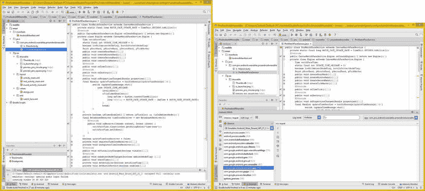
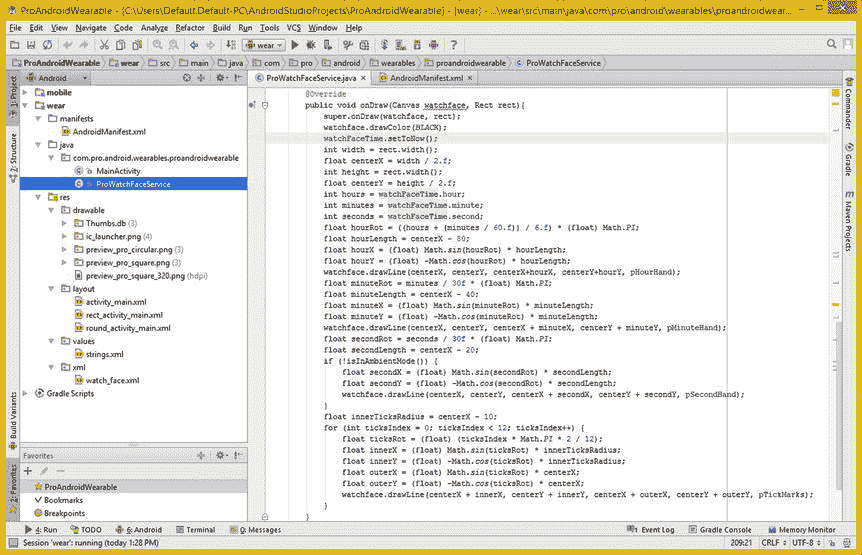
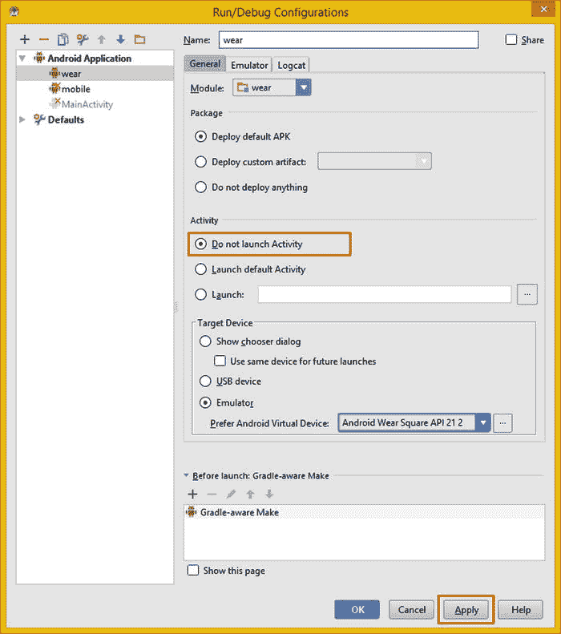
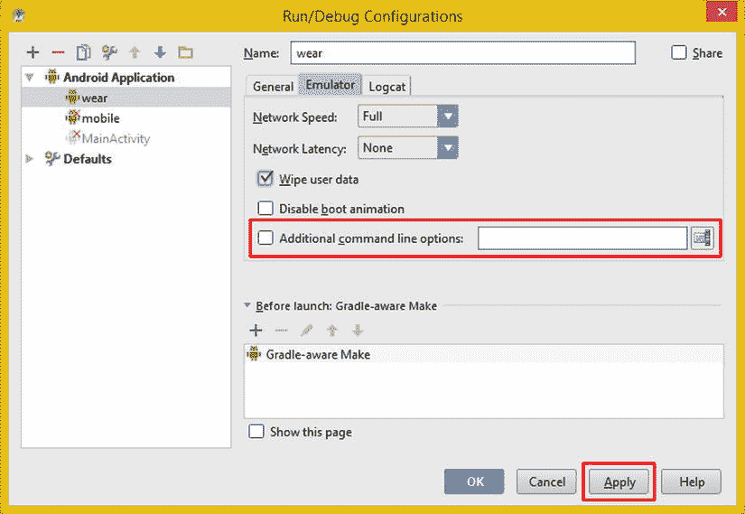
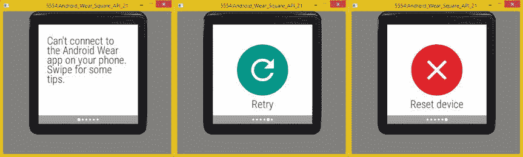

# 十一、表盘位图设计：为表盘使用光栅图形

现在，您已经有了足够的 WatchFaces API 代码来测试您的 Java 代码，这意味着这将是一个繁忙的章节。您将学习如何让模拟器工作，测试代码，并进行任何添加，在您有了一个可工作的 vector watch face 应用后，您将了解如何合并 BitmapDrawable 素材来为 watch face 应用创建背景图像。大多数表盘设计将利用位图资源和矢量绘图代码的组合来创建设计。

在让 AVD 模拟器工作并测试了目前已经准备好的代码库之后，您将确保让 watch face 工作所需的每个 Java 语句都准备好了。高级警告，我漏掉了一两个，所以您可以看到如何使用 AVDs 来测试 WatchFaces API Java 代码！

完成基本的表盘代码后，您将添加一个方法来检测表盘是圆的还是方的，然后您将进入不同的位图图像相关的类，这些类是实现矢量表盘设计背后的背景图像所需要的。

我将讨论用于访问插图信息的 Android WindowInsets 类，以及获取数字图像素材所需的 Android Bitmap 和 Resources 类。我还将讨论 Android Drawable 和 BitmapDrawable 类，它们需要将您的数字图像资源和原始位图数据包装成一种格式，onDraw()方法可以利用这种格式将位图图像素材写入您的手表表面背景。

测试表盘设计:使用圆形 AVD

既然现在已经有足够的代码来测试 watch face 应用，那么打开 Android Studio ProAndroidWearable 项目，让我们通过 Watch Face Round 2 (ARM)仿真器运行代码。我已经折叠了所有的代码，以显示大约 60 行顶级代码，如图 11-1 左侧所示(标有 1)。使用 IDE 顶部的**运行**菜单访问**运行...**子菜单(标有 2)，这将打开**运行浮动菜单**(标有 3)。如果您是第一次选择此项，您的**编辑配置**对话框将会打开，这正是您想要的，因为您将需要选择显示的**不启动活动**选项(标有 4)。


图 11-1 。使用运行穿菜单序列；在编辑配置对话框中，选择不启动活动

一旦您选择了“不启动活动”选项，因为 WatchFace 应用不使用活动对象(因为它是一个壁纸对象)，请单击“应用”按钮(位于对话框的右下角)，然后单击“运行”按钮。

这将启动一个**等待 adb** 进度条对话框，如图 11-2 顶部的所示。最终会出现你的 Android_Wear_Round AVD 模拟器。


图 11-2 。启动 Android Wear Round AVD，尝试测试应用。AVD 崩溃，单击确定关闭

在图 11-2 左侧可以看到，模拟器会将其组件加载优化到内存中，告诉你 Android 正在启动，然后你的 Android OS 就会出现。在我的情况下，Android 似乎知道我在写这本书，AVD 在我身上崩溃了，所以我借此机会向你展示，在图 11-2 的右侧，Android 开发环境并不比操作系统更防弹！这在新版本的软件中尤其如此，如 Android 5 (Android Studio 1.x)，因为它们尚未完善。你应该预料到打嗝，像 AVDs 不能正常工作，不要让他们阻止你！

如果你曾经得到这个“Android Wear 没有响应”的屏幕，如右边的图 11-2 所示，只需点击 **OK** 按钮，进行任何更改，然后再试一次！我在使用方形和圆形 AVD 仿真器时都遇到了一些问题，所以我将在本章的第一部分向您展示我为纠正这些问题所做的一些事情。

当我使用**运行运行磨损**菜单序列再次尝试时，我得到了在图 11-3 左下方看到的**磨损**选项卡。这个想法的这一部分向您展示了 AVD 正在发生的事情，包括位置和任何问题。



图 11-3 。尝试使用运行佩戴菜单序列再次启动 AVD 安卓 DDMS 面板显示流程

这次当我运行 AVD 模拟器时， **Android** **DDMS** 也弹出一个面板，在左侧窗格显示**进程信息**，在右侧窗格显示 **logcat** ，是**错误日志目录**的简称，如图图 11-3 所示。logcat 窗格当前是空的，因此没有记录任何错误，至少在包含代码启动的时间段内没有。一旦您开始使用 Android 应用，该窗格中可能会出现错误，通知您代码中的任何问题。

一旦你的 AVD 启动，如图 11-4 所示，找到**设置**选项，点击它，并找到 **改变手表表面**选项，然后点击它并横向滚动手表表面，直到你找到你的**专业手表表面**选项。一旦你点击了你的预览图片，Android 就会启动 Pro 表盘设计，它显示在图 11-4 的最右侧。似乎 onDraw()方法正在正确绘制表盘设计，但是秒针没有前进，因此您需要检查计时代码。


图 11-4 。找到设置改变表盘顺序，选择专业表盘，运行你的表盘

将整个秒延迟发送到您的处理程序对象

因为秒针固定在原位，所以开始查看代码的逻辑位置是名为 updateTimeHandler 的处理程序对象，因为这段代码是表盘应用每秒启动计时器逻辑的位置。

在**里面。** **handleMessage( )** 方法，会注意到，在条件 **if(isTimerEnabled( ))** 结构中你已经计算出了 **msDelay** (直到下一个整秒偏移值的时间)。但是，您没有将那个 msDelay 数据值发送给 Handler 对象，因此它可以触发下一个与时间相关的消息对象。

这是通过使用**完成的。****sendEmptyMessageDelayed()**方法 调用，完成向 handler 对象发送 msDelay 值的 Java 编程语句将在 msDelay 计算后立即执行。Java 代码可以在图 11-5 的中看到，看起来应该像下面的语句:

```java
updateTimeHandler.sendEmptyMessageDelayed(UPDATE_TIME_MESSAGE, msDelay);
```


图 11-5 。添加对 updateTimeHandler 对象的. sendEmptyMessageDelayed()方法的调用

它所做的是使用方法调用将 UPDATE_TIME_MESSAGE 值和以毫秒为单位的延迟值发送到 updateTimeHandler，该方法调用(通过其名称)指定它在确切的 msDelay 值(表示下一个完整的(1，000 毫秒)秒发送一条空消息(触发器)。

使用 Run  Run Wear 菜单序列启动 AVD 测试表盘。秒针还冻着，肯定还少了什么！

在绘制逻辑中将时间对象设置为当前时间

既然 Handler 对象正在广播正确的整秒时间，那么检查基于时序的逻辑的下一个逻辑位置是在**中。onDraw( )** 法。请注意，您使用了 **watchFaceTime** 时间对象来计算小时、分钟和秒针角度位置。在执行这些计算之前，您需要确保时间对象设置准确。因此，你需要打电话给**。** **setToNow( )** 方法，关闭 watchFaceTime 时间对象，在顶部。onDraw()方法。

我把它放在 super.onDraw()方法调用和。将背景色设置为黑色的 drawColor()方法调用。Java 编程语句应该如下所示:

```java
watchFaceTime.setToNow( );
```

正如你在图 11-6 中看到的，Java 代码是没有错误的，你现在已经准备好使用 Round AVD 再次测试代码了。我在 Java 代码中单击了 watchFaceTime 对象引用，以跟踪它在 onDraw()方法中的使用。



图 11-6 。向添加一个调用。方法后关闭 watchFaceTime 对象。drawColor()调用

将 Java 代码的 watchFaceTime 时间对象更新行添加到代码中后，在回合 AVD 中再次测试手表表面。现在秒针应该在滴答走了，您已经准备好在 Square AVD 模拟器中测试代码，以获得一些使用 Android_Wear_Square AVD 的经验。

测试表盘设计:使用方形 AVD

使用**运行编辑配置**菜单序列(如图图 11-1 所示)将仿真器设置为 Android Wear Square AVD，如图图 11-7 所示。



图 11-7 。使用编辑配置对话框选择方形 AVD

我进入**设置换表面**找了一个方形的表面预览，没有收录！我检查了我的 **AndroidManifest.xml** 文件，以确保引用了正确的图像素材，然后我使用谷歌查看是否有其他人在使用 square watch face 模拟器时遇到了这个问题。我看到的一个建议与 AVD **使用主机 GPU** 选项有关。有人建议取消这个选项，有人建议选择它！

所以我两个都试过了；两种设置都不起作用！所以我尝试了 **横向**，这在模拟器中将我的内容转向侧面，但它没有显示方形的表盘预览，所以我尝试了将**内存**增加到 **1GB** 以及将**内存**增加到 **500MB** ，所有这些的结果都可以在图 11-8 中看到。


图 11-8 。尝试改变使用主机 GPU 和方向设置，并增加 RAM 和内部存储

这些设置都不起作用，我花了几天时间试图让 square 预览出现在模拟器中，以便测试代码。我想确保这些 AVD 模拟器工作正常，因为不是所有人都有智能手表硬件来测试！我不断尝试不同的东西，以找出为什么 square Pro 表盘预览没有在 Square AVD 模拟器中显示出来。

因为这可能在某个时候发生在你身上(不仅仅是模拟器)，我将告诉你一些我尝试过的事情和最终成功的事情！

在建议使用主机 GPU 不起作用并且给 AVD 更多系统资源也不起作用之后，我想知道 320 像素的正方形预览对于标准的 280 度倾斜正方形表盘来说是否太大了，因为 Android 的文档建议 280 度倾斜尺寸用于正方形表盘设计。

当我在所有这些不同的 AVD 设置和图像素材尺寸之间迭代时，我遇到了几次 Android 方形臂 AVD 的崩溃，这给了我如图图 11-9 所示的对话框。我并没有因此而气馁，因为 Android Studio 和 Android 5 都是新平台，肯定会有很多漏洞，至少在一段时间内是这样。我只是关闭了 AVD(如果它没有因为 emulator-arm.exe 的**错误对话框而消失的话)并继续尝试。**


图 11-9 。在显示此对话框的过程中，方形 AVD 崩溃

我在**运行/调试(编辑)配置**对话框中的**仿真器**选项卡下找到了一个解决方案，至少对于我的硬件设置和安装是这样的。该选项卡在图 11-10 中显示为选中状态，在该选项卡下面是一个在我的安装中被默认选中的选项，名为**附加命令行选项**。我觉得奇怪的是这个选项被选中了，而且是空的，所以我**取消选择了**它。我还选择了**擦除用户数据**选项，以确保每次启动时，我都将这个 ARM AVD“干净”地加载到我的系统内存中。



图 11-10 。取消选择其他命令行选项并选择擦除用户数据

我在这里的想法是，有什么东西被加载到系统内存中的 AVD 仿真器代码中，这阻止了 square watch face 预览加载到 Android Square ARM AVD 仿真器中，或在 Android Square ARM AVD 仿真器的 UI 中显示。事实证明，这解决了问题，这很好，因为我需要这个 AVD 仿真器为那些没有物理智能手表硬件但想了解 Android Wear 的人工作。

高级模拟器选项显示在图 11-10 中间，包括**擦除用户数据**选项，我现在已经选中了(如图)。

还有一个**禁用引导动画**你可以选择，如果你愿意，以加快 AVD 加载序列，也显示在图 11-10 。

现在，当我启动方形 AVD 并选择**设置更改手表表面**选项时，我可以滚动并找到 Pro 手表表面方形手表表面预览图像，可以在图 11-11 中从左数第三个窗格中看到。需要注意的是，这个工作过程如果你碰巧遇到，也可以解决 Round AVD 仿真器中同样的问题。


图 11-11 。选择设置改变手表表面对话框，找到(方形)专业手表表面，运行并测试它

当我点击 Pro 手表表面预览图像时，我现在获得了手表表面设计，秒针正在滴答作响，因此基本的手表表面代码有效！

现在，您可以测试已经在程序逻辑中实现的各种特殊模式(低位、老化)，这些模式在表盘进入环境模式时启动。在开始测试自定义硬件模式之前，我想了解一下如何使用 AVD 仿真器，因为它们相对较新，所以容易崩溃，以及如何使用 F7 键，该键在 AVD 仿真器中打开和关闭环境模式。

AVD 崩溃:无法连接和没有响应的面板

当我在写这一章的时候测试 watch faces 代码的时候，我遇到了大量的崩溃和上一节提到的问题，我甚至不能选择一个正方形的 watch faces 预览来测试我的 Java 代码。一旦我想通了这一点，我仍然有很多关于“悬挂”AVD 仿真器软件的问题，所以让我们看看我在这一部分遇到的两个场景，这样你就知道如何解决这种情况，如果你碰巧遇到它。希望在这本书出版时这些问题会被解决，但是你永远不知道，所以我在这里把它包括进来只是为了彻底。

这些崩溃的形式要么是“无法连接到手机上的 Android Wear 应用”屏幕，要么是“Android Wear 没有响应”屏幕。“无法连接”错误，可在左侧的图 11-12 中看到，通常允许您“重试”或“重置设备”并继续测试。要进入这两个屏幕，使用“滑动获取一些提示”选项，如图 11-12 中的第一个屏幕(左侧)所示。这将显示您可以单击的按钮；确保在使用**重置**(红色)按钮作为最后手段之前，先尝试**重试**(绿色)按钮。



图 11-12 。如果你得到一个不能连接到 Android Wear 应用的屏幕，向左滑动几次以获得重试和重置窗格

我已经成功地使用了这两个按钮来“保存”AVD 会话，这样我就不必**退出**(在对话窗口的右上角使用一个红色的方形 X)AVD 仿真器软件并重新开始。

如果重试或重置设备按钮起作用，您将看到图 11-13 的中间窗格中显示的启动屏幕，然后您可以继续测试您的表盘应用。


图 11-13 。如果你看到一个 Android Wear 没有响应的窗格，点击等待，你会看到开始屏幕。按 F7 进入环境模式

你可能会遇到的另一个显示停止错误屏幕是“ **Android Wear 没有响应**”屏幕，它可以在图 11-13 的最左侧看到。如果您点击等待按钮，您可能最终会得到图 11-13 中间的所示的启动屏幕。如果你点击 **OK** 按钮，AVD 模拟器将关闭，就像你使用了对话框左上角的红色方块 X 一样。

图 11-13 的右侧窗格中还显示了 AVD 环境模式，您可以通过按下 **F7** 键(键盘顶部的功能键 7)来调用该模式。正如你所看到的，代码通过使用**将颜色调暗到**亮度的 50%** 。setAlpha(127)** 技术，运转良好。如果想在环境模式下用**灰度**代替颜色，就要加上**。setColor(颜色。【WHITE)方法调用里面那段 Java 代码。**

现在，您已经知道如何使用 F7 键将 AVD 仿真器置于环境模式，您可以继续测试**低位环境模式**代码。

特殊屏幕模式:测试低位环境模式

有多种方法可以测试低位环境模式代码，方法是通过在应用编程逻辑内部的某个位置添加执行此操作的代码行，强制打开 lowBitAmbientModeFlag。

在逻辑上，`lowBitAmbientModeFlag=true;` toggle 语句将进入 **onAmbientModeChanged( )** 方法或 **onPropertiesChanged( )** 方法；在这一章中你将会用到这两个工具，所以你可以看到它们是如何工作的。

在超类方法调用后的 onAmbientModeChanged()方法中添加一个`lowBitAmbientModeFlag=true;` Java 语句，如图图 11-14 所示。


图 11-14 。将 lowBitAmbientModeFlag=true 设置添加到 onAmbientModeChanged()方法中，以测试低位环境模式

一旦您人工将低位标志的值设置为真，您将使用 Run  Run Wear 菜单序列来启动 AVD 仿真器。接下来，使用设置更改手表表面专业手表表面序列，并启动你的手表表面应用。在图 11-15 的最右边可以看到处于低位环境模式的表盘，它使用白色，任何线条都没有抗锯齿(如锯齿状边缘所示)。


图 11-15 。使用设置改变手表表面 Pro 手表表面系列，和 F7 测试低比特环境模式

因为老化通常与低位模式一起使用，所以我们接下来添加老化标志设置，您可以在它们的“开”设置中测试这两个标志。

特殊屏幕模式:测试低位和老化模式

在评估该标志的 if()语句之前添加一个`burnInProtectModeFlag=true;`语句，如图 11-16 中的所示。IntelliJ 中弹出了一个灯泡图标，所以我下拉建议菜单，双击“从‘if’语句中删除大括号”建议。这使得 IntelliJ IDEA 稍微简化了 Java 代码。如果 IntelliJ 给你一个合理的代码优化建议，往往明智的做法是采纳它，看看效果如何！


图 11-16 。添加一个 burnInProtectModeFlag=true，并采用 IntelliJ 建议来简化 if()构造

在这种情况下，它将该方法的代码行从 12 行减少到 6 行，或者说减少了 50%的代码，一旦您删除了强制代码行的标志，您将把它放入**。onPropertiesChanged( )** 方法下一步。

修改后的 onAmbientModeChanged()方法的 Java 代码(没有 true 标志设置)可以在图 11-17 的中看到没有错误，看起来像下面的 Java 方法结构:

```java
@Override
public void onAmbientModeChanged(boolean ambientModeFlag) {
    super.onAmbientModeChanged(ambientModeFlag);
           if(lowBitAmbientModeFlag) setAntiAlias(!ambientModeFlag);
           if(burnInProtectModeFlag) setBurnInProtect(ambientModeFlag);
    ensureModeSupport;
    invalidate;
    checkTimer;
}
```


图 11-17 。一旦实现了 IntelliJ if()优化建议，该方法就会减少到 6 行代码

接下来，让我们将这些特殊模式标志“强制真”设置放入 onPropertiesChanged()方法中，在方法的最后，如图图 11-18 所示。这个方法结构的新 Java 代码应该如下所示:

```java
@Override
public void onPropertiesChanged(Bundle properties) {
    super.onPropertiesChanged(properties);
    lowBitAmbientModeFlag = properties.getBoolean(PROPERTY_LOW_BIT_AMBIENT, false);
    burnInProtectModeFlag = properties.getBoolean(PROPERTY_BURN_IN_PROTECTION, false);
    lowBitAmbientModeFlag = true;
    burnInProtectModeFlag = true;
}
```


图 11-18 。将设置为 true 值的特殊模式标志移到 onPropertiesChanged()方法的底部

现在，让我们使用设置更改表盘 Pro 表盘序列再次测试表盘。正如你在图 11-19 中从左边第三个窗格看到的，当你按下 F7 键将表盘切换到环境模式时，低位标志逻辑正在工作，你已经知道了。


图 11-19 。通过使用 Android_Wear_Square_API_21 AVD 模拟器测试您的 watch face Java 代码

然而，您的老化编程逻辑并没有像您预期的那样将轮廓放置在表盘的指针周围。再次按下 F7 键切换回交互模式，如图 11-19 最右边的第四个窗格所示。如您所见，表盘指针的 RBG 颜色值没有被恢复，因此您还需要了解一下 **ensureModeSupport( )** 方法以及 **setBurnInProtect( )** 方法。让我们先将开关恢复到交互式 RGB 颜色模式。

因为您在中配置了表盘指针颜色。onCreate()方法，方法是调用自定义的。createHand()方法，您需要在 ensureModeSupport()方法的最终 else 部分中设置颜色。

您已经使用将 alpha 值设置回 255(完全不透明)。setAlpha()方法调用，所以，需要使用**。setColor( )** 方法调用来重新配置 Paint 对象以使用蓝色、绿色、红色和白色的颜色类常量。我以这种方式编写代码，使用不同的方法调用，向您展示设置颜色值的不同方式。请记住，您使用了。setARGB()方法设置。createHand()方法。在图 11-20 中显示没有错误的 Java 代码应该如下所示:

```java
} else {
    pHourHand.setAlpha(255);
    pMinuteHand.setAlpha(255);
    pSecondHand.setAlpha(255);
    pTickMarks.setAlpha(255);
    pHourHand.setColor(Color.BLUE);
    pMinuteHand.setColor(Color.GREEN);
    pSecondHand.setColor(Color.RED);
    pTickMarks.setColor(Color.WHITE);
}
```


图 11-20 。添加。setColor()方法调用 ensureModeSupport()方法中 if-else 循环的 else 部分

现在我们来看看为什么？setStyle(画图。Style.STROKE)方法不是在时针和分针表盘部件周围描绘单个像素轮廓。从图 11-19 中可以看到。setBurnInProtect()方法显然对屏幕上显示的内容没有任何影响。

正如你在图 10-25 中看到的，你正在尝试使用**笔画**绘画。样式常量在时针和分针矢量对象周围创建轮廓效果，并使用**填充**绘制。样式来创建实心或填充效果。虽然这种方法可以很好地处理 Android 中的任何 **2D ShapeDrawable** 对象，包括文本、圆形、矩形和其他“封闭”的线条或曲线形状，但它不能处理 **1D** “开放”的线条或曲线形状的对象，因为它们没有内部**！因此，在 1D 矢量“射线”对象的情况下，描边和填充将产生完全相同的效果！**

 **你需要做的就是使用**来完成这项工作。setStrokeWidth( )** 方法调用线条形状对象，这将允许您通过不必声明画图来优化老化方法。名为 paintStyle 的样式对象，并简化 if-else 条件结构，对时针使用三个像素的**，它需要比分针粗，对分针使用两个像素的**，这与您对刻度元素使用的值相同，因此它们可以很容易地在表盘显示上看到。****

 ****使用单个像素绘制表盘元素将无法让最终用户轻松读取表盘时间，即使这是屏幕老化保护的最佳设置。如果你想看看它看起来怎么样，你可以在你的表盘应用中使用 1.f 笔画宽度数据值进行实验！在这种情况下，时针需要 2.f 才能区分，分针和刻度线将使用 1.f 设置。在图 11-21 中可以看到一个新的方法结构，它为绘制对象设置了 **StrokeWidth** 属性，应该是这样的:

```java
private void setBurnInProtect(boolean enabled) {
    if(enabled) {
        pHourHand.setStrokeWidth(3.f);
        pMinuteHand.setStrokeWidth(2.f);
    } else {
        pHourHand.setStrokeWidth(6.f);
        pMinuteHand.setStrokeWidth(4.f);
    }
}
```


图 11-21 。去除油漆。请使用 setBurnInProtection 方法中的样式逻辑，而不是使用。setStrokeWidth()

现在，当您使用 Run  Run Wear 并启动 AVD 仿真器并使用设置Change Watch FacePro Watch FaceF7 键时，您将获得启用低位和老化模式的环境模式，如图 11-22 中最右侧窗格所示。


图 11-22 。使用设置改变手表表面 Pro 手表表面系列，和 F7 测试低比特环境模式

正如你所看到的，手表表面仍然是有吸引力的，可读的，完全可用的，即使使用零抗锯齿。表盘设计使用非常少的像素来绘制表盘设计元素，这有助于提供屏幕老化保护，这是该模式的目标。

接下来你需要做的是学习如何检测用户的手表表面是方形还是圆形，使用 Android 的 **WindowInsets** 类。在您将表盘形状检测代码放置到位后，您将了解 Android **位图**、 **Drawable** 和 **BitmapDrawable** 类，以及如何使用这些来实现矢量表盘组件的位图背景图像，将您的 Android 表盘提升到全新的水平。

Android WindowInsets 类:轮询屏幕形状

Android **WindowInsets** 类是一个**公共 final** 类，它扩展了 java.lang.Object 类。阶级阶层看起来像这样:

```java
java.lang.Object
  > android.view.WindowInsets
```

这个类是 **android.view** 包的一部分，因为它与**视图**对象一起使用。WindowInsets 对象可用于描述应用窗口内容的一组插入。在这种情况下，这个对象保存了表盘的特征，例如表盘的形状以及它是否有一个架子，就像摩托罗拉 MOTO 360 目前所做的那样。

这些 WindowInsets 对象是“不可变的”(固定的或不可变的)。他们可能会被扩展(由谷歌的 Android 团队),在未来包括其他插入类型。这里您将结合使用 WindowInsets 对象和**。onapplywindowsets(window insets)**方法，这是您接下来要编写的代码。

这个 WindowInsets 类有一个公共构造函数方法，它采用格式`WindowInsets(WindowInsets insets)`并构造一个(新的)WindowInsets 对象。它通过从源 WindowInsets 定义中复制数据值来实现这一点，在本例中，这将来自每个智能手表制造商。

这个 WindowInsets 类有 18 个方法，对于 WatchFaces API 开发，您可能想了解其中的两个。**。** **isRound( )** 方法会告诉你表盘是圆的(或者不是圆的，会是方的)，还有**。getSystemWindowInsetBottom()**方法会告诉你 MOTO 360 用来连接其手表表面屏幕的“架子”的大小(整数)。

接下来，让我们创建**onapplywindowsets()**方法，这是 WatchFaceService 的一个方法。引擎类的实现我一直保存到现在，当你学习一些实际上可以“利用”它所提供的东西的时候！

检测表盘形状:使用窗口镶嵌

在引擎类中 onTimerTick()方法之后添加一个**public void on applywindowsets(window insets insets){ }**空方法结构。正如你在图 11-23 中看到的，你必须使用 **Alt+Enter** 并让 IntelliJ 在你的类的顶部为你编写`import android.view.WindowInsets;`语句。


图 11-23 。添加 public void on applywindowsets(window insets insets){ } empty 方法结构

下一步是使用下面的 Java 变量声明语句将 **roundFlag** 布尔变量添加到复合布尔语句的末尾(在私有引擎类的顶部)，如图 11-24 顶部所示(高亮显示):

```java
boolean lowBitAmbientModeFlag, burnInProtectModeFlag, roundFlag;
```


图 11-24 。将名为 roundFlag 的布尔变量添加到 Engine 类中，并在 onApplyWindowInsets()方法中将其设置为等于 insets.isRound()

在空的 onApplyWindowInsets()方法中，使用 Java **super** 关键字调用超类，并将名为 **insets** 的 WindowInsets 对象向上传递给父类。接下来，将 **roundFlag** 布尔变量设置为等于**的布尔值。** **isRound( )** 方法调用掉 **insets** WindowInsets 对象。

如 Android Studio 底部的图 11-24 所示，Java 方法应该类似于下面的 Java 方法结构:

```java
@Override
private void onApplyWindowInsets(WindowInsets insets) {
    super.onApplyWindowInsets(insets);
    roundFlag = insets.isRound( );
}
```

现在你有办法知道用户的智能手表使用的是圆形还是方形显示硬件。在本章的下一部分中，当您学习如何将位图图像放置在矢量观察面组件的后面时，将会用到这个布尔值。然而，首先让我们看看 Android 的位图和资源类，您将使用它们来加载您的图像数据。

Android 位图类:使用数字图像资源

Android **Bitmap** 类是一个 **public final** 类，实现了 Java **Parcelable** 接口，扩展了 java.lang.Object master 类。位图类层次结构如下所示:

```java
java.lang.Object
  > android.graphics.Bitmap
```

Android Bitmap 类有两个嵌套的(helper)类。第一个是枚举**位图。CompressFormat** 类，它指定了这些位图对象可以使用编解码器压缩成的已知图像文件格式，编解码器是 Android 操作系统的一部分。枚举值包括 **JPEG** 、 **WEBP** 和 **PNG** 。

第二个是枚举**位图。Config** 类，它指定可能的位图配置。其中包括 **alpha_8** ，这是 **8 位** 256 透明度级别 ALPHA 通道专用格式，以及 **ARGB_8888** ，这是 **32 位**格式，每色彩平面(和 ALPHA 通道)使用 8 位数据。

还有一种叫做 **RGB_565** 的 16 位位图格式，很有意思，因为 Android 目前还没有 16 位编解码支持(BMP、TIF、TGA 都支持 16 位颜色)。还有被弃用(意味着不再支持)的 ARGB_4444 格式，你不应该使用，因为它在 Android API Level 13 中被弃用了。

Bitmap 类有 50 多个方法，所以很明显，我不能在这里详细介绍这些方法，但我会在本章以及下一章中介绍那些您将在 WatchFaces API 设计中用来实现位图素材的方法，在下一章中，我将讨论用于创建其他 watch face 模式位图素材的数字图像技术。

**。** **getWidth( )** 方法调用将返回位图对象的宽度属性，同样的，**也是如此。** **getHeight( )** 方法调用，将返回位图对象的高度属性。

Android API Level 1 中添加的**public static Bitmap createScaledBitmap(Bitmap src，int dstWidth，int dstHeight，boolean filter)** 方法，通过缩放源位图对象的图像数据来创建新的位图对象。方法参数包括一个 **src** ，源位图对象，一个 **dstWidth** ，或目标位图对象的目标宽度，一个 **dstHeight** ，目标位图对象的目标高度，以及一个布尔**过滤器**数据值，如果您希望 Android 将双线性插值应用于图像缩放算法，该值将被设置为 **true** 。您将使用此选项来获得最高质量的图像缩放结果。如果要进行上采样(从较低的分辨率到较高的分辨率)，这一点尤其重要。

该方法返回一个缩放的位图对象，或者如果没有执行缩放，则逻辑上返回源位图对象。如果源位图对象的宽度小于(或等于)零，或者如果位图对象的高度小于或等于零，该方法将引发 IllegalArgumentException。您将在后面的章节中使用这个方法。onDraw()方法来确保您的位图对象适合您的表盘显示。

接下来，让我们看看 Android Resources 类，因为您将不得不使用它来将数字图像资源加载到 Bitmap 对象中。

Android 资源类:使用你的 Res 文件夹

公共 Android **Resources** 类扩展了 java.lang.Object，是 **android.content.res** 包的一部分。它有一个已知的直接子类，称为 MockResources。Java 类的层次结构如下所示:

```java
java.lang.Object
  > android.content.res.Resources
```

Resources 类用于创建对象，这些对象允许您访问存储在 **/res** 文件夹中的应用资源。这个 Android“R”资源系统(例如，存储在 **/res/drawable-hdpi** 中并被引用为 **R.drawable.imagename** 的图像)跟踪与您的 Android 应用相关联的所有非代码素材。您可以使用这个类来访问这些应用资源，就像您将在下一节中所做的那样。

通过使用**，您可以获得一个 Resources 对象，该对象加载了对您的应用中的外部项目素材(资源)的所有引用。getResources( )** 方法调用应用的主**上下文**，使用 Java **this** 关键字访问该上下文。在这个应用场景中，它看起来像下面的 Java 语句:

```java
Resources watchFaceResources = ProWatchFaceService.this.getResources( );
```

IntelliJ IDEA 中安装的 Android SDK 工具在构建时将应用资源编译成应用二进制文件，它们从/res/drawable 引用路径进入 **R.drawable** 引用路径。这就是在 Java 方法调用中使用 R.drawable.image_asset_name 而不是/res 的原因。

为了能够将外部资源用作资源，您必须将它定位到项目 res/目录中正确的源子文件夹中，例如，**图像**或**形状**将进入**/RES/drawable**(r . drawable)**矢量动画**将进入 **/res/anim** (R.anim)。

作为应用构建(编译)过程的一部分，Android SDK 工具将为每个素材资源生成 r .符号。然后，您可以在应用的 Java 代码中使用这些 R. references 来访问资源。确保在运行时使用 Java 代码中的 R. references 来访问素材。

使用外部应用资源使开发人员能够在不修改 Java 代码或 XML 标记的情况下更改应用的可视特征。此外，提供这些替代资源将允许开发者优化他们的应用，跨越异常广泛(并且快速增长)的消费电子设备硬件配置集合。动态访问不同新媒体资源的能力将允许开发人员适应不同的场景，如不同的最终用户语言、不同的屏幕尺寸、形状和密度，以及在这种情况下，圆形表盘与方形表盘！

能够在运行时动态访问各种资源是开发兼容各种不同类型硬件设备的 Android Watch Faces(和其他)应用的一个重要方面。

Resources 类有两个嵌套的(也称为 helper)类。这里有资源。NotFoundException 类，该类处理在找不到请求的资源(或其路径)时引发资源 API 异常的情况。还有一个资源。主题类，保存应用中实现的特定操作系统主题的当前属性值。

创建资源对象有一个公共的构造函数方法，采用这个参数格式:**Resources(asset manager assets，DisplayMetrics metrics，Configuration config)** 。请注意，如果您使用。getResources()，这个资源对象将会为您创建，您不必显式地使用这个构造函数方法调用和格式化。

这是一个实现的情况，您将在本章后面的 Java 语句中使用它，这在本节前面已有概述。现在让我们为 watch face 应用创建位图和资源对象。

访问图像:使用位图和资源

在私有引擎类的顶部(声明区域) 您需要做的第一件事是创建声明和命名两个位图对象的复合语句。如果由于某种原因，智能手表硬件使用的分辨率不是 320 x 320 像素，则这些位图对象中的一个将保存图像资源(原始图像数据)，另一个将保存图像数据的缩放版本。

这种方法将允许您使用更高分辨率的数字图像素材，如果更高分辨率的表盘是在以后几年开发的。复合语句的 Java 代码可以在图 11-25 中看到，应该如下所示:

```java
Bitmap watchFaceBitmap, scaleWatchFaceBitmap;
```


图 11-25 。添加一个名为 watchFaceBitmap 和 scaleWatchFaceBitmap 的复合位图对象声明

点击代码行的任意位置，如图 11-25 中突出显示的，使用 **Alt+Enter** 击键序列告诉 IntelliJ 为您编写导入语句。

接下来要做的事情是创建资源对象。最合理的方法是 onCreate()方法，因为它只需要在应用启动时执行一次。你可以用其他声明在引擎类的顶部声明资源 watchFaceResources，或者你可以在 onCreate()中声明、命名并本地加载这个对象**，使用下面的 Java 语句，这也可以在图 11-26 中看到:**

```java
Resources watchFaceResources = ProWatchFaceService.this.getResources( );
```


图 11-26 。创建一个名为 watchFaceResources 的资源对象；使用。getResources()方法

点击代码的资源行，使用 **Alt+Enter** 工作流程，指导 IntelliJ 编写导入语句，如图图 11-26 所示。

在您继续编码之前，让我们花点时间了解一下 Android Drawable 类，因为您将在代码中实现 Drawable 对象来保存这些位图对象中的一个。

Android 可绘制类:创建可绘制对象

Android **公共抽象 Drawable** 类是为在 Android 中创建 Drawable 对象而临时编写的，因此它直接扩展了 java.lang.Object，如以下代码所示:

```java
java.lang.Object
  > android.graphics.drawable.Drawable
```

Drawable 是一个 Android 术语，指可以在屏幕上绘制的东西。Drawable 类提供了处理底层可视资源的通用 API，这些可视资源可能是大量与图形相关的绘图元素类型中的任何一种，如九色、矢量、颜色、形状、渐变、插入、图层、剪辑或位图，这是您将在本章的下一节中使用的内容。

Drawable 对象没有任何接收或处理事件或直接与用户交互的能力，因此您必须用某种类型的**视图**对象(小部件)来“包装”Drawable 对象才能做到这一点。

drawable 有 15 个已知的直接子类。您将使用 **BitmapDrawable** 子类，但您也可以在应用开发中使用其他子类，包括:VectorDrawable、GradientDrawable、NinePatchDrawable、AnimatedVectorDrawable、PictureDrawable、LayerDrawable、ClipDrawable、ColorDrawable、ScaleDrawable、RotateDrawable、ShapeDrawable、InsetDrawable、RoundedBitmapDrawable，还有一个 DrawableContainer。

有七个已知的间接亚类；这些是直接子类的子类，包括:AnimatedStateListDrawable、RippleDrawable、AnimationDrawable、PaintDrawable、LevelListDrawable、StateListDrawable 和 TransitionDrawable。

Drawables 在被包装到视图中之前，对 Android 应用来说是不可见的。Drawables 采用多种图形元素格式:

*   您将在这里使用的可绘制对象是**BitmapDrawable**；它是“位”或像素的映射，使用 GIF、PNG、WEBP 或 JPEG 数字图像“编解码器”将数字图像数据素材压缩和解压缩到系统内存中。
*   **NinePatchDrawable** 是对 PNG 数据格式的扩展，允许图像指定如何拉伸和缩放周界区域。
*   **ShapeDrawable** 包含简单的矢量绘图命令，而不是原始位图对象，允许矢量作品“渲染”到任何屏幕大小。
*   **LayerDrawable** 允许开发者创建一个图像合成的 Drawable。这种类型的 drawable 就像 Android 中的 mini-GIMP，你可以使用 z-order 层将多个位图 drawable 堆叠在另一个之上。
*   **statedravable**是另一种类型的复合 Drawable，它根据 statedravable 的状态设置从一组给定的 drawable 中选择一个。多状态 Android ImageButton 小部件就是一个很好的例子。
*   **LevelDrawable** 是另一种类型的复合 Drawable，它根据 LevelDrawable 对象的级别设置，从一组给定的 drawable 中选择一个。状态栏上的信号电平图标就是一个很好的例子。

Android 中有许多其他可绘制的对象类型，所以如果你有兴趣更详细地了解所有这些，请查看 Apress*Pro Android Graphics*(2013)标题。

现在是时候创建手表表面 Drawable 对象，并使用它来加载一个位图对象，这样您就可以开始将背景图像添加到手表表面设计中。您还将合并 roundFlag 布尔值，以便如果您对方形和圆形表盘有不同的设计，您将知道如何设置表盘代码以使用正确的版本。

加载 Drawable:使用 roundFlag 布尔值

你需要做的第一件事，在私有的引擎类的顶部，是声明并命名你的可绘制对象。让我们为这个 Drawable 对象使用逻辑名 **watchFaceDrawable** ，这样当你在代码中使用它时，你就能确切地知道它是什么了。可绘制对象声明可以在图 11-27 的中看到，看起来应该像下面的 Java 对象声明:

```java
Drawable watchFaceDrawable;
```


图 11-27 。在 Engine 类中添加一个 Drawable 对象声明，并将该对象命名为 watchFaceDrawable

接下来您要做的是在 onCreate()方法的顶部，在 Resources 对象声明和实例化代码行之后添加一个空的条件 if-else 结构。

条件结构将评估 **roundFlag** 布尔变量，并用正确的数字图像资源加载 watchFaceDrawable 对象。在图 11-28 中可以看到正在构建的空语句，它应该看起来像下面的 Java 条件 if-else(空)结构:

```java
if(roundFlag) {
         // Round Watch Face Java Statements
} else {
         // Square Watch Face Java Statements
}
```


图 11-28 。在 onCreate()方法中添加 if(roundFlag)条件结构；从弹出菜单中选择圆形标志

在条件语句的 if 部分，设置**watchfacedravable**对象等于**getDrawable(r . drawable . preview _ pro _ circular)**方法调用**watchfacesource**对象。在图 11-38 中，可以看到预览 _pro_circular PNG 以蓝色突出显示。一旦你完成了整个条件 if-else 结构的编码，如图 11-29 所示的 Java 代码应该如下所示:

```java
if(roundFlag) {
    watchFaceDrawable = watchFaceResources.getDrawable(R.drawable.preview_pro_circular);
} else {
    watchFaceDrawable = watchFaceResources.getDrawable(R.drawable.preview_pro_square);
}
```


图 11-29 。在 if 中添加一个 watchFaceDrawable 对象，用 watchFaceResources.getDrawable()加载它

正如你在图 11-29 中看到的，当你编码。getDrawable()方法调用时，IntelliJ 会为你列出你的 Resources (R.) object assets，就像你键入的每个句点字符一样。键入 R 和句点，然后选择可绘制类型(文件夹)。接下来输入另一个句号，然后选择 **preview_pro_circular** PNG 图片引用，完成 Java 编程语句。现在你要做的就是在 else 结构中重复这个。

一旦你完成创建这个 if(roundFlag)-else 结构，用正确的资源对象引用加载你的 watchFaceDrawable 对象，你的代码应该是没有错误的，如图图 11-30 所示，正方形手表表面数字图像素材引用在适当的位置(并突出显示)。


图 11-30 。在 if-else 语句的 else 部分添加不同的 watchFaceResources.getDrawable()方法调用

接下来，让我们快速查看一下 Android **BitmapDrawable** 类，您将在下一行 Java 代码中使用该类来“转换”Drawable 对象，该对象现在已经根据 roundFlag 布尔变量的设置加载了正确的图像资源引用。isRound()方法调用。咻！

我想给你一个这个类的概述，因为 BitmapDrawables 是 Android 应用开发中最强大和最常用的可绘制对象类型之一，既用于 UI 设计，也用于应用的图形设计。如果您正在寻找更多关于 2D Android UI 设计的高级资料，有机会的话，请查看 Apress title*Pro Android UI*(2014)。

Android 的 BitmapDrawable 类:图像绘制

Android 的**公共 BitmapDrawable** 类扩展了 Drawable 类，包含在**Android . graphics . Drawable**包中。Java 类的层次结构如下所示:

```java
java.lang.Object
  > android.graphics.drawable.Drawable
    > android.graphics.drawable.BitmapDrawable
```

BitmapDrawable 是一个包含 Bitmap 对象的 Drawable 对象，该对象可以平铺、拉伸、旋转、着色、褪色或对齐。您可以使用 Android API Level 1 中引入的八种原始构造函数方法中的三种重载构造函数方法之一来创建 BitmapDrawable:

```java
BitmapDrawable( )                                // This constructor was deprecated in API 4 and can be ignored

BitmapDrawable(Resources res)                   // This constructor was deprecated in API 18 and can be ignored

BitmapDrawable(Bitmap bitmap)                   // This constructor was deprecated in API level 4 and can be ignored

BitmapDrawable(Resources res, Bitmap bitmap)    // Creates Drawable using an external bitmap resource

BitmapDrawable(String filepath)                 // This constructor was deprecated in API level 5 and can be ignored

BitmapDrawable(Resources res, String filepath)  // Create a Drawable by decoding from a file path

BitmapDrawable(InputStream is)                  // This constructor was deprecated in API level 5 and can be ignored

BitmapDrawable(Resources res, InputStream is)  // Create Drawable decoding bitmap from input stream
```

因为您将强制转换 BitmapDrawable 对象，所以我不会在这里涵盖所有这些构造函数方法；不过，可以说，您可以通过使用图像文件路径、使用输入流、使用另一个位图对象、使用 XML 定义膨胀、使用另一个位图对象或使用资源对象来创建 BitmapDrawable 对象，就像您将要做的那样。

如果你想使用一个 XML 定义文件定义一个 BitmapDrawable，使用一个< bitmap > XML 标签来定义这个元素。BitmapDrawable 将与 Bitmap 对象一起使用，该对象处理原始位图图形的管理和转换，并且最终将是在绘制到 Canvas 对象时使用的对象，您将在本章使用的代码中注意到这一点。

有许多 XML 属性、参数或特性可用于位图对象，在表 11-1 中有所概述。

表 11-1 。使用 XML 标记参数可访问的 BitmapDrawable 属性

| 

位图属性

 | 

位图属性功能描述

 |
| --- | --- |
| 反别名 | 启用或禁用抗锯齿(边缘平滑算法) |
| 发抖 | 针对颜色深度不匹配启用位图抖动(ARGB8888 至 RGB565) |
| 过滤器 | 为高质量缩放启用或禁用位图双线性过滤 |
| 重力 | 定义用于位图对象的重力常数设置 |
| 米帕普 | 启用或禁用 mipMap 提示功能 |
| 科学研究委员会 | 位图资源文件标识符资源路径 |
| 平铺模式 | 定义整体位图对象平铺模式 |
| 平铺模式 | 明确定义水平平铺模式 |
| 平铺模式 | 明确定义垂直平铺模式 |

使用 BitmapDrawable 对象:提取和缩放

接下来，让我们实现一个 BitmapDrawable 对象，从包含它的 Drawable 对象中获取所需的位图对象数据。Java 语句**用下面的代码将**watchFaceDrawable Drawable 转换为 **(BitmapDrawable)** ，在图 11-31 : 中可以看到没有错误

```java
watchFaceBitmap = ( (BitmapDrawable) watchFaceDrawable ).getBitmap( ); // Cast to a (BitmapDrawable)
```


图 11-31 。添加一个 watchFaceBitmap 对象，并将其设置为等于 watchFaceDrawable 对象中的位图资源

这一行简洁的 Java 代码包含了 **watchFaceBitmap** Bitmap 对象、**watchFaceDrawable**Drawable 对象(包含您的图像资源)、一个未声明的 BitmapDrawable 对象，该对象充当 APK 文件中的 Drawable 素材和需要驻留在最终用户的 Android 硬件设备系统内存中的原始位图之间的桥梁。

该语句所做的是将 watchFaceBitmap 位图对象设置为等于一个**的结果。getBitmap( )** 方法调用，该方法调用自转换结构，其中使用**(BitmapDrawable)watchFaceDrawable**转换结构将 watchFaceDrawable 对象转换为 BitmapDrawable，该转换结构神奇地将 Drawable 对象转换为 BitmapDrawable 对象。

一旦 Drawable 被转换成 BitmapDrawable，这个。getBitmap()方法调用将工作，也就是说，它将是一个有效的方法调用，不会抛出异常。

现在，您已经准备好了方法，这些方法是。来自 WatchFaceService 的 onAmbientModeChanged()方法。引擎类，当智能手表硬件进入环境模式时，你需要确保所有这些不同的模式都得到支持。

缩放位图:使用。createScaledBitmap()方法

下一个需要放置代码的地方是 onDraw()方法内部，在这里需要将一个位图对象插入到绘制管道中。在计算宽度和高度值之后，创建一个空的条件 if 结构，因为您将使用这些值来确定是否需要缩放。在图 11-32 的中显示的正在构建中的代码应该是这样的:

```java
if(scaleWatchFaceBitmap) {
    // an empty conditional if statement thus far
}
```


图 11-32 。添加一个 if(scaleWatchFaceBitmap)条件结构，以确定是否需要缩放位图

在条件 if 结构中，评估 scaledWatchFaceBitmap 是否未使用(空的或 null ),或者它是否与源位图具有不同的维度。如图图 11-33 所示，Java 代码应该如下所示:

```java
if ( scaleWatchFaceBitmap == null ||
     scaleWatchFaceBitmap.getWidth( ) != width ||
     scaleWatchFaceBitmap.getWidth( ) != height  ) { // Java code to be processed will go in here }
```


图 11-33 。添加用于确定 scaleWatchFaceBitmap 对象是空的还是需要设置的布尔 OR 逻辑

在条件 if 结构中，如果位图需要缩放，调用**。createScaledBitmap( )** 方法，关闭 Bitmap 类，如图图 11-34 所示，用这个结果加载 scaleWatchFaceBitmap 对象。到目前为止，Java 代码应该是这样的:

```java
if ( scaleWatchFaceBitmap == null ||
     scaleWatchFaceBitmap.getWidth( ) != width ||
     scaleWatchFaceBitmap.getWidth( ) != height  ) {
     scaleWatchFaceBitmap = Bitmap.createScaledBitmap(watchFaceBitmap, width, height, true);
}
```


图 11-34 。在条件 if 中，调用 scaleWatchFaceBitmap 的 Bitmap.createScaledBitmap()方法

正如你在图 11-34 中看到的，如果你输入**位图**类名并按下**句号**键，IntelliJ 会弹出一个帮助器对话框，里面有所有适用的方法。您可以选择适用于您想要做的事情的选项，在本例中为`.createScaledBitmap(Bitmap src, int dstWidth, int dstHeight, boolean filter)`。到目前为止，Java 代码是没有错误的，如图 11-35 所示。


图 11-35 。将 watchFaceBitmap 对象和 watchface 宽度和高度传递到。createScaledBitmap()

请注意，如果 scaleWatchFaceBitmap 尚未使用(空)，则此。createScaledBitmap()方法调用会将 watchFaceBitmap 对象转移到 scaleWatchFaceBitmap 对象中，即使宽度和高度相同！正如您在上一节中了解到的，这就是该方法的工作方式，因为如果不需要缩放，它将返回原始位图对象。

接下来你需要做的是绘制位图作为背景，在手表表面屏幕的左上角(0，0)。这是使用。drawBitmap()方法调用。如图图 11-36 所示，Java 语句应该如下所示:

```java
watchface.drawBitmap(scaleWatchFaceBitmap, 0, 0, null);
```


图 11-36 。打电话给。drawBitmap()方法，使用 scaleWatchFaceBitmap

如果您想知道，方法调用参数区域末尾的 null 引用了一个 Paint 对象。如果没有定义画图对象，要将更多的屏幕绘制选项应用于位图，那么它将为空，如 empty 或 undefined。如果您想定义更多关于如何在屏幕上绘制位图对象的选项，您可以创建这个 Paint 对象，命名它，加载它(配置它)，并在方法调用的最后一个参数槽中使用它的名称。

测试背景位图:圆形与方形

让我们使用两个 AVD 模拟器来测试应用，以确保您的位图资源现在呈现在它们应该在表盘设计后面的地方。正如你在图 11-37 的右侧看到的，你的圆形表盘的位图背景似乎使用了方形表盘位图资源，这意味着**圆形标志**没有被设置为**真**。


图 11-37 。在两个 AVD 仿真器中测试位图代码

当然，位图对象缩放也可能有一些问题，因为这个圆形的表盘 AVD 似乎被放大了不少。让我们确保并创建两个测试图像，其中的文本为圆形和方形。我将在 PNG32 图像资源中使用 alpha 通道透明度，这样您将能够看到画布对象的背景(黑色)颜色，因为那行代码被留在了。onDraw()方法，并且当前正被位图对象覆盖。这将向你展示另一个层次的灵活性；也就是说，无缝结合位图和矢量的方法来设计手表的脸。我将在圆形手表表面图像中包含一个圆形周边环。

将 **round_face_text.png** 和 **square_face_test.png** 图片素材复制到**/AndroidStudioProjects/ProAndroidWearable/wear/src/main/RES/drawable-hdpi/**文件夹中，结果可以在图 11-38 右侧看到。


图 11-38 。使用操作系统文件管理工具将测试位图添加到 wear/src/main/RES/drawable-hdpi 文件夹中

接下来，使用以下 Java 代码，将用于测试 if(roundFlag)代码的手表表面预览图像的引用更改为 watch_face_test 图像，如图图 11-39 所示(突出显示):

```java
if(roundFlag) {
    watchFaceDrawable = watchFaceResources.getDrawable(R.drawable.round_face_test);
} else {
    watchFaceDrawable = watchFaceResources.getDrawable(R.drawable. square_face_test);
}
```


图 11-39 。添加 if-else 条件结构，该结构评估是否正在使用圆形观察面并获取正确的资源

让我们在两个 AVD 仿真器中运行这个新配置，以确认发生了什么。正如你在图 11-40 中看到的，缩放正在正确地执行，因为 320 像素源在圆形 AVD 像素中，方形 AVD 正在向下采样到 Android 称方形表盘使用的 280 像素。你可以通过查看文本(字体)大小来判断。


图 11-40 。迄今为止，在方形和圆形 AVD 模拟器中测试您的 Java 代码，并确保代码工作正常

我谷歌了一下这个。isRound()设置不正确”的问题，并发现许多开发人员在 AVDs 和实际智能手表硬件上都遇到了这个问题。其中一个解决方案涉及使用 XML 的 UI 布局设计工作区，但是这些不适用于您在这里所做的事情，即直接写入 Canvas 对象(公认的高级方法)。因此，我要试着自己解决这个问题！

解决 roundFlag 问题:onCreate()到 onDraw()

我将假设 onApplyWindowInsets()方法 正在工作，并且正在正确地设置 roundFlag 变量，并且我遇到的真正问题是这个方法的执行时间。如果首先调用 onCreate()方法，则 roundFlag 不设置为默认值(false)以外的任何值。所以，我要做的第一件事是，在宽度和高度变量计算之后，将 onCreate()方法中的代码放入 onDraw()方法中。

正如你在图 11-41 中看到的，我在我移动的代码周围留了一些空间，这样如果需要的话，我可以把它移回来或者进一步优化它。


图 11-41 。将位图和 Drawable 相关代码从 onCreate()方法移动到 onDraw()方法 ?? 内

我在两个 avd 中测试了应用，看看这是否是问题所在，确实是问题所在，手表表面现在使用了正确的位图素材，如图图 11-42 所示。


图 11-42 。测试位于。圆形和方形 AVD 仿真器中的 onDraw()方法

这是一个好消息，因为您将希望使用 Android Canvas 和 Java 7 代码来完成所有的手表表面设计，但这也导致了一些新的优化问题，因为 onDraw()方法被频繁调用，并且您只想在第一次绘制之前做一次这些事情，这就是为什么我最优地尝试将这些代码语句放在 onCreate()方法中。

希望 Android OS 开发人员将来会改变这种方法调用顺序，以便在 onCreate()之前调用 onapplywindowsets()。我将向您展示如何确保这些位图设置语句只执行一次，以便您的应用不会多次执行所有这些操作，这不是非常理想的，因为您只想加载一个 Resources 对象，确定要使用的图像资源(圆形或方形)，然后在应用启动时一次性缩放该资源。

让我们优化的位图部分。onDraw()方法来实现 firstDraw 布尔变量，这样这些操作只在第一次 onDraw()方法调用时执行。

优化您的 onDraw():第一次抽牌与每次抽牌

在引擎类的顶部，创建一个名为 **firstDraw** 的布尔变量，并将其设置为等于一个 **true** 值，因为如果不显式设置这个布尔变量，它将默认为 false 值。在图 11-43 中显示(突出显示)的 Java 代码应该如下所示:

```java
boolean firstDraw = true;
```


图 11-43 。在引擎类的顶部创建一个布尔 firstDraw 变量，并将其设置为 true 值

接下来您需要做的是将 **if(firstDraw)** 条件语句放在位图相关的代码周围，这些代码是从。onCreate()方法添加到 onDraw()方法中。这将确保这些语句只执行一次，这样就不会浪费内存或 CPU 周期。

因为这在你第一次运行应用时是正确的，所以你所要做的就是把你想要执行的代码放在这个结构中，然后在条件语句结束时，在退出语句之前，把 firstDraw 布尔值设置为 false。这将锁定该语句以供将来使用，从而有效地允许您模拟。onCreate()函数。onDraw()方法结构，如图图 11-44 所示。


图 11-44 。在位图代码周围添加一个 if(firstDraw)结构，以便它只在第一次绘制时执行

因为我是一个优化狂，我立即开始想知道这里面是否有其他语句。onDraw()方法，该方法应锁定在此“仅处理一次”框中。

我决定将 if(firstDraw)语句之后的 if(scaleWatchFaceBitmap)条件结构也放在该语句中，这样所有与位图对象相关的图像处理都只进行一次，因为硬件特性(屏幕分辨率和形状)在运行时不会改变，所以您可以在第一个 onDraw()周期完成所有这些处理。

将 if(scaleWatchFaceBitmap)条件结构从 if(firstDraw)条件结构的外部复制到 if(roundFlag) in-else 结构的内部。确保将它粘贴在将 firstDraw 布尔变量设置为 false 的 Java 语句之前，在结构的末尾。一定要缩进 if(scalewatchFaceBitmap)结构，如图图 11-45 所示。如果你在 AVD 中测试这个，你会看到你的秒针在滴答走，这意味着这个代码在工作。


图 11-45 。将 if(scaleWatchFaceBitmap)结构放在 firstDraw=false 之前的 if(firstDraw)结构中

现在你所要做的就是为其他的表盘模式开发位图资源，你将会在第十二章中了解到，你将会从矢量和位图的角度掌握表盘设计！

摘要

在本章中，您使用 AVD 模拟器测试了到目前为止开发的 Java 代码。您了解了 avd 的来龙去脉，然后开始实现 onApplyWindowInsets()方法，以便能够检测圆形表盘类型。

您已经了解了实现位图图像作为表盘设计的装饰背景所需的 Android 类。其中包括**位图**类、**资源**类和**可绘制**类及其子类**位图可绘制**类。

之后，您学习了如何在 onDraw()方法中实现这些类以在手表表面设计的背景中加载和显示位图素材，使用条件 if 结构来优化智能手表和智能手机设备硬件上的处理负载。

在下一章中，您将使用 GIMP 图像编辑软件来创建不同的数字图像背景，以支持 WatchFaces API 要求您支持的不同模式。********