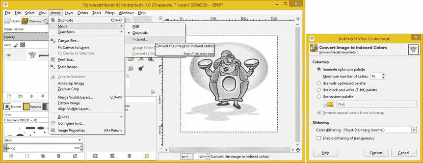
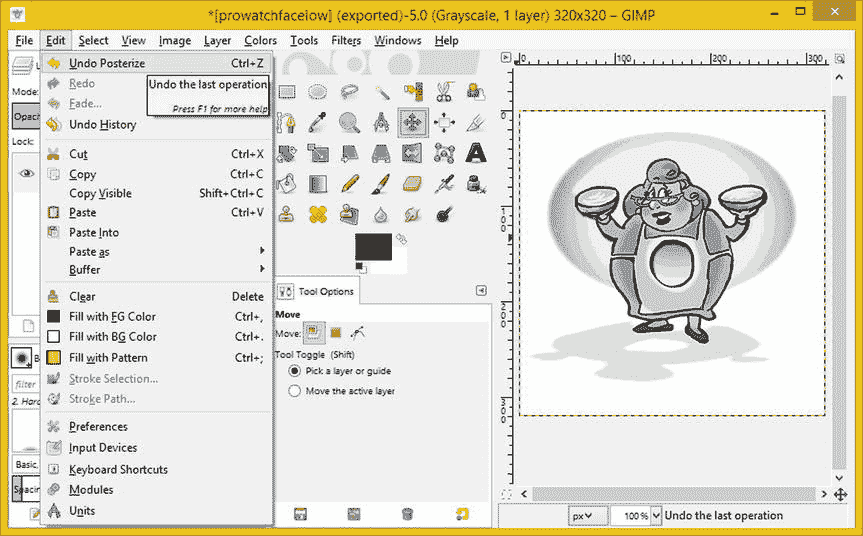

# 十二、表盘数字图像：开发多模式素材

现在，您已经安装了一个位图素材作为手表表面设计的背景，是时候进入数字图像和创建位图的不同模式兼容版本的工作过程了。在本章中你将使用 GIMP (GNU 图像处理程序),因为每个人都可以免费使用它，但是你也可以使用 Photoshop CS。

首先，我将讨论 GIMP 为我们提供了哪些数字图像处理算法，用于将交互模式素材(我将它用作 PNG 索引颜色(256 色)素材)转换为灰度和黑白模式，以便与环境模式、低位环境模式和老化保护模式一起使用。

一旦您为交互式(PNG8)、环境(PNG3)、环境低位(PNG1)和环境老化(PNG1)模式创建了位图资源，您将回到 Java 编码。您将修改自定义方法以合并这些位图资源之间的切换，以便矢量资源和位图资源都符合模式要求(或接近)，并且矢量和光栅设计组件无缝地一起渲染(工作)。

你将返工。onDraw()方法结构，以便每当模式发生变化时，位图对象将被重新缩放，因为您现在将跨所有模式实现大范围的位图图像素材。

您还将检查 ensureModeSupport()方法以优化处理，添加位图对象(背景)支持，添加老化保护模式支持，并使用另一个 else-if 部分扩展 if-else-if 结构。

位图模式环境 : GIMP 灰度图像模式

如果你还没有，在**gimp.org**下载并安装最新版本的 GIMP，然后启动它。使用**文件打开**菜单序列，进入**打开图像**对话框，如图图 12-1 所示，打开**prowatchfaceint.png**文件，该文件应该在本书的文件库中。


图 12-1 。使用文件打开菜单序列来访问打开图像对话框

正如您在对话框中看到的，GIMP 将允许您在对话框的左侧**位置**窗格中导航磁盘驱动器文件夹层次结构，并使用对话框右侧的**预览**窗格显示您选择的数字图像文件的信息。我选择的文件显示在对话框的中间部分。点击对话框右下角的**打开**按钮，打开您选择的文件。

请注意，我已经使用 **PNG8** 文件格式、优化了这个交互模式源图像，它使用 256 色加抖动。使用**抖动**可以让你模拟超过 256 种颜色。这样，当您也使用 256 级灰度创建灰度环境模式图像时，这也将有适当的抖动，使其看起来好像在环境模式图像中有超过 256 级的灰度。通过使用这种数字图像优化方法，您将能够为环境模式以及其他所需模式“预优化”图像素材。

通过使用抖动预优化 8 位图像，您将能够在环境模式下模拟超过 256 级的灰度，使其看起来像超过 256 种颜色(或对于环境模式，灰度级)。这是优化 8 位索引彩色抖动图像素材的优势之一；当您对它们应用灰度算法(对于环境模式)时，抖动也会出现，为环境模式资源提供与抖动为交互模式资源提供的相同的视觉升级效果，并具有完全相同的数据足迹优化(甚至可能更好)。

为了创建这个预优化的环境模式灰度图像，在 GIMP 的**图像**菜单下找到**模式**子菜单。单击模式菜单选项右侧向右箭头，并下拉子菜单。选择**灰度**选项，如图 12-2 顶部所示。


图 12-2 。使用图像模式灰度菜单序列将彩色图像转换为灰度图像

正如您所看到的，GIMP 已经确定所选择的图像是一个索引的 8 位图像。如果图像是 24 位(PNG24)或 32 位(PNG32)，那么 **RGB** 选项将带有项目符号。一旦您选择了这个灰度选项，它将被加上项目符号，并将应用 GIMP 算法从图像中移除**色调**(颜色)，仅保留**光度**(亮度)值。

现在你所要做的就是使用**文件导出为**菜单序列，如图 12-3 左侧所示，进入 GIMP **导出图像**对话框。


图 12-3 。使用 GIMP 文件导出为菜单序列访问导出图像对话框(像在 Photoshop 中另存为)

一旦你进入导出图像对话框，如图 12-4 所示，你可以选择中间区域的 prowatchint.png，这样你就不必再输入一遍，然后将“int”改为“amb”一旦你点击**导出**按钮，你会得到导出图像为 PNG 的选项对话框。取消选中所有选项以产生最小的文件大小。


图 12-4 。要使用灰度环境模式，将文件命名为 prowatchfaceamb.png，并选择最大 PNG 压缩

这将为您提供 **8 位灰度**环境模式图像，，它使用了您的灰度环境模式图像所能支持的最大数量的灰色值(256)。当然，一些智能手表可以支持 8 位灰度，但是，一些智能手表会将图像减少到更少的灰度，因此，我将向您展示如何优化更低的位级灰度图像，以防您的目标智能手表在环境模式下仅使用 16 种灰度。我还将向您展示如何创建仅使用八种灰度但仍然看起来很棒的位图图像(我甚至将向您展示如何使四种灰度看起来可以接受)。我还将介绍华硕 ZenWatch 使用的 1 位(两种灰度或黑白)低位环境模式。

低位模式位图:GIMP 的色调分离算法

你需要做的下一件事是创建**低位环境**模式图像。一些智能手表在不活跃使用(被观看)时会切换到“环境”低功耗使用模式。例如，索尼智能手表 3 (SW3)使用了**透反射屏幕**(一种可以在阳光下轻松阅读的技术)，在互动模式下使用 16 位(RGB 565)颜色(以及背光)，在环境模式下关闭背光以节省电能。所以你可以在索尼 SW3 环境模式下使用彩色，尽管谷歌 WatchFaces API 文档建议使用低位灰度。

这就是为什么我在本章的这一节详细介绍这种低位灰度优化的工作过程。一些智能手表制造商最终将使用比我之前提到的 256 级更少的灰度级。有些可能使用 16 ( **PNG4** 4 位)灰度，但也可能更少。请咨询您的智能手表制造商，了解他们的环境模式到底有多低！

掌握了目标智能手表制造商在环境模式下支持多少灰度(或颜色)的知识，以及您将在本章的这一部分学习的工作流程，您甚至可以优化八个灰度级( **PNG3** )，甚至一个微薄的四个灰度级( **PNG2** )，并且仍然使生成的位图图像素材看起来很好，特别是在较小的智能手表表面上，它使用相对**精细的点间距**(即小像素大小)。

要减少 8 位灰度图像中的灰度等级，您需要访问 GIMP **颜色**菜单，该菜单位于图 12-5 的顶部。找到**色调分离**选项并选择它进入一个对话框，允许你应用颜色(或灰度)减少算法。


图 12-5 。使用 GIMP Colors 色调分离菜单序列访问色调分离对话框，以减少灰色的数量

您要选择颜色的偶数位数 : **二色**为 **1 位**或**四色**为 **2 位**或**八色**为 **3 位**或 **16 色**为 **4 位**灰度。

是的，即使是灰色的阴影，或者黑色和白色，也被认为是颜色！接下来让我们启动色调分离对话框，创建一个 PNG4 4 位灰度图像。

正如你在图 12-6 中看到的，如果你选择了预览复选框，你将能够实时看到该算法的滑块设置对灰度图像的影响。


图 12-6 。将色调分离设置为 16 级灰色，以适应 4 位灰度环境模式显示

如果您将滑块值设置为 **16** (4 位)颜色值，您将看到视觉效果几乎与 256 色版本一样好，使用的灰度值数据少 16 倍！然而，存在一些可见的“条带”，这并不令人满意。稍后，在我解释了色调分离算法之后，我将讨论如何使用抖动技术来减轻索引色带化。我将解释这两个工作过程，这样你就会知道使用 GIMP 降低色彩值的所有主要方法。

目前，很难从智能手表制造商那里获得关于环境模式下灰度(甚至颜色)所用的位级的物理规格。希望制造商在未来为 Android 可穿戴设备开发者发布一份涵盖这一内容的技术信息白皮书。

这种环境模式能达到的最“低位”是 **1 位**或**低位**环境模式。在这里，您将使用 1 位图像来创建老化图像。

接下来，让我们看一个不同的工作过程，它允许你通过使用**索引颜色转换**对话框来访问 GIMP 2 抖动算法。

抖动低位图像:索引模式转换

因为你不能在色调分离对话框中访问 Floyd-Steinberg 抖动算法 ,我觉得这是 GIMP 2 开发者的疏忽，让我们看看另一个工作过程(和产生的对话框),它在颜色(这里是灰度)减少方面提供了更多的选择。

要访问弗洛伊德-斯坦伯格抖动算法，你需要使用**索引颜色转换**对话框。使用**图像模式索引**菜单序列进入，如图图 12-7 所示。这将改变一个图像回到索引颜色模式，你可能记得这是它开始的地方。进入灰度模式去除了**色调**值，只留下**亮度**值。



图 12-7 。使用图像模式索引菜单序列，并选择 Floyd-Steinberg 抖动算法

返回到索引图像模式(在这种情况下，由于源图像数据，它是灰度的)将触发索引颜色转换对话框。这是你可以找到弗洛伊德-斯坦伯格抖动算法选项的地方，你可以在图 12-7 的右下角看到它被选中。

选择**生成最佳调色板**单选按钮，设置 **16** 、 **8** 、 **4** 或 **2** 的**最大色数**值，点击**转换**按钮。正如你在图 12-8 中所看到的，将要应用的抖动可以在生成的低位灰度环境图像中产生显著的质量差异。右下角的 1 位环境模式(无失真)图像已经过反转(我将在“老化模式”部分讨论这一工作过程)和算法处理，以便最大限度地减少使用的白色像素数量。


图 12-8 。正如你所看到的，抖动将改善低比特环境模式图像质量一个数量级

一旦您确定了目标智能手表制造商支持的低位灰度级别，您就可以将文件导出为文件名**prowatchfacelow.png**。如果你对支持的灰度值的数量有任何疑问，使用 1 位方法，反转它(如果需要)，然后导出你的文件。您希望屏幕的大部分区域使用黑色(关闭)像素值。我将在**老化模式**部分讲述**反转**。

在您拥有最适合目标智能手表低位环境模式(或环境模式)的低位灰度环境模式图像后，使用 GIMP **文件导出为**菜单序列，如图图 12-3 所示，并将文件命名为**prowatchfacelow.png**，如图图 12-9 所示，在对话框顶部的名称字段中。点击**导出**按钮，导出索引色 **PNG** 文件(不选择选项)，16 灰度 **PNG4** ，8 灰度 **PNG3** ，4 灰度 **PNG2** ，黑白 **PNG1** 。


图 12-9 。使用文件导出为菜单序列使用导出图像对话框保存 prowatchfacelow.png

创建老化模式位图:使用反转算法

接下来你需要创建的是黑白(1 位)低位环境模式图形，也将用于老化模式。

这个过程的第一步是**撤销**你最后做的任何事情，无论是色调分离对话框还是索引颜色转换对话框。

GIMP Edit  Undo 菜单根据你的最后一次操作进行定制，所以如果你一直在使用色调分离对话框，那么这个菜单序列就是**EditUndo Posterization**。这可以在 GIMP 的左上角看到，如图图 12-10 所示。使用 Edit  Undo 的原因是，这样你就可以让完整的 8 位 256 级灰度图像进入任何算法。



图 12-10 。使用编辑撤销工作过程返回到 8 位(256 色)原始灰度图像数据

您可能希望在将图像“重新存储”为两种颜色(1 位或 PNG1)之前执行此操作，因为您希望为该色调分离算法提供尽可能多的原始灰度，因为该算法需要处理的数据越多，产生的结果就越好。

使用 GIMP **颜色 ** **色调分离**菜单序列(如图图 12-5 所示)再次进入色调分离对话框。这一次，你需要选择 **1 位**颜色(**两种**颜色)，这是最低可能的色调分离设置。

使用色调分离算法的原因是因为你特别不想要 1 位颜色抖动效果，如图 12-8 右上角所示。这是因为你试图得到一个**线条绘制效果** ，一旦你阿尔法混合表盘黑色背景色，这将使白色像素变暗为中灰色，这将提供所需的结果。这是为了确保在老化保护模式下不会发生老化。

设置及其结果可以在图 12-11 中看到。正如你所看到的，结果看起来不错，在智能手表显示屏上看起来会更好，因为像素间距点大小屏幕密度更精细。如果你想看看这是什么样子？setAlpha(127)，看一下图 12-15 中最右边的面板。


图 12-11 。使用色调分离对话框，将色调分离级别设置为两种颜色，然后单击确定按钮

如果你想要更细(更细)的线条，你可以使用**缩放工具** (它是一个放大镜)和**橡皮擦工具**(看起来像你以前学校的橡皮擦)手动擦除线条较粗部分的一些像素。

正如你可能已经注意到的，即使图形现在只使用黑白颜色值，没有防走样，正如老化模式所要求的那样，现在的问题是你的表盘是打开的(白色)，而不是关闭的(黑色)。你最终需要做的是与你现在在屏幕上看到的完全相反的结果。幸运的是，GIMP 有一种算法可以“翻转”或“反转”像素值，幸运的是，正如你可能想象的那样，它最适合黑白图像。

你将在算法上处理翻转白色背景颜色值以使背景变成黑色，同时使黑色线条变成白色的方法是使用 GIMP **Invert** 算法。这也位于**颜色**菜单下，在菜单上比色调分离选项更靠下一点，你可以在图 12-12 的中间看到。


图 12-12 。要将白色背景上的黑线反转为黑色背景，使用颜色反转菜单

当您选择此选项时，没有对话框，因为 GIMP 将简单地为您反转像素颜色值，并且您的图像将立即变成黑背景上的白线，这是老化保护模式所需的结果。

正如你在图 12-13 中看到的，你非常接近你需要的屏幕老化保护的结果，即只有在你绝对需要的地方是白色像素，其他地方都是黑色像素。重要的是要注意，如果您希望在老化保护模式下打开较少的像素，您可以在这些反转模式下编辑线条，使线条变细。


图 12-13 。GIMP 2.8.14 右预览区看到的颜色反转菜单序列的结果

事实上，这可能是获得一些 GIMP 2 数字图像编辑实践的好方法。要编辑这些线条，请使用放大镜工具放大图像，然后使用 GIMP 橡皮擦工具删除像素，直到图像中的所有线条都是一到两个像素宽。

为了谨慎起见，你也可以去掉拖鞋内部的颜色(白色);我会把这项工作留给你自己去做，这样你就可以得到一些使用 GIMP 的练习，因为这是一个重要的 Android watch face 开发工具，需要你去掌握。

需要指出的是，这些 **BagelToons LLC** 图片属于我的客户 Ira H. Harrison-Rubin，它们应该仅用于在本书的背景下学习和实践，因为 BagelToons 将发布所有 BagelToons 作品，包括这一张，作为 Watch Faces 应用。

细化完成后，使用**文件导出为**菜单序列进入**导出图像**对话框，如图图 12-14 所示，然后将此数字图像命名为**prowatchfacelow.png**。点击**导出**按钮(不选择选项)，将该**烧屏保护**图像素材以 **PNG1** 图像文件格式导出。


图 12-14 。使用文件【导出为】菜单序列使用导出图像对话框保存 prowatchfacelow.png

如果您打算将 1 位灰度用于**环境低位和老化模式，那么您将把文件保存为【prowatchfacelow.png】的**,并且仅使用**三个位图**来覆盖四种模式。我已经展示了一幅图像的四个位图——交互(8 位颜色)、环境(3 位、八级灰度)、低位环境(黑白)和老化保护(黑白)，如图图 12-15 所示，这样你就可以直观地比较所有这些。****

 **

图 12-15 。四种位图资源—8 位彩色、3 位灰度、黑白、黑白和灰色—涵盖了您的所有模式

现在让我们换个话题，开始一些 Java 编码，这样您就可以实现前三个位图文件了。稍后，您将实现老化模式，这可以通过位图资源或代码中的 alpha 混合来实现。

多模式位图:使用 Java 更改位图

要使 watch face 应用位图素材与您的模式检测代码兼容，您需要做的下一件事是更改 onDraw()和 ensureModeSupport()方法，以添加更改位图素材的代码。

首先，将 onDraw()方法中的`Resources watchFaceResources = ProWatchFaceService.this.getResources();` Java 语句移动到私有引擎类声明区域的顶部，如图 12-16 中的所示。因为不止一个方法将使用这个资源对象，所以您必须使它更加“可见”


图 12-16 。将资源对象声明、命名和加载 Java 语句移到引擎顶部

因为你将不止一次地缩放多个位图对象，即从交互模式到环境模式再回到交互模式，你需要将 if(scaleWatchFaceBitmap)结构**移回到**if(first draw)条件 if()结构之外，如图图 12-17 所示。


图 12-17 。将 if(scaleWatchFaceBitmap)结构移到 if(firstDraw)结构之外(在每次绘制时评估)

请注意，现在 if(scaleWatchFaceBitmap)是它自己的结构，您可以通过将 scaleWatchFaceBitmap 对象设置为 **null** (清除或清空它的值)来触发它进行位图评估和缩放。

这是因为 if()条件赋值器的**逻辑或**结构的一部分是**scaleWatchFaceBitmap = null**，所以如果您想要调用这个构造中的内容，只需将对象设置为 null，就可以为您创建的任何位图资源调用这个重新缩放逻辑。

在开始重写。ensureModeSupport()方法，您需要将您在前面使用 GIMP 一章中创建的素材安装到正确的 Android Studio 项目 HDPI 可绘制资源文件夹中。

将 prowatchfaceamb.png、prowatchfaceint.png 和 prowatchfacelow.png 位图素材从保存它们的文件夹中复制到**/ProAndroidWearable/wear/src/main/RES/drawable-hdpi/**文件夹中，如图图 12-18 所示。


图 12-18 。将 8 位交互式、3 位环境和 1 位低位环境位图复制到项目的/drawable-hdpi 文件夹中

如您所见，我使用了三种优化程度最高的位图素材，以便使用最少的颜色、灰度级别和黑白级别，并以智能手表显示图像所用的最少功率实现最小的文件大小。在图 12-18 中可以看到，视觉质量不错，这里我只使用 **256 色**(交互模式)**八灰度**(环境模式)或**黑白**(低位或烧屏模式)。

现在，您已经准备好修改环境模式和低位环境模式的 Java 代码，以便使用正确的位图资源。在黑色背景下工作良好的白色表盘元素将被重置为使用黑色，以获得与白色位图资源的最大对比度，但老化保护位图资源除外，在该资源中，您将使用白色表盘设计元素。让我们从灰度位图开始，然后实现索引颜色和预烧保护模式位图素材的 Java 代码。

将位图对象安装到低位环境模式

将带有 **prowatchfacelow** 素材引用的**watchfacedrable**配置语句和来自 onDraw()方法的 watchFaceBitmap 语句复制到 if(enableLowBitAmbientMode)构造的顶部。**颜色**值保持**白色**，因为背景是黑色的。在图 12-19 中可以看到 if 结构的 Java 代码，没有错误，应该如下所示:

```java
if( enableLowBitAmbientMode ) {
    watchFaceDrawable = watchFaceResources.getDrawable(R.drawable.prowatchfacelow);
    watchFaceBitmap = ((BitmapDrawable) watchFaceDrawable).getBitmap();
    scaleWatchFaceBitmap = null;
    pHourHand.setAlpha(255);
    pMinuteHand.setAlpha(255);
    pSecondHand.setAlpha(255);
    pTickMarks.setAlpha(255);
    pHourHand.setColor(Color.WHITE);
    pMinuteHand.setColor(Color.WHITE);
    pSecondHand.setColor(Color.WHITE);
    pTickMarks.setColor(Color.WHITE);
```


图 12-19 。复制 watchFaceDrawable 和 watchFaceBitmap 代码，并添加 scaleWatchFaceBitmap = null

如你所见，第三行代码是一个`scaleWatchFaceBitmap = null;`语句，它将**触发**if(scaleWatchFaceBitmap)条件语句。触发此方法的模式更改也将触发图像重新缩放代码(如果需要),因为此语句在前两个语句之后出现。

因为背景图像现在是灰度的，主要是白色的，所以您需要更改。setColor()方法调用来引用**颜色。黑色**常量，以便刻度线和表盘指针相对于背景位图对象(灰度数字图像素材)具有最大对比度。

接下来，您将对。setAlpha()方法调用，添加。setColor()方法调用，并将与位图对象相关的语句添加到第二个**else-if(is ambientmode())**结构中。由于在环境模式中使用了大量白色背景图像，您将再次需要使用**黑色**颜色值常量，并且您还将想要使表盘设计元素全黑，以获得最大的可读性，以及关闭这些表盘设计元素的屏幕像素。出于这个原因，你也可以将当前的 **127** Alpha 值设置为 **255** 的完全不透明值。我把这个方法结构中被改动过的 Java 语句都加粗了。如图 12-20 所示，Java 代码现在应该是这样的:

```java
} else if( isInAmbientMode() ) {
    watchFaceDrawable = watchFaceResources.getDrawable(R.drawable.prowatchfaceamb);
    watchFaceBitmap = ((BitmapDrawable) watchFaceDrawable).getBitmap();
    scaleWatchFaceBitmap = null;
    pHourHand.setAlpha(255);
    pMinuteHand.setAlpha(255);
    pSecondHand.setAlpha(255);
    pTickMarks.setAlpha(255);
    pHourHand.setColor(Color.BLACK);
    pMinuteHand.setColor(Color.BLACK);
    pSecondHand.setColor(Color.BLACK);
    pTickMarks.setColor(Color.BLACK);
```


图 12-20 。添加与位图相关的代码，将 Alpha 值更改为 255，将颜色值更改为 color。黑色

接下来，让我们修改 if-else-if-else 结构的 **else** 部分，以添加与位图对象相关的语句，这些语句将设置当手表表面处于**交互模式**时，您将为其使用的索引彩色图像素材。

优化交互模式:将刻度线颜色设置为黑色

条件 if-else 结构的最后一个 else 部分构成了 ensureModeSupport()方法的大部分，它设置交互模式特征(如果没有设置其他模式标志的话)。这段代码改动最少，只把**光学标记**对象改成了**颜色。黑色**并添加您在其他部分添加的位图相关的 Java 语句。你的代码，如图图 12-21 所示，应该是这样的:

```java
} else {
    watchFaceDrawable = watchFaceResources.getDrawable(R.drawable.prowatchfaceint);
    watchFaceBitmap = ((BitmapDrawable) watchFaceDrawable).getBitmap();
    scaleWatchFaceBitmap = null;
    pHourHand.setAlpha(255);
    pMinuteHand.setAlpha(255);
    pSecondHand.setAlpha(255);
    pTickMarks.setAlpha(255);
    pHourHand.setColor(Color.BLUE);
    pMinuteHand.setColor(Color.GREEN);
    pSecondHand.setColor(Color.RED);
    pTickMarks.setColor(Color.BLACK);
}
```


图 12-21 。在 else 结构的顶部添加与位图对象相关的代码，并将光学标记更改为颜色。黑色

现在，您已经在 ensureModeSupport()方法中添加了与位图相关的内容并更改了颜色，从而最大限度地提高了现有 Java 代码的可读性，接下来让我们在 Square AVD 模拟器中测试交互式、环境和低位环境模式。

在 Square AVD 中测试交互和环境模式

确保您已经删除了私有引擎类中所有出现的强制标志设置，换句话说，删除`lowBitAmbientModeFlag=true; and burnInProtectModeFlag=true;`代码片段。接下来，使用**运行运行磨损**菜单序列并启动 Square AVD 仿真器。如果您想确保您的 Square AVD 仿真器是当前选择的仿真器，您可以使用**运行编辑配置**菜单序列。

一旦模拟器启动并加载 Pro 手表表面，您将看到方形手表表面测试模式，因为您将该代码留在了。onDraw()方法。如果你想知道我为什么这样做，这是为了向你展示如何在 watch face 启动时显示不同的位图(比如法律免责声明，在手表表面后面，第一次启动时)。

在第十三章介绍表盘配置对话框中添加圆形表盘装饰支持时，知道如何实现是非常有用的。最理想的情况是，您可以完全删除这些代码，只使用正方形位图资源作为表盘背景。

但是，我想向您展示，通过在。onDraw()方法结构。在任何情况下，一旦你看到正方形测试屏幕，它仍然是从 if(firstDraw)代码调用的，按下 **F7** 键，你将看到环境模式位图素材，它显示在图 12-22 的左侧。


图 12-22 。使用设置改变手表表面专业手表表面系列，和 F7 测试环境模式

如果您再次切换 F7 键，您将触发。ensureModeSupport()方法。颜色结果可以在图 12-22 的右侧看到，正如你所看到的，状态栏图标和 Peek 卡与背景艺术作品的定位是完美的。

为了测试低位(在此优化素材的情况下为 1 位颜色)模式，您需要在 onAmbientModeChanged()方法中，紧接在**super . onAmbientModeChanged()**方法调用语句之后，再次安装一个`lowBitAmbientModeFlag=true;`强制模式开关，如图图 12-23 所示。


图 12-23 。在 onAmbientModeChanged()方法中将 lowBitAmbientModeFlag 布尔值设置为 true 值

强制将这个低位环境模式标志设置为“开”状态，如果(lowBitAmbientModeFlag) 关闭代码中的抗锯齿，这应该在**之前完成，正如你在图 12-24 中看到的，也调用 ensureModeSupport()方法，该方法安装低位(1 位颜色)图形。**


图 12-24 。使用设置改变手表表面 Pro 手表表面系列，和 F7 测试低比特环境模式

现在，当你使用 **Run  Run Wear** 并启动 AVD 仿真器，然后使用**SettingsChange Watch FacePro Watch FaceF7 键**时，你将得到启用低位模式的环境模式，如图 12-24 左侧所示。

你需要做的下一件事是创建低比特环境模式位图的老化模式版本，它将使用**灰色**颜色值而不是白色值。您将使用 GIMP 将白色像素更改为 **50%灰色**颜色值，这将匹配 Android **颜色。灰色**恒定完美，提供了一个灰色“老化”版本的低位环境模式。

之后，您将把**if(enableBurnInAmbientMode)**构造添加到 enableModeSupport()方法中，该方法设置正确的位图和颜色值。

Android Wear 老化模式:位图和 Java 代码

为了彻底了解表盘设计，让我们实现一个老化模式图像和 Java 代码，通过这种低位设计创建老化保护！

创建老化模式位图 : GIMP 亮度-对比度

如果 GIMP 没有打开，打开它，使用**文件打开**菜单序列打开你的**prowatchfacelow.png**文件。你要将位图的白光强度“调暗”50%，以匹配 Android **的颜色。灰色**常数。

正如你在图 12-25 中看到的，你在 GIMP 中实现这一点的方法是使用**颜色亮度对比**菜单序列，这将打开一个对话框，允许你调暗表盘设计中白色像素发出的光线(亮度)。相当酷！


图 12-25 。打开 prowatchfacelow.png 文件并调用颜色亮度-对比度菜单序列

在图 12-26 的右侧显示的亮度-对比度对话框将允许您在不同的亮度(或对比度)设置下设置**预置**。当您设置好想要保存的设置后，点击加号( **+** )图标即可。例如，你现在可以尝试将设置保存为“Android 50%灰度老化保护模式预设”。


图 12-26 。将亮度滑块调整到最左侧，将亮度降低 50%(或 127/255)

将**亮度**滑块向左拖动到 **-127** 值，实际上是 128，因为从零开始计数，正好是 8 位灰度范围内 256 个值的**一半**。确保您的**预览**复选框被选中，这样您可以实时看到修改，然后单击**确定**按钮，这将完成操作并应用算法。

接下来，您需要使用 GIMP **文件导出为**工作流程保存老化模式数字图像素材，如图图 12-27 所示，并使用相同的 15 字符格式将文件**命名为 prowatchfacebur.png**。


图 12-27 。使用文件【导出为】菜单序列使用导出图像对话框保存 prowatchfacebur.png

现在，您已经准备好返回 Java 编码，并通过插入一个新的 **if-else** 部分，在 **enableModeSupport( )** 方法中实现老化保护模式。

Java 中的老化保护:if(enableburniambientmode)

在 ensureModeSupport()方法结构中，您需要做的第一件事是在方法结构的顶部添加一个布尔 enableBurnInAmbientMode 变量。您将把它设置为一个逻辑与条件，如果**is ambientmode()**返回 **true 并且 **burnInProtectModeFlag** 被设置为 **true** 值，那么它将返回一个 **true** 值。否则，这将评估为假，因为老化保护要求环境模式开启，并且老化制造商支持常数到位并指定。**

在私有方法中创建了这个新的布尔标志之后，您将需要在低位环境部分之后和仅环境模式部分之前添加一个 **if-else** 条件部分。方法的结尾是最后的 else 部分，它涵盖了交互模式设置。

这个**if(enableBurnInAmbientMode)**构造应该使用您刚刚创建的**prowatchfacebur.png**图像资源加载一个 **watchFaceDrawable** 对象，然后使用**从 Drawable 中提取新的老化模式位图对象。getBitmap( )** 方法，将它放在 **watchFaceBitmap** 对象中。一旦完成，您可以将 **scaleWatchFaceBitmap** 对象设置为 **null** 。这将触发 onDraw()方法中的重缩放计算，因为您已经为新模式更改了位图资源，这可能是必要的。

作为一种优化技术，我将使用 255(完全打开)的 alpha 值和 Android OS 颜色，而不是使用 127 alpha 通道值来创建 50%的灰度值，就像您之前所做的那样。设定表盘指针和刻度线颜色值的灰色常数。

如果你想知道为什么使用这种安卓颜色。灰色常数是一种优化，如果你使用的 alpha 通道值为 255，这是因为 Android 不会调用其混合算法，这可能是处理密集型的。此外，您不希望通过将白色与您创建的烧屏保护图像中使用的灰色混合来创建亮像素。

您会注意到，在 ensureModeSupport()方法的 Java 代码清单中，我将完整地包括它，因为您现在已经实现了所有这些模式及其位图对象，您没有对这些位图图像素材使用任何 alpha 混合，因此您已经在整个方法中应用了这种优化技术。如果您打算使用背景位图，您可以决定删除这些调用！

完了。ensureModeSupport()方法可以在图 12-28 中看到，Java 代码应该是这样的方法结构:

```java
private void ensureModeSupport(){
    boolean enableLowBitAmbientMode = isInAmbientMode() && lowBitAmbientModeFlag;
    boolean enableBurnInAmbientMode = isInAmbientMode() && burnInProtectModeFlag;
    if (enableLowBitAmbientMode) {
        watchFaceDrawable = watchFaceResources.getDrawable(R.drawable.prowatchfacelow);
        watchFaceBitmap = ((BitmapDrawable) watchFaceDrawable).getBitmap();
        scaleWatchFaceBitmap = null;
        pHourHand.setAlpha(255);
        pMinuteHand.setAlpha(255);
        pSecondHand.setAlpha(255);
        pTickMarks.setAlpha(255);
        pHourHand.setColor(Color.WHITE);
        pMinuteHand.setColor(Color.WHITE);
        pSecondHand.setColor(Color.WHITE);
        pTickMarks.setColor(Color.WHITE);
    } else if (enableBurnInAmbientMode) {
        watchFaceDrawable = watchFaceResources.getDrawable(R.drawable.prowatchfacebur);
        watchFaceBitmap = ((BitmapDrawable) watchFaceDrawable).getBitmap();
        scaleWatchFaceBitmap = null;
        pHourHand.setAlpha(255);
        pMinuteHand.setAlpha(255);
        pSecondHand.setAlpha(255);
        pTickMarks.setAlpha(255);
        pHourHand.setColor(Color.GRAY);
        pMinuteHand.setColor(Color.GRAY);
        pSecondHand.setColor(Color.GRAY);
        pTickMarks.setColor(Color.GRAY);
    } else if ( isInAmbientMode() ) {
        watchFaceDrawable = watchFaceResources.getDrawable(R.drawable.prowatchfaceamb);
        watchFaceBitmap = ((BitmapDrawable) watchFaceDrawable).getBitmap();
        scaleWatchFaceBitmap = null;
        pHourHand.setAlpha(255);
        pMinuteHand.setAlpha(255);
        pSecondHand.setAlpha(255);
        pTickMarks.setAlpha(255);
        pHourHand.setColor(Color.BLACK);
        pMinuteHand.setColor(Color.BLACK);
        pSecondHand.setColor(Color.BLACK);
        pTickMarks.setColor(Color.BLACK);
    } else {
        watchFaceDrawable = watchFaceResources.getDrawable(R.drawable.prowatchfaceint);
        watchFaceBitmap = ((BitmapDrawable) watchFaceDrawable).getBitmap();
        scaleWatchFaceBitmap = null;
        pHourHand.setAlpha(255);
        pMinuteHand.setAlpha(255);
        pSecondHand.setAlpha(255);
        pTickMarks.setAlpha(255);
        pHourHand.setColor(Color.BLUE);
        pMinuteHand.setColor(Color.GREEN);
        pSecondHand.setColor(Color.RED);
        pTickMarks.setColor(Color.BLACK);
    }
}
```


图 12-28 。添加带有颜色的 else if(enableBurnInAmbientMode)构造。灰度和 prowatchfacebur 图像

现在是时候测试预烧保护模式的 Java 代码，以及位图数字资源，这是您在本节前面使用 GIMP 亮度-对比度对话框创建的。

测试老化保护模式位图和 Java 代码

打开。onAmbientModeChanged()方法构造并移除强制`lowBitAmbientModeFlag=true;`布尔标志语句，该语句用于测试低位环境模式。相反，这里您将添加强制`burnInProtectModeFlag=true;`布尔标志语句，现在您将利用它来测试老化保护模式。

那个。onAmbientModeChanged()方法结构，可以在图 12-29 中看到，应该看起来像下面的 Java 方法结构:

```java
@Override
public void onAmbientModeChanged(boolean ambientModeFlag) {
    super.onAmbientModeChanged(ambientModeFlag);
    if(lowBitAmbientModeFlag) setAntiAlias(!ambientModeFlag);
    burnInProtectModeFlag = true;
    if(burnInProtectModeFlag) setBurnInProtect(ambientModeFlag);
    ensureModeSupport();
    invalidate();
    checkTimer();
}
```


图 12-29 。将 burnInProtectModeFlag 设置为 true，强制老化保护模式测试位图

使用 IntelliJ 中的 **Run  Run Wear** 工作流程，并使用 Android Wear Square AVD 仿真器测试代码和位图对象。正如你在图 12-30 中看到的，你已经实现了 50%暗烧模式版本的低位模式。


图 12-30 。使用设置改变表盘 Pro 表盘系列，和 F7 键测试环境老化模式

值得注意的是，我将在下一章中通过添加额外的 Java 代码来介绍圆形 AVD 仿真器和圆形表盘设计原则和技术，这将涉及如何允许用户定制表盘设计。其原因主要是优化驱动的决策。为什么要为表盘设计提供圆形和方形图像资源，而方形资源可以用于两者？圆形表盘**装饰**，例如装饰性的**轮圈**，最终用户可以添加用于他们自己定制的装饰。这样，如果用户希望，即使是方形表盘也可以具有圆形表盘设计装饰。这通过用户界面增加了表盘设计的价值。

摘要

在本章中，您学习了如何使用 GIMP 创建，以及如何使用 enableModeSupport()和 onDraw()方法实现大量不同的表盘设计模式。智能手表制造商将需要其中一些低功耗模式，具体取决于显示技术。

首先，我讨论了如何将优化的交互模式位图图像素材转换为灰度图像，这是环境模式通常需要的，也是 Android 推荐的。

之后，您学习了如何减少图像资源使用的灰色或灰度数量，因此您可以针对某些制造商智能手表产品要求的某些较低位模式进行优化。例如，索尼智能手表 3 有一个 3 位或 8 级灰度的环境模式，现在你知道如何使用弗洛伊德-斯坦伯格抖动算法来优化你的位图。

在创建了几个数字图像素材之后，您还学习了如何将 Java 代码添加到。enableModeSupport()方法结构，以及如何修改 onDraw()方法结构，以便每次模式改变时，如果位图资源的分辨率与图像资源不同，位图资源将被重新评估和重新缩放，以适应智能手表屏幕。

在下一章，你将学习如何使用 Android Wear 应用的另一面(或组件)，即 Android Studio (IntelliJ)中所称的“移动”面。对于这个主题，Java 编码和 XML 标记变得更加复杂。因此，下一章将起到将本书的这一手表表面设计部分与本书的其他 Android(非 WatchFaces API)穿戴主题章节(第十七章)进行“桥接”的作用。**