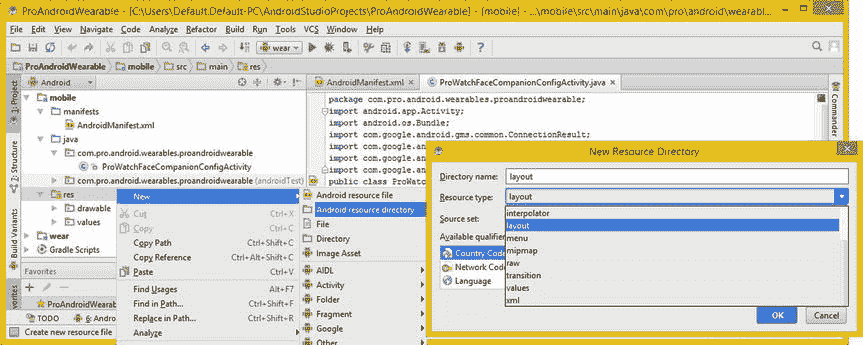
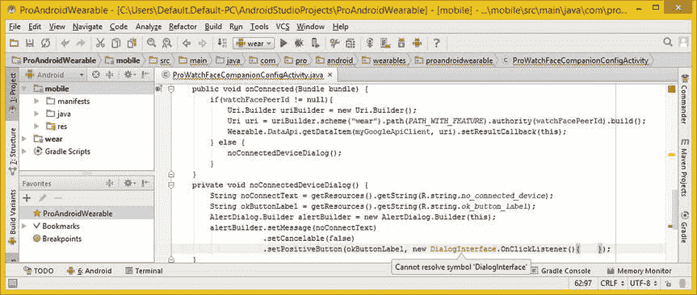
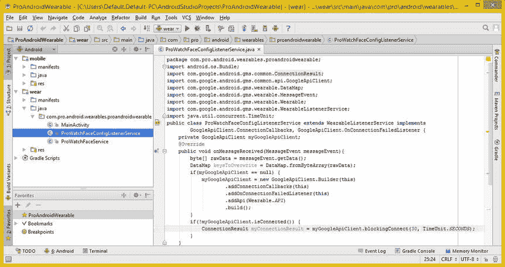

# 十三、表盘配置伴侣活动：谷歌移动服务

现在，您已经拥有了可在所有显示模式下工作的基本位图和矢量表盘设计，是时候切换到移动(智能手机)设备并创建表盘“功能选择器”应用了，这将允许您的用户定制自己的表盘设计。这将允许您为您的手表面孔应用收费，因为它们将是定制的手表面孔生成器应用，而不仅仅是简单的手表面孔。

这和表盘设计本身一样复杂，只是方式不同。在本章中，你将了解到 **Google API 客户端** Java 接口，它用于将 **Google Play 服务**集成到你的手表表面可穿戴应用中。

这涉及到使用一系列的 **com.google.android.gms** 包和它们的类，这是我将在本章介绍的大部分内容，同时创建一个将在用户智能手机上运行的类和另一个将驻留在项目 wear 部分的侦听器类。谷歌移动服务(GMS)就是 Android Wear 云！

您将了解可用于创建 Wear Companion 智能手机应用的 Android GMS 类和接口。它们包括 API，比如 GoogleApiClient，它允许你创建一个 Google Play 服务的客户端。其他穿戴 Api 还包括 **DataApi** 、 **DataItem** 、 **DataMap** 、 **DataMapItem** 、 **ComponentName** 、 **MessageEvent** 、 **WatchFaceCompanion** ，甚至还有 **CompanionResult** 。您还将了解 Android **AlertDialog** 类和 Android **Uri** 类，以及它们如何用于 WatchFace 应用开发。

创建一个 ProWatchFaceCompanionConfigActivity

在本节中，您将为表盘用户手机上的对话创建基础，该对话将允许用户配置表盘设计特征。你对用户的表盘设计控制得越多，你对表盘应用的收费就越高。您将添加一个 **< activity >** 标签到 AndroidManifest.xml 文件，该文件位于 Android Studio 项目的移动部分。然后你将在你的项目的移动组件中创建一个空的**ProWatchFaceCompanionConfigActivity.java**结构，然后在你实际编写 Java 代码实现这个类之前学习 Android **GoogleApiClient** 公共接口，它将为你的手表脸提供一个 UI。

移动应用:将你的活动添加到 AndroidManifest

关闭 Android Studio 项目中所有打开的与 **wear** 部分相关的编辑选项卡，然后打开项目的 **mobile** 部分，如图图 13-1 所示。在**manifest**文件夹中，右键单击 **AndroidManifest.xml** 并选择**跳转到源代码**选项在编辑选项卡中打开该文件。


图 13-1 。关闭所有选项卡，打开项目的移动部分，右键单击 AndroidManifest，然后选择跳转到源代码

在父 **<应用>** 标签内添加一个子 **<活动>** 标签，并用 **app_name** 标签将其命名为**ProWatchFaceCompanionConfigActivity**。在<活动>标签内添加一个子 **<意图过滤>** 标签。在这个里面添加一个 **<动作>** 子标签，带有一个**配置 _ 数字**动作常量，以及两个 **<类别>** 子标签，带有**伴侣 _ 配置**和**默认**常量。注意，我还在清单顶部添加了一个 **< uses-sdk >** 标签，带有一个**最低 SDK** 版本 API 级别 **18** 和**目标 SDK** 版本 API 级别 **21** 。<使用权限>标签增加了**提供 _ 背景**和**唤醒 _ 锁定**功能。如图 13-2 所示，你的 XML 标记应该如下所示:

```java
<manifest xmlns:android=http://schemas.android.com/apk/res/android
    package="com.pro.android.wearables.proandroidwearable">
    <uses-sdk android:minSdkVersion="18" android:targetSdkVersion="21" />
    <uses-permission android:name="com.google.android.permission.PROVIDE_BACKGROUND" />
    <uses-permission android:name="android.permission.WAKE_LOCK" />
    <application android:allowBackup="true"
        android:label="@string/app_name" android:icon="@drawable/ic_launcher"
        android:theme="@style/AppTheme" >
        <activity
            android:name=".ProWatchFaceCompanionConfigActivity"
            android:label="@string/app_name" >
            <intent-filter>
               <action android:name="com.pro.android.wearables.proandroidwearable.CONFIG_DIGITAL" />
               <category android:name=
                         "com.google.android.wearable.watchface.category.COMPANION_CONFIGURATION" />
               <category android:name="android.intent.category.DEFAULT" />
            </intent-filter>
        </activity>
    </application>
</manifest>
```


图 13-2 。为 ProWatchFaceCompanionConfigActivity 添加一个<活动>父标签和<意图过滤>子标签

您可能已经注意到，IntelliJ 在 android:name 参数值上给出了一个红色文本错误高亮显示。因为您还没有创建那个 Java 文件。你将在本章的下一节纠正这一点，所以这将很快消失！

现在，让我们打开/mobile/res/values/strings.xml 文件，并为该活动指定 Pro WatchFace Options 的 app_name，以便应用的标签描述它的功能。如图 13-3 中的所示。


图 13-3 。编辑/res/values/strings.xml 中的 app_name 变量，并将 Activity Pro WatchFace Options 命名为

接下来，您需要创建一个 prowatchfaceconnectionconfigactivity Java 类。

Java 类:创建 WatchFace 同伴活动

让我们通过右击移动 java 文件夹，然后选择新的 Java 类上下文相关菜单序列来创建一个新的 Java 类，如图 13-4 左侧所示(编号为步骤 1)。在**选择目标目录**对话框中，选择主包(不是 androidTest 选项)并点击 **OK** 按钮。在**新建类**对话框中，将您的类命名为**ProWatchFaceCompanionConfigActivity**，将 **Kind** 设置为**类**，点击 **OK** 按钮，创建一个表盘设计配置活动类。


图 13-4 。创建 ProWatchFaceCompanionConfigActivity.java 文件以删除红色错误高亮显示

当我输入包名时，我得到一个红色的错误高亮，可以在图 13-5 的顶部看到。当我查看 IntelliJ 项目管理窗格时，我注意到 IntelliJ 没有遵循我的指示，如图图 13-4 中编号 2 所示，并把我的类放在 **androidTest** 文件夹中，在那里它随后生成了“不正确的包路径”错误。


图 13-5 。拖动 ProWatchFaceCompanionConfigActivity 并将其放在 proandroidwearable 包中

我纠正这个错误的方法(在 IntelliJ 方面)是将 Java 类文件从 androidTest 文件夹中拖到普通(非 androidTest)包文件夹中。这导致了“移动类”对话框的出现，在这里我点击了 **Refactor** 按钮，将类移动到正确的文件夹中，并为所有内容正确地设置了内部“因子”(指针)，这样编译器就可以“看到”所有内容是如何组合在一起的。这可以从图 13-5 中看出。

现在你可以添加 Java **扩展**关键字 和 **Activity** 类，你需要扩展它们来使这个类成为一个 Android Activity，它在很大程度上用于保存用户界面设计。

您还需要添加 Java **实现**关键字，因为您将指定三个 Java 接口。您的智能手机和智能手表硬件之间的通信将需要这些。

你可以在图 13-6 中看到这两个 Java 关键字，以及 IntelliJ 弹出助手对话框，它显示了两个接口和一个嵌套类，它们是 **GoogleApiClient** 接口的一部分。在创建了这个空代码基础结构之后，您将在下一节中了解 GoogleApiClient，这样您就可以看到实现一个基本的(即空的)watch face companion 配置活动类、公共接口和被覆盖的(@Override 关键字)方法基础结构需要什么。


图 13-6 。使用弹出的助手对话框实现 GoogleApiClient 类的 ConnectionCallbacks 接口

在 implements 关键字后，输入 GoogleApiClient 接口和一个句点，会弹出 helper 对话框，在这里可以选择一个**connection callbacks(com . Google . Android . GMS . common . API . Google API client)**选项。如果希望 IntelliJ 为您编写代码，请双击此选项。对**onconnectionfailed listener**接口 也进行同样的操作，这也显示在图 13-6 中弹出的帮助器对话框中。

一旦你实现了 GoogleApiClient 接口，你会想要添加 ResultCallback 公共接口，你可以看到我已经在图 13-7 的中间添加了这个接口。你完成的(空的)Java 类声明看起来像下面的 Java 结构，这也可以在图 13-7 中看到:

```java
public class ProWatchFaceCompanionConfigActivity extends Activity implements
        GoogleApiClient.ConnectionCallbacks, GoogleApiClient.OnConnectionFailedListener,
        ResultCallback<DataApi.DataItemResult> {  // Your Java class code will go in here  }
```


图 13-7 。添加 ResultCallback < DataApi。DataItemResult >接口；使用 Alt+Enter 导入 DataApi 类

正如你在图 13-7 中看到的，你需要使用一个 **Alt+Enter** 组合键来让 IntelliJ 为你编写 DataApi 导入语句。

正如你在图 13-8 和 IntelliJ 中注意到的，在左边有一个错误提示灯泡图标。下拉此 how-to-correct 错误建议菜单，选择**实现方法**选项，打开**选择方法实现**对话框，如图 13-8 右侧所示。


图 13-8 。下拉错误建议，并选择实现方法选项；实现所有方法

选择所有需要被覆盖的方法并点击 **OK** 按钮，IntelliJ 将为您编写整个类结构。由此产生的空类结构可以在图 13-9 中看到。


图 13-9 。空的 prowatchfacecompancionconfigactivity，有六个导入语句，四个必需的方法

接下来您需要做的是添加<meta-data>标记来支持 CONFIG_DIGITAL 常量值，该常量值由 CompanionConfigurationAction 元数据对象保存。这是在 wear 项目的 AndroidManifest XML 定义文件中完成的，位于现有的父标签<service>内。</service></meta-data>

Wear 应用:将伴随元数据添加到清单

接下来您需要做的是将第四个<meta-data>标签添加到 wear 应用的父标签<service>中，该标签已经在项目的 wear 应用部分(section)的 Android 清单文件中。元数据条目定义了您将在应用中使用的东西，例如壁纸资源、表盘预览图像资源，或者在本例中，您在 mobile AndroidManifest.xml 中定义的 **CONFIG_WATCH_FACE** 动作，它将启动 Configuration Companion 活动。</service></meta-data>

在图 13-10 的底部，可以看到这个<meta-data>标签的 XML 标记突出显示，看起来应该像下面的 XML 标签结构:</meta-data>

```java
<meta-data android:name="com.google.android.wearable.watchface.companionConfigurationAction"
           android:value="com.pro.android.wearables.proandroidwearable.CONFIG_WATCH_FACE" />
```


图 13-10 。在<服务>标签内的 wear/manifest/androidmanifest . XML 中添加一个<元数据>子标签

既然已经设置了 Android Manifest XML 定义文件，并且已经将空的 prowatchfacecompcompanionconfigactivity 类结构放置到位，那么在开始编写所有这些方法的代码之前，让我们快速浏览一下 GoogleApiClient 类并了解一下 Google Play 服务。

Google Play 服务:GoogleApiClient 类

要访问 Google Mobile Services 和 Google Play Services 服务器，您需要为访问这些服务器的任何类创建一个 GoogleApiClient 对象。我喜欢将我的 GoogleApiClient 对象命名为 my GoogleApiClient。

Android 的 GoogleApiClient:使用谷歌移动服务

GoogleApiClient 公共接口是 Google 移动服务 API 的一部分。它位于 com . Google . Android . GMS . common . API . Google API client 包中，是 Google Play 服务集成的主要应用“入口点”。

在执行任何操作之前，GoogleApiClient 必须使用**连接到 Google Play 服务。connect( )** 方法。这通常是通过**完成的。onStart( )** 方法，您将在本章稍后使用下面的 Java 结构对其进行编码:

```java
@Override
protected void onStart( ) {
    super.onStart( );
    myGoogleApiClient.connect( );
}
```

在调用**public void on connected(Bundle Bundle)**回调方法之前，您的 Google Play 服务客户端不会被视为已连接。这个空的方法可以在图 13-9 中间看到。

GoogleApiClient 对象可以与许多静态方法一起使用。 这些方法中的一些将需要连接 GoogleApiClient 对象，而其他方法在 GoogleApiClient 连接到客户端活动之前将调用排队。检查每种方法的当前 API 文档，以确定您的客户端是否需要连接。

当您的 watch face 应用使用 GoogleApiClient 对象完成时，您将需要调用。disconnect()方法。 这一般通过**来完成。** **onStop( )** 方法，在本章稍后的部分，你也将使用下面的 Java 结构对其进行编码:

```java
@Override
protected void onStop( ) {
    if (myGoogleApiClient != null && myGoogleApiClient.isConnected( )) {
        myGoogleApiClient.disconnect( );
    }
    super.onStop( );
}
```

您应该使用一个 **GoogleApiClient 实例化活动**onCreate(Bundle saved instancestate)**方法中的 GoogleApiClient 对象。构建器**嵌套(帮助器)类。你将在本章后面编写的 Java 代码看起来像这样:

```java
protected void onCreate(Bundle savedInstanceState) {
        super.onCreate(savedInstanceState);
        setContentView(R.layout.activity_pro_watch_face_config);
        myGoogleApiClient = new GoogleApiClient.Builder(this)
                .addConnectionCallbacks(this)
                .addOnConnectionFailedListener(this)
                .addApi(Wearable.API)
                .build( );
    }
```

有趣的是，我在这里讨论的所有嵌套类都是在上面列出的 GoogleApiClient 实例化代码中调用的。

*   GoogleApiClient。构建器嵌套类 提供了一个**构建器类**，用于使用**点标记链**配置 GoogleApiClient 对象。您可以在上面的代码中看到这一点，尽管方法链是使用句点对齐的，而不是使用句点将方法调用“链接”在一起。
*   GoogleApiClient。ConnectionCallbacks 嵌套接口提供了回调对象 ，当客户端连接到 Google Play 服务或从 Google Play 服务断开时调用这些回调对象。
*   一个 GoogleApiClient 客户端。OnConnectionFailedListener 嵌套接口将为 Google Play 服务访问导致尝试将 GoogleApiClient 对象连接到此 Google Play 服务失败的场景提供回调对象。

GoogleApiClient 类包含 **15** 个公共方法。我不能在这里涵盖所有这些，但是我将涵盖您将在 Java 代码中使用的那些，以实现配套的监视界面配置活动。

如果您想快速了解所有 15 个 GoogleApiClient 方法调用规范，可以访问 Android 开发者网站，网址为:

```java
https://developer.android.com/reference/com/google/android/gms/common/api/GoogleApiClient.html
```

*   抽象的虚空**。****方法 用于将 GoogleApiClient 对象连接到 Google Play 服务服务器。您将在。prowatchfaceconnectionconfigactivity 类中的 onStart()方法。**
***   抽象的虚空**。** **disconnect( )** 方法用于**在您使用完毕后关闭与 Google Play 服务服务器的连接**。您将在中使用它。onStop()方法，在本章的后面，当您开始实现您的所有方法时。*   抽象布尔**。** **isConnected( )** 方法用于检查 GoogleApiClient 对象是否为当前连接到 Google Play 服务的 **。如果是，那么对其他 Google Play 服务方法的请求将会成功。***   抽象布尔**。** **isConnecting( )** 方法 检查 GoogleApiClient 对象是否为当前试图将与 Google Play 服务连接的**。****

 **接下来，让我们为 ProWatchFaceCompanionConfigActivity 类的 onCreate()方法准备一些 XML 基础结构。创建这些 XML 素材后，您可以在 Java 代码中引用 XML 组件。之后，您将了解 GoogleApiClient。构建器嵌套类，然后构建 GoogleApiClient 对象，这样您就可以在 Pro Watch Face 应用中实现 Google Play 服务，您将在本书中继续改进该应用。有大量的代码要写，有大量的 Android 类要学，所以让我们继续吧！

创建播放客户端:编写您的。onCreate()方法

任何 Android 活动中最重要的方法是 onCreate()方法，因为它总是必须在适当的位置，它创建用户界面布局，在这种情况下，还有 GoogleApiClient 对象及其对等 id。

您需要做的第一件事是通过一个**受保护的 void onCreate(Bundle savedInstanceState)**方法结构覆盖 Activity 超类 onCreate()方法。在该方法中，您将使用 Java super 关键字将 savedInstanceState Bundle 对象向上传递给 Activity 超类，以便超类。onCreate()方法可以处理它。在图 13-11 中间用黄色突出显示的 Java 方法结构应该类似于下面的 Java 代码:

```java
@Override
protected void onCreate(Bundle savedInstanceState) {
    super.onCreate(savedInstanceState);
}
```


图 13-11 。向该类添加一个受保护的 void onCreate()方法和 super.onCreate()超类方法调用

才能调用标准活动**。** **setContentView( )** 方法，您需要创建**布局** XML 目录，并将素材放置在项目的这个**移动**部分中。右击 **/mobile/res** 文件夹，选择**新建 Android 资源目录**菜单序列。使用**资源类型**下拉框选择**布局**；这也将设置文件夹名称，如图图 13-12 所示。



图 13-12 。右击/res 文件夹，选择新建 Android 资源目录菜单选项和对话框

点击 OK 按钮创建 **/mobile/res/layout** 文件夹，然后在项目导航窗格中右键点击这个新文件夹，选择**新建 Android 资源文件**菜单序列。

这个菜单序列也可以在图 13-12 中看到，在新建子菜单的顶部，所以我这里只显示**新建资源文件**对话框，你可以在图 13-13 中看到。您将使用 Android Activity 用户界面布局文件命名约定来命名 XML 资源文件(Activity 优先并使用下划线字符)，因此使用名称 activity_pro_watch_face_config 并选择一个 LinearLayout 根元素，保留其他两个字段的默认设置(main 和 layout)。点击 **OK** 按钮，创建一个新的**activity _ pro _ watch _ face _ config . XML**用户界面布局定义文件。这将保存配置 UI 的用户界面定义。


图 13-13 。右键点击新建/res/layout 文件夹，选择新建 Android 资源文件选项和对话框

bootstrap**<linear layout>**父标签将使用默认的**垂直**方向进行配置，这是您想要的，以及默认的布局常量 **match_parent** 。这告诉用户界面布局容器填充屏幕尺寸，因为显示屏是 LinearLayout 用户界面布局容器 XML 定义的父级。

在<linearlayout>父容器中，添加子 **< TextView >** UI 小部件，它将包含用于用户界面设计的**标题**。添加一个带有 **@+id/title** 值的 **ID** 参数和一个带有**@ string/pro watch face _ config**值的 **android:text** 参数。最后，添加 **layout_height** 和 **layout_width** 参数，Android OS 要求为每个用户界面元素指定这些参数。将 layout_width 设置为 **match_parent** ，将 layout_height 设置为 **wrap_content** 。这些常量设置将指定 TextView 元素的布局参数，这将迫使它从一边到另一边横跨屏幕，并限制它只与它包含的文本一样高，这将是您的 UI 设计的标题(标题)。</linearlayout>

基本用户界面布局定义 XML 标记，如图图 13-14 所示，应该看起来像下面的 XML 定义结构:

```java
<?xml version="1.0" encoding="utf-8"?>
<LinearLayout xmlns:android="http://schemas.android.com/apk/res/android"
    android:orientation="vertical" android:layout_width="match_parent"
    android:layout_height="match_parent">
    <TextView
        android:id="@+id/title"
        android:text="@string/prowatchface_config"
        android:layout_width="match_parent"
        android:layout_height="wrap_content" />
</LinearLayout>
```


图 13-14 。在父< LinearLayout >容器中添加一个< TextView >，其标题的 android:id 值为

在我开始 onCreate()方法的 Java 编码之前，您需要创建在用户界面布局定义文件中引用的 **<字符串>** 常量。打开**/mobile/RES/values/strings . XML**文件，在父<资源>标签下添加子<字符串>标签。将这个**命名为 prowatchface_config** ，数据值为 Configure Watch Face，如图图 13-15 所示，这样你就可以直观地将这些放在一起比较。


图 13-15 。创建一个名为 prowatchface_config 的<字符串>常量，其数据值为 Configure Watch Face

现在，您已经准备好切换齿轮，进入一些 Java 编码，这样您就可以实现配套应用的其余部分。onCreate()方法结构。添加`setContentView(R.layout.activity_pro_watch_face_config);`语句，如图 13-16 中的所示，并在类的顶部声明一个私有字符串 watchFacePeerId。如您所见，接下来您将使用 WatchFaceCompanion 类实例化 PeerId。getIntent()，和。getStringExtra()方法调用。接下来您将学习这些类和方法调用。


图 13-16 。添加一个名为 watchFacePeerId 的私有字符串变量；将其设置为等于。getIntent( )getStringExtra()

使用**实例化 **watchFacePeerId** 。getIntent()。getStringExtra( )** 方法链，然后传入 **WatchFaceCompanion。EXTRA_PEER_ID** 常量。

如图图 13-17 所示，Java 语句应该如下所示:

```java
watchFacePeerId = getIntent( ).getStringExtra(WatchFaceCompanion.EXTRA_PEER_ID);
```


图 13-17 。下拉错误建议菜单；选择将库“wearable-1.1.0”添加到类路径选项

请注意，在 IDE 的左侧有一个红色的错误灯泡，因此下拉此菜单并选择将库“wearable-1.1.0”添加到类路径选项。通常，第一个选项是最佳的。Android Studio 将根据它认为最可行的解决方案对选项进行优先排序。

有趣的是，当我选择这一点时，Android Studio 为 WatchFaceCompanion 类编写了一个 import 语句，因此 Android Studio 需要纠正他们的弹出助手用户界面代码来纠正这一异常，因为我查看了该项目的 Gradle 文件，但没有看到任何附加内容。

让我们花点时间对 WatchFaceCompanion 和 ComponentName 类进行一个高层次的概述，之后，您将继续您的 Java 编码。

WatchFaceCompanion 类:配置常数

Android**public final watch face companion**类扩展了 **java.lang.Object** 并定义了**常量**供表盘配置活动类使用。这就是使用 Java **final** 关键字声明该类的原因。

WatchFaceCompanion 类的 Java 类层次结构如下所示:

```java
java.lang.Object
  > android.support.wearable.companion.WatchFaceCompanion
```

正如您在本章中已经看到的，要注册您要在配套手机上启动的配置活动，您需要将 **<元数据>** 条目添加到 AndroidManifest.xml 文件中的手表表面组件(项目的磨损部分)。这指定了您的 Intent ACTION 常量，它将被“触发”以启动 Activity 子类。如果你想重温你之前写的 XML 标记，你可以在图 13-10 中看到这一点。

Activity 子类还需要有一个<intent-filter>规范，它将列出在 XML 标记的元数据块中指定的相同的 ACTION 常量，此外还有两个 WEAR 类别，DEFAULT 和 COMPANION_CONFIGURATION，它们也已就位，如图 13-2 中的所示。</intent-filter>

对于手表外观配置对话框活动类，用类别 com . Google . Android . wearable . watch face . category . wearable _ CONFIGURATION 替换 com . Google . Android . wearable . watch face . category . companion _ CONFIGURATION。

这个 WatchFaceCompanion 类使用两个常量，这两个常量都是字符串值:

*   **EXTRA_PEER_ID** 常量包含一个字符串 EXTRA 的键值，该字符串在电话侧配置活动意图(启动)对象中指定当前连接的设备的 PeerId。
*   **EXTRA _ WATCH _ FACE _ COMPONENT**常量包含字符串 EXTRA 的键值，该字符串为使用配置活动意图(启动)对象配置的手表面板指定 **ComponentName** 。

在开始编写与 WatchFaceCompanion 相关的 Java 代码之前，让我们更深入地研究一下 Android ComponentName 类，看看它为 Android 开发人员提供了什么，尤其是在 WatchFaces API 开发方面。

ComponentName 类:指定一个组件

Android**public final component name**class 是 **android.content** 包的一部分，它实现了**Parcelable Cloneable Comparable<component name>**接口。该类扩展了 java.lang.Object 主类；因此，ComponentName 类具有以下 Java 类层次结构:

```java
java.lang.Object
  > android.content.ComponentName
```

这个 ComponentName 类为特定的应用组件提供了一个**标识符**。Android 中的应用组件包括一个**活动**、**服务**、**广播接收方**或**内容提供方**(数据库或数据存储)对象。因此，这个类允许开发者指定他们的 Android 组件类型。

在本书的例子中，它是一个活动组件类型，您正试图为 Android 操作系统定义它。需要封装在 ComponentName 对象中的两条信息来标识任何给定的 Android 组件。第一个是组件所在的包(字符串值)，第二个是指定包中组件类型的子类名称(也是字符串值)。

该类指定了一个属性或字段，即**公共静态最终创建者<组件名>创建者**属性。

有四个重载的公共构造函数方法，没有一个是您将使用的，因为您将通过使用**创建一个名为 ComponentName 的 componentName 对象。getIntent()。getParcelableExtra( )** 方法链。在本章的下一节中，您将使用下面的 Java 语句来实现这一点:

```java
componentName = getIntent( ).getParcelableExtra(WatchFaceCompanion.EXTRA_WATCH_FACE_COMPONENT);
```

在这行 Java 代码中，您可以看到 ComponentName 类和 WatchFaceCompanion 类之间的链接，这是您刚刚了解到的。

ComponentName 类有 **16 个**公共方法，包括**。clone( )** 方法，它将克隆 ComponentName 对象，一个**。compare to(ComponentName component name)**方法比较 component name 对象，一个**。equals(Object object)** 方法，一个**。getClassName( )** 方法，一个**。getPackageName( )** 方法，一个**。toString( )** 方法，以及其他类似的工具方法，可用于访问 ComponentName 信息。如果您想深入了解这 16 种方法的细节，您可以访问 Android 开发者网站的 URL:

```java
http://developer.android.com/reference/android/content/ComponentName.html
```

接下来，让我们完成使用 WatchFaceCompanion 类的 Java 代码的编写，IntelliJ 已经为该类编写了一个导入语句，如图 13-18 顶部突出显示的。之后，您将了解 GoogleApiClient。构建器嵌套(帮助器)类，这样您就可以编写。onCreate()方法实例化(即构建)一个 GoogleApiClient 对象。之后，您就完成了 Google Play 服务对象的创建。

设置监视面标识:ComponentName 和 PeerId

在 setContentView()方法调用后添加一行代码，并使用**声明和实例化 TextView title 对象。** **findViewById( )** 方法调用，引用你的 **title** ID。将 **watchFacePeerId** String 对象设置为等于 getIntent()。getStringExtra()方法链，引用来自 **WatchFaceCompanion** 类的 **EXTRA_PEER_ID** 常量。

在类的顶部声明一个名为 ComponentName 的 componentName 对象，这样就可以在 onCreate()方法中实例化这个对象。您将设置对象等于 getIntent()。getParcelableExtra()方法链。

在 getIntent()内部。getParcelableExtra()方法链，您将需要引用来自 **WatchFaceCompanion** 类的 **EXTRA_PEER_ID** 常量。

控件的 Java 代码。onCreate()方法的结构到目前为止应该看起来如下，这也可以在图 13-18 的底部看到:

```java
ComponentName componentName;
@Override
protected void onCreate(Bundle savedInstanceState) {
    super.onCreate(savedInstanceState);
    setContentView(R.layout.activity_pro_watch_face_config);
    TextView title = (TextView)findViewById(R.id.title);
    watchFacePeerId = getIntent( ).getStringExtra(WatchFaceCompanion.EXTRA_PEER_ID);
    componentName = getIntent( ).getParcelableExtra(WatchFaceCompanion.EXTRA_WATCH_FACE_COMPONENT);
}
```


图 13-18 。声明 ComponentName 对象；实例化 TextView、watchFacePeerId 和 componentName

现在您唯一要做的就是声明和实例化您的 GoogleApiClient 对象，这涉及到使用您的 GoogleApiClient。构建器类，我接下来会解释。

GoogleApiClient。构建器:构建 Google API 客户端

Android**public static final Google API client。Builder** 类扩展了 java.lang.Object 主类，创建了以下类层次结构:

```java
java.lang.Object
  > com.google.android.gms.common.api.GoogleApiClient.Builder
```

这个类创建了一个**构建器类** ，用于配置 GoogleApiClient。

要实例化并构建一个名为 myGoogleApiClient 的 GoogleApiClient 对象，并为 Android Wearable API 应用提供 ConnectionCallbacks 和 OnConnectionFailedListener 支持，您可以使用以下结构:

```java
myGoogleApiClient = new GoogleApiClient.Builder(this)
        .addConnectionCallbacks(this)
        .addOnConnectionFailedListener(this)
        .addApi(Wearable.API)
        .build( );
```

GoogleApiClient。Builder 类有两个公共构造函数方法。第一个，也就是上面显示的您将使用的那个，接受上下文对象，您将使用 Java **this** 关键字将它传递到方法中。此构造函数方法采用以下格式:

```java
GoogleApiClient.Builder( Context context )
```

还有一个更复杂(重载)的构造函数方法，如果已经在 Java 代码中创建了 ConnectionCallbacks 对象和 OnConnectionFailedListener 对象，则可以在该方法中指定这些对象:

```java
GoogleApiClient.Builder( Context context, GoogleApiClient.ConnectionCallbacks connectedListener,
                         GoogleApiClient.OnConnectionFailedListener connectionFailedListener )
```

这个 GoogleApiClient。Builder 类有十几个方法，我将在这里介绍它们(就像我介绍所有的 WatchFaceStyle 一样。构建器方法)，因此您可以构建应用可能需要连接到 Google Play 服务服务器的任何类型的 GoogleApiClient 对象结构:

*   `<O extends Api.ApiOptions.HasOptions> GoogleApiClient.Builder addApi(Api<O> api, O options)`方法允许开发者指定客户端请求哪些 API。
*   `GoogleApiClient.Builder addApi(Api<? extends Api.ApiOptions.NotRequiredOptions> api)`方法还允许开发人员指定客户端请求哪些 API。
*   `GoogleApiClient.Builder addConnectionCallbacks(GoogleApiClient.ConnectionCallbacks listener)`方法允许您注册一个监听器来接收来自 GoogleApiClient 对象的连接事件。您将在我们的表盘应用中使用它。
*   您将在 watch face 配置应用中使用的另一个方法是`GoogleApiClient.Builder addOnConnectionFailedListener(GoogleApiClient.OnConnectionFailedListener listener)`方法，该方法将您的侦听器添加到 register 中，以从您的 GoogleApiClient 对象接收连接失败事件。
*   `GoogleApiClient.Builder addScope(Scope scope)`方法允许开发人员指定 Wear 应用需要请求的任何 OAuth 2.0 范围。
*   `GoogleApiClient build( )`方法允许开发人员构建一个 GoogleApiClient 对象，用于与 Google Play 服务服务器 API 进行通信。
*   `GoogleApiClient.Builder enableAutoManage(FragmentActivity fragmentActivity, int clientId, GoogleApiClient.OnConnectionFailedListener unresolvedConnectionFailedListener)`方法允许开发人员使用连接到。onStart()方法，并在。onStop()方法。
*   `GoogleApiClient.Builder setAccountName(String accountName)`方法允许开发者在硬件设备上指定一个帐户名，用于连接 Google Play 服务服务器。
*   `GoogleApiClient.Builder setGravityForPopups(int gravityForPopups)`方法允许开发者使用 Android 重力常量在显示屏上指定游戏服务弹出窗口的一般位置。
*   `GoogleApiClient.Builder setHandler(Handler handler)`方法允许开发人员设置一个处理程序来指示调用回调时使用哪个线程。
*   `GoogleApiClient.Builder setViewForPopups(View viewForPopups)`方法允许开发人员将指定的视图设置为弹出窗口的内容视图。
*   `GoogleApiClient.Builder useDefaultAccount( )`方法允许开发者指定在连接到 Google Play 服务服务器时应该使用的默认帐户。

现在您对 Builder 类有了更好的了解，让我们使用 Java **new** 关键字和基本构造函数来构建 GoogleApiClient 对象。

构建 GoogleApiClient:使用可穿戴 API

让我们添加上一节中的构建器代码示例，它添加了 ConnectionCallbacks 和 OnConnectionFailed 侦听器对象，以及一个可穿戴的。API，并构建 myGoogleApiClient 对象。onCreate()方法的 Java 代码如图 13-19 中的所示，应该是这样的:

```java
GoogleApiClient myGoogleApiClient;
@Override
protected void onCreate(Bundle savedInstanceState) {
    super.onCreate(savedInstanceState);
    setContentView(R.layout.activity_pro_watch_face_config);
    TextView title = (TextView)findViewById(R.id.title);
    watchFacePeerId = getIntent( ).getStringExtra(WatchFaceCompanion.EXTRA_PEER_ID);
    componentName = getIntent( ).getParcelableExtra(WatchFaceCompanion.EXTRA_WATCH_FACE_COMPONENT);
    myGoogleApiClient = new GoogleApiClient.Builder(this)
            .addConnectionCallbacks(this)
            .addOnConnectionFailedListener(this)
            .addApi(Wearable.API)
            .build( );
}
```


图 13-19 。声明并实例化 myGoogleApiClient 对象，并使用 Builder 类对其进行配置

请注意，您正在通过 Java **this** 关键字将该类的**当前上下文对象**传递给 GoogleApiClient (class)，以及嵌套类 ConnectionCallbacks 和 OnConnectionFailedListener，我将在本章后面详细介绍它们。这样做的原因是，上下文对象包含了关于类的所有相关(系统)信息，这些类需要引用和使用**这个**信息(没有双关语)才能最佳地执行它们的相关功能。

启动和停止播放客户端:onStart()和 onStop()

既然已经在 onCreate()中创建了 Google Play 服务客户端和 UI 布局容器，下一步就是创建启动客户端的代码。创建一个**受保护的 void onStart( )** 方法，该方法使用 Java **super** 关键字调用活动超类 onStart()方法，然后调用 myGoogleApiClient 对象的. connect()方法。

这可以用下面的 Java 代码来完成，也可以在图 13-20 中看到。我单击了 myGoogleApiClient 对象来突出显示它的用法:

```java
@Override
protected void onStart( ) {
    super.onStart( );
    myGoogleApiClient.connect( );
}
```


图 13-20 。添加受保护的 void onStart()和 onStop()方法，用于连接和断开 Google Play 服务

onStop()方法有点复杂，因为它涉及一个条件 if()语句，该语句评估 myGoogleApiClient 对象以查看它是否已连接。如果它是连接的，它就断开它。之后，使用 Java super 关键字将 onStop()方法函数调用传递给 Activity 超类，后者将应用从设备的系统内存中删除。以下代码实现了这一点:

```java
@Override
protected void onStop( ) {
    if (myGoogleApiClient != null && myGoogleApiClient.isConnected( )) {
        myGoogleApiClient.disconnect( );
    }
    super.onStop( );
}
```

接下来，创建 onConnected()方法，该方法将包含连接到 Google Play 服务后要做的事情的 Java 代码。

连接客户端:创建 onConnected 方法

现在让我们实现 **onConnected( )** 方法。IntelliJ 使用您在类声明中指定的 Java 接口为我们创建了该方法。在空的 bootstrap 方法中，您要做的第一件事是创建一个空的 if-else 方法，该方法查看**watchfacpeerid**并确定它是否已被使用，也就是说，它是否包含一个**非空值**。如图图 13-21 所示的(仍然)空方法结构如下所示:

```java
@Override
public void onConnected(Bundle bundle) {
    if (watchFacePeerId != null) {
       // Things to do if a connection is detected, that is, watchFacePeerId has some ID value
    } else {
       // Things to do if there has not been any connection, that is, watchFacePeerId is empty
    }
}
```


图 13-21 。添加一个空的 if-else 条件结构，评估 watchFacePeerId 字符串以查看它是否被使用

现在您已经有了评估结构，我将提供一些关于 **Uri** 和 **Uri 的信息。在实现其余的 Java 代码之前，先构建**类。

Android Uri 类:统一资源标识符对象

Android 公共抽象 Uri 类扩展了 java.lang.Object master 类，实现了一个 Parcelable Comparable <uri>接口。它可以在 android.net 的包装中找到。它的类层次结构如下所示:</uri>

```java
java.lang.Object
  > android.net.Uri
```

Android Uri 对象包含不可变的统一资源标识符(Uri)引用路径。URI 引用包括一个 URI 和一个片段，即跟在井号(#)后面的 URI 的组成部分。

就像**java.net**包中的 Uri 类一样(不要混淆这些)，Android Uri 类及其 Uri。构建器嵌套类构建并解析符合 RFC 2396 标准的 URI 引用。

为了最大化性能，Uri 类不对 Uri 路径内容本身执行数据验证。这意味着对于无效的 Uri 路径数据输入，Uri 的行为是未定义的。因此，这个类有些宽容；当面对无效的输入数据时，该类返回垃圾，而不是抛出异常，除非开发人员另有规定。

Android Uri 类包含一个嵌套类 Uri。构建器“助手”类，用于构建或操作 URI 引用。在对 Uri 进行简短讨论后，您将在 onConnect()方法中使用这两个类。下一节中的构建器类。

Android Uri 类中有 39 个方法，不幸的是，我不能详细讨论所有这些方法，因为您将使用 Uri 中的方法。生成器类。但是，如果您计划经常使用 Uri 对象，您可以在闲暇时通过以下 URL 深入研究所有这些方法:

```java
http://developer.android.com/reference/android/net/Uri.html
```

安卓 Uri。构建器类:构建一个 Android URI 对象

公共静态最终 Uri。Builder 类扩展了 java.lang.Object，这意味着该类是临时编写的，并且具有以下类层次:

```java
java.lang.Object
  > android.net.Uri.Builder
```

Uri。构建器类是一个嵌套类或辅助类，用于构建或操作 URI 引用。值得注意的是，这个 Builder 类对于并发使用是不安全的，也就是说，没有提供跨线程的同步；仅在一个线程中使用它。

如果您想构建一个已经存在的 Uri 对象，可以使用**。** **buildUpon( )** 方法从 Uri 类。

Uri。Builder 类有一个公共构造函数方法，即 Uri。Builder()方法，它将构造或实例化一个新的 Uri。生成器对象。要声明和实例化一个名为 UriBuilder 的 uriBuilder 对象，可以使用以下 Java 编程语句:

```java
Uri.Builder uriBuilder = new Uri.Builder( );
```

Uri。Builder 类有 17 个公共方法，我无法在这里一一介绍。但是，我将介绍您将用来完成 onConnect()方法的那些方法，您将在本章的下一节中完成:

*   一个 Uri。构建器类**。**authority(String authority)方法用于为 Uri 对象设置权限。一个 Uri。建造者阶级**。【String path】**方法用于为 Uri 对象设置路径。
*   一个 Uri。构建器类**。scheme(String scheme)** 方法可以用来为一个 Uri 对象指定一个方案。一个乌班**。build( )** 方法用于构造一个 Uri 对象，使用已经使用 Uri 设置的其他 Uri 属性。上面列出的 Android 开发者网站 Uri URL 上列出的构建器方法。

为客户机构建 Uri:完成 onConnected()

如果 watchFacePeerId 不为空，这意味着它已经被 Google Play 服务赋值，因此，在 onConnected()方法的`if(watchFacePeerId != null)`部分，您将需要声明并实例化 uriBuilder Uri。通过使用下面一行 Java 代码来创建对象:

```java
Uri.Builder uriBuilder = new Uri.Builder( );
```

完成后，您就可以使用 Uri 了。你刚刚学过的构建器方法，设置方案为**穿**，你的路径为 **PATH_WITH_FEATURE** ，权限为 **watchFacePeerId** 值。一定要加一个**。在方法链的末尾进行 build( )** 方法调用，如图 13-22 和下面的 Java 语句所示:

```java
Uri uri = uriBuilder.scheme("wear").path(PATH_WITH_FEATURE).authority(watchFacePeerId).build( );
```


图 13-22 。实例化 Uri。名为 uriBuilder 的生成器对象；将名为 uri 的 Uri 对象设置为等于构建方案、路径和授权，然后使用。构建()

正如你在图 13-22 中看到的，你需要使用 **Alt+Enter** 组合键，并让 IntelliJ 为你编写一个 android.net.Uri 类导入语句。这将处理红色错误代码突出显示，至少对于 **Uri** (父类)、 **Uri 是如此。构建器**(嵌套类)，和**。scheme( )** (method)引用，因为所有这些都包含在 android.net.Uri 中，因此将使用 import 语句正确引用。唯一保留的红色错误文本是 **PATH_WITH_FEATURE** 路径常量。

为了去掉最后一个红色的错误突出显示，您需要在类的顶部添加一个常量，使用 Java **private static final** 关键字链来定义 Java 常量值。使用**字符串**变量类型，命名为 **PATH_WITH_FEATURE** ，用下面的 Java 编程语句设置为等于**/watch _ face _ config/pro watch face**，如图图 13-23 所示:

```java
private static final String PATH_WITH_FEATURE = "/watch_face_config/ProWatchFace";
```

既然您已经了解并设置了您的 Uri 对象，接下来您需要用这个自定义 Uri 配置的是 **Wearable。API** ，它是您使用 GoogleApiClient 创建的。建造者阶层的**。** **addApi( )** 方法调用。这可以在图 13-19 和 13-20 中看到，如果你需要可视化的话。


图 13-23 。使用/watch _ face _ config/pro watch face 值创建私有静态最终 PATH_WITH_FEATURE

Android 的 GMS DataApi 接口:配置数据 Api

这个安卓谷歌移动服务(GMS) **DataApi 公共接口**是**com . Google . Android . GMS . wearable . data API**包的一部分。该接口用于为 Android 应用组件提供 API，以用于向 GMS 读取或写入 **DataItem** 或 **Asset** 对象，在我们的示例中，用于可穿戴应用。DataApi 对象包含 DataItem 以及 Asset (sub)对象。

一个数据项将在您的 Android Wear 网络中的所有硬件设备之间同步。当 Wear 应用当前没有连接到网络上的任何节点时，可以加载或配置这些 DataItem 对象。当任何网络节点显示为在线时，这些 DataItem 对象将被同步。

DataItem 对象对于创建它们的应用是私有的。因此，DataItem 对象只能由其他网络节点上的应用访问。开发人员通常应该优化他们的 DataItem 对象，使其文件较小。

如果您需要传输大型或持久的数据对象，如图像，您应该使用素材对象，这是可以包含在 DataApi 对象中的另一种类型的对象。

每个 DataItem 对象都使用 URI 来标识，可通过。getUri()。Uri (object)将包含 DataItem 对象创建者和路径。完全指定的 URIs 应遵循以下格式:

**穿:// < node_id > / <路径>**

<node_id>部分是创建 DataItem 对象的可穿戴节点的**节点 ID** ，而<路径>是**应用定义的路径**。这意味着给定一个 DataItem 对象 URI，调用。getHost()方法可以返回对象创建者的节点 ID 数据值。</node_id>

在 DataApi 类的一些方法中，包括您将要使用的方法中，**。getDataItem(GoogleApiClient，Uri)** 方法，可以仅使用路径从 Uri 中省略(不利用)节点 ID 值。

在这个特定的用例中，Uri 对象可以用来引用多个数据项。这是因为多个节点可以创建使用相同确切路径值的 DataItem 对象。

包含部分指定数据项 Uri 的 URI 对象将在磨损后使用一个**单正斜杠** ( **/** ) **字符**，格式为**磨损:/ <路径>** 。

不同节点中的并发数据项对象修改可能导致不一致。在我们的用例中，DataItem 对象创建者将拥有 DataItem，因此 DataItem 对象将由原始创建者节点更新。

一个更复杂的用例可能使用所谓的“生产者消费者”方法，其中一个网络节点负责产生数据项，而另一个网络节点负责消费该数据项，当然是在该数据项被处理之后。如果您使用更复杂的用例，您应该确保 DataItem 对象具有唯一的 ID 值，并确保这些 DataItem 对象在创建后不会被修改。

DataApi 接口有**四个**嵌套接口:一个 **DataApi。DataItemResult** 接口包含单个 DataItem，即 **DataApi。DataListener** 接口与**一起使用。addListener(GoogleApiClient，DataApi。DataListener)** 方法来监听和接收数据事件， **DataApi。deletedataaitemsresult**接口包含被删除的 DataItem 对象的数量，最后是 **DataApi。GetFdForAssetResult** 接口包含所请求素材对象的**文件描述符**。

DataApi 接口包含九个公共方法。您将使用**抽象挂起结果<数据 Api。onConnect()方法中的 dataitem result>get dataitem(Google API client client，Uri uri)** 方法。该方法从 Android Wear GMS 网络中检索单个 DataItem 对象。

使用 DataApi 类:配置可穿戴设备。应用接口

呼叫**。getDataItem( )** 关了**可穿戴。DataApi** 类，并传入您的 **myGoogleApiClient** 和 **Uri** 对象。通过向 **PendingResult** 类的**添加方法调用来创建方法链。****setResultCallback()**方法，并在当前**上下文中传递**对象与 Java **这个**关键字。这是通过下面的 Java 语句完成的，在图 13-24 的底部高亮显示:

```java
Wearable.DataApi.getDataItem(myGoogleApiClient, uri).setResultCallback(this);
```


图 13-24 。设置可穿戴。API 到 Uri 对象。setResultCallback(this)，。getDataItem(myGoogleApiClient，uri)

让我们快速看一下 Android PendingResult 类，然后创建一个使用 AlertDialog 类的名为 noConnectedDeviceDialog()的方法。

Android PendingResult 类:接收结果

Android GMS `PendingResult public interface`是 Wear API 的部分，包含在`com.google.android.gms.common.api.PendingResult<R extends com.google.android.gms.common.api.Result>`包中。这个接口有一个已知的间接子类:Batch 类。

PendingResult 对象包含从 Google Play 服务服务器调用 Wear API 方法的挂起结果。PendingResult 的最终结果对象属于类型 **R** ，这是 Java 的原始数据类型。可以使用两种方法之一在 Java 中检索**原始**数据包类型。

第一种方法是使用**阻塞**对**的调用。await( )** 或者**。await(long，TimeUnit)** 方法。第二种方法是使用 ResultCallback 接口(对象)，这也是您将要做的。这是通过向**传递一个实现 ResultCallback 公共接口的对象来实现的。setResultCallback(result callback)**方法调用。

在使用。await()，或者传递给结果回调，如果再次尝试检索这个结果，就会导致抛出错误。释放与返回结果相关联的任何资源是调用实体或回调接收者的责任。一些结果类型可能会实现**可释放的**，在这种情况下是一个**。** **release( )** 方法调用应该用来释放相关联的资源。

PendingResult 公共接口有六个方法，包括抽象 R **。await( )** 方法，该方法一直阻塞到 PendingResult 任务完成；还有一个抽象的 R **。await(long time，TimeUnit units)** 方法，该方法将一直阻塞，直到 PendingResult 任务完成或等待 PendingResult 的时间单位(毫秒)超时。

还有一个抽象的虚空**。** **cancel( )** 方法，该方法将请求取消 PendingResult。有一个抽象布尔**。****is cancelled()**方法，该方法将指示 PendingResult 是否因调用**{ Google API client # disconnect }**或调用而被取消。直接在 PendingResult 对象或封闭批处理对象上取消()。

最后是抽象的虚空**。setResultCallback(result callback<R>callback)**方法，如果您希望结果对象在结果就绪时通过回调传递，该方法设置回调，以及一个抽象 void **。setResultCallback(result callback<R>callback，long time，TimeUnit units)** 方法，如果您希望在结果就绪或等待结果超时时通过回调传递结果，该方法将设置回调。

接下来，让我们创建一个方法，在没有连接的情况下提醒用户。

创建未连接的对话框:使用 AlertDialog

在 onConnected()方法 if-else 结构的 else 部分添加一个 noConnectedDeviceDialog()方法调用，IntelliJ 会用红色错误文本高亮显示，正如你在图 13-25 底部看到的高亮显示。


图 13-25 。在 else 部分添加一个 noConnectedDeviceDialog()方法调用，并选择 Create Method 选项

从红色灯泡下拉菜单中选择创建方法选项，并让 IntelliJ 创建方法结构，如图图 13-26 所示。首先，声明两个名为 **noConnectText** 和 **okButtonLabel** 的字符串变量。


图 13-26 。在 IntelliJ 为您创建的这个方法结构中，声明并实例化两个 String 对象

接下来，在 IntelliJ 的选项卡中打开**mobile/RES/values/strings . XML**文件，添加 noConnectedDeviceDialog()方法中引用的两个<字符串>常量，并为它们提供描述性的 AlertDialog 消息和 UI 按钮文本。这可以在图 13-27 中看到(突出显示)，应该看起来像下面的 XML 标记:

```java
<string name="no_connected_device">Wearable Device Not Connected!</string>
<string name="ok_button_label">OK</string>
```


图 13-27 。创建文本<字符串>定义，告诉用户设备没有连接，并点击 OK

在您完成 noConnectedDeviceDialog()方法的编码之前，让我们快速了解一下 Android AlertDialog 类。

Android AlertDialog:为你的应用创建一个提醒对话框

Android**public alert Dialog**类扩展了 Android Dialog 类，实现了 **DialogInterface** 。它包含在 **android.app** 包中，有三个已知的直接子类: **DatePickerDialog** 、 **ProgressDialog** 和 **TimePickerDialog** 。类的层次结构如下所示:

```java
java.lang.Object
  > android.app.Dialog
    > android.app.AlertDialog
```

AlertDialog 是一种特殊类型的 Android 对话框，可以显示一个、两个或三个按钮。如果你只想在对话框中显示一个字符串，这是为了告诉用户没有 GMS 连接。需要调用 setMessage( ) 方法。如果你想设计自定义的用户界面视图对象，你应该使用一个**。addView( )** 方法调用，您可以稍后使用**更改视图 UI 设计。setView( )** 方法调用。

AlertDialog 类包含一个嵌套的 helper 类，它是一个名为 AlertDialog 的生成器类。Builder 类，您将在恢复 Java 编码时使用它来构造 AlertDialog 对象。

AlertDialog 类支持五个 Android 主题常量:**Theme _ DEVICE _ DEFAULT _ DARK**、**Theme _ DEVICE _ DEFAULT _ LIGHT**、 **THEME_HOLO_DARK** 、 **THEME_HOLO_LIGHT** 和 **THEME_TRADITIONAL** 常量，用于 Android 4.x 之前的 Android 版本，Android 4 . x 引入了 HOLO 主题。Android 5.x 使用了 Material 主题(上面提到的前两个常量)。

AlertDialog 有三个受保护的构造函数方法，包括您将要使用的方法`AlertDialog(Context context)`，以及几个更高级的构造函数:

*   `AlertDialog(Context context, int theme)`构造函数将构造一个 AlertDialog，它使用您可以指定的完全独特的主题。
*   一个`AlertDialog(Context context, boolean cancelable, DialogInterface.OnCancelListener cancelListener)`构造函数允许您指定一个 AlertDialog 是否是可取消的，并使用构造函数方法调用给它附加一个 cancelListener。

Android AlertDialog。构建器:构建警报对话框

Android 的公共静态 AlertDialog。Builder 类扩展了 java.lang.Object，因此被临时编码以构建警告对话框。它具有以下层次:

```java
java.lang.Object
  > android.app.AlertDialog.Builder
```

该类有两个公共构造函数方法。您将使用的第一个工具是 **AlertDialog。Builder(Context context)** 方法，它将使用一个上下文对象(在我们的例子中是 Java this 关键字)为这个 AlertDialog 构造一个 AlertDialog。生成器对象和用于创建它的 AlertDialog 对象。

第二个构造函数是 **AlertDialog。Builder(Context context，int theme)** ，它允许为正在创建的 AlertDialog 指定不同的主题。

警报对话框。Builder 类有 36 个公共方法，我无法在这里详细介绍所有这些方法，但是我将在下一节介绍您将在 Java 代码中使用的方法。

*   警报对话框**。create( )** 方法使用您提供给 AlertDialog 的参数创建一个 AlertDialog。生成器类。
*   **。setCancelable(boolean cancelable)**方法设置你的对话框是否可以被取消。
*   **。setMessage(int messageId)** 方法将使用给定的资源 Id 设置要显示的消息，在我们的例子中，是一个 XML <字符串>常量。
*   一个**。setPositiveButton(int textId，DialogInterface。OnClickListener listener)** 方法将设置一个监听器，当对话框的肯定按钮被按下时，这个监听器将被调用。
*   **。** **show( )** 方法使用提供给 AlertDialog 的参数显示 AlertDialog。生成器并将 AlertDialog 对象覆盖在屏幕上。

使用警报对话框。构建器:报警对话系统编码

在 noConnectedDeviceDialog()方法中，声明并实例化一个 AlertDialog。使用 Java **new** 关键字命名为 alertBuilder 的构建器，并将**上下文** (this)对象传递给基本的构建器构造器方法。现在，您可以调用这个对象的三个方法，使用点标记链接，使用**来自定义 AlertDialog。setMessage( )** 和**。setCancelable( )** 定义文本和 UI(取消)函数和**。setpostivebutton()**实现 UI (Button)元素及其 onClick()监听器和处理。如图图 13-28 所示，基本 Java 代码应该如下所示:

```java
AlertDialog.Builder alertBuilder = new AlertDialog.Builder(this);
alertBuilder.setMessage(noConnectText)
            .setCancelable(false)
            .setPositiveButton(okButtonLabel, new DialogInterface.OnClickListener( )
{ // handler });
```



图 13-28 。实例化 AlertDialog。生成器使用。setMessage()，。setCancelable()和。setPositiveButton()

正如你在图 13-28 中看到的，你有一些红色的错误代码高亮显示，这告诉你你需要使用 Alt+Enter 组合键来让 IntelliJ 为 DialogInterface 类写一个导入语句。该类的导入触发 IntelliJ 为您提供另一个错误解决方案下拉列表。选择第一种实施方式选项，如图图 13-29 所示。


图 13-29 。选择“实现方法错误解决”选项，让 IntelliJ 编写 onClick()方法

IDE 将在 **DialogInterface 内部编写一个**public void onClick(dialog interface dialog，int which)** 方法。OnClickListener( )** 对象，可以在图 13-30 中看到，以及声明、实例化和显示 **AlertDialog** 对象的代码，如下所示:

```java
AlertDialog.Builder alertBuilder = new AlertDialog.Builder(this);
alertBuilder.setMessage(noConnectText).setCancelable(false)
            .setPositiveButton(okButtonLabel, new DialogInterface.OnClickListener( ) {
                public void onClick(DialogInterface dialog, int which) { }
            });
AlertDialog alertDialog = alertBuilder.create( );
alertDialog.show( );
```


图 13-30 。声明并实例化一个名为 AlertDialog 的 alertDialog 对象；调用. show()方法来显示它

编码 onResult 方法:DataItem 和 DataMap

接下来，您需要编写 **onResult( )** 方法，它将包含一个 if-else 结构，该结构评估活动是否已经接收到 DataItemResult，因此方法名为 onResult()。if()条件使用一个**逻辑和**来检测**是否有效。getStatus()。isSuccess( )** 方法调用链返回 **true** 和 if**。getDataItem( )** 方法调用不返回任何东西(null)，意味着 DataItemResult 对象内部有东西。

一个空的 DataItemResult 处理结构，如图图 13-31 所示，应该是这样的(空)Java 条件 if( )-else{}处理结构:

```java
public void onResult(DataApi.DataItemResult dataItemResult) {
        if ( dataItemResult.getStatus( ).isSuccess( )  &&  dataItemResult.getDataItem( ) != null ) {
                   // DataItemResult Detected! Processing
        } else {
                 // No DataItemResult Detected Processing
        }
}
```


图 13-31 。在计算 dataItemResult 对象的 onResult()方法中创建 if-else 结构

现在，您可以编写 DataItem、DataMap 和 DataMapItem 对象处理代码。它位于语句的 if()部分，因为只有当 DataItemResult 对象包含要处理的数据时，它才会被执行。

下一步是进行编码，此外还要更详细地查看两个 Android GMS 类和一个 Android GMS 接口，这样您就可以理解这些与数据相关的对象在您的应用中的用途。

Android 的 DataItem 接口:磨损数据的基础

Android **公共 DataItem 接口**实现了**freez able<DataItem>**，是**com . Google . Android . GMS . wearable . DataItem**包的一部分。DataItem 表示存储在 Android Wear 网络中的数据的基础对象。DataItem 对象在网络中的所有设备间复制。

DataItem 对象包含数据的“blob”以及相关联的素材。使用包含其创建者和路径的 Uri 来标识 DataItem。一个 DataItem 类有**四个**公共方法:??。getAssets( ) 方法检索包含在 DataItem 中的素材的**映射**；**。getData( )** 方法检索存储在指定 Uri 的数据的**数组**；**。getUri( )** 方法返回 DataItem**Uri**；以及**。setData(byte[ ] data)** 方法在 DataItem 内部设置一个**数据 byte[ ]数组**。让我们在代码中实现一个数据项！

加载 DataItem 对象:使用. getDataItem()方法

让我们创建一个名为 **configDataItem** 的 DataItem 对象，并将其设置为等于一个**。getDataItem( )** 方法调用**dataitem result**dataitem result 对象，该对象使用以下 Java 代码被传递到 onResult()方法中，并且可以在图 13-32 中看到突出显示。如您所见，您将需要使用 **Alt+Enter** 工作流程，这样 IntelliJ 将导入 DataItem 类:

```java
DataItem configDataItem = dataItemResult.getDataItem( );
```


图 13-32 。声明名为 configDataItem 的 DataItem，并将其设置为等于对 dataItemResult 的 getDataItem()调用

接下来让我们看看 Android GMS DataMapItem 类，因为这是您将在 onResult()方法 if()结构中使用的下一个对象。

Android 的 DataMapItem 类:带有地图的 DataItem

一个 Android **公共 DataMapItem** 类扩展了 java.lang.Object，它包含在**com . Google . Android . GMS . wearable**包中，其层次结构如下:

```java
java.lang.Object
  > com.google.android.gms.wearable.DataMapItem
```

DataMapItem 类(对象)包装 DataItem 对象以创建称为 DataMapItem 对象的高级映射 DataItem 对象。这些对象包含更多的结构化数据，甚至是可序列化的数据。该类有三个公共方法: **static。from DataItem(DataItem DataItem)**方法提供了一个包装 DataItem 对象的 DataMapItem 对象；**。getDataMap( )** 方法提取了一个**数据映射**对象，您将在接下来了解这个对象；而**。getUri( )** 方法提取一个 Uri 对象。让我们实现 DataMapItem。

使用 DataMapItem 对象。fromDataItem()方法

声明一个名为 **dataMapItem** 的 DataMapItem，并将其设置为等于一个**的结果。from dataitem(configDataItem)**方法使用下面的语句调用 DataMapItem 对象，该语句在图 13-33 : 中突出显示

```java
DataMapItem dataMapItem = DataMapItem.fromDataItem(configDataItem);
```


图 13-33 。声明名为 dataMapItem 的 DataMapItem，并将其设置为等于 fromDataItem(configDataItem)调用

接下来，让我们看看 Android GMS DataMap 类，然后您将完成 onResult()方法结构的 if()部分的编码。

安卓资料图

Android GMS public **DataMap** 类扩展了 java.lang.Object，是**com . Google . Android . GMS . wearable**包的一部分。GMS 数据映射 Java 类层次结构如下所示:

```java
java.lang.Object
  > com.google.android.gms.wearable.DataMap
```

数据映射对象包含由 **PutDataMapRequest** 和 **DataMapItem** 对象支持的数据映射。数据映射对象也可以与捆绑对象相互转换。值得注意的是，在此数据转换过程中，此转换过程将删除 DataMap 对象未明确支持的任何数据类型。

DataMap 类有一个公共构造函数方法 DataMap()和 55 个公共方法，我无法在这里一一介绍。我将介绍一些你可能想在穿戴应用开发中使用的更有用的方法:

*   **。** **clear( )** 方法将从调用该方法的数据映射对象的映射中删除所有数据元素(因此它清除了一个数据映射)。
*   **。containsKey(String key)** 如果所请求的键包含在调用方法的 DataMap 对象的映射中，方法将返回 true。
*   **。fromByteArray(byte[ ] bytes)** 方法将返回一个数据映射对象，给出一个字节数组，在 Java 中注释为 byte[ ]。
*   **。getByte(String key)** 方法可以返回一个与给定键相关联的值，如果给定键不存在所需类型的映射，则返回字节 0。
*   **。getByte(String key，byte defaultValue)** 方法返回与给定键相关联的数据值，如果所提供的键不存在所需类型的映射，则返回 defaultValue。
*   **。****getByteArray****(String key)**方法将返回与给定键关联的值，如果给定键不存在所需类型的映射，或者如果空值与该键显式关联，则返回 null。
*   **。getDataMap(String key)** 方法将返回一个与给定键相关联的值，如果给定键不存在所需类型的映射，则返回 null；如果与该键显式相关联，则返回 null 值。
*   一个**。** **如果数据映射的映射为空，isEmpty( )** 方法返回 true。一个**。** **keySet( )** 方法将返回一个集合，包含在数据映射中用作键的字符串。
*   **。putAll(DataMap dataMap)** 方法可以将给定数据映射中的所有映射插入到数据映射中。**。putByte(String key，byte value)** 将一个字节值插入到数据映射的映射中，替换提供的键的任何现有值。
*   **。putByteArray(String key，byte[ ] values)** 方法将一个字节数组值插入到该数据映射的映射中，替换所提供键的任何当前存在的值。
*   **。putDataMap(String key，DataMap value)** 方法将数据映射插入到目标数据映射的映射中。这将替换所提供键值的任何现有数据映射。
*   **。** **toByteArray( )** 方法可以返回序列化的 byte[ ]数组对象，将 DataMap 的内容表示为数组。
*   **。remove(String key)** 方法有选择地从目标数据映射的映射中删除任何带有所提供键值的数据条目。
*   **。** **size( )** 方法将返回数据映射中键值对的数量。
*   **。** **toBundle( )** 方法将返回(创建)一个 Bundle 对象，该对象包含目标数据映射中包含的所有元素，该方法已被调用。

创建数据映射对象:使用. getDataMap()方法

声明一个名为 **configDataMap** 的数据映射对象，并使用**实例化它。getDataMap( )** 方法，在前面的代码行中创建的 **dataMapItem** 对象中调用。这是通过以下语句完成的，该语句在图 13-34 中突出显示。不要忘记使用一个 **Alt+Enter** 工作流程，让 IntelliJ 为您编写**导入数据映射** Java 导入语句:

```java
DataMap configDataMap = dataMapItem.getDataMap( );
```


图 13-34 。声明名为 configDataMap 的数据映射，并将其设置为等于 dataMapItem.getDataMap()调用

因为在本章中您将实现核心的 Google 移动服务引擎，所以接下来您将在 ProWatchFaceConfigListenerService 类的主体中完成 onMessageReceived()方法的编码。

创建监听程序服务:。onMessageReceived()

关闭 IntelliJ 中所有打开的编辑选项卡，进入 wear/java 文件夹，使用右键跳转到源工作流程打开 ProWatchFaceConfigListenerService 类，如图图 13-35 所示。


图 13-35 。关闭所有选项卡，进入 wear/java，右键单击并打开 ProWatchFaceConfigListenerService

正如你在图 13-36 中看到的，因为 IntelliJ 为你创建了空类，你需要下拉错误助手对话框菜单并选择一个**实现方法**选项。这将允许 IntelliJ 完成空类的创建，覆盖所有需要实现的方法。

有趣的是，您不会在这些方法中添加任何新的(专有的)代码，但是请注意，这并不意味着这些方法不做任何事情(超类将实现它们的默认行为代码)，只是它们不为这个实现做任何其他事情(定制的或新的)。

现在您可以声明**mygoogle API client**Google API client 并开始工作了！


图 13-36 。单击红色错误灯泡下拉菜单，选择实施方法选项，单击确定按钮

在类的顶部声明**私有的 mygoogle API client**googleapi client 对象，正如在图 13-37 中突出显示的那样，这样你就可以在一个**on messagereceived(MessageEvent message event)**方法结构中构建它，在简单讨论了这个 message event 类之后，你将对其进行编码。


图 13-37 。添加一个名为 myGoogleApiClient 的私有 GoogleApiClient 对象；将@Override 方法留空

Android MessageEvent 类:处理消息

Android GMS**public message event 接口**处理关于监听器接收到的消息的信息，在本例中是可穿戴监听器服务。它包含在**com . Google . Android . GMS . wearable**包中。

该接口公开了四个公共方法:**。getData( )** 方法，该方法返回用消息传递的数据；**。getPath( )** 方法，该方法返回消息被传递到的路径；**。getRequestId( )** 方法，该方法返回发送方生成的消息的请求 ID；还有那个**。getSourceNodeId( )** 方法，该方法返回发送方的节点 Id。您将使用。getData()方法提取您的设置。

实现 MessageEvent 对象:提取数据

接下来让我们覆盖 onMessageReceived()方法，因为这将是 ConfigListenerService 用来处理 MessageEvent 对象中保存的配置设置数据的主要方法。使用以下 Java 代码创建空的**public void on messagereceived(message event message event)**方法结构，如图图 13-38 所示:

```java
@Override
public void onMessageReceived(MessageEvent messageEvent) {
    // Message Event Processing Code goes in here
}
```


图 13-38 。添加一个公共 void onMessageReceived(message event)方法；使用 Alt+Enter 导入该类

在 onMessageReceived()方法中，声明名为 rawData 的 **byte[ ]** 数组，然后将其设置为等于。getData()方法 使用以下 Java 代码调用 messageEvent MessageEvent 对象:

```java
byte[ ] rawData = messageEvent.getData( );
```

请记住，这个 messageEvent 对象是传递给 onMessageReceived()方法的对象。下一行 Java 代码将创建 DataMap 对象，我们将其命名为 **keysToOverwrite** ，然后使用**加载它。** **fromByteArray( )** 方法调用，使用下面的 Java 代码语句:

```java
DataMap keysToOverwrite = DataMap.fromByteArray(rawData);
```

正如你在图 13-39 中看到的红色错误代码，你必须使用 **Alt+Enter** 组合键，并让 IntelliJ 导入数据映射类以在 ProWatchFaceConfigListenerService 类中使用。


图 13-39 。添加一个名为 rawData 的字节数组，并使用。getData()方法来加载它；添加数据映射对象

创建 onMessageReceived()方法的下一步是创建两个空的条件 if()结构来保存条件处理任务。

其中一个将在 GoogleApiClient 对象为空(null 值)时使用，另一个将在 GoogleApiClient 存在但当前未连接时使用。这两个条件 if 结构的 Java 代码可以是 见图 13-40 ，应该看起来像下面的 Java 代码:

```java
if( myGoogleApiClient ==  null ) {
      // Code to Create and Build a GoogleApiClient Object
}
if( !myGoogleApiClient.isConnected( ) ) {
    // Code to Execute if GoogleApiClient is NOT connected
}
```


图 13-40 。添加两个条件 if()语句，以查看客户端对象是否为空，或者客户端对象是否未连接

如果 myGoogleApiClient 对象中最初没有加载任何数据，也就是说，如果 myWatchFaceClient 对象具有空值，那么您可能希望使用嵌套的 builder helper 类创建一个新的 GoogleApiClient 对象。

这是同一个 GoogleApiClient。您之前为 ProWatchFaceCompanionConfigActivity.java 类编写的构建器代码，它应该类似于下面的 Java 代码块，如图 13-41 所示:

```java
if( myGoogleApiClient == null ) {
    myGoogleApiClient = new GoogleApiClient.Builder(this)
        .addConnectionCallbacks(this)
        .addOnConnectionFailedListener(this)
        .addApi(Wearable.API)
        .build( );
}
```

正如你在图 13-41 中看到的，你需要使用 **Alt+Enter** 组合键，并让 Intelli-J 导入 Android Wearable 类，这样你就可以在 GoogleApiClient 内部使用它的 API。构建器方法链。addApi()方法调用。

接下来，您需要编写另一个条件 if()结构来评估 GoogleApiClient 对象(如果它不为 null)，以查看它是否连接到服务器。如果它没有连接到 Google Play 服务服务器，那么您将需要使用**编写一些代码。** **blockingConnect( )** 方法，将 Wear 应用连接到 Google Play 服务服务器。


图 13-41 。实例化和。build()一个新的 GoogleApiClient。如果 myGoogleApiClient 对象为 null(空),则为生成器对象

在实现 if(！idspnonenote)之前。myGoogleApiClient.isConnected())结构，让我们更仔细地看看 ConnectionResult 类(和对象),您将使用它来提取 WatchFaces 配置数据。之后，您可以完成 onMessageReceived()方法的实现，然后在下一章中，您将创建一个配置工具类，将所有这些整合在一起。

ConnectionResult 类:连接到网络

Android 的**public final****connection result**类扩展 Java.lang.Object 并实现 **Parcelable** 。它的 Java 类层次结构如下所示:

```java
java.lang.Object
  > com.google.android.gms.common.ConnectionResult
```

ConnectionResult 类包含当客户端无法连接到 Google Play 服务时使用的所有可能的网络连接错误代码。

GoogleApiClient 使用错误代码。onconnectionfailed listener helper 类，它们都列在表 13-1 中，以便您熟悉它们。这些是 Google Play 服务服务器在出现问题时产生的错误。与 Google Play 合作将是 Wear 开发者需要掌握的重要领域；因此，我想详细介绍一个 ConnectionResult 常量表，因为您需要知道这些标志。

ConnectionResult 类有一个创建 ConnectionResult 对象的公共构造函数方法。这个公共构造函数方法采用格式**connection result(int status code，PendingIntent pendingIntent)** 。这个类有十个公共方法，包括一个**。**方法描述内容()；**。equals( )** 方法；**。getErrorCode( )** 方法，指示中断连接的错误类型；**。getResolution( )** 方法，包含解决失败连接的待定意图，以及**。hasResolution( )** 方法，调用**将返回 true。startResolutionForResult(Activity，int)** 并将启动任何可能需要用户交互的意图对象。

表 13-1 。ConnectionResult 类常量及其对网络连接状态的意义

| 

连接结果常量

 | 

它意味着什么

 |
| --- | --- |
| **API _ 不可用** | 您试图连接的 API 组件不可用 |
| **已取消** | 客户端通过调用。断开( ) |
| **开发者 _ 错误** | 该应用不知何故被错误配置了 |
| **内部错误** | 出现内部错误 |
| **中断** | 等待连接完成时发生中断 |
| **无效 _ 账户** | 客户端试图使用无效的帐户名连接服务 |
| **许可证检查失败** | 该应用未授权给用户 |
| **网络 _ 错误** | 出现网络连接或传输错误 |
| **分辨率 _ 要求** | 完成连接需要某种形式的解决方案 |
| **服务 _ 禁用** | 设备上已安装的 Google Play 服务版本被禁用 |
| **服务 _ 无效** | 设备上安装的 Google Play 服务不可信 |
| **服务 _ 缺失** | 设备中缺少 Google Play 服务应用软件 |
| **服务 _ 更新 _ 必需** | 安装的 Google Play 服务版本已过期 |
| **登录失败** | 客户端试图连接到未登录的服务用户 |
| **需要登录** | 客户端试图连接到未登录的服务用户 |
| **成功** | 您的连接已成功协商 |
| **超时** | 等待连接完成时超时 |

有一个**。isSuccess( )** 方法，如果连接成功，则返回 true。一个**。startResolutionForResult(Activity Activity，int requestCode)** 方法通过启动任何需要用户交互的 Intent 对象来解决网络错误。还有一个**。toString( )** 将结果数据转换成文本的方法和一个**。writeToParcel(Parcel out，int flags)** 方法将结果写入一个 Parcel 对象格式。现在，让我们实现一个 ConnectionResult！

实现 ConnectionResult:阻塞连接

下一个条件 if()结构将确定 GoogleApiClient 对象是否连接到 Google Play 服务服务器，方法是使用 myGoogleApiClient.isConnected()方法调用的反义词(由前面的感叹号表示的 Java NOT 操作数)。如果 GoogleApiClient 对象没有连接，您将声明一个 **ConnectionResult** 对象，将其命名为 **myConnectionResult** ，并将其设置为等于**。blockingConnect( )** 方法调用关闭 myGoogleApiClient 对象。使用带有**时间单位的 **30** 整数值，给网络连接尝试 **30 秒**。秒**常量重试后续连接尝试。这将通过使用以下 Java 代码来完成，如图 13-42 底部突出显示的:

```java
if( !myGoogleApiClient.isConnected( ) ) {
    ConnectionResult myConnectionResult = myGoogleApiClient.blockingConnect(30, TimeUnit.SECONDS);
}
```



图 13-42 。声明并命名 myConnectionResult 对象，并使用。blockingConnect()方法

对于本章来说，这是一个完美的停止(休息)点，这一章涵盖了 Google Play 服务和 API，这些 API 允许我们在下一章开始编写配置常量工具类之前与它连接和对话。

摘要

在本章中，您学习了 Android 中的 Google 移动服务(GMS)包，它是用于与 Google Play 服务服务器交互的 API。您在编写实现 WatchFace 配置应用所需的另外两个类的上下文中看到了这一点。

在下一章中，您将编写第三个类，一个工具类，然后您将开始在真实世界的设备上测试 watch faces 并使用真实世界的服务！

首先，您创建了**ProWatchFaceCompanionConfigActivity.java**类和使其运行所需的 XML 素材，然后您创建了 GoogleApiClient 对象，这样您就可以与 Google 的 Play 服务联网。您学习了如何使用 GoogleApiClient 构建客户端。构建器以及如何用 DataItem、DataMapItem 和 DataMap 对象(类)封装数据，以及这些如何与您的手表外观配置数据相关联。

然后你创建了一个**ProWatchFaceConfigListenerService.java**类，它将与伴随的活动类 ProWatchFaceCompanionConfigActivity 以及你将在下一章创建的工具类一起使用。

在下一章中，您将创建 **ProWatchFaceUtility** 类，并将它连接到您在本章中创建的类，以及您在本章之前的章节中创建的 watch face 应用。**