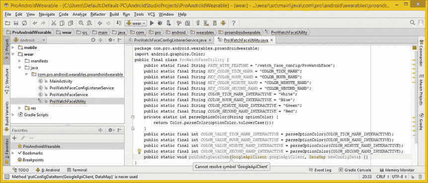
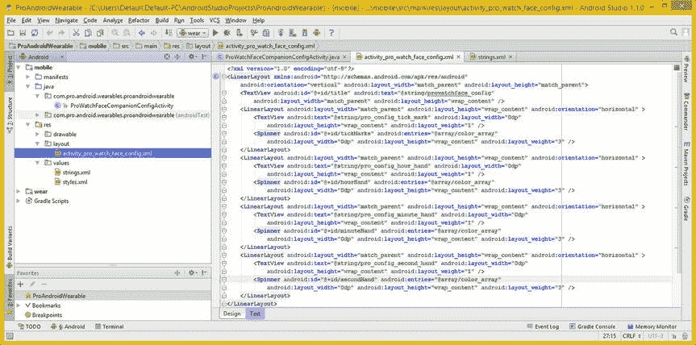

# 十四、表盘配置伴侣活动工具和可穿戴 API

现在，您已经为项目的移动部分中的 watch face companion 配置活动编写了基础活动类，是时候创建将存在于项目的穿戴部分中的 **ProWatchFaceUtility** 类了。该类将定义配置设置常量，并包含操作它们的函数(方法)，使用数据映射、数据项目和数据映射项目对象，以及**可穿戴**类的 **API** 、**数据 Api** 、**节点 Api** 和**消息 Api** 属性(数据字段)。在这一章中，你将会学到所有关于这个可穿戴类及其 API 的知识。

在本章中，您还将使用 XML 标记来为“观察界面配置”活动创建用户界面设计。这个 UI 设计将使用四个**微调器**小部件，这将允许您的用户选择八种标准系统颜色中的一种，用于您的表盘设计元素，包括刻度线、时针、分针和秒针。

在这一章中，你将学习并使用 Java 代码实现 Android Wearable class 数据字段 API 的每一个属性。其中包括 **API** 、**数据 Api** 、**节点 Api** 和**消息 Api** 。您还将了解 Android **LinearLayout** 容器类以及 Android **微调器**和 **TextView** 小部件。

您将实现一个复杂的 Android 工具类，它使用 DataAPI、NodeAPI 和 MessageAPI 在 GMS 网络上进行对话。您将开发键-值数据对，该数据对将为 DataMap、DataItem 和 DataMapItem 对象定义表面配置数据，并且您将在 Java 代码中实现这一点。

ProWatchFaceUtility 类:管理数据

在第一部分中，您将为表盘用户手机上的对话框创建配套配置基础的最后一个类，该类允许用户配置他们的表盘设计颜色。

Pro WatchFaces 工具类将存在于 Android Studio 项目的 **wear/java** 部分，以及 ProWatchFaceConfigListenerService 和呈现手表表面本身的初始 ProWatchFaceService 类。

在您为希望您的用户能够为手表界面交互模式配置的颜色值创建了 ProWatchFaceUtility.java 类结构和常量之后，我将讨论 PutDataMapRequest 类，然后您将编写代码来实现一个工具类，使用您在过去几章中学习的类。

创建 ProWatchFaceUtility 类:定义常数

右键单击/wear/java/package 文件夹，如图 14-1 所示，选择**新建 Java 类**菜单序列，进入**新建类**对话框。因为这是 utility 类，所以我们将其命名为 **ProWatchFaceUtility** 并在对话框的下拉中选择类的**种类**作为**类**，如图图 14-1 右上角所示。单击 OK 按钮并创建该类，该类将在 IntelliJ 中的新编辑选项卡中打开。


图 14-1 。使用新的 Java 类菜单序列和对话框来创建你的 ProWatchFaceUtility 类

在 public 关键字之后、类声明和名称之前添加 Java **final** 关键字，使您的类成为 final。这将锁定它，仅用作 WatchFaces 配置工具。

接下来，添加五个**公共静态最终字符串**常量。第一个应该是一个 **PATH_WITH_FEATURE** 常量，它为 watch face companion 应用提供一个**唯一标识符** ，就像您在自己的 **mobile** 应用组件 watchfaceconnectionconfigactivity 中创建的那样。如果您创建了多个 Watch Faces API 应用，那么每个应用都应该有一个唯一的 ID，它是不同的 Watch Faces 组件通过 GMS 网络基础设施与匹配的应用组件进行对话的方式。

四个颜色常量允许用户定义表盘设计特征所用的颜色，即刻度线、时针、分针和秒针。对于 DataItem 和 DataMap 对象中使用的**键值对**，您将需要**颜色常量** 。让我们先使用设计元素类型前的 **KEY_COLOR** 创建**键常量**，这样 **KEY_COLOR_TICK_MARK** 将表示您的刻度线颜色配置数据值的键值。

您的最终类声明，连同五个 Java 常量声明，如图 14-2 中突出显示的那样，应该看起来像下面的代码:

```java
public final class ProWatchFaceUtility {
    public static final String PATH_WITH_FEATURE = "/watch_face_config/ProWatchFace";
    public static final String KEY_COLOR_TICK_MARK = "COLOR_TICK_MARK";
    public static final String KEY_COLOR_HOUR_HAND = "COLOR_HOUR_HAND";
    public static final String KEY_COLOR_MINUTE_HAND = "COLOR_MINUTE_HAND";
    public static final String KEY_COLOR_SECOND_HAND = "COLOR_SECOND_HAND";
}
```


图 14-2 。将最后一个修饰符添加到类声明以及路径和交互模式颜色值的常量中

现在你已经定义了你的键串(听起来像是一个国家的热门话题:“你定义了我的键串宝贝”)，让我们为每一个定义 Android 颜色类常量，这将定义默认的颜色设置。到目前为止，这个应用包括白色(刻度)、蓝色(小时)、绿色(分钟)和红色(秒)。

确保使用 Android 系统颜色常量，因为这些常量已经在操作系统中为您定义了。稍后你可以使用**。** **parseColor( )** 方法将这些转化为 Android OS 可以使用的**整数颜色数据值**。这显示在图 14-3 的中间部分，使用以下 Java 代码:

```java
public static final String COLOR_TICK_MARK_INTERACTIVE = "White";
public static final String COLOR_HOUR_HAND_INTERACTIVE = "Blue";
public static final String COLOR_MINUTE_HAND_INTERACTIVE = "Green";
public static final String COLOR_SECOND_HAND_INTERACTIVE = "Red";
```


图 14-3 。创建一个私有的静态 int parseOptionColor()方法，将颜色字符串转换为颜色类常量

让我们创建一个名为**的**私有静态**方法。parseOptionColor( )** 和**返回**一个表示 Android 颜色类常量的 **int** (整数)数据值。

这个方法将接受一个**字符串**参数，您将把它命名为 **optionColor** ，并使用**将颜色值作为一个整数返回。** **toLowerCase( )** 方法调用，关闭 **optionColor** 参数。这是在 **Color.parseColor( )** 方法调用的参数区域内完成的，因为您总是希望编写密集的 Java 代码。你的 Java 方法结构，可以在图 14-3 的底部看到突出显示，应该看起来像下面的 Java 代码:

```java
private static int parseOptionColor(String optionColor) {
    return Color.parseColor(optionColor.toLowerCase( ));
}
```

确保单击红色的错误代码突出显示，并使用 **Alt+Enter** 工作流程让 IntelliJ 编写您需要的导入语句。

下一步是使用。您编码的 parseOptionColor()方法来创建 **COLOR_VALUE** 常量。这些将用于您的键-值对的第二部分，用于 DataItem 和 DataMap 对象中，并将使用与您的默认颜色常量相同的常量名称，除了您将在单词 COLOR 之后插入单词 **VALUE** ，以便您的常量更具描述性，例如:**COLOR _ VALUE _ TICK _ MARK _ INTERACTIVE**。

四个方法调用的 Java 代码，为你的键-值数据对的值部分设置常量值，可以在图 14-4 的最底部看到，应该看起来像下面四个 Java 语句:

```java
public static final int COLOR_VALUE_TICK_MARK_INTERACTIVE =
                                           parseOptionColor(COLOR_TICK_MARK_INTERACTIVE);
public static final int COLOR_VALUE_HOUR_HAND_INTERACTIVE =
                                           parseOptionColor(COLOR_HOUR_HAND_INTERACTIVE);
public static final int COLOR_VALUE_MINUTE_HAND_INTERACTIVE =
                                           parseOptionColor(COLOR_MINUTE_HAND_INTERACTIVE);
public static final int COLOR_VALUE_SECOND_HAND_INTERACTIVE =
                                           parseOptionColor(COLOR_SECOND_HAND_INTERACTIVE);
```


图 14-4 。创建调用 parseOptionColor()方法来配置自身的 COLOR_VALUE 常量

现在，您已经定义了十几个常数，并编写了一个非常小但有用的实用方法，是时候进入一些更复杂的方法编码，并了解另一个与通过网络发送 DataItem 对象(和 DataMap 对象)相关的 Android GMS 类了。

接下来您将创建的方法将常量值加载到 DataMap 对象中，并将它们作为 DataItem 对象提交给 GMS。

将 DataItems 载入至 DataMap: .putConfigDataItem()

让我们创建一个**公共静态 void****putConfigDataItem()**方法，它在参数列表区域接受一个 GoogleApiClient 对象和一个 DataMap 对象。

将 GoogleApiClient 对象**命名为 googleApiClient** ，将 DataMap 对象**命名为 newConfigData** 。因为在这个 Java 类中您还没有使用这些对象(类)类型，所以您将得到红色的错误代码高亮显示，为此您将需要使用 **Alt+Enter** 工作进程来让 IntelliJ 为您编写这些类的导入语句。

空的 Java 方法结构在图 14-5 底部用黄色突出显示，看起来应该像下面的 Java 代码:

```java
public static void putConfigDataItem(GoogleApiClient googleApiClient, DataMap newConfigData) { }
```



图 14-5 。创建一个公共静态 void putConfigDataItem(Google API client，DataMap)空方法结构

在使用 PutDataMapRequest 类和对象(这是该方法的核心)之前，接下来让我们了解一下这个 Android GMS 类。

Android PutDataMapRequest 类:放入数据请求

Android GMS**public****PutDataMapRequest**类扩展了 java.lang.Object，包含在**com . Google . Android . GMS . wearable**包中。该类的 Java 层次结构如下所示:

```java
java.lang.Object
  > com.google.android.gms.wearable.PutDataMapRequest
```

PutDataMapRequest 类是 PutDataRequest 类的支持数据映射的版本。该类有**六个**公共方法，这些方法与向 Google Play 服务服务器输入数据地图请求相关。

**。** **asPutDataRequest( )** 方法，当您写完 putConfigDataItem()方法后，您将在本章的下一节中使用它，它从 PutDataMapRequest 对象创建 PutDataRequest 对象。

您还将使用**。create(String path)** 方法，该方法将使用自定义 PATH_WITH_FEATURE(常量)路径创建 PutDataMapRequest 对象。还有一个**。使用 DataMapItem 对象从 DataMapItem 创建 PutDataMapRequest 的方法。一个**。createwitheautoappendedid(String path prefix)**方法使用随机生成的 Id 创建一个自动化的 PutDataMapRequest，并以您的路径为前缀。**

有一个**。** **getDataMap( )** 方法，您将使用它从 PutDataMapRequest 对象中提取一个 DataMap 对象，以及一个**。** **getUri( )** 方法如果要从 PutDataMapRequest 对象中提取 Uri 对象。

使用 putdatamaprequest 放置配置数据项

现在让我们实现一个 PutDataMapRequest 对象。我将向您展示如何在 ProWatchFaceUtility.java 类中使用它来将您的配置数据项放到 Google Play 中。声明并实例化 PutDataMapRequest，将其命名为 **putDataMapRequest** 。将此设置为调用**。** **create( )** 方法关闭 PutDataMapRequest 类，如图图 14-6 所示，使用以下 Java 代码:

```java
PutDataMapRequest putDataMapRequest = PutDataMapRequest.create(PATH_WITH_FEATURE);
```


图 14-6 。创建名为 putDataMapRequest 的 PutDataMapRequest 对象，并使用。创建( )

您将把 **PATH_WITH_FEATURE** 常量传递到。create()方法向 Google Play 服务标识这个 PutDatamapRequest 对象与您的特定 WatchFaces API 应用相关。想想这就像给你的应用打上独特的品牌，这样 GMS 就不会把事情搞混了。

现在，您已经创建了一个 PutDataMapRequest 对象，该对象带有 watch face 应用的唯一路径说明符，下一步是通过使用**从 PutDataMapRequest 对象中提取一个“空”的 DataMap 对象，从而为这个 PutDataMapRequest 对象创建 DataMap 对象。** **getDataMap( )** 方法。你完成的(空的)Java 类声明看起来像下面的 Java 结构，这也可以在图 14-7 中看到:

```java
DataMap configurationToPut = putDataMapRequest.getDataMap( );
```


图 14-7 。创建名为 configurationToPut 的数据映射对象；用 putDataMapRequest.getDataMap()加载它

正如你在图 14-7 中看到的，你需要使用一个 **Alt+Enter** 组合键来让 IntelliJ 为你编写数据映射类导入语句。现在可以用配置数据加载空的 DataMap 对象了。

为此，使用**。** **putAll( )** 方法带有传递到 putConfigDataItem()方法中的 **newConfigData** DataMap 对象。这就是包含您的配置参数的数据映射将如何替换位于 PutDataMapRequest:

```java
configurationToPut.putAll(newConfigData);
```

正如你在图 14-8 中注意到的，这一行代码不需要导入并且没有错误，所以你现在可以进入最复杂的 Java 语句，你将为这个 putConfigDataItem()方法编码，该方法与使用**将 PutDataMapRequest 放入一个**可穿戴**类 **DataApi** 对象有关。putDataItem( )** 。


图 14-8 。使用。putAll()将 newConfigData 数据映射加载到 configurationToPut 数据映射中，并调用。putDataItem()

在您在 Java 代码的其余部分中使用 Android Wearable 类来访问它的各种 API 之前，让我们仔细看看这个类。通过这种方式，您将熟悉它的 API 类型、数据字段和嵌套类。

Android 可穿戴类:Android 的可穿戴 API

Android **公共可穿戴**类扩展了 java.lang.Object，是**com . Google . Android . GMS . Wearable**包的一部分。需要注意的是，Wearable class 和 wearable package 使用了相同的名称，所以面向 Android 的 Wearable 既是一个包，也是一个类，smartwatch 平台也是如此。

Wearable 类(和对象)包含 Android Wear 平台的可穿戴 API。这个可穿戴类的类层次结构如下所示，表明这个可穿戴类是为 Android Wear 临时编写的:

```java
java.lang.Object
  > com.google.android.gms.wearable.Wearable
```

有一个嵌套的助手类，即 **Wearable。WearableOptions** 类，包含 Android Wearable API 的 API 配置参数。

可穿戴类或对象包含的四个属性、特性或数据字段代表主要 API，以及网络节点 API、消息传递 API 和数据 API。

**公共静态最终 Api <可穿戴。WearableOptions > API** 字段包含一个要传递给**的令牌对象。addApi(Api)** 方法启用 Wearable Options 对象中概述的可穿戴选项(特性)。**公共静态最终数据 Api** 数据 Api 字段包含数据 Api，而**公共静态最终消息 Api** 消息 Api 字段包含消息 Api，并且**公共静态最终节点 Api** 节点 API 字段包含网络节点 API。

使用可穿戴类:放置一个 DataApi 数据请求

您将要编写的接下来的七行 Java 代码实际上是一个复杂的 Java 语句，它既有方法(点)链接，又有嵌套在。setResultCallback()方法！这个构造从一个**可穿戴的**类开始，引用它的**数据 Api** 字段，其中有一个**。** **putDataItem( )** 方法被调用。

在里面。putDataItem()参数区域，你传递名为**的 GoogleApiClient 对象 googleApiClient** 以及一个**的结果。asPutDataRequest( )** 方法调用 **putDataMapRequest** 对象，将其转化为 **PutDataRequest** 对象。PutDataRequest 类(和对象)用于在 Android Wear 网络中创建新的 DataItem 对象。

那个。putDataItem()方法调用需要将 GoogleApiClient 对象和 PutDataRequest 对象作为参数传入。Java 语句的这一部分将请求提交给 GMS 服务器。

语句的下一部分，连接到。putDataItem()方法使用**点链接**，就是**。setResultCallback( )** 方法，该方法设置应用监听来自 GMS 服务器的数据请求响应。

在里面。setResultCallback()方法的参数区，你实例化一个**新的 ResultCallback < DataApi。>dataitem result**对象。在该构造中，您@覆盖了**public void****on result()**方法，使其为空，以便它执行 DataItemResult 对象(包含在 ResultCallback 对象中)的默认处理。如图图 14-8 所示，Java 语句应该看起来像下面的 Java 代码结构:

```java
Wearable.DataApi.putDataItem(googleApiClient, putDataMapRequest.asPutDataRequest( ))
                .setResultCallback(new ResultCallback<DataApi.DataItemResult>( ) {
                    @Override
                    public void onResult(DataApi.DataItemResult dataItemResult) {
                        // an empty method represents using the default onResult( ) functionality
                    }
                });
```

现在您已经处理了 DataApi 请求，让我们看看节点 Api。

使用 Android 的节点 API:。fetchConfigDataMap()方法

让我们创建一个**。** **fetchConfigDataMap( )** 方法 将使用节点 API 来获取(检索)配置数据映射对象。声明一个**公共静态 void fetchConfigDataMap( )** 方法，带有名为 **client** 的 **final GoogleApiClient** 对象和名为 **callback** 的**final fetchConfigDataMap callback**对象。

由此产生的空类结构可以在图 14-9 的中看到，并将利用以下 Java 代码:

```java
public static void
fetchConfigDataMap( final GoogleApiClient client, final FetchConfigDataMapCallback callback ) {
    // Empty Method
}
```


图 14-9 。在常量后面创建一个空的公共静态 void fetchConfigDataMap()方法结构

在图 14-9 中可以看到，FetchConfigDataMapCallback 有红色代码错误高亮显示，因为它引用的公共接口还没有创建。如果您下拉一个错误建议选项列表，您将看到“创建公共接口 FetchConfigDataMapCallback”，现在我们就这么做吧。在类顶部的常量后添加一个**公共接口 FetchConfigDataMapCallback** 。在公共接口内，声明实现所需的**void onconfigdatamappled(data map config)**方法。

FetchConfigDataMapCallback 接口的 Java 结构可以在图 14-10 的底部高亮显示，看起来应该像下面的 Java 公共接口结构:

```java
public interface FetchConfigDataMapCallback {
    void onConfigDataMapFetched(DataMap config);
}
```


图 14-10 。使用 onConfigDataMapFetched()方法创建公共接口 FetchConfigDataMapCallback

在 FetchConfigDataMap()方法中，您将使用一个 **NodeApi** 类和对象，所以让我们先快速概述一下这个 Android GMS 类。

Android NodeApi 接口:搜索连接的节点

Android**public****NodeApi 接口** 为你的 Wear 应用公开 Api，以利用 **poll** (即搜索)**本地或连接的节点**。这个 NodeApi 接口是**com . Google . Android . GMS . wearable . NodeApi**包的一部分。节点 API **事件**可以传递给设备上的所有应用，您将学习如何监听和利用这些节点事件。这个 NodeApi 接口有**三个**嵌套的(也称为 helper)接口:

*   **NodeApi。GetConnectedNodesResult** 接口包含 Wear GMS 网络上已连接节点的列表。
*   **NodeApi。GetLocalNodeResult** 接口包含一个惟一的名称和一个 ID，它将惟一地代表用户的硬件设备。在本章的下一节，你将在你的 Java 代码中使用这个接口。
*   一个 **NodeApi。NodeListener** 接口旨在与 Android 的**一起使用。addListener(GoogleApiClient，NodeApi。NodeListener)** 方法来接收节点 API 事件，以便它们可以被处理。

这个 NodeApi 接口有**四个**公共方法:

*   PendingResult <status>**。addListener(GoogleApiClient 客户端，NodeApi。**方法注册一个能够接收(过滤)所有节点 API 事件的监听器。</status>
*   <nodeapi.getconnectednodesresult>抽象 pending result**。getConnectedNodes(Google API client 客户端)**方法将获得用户硬件设备当前连接的节点列表。</nodeapi.getconnectednodesresult>
*   <nodeapi.getlocalnoderesult>抽象 pending result**。**方法 getLocalNode(GoogleApiClient)将获取指向用户当前硬件设备的节点。在本章的下一节，你将在你的 Java 代码中使用这个方法。</nodeapi.getlocalnoderesult>
*   <status>抽象 pending result**。removeListener(GoogleApiClient 客户端，NodeApi。NodeListener listener)** 方法将删除先前使用。addListener(GoogleApiClient，NodeListener)。</status>

现在让我们完成。fetchConfigDataMap()方法，该方法使用与 NodeApi 相关的方法和类。

线束节点 Api:使用 getLocalNode()和 getLocalNodeResult()

在一个空的 fetchConfigDataMap()方法结构中，访问 Android 的 **Wearable** 类 **NodeApi** 接口，使用点符号。叫**。getLocalNode( )** 关闭该构造，并传入名为 **client** 的 GoogleApiClient 对象，该对象被传入该 fetchConfigDataMap()方法。

接下来，使用 Java 方法链接并添加一个**。** **setResultCallback( )** 方法调用。在其中，使用 Java **new** 关键字实例化 ResultCallback 对象，为 **< NodeApi 创建一个 **ResultCallback** 对象。getlocalnodesult>**对象类型，使用 ResultCallback < NodeApi 指定。GetLocalNodeResult > Java 构造。在这个构造中，您将@Override 一个 onResult()方法，接下来您将使用 Java 代码完成该方法，它将决定当您获得 LocalNode 结果时您希望发生什么。

目前为止 fetchConfigDataMap()方法的 Java 结构，包括 **Wearable。NodeApi** 结构，获取**localnodesult**，设置一个结果回调，以及你(当前)空的 **onResult( )** 方法 体，可以在图 14-11 中看到，应该看起来像下面的 Java 代码:

```java
public static void
fetchConfigDataMap(final GoogleApiClient client, final FetchConfigDataMapCallback callback)
{
    Wearable.NodeApi.getLocalNode(client)
                    .setResultCallback(new ResultCallback<NodeApi.GetLocalNodeResult>( ) {
                        @Override
                        public void onResult(NodeApi.GetLocalNodeResult getLocalNodeResult) {
                            // Java code to be executed when a LocalNodeResult object appears
                        }
                    });
}
```


图 14-11 。调用. getLocalNode()和。setResultCallback()并覆盖 onResult()方法

在 onResult(NodeApi。getlocalnodesult getlocalnodesult)方法，您将声明名为 **myLocalNode** 的 String 对象，并使用**的结果加载它。getNode()。getId( )** 方法链，关闭了**getlocalnodesult**对象，该对象已经被传递到这个 onResult()方法结构中。

一旦 myLocalNode 加载了这个 NodeApi 标识数据，您将声明一个名为 **uri** 的 Uri 对象，并使用一个 **Uri 实例化它。构建器**类结合 new 关键字的构造器方法。使用方法链接，你将设置 URI 方案为 **wear** ，路径为 **PATH_WITH_FEATURE** ，权限为 **myLocalNode** String 对象中的 ID 数据，如图图 14-12 所示。到目前为止，您的 Java 代码应该如下所示:

```java
Wearable.NodeApi.getLocalNode(client)
                .setResultCallback(new ResultCallback<NodeApi.GetLocalNodeResult>( ) {
                    @Override
                    public void onResult(NodeApi.GetLocalNodeResult getLocalNodeResult) {
                        String myLocalNode = getLocalNodeResult.getNode( ).getId( );
                        Uri uri = new Uri.Builder( )
                                         .scheme("wear")
                                         .path(ProWatchFaceUtility.PATH_WITH_FEATURE)
                                         .authority(myLocalNode)
                                         .build( );
                    }
                });
```


图 14-12 。添加一个 myLocalNode 字符串来提取 LocalNodeResult 节点数据，并使用它构建一个 Uri 对象

现在您已经有了 GoogleApiClient 和 Uri 对象，您可以在 Wearable.DataApi 之外的. getDataItem()方法调用中使用它们。setResultCallback()方法，请求传递 FetchConfigDataMapCallback 对象回调的新 DataItemResultCallback()构造函数，该对象回调被传递到此 fetchConfigDataMap()方法构造中。正如你将在图 14-13 中看到的，你完成的 Java 方法结构看起来像这样:

```java
public static void
fetchConfigDataMap(final GoogleApiClient client, final FetchConfigDataMapCallback callback)
{
  Wearable.NodeApi.getLocalNode(client)
                  .setResultCallback(new ResultCallback<NodeApi.GetLocalNodeResult>( ) {
                      @Override
                      public void onResult(NodeApi.GetLocalNodeResult getLocalNodeResult) {
                          String myLocalNode = getLocalNodeResult.getNode( ).getId( );
                          Uri uri = new Uri.Builder( )
                                           .scheme("wear")
                                           .path(ProWatchFaceUtility.PATH_WITH_FEATURE)
                                           .authority(myLocalNode)
                                           .build( );
                          Wearable.DataApi.getDataItem(client, uri)
                                          .setResultCallback(new DataItemResultCallback(callback));
                      }
                  });
}
```


图 14-13 。打电话给。【getDataItem()方法关闭可穿戴。DataApi，将其传递给客户机和新的 Uri 对象

如图图 14-13 所示，仍然有一个红色的错误代码需要突出显示，所以让我们接着做，这样你就可以让这个方法没有错误，然后继续创建其他需要的方法。

单击这一行代码，最好是突出显示红色错误代码，然后您应该会在 ide 的左侧看到一个红色的错误灯泡下拉箭头。

单击向下箭头，下拉一个菜单列表，列出 IntelliJ 认为可以解决代码连续性问题的错误修复建议。有两种选择:创建一个完全独立的类，或者在 ProWatchFaceUtility.java 类中创建一个私有或内部类。为了保持实现 watch faces 应用紧凑所需的类的数量，选择第二个“创建内部类' DataItemResultCallback '”选项，可以看到在图 14-14 的底部突出显示。


图 14-14 。选择“创建内部类”错误下拉菜单选项和 ProWatchFaceUtility 目标类

这将弹出第二个选择器对话框，其中有两个选项列表，允许您指定一个您希望包含内部类的**目标类** 。您想要 ProWatchFaceUtility 类中的私有静态内部类，所以通过双击选择它，IntelliJ 将编码一个**私有静态**类 **DataItemResultCallback** ，实现 **ResultCallback < DataApi。DataItemResult >接口**接口。这将有一些红色的错误高亮显示，直到你实现了所需的方法，这将在本章的下一节中进行。

IntelliJ 将在 ProWatchFaceUtility 类的底部创建私有的 static (inner)类，正如在图 14-15 的底部可以看到的。


图 14-15 。现在回调对象引用已经就位，私有静态内部类也创建好了

让我们编写构成该方法主体的 Java 代码，它将使用 DataMapItem 从 DataItem 中提取手表表面配置数据映射，就像您在使用。fromDataItem()方法 。

使用可穿戴数据 Api: DataItemResultCallback()类

在这个 DataItemResultCallback 类中，您要做的第一件事是声明一个私有的 final FetchConfigDataMapCallback 对象，然后将其命名为 mCallback。接下来，创建一个公共 DataItemResultCallback()方法，该方法将名为 Callback 的 FetchConfigDataMapCallback 对象作为参数。

在此方法中，将在此类顶部创建的 mCallback 对象设置为传递到此 DataItemResultCallback()方法中的回调对象。如图图 14-16 所示，代码应该如下所示:

```java
private static class DataItemResultCallback implements ResultCallback<DataApi.DataItemResult> {
    private final FetchConfigDataMapCallback mCallback;
    public DataItemResultCallback(FetchConfigDataMapCallback callback) {
        mCallback = callback;
    }
}
```


图 14-16 。添加私有 final mCallback 变量；将其设置为等于传入 DataItemResultCallback()的回调

注意在图 14-16 中，红色波浪状的错误高亮仍然存在，所以鼠标悬停在错误高亮上，显示错误消息，它说“类必须被声明为抽象的或者实现方法 onResult(R)。”

覆盖公共空间。onResult(DataApi。DataItemResult dataItemResult)方法，在 DataItemResultCallback()方法的末尾，它将添加一个空方法(暂时)并删除红色的错误突出显示。在图 14-17 中显示没有错误的 Java 方法应该如下所示:

```java
private static class DataItemResultCallback implements ResultCallback<DataApi.DataItemResult> {
    private final FetchConfigDataMapCallback mCallback;
    public DataItemResultCallback(FetchConfigDataMapCallback callback) {
        mCallback = callback;
    }
    @Override
    public void onResult(DataApi.DataItemResult dataItemResult) { // empty method removes error }
}
```


图 14-17 。添加@Override onResult()方法以移除 DataItemResultCallback 上突出显示的红色错误

接下来，您需要创建条件 if()结构，该结构确定 onResult()方法是否返回了 DataItemResult(外部 if()结构)，以及第二个内部条件 if()结构，该结构将确定 DataItemResult 是否已被使用或是否为空(也就是说，它是！= null)。

第一个外部条件 if()结构使用了一个**。getStatus( )** **。** **isSuccess( )** 方法链接出**dataItemResult**dataItemResult 对象，您之前已经看到使用它来获得成功结果状态标志(true 值)。

然后，第二个内部条件 if()结构使用 getDataItem()方法调用 dataItemResult 对象，并将其与空值进行比较。如果 DataItemResult 对象内部有内容，则处理 If 部分。如果为空(null)，则处理构造的 else 部分。

嵌套 if()结构中的第一行代码也与 DataItemResult 处理相关，所以我也将在这里包含它。这个**。** **getDataItem( )** 方法再次用于获取有效的 DataItem 结果，并将其安装到一个名为 **configDataItem** 的 **DataItem** 对象中，在一个 Java 语句中声明、命名并实例化该 DataItem，以便它可以接收一个**DataItem result . get DataItem()**方法调用对象传输。

控件的 Java 代码。onResult()方法结构，也可以在图 14-18 的底部看到突出显示，应该如下所示:

```java
public void onResult(DataApi.DataItemResult dataItemResult) {
    if (dataItemResult.getStatus( ).isSuccess( )) {
        if (dataItemResult.getDataItem( ) != null) {
            DataItem configDataItem = dataItemResult.getDataItem( );
        } else {
        }
    }
}
```


图 14-18 。在 onResult()内创建一个 if()和嵌套的 if-else 结构；使用。getDataItem()来提取结果

既然所有的 DataItemResult 对象处理都已就绪，接下来您要做的事情是将 DataItem 转换为 DataMapItem，以便稍后您可以将 DataMapItem 转换为您需要的 DataMap 对象。

用 DataItem 对象加载 DataMapItem 对象的代码如图 14-19 中的所示，应该类似于下面两行代码:

```java
DataItem configDataItem = dataItemResult.getDataItem( );
DataMapItem dataMapItem = DataMapItem.fromDataItem(configDataItem);
```


图 14-19 。声明一个 dataMapItem，将其命名为 DataMapItem，并将其设置为等于。fromDataItem()

现在，所有的 DataMapItem 对象处理都已就绪，接下来您要做的是将 DataMapItem 转化为 DataMap，这样以后您就可以将 DataMap 对象传递给 onConfigDataMapFetched()方法调用。在图 14-20 的中可以看到 DataItem 到 DataMapItem 再到 DataMap 的这种转换，应该使用这三行 Java 代码来完成:

```java
DataItem configDataItem = dataItemResult.getDataItem( );
DataMapItem dataMapItem = DataMapItem.fromDataItem(configDataItem);
DataMap config = dataMapItem.getDataMap( );
```


图 14-20 。声明一个名为 config 的数据映射，将它设置为对 dataMapItem 的. getDataMap()调用的结果

条件语句 if 部分的最后一步是通过使用**将**配置数据映射**对象传递给**mcall back FetchConfigDataMapCallback**对象。onConfigDataMapFetched】方法调用。**

在条件 if-else 语句的 *else* 部分，如果 DataItem 对象确实为空(null ),那么只需通过使用 Java **new** 关键字和 **DataMap( )** 构造函数方法调用实例化一个新的 DataMap 对象。onConfigDataMapFetched()方法，从 mcall back FetchConfigDataMapCallback 对象调用。完成的 onResult()方法结构，如图图 14-21 所示，应该如下图所示:

```java
public void onResult(DataApi.DataItemResult dataItemResult) {
            if (dataItemResult.getStatus( ).isSuccess( )) {
                if (dataItemResult.getDataItem( ) != null) {
                    DataItem configDataItem = dataItemResult.getDataItem( );
                    DataMapItem dataMapItem = DataMapItem.fromDataItem(configDataItem);
                    DataMap config = dataMapItem.getDataMap( );
                    mCallback.onConfigDataMapFetched(config);
                } else {
                    mCallback.onConfigDataMapFetched(new DataMap( ));
                }
            }
}
```


图 14-21 。使用将 FetchConfigDataMapCallback 对象设置为数据映射。onConfigDataMapFetched()

请注意，我单击了。代码中的 onConfigDataMapFetched()方法跟踪其实现，返回到 FetchConfigDataMapCallback Java 接口，该接口在图 14-21 的顶部以蓝色突出显示。

接下来，让我们创建为这个类编码所需的最后一个主要方法。那个。overwriteKeysInConfigDataMap()方法将替换用户指定的任何已更改的键-数据对，从而创建一个全新的 DataMap 对象。

替换更改的数据:overwriteKeysInConfigDataMap

让我们创建**公共静态 void****overwriteKeysInConfigDataMap()**方法，带有 **final** GoogleApiClient，您将命名为 **googleApiClient** ，以及 **final** DataMap 对象，您将命名为 **configKeysToOverwrite** ，如图图 14-22 所示。Java 代码应该类似于这个空方法主体声明:

```java
public static void overwriteKeysInConfigDataMap(final GoogleApiClient googleApiClient, final DataMap configKeysToOverwrite) {  // empty method: your method body will go in here  }
```


图 14-22 。创建空的公共静态 void overwriteKeysInConfigDataMap()方法

你要在这个方法体中编码的第一件事是对你在本章前面创建的方法之一的方法调用。这将被 ProWatchFaceUtility 类名、句点和方法名引用，如图图 14-23 所示。

在方法调用参数区域内，您将传递 **GoogleApiClient** 对象，并使用 Java **new** 关键字实例化一个新的**fetchConfigDataMapCallback**对象。空方法声明的 Java 代码应该类似于以下代码:

```java
ProWatchFaceUtility.fetchConfigDatamap(googleApiClient, new fetchConfigDataMapCallback( ) { empty method });
```


图 14-23 。使用 IntelliJ 弹出帮助器对话框实现 FetchConfigDataMapCallback 接口

**fetchConfigDatamap(GoogleApiClient，FetchConfigDataMapCallback)** 方法当前被 IntelliJ IDEA 指定(着色)为未使用，如图 14-22 所示。未使用的方法或变量是使用格雷码文本颜色定义的，一旦它们在其他代码中被引用，它们将变成黑色。在图 14-23 中可以看到，IntelliJ 可以帮助编码一个空的方法体；例如，如果您键入一个 Java new 关键字和 **Fe** 字符，将会弹出一个 IntelliJ helper 对话框，您可以在其中从下拉选项列表中选择 FetchConfigDataMapCallback 接口。

当选择 FetchConfigDataMapCallback 接口时，IntelliJ 也会实现所需的**。onconfigdatamappled(data map config)**方法，如图 14-24 中的所示，产生如下 Java 代码:

```java
ProWatchFaceUtility.fetchConfigDatamap(googleApiClient, new fetchConfigDataMapCallback( ) {
    @Override
    public void onConfigDataMapFetched(DataMap config) { // an empty method created by IntelliJ }
});
```


图 14-24 。IntelliJ 将为您实现完整的(空的)FetchConfigDataMapCallback 基础结构

现在您所要做的就是编写创建新数据映射的 Java 语句，通过覆盖当前(或者默认，如果这是第一次更新的话)数据映射来保存最新的(更新的)配置数据数组。

更新数据映射对象:onConfigDataMapFetched()

在 IntelliJ 为您创建的这个公共 void onConfigDataMapFetched()方法中，将传递到该方法中的 DataMap 参数的名称更改为 **currentConfig** 。这样做是为了更准确地反映传递到这个方法结构中的内容。

接下来，声明并实例化一个名为 **overwriteConfig** 的**新的**数据映射对象，该对象用于保存数据映射，并将包含修改后的配置参数。要使用传递给该方法的 currentConfig 数据映射加载该对象，请调用**。** **putAll( )** 方法使用 **currentConfig** 对象作为参数，关闭 overwriteConfig DataMap 对象。

到目前为止，你可以看到在图 14-25 底部高亮显示的 Java 方法结构，看起来应该像下面的 Java 代码:

```java
ProWatchFaceUtility.fetchConfigDatamap(googleApiClient, new fetchConfigDataMapCallback( ) {
    @Override
    public void onConfigDataMapFetched(DataMap currentConfig) {
        DataMap overwriteConfig = new DataMap( );
        overwriteConfig.putAll(currentConfig);
    }
});
```


图 14-25 。声明并实例化名为 overwriteConfig 的数据映射，并使用. putAll()方法加载它

现在，您的当前设置或默认设置(如果这是您的第一次配置参数更新)位于 overwriteConfig 数据映射中，然后您将使用相同的 putAll()方法来覆盖(替换)传递到此 overwriteKeysInConfigDataMap()方法中的新配置参数。

这个工作流程确保如果在两个之后的传入(更新或更改)数据映射中有任何不完整或缺失的键-数据对。putAll()方法，它们将被处理，并且将有一个完整的数据映射对象，其中包含所有参数，包括已更改的和未更改的(或默认的)。

到目前为止，你可以看到 Java 方法结构在图 14-26 的底部突出显示，看起来应该像下面的 Java 代码:

```java
ProWatchFaceUtility.fetchConfigDatamap(googleApiClient, new fetchConfigDataMapCallback( ) {
    @Override
    public void onConfigDataMapFetched(DataMap currentConfig) {
        DataMap overwriteConfig = new DataMap( );
        overwriteConfig.putAll(currentConfig);
        overwriteConfig.putAll(configKeysToOverwrite);
    }
});
```


图 14-26 。用另一个。putAll()方法调用，用当前数据覆盖更新的配置数据

您需要做的最后一个编程“动作”是通过将更新后的 **overwriteConfig** DataMap 对象传递给**来编写该对象。** **putConfigDataItem( )** 方法，您在本章前面编写的代码。因为您在当前方法体之外调用这个方法，所以您将在这个方法名的前面加上类名，就像这样:**prowatchface utility . putconfigdataitem()**。在参数区域内，传递包含更新(覆盖)的观察面配置数据的 GoogleApiClient 对象和 DataMap 对象。

该方法结构的最终 Java 代码可以在图 14-27 的底部高亮显示，应该如下所示:

```java
ProWatchFaceUtility.fetchConfigDatamap(googleApiClient, new fetchConfigDataMapCallback( ) {
    @Override
    public void onConfigDataMapFetched(DataMap currentConfig) {
        DataMap overwriteConfig = new DataMap( );
        overwriteConfig.putAll(currentConfig);
        overwriteConfig.putAll(configKeysToOverwrite);
        ProWatchFaceUtility.putConfigDataItem(googleApiClient, overwriteConfig);
    }
});
```


图 14-27 。使用将更新的数据映射配置数据发送到智能手表。从 ProWatchFaceUtility 类调用了 putConfigDataItem()方法

接下来您需要做的是从 ProWatchFaceConfigListenerService 类调用 ProWatchFaceUtility 类，将两个类连接在一起。

连接地图:从监听器调用工具

单击**ProWatchFaceConfigListenerService.java**选项卡，或者如果它没有在 IDE 中打开，则将其打开。向 **onMessageReceived( )** 方法添加最后一行代码，该方法将把 **keysToOverwrite** DataMap 对象发送到 ProWatchFaceUtility 类**。****overwriteKeysInConfigDataMap()**方法。如图图 14-28 所示，Java 语句应该如下所示:

```java
ProWatchFaceUtility.overwriteKeysInConfigDataMap(myGoogleApiClient, keysToOverwrite);
```


图 14-28 。打开 Listener 类并调用 ProWatchFaceUtility 类的 overwriteKeysInConfigDataMap 方法，同时传递 keysToOverwrite

正如你将在图 14-29 中看到的，工具类的 Java 代码是无错误的，并且没有任何 Java 代码(除了常量，我将在下面处理)是**灰色的**。


图 14-29 。现在这两个类是交叉连接的(互相使用)，唯一的格雷码是常量

现在，您已经准备好返回到 prowatchfacecompcompanionconfigactivity，它是您在第十三章中开始开发所有代码时编写的。最后，您将在已创建的其他类中创建所需的键值数据对，并完成创建颜色选择用户界面设计所需的所有 UI 设计工作，供 watch face 用户用来定制他们的 watch face 应用。

完成配置助手:UI 设计

打开**ProWatchFaceCompanionConfigActivity.java**类(在你的项目的移动部分),添加你在 ProWatchFaceUtility.java 类顶部声明的四个相同的 KEY_COLOR 常量。

这些常量的唯一区别是它们将使用 Java private 关键字声明，因为它们只在类中使用，而不是像在 ProWatchFaceUtility 中那样使用 public 关键字。这些常量声明可以在图 14-30 中看到，看起来像下面的 Java 语句:

```java
private static final String PATH_WITH_FEATURE = "/watch_face_config/ProWatchFace";
private static final String KEY_COLOR_TICK_MARK = "COLOR_TICK_MARK";
private static final String KEY_COLOR_HOUR_HAND = "COLOR_HOUR_HAND";
private static final String KEY_COLOR_MINUTE_HAND = "COLOR_MINUTE_HAND";
private static final String KEY_COLOR_SECOND_HAND = "COLOR_SECOND_HAND";
```


图 14-30 。声明与配套活动中的工具常量相匹配的私有 KEY_COLOR 常量

现在，所有用于在所有类之间传递 DataMap 和 DataItem 对象的 Java 代码都已就绪，让我们换个方式，进入 UI 设计模式。让我们编写一些 XML 标记来定义智能手机上 watch faces Configuration Companion 活动的用户体验。

使用微调器小部件选择颜色:XML UI 布局

在编辑选项卡中打开**mobile/RES/activity _ pro _ watch _ face _ config . XML**文件，在< TextView >标签下添加嵌套的< LinearLayout >标签。将 orientation 参数设置为 horizontal，这样文本小部件将位于 Spinner 小部件的旁边。在这个 LinearLayout 容器中，嵌套一个 TextView 标签，并使用@string/pro_config_tick_mark 引用<字符串>常量。然后将 layout_width 参数设置为零，将 layout_weight 参数设置为一。如图图 14-31 所示，XML 标记应该如下所示:

```java
<?xml version="1.0" encoding="utf-8"?>
<LinearLayout xmlns:android="http://schemas.android.com/apk/res/android"
    android:orientation="vertical" android:layout_width="match_parent"
    android:layout_height="match_parent">
    <TextView android:id="@+id/title" android:text="@string/prowatchface_config"
        android:layout_width="match_parent" android:layout_height="wrap_content" />
    <LinearLayout android:layout_width="match_parent" android:layout_height="wrap_content"
        android:orientation="horizontal" >
        <TextView android:text="@string/pro_config_tick_mark" android:layout_width="0dp"
            android:layout_height="wrap_content" android:layout_weight="1" />
    </LinearLayout>
</LinearLayout>
```


图 14-31 。添加一个嵌套的< LinearLayout >，并在其中嵌套一个< TextView >标签来保存第一个 UI 构造

您将 layout_width 参数设置为零密度像素，或密度独立像素(DIP) 的原因是，该设置告诉 Android OS 允许 **layout_weight** 参数确定屏幕分配的相对布局百分比。如果您将微调器小部件 layout_weight 设置为 2，那么您的 TextView 将获得屏幕的三分之一，计算为 1/(1+2)。Spinner layout_weight 为 3，这是您接下来要实现的，它使 TextView 占屏幕的 25%,而 Spinner 占屏幕的 75%。

让我们去掉在图 14-31 中看到的红色错误代码高亮显示，打开**mobile/RES/values/strings . XML**文件，使用数据值 **Tick Marks** 添加名为 **pro_config_tick_mark** 的<字符串>常量。当你这样做的时候，为时针、分针和秒针添加其他的<字符串>常量。如图 14-32 所示，XML 标记应该如下所示:

```java
<string name="pro_config_tick_mark">Tick Marks</string>
<string name="pro_config_hour_hand">Hour Hand</string>
<string name="pro_config_minute_hand">Minute Hand</string>
<string name="pro_config_second_hand">Second Hand</string>
```


图 14-32 。为 UI 标签创建<字符串>常量，用于刻度线和时针、分针、秒针

在这个最初的子水平<linearlayout>构造中，添加<spinner>小部件，就在<textview>小部件的下面。使用格式 **@+id/tickMarks** 给它一个 tickMarks ID，并再次将 layout_width 设置为 0dp(如果您愿意，也可以设置为 0dip)，将 layout_weight 设置为 3。</textview></spinner></linearlayout>

要用颜色值加载微调器小部件，使用格式 **@array/color_array** 将**条目**参数集添加到名为 **color_array** 的**数组**中。

到目前为止，你的 XML 标记，可以在图 14-33 中看到突出显示，应该看起来像下面的 XML 布局定义结构:

```java
<LinearLayout xmlns:android="http://schemas.android.com/apk/res/android"
    android:orientation="vertical" android:layout_width="match_parent"
    android:layout_height="match_parent">
    <TextView android:id="@+id/title" android:text="@string/prowatchface_config"
        android:layout_width="match_parent" android:layout_height="wrap_content" />
    <LinearLayout android:layout_width="match_parent" android:layout_height="wrap_content"
        android:orientation="horizontal" >
        <TextView android:text="@string/pro_config_tick_mark" android:layout_width="0dp"
            android:layout_height="wrap_content" android:layout_weight="1" />
        <Spinner android:id="@+id/tickMarks" android:entries="@array/color_array"
            android:layout_width="0dp" android:layout_height="wrap_content"
            android:layout_weight="3" />
    </LinearLayout>
</LinearLayout>
```


图 14-33 。在引用 color_array 的< TextView >标签下添加一个<微调器>小部件子标签

要去掉红色的错误文本突出显示，请单击 **strings.xml** 选项卡并添加颜色数据值常量，在创建引用这些颜色常量值的数组对象之前，必须将这些常量放置到位。

我将使用 Android Color 类中的八个原色常量。这些是 Android 操作系统中定义的最标准化的颜色，在黑色背景色的映衬下会非常好看。

这将为您的用户提供 **1，680** 种不同(非唯一)的颜色组合，这意味着同一种颜色可以用于多个表盘设计元素。计算变量个数的方法是 C！(色数阶乘)除以 E！(元素个数阶乘)。

有八种不同的颜色可能性，或者说八个阶乘 **8！**，也就是 **8*7*6*5*4*3*2*1=40320** 。然后你用四个不同的表盘设计元素，或者四个阶乘 **4 来除它！**，也就是 **4*3*2*1=24** 。这给了你 1680 种可能的颜色组合！

定义八种颜色的 XML 标记如图图 14-34 所示，应该如下所示:

```java
<string name="color_yellow">Yellow</string>
<string name="color_blue">Blue</string>
<string name="color_red">Red</string>
<string name="color_green">Green</string>
<string name="color_cyan">Cyan</string>
<string name="color_magenta">Magenta</string>
<string name="color_gray">Gray</string>
<string name="color_white">White</string>
```


图 14-34 。添加八个<字符串>常量定义，引用最常见的 Android OS 颜色常量

在颜色常数 <string>XML 定义就绪之后，您将添加一个<string-array>对象 XML 定义，它将创建保存颜色常数字符串值的数组对象构造。</string-array></string>

这个<string-array>标签的作用是通过嵌套引用< string-array > Array 对象定义构造中的< string >常量的 **< item >** 标签，使用 XML 创建一个 String Array 对象。</string-array>

您需要编码以实现字符串数组结构的创建的 XML 标记可以在图 14-35 中看到，应该如下所示:

```java
<string-array name="color_array">
    <item>@string/color_yellow</item>
    <item>@string/color_blue</item>
    <item>@string/color_red</item>
    <item>@string/color_green</item>
    <item>@string/color_cyan</item>
    <item>@string/color_magenta</item>
    <item>@string/color_gray</item>
    <item>@string/color_white</item>
</string-array>
```


图 14-35 。添加一个<字符串数组>结构，其中填充了引用八种颜色的八个<项目>子标签

正如您将在图 14-36 中看到的，现在您已经创建了 XML 字符串颜色常量和数组，没有红色的错误代码高亮显示，您已经准备好复制并粘贴您的第一个嵌套的< LinearLayout >结构，并为时针颜色选择微调器 UI 元素创建第二个。


图 14-36 。复制并粘贴第一个嵌套的 LinearLayout UI 容器，为时针创建第二个容器

选择子 <linearlayout>XML 结构及其两个子 UI 小部件，右键选择**复制**，或者使用 **CTRL+C** 组合键。接下来，单击鼠标将插入条(光标)插入父 LinearLayout 的最后一个< /LinearLayout >结束标记之前，单击鼠标右键并选择**粘贴**，或者使用 **CTRL+V** 组合键进行粘贴。结果可以在图 14-36 中看到，应该如下所示:</linearlayout>

```java
<LinearLayout xmlns:android="http://schemas.android.com/apk/res/android"
    android:orientation="vertical" android:layout_width="match_parent"
    android:layout_height="match_parent">
    <TextView android:id="@+id/title" android:text="@string/prowatchface_config"
        android:layout_width="match_parent" android:layout_height="wrap_content" />
    <LinearLayout android:layout_width="match_parent" android:layout_height="wrap_content"
        android:orientation="horizontal" >
        <TextView android:text="@string/pro_config_tick_mark" android:layout_width="0dp"
            android:layout_height="wrap_content" android:layout_weight="1" />
        <Spinner android:id="@+id/tickMarks" android:entries="@array/color_array"
            android:layout_width="0dp" android:layout_height="wrap_content"
            android:layout_weight="3" />
    </LinearLayout>
    <LinearLayout android:layout_width="match_parent" android:layout_height="wrap_content"
        android:orientation="horizontal" >
        <TextView android:text="@string/pro_config_hour_hand" android:layout_width="0dp"
            android:layout_height="wrap_content" android:layout_weight="1" />
        <Spinner android:id="@+id/hourHand" android:entries="@array/color_array"
            android:layout_width="0dp" android:layout_height="wrap_content"
            android:layout_weight="3" />
    </LinearLayout>
</LinearLayout>
```

因为您希望允许用户为四个表盘设计元素配置颜色，所以您需要再次执行这个节省时间的复制和粘贴工作流程，并选择这两个嵌套的 LinearLayout 容器 XML 标记块，然后将它们粘贴到 UI 定义的底部。

最终你会得到一个主父级**垂直** LinearLayout 容器来排列嵌套的子级**水平** LinearLayout 容器，其中包含 **TextView** (标签)、 **Spinner** (颜色选择器)和 UI 元素。

最终的**activity _ pro _ watch _ face _ config . xml**用户界面布局设计 XML 定义，可以看到，没有错误，在图 14-37 中，应该使用以下 XML 标记:

```java
<?xml version="1.0" encoding="utf-8"?>

<LinearLayout xmlns:android="http://schemas.android.com/apk/res/android"
    android:orientation="vertical" android:layout_width="match_parent"
    android:layout_height="match_parent">
    <TextView android:id="@+id/title" android:text="@string/prowatchface_config"
        android:layout_width="match_parent" android:layout_height="wrap_content" />

    <LinearLayout android:layout_width="match_parent" android:layout_height="wrap_content"
        android:orientation="horizontal" >
        <TextView android:text="@string/pro_config_tick_mark" android:layout_width="0dp"
            android:layout_height="wrap_content" android:layout_weight="1" />
        <Spinner android:id="@+id/tickMarks" android:entries="@array/color_array"
            android:layout_width="0dp" android:layout_height="wrap_content"
            android:layout_weight="3" />
    </LinearLayout>

    <LinearLayout android:layout_width="match_parent" android:layout_height="wrap_content"
        android:orientation="horizontal" >
        <TextView android:text="@string/pro_config_hour_hand" android:layout_width="0dp"
            android:layout_height="wrap_content" android:layout_weight="1" />
        <Spinner android:id="@+id/hourHand" android:entries="@array/color_array"
            android:layout_width="0dp" android:layout_height="wrap_content"
            android:layout_weight="3" />
    </LinearLayout>

    <LinearLayout android:layout_width="match_parent" android:layout_height="wrap_content"
        android:orientation="horizontal" >
        <TextView android:text="@string/pro_config_minute_hand" android:layout_width="0dp"
            android:layout_height="wrap_content" android:layout_weight="1" />
        <Spinner android:id="@+id/minuteHand" android:entries="@array/color_array"
            android:layout_width="0dp" android:layout_height="wrap_content"
            android:layout_weight="3" />
    </LinearLayout>

    <LinearLayout android:layout_width="match_parent" android:layout_height="wrap_content"
        android:orientation="horizontal" >
        <TextView android:text="@string/pro_config_second_hand" android:layout_width="0dp"
            android:layout_height="wrap_content" android:layout_weight="1" />
        <Spinner android:id="@+id/secondHand" android:entries="@array/color_array"
            android:layout_width="0dp" android:layout_height="wrap_content"
            android:layout_weight="3" />
    </LinearLayout>

</LinearLayout>
```



图 14-37 。复制并粘贴前两个嵌套的 LinearLayout UI 容器，以创建分针和秒针

既然已经构建了 XML UI 布局定义，那么让我们切换回 Java 编程模式，并编写使这些微调器起作用的方法。

设置微调器小部件:setUpColorPickerSelection()

在接下来的几节中，您将编写与后端处理相关的 Java 方法(Java 代码；XML 标记是颜色选择小部件的前端设计。这些是通过使用<spinner>标签放置的 Spinner 类(对象)定义来实现的。</spinner>

单击 ProWatchFaceCompanionConfigActivity.java 选项卡(或打开它)并在类的底部结束花括号(})之前添加一个私有的 void setUpColorPickerSelection()方法。您需要向该方法传递四个参数:一个是您在 XML UI 定义中创建的 Spinner ID 参数，一个保存配置数据键的字符串，一个包含键-值对的数据映射，以及一个默认颜色常量的资源 ID 整数。如图 14-38 中的所示，Java 代码应该如下所示:

```java
private void setUpColorPickerSelection(int spinnerId, final String configKey, DataMap config,
                                       int defaultColorNameResId) {
    String defaultColorName = getString(defaultColorNameResId);
    int defaultColor = Color.parseColor(defaultColorName);
    int color;
}
```


图 14-38 。在类的末尾添加私有的 void setUpColorPickerSelection()方法，并声明变量

您需要在这个方法中放置的下一个 Java 构造是一个 if-else 条件语句，它将确定数据映射是否已经被加载(使用)或者它是否是一个未使用的数据映射。

确定这一点的方法是使用 if(config！= null)条件，因为非 null 数据映射包含一个数据映射！如果数据图是“实时”的，您可以使用**。getInt(String，integer)** ，调用**配置数据映射**对象。这将提取与 configKey 字符串键关联的整数值。这被赋给你之前声明的颜色整数变量。

另一方面，在构造的 else 部分中，如果数据映射为空(null 值)，只需将 color 整数变量设置为 defaultColor 值，该值是使用。getString()方法调用。该构造的 Java 代码，如图 14-39 所示，应该看起来像下面的方法结构:

```java
private void setUpColorPickerSelection(int spinnerId, final String configKey, DataMap config,
                                       int defaultColorNameResId) {
    String defaultColorName = getString(defaultColorNameResId);
    int defaultColor = Color.parseColor(defaultColorName);
    int color;
    if (config != null) {
        color = config.getInt(configKey, defaultColor);
    } else {
        color = defaultColor;
    }
}
```


图 14-39 。添加 if-else 条件结构，评估配置数据映射，并相应地处理它

完成该方法的最后一步是创建一个名为 **spinner** 的 Java **Spinner** 对象，**使用< Spinner > XML 定义使用 **findViewById( )** 方法对其进行膨胀**。Android 中的膨胀过程是使用之前创建的 XML 对象定义填充 Java 对象。然后创建一个 **colorNames String[ ]** 数组，并使用 XML**<String-Array>**构造和**创建的数据填充它。** **getStringArray( )** 方法连锁掉一个 **getResources( )** 方法。对循环使用一个**，并用你的颜色常量值加载 colorNames 数组。执行此操作的 Java 代码如图 **14-40** 所示，应该如下所示:**

```java
private void setUpColorPickerSelection(int spinnerId, final String configKey, DataMap config,
                                       int defaultColorNameResId) {
    String defaultColorName = getString(defaultColorNameResId);
    int defaultColor = Color.parseColor(defaultColorName);
    int color;
    if (config != null) {
        color = config.getInt(configKey, defaultColor);
    } else {
        color = defaultColor;
    }
    Spinner spinner = (Spinner) findViewById(spinnerId);
    String[] colorNames = getResources( ).getStringArray(R.array.color_array);
    for (int i = 0; i < colorNames.length; i++) {
        if (Color.parseColor(colorNames[i]) == color) {
            spinner.setSelection(i);
            break;
        }
    }
}
```


图 14-40 。创建一个名为 spinner 的 Spinner 对象；用 XML 数组中定义的 String[ ]数组数据加载它

现在，您已经用颜色值加载了微调器对象，下一步我们要设置颜色选择器侦听器对象来侦听用户选择的更改。

设置微调器监听器:setUpColorPickerListener()

现在，您已经用先前创建的<string-array>中的颜色常量值填充了微调器对象，您还需要设置监听器对象，它将监听用户对微调器默认(或先前)颜色常量选择所做的任何更改。</string-array>

在类的末尾创建一个**private void****setUpColorPickerListener()**方法，该方法接受**微调器 id 整数**和 **configKey KEY_COLOR 字符串**颜色常量值作为其两个方法参数。

在方法内部，声明一个名为 **spinner** 的 **Spinner** 对象，并使用 **findViewById(spinnerId)** 方法调用和参数对其进行膨胀。您在刚刚创建的前一个方法中完成了此操作；但是，请注意，这两个变量都是在每个方法中使用的**局部**(或私有)变量，因此它们并不冲突。对于这个方法，您需要一个惟一的 Spinner 对象，因为您将基于它构造一个侦听器结构。

到目前为止的 Java 方法结构，可以在图 14-41 的底部看到突出显示，应该看起来像下面的 Java 代码:

```java
private void setUpColorPickerListener(int spinnerId, final String configKey) {
    Spinner spinner = (Spinner) findViewById(spinnerId);
}
```


图 14-41 。在类的底部创建一个公共的 void setUpColorPickerListener()方法；然后给旋转器充气

您需要做的下一件事是使用。setOnItemSelectedListener()方法来创建 AdapterView 侦听器。Spinner 类是从 **AdapterView** 类的子类，因此 Spinner 对象也是 AdapterView 对象。它使用一个**适配器视图。【OnItemSelectedListener()【构造函数】方法调用，配合 Java new 关键字。使用下面的 Java 代码创建这个监听器，如图 14-42 底部突出显示的:**

```java
private void setUpColorPickerListener(int spinnerId, final String configKey) {
    Spinner spinner = (Spinner) findViewById(spinnerId);
    spinner.setOnItemSelectedListener(new AdapterView.OnItemSelectedListener( ) { // empty method });
}
```


图 14-42 。从微调器调用. setOnItemSelectedListener()方法，并构造一个新的 AdapterView 侦听器

正如您在图 14-42 中看到的，您将需要使用 **Alt+Enter** 工作流程来让 IntelliJ 为 AdapterView 类编写一个导入语句。一旦 IntelliJ 做到了这一点，它将重新评估您的代码，并在 AdapterView 下给出一个红色波浪状的错误高亮显示。OnItemSelectedListener()构造函数方法。在图 14-43 所示的错误下拉列表中，选择**实现方法**选项，实现两个需要的方法，选择 **Insert @Override** 。IntelliJ 将为您创建一个 **onItemSelected( )** 构造。


图 14-43 。使用错误建议下拉列表，选择实现方法，并实现所有必需的方法

在空的 onItemSelected()方法中，如图 14-44 中突出显示的，创建一个**最终字符串 colorName** 变量并调用**。** **getItemAtPosition( )** 方法关闭了名为 **parent** 的 **AdapterView** 对象，并将其传递到该方法结构中。如果您愿意，可以使用 IntelliJ 弹出助手对话框。


图 14-44 。创建一个名为 colorName 的最终字符串变量，并使用。getItemPosition()方法来加载它

当用户在微调器中选择了颜色常量后，使用 **configKey** 数据映射和来自**Color . parse Color(colorName)**嵌套语句的整数结果调用**sendconfiupdatemessage()**方法。

正如您在图 14-45 中看到的，这个 sendConfigUpdateMessage()方法还不存在，所以使用错误建议下拉菜单并选择**创建方法**选项，让 IntelliJ 在**ProWatchFaceCompanionConfigActivity**(一个**选择目标类**对话框选项)中为您编码空方法结构。


图 14-45 。使用数据映射和颜色键调用 sendConfigUpdateMessage()方法；然后选择创建方法

编辑**私有 void。sendConfigUpdateMessage(String configKey，int I)**IntelliJ 为您编写的方法结构，通过将 **int i** 改为 **int color** 来更准确地反映方法内部的情况。现在，您可以编写 sendConfigUpdateMessage()方法结构的内部代码，然后通过编写。setUpAllPickers()方法。


 。IntelliJ 将创建 sendConfigUpdateMessage(String configKey，int i)方法；然后将 I 重命名为 color

如果有 watchFacePeerId 值，则执行该方法中的所有内容。

在 **if(watchFacePeerId！= null)** 结构就是构造一个名为 **newConfig** 的 DataMap，然后用一个. putInt()方法加载它，并向这个方法传递 **configKey** 和 **Color** 常量。如图图 14-47 所示的 Java 代码应该如下所示:

```java
If ( watchFacePeerId != null ) { DataMap newConfig = new DataMap( );
                                 newConfig.putInt(configKey, color); }
```


图 14-47 。创建 if()条件以查看 watchFacePeerId 是否存在；在其中，创建一个数据映射，并用键-值对加载它

接下来的两行代码将声明一个名为 **rawConfigData** 的 **byte[ ]** 数组，并使用一个**。** **toByteArray( )** 方法调用从名为 newConfig 的数据映射中提取数据。重担由穿戴者来承担。MessageApi 和。sendMessage()方法调用，该方法使用下面的代码将 rawConfigData byte[ ]数组以及唯一的 watchFacePeerId、GoogleApiClient 对象和 PATH_WITH_FEATURE 常量传递给 GMS 服务器，如图 14-48 所示:

```java
byte[] rawConfigData = newConfig.toByteArray( );
Wearable.MessageApi.sendMessage(myGoogleApiClient,watchFacePeerId,PATH_WITH_FEATURE,rawConfigData);
```


图 14-48 。从数据映射创建一个 byte[]数组，并使用。sendMessage()方法提交给可穿戴者

接下来，您需要创建一个方法来设置所有四个 Spinner UI 元素，这将允许应用为所有表盘设计元素设置颜色选择。

设置所有四个微调器:A .setUpAllPickers()方法

在 public void onResult()方法后添加一行代码，声明一个**private void****setUpAllPickers()**方法。您要编写的最后一个方法将调用您刚刚编写完的 setUpColorPickerSelection()和 setUpColorPickerListener()方法。它接受一个保存数据映射对象的**数据映射**参数，并将它连同要配置的表面设计元素和为这些元素选择的默认颜色值一起传递给 setUpColorPickerSelection()方法。

正如你从编码中所知。setUpColorPickerSelection()方法，您将需要传递 Spinner 对象的 **ID** 引用、要设置的数据的 **KEY_COLOR** 字符串常量、包含键值数据对的 **configData DataMap** 对象以及**默认颜色字符串**引用。

Java 方法结构可以在图 14-49 中看到，一旦您声明了它并添加了四个方法调用来配置手表表面元素的四个微调器对象中的每一个，它应该看起来像下面的代码:

```java
private void setUpAllPickers(DataMap configData) {
   setUpColorPickerSelection(R.id.tickMarks, KEY_COLOR_TICK_MARK, configData, R.string.color_gray);
   setUpColorPickerSelection(R.id.hourHand, KEY_COLOR_HOUR_HAND, configData, R.string.color_blue);
   setUpColorPickerSelection(R.id.minuteHand,KEY_COLOR_MINUTE_HAND,configData,R.string.color_green);
   setUpColorPickerSelection(R.id.secondHand,KEY_COLOR_SECOND_HAND,configData,R.string.color_red);
}
```


图 14-49 。调用手表外观设计元素的 setUpColorPickerSelection()方法，传递 configData

现在，您已经配置了所有的 Spinner UI 小部件，它们最初将显示什么颜色(默认)，接下来您需要做的是设置一个**监听器**，这样如果您的用户更改了这个颜色设置，您的应用代码就可以处理这个新设置，并将该颜色发送到 watch face 应用。监听器需要知道监听哪个 Spinner (ID ),以及如果被触发要处理哪个 KEY_COLOR 常量。

调用 setUpColorPickerListener()方法四次来设置每个微调器的 Java 代码在图 14-50 中高亮显示，它应该看起来像下面完成的 Java 方法结构:

```java
private void setUpAllPickers(DataMap configData) {
   setUpColorPickerSelection(R.id.tickMarks, KEY_COLOR_TICK_MARK, configData, R.string.color_gray);
   setUpColorPickerSelection(R.id.hourHand, KEY_COLOR_HOUR_HAND, configData, R.string.color_blue);
   setUpColorPickerSelection(R.id.minuteHand,KEY_COLOR_MINUTE_HAND,configData,R.string.color_green);
   setUpColorPickerSelection(R.id.secondHand,KEY_COLOR_SECOND_HAND,configData, R.string.color_red);
   setUpColorPickerListener(R.id.tickMarks, KEY_COLOR_TICK_MARK);
   setUpColorPickerListener(R.id.hourHand, KEY_COLOR_HOUR_HAND);
   setUpColorPickerListener(R.id.minuteHand, KEY_COLOR_MINUTE_HAND);
   setUpColorPickerListener(R.id.secondHand, KEY_COLOR_SECOND_HAND);
}
```


图 14-50 。为表盘设计元素调用 setUpColorPickerListener()方法；然后传递微调器 ID 和密钥

现在一切就绪，让我们尝试在 Nexus 5 AVD 模拟器中运行 watch face 应用的移动组件，看看您的 UI 设计是否有效。

测试 WatchFaceCompanion 活动:Nexus 5

让我们在 Android Studio 的默认 AVD 模拟器中运行你一直在开发的 WatchFaces 应用的移动组件，这个模拟器恰好是运行 Android 5.0 的 Google 的 Nexus 5。使用**运行编辑配置**菜单序列进入图 14-51 中的**运行/调试配置**对话框，将 IntelliJ **模块**下拉设置为**移动**并将**首选 Android 虚拟设备**下拉设置为**Nexuas 5 API****21**。在**活动**部分，将**启动**单选按钮设置为**ProWatchFaceCompanionConfigActivity**类。点击**应用**按钮，然后点击**确定**按钮，最终完成您的设置。


图 14-51 。使用“配置”对话框设置运行选项

使用**运行运行‘ProWatchFaceCompanionConfigActivity’**菜单序列，运行应用代码，查看它是否运行并检查 UI。

正如你在图 14-52 中看到的，我得到了一个**包错误** 说“包 Android . support . wearable . companion 不存在”并且一个 Gradle Build“找不到符号变量 WatchFaceCompanion”真扫兴！


图 14-52 。在 Gradle 构建消息窗格中出现了四个关于配套包的错误

代码中引用了 WatchFaceCompanion 类，这是引发错误的地方。我知道这个类(和包)确实存在，因为我已经在 Android 开发者网站上广泛查阅了它的信息。

因为 Android . support . wearable . companion 包似乎不见了，由于 Gradle Build 已经用黄色为您突出显示了导入语句，如图 14-52 所示，您检查**编译语句**的逻辑位置是应用的**移动**组件的 **Gradle 配置**文件。

方法是点击项目窗格中 **Gradle Scripts** 部分旁边的向右箭头。这将下拉(打开)Gradle Scripts 文件夹中的内容，包括 **build.gradle** 脚本。

找到**build . gradle(Module:mobile)**配置文件，点击右键，选择**跳转到源代码**选项，在编辑窗格中打开。

您将寻找的是配置的**依赖项**部分，其中添加了**编译语句** ，提供了支持库的路径。


 。打开 Gradle Scripts 下拉箭头并右键单击它，然后为移动模块选择 Jump to Source

在图 14-54 底部的**依赖关系**部分可以看到。我安装了 **appcompat-v7** 和 **play-services** ，但没有安装**可穿戴**。添加**编译“com . Google . Android . wearable:1.1。+"** 语句来修复这个问题。


图 14-54 。加一个编译“com . Google . Android . support:wearable:1.1。依赖项部分中的+"语句

下一次我测试该应用时，我注意到 IntelliJ 正在使用一个 Wear Round AVD，这很奇怪，所以我使用了一个**运行编辑配置**菜单序列来检查 IntelliJ 当前使用的设置。

果然在图 14-55 中可以看到，目标设备>模拟器下拉设置为空白(未设置)，所以我选择了 Nexus 5 API 21 默认 Android Studio AVD 模拟器。


图 14-55 。在运行/调试配置中检查目标设备模拟器

这一次编译器没有抛出错误，这意味着我已经修复了 build.gradle 配置文件的问题，但随后我得到了一个 AVD 错误，与没有英特尔硬件有关，因为我使用的是 AMD-64 8 核处理器，正如你在图 14-56 底部看到的。


图 14-56 。再次运行应用，如果您在 AMD-64 系统上，您可能会得到这些英特尔硬件加速执行管理器(HAXM)错误

在为 Android OS 开发时，你需要勤奋并准备好一切，所以我使用了**工具 Android  AVD 管理器**来改变我的 AVD 模拟器。

我需要更改配置以使用一个 **ARM 仿真器** 版本，正如我在设置 Wear 仿真器时所做的那样，并且我确保您同时拥有 x86 和 ARM 版本，因为不是每个人都使用英特尔架构。

打开**工具安卓 AVD 管理器**对话框，选择 Nexus 5 API 21，然后点击最右边的**绿色铅笔图标**。这将打开一个**虚拟设备** **配置** 对话框，您可以在其中更改核心设置。

请注意，在该对话框的顶部，您可以更改您的 AVD 名称，并且您可能希望在某个时间点为您的 Wear AVD 仿真器执行此操作，例如，将 Android Wear Square and Round 2 AVDs 重命名为 Android Wear Square and Round ARM。总是花一些时间来定制你的想法，所以在你的应用开发过程中，一切对你来说都是非常清楚的。

在对话框的第三部分，您将看到该 AVD 的软件平台，即 Lollipop，该硬件(软件)仿真器当前设置为 x86 (Intel)，我必须将其更改为 ARM，以便在我的 AMD-64 系统上进行测试。

找到该部分右侧的 **Change** 按钮，您可以使用该按钮访问一个对话框，如果需要，该对话框允许您选择 ARM 硬件仿真器。正如你将在图 14-57 中看到的，我需要更改 AVD 以使用 ARM 硬件仿真而不是 Intel 硬件仿真，所以我在测试过程中遇到的另一个错误现在已经解决了。你很快就能看到这个多旋转器的 UI 设计了！


图 14-57 。使用虚拟设备配置对话框来重命名或重新配置硬件仿真设置

点击完成按钮，确保 **CPU/ABI** 栏中列出了新的设置，在我的例子中是 **ARM** ，如图 14-58 中的高亮显示。现在，您已经准备好尝试运行应用并对其进行测试。


图 14-58 。请务必在 Android 虚拟设备管理器主屏幕中检查您的新模拟器设置

正如你在图 14-59 中看到的，Nexus 5 仿真器现在正在启动，你可以看到我忘记了用 _ARM 扩展名重命名这个仿真器，所以我必须返回去重新命名！左边是初始启动屏幕，中间是图标，因为一个应用图标不可用，我将再次使用 IntelliJ 中的运行命令，这会将这个应用放入仿真器，因为它已经在系统内存中启动了。


图 14-59 。运行 Nexus 5 API 21 AVD 仿真器中的配套配置活动，检查 UI 设计

正如你在图 14-59 的右手边所看到的，填充了嵌套的< LinearLayout >容器的< LinearLayout > UI 设计正确地呈现了< TextView >和< Spinner >小部件，并且如预期的那样在其中包含了< string-array >数据。没有通过您编写的 Java 代码设置默认值的原因是因为 AVD 模拟器只能到此为止，并且与 Google Play GMS 服务器连接不是 IntelliJ 中 AVD 环境的当前功能。

出于这个原因，我将在下一章解释如何在真实世界的硬件产品上测试基于 WatchFaces API 的 Android 应用，如三星 Gear S 或索尼智能手表 3，使用真实世界的网络提供商(我使用 T-Mobile)和使用真实世界的智能手机(我使用 T-Mobile 的三星 Note4)。这是越来越令人兴奋的每一个进步的章节！

摘要

在这一章中，你学习了 Android 中的**可穿戴包**以及**可穿戴包**类，其中包含用于通过 GMS 网络进行通信的 API。这些包括 **API** 、 **DataAPI** 、 **NodeAPI** 和 **WearableAPI** ，所有这些都在你在本章编写的 Java 代码中使用，以实现最终的 ProWatchFaceUtility.java 类。

在创建了工具类并定义了常量之后，您编写了 **putConfigDataItems( )** 方法来将 DataItem 对象加载到 DataMap 对象中。您了解了 **PutDataMapRequest** 类以及如何输入数据映射请求，然后您了解了 Android **Wearable** 类及其四个 API 数据字段。

接下来，您创建了一个 **fetchConfigDataMap( )** 方法向 GMS 网络请求 DataMapResult。这使用您编写的**fetchConfigDataMapCallback()**接口来设置 **ResultCallback** ，并使用 **onResult( )** 方法结构来处理它。

然后，您创建了 **dataItemResultCallback( )** 方法，该方法利用 fetchDataMapCallback()方法并处理 DataItem 对象，以提取用于在 onResult()方法结构内创建 DataMap 对象的 DataMapItem 对象。如果提取的 DataItem 为空(null)，则创建一个空数据映射。

接下来，您创建了 **overwriteKeysInDataMap( )** 方法来更新现有的配置数据映射对象。这实现了一个**onconfigdatamappled()**方法，该方法被定义为需要在 fetchConfigDataMapCallback()接口内实现，并使用了**。putAll( )** 方法调用，用用户最新的配置首选项覆盖当前(或新)数据映射中的键。

然后，您转换思路，打开了**ProWatchFaceCompanionConfigActivity**类，并添加了与 ProWatchFaceUtility 类中使用的常量相匹配的常量。然后，在一个**activity _ pro _ watch _ face _ config . XML**定义文件中，使用 XML 标记为四个**微调器**小部件设计用户界面。

接下来，您添加了设置颜色选择器(微调器)小部件的 Java 方法，然后使用 AVD 模拟器测试了应用的移动端。您看到了一些可能会妨碍应用测试的问题，以及如何解决这些问题。您确保了您的 UI 设计能够正常工作，现在您已经准备好在真实的硬件和真实的网络上进行测试。

在下一章中，您将更仔细地了解如何在实际的硬件设备上测试您的 watch faces 应用，包括使用 Java **Singleton** 设计模式，这是 watch faces API 实现中的最后一个编码步骤，然后我将介绍如何设置硬件、逐步构建以及运行和测试您的应用。