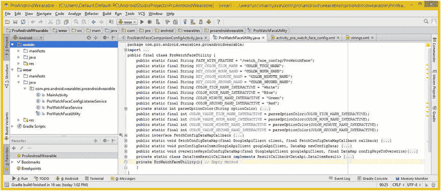
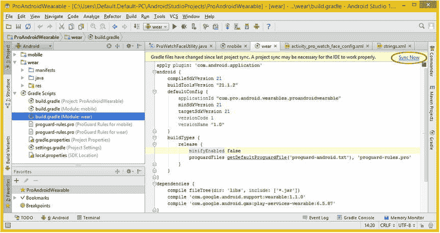

# 十五、可穿戴应用测试：在 Android Studio 中使用硬件设备

现在，您已经完成了 watch faces 应用的大部分编码和设计，您需要开始在**真实硬件设备** 上测试您的应用，这可能是一个非常复杂的工作过程。

第一步是让电脑、智能手机和智能手表硬件协同工作，这也是本章的主要目标，在软件开发环境(Android SDK 和 IntelliJ IDE)和硬件设备环境之间架起**桥梁**。我已经讨论过只使用电脑(带 AVD)，现在我将讨论使用电脑和带 AVD 的智能手机，最后我将讨论同时使用电脑、智能手机和智能手表。

这将涉及到使用你制造商的 **USB 驱动**软件，除非你使用谷歌硬件设备，这也是模拟器使用的设备。如果你的硬件没有 USB 驱动程序，你将学习如何使用谷歌的 USB 驱动程序来让你的 Android 智能手表设备与电脑接口。你还将在你的智能手机上安装**谷歌穿戴应用**，并学习如何为**配对**和**调试**进行配置。

之后，您将了解 **Android 调试桥** ，或 **ADB** ，以及如何使用该命令行工具在您的计算机和 USB 或蓝牙连接设备之间建立**通信端口**。然后，您将了解如何让 **Android Studio** IDE 使用 IntelliJ 及其 **Gradle 构建系统** 中的特性来识别和构建硬件设备。我们开始吧！

将设备与计算机连接:USB 驱动程序

除非你使用的是**谷歌 Nexus** 设备(在这种情况下，你可以使用 USB 驱动程序，即你安装 Android Studio 时为你安装的 **SDK 管理器**，否则你首先要做的就是访问 Android 开发者网站上的 **OEM USB 驱动程序**页面，网址如下:

```java
http://developer.android.com/tools/extras/oem-usb.html
```

到达该页面后，右键单击 Android 设备的制造商驱动程序 URL。这将打开一个上下文相关菜单，在图 15-1 的右上角用红色圈出。选择第一个上下文菜单选项**，在新标签**中打开链接，并在浏览器的第二个标签中打开您的 Android 设备制造商网站 (我使用的是谷歌 Chrome 浏览器)。


图 15-1 。去 developer.android.com/tools/extras/oem-usb.html，右键点击并打开制造商的网站

因为我目前使用的是一台**三星 Galaxy Note 3** 运行 **Android 4.4** 来自 **T-Mobile** 我会在接下来的几张截图中展示我的三星 Note 3 工作流程，应该和你们厂商的工作流程 差不多。

如果 Android 链接没有带你去你的制造商网站上的支持部分，就像我的情况一样。单击您的设备类型，在我的例子中，它被标记为“手机”在图 15-2 的左下方可以看到我点击的链接被红色圈出。


图 15-2 。找到制造商网站上与您正在使用的 Android 设备类型相匹配的部分

这应该会带你到一个页面，在那里你可以找到你的智能手机产品，通常使用某种搜索应用对话框，或者可能使用一系列页面的优化过程来找到你的设备。

在三星网站 上，这是一系列下拉(微调)UI 控件元素，允许您从流派(手机、预设)到硬件设备(手机、预设)细化搜索，以选择手机运营商。

我的运营商是流行的 T-Mobile 服务，因此，我选择了 T-Mobile 作为该选项，如左下方的图 15-3 所示。T-Mobile 是一个用于 Android 开发和测试的优秀网络，因为它们支持各种各样的 Android 硬件，并具有现代、快速的 4G LTE，以及最近的宽带 4G LTE 网络。T-Mobile 现在到处都安装了 4G LTE 技术，甚至在这里的 Point Conception 半岛，旁边是一家著名的太空技术公司(Space-X)和范登堡空军基地。


图 15-3 。找到你的产品；在三星网站上，这是在移动手机T-移动手机下拉框下

正如你在图 15-4 中看到的，一旦我指定 T-Mobile 为运营商，我就可以访问第四个下拉微调 UI 元素，其中列出了 T-Mobile 支持的所有三星手机。找到了 SM-N900T，代表三星制造 Note 900 电话(我猜的)。


图 15-4 。在你的设备上找到型号 ，找到确切的产品，并下载 USB 驱动程序

请注意，有一个 W(白色)和一个 K(黑色，对于那些不熟悉印刷和 CMYK 颜色模型的人来说)版本。因为外壳的颜色不会影响司机，我可以选择这两个选项中的任何一个，但我选择了技术上正确的黑色版本，这样我就可以在图 15-4 所示的截图中展示我的智能手机的图像。如图 15-4 右侧所示(不要让漂亮的硬件设备分散你的注意力)，一旦你选择了一个硬件型号，你将会得到一个“获取下载”(或类似的)按钮。单击下载按钮，打开驱动程序软件下载页面。

寻找**下载**(。EXE)或类似按钮，并单击它开始下载过程。一旦你这样做了，在浏览器的底部应该有一个进度标签，显示在图 15-5 的底部。下载完成后，使用下载文件的下拉选项菜单并选择文件夹中的**显示**选项，这将使您在文件管理工具中拥有最大的控制权。


图 15-5 。下载 USB 驱动(上)；下载完成后，从下拉菜单中选择“在文件夹中显示”

正如你在图 15-6 中看到的，一旦你进入文件管理工具，你可以右击这个下载的文件，再次得到一个上下文相关的菜单，菜单中有很多选项，其中一个是**以管理员身份运行**选项，它允许你使用完整的操作系统(读写)权限运行文件。


图 15-6 。右击驱动安装程序可执行文件，选择以管理员身份运行菜单选项 ??

完成安装过程。正如你在图 15-7 中看到的，我选择了**美国英语**并接受了一个默认的**C:/Program Files/SAMSUNG/USB Drivers**作为我的安装目录。然后我使用**安装**按钮，在我的 64 位 Windows 8.1 AMD-64 系统上安装驱动程序，如图图 15-7 所示。


图 15-7 。使用下一步按钮浏览安装配置对话框；然后单击安装按钮

需要注意的是，此时您并没有真正地将 USB 驱动程序安装到您的操作系统配置中；您只需在硬盘上安装 USB 驱动程序软件，以便**计算机管理**对话框可以找到它，并使其成为您当前操作系统硬件配置的一部分。

正如你在图 15-8 中看到的，你访问这个对话框的方法是右击你的**电脑**、**我的电脑**，或者在 Windows 8.1 的情况下，右击名为**这台电脑**的图标。在上下文菜单上，您会发现一个管理选项，该选项将打开计算机(硬件)管理对话框 。


图 15-8 。右键单击这台 PC(计算机)图标；选择管理选项，打开计算机管理对话框

Windows 8.1 **计算机管理**对话框应该更准确地命名为计算机硬件设备管理器工具，因为这就是它的用途。如果您想了解您的计算机设置，您可以单击左窗格中的向右箭头，打开系统工具列表中的所有区域。点击**设备管理器**条目 ??，显示所有连接到您电脑的硬件设备，如图图 15-9 所示。

这应该包括智能手机，您应该使用 USB 充电线将智能手机连接到 USB 端口。我一直把我的电脑连接在电脑上，所以我总是充满电。你可以在中间的窗格看到，它被高亮显示，上面写着:**华莱士·杰克逊(SM-N9)** ，代表车主姓名和车型名称的前几个字母。如果您的智能手机没有连接，现在插入它，它应该会被检测到并出现。


图 15-9 。在左窗格中选择设备管理器；找到 USB 驱动程序；右键单击并选择更新驱动程序软件

再次使用右键访问上下文菜单，并选择**更新驱动程序软件**菜单选项。这将打开你的更新驱动软件对话框，如图图 15-10 所示。点击**自动搜索更新的驱动软件**，确保您拥有最新版本的 USB 驱动。


图 15-10 。选择自动搜索获取最新的驱动程序版本，以确保您拥有最新的驱动程序版本

现在你已经确保你有最新的 USB 驱动程序版本，选择另一个选项，浏览 我的电脑寻找驱动软件。然后你的操作系统会找到你下载的最新的 USB 驱动软件，并开始安装过程，如图图 15-11 所示的一系列对话框。现在，您的计算机可以将数据传输到您的智能手机，您的智能手机将对 IntelliJ IDEA 可见。


图 15-11 。在您的计算机上浏览 USB 驱动程序软件，并在您的操作系统上安装 USB 驱动程序

现在当你查看你的文件浏览器(文件管理)工具 时，你将能够看到一个 Android 硬件设备，如图图 15-12 所示。


图 15-12 。显示我的 Galaxy Note 3 智能手机使用 USB 驱动程序安装到我的 PC 上

安装 Wear API:将智能手表与手机链接

现在，您已经用正确的软件设置了 Wear 开发工作站，下一步是确保您将在移动设备上安装 Android Wear，以便与您的可穿戴硬件配合使用。

这包括您将用来测试各种 Pro Android 可穿戴设备应用的智能手机(或平板电脑)和智能手表。这将包括你的手表表面应用，你将在现实世界的硬件设备上测试。

因为你的智能手表已经安装了 Android 5.0 和 Wear，这相当于在你的智能手机上安装了这些 Wear APIs，然后将智能手表与智能手机连接起来。这就是你在本章这一节要做的事情，这样你就可以设置好你的移动硬件。

下载和安装 Wear API:谷歌 Play 商店

你下载和安装 Wear API 的方式是在智能手机上，通过服务提供商(就我而言，就是 T-Mobile 的 4G LTE 服务)。在智能手机上找到您的谷歌 Play 商店图标，您将使用它来测试您的应用并启动 Play Store。在你的谷歌 Play 商店搜索栏中，输入“wear”这个词，你就可以找到与 Android Wear 相关的软件。

首先出现的结果之一将是 Android Wear 应用本身。该应用将显示您可以免费下载。你的 Android 设备的下载部分应该看起来类似于图 15-13 所示，当然，统计数据反映了当前的使用情况。


图 15-13 。安装后的 Android Wear(打开 Wear 前)

Android Wear 应用本质上是将你一直在学习的可穿戴 API 安装到任何最终用户的智能手机上，这样他们就可以运行穿戴应用。Wear 应用使智能手机能够通过使用蓝牙 4.x、NFC 或 Wi-Fi 等技术与任何兼容 Wear 的智能手表硬件“配对”，如果智能手表硬件支持的话。

因为 Apple Watch 支持 Wi-Fi，所以用不了多久 Android Wear 智能手表产品也会支持它。其实索尼智能手表 3 已经支持了。有趣的是，当我在 Note 3 上安装 Android Wear 后，谷歌应用(主要的谷歌应用，包括所有谷歌的东西/应用)也想更新自己，所以我也更新了这个应用。

现在，您已经升级了智能手机，可以使用 Android Wear 智能手表，是时候设置智能手表本身并将其与智能手机配对，以便您可以开始设置 IntelliJ 来使用它们。

设置智能手表:索尼智能手表 3

接下来，我将设置我的索尼智能手表 3 ，它是我刚刚收到的，用于这本书的佩戴开发。我按照指示插上 SW3 充电 30 分钟，然后在与 Galaxy Note 3 配对之前打开它，Galaxy Note 3 现在已经安装了 Wear 应用。

有趣的是，我得到了与 AVD 模拟器完全相同的启动动画(旋转谷歌彩色点),然后是语言菜单选择器。我选择了英语(美国)，然后选择了“在您的手机上安装 Android Wear”通知。

接下来，我启动了 Android Wear 应用，出现了“让我们为您设置”屏幕，在这里，我点击了继续(蓝色圆圈中的右箭头)图标，以便我可以继续智能手表配对过程。

下一个屏幕有关于 Google 定位服务、Google Fit 服务以及接受选项的信息。一旦您选择此选项，即表明(同意)您接受隐私政策和服务条款。

我看到的下一个屏幕是“打开蓝牙”屏幕，所以我向下滑动屏幕顶部，点击蓝牙按钮，为我的 Note 3 打开该功能。我选择(检查)了我的设备(华莱士杰克逊(SM-N9)。

这个蓝牙对话框还显示智能手表 3 804D 是一个可用的设备。接下来我选择了**扫描**按钮，只是为了确保一切设置正确。

当我回到 Wear 应用时，我能够选择智能手表 3 804D 选项，并得到一个“配对”对话框，给我一个 224433 配对代码。

在我的智能手表 3 上，我选择(触摸)了**复选标记** UI 选项，然后在两个设备配对时出现了一个**下载**屏幕。

这个过程花了很长时间，因为我当时正在使用 2G 网络。如果你有 3G 或 4G 连接，速度会快得多。关键是，更新过程是通过谷歌移动(GMS)网络进行的，因此速度将取决于当时的连接速度。

在我的智能手机上，我看到了一个“打开手表通知”屏幕，我被告知要前往智能手表通知设置，并选择 Android Wear 旁边的复选框，所以我点击了这个通知，它将我带到了一个屏幕，我可以在这个选项旁边打上复选标记。然后，我使用屏幕底部的后退按钮完成了设置。

需要注意的是，打开手表通知是 Wear 应用的一部分，而不是智能手表 UI 的一部分，所以请确保您没有在那里寻找它，因为您不会找到它！(我犯了这个耗时的错误。)

当我在 Wear update(下载)后第一次使用智能手表时，它有一系列的操作屏幕，与 AVD 中看到的完全一致。接下来让我们来看看如何将所有这些硬件与 Android Studio 连接起来。

使用 ADB:将智能手机与 AVD 连接起来

在本章的这一节，我将解释如何将 IntelliJ AVD 仿真器用作智能手表。你可以通过使用 USB 电缆将其连接到智能手机上，并对其进行设置，以便 AVD 充当你的智能手表。

**ADB** 或 **Android 调试桥** 的主要用途是提供 Android 设备硬件的实时连接。这个桥允许您将您的设备硬件作为 Android Studio (IntelliJ)的扩展，这将允许开发系统(在本例中为 Android Studio)和用于测试的设备硬件之间的无缝交互。

这种数据连接将允许 AVD 仿真器和物理 Android 设备使用 USB(通用串行总线)端口双向“看到”彼此，以便运行和调试应用。

首先，让我们看看如何实现**硬件想法**方向，这样你就可以将你的 Wear AVD 用作智能手表，然后我将开始使用 Android 设备硬件而不是 AVD 进行测试，这将等同于**想法硬件**方向。

要使 Android 硬件能够“看到”USB 硬件，您需要在智能手机上启用开发者设置选项。一旦完成，您将能够选择启用 USB 调试设置，允许您的手机与您的工作站通信，并最终与您的 IDE 通信。

为此，进入智能手机的**应用区**(一个标有应用的 16 方形网格图标)，点击标有“设置”的**齿轮图标**点击顶部的**常规**选项卡，向下滚动到**关于**选项，然后点击。在**关于**部分，您将找到一个**构建编号**条目，您将连续点击该条目七次。这将为智能手机解锁一个 **Android 开发者模式**，一个新的**开发者选项**部分将出现在您的常规选项卡下。在这一部分中有大量的开发人员选项。

选择 **USB 调试**选项，在检测到智能手机和工作站之间的 USB 连接处于活动状态(就位或插入)时启用调试(与 Android Studio 通信)。现在，您已经在计算机上安装了 USB 驱动程序，并在您的智能手机上启用了 USB，您剩下要做的就是在您的工作站上配置软件，使用称为 ADB 的东西来管理此连接。

接下来，让我们详细了解一下 Android 调试桥的功能。这一点很重要，因为 ADB 是开发工作站 Android Studio IDEA 和任何 Android 设备硬件之间的实时网络(数据连接)链接，您可能想用它来测试您的应用，以查看它的外观和功能。IntelliJ 可以访问连接硬件的许多高级功能，允许您对应用的 CPU、系统内存、屏幕空间和类似信息的使用情况进行基准测试。

**Android 调试桥:** **联网软硬件**

ADB 是一个**命令行工具** ，可以让你与 AVD 仿真器实例或连接的 Android 驱动设备进行通信。你可以通过使用你的文件管理器**搜索**功能在你的硬盘上找到它。

为此，请打开您的文件管理器(在 Windows 8.1 中，它被称为**资源管理器**)，在左侧窗格中，单击最顶层的 OS 级别(这台 PC、我的电脑、计算机等)。)在您的文件管理工具中。这将向搜索工具显示您想要从哪个级别(向下)搜索。

接下来，在搜索栏中输入你要找的**adb.exe**可执行文件，如截图右上角的图 15-14 所示，红色包围。一旦你按下键盘上的回车键“启动”搜索，文件管理工具将搜索你的整个硬盘驱动器，这样你就可以找到文件。更重要的是，这将向您显示一个您需要使用的**路径**(下一步),以便使用命令提示符工具访问和运行这个 ADB 文件。在搜索结果的右侧可以看到路径(文件夹地址)，如图 15-14 中用蓝色突出显示的。


图 15-14 。使用带有 adb.exe 搜索规范的文件资源管理器的搜索结果

ADB.exe 是客户端-服务器体系结构的客户端部分，包括三个主要组件，包括在开发机器上运行的客户端和作为后台进程在开发机器上运行的服务器。该服务器将管理您的客户端和 ADB 守护进程之间的所有通信，该守护进程将运行在您的仿真器和/或设备上，这取决于您正在做的事情和您在开发(IDEA 设备或设备 AVD)过程中的发展方向。

您可以从 shell 中调用客户机，在 Windows 中，这是 DOS 命令行工具，您很快就会用到它。要发出 adb 命令，您应该调用 ADB 可执行文件，并使用命令行提示符为其提供一系列开关和命令，以及可选的数据输入选项。

其他 Android 工具，如 ADT 插件或 DDMS，也将自动创建 adb 客户端，以便 AVDs 和硬件等模块可以作为一个无缝的开发环境与之通信。这就是为什么 ADB 代表 **Android 设备桥**的原因，因为它允许你将东西连接或桥接到 IDE 中。

第三个组件是 ADB 守护程序，它作为后台进程在每个 AVD 仿真器上运行，并在每个硬件设备实例上活动。

你可以在**<SDK-install-folder>/platform-tools/**文件夹中找到 adb 工具，但这通常是一个隐藏文件夹，至少在 Windows 中是这样的。正如你在图 15-14 中看到的，搜索工具在 **/AppData/** 文件夹中找到了**adb.exe**，这在左侧显示的文件夹层次窗格中**是不可见的。**

需要注意的是，如果您仍在使用 Eclipse IDE 并且安装了 ADT 插件，那么您不需要直接使用 adb 在模拟器或设备上安装应用，因为 ADT 插件会处理应用的打包和安装。然而，Eclipse 在一年多前就停止了 Android Studio 开发，所以您可能希望尽快切换到 IntelliJ IDE 版本 14 (Android Studio)和 Gradle。

**在 Android Studio 内部使用 AVD:ADB****端口转发**

为了在你的智能手机硬件和 AVD 仿真器之间发送数据，你需要设置一个叫做 **ADB 端口转发**的东西。这可以通过使用 **adb -d forward** 命令行条目并指定您的 TCP 端口来完成。

让我们详细回顾一下这个过程，以便您可以连接您的硬件设备。启动 Android Studio，进入**运行编辑配置**并指定一个**穿戴模块**??，**不启动活动**选项， **Android 穿戴轮** AVD **仿真器**，如图图 15-15 所示，点击**应用**按钮，然后点击**确定**。


图 15-15 。设置磨损模块和磨损轮模拟器

接下来，确保在**工具安卓**子菜单中勾选了**启用 ADB 集成**选项，如图 15-16 中的突出显示。


图 15-16 。确保工具安卓启用亚行整合子菜单项目已被选中

接下来，确保您的智能手机安装了 Wear 应用，并通过 USB 连接到您的工作站，并且 Wear 应用已在手机上启动，然后单击 IntelliJ 顶部的 **Play** 图标，或使用 **Run  Run Wear** 启动 AVD 模拟器。您也可以使用 **Run  Debug Wear** 在调试模式下启动仿真器。对于这个例子来说，这两种方法都应该是可行的(我对这两种方法都进行了测试，结果都是可行的)。

等到 Wear AVD 模拟器初始化，显示一个 Android Wear 主屏幕，然后你就可以将智能手机与 AVD 模拟器“配对”了。这是通过使用以下命令序列将 AVD 通信端口转发到所连接的手持设备来完成的:

```java
adb -d forward tcp:5601 tcp:5601
```

需要注意的是，每次您通过 USB 端口将智能手机连接到工作站时(或者如果您关闭工作站或拔掉智能手机)，您都需要执行此步骤。

在 Windows 8.1 下这样做的方法是在**右键单击**的**开始菜单**(看起来像一个窗格)，然后从上下文菜单中选择**命令提示符(管理)**选项，如图 15-17 中的突出显示。

这将打开命令提示符(Windows Shell 或命令行)工具，您将使用它来运行**adb.exe**工具，并向它发送**开关**、**命令**和**参数**，就像上面概述的 adb -d forward tcp:5601 tcp:5601 命令一样。-d 是交换机(d 表示设备)，forward 是命令，tcp:5601 是参数(tcp 是传输控制协议或互联网协议，5601 是端口位置或“地址”)。这些 TCP 端口地址有两个，网络连接“等式”的每一端(工作站和设备)各有一个，该等式是通过使用 ADB 设备转发命令行序列在内存中创建的。


图 15-17 。右键单击开始菜单，并选择命令提示符(管理)

当您的管理员:命令提示符窗口出现时，命令提示符将显示这个**cmd.exe**工具“所在”的目录，因此您将知道您“所在”的计算机硬盘驱动器的位置这将是你在左上角看到的**C:\ WINDOWS \ system32>??，如图图 15-18 所示。键入一个 **cd\** 命令，意思是“更改目录:根目录”并点击**回车**。现在，提示符将显示为 **C:\ >** ，您可以使用 **CD** (或 CD)命令将目录(文件夹)更改为您位于图 15-14 中的**平台工具**文件夹。**更改目录** (cd)命令使用 cd 命令，然后是**用户\默认。default-PC \ AppData \ Local \ Android \ SDK \ platform-tools**路径，它指定了硬盘上您想要“站立”的文件夹。**


图 15-18 。导航到平台-工具文件夹，列出连接的设备，转发 adb 端口，并列出更多连接的设备

提示符现在显示您在平台工具文件夹中，可以运行 adb.exe 文件，因为它在您现在所在的同一个文件夹中。您现在可以使用 **adb devices** 命令行条目列出连接到工作站的所有设备。这将输出一个连接了的**设备列表，正如你在图 15-18 中看到的，我的 AVD 还没有启动，所以只显示了我的 Note 3。**

在我的例子中，智能手机设备被列为 **4d4f4baf** ，这很可能是一个内存位置。我输入了一个 adb -d forward tcp:5601 tcp:5601 命令，然后一旦 AVD 完成加载到内存中，我再次运行 adb devices 命令，正如你在底部的图 15-18 中看到的，一个 AVD 现在在附加设备列表中可见，指定为 **emulator-5554** 。

下一步是在您的 Android 设备上启动 Android Wear 应用并连接到仿真器，这也可能很困难，因为您需要找到的菜单项在 Android Wear 设置菜单上并不直接可见，并且工作流程在互联网上的太多地方都没有概述，所以请密切关注过程中的这一步！值得注意的是，Android Wear 应用可能会在未来改变 UI 设计，以使这个“与仿真器配对”选项更容易定位。

选择 Android Wear 的功能菜单，这是通过我的 Note 3 智能手机硬件左下角的菜单按钮访问的。这将看起来像一个正方形图标，里面有两个水平条，因此看起来像一个下拉菜单。点击它，屏幕上会出现一个菜单。

在菜单的顶部有一个“与新的可穿戴设备配对”的选项。选择这个，会出现一个“选择一个设备”屏幕，其中根本没有列出 AVD，只有配对的智能手表设备，在我的例子中，这是索尼智能手表 3。一旦该屏幕可见，再次点击硬件**菜单**按钮，然后您将看到您需要选择的“与仿真器配对”选项。

为了测试 ADB 连接并将数据发送到 AVD，再次访问佩戴功能菜单(在我的 Note 3 上，这是使用菜单硬件键)。在这个菜单的中间，你会看到一个选择**演示卡**功能的选项。

您可以使用此功能来测试设置为智能手表的 AVD。只需选择一些演示卡，并确保它们作为 Wear Round AVD 模拟器主屏幕上的通知显示在您的 AVD 上。我选择了体育、酒店和股票演示卡来测试工作站到设备的接口，该接口是通过 USB 总线(端口)使用 ADB 连接协议建立的，如图图 15-19 所示。


图 15-19 。测试智能手机到 AVD(通过 Android Studio，在工作站上)的 ADB 连接链接

接下来，这个过程将变得更加复杂，你还将连接智能手表硬件，这样你的工作站就可以通过智能手机与智能手表进行对话。

蓝牙调试 :链接到智能手表

我之所以先介绍如何从智能手机链接到 AVD，是因为需要以同样的顺序执行这些步骤，以将您的 IDE 连接到硬件设备，从另一个方向进行。你将需要能够通过 USB 电缆将你的应用从 Android Studio 发送到你的智能手机，然后再发送到智能手表。让我们来看看将智能手表与智能手机配对的步骤，然后通过 USB 建立从 Android Studio 到智能手机再到智能手表的实时链接。

值得注意的是，如果您希望将智能手表和智能手机都插入工作站上的 USB 端口，则无需执行所有这些操作。一些智能手表，如 MOTO 360，不允许 USB 连接，因为所有智能手表都有蓝牙调试，我将展示一种更复杂的方法，在没有智能手表 USB 连接的情况下让一切正常工作。

智能手表设置:配对并启用蓝牙调试

你需要做的三个主要步骤是**将智能手表与智能手机配对**，为智能手表启用**蓝牙调试**，然后在智能手机上启用蓝牙调试。第一个是通过智能手机上的 Wear 应用完成的，第二个是在智能手表上完成的，第三个是在智能手机上完成的。完成所有这些工作后，您将使用 ADB forward 并连接命令序列，以使 ADB 守护进程可以看到所有内容。

启动智能手机上的 Wear 应用，并确保它与您的智能手表配对，或者使用 Wear functions 菜单上的**与新的可穿戴设备**配对，这是您在上一节中使用的。第一次进行配对时，Android Wear companion 应用会建议您参加一个介绍可穿戴 UI 及其基本功能的简短教程。之后，你将能够访问一个标准的穿戴 UI，在那里你可以选择表盘，启用语音操作，并浏览谷歌 Play 商店中建议的穿戴应用。

下一步是为智能手表设备启用蓝牙调试。所有可穿戴设备都将禁用 USB 调试作为默认设置，因此您必须在智能手表上手动启用它。启用蓝牙调试的选项将被隐藏，就像它在智能手机上一样。这是为了“正常”的最终用户不会意外地启用调试模式。

您需要打开“设置”,选择“关于”,然后连续七次点按“构件编号”。这个新的设置菜单包括开发者选项，在这里你可以通过蓝牙进行调试。在我的智能手表 3(索尼)上，通过蓝牙调试选项是灰色的(禁用)，直到我首先选择了 ADB 调试选项。因此，对于每个智能手表硬件设备，通过蓝牙打开调试所需的序列可能不同。

下一步是返回到您的智能手机设备，在那里您可以启动“设备调试会话”这是通过再次打开 Android Wear 应用并转到应用右上角的穿戴设置(齿轮)图标来完成的。

点击设置图标打开设置菜单，滚动到底部，找到通过蓝牙调试选项，并在其旁边放置一个复选标记以启用此功能。

在调试蓝牙功能标题下面应该有一些较小的字体文本，表明**主机**(您运行 **ADB** 连接到 Android Studio 的工作站)与**断开**，而**目标**(您的智能手表)与**连接**。

下一步是使用**命令提示符**工具访问 ADB 守护程序，并将其配置为使用蓝牙链接查看智能手表。这可以通过在 DOS 命令提示符下输入两个命令来完成，一个是 forward，另一个是 connect。第一个**亚行前进**命令应该是这样的:

```java
adb forward tcp:4444 localabstract:/adb-hub
```

第二个 adb connect 命令更简单，应该如下所示:

```java
adb connect localhost:4444
```

正如你在图 15-20 中看到的，我仍然在运行 AVD 仿真器，所以我得到了一个错误。


图 15-20 。调用 adb forward 和 adb connect 命令，连接智能手表

一旦成功，你将得到一个“允许 USB 调试？”在你的 Wear app 上留言，旁边还有一条**这台电脑的 RSA 加密密钥指纹是:<密钥串在这里>** 留言。点击 **OK** 按钮完成设置。还有一个“总是允许来自这台计算机”的选项，这是我选择的。

执行此操作后，Wear 应用设置中的“通过蓝牙调试”选项下的较小字体文本将更改为显示以下内容:

```java
Host:   connected
Target: connected
```

现在，您已经将所有东西“连接”在一起，您应该能够从工作站访问您的智能手机和智能手表。现在，您已经开始测试本书中到目前为止构建的 Watch Faces API 类和功能。

在你开始在 Android Studio 中测试和调试之前，我想介绍一个额外的话题，Java Singleton 设计模式。您将向 ProWatchFaceUtility.java 类添加最后一个**私有构造方法**，然后您将准备好测试和调试您的新应用。

Java Singleton:prowatchface utility()构造函数

在 Java 软件开发中，单例模式是一种设计模式，它将一个类的实例化限制在一个对象上。当只需要一个对象来协调整个系统的操作时，这很有用，就像在 ProWatchFaceUtility 类中一样。这个概念通常被推广到只有一个对象存在时操作更有效的场景，例如资源有限的穿戴(穿戴或智能手表端)组件。

这样做的第一步是将类的默认构造函数方法创建为私有方法。这将防止其他类直接实例化该对象。在你的 ProWatchFaceUtility.java 类的末尾添加空的`private ProWatchFaceUtility( ){ }`构造函数方法，如图 15-21 中底部高亮显示的。



图 15-21 。在 ProWatchFaceUtility 类的末尾添加一个私有的 ProWatchFaceUtility()构造函数方法

这使得这个私有方法成为一个类级别的方法，这意味着您的 ProWatchFaceUtility 可以被静态访问，而无需创建对象。正如您可能想象的那样，这是一种内存和 CPU 优化技术。

事实上，你会看到这个 IntelliJ 建议**通过创意左侧的一个黄色灯泡为' com . pro . Android . wearable . proandroidwearables . prowatchface utility '**添加按需静态导入，如图图 15-22 所示。


图 15-22 。使用 ProWatchFaceUtility . overwritekeysinconfigdatamap()进行静态访问(prowatchface utility)

通过在这里使用单例模式，你现在将能够使用 ProWatchFaceUtility . overwritekeysinconfigdatamap()方法访问你的 prowatchface utility 类中的方法(就像你在你的 ProWatchFaceConfigListenerService.java 类中的 onMessageReceived()方法结构中所做的那样),没有双关的意思，正如在图 15-22 的底部突出显示的那样。

接下来，让我们开始测试和调试您的 Watch Faces 应用！

测试和调试:创建您的。APK 档案

为了使用外部硬件设备在 Android Studio 中测试和调试您的 wear 应用，您需要生成**。APK** 档案。您还可以使用您的 avd 测试这些调试和发布“构建”。

您使用**调试构建版本**来测试您连接的硬件设备，使用 AVD 仿真器，并且您使用**发布构建版本**来分发您的应用，一旦您“签署”(序列化)它。

Android Studio 构建系统:概述

如前所述，Android Studio 的构建系统建立在高级的 **Gradle** 构建系统之上。这是一个**集成的**工具包，你将利用它来构建、测试、运行并最终打包(发布)一个应用。

Gradle build 系统可以使用 Android Studio 菜单系统作为集成工具包运行，也可以独立于命令行运行。您可以使用这个构建系统的特性来配置、定制和扩展这个梯度构建过程，以满足您特定的应用开发需求。

使用同一项目及其模块中的不同功能，可以为您的应用创建多个 APK 版本。您将跨不同的应用源“集”重用代码素材和资源 Android 的 Gradle build 系统的灵活性使开发人员能够实现所有这些优化特权，而无需修改应用的核心源文件。

Android 构建过程涉及许多工具和过程，它们会生成大量的“中间”文件，比如。java，。类，。德克斯还有。apk，沿途产生一个签名，内存优化。你可以把 apk 放在谷歌 Play 商店。如果您正在使用 Android Studio 开发应用，那么每次您为项目及其模块运行 Gradle 构建任务时，都会执行一个完整的构建过程。理解过程的各个阶段发生了什么是有用的，因为构建过程的大部分是可配置的，甚至是可扩展的。

为此，我将详细介绍 Gradle build 系统中涉及的各种组件，然后解释如何在 Android Studio 项目中创建构建，这是一个相当复杂的工作过程。

构建系统的组件:AAPT、AIDL、德克斯、CLASS 和 APK

Gradle 构建过程的工作方式是， **APPT** (Android 素材打包工具 ) 将收集您的应用的所有资源文件，例如 UI 设计所需的 XML 文件、应用清单和新媒体素材。对所有这些非编程逻辑素材进行编译，并生成 Java 模块，您将在 Java 代码中将该模块引用为 r，它实际上是通过这个 Java 文件到素材的点符号路径，如以下代码所示:

```java
watchFaceDrawable=watchFaceResources.getDrawable(R.drawable.prowatchfacelow); //ProWatchFaceService
```

这将从您的项目 **/res** 资源文件夹中的适当分辨率密度文件夹(/res/drawable-hdpi)中访问**prowatchfacelow.png**PNG BitmapDrawable 素材，在那里您的 R.java 资源被组织为 AAPT 编译成可以在运行时使用的格式。

AIDL(Android 界面定义语言 ??)工具 ?? 将你的。aidl 接口，用于将 IPC(进程间通信)实现为 Java 接口。IPC 在磨损应用中不常用，也不在本书的讨论范围之内，但是如果您需要使用它，您可以从下面的开发人员网站 URL 获得更多信息:

```java
http://developer.android.com/guide/components/aidl.html
```

在图 15-23 中可以看到，所有定制的 Java 代码，包括 Java 生成的 AAPT 和 AIDL 生成的。aidl 文件，被一个 **Java 编译器**编译成中间**。类**文件，你也在你的 AndroidManifest 中引用了它。XML 应用定义。


图 15-23 。Android 构建过程，从 AAPT 到。爪哇，到。上课去。德克斯去。apk，致署名 APK

构建过程的下一步是在。类文件转换成优化的。dex 文件格式，使用 Dalvik VM 工具。所有第三方库和。包含在项目模块构建中的类文件也将被转换成。德克斯文件。这是为了将它们打包到最终版本中。apk 文件。

所有未编译的资源，通常放在项目的 **/res/raw** 文件夹中，以及所有已编译的资源(R.java)和您的。然后，dex 文件被发送到 **apkbuilder** 工具，打包到您的 APK 中。

一旦你。apk 建立后，必须使用**调试**或**发布密钥**对其进行**签名**，然后才能安装在 Android 硬件设备上进行测试(调试)或使用(发布)。我将在下一章讨论等式的发布部分，在那里我将解释一个梯度构建过程的最后一行(步骤)，如图 15-23 所示。

最后解释一下构建过程，如果您的应用是以发布模式签名的，您必须**对齐**这个。使用 **zipalign** 工具进行 apk。如果你想知道，调整你的期末考试。当你的应用在 Android 硬件设备上运行时，apk 会**减少内存使用**。

Android 应用 Java 代码限制 : 64 千字节的方法

Android 应用分配给方法引用的代码限制是 64kb——64kb 代表 65，536 个字符的代码。如果您的应用达到了这个限制，Gradle 构建过程将无法通过。dex 转换。

随着开发人员可以用来创建应用的 Android API 库的规模不断膨胀，使用这些 Java 类或方法创建的 Android 应用的规模也随之膨胀。当应用和它们引用的库达到一定大小时，您将会遇到构建错误，指示应用已经达到 64 KB Android 应用构建限制。

Android 4 构建系统的早期版本报告了如下错误:

```java
Conversion to Dalvik format failed:
Unable to execute dex: method ID not in [0, 0xffff]: 65536
```

Android 5(Android Studio)Gradle build 系统的最新版本可能会显示不同的错误，这表明存在相同的问题:

```java
Trouble writing output:
Too many field references: 128000; max is 65536.
You may try using --multi-dex option.
```

这两种错误情况都显示 64 KB 的十进制等效值:65，536。这个数字表示在一个 Dalvik 可执行(DEX)字节码文件中，Java 代码可以调用的引用总数。如果您构建的 Android Wear 应用会“抛出”这一错误，那么您可能有过多的 Java 代码，并且可能想要查看代码优化。

有一种方法可以绕过这个限制，这就是本章的这一节所解释的。我把这个包括在内，以防你的应用需要复杂。Android 应用包(或 APK)文件包含**可执行字节码**文件。这些将采用 **Dalvik 可执行文件** (DEX)文件的形式，其中包含运行应用所需的 Dalvik VM 优化 Java 字节码。

当前的 Dalvik 可执行优化规范限制了单个。dex 文件到 65，536。这是一个均匀的“2 的幂”内存边界，可以包括您的 Android API 框架方法、库方法和您为应用功能创建的自定义方法。

通过“链接”可以超过这个 64 KB 的限制。德克斯的文件放在一起。这要求您配置应用的梯度构建过程，以生成多个。dex 文件。这在 Android 中通常被称为 **multidex** 应用 分发配置。

在 Android 5 之前的 Android 平台版本使用 **Dalvik VM** 运行时来执行应用代码，而版本 5 和更高版本使用为 Android 定制的 **ART** (Android 运行时)。Dalvik VM 限制每个应用只能有一个 **classes.dex** 字节码文件。apk 文件。为了避开这个限制，你可以使用**多指数支持库**。该库将成为主库的一部分。dex 文件，然后将管理对您的附加。dex 文件，有效地链接到它们包含的字节码。

Android 5 及更高版本使用 Android 运行时(ART)，它原生支持加载多个。dex 文件，使用单个。apk 文件。这是因为 ART 在用户安装应用时进行预编译，所以 ART 可以扫描多个 classes.dex 文件，并将它们编译成一个单独的**。由 Android 设备执行的 oat** 文件。安。oat 文件存储了为新的 Android 运行时 (ART) 设计的应用的原生 C++ 代码，该运行时在 Android 4.4 和更高版本中可用。

在将应用配置为使用超过 65，536 个方法引用之前，您应该尝试优化应用的 Java 代码调用的引用总数。这包括在应用的 Java 代码中定义的方法，或者更有可能是通过减少 API 库包导入的数量。

要做到这一点，通过确保应用中包含的任何大型库的使用方式超过添加到应用中的代码量，来优化应用的直接和可传递依赖关系。

开发人员有时会犯的一个错误是，在很少使用一些实用方法的情况下包含大型库。减少 Java 代码依赖性通常可以避免这 64 KB。dex 方法参考限制。

您也可以使用 ProGuard 删除未使用的代码。为此，请为运行 ProGuard 的应用配置 ProGuard 设置，并确保您已经为您的 APK 版本 Gradle builds 启用了**收缩**。启用收缩将确保 APK 中不包含任何未使用的 Java 类或方法。

使用这些优化技术可能有助于避免在应用中允许更多方法引用所需的构建配置更改。优化还可以减小 APK 的大小。这对于那些带宽成本高的市场来说尤其重要，因为这样可以降低应用的运行成本！

配置梯度构建:创建不同的 APK 类型

Gradle build 将生成一个特定的。应用/构建文件夹中每个构建变体的 apk 文件。一般来说，这将是一个**调试**变体，用于您的测试工作流程，以及一个**发布**变体，用于将您的应用发布到谷歌 Play 商店进行分发。

您可以为您的 Wear 应用发布工作创建您需要的任何其他“风格”的应用。例如，您可以在一个 **/src/demo** 文件夹中创建一个“有限功能演示”版本，并指示 Gradle 使用该文件夹的内容为您创建一个**pro watch face-demo-release . apk**文件。

生成到 **app/build/outputs/apk/** 目录中的 apk 文件将包含使用以下 APK 文件命名约定命名的包:

```java
<application name>-<flavor>-<buildtype>.apk
```

例如，ProWatchFace-full-release.apk 将是您的发布 apk，或者 ProWatchFace-full-debug.apk 将是您的完整 WatchFace 应用演示版本的调试版本。

接下来，在我开始讨论 ProGuard 和 Gradle build 系统之前，让我们检查一下，确保您有最新版本的 Android Studio。在你这样做之后，你实际上可以使用 Android Studio 来生成一个构建，你可以开始查看构建和测试你的 Watch Face 应用的过程。

启动 Android Studio，使用**帮助检查更新**菜单序列，确保没有新的 Android 组件已经发布。希望你会看到“你已经安装了最新版本的 Android Studio”对话框，如图图 15-24 所示，以及帮助检查更新菜单序列。如果需要，请在继续之前更新 Android Studio！


图 15-24 。在开始构建、调试和测试阶段之前，总是使用 IDE 的检查来更新特性

接下来，让我们仔细看看移动模块(组件)的 Gradle build 配置文件，并了解 build.gradle 文件中的其他部分(除了 Android 和依赖部分，我已经详细介绍过了)。

**配置** **构建**??:解剖一个 **构建.配置**

首先，让我们深入了解一下应用的**移动**模块的 **gradle.build** 文件。打开你的 app 的 **Gradle Scripts** 部分，右击**build . Gradle(Module:mobile)**，选择 **Jump to Source** (或按 **F4** 功能键)，在编辑页签中打开该 Gradle script，如图图 15-25 所示。


图 15-25 。打开移动模块 build.gradle 文件，并使用“立即同步”功能确保它是最新的

如果在 build.gradle 编辑窗格的顶部出现黄色的“Gradle 文件已更改”消息，请单击右侧的**立即同步**链接选项。这将同步您的项目，您总是需要在构建之前这样做。

第一个 apply 插件语句允许构建配置的 android {}部分引用 Google 的 Android Maven 存储库中的 com.android.application 定义。这允许文件的 android {…}部分存在(也就是说，有意义),并因此被正确解析。

正如你已经知道的那样， **android** 部分定义了你的版本和包命名约定，而你的**依赖项**部分引用了外部 API 库，Gradle 需要将这些 API 库引入到你的应用编译过程中。请注意，有一个 wearApp 项目条目，它连接应用的 **wear** 模块，还有一个编译文件树条目，它将包括您可能放在项目的/ExternalJarFiles 目录中的任何第三方 JAR 文件(即物理或 3D 渲染库)。

在构建时，buildTypes{}部分是主要关注的内容。图 15-25 中的 buildTypes{}部分显示了 build types { }部分的嵌套**发布{}** 子部分。如果您想知道 build.gradle 文件使用的是哪种编码格式，它是一种叫做 Groovy 的编程语言。

您可能想知道为什么没有 debug{}子部分，因为总是会生成两种主要的构建类型。这是因为调试构建规范是自动生成的(默认)，而不必实现显式的构建配置规范。也就是说，如果您愿意，可以使用 debug{}子部分。

例如，您可以添加“.”的**应用 id 后缀**。debug”来进一步确定您的调试文件版本，如果您愿意，可以使用下面的 Groovy 代码:

```java
debug {
       applicationIdSuffix ".debug"
      }
```

buildTypes{}部分的 release{}部分将优化您的。APK 文件发布版，使用了 ProGuard 工具和 minification 标志，通过使用下面的 Groovy 代码，其中没有使用分号字符来终止其语句！这可以在图 15-25 的中看到:

```java
buildTypes {
    release {
        minifyEnabled false
        proguardFiles getDefaultProguardFile('proguard-android.txt'), 'proguard-rules.pro'
    }
}
```

接下来，让我们来详细了解一下 ProGuard 工具和 minification 标志，这样您就可以确切地知道它们是什么，以及为什么要在您的发布 APK 文件构建中使用它们。

**使用** **程序** **:压缩、优化、混淆代码**

ProGuard 工具优化了您的代码，使其更加紧凑，同时也使代码更难逆向工程，这一过程称为“混淆 ”它通过移除未使用的代码并使用晦涩的名称重命名类、字段和方法来实现这一点，从而使代码难以逆向工程。

结果是一个更紧凑的版本。apk 文件，逆向工程难度更大。因为 ProGuard 使您的应用更难被逆向工程，所以当应用利用对安全性敏感的特性时，例如当您正在许可一个应用或当它包含专有或有价值的 IP 时，实现 ProGuard 是很重要的。

ProGuard 被集成到 Android build 系统中，如图图 15-25 所示，这样你就不用手动编码调用来实现它，使用 Groovy。只有在发布模式下构建应用时，才应该调用 ProGuard。这样，当您使用调试模式构建应用时，就不必使用混乱的代码进行调试，至少可以说这是令人困惑的！

运行 ProGuard 进程是可选的，但是强烈建议这样做。要打开 ProGuard，将 **minifyEnabled** 标志设置为等于 **true** 值，要禁用(关闭)ProGuard，将 minifyEnabled 标志设置为 false。此 minifyEnabled 属性是 release{}子部分中 buildTypes{}部分的一部分，它控制应用于发布版本的设置。当您准备好压缩(压缩)和混淆 Java 代码时，将 minifyEnabled 属性设置为 true 以启用 ProGuard。

需要注意的是，尽管 Android 希望您使用 ProGuard，这也是 Android Studio 为您安装这两个 Groovy 语句的原因，但 Android 通过将 minifyEnabled 设置为 false 值来停止为您实现这两个语句，这在一开始就关闭了 ProGuard。

**getDefaultProguardFile( )** 方法 设置一个“ProGuard-Android . txt”ProGuard 配置定义，在图 15-25 中高亮显示。这是你默认的 ProGuard 配置设置，这个文件可以在 Android<SDK>/tools/ProGuard/文件夹中找到。

还有一个**proguard-Android-optimize . txt**文件，在 Android**<SDK>/tools/proguard/**文件夹中也有。该文件实现了相同的规则，但是它也支持“字节码级别”的优化。这些优化将在 Java 字节码级别执行额外的优化分析。这是在方法内部和方法之间完成的，当 Android RunTime (ART)引擎以 Java 字节码的形式运行应用时，这有助于使应用更小、运行更快。

最后，还要注意在图 15-25 中突出显示的 Groovy 代码行中，Android Studio 在 proguardFiles 条目的末尾使用了一个逗号，并在该模块的根目录添加了**‘proguard-rules . pro’**文件引用。这样，如果需要，您可以轻松地添加您自己的、定制的 ProGuard 规则，这些规则应该是特定于发布模块的，您可以将它们添加到该文件中，这样它们将确保生效。

接下来，让我们看看你的**build . grad le(Module:wear)**并确保它在你构建应用之前不需要同步。

右键单击**build . gradle(Module:mobile)**，选择**跳转到源代码**(或按 **F4** 功能键)，在编辑页签中打开该 Gradle 脚本，如图图 15-26 所示。如果在 build.gradle 编辑窗格的顶部出现黄色的“Gradle 文件已更改”消息，请单击**立即同步**。



图 15-26 。打开磨损模块的 build.gradle 文件，并使用“立即同步”链接同步到您的项目

现在是时候看看 Gradle 的构建过程并创建调试 APK 了，这样你就可以开始漫长的测试、调试和发布过程，这将贯穿本章的剩余部分以及下一章。

构建你的项目:使用 Gradle 构建引擎

虽然您可以使用 AVD 模拟器在内部测试项目组件,但是为了在下一个级别真正测试您的项目组件，您需要将它们“构建”到 Android 包中，或者。简称 APK，文件格式。这种格式也可以用 AVD 来测试。更重要的是，它可以在现实世界的硬件上进行测试，通常是在应用开发过程的最后。

**运行 Make** **项目工具** **:使用 Gradle Build 控制台**

在 Android Studio 中打开你的项目，使用 **Build  Make Project** 菜单序列，调用 Gradle build 过程，如图图 15-27 所示。


图 15-27 。使用 Build  Make Project 为 ProAndroidWearable 项目创建 Android 包 APK 文件

正如你在图 15-27 所示的菜单中看到的，你可以只构建移动模块，但是因为这是一本穿戴书籍，你将构建项目，该项目将构建移动(电话)和穿戴(智能手表)组件。

要查看 Gradle 在项目的移动和穿戴部分的构建过程中做了什么，请单击位于 Android Studio 右下角的 **Gradle** **控制台**选项卡。正如你在图 15-28 中看到的，我不得不使用两个屏幕(在一个图中)来显示 24 个移动构建步骤和 24 个磨损构建步骤，从而在 29 秒内成功构建了 APK。


图 15-28 。单击右下角的 Gradle 控制台选项卡，查看 Gradle 正在执行的构建任务

既然您已经构建了项目，下一步就是运行项目模块，通过 USB 连接的 Android 硬件设备来查看它们是如何工作的。

**运行您的 APK:使用一个** **USB 设备目标设备**设置

当您将一个模块作为 Android 应用(APK)运行时，Android Studio 会自动创建您的运行配置。默认运行配置将启动默认项目活动，并使用自动目标模式进行设备选择。**自动目标设备模式**将选择**仿真器**，选择(首选)AVDs 的**无**(空下拉菜单区域)。

一个**手动目标设备模式**是你在本书中迄今为止一直使用的，在这里你选择了 Nexus 或 Wear 你想要启动的 AVDs。现在您将在**运行/调试配置**对话框中为**常规**选项卡的**目标设备**部分选择 **USB 设备**选项，如图图 15-29 所示(左侧为移动模块，右侧为磨损模块)。


图 15-29 。使用运行/调试配置对话框设置移动和磨损模块使用 USB 设备

我必须通过 USB 重新建立硬件接口，所以我在图 15-30 中包含了我的 DOS 命令提示符窗口，以向您展示我如何使用 adb 设备来查看是否有设备连接，以及一旦我看到设备，我如何使用 forward 和 connect 命令来访问智能手机和智能手表。


图 15-30 。使用 ADB 命令设置 USB 智能手机连接和智能手表蓝牙

设置好之后，我使用**运行项目**(不是运行 wear)来运行移动模块和磨损模块，这样我可以一起测试它们。我在我的设备上收到了**允许谷歌检查设备病毒**和 **Wear 未连接**的消息，尽管 Wear 应用正在运行。我在 LogCat 窗格中得到一些错误和警告，如图 15-31 所示。


图 15-31 。设备和 LogCat 窗格将在 Gradle 控制台旁边打开，显示警告和错误

我首先使用谷歌搜索解决了红色的错误消息，看看是否有其他开发人员得到了这个**senduractionevent()mView = = null**错误消息。原来这是三星硬件的问题，因为我目前正在使用 Galaxy Note 3，所以我排除了这个问题，我需要在我的代码库中寻找解决方案。

我想解决另一个警告，即没有 epolicy 文件来找出什么是 epolicy 文件，所以我也在谷歌上搜索了一下，发现这个错误与运行多个构建会话有关，与智能手表上没有手表表面无关。

在这种情况下，接下来要尝试的是通过 USB 电缆直接连接智能手表，这样智能手机和智能手表都可以直接连接，并且可以关闭蓝牙调试(这比较慢，可能也是问题所在)，从而消除一层复杂性。需要注意的是，没有 USB 端口的智能手表(如 MOTO360)必须使用蓝牙调试，这也是我详细介绍它的原因。

**硬连线 USB 连接** **:设置智能手表 USB 驱动**

因为我找不到专用的索尼智能手表 3 USB 驱动程序，这将是一个很好的机会，向您展示如何使用谷歌 USB 驱动程序，您使用 Android SDK 管理器安装该驱动程序来完成连接。

因为你已经安装了谷歌 USB 驱动，你唯一需要做的就是在你的**AppData/Local/Android/SDK**文件夹中找到它。它不在/platform-tools 文件夹中，而是在一个不同的目录中，名为**/extras/Google/USB _ driver**，名为 **android_winusb** 。

对智能手机 USB 驱动程序执行与之前相同的步骤，这可以在图 15-8 到 15-10 中看到，除了这一次，指定您刚刚找到的谷歌 Windows USB 驱动程序。需要注意的是，如果你使用的是 Linux 或者 Macintosh，你不需要安装任何 USB 驱动。

现在 adb 命令序列变得更容易，因为你不必使用 adb 转发和 ADB 连接蓝牙序列；您只需使用 **adb devices** 命令来查看硬件设备是否已连接。您也不需要**ADB-d forward TCP:5601 TCP:5601**命令来启用通过智能手机到智能手表的端口转发。

正如你在图 15-32 中看到的，新的 ADB 命令行序列要短得多，因为你不需要设置一个蓝牙端口，然后连接到它。


图 15-32 。当两个硬件设备都通过 USB 连接时，ADB 命令行序列要短得多

当你进入 Android Studio 并查看 Gradle 控制台窗格旁边的 Android 窗格时，你会看到现在有两个硬件设备，如图 15-33 中屏幕左侧突出显示的下拉菜单所示。


图 15-33 。在 Android 选项卡中，在 IntelliJ 的底部，您会在下拉菜单中找到这两种硬件设备

当您使用 Run 项目、Run  Wear 或者 Run  Mobile sequence 时，会弹出**选择** **设备**对话框，如图图 15-34 所示，这样您就可以选择要将该构建推送到的硬件设备。


图 15-34 。当您选择运行 wear 或运行 mobile 时，您会看到一个选择设备对话框，其中列出了硬件

然而，尽管我的配套应用在智能手机上运行良好，但我的表盘组件却没有在智能手表上显示出来。心血来潮，查了一下更新，得知 Android 5.2 刚刚发布。

事实证明，5.2 版本是一个重要的版本，对 API 进行了重大的修改。这影响了 ProWatchFaceService 类和我正在使用的方法。所以我决定在这里结束这一章，并添加另一章关于如何处理这些重大的操作系统更新变化，这样你就可以看到整个过程，以防它发生在你身上，这总是会发生的，因为 Android 是一个“移动的目标”。

摘要

在本章中，您学习了如何让您的电脑、智能手机和智能手表硬件协同工作，在软件开发环境(Android Studio)和您的硬件设备环境之间架起**桥梁**。

这包括获得一个制造商的 USB 驱动程序软件，并学习如何使用谷歌的 USB 驱动程序，如果你需要让你的 Android 智能手表设备与电脑接口。

你学会了如何确保在你的手机上安装一个 **Google Wear 应用**，以及如何配置它用于**配对**和**调试**目的。

您学习了**Android Debug Bridge**(**ADB)**命令行工具，以及如何使用 DOS 命令提示符来访问它，以便在您的计算机、USB 或蓝牙连接设备之间建立**通信端口**。然后，您开始使用 **Android Studio** IDE 来识别和构建您的硬件设备，使用 IntelliJ 及其 **Gradle 构建系统**中的各种窗格和对话框功能。

在下一章中，你将升级到 Android 5.2，从你的 BitmapDrawable 代码中取出一个不推荐使用的方法调用，并学习在 Android 中开发如何成为一个移动的目标，以及如何最好地处理这个问题！