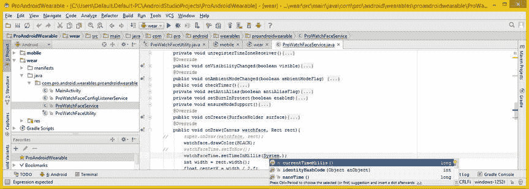
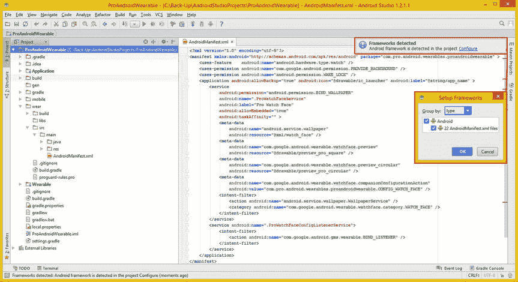

# 十六、Wear API 弃用：更新应用以使用新的类或方法

在第十五章中，你设置了硬件设备，这样它们就可以通过使用 Android 调试桥与 Android Studio 对话。然后，您尝试让 wear 组件显示在智能手表上，以便测试配置伴侣活动。我在工作过程中尝试的一件事就是检查 Android Studio 和 Android SDK 的更新。

有一个重要的操作系统更新，**Android Studio 1.2**(Android 5.2)，已经发布了！所以我决定将这个更新和不推荐的代码更新的过程放在它自己的一章中。本章将介绍更新该项目的 wear 组件的过程，该组件目前尚未在智能手表设备硬件上按预期运行。我将介绍整个过程，从处理意外的重大 SDK 升级到重新编码任何不赞成使用的类或方法。在这种情况下，这些将涉及 ProWatchFaceService.java 类。

因此，在本章中，您将了解更多关于**日历**和**公历日历**类的信息，它们将用于取代 Android 5.2 中不推荐使用的时间类。您还将实现一个不同版本的**。getDrawable( )** 方法，作为该方法调用的两个版本之一，在本次 Android 5.2 API (SDK)升级中被弃用。

当我完成代码升级时，一个**Android Studio 1.2.1.1**升级也发布了，这给 Gradle build 系统与 IntelliJ (Android Studio)的集成带来了一些问题。所以我会解释更多关于 Gradle 和 IntelliJ 的内容来帮助你学习如何解决这个问题。

应对突发更新:Android 5.2

当我检查更新时，我得到了一系列对话框，如图图 16-1 所示。然后我继续绕过如图图 16-1 所示的对话框来更新 Android。我点击了**更新和重启**按钮，我得到了**下载补丁文件**和**更新**进度条对话框，最后，我选择了**我想从以前版本导入我的设置**单选按钮，和**确定**按钮来完成这个过程。几个星期后，1.2.1 出来了，一周后又是 1.2.2，所以我不得不从头再做一遍！


图 16-1 。更新对话框，显示一个主要的 71MB 更新可用于更新到 Android Studio 1.2

正如你在图 16-2 中看到的，这次更新是一次重大更新，需要安装 **28 个 API SDK 包**。我点击了安装 28 包按钮，并更新。


图 16-2 。此安装会自动选择 28 个 SDK 包、库和系统映像来安装或更新

Android SDK 管理器日志显示了 Android SDK 工具修订版 24.1.2 和 Android SDK 平台工具修订版 22 的下载和安装，如您所知，其中包括 **ADB 服务器**和工具。如果 ADB 服务器正在运行，安装程序可以停止它，它确实停止了，然后安装程序试图重命名当前的**/平台工具**文件夹以便备份它。这失败了，因为我打开了一个命令提示符，所以安装程序停止并产生一个错误信息，在图 16-3 中显示为红色。


图 16-3 。为了继续安装，我必须关闭命令提示符工具

一旦我关闭命令提示符，安装就完成了，如图图 16-4 所示。


图 16-4 。选择最新的 Android SDK 构建工具；更新英特尔 x86 仿真器，看看它是否能在 AMD 上工作

如你所见，最新版本的 Android Build Tools (22.0.1)没有被选择安装。我也选择了这一点，因为我试图解决我的项目的手表表面(佩戴)侧不在智能手表上显示的问题，解决方案可能在这个新的 Build Tools 22 代码中。

我还选择了英特尔 x86 模拟器加速器(HAXM)的更新，以查看是否添加了对 AMD64 系列处理器的支持。接下来，我单击了 Install 2 packages 按钮，安装了这些在第一次操作系统平台更新时没有安装的软件包，为了在 IDE 中安装所有需要的东西，您经常需要这样做。

现在我已经更新到了 Android 的下一个主要版本(5.2)，是时候看看 ProWatchFaceService.java 文件(类)了，看看代码中是否有任何东西可能会阻止应用的手表表面(佩戴)侧在智能手表设备硬件上运行。

处理折旧:。getDrawable()和时间

正如你在图 16-5 中看到的，现在你的代码中有了在最新版本更新之前没有的亮点。**被弃用的**代码被排了出来(这使用了**删除线**字体)，这可能有些令人不安，但它直观地通知开发者，他们正在使用的代码是安卓 5.x 平台不再支持的**，这就是被弃用的意思。你可以将鼠标放在突出显示的代码上，你会得到一个弹出提示，告诉你这个**。getDrawable(int)** 方法调用已被否决。这意味着你需要到开发者的网站上查看 API。**

 **

图 16-5 。打开在智能手表上不工作的 ProWatchFaceService 类来查看代码

你可以在 Gradle 控制台中看到颜色突出的注释，显示在图 16-5 的底部，它建议你如果想要使用不推荐使用的代码，你需要使用名为 **-Xlint:deprecation** 的编译开关。我想在这本书里使用 **100%干净的**(无 bug 和最新的)代码，所以我将在这里采取更困难的方法，重新编写 Java 代码。

Android 5.2 (Android Studio 1.2)中有两个主要的弃用之处会影响到你一直在写的代码。一个是**时间**类，另一个是。getDrawable(int)方法。在本章的这一节，我将讨论可以用来代替你一直在使用的不赞成使用的类和方法的类和方法。值得注意的是，您仍然可以使用您在本书前面添加的代码，但是，随着时间的推移，不推荐使用的代码最终会变成停止使用的代码，所以最好立即升级(替换)不推荐使用的 Java 语句！

Android 的资源类:两个。getDrawable()方法

我已经解释了 Android Resources 类，所以我在这里不再重复。我将只介绍适用于必要的 Java 代码升级的内容，这将消除 IntelliJ (Android Studio 1.2)中删除的代码。

为了升级已弃用的。getDrawable(int)方法调用，你将需要在开发者的网站上查看 Android 的 **Resources** 类。你需要这样做来确定是否有这些**的其他版本。getDrawable( )** 方法调用将允许您从/res/drawable-hdpi/文件夹中检索背景图像可绘制素材。可以在以下 URL 找到资源类技术信息页面:

```java
http://developer.android.com/reference/android/content/res/Resources.html
```

注意有两个。Resources 类中列出的 getDrawable()方法，其中一个现在已被否决，所以您必须使用较新的方法，这是在线文档中建议的。关于这些的技术信息。在线的 getDrawable()方法结构应该是这样的:

```java
Drawable       getDrawable(int id)
This method was deprecated in API level 22. Use getDrawable(int, Theme) instead.

Drawable       getDrawable(int id, Resources.Theme theme)
Return Drawable object associated with a particular resource ID and styled for the specified theme.
```

因此，您对此 Android 5.2 升级弃用的解决方案是使用不同版本的。getDrawable()，它使用了一个**资源。主题**对象名为**主题**。如果你想继续使用你当前指定的主题，使用一个空值**。让我们来看看参考资料。下一个主题嵌套类。**

资源。主题嵌套类:主题属性

Resources 类有一个嵌套的**公共最终资源。** **主题** 类，该类扩展了 java.lang.Object 主类，具有以下层次结构:

```java
java.lang.Object
  > android.content.res.Resources.Theme
```

这个嵌套的**助手类**被创建来保存特定主题对象定义的当前属性值。众所周知，主题是一组使用资源属性定义用户界面外观和感觉的值。

主题对象封装了一个保存这些主题属性的 **TypedArray** 对象。使用 **int[ ]** 数组和 **AttributeSet** ，可以利用 TypedArray 来解析属性的最终值。你通常会使用**。获取样式属性(AttributeSet，int[ ]，int，int)** API 来检索 XML 定义的主题属性，并使用父用户界面和子用户界面属性定义标签应用样式和主题信息。Wear 应用通常不会改变主题，至少你正在编写的 Watch Face 应用不会。

当您想要保留一个默认的或者当前的主题时，您将为资源使用一个空值。. getDrawable()方法调用中的主题对象。

主题对象的属性以两种方式发挥作用。第一种是通过 styled 属性，它可以通过在 XML 标记参数中使用`themeParameterName="?themeAttribute"`语法显式引用主题中的任何值。

引用主题对象属性的第二种方法是在 Java 代码中使用**。获取样式属性(AttributeSet，int[ ]，int，int)** API 方法调用来检索 XML 定义的主题属性。如果想保持**的向后兼容性**，还有一个 **ResourcesCompat** 类。

接下来让我们看看 ResourcesCompat 类，因为添加向后兼容特性可以防止这种情况再次发生。这个类也有一个. getDrawable()方法，允许你在一个方法调用中传递一个**资源 R** 引用、一个**可绘制索引**整数和一个**主题**。

ResourcesCompat 类:向后兼容性

Android 的**public****Resources compat**class 也扩展了 java.lang.Object，因此被临时编码以提供资源的向后兼容性。该类的 Java 类层次结构类似于下面的代码:

```java
java.lang.Object
  > android.support.v4.content.res.ResourcesCompat
```

这个类是作为一个助手类创建的，开发人员可以利用它来访问 API level 4 之后引入的资源中的特性。这是以一种**向后兼容**的方式完成的，因此 Android 开发者可以避免在这本书的过程中发生的事情。你不需要在 wear 开发中使用它，因为 Wear 是在 4.4 中引入的，并且正在快速发展到主要利用 5.0 到 5.2(到目前为止)。

这个类有一个公共构造函数方法， **ResourcesCompat( )** ，用于创建一个对象。这个类中还有两个公共方法调用。一个是**。getDrawable(Resources res，int id，Resources。Theme theme)** ，返回与引用的资源 ID 相关联的可绘制对象，并将使用指定的主题对象进行样式化。

另一个是**getDrawableForDensity(Resources RES，int id，int density，Resources。主题主题)**方法调用。这可用于访问不同**密度**的可提取素材。大多数智能手表产品的像素范围是 320 到 400 像素(我希望到 2016 年可以增加到 480 到 640 像素)，所以你现在不需要使用这个版本的方法调用，它为**密度**(文件夹)添加了一个变量来访问可绘制的素材。

因为 Resources 类是 Wear 应用中更常用的标准类，也是您已经在使用的类，所以我将使用它。接下来我们来看看另一个主要的弃用，整整一节课！

处理废弃的类:时间类

您可能还注意到，在 ProWatchFaceService 类的顶部，Time 类(对象)引用在代码中被删除了，这意味着它也不被推荐使用。这个类仍然可以使用，至少到 2038 年，当它覆盖的日期(时间)范围用完时。这很可能是这个类被弃用的主要原因，尽管 Android 开发者的网站上没有给出具体的原因。

这是这次 Android 5.2 更新中的另一个主要反对意见，它影响了 ProWatchFaceService 类的 Java 代码，这意味着您必须重新编码来解决这个问题。

这一次，需要使用**日历**或**公历**类或它们的组合来替换整个类，即 time 类。您很快就会了解到，这些类是紧密相关的，并且与 Android 的**日期**和**时区**类相关。

Android Calendar 类是一个**抽象**类，用于创建 GregorianCalendar **具体**类，这个 Calendar 抽象类和 GregorianCalendar 具体类可以访问(利用)日期和时区对象。您将直接使用 Calendar 类(对象)和。getInstance()方法调用，您将在接下来学习它。

日历类:日期和时间的抽象类

Android **公共** **抽象日历**类 扩展了 java.lang.Object，实现了**可序列化可克隆可比<日历>** Java 接口。这个日历类的 Java 类层次结构如下所示:

```java
java.lang.Object
  > java.util.Calendar
```

Calendar 类有一个已知的直接子类， **GregorianCalendar** ，我将在下一节介绍它。Calendar 类是一个抽象类，用于创建 GregorianCalendar 类。它提供了方法调用，可用于从一个**日期**对象和该日期对象包含的一组**整数字段**中提取数据。

其中包括年、月、日、小时、秒、分钟和毫秒。Date 对象表示时间中的一个瞬间，如果需要的话，它可以使用毫秒级的精度。您很快就会在新的代码库中使用这种数据提取功能，所以我将在这里详细介绍这个类及其相关方法。

与其他 Android 5 位置敏感类类似，这个 Calendar 类提供了一个名为**的方法调用。getInstance( )** 。这可用于创建此日历类的实例以供一般用途。getInstance()方法将返回一个 Calendar 对象，其位置的微调基于应用用户的系统设置。该对象的时间数据字段将使用用户的**当前系统日期**和**系统时间**进行初始化。

对象声明和实例化可以在一个统一的语句中完成，这可以通过使用下面的 Java 语句来完成:

```java
Calendar calendar = Calendar.getInstance(); // Declare a Calendar object named calendar and load it
```

您将在新代码中使用一个 Calendar 对象，使用下面的 Java 代码会有所不同:

```java
Calendar watchFaceTime = Calendar.getInstance(); // Create/Load Calendar object named watchFaceTime
```

然后，您将使用 **Calendar 访问日历对象的属性。通过**属性**常量。get()** 方法调用，使用以下 Java 语句:

```java
int hour   = watchFaceTime.get(Calendar.HOUR);
int minute = watchFaceTime.get(Calendar.MINUTE);
int second = watchFaceTime.get(Calendar.SECOND);
```

日历对象可以定义为**宽松**或**非宽松**。宽松的日历对象接受的字段值范围比它生成的范围更广。例如，如果您使用宽松的 GregorianCalendar 对象，如果您使用 MONTH == APRIL，DAY_OF_MONTH == 31，它会将这一天解释为 5 月 1 日。

在这种情况下，**非宽松的** GregorianCalendar 会抛出一个异常，原因是试图设置一个**超出范围的**数据字段值。当 Calendar 对象作为. get()方法调用的结果重新计算要返回的字段值时，您的 Calendar 对象将“规范化”它。例如，Android GregorianCalendar 将始终生成一个介于 1 和当前月份长度之间的 DAY_OF_MONTH 值，同时考虑闰年规则。Calendar 对象使用两个参数定义特定于位置的每周七天。第一个是一周的第一天，第二个是第一周的“最小天数”(1 到 7)。这些数字是在实例化日历对象时从位置资源数据中获取的。

位置特定的数据参数也可以由 Android 开发者通过利用该日历 API 中的方法来明确指定。如果您想更深入地了解日历对象(类)的所有细节，请使用以下 URL 阅读 Android 开发者页面:

```java
http://developer.android.com/reference/java/util/Calendar.html
```

我想指出的最后一点是，这个 Calendar 类有两个构造函数方法: **Calendar( )** 和 **Calendar(时区区域设置)**。如果抽象类不能实例化，为什么它会有构造函数方法？抽象类不仅可以有一个构造函数方法，而且它总是会有一个。如果你不指定一个构造函数，这个类将会有一个默认的，没有参数的对象构造函数，就像其他的类类型一样，比如嵌套类和匿名类。在匿名类的情况下，不可能指定一个构造函数，所以你总是得到默认的构造函数。构造函数方法总是使用子类来访问，所以您不能说`Calendar calendar = new Calendar();`，但是您可以通过使用`Calendar calendar = Calendar.getInstance();` Java 语句来创建一个日历对象。

这个 Calendar 类是一个拥有构造函数方法的抽象类的优秀例子。您将通过调用 Calendar.getInstance()来创建您的 Calendar 对象，但是 Calendar 具有受**保护的**构造函数。

日历构造函数受到保护(不是私有的)的原因是它可以被子类扩展，比如 GregorianCalendar。因为 Calendar 的构造函数是受保护的，所以只有它们包中的其他类可以扩展 Calendar。从用于 Android 5 的 Java 7 开始，GregorianCalendar 类是唯一可以访问这两个日历构造函数的子类。

接下来，是时候仔细看看 Calendar 类的 GregorianCalendar 子类，以便您对这两个可行的 Calendar 类有完整的了解。您将在新代码中使用顶级 Calendar 类来消除 ProWatchFaceService 中不推荐使用的代码，但是，建议使用 GregorianCalendar 类(object)来代替 Time 类(object ),因此我将包含下一节以提供完整的主题范围。这样，您将对可以在应用中使用的两个 Android (Java 7)日历工具类有一个全面的了解。

GregorianCalendar 类:日期和时间的具体类

**public****Gregorian Calendar**class 是 **Calendar** 的一个**具体子类**，它提供了一个在世界上大多数地方使用的标准日历表示。它包含在一个 **java.util** 包中，因此它的 java 类层次结构如下所示:

```java
java.lang.Object
  > java.util.Calendar
    > java.util.GregorianCalendar
```

如果您想知道什么是具体类，它与抽象类有什么不同，那么将使用 Java **new** 关键字和构造函数方法实例化具体类，而抽象类不能使用 Java new (instance)关键字实例化，正如您现在所知道的。

我在 2014 Apress*Beginning Java 8 Games Development*标题中使用抽象类来创建游戏角色类，如果你想更详细地回顾这个概念的话。在 Java 中，具体的类被设计成子类，就像抽象类一样，但是它也可以被实例化，不像抽象类，它不能直接在你编译的(最终的)代码库中使用。

标准的**公历**支持两个“纪元”，公元前**和公元。Android 实现处理单个不连续性，默认情况下，在大多数国家，该不连续性对应于公历的实施日期，即 1582 年 10 月 15 日，尽管在其他国家这可能会更晚。在 Android 中，开发者可以通过调用**来更改这个“交接日期”。setGregorianChange( )** 方法。在最先采用公历的国家，1582 年 10 月 4 日将是 1582 年 10 月 15 日。因此，这个 Calendar 子类将正确地模拟这个日期异常。**

 **在这个公历切换日期之前，Android GregorianCalendar 类将实现**儒略历**日历。公历和儒略历的区别在于其**闰年规则**。无论如何，儒略历每四年都会指定一个闰年。

对于那些不能被 400 整除的世纪年，公历会忽略每个偶数世纪年的闰年。

Android GregorianCalendar 类同时实现了公历和儒略历。通过使用指定的截止日期向前和向后推断当前规则来计算日期。

由于这个事实，GregorianCalendar 类可以用于所有年份，为 watch faces 应用生成有意义且一致的日期结果，还可以用于访问系统时间，精确到毫秒。

通过访问 GregorianCalendar 对象获得的日期只有从公元 4 年 3 月 1 日起才是“历史上准确的”。这是现代儒略历规则被采用的时候。在此日期之前，闰年规则是不定期适用的。请注意，在公元前 45 年之前，儒略历并不存在。在公历诞生之前，元旦是 3 月 25 日！

为了避免混淆，Calendar 子类将总是使用 1 月 1 日。如果需要，开发人员可以对公历 1 月 1 日到 3 月 24 日之间的日期进行手动调整。

GregorianCalendar 类从其 Calendar 超类中访问数据字段(属性或特性),我将在下面讨论。它们包括常量名称，如月、日、周、小时、小时、分钟、秒、毫秒、日、日、时、年、年、月、周、月。

从某种意义上说，您可以利用这种弃用，从使用 Time 类到使用 Calendar 类中的一个。通过一个日历对象访问系统时间，你将在基础设施中允许在你的表盘设计中显示一个很酷的日期，如果需要的话。

现在是时候开始在 ProWatchFaceService Java 代码中使用 Calendar 类了。

升级您的代码:日历和。getDrawable( )

要去掉删除线字体(删除代码)，需要用 Calendar.getInstance()对象替换时间对象实例化，并升级。getDrawable(int)与。getDrawable(int，Theme)方法调用。

您将首先进行类替换，因为这是主要的更改，然后向。getDrawable()方法调用。这将与您之前的方法调用做同样的事情，但是它不会生成不推荐使用的代码突出显示。如您所知，null 告诉这个方法使用当前的主题对象定义。您在前面使用 XML 定义对此进行了定义。

升级时间类代码:使用日历类

在图 16-6 中可以看到，Android **时间**类已经停止使用(已弃用)，在 API 等级 22。首先，您需要将鼠标悬停在上面，看看是否有任何关于如何使您的 Java 代码完全更新的建议。正如你所看到的，在图 16-6 中，即使你点击了更多链接，建议工具提示中也没有太多的信息，这与弹出的黄色工具提示陈述的内容完全相同。这意味着你必须查看你的 Android 时间类文档。


图 16-6 。您可以在私有引擎类的顶部看到一个不推荐使用的时间类声明(引用)

将`Time watchFaceTime;` Java 对象声明语句改为使用 Calendar 类。这将使它成为一个`Calendar watchFaceTime;` Java 语句。

正如你所看到的，在图 16-7 中间突出显示的，你将需要使用 **Alt+Enter** 击键工作过程，并让 Android Studio 在你的 ProWatchFaceService 类的顶部为你编写导入语句。请确保删除时间类导入语句。


图 16-7 。在 watchFaceTime 声明中将 Time 类引用更改为 Calendar 类引用

接下来您需要做的是在 onCreate()方法中加载这个 Calendar 对象，使用您在上一节中学到的 Calendar.getInstance()结构。使用下面的 Java 语句，可以看到它在图 16-8 的中间以淡黄色突出显示:

```java
watchFaceTime = Calendar.getInstance();
```


图 16-8 。在 onCreate()方法内将 watchFaceTime 日历对象设置为 Calendar.getInstance()

这将创建一个 watchFaceTime 日历对象，并加载一个有效的日历对象，在本例中，它将是一个 GregorianCalendar 子类。

通过这种方式，您可以设置您的代码，这样您就不必将**Gregorian Calendar 转换为 Calendar，反之亦然，您可以在代码中使用 Calendar。因为 GregorianCalendar 是具体的类，所以这就是将要创建的内容(因为 Calendar 是静态类),这也是 Time 类中的一个建议用来替换 Time 的内容。**

现在已经有了替换 watchFaceTime 时间对象的 watchFaceTime GregorianCalendar 对象，您需要更改。clear()方法调用和。setToNow()方法调用 Time 类，一些方法调用使用 GregorianCalendar 和 Calendar 类。其中包括一个. setTimeInMillis()方法调用、一个. get()方法调用和一个. setTimeZone()方法调用。现在让我们为**时区接收器**广播接收器这样做。

升级时区接收器。setTimeZone()方法

单击左边的加号(+)图标，打开您的 timeZoneReceiver 对象 结构。注释掉。清除( )和。setToNow()方法调用结构，如图图 16-9 所示，这样你就可以在以后使用不推荐使用的代码(如果你想使用的话，Time 类仍然可以工作)。


图 16-9 。在 BroadcastReceiver onReceive()方法中，使用。setTimeZone()方法，而不是。清除()

要更换这些，请使用**。setTimeZone( )** 方法，调用**时区**类**。getDefault( )** 方法，来替换`.clear(intent.getStringExtra("time-zone")`然后调用 **invalidate( )** 方法来更新表盘时间 onDraw 逻辑。这将通过使用以下更新的 Java 结构来完成:

```java
public void onReceive(Context context, Intent intent) {
    watchFaceTime.setTimeZone( TimeZone.getDefault() );
    invalidate();
}
```

接下来，让我们升级 onDraw()方法中的代码，因为这是下一个最重要的代码。使用新的日历，您将在方法的顶部获得当前时间。setTimeInMillis()方法调用。

升级 onDraw()方法:使用。setTimeInMillis( )

首先，让我们注释掉`super.onDraw(watchface, rect);`，因为您要完全替换 onDraw()逻辑，以及您的`watchFaceTime.setToNow( );` Java 语句，因为您要用一个不同的 Calendar 类方法调用来替换它。键入 watchFaceTime GregorianCalendar 对象并按下句点键，然后开始键入”。setTi”并双击`.setTimeInMillis(long milliseconds)`选项，如图 16-10 中的下拉方法选择帮助器所示。


图 16-10 。在 onDraw()方法中，替换。带有. setTimeInMillis()方法调用的 setToNow()方法调用

在方法参数区内，输入系统类和句点，然后双击 **currentTimeMillis( )** 选项，将其插入到您的 Java 语句中，如图图 16-11 所示。生成的 Java 语句应该如下所示:

```java
watchFaceTime.setTimeInMillis(System.currentTimeMillis()); // Load Calendar object with current time
```



图 16-11 。在里面。setTimeInMillis()方法，访问 System.currentTimeMillis()方法来设置时间

现在，您的 GregorianCalendar 对象已经使用 system . current time millis()getter 方法加载了当前时间值，您将升级 hour、minute 和 second 整数变量，以便从日历常量中提取时间值，您在介绍 Calendar 类的章节中已经了解了这些常量。

加载时间变量:使用。get()方法

要从 watchFaceTime GregorianCalendar 对象中提取系统时间值，您将使用**。get( )** 方法调用并在日历中传递。您想要的数据的值常量，在本例中为**小时**、**分钟、**和**秒、**秒，这将为您提供其他 onDraw()逻辑分别定位时针、分针和秒针所需的值。

替换 watchFaceTime 时间对象的简单方法的 Java 语句调用时间对象的。小时( )，。分钟( )，以及。second()方法调用在图 16-12 的中突出显示，应该类似于以下三个 Java 编程语句:

```java
int hours = watchFaceTime.get(Calendar.HOUR);
int minutes = watchFaceTime.get(Calendar.MINUTE);
int seconds = watchFaceTime.get(Calendar.SECOND);
```


图 16-12 。转换小时、分钟和秒整数以使用. get(日历。TIME_UNIT)方法调用

这里的一个优点是您还可以使用。get()用于其他日期或时区数据！

现在，您的 onDraw()方法已经更新为最新的代码，您可以继续升级 onVisibilityChanged()方法来使用。setTimeZone()。

升级 onVisibilityChanged()方法:。setTimeZone()

单击左边的加号(+)图标打开 onVisibilityChanged()方法结构并注释掉。清除( )和。setToNow()方法调用结构，如图图 16-13 所示，这样你就可以在以后使用不推荐使用的代码，如果你愿意的话。请注意，这与您在 BroadcastReceiver 对象的 onReceive()方法中所做的修改相同。


图 16-13 。在 onVisibilityChanged()方法中，更改。清除()和。将 ToNow()设置为。setTimeZone()

需要注意的是，您不需要包含 invalidate()方法调用，因为这已经在 onReceive()方法更新中完成了。

升级代码:使用。getDrawable(int，Theme)

让我们回到 onDraw()方法，升级 BitmapDrawable 代码以使用一个非预先声明的。getDrawable(int，Theme)方法版本通过在方法调用参数区域内添加一个逗号和一个空值。这是一个相当基本的 Java 语句升级，可以在图 16-14 中看到突出显示。新的 Java 语句应该如下所示:

```java
if(firstDraw) {
    if (roundFlag) {
        watchFaceDrawable = watchFaceResources.getDrawable(R.drawable.round_face_test, null);
    } else {
        watchFaceDrawable = watchFaceResources.getDrawable(R.drawable.square_face_test, null);
    }
    watchFaceBitmap = ((BitmapDrawable) watchFaceDrawable).getBitmap();
    firstDraw = false;
}
```


图 16-14 。升级。getDrawable()方法调用使用空值来指示 Android 继续使用当前主题

正如您在图 16-15 中看到的，您也需要对进行完全相同的升级。ensureModeSupport()方法中的 getDrawable(int)方法调用，需要该方法将此方法转换为仍然受支持的。getDrawable(int，Theme)版本。


图 16-15 。升级。getDrawable()方法调用 ensureModeSupport()方法也使用空值

对于用于 prowatchfacelow.png、prowatchfacebur.png、prowatchfaceamb.png 和 prowatchfaceint.png watchface resources 对象素材加载器 Java 语句的四个 BitmapDrawable 素材，也需要这样做。

这就完成了旧时间类以及旧时间类的不推荐使用的代码升级。getDrawable(int)方法调用。下一个合乎逻辑的步骤是测试这段代码，但是 Android Studio 扔给我们一个 1.2.1.1 升级曲线球！

解决由 SDK 升级引入的 IDE 问题

就在我准备开始测试的时候，我检查了更新，在我开始任何严肃的应用测试之前，我总是这样做。我发现 Android Studio 1.2.1.1 更新可用，如图图 16-16 所示。我再次经历了如图 16-1 到 16-4 所示的步骤。


图 16-16 。另一个火速 Android Studio 从 1.2.0 升级到 1.2.1.1 需要再次升级过程

我将补丁应用到 Android Studio (IntelliJ 加上 Android SDK 插件),然后使用 Android SDK 管理器来确保我将所有需要的 API、工具、文档、系统映像等升级到位。然后我重启了 Android Studio，推出了新的 1.2.1.1 版本。

正如你在图 16-17 中看到的，我遇到了一个相当大的问题。这显然不是我的错，因为我只修改了 Java 代码，其他什么都没做。我在 IntelliJ 的右上角收到一条消息，问我是否想**将项目迁移到 Gradle？**因为这个项目一直是一个 Gradle build 系统项目，我需要找出是什么导致了这个问题。这促使我将这一部分添加到我如何发现这一点的章节中，因为这很可能在某个时候发生在你身上。因此，在这里我将深入探讨 Gradle 构建系统，IntelliJ 中集成的项目，以及如何使用 Invalidate 和 Restart，导入项目，以及最激进的解决方案，如何从头开始创建您的项目。在我解释了如何解决这个问题，并把这个项目变成 Gradle build 系统兼容性，1.2.1.1 升级似乎已经改变了。


图 16-17 。升级后重新启动时，项目不再认为它正在使用 Gradle 构建系统

我将向您展示我尝试事情的顺序，从必要的 Gradle build 定义升级，到使用 Invalidate and Restart ，到导入项目工作流程，到完全重新创建一个 Android Wear 项目。

升级梯度文件 :添加构建定义节

我尝试修复 Migrate Project to Gradle warning 的第一件合乎逻辑的事情是升级 build.gradle (wear、mobile 和 Project)构建定义文件。

正如你在图 16-18 中看到的，我添加了一个 buildscript 定义部分，包含存储库和依赖项的子部分，显示在 wear 定义文件的顶部，以及指定 Java 7 的编译选项，和指定 Java 和资源位置的源集，显示在底部。


图 16-18 。升级 wear gradle.build 定义以包括 buildscript、compileOptions 和 sourceSets 部分

接下来，我将这些相同的部分添加到移动 gradle.build 文件中，如图图 16-19 所示。我升级了我的编译依赖项并增加了几个。


图 16-19 。升级 mobile gradle.build 定义以包括 buildscript、compileOptions 和 sourceSets 部分

因为我不知道 WatchFaces API 应该使用哪些编译依赖项，所以我使用了`https://github.com/googlesamples/android-WatchFace`作为谷歌内部开发团队发现适用于 1.2.1.1 版本的指南。这些编译依赖项将适应您决定添加到 WatchFace API 设计中的任何特性。需要注意的是，如果不使用未使用的编译依赖项，它不会导致任何问题。

GitHub WatchFace 代码不再包含根(ProAndroidWearable)Gradle . build 文件，所以我简单地使用下面的语句将我的从 Gradle 1.0 类路径升级到 1.2.3 类路径，如图 16-20 所示:

```java
buildscript {
    repositories { jcenter() }
    dependencies { classpath 'com.android.tools.build:gradle:1.2.3' }
}
```


图 16-20 。升级根 gradle.build 的类路径依赖项以使用 com.android.tools.gradle:1.2.3

新的 gradle.settings 文件引用了 Wearable 和 Application 文件夹:

```java
include ':Application', ':Wearable'
```

在我重启 Android Studio 后，我打开了 AndroidManifest，正如你在截图左侧的图 16-21 中看到的，引用错误仍然存在。这些错误导致运行/调试配置对话框无法运行(构建、执行)项目，因此无法对其进行测试，正如你在图 16-21 右侧看到的。


图 16-21 。升级 Gradle 构建系统定义没有修复 AndroidManifest 引用问题

由于升级 Gradle 配置文件没有解决这个问题，我尝试的下一件事，也是下一个最简单的解决方案，是使用 Invalidate 函数，它位于 File 菜单下。

如果这不起作用，尝试下一个最困难的解决方案，即导入项目，然后看看它是否可以构建和运行。如果这不起作用，您将不得不从头重新创建项目，这将修复任何 Android Studio (IntelliJ 14)文件引用问题。

使用无效并重启:重建项目结构

在 Android Studio 中点击**文件**菜单，如图图 16-22 所示。选择**失效缓存/重启**菜单选项，点击**失效重启**。


图 16-22 。使用文件修复项目引用使缓存失效并重启工具

这个想法将会消失并重新启动。打开 AndroidManifest，您将看到红色引用错误是否已经消失。我的 AndroidManifest.xml 仍然显示红色的错误高亮，这可以在图 16-21 中看到。

下一个最困难的工作过程包括将项目移动到备份文件夹，像第一次一样启动 IntelliJ，没有新项目，并使用 Import Project 特性将代码和 XML 从一个已经损坏的项目导入到一个没有这些引用错误的新 IntelliJ 文件和项目层次结构中。

使用导入项目

我用来导入这个项目的工作流程是备份项目，使用剪切和粘贴，如图图 16-23 所示。我右键单击项目文件夹，并使用**剪切**将其从 AndroidStudioProjects 文件夹中删除，然后右键单击**C:/Back-Up/Android studio projects**文件夹，并使用粘贴将整个项目层次结构文件夹位置移动到我的 C:\驱动器上。


图 16-23 。使用剪切和粘贴清空 AndroidStudioProjects 文件夹，将项目移动到 C:\Back-Up

这将使 Android Studio 认为当前没有项目在使用，因为 AndroidStudioProjects 文件夹中什么也没有。

这将产生一个包含导入项目选项的 IntelliJ 对话框。这就是我需要用来创建一个新的 IntelliJ 项目基础设施的东西，它将有望修复这个素材引用问题。

图 16-24 显示了备份到我的 c 盘的 ProAndroidWearable 项目。


图 16-24 。我使用粘贴创建了一个备份\AndroidStudioProjects 文件夹，将 ProAndroidWearable 移动到那里

一旦您的项目文件夹层次结构被备份(并对 IntelliJ 隐藏)，启动 Android Studio，您将获得原始菜单，允许您启动一个新项目，打开现有项目，导入代码示例，从版本控制中签出项目，并导入项目。

选择**导入项目**选项，如图图 16-25 所示，然后选择**C:/Back-Up/androidstudio projects/ProAndroidWearable/gradle . build**文件，点击**确定**按钮。你会看到一个**构建项目**进度条，新项目最终会在一个空的 Android Studio IntelliJ IDEA 中打开。


图 16-25 。启动没有项目的 Android Studio，使用导入项目，并选择 build.gradle，重建项目

右键单击项目层次结构的磨损组件(文件夹)中的 AndroidManifest.xml 文件,并使用跳转到源代码选项来检查该文件。

正如你在图 16-26 中看到的，我的 AndroidManifest XML 文件中仍然有引用错误高亮显示。它们与我之前遇到的引用错误不同，我还在 IDE 的右上角发现了一个新的**框架检测到的**警告，以及一个**配置**链接。这将打开一个名为**设置框架** 的对话框，在图 16-26 中突出显示，这是最初破坏我的项目的地方。无论您选择这些下拉菜单选项中的哪一个，类型还是目录，最终结果都是一样的。在我的例子中，这等同于 XML 文件中不同的 AndroidManifest 引用错误，所以看起来我将重新创建项目！



图 16-26 。在 Android Studio 第二次启动时，我收到了框架检测警告，这改变了项目

正如你在图 16-27 中看到的，这个新项目现在有着我导入的项目所具有的相同问题，所以我需要创建一个新的 Android Wear 项目，并将我所有的 Java 代码、XML 标记和素材复制到其中。


图 16-27 。AndroidManifest 现在有同样的引用错误我以前有过，所以这是什么打破了这个项目

因为最初的项目是在 Android Studio 1.0 下创建的，IDE 现在在 1.2.1.1，所以可能会有一些新功能，可能与 WatchFaces API 有关，可以用来简化 Java 编码或 XML 标记任务。我将保持本书前 15 章的代码不变，因为它们向您展示了如何从头开始创建 Watch Faces 应用，因此您在学习如何修复代码方面拥有最大的学习经验。

从头开始重新创建项目:复制代码和素材

剪切并粘贴 AndroidStudioProjects 文件夹下的任何子文件夹，就像你在上一节和图 16-25 所示的启动菜单中所做的那样，然后选择开始一个新的 Android Studio 项目选项。它将给出如图图 4-16 所示的对话框，在这里您将使用相同的 **ProAndroidWearable** 和**wearables.android.pro.com**条目。确保该项目位于用户文件夹和 AndroidStudioProjects 子文件夹中。点击**下一个**按钮后，会出现一个目标 Android 设备对话框，如图图 16-28 所示。该对话框也可以在图 4-17 中看到，使用旧的磨损 API 等级。


图 16-28 。为手机和平板电脑选择 API 等级 18，为磨损组件选择 API 等级 21

为手机和平板电脑应用选择 **Android 4.3 API 18** ，为 Wear 应用组件选择 **Android 5.0 API 21** 。然后点击下一步按钮，进入**添加活动穿**对话框，如图图 16-29 所示。如果您想查看该对话框的旧版本，请参考图 4-19 。


图 16-29 。选择 WatchFace 选项，让 Android Studio 编写您的 WatchFace API 代码基础架构

注意，这个对话框中有两个选项是 Android Studio 1.0 中没有的:显示通知和 WatchFace API。我将选择 WatchFace API 选项，向您展示 Android Studio 将为您编写 WatchFace API 代码，因为您将很快替换它。

在**服务名**数据字段中，输入 **ProWatchFaceService** Java 类名，在下拉菜单中选择您的**模拟** WatchFace 样式选项，如图 16-30 所示，然后点击**完成**创建您的项目。


图 16-30 。将您的服务命名为 ProWatchFaceService ,选择模拟 WatchFace 样式，然后单击 Finish

构建完新项目后，IntelliJ IDEA 将会打开，使用标准的 bootstrap WatchFace API 代码，该代码远没有您在本书过程中开发的代码那么详细或复杂。我还使用了更具描述性的对象和变量名称，这样您就可以直观地看到这些对象和数据字段在整体上对 WatchFace API 代码库做了什么。

需要注意的是，这些代码都不会用到！我在这里做的是使用这个新的项目结构，主要是新的**。IML** ，或者 **IntelliJ 标记语言**项目结构定义，来解决我遇到的问题。所有的 Java 代码、XML 和素材都将被复制过来。

我注意到在 bootstrap 代码库中，不赞成使用的 Time 类还没有被 Calendar 类代码替换，你可以看到在图 16-31 顶部附近用黄色突出显示。我猜他们会在 Android Studio 1.3 更新中实现这一点，预计会在 2015 年晚些时候发布，希望在你看到这本书的时候。


图 16-31 。Android Studio 为您创建了基本的模拟 WatchFace 服务类和所有的基本方法

这些快速更新真的越来越让人受不了了！。

我做的第一件事是重新启动 IDE，重新构建项目，并确保一切都在 Gradle 控制台选项卡中。我很高兴我采取了这一步，因为正如你在图 16-32 中看到的，这个引导项目结构的 Gradle 控制台中存在一个错误！让我们点击**打开文件编码设置**链接并立即修复它。在**项目编码**下拉列表中，选择 **UTF-8** ，点击**确定**按钮，为整个 Wear 项目设置一个建议的 UTF-8 项目编码格式。


图 16-32 。使用文件编码对话框(右)修复一个 Gradle sync 项目的编码问题(左)

正如你在图 16-33 中看到的，在我点击右上角显示的 Gradle 项目**刷新**图标后，我的 Gradle 控制台现在没有任何错误或警告信息。我还向您展示了如果您想再次回到图左侧的文件编码对话框，您将使用的菜单序列。这是使用**文件设置编辑器文件编码**完成的。


图 16-33 。打开(点击)Gradle 选项卡(右)并使用刷新 Gradle 项目图标清除 Gradle 控制台

我将按照您在本书中重建项目的顺序进行操作，因此您在第五章中做的下一件事就是为项目创建 AVD 仿真器基础设施。我查看了运行/调试配置对话框，我在第五章中创建的圆形和方形 AVD 仿真器仍然是 Android Studio 的一部分，这很有意义，因为它们独立于项目，所以让我们继续。

第七章介绍了 gradle.build 和 XML 定义文件，现在让我们把它们放在适当的位置。从 ProAndroidWearable 文件夹、wear 和 mobile 文件夹中复制 build.gradle 文件文本，并替换新引导项目的 build.gradle 文件文本。**wear/RES/XML/watch _ face . XML**文件已经就绪，所以将备份 wear/res/values 文件夹中的 strings.xml 文件中的值复制并粘贴到新项目**wear/RES/values/strings . XML**文件中，替换您的 bootstrap < string >值。对您的**mobile/RES/values/strings.xml**中的 strings . XML 值执行相同的操作，以便为 WatchFace Companion 应用准备好颜色数组和值。

接下来我们来转移一下活动 UI 设计。在你的 **mobile/res** 文件夹中创建 **/layout** 文件夹，然后创建一个**activity _ pro _ watch _ face _ config . XML**文件。复制并粘贴您的配置活动 UI 定义。在替换 AndroidManifest.xml 文件之前，您需要复制清单文件访问的 **PNG** 素材，否则您将得到错误高亮显示。

幸运的是，PNG 文件都在 **wear/res/drawable-hdpi** 文件夹中，所以接下来，您需要将这些文件复制并粘贴到您的新项目中，粘贴到 res/drawable-dpi 文件夹以进行缩放，或者复制到 res/drawable-nodpi 文件夹以供固定使用。

有趣的是，当我研究这些新的 Android 1.2.1 和 1.3 WatchFaces API 升级和更新时，我发现了一个新的推荐 WatchFaces 背景位图图像大小为 **400 像素**，并且建议图像放在**/wear/RES/drawable-nodpi/**文件夹中，因此我将我的位图素材粘贴到这个文件夹中。我的猜测是新的 400 像素推荐，因为新的华为智能手表采用了 400 像素的屏幕。这意味着，一旦 480 像素的智能手表问世，那将是在 2015 年或 2016 年，WatchFaces 位图的这一推荐 NODPI 分辨率将变为 480。

我注意到的另一件事是 res/drawable-dpi 文件夹已经被替换为 **res/mipmap-dpi** 文件夹。在 Android 4.3 中引入了 mipmap 功能用于图标，MIP map 起源于 3D。使用预先优化的 PNG32 图像预先计算这些图像以适合 Android DPI 图标分辨率，每个 png 32 图像都是从同一应用图标图像的最高分辨率版本重新采样的较低分辨率表示。我将只为你的应用图标使用这些文件夹，并为你在 Wear 应用中使用的 BitmapDrawable 素材使用/drawable 文件夹。

因为您的 AndroidManifest.xml 文件还引用了您已经创建的 Java 类，您将需要使用 IDEA New  Java class 特性来创建这些 Java 类，然后将您的 Java 逻辑复制并粘贴到这些 Java 类中。

让我们先从你的**ProWatchFaceService.java**文件开始，因为这个 Java 类是由**新项目**系列对话框创建的。将代码复制并粘贴到 ProWatchFaceService 选项卡中，替换引导代码。接下来右键单击**/wear/Java/com . pro . Android . wearables . proandroidwearable**文件夹，使用**新建 Java 类**对话框创建 config listener**ProWatchFaceConfigListenerService.java**文件。然后将你在书中写的 Java 代码复制粘贴到你的 ProWatchFaceConfigListenerService 标签页，替换空的 Java 类代码。在创建 ProWatchFaceUtility.java 类文件之前会有一个错误，所以接下来让我们开始吧。

右键点击**/wear/Java/com . pro . Android . wearables . proandroidwearable**文件夹，使用**新建 Java 类**对话框创建你的工具类**ProWatchFaceUtility.java**文件。然后将您在本书中编写的 Java 代码复制并粘贴到 ProWatchFaceUtility 选项卡中，替换空的 Java 类代码。最后，让我们添加移动组件的 Java 代码。

右键点击**/mobile/Java/com . pro . Android . wearables . proandroidwearable**文件夹，使用**新建 Java 类**对话框创建 ConfigActivity 类**ProWatchFaceCompanionConfigActivity.java**文件。然后将该类的 Java 代码复制并粘贴到 prowatchfaceconnectionconfigactivity 选项卡中，替换空的 Java 类。现在，您可以复制并粘贴 wear 和 mobile AndroidManifest.xml 文件。将您的图标引用更改为使用带有这行代码的 mipmap:

```java
android:icon="@mipmap/ic_launcher"  // Replace the @drawable reference with an @mipmap reference
```

现在**mobile Android manifest . XML**已经被复制过来，只有一个引用更改，是时候复制更复杂的 wear AndroidManifest 了，它可能会有一些升级，因为它是在 Android Studio 1.0 下创建的。

除了 mipmap 引用更改之外， **wear AndroidManifest.xml** 是无错误的，我还添加了一个 **< uses-sdk >** 标签，在清单顶部的<清单>父标签内指定 **API 级别 21** 。这可以在图 16-34 的顶部看到，并使用了以下 XML 标记:

```java
<uses-sdk android:minSdkVersion="21" android:targetSdkVersion="21" />
```


图 16-34 。添加一个指定 API 级别 21 的< uses-sdk >和另一个用于 Google Play 服务的<元数据>标签

我还添加了一个 **<元数据>** 子标签，就在</应用>结束标签之前，为这个应用定义一个谷歌移动服务(GMS)版本。这可以在图 16-34 底部用黄色突出显示，并使用以下 XML 标记:

```java
<meta-data android:name="com.google.android.gms.version"
           android:value="@integer/google_play_services_version" />
```

接下来我做了一个 Run  Run Wear，项目构建再次使用 Gradle build 系统工作，所以我又有了一个工作想法，尽管这需要一个极端的工作过程才能实现！

这个故事的寓意是:Android 不仅仅是 Java 或 XML

重要的是要记住，如今的编程是一个移动的目标，涉及多个集成的组件，如 IDE (IntelliJ)、构建系统(Gradle)、SDK (Android Studio)、编程语言(Java 7)、标记语言(XML)、新媒体编解码器(MPEG4、JPEG、PNG、MP3、GIF、WebM、WebP 等)。)、技术 API(WebKit、OpenGL、SQLite)和操作系统(Windows、Linux 和 Mac)平台，而这只是等式中 Android 应用开发的一面，我在本书中对此进行了介绍。

在设备方面，你也有一个 Dalvik 虚拟机(DVM)或 Android 运行时(ART)引擎、Android 操作系统和 Linux 64 内核，因此开发和发布任何类型的 Android 应用，无论是通用的 Android 还是更专业的 Android Wear(本书)、Android TV、Android Auto 或 Android Glass(Apress*Pro Android IoT*本书)，无论如何都不会是在公园里散步！

所有的组件都由数百名程序员维护，他们在多家公司(例如 Google 和 Oracle)和开源组织(例如 MPEG LA、Khronos、Apache 和 W3C)工作。我们甚至经历过一个全新的、100%由 Android Studio 生成的项目出现 Gradle build 系统错误，必须立即修复！

摘要

在本章中，您学习了如何升级不推荐使用的代码，以使用新的、推荐的类和更新的 API 类的方法。我还向您展示了如何修复非代码相关的问题，在本例中，IntelliJ IDEA 相关的问题将会由于 OS API 升级而不可避免地出现。

这需要您了解一个**日历**超类，及其子类 **GregorianCalendar** 类，以及您需要使用的新方法来替换 Time 类及其最初用于实现 Watch Faces API 的方法。如果你不介意在你的想法中删除代码，被否决的类和方法仍然可以工作。

您还学习了如何使用更高级的 **getDrawable(int，Theme)** 方法调用，Android 不赞成使用更简单的 getDrawable(int)版本，在我看来，这是为了迫使开发人员将主题融入他们的代码使用中。

在下一章中，您将了解其他 Android APIs，以及一些其他很酷的东西，如 GPS 位置感知和语音识别功能，您可以将它们添加到 Wear 应用中。****