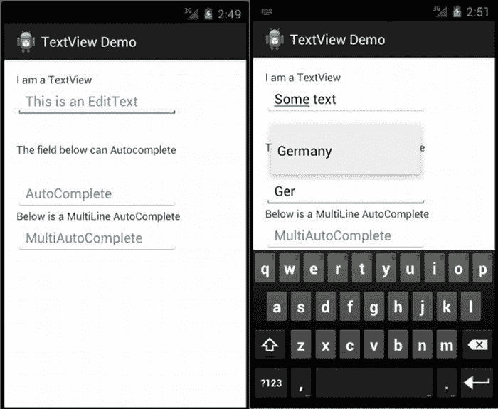
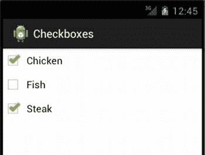
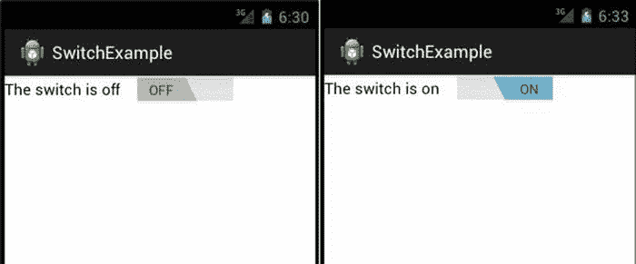
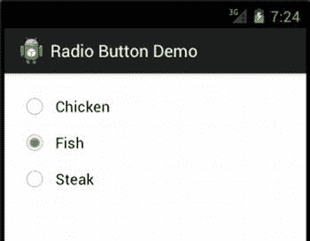
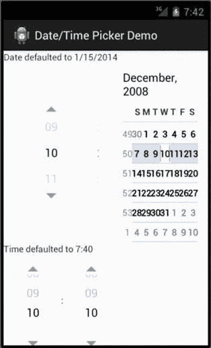
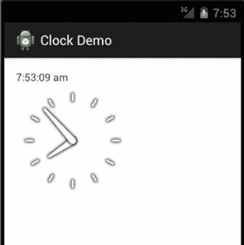

# 三、构建基本用户界面和使用控件

前一章向您介绍了 Android 中一些可用的 UI 元素的速成课程，以及如何快速地将它们组合起来创建计算器应用。虽然这很有趣，但我们希望你开始思考除了第二章中介绍的文本视图、编辑文本和按钮控件之外，Android 中还有哪些 UI 小部件。

在这一章中，我们将详细讨论用户界面和控件。我们将从讨论 Android 中 UI 开发的一般原理开始，然后我们将描述 Android SDK 附带的许多 UI 控件。这些是您将创建的界面的构建块。在接下来的章节中，我们还将讨论视图适配器和布局管理器，您将看到它们是如何建立在我们在本章中介绍的基本控件之上的。

到本章结束时，你将对 Android 工具集中的许多 UI 控件有一个坚实的理解，以及如何将 UI 控件布局到屏幕上并用数据填充它们。

Android 中的用户界面开发

Android 中的 UI 开发很有趣。好玩是因为相对容易。有了 Android，我们有了一个简单易懂的框架和有限的开箱即用控件。可用的屏幕区域通常是有限的——如果不是在平板电脑上，也是在手机上——这指导了 Android 控件的“简单电源”的基本哲学。Android 也承担了许多通常与设计和构建高质量 ui 相关的繁重工作。这一点，再加上用户通常想做一个特定的动作，让我们可以轻松地构建一个好的 UI 来交付一个好的用户体验。

Android SDK 附带了许多控件，您可以使用它们来为您的应用构建 ui。与其他 SDK 类似，Android SDK 提供了文本字段、按钮、列表、网格等等。此外，Android 提供了一组适用于移动设备的控件。

常见控件的核心是两个类: android.view.View 和 Android . view . view group。正如第一个类的名字所暗示的那样，视图类代表一个通用的视图对象。Android 中的常用控件最终扩展了视图类。视图组也是一个视图，但是它也包含其他视图。视图组是布局类列表的基类。Android 和 Swing 一样，使用*布局*的概念来管理控件在容器视图中的布局。正如我们将要看到的，使用布局可以让我们很容易地控制 ui 中控件的位置和方向。

你可以从多种方法中选择在 Android 中构建 ui。您可以完全用代码来构造 ui。也可以用 XML 定义 ui。您甚至可以将两者结合起来——用 XML 定义 UI，然后在代码中引用它并修改它。为了证明这一点，本章我们将使用这三种方法中的每一种来构建一个简单的 UI。

在我们开始之前，让我们定义一些术语。在本书和其他 Android 文献中，你会在关于 UI 开发的讨论中发现术语*视图*、*控件*、*小部件*、*容器*和*布局*。如果您是 Android 编程或 UI 开发的新手，您可能不熟悉这些术语。在我们开始之前，我们将简要描述它们(见表 3-1 )。

表 3-1 。 UI 术语表

| 

学期

 | 

描述

 |
| --- | --- |
| 视图、小部件、控件 | 每一个都代表一个 UI 元素。示例包括按钮、网格、列表、窗口、对话框等。术语*视图*、*小部件*和*控件*在本章中可以互换使用。 |
| 容器 | 这是一个用于包含其他视图的视图。例如，网格可以被视为一个容器，因为它包含单元格，每个单元格都是一个视图。 |
| 布局 | 这是容器和视图的可视化排列，可以包括其他布局。我们将在本章中讨论布局，并在第五章中全面探讨 Android 的布局特性。 |

图 3-1 显示了我们将要构建的应用的屏幕截图。屏幕截图旁边是应用中控件和容器的布局层次结构。


图 3-1 。活动的用户界面和布局

在讨论示例程序时，我们将参考这个布局层次结构。现在，知道应用有一个活动。活动的 UI 由三个容器组成:包含人名的容器、包含地址的容器以及子容器的外部父容器。

完全用代码构建 UI

第一个例子，清单 3-1 ，演示了如何完全用代码构建 UI。为了尝试这一点，使用项目名控件，包名 com.androidbook.controls ，以及名为 MainActivity 的活动，创建一个新的 Android 应用项目，然后将清单 3-1 中的代码复制到您的 MainActivity 类中。

**注意**我们会在本章末尾给你一个 URL，你可以用它来下载本章的项目。这将允许您将这些项目直接导入 Eclipse，而不是复制和粘贴代码。

***清单 3-1 。*** 完全用代码创建一个简单的用户界面

```java
package com.androidbook.controls;
import android.app.Activity;
import android.os.Bundle;
import android.view.ViewGroup.LayoutParams;
import android.widget.LinearLayout;
import android.widget.TextView;
public class MainActivity extends Activity
{
    private LinearLayout nameContainer;

    private LinearLayout addressContainer;

    private LinearLayout parentContainer;

    /** Called when the activity is first created. */
    @Override
    public void onCreate(Bundle savedInstanceState)
    {
        super.onCreate(savedInstanceState);

        createNameContainer();

        createAddressContainer();

        createParentContainer();

        setContentView(parentContainer);
    }

    private void createNameContainer()
    {
        nameContainer = new LinearLayout(this);

        nameContainer.setLayoutParams(new LayoutParams(LayoutParams.FILL_PARENT,
                LayoutParams.WRAP_CONTENT));
        nameContainer.setOrientation(LinearLayout.HORIZONTAL);

        TextView nameLbl = new TextView(this);
        nameLbl.setText("Name: ");

        TextView nameValue = new TextView(this);
        nameValue.setText("John Doe");

        nameContainer.addView(nameLbl);
        nameContainer.addView(nameValue);
    }

    private void createAddressContainer()
    {
        addressContainer = new LinearLayout(this);

        addressContainer.setLayoutParams(new LayoutParams(LayoutParams.FILL_PARENT,
                LayoutParams.WRAP_CONTENT));
        addressContainer.setOrientation(LinearLayout.VERTICAL);

        TextView addrLbl = new TextView(this);
        addrLbl.setText("Address:");

        TextView addrValue = new TextView(this);
        addrValue.setText("911 Hollywood Blvd");

        addressContainer.addView(addrLbl);
        addressContainer.addView(addrValue);
    }

    private void createParentContainer()
    {
        parentContainer = new LinearLayout(this);

        parentContainer.setLayoutParams(new LayoutParams(LayoutParams.FILL_PARENT,
                LayoutParams.FILL_PARENT));
        parentContainer.setOrientation(LinearLayout.VERTICAL);

        parentContainer.addView(nameContainer);
        parentContainer.addView(addressContainer);
    }
}
```

如清单 3-1 所示，该活动包含三个 LinearLayout 对象。我们将在第五章中更深入地讨论布局，但是有一个小的先有鸡还是先有蛋的问题，需要知道一点关于布局的知识，这样你就可以学习许多基本的控制。现在，知道布局对象包含在屏幕的一部分中定位对象的逻辑就足够了。例如， LinearLayout 知道如何垂直或水平布局控件。布局对象可以包含任何类型的视图，甚至是其他布局。

nameContainer 对象包含两个 TextView 控件:一个用于标签名称:，另一个用于保存名称的实际文本(如 John Doe)。 addressContainer 还包含两个 TextView 控件。这两个容器的区别在于名称容器是水平布局的，而地址容器是垂直布局的。这两个容器都位于 parentContainer 中，这是活动的根视图。构建完容器后，活动通过调用 setContentView(parent container)将视图的内容设置为根视图。当需要呈现活动的 UI 时，根视图被调用来呈现自身。然后，根视图调用其子视图来呈现它们自己，子控件调用它们的子控件，依此类推，直到呈现整个 UI。

如清单 3-1 所示，我们有几个线性布局控件。其中两个垂直布置，一个水平布置。名称容器横向布局。这意味着两个 TextView 控件水平并排出现。 addressContainer 垂直布局，这意味着两个 TextView 控件一个叠在另一个上面。 parentContainer 也是垂直布局的，这就是为什么 nameContainer 出现在 addressContainer 的上方。请注意两个垂直布局的容器之间的细微差别， addressContainer 和 parentContainer。parentContainer 被设置为占据整个屏幕的宽度和高度:

```java
parentContainer.setLayoutParams(new LayoutParams(LayoutParams.FILL_PARENT,
        LayoutParams.FILL_PARENT));
```

并且 addressContainer 垂直包装其内容:

```java
addressContainer.setLayoutParams(new LayoutParams(LayoutParams.FILL_PARENT,
        LayoutParams.WRAP_CONTENT));
```

换句话说， WRAP_CONTENT 意味着视图应该只占用它在那个维度中需要的空间，不要超过包含它的视图所允许的空间。对于 addressContainer ，这意味着容器将垂直占据两行，因为这是我们提供的虚拟地址所需要的。

完全用 XML 构建用户界面

现在让我们用 XML 构建相同的 UI(参见清单 3-2 )。XML 布局文件存储在资源( /res/ )目录下一个名为布局的文件夹中。要尝试这个例子，在 Eclipse 中创建一个新的 Android 项目。默认情况下，您将获得一个名为 activity_main.xml 的 XML 布局文件，它位于 res/layout 文件夹下。双击 activity_main.xml 查看内容。Eclipse 将为您的布局文件显示一个可视化编辑器。您可能在视图的顶部有一个字符串，写着“Hello World，MainActivity！”或者类似的东西。单击视图底部的 activity_main.xml 选项卡，查看 activity_main.xml 文件的 xml。这显示了一个 LinearLayout 和一个 TextView 控件。使用布局或 activity_main.xml 选项卡，或同时使用两者，在 activity_main.xml 文件中重新创建清单 3-2 。省省吧。

***清单 3-2 。*** 完全用 XML 创建用户界面

```java
<?xml version="1.0" encoding="utf-8"?>
<LinearLayout xmlns:android="[`schemas.android.com/apk/res/android`](http://schemas.android.com/apk/res/android)"
    android:orientation="vertical" android:layout_width="fill_parent"
    android:layout_height="fill_parent">
    <!-- NAME CONTAINER -->
    <LinearLayout        android:orientation="horizontal" android:layout_width="fill_parent"
        android:layout_height="wrap_content">

            <TextView  android:layout_width="wrap_content"
        android:layout_height="wrap_content" android:text="Name:" />

            <TextView android:layout_width="wrap_content"
        android:layout_height="wrap_content" android:text="John Doe" />

    </LinearLayout>

    <!-- ADDRESS CONTAINER -->
    <LinearLayout        android:orientation="vertical" android:layout_width="fill_parent"
        android:layout_height="wrap_content">

            <TextView android:layout_width="fill_parent"
        android:layout_height="wrap_content" android:text="Address:" />

            <TextView android:layout_width="fill_parent"
        android:layout_height="wrap_content" android:text="911 Hollywood Blvd" />
    </LinearLayout>

</LinearLayout>
```

在您的新项目的 src 目录下，有一个。包含一个活动类定义的 java 文件。双击该文件以查看其内容。注意语句 setContentView(r . layout . activity _ main)。清单 3-2 中显示的 XML 片段，结合对 setContentView(r . layout . activity _ main)的调用，将呈现与之前完全用代码生成时相同的 UI。XML 文件是不言自明的，但是请注意，我们定义了三个容器视图。第一个 LinearLayout 相当于我们的父容器。这个容器通过如下设置相应的属性将其方向设置为垂直:Android:orientation = " vertical "。父容器包含两个 LinearLayout 容器，分别代表 nameContainer 和 addressContainer 。

运行这个应用将产生与我们前面的示例应用相同的 UI。标签和值将如图 3-1 所示显示。

用代码构建 XML 格式的用户界面

清单 3-2 是一个人为的例子。在 XML 布局中硬编码 TextView 控件的值没有任何意义。理想情况下，我们应该用 XML 设计 ui，然后从代码中引用控件。这种方法使我们能够将动态数据绑定到设计时定义的控件。事实上，这是推荐的方法。用 XML 构建布局并使用代码填充动态数据是相当容易的。

清单 3-3 显示了相同的用户界面，但 XML 略有不同。这个 XML 将 id 分配给 TextView 控件，这样我们就可以在代码中引用它们。

***清单 3-3 。*** 用带有标识的 XML 创建用户界面

```java
<?xml version="1.0" encoding="utf-8"?>
<LinearLayout xmlns:android="[`schemas.android.com/apk/res/android`](http://schemas.android.com/apk/res/android)"
    android:orientation="vertical" android:layout_width="fill_parent"
    android:layout_height="fill_parent">
    <!-- NAME CONTAINER -->
    <LinearLayout        android:orientation="horizontal" android:layout_width="fill_parent"
        android:layout_height="wrap_content">

            <TextView android:layout_width="wrap_content"
        android:layout_height="wrap_content" android:text="@string/name_text" />

            <TextView android:id="@+id/nameValue"
        android:layout_width="wrap_content" android:layout_height="wrap_content" />

    </LinearLayout>

    <!-- ADDRESS CONTAINER -->
    <LinearLayout xmlns:android="[`schemas.android.com/apk/res/android`](http://schemas.android.com/apk/res/android)"
        android:orientation="vertical" android:layout_width="fill_parent"
        android:layout_height="wrap_content">

            <TextView android:layout_width="fill_parent"
        android:layout_height="wrap_content" android:text="@string/addr_text" />

            <TextView android:id="@+id/addrValue"
        android:layout_width="fill_parent" android:layout_height="wrap_content" />
    </LinearLayout>

</LinearLayout>
```

除了将 id 添加到我们希望从代码中填充的 TextView 控件之外，我们还有标签 TextView 控件，我们正在用字符串资源文件中的文本填充这些控件。这些是没有 id 的文本视图有一个 android:text 属性。这些 TextView 的实际字符串将来自于 /res/values 文件夹中的 strings.xml 文件。清单 3-4 展示了我们的 strings.xml 文件可能的样子。

***清单 3-4 。*** strings.xml 文件为清单 3-3

```java
<?xml version="1.0" encoding="utf-8"?>
<resources>
    <string name="app_name">Common Controls</string>
    <string name="name_text">Name:</string>
    <string name="addr_text">Address:</string>
</resources>
```

清单 3-5 中的代码演示了如何获取 XML 中定义的控件的引用来设置它们的属性。您可以将它放入活动的 onCreate() 方法中。

***清单 3-5 。*** 泛指在运行时控制资源

```java
setContentView(R.layout.activity_main);
TextView nameValue = (TextView)findViewById(R.id.nameValue);
nameValue.setText("John Doe");
TextView addrValue = (TextView)findViewById(R.id.addrValue);
addrValue.setText("911 Hollywood Blvd.");
```

清单 3-5 中的代码很简单，但是请注意，在调用 findViewById() 之前，我们通过调用 setContentView(r . layout . activity _ main)来加载资源——如果视图还没有被加载，我们就不能获取对视图的引用。

Android 的开发者已经做了很好的工作，使得控件的每个方面都可以通过 XML 或代码来设置。在 XML 布局文件中设置控件的属性通常比使用代码更好。但是，有很多时候需要使用代码，比如设置要显示给用户的值。

FILL_PARENT vs. MATCH_PARENT

常量 FILL_PARENT 在 Android 2.2 中被弃用，取而代之的是 MATCH_PARENT 。不过，严格来说，这是一次更名。该常量的值仍然是–1。类似地，对于 XML 布局， fill_parent 被替换为 match_parent 。那么你用什么值呢？代替 FILL_PARENT 或 MATCH_PARENT ，您可以简单地使用值–1，这样就可以了。然而，这不是很容易阅读，并且您没有一个等价的未命名值用于您的 XML 布局。有更好的方法。

根据您需要在应用中使用的 Android APIs，您可以根据 2.2 之前的 Android 版本构建您的应用并依靠向前兼容性，或者根据 2.2 或更高版本的 Android 构建您的应用并将 minSdkVersion 设置为您的应用将运行的最低版本的 Android。例如，如果你只需要 Android 1.6 中已经存在的 API，那么在 Android 1.6 上构建并使用 FILL_PARENT 和 fill_parent 。您的应用在 Android 的所有更高版本(包括 2.2 及更高版本)中运行应该没有问题。如果您需要 Android 2.2 或更高版本的 API，请继续构建该版本的 Android，使用 MATCH_PARENT 和 match_parent ，并将 minSdkVersion 设置为更老的版本:例如， 4 (对于 Android 1.6)。您仍然可以将 Android 2.2 中构建的 Android 应用部署到旧版本的 Android 上，但是您必须小心早期版本的 Android SDK 中没有的类和/或方法。有一些方法可以解决这个问题，比如使用反射或创建包装类来处理 Android 版本之间的差异。我们将在后面的章节中讨论这些高级主题。

了解 Android 的常用控件

我们现在将开始讨论 Android SDK 中的常见控件。我们将从文本控件开始，然后是按钮、复选框、单选按钮、列表、网格、日期和时间控件以及一个地图视图控件。这些将与我们将在第四章中介绍的布局控件一起出现。

文本控件

文本控件可能是你在 Android 中使用的第一种控件。Android 有一套完整但并不强大的文本控件。在本节中，我们将讨论文本视图、编辑文本、自动完成文本视图和多自动完成文本视图控件。图 3-2 显示了操作中的控制。



图 3-2 。Android 中的文本控件

文本视图

你已经看到了清单 3-3 中文本视图控件的简单 XML 规范，以及如何在清单 3-4 中的代码中处理文本视图 s。注意我们如何在 XML 中指定文本的 ID、宽度、高度和值，以及如何使用 setText() 方法设置值。 TextView 控件知道如何显示文本，但不允许编辑。这可能会让您认为该控件本质上是一个虚拟标签。不是真的。 TextView 控件有一些有趣的属性，使它非常方便。例如，如果您知道 TextView 的内容将包含一个 web URL 或电子邮件地址，您可以将 autoLink 属性设置为 email|web ，该控件将查找并高亮显示任何电子邮件地址和 URL。此外，当用户单击这些突出显示的项目之一时，系统将负责启动带有电子邮件地址的电子邮件应用或带有 URL 的浏览器。在 XML 中，这个属性应该在文本视图标签中，看起来像这样:

```java
<TextView   ...     android:autoLink="email|web"    ...    />
```

您指定一组由管道分隔的值，包括 web 、 email 、 phone 或 map ，或者使用 none (默认)或 all 。如果要在代码中设置自动链接行为，而不是使用 XML，对应的方法调用是 setAutoLinkMask() 。你可以给它传递一个类似于之前的表示值组合的 int，比如 Linkify。电子邮件地址|Linkify。WEB _ URLS。为了实现这个功能， TextView 使用了 Android . text . util . link ify 类。清单 3-6 显示了一个代码自动链接的例子。

***清单 3-6 。*** 在文本视图中的文本上使用 Linkify

```java
TextView tv =(TextView)this.findViewById(R.id.tv);
tv.setAutoLinkMask(Linkify.ALL);
tv.setText("Please visit my website, [`www.androidbook.com`](http://www.androidbook.com)
or email me at davemac327@gmail.com.");
```

请注意，在设置文本之前，我们在 TextView 上设置了自动链接选项。这很重要，因为在设置文本后设置自动链接选项不会影响现有文本。因为我们使用代码将超链接添加到我们的文本中，所以我们为清单 3-6 中的文本视图编写的 XML 不需要任何特殊属性，看起来就像这样简单:

```java
<TextView android:id="@+id/tv" android:layout_width="wrap_content"
  android:layout_height="wrap_content"/>
```

如果你愿意，你可以调用 Linkify 类的静态 addLinks() 方法，按需查找并添加到任何 TextView 或任何 Spannable 的内容的链接。不使用 setAutoLinkMask() ，我们可以在设置文本后执行以下*:*

```java
Linkify.addLinks(tv, Linkify.ALL);
```

单击一个链接将导致调用该动作的默认意图。例如，单击一个 web URL 将启动带有该 URL 的浏览器。点击一个电话号码将启动电话拨号器，等等。 Linkify 类可以立即执行这项工作。

Linkify 还可以检测你想要寻找的自定义模式，决定它们是否与你认为需要点击的东西相匹配，并设置如何激发一个意图，使点击变成某种行动。这里不赘述那些细节，但是知道这些事情是可以做到的。

从字体属性到最小线和最大线等等，还有更多文本视图的特性可以探索。这些都是显而易见的，我们鼓励您进行实验，看看如何使用它们。尽管你应该记住 TextView 类中的一些功能不适用于只读字段，但是 TextView 的子类也有这些功能，其中一个我们将在下面介绍。

编辑文本

编辑文本 控件是文本视图的子类。顾名思义， EditText 控件允许文本编辑。 EditText 不如你在互联网上找到的文本编辑控件强大，但基于 Android 设备的用户可能不会直接在 EditText 控件中键入文档——他们最多会键入几个段落，或者使用功能更全的基于 HTML 的页面。因此，该类具有有限但适当的功能，甚至可能会让您感到惊讶。例如，编辑文本最重要的属性之一是输入类型。您可以将 inputType 属性设置为 textAutoCorrect 以使控件更正常见的拼写错误。您可以将其设置为 textCapWords 以使控件将单词大写。其他选项只需要电话号码或密码。

指定大写、多行文字和其他功能的方法比较古老，但现在已被废弃。如果在没有 inputType 属性的情况下指定它们，它们可以被读取；但是如果指定了输入类型，这些旧的属性将被忽略。

EditText 控件的旧默认行为是在一行上显示文本，并根据需要扩展。换句话说，如果用户键入的内容超过了第一行，就会出现另一行，依此类推。然而，您可以通过将 singleLine 属性设置为 true 来强制用户使用一行。在这种情况下，用户将不得不继续在同一行上键入。对于 inputType ，如果不指定 textMultiLine ，则 EditText 将默认为单行。因此，如果您想要旧的多行输入的默认行为，您需要用 textMultiLine 指定 inputType 。

EditText 的一个很好的特性是你可以指定提示文本。一旦用户开始键入文本，该文本将显示为轻微褪色并消失。该提示的目的是让用户知道该字段中的内容，而无需用户选择和删除默认文本。在 XML 中，这个属性是 Android:hint = " your hint text here "或 Android:hint = " @ string/your _ hint _ name "，其中 your_hint_name 是在 /res/values/strings.xml 中找到的字符串的资源名。在代码中，您可以用一个 CharSequence 或一个资源 ID 来调用 setHint() 方法。

自动完成文本视图

AutoCompleteTextView 控件是一个具有自动完成功能的 TextView 。换句话说，当用户在文本视图中输入时，控件可以显示选择建议。清单 3-7 展示了带有 XML 和相应代码的 AutoCompleteTextView 控件。

***清单 3-7 。*** 使用 AutoCompleteTextView 控件

```java
<AutoCompleteTextView android:id="@+id/actv"
    android:layout_width="fill_parent"  android:layout_height="wrap_content" />
AutoCompleteTextView actv = (AutoCompleteTextView) this.findViewById(R.id.actv);

ArrayAdapter<String> aa = new ArrayAdapter<String>(this,
                android.R.layout.simple_dropdown_item_1line,
                new String[] {"English", "Hebrew", "Hindi", "Spanish",
                "German", "Greek" });

actv.setAdapter(aa);
```

在清单 3-7 中显示的 AutoCompleteTextView 控件向用户建议一种语言。例如，如果用户键入 **en** ，控件会提示英语。如果用户键入 **gr** ，控件推荐希腊语，依此类推。

如果您使用过建议控件或类似的自动完成控件，您会知道像这样的控件有两个部分:文本视图控件和显示建议的控件。这是总的概念。要像这样使用控件，您必须创建控件，创建建议列表，告诉控件建议列表，并可能告诉控件如何显示建议。或者，您可以为建议创建第二个控件，然后将这两个控件关联起来。

Android 让这变得简单了，从清单 3-7 中可以明显看出。要使用 AutoCompleteTextView ，可以在布局文件中定义控件，并在活动中引用它。然后创建一个保存建议的适配器类，并定义将显示建议的控件的 ID(在本例中，是一个简单的列表项)。在清单 3-7 中， ArrayAdapter 的第二个参数告诉适配器使用一个简单的列表项来显示建议。最后一步是将适配器与 AutoCompleteTextView 相关联，这可以使用 setAdapter() 方法来完成。暂时不要担心适配器；我们将在本章的后面讨论这些。

多自动完成文本视图

如果您玩过 AutoCompleteTextView 控件，您会知道该控件只为文本视图中的*整个*文本提供建议。换句话说，如果你键入一个句子，你不会得到每个单词的建议。这就是多自动完成文本视图的用武之地。您可以使用 MultiAutoCompleteTextView 在用户键入时提供建议。例如，图 3-2 显示用户键入单词**英文**后跟逗号，然后是 **Ge** ，此时控件提示**德文**。如果用户继续，控件将提供额外的建议。

使用多自动完成文本视图就像使用自动完成文本视图。不同的是，你必须告诉控件从哪里开始再次建议。例如，在图 3-2 中，你可以看到控件可以在句首和逗号后提供建议。MultiAutoCompleteTextView 控件要求您给它一个标记器，它可以解析句子并告诉它是否再次开始建议。清单 3-8 演示了如何使用 MultiAutoCompleteTextView 控件和 XML 以及 Java 代码。

***清单 3-8 。*** 使用 MultiAutoCompleteTextView 控件

```java
<MultiAutoCompleteTextView android:id="@+id/mactv"
    android:layout_width="fill_parent"  android:layout_height="wrap_content" />

MultiAutoCompleteTextView mactv = (MultiAutoCompleteTextView) this
                .findViewById(R.id.mactv);
ArrayAdapter<String> aa2 = new ArrayAdapter<String>(this,
                android.R.layout.simple_dropdown_item_1line,
new String[] {"English", "Hebrew", "Hindi", "Spanish", "German", "Greek" });

mactv.setAdapter(aa2);

mactv.setTokenizer(new MultiAutoCompleteTextView.CommaTokenizer());
```

清单 3-7 和清单 3-8 之间唯一显著的区别是使用了多自动完成文本视图和对 setTokenizer() 方法的调用。由于本例中的 CommaTokenizer ，在 EditText 字段中键入逗号后，该字段将再次使用字符串数组提出建议。键入的任何其他字符都不会触发该字段提出建议。因此，即使您键入**法语 Spani** ，部分单词 *Spani* 也不会触发建议，因为它后面没有逗号。Android 为电子邮件地址提供了另一个标记器，名为 Rfc822Tokenizer 。如果你愿意，你可以创建你自己的记号赋予器。

按钮控件

按钮在任何 widget 工具包中都很常见，Android 也不例外。Android 提供了一组典型的按钮以及一些额外的功能。在这一节中，我们将讨论三种类型的按钮控件:基本按钮、图像按钮和切换按钮。图 3-3 显示了带有这些控件的用户界面。最上面的按钮是基本按钮，中间的按钮是图像按钮，最后一个是切换按钮。


图 3-3 。安卓按钮控件

让我们从基本按钮开始。

按钮控件

Android 中的基本按钮类是 android.widget.Button 。除了如何使用它来处理点击事件之外，这种类型的按钮没什么特别的。清单 3-9 显示了按钮控件的 XML 布局片段，加上一些我们可能在活动的 onCreate() 方法中设置的 Java。我们的基本按钮看起来像图 3-3 中的顶部按钮。

***清单 3-9 。*** 处理按钮上的点击事件

```java
<Button android:id="@+id/button1"
    android:text="@string/basicBtnLabel"
    android:layout_width="fill_parent"
    android:layout_height="wrap_content" />

Button button1 = (Button)this.findViewById(R.id.button1);
button1.setOnClickListener(new OnClickListener()
{
     public void onClick(View v)
     {
        Intent intent = new Intent(Intent.ACTION_VIEW,
                                Uri.parse("[`www.androidbook.com`](http://www.androidbook.com)"));
        startActivity(intent);
     }
});
```

清单 3-9 展示了如何注册一个按钮点击事件。通过用一个 OnClickListener 调用 setOnClickListener() 方法来注册点击事件。在清单 3-9 中，动态创建了一个匿名监听器来处理按钮 1 的点击事件。当点击按钮时，监听器的 onClick() 方法被调用，在这种情况下，启动浏览器到我们的网站。

从 Android SDK 1.6 开始，有一种更简单的方法来为你的按钮设置一个点击处理器。清单 3-10 显示了一个按钮的 XML，其中你为处理器指定了一个属性，加上作为点击处理器的 Java 代码。

***清单 3-10 。*** 为按钮设置点击处理器

```java
<Button   ...    android:onClick="myClickHandler"    ...  />
    public void myClickHandler(View target) {
        switch(target.getId()) {
        case R.id.button1:
        ...
```

将调用 handler 方法，将 target 设置为代表被单击按钮的视图对象。注意点击处理器方法中的开关语句如何使用按钮的资源 id 来选择要运行的逻辑。使用这种方法意味着您不必在代码中显式创建每个按钮对象，并且您可以跨多个按钮重用同一方法。这使得事情更容易理解和维护。这也适用于其他按钮类型。

ImageButton 控件

Android 通过 Android . widget . imagebutton 提供一个图片按钮。使用图像按钮类似于使用基本按钮(见清单 3-11 )。我们的图像按钮看起来像图 3-3 中的中间按钮。

***清单 3-11 。*?? 使用 ImageButton**

```java
<ImageButton android:id="@+id/imageButton2"
    android:layout_width="wrap_content" android:layout_height="wrap_content"
    android:onClick="myClickHandler"
    android:src="@drawable/icon"  />

ImageButton imageButton2 = (ImageButton)this.findViewById(R.id.imageButton2);
imageButton2.setImageResource(R.drawable.icon);
```

在这里，我们用 XML 创建了图像按钮，并从一个 drawable 资源中设置了按钮的图像。按钮的图像文件必须存在于 /res/drawable 下。在我们的例子中，我们只是简单地重用了按钮的 Android 图标。我们还在清单 3-11 中展示了如何通过调用按钮上的 setImageResource() 方法并传递给它一个资源 ID 来动态设置按钮的图像。请注意，您只需要做其中一项。您不需要在 XML 文件和代码中都指定按钮图像。

图像按钮的一个很好的特性是你可以为按钮指定一个透明的背景。结果将是一个可点击的图像，它的行为就像一个按钮，但可以是你想要的任何样子。只需为图片按钮设置 Android:background = " @ null "即可。

因为您的图像可能与标准按钮非常不同，所以您可以自定义按钮在 UI 中使用时的其他两种状态。除了正常显示外，按钮可以有焦点，并且可以被按下。拥有*焦点*仅仅意味着按钮当前是事件将要发生的地方。例如，您可以使用键盘或 D-pad 上的箭头键将焦点指向某个按钮。*按下*表示按钮的外观在被按下时但在用户放开之前发生变化。为了告诉 Android 我们按钮的三个图像是什么，哪一个是哪一个，我们设置了一个选择器。这是一个简单的 XML 文件， imagebuttonselector ，它位于我们项目的 /res/drawable 文件夹中。这有点违反直觉，因为这是一个 XML 文件，而不是图像文件，然而选择器文件必须放在那里。选择器文件的内容将类似于清单 3-12 中的。

***清单 3-12 。*** 使用带有 ImageButton 的选择器

```java
<?xml version="1.0" encoding="utf-8"?>
    <selector xmlns:android="[`schemas.android.com/apk/res/android`](http://schemas.android.com/apk/res/android)">
     <item android:state_pressed="true"
           android:drawable="@drawable/button_pressed" /> <!-- pressed -->
     <item android:state_focused="true"
           android:drawable="@drawable/button_focused" /> <!-- focused -->
     <item android:drawable="@drawable/icon" /> <!-- default -->
    </selector>
```

关于选择器文件，有几点需要注意。首先，不要像在 values XML 文件中那样指定一个 < resources > 标记。其次，按钮图像的顺序很重要。Android 将依次测试选择器中的每一项，看是否匹配。因此，您希望将正常图像放在最后，以便仅在按钮未被按下且按钮没有焦点时使用。如果首先列出的是普通图像，那么即使按钮被按下或有焦点，它也总是匹配并被选中。当然，你所指的 drawables 必须存在于 /res/drawables 文件夹中。在布局 XML 文件中按钮的定义中，您希望将选择器 XML 文件的 android:src 属性设置为常规的 drawable，如下所示:

```java
<Button   ...    android:src="@drawable/imagebuttonselector"    ...   />
```

ToggleButton 控件

与复选框或单选按钮一样， ToggleButton 控件是一个双态按钮。该按钮可以处于开或关状态。如图图 3-3 所示，切换按钮的默认行为是在打开状态时显示一个彩色条，在关闭状态时显示一个灰条。此外，默认行为还会在按钮处于打开状态时将按钮文本设置为打开，在按钮处于关闭状态时将按钮文本设置为关闭。如果开/关不适合您的应用，您可以修改切换按钮的文本。例如，如果您有一个想要通过 ToggleButton 启动和停止的后台进程，您可以通过使用 android:textOn 和 android:textOff 属性将按钮的文本设置为停止和运行。

清单 3-13 显示了一个例子。我们的切换按钮是图 3-3 中最底部的按钮，它处于 on 位置，所以按钮上的标签写着 Stop。

***清单 3-13 。*?? 安卓切换按钮**

```java
<ToggleButton android:id="@+id/cctglBtn"
        android:layout_width="wrap_content"
        android:layout_height="wrap_content"
        android:text="Toggle Button"
        android:textOn="Stop"
        android:textOff="Run"/>
```

因为 ToggleButton s 有 on 和 off 文本作为单独的属性，所以 ToggleButton 的 android:text 属性并没有真正被使用。它是可用的，因为它已经被继承了(从 TextView )，但是在这种情况下，你不需要使用它。

复选框控件

复选框控件是另一个双态按钮，允许用户切换其状态。不同之处在于，在许多情况下，用户不会将它视为一个调用即时操作的按钮。然而，从 Android 的角度来看，它是一个按钮，你可以用复选框做任何你可以用按钮做的事情。

在 Android 中，可以通过创建 android.widget.CheckBox 的实例来创建复选框。参见清单 3-14 和图 3-4 。

***清单 3-14 。*** 创建复选框

```java
<LinearLayout xmlns:android="[`schemas.android.com/apk/res/android`](http://schemas.android.com/apk/res/android)"
    android:orientation="vertical"
    android:layout_width="fill_parent"
    android:layout_height="fill_parent">

<CheckBox android:id="@+id/chickenCB"
    android:text="Chicken"
    android:checked="true"
    android:layout_width=""wrap_content"
    android:layout_height="wrap_content" />

<CheckBox android:id="@+id/fishCB"
    android:text="Fish"
    android:layout_width="wrap_content"
    android:layout_height="wrap_content" />

<CheckBox android:id="@+id/steakCB"
    android:text="Steak"
    android:checked="true"
    android:layout_width="wrap_content"
    android:layout_height="wrap_content" />

</LinearLayout>
```



图 3-4 。使用复选框 控制

您可以通过调用 setChecked() 或 toggle() 来管理复选框的状态。可以通过调用 isChecked() 获得状态。

如果您需要在复选框被选中或取消选中时实现特定的逻辑，您可以通过调用 setOnCheckedChangeListener()和 CompoundButton 的实现来注册 on-checked 事件。OnCheckedChangeListener 接口。然后，您必须实现 onCheckedChanged() 方法，该方法将在复选框被选中或取消选中时被调用。清单 3-15 显示了一些处理复选框的代码。

***清单 3-15 。*** 在代码中使用复选框

```java
public class CheckBoxActivity extends Activity {
        /** Called when the activity is first created. */
        @Override
        public void onCreate(Bundle savedInstanceState) {
            super.onCreate(savedInstanceState);
            setContentView(R.layout.checkbox);

            CheckBox fishCB = (CheckBox)findViewById(R.id.fishCB);

            if(fishCB.isChecked())
                fishCB.toggle();     // flips the checkbox to unchecked if it was checked

            fishCB.setOnCheckedChangeListener(
                        new CompoundButton.OnCheckedChangeListener() {

                @Override
                public void onCheckedChanged(CompoundButton arg0, boolean isChecked) {
                    Log.v("CheckBoxActivity", "The fish checkbox is now "
                            + (isChecked?"checked":"not checked"));
                }});
        }
}
```

设置 OnCheckedChangeListener 的好处在于，您被传递了复选框按钮的新状态。你可以使用 OnClickListener 技术，就像我们使用基本按钮一样。当调用 onClick() 方法时，您需要确定按钮的新状态，方法是对其进行适当的转换，然后对其调用 isChecked() 。清单 3-16 显示了如果我们将 Android:onClick = " myClickHandler "添加到我们的复选框按钮的 XML 定义中，这段代码可能会是什么样子。

***清单 3-16 。*** 在代码中使用复选框 android:onClick

```java
public void myClickHandler(View view) {
    switch(view.getId()) {
    case R.id.steakCB:
        Log.v("CheckBoxActivity", "The steak checkbox is now " +
                (((CheckBox)view).isChecked()?"checked":"not checked"));
    }
}
```

开关控制

在 Android 4.0 中引入了开关小部件，它提供了与复选框非常相似的行为。事实上，这两个小部件是如此的相似，当你回顾一个开关对象的代码时，你几乎肯定会有一种似曾相识的感觉。许多人(包括本书的一些作者)认为引入开关更多的是出于审美原因。在过去几年中，UI 设计的趋势是朝着看起来像真实世界事物的微件的扭曲理想发展，并且开关是真实世界中的具体选择器——毕竟没有多少厨房电器有复选框。

开关与复选框控件的相似之处扩展到检查和更改状态的常用方法。这种方法的模仿包括 setChecked() 打开开关， isChecked() 测试当前状态，等等。由 Switch 小部件提供的一个美学差异是能够在状态之间改变相关的文本。还可以使用其他方法来控制此文本:

*   getTextOn() :返回开关打开时显示的文本。
*   getTextOff() :返回开关关闭时显示的文本。
*   setTextOn() :设置开关打开时显示的文本。虽然好的设计通常意味着不会更改文本，但在某些情况下，实时更新交换机文本中的某些指标会有所帮助。
*   setTextOff() :设置开关关闭时显示的文本。

在清单 3-17 中显示了包括开关的示例布局。

***清单 3-17 。*** 使用开关创建布局

```java
<LinearLayout xmlns:android="[`schemas.android.com/apk/res/android`](http://schemas.android.com/apk/res/android)"
    android:orientation="vertical"
    android:layout_width="fill_parent"
    android:layout_height="fill_parent">

    <Switch
        android:id="@+id/switchdemo"
        android:layout_width="wrap_content"
        android:layout_height="wrap_content"
        android:text="This switch is: off" />

</LinearLayout>
```

**注意**记住“switch”是 Java 中的保留字。所以我们用一个不冲突的 ID。

在清单 3-18 中，我们的示例开关的代码应该会激起我们提到的关于复选框控件的似曾相识的感觉。

***清单 3-18 。*** 用代码控制开关行为

```java
public class SwitchDemo extends Activity
  implements CompoundButton.OnCheckedChangeListener {
  Switch sw;

  @Override
  public void onCreate(Bundle icicle) {
    super.onCreate(icicle);
    setContentView(R.layout.main);

    sw=(Switch)findViewById(R.id.switchdemo);
    sw.setOnCheckedChangeListener(this);
  }

  public void onCheckedChanged(CompoundButton buttonView,
                                 boolean isChecked) {
    if (isChecked) {
      sw.setTextOn("This switch is: on");
    }
    else {
      sw.setTextOff("This switch is: off");
    }
  }
}
```

我们切换工作的结果显示在图 3-5 中。



图 3-5 。使用开关 控制

单选按钮控件

RadioButton 控件是任何 UI 工具包不可或缺的一部分。单选按钮给用户几个选择，并强迫他们选择一个项目。为了实施这种单一选择模型，单选按钮通常属于一个组，每个组一次只能选择一个项目。

要在 Android 中创建一组单选按钮，首先创建一个 RadioGroup ，然后用单选按钮填充该组。清单 3-19 和图 3-6 显示了一个例子。

***清单 3-19 。*** 使用安卓单选按钮 小工具

```java
<LinearLayout xmlns:android="[`schemas.android.com/apk/res/android`](http://schemas.android.com/apk/res/android)"
    android:orientation="vertical"
   android:layout_width="fill_parent"
    android:layout_height="fill_parent">

    <RadioGroup
        android:id="@+id/rBtnGrp"
        android:layout_width="wrap_content"
        android:layout_height="wrap_content"
        android:orientation="vertical" >

        <RadioButton
            android:id="@+id/chRBtn"
            android:text="Chicken"
            android:layout_width="wrap_content"
            android:layout_height="wrap_content"/>

        <RadioButton
            android:id="@+id/fishRBtn"
            android:text="Fish"
            android:checked="true"
            android:layout_width="wrap_content"
            android:layout_height="wrap_content"/>

        <RadioButton
            android:id="@+id/stkRBtn"
            android:text="Steak"
            android:layout_width="wrap_content"
            android:layout_height="wrap_content"/>

    </RadioGroup>

</LinearLayout>
```



图 3-6 。使用单选按钮

在 Android 中，使用 Android . widget . radio group 实现一个单选按钮组，使用 Android . widget . radio button 实现一个单选按钮。

请注意，单选按钮组中的单选按钮默认情况下是未选中的，尽管您可以在 XML 定义中设置一个为选中，就像我们在清单 3-19 中对 Fish 所做的那样。要以编程方式将其中一个单选按钮设置为选中状态，可以获取对该单选按钮的引用并调用 setChecked() :

```java
RadioButton steakBtn = (RadioButton)this.findViewById(R.id.stkRBtn);
steakBtn.setChecked(true);
```

您还可以使用 toggle() 方法来切换单选按钮的状态。与复选框控件一样，如果您使用 OnCheckedChangeListener 接口的实现调用 setOnCheckedChangeListener()，您将被通知已选中或未选中事件。不过，这里有一点小小的不同。这是一个与以前不同的班级。这一次，技术上来说是 RadioGroup。OnCheckedChangeListener 类代表 RadioGroup，而之前它是 CompoundButton。OnCheckedChangeListener 类。

单选按钮组也可以包含除单选按钮之外的视图。例如，清单 3-20 在最后一个单选按钮后添加了一个文本视图。还要注意，第一个单选按钮( anotherRadBtn )位于单选按钮组之外。

***清单 3-20 。*?? 一个单选按钮组而不仅仅是单选按钮**

```java
<LinearLayout xmlns:android="[`schemas.android.com/apk/res/android`](http://schemas.android.com/apk/res/android)"
        android:orientation="vertical"  android:layout_width="fill_parent"
        android:layout_height="fill_parent">

    <RadioButton android:id="@+id/anotherRadBtn"
        android:text="Outside"
        android:layout_width="wrap_content"
        android:layout_height="wrap_content"/>

    <RadioGroup android:id="@+id/radGrp"
        android:layout_width="wrap_content"
        android:layout_height="wrap_content">

        <RadioButton android:id="@+id/chRBtn"
            android:text="Chicken"
            android:layout_width="wrap_content"
            android:layout_height="wrap_content"/>

          <RadioButton android:id="@+id/fishRBtn"
            android:text="Fish"
            android:layout_width="wrap_content"
            android:layout_height="wrap_content"/>

        <RadioButton android:id="@+id/stkRBtn"
            android:text="Steak"
            android:layout_width="wrap_content"
            android:layout_height="wrap_content"/>

        <TextView android:text="My Favorite"
            android:layout_width="wrap_content"
            android:layout_height="wrap_content"/>

    </RadioGroup>
</LinearLayout>
```

清单 3-20 展示了在一个单选按钮组中可以有非单选按钮控件。您还应该知道，单选按钮组只能在它自己的容器中的单选按钮上执行单选操作。也就是说，ID 为 anotherRadBtn 的单选按钮不会受到清单 3-20 中所示单选按钮组的影响，因为它不是该组的子组之一。

您可以通过编程来操作单选按钮组。例如，您可以获取对单选按钮组的引用，并添加单选按钮(或其他类型的控件)。清单 3-21 展示了这个概念。

***清单 3-21 。*?? 在代码中添加一个单选按钮到一个单选按钮组**

```java
RadioGroup radGrp = (RadioGroup)findViewById(R.id.radGrp);
RadioButton newRadioBtn = new RadioButton(this);
newRadioBtn.setText("Pork");
radGrp.addView(newRadioBtn);
```

一旦用户选中了单选按钮组中的单选按钮，用户就不能通过再次单击来取消选中它。清除单选按钮组中所有单选按钮的唯一方法是以编程方式调用单选按钮组上的 clearCheck() 方法。

当然，你想用 RadioGroup 做一些有趣的事情。你可能不想轮询每个单选按钮来确定它是否被选中。幸运的是，电台组有几种方法可以帮你。我们用清单 3-22 中的来演示这些。这段代码的 XML 在清单 3-20 中。

***清单 3-22 。*** 以编程方式使用单选按钮组

```java
public class RadioGroupActivity extends Activity {
        protected static final String TAG = "RadioGroupActivity";

        /** Called when the activity is first created. */
        @Override
        public void onCreate(Bundle savedInstanceState) {
            super.onCreate(savedInstanceState);
            setContentView(R.layout.radiogroup);

            RadioGroup radGrp = (RadioGroup)findViewById(R.id.radGrp);

            int checkedRadioButtonId = radGrp.getCheckedRadioButtonId();

            radGrp.setOnCheckedChangeListener(new RadioGroup.OnCheckedChangeListener() {
                @Override
                public void onCheckedChanged(RadioGroup arg0, int id) {
                    switch(id) {
                    case -1:
                        Log.v(TAG, "Choices cleared!");
                        break;
                    case R.id.chRBtn:
                        Log.v(TAG, "Chose Chicken");
                        break;
                    case R.id.fishRBtn:
                        Log.v(TAG, "Chose Fish");
                        break;
                    case R.id.stkRBtn:
                        Log.v(TAG, "Chose Steak");
                        break;
                    default:
                        Log.v(TAG, "Huh?");
                        break;
                    }
                }});
        }
}
```

我们总是可以使用 getCheckedRadioButtonId()来获取当前选中的 RadioButton ，这将返回选中项的资源 Id，或者如果没有选中任何内容，则返回–1(如果没有默认设置，并且用户还没有选择选项，则有可能)。我们之前在我们的 onCreate() 方法中展示了这一点，但是实际上，您可能希望在适当的时候使用它来读取用户当前的选择。我们还可以设置一个监听器，当用户选择其中一个单选按钮时，监听器会立即得到通知。请注意， onCheckedChanged() 方法采用了一个 RadioGroup 参数，允许您对多个 RadioGroup 使用相同的 OnCheckedChangeListener。您可能已经注意到了–1 的开关选项。如果使用 clearCheck() 通过代码清除了 RadioGroup ，也会发生这种情况。

ImageView 控件

我们还没有涉及的一个基本控件是 ImageView 控件。这用于显示图像，其中图像可以来自文件、内容提供者或资源(如 drawable)。你甚至可以指定一种颜色，然后 ImageView 就会显示这种颜色。清单 3-23 显示了一些 ImageView s 的 XML 示例，后面是一些显示如何创建 ImageView 的代码。

***清单 3-23 。***XML 和代码中的 ImageView

```java
<ImageView android:id="@+id/image1"
  android:layout_width="wrap_content"  android:layout_height="wrap_content"
  android:src="@drawable/icon" />

<ImageView android:id="@+id/image2"
  android:layout_width="125dip"  android:layout_height="25dip"
  android:src="#555555" />

<ImageView android:id="@+id/image3"
  android:layout_width="wrap_content"  android:layout_height="wrap_content" />

<ImageView android:id="@+id/image4"
  android:layout_width="wrap_content"  android:layout_height="wrap_content"
  android:src="@drawable/manatee02"
  android:scaleType="centerInside"
  android:maxWidth="35dip"  android:maxHeight="50dip"
  />

  ImageView imgView = (ImageView)findViewById(R.id.image3);

  imgView.setImageResource( R.drawable.icon );

  imgView.setImageBitmap(BitmapFactory.decodeResource(
              this.getResources(), R.drawable.manatee14) );

  imgView.setImageDrawable(
              Drawable.createFromPath("/mnt/sdcard/dave2.jpg") );

  imgView.setImageURI(Uri.parse("file://mnt/sdcard/dave2.jpg"));
```

在这个例子中，我们用 XML 定义了四个图像。第一个只是我们应用的图标。第二个是一个比它高还宽的灰色条。第三个定义没有在 XML 中指定图像源，但是我们将一个 ID 与这个 ID(image3)相关联，我们可以在代码中使用它来设置图像。第四个图像是我们的另一个可绘制图像文件，我们不仅指定图像文件的来源，还设置图像在屏幕上的最大尺寸，并定义如果图像大于我们的最大尺寸该怎么办。在这种情况下，我们告诉 ImageView 居中并缩放图像，使其符合我们指定的大小。

在清单 3-23 的 Java 代码中，我们展示了几种设置图片 3 的方法。当然，我们首先必须通过使用资源 ID 找到对 ImageView 的引用。第一个 setter 方法， setImageResource() ，简单地使用图像的资源 ID 来定位图像文件，以便为我们的 ImageView 提供图像。第二个 setter 使用 BitmapFactory 将图像资源读入一个位图对象，然后将 ImageView 设置为那个位图。注意，在将位图应用到我们的 ImageView 之前，我们可以对位图做一些修改，但是在我们的例子中，我们按原样使用它。此外， BitmapFactory 有几种创建位图的方法，包括从一个字节数组和一个 InputStream 。您可以使用 InputStream 方法从 web 服务器读取图像，创建位图图像，然后从那里设置 ImageView 。

第三个设置使用一个 Drawable 作为我们的图像源。在本例中，我们显示的是来自 SD 卡的图像来源。你需要在 SD 卡上放一些有合适名字的图像文件。类似于 bitmap factory,Drawable 类有几种不同的方法来构造 Drawable s，包括从 XML 流中构造。

最后一个 setter 方法获取图像文件的 URI，并将其用作图像源。对于这最后一个调用，不要认为你可以使用任何图像 URI 作为来源。这个方法实际上只适用于设备上的本地图像，而不适用于通过 HTTP 找到的图像。要使用基于互联网的图像作为你的 ImageView 的来源，你最有可能使用 BitmapFactory 和 InputStream 。

日期和时间控件

日期和时间控件在许多小部件工具包中很常见。Android 提供了几个基于日期和时间的控件，其中一些我们将在本节讨论。具体来说，我们将介绍日期选择器、时间选择器、数字时钟和模拟时钟控件。

日期选择器和时间选择器控件

顾名思义，使用日期选择器控件选择日期，使用时间选择器控件选择时间。清单 3-24 和图 3-7 显示了这些控件的例子。

***清单 3-24 。***XML 中的日期选择器和时间选择器控件

```java
<LinearLayout xmlns:android="[`schemas.android.com/apk/res/android`](http://schemas.android.com/apk/res/android)"
        android:orientation="vertical"
        android:layout_width="fill_parent"
        android:layout_height="fill_parent">

  <TextView android:id="@+id/dateDefault"
    android:layout_width="fill_parent" android:layout_height="wrap_content" />

  <DatePicker android:id="@+id/datePicker"
    android:layout_width="wrap_content" android:layout_height="wrap_content" />

  <TextView android:id="@+id/timeDefault"
    android:layout_width="fill_parent" android:layout_height="wrap_content" />

  <TimePicker android:id="@+id/timePicker"
    android:layout_width="wrap_content" android:layout_height="wrap_content" />

</LinearLayout>
```



图 3-7 。日期选择器和时间选择器 ui

如果查看 XML 布局，您会发现定义这些控件很容易。与 Android toolkit 中的任何其他控件一样，您可以通过编程方式访问这些控件来初始化它们或从中检索数据。例如，你可以初始化这些控件，如清单 3-23 所示。

***清单 3-25 。*** 分别用日期和时间初始化日期选择器和时间选择器

```java
public void onCreate(Bundle savedInstanceState) {
    super.onCreate(savedInstanceState);
    setContentView(R.layout.datetimepicker);

    TextView dateDefault = (TextView)findViewById(R.id.dateDefault);
    TextView timeDefault = (TextView)findViewById(R.id.timeDefault);

    DatePicker dp = (DatePicker)this.findViewById(R.id.datePicker);
    // The month, and just the month, is zero-based. Add 1 for display.
    dateDefault.setText("Date defaulted to " + (dp.getMonth() + 1) + "/" +
            dp.getDayOfMonth() + "/" + dp.getYear());
    // And here, subtract 1 from December (12) to set it to December
    dp.init(2008, 11, 10, null);

    TimePicker tp = (TimePicker)this.findViewById(R.id.timePicker);

    java.util.Formatter timeF = new java.util.Formatter();
    timeF.format("Time defaulted to %d:%02d", tp.getCurrentHour(),
                    tp.getCurrentMinute());
    timeDefault.setText(timeF.toString());

    tp.setIs24HourView(true);
    tp.setCurrentHour(new Integer(10));
    tp.setCurrentMinute(new Integer(10));
}
```

清单 3-25 将日期选择器上的日期设置为 2008 年 12 月 10 日。请注意，对于月份，内部值是从零开始的，这意味着一月是 0，十二月是 11。对于时间选择器，小时数和分钟数设置为 10。另请注意，该控件支持 24 小时视图。如果不设置这些控件的值，默认值将是设备已知的当前日期和时间。

最后，注意 Android 提供了这些控件的模态窗口版本，比如 DatePickerDialog 和 TimePickerDialog 。如果要向用户显示控件并强制用户做出选择，这些控件非常有用。我们将在第八章的中更详细地讨论对话。

textblock 和 analogclock 控件

Android 还提供文本时钟和模拟时钟控件(见图 3-8 )。



图 3-8 。使用模拟时钟和数字时钟

如图所示，除了小时和分钟之外，文本时钟还支持秒。Android 中的模拟时钟是一个双手时钟，一只手用于小时指示器，另一只手用于分钟指示器。要将这些添加到你的布局中，使用如清单 3-26 所示的 XML。

***清单 3-26 。*?? 在 XML 中添加数字时钟或模拟时钟**

```java
<TextClock
  android:layout_width="wrap_content" android:layout_height="wrap_content"
  android:format12Hour="hh:mm:ss aa" android:format24Hour="kk:mm:ss" />

<AnalogClock
  android:layout_width="wrap_content" android:layout_height="wrap_content" />
```

这两个控件实际上只是用于显示当前时间，因为它们不允许您修改日期或时间。换句话说，它们是唯一能够显示当前时间的控件。因此，如果你想改变日期或时间，你需要坚持使用日期选择器 / 时间选择器或日期选择器对话框 / 时间选择器对话框。不过，这两个时钟的好处在于，它们会自动更新，而无需你做任何事情。也就是说，秒针在文本时钟中滴答走，指针在模拟时钟上移动，而不需要我们做任何额外的事情。

MapView 控件

随着 Google Play 服务的推出，Android 显示地图数据的方式发生了一些变化。然而，绝大多数开发人员仍然喜欢原始的 MapView 控件，原因有很多——向后兼容性、简单性等等。顾名思义，com . Google . Android . maps . mapview 控件可以显示地图。您可以通过 XML 布局或代码实例化这个控件，但是使用它的活动必须扩展 MapActivity。MapActivity 负责加载地图、执行缓存等多线程请求。

**注意**严格来说，MapView 是 Google API 的一部分，而不是 Android API 的一部分。以便测试代码等。对于 MapView，请确保您的仿真器是根据包含 Google APIs 的 SDK 版本创建的。

清单 3-27 显示了一个 MapView 的实例化。

***清单 3-27 。*** 通过 XML 布局创建 MapView 控件

```java
<LinearLayout xmlns:android="[`schemas.android.com/apk/res/android`](http://schemas.android.com/apk/res/android)"
        android:orientation="vertical" android:layout_width="fill_parent"
        android:layout_height="fill_parent">

    <com.google.android.maps.MapView
        android:layout_width="fill_parent"
        android:layout_height="fill_parent"
        android:enabled="true"
        android:clickable="true"
        android:apiKey="myAPIKey"
        />

</LinearLayout>
```

我们将在第十九章中详细讨论基于位置的服务。这也是您学习如何获得自己的映射 API 密钥的地方。

参考

以下是一些对您可能希望进一步探索的主题有帮助的参考:

*   [【http://www.androidbook.com/proandroid5/projects】](http://www.androidbook.com/proandroid5/projects):与本书相关的可下载项目列表。在本章中，寻找一个名为 pro Android 5 _ Ch03 _ controls . ZIP 的 ZIP 文件。这个 ZIP 文件包含本章中的所有项目，列在单独的根目录中。还有一个自述。TXT 文件，它准确地描述了如何从这些 ZIP 文件之一将项目导入 Eclipse。
*   :几篇“布局招数”——非常值得一读的类型化技术文章。他们开始研究在 Android 中设计和构建 ui 的性能方面。在这个列表中寻找其他与构建 ui 相关的文章。

摘要

让我们通过快速列举你所学到的关于构建用户界面的知识来结束这一章:

*   XML 资源如何定义 UI 外观，以及代码如何填充数据
*   Android 中所有的基本用户界面控件
*   第四章中的列表视图和第五章中的布局的提示。