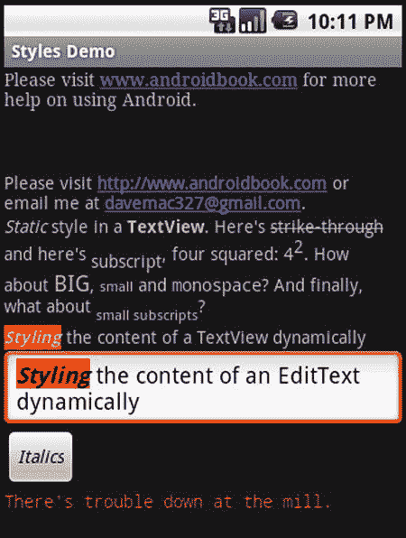

# 七、样式和主题

到目前为止，我们已经介绍了 Android 用户界面(UI)的一些基础知识。在这一章中，我们将讨论样式和主题，它们有助于封装控件外观属性，以便于设置和维护。Android 提供了几种改变应用中视图风格的方法，包括 XML 和代码。我们将首先介绍在字符串中使用标记标签，然后介绍如何使用 spannables 来改变文本的特定视觉属性。但是，如果您想对几个视图或整个活动或应用使用一个通用的规范来控制事物的外观，该怎么办呢？我们将讨论 Android 风格和主题，向您展示如何操作。

使用样式

有时，您想要突出显示视图内容的一部分或设置其样式。您可以静态或动态地做到这一点。静态地，你可以将标记直接应用到你的字符串资源中的字符串，如下所示:

```java
<string name="styledText"><i>Static</i> style in a <b>TextView</b>.</string>
```

然后，您可以在 XML 或代码中引用它。注意，可以对字符串资源使用以下 HTML 标记: < i > 、 < b > 和 < u > ，分别用于斜体、粗体和下划线，以及 < sup > (上标)、 < sub > (下标)、 < strike > (删除线)、你甚至可以嵌套它们来得到，例如，小的上标。这不仅适用于文本视图，也适用于其他视图，比如按钮。图 7-1 展示了样式化和主题化的文本，使用了本节中的许多例子。



[图 7-1](#_Fig1) 。风格和主题示例

以编程方式设计一个 TextView 控件的内容需要一点额外的工作，但是允许更多的灵活性(见[清单 7-1](#list1) )，因为你可以在运行时设计它。不过，这种灵活性只能应用于 spannable，这就是 EditText 通常管理内部文本的方式，而 TextView 通常不使用 Spannable 。span able 基本上是一个可以应用样式的字符串。要让 TextView 将文本存储为 spannable，可以这样调用 setText :

```java
tv.setText("This text is stored in a Spannable", TextView.BufferType.SPANNABLE);
```

然后，当你调用 tv.getText 时，你会得到一个 spannable。

如清单 7-1 中的[所示，您可以获取 EditText 的内容(作为一个 Spannable 对象)，然后为部分文本设置样式。清单中的代码将文本样式设置为粗体和斜体，并将背景设置为红色。您可以使用所有的样式选项，就像我们之前描述的 HTML 标签一样，还可以使用其他选项。](#list1)

[***清单 7-1***](#_list1) 。将样式动态应用于编辑文本的内容

```java
EditText et =(EditText)this.findViewById(R.id.et);
et.setText("Styling the content of an EditText dynamically");
Spannable spn = (Spannable) et.getText();
spn.setSpan(new BackgroundColorSpan(Color.RED), 0, 7,
             Spannable.SPAN_EXCLUSIVE_EXCLUSIVE);
spn.setSpan(new StyleSpan(android.graphics.Typeface.BOLD_ITALIC),
             0, 7, Spannable.SPAN_EXCLUSIVE_EXCLUSIVE);
```

这两种样式化技术只对它们所应用的一个视图有效。Android 提供了一种样式机制来定义跨视图重用的通用样式，还提供了一种主题机制，它基本上将一种样式应用于整个活动或整个应用。首先，我们需要谈谈风格。

一个*样式*是一个有名称的视图 属性的集合，所以你可以通过它的名称来引用这个集合，并通过名称将那个样式分配给视图。例如，[清单 7-2](#list2) 显示了一个资源 XML 文件，保存在 /res/values 中，我们可以将它用于所有的错误消息。

[***清单 7-2***](#_list2) 。定义在多个视图中使用的样式

```java
<?xml version="1.0" encoding="utf-8"?>
<resources>
    <style name="ErrorText">
        <item name="android:layout_width">fill_parent</item>
        <item name="android:layout_height">wrap_content</item>
        <item name="android:textColor">#FF0000</item>
        <item name="android:typeface">monospace</item>
    </style>
</resources>
```

定义了视图的大小以及字体颜色(红色)和字样。注意项目标签的名称属性(例如 android:layout_width )是我们在前面章节的布局 XML 文件中使用的 XML 属性名称，并且项目标签的值不再需要双引号。我们现在可以对一个错误使用这种样式 TextView ，如[清单 7-3](#list3) 所示。

[***清单 7-3***](#_list3) 。在视图中使用样式

```java
<TextView  android:id="@+id/errorText"
    style="@style/ErrorText"
    android:text="No errors at this time"
    />
```

需要注意的是，在这个视图定义中，样式的属性名不是以 android: 开头的。注意这一点，因为除了风格，所有东西似乎都用 android: 。当您的应用中有许多共享一种样式的视图时，在一个地方改变该样式就简单多了；您只需要在一个资源文件中修改样式的属性。

当然，您可以为各种控件创建许多不同的样式。例如，按钮可以共享不同于菜单中文本的通用样式的通用样式。常见的是用样式管理文本属性，包括 android:textColor、android:textStyle、android:textSize。样式使用的其他常见属性包括填充值、android:background 和颜色。

样式的一个非常好的方面是你可以设置它们的层次结构。我们可以为非常糟糕的错误消息定义一种新的样式，并以 ErrorText 的样式为基础。[清单 7-4](#list4) 展示了这可能是什么样子。

[***清单 7-4***](#_list4) 。从父样式定义样式

```java
<?xml version="1.0" encoding="utf-8"?>
<resources>
    <style name="ErrorText.Danger" >
        <item name="android:textStyle">bold</item>
    </style>
</resources>
```

这个例子表明，我们可以简单地使用父样式作为新样式名的前缀来命名我们的子样式。因此， ErrorText。危险 是 ErrorText 的子节点，继承了父节点的样式属性。然后为 textStyle 添加一个新属性。这可以一次又一次地重复，以创建一个完整的风格树。

和适配器布局一样，Android 提供了大量我们可以使用的样式。要指定 Android 提供的样式，使用如下语法:

```java
style="@android:style/TextAppearance"
```

这个样式设置了 Android 中文本的默认样式。要找到主 Android styles.xml 文件，请访问安装 Android SDK 的 Android SDK/platforms/<Android-version>/data/RES/values/文件夹；<android-version>是您想要查看样式的 Android 的特定版本。在这个文件中，您会发现许多现成的样式供您使用或扩展。关于@ Android:style/text appearance 的一个快速说明:这种样式没有设置 android:layout_height 或 android:layout_width ，因此一个视图规范需要比这种样式更多的样式才能正确编译。

这里有一个关于扩展 Android 提供的样式的警告:以前使用前缀的方法不适用于 Android 提供的样式。相反，您必须使用样式标签的父属性，如下所示:

```java
<style name="CustomTextAppearance" parent="@android:style/TextAppearance">
    <item  ... your extensions go here ...    />
</style>
```

你不必总是在你的视图中引入一个完整的样式。你可以选择借用这种风格的一部分。例如，如果您想将文本视图中的文本颜色设置为系统样式颜色，您可以执行以下操作:

```java
<TextView android:id="@+id/tv2"
    android:layout_width="fill_parent"  android:layout_height="wrap_content"
    android:textColor="?android:textColorSecondary"
    android:text="@string/hello_world" />
```

注意，在这个例子中， textColor 属性值的名称以开始。字符代替了 @ 字符。？使用了字符，所以 Android 知道在当前主题中寻找一个样式值。因为我们看到？android ，我们在 android 系统主题中寻找这个样式值。

使用主题

样式的一个问题是，您需要添加一个属性规范 style="@style/... "应用到您希望它应用到的每个视图定义。如果您希望在整个活动或整个应用中应用一些样式元素，您应该使用主题。一个*主题*实际上只是一种被广泛应用的风格；但就定义主题而言，它就像一种风格。事实上，主题和样式是可以互换的:你可以将主题扩展成样式，也可以将样式称为主题。通常，只有名称给出了一个提示，说明一个样式是用作样式还是主题。

要为活动或应用指定一个主题，您需要为项目的 AndroidManifest.xml 文件中的 <活动> 或 <应用> 标签添加一个属性。代码可能类似于以下代码之一:

```java
<activity android:theme="@style/MyActivityTheme">
<application android:theme="@style/MyApplicationTheme">
<application android:theme="@android:style/Theme.NoTitleBar">
```

您可以在 Android 提供的样式所在的文件夹中找到 Android 提供的主题，主题位于一个名为 themes.xml 的文件中。当您查看主题文件时，您会看到一大组定义的样式，它们的名称都以主题开头。把最后一句读几遍可能会有好处。换句话说，所有的样式和主题都是类型样式，即使样式*名称*中有“主题”。你还会注意到，在 Android 提供的主题和样式中，有很多扩展，这就是为什么你最终会有被称为主题的样式。比如 Dialog.AppError 。

参考

以下是一些对您可能希望进一步探索的主题有帮助的参考:

*   :与本书相关的可下载项目列表。对于这一章，寻找一个名为 pro Android 5 _ Ch07 _ styles . ZIP 的 ZIP 文件。这个 ZIP 文件包含本章中的所有项目，列在单独的根目录中。还有一个自述。TXT 文件，它准确地描述了如何将项目从这些 ZIP 文件之一导入到您的 IDE 中。
*   :Android 风格和主题指南。

摘要

让我们通过快速列举你所学到的风格和主题来结束这一章:

*   样式只是视图属性的集合，便于在视图、活动和应用之间重用。
*   您可以创建自己的样式、使用预定义的样式或扩展现有样式。
*   当主题被应用到一个活动或应用时，你称之为风格。