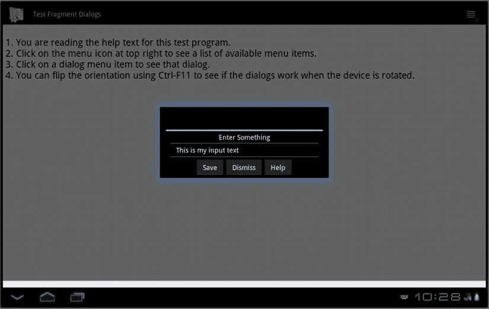

# 十、使用对话框

Android SDK 为对话框提供了广泛的支持。对话框是在当前窗口前面弹出的一个较小的窗口，用来显示紧急消息，提示用户输入内容，或者显示某种状态，如下载进度。通常期望用户与对话框交互，然后返回到下面的窗口继续应用。从技术上来说，Android 允许在一个活动的布局中嵌入一个对话片段，我们也会谈到这一点。

Android 中明确支持的对话框包括警告、提示、选择列表、单选、多选、进度、时间选择器和日期选择器对话框。(该列表可能因 Android 版本而异。)Android 还支持其他需求的自定义对话框。这一章的主要目的不是涵盖所有的对话框，而是通过一个示例应用来涵盖 Android 对话框的底层架构。从那里你应该可以使用任何 Android 对话框。

需要注意的是，Android 3.0 增加了基于片段的对话框。来自 Google 的期望是开发者只会使用片段对话框，即使是在 Android 之前的版本中。这可以通过片段兼容性库来完成。为此，本章重点介绍对话片段 。

使用 Android 中的对话框

Android 中的对话框是异步的，这提供了灵活性。然而，如果您习惯于对话框主要是同步的编程框架(比如 Microsoft Windows，或者网页中的 JavaScript 对话框)，您可能会发现异步对话框有点不直观。对于同步对话框，对话框显示后的代码行直到对话框关闭后才运行。这意味着下一行代码可以询问按下了哪个按钮，或者在对话框中输入了什么文本。然而在 Android 中，对话框是异步的。对话框一显示出来，下一行代码就会运行，即使用户还没有接触到对话框。您的应用必须通过从对话框实现回调来处理这一事实，以允许应用被通知用户与对话框的交互。

这也意味着您的应用能够从代码中消除对话框，这是非常强大的。如果对话框因为你的应用正在做一些事情而显示一条繁忙的消息，一旦你的应用完成了那个任务，它就可以从代码中关闭对话框。

理解对话片段

在本节中，您将学习如何使用对话框片段来呈现一个简单的警报对话框和一个用于收集提示文本的自定义对话框。

基本对话片段

在我们向您展示提示对话框和警告对话框的工作示例之前，我们想先介绍一下对话框片段的高级概念。与对话框相关的功能使用一个名为 DialogFragment 的类。一个 DialogFragment 从类 Fragment 派生而来，其行为很像一个片段。然后，您将使用 DialogFragment 作为您的对话框的基类。一旦你有了一个从这个类派生的对话框，比如

```java
public class MyDialogFragment extends DialogFragment { ... }
```

然后，您可以使用片段事务将这个对话框片段 MyDialogFragment 显示为一个对话框。清单 10-1 展示了一个代码片段。

***清单 10-1*** 。显示对话片段

```java
public class SomeActivity extends Activity
{
    //....other activity functions
    public void showDialog()
    {
        //construct MyDialogFragment
        MyDialogFragment mdf = MyDialogFragment.newInstance(arg1,arg2);
        FragmentManager fm = getFragmentManager();
        FragmentTransaction ft = fm.beginTransaction();
        mdf.show(ft,"my-dialog-tag");
    }
    //....other activity functions
}
```

**注意**我们在本章末尾的“参考资料”部分提供了一个可下载项目的链接。您可以使用该下载来试验本章中介绍的代码和概念。

从清单 10-1 开始，显示对话片段的步骤如下:

1.  创建一个对话框片段。
2.  获取片段交易。
3.  使用步骤 2 中的片段事务显示对话框。

让我们来谈谈其中的每一个步骤。

构造一个对话片段

当构建一个对话框片段时，规则与构建任何其他类型的片段时是一样的。推荐的模式是像以前一样使用工厂方法，比如 newInstance() 。在 new instance()方法中，您使用对话框片段的默认构造函数，然后添加一个包含传入参数的 arguments 包。你不想在这个方法里面做其他的工作，因为你必须确保你在这里做的和 Android 从一个保存的状态恢复你的对话框片段时做的是一样的。Android 所做的就是调用默认的构造函数，并在其上重新创建参数包。

覆盖 onCreateView

当您从对话框片段继承时，您需要重写两个方法中的一个来为您的对话框提供视图层次结构。第一个选项是覆盖 onCreateView() 并返回一个视图。第二个选项是覆盖 onCreateDialog() 并返回一个对话框(类似于由 AlertDialog 构造的对话框。构建器，我们稍后会谈到)。

清单 10-2 展示了一个覆盖 onCreateView() 的例子。

***清单 10-2*** 。覆盖 DialogFragment 的 onCreateView()

```java
public class MyDialogFragment extends DialogFragment
    implements View.OnClickListener
{
    .....other functions
    public View onCreateView(LayoutInflater inflater,
            ViewGroup container, Bundle savedInstanceState)
    {
        //Create a view by inflating desired layout
        View v =
 inflater.inflate(R.layout.prompt_dialog, container, false);

        //you can locate a view and set values
        TextView tv = (TextView)v.findViewById(R.id.promptmessage);
        tv.setText(this.getPrompt());

        //You can set callbacks on buttons
        Button dismissBtn = (Button)v.findViewById(R.id.btn_dismiss);
        dismissBtn.setOnClickListener(this);

        Button saveBtn = (Button)v.findViewById(R.id.btn_save);
        saveBtn.setOnClickListener(this);
        return v;
    }
    .....other functions
}
```

在清单 10-2 中，你正在加载一个由布局标识的视图。然后寻找两个按钮，并在它们上面设置回调。这与你在《??》第八章中创建细节片段的方式非常相似。然而，与前面的片段不同，对话框片段有另一种方式来创建视图层次结构。

「突出显示」对话方块「??」

作为在 onCreateView() 中提供视图的替代方法，您可以覆盖 onCreateDialog() 并提供一个对话框实例。清单 10-3 提供了这种方法的示例代码。

***清单 10-3*** 。覆盖对话框片段的 onCreateDialog()

```java
public class MyDialogFragment extends DialogFragment
    implements DialogInterface.OnClickListener
{
    .....other functions
    @Override
    public Dialog onCreateDialog(Bundle icicle)
    {
        AlertDialog.Builder b = new AlertDialog.Builder(getActivity())
          .setTitle("My Dialog Title")
          .setPositiveButton("Ok", this)
          .setNegativeButton("Cancel", this)
          .setMessage(this.getMessage());
        return b.create();
    }
    .....other functions
}
```

在此示例中，您使用警报对话框生成器来创建要返回的对话框对象。这对于简单的对话框很有效。覆盖 onCreateView() 的第一个选项同样简单，并且提供了更大的灵活性。

警报对话框。Builder 实际上是 3.0 之前 Android 的遗留物。这是创建对话框的老方法之一，您仍然可以在 DialogFragment s 中创建对话框。正如您所看到的，通过调用各种可用的方法来创建对话框相当容易，就像我们在这里所做的那样。

显示对话片段

一旦构建了一个对话片段，就需要一个片段事务来显示它。像所有其他片段一样，对对话片段的操作是通过片段事务进行的。

对话片段上的 show() 方法将片段事务作为输入。你可以在清单 10-1 中看到这一点。 show() 方法使用片段事务将这个对话框添加到活动中，然后提交片段事务。但是， show() 方法不会将事务添加到后台堆栈中。如果要这样做，需要先把这个事务添加到后台栈，然后传递给 show() 方法。对话框片段的 show() 方法具有以下签名:

```java
public int show(FragmentTransaction transaction, String tag)
public int show(FragmentManager manager, String tag)
```

第一个 show() 方法通过将这个片段添加到带有指定标记的传入事务中来显示对话框。然后，该方法返回已提交事务的标识符。

第二个 show() 方法自动从事务管理器获取事务。这是一个快捷的方法。然而，当您使用第二种方法时，您没有将事务添加到后台堆栈的选项。如果您想要该控件，您需要使用第一种方法。如果您只想显示对话框，并且当时没有其他理由使用片段事务，那么可以使用第二种方法。

对话作为片段的一个好处是底层的片段管理器完成了基本的状态管理。例如，即使设备在显示对话框时旋转，对话框也会在您不执行任何状态管理的情况下再现。

对话框片段还提供了控制显示对话框视图的框架的方法，例如框架的标题和外观。参考 DialogFragment 类文档以查看这些选项的更多信息；本章末尾提供了该 URL。

消除对话片段

有两种方法可以消除对话框片段。第一种是显式调用对话框片段上的 dismisse()方法来响应对话框视图上的按钮或某些动作，如清单 10-4 所示。

***清单 10-4*** 。调用解除()

```java
if (someview.getId() == R.id.btn_dismiss)
{
    //use some callbacks to advise clients
    //of this dialog that it is being dismissed
    //and call dismiss
    dismiss();
    return;
}
```

对话框片段的 dissolve()方法从片段管理器中移除该片段，然后提交该事务。如果这个对话片段有一个后台堆栈，那么 dissolve()将当前对话弹出事务堆栈，并呈现前一个片段的事务状态。不管有没有回栈，调用 disass()都会导致调用标准的对话框片段销毁回调，包括 onDismiss() 。

需要注意的一点是，你不能依靠 onDismiss() 来断定你的代码已经调用了一个 disass()。这是因为当设备配置改变时 onDismiss() 也被调用，因此不能很好地指示用户对对话框本身做了什么。如果用户旋转设备时对话框正在显示，即使用户没有按下对话框中的按钮，对话框片段也会看到 onDismiss() 被调用。相反，你应该总是依赖于对话框视图上的显式按钮点击。

如果用户在对话框片段显示时按下后退按钮，这将导致对话框片段触发 onCancel() 回调。默认情况下，Android 让对话框片段消失，所以你不需要自己对片段调用 dismisse()。但是如果您想让调用活动得到对话框被取消的通知，您需要从 onCancel() 内部调用逻辑来实现这一点。这就是 onCancel() 和 onDismiss() 对于对话片段的区别。对于 onDismiss() ，您不能确定到底发生了什么导致了 onDismiss() 回调的触发。您可能还注意到，一个对话框片段没有 cancel() 方法，只有 dissolve()；但是正如我们所说的，当一个对话框片段被按下返回按钮取消时，Android 会帮你取消/消除它。

消除对话片段的另一种方法是呈现另一个对话片段。关闭当前对话框并显示新对话框的方式与关闭当前对话框略有不同。清单 10-5 显示了一个例子。

***清单 10-5*** 。为后台堆栈设置对话框

```java
if (someview.getId() == R.id.btn_invoke_another_dialog)
{
    Activity act = getActivity();
    FragmentManager fm = act.getFragmentManager();
    FragmentTransaction ft = fm.beginTransaction();
    ft.remove(this);

    ft.addToBackStack(null);
    //null represents no name for the back stack transaction

    HelpDialogFragment hdf =
        HelpDialogFragment.newInstance(R.string.helptext);
    hdf.show(ft, "HELP");
    return;
}
```

在单个事务中，您将删除当前的对话片段并添加新的对话片段。这具有使当前对话框在视觉上消失并使新对话框出现的效果。如果用户按下 Back 按钮，因为您已经在 back stack 上保存了这个事务，新的对话框被关闭，并显示上一个对话框。例如，这是显示帮助对话框的一种便捷方式。

对话框解除的含义

当您向片段管理器添加任何片段时，片段管理器会对该片段进行状态管理。这意味着当设备配置发生变化时(例如，设备旋转)，活动会重新启动，片段也会重新启动。在第八章的中，您在运行莎士比亚示例应用时旋转了设备。

设备配置的改变不会影响对话框,因为它们也由片段管理器管理。但是 show() 和 disass()的隐含行为意味着如果你不小心的话，你会很容易忘记一个对话片段。 show() 方法自动将片段添加到片段管理器中；方法自动从片段管理器中删除片段。在开始显示对话片段之前，您可能有一个指向该片段的直接指针。但是你不能将这个片段添加到片段管理器中，之后再调用 show() ，因为一个片段只能添加一次到片段管理器中。您可以计划通过恢复活动来检索该指针。但是，如果您显示并关闭这个对话框，这个片段将被隐式地从片段管理器中删除，从而拒绝该片段被恢复和重新打印的能力(因为片段管理器在它被删除后不知道这个片段的存在)。

如果你想在对话框关闭后保持它的状态，你需要在父活动中或者在一个非对话框片段中保持对话框外的状态。

对话片段示例应用

在本节中，您将回顾一个示例应用，它演示了对话框片段的这些概念。您还将检查片段和包含它的活动之间的通信。要实现这一切，您需要五个 Java 文件:

*   MainActivity.java:你申请的主要活动。它显示了一个简单的视图，其中包含帮助文本和一个菜单，可以从该菜单启动对话框。
*   PromptDialogFragment.java:一个对话框片段的例子，它用 XML 定义了自己的布局，并允许用户输入。它有三个按钮:保存、消除(取消)和帮助。
*   AlertDialogFragment.java:一个对话框片段的例子，它使用 AlertBuilder 类在这个片段中创建一个对话框。这是创建对话的传统方式。
*   HelpDialogFragment.java:一个非常简单的片段，显示了来自应用资源的帮助消息。特定的帮助消息是在创建帮助对话框对象时标识的。这个帮助片段可以在主活动和提示对话框片段中显示。
*   OnDialogDoneListener.java:一个接口，您需要您的活动来实现它，以便从片段中获取消息。使用接口意味着你的片段不需要知道太多关于调用活动的信息，除非它已经实现了这个接口。这有助于封装功能。从活动的角度来看，它有一个通用的方法来接收来自片段的信息，而不需要了解太多。

这个应用有三种布局:主活动、提示对话框片段和帮助对话框片段。请注意，您不需要警告对话框片段的布局，因为 AlertBuilder 会在内部为您处理该布局。当你完成后，应用看起来像图 10-1 。



图 10-1 。对话框片段示例应用的用户界面

对话示例:主活动

让我们来看看源代码，您可以从本书的网站上下载(参见“参考资料”一节)。我们将使用 DialogFragmentDemo 项目。在我们继续之前，开放 MainActivity.java 的源代码。

主活动的代码非常简单。您显示一个简单的文本页面并设置一个菜单。每个菜单项调用一个活动方法，每个方法基本上做同样的事情:获取一个片段事务，创建一个新的片段，并显示该片段。注意，每个片段都有一个用于片段事务的唯一标签。这个标记与片段管理器中的片段相关联，因此您可以在以后通过标记名来定位这些片段。该片段还可以用片段上的 getTag() 方法确定自己的标签值。

主活动中的最后一个方法定义是 onDialogDone() ，它是一个回调，是您的活动正在实现的 OnDialogDoneListener 接口的一部分。正如您所看到的，回调提供了一个调用您的片段的标签、一个指示对话框片段是否被取消的布尔值和一条消息。就您的目的而言，您只想将信息记录到 LogCat 您还可以使用吐司向用户展示它。吐司将在本章后面介绍。

样本对话框:ondialogdonelistener

为了让您能够知道对话框何时消失，请创建一个由对话框调用者实现的侦听器接口。接口的代码在 OnDialogDoneListener.java。

如你所见，这是一个非常简单的界面。您只能为此接口选择一个回调，活动必须实现该回调。您的片段不需要知道调用活动的细节，只需要知道调用活动必须实现 OnDialogDoneListener 接口；因此，片段可以调用这个回调来与调用活动通信。根据片段正在做的事情，接口中可能有多个回调。对于这个示例应用，您将显示与片段类定义分开的接口。为了更容易管理代码，您可以将片段侦听器接口嵌入片段类定义本身，从而更容易保持侦听器和片段之间的同步。

对话框示例:PromptDialogFragment

现在让我们来看看你的第一个片段， PromptDialogFragment ，它的布局在/res/layout/prompt_dialog.xml 中，Java 代码在 PromptDialogFragment.java 的/src 下。

这个提示对话框布局看起来像你以前见过的许多。有一个 TextView 作为提示；一个 EditText 接受用户的输入；以及用于保存输入、消除(取消)对话片段和弹出帮助对话框的三个按钮。

Java 代码开始看起来就像你之前的片段。您有一个 newInstance() 静态方法来创建新对象，在这个方法中，您调用默认的构造函数，构建一个参数包，并将其附加到您的新对象。接下来，您在 onAttach() 回调中有了新的东西。您希望确保您刚刚附加到的活动已经实现了 OnDialogDoneListener 接口。为了测试这一点，您将传递的活动转换为 OnDialogDoneListener 接口。下面是代码:

```java
try {
    OnDialogDoneListener test = (OnDialogDoneListener)act;
}
catch(ClassCastException cce) {
    // Here is where we fail gracefully.
    Log.e(MainActivity.LOGTAG, "Activity is not listening");
}
```

如果活动没有实现这个接口，就会抛出一个 ClassCastException 。您可以更优雅地处理这个异常，但是这个示例尽可能保持代码简单。

接下来是 onCreate() 回调。与片段一样，您不需要在这里构建您的用户界面，但是您可以设置对话框样式。这是对话片段所特有的。您可以自己设置样式和主题，也可以只设置样式并使用主题值零(0)让系统为您选择合适的主题。下面是代码:

```java
int style = DialogFragment.STYLE_NORMAL, theme = 0;
setStyle(style,theme);
```

在 onCreateView() 中，您为您的对话框片段创建视图层次结构。就像其他片段一样，您没有将视图层次结构附加到传入的视图容器中(也就是说，通过将 attachToRoot 参数设置为 false )。然后继续设置按钮回调，并将对话框提示文本设置为最初传递给 newInstance() 的提示。

没有显示 onCancel() 和 onDismiss() 回调，因为它们所做的只是记录日志；您将能够看到这些回调在片段的生命周期中何时触发。

提示对话框片段中的最后一个回调是针对按钮的。再一次，您获取对您的封闭活动的引用，并将其转换为您期望该活动已经实现的接口。如果用户按下了 Save 按钮，您获取输入的文本并调用接口的回调函数 onDialogDone() 。这个回调函数接受这个片段的标记名、一个指示这个对话框片段是否被取消的布尔值和一条消息，在这个例子中，这条消息是用户输入的文本。这是来自的主要活动:

```java
public void onDialogDone(String tag, boolean cancelled,
                         CharSequence message) {
    String s = tag + " responds with: " + message;
    if(cancelled)
        s = tag + " was cancelled by the user";
    Toast.makeText(this, s, Toast.LENGTH_LONG).show();
    Log.v(LOGTAG, s);
}
```

为了完成对 Save 按钮的点击操作，您可以调用 dissolve()来删除对话框片段。记住 dismisse()不仅使片段在视觉上消失，而且还将片段从片段管理器中弹出，因此它不再对您可用。

如果按下的按钮是 dissolve，那么再次调用接口回调，这次没有消息，然后调用 dissolve()。最后，如果用户按下了帮助按钮，您不想丢失提示对话框片段，所以您做了一些稍微不同的事情。我们之前描述过。为了记住提示对话框片段，以便以后可以回到它，您需要创建一个片段事务来删除提示对话框片段，并使用 show() 方法添加帮助对话框片段；这个需要放到后面的堆栈里。还要注意，帮助对话框片段是如何通过引用资源 ID 来创建的。这意味着您的帮助对话框片段可以与您的应用可用的任何帮助文本一起使用。

对话框示例:HelpDialogFragment

您创建了一个片段事务，从提示对话框片段转到帮助对话框片段，并将该片段事务放在后台堆栈上。这具有使提示对话框片段从视图中消失的效果，但是仍然可以通过片段管理器和后台堆栈访问它。新的帮助对话框片段出现在它的位置，并允许用户阅读帮助文本。当用户消除帮助对话框片段时，弹出片段后栈条目，帮助对话框片段的效果被消除(从视觉上和从片段管理器中),并且提示对话框片段恢复到视图。这是实现这一切的一个非常简单的方法。它非常简单却非常强大；如果用户在显示这些对话框时旋转设备，它甚至可以工作。

看一下 HelpDialogFragment.java 文件的源代码及其布局( help_dialog.xml )。这个对话框片段的目的是显示帮助文本。布局是一个文本视图和一个关闭按钮。您应该开始对 Java 代码感到熟悉了。有一个 newInstance() 方法创建新的帮助对话框片段，一个 onCreate() 方法设置样式和主题，一个 onCreateView() 方法构建视图层次结构。在这个特殊的例子中，您希望找到一个字符串资源来填充 TextView ，因此您通过活动访问资源，并选择传递给 newInstance() 的资源 ID。最后， onCreateView() 设置一个按钮点击处理器来捕获关闭按钮的点击。这种情况下，解散的时候不需要做什么有趣的事情。

这个片段有两种调用方式:从活动调用和从提示对话框片段调用。当这个帮助对话框片段显示在主活动中时，消除它只是将片段从顶部弹出，并显示下面的主活动。当该帮助对话框片段从提示对话框片段中显示时，因为帮助对话框片段是后台堆栈上片段事务的一部分，所以消除它会导致片段事务回滚，这将弹出帮助对话框片段，但会恢复提示对话框片段。用户看到提示对话框片段再次出现。

对话框示例:AlertDialogFragment

在这个示例应用中，我们还有最后一个对话框片段要向您展示:警报对话框片段。虽然您可以以类似于帮助对话框片段的方式创建一个警告对话框片段，但是您也可以使用旧的 AlertBuilder 框架来创建一个对话框片段，该框架已经在许多 Android 版本中运行。看看 AlertDialogFragment.java 的源代码。

你不需要为它设计一个布局，因为 AlertBuilder 会为你做好准备。注意，这个对话框片段开始时和其他的一样，但是不是一个 onCreateView() 回调，而是一个 onCreateDialog() 回调。您可以实现 onCreateView() 或 onCreateDialog() ，但不能同时实现两者。从 onCreateDialog() 返回的不是视图；这是一个对话。这里感兴趣的是，要获得对话框的参数，应该访问 arguments 包。在这个示例应用中，您只对警报消息这样做，但是您也可以通过 arguments bundle 访问其他参数。

还要注意，对于这种类型的对话框片段，您需要片段类来实现 DialogInterface。OnClickListener ，这意味着您的对话框片段必须实现 onClick() 回调。当用户操作嵌入的对话框时，这个回调被触发。同样，您会得到一个对触发的对话框的引用，以及按下了哪个按钮的指示。和以前一样，您应该小心不要依赖于 onDismiss() ，因为当设备配置发生变化时，这可能会触发。

对话框示例:嵌入式对话框

您可能已经注意到了 DialogFragment 的另一个特性。在应用的主布局中，文本下面是一个框架布局，它可以用来保存一个对话框。在应用的菜单中，最后一项导致片段事务将一个 PromptDialogFragment 的新实例添加到主屏幕。无需任何修改，对话框片段可以嵌入在主布局中显示，并且它的功能与您预期的一样。

这项技术的一个不同之处是，显示嵌入式对话框的代码与显示弹出对话框的代码不同。嵌入的对话框代码如下所示:

```java
ft.add(R.id.embeddedDialog, pdf, EMBED_DIALOG_TAG);
ft.commit();
```

这看起来和第八章第一节中的一样，当我们在一个框架布局中显示一个片段的时候。但是，这一次，您要确保传入一个标记名，当对话框片段通知您用户输入的活动时会用到这个标记名。

对话示例:观察

当您运行这个示例应用时，请确保在设备的不同方向上尝试所有的菜单选项。显示对话片段时旋转设备。您应该很高兴看到对话框与旋转一起出现；您不需要担心大量的代码来管理由于配置更改而导致的片段的保存和恢复。

我们希望你欣赏的另一件事是你可以在片段和活动之间轻松交流。当然，活动有对所有可用片段的引用，或者可以获得对所有可用片段的引用，因此它可以访问由片段本身公开的方法。这不是片段和活动之间唯一的交流方式。您总是可以使用片段管理器上的 getter 方法来检索托管片段的实例，然后适当地转换该引用并直接调用该片段上的方法。您甚至可以在另一个片段中这样做。您使用接口和通过活动将片段相互隔离的程度，或者使用片段到片段的通信构建依赖关系的程度，取决于您的应用有多复杂，以及您想要实现多少重用。

使用吐司工作

一个 Toast 就像一个迷你警告对话框，有一条消息，显示一段时间，然后自动消失。它没有任何按钮。所以可以说是一个瞬态的告警信息。它被称为吐司，因为它像吐司一样从烤面包机里蹦出来。

清单 10-10 展示了一个如何使用 Toast 显示消息的例子。

***清单 10-10*** 。使用 Toast 进行调试

```java
//Create a function to wrap a message as a toast
//show the toast
public void reportToast(String message)
{
    String s = MainActivity.LOGTAG + ":" + message;
    Toast.makeText(activity, s, Toast.LENGTH_SHORT).show();
}
```

清单 10-10 中的 makeText() 方法不仅可以接受活动，还可以接受任何上下文对象，比如传递给广播接收器或服务的对象。这扩展了吐司在活动之外的用途。

参考

*   :本章考试项目。ZIP 文件的名称是 pro Android 5 _ ch10 _ dialogs . ZIP。下载内容包括 PickerDialogFragmentDemo 中日期和时间选择器对话框的示例。
*   :Android SDK 文档，提供了使用 Android 对话框的优秀介绍。你会在这里找到如何使用管理对话框的解释和各种可用对话框的例子。
*   [`developer . Android . com/reference/Android/content/dialog interface . html`](http://developer.android.com/reference/android/content/DialogInterface.html):为对话框定义的众多常量。
*   [`developer . Android . com/reference/Android/app/alert dialog。Builder.html`](http://developer.android.com/reference/android/app/AlertDialog.Builder.html)??:警报对话框生成器类的 API 文档。
*   [`developer . Android . com/reference/Android/app/progress dialog . html`](http://developer.android.com/reference/android/app/ProgressDialog.html):针对 ProgressDialog 的 API 文档。
*   [`developer . android . com/guide/topics/ui/controls/pickers . html`](http://developer.android.com/guide/topics/ui/controls/pickers.html):使用日期选择器和时间选择器对话框的 Android 教程。

摘要

本章讨论了异步对话框以及如何使用对话框片段，包括以下主题:

*   什么是对话框，为什么要使用对话框
*   Android 中对话框的异步特性
*   让对话框显示在屏幕上的三个步骤
*   创建一个片段
*   对话框片段如何创建视图层次结构的两种方法
*   片段事务如何参与显示对话片段，以及如何获得一个片段事务
*   当用户在查看对话片段时按下后退按钮会发生什么
*   后台堆栈和管理对话片段
*   当一个对话框片段上的按钮被点击时会发生什么，你如何处理它
*   一种从对话片段与调用活动通信的干净方式
*   一个对话片段如何调用另一个对话片段并仍然返回到前一个对话片段
*   这个 Toast 类以及它如何被用作一个简单的警告弹出窗口