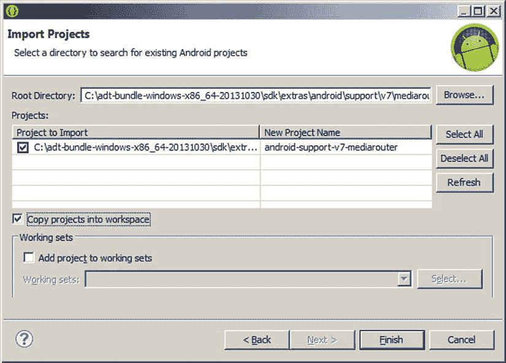
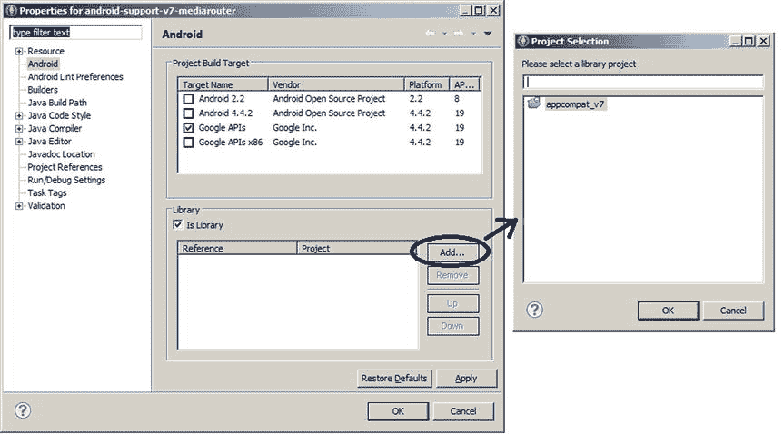

# 十二、为旧设备使用兼容性库

自从几年前首次推出以来，Android 平台已经经历了令人印象深刻的演变。虽然 Android 的意图一直是支持许多不同类型的设备，但它从一开始就不是为了满足这个目标而设计的。取而代之的是，谷歌的工程师们增加、删除和改变了 API 以提供新的特性。最大的变化之一是创建片段，以便处理更大的屏幕尺寸，如平板电脑和电视。但是还有其他的变化，比如动作栏和菜单。

新的 API 给开发人员带来了一个难题，他们希望自己的应用可以在带有新 API 的新设备上运行，也可以在没有这些 API 的旧设备上运行。许多老款设备无法升级安卓系统。即使谷歌将新的 API 添加到旧的 Android 操作系统的版本中，旧的设备也不会得到新的版本，因为设备制造商和移动运营商都需要测试和支持。谷歌想出的解决方案是创建兼容库，可以链接到应用中，这样它就可以利用新的 API 功能，但仍然可以在旧版本的 Android 上运行。该库指出了如何使用旧的 API 来实现新的特性。如果相同的应用运行在已经有这些新特性的新版 Android 上，兼容性库调用新版 Android 中的底层 API。

本章将深入探讨兼容性库，并解释如何使用它们以及需要注意什么。如果你没有为旧版本的 Android 开发应用，你可以安全地跳过这一章，因为你不需要这些库。只有当你想在一个没有新 API 的旧版本 Android 上运行的应用中包含新 API 的功能时，这些库才是有用的。

这一切都始于平板电脑

在支持平板电脑之前，Android 操作系统运行良好。应用的基本构件是活动，意味着为用户执行一个单一的任务，并填满设备的屏幕。但是平板电脑提供了更多的空间，因此用户可以在一个屏幕上同时看到和做一些事情。于是有了蜂巢(Android 3.0)，谷歌引入了片段。这是一个全新的概念，它改变了开发人员创建 ui 的方式以及 ui 背后的逻辑。这本来很好，除了仍然有大量的 Android 设备(例如，智能手机)不支持片段。Google 发现可以编写一个兼容性库来提供片段的类似实现，等等。，它使用旧版本 Android 中的现有 API。如果一个应用链接到兼容性库中，它就可以使用片段，即使旧版本的 Android 在操作系统中不支持片段。

然后，谷歌工程师研究了新 Android 中的其他功能和 API，并提供了兼容库功能和 API 来匹配，以便这些功能也可以用于旧版本的 Android，而不必发布旧版本 Android 的更新。除了对片段的支持，兼容性库还提供对加载器、RenderScript、ActionBar 等的支持。

兼容性库并不总是让新旧版本完全相同。例如，新的 Activity 类知道片段。要使用兼容库，必须扩展 fragmentation Activity 类，而不是 Activity；正是 fragmentation activity 类在旧的 Android 版本中处理片段。

当您使用兼容性库时，您将为您的应用使用这些类，而不管它将在哪个版本的 Android 上运行。换句话说，你只需要在你的应用中使用 fragmentation activity，它将在所有版本的 Android 中做正确的事情，包括 Android 3.0 和更高版本。你不会试图在同一个应用中同时包含安卓 3.0 以上版本的活动和安卓 3.0 以下版本的片段活动。当 fragmentation Activity 在 Android 3.0 和更高版本上执行时，它几乎可以直接调用底层的 Activity 类。在最近的 Android 版本上使用兼容性库并没有真正的损失。

将库添加到项目中

在撰写本文时，有四个兼容性库；该集合一起被称为 Android 支持库，修订版 22.1.1:

*   v4—包含 fragmentation activity， Fragment ， Loader ，以及 Android 3.0 之后引入的相当多的其他类。数字 4 代表 Android API 版本 4(即 Donut 1.6)。这意味着这个库可以用于运行在 Android API 版本 4 及以上的应用。
*   V7—使 ActionBar 、CardView、GridLayout、MediaRouter 、Palette 和 RecyclerView 类可用。该库可用于 Android API 版本 7(即艾克蕾尔 2.1)及以上版本。这里实际上有六个库:appcompat、cardview、gridlayout、mediarouter、palette 和 recyclerview
*   V8—将 RenderScipt 功能添加到 Android API 版本 8(即 Froyo 2.2)及更高版本。RenderScript 允许跨设备处理器(CPU 内核、GPU、DSP)的工作并行化，并在 Android API 版本 11(即 Honeycomb 3.0)中引入。
*   V13——为选项卡式和页面式界面添加了一些特殊的片段功能。这个库还包含许多来自 v4 的类，因此它可以包含在您的应用中，而不需要其他库。
*   v17—添加了与 Android 电视应用相关的向后倾斜功能

有关按版本号列出的所有兼容性功能的完整列表，请参见本章末尾的参考资料。

要将 Android 支持库下载到您的计算机上，请使用 Android SDK 管理器，并在 Extras 下的列表底部找到它。如果你使用的是 Android Studio，下载 Android 支持库。否则，请下载 Android 支持库。这些文件将放在您的 Android SDK 目录下。android 支持库可以在 extras/android/support/ 中找到，Android 支持库可以在 extras/Android/m2 Repository 中找到。

正如你在前面的列表中看到的，并不是所有 Android 支持库的特性都可以在所有旧版本的 Android 上使用。因此，您必须在 AndroidManifest.xml 文件中正确设置 android:minSdkVersion 。如果你用的是 v7 的兼容库功能， android:minSdkVersion 应该不低于 7。

包括 v7 支持库

您很少会想要包含 v4 库而不包含 v7 库。因为 v7 库要求也包含 v4 库，以便为 v7 正常运行提供必要的类，所以您希望两者都包含。如果您使用的是 Eclipse，ADT 插件会让这一切变得非常简单。当您在 Eclipse 中创建新的 Android 项目时，您需要指定它将运行的 Android 的最低版本。如果 ADT 认为您可能希望包含兼容性库，它会自动包含它。

例如，如果您指定目标 SDK 为 16 (JellyBean 4.1)，但最小 SDK 为 8 (Froyo 2.2)，ADT 将自动设置一个 appcompat v7 库项目，将该库项目包括在您的新应用中，并且还将 v4 库包括在您的应用中。因此，v7 库中的资源可供您的应用使用，而无需您做额外的工作。然而，如果您想使用另外两个 v7 库(gridlayout 和/或 mediarouter)中的任何一个，就需要做一些额外的工作，下面将会解释。通过创建一个库项目并将其包含在您的应用中，它将包含您的应用将需要的兼容性库资源。

您将手动执行与 ADT 类似的操作，将 v7 appcompat 库自动包含到您的项目中。首先，您将选择文件导入，然后将现有 Android 代码导入工作区，然后导航到工作站上 Android SDK 所在的 extras 文件夹。找到 v7 gridlayout 或 mediarouter 文件夹并选择它。参见[图 12-1](#Fig1) 。



[图 12-1](#_Fig1) 。导入 v7 mediarouter 兼容性库

单击 Finish，您将获得一个新的库项目。如果您选择为 v7 mediarouter 创建一个库项目，您会发现它缺少一些功能，因此有错误。您需要添加 v7 appcompat 库来消除这种情况。在 Eclipse 中右键单击 mediarouter 库项目，然后选择 Properties。在左边的列表中选择 Android。现在，单击库部分中的添加…按钮。参见图 12-2 。



[图 12-2](#_Fig2) 。将 appcompat_v7 添加到 v7 mediarouter 兼容性库中

选择 appcompat_v7 库，然后单击确定。这应该可以清除 mediarouter 中的错误。现在，当您想要将 mediarouter 包含在您的应用项目中时，只需遵循相同的过程，但右键单击您的应用项目，当您单击“库”的“添加…”按钮时，选择 mediarouter 库。

有了 Android Studio，添加 v7 兼容库也一样简单。默认情况下，如果您创建的新项目的最小 SDK 值小于您的目标 SDK，您很可能会自动添加 v7 appcompat 库。您可以通过在应用的 build.gradle 配置文件的 dependencies 部分中查找以下行来检查这一点:

编译' com . Android . support:app compat-V7:22 . 0 . 0 '

因此，要添加另一个 v7 库，需要在 dependencies 部分插入另一个类似的编译行，但是要使用适当的名称，比如 cardview 或 mediarouter。

包括 v8 支持库

如果您想要使用 v8 renderscript 兼容性库，并且您使用 Eclipse 进行开发，那么您只需将以下三行添加到应用项目的 project.properties 文件中，而不管您的应用的目标版本如何:

```java
renderscript.target=22
renderscript.support.mode=true
sdk.buildtools=22.1.1
```

在撰写本文时，在线 Android 文档说您应该使用 18 的目标和 18.1.0 的构建工具。但是，使用旧值会产生一个错误，要求使用 buildtools 的新版本。如果您在 Eclipse 控制台中看到关于版本号的错误，请尝试使用错误所指示的更高版本。

如果您使用 Android Studio 进行开发，要包含 v8 renderscript，您需要编辑应用的 build.gradle 文件，并在 defaultConfig 部分添加以下行:

```java
renderscriptTargetApi 22
renderscriptSupportModeEnabled true
```

在您的代码中，确保您从 Android . support . v8 . renderscript 而不是 android.renderscript 导入。如果您正在修改 V8 库的现有 render script 应用，请确保清理您的项目。从您的生成的 Java 文件。rs 文件需要重新生成才能使用 v8 库。您现在可以像往常一样使用 RenderScript，并将您的应用部署到旧版本的 Android 上。

包括 v13 支持库

要使用 Eclipse 将 v13 兼容性库包含到您的应用中，请导航到 SDK extras 目录并找到 v13 jar 文件。将该文件复制到应用项目的/libs 目录中。一旦 v13 jar 文件就位，右键单击它以弹出菜单，然后选择构建路径 Add to Build Path。由于 ADT 的帮助，您的应用中很可能已经有了 v4 和 v7 appcompat 库。如果您不需要其中任何一个的功能，您可以选择去掉它们。例如，如果您的应用的最低 SDK 是 v11，您可以使用本机 ActionBar 类，而不需要 v7 appcompat 支持库。

v13 jar 文件包含许多与 v4 相同的类，所以您不希望因为在两个版本中包含相同的类而导致任何问题。如果您要在应用中使用所有三个库(即 v4、v7 和 v13)，那么至少要确保 v13 在 v4 之前排序。这可以在“配置构建路径”对话框中完成。

如果您使用的是 Android Studio，只需确保 SDK 管理器已经下载了支持库，然后将以下编译行添加到应用的 build.gradle 文件中，就像您对 v7 库所做的那样:

编译“com . Android . support:support-v 13:22 . 0 . 0”

包括 v17 支持库

最后，包含 v17 兼容性库的方式与包含 v13 支持库的方式相同。

仅包括 v4 支持库

如果您真的必须有 v4 支持库，而没有其他库，那么您将遵循与 v13 库相同的过程。

用 Android 支持库改造应用

为了更好地了解这一切是如何工作的，你将带回你在第 8 章中开发的一个片段应用，并使它适用于不支持片段的旧版本 Android。

使用文件导入，选择常规，然后将现有项目导入工作区。从第 8 章的[中导航到莎士比亚乐器项目并选择它。在点击“完成”之前，选中“将项目复制到工作区”。](08.html)

现在，您将对这个应用进行改进，以便在低于 API 版本 11 的 Android 版本上工作。当您不需要兼容性库中的资源时，下面的代码可以工作，因为它只关心 JAR 文件中的复制。

1.  右键单击您的项目并选择 Android 工具添加支持库....接受许可，然后单击确定。
2.  现在进入 MainActivity.java，将基类从活动更改为片段活动。您需要修复从 android.app.Activity 到 Android . support . v4 . app . fragmentation activity 的导入行。还要修复片段、片段管理器和片段事务的导入，以使用来自支持库的导入。
3.  找到对 getFragmentManager() 的方法调用，并将其更改为 getSupportFragmentManager()。对 DetailsActivity.java 也这样做。
4.  对于，将片段的导入改为支持库片段的导入(即 Android . support . v4 . app . Fragment)。
5.  在 TitlesFragment.java，将 ListFragment 的导入改为支持库 ListFragment 的导入(即 Android . support . v4 . app . list fragment)。

新版本的 Android 使用与旧版本不同的动画制作人员。您可能需要修复 showDetails() 方法中 MainActivity.java 的动画。选择一个注释掉的调用 setCustomAnimations()，然后播放输入和输出动画。任何依赖于 ObjectAnimator 类的东西都不能在旧设备上工作，因为这个类是在 API 版本 11(即 Honeycomb 3.0)中引入的。它会编译，但是由于这个类没有在旧的 Android 中实现，也没有包含在兼容性库中，你会得到一个运行时异常。换句话说，避免使用 R.animator，尝试使用 R.anim。你可以把你想用的动画资源文件复制到你的项目中，或者你可以试着参考一下 android。R.anim 文件。

现在你可以进入 AndroidManifest.xml 并将 minSdkVersion 从 11 改为 8。那应该是你需要做的全部。尝试在 Froyo 设备或模拟器上运行此应用。如果一切顺利，您现在应该会看到一个基于片段的应用运行在 Android 3.0 之前的操作系统上。

参考

以下是一些对您可能希望进一步探索的主题有帮助的参考:

*   [http://Developer . android . com/tools/Support-Library/index . html](http://developer.android.com/tools/support-library/index.html):支持库包上的 Android 开发者指南。
*   [http://developer . android . com/tools/support-library/features . html](http://developer.android.com/tools/support-library/features.html):各兼容库主要特性的 Android 文档。
*   [http://developer . android . com/tools/support-library/setup . html](http://developer.android.com/tools/support-library/setup.html):关于为您的项目设置兼容库的 Android 文档，同时适用于 Eclipse 和 Android Studio。在写这篇文章的时候，这些页面并不像本章一样流行。然而，事情发生了变化。如果您遇到问题，请查看在线文档或联系该书的作者。

摘要

让我们通过快速列举你对 Android 兼容性库的了解来结束本章:

*   要让您的应用在最广泛的设备上工作，请使用它们的 API 的兼容性库和代码，而不是最新和最好的 API。
*   v7 支持库附带了一些资源，这些资源必须包含在您的应用中，API 才能正常工作。