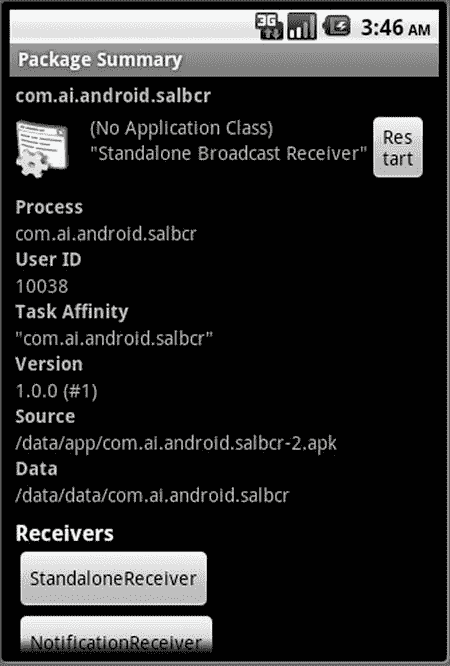
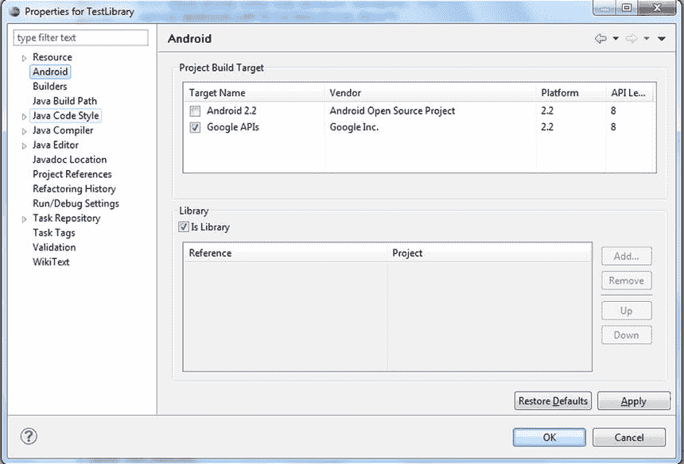
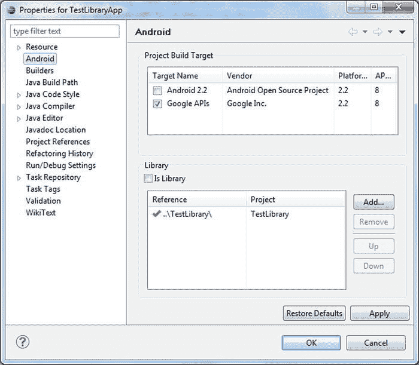
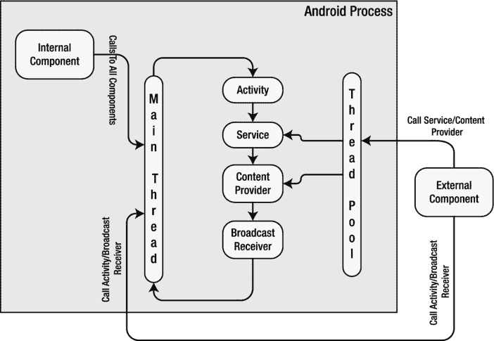
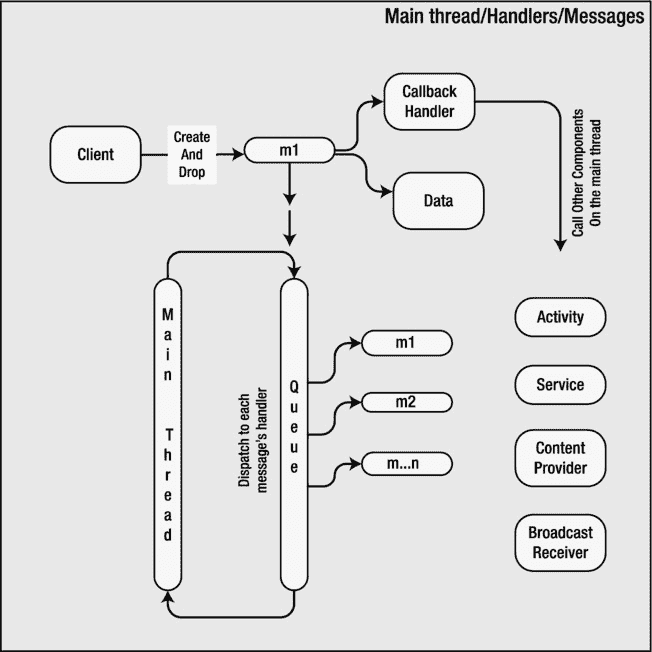

# 十三、探索包、进程、线程和处理器

在本书中，我们已经关注了如何为 Android 平台编程的要点。在这一章中，我们想深入探讨一下 Android 程序的进程和线程模型。这个讨论将引导我们对包进行签名，在包之间共享数据，使用编译时库，Android 组件的性质以及它们如何使用线程，最后是对处理器的需求以及如何编写处理器。

当你阅读这一章时，请记住“包”这个词已经用得太多了。有时它指的是 Java 语言包，有时它指的是 Android 应用部署为的 APK 文件。

了解包和过程

我们将从 Android 包和流程模型开始。当你在 Android 中开发一个应用时，你最终会得到一个。apk 文件。你签这个。apk 文件并将其部署到设备上。每个。apk 文件由一个惟一的 java 语言风格的包名惟一标识，如清单 13-1 中的清单文件所示。

***清单 13-1*** 。在清单文件中提供包名

```java
<manifest xmlns:android="[`schemas.android.com/apk/res/android`](http://schemas.android.com/apk/res/android)"
      package="com.androidbook.testapp"
      ...>
      ...rest of the xml nodes
</manifest>
```

如果您是这个包的开发者，那么一旦这个应用被部署，除了您之外，没有人能够更新它。Android 应用包名称是为您保留的。当你在不同的应用发行商那里注册你的应用时，就会发生这种捆绑。因此，选择这个 Android 应用包的名称非常类似于 Java 包的命名方式。这需要是世界上独一无二的。一旦发布了应用，就不能更改此包名称，因为它定义了应用的身份。

Android 使用包名作为运行这个包的组件的进程名。Android 还为这个进程分配了一个唯一的用户 id。这个用户 ID 实际上是底层 Linux 操作系统的用户 ID。由于此用户 ID 是在特定设备上安装时确定的，因此在安装应用的每个设备上都会有所不同。您可以通过 Android 模拟器中的开发人员工具查看已安装软件包的详细信息来发现这些信息。例如，已安装浏览器应用的包详细信息屏幕看起来像图 13-1 。(请注意，在不同的版本中，您查找的图像或工具可能会有所不同。图 13-1 中的图片取自 Android 模拟器上的开发者工具应用。)



图 13-1 。安卓包详情

图 13-1 显示了由清单文件中的 Java 包名和分配给该包的唯一用户 ID 所指示的进程名。这个进程或包创建的任何资源都将在这个 Linux 用户 ID 下得到保护。该屏幕还列出了该包中的组件。组件的例子有活动、服务和广播接收器。请注意，此图像可能会因 Android 版本而异。通过设备或模拟器的设置，您还可以卸载软件包，以便可以删除它。

因为进程与包名相关联，而包名与其签名相关联，所以签名在保护属于包的数据方面起着一定的作用。包通常用自签名 PKI(公钥基础设施)证书签名。证书识别包的作者是谁。这些证书不需要由证书颁发机构颁发。这意味着证书中的信息未经任何权威机构批准或验证。这意味着人们可以创建一个证书，表明他们的名字是谷歌。唯一的保证是，如果之前没有人在市场上要求该包名称，则该包名称将保留给该用户，并且对该包的任何后续更新将仅提供给该用户(由该证书标识)。

通过该包安装或创建的所有资产都属于其 ID 被分配给该包的用户。如果您的意图是允许一组依赖于一组公共数据的协作应用，那么您可以选择显式地指定一个对您来说是唯一的并且对您的需求来说是公共的用户 ID。这个共享用户 ID 也在清单文件中定义，类似于包名的定义。清单 13-2 显示了一个例子。

***清单 13-2*** 。共享用户 ID 声明

```java
<manifest xmlns:android="[`schemas.android.com/apk/res/android`](http://schemas.android.com/apk/res/android)"
      package="com.androidbook.somepackage"
      sharedUserId="com.androidbook.mysharedusrid"
      ...
>
...the rest of the xml nodes
</manifest>
```

如果多个应用共享相同的签名(用相同的 PKI 证书签名)，则它们可以指定相同的共享用户 ID。拥有一个共享的用户 ID 允许多个应用共享数据，甚至在同一个进程中运行。为了避免共享用户 id 的重复，请使用类似于命名 Java 类的约定。以下是 Android 系统中共享用户 id 的一些例子:

```java
"android.uid.system"
"android.uid.phone"
```

**注意**共享 ID 必须指定为原始字符串，而不是字符串资源。

注意，如果您计划使用共享用户 id，建议从一开始就使用它们。否则，当您将应用从非共享用户 ID 升级到共享用户 ID 时，它们就不能很好地工作。其中一个被引用的原因是，由于用户 id 的改变，Android 将不会在旧资源上运行 chown 。

用于共享数据的代码模式

本节探讨两个应用通过使用共享用户 ID 来共享资源和数据的机会。在运行时，每个包的资源和数据由该包的上下文拥有和保护。您需要访问想要从中共享资源或数据的包的上下文。

您可以在任何现有的上下文对象(比如您的活动)上使用 createPackageContext()API 来获取对您想要与之交互的目标上下文的引用。清单 13-3 提供了一个例子。

***清单 13-3*** 。使用 createPackageContext()API

```java
//Use the appropriate try/catch to detect errors
//Identify package you want to use
String targetPackageName="com.androidbook.samplepackage1";

//Decide on an appropriate context flag
int flag=Context.CONTEXT_RESTRICTED;

//Get the target context through one of your activities
//Need to catch NameNotFoundException
Activity myContext = ......;
Context targetContext =
         myContext.createPackageContext(targetPackageName, flag);

//Use context to resolve file paths
Resources res = targetContext.getResources();
File path = targetContext.getFilesDir();
```

请注意我们如何能够获得对给定包名的上下文的引用，比如 com . androidbook . sample package 1。清单 13-3 中的目标上下文与应用启动时传递给目标应用的上下文相同。正如方法名所示(在其“create”前缀中)，每个调用都返回一个新的上下文对象。然而，文档向我们保证，这个返回的上下文对象被设计成轻量级的，这意味着它不会消耗很多内存，并且被优化为引用目标包的资源、资产和代码。

无论两个上下文是否共享一个用户 ID，该 API 都适用。如果您共享用户 ID，那当然很好。如果不共享用户 ID，目标应用将需要声明外部用户可以访问它的资源。

CONTEXT_RESTRICTED 标志表示您感兴趣的只是加载资源和资产，而不是代码。因此，使用这个标志允许系统检测布局是否包含对回调代码的引用。回调的一个例子是布局中的一个按钮，该按钮引用一个将被调用的方法。此回调代码存在于源上下文中。因此，您可能希望系统抛出一个异常，这样您就可以检测到该情况或者忽略该特定的 XML 标记。本质上，您是在告诉系统，您在受限的意义上使用上下文，并且目标上下文可以基于该标志自由地做出合适的假设。底线似乎是，如果您不想使用来自目标上下文的代码，就使用这个标志。

CONTEXT_INCLUDE_ 代码 允许你在运行时将 Java 类从目标上下文加载到你的进程中，并调用该代码。文档表明，如果加载代码不安全，您可能会收到安全异常。但是，不清楚在什么情况下代码被认为是不安全的。一个有根据的猜测是，目标上下文没有与源上下文共享的用户 ID。您可以通过同时指定 CONTEXT_IGNOR_SECURITY 和 CONTEXT_INCLUDE_CODE 来克服这个限制。这两个标志一起始终将目标上下文代码加载到源上下文代码中，即使目标上下文属于不同的用户，也会被忽略。尽管代码是借用的，并在客户端进程中运行，但它对目标上下文数据没有权限。因此，请确保代码在您的数据上释放时会做什么。这种方法通常用于可以共享的工具代码。

了解图书馆项目

当我们谈论共享代码和资源时，一个值得问的问题是,“库”项目的想法有帮助吗？从 ADT 0.9.7 Eclipse 插件开始，Android 支持库项目的思想。从那时起，构建库的方法已经有了一些改变，而中心思想仍然保留在所有最近的版本中。

库项目是 Java 代码和资源的集合，看起来像一个常规的 Android 项目，但绝不会以结束。apk 文件本身。相反，一个库项目的代码和资源成为另一个项目的一部分，并被编译到主项目的中。apk 文件。由于库纯粹是一个编译时概念，每个开发工具可能会以不同的方式创建这个工具。

以下是关于这些图书馆项目的一些其他事实:

*   一个库项目可以有自己的不同于主应用的包名。
*   库项目可以使用其他 JAR 文件。
*   Eclipse ADT 将把库 Java 源文件编译成一个 JAR 文件，然后用应用项目编译这个 JAR 文件。
*   除了 Java 文件(它变成了一个 jar 文件)之外，属于一个库项目的其余文件(比如资源)都保存在库项目中。为了编译包含库作为依赖项的应用项目，库项目是必需的。
*   从 SDK Tools 15.0 开始，为库项目在其各自的 R.java 文件中生成的资源 id 不是最终的。(这将在本章后面解释。)
*   库项目和主项目都可以通过各自的 R.java 文件访问库项目中的资源。这意味着 ID 名称是重复的，并且在两个 R.java 文件中都可用。
*   如果您想区分两个项目(library 和 main)之间的资源 id，您可以使用不同的资源前缀，例如库项目资源的 lib_ 。
*   主项目可以引用任意数量的库项目。
*   需要在目标主项目清单文件中定义库的组件，如活动。完成后，库包中的组件名必须用库包名完全限定。
*   没有必要在库清单文件中定义组件，尽管快速了解它支持哪些组件可能是一个好的做法。
*   创建一个库项目首先要创建一个常规的 Android 项目，然后在其属性窗口中选择 Is Library 标志。
*   您也可以通过项目属性屏幕设置主项目的从属库项目。
*   显然，作为一个库项目，任何数量的主项目都可以包含一个库项目。
*   从发行版(Android 4.4、API 19、SDK Tools 19、ADT 22.3)开始，一个库项目不能引用另一个库项目，尽管似乎希望在未来的发行版中能够这样做。

要创建一个库项目，首先要创建一个常规的 Android 项目。建立项目后，右键单击项目名称，然后单击属性上下文菜单，显示库项目的属性对话框。该对话框如图 13-2 中的所示。(此图中可用的构建目标可能因您的 Android SDK 版本而异。)只需从该对话框中选择 Is Library，将该项目设置为库项目。



图 13-2 。将项目指定为库项目

你可以使用下面的项目属性对话框(见图 13-3 )来表明一个主项目依赖于先前创建的库项目。



图 13-3 。声明库项目依赖关系

请注意对话框中的“添加”按钮。你可以用这个来添加图 13-3 中的库作为参考。你不需要做任何其他事情。

一旦库项目被设置为主应用项目的依赖项，库项目就会作为编译后的 JAR 文件出现在应用项目的节点 Android Dependencies 下。

Android 不会将库中的 R.class 文件打包到各自的 jar 文件中。相反，它依赖于源文件【R.java】,该文件被重新创建并在每个库的主应用项目中可用。这意味着在主项目的 gen 子目录中，每个库都有一个 R.java 文件。

为了避免库的编译源代码中出现硬编码的常量，Android 创建了库 R.java 文件，使得该文件中的所有常量都是非最终的。在主项目的最终编译过程中，会分配新的常数值，以便这些常数值在所有库和主项目中是唯一的。如果我们在库编译期间给定了最终的常量值，那么这些数字可能会在库之间发生冲突。给定名称集的唯一 id 分配必须一次性完成。一旦这些数字在主项目的编译期间被分配给 IDs，它们就可以成为该主项目中的最终数字。

库的 R.java 文件中的 id 不是最终的，这一事实暗示了这一点。通常使用开关语句来响应基于菜单项 ID 的菜单项。如果 id 不是最终的，那么在库代码中完成时，这个语言构造将在编译时失败。这是因为 switch 子句中的 case 语句必须是一个数字常量。

所以，清单 13-4 中的 switch 语句不会编译，除非 id(如 R.id.menu_item_1 )是实际的文字数字或静态的终结符。

***清单 13-4*** 。示例 switch 语句演示非最终变量

```java
switch(menuItem.getItemId()) {
   case R.id.menu_item_1:
        Statement1;
        break;
   case 0x7778888: // as an example for R.id.menu_item_2:
       statement;
       statement;
       break;
   default:
       statement;
       statement;
}
```

因为 id 被定义为非最终的库项目，我们被迫使用 if/else 语句，而不是 switch/case 子句。因为从库的 R.java 文件中重新创建的相同常量是最终的，所以你可以在你的最终项目中自由使用开关子句。

如您所见，库项目是编译时构造。显然，任何属于这个库的资源都会被吸收并合并到主项目中。不存在运行时共享的问题，因为只有一个包文件与主包同名。简而言之，库提供了一种在编译时在相关项目之间共享资源的方式。

了解组件和线程

我们从这一章开始，确定每个包在它自己的进程中运行。我们现在将解释这个过程中线程的组织。这将引导我们为什么我们需要处理器来卸载主线程的工作，并与主线程通信。

Android 应用中的大多数代码都运行在组件的上下文中，比如一个活动或一个服务。大多数时候，一个 Android 进程中只有一个线程在运行，称为主线程。我们将讨论在不同组件之间共享这个主线的含义。首先，这可能导致应用不响应(ANR)消息(“A”代表“应用”，而不是“烦人”)。我们将向您展示当需要长时间运行的操作时，如何使用处理器、消息和线程来打破对主线程的依赖。

Android 流程有四种主要的组件类型:活动、服务、内容提供者和广播接收者。您在 Android 应用中编写的大多数代码都是这些组件之一的一部分，或者由这些组件之一调用。在 Android 项目清单文件中的应用节点规范下，每个组件都有自己的 XML 节点。回想一下，清单 13-5 中的这些节点是:

***清单 13-5*** 。如何在清单文件中声明组件

```java
<manifest...>
  <application>
     <activity/>
     <service/>
     <receiver/>
     <provider/>
  </application>
</manifest>
```

除了一些例外(比如对内容提供者的外部进程调用)，Android 使用相同的线程来处理(或运行)这些组件中的代码。这个线程被称为应用的主线程。当调用这些组件时，调用可以是同步调用，例如当您调用内容提供者获取数据时，也可以是通过消息队列的延迟调用，例如当您通过调用启动服务或显示对话框来调用功能时。

图 13-4 描述了螺纹和这四个部件之间的关系。这张图展示了线程是如何在 Android 框架及其组件中交织的。该图没有指出线可能穿过各种部件的顺序。该图仅仅示出了处理以连续的方式从一个组件继续到另一个组件。



图 13-4 。 Android 组件和线程框架

如图 13-4 所示，主螺纹做重提升。它通过使用消息队列贯穿所有组件。当您在设备屏幕上选择菜单或按钮时，设备会将这些操作转换为消息，并将其放在处于焦点的流程的主队列中。主线程位于一个循环中，处理每条消息。如果任何消息超过 5 秒左右，Android 就会抛出一条 ANR 消息。

同样，在响应菜单项时，如果您要调用广播消息，Android 会再次在包进程的主队列中删除一条消息，注册的接收者将从该包进程中被调用。主线程将在以后调用该消息来调用接收方。主线程也为广播接收器工作。如果主线程忙于响应菜单动作，广播接收器将不得不等待，直到主线程被释放。

服务也是如此。当您从一个菜单项用 activity . start service 启动一个本地服务时，一条消息被放到主队列中，主线程将通过服务代码来处理它。

对本地内容供应器的调用略有不同。对于本地调用，内容提供者仍然在主线程上运行，但是对它的调用是同步的，并且不使用消息队列。

你可能会问，“为什么 Android 应用中的大部分代码运行在主线程或其他线程上很重要？”这很重要，因为主线程有责任回到它的队列，以便 UI 事件得到响应。因此，您不应该阻塞主线程。如果有些事情要花五秒以上的时间，你应该在一个单独的线程中完成它，或者通过请求主线程在它从其他处理中释放出来时返回来推迟它。

当流程之外的外部客户端或组件调用内容提供者获取数据时，会从线程池中为该调用分配一个线程。连接到服务的外部客户端也是如此。

让我们在下一节看看什么是处理器以及它们是如何工作的。

了解处理器

我们简单地提到了如果需要的话，推迟一个主线程的工作的想法。这是通过处理器完成的。处理器在 Android 中被广泛使用，所以主 UI 线程不会被阻塞。它们还在与其他派生工作线程中的主线程进行通信时发挥作用。

处理器是一种在主队列(更准确地说，是附加到处理器在其上被实例化的线程的队列)上丢弃消息的机制，以便该消息可以在稍后的时间点被循环线程处理。被丢弃的消息有一个指向丢弃它的处理器的内部引用。

当主线程开始处理该消息时，它通过 handler 对象上的回调方法调用丢弃该消息的处理器。这个回调方法叫做 handleMessage 。图 13-5 展示了处理器、消息和主线程之间的关系。



图 13-5 。处理器、消息、消息队列关系

图 13-5 展示了当我们谈论处理器时，一起工作的关键角色:主线程、主线程队列、处理器和消息。在这四种方法中，我们没有直接暴露给主线程或队列。我们主要处理 h 和 l 对象和 m 消息对象。即使在这两者之间，h 和 ler 对象协调大部分工作。

虽然处理器允许我们将消息放到队列中，但实际上是消息对象保存了对处理器的引用。m 消息对象也保存了一个可以传递回处理器的数据结构。

通过一个例子可以更好地理解处理器和消息。例如，我们将有一个调用一个函数的菜单项，该函数依次以一秒的间隔执行一个动作五次，并且每次都向调用活动报告。

如果我们不介意阻塞主线程，我们可以像清单 13-6 中的伪代码一样编写这个场景。

***清单 13-6*** 。 用睡眠法压着主线程

```java
public class SomeActivity  {
    ....other methods
    void respondToMenuItem()    {
        //Prove that we are on the main thread
        Utils.logThreadSignature();
        //simulate an operation that takes longer than 5 seconds
        for (int i=0;i<6;i++)      {
            sleepFor(1000);// put main thread to sleep for 1 sec
            dosomething();
            SomeTextView.setText("did something. Counter:" + Integer.toString(i));
         }
   }
}
```

这将满足用例的需求。然而，如果我们这样做了，我们就抓住了主线，我们保证会有一个 ANR。我们可以使用一个处理器来避免前面例子中的 ANR。通过一个处理器来做这件事的伪代码将看起来像清单 13-7 中的。

***清单 13-7*** 。从主线程实例化一个处理器

```java
void respondToMenuItem(){
    SomeHandlerDerivedFromHandler myHandler =
                 new SomeHandlerDerivedFromHandler();
    myHandler.doDeferredWork(); //invoke a function in 1 sec intervals
    //note that doDeferredWork() is not part of the SDK
    //we will show you the code for this shortly
}
```

现在，调用 respontomenuitem()将允许主线程返回到它的循环中。实例化的处理器知道它是在主线程上被调用的，并将自己挂接到队列上。方法 doDeferredWork() 将调度工作，以便主线程一旦空闲就可以回到这个工作。

为了研究这个协议，让我们来看看正确的处理器的实际源代码。下一节清单 13-8 中的代码演示了这个处理器，它被称为 DeferWorkHandler 。在前面清单 13-7 的伪代码中，指示的处理器 SomeHandlerDerivedFromHandler 相当于这个 DeferWorkHandler 。类似地，在清单 13-8 中的 DeferWorkHandler 上实现了(清单 13-7 中的 doDeferredWork() )所示的方法。

***清单 13-8*** 。DeferWorkHandler 源代码

```java
public class DeferWorkHandler extends Handler  {
    //Keep track of how many times we sent the message
    private int count = 0;

    //A parent driver activity we can use to inform of status.
    private TestHandlersDriverActivity parentActivity = null;

    //During construction we take in the parent driver activity.
    public DeferWorkHandler(TestHandlersDriverActivity inParentActivity){
        parentActivity = inParentActivity;
    }
    //Callback method that gets called by the main thread
    @Override
    public void handleMessage(Message msg)     {
        //Use the message object to get to its data
        String pm = new String("message called:" + count + ":" +
                msg.getData().getString("message"));
        //you can access the parent activity and invoke UI calls on it here
        parentActivity.someControl.somemethod(); //example only

        //logic to invoke itself multiple times if needed
        if (count > 5)      {
            return;
        }
        count++; //increment count
        sendTestMessage(1); //reinvoke again by sending a message
    }
    //method called by the client
    public void doDeferredWork()    {
        count = 0;
        sendTestMessage(1);
    }
    //Preparing and sending the message
    public void sendTestMessage(long interval)    {
        Message m = this.obtainMessage();
        prepareMessage(m);
        this.sendMessageDelayed(m, interval * 1000);
    }
    public void prepareMessage(Message m)    {
        Bundle b = new Bundle();
        b.putString("message", "Hello World");
        m.setData(b);
        return ;
    }
}
```

让我们来看看这段源代码的关键方面。第一个是处理器是从基类 h 和 ler 派生的。在处理器的构造函数中，我们使用一个指向父活动的指针，这样我们就可以使用活动的 UI 控件来报告需要报告的内容或需要采取的行动。然后我们编写一个方法( doDeferredWork )来封装这个处理器要为我们做什么。请注意， doDeferredWork ()不是一个被覆盖的方法，您可以随意调用这个方法。正是在这种方法中，您使用消息来最终调用被覆盖的 handleMessage ()。此外，正是在这个 handleMessage ()中，您实际上放置了最初从主线程推迟的真正代码。

基本处理器提供了一系列方法来将消息发送到队列，以便稍后进行响应。这些方法在 doDeferredWork ()中使用。 sendMessage() 和 sendMessageDelayed() 是这些发送方法的两个例子。我们在示例中使用的 sendMessageDelayed() ，允许我们以给定的时间延迟在主队列中丢弃一条消息。相反，当主线程找到消息时，sendMessage() 会立即丢弃该消息进行处理。

当您调用 sendMessage() 或 sendMessageDelayed() 时，您将需要 mmessage 对象的一个实例。最好是你让处理器给你，因为当处理器返回 m 消息对象时，它把自己藏在 m 消息的肚子里。这样，当主线程出现时，它就知道只根据消息调用哪个处理器。在清单 13-8 中，使用以下代码获得消息:

```java
Message m = this.obtainMessage();
```

这个引用的变量是 handler 对象实例。顾名思义，该方法不创建新消息，而是从全局消息池中获取一个消息。稍后，一旦该消息被处理，它将被回收。方法获得消息() 的变化如清单 13-9 所示。

***清单 13-9*** 。通过处理器构造消息

```java
obtainMessage();
obtainMessage(int what);
obtainMessage(int what, Object object);
obtainMessage(int what, int arg1, int arg2)
obtainMessage(int what, int arg1, int arg2, Object object);
```

每个方法变体都在消息对象上设置相应的字段。当消息跨越流程边界时，对 object 参数有一些限制。在这种情况下，需要打包。在这种情况下，在消息对象上显式使用 setData() 方法要安全得多，也更兼容，该方法需要一个包。在清单 13-8 中，我们使用了 setData() 。如果您打算传递的是可以用整数值容纳的简单指示符，鼓励您使用 arg1 或 arg2 来代替。

参数 what (在清单 13-9 中)允许您将消息出队或查询队列中是否有这种类型的消息。详见 h 和 ler 类的操作。

一旦我们从处理器获得消息，我们就可以有选择地修改该消息的数据内容。在我们的例子中，我们使用了 setData() 函数，将它传递给一个 Bundle 对象。在我们对消息的数据进行分类或识别后，我们可以通过 sendMessage() 或 sendMessageDelayed() 将消息发送到队列中。当调用这些方法时，主线程将返回到队列中。

一旦消息被发送到队列，处理器就会等待(形象地说)直到主线程检索到这些消息并调用处理器的 handleMessage() 。

如果您想更清楚地看到这个处理器和主线程的交互，您可以在发送消息时和在 handleMessage() 回调中编写一个 logcat 消息。您会注意到时间戳有所不同，因为主线程会多花几毫秒的时间返回到 handleMessage() 方法。

在我们的示例中，每个 handleMessage() 在处理完一条消息后，将另一条消息发送到队列，以便可以再次调用它。它这样做五次，当计数器达到 5 时，它停止向队列发送消息。这是将工作分成多个块的一种方法，尽管有更好的方法来完成这个任务，要么通过一个工人线程，要么通过一个类 AsyncTask 。基本的 异步任务将在下一章讨论。现在让我们简要地介绍一下显式工作线程选项。

使用工作线程

当我们使用上一节中的处理器时，代码仍然在主线程上执行。对 handleMessage() 的每个调用仍然应该在主线程规定的时间内返回(换句话说，每个消息调用应该在五秒钟内完成，以避免应用不响应)。如果您的目标是进一步延长执行时间，您将需要启动一个单独的线程，保持该线程运行，直到它完成工作，并允许该子线程向运行在主线程上的主活动报告。这种类型的子线程通常称为工作线程。

在响应菜单项时启动一个单独的线程是很容易的。然而，巧妙的方法是允许工作线程向主线程的队列发送一条消息，告知正在发生某件事情，并且主线程应该在到达该消息时查看该消息。在非 UI 线程上调用 UI 方法也是错误的。因此，您将需要这个绑定到主线程的处理器来从工作线程调用 UI 方法。

涉及工作线程的合理解决方案如下:

1.  响应菜单项时，在主线程中创建一个处理器。放在一边。
2.  创建一个单独的线程(工作线程)来完成实际的工作。将步骤 1 中的处理器传递给工作线程。该处理器允许工作线程与主线程通信。
3.  工作线程代码现在可以在超过五秒的时间内完成实际工作，并且在完成工作的同时，可以调用处理器来发送状态消息，以便与主线程进行通信。
4.  这些状态消息现在由主线程处理，因为处理器属于主线程。主线程可以在工作线程工作的同时处理这些消息。

您可以在本章的可下载项目中看到这个交互的示例代码。从工作线程与 UI 线程通信的另一种可能更直接的方式是获取活动指针并调用方法 activity . runonuithread(Runnable action)。当然，您需要创建一个可运行的对象来进行协调。

参考

以下是一些有用的链接，可以进一步加深你对本章的理解:

*   [`developer . Android . com/guide/publishing/app-signing . html`](http://developer.android.com/guide/publishing/app-signing.html):签约必读。apk 文件。
*   [`developer . Android . com/guide/developing/projects/projects-eclipse . html`](http://developer.android.com/guide/developing/projects/projects-eclipse.html):Android 库初级 SDK 参考。
*   [【http://developer.android.com/guide/topics/fundamentals.html】](http://developer.android.com/guide/topics/fundamentals.html):SDK 参考 Android 组件生命周期。
*   :浅显易懂地介绍数字签名的含义。
*   :我们对安卓包的理解研究。你会看到如何签名。 apk 文件，更多关于如何在软件包间共享数据的链接，更多关于共享用户 id，以及安装和卸载软件包的说明。
*   :我们对 Android 库支持各个方面的研究笔记，包括旧的截屏、新的截屏、有用的 URL、样本代码等等。
*   [`Android-developers . blogspot . com/2011/10/changes-to-library-projects-in-Android . html`](http://android-developers.blogspot.com/2011/10/changes-to-library-projects-in-android.html):Android 4.0 的时候图书馆有什么变化，变化的原因是什么？这个博客还谈到了与图书馆合作的未来方向。
*   :对非最终变量的作用以及它们如何影响 switch 语句的精辟讨论。
*   :SDK 工具和 ADT 版本中已知问题的 Android 文档。还要注意这个 URL 的域名；这个网站致力于 Android 工具的各个方面。
*   [`docs . Oracle . com/javase/7/docs/technotes/tools/windows/keytool . html`](http://docs.oracle.com/javase/7/docs/technotes/tools/windows/keytool.html):关于 keytool 、 jarsigner 以及签名过程本身的优秀文档。
*   :与本书相关的可下载项目列表。对于这一章，寻找一个名为 pro Android 5 _ Ch13 _ testandroidlibraries . zip 的文件。这个 ZIP 文件包含两个项目:一个是库，另一个使用这个库。还可以看看一个名为 pro Android 5 _ Ch13 _ test handlers . zip 的项目，它包含了处理包括工作线程在内的处理器的代码。

摘要

本章简要介绍了 Android 应用中的包、进程、组件和线程是如何交互的。本章还记录了库对在多个应用之间共享资源的支持。本章还介绍了处理器，这是 Android SDK 中的一个关键概念。在下一章中，我们将详细介绍 AsyncTask ，它将工作线程和处理器组合成一个更简单的编程抽象来使用。