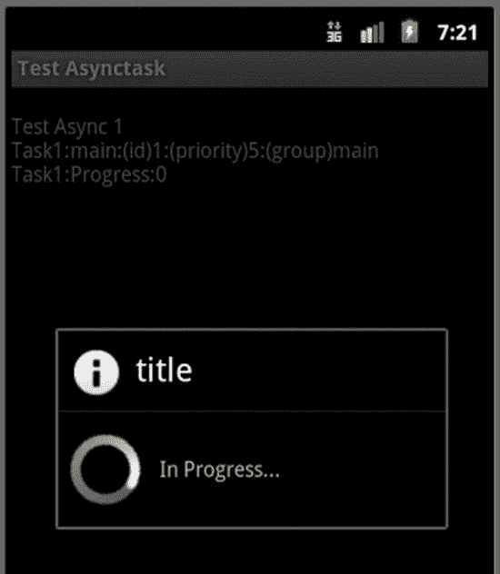
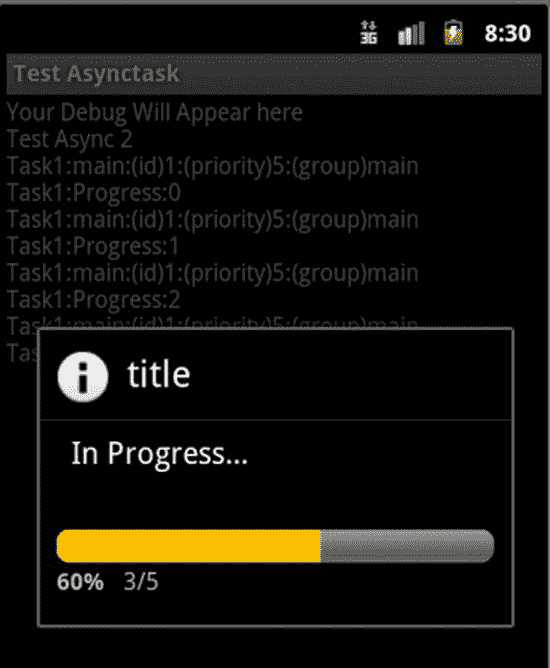
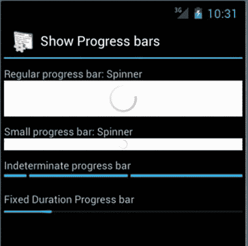

# 十五、高级异步任务和进度对话框

在第十三章中，我们介绍了处理器和工作线程来运行长时间运行的任务，同时主线程保持 UI 的有序。Android SDK 已经认识到这是一种模式，并将处理器和线程细节抽象成一个名为 AsyncTask 的工具类。您可以使用 AsyncTask 在 UI 环境中运行耗时超过 5 秒的任务。(我们将在第十六章的“长时间运行的接收器和服务”中讲述如何运行真正长时间运行的任务，从几分钟到几小时不等。)

本章将从一个异步任务 的基础开始，转到显示进度对话框和进度条所需的代码，这些对话框和进度条能正确显示一个异步任务的状态，即使设备改变了它的配置。让我们通过清单 15-1 中的伪代码来介绍异步任务。

***清单 15-1*** 。活动对异步任务的使用模式

```java
public class MyActivity  {
    void respondToMenuItem()    { //menu handler
       performALongTask();
    }
    void performALongTask()    { //using an AsyncTask
        //Derive from an AsyncTask, and Instantiate this AsyncTask
        MyLongTask myLongTask = new MyLongTask(...CallBackObjects...);
        myLongTask.execute(...someargs...); //start the work on a worker thread
        //have the main thread get back to its UI business
    }

    //Hear back from the AsyncTask
    void someCallBackFromAsyncTask(SomeParameterizedType x)    {
        //Although invoked by the AsyncTask this code runs on the main thread.
        //report back to the user of the progress
    }
}
```

使用一个 AsyncTask 首先从扩展 AsyncTask 开始，就像清单 15-1 中的 MyLongTask 一样。一旦实例化了 AsyncTask 对象，就可以对该对象调用 execute() 方法。 execute() 方法在内部启动一个单独的线程来完成实际的工作。 AsyncTask 实现将依次调用多个回调来报告任务的开始、任务的进度和任务的结束。清单 15-2 显示了扩展一个 AsyncTask 的伪代码以及需要被覆盖的方法。(请注意，这是伪代码，不打算编译。添加@override 注释是为了显式声明它们是从基类中重写的。)

***清单 15-2*** 。扩展 AsyncTask:示例

```java
public class MyLongTask extends AsyncTask<String,Integer,Integer> {
    //... constructors stuff
    //Calling execute() will result in calling all of these methods
    @Override
    void onPreExecute(){} //Runs on the main thread

    //This is where you do all the work and runs on the worker thread
    @Override
    Integer doInBackground(String... params){}

    //Runs on the main thread again once it finishes
    @Override
    void onPostExecute(Integer result){}

    //Runs on the main thread
    @Override
    void onProgressUpdate(Integer... progressValuesArray){}
    //....other methods
}
```

在主线程上调用清单 15-1 中的 execute() 方法。这个调用将触发清单 15-2 中的一系列方法，从 onPreExecute() 开始。在主线程上也调用了 onPreExecute() 。您可以使用此方法来设置执行任务的环境。您还可以使用此方法来设置一个对话框或启动一个进度条，以向用户指示工作已经开始。在完成 onPreExecute() 之后， execute() 方法将返回，活动的主线程继续其 UI 职责。到那时， execute() 将会产生一个新的工作线程，因此 doInBackground() 方法被调度在该工作线程上执行。在这个 doInBackground() 方法中，你将完成所有繁重的工作。因为这个方法运行在一个工作线程上，所以主线程不受影响，您也不会得到“应用没有响应”的消息。从 doInBackground() 方法中，您可以调用 onprogress update()来报告进度。这个 onProgressUpdate() 方法在主线程上运行，这样您就可以影响主线程上的 UI。

简单 AsyncTask 的要点

让我们进入扩展 AsyncTask 的细节。 AsyncTask 类使用泛型为其方法提供类型安全，包括被覆盖的方法。当您查看 AsyncTask 类的部分定义(清单 15-3 )时，您可以看到这些泛型。(请注意清单 15-3 是 AsyncTask 类的一个极其精简的版本。它实际上只是客户端代码最常用的接口元素。)

***清单 15-3*** 。快速浏览一下 AsyncTask 类的定义

```java
public class AsyncTask<Params, Progress, Result> {
    //A client will call this method
    AsyncTask<Params, Progress, Result>    execute(Params... params);

    //Do your work here. Frequently triggers onProgressUpdate()
    Result doInBackGround(Params... params);

    //Callback: After the work is complete
    void onPostExecute(Result result);

    //Callback: As the work is progressing
    void onProgressUpdate(Progress... progressValuesArray);
}
```

研究清单 15-3 ，可以看到 AsyncTask (通过泛型)在扩展时需要以下三个参数化类型( Params 、 Progress 和 Result )。让我们简单解释一下这些类型:

*   Params(execute()方法的参数类型):当扩展 AsyncTask 时，您需要指出您将传递给 execute() 方法的参数类型。如果您说您的 Params 类型是字符串，那么 execute() 方法将期望在它的调用中有任意数量的由逗号分隔的字符串，例如 execute(s1，s2，s3) 或 execute(s1，s2，s3，s4，s5) 。
*   Progress (进度回调方法的参数类型):该类型指示在通过回调 onProgressUpdate(Progress)报告进度时传递回调用者的值的数组...。传递进度值数组的能力允许对任务的多个方面进行监控和报告。例如，如果一个 AsyncTask 正在处理多个子任务，就可以使用这个特性。
*   Result (用于通过 onPostExecute() 方法报告结果的类型):该类型表示通过回调 onpost execute(Result final Result)作为执行的最终结果返回的返回值的类型。

现在知道了一个 AsyncTask 所需的泛型类型，假设我们为我们特定的 AsyncTask 决定了以下参数:Params :一个字符串，结果:一个 int，Progress :一个整数。然后，我们可以声明一个扩展的 AsyncTask 类，如清单 15-4 所示。

***清单 15-4*** 。扩展通用 AsyncTask 到具体类型

```java
public class MyLongTask
extends AsyncTask<String,Integer,Integer>
{
    //...other constructors stuff
    //...other methods
    //Concrete methods based on the parameterized types
    protected Integer doInBackground(String... params);
    protected void onPostExecute(Integer result);
    protected void onProgressUpdate(Integer... progressValuesArray);

    //....other methods
}
```

请注意清单 15-4 、 MyLongTask 中的这个具体类是如何消除类型名的歧义并得到类型安全的函数签名的。

实现您的第一个异步任务

现在让我们来看看一个简单但完整的 MyLongTask 的实现。我们已经充分注释了清单 15-5 中的代码，指出哪些方法运行在哪个线程上。还要注意 MyLongTask 的构造函数，它接收调用上下文(通常是一个活动)的对象引用，以及一个特定的简单接口，如 IReportBack 来记录进度消息。

IReportBack 接口对于您的理解并不重要，因为它只是一个日志的包装器。对于工具类也是如此。你可以在本章的两个可下载项目中看到这些额外的类。可下载项目的 URL 位于本章末尾的参考资料部分。清单 15-5 显示了 MyLongTask 的完整代码。

***清单 15-5*** 。实现 AsyncTask 的完整源代码

```java
//The following code is in MyLongTask.java (ProAndroid5_Ch15_TestAsyncTask.zip)
//Use menu item: Test Async1 to invoke this code
public class MyLongTask extends AsyncTask<String,Integer,Integer>
{
    IReportBack r; // an interface to report back log messages
    Context ctx;   //The activity to start a dialog
    public String tag = null;  //Debug tag
    ProgressDialog pd = null;  //To start, report, and stop a progress dialog

    //Constructor now
    MyLongTask(IReportBack inr, Context inCtx, String inTag)   {
        r = inr;  ctx = inCtx;  tag = inTag;
    }
    //Runs on the main ui thread
    protected void onPreExecute()    {
        Utils.logThreadSignature(this.tag);
        pd = ProgressDialog.show(ctx, "title", "In Progress...",true);
    }
    //Runs on the main ui thread. Triggered by publishProgress called multiple times
    protected void onProgressUpdate(Integer... progress)  {
        Utils.logThreadSignature(this.tag);
        Integer i = progress[0];
        r.reportBack(tag, "Progress:" + i.toString());
    }
    protected void onPostExecute(Integer result)     {
        //Runs on the main ui thread
        Utils.logThreadSignature(this.tag);
        r.reportBack(tag, "onPostExecute result:" + result);
        pd.cancel();
    }
    //Runs on a worker thread. May even be a pool if there are more tasks.
    protected Integer doInBackground(String...strings)    {
        Utils.logThreadSignature(this.tag);
        for(String s :strings)        {
            Log.d(tag, "Processing:" + s);
        }
        for (int i=0;i<3;i++)        {
            Utils.sleepForInSecs(2);
            publishProgress(i); //this calls onProgressUpdate
        }
        return 1; //this value is then passed to the onPostExecute as input
    }
}
```

在简要介绍了客户端如何使用(或调用) MyLongTask 之后，我们将深入研究清单 15-5 中强调的每一个方法的细节。

调用异步任务

一旦我们实现了类 MyLongTask ，客户端将会使用这个类，如清单 15-6 所示。

***清单 15-6*** 。调用异步任务

```java
//You will find this class AsyncTester.java(ProAndroid5_Ch15_TestAsyncTask.zip)
//Use menu item: Test Async1 to invoke this code
void respondToMenuItem() {
   //An interface to log some messages back to the activity
   //See downloadable project if you need the details.
   IReportBack reportBackObject = this;
   Context ctx = this;   //activity
   String tag = "Task1"; //debug tag

   //Instantiate and execute the long task
   MyLongTask mlt = new MyLongTask(reportBackObject,ctx,tag);
   mlt.execute("String1","String2","String3");
}
```

注意 execute() 方法是如何在清单 15-6 中被调用的。因为我们已经将其中一个泛型类型指定为一个字符串，并且 execute() 方法接受该类型的可变数量的参数，所以我们可以将任意数量的字符串传递给 execute() 方法。在清单 15-6 的例子中，我们传递了三个字符串参数。你可以根据需要或多或少地通过。

一旦我们在 AsyncTask 上调用了 execute() 方法，这将导致调用 onPreExecute() 方法，然后调用 doInBackground() 方法。一旦 doInBackground() 方法完成，系统也将调用 onPostExecute() 回调。关于这些方法是如何实现的，请参考清单 15-5 。

了解 onPreExecute()回调和进度对话框

回到 MyLongTask 实现在清单 15-5 中，在 onPreExecute() 方法中，我们启动了一个进度对话框来指示任务正在进行中。图 15-1 显示了该对话框的图像。(使用菜单项 Test Async1 从项目下载 pro Android 5 _ Ch15 _ testasync task . zip 调用该视图。)



图 15-1 。与异步任务交互的简单进度对话框

显示进度对话框的代码段(取自清单 15-5 )在清单 15-7 中重现。

***清单 15-7*** 。显示不确定的进度对话框

```java
pd = ProgressDialog.show(ctx, "title", "In Progress...",true);
```

变量 pd 已经在构造函数中声明了(见清单 15-5 )。清单 15-7 中的这个调用将创建一个进度对话框，并显示如图 15-1 所示。清单 15-7 中 show() 方法的最后一个参数表示对话框是否不确定(对话框是否可以预先估计有多少工作量)。我们将在后面的章节中讨论确定性的情况。

**注意**可靠地显示异步任务的进度是相当复杂的。这是因为一个活动可以来来去去，要么是因为配置改变，要么是因为另一个 UI 优先。我们将在本章的后面讨论这个基本需求和解决方案。

了解 doInBackground()方法

由 AsyncTask 执行的所有后台工作都在 doInBackground() 方法中完成。这个方法由 AsyncTask 编排，在一个工作线程上运行。因此，这项工作被允许花费超过五秒钟，不像在主线程上完成的工作。

在清单 15-5 的例子中，在 doInBackground() 方法中，我们简单地检索任务的每个输入字符串，就好像它们是一个数组。在这个方法定义中，我们没有定义一个显式的字符串数组。然而，这个函数的单个参数被定义为变长参数，如清单 15-8 所示。

***清单 15-8*** 。 doInBackground() 方法签名

```java
protected Integer doInBackground(String...strings)
```

然后，Java 将参数视为函数内部的数组。因此，在我们的代码中的 doInBackground() 方法中，我们读取每个字符串并记录它们，以表明我们知道它们是什么。然后，我们等待足够长的时间来模拟长时间运行的操作。因为这个方法运行在一个工作线程中，所以我们不能从这个工作线程访问 Android 的 UI 功能。例如，你不能直接更新任何视图，即使你可以从这个线程访问它们。你甚至不能在这里发祝酒辞。接下来的两种方法可以让我们克服这个问题。

通过 publishProgress()触发 onProgressUpdate()

在 doInBackground() 方法中，可以通过调用 publishProgress() 方法来触发 onProgressUpdate() 。被触发的 onProgressUpdate() 方法然后在主线程上运行。这允许 onProgressUpdate() 方法适当地更新 UI 元素，比如视图。也可以从这里发祝酒辞。在清单 15-5 中，我们简单地记录了一条消息。一旦所有的工作都完成了，我们从 doInBackground() 方法返回一个结果代码。

了解 onPostExecute()方法

来自 doInBackground() 方法的结果代码然后被传递给 onPostExecute() 回调方法。这个回调也在主线程上执行。在这个方法中，我们告诉进度对话框关闭。在主线程上，您可以不受限制地访问该方法中的任何 UI 元素。

升级到确定性进度对话框

在清单 15-5 的的前一个例子中，我们使用了一个进度对话框(图 15-1 )，它并没有告诉我们工作的哪一部分已经完成。这个进度对话框称为不确定进度对话框。如果您在这个进度对话框中将不确定属性设置为 false ，您将看到一个进度对话框，它会逐步跟踪进度。如图 15-2 中的所示。(使用菜单项“Test Async2”从项目下载中调用该视图 pro Android 5 _ Ch15 _ testasynctask . zip .)



图 15-2 。显示明确进度的进度对话框，与异步任务交互

清单 15-9 显示了来自清单 15-5 的前一个任务，它被重写以将进度对话框的行为改变为确定性进度对话框。我们还添加了一个 onCancelListener 来查看我们是否需要在取消对话框时取消任务。用户可以点击图 15-2 中的后退按钮取消对话框。代码的关键部分在清单 15-9 中给出(完整代码见下载文件 pro Android 5 _ Ch15 _ testasynctask . zip)。

***清单 15-9*** 。利用确定性进度对话框的长任务

```java
//Following code is in MyLongTask1.java(ProAndroid5_Ch15_TestAsyncTask.zip)
//Use menu item: Test Async2 to invoke this code
public class MyLongTask1 extends AsyncTask<String,Integer,Integer>
implements OnCancelListener
{
    //..other code taken from Listing 15-5
    //Also refer to the java class MyLongTask1.java in the downloadable project
    //for full code listing.
    protected void onPreExecute()    {
         //....other code
        pd = new ProgressDialog(ctx);
        pd.setTitle("title");
        pd.setMessage("In Progress...");
        pd.setCancelable(true);
        pd.setOnCancelListener(this);
        pd.setIndeterminate(false);
        pd.setProgressStyle(ProgressDialog.STYLE_HORIZONTAL);
        pd.setMax(5);
        pd.show();
    }
    public void onCancel(DialogInterface d)    {
        r.reportBack(tag,"Cancel Called");
        this.cancel(true);
    }
    //..other code taken from Listing 15-5
}
```

注意我们是如何准备清单 15-9 中的进度对话框的。在这种情况下，我们没有使用静态方法 show() ，这与我们在进度对话框的清单 15-5 中所做的相反。相反，我们显式地实例化了进度对话框。变量 ctx 代表 UI 进度对话框运行的上下文(或活动)。然后我们单独设置对话框的属性，包括它的确定性或不确定性行为。方法 setMax() 表示进度对话框有多少步。当取消被触发时，我们还将自身引用( AsyncTask 本身)作为监听器传递。在取消回调中，我们在 AsyncTask 上显式发出一个取消。如果我们用布尔参数 false 调用 cancel() 方法，它将尝试停止工作线程。布尔参数真将强制停止工作线程。

异步任务和线程池

考虑清单 15-10 中的代码，其中一个菜单项一个接一个地调用两个 AsyncTasks 。

***清单 15-10*** 。调用两个长期运行的任务

```java
void respondToMenuItem() {
    MyLongTask mlt = new MyLongTask(this.mReportTo,this.mContext,"Task1");
    mlt.execute("String1","String2","String3");

    MyLongTask mlt1 = new MyLongTask(this.mReportTo,this.mContext,"Task2");
    mlt1.execute("String1","String2","String3");
}
```

这里我们在主线程上执行两个任务。你可能会认为这两项任务开始的时间很接近。但是，默认行为是，这些任务使用从线程池中抽出的单个线程按顺序运行。如果想要并行执行，可以在 AsyncTask 上使用 executeOnExecutor() 方法。有关此方法的详细信息，请参见 SDK 文档。同样根据 SDK 文档，在单个 AsyncTask 上多次调用 execute() 方法是无效的。如果您想要这种行为，您必须实例化一个新任务并再次调用 execute() 方法。

正确显示异步任务进度的问题和解决方案

如果你学习这一章的主要目标是学习 AsyncTask 的基本知识，那么我们到目前为止所学的已经足够了。然而，当一个 AsyncTask 与一个进度对话框配对时，会出现一些问题，如前面的清单所示。其中一个问题是当设备旋转时， AsyncTask 将丢失正确的活动参考，从而也丢失了它对进度对话框的参考。另一个问题是，我们在前面代码中使用的进度对话框不是托管对话框。现在让我们来理解这些问题。

处理活动指针和设备轮换

当由于配置改变而重新创建活动时，由 AsyncTask 持有的活动指针变得陈旧。这是因为 Android 创建了一个新的活动，旧的活动不再显示在屏幕上。因此，抓住旧的活动及其对应的对话框不放是不好的，原因有两个。首先，用户看不到异步任务试图更新的活动或对话。第二个原因是旧的活动需要进行垃圾收集，而您正在阻止它进行垃圾收集，因为 AsyncTask 正在保留它的引用。如果您聪明地对旧活动使用 Java 弱引用，那么您不会泄漏内存，但会得到一个空指针异常。陈旧指针不仅适用于活动指针，也适用于间接指向活动的任何其他指针。

有两种方法可以解决过时的活动引用问题。推荐的方法是使用无头保留片段。(片段在第八章有所涉及。保留片段是由于配置更改而重新创建活动时保留下来的片段。这些片段也被称为无头的，因为它们不一定要保存任何 UI。)解决陈旧活动指针的另一种方法是使用来自活动的保留对象回调。我们将介绍这两种解决陈旧活动指针问题的方法。

处理托管对话

即使我们能够解决过时的活动引用问题并重新建立与当前活动的连接，本章迄今为止使用进度对话框的方式仍存在缺陷。我们已经直接实例化了一个进度对话框。以这种方式创建的 ProgressDialog 不是一个“受管理的”对话框。如果它不是托管对话，则当设备经历旋转或任何其他配置更改时，该活动将不会重新创建该对话。因此，当设备旋转时，异步任务仍然不间断地运行，但是对话框不会显示。也有几种方法可以解决这个问题。建议不要使用进度对话框，而是在活动本身中使用嵌入式 UI 控件，比如进度条。因为进度条是活动视图层次结构的一部分，所以希望它能被重新创建。虽然进度条听起来不错，但有时模式进度对话框更有意义。例如，如果您不希望用户在 AsyncTask 运行时与活动的任何其他部分进行交互，就会出现这种情况。在这些情况下，我们发现使用片段对话框代替进度条并没有什么矛盾。

现在是我们进入解决方案来处理活动引用问题和托管对话框问题的时候了。我们将提出三种不同的解决方案。第一种使用保留对象和片段对话框。第二种使用了无头保留片段和片段对话框。第三种解决方案使用无头的保留片段和进度条。

行为良好的进度对话框的测试场景

在本章的三个解决方案中，无论您使用哪一个来正确显示 AsyncTask 的进度对话框，该解决方案都应该在以下所有测试场景中工作:

1.  如果不改变方向，进度对话框必须开始，显示其进度，结束，并清除对 AsyncTask 的引用。这必须重复工作，以显示没有从以前的运行留下痕迹。
2.  解决方案应该在任务执行过程中处理方向变化。旋转应该会重新创建对话框，并在它停止的地方显示进度。该对话框应正确结束并清除异步任务参考。这必须反复进行，以显示没有留下任何痕迹。
3.  任务开始运行时，应禁用背面。
4.  即使任务正在执行中，也应该允许回家。
5.  回家重访活动要显示对话框，正确反映当前进度，进度绝对不能小于之前的进度。
6.  当任务在返回之前完成时，回家并重新进行活动也应该有效。应该正确关闭该对话框，并删除 AsyncTask 引用。

这组测试用例应该总是为所有处理异步任务的活动执行。既然我们已经列出了每个解决方案应该如何满足，让我们从第一个解决方案开始，这个解决方案使用保留对象和片段对话框。

使用保留对象和片段对话框

在第一个解决方案中，让我们向您展示如何使用保留的对象和片段对话框来正确显示 AsyncTask 的进度。该解决方案包括以下步骤:

1.  活动必须通过其 onRetainNonConfigurationInstance()回调来跟踪外部对象。这个外部对象必须保留下来，并且在活动关闭并返回时验证其引用。这就是这个对象被称为保留对象的原因。这个被保留的对象既可以是 AsyncTask 对象本身，也可以是一个保存对 AsyncTask 的引用的中间对象。让我们称之为根保留的活动相关对象(或根 RADO)。它被称为“根”是因为 onRetainNonConfigurationInstance()只能使用一个保留的对象引用。
2.  然后，根 RADO 将有一个指向异步任务的指针，并且可以随着活动的到来和结束，设置和重置异步任务上的活动指针。因此，这个根 RADO 充当活动和 AsyncTask 之间的中介。
3.  然后, AsyncTask 将实例化一个片段进度对话框，而不是一个普通的非托管进度对话框。 AsyncTask 将使用由根 RADO 设置的活动指针来完成这一任务，因为您将需要一个活动来创建一个包含片段对话框的片段。
4.  活动将在对话片段旋转时重新创建对话片段，并适当地保持其状态，因为对话片段是受管理的。只要活动被设置并且可用， AsyncTask 就可以在片段对话框上增加进度。请注意，这个对话片段本身不是保留片段。它作为活动生命周期的一部分被重新创建。
5.  片段对话框可以进一步禁止取消，这样当 AsyncTask 正在进行时，用户不能从对话框返回到活动。
6.  然而，用户可以通过点击 Home 并使用其他应用来回家。这将把我们的活动以及与之相关的对话推到后台。这件事必须处理。当用户返回到活动或应用时，对话框可以继续显示进度。如果任务在活动隐藏时完成，AsyncTask 必须知道如何关闭片段对话框。作为一个片段对话框，如果活动不在前台，关闭此对话框将引发无效状态异常。因此，AsyncTask 必须等到活动重新打开并处于正确的状态时才能关闭对话框。

探索相应的关键代码片段

我们现在将展示用于实现所概述的方法的关键代码片段。其余的实现可以在本章的可下载项目 proandroid 5 _ Ch15 _ testasynctaskswithconfigchanges . zip 中找到。由于这个问题的所有解决方案都要求对话框是一个片段对话框，以便可以管理这个对话框，清单 15-11 首先给出了这个片段对话框的源代码。

[](#_list11)*清单 15-11。将 ProgressDialog 封装在 DialogFragment 中*

```java
//The following code is in ProgressDialogFragment.java
//(ProAndroid5_Ch15_TestAsyncTaskWithConfigChanges.zip)
/**
 * A DialogFragment that encapsulates a ProgressDialog.
 * This is not expected to be a retained fragment dialog.
 * Gets re-created as activity rotates following any fragment protocol.
 */
public class ProgressDialogFragment extends DialogFragment  {
    private static String tag = "ProgressDialogFragment";
    ProgressDialog pd; //Will be set by onCreateDialog

    //This gets called from ADOs such as retained fragments
    //typically done when activity is attached back to the AsyncTask
    private IFragmentDialogCallbacks fdc;
    public void setDialogFragmentCallbacks(IFragmentDialogCallbacks infdc)  {
        Log.d(tag, "attaching dialog callbacks");
        fdc = infdc;
    }

    //This is a default constructor. Called by the framework all the time
    //for reintroduction.
    public ProgressDialogFragment()    {
        //Should be safe for me to set cancelable as false;
        //wonder if that is carried through rebirth?
        this.setCancelable(false);
    }
    //One way for the client to attach in the beginning when the fragment is reborn.
    //The reattachment is done through setFragmentDialogCallbacks
    //This is a shortcut. Your compiler if enabled for lint may throw an error.
    //You can use the newInstance pattern and setbundle (see the fragments chapter)
    public ProgressDialogFragment(IFragmentDialogCallbacks infdc)    {
        this.fdc = infdc;
        this.setCancelable(false);
    }
    /**
     * This can get called multiple times each time the fragment is
     * re-created. So storing the dialog reference in a local variable should be safe
     */
    @Override
    public Dialog onCreateDialog(Bundle savedInstanceState)    {
        Log.d(tag,"In onCreateDialog");
        pd = new ProgressDialog(getActivity());
        pd.setTitle("title");
        pd.setMessage("In Progress...");
        pd.setIndeterminate(false);
        pd.setProgressStyle(ProgressDialog.STYLE_HORIZONTAL);
        pd.setMax(15);
        return pd;
    }
    //Called when the dialog is dismissed.I should tell my corresponding task
    //to close or do the right thing! This is done through call back to fdc
    //fdc: fragment dialog callbacks could be the Task, or Activity or the rootRADO
    //See Listing 15-12 to see how FDC is implemented by the task
    @Override
    public void onDismiss(DialogInterface dialog)    {
        super.onDismiss(dialog);
        Log.d(tag,"Dialog dismissed");
        if (fdc != null)        {
            fdc.onDismiss(this, dialog);
        }
    }
    @Override
    public void onCancel(DialogInterface dialog)    {
        super.onDismiss(dialog);
        Log.d(tag,"Dialog cancelled");
        if (fdc != null)    {
            fdc.onCancel(this, dialog);
        }
    }
    //will be called by a client like the task
    public void setProgress(int value)    {
        pd.setProgress(value);
    }
}
```

清单 15-11 中的代码展示了如何将一个常规的非托管 ProgressDialog 包装在一个托管片段对话框中。我们扩展一个 DialogFragment 并覆盖它的 onCreateDialog() 以返回 ProgressDialog 对象。除了这个基本特性之外，我们还增加了监视进度对话框何时关闭或取消的功能。我们还在包装的类上提供了一个 setProgress() 方法来调用内部 ProgressDialog 上的 setProgress() 。您可以在可下载的项目(proandroid 5 _ Ch15 _ testasynctaskwithconfigchanges . zip)中看到 IFragmentDialogCallbacks 的源代码，因为它对于理解这个片段进度对话框并不重要。

现在让我们看看 AsyncTask 如何创建和控制这个片段进度对话框。为了帮助理解，清单 15-12 给出了异步任务的伪代码。有关完整的源代码，请参考可下载的项目。

***清单 15-12*** 。使用片段进度对话框的 AsyncTask 的伪代码

```java
//The following code is in MyLongTaskWithRADO.java
//(ProAndroid5_Ch15_TestAsyncTaskWithConfigChanges.zip)
//You can start this task through menu item: Flip Dialog with ADOs
public class MyLongTaskWithRADO extends AsyncTask<String,Integer,Integer>
implements IRetainedADO, IFragmentDialogCallbacks
{
    //....other code
    @Override public void onPreExecute()    {
        //....other code
        //get the activity as it would have been set by the root RADO
        Activity act = this.getActivity();

        //Create the progress diaolg
        ProgressDialogFragment pdf = new ProgressDialogFragment();
        //the show method will add and commit the fragment dialog
        pdf.show(act.getFragmentManager(), this.PROGRESS_DIALOG_FRAGMENT_TAG_NAME);
    }
    @Override public void onProgressUpdate()    {
        //if activity is available, get the fragment dialog from it
        //call setProgress() on it
        //otherwise ignore the progress
    }
    @Override public void onPostExecute()    {
        //if activity is in a good state
        //dismiss the dialog and tell the root RADO to drop the pointer to the AsyncTask
        //if not remember it through a flag to close it when you come back
    }
    @Override public void attach()    {
        //called when the activity is back
        //check to see if you are done
        //if so dismiss the dialog and remove yourself from the RADO
        //if not continue to update the progress
    }
}
```

因为这个 AsyncTask 实现了保留的活动相关对象( IRetainedADO )的思想，它知道活动何时可用，何时不可用。它还知道活动的状态，比如 UI 是否准备好了。尽管实现活动相关对象(ado)需要一些代码，但这并不是一个难懂的概念。出于篇幅考虑，我们将这个问题留给您来研究可下载的项目 pro Android 5 _ Ch15 _ testasynktaskwithconfigchanges。zip 看看这是怎么做到的。

这个清单 15-12 中的 AsyncTask 也接管了它的片段对话框的管理，这样它就像一个内聚的单元，从而不会因为这个 AsyncTask 的细节而污染主活动。清单 15-12 中的另一个关键细节是当 AsyncTask 结束时对话框关闭时会发生什么。此时，如果活动是隐藏的，或者由于旋转而不存在，那么在重新创建活动时关闭对话框是很重要的。为此， onPostExecute() 会记住 AsyncTask 的最后状态，无论它是已完成还是正在进行。这个 AsyncTask 然后等待 attach() 方法，当 UI 就绪活动被重新附加到这个 ADO 时，该方法被调用。一旦进入 attach() 方法， AsyncTask 就可以关闭片段对话框。

你可以下载名为 pro Android 5 _ Ch15 _ testasynctaskswithconfigchanges . zip 的项目，看看清单 15-12 中呈现的交互是如何完全实现的。

与使用保留片段相比，这种使用保留对象的特殊方法有点复杂。但它的优雅之处在于，使用 ADOs 的思想以更通用的形式解决了这个问题，不管它们是片段还是其他。我们在参考资料部分提供了概述这一想法并提供背景的链接。至此，让我们把注意力转向我们的第二个解决方案中推荐的保留片段的想法。

使用保留片段和片段对话框

在第二个解决方案中，我们将坚持使用片段对话框，但是我们将使用无头保留片段，而不是简单的保留对象。Android 不赞成保留对象，而支持保留片段。在 Android 中，保留的对象只是一个对象，没有跟踪活动状态的内置功能。(这就是为什么我们必须在顶层发明 ADOs 的框架。)随着 Android 后续版本中片段的引入，这一缺陷不复存在。尽管片段紧密地编织在 UI 的结构中，但是它们也可以在没有 UI 的情况下存在。这些被称为无头片段。除了能够跟踪活动的状态，片段也可以被保留，就像保留的对象一样。

概述保留片段的方法

这个解决方案中的方法是使用一个无头的保留片段作为锚，在活动和异步任务之间进行通信。这种方法的主要方面如下:

1.  继续使用片段进度对话框，就像之前的解决方案一样。
2.  让活动创建一个无头保留片段，该片段保存一个指向 AsyncTask 的指针。这个无头的保留片段取代了前面解决方案中的保留对象。作为一个保留的片段，当用一个新的指针重新创建活动时，片段对象仍然存在。然后，AsyncTask 总是依赖保留的片段来检索最新的活动指针。
3.  AsyncTask 依赖于被告知活动状态的无头保留片段来完成前面解决方案中指出的所有测试用例。

探索相应的关键代码片段

在之前的解决方案中，我们已经向您展示了片段对话框的代码。由于我们在这个解决方案中继续使用同一个对象，我们将关注保留片段，以及 AsyncTask 如何通过保留片段使用片段对话框。

在我们在下载中提供的示例程序(proandroid 5 _ Ch15 _ testasynctaskwithconfigchanges . zip)中，我们将保留片段称为 AsyncTesterFragment 。清单 15-13 显示了这个类的伪代码，它展示了，除了别的以外，是什么使这个类成为一个无头片段。

***清单 15-13*** 。无头片段的伪代码

```java
//The following code is in AsyncTesterFragment.java
//(ProAndroid5_Ch15_TestAsyncTaskWithConfigChanges.zip)
//You can start this task through menu item: Flip Dialog with Fragment
public class AsyncTesterFragment
```

**扩展片段(或从片段派生的另一个对象){**

```java
   //No need to override the key onCreateView() method
   //which otherwise would have returned a view loaded from a layout.
   //Thus having no View makes this fragment a headless fragment

   //Use this name to register with the activity
   public static String FRAGMENT_NAME="AsyncTesterRetainedFragment";

   //Local variable for the asynctask. You can use a menu to start work on this task
   //Nullify this reference when the asynctask finishes
   MyLongTaskWithFragmentDialog taskReference;

   //Have an init method to help with inheritance
   public void init(arg1, arge2, etc) {
       super.init(arg1,...); //if there is one
       setArguments(....); //or pass the bundle to the super init
   }
   public static AsyncTesterFragment newInstance(arg1, arg2, ...){
       AsyncTesterFragment f = new AsyncTesterFragment();
       f.init(arg1,arg2,...);
   }
   //have more static methods to create the fragment, locate the fragment etc.
}
```

清单 15-13 中的代码有三点值得一提。由于没有覆盖 onCreateView() ，这个片段变成了一个无头片段。因为片段是使用默认构造函数重新创建的，所以我们遵循了 newInstance() 模式，并扩展了该模式以使用 init() 方法，这些方法可以是虚拟的，也可以是继承的。如果您在更深层次中扩展片段类，后一种方法是有用的。

清单 15-14 显示了这个 AsyncTesterFragment 对象上的一个静态方法，它可以创建这个片段，让它保持它的状态，然后用活动注册它。

***清单 15-14*** 。将片段注册为保留片段

```java
//The following code is in AsyncTesterFragment.java
//(ProAndroid5_Ch15_TestAsyncTaskWithConfigChanges.zip)
//You can start this task through menu item: Flip Dialog with Fragment
public static AsyncTesterFragment createRetainedAsyncTesterFragment(Activity act) {
    AsyncTesterFragment frag = AsyncTesterFragment.newInstance();
    frag.setRetainInstance(true);
    FragmentManager fm = act.getFragmentManager();
    FragmentTransaction ft = fm.beginTransaction();
    ft.add(frag, AsyncTesterFragment.FRAGMENT_TAG);
    ft.commit();
    return frag;
}
```

一旦这个保留的片段在活动中可用，它可以在任何时候被检索，并被要求启动一个 AsyncTask 。清单 15-15 显示了 AsyncTask 的伪代码，它能够与这个保留的片段交互来控制片段对话框

***清单 15-15*** 。通过保留片段使用片段对话的异步任务

```java
//The following code is in MyLongTaskWithFragment.java
//(ProAndroid5_Ch15_TestAsyncTaskWithConfigChanges.zip)
//You can start this task through menu item: Flip Dialog with Fragment
public class MyLongTaskWithFragment extends AsyncTask<String,Integer,Integer> {
    //...other code
    //The following reference passed in and set from the constructor
    AsyncTesterFragment retainedFragment;

    //....other code
    @Override protected void onPreExecute()    {
        ....other code
        //get the activity from the retained fragment
        Activity act = retainedFragment.getActivity();
        //Create the progress dialog
        ProgressDialogFragment pdf = new ProgressDialogFragment();
        //the show method will add and commit the fragment dialog
        pdf.show(act.getFragmentManager(), this.PROGRESS_DIALOG_FRAGMENT_TAG_NAME);
    }
    @Override protected void onProgressUpdate()    {
        //if activity is available, get the fragment dialog from it, call setProgress() on it
        //otherwise ignore the progress
    }
    @Override protected void onPostExecute()    {
        //if activity is in a good state
        //dismiss the dialog and tell the root RADO to drop the pointer to the AsyncTask
        //if not remember it through a flag to close it when you come back
    }
    @Override public void attach()    {
        //called when the activity is back. check to see if this task is done
        //if so dismiss the dialog and remove yourself from the retained fragment
        //if not continue to update the progress
    }
    @Override protected Integer doInBackground(String...strings)
    {
       //Do the actual work here which occurs on a separate thread
    }
}
```

清单 15-15 中的 AsyncTask 的行为很像使用保留对象的 AsyncTask。一旦这个任务知道了如何从保留的片段中访问进度对话框片段，设置进度就非常简单了。和以前一样，这个任务也需要知道活动何时被重新附加，以防任务提前完成。如果发生这种情况， AsyncTask 需要记住这一点，并在重新挂接时关闭对话框。清单 15-15 中的伪代码满足了前面列出的所有测试条件。

这就结束了我们的第二个解决方案。现在让我们转到第三个解决方案，我们将使用进度条而不是进度对话框来显示一个 AsyncTask 的进度。

使用保留的片段和进度条

关于 progress dialog()的 Android SDK 文档建议我们在许多场景中使用 ProgressBar 作为更好的实践。据称的原因是进度条不太打扰，因为它允许与活动的其他区域进行交互。像进度对话框一样，进度条的持续时间可以是不确定的，也可以是固定的。也可以是连续旋转的圆，也可以是单杠。您可以通过查找进度条的文档找到这些模式。清单 15-16 给出了一个布局文件中进度条样式的快速纲要。

***清单 15-16*** 。在布局文件中设置进度条样式的不同方法

```java
//The following code is in spb_show_progressbars_activity_layout.xml
//(ProAndroid5_Ch15_TestAsyncTaskWithConfigChanges.zip)
//You can see these progress bars through menu item: Show Progress bars
<!--  A regular progress bar - A large spinning circle -->
<ProgressBar
    android:id="@+id/tpb_progressBar1"
    android:layout_width="match_parent"
    android:layout_height="wrap_content"
    android:background="@android:color/background_light"/>

<!--  Small spinning circle -->
<ProgressBar
    android:id="@+id/tpb_progressBar4"
    style="?android:attr/progressBarStyleSmall"
    android:layout_width="match_parent"
    android:layout_height="wrap_content"
    android:background="@android:color/background_light"/>

<!--  Horizontal indefinite Progress bar: a line -->
<ProgressBar
    android:id="@+id/tpb_progressBar3"
    style="?android:attr/progressBarStyleHorizontal"
    android:layout_width="match_parent"
    android:layout_height="wrap_content"
    android:indeterminate="true"
    />

 <!--  Horizontal fixed duration Progress bar: a line -->
 <ProgressBar
    android:id="@+id/tpb_progressBar3"
    style="?android:attr/progressBarStyleHorizontal"
    android:layout_width="match_parent"
    android:layout_height="wrap_content"
    android:indeterminate="false"
    android:max="50"
    android:progress="10"
    />
```

图 15-3 显示了清单 15-16 中显示的进度条布局在加载到活动中时的样子。每种类型的进度条都有标签来指示其模式或行为。(使用菜单项显示进度条从项目下载 proandroid 5 _ Ch15 _ testasynktaskswithconfigchanges . zip .调用该视图)



图 15-3 。安卓进度条示例

概述 ProgressBar 方法

通过进度条报告异步任务进度的方法类似于之前使用保留的无头片段和片段进度对话框的方法。

1.  与前面的解决方案一样，让活动创建一个无头保留片段，该片段保存一个指向 AsyncTask 的指针。
2.  在活动布局中嵌入进度条。 AsyncTask 会通过无头保留片段到达这个进度条。
3.  AsyncTask 依赖于被告知活动状态的无头保留片段来完成前面指出的所有测试用例。

遍历相应的关键代码片段

让我们浏览一下让这个解决方案工作所需的关键代码片段。让我们从局部变量开始， AsyncTask 持有这些变量来与保留的片段和活动进行交互(清单 15-17 )。

[](#_list17)*清单 15-17。AsyncTask 的局部变量使用 ProgressBar*

```java
//The following code is in MyLongTaskWithProgressBar.java
//(ProAndroid5_Ch15_TestAsyncTaskWithConfigChanges.zip)
//You can start this task through menu item: Test ProgressBar
public class MyLongTaskWithProgressBar
extends AsyncTask<String,Integer,Integer>
implements IWorkerObject
{
    public String tag = null;    //Debug tag
    private MonitoredFragment retainedFragment; //Reference to the retained fragment
    int curProgress = 0; //To track current progress
....
```

清单 15-18 显示了 AsyncTask 启动时如何初始化进度条。

***清单 15-18*** 。初始化进度条

```java
//Part of MyLongTaskWithProgressBar.java
private void showProgressBar()    {
    Activity act = retainedFragment.getActivity();
    ProgressBar pb = (ProgressBar) act.findViewById(R.id.tpb_progressBar1);
    pb.setProgress(0);
    pb.setMax(15);
    pb.setVisibility(View.VISIBLE);
}
```

清单 15-19 显示了 AsyncTask 在定位后如何在进度条上设置进度。

***清单 15-19*** 。在进度条上设置进度

```java
//Part of MyLongTaskWithProgressBar.java
private void setProgressOnProgressBar(int i) {
    this.curProgress = i;
    ProgressBar pbar = getProgressBar();
    if (pbar == null)   {
        Log.d(tag, "Activity is not available to set progress");
        return;
    }
    pbar.setProgress(i);
}
```

定位活动的方法 getProgressBar() 相当简单；您只需使用 find() 方法来定位进度条视图。如果活动由于设备旋转而不可用，则进度条引用将为空，我们将忽略设置进度。清单 15-20 显示了 AsyncTask 如何关闭进度条。

***清单 15-20*** 。异步任务完成时关闭进度条

```java
//Part of MyLongTaskWithProgressBar.java
private void closeProgressBar(){
    ProgressBar pbar = getProgressBar();
    if (pbar == null)    {
        Log.d(tag, "Sorry progress bar is null to close it!");
        return;
    }
    //Dismiss the dialog
    pbar.setVisibility(View.GONE);
    detachFromParent();
}
```

一旦 ProgresBar 从视图中移除，清单 15-20 中的代码通知保留的片段，它可以释放 AsyncTask 指针，如果它持有它的话。根据保留的片段如何保存这个指针，这个步骤可能需要，也可能不需要。但是告诉父类它不再需要保留它不再需要的引用是一个好的做法。因此，清单 15-21 展示了 AsyncTask 如何通知父进程它不再需要持有一个指向 AsyncTask 的指针。

***清单 15-21*** 。像保留片段一样，通知客户端 AsyncTask 的完成

```java
//To tell the called object that I, the AsyncTask, have finished
//The Activity or retained fragment can act as a client to this AsyncTask
//AsyncTask is imagined to be a WorkerObject and hence understands the IWorkerObjectClient

//MyLongTaskWithProgressBar implements IWorkerObject
//AsyncTesterFragment implements the IWorkerObjectClient

//Code below is taken from MyLongTaskWithProgressBar.java
//This implements the IWorkerObject contract
IWorkerObjectClient client = null;
int workerObjectPassbackIdentifier = -1;

public void registerClient(IWorkerObjectClient woc,
     int inWorkerObjectPassbackIdentifier) {
    client = woc;
    this.workerObjectPassbackIdentifier = inWorkerObjectPassbackIdentifier;
}
private void detachFromParent()    {
    if (client == null)        {
        Log.e(tag,"You have failed to register a client.");
        return;
    }
    //client is available
    client.done(this,workerObjectPassbackIdentifier);
}
```

利用 ProgressBar 解决方案解决关键差异

当我们使用进度条而不是进度对话框时，有一些意想不到的差异你必须知道。

最初，在布局文件中，进度条的可见性被设置为消失，从而表示异步任务甚至还没有开始的状态。一旦 AsyncTask 开始，它会将可见性设置为可见，并随后设置进度。然而，当重新创建活动时，活动的状态管理要求从 onCreate() 方法出来的控件是可见的。因为在布局中可见性被设置为消失，所以该活动不会恢复进度条状态，并且当设备旋转时您将看不到进度条。因此， AsyncTask 需要接管这个进度条状态管理的控制权，并在活动被重新附加时正确地重新初始化它。清单 15-22 展示了我们如何在 AsyncTask 代码中实现这一点。

***清单 15-22*** 。从 AsyncTask 管理 ProgressBar 状态

```java
//Taken from MyLongTaskWithProgressBar.java
//On activity start
public void onStart(Activity act) {
    //dismiss dialog if needed
    if (bDoneFlag == true)        {
        Log.d(tag,"On my start I notice I was done earlier");
        closeProgressBar();
        return;
    }
    Log.d(tag,"I am reattached. I am not done");
    setProgressBarRightOnReattach();
}
private void setProgressBarRightOnReattach()    {
    ProgressBar pb = getProgressBar();
    pb.setMax(15);
    pb.setProgress(curProgress);
    pb.setVisibility(View.VISIBLE);
}
```

清单 15-22 中的 onStart() 方法由 AsyncTask 上的保留片段调用，此时活动被重新附加到保留片段，并且该片段检测到活动的 UI 已经准备好被使用。

使用进度条的另一个区别是后退按钮的行为。与进度对话框不同，对于活动，您可能希望允许后退按钮。由于“后退”按钮完全删除了该活动，您可能希望借此机会取消该任务。清单 15-23 中的 releaseResources() 方法被保留的片段调用，当它通过监视 onDestroy() 方法中的 isFinishing() 标志检测到活动不会返回时。

***清单 15-23*** 。取消活动返回的异步任务

```java
//Taken from MyLongTaskWithProgressBar.java
public void releaseResources()    {
    cancel(true); //cancel the task
    detachFromParent(); //remove myself
}
```

本章后半部分概述的所有三种解决方案都将正确显示一个 AsyncTask 的进度。SDK 推荐的方法是使用进度条作为正确的 UI 组件来显示进度。我们对于只需要一两秒钟的快速任务的偏好是使用进度条。对于一个需要更长时间的任务——并且你不希望用户扰乱 UI 的状态——那么使用 ProgressDialog 和一个 headless retained 片段。当您的解决方案需要深层次的对象时，无论您是通过保留的片段还是通过保留的对象来使用 ADO 框架，使用 ADO 框架都会很方便。您可以在可下载的项目 pro Android 5 _ Ch15 _ testasynctaskswithconfigchanges . zip 中看到这里概述的所有解决方案的完整实现。

如果 AsyncTask 正在更新和改变状态，还需要进一步考虑。如果是这种情况，您可能希望使用后台服务，以便在进程被回收并在以后重新启动时可以重新启动它。这里介绍的方法对于快速到中等水平的阅读是足够的，因为您希望用户等待。但是，对于较长时间的读取或写入，您可能希望采用基于服务的解决方案。

参考

以下参考资料将帮助您了解本章中讨论的主题的更多信息:

*   [`developer . Android . com/reference/Android/OS/async task . html`](http://developer.android.com/reference/android/os/AsyncTask.html):明确记录 AsyncTask 行为的关键资源。
*   :再看一个乖巧的 AsyncTask 。
*   :我们在准备本章时收集的关于 AsyncTask 的研究笔记。
*   :Android 在其 API 中经常使用 Java 泛型。这个 URL 记录了 Java 泛型的一些基础知识，可以帮助您入门。
*   :正如本章所展示的，要权威性地使用 AsyncTask 你需要了解很多关于活动生命周期、片段、它们的生命周期、无头片段、配置变更、片段对话框、AsyncTask、ADOs 等等。这个网址上有许多关注这些领域的文章。
*   :ADO 是一种抽象，我们的一位作者支持它作为处理配置变更的便捷工具。这个 URL 记录了 ado 是什么以及如何使用它们，并且还提供了一个初步的实现。
*   :这个 URL 记录了使用 ProgressBar 的背景、有用的 URL、代码片段和有用的提示。
*   :这个 URL 对配置发生变化时的活动生命周期有很好的研究。
*   :要写出在设备旋转时运行良好的程序是相当困难的。这个 URL 概述了一些基本的测试案例，您必须成功运行这些案例来验证 AsyncTask。
*   [【http://www.androidbook.com/item/4673】](http://www.androidbook.com/item/4673):这个 URL 建议使用一种增强的模式来构造继承片段。
*   :了解一个片段，包括一个留存的片段，最好的方法就是用心研究它的回调。这个 URL 提供了片段的所有重要回调的文档样本代码。
*   :了解一个活动生命周期的最好方法是努力研究它的回调。这个 URL 提供了所有重要活动回调的文档样本代码。
*   :这个 URL 概述了我们对片段对话框的研究。
*   :这本书的可下载项目列表在这个 URL。对于这一章，寻找一个名为 proandroid 5 _ Ch15 _ testasynctask . zip 和 proandroid 5 _ Ch15 _ testasynctaskswithconfigchanges 的 zip 文件。后一个 zip 文件实现了行为良好的 AsyncTask 的三个解决方案。

摘要

在这一章中，除了介绍 AsyncTask 之外，我们还介绍了进度对话框、进度条、无头保留片段和 ado。阅读这一章，你不仅理解了 AsyncTask ，还能运用你对活动生命周期的理解和对片段的深刻理解。我们还记录了一组关键的测试案例，一个表现良好的 Android 应用必须满足这些案例。**