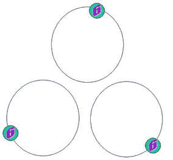
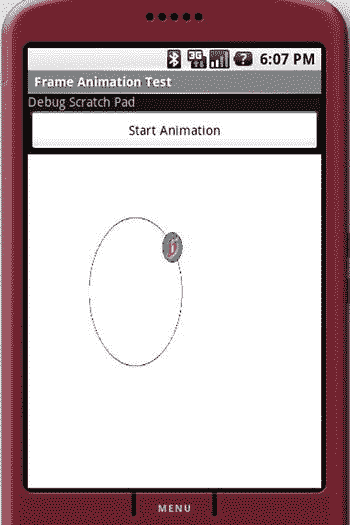
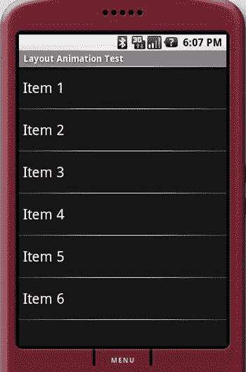
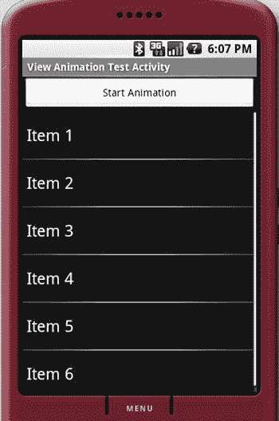
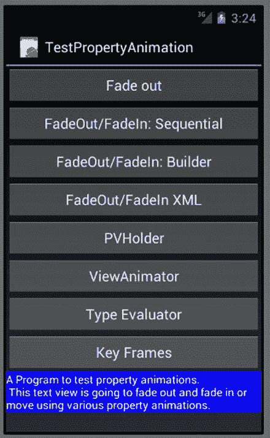

# 十八、探索 2D 动画

动画允许屏幕上的对象随时间改变其颜色、位置、大小或方向。Android 中的动画功能实用、有趣且简单。它们在应用中经常使用。

Android 2.3 及之前的版本支持三种类型的动画 :逐帧动画(frame-by-frame animation)，以固定的间隔一个接一个地绘制一系列帧时出现；布局动画，您可以在容器(如列表和表格)中动画显示视图的布局；和视图动画，其中任何视图都可以被动画化。在布局动画中，焦点不是任何给定的视图，而是视图集合起来形成复合布局的方式。Android 3.0 通过将其扩展到任何 Java 属性(包括 UI 元素的属性)来增强动画。我们将首先介绍 2.3 之前的特性，然后介绍 3.0 之后的特性。根据您的使用情况，这两种功能都适用。

探索逐帧动画

逐帧动画是一系列图像以快速间隔连续显示，最终效果是物体移动或变化。图 18-1 显示了一组圆，每个圆的不同位置都有一个球。有了这些图像中的一些(它们是帧)，你可以使用动画来让球绕着圆圈运动。



图 18-1 。动画的示例图像帧

图 18-1 中的每个圆都是一个独立的图像。给图像一个基本名称 colored_ball ，并将其中八个图像存储在 /res/drawable 子目录中，这样您就可以使用它们的资源 id 来访问它们。每个图像的名称将具有图案 coloured-ballN，其中 N 是代表图像编号的数字。我们正在计划的动画活动将看起来像图 18-2 。



图 18-2 。逐帧动画测试装具

图 18-2 中的主要控制是动画视图，显示球被放置在一个椭圆/圆上。顶部的按钮用于开始和停止动画。顶部有一个调试便笺簿，用于记录事件。清单 18-1 显示了用于创建图 18-2 中的活动的布局。

***清单 18-1*** 。帧动画示例的 XML 布局文件

```java
<?xml version="1.0" encoding="utf-8"?>
<!--
filename: /res/layout/frame_animations_layout.xml
Download: ProAndroid5_ch18_TestFrameAnimation.zip
-->
<LinearLayout xmlns:android="[`schemas.android.com/apk/res/android`](http://schemas.android.com/apk/res/android)"
    android:orientation="vertical"
    android:layout_width="fill_parent" android:layout_height="fill_parent">
<TextView android:id="@+id/textViewId1"
    android:layout_width="fill_parent"
    android:layout_height="wrap_content" android:text="Debug Scratch Pad"/>
<Button
    android:id="@+id/startFAButtonId"
    android:layout_width="fill_parent" android:layout_height="wrap_content"
    android:text="Start Animation"/>
<ImageView
    android:id="@+id/animationImage"
    android:layout_width="fill_parent" android:layout_height="wrap_content"/>
</LinearLayout>
```

第一个控件是 debug-scratch 文本控件，它是一个简单的 TextView 。然后添加一个按钮来开始和停止动画。最后一个视图是 ImageView ，用于播放动画。

在 Android 中，逐帧动画是通过类 AnimationDrawable 实现的。这个类是一个可提取的。这些对象通常用作视图的背景。 AnimationDrawable 除了是一个 Drawable 之外，还可以获取其他 Drawable 资源的列表(比如图片)并以指定的间隔渲染。要使用这个 AnimationDrawable 类，首先要有一组 Drawable 资源(例如，一组图像)放在 /res/drawable 子目录中。然后，您将使用这些图像的列表构建一个定义了 AnimationDrawable 的 XML 文件(参见清单 18-2 )。这个 XML 文件也需要放在 /res/drawable 子目录中。

***清单 18-2*** 。定义要制作动画的帧列表的 XML 文件

```java
<!--
filename: /res/drawable/frame_animation.xml
Download: ProAndroid5_ch18_TestFrameAnimation.zip
-->
<animation-list xmlns:android="[`schemas.android.com/apk/res/android`](http://schemas.android.com/apk/res/android)"
android:oneshot="false">
   <item android:drawable="@drawable/colored_ball1" android:duration="50" />
   <item android:drawable="@drawable/colored_ball2" android:duration="50" />
   <item android:drawable="@drawable/colored_ball3" android:duration="50" />
   <item android:drawable="@drawable/colored_ball4" android:duration="50" />
   <item android:drawable="@drawable/colored_ball5" android:duration="50" />
   <item android:drawable="@drawable/colored_ball6" android:duration="50" />
   <item android:drawable="@drawable/colored_ball7" android:duration="50" />
   <item android:drawable="@drawable/colored_ball8" android:duration="50" />
</animation-list>
```

每个框架都指向您通过资源 id 收集的一个彩球图像。动画列表标签被转换成代表图像集合的动画绘制对象。然后，您需要将这个 AnimationDrawable 设置为活动布局中的 ImageView 控件的背景资源。假设这个 XML 文件的文件名是 frame_animation.xml 并且它位于 /res/drawable 子目录中，您可以使用下面的代码将 AnimationDrawable 设置为 ImageView 的背景:

```java
view.setBackgroundResource(R.drawable.frame_animation); //See Listing 18-3
```

通过这段代码，Android 意识到资源 IDr . drawable . frame _ animation 是一个 XML 资源，并相应地为其构造了一个合适的 AnimationDrawable Java 对象，然后将其设置为背景。设置好之后，你可以通过对视图对象执行获取来访问这个动画绘制对象，如下所示:

```java
Object  backgroundObject = view.getBackground();
AnimationDrawable ad = (AnimationDrawable)backgroundObject;
```

一旦有了 AnimationDrawable 对象，就可以使用它的 start() 和 stop() 方法来开始和停止动画。下面是这个对象的另外两个重要方法:

```java
setOneShot(boolean);
addFrame(drawable, duration);
```

setOneShot(true) 方法运行动画一次，然后停止。 addFrame() 方法使用 Drawable 对象添加一个新帧，并设置其显示持续时间。 addFrame() 方法的功能类似于 清单 18-2 中的 XML 标签 android:drawable 。将这些放在一起，就可以得到图 18-1 中我们的逐帧动画活动的完整代码。

***清单 18-3*** 。逐帧动画测试工具的完整代码

```java
// filename: FrameAnimationActivity.java
// Download: ProAndroid5_ch18_TestFrameAnimation.zip
public class FrameAnimationActivity extends Activity {
    @Override
    public void onCreate(Bundle savedInstanceState)   {
        super.onCreate(savedInstanceState);
        setContentView(R.layout.frame_animations_layout);
        this.setupButton();
    }
    private void setupButton(){
       Button b = (Button)this.findViewById(R.id.startFAButtonId);
       b.setOnClickListener(
             new Button.OnClickListener(){
                public void onClick(View v) {animate();}
             });
    }
    private void animate()  {
        ImageView imgView = (ImageView)findViewById(R.id.animationImage);
        imgView.setVisibility(ImageView.VISIBLE);
        imgView.setBackgroundResource(R.drawable.frame_animation);

        AnimationDrawable frameAnimation = (AnimationDrawable)imgView.getBackground();
        if (frameAnimation.isRunning()) {
            frameAnimation.stop();
        }
        else {
            frameAnimation.stop();
            frameAnimation.start();
        }
    }
}//eof-class
```

清单 18-3 中的方法 animate() 在活动中定位 ImageView ，并将其背景设置为由资源 r . drawable . frame _ animation 标识的 AnimationDrawable 。这个动画资源 ID 指向清单 18-3 中早先的动画定义。该方法中的其余代码检索这个 AnimationDrawable 对象，并在该对象上调用动画方法。在同一个清单 18-3 中，设置了开始/停止按钮，如果动画正在运行，该按钮可以停止动画；如果动画没有运行，该按钮可以启动它。如果将清单 18-2 中动画定义的 oneshot 属性设置为 true ，动画会在一次后停止。

探索布局动画

LayoutAnimation 用于动画显示 Android 布局中的视图。你可以使用这种类型的动画，例如像列表视图和网格视图这样的普通布局控件。与逐帧动画不同，布局动画不是通过重复帧而是通过改变视图的变换矩阵来实现的。Android 中的每个视图都有一个将视图映射到屏幕的转换矩阵。通过更改这个矩阵，您可以实现视图的缩放、旋转和移动(平移)。这种依赖于更改属性和重绘图像的动画称为补间动画。基本上 LayoutAnimation 是布局中视图的变换矩阵的补间动画。在布局上指定的布局动画应用于该布局中的所有视图。

这些是可以应用于布局的补间动画类型:

*   缩放动画:用于沿 x 轴、y 轴或两者放大或缩小视图。您还可以指定希望动画围绕其发生的轴心点。
*   旋转动画:用于将视图围绕枢轴点旋转一定的角度。
*   平移动画:用于沿 x 轴或 y 轴移动视图。
*   Alpha 动画:用于改变视图的透明度。

这些动画在 /res/anim 子目录中被定义为 XML 文件。清单 18-4 显示了一个在 XML 文件中声明的比例动画。

***清单 18-4*** 。在位于 /res/anim/scale.xml 的 XML 文件中定义的缩放动画

```java
<set xmlns:android="[`schemas.android.com/apk/res/android`](http://schemas.android.com/apk/res/android)"
android:interpolator="@android:anim/accelerate_interpolator">
   <scale
         android:fromXScale="1"
         android:toXScale="1"
         android:fromYScale="0.1"
         android:toYScale="1.0"
         android:duration="500"
         android:pivotX="50%"
         android:pivotY="50%"
         android:startOffset="100" />
</set>
```

动画 XML 中的参数具有“from”和“to”风格，以指示该属性的开始和结束值。动画的其他属性还包括动画持续时间和时间插值器。插值器决定动画参数的变化率，如清单 18-4 中的比例。我们将很快介绍插值器。清单 18-4 中的 XML 文件可以与一个布局相关联，以动画显示该布局的组成视图。

**注意**像清单 18-4 中的比例动画在 android.view.animation 包中被表示为 Java 类。这些类的 Java 文档不仅描述了 Java 方法，还描述了每种类型的动画所允许的 XML 参数。

我们可以使用图 18-3 中的列表视图来测试一些布局动画。当您运行本章的示例项目时，您会看到这个活动。proandroid 5 _ ch18 _ testlayoutanimation . zip



图 18-3 。要制作动画的列表视图

该活动的布局在清单 18-5 中。

***清单 18-5*** 。ListView XML 布局文件

```java
<?xml version="1.0" encoding="utf-8"?>
<!--
filename: /res/layout/list_layout.xml
project: ProAndroid5_ch18_TestLayoutAnimation.zip
-->
<LinearLayout xmlns:android="[`schemas.android.com/apk/res/android`](http://schemas.android.com/apk/res/android)"
    android:orientation="vertical"
    android:layout_width="fill_parent"
    android:layout_height="fill_parent">
    <ListView
        android:id="@+id/list_view_id"
        android:layout_width="fill_parent"
        android:layout_height="fill_parent"/>
</LinearLayout>
```

清单 18-5 显示了一个简单的线性布局，其中有一个列表视图。将布局从 18-5 显示为图 18-3 的活动代码在清单 18-6 中。

***清单 18-6*** 。布局-动画活动代码

```java
//filename: LayoutAnimationActivity.java
//project: ProAndroid5_ch18_TestLayoutAnimation.zip
public class LayoutAnimationActivity extends Activity  {
    @Override
    public void onCreate(Bundle savedInstanceState)  {
        super.onCreate(savedInstanceState);
        setContentView(R.layout.list_layout);
        setupListView();
    }
    private void setupListView()  {
      String[] listItems = new String[] {
             "Item 1", "Item 2", "Item 3", "Item 4", "Item 5", "Item 6",
      };
      ArrayAdapter<String> listItemAdapter =
       new ArrayAdapter<String>(this, android.R.layout.simple_list_item_1, listItems);
      ListView lv = (ListView)this.findViewById(R.id.list_view_id);
      lv.setAdapter(listItemAdapter);
    }
}
```

现在让我们看看如何将清单 18-4 中的缩放动画应用到这个列表视图中。列表视图需要另一个 XML 文件，作为它自己和清单 18-4 中的比例动画之间的中介。这是因为清单 18-4 中定义的动画是通用的，适用于任何视图。另一方面，布局是视图的集合。因此清单 18-7 中的中介布局动画 XML 文件重用了通用动画 XML 文件，并指定了适用于视图集合的附加属性。这个中介布局动画 XML 文件如清单 18-9 所示。

***清单 18-7*** 。布局控制器 XML 文件

```java
<?xml version="1.0" encoding="utf-8"?>
<!--
filename: /res/anim/list_layout_controller.xml (ProAndroid5_ch18_TestLayoutAnimation.zip)
-->
<layoutAnimation xmlns:android="[`schemas.android.com/apk/res/android`](http://schemas.android.com/apk/res/android)"
        android:delay="100%"
        android:animationOrder="reverse"
        android:animation="@anim/scale" />
```

这个 XML 文件需要在 /res/anim 子目录中。这个 XML 文件指定列表中的动画应该反向进行，每个项目的动画应该以相对于总动画持续时间 100%的延迟开始。100%的持续时间确保一个项目的动画在下一个项目的动画开始之前完成。您可以更改该百分比以适应动画的需要。任何小于 100%的值都将导致项目的重叠动画。这个 mediator XML 文件还通过资源引用 @anim/scale 引用单个动画文件 scale.xml ( 清单 18-4 )。清单 18-8 展示了如何通过清单 18-7 的中介将清单 18-4 的动画附加到清单 18-5 的活动布局上。

***清单 18-8*** 。 list_layout.xml 文件的更新代码

```java
<?xml version="1.0" encoding="utf-8"?>
<!--
filename: /res/layout/list_layout.xml(ProAndroid5_ch18_TestLayoutAnimation.zip)
-->
<LinearLayout xmlns:android="[`schemas.android.com/apk/res/android`](http://schemas.android.com/apk/res/android)"
    android:orientation="vertical"
    android:layout_width="fill_parent" android:layout_height="fill_parent">
    <ListView android:id="@+id/list_view_id"
        android:persistentDrawingCache="animation|scrolling"
        android:layout_width="fill_parent" android:layout_height="fill_parent"
        android:layoutAnimation="@anim/list_layout_controller" />
</LinearLayout>
```

在清单 18-8 中，android:layoutAnimation 是指向清单 18-7 的中介 XML 文件的标签，该文件又指向清单 18-5 的 scale.xml 。在清单 18-8 中，Android SDK 文档建议在列表视图上设置 persistentDrawingCache 标签，以优化动画和滚动。如果您要运行应用 pro Android 5 _ ch18 _ testlayoutanimation . zip，您将会看到当加载活动时，缩放动画在单个列表项上生效。我们已经将动画持续时间设置为 500 ms，以便在绘制每个列表项时可以观察到比例变化。

使用这个示例程序，您可以尝试不同的动画类型。你可以用清单 18-9 中的代码尝试 alpha 动画。

***清单 18-9*** 。测试 alpha 动画的 alpha.xml 文件

```java
<?xml version="1.0" encoding="utf-8"?>
<!-- file: /res/anim/alpha.xml(ProAndroid5_ch18_TestLayoutAnimation.zip) -->
<alpha xmlns:android="[`schemas.android.com/apk/res/android`](http://schemas.android.com/apk/res/android)"
       android:interpolator="@android:anim/accelerate_interpolator"
       android:fromAlpha="0.0" android:toAlpha="1.0" android:duration="1000" />
```

Alpha 动画控制(颜色的)褪色。在清单 18-9 中，阿尔法动画的颜色在 1 秒钟内从不可见变为全亮度。如果你打算使用相同的中介文件，不要忘记改变中介 XML 文件(见清单 18-7 )指向新的动画文件。

清单 18-10 显示了一个结合了位置变化和颜色渐变的动画。

***清单 18-10*** 。通过动画集组合平移和 Alpha 动画

```java
<?xml version="1.0" encoding="utf-8"?>
<!-- file:/res/anim/alpha_translate.xml(ProAndroid5_ch18_TestLayoutAnimation.zip)-->
<set xmlns:android="[`schemas.android.com/apk/res/android`](http://schemas.android.com/apk/res/android)"
  android:interpolator="@android:anim/accelerate_interpolator">
  <translate android:fromYDelta="-100%" android:toYDelta="0"android:duration="500"/>
  <alpha android:fromAlpha="0.0" android:toAlpha="1.0" android:duration="500"/>
</set>
```

注意清单 18-10 的动画集中有两个动画。翻译动画将在当前分配的显示空间中从上到下移动文本。当文本项下降到它的槽中时，Alpha 动画将把颜色渐变从不可见变为可见。要查看这个动画，请参考文件名@ anim/alpha _ translate . XML 更改 layout animationmediator XML 文件。清单 18-11 显示了旋转动画的定义。

***清单 18-11*** 。旋转动画 XML 文件

```java
<!-- file: /res/anim/rotate.xml(ProAndroid5_ch18_TestLayoutAnimation.zip) -->
<rotate xmlns:android="[`schemas.android.com/apk/res/android`](http://schemas.android.com/apk/res/android)"
      android:interpolator="@android:anim/accelerate_interpolator"
      android:fromDegrees="0.0" android:toDegrees="360"
      android:pivotX="50%"  android:pivotY="50%"
      android:duration="500" />
```

清单 18-11 将列表中的每个文本项围绕文本项的中点旋转一整圈。让我们来谈谈你在动画 XML 文件中看到的插值器。

理解插值器

插值器 告诉属性如何随时间从其起始值变化到结束值。变化是线性的还是指数的？变化会很快开始，到最后会慢下来吗？

清单 18-9 中的阿尔法动画将插补器标识为加速 _ 插补器。有一个相应的 Java 对象定义了这个插值器的行为。由于我们已经在清单 18-9 中将这个内插器指定为一个资源引用，所以必须有一个对应于@ anim/accelerate _ interpolator 的文件来描述这个 Java 对象是什么以及它可能需要什么附加参数。清单 8-12 显示了资源引用@ Android:anim/accelerate _ interpolator 指向的资源 XML 文件定义:

***清单 18-12*** 。作为 XML 资源的插值器定义

```java
<accelerateInterpolator
  xmlns:android="[`schemas.android.com/apk/res/android`](http://schemas.android.com/apk/res/android)"
  factor="1" />
```

你可以在根 Android SDK 包的子目录/RES/anim/accelerate _ interpolator . XML 中看到这个 XML 文件。(注意:根据版本的不同，该文件可能会有所不同。)XML 标签 accelerateInterpolator 对应 Java 类 Android . view . animation . accelerate interpolator。您可以查阅相应的 Java 文档来了解哪些 XML 标签是可用的。该插值器的目标是在给定基于双曲线的时间间隔的情况下提供倍增因子。清单 18-13 中的源代码片段说明了这一点。(注意:根据 Android 版本的不同，此代码可能会有所不同。)

***清单 18-13*** 。核心 Android SDK 中 AccelerateInterpolator 的示例代码

```java
public float getInterpolation(float input) {
   if (mFactor == 1.0f)   {
      return (float)(input * input);
   }
   else   {
      return (float)Math.pow(input, 2 * mFactor);
   }
}
```

每个插值器实现 getInterpolation 方法的方式不同。在加速插值器的情况下，如果插值器在资源文件中设置为因子 1.0 ，它将在每个间隔返回输入的平方。否则，它将返回输入的乘方，该乘方将按因子数量进一步缩放。如果因子是 1.5 ，你会看到一个三次函数，而不是平方函数。

支持的插值器包括加速减速插值器、加速插值器、周期插值器、减速插值器、线性插值器、预测插值器、预测过冲插值器、反弹插值器和过冲插值器。

要了解这些插值器有多灵活，快速查看一下清单 18-14 中的反弹插值器，它在动画周期结束时反弹对象(即来回移动它):

***清单 18-14*** 。核心 Android SDK 中的 BounceInterpolator 实现

```java
public class BounceInterpolator implements Interpolator {
     private static float bounce(float t) {
         return t * t * 8.0f;
     }
     public float getInterpolation(float t) {
         t *= 1.1226f;
         if (t < 0.3535f) return bounce(t);
         else if (t < 0.7408f) return bounce(t - 0.54719f) + 0.7f;
         else if (t < 0.9644f) return bounce(t - 0.8526f) + 0.9f;
         else return bounce(t - 1.0435f) + 0.95f;
     }
 }
```

您可以在以下 URL 找到这些不同插值器的行为描述:

```java
[`developer.android.com/reference/android/view/animation/package-summary.html`](http://developer.android.com/reference/android/view/animation/package-summary.html)
```

这些类的 Java 文档还指出了可用于控制它们的 XML 标记。

探索视图动画

通过视图动画，您可以通过操纵视图的变换矩阵来制作视图动画。变换矩阵就像一个透镜，将视图投射到显示器上。变换矩阵会影响投影视图的比例、大小、位置和颜色。

恒等式变换矩阵保留原始视图。从单位矩阵开始，应用一系列数学变换，包括大小、位置和方向。然后，将最终矩阵设置为要转换的视图的转换矩阵。

Android 通过允许向视图注册动画对象来公开视图的转换矩阵。动画对象将被传递给变换矩阵。

考虑将图 18-4 作为视图动画的演示。“开始动画”按钮使列表视图从屏幕中间的小区域开始，逐渐充满整个空间。清单 18-15 显示了用于该活动的 XML 布局文件。



图 18-4 。查看动画活动

***清单 18-15*** 。视图动画活动的 XML 布局文件

```java
<?xml version="1.0" encoding="utf-8"?>
<!-- filen: at /res/layout/list_layout.xml(ProAndroid5_ch18_TestViewAnimation.zip) -->
<LinearLayout xmlns:android="[`schemas.android.com/apk/res/android`](http://schemas.android.com/apk/res/android)"
    android:orientation="vertical"
    android:layout_width="fill_parent"
    android:layout_height="fill_parent">
<Button
   android:id="@+id/btn_animate"
    android:layout_width="fill_parent"
    android:layout_height="wrap_content"
    android:text="Start Animation"/>
<ListView
     android:id="@+id/list_view_id"
     android:persistentDrawingCache="animation|scrolling"
     android:layout_width="fill_parent"
     android:layout_height="fill_parent"/>
</LinearLayout>
```

清单 18-16 显示了加载该布局的活动代码。

***清单 18-16*** 。动画前视图动画活动的代码

```java
//filename: ViewAnimationActivity.java(ProAndroid5_ch18_TestViewAnimation.zip)
public class ViewAnimationActivity extends Activity {
    @Override
    public void onCreate(Bundle savedInstanceState)    {
        super.onCreate(savedInstanceState);
        setContentView(R.layout.list_layout);
        setupListView();
        this.setupButton();
    }
    private void setupListView()    {
      String[] listItems = new String[] {
            "Item 1", "Item 2", "Item 3","Item 4", "Item 5", "Item 6",
      };
      ArrayAdapter<String> listItemAdapter =
        new ArrayAdapter<String>(this,android.R.layout.simple_list_item_1,listItems);
      ListView lv = (ListView)this.findViewById(R.id.list_view_id);
      lv.setAdapter(listItemAdapter);
    }
    private void setupButton()    {
       Button b = (Button)this.findViewById(R.id.btn_animate);
       b.setOnClickListener(
           new Button.OnClickListener(){
             public void onClick(View v)   {
                //animateListView();
             }
           });
    }
}
```

有了这段代码，你会看到用户界面如图 18-4 所示。为了给图 18-4 所示的列表视图添加动画，我们需要一个从 Android . view . animation . animation 派生的类。清单 18-17 显示了这个类。

***清单 18-17*** 。用于视图动画类的代码

```java
//filename: ViewAnimation.java project: ProAndroid5_ch18_TestViewAnimation.zip
public class ViewAnimation extends Animation {
 @Override
 public void initialize(int width, int height, int parentWidth, int parentHeight){
        super.initialize(width, height, parentWidth, parentHeight);
        setDuration(2500); setFillAfter(true);
        setInterpolator(new LinearInterpolator());
  }
  @Override
  protected void applyTransformation(float interpolatedTime, Transformation t) {
        final Matrix matrix = t.getMatrix();
        matrix.setScale(interpolatedTime, interpolatedTime);
  }
}
```

在清单 18-7 中 初始化方法是一个带有视图维度的回调方法。动画参数可以在这里初始化。这里动画持续时间被设置为 2.5 秒。通过将 FillAfter 设置为 true ，我们已经将动画效果设置为在动画完成后保持不变。我们设置了一个线性插值器。所有这些属性都来自基本的 Android . view . animation . animation 类。

动画的主要部分发生在应用转换方法中。Android SDK 反复调用这个方法来模拟动画。Android 每次调用该方法，interpoled time 都有不同的值。该值从 0 到 1 变化，取决于动画在初始化期间设置的 2.5 秒持续时间内的位置。当插补时间为 1 时，动画结束。我们在这个方法中的目标是通过名为 t 的转换对象来改变可用的转换矩阵。首先得到矩阵，并改变它的一些东西。当视图被绘制时，新的矩阵将生效。矩阵对象上可用的方法记录在 SDK 中，网址为

```java
[`developer.android.com/reference/android/graphics/Matrix.html`](http://developer.android.com/reference/android/graphics/Matrix.html)
```

在清单 18-17 中，改变矩阵的代码是

```java
matrix.setScale(interpolatedTime, interpolatedTime);
```

setScale 方法取两个参数:x 方向的缩放因子和 y 方向的缩放因子。因为插值时间在 0 和 1 之间，您可以直接使用该值作为比例因子。在动画开始时，x 和 y 方向的比例因子都是 0 。动画进行到一半时，该值在 x 和 y 方向上都将为 0.5 。在动画结束时，视图将处于其最大尺寸，因为在 x 和 y 方向的缩放因子都是 1 。这个动画的最终结果是列表视图开始很小，然后变大。清单 18-18 显示了您需要在清单 18-15 中添加活动类并从按钮点击中调用它的函数。

***清单 18-18*** 。视图动画活动的代码，包括动画

```java
private void animateListView()   {
   ListView lv = (ListView)this.findViewById(R.id.list_view_id);
   lv.startAnimation(new ViewAnimation());
}
```

**注意**在关于视图动画的这一节中，我们将建议清单 18-18 中的视图动画类的替代实现。在提供的项目中，该类有多种版本，如 ViewAnimation 、 ViewAnimation1 、 ViewAnimation2 和 ViewAnimation3 。后续讨论中的代码片段将在注释中指出这些类中的哪些类持有该代码。示例项目中只有一个用于动画的菜单项。为了测试每一个变化，你必须用相应的版本替换清单 18-18 中的 ViewAnimation() 类，并重新运行程序来查看改变后的动画。

当你用清单 18-17 中的 ViewAnimation 类运行代码时，你会注意到一些奇怪的事情。列表视图不是从屏幕中间均匀变大，而是从左上角变大。这是因为矩阵运算的原点在左上角。为了获得想要的效果，你首先必须移动整个视图，使视图的中心与动画中心(左上角)相匹配。然后，应用矩阵，并将视图移回先前的中心。清单 18-16 中的重写代码如清单 18-19 所示。

***清单 18-19*** 。使用预翻译和后翻译 查看动画

```java
//filename: ViewAnimation1.java project: ProAndroid5_ch18_TestViewAnimation.zip
public class ViewAnimation extends Animation {
    float centerX, centerY;
    public ViewAnimation(){}

    @Override
    public void initialize(int width, int height, int parentWidth, int parentHeight) {
        super.initialize(width, height, parentWidth, parentHeight);
        centerX = width/2.0f;  centerY = height/2.0f;
        setDuration(2500);  setFillAfter(true);
        setInterpolator(new LinearInterpolator());
    }
    @Override
    protected void applyTransformation(float interpolatedTime, Transformation t) {
        final Matrix matrix = t.getMatrix();
        matrix.setScale(interpolatedTime, interpolatedTime);
        matrix.preTranslate(-centerX, -centerY); matrix.postTranslate(centerX, centerY);
    }
}
```

预转换和后转换方法在缩放操作之前和之后设置矩阵。这相当于一前一后进行三次矩阵变换。考虑一下清单 18-20 中的代码

***清单 18-20*** 。转换矩阵前后转换的标准模式

```java
matrix.setScale(interpolatedTime, interpolatedTime);
matrix.preTranslate(-centerX, -centerY);
matrix.postTranslate(centerX, centerY);
```

清单 18-20 中的代码相当于

```java
move to a different center
scale it
move to the original center
```

你会看到这种前后后的模式经常被应用。你也可以在矩阵类上使用其他方法来实现这个结果，但是这种技术很普通，因为它很简洁。

矩阵类不仅允许你缩放一个视图，还可以通过平移方法移动它，或者通过旋转方法改变它的方向。您可以尝试这些方法，并查看生成的动画。前面“布局动画”一节中介绍的动画都是使用这个 Matrix 类上的方法在内部实现的。

在 2D 使用照相机提供深度感知

Android 中的图形包通过 Camera 类提供了另一个与变换矩阵相关的特性。这个课程提供了对 2D 视角的深度感知。你可以拿我们的 ListView 为例，将它从屏幕上沿 z 轴向后移动 10 个像素，并绕 y 轴旋转 30 度。清单 18-21 是一个使用摄像机操作变换矩阵的例子。

***清单 18-21*** 。使用相机对象

```java
//filename: ViewAnimation2.java project: ProAndroid5_ch18_TestViewAnimation.zip
public class ViewAnimation extends Animation {
    float centerX, centerY;
    Camera camera = new Camera();
    public ViewAnimation(float cx, float cy){
        centerX = cx;  centerY = cy;
    }
    @Override
    public void initialize(int width, int height, int parentWidth, int parentHeight) {
        super.initialize(width, height, parentWidth, parentHeight);
        setDuration(2500); setFillAfter(true);
        setInterpolator(new LinearInterpolator());
    }
    @Override
    protected void applyTransformation(float interpolatedTime, Transformation t) {
        final Matrix matrix = t.getMatrix();
        camera.save();
        camera.translate(0.0f, 0.0f, (1300 - 1300.0f * interpolatedTime));
        camera.rotateY(360 * interpolatedTime);
        camera.getMatrix(matrix);

        matrix.preTranslate(-centerX, -centerY);
        matrix.postTranslate(centerX, centerY);
        camera.restore();
    }
}
```

这段代码通过首先将视图 1300 个像素放回 z 轴，然后将它放回 z 坐标为 0 的平面，来为列表视图制作动画。执行此操作时，代码还会围绕 y 轴将视图从 0 旋转到 360 度。相机。清单 18-21 中的 translate(x，y，z) 方法告诉 camera 对象平移视图，这样当 interpolatedTime 为 0 (动画开始时)，z 值将为 1300 。随着动画的进行，z 值会越来越小，直到最后，当插补时间变为 1 并且 z 值变为 0 时。

方法 camera . rotatey(360 * interpolated time)利用了相机绕轴的 3D 旋转。在动画开始时，该值将为 0 。动画最后会是 360 。

方法 camera.getMatrix(matrix )获取目前为止在相机上执行的操作，并将这些操作应用于传入的矩阵。一旦代码这样做了，矩阵就有了它所需要的翻译，以获得拥有一个摄像机的最终效果。现在不再需要相机对象，因为矩阵中嵌入了所有操作。然后，在矩阵上做前和后移动中心并将其带回来。最后，您将相机设置为之前保存的原始状态。使用清单 18-21 中的代码，你会看到列表视图以旋转的方式从视图中心到达屏幕前方。由于这个版本的 ViewAnimation 需要额外的构造参数，清单 18-22 显示了如何调用这个版本的 AnimationView :

***清单 18-22*** 。使用预翻译和后翻译 查看动画

```java
//filename: ViewAnimationActivity.java
//project: ProAndroid5_ch18_TestViewAnimation.zip
ListView lv = (ListView)this.findViewById(R.id.list_view_id);
float cx = (float)(lv.getWidth()/2.0);
float cy = (float)(lv.getHeight()/2.0);
lv.startAnimation(new ViewAnimation(cx, cy));
```

作为我们关于视图动画讨论的一部分，我们向您展示了如何通过扩展一个 Animation 类并将其应用于一个视图来制作任何视图的动画。除了让你操作矩阵(通过相机类直接和间接操作)之外，动画类还让你检测动画中的不同阶段。我们将在接下来讨论这个问题。

探索 AnimationListener 类

Android SDK 有一个监听器接口， AnimationListener ，用于监控动画事件。清单 18-23 通过实现 AnimationListener 接口演示了这些动画事件。

***清单 18-23*** 。动画监听器接口的实现

```java
//filename: ViewAnimationListener.java
//project: ProAndroid5_ch18_TestViewAnimation.zip
public class ViewAnimationListener implements Animation.AnimationListener {
    public ViewAnimationListener(){}
    public void onAnimationStart(Animation animation) {
        Log.d("Animation Example", "onAnimationStart");
    }
    public void onAnimationEnd(Animation animation) {
        Log.d("Animation Example", "onAnimationEnd");
    }
    public void onAnimationRepeat(Animation animation) {
        Log.d("Animation Example", "onAnimationRepeat");
    }
}
```

在清单 18-23 中的 viewoanimationlistener 类只是记录消息。清单 18-24 中的代码展示了如何将一个动画监听器附加到一个动画对象。

***清单 18-24*** 。将 AnimationListener 附加到动画对象

```java
private void animateListView(){
   ListView lv = (ListView)this.findViewById(R.id.list_view_id);
   //Init width,height and assuming ViewAnimation from Listing 18-21
   ViewAnimation animation = new ViewAnimation(width,height);
   animation.setAnimationListener(new ViewAnimationListener());
   lv.startAnimation(animation);
}
```

关于变换矩阵的注记

正如你在本章中看到的，矩阵是转换视图和动画的关键。让我们探索一下矩阵类的一些关键方法。

*   Matrix.reset() :将矩阵重置为单位矩阵，这不会导致应用时视图发生变化
*   Matrix.setScale(...一个参数名..):改变尺寸
*   Matrix.setTranslate(...一个参数名..):改变位置模拟移动
*   Matrix.setRotate(...一个参数名..):改变方向
*   Matrix.setSkew(...一个参数名..):扭曲视图

最后四个方法有输入参数。

您可以将矩阵相乘，以复合单个变换的效果。在清单 18-25 中，考虑三个矩阵， m1 、 m2 和 m3 ，它们是单位矩阵:

***清单 18-25*** 。使用预翻译和后翻译 查看动画

```java
m1.setScale(..scale args..);
m2.setTranslate(..translate args..)
m3.setConcat(m1,m2)
```

用 m1 变换一个视图，然后用 m2 变换结果视图，相当于用 m3 变换同一个视图。注意 m3.setConcat(m1，m2) 不同于 m3.setConcat(m2，m1)。setConcat(matrix1，matrix2) 按照给定的顺序将两个矩阵相乘。

你已经看到了预翻译和后翻译方法用来影响矩阵转换的模式。事实上， pre 和 post 方法并不是 translate 所独有的，对于每一个 set 变换方法，你都有 pre 和 post 的版本。最终，一个预转换如 m1.preTranslate(m2 )相当于

```java
m1.setConcat(m2,m1)
```

以类似的方式，方法 m1.postTranslate(m2) 等价于

```java
m1.setConcat(m1,m2)
```

考虑清单 18-26 中的代码

***清单 18-26*** 。翻译前后模式

```java
matrix.setScale(interpolatedTime, interpolatedTime);
matrix.preTranslate(-centerX, -centerY);
matrix.postTranslate(centerX, centerY);
```

这个清单 18-26 中的代码等同于清单 18-27 中的代码

***清单 18-27*** 。翻译前后模式的等效性

```java
Matrix matrixPreTranslate = new Matrix();
matrixPreTranslate.setTranslate(-centerX, -centerY);

Matrix matrixPostTranslate = new Matrix();
matrixPostTranslate.setTranslate(centerX, centerY);

matrix.setConcat(matrixPreTranslate,matrix);
matrix.setConcat(matrix,matrixPostTranslate);
```

探索属性动画:新的动画 API

Android 的 3.0 和 4.0 对动画 API 进行了大修。这种新的动画方法被称为属性动画。属性 animation API 范围很广，差异很大，足以将以前的 animation API(3 . x 之前的版本)称为传统 API，即使以前的方法仍然有效且没有被弃用。旧的动画 API 在 android.view.animation 包里。新的动画 API 在 android.animation 包中。新属性动画 API 中的关键概念是:

*   鼓舞者
*   价值动画师
*   对象动画师
*   动画师集合
*   动画制作者
*   动画听众
*   财产价值持有者
*   类型评估者
*   查看属性动画
*   布局转换
*   XML 文件中定义的动画

我们将在这一章的其余部分讨论这些概念。

了解属性动画

属性动画方法随时间改变属性的值。该属性可以是任何东西，例如独立的整数、浮点数或对象(如视图)的特定属性。例如，通过使用一个名为 ValueAnimator 的动画类，你可以在 5 秒内将一个 int 值从 10 改变到 200(参见清单 18-28 )。

***清单 18-28*** 。一个简单的值动画师

```java
//file: TestBasicValueEvaluator.java(ProAndroid5_ch18_TestPropertyAnimation.zip)
//Define an animator to change an int value from 10 to 200
ValueAnimator anim = ValueAnimator.ofInt(10, 200);

//set the duration for the animation
anim.setDuration(5000); //5 seconds, default 300 ms

//Provide a callback to monitor the changing value
anim.addUpdateListener(
    new ValueAnimator.AnimatorUpdateListener()  {
        public void onAnimationUpdate(ValueAnimator animation) {
            Integer value = (Integer) animation.getAnimatedValue();
            // this code gets called many many times for 5 seconds.
            // The value will range from 10 to 200
        }
    }
);
anim.start();
```

这个想法很容易理解。一个 ValueAnimator 是一个每 10 毫秒做一件事的机制(这是默认的帧率)。虽然这是默认的帧速率，但是根据系统负载的不同，你可能不会被调用那么多次。对于给定的例子，我们可以预期在 5 秒内被调用 500 次。在模拟器上，我们的测试显示它可能只有 10 倍。然而，最后一次呼叫将接近 5 秒的持续时间。

在为每一帧(每 10 毫秒)调用的相应回调中，您可以选择更新视图或任何其他方面来影响动画。除了 onAnimationUpdate 之外，通用 Animator 上还有其他有用的回调函数。来自 Android SDK 的 AnimatorListener 接口(清单 18-28 )，可以通过其基类 Animator 附加到 ValueAnimator 。所以在一个 ValueAnimator 上，你可以做 addListener(Animator。。参见清单 18-29 。

***清单 18-29*** 。 AnimatorListener 回调接口

```java
public static interface Animator.AnimatorListener {
  abstract void onAnimationStart(Animator animation);
  abstract void onAnimationRepeat(Animator animation);
  abstract void onAnimationCancel(Animator animation);
  abstract void onAnimationEnd(Animator animation);
}
```

您可以使用清单 18-29 中的这些回调函数在动画期间或之后进一步作用于感兴趣的对象。

属性动画依赖于启动动画的线程上的 android.os.Looper 的可用性。这通常是 UI 线程的情况。当动画线程是主线程时，回调也发生在 UI 线程上。

当你使用 ValueAnimators 和它们的监听器时，请记住这些对象的生命周期。即使你让一个价值动画师的引用离开你的本地范围，价值动画师将继续存在，直到它完成动画。如果你要添加一个监听器，那么监听器持有的所有引用在 ValueAnimator 的生命周期内也是有效的。

为属性动画设计一个测试平台

从价值动画器的基本思想开始，Android 提供了许多派生的方法来制作任意对象的动画，尤其是视图。为了演示这些机制，我们将采用线性布局的简单文本视图，并对其 alpha 属性(模拟透明度动画)以及 x 和 y 位置(模拟移动)进行动画处理。我们将使用图 18-5 作为锚来解释属性动画概念。



图 18-5 。展示房产动画的活动

图 18-5 中的每个按钮使用一个独立的机制来激活图底部的文本视图。我们将演示的机制如下:

*   按钮 1:使用对象动画，在一个视图中淡出和淡入交替点击一个按钮。
*   按钮 2:使用动画师设置 ，依次运行淡出动画和淡入动画。
*   按钮 3:使用一个 AnimatiorSetBuilder 对象将多个动画以“之前”、“之后”或“与”的关系捆绑在一起。使用此方法运行与按钮 2 相同的动画。
*   按钮 4:为按钮 2 的序列动画定义一个 XML 文件，并将其附加到相同动画效果的文本视图中。
*   按钮 5:使用一个 PropertyValuesHolder 对象，在同一个动画中动画显示文本视图的多个属性。我们将更改 x 和 y 值，将文本视图从右下方移动到左上方。
*   按钮 6:使用 view property animator 将文本视图从右下角移动到左上角(与按钮 5 动画相同)。
*   按钮 7:在自定义点对象上使用 TypeEvaluator 将文本视图从右下角移动到左上角(与按钮 5 的动画相同)。
*   按钮 8:使用关键帧来影响文本视图上的移动和 alpha 变化(与按钮 5 的动画相同，但是是交错的)。

构建图 18-5 中的活动非常简单。您可以在下载项目文件 pro Android 5 _ ch18 _ testpropertyaanimation . zip 中看到该活动的布局和活动代码。让我们从第一个按钮开始。

带有对象动画器的动画视图

图 18-5 (Fadeout: Animator)中的第一个按钮调用清单 18-30 中的 toggleAnimation(View) 方法。

***清单 18-30*** 。使用对象动画制作工具的基本视图动画

```java
//file:TestPropertyAnimationActivity.java(ProAndroid5_ch18_TestPropertyAnimation.zip)
public void toggleAnimation(View btnView) {
    Button tButton = (Button)btnView; //The button we have pressed
    //m_tv: is the pointer to the text view
    //Animate the alpha from current value to 0 this will make it invisible
    if (m_tv.getAlpha() != 0)  {
        ObjectAnimator fadeOut = ObjectAnimator.ofFloat(m_tv, "alpha", 0f);
        fadeOut.setDuration(5000);
        fadeOut.start();
        tButton.setText("Fade In");
    }
    //Animate the alpha from current value to 1 this will make it visible
    else   {
        ObjectAnimator fadeIn = ObjectAnimator.ofFloat(m_tv, "alpha", 1f);
        fadeIn.setDuration(5000);
        fadeIn.start();
        tButton.setText("Fade out");
    }
}
```

清单 18-30 中的代码首先检查文本视图的 alpha 值。如果这个值大于 0 ，那么代码假设文本视图是可见的，并运行一个淡出动画。淡出动画结束时，文本视图将不可见。如果文本视图的 alpha 值为 0 ，那么代码假定文本视图不可见，并运行一个淡入动画使文本视图再次可见。

清单 18-30 中的 ObjectAnimator 代码非常简单。使用静态方法 ofFloat() 在文本视图(m_tv)上获得一个 ObjectAnimator 。这个方法的第一个参数是一个对象(m_tv)。第二个参数是您希望 ObjectAnimator 修改或制作动画的对象的属性名。在文本视图 m_tv 的情况下，该属性名为 alpha 。目标对象需要有一个公共方法来匹配这个名称。对于名为 alpha 的属性，对应的视图对象需要有下面的 set 方法:

```java
view.setAlpha(float f);
```

第三个参数是动画结束时属性的值。如果指定第四个参数，则第三个参数是起始值，第四个参数是目标值。您可以传递更多的参数，只要它们都是 float s。动画将使用这些值作为动画过程中的中间值。

如果您只指定了“到”值，那么“从”值将通过使用

```java
view.getAlpha();
```

当你播放这个动画的时候，文字视图会先逐渐消失。清单 18-30 中的代码将按钮重命名为“淡入”现在，如果你再次点击按钮，现在称为“淡入”，运行清单 18-30 中的第二个动画，文本视图将在 5 秒内逐渐出现。

用 AnimatorSet 实现顺序动画

图 18-5 中的按钮 2 一个接一个地运行两个动画:一个淡出，接着是一个淡入。我们可以使用动画监听器回调来等待第一个动画结束，然后开始第二个动画。有一种自动化的方式通过类 AnimatorSet 来运行动画，以获得相同的效果。在清单 18-31 中，按钮 2 演示了这一点。

***清单 18-31*** 。通过动画师设置 的连续动画

```java
//file:TestPropertyAnimationActivity.java(ProAndroid5_ch18_TestPropertyAnimation.zip)
public void sequentialAnimation(View bView) {
    ObjectAnimator fadeOut = ObjectAnimator.ofFloat(m_tv, "alpha", 0f);
    ObjectAnimator fadeIn = ObjectAnimator.ofFloat(m_tv, "alpha", 1f);
    AnimatorSet as = new AnimatorSet();
    as.playSequentially(fadeOut,fadeIn);
    as.setDuration(5000); //5 secs
    as.start();
}
```

在清单 18-31 中，我们创建了两个动画制作人:一个淡出动画制作人和一个淡入动画制作人。然后，我们创建了一个动画师集，并告诉它按顺序播放这两个动画。

您还可以通过调用方法 playTogether() 来选择使用 animator 集合一起播放动画。这两种方法， playSequentially() 和 playTogether() ，都可以接受数量可变的动画师对象。

当你播放这个动画时，文本视图会逐渐消失，然后重新出现，很像你之前看到的动画。

用 AnimatorSet 设置动画关系。建设者

AnimatorSet 还提供了一种更加精细的方式，通过一个叫做 AnimatorSet 的工具类来链接动画。建造者。清单 18-32 展示了这一点。

***清单 18-32*** 。使用 AnimatorSetBuilder

```java
//filename: TestPropertyAnimationActivity.java (ProAndroid5_ch18_TestPropertyAnimation.zip)
public void testAnimationBuilder(View v) {
    ObjectAnimator fadeOut = ObjectAnimator.ofFloat(m_tv, "alpha", 0f);
    ObjectAnimator fadeIn = ObjectAnimator.ofFloat(m_tv, "alpha", 1f);
    AnimatorSet as = new AnimatorSet();
    //play() returns the nested class: AnimatorSet.Builder
    as.play(fadeOut).before(fadeIn);
    as.setDuration(5000); //5 secs
    as.start();
}
```

一个动画师集上的 play 方法返回一个名为动画师集的类。建造者。这纯粹是一个工具类。这个类上的方法有 after(动画师)、before(动画师)、和 with(动画师)。这个类由你通过 play 方法提供的第一个动画师初始化。对这个对象的每一个其他调用都与这个原始动画师有关。考虑清单 18-33 中的:

***清单 18-33*** 。使用动画集。建设者

```java
AnimatorSet.Builder builder = someSet.play(main_animator).before(animator1);
```

用这个代码动画师 1 将在主 _ 动画师之后播放。当我们说 builder.after(animator2) 时，animator2 的动画会在 main_animator 之前播放。方法与(animator) 一起播放动画。

使用 AnimationBuilder 的关键点在于，通过 before() 、 after() 和 with() 建立的关系不是链式的，而只是绑定到从 play ()方法获得的原始 animator。此外，动画 start() 方法不在构建器对象上，而是在原始 animator 集上。当您通过 Button3 播放这个动画时，文本视图将逐渐消失，然后重新出现，就像上一个动画一样。

使用 XML 加载动画

Android SDK 允许在 XML 资源文件中描述动画制作人，这是唯一可以期待的。Android SDK 有一个新的资源类型叫做 R.animator 来区分 animator 资源文件。这些 XML 文件存储在 /res/animator 子目录中。清单 18-34 是一个在 XML 文件中定义的动画集的例子。

***清单 18-34*** 。一个 Animator XML 资源文件

```java
<?xml version="1.0" encoding="utf-8" ?>
<!-- file: /res/animator/fadein.xml (ProAndroid5_ch18_TestPropertyAnimation.zip) -->
<set xmlns:android="[`schemas.android.com/apk/res/android`](http://schemas.android.com/apk/res/android)"
    android:ordering="sequentially">
<objectAnimator
    android:interpolator="@android:interpolator/accelerate_cubic"
    android:valueFrom="1"  android:valueTo="0"
    android:valueType="floatType"  android:propertyName="alpha"
    android:duration="5000" />
<objectAnimator
    android:interpolator="@android:interpolator/accelerate_cubic"
    android:valueFrom="0"  android:valueTo="1"
    android:valueType="floatType" android:propertyName="alpha"
    android:duration="5000" />
</set>
```

您自然会想知道有什么 XML 节点可以用来定义这些动画。从 4.0 开始，允许的 XML 标签如下:

*   动画师:绑定到值动画师
*   objectAnimator :绑定到 ObjectAnimator
*   设置:绑定到动画师设置

您可以在下面的 Android SDK URL 中看到关于这些标签的基本讨论:

```java
[`developer.android.com/guide/topics/graphics/prop-animation.html#declaring-xml`](http://developer.android.com/guide/topics/graphics/prop-animation.html#declaring-xml)
```

动画标签的完整 XML 参考可在以下 URL 找到:

```java
[`developer.android.com/guide/topics/resources/animation-resource.html#Property`](http://developer.android.com/guide/topics/resources/animation-resource.html#Property)
```

一旦你有了这个 XML 文件，你就可以使用清单 18-35 所示的方法来播放这个动画。

***清单 18-35*** 。加载 Animator XML 资源文件

```java
//file: TestPropertyAnimationActivity.java(ProAndroid5_ch18_TestPropertyAnimation.zip)
public void sequentialAnimationXML(View bView) {
  AnimatorSet set = (AnimatorSet)AnimatorInflater.loadAnimator(this, R.animator.fadein);
  set.setTarget(m_tv);
  set.start();
}
```

请注意，首先加载动画 XML 文件，然后显式地将对象设置为动画是多么必要。在我们的例子中，要制作动画的对象是由 m_tv 表示的文本视图。清单 18-35 中的方法被按钮 4 调用(FadeOut/FadeIn XML)。当这个动画运行时，文本视图将首先淡出，然后通过淡入重新出现，就像以前的 alpha 动画一样。

使用 PropertyValuesHolder

到目前为止，我们已经看到了如何在单个动画中制作单个值的动画。类 PropertyValuesHolder 让我们在动画周期中制作多个值的动画。清单 18-36 演示了 PropertyValuesHolder 类的使用。

***清单 18-36*** 。使用 PropertyValueHolder 类

```java
//file: TestPropertyAnimationActivity.java(ProAndroid5_ch18_TestPropertyAnimation.zip)
public void testPropertiesHolder(View v) {
    //Get the current coordinates of the text view.
    //This allows us to know starting and ending positions to animate
    float h = m_tv.getHeight(); float w = m_tv.getWidth();
    float x = m_tv.getX(); float y = m_tv.getY();

    //Set the view to the bottom right as a starting point
    m_tv.setX(w); m_tv.setY(h);

    //from the right bottom animate "x" to its original position: top left
    PropertyValuesHolder pvhX = PropertyValuesHolder.ofFloat("x", x);

    //from the right bottom animate "y" to its original position
    PropertyValuesHolder pvhY = PropertyValuesHolder.ofFloat("y", y);

    //when you do not specify the from position, the animation will take the current position
    //as the from position.

    //Tell the object animator to consider both
    //"x" and "y" properties to animate to their respective target values.
    ObjectAnimator oa = ObjectAnimator.ofPropertyValuesHolder(m_tv, pvhX, pvhY);

    //set the duration
    oa.setDuration(5000); //5 secs

    //here is a way to set an interpolator on any animator
    oa.setInterpolator(new  AccelerateDecelerateInterpolator());
    oa.start();
}
```

一个 PropertyValuesHolder 类保存一个属性名及其目标值。然后你可以定义许多这些 PropertyValuesHolder 用它们自己的属性来制作动画。您可以将这组 PropertyValuesHolder 提供给对象动画师。然后，对象动画制作者会将这些属性设置为它们在目标对象上各自的值。随着动画的每次刷新，来自每个 PropertyValuesHolder 的所有值将一次全部应用。这比并行应用多个动画更有效。

图 18-5 中的按钮 5 运行清单 18-36 中的代码。当这个动画运行时，文本视图将从右下角出现，并在 5 秒钟内迁移到左上角。

了解视图属性动画

Android SDK 有一个优化的方法来激活视图的各种属性。这是通过一个名为 viewpropertyimator 的类来完成的。清单 18-37 使用这个类将文本视图从右下角移动到左上角。

***清单 18-37*** 。使用视图属性动画器 

```java
//file: TestPropertyAnimationActivity.java(ProAndroid5_ch18_TestPropertyAnimation.zip)
public void testViewAnimator(View v) {
    //Remember current boundaries
    float h = m_tv.getHeight(); float w = m_tv.getWidth();
    float x = m_tv.getX(); float y = m_tv.getY();

    //Position the view at bottom right
    m_tv.setX(w);  m_tv.setY(h);

    //Get a ViewPropertyAnimator from the text view
    ViewPropertyAnimator vpa = m_tv.animate();

    //Set as many target values you want to set
    vpa.x(x);  vpa.y(y);

    //Set duration and interpolators
    vpa.setDuration(5000); //2 secs
    vpa.setInterpolator(new  AccelerateDecelerateInterpolator());

    //The animation automatically starts when the UI thread gets to it.
    //No need to explicitly call the start method.
    //vpa.start();
}
```

使用 viewpropertyimator 的步骤如下:

1.  通过调用视图上的 animate() 方法来获得 viewpropertyimator。
2.  使用 viewpropertyianimator 对象来设置该视图的各种最终属性，如 x 、 y 、 scale 、 alpha 等等。
3.  让 UI 线程通过从函数返回来继续。动画将自动开始。

该动画由按钮 6 调用。当此动画运行时，文本视图将从右下方迁移到左上方。

了解类型评估者

正如我们所见，对象动画师在每个动画周期中直接在目标对象上设置特定值。到目前为止，这些值都是单点值，例如 float s， int s，等等。如果你的目标对象有一个本身就是对象的属性，会发生什么？这就是类型赋值器发挥作用的地方。

为了说明这一点，考虑一个视图，我们想要在其上设置两个值，比如' x 和' y '。清单 18-35 展示了我们如何封装一个常规视图，我们知道如何改变 x 和 y 。封装将允许动画通过 Android 图形包中可用的 PointF 抽象为 x 和 y 调用一次。我们将提供一个 setPoint(PointF) 方法，然后在该方法中解析出 x 和 y 并在视图上设置它们。看一下清单 18-38 。

***清单 18-38*** 。通过类型评估器 制作视图动画

```java
//file: AnimatableView.java(ProAndroid5_ch18_TestPropertyAnimation.zip)
public class MyAnimatableView {
    PointF curPoint = null; View m_v = null;
    public MyAnimatableView(View v)    {
        curPoint = new PointF(v.getX(),v.getY());
        m_v = v;
    }
    public PointF getPoint()    {
        return curPoint;
    }
    public void setPoint(PointF p) {
        curPoint = p;
        m_v.setX(p.x);
        m_v.setY(p.y);
    }
}
```

在代码清单 18-38 中，TypeEvaluator 是一个助手对象，它知道如何在动画周期中设置一个复合值，比如一个二维或三维点。在涉及复合字段(表示为一个对象)的场景中， ObjectAnimator 将获取起始复合值(类似于 x 和 y 的复合的 PointF 对象)、结束复合值，并将它们传递给 TypeEvaluator 辅助对象以获取中间对象值。然后在目标对象上设置这个复合值。清单 18-39 显示了 TypeEvlautor 如何通过它的 evaluate 方法计算这个中间值。

***清单 18-39*** 。编码一个类型评估器

```java
//file: MyPointEvaluator.java(ProAndroid5_ch18_TestPropertyAnimation.zip)
public class MyPointEvaluator implements TypeEvaluator<PointF> {
  public PointF evaluate(float fraction, PointF startValue, PointF endValue) {
        PointF startPoint = (PointF) startValue;
        PointF endPoint = (PointF) endValue;
        return new PointF(
            startPoint.x + fraction * (endPoint.x - startPoint.x),
            startPoint.y + fraction * (endPoint.y - startPoint.y));
    }
}
```

从清单 18-39 中可以看出，您需要从 TypeEvaluator 接口继承并实现 evaluate() 方法。在这种方法中，您将获得动画总进度的一部分。您可以使用该分数来调整中间复合值，并将其作为类型化值返回。

清单 18-40 展示了一个 ObjectAnimator 如何使用 MyAnimatableView 和 MyPointEvaluator 来为一个视图的复合值制作动画。

***清单 18-40*** 。使用型评估器

```java
//file: TestPropertyAnimationActivity.java(ProAndroid5_ch18_TestPropertyAnimation.zip)
public void testTypeEvaluator(View v) {
    float h = m_tv.getHeight(); float w = m_tv.getWidth();
    float x = m_tv.getX(); float y = m_tv.getY();

    PointF startingPoint = new PointF(w,h);
    PointF endingPoint = new PointF(x,y);

    //m_atv: You will need this code in your activity earlier as a local variable:
    MyAnimatableView m_atv = new MyAnimatableView(m_tv);

    ObjectAnimator viewCompositeValueAnimator =
        ObjectAnimator.ofObject(m_atv
            ,"point", new MyPointEvaluator()
            ,startingPoint, endingPoint);

    viewCompositeValueAnimator.setDuration(5000);
    viewCompositeValueAnimator.start();
}
```

注意清单 18-40 中的注意到对象动画制作人正在使用方法 ofObject() 而不是 ofFloat() 或 ofInt() 。还要注意，动画的起始值和结束值是由类 PointF 表示的复合值。对象动画器的目标现在是为 PointF 提供一个中间值，然后将其传递给自定义类 MyAnimatableView 上的方法 setPoint(PointF) 。类 MyAnimatableView 可以相应地在包含的文本视图上设置各自的属性。使用类型评估器的清单 18-40 中的动画由按钮 7 调用。当此动画运行时，视图将从右下方迁移到左上方。

理解关键帧

在动画周期中，关键帧是放置关键时间标记(重要的时间实例)的有用位置。关键帧指定在给定时刻某个属性的特定值。关键标记的时间介于 0(动画开始)和 1(动画结束)之间。一旦你收集了这些关键帧值，你就将它们与一个特定的属性相对应，比如 alpha 、 x 或者 y 。关键帧与其各自属性的关联是通过 PropertyValuesHolder 类完成的。然后，您告诉 ObjectAnimator 为生成的 PropertyValuesHolder 制作动画。清单 18-41 演示了关键帧动画。

***清单 18-41*** 。使用关键帧制作视图动画

```java
//file:TestPropertyAnimationActivity.java(ProAndroid5_ch18_TestPropertyAnimation.zip)
public void testKeyFrames(View v) {
    float h = m_tv.getHeight();   float w = m_tv.getWidth();
    float x = m_tv.getX();  float y = m_tv.getY();

    //Start frame : 0.2, alpha: 0.8
    Keyframe kf0 = Keyframe.ofFloat(0.2f, 0.8f);

    //Middle frame: 0.5, alpha: 0.2
    Keyframe kf1 = Keyframe.ofFloat(.5f, 0.2f);

    //end frame: 0.8, alpha: 0.8
    Keyframe kf2 = Keyframe.ofFloat(0.8f, 0.8f);

    PropertyValuesHolder pvhAlpha =
        PropertyValuesHolder.ofKeyframe("alpha", kf0, kf1, kf2);
    PropertyValuesHolder pvhX =
        PropertyValuesHolder.ofFloat("x", w, x);

    //end frame
    ObjectAnimator anim =
        ObjectAnimator.ofPropertyValuesHolder(m_tv, pvhAlpha,pvhX);
    anim.setDuration(5000);
    anim.start();
}
```

清单 18-41 中的动画由按钮 8 调用。当此动画运行时，您将看到文本从右向左移动。当 20%的时间过去后，α会变为 80%。 alpha 值将在中途达到 20%,并在动画时间的第 80 百分位变回 80%。

了解布局转换

属性动画 API 还通过 LayoutTransition 类提供基于布局的动画。这个类作为标准 API Java 文档的一部分在下面的 URL 中有很好的记录。

```java
[`developer.android.com/reference/android/animation/LayoutTransition.html`](http://developer.android.com/reference/android/animation/LayoutTransition.html)
```

这里我们将只总结布局转换的关键点。要在一个视图组上启用布局转换(大多数布局都是视图组)，您需要使用清单 18-42 中的代码。

***清单 18-42*** 。设置布局转换

```java
viewgroup.setLayoutTransition(
  new LayoutTransition()
);
```

使用清单 18-42 中的代码，布局容器(视图组)将在添加和删除视图时显示默认转换。LayoutTransition 对象有四种不同的默认动画，涵盖以下每种情况:

*   添加视图(由于添加或放映而出现的视图的动画)
*   变化出现(布局中其余项目的动画，因为它们可能会由于添加新项目而改变其大小或外观)
*   移除视图(因移除或隐藏而消失的视图的动画)
*   变化消失(布局中剩余项目的动画，因为它们可能由于项目被移除而改变大小或外观)

如果您想要为每种情况定制动画，您可以在 LayoutTransition 对象上设置它们。在清单 18-43 中有一个例子。

***清单 18-43*** 。布局过渡方法

```java
//Here is how you get a new layout transition
LayoutTransition lt = new LayoutTransition();

//You can set this layout transition on a layout
someLayout.setLayoutTransition(lt);

//obtain a default animator if you need to remember
Animator defaultAppearAnimator = lt.getAnimator(APPEARING);

//create a new animator
ObjectAnimator someNewObjectAnimator1, someOtherObjectAnimator2;

//set it as your custom animator for the allowed set of animators
lt.setAnimator(APPEARING, someNewObjectAnimator1);
lt.setAnimator(CHANGE_APPEARING, someNewObjectAnimator1);
lt.setAnimator(DISAPPEARING, someNewObjectAnimator1);
lt.setAnimator(CHANGE_DISAPPEARING, someOtherObjectAnimator2);
```

因为您提供给布局过渡的动画应用于每个视图，所以动画在应用于每个视图之前会在内部克隆。

资源

当你使用 Android 动画 API 时，这里有一些有用的链接:

*   :安卓属性动画作者研究笔记。
*   [`Android-developers . blogspot . com/2011/02/animation-in-honeycomb . html`](http://android-developers.blogspot.com/2011/02/animation-in-honeycomb.html):房产动画重点博客。
*   [`Android-developers . blogspot . com/2011/05/introducing-view property animator . html`](http://android-developers.blogspot.com/2011/05/introducing-viewpropertyanimator.html):关于查看属性动画的博客。
*   [`developer . Android . com/guide/topics/graphics/prop-animation . html`](http://developer.android.com/guide/topics/graphics/prop-animation.html):Android SDK 中关于属性动画的主要文档。
*   [`developer . Android . com/guide/topics/graphics/animation . html`](http://developer.android.com/guide/topics/graphics/animation.html):Android 文档链接所有动画类型，包括属性动画和旧式动画。
*   [`developer . Android . com/reference/Android/view/animation/package-summary . html`](http://developer.android.com/reference/android/view/animation/package-summary.html):旧版动画包的 Java doc APIAndroid . view . animation。
*   [`developer . Android . com/guide/topics/resources/animation-resource . html`](http://developer.android.com/guide/topics/resources/animation-resource.html):各种动画类型的 XML 标签。
*   :本章可下载的测试项目。压缩文件的名称分别为 pro Android 5 _ ch18 _ testframeanimation . zip、pro Android 5 _ ch18 _ testlayoutanimation . zip、pro Android 5 _ ch18 _ testviewinanimation . zip 和 pro Android 5 _ ch18 _ testpropertyamination . zip。

摘要

在这一章中，我们已经介绍了逐帧动画、布局动画、视图动画、插值器、变换矩阵、摄像机以及使用新属性动画 API 的各种方法。所有的概念都有可用的代码片段，并有可用的可下载项目支持。