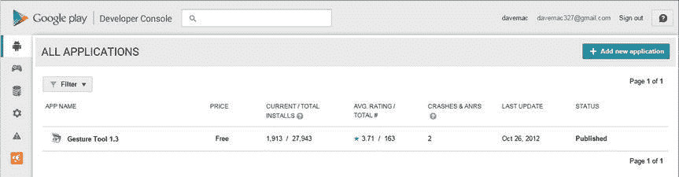
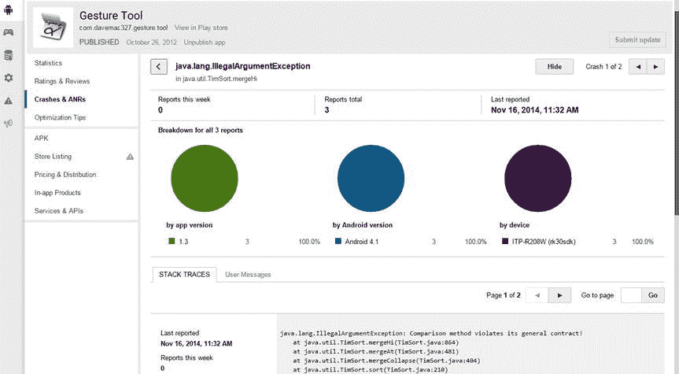

# 三十、部署您的应用：谷歌 Play 商店及其他

创建一个人们会喜欢的伟大的应用是一回事，但是你还需要一个容易的方法让人们找到并下载它。谷歌为此创建了 Play Store。用户可以通过设备上的图标直接点击 Play Store 来浏览、搜索、查看和下载应用。用户也可以通过互联网访问 Play Store 来做同样的事情，尽管下载不是在电脑上，而是直接将应用发送到用户的设备上。很多应用都是免费的；对于那些不是这样的人，Play Store 提供了方便购买的支付机制。

Play Store 甚至可以从应用内部访问，这使得应用可以很容易地访问 Play Store，以指导用户获得他们需要的东西，使您的应用获得成功。例如，当您的应用有了新版本时，您可以让用户轻松地直接进入 Play Store 页面来获取或购买新版本。然而，谷歌 Play 商店并不是让应用进入设备的唯一途径；其他渠道遍布互联网。

谷歌 Play 商店应用在模拟器中是不可用的(尽管黑客可以使它可用)。这对开发人员来说有点困难。理想情况下，你会有一个自己的设备，你可以用谷歌 Play 商店。在这一章中，我们将探索如何让你设置发布应用到 Play Store 如何准备通过 Play Store 销售您的应用；如何保护自己免受盗版侵害；用户将如何找到、下载和使用你的应用；最后，让您的应用可用的替代方法。

成为出版商

在你上传一个应用到谷歌 Play 商店之前，你需要成为一个发布者。为此，您必须创建一个 Google Play 发布者帐户。一旦完成，你就可以将你的应用上传到 Play Store，这样用户就可以找到并下载它们了。如果你要为你的应用收费，或者接受应用内购买，你还需要设置一个谷歌钱包商户账户。谷歌已经使获得这些账户的过程变得相对容易，价格也合理。

从这个页面开始比较好:[http://developer . Android . com/distribute/Google play/start . html](http://developer.android.com/distribute/googleplay/start.html)。从这里，您可以单击大的开始按钮开始该过程。如果您还没有 Google 帐户，系统会提示您创建一个。要成为发布者，您还需要提供开发人员姓名、电子邮件地址、网站地址以及可以联系到您的电话号码。一旦您的帐户设置完成，您将能够在以后更改这些值。你还需要支付注册费。这是通过谷歌钱包完成的。为了完成支付交易，您需要使用您的 Google 帐户。

在付款过程中，您可以选择“对我的电子邮件地址保密”这是指您和谷歌 Play 商店之间当前购买 publisher 访问权限的交易。如果您选择“是”，您将对谷歌 Play 商店保密您的电子邮件地址。这与向应用的购买者保密您的电子邮件地址没有任何关系。买家能否看到你的电子邮件地址与此选项无关。稍后会详细介绍。

接下来是 Google Play 开发者分发协议(GPDDA) 。这是谷歌和你之间的法律合同。它阐明了分发应用、收取费用、批准退款、反馈、评级、用户权利、开发者权利等等的规则。在本章的“遵守规则”一节中有更多的内容。

接受协议后，您将在被带到一个通常称为开发者控制台的页面。

遵守规则

GPDDA 阐明了许多规则。你可能希望法律顾问在同意合同之前先审查一下，这取决于你计划在谷歌 Play 商店开展业务的认真程度。本节介绍了您可能感兴趣的一些亮点:

*   你必须是一个信誉良好的开发者才能使用谷歌 Play 商店。这意味着您必须按照描述的过程进行注册，您必须接受协议，并且您必须遵守协议中的规则。违反规则可能会让你被禁止，你的产品也会从 Play Store 中删除。
*   你可以免费或有偿分发产品。该协议适用于任何一种情况。付款必须通过授权的谷歌 Play 商店支付处理器收取。这包括 Google Checkout(信用卡、借记卡、Google Play 礼品卡)、运营商计费(例如威瑞森、美国电话电报公司)和 PayPal。
*   付费应用将产生交易费，可能还会从设备运营商那里收取费用，这些费用将从售价中扣除。截至 2015 年 3 月，交易费用为 30%，因此，如果销售价格为 10 美元，谷歌收取 3 美元，你得到 7 美元(假设没有运营商费用)。
*   对于欧盟国家，谷歌需要为您汇出税款。在欧盟之外，您有责任向您的税务机关缴纳适当的税款。对于一些非欧盟国家，你可以选择让谷歌为你汇税。当您设置您的商家帐户时，您指定适用于购买的适当税率。Google Checkout 将根据您设置 Google Checkout 的方式收取相应的税款。如果谷歌没有为你汇款，这笔钱将提供给你，你必须适当地汇款。关于美国销售税的其他信息，可以试试[http://biztaxlaw . about . com/od/business taxes/f/onlinesalestax . htm](http://biztaxlaw.about.com/od/businesstaxes/f/onlinesalestax.htm)和[www.thestc.com](http://www.thestc.com)。
*   你可以免费发布你的应用的演示版本，也可以选择付费来解锁应用的全部功能；但是，您必须通过授权的谷歌 Play 商店支付处理器收取款项。你不允许将你的免费应用的用户重定向到一些其他的支付处理器来收取升级费用。你可以这样想:如果你通过谷歌 Play 商店赚钱，谷歌想要它的份额。
*   应用内计费允许应用对应用内使用的数字商品或资产收费。数字资产可以是虚拟武器、游戏的新关卡、音乐或图形文件。结帐过程与购买应用相同。
*   如果您的应用要求用户登录某个 web 服务器，并且该 web 服务器向用户收取订阅费，那么该 web 服务器可以以任何方式收取订阅费。这样，你就切断了订阅费与应用的联系，谷歌就可以让应用在谷歌 Play 商店可用——只要你的免费应用不把用户导向网站。一些人只是决定从与服务相同的 web 服务器上分发他们的免费 Android 应用，但这确实需要用户能够安装来自未知来源的应用，这可能会阻止一些用户安装。
*   你似乎可以使用替代支付处理器来接受免费应用用户的捐款，但你不能在你的应用中创建激励机制来鼓励这些捐款。
*   虽然 GPDDA 表示可以在购买后 48 小时内申请退款，但截至 2015 年 3 月，用户可以在购买后 2 小时内申请自动退款。在下载前可以预览产品的用户不会获得退款。这包括铃声和壁纸。
*   然而，Google Checkout 确实允许开发者在退款窗口已经过去的情况下进行退款。用户可以进入他们的 Google Play 活动历史记录，并在最初的 2 小时后申请退款。如果购买后不到 48 小时，退款可能会自动进行。否则，要不要退钱由开发商决定。
*   您需要为您的产品提供足够的支持。如果没有提供足够的支持，用户可以通过谷歌要求退款，这些费用将被退还给您，可能包括手续费。
*   用户可以无限制地重新安装从谷歌 Play 商店下载的应用。如果用户对其设备进行了出厂重置，该功能允许他们取回所有应用，而无需重新购买。
*   开发者同意保护用户的隐私和合法权利。这包括保护在使用应用的过程中可能收集到的任何数据。可以更改有关用户数据保护的规则，但只能通过显示并让用户接受您与该用户之间的单独协议来实现。
*   你的申请不得与谷歌 Play 商店竞争。谷歌不希望谷歌 Play 商店国内的应用在谷歌 Play 商店以外销售安卓产品，从而绕过其支付处理器。这并不意味着你不能通过其他渠道销售你的应用，但是你在谷歌 Play 商店的应用本身不能在谷歌 Play 商店之外销售 Android 产品。
*   谷歌会给你的产品打分。评级可以基于用户反馈、安装率、卸载率、退款率和/或开发者综合得分。开发者综合得分可能由 Google 使用应用的过去历史来计算，这可能会影响新应用的评级。出于这个原因，发布与你相关的高质量应用是很重要的，即使是免费的。还不清楚开发者综合得分是否存在，但如果存在，就没办法看到你的了。
*   通过谷歌 Play 商店销售您的应用，您就授予了用户“在设备上执行、显示和使用产品的非排他性、全球性、永久性许可”但是，您完全可以编写一份单独的最终用户许可协议(EULA)来取代本声明。在您的网站上提供此 EULA，或者为购物者和用户提供其他阅读方式。
*   谷歌要求你遵守 Android 的品牌规则。这些措施包括限制使用单词 *Android* ，以及使用机器人图形、标志和定制字体。更多详情请前往[http://developer . Android . com/distribute/tools/promote/brand . html](http://developer.android.com/distribute/tools/promote/brand.html)。

开发者控制台

开发者控制台是您在谷歌 Play 商店控制应用的登陆页面。从开发人员控制台，您可以在 Google Checkout 中设置一个商家帐户(这样您就可以对您的应用收费)，上传应用，并获得有关您上传的应用的信息。您还可以编辑您的帐户详细信息，包括开发人员姓名、电子邮件地址、网址和电话号码。[图 30-1](#Fig1) 显示了开发者控制台。



[图 30-1](#_Fig1) 。谷歌 Play 商店开发者控制台

如果您没有设置商家帐户，您将无法在谷歌 Play 商店为您的产品付款。建立一个商家账户并不难。单击开发人员控制台中的链接，填写应用，同意服务条款，一切就绪。您需要提供一个美国联邦税号(EIN)，一个信用卡号加上一个美国社会保险号(SSN)，或者只是一个信用卡号。税务信息用于验证您的信用状况，以确保及时存款。当您的 Google Checkout 帐户中资金不足时，信用卡信息将用于处理因买方争议而导致的退款。您还可以提供银行帐户信息，以便从销售收入中进行电子资金转账。

请注意，谷歌结账不仅仅是谷歌 Play 商店的一项服务。因此，不要被非谷歌 Play 商店销售的 Google Checkout 的交易费信息所迷惑。前面提到的 30%是谷歌 Play 商店的交易费。对于非谷歌 Play 商店销售，还有额外的 Google Checkout 交易费信息，这些信息不适用于谷歌 Play 商店。

上传和监控你的应用可能是你将使用的开发者控制台的主要功能，尽管控制台也是你可以注册访问 Google APIs 和游戏服务并链接到你的 AdWords 帐户的地方。

对于监控，Play Store 提供了工具来查看您的应用在总下载量方面的表现以及有多少用户仍然安装了它。您可以查看您的应用的总体评分(0 到 5 颗星),以及有多少人提交了评分。开发人员控制台中有各种报告、图表和图形，因此您可以看到您的应用在不同版本的 Android、不同设备、不同国家和不同语言中的运行情况。

除了对您的应用进行评级之外，用户还可以提交评论。为了快速解决任何问题，阅读评论对你最有利。评论中包含用户对您的应用的评价、用户输入的用户名以及提交评论的日期。您可以回复特定的评论，该用户将会收到一封电子邮件通知他们。您只能对每个评论留下一个回复，但您可以在以后编辑您的回复。在极端情况下，如果某个评论特别有害或不恰当，您可以通过帮助中心网站联系谷歌支持部门:[【https://support.google.com/googleplay/android-developer/】](https://support.google.com/googleplay/android-developer/)。

开发人员控制台允许您重新发布应用(例如，为了升级)或取消发布应用。取消发布不会将它从设备上移除，甚至也不一定会将应用从谷歌服务器上移除，尤其是如果它是一个付费应用的话。已经为您的应用付费并卸载了它，但没有要求退款的用户可以在以后重新安装它，即使您已经取消发布它。用户真正无法使用它的唯一方式是，如果谷歌因违反规则而取消它。

您还可以查看由您的应用生成的错误，并看到应用冻结和崩溃。图 30-2 显示了崩溃的& ANRs 屏幕。



[图 30-2](#_Fig2) 。崩溃& ANRs 屏幕

深入到崩溃报告的细节，您可以看到崩溃的堆栈跟踪，以及运行应用的设备类型和崩溃的时间。不幸的是，您无法与遇到问题的用户联系以获得更多详细信息或帮助他们解决问题。你必须希望受影响的用户会通过评论、电子邮件或你的网站与你联系。否则，您只能从崩溃报告中找出问题所在，并尝试修复它。

如果你真的想知道用户是如何崩溃的，你需要在你的应用中实现一个移动分析包。当用户逐步通过您的应用时，这些将生成事件记录，并且还将报告崩溃。面包屑(事件记录)将让您知道用户在崩溃之前采取的步骤。然而，这种能力是独立于谷歌 Play 商店的。

开发人员控制台还有一个您可能需要使用的特性:网站的帮助部分。帮助按钮在右上角。单击它会显示一些内联帮助，还会有一个指向帮助中心网站的链接。还有提交电子邮件或在线聊天(在工作时间)的链接。

我们已经向您介绍了开发人员控制台的一些不错的功能，但是您可能想了解最有用的部分，即将您的应用放入谷歌 Play 商店，以便用户可以找到并下载它们。但在此之前，我们先来看看如何准备您的应用进行上传和销售。

准备销售您的应用

将一个应用从代码完成到谷歌 Play 商店，有很多事情要考虑和做。本节将帮助您完成这些项目。

不同设备的测试

随着越来越多的 Android 设备变得可用，并且每个设备都可能具有一些新的硬件配置，测试您想要支持的各种设备非常重要。您可以购买一些您想要支持的设备，但您可能无法全部购买。有一些在线服务可以让真实的设备在互联网上使用。您的另一个选择是为每种类型的设备配置 Android 虚拟设备(AVD ),指定适当的硬件配置，然后用仿真器和每个 AVD 进行测试。一些设备制造商提供了特定于他们设备的 Android 模拟器包，所以请查看他们的网站以获得下载选项。

Android SDK 提供了各种帮助测试的类，以及 UI/应用练习器 Monkey。这些工具将帮助您进行自动化测试，这样您就不会永远手动测试您的应用。有关更多详细信息，请访问以下网页:

```java
[https://developer.android.com/tools/testing/index.html](https://developer.android.com/tools/testing/index.html)
[https://developer.android.com/tools/testing-support-library/index.html](https://developer.android.com/tools/testing-support-library/index.html)
```

在您开始测试之前，您可能想要从您的代码中移除任何您不再需要的开发工件，以及来自 /res 的任何开发工件。您希望您的应用尽可能小，并以最少的内存尽可能快地运行。最后，确保从您的应用中禁用或删除任何您不希望发布到生产环境中的调试功能。

支持不同的屏幕尺寸

Android 支持多种屏幕尺寸。为了以最小的尺寸运行，您必须在 AndroidManifest.xml 文件中设置一个特定的 < supports-screens > 元素作为 < manifest > 的子元素。如果没有此标签指定您的应用支持小屏幕尺寸，您的应用在 Play Store 中对于小屏幕设备将是不可见的。

为了支持不同的屏幕尺寸，你可能需要在 /res 下创建备用资源文件。比如对于 /res/layout 中的文件，你可能需要在 /res/layout-small 中创建相应的文件来支持小屏幕。这并不意味着您还必须在 /res/layout-large 和 /res/layout-normal 中创建相应的文件，因为如果 Android 在更具体的资源目录(如 /res/layout-large )中找不到所需的内容，它会在 /res/layout 中查找。还要记住，这些资源文件可以有限定符的组合；例如， /res/layout-small-land 将包含横向模式下小屏幕的布局。支持小屏幕可能意味着也要创建可绘制的替代版本，比如图标。对于 drawables，考虑到屏幕分辨率和屏幕大小，您可能需要创建备用资源目录。

平板电脑当然在屏幕尺寸方面走了相反的方向，使用了标签 xlarge 。与之前相同的 < supports-screens > 标记用于指定您的应用是否将在超大屏幕上运行，在该标记内使用的属性是 android:xlargeScreens 。在某些情况下，您可能有一个仅适用于平板电脑的应用，在这种情况下，您需要明确指出对于其他尺寸，属性值为 false 。

正在准备 AndroidManifest.xml 以便上载

你的 AndroidManifest.xml 文件在你上传到谷歌 Play 商店之前可能需要稍微调整一下。ADT 通常将 android:icon 属性放在 <应用> 标签中，而不放在 <活动> 标签中。如果你有不止一个可以启动的活动，你需要为每个活动指定单独的图标，这样用户就可以更容易的区分它们。但是您仍然需要一个在 <应用> 中指定的图标，它也作为任何没有指定自己图标的活动的默认活动图标。只有在 < activity > 标签中指定了 android:icon 的情况下，你的应用才能在设备上和模拟器中正常工作，但是当谷歌 Play 商店检查你的应用的标签时。apk 文件上传时，在 <应用> 标签中寻找图标信息。

如果您使用的软件包名称以 com.google 、 com.android 、 android 或 com.example 开头，谷歌 Play 商店会阻止上传您的应用，但我们希望您没有在您的应用中使用这些名称。

对于您的应用，还有许多其他兼容性需要考虑。一些设备有摄像头，一些没有物理键盘，一些有轨迹球而不是方向垫。根据需要在您的 AndroidManifest.xml 文件中使用<uses-configuration>和 < uses-feature > 标签来定义您的应用有哪些硬件/平台需求。谷歌 Play 商店将强制执行这一点，不会让用户在不支持你的应用的设备上看到你的应用。请注意，这些标签与 AndroidManifest.xml 文件的<uses-permission>标签是不同且独立的。在大多数情况下，您会在您的 AndroidManifest.xml 文件中使用两个标签，一个用于指定需要一个摄像头，另一个用于指定需要使用摄像头的权限。但是并不是所有的功能都需要权限，所以指定您需要的功能对您最有利。

<uses-permission>和 < uses-feature > 还有一个很大的区别: < uses-feature > 标签可以说你的应用需要那个特性或者你的应用没有它也能运行。也就是有一个属性叫做 android:required 可以设置为 true 或者 false；默认情况下是真。如果某个特性有权限，但是您没有提供相应的 < uses-feature > 标签，那么默认情况下，就好像您指定了 < uses-feature > 并且该特性是必需的。例如，如果蓝牙可用，您的应用可能会利用它，但如果它不可用，也能正常工作。因此，在清单文件中，除了 Bluetooth permission 元素之外，还有如下内容:

```java
<uses-feature android:name="android.hardware.bluetooth" android:required="false" />
```

在您的应用代码中，您应该调用 PackageManager 来确定蓝牙是否可用，您可以通过以下方式来完成:

```java
boolean hasBluetooth = getPackageManager().hasSystemFeature(
                PackageManager.FEATURE_BLUETOOTH);
```

如果没有蓝牙，就在应用中采取适当的措施。Android 文档在这方面可能会令人困惑。如果您查看 < uses-feature > 的开发者指南页面，您将不会看到 PackageManager 参考页面上描述的那么多特性，该页面为每个可用特性定义了一个 FEATURE_* 常量。

<用途-配置> 标签略有不同。它规定了设备必须具备的键盘、触摸屏和/或导航控件的种类。但是你可以将配置选项的组合放到你的应用需要的地方，而不是像 <使用功能> 那样的独立选项。例如，如果您的应用需要一个五向导航控件(即，一个 D-pad 或一个轨迹球)和一个触摸屏(使用手写笔或手指)，您可以指定如下两个标记:

```java
<uses-configuration android:reqFiveWayNav="true" android:reqTouchScreen="stylus" />
<uses-configuration android:reqFiveWayNav="true" android:reqTouchScreen="finger" />
```

本地化应用

如果您的应用将在其他国家使用，您可能需要考虑将其本地化。这在技术上相对容易做到。找人做本地化是另一回事。从技术角度来看，您只需在 /res 下创建另一个文件夹——例如， /res/values-fr 来存放法语版的 strings.xml 。获取现有的 strings.xml 文件，将字符串值翻译成新的语言，并使用与原始文件相同的文件名将新翻译的文件保存在新的资源文件夹下。在运行时，如果设备的语言设置为法语，Android 将查找放置在 /res/values-fr 下的字符串。如果它不能从那里找到字符串，那么它将从 /res/values 中寻找字符串。

同样的技术也适用于其他类型的资源文件——例如，可绘制文件和菜单。如果不同的国家或文化有不同的图像和颜色，对你的用户来说可能会更好。因此，最好不要对颜色资源名称使用真彩色名称。在颜色的在线文档中，经常会看到这样的内容:

```java
<color name="solid_red">#f00</color>
```

这意味着在您的代码或其他资源文件中，您通过颜色的实际名称来引用颜色，在本例中是 solid_red 。为了将颜色本地化为更适合其他国家或文化的颜色，最好使用一个颜色名称，如 accent_color1 或 alert_color 。在英语中，红色可能是合适的颜色值，而在西班牙语中，使用黄色可能更好。因为像 alert_color 这样的颜色名称并不显示您正在使用的实际颜色，所以当您想要将实际颜色值更改为其他值时，就不会那么混乱了。与此同时，你可以设计一个令人愉悦的配色方案，包括基色和强调色，并且更加确信你在正确的地方使用了正确的颜色。

在不同的国家，菜单选项可能需要更改，使用更少或更多的菜单项，或者以不同的方式组织，这取决于应用在哪里使用。菜单通常存储在 /res/menu 下。如果您面临这种情况，您可能最好将所有字符串文本放入 strings.xml 或位于 /res/values 目录下的其他文件中，并在其他适当的资源文件中使用字符串 id。这使得您不太可能错过翻译某个晦涩的资源文件中的字符串值。然后，您的语言翻译工作仅限于 /res/values 下的文件。

准备应用图标

下载后，购物者和你的用户将会在谷歌 Play 商店和他们的设备上看到你的应用图标和标签。请特别注意为您的应用及其活动创建良好的图标和标签。根据需要或期望对它们进行本地化。请记住，对于不同的屏幕尺寸，您的图标可能需要调整，以便看起来更好。看看其他开发者对他们的图标做了什么，尤其是那些和你的应用在同一个类别的应用。你想让你的应用引起注意，所以最好不要和其他应用混在一起。同时，你希望你的图标和标签在一个设备上工作得很好，当它被许多其他的应用图标围绕着的时候。你不希望用户对你的应用的功能感到困惑，所以让图标代表你的应用的功能。

在为你的应用创建任何图像时，尤其是你的图标，你需要考虑目标设备的屏幕密度。*密度*指每英寸的像素数。不要认为小屏幕是低密度，大屏幕是高密度——你可以看到任何大小和密度的组合。对于高密度屏，你很可能会选择 72 × 72 像素的图标。中等密度图标的尺寸通常为 48 × 48 像素。而对于超高密度，则是 96 × 96 像素。对于低密度屏幕，使图标看起来大小合适意味着使图标具有更少的像素，通常为 36 × 36。Android 在低密度的情况下会帮助你，因为它会自动将你的 HDPI 图标缩小一半，所以你不需要自己提供一个低密度的图标。一般来说，你会发现最容易担心的是图像的密度，比如图标。定义布局时，您会担心屏幕尺寸。

将用户引导回 Play 商店

Android 有一个 URI 计划来帮助在谷歌 Play 商店寻找应用: market:// 。谷歌 Play 商店以前叫做安卓市场。]例如，如果您想引导您的用户到 Play Store 找到所需的组件，或者追加销售一个可以解锁您应用中的功能的附加应用，您可以执行如下所示的操作，其中 MY_PACKAGE_NAME 将被替换为您的真实软件包名称:

```java
Intent intent = new Intent(Intent.ACTION_VIEW,
          Uri.parse("market://search?q=pname:MY_PACKAGE_NAME"));
startActivity(intent);
```

这将在设备上启动 Play Store 应用，并将用户带到该包名称。然后，用户可以选择下载或购买该应用。请注意，这种方案在普通的 web 浏览器中不起作用。除了使用包名( pname )进行搜索，还可以使用 market://search 按开发者名称进行搜索？q=pub:\"Fname Lname\" 或在谷歌 Play 商店使用 market://search？q= < querystring > 。

Android 授权服务

不幸的是，Android 应用的构建方式使它们成为盗版的目标。制作 Android 应用的副本，然后分发给其他设备是可能的。那么如何保证没有购买你的应用的用户不能运行它呢？Android 团队已经创建了一个叫做许可证验证库(LVL)的东西来满足这个需求。它是这样工作的。

如果你的应用是通过谷歌 Play 商店下载的，那么设备上一定有谷歌 Play 商店应用的副本。此外，谷歌 Play 商店应用具有更高的权限，能够从设备中读取值，如用户的谷歌帐户名称、IMSI 和其他信息。谷歌 Play 商店应用将响应来自应用的许可证验证请求。您从自己的应用调用 LVL，LVL 与谷歌 Play 商店应用通信，谷歌 Play 商店应用与谷歌服务器通信，您的应用得到一个回答，表明该设备上的用户是否有权使用您的应用。这意味着应用必须是通过谷歌 Play 商店购买的；否则谷歌服务器不会知道。如果网络不可用，您可以控制一些设置来决定如何操作。实现 LVL 的过程完整描述可以在[https://developer . Android . com/Google/play/licensing/index . html](https://developer.android.com/google/play/licensing/index.html)找到。

不过，需要注意的一点是，LVL 机制容易受到黑客攻击。如果有人可以访问您的应用的。apk 文件，他们可以反汇编应用，然后打补丁，如果他们知道在哪里寻找 LVL 调用的返回值。如果您在从 LVL 获得响应后使用明显的 switch 语句模式，根据返回代码分支到适当的逻辑，黑客可以简单地强制成功返回代码值，他们就拥有了您的应用。出于这个原因，Android 团队强烈建议您对应用进行模糊处理，以隐藏应用中检查 LVL 返回代码的部分。可以想象，这变得相当复杂。

使用 ProGuard 进行优化，打击盗版

Google 以 ProGuard 特性的形式为混淆提供了一些支持。ProGuard 不是谷歌的产品，但已经集成到 ADT 和 Android Studio 中，所以很容易使用。ProGuard 不仅仅是为打击盗版提供混淆；它也使你的应用更小更快。它通过剥离调试信息、删除永远不会运行的代码，以及将(类、方法等的)名称改为无意义的字符串来完成所有这些工作。永远不会运行的代码示例包括永远不会被调用的库类和方法，以及依赖于您设置为 false (用于生产)的常量的日志记录。它还可以识别优化，例如将值向左二进制移位一位，而不是乘以 2。通过去掉调试信息并更改名称，最终编译成。apk 文件不会透露变量名、类名、方法等等，所以要弄清楚代码做了什么，以及如何窃取它、修改它，并把它作为别的东西发布，变得极其困难。

当您创建您的应用时，它应该会自动获得一个 proguard-project.txt 文件。默认文件看起来类似于[清单 30-1](#list1) 。

[***清单 30-1***](#_list1) 。样本 *proguard-project.txt* 文件

```java
# To enable ProGuard in your project, edit project.properties
# to define the proguard.config property as described in that file.
#
# Add project specific ProGuard rules here.
# By default, the flags in this file are appended to flags specified
# in ${sdk.dir}/tools/proguard/proguard-android.txt
# You can edit the include path and order by changing the ProGuard
# include property in project.properties.
#
# For more details, see
#   [http://developer.android.com/guide/developing/tools/proguard.html](http://developer.android.com/guide/developing/tools/proguard.html)

# Add any project specific keep options here:

# If your project uses WebView with JS, uncomment the following
# and specify the fully qualified class name to the JavaScript interface
# class:
#-keepclassmembers class fqcn.of.javascript.interface.for.webview {
#   public *;
#}
```

您还需要将应用的 project.properties 文件中的 proguard.config 属性取消注释到 proguard-project.txt 文件的位置。该行如下所示:

```java
proguard.config=${sdk.dir}/tools/proguard/proguard-android.txt:proguard-project.txt
```

如您所见，Android SDK 的 tools/proguard 目录下的一个文件提供了一组常用的 ProGuard 配置。然后，您可以在 proguard-project.txt 文件中增加 ProGuard 配置，作为您的应用项目的一部分。请注意，所提供的配置实际上并不支持优化，因为这些需要更多的测试来确保您的应用仍然能够正常工作。如果你想尝试优化，将 project.properties 文件中的引用改为$ { SDK . dir }/tools/proguard/proguard-Android-optimize . txt。

如前所述，ProGuard 通过剥离内容来完成工作。有时它去掉了太多，这就是为什么你会看到在 proguard-android.txt 文件中指定的 -keep 选项。当你制作一个的时候。apk 文件，你需要测试一下，确保 ProGuard 没有拿出太多。如果您发现由于缺少类或方法而导致的错误，您可以编辑 proguard-project.txt 文件，为您缺少的项包含另一个 -keep 选项。重建你的。apk 文件，并再次测试。我们建议使用 Eclipse 中 Android Tools 菜单选项下的 Export Signed Application Package 选项，因为它会在构建时为您调用 ProGuard。apk 文件。下一节将介绍导出。

如果您使用 Ant 进行构建，也可以配置 Ant 使用 ProGuard 进行模糊处理。

当 ProGuard 完成它的工作时，你会得到一个名为 mapping.txt 的文件以及你的。apk 文件。请保留这个文件，因为您将需要它来消除应用中的堆栈跟踪。如果你用 Eclipse 来导出你的。apk 文件，您将看到在您的 Eclipse 项目中创建了一个新的 proguard 目录。 mapping.txt 文件会在那里。要使用的命令是 retrace ，它位于 tools/proguard/bin 下的 Android SDK 目录中。要追溯的参数包括 mapping.txt 文件和 stacktrace 文件，但是要注意，您需要指定每个文件的完整路径名。此外，您应该跟踪应用的哪个版本与哪个 mapping.txt 文件相匹配。

关于测试应用的另一个注意事项。Android KitKat 引入了一个名为 Android RunTime (ART) 的实验性运行时引擎，在 Lollipop 中它成为了唯一的运行时引擎。你应该用这两者来测试你的应用，尤其是当你使用 ProGuard 并进行优化的时候。

准备你的。用于上传的 apk 文件

让您的测试应用准备好上传——也就是说，创建。 apk 文件 上传—您需要创建一个您的应用的签名导出。这可以通过多种方式实现，但最简单的方式是使用内置的 IDE 特性。对于 Eclipse，您可以右键单击项目名称并选择 Android ToolsExport Signed Application Package....对于 Android Studio，您可以选择项目名称并选择构建菜单生成签名的 APK……按照对话框选择合适的签名证书密钥并创建您的生产 APK。

上传您的申请

上传很容易，但需要一些准备。在你开始上传之前，你需要准备好一些东西，并做出一些决定。本节将介绍这些准备工作和决策。然后，当你得到你需要的一切，到开发者控制台，选择+添加新的应用。您将被提示提供大量关于您的应用的信息，Play Store 将对您的应用和信息进行一些处理，然后您的应用将准备好发布到 Play Store。

上一节介绍了如何准备您的应用。用于上传的 apk 文件。让你的应用对购物者有吸引力需要你做一些市场营销。你需要好的描述它是什么和做什么，你需要好的图片，这样购物者就能明白他们可能会下载什么。

谷歌 Play 商店明白您可以在不同的国家销售您的应用。因此，只需一个应用，您就可以为不同国家提供本地化的文本和图形。

图形

您将被要求上传应用的截图。捕捉应用屏幕截图最简单的方法是使用 DDMS。启动 Eclipse，在模拟器或真实设备上启动您的应用，然后将 Eclipse 透视图切换到 DDMS 和设备视图。在设备视图中，选择运行应用的设备，然后单击屏幕捕获按钮(它看起来像右上角的一个小相机)或从视图菜单中选择它。如果保存时可以选择，请选择 24 位颜色。Android Device Monitor 与 DDMS 非常相似，是一个独立的工具(称为 Monitor ),位于 SDK tools 目录下，或者位于 Android Studio 的 tools 菜单中。

谷歌 Play 商店会把你的截图转换成压缩的 JPEG 从 24 位开始比从 8 位颜色开始会产生更好的结果。选择能让你的应用脱颖而出，同时也能展示重要功能的截图。你必须提供至少两个截图，你最多可以提供八个。请注意，您可以为其他语言的应用上传截图。如果您的应用已经针对另一个国家/地区和/或语言进行了本地化，您会希望屏幕截图与之相对应。

接下来是一个高分辨率的应用图标。这可能与你的应用图标设计完全相同，但谷歌 Play 商店想要一个 512 × 512 像素的图标图像。这是必需的。

特征图形是必需的，并且是 1024 × 500 像素的大尺寸。这个图形用在谷歌 Play 商店的特色部分，所以你想让这个看起来真的很好。

你也可以提供一个宣传图片，但是它的尺寸要比截图小。虽然这个图形是可选的，但是包含它是一个好主意。你永远不知道图形什么时候会显示出来；如果没有，你不知道在它的位置上会显示什么，如果有的话。在谷歌 Play 商店，宣传画会出现在你的申请详情页面的顶部。

当你读到这里的时候，你可能还有其他的图片可以上传。例如，谷歌现在接受在电视上观看的应用的电视横幅图形。

与你的申请相关的最后一点图片是一个可选的视频，你可以把它放在 YouTube 上，并从你的谷歌 Play 商店页面链接到它。

列表详细信息

谷歌 Play 商店要求向购物者显示有关您的应用的文本信息，包括标题、简短描述(以前称为促销文本)和完整描述。

有一个只有 80 个字符的简短描述字段，并且是强制性的。当你的应用出现在谷歌 Play 商店列表的顶部时，显示的是推广图片和简短描述。

完整描述也是强制性的，最多允许 4000 个字符。如果您为用户编写了单独的 EULA，请在完整的描述文本中提供一个链接，以便购物者在下载您的应用之前查看。考虑到购物者可能会使用搜索来定位应用，所以一定要在文本中输入适当的词语，以最大限度地提高与应用功能相关的搜索命中率。值得在文本中添加一个简短的注释，说明如果用户遇到问题，就给你发电子邮件。如果没有这个简单的提示，人们更有可能留下负面评论，而与受影响的用户进行电子邮件交流相比，负面评论确实会限制您排查和解决问题的能力。

前面描述的用户注释机制的一个缺点是，它不能向用户区分应用的具体版本。如果收到了对版本 1 的负面评论，而您发布了版本 2，并且修复了所有问题，那么来自版本 1 的评论仍然存在，购物者可能没有意识到这些评论不适用于新版本。当发布应用的新版本时，应用评级(星级数)也不会重置。部分由于这个原因，谷歌开始提供一个最近的变化文本字段，你可以描述这个版本中的新内容。在这里，您可以指出某个问题已经解决，或者告诉我们有什么新特性。Play Store 还提供了仅查看最新版本的评论/评论的能力，但默认情况下，会显示所有版本的评论和评论。

在为应用编写文本时，您的职责之一是公开所需的权限。这些权限与应用中的 AndroidManifest.xml 文件的<uses-permission>标记中设置的权限相同。当用户将你的应用下载到他们的设备上时，Android 将检查 AndroidManifest.xml 文件，并在完成安装之前询问用户关于所有使用许可的要求。所以你最好提前透露一下。否则，用户会对你的应用要求一些他们不准备授予的权限感到惊讶，更不用说退款了，这也会影响你的开发者综合得分。与权限类似，如果你的应用需要某种类型的屏幕、摄像头或其他设备功能，这应该在你的应用的文本描述中披露。作为最佳实践，您不仅应该公开您的应用需要哪些权限和功能，还应该公开您的应用将如何使用它们。你要提前回答用户的问题:为什么这个 app 需要 *X* ？

上传申请时，您需要选择申请类型和类别。由于这些值会随着时间的推移而变化，我们不会在这里列出它们，但是很容易转到 Add new application 屏幕来查看它们是什么。

发布选项

您必须选择两个内容分级。这个想法是让消费者了解某个应用对特定年龄组的适用性。第一个(较老的)内容分级的范围包括高、中、低成熟度，以及每个人。选择正确的级别取决于应用中的内容以及内容的数量。谷歌有关于位置感知和张贴或发布位置的规则。最好在这里自己看一下规则:[https://support . Google . com/Google play/Android-developer/answer/188189](https://support.google.com/googleplay/android-developer/answer/188189)。第二个内容评级是在您完成调查问卷后得出的。实际上，根据您对调查问卷的回答，您将获得多个国家的内容评级。问卷调查消除了内容评级的一些主观性。

接下来，您设置应用的价格。默认情况下，价格是免费的，如果您想对您的应用收费，您必须事先在 Google Checkout 中设置一个商业帐户。为一个应用设定合适的价格是一件棘手的事情，除非你有一些复杂的市场研究能力，即便如此，这仍然是一件棘手的事情。价格定得太高可能会让人们失去兴趣，如果人们觉得这个价格不值得，你就要承担退款的风险。价格定得太低也会让人们失去兴趣，因为他们可能会认为这是一个廉价的应用。

上传应用之前要做的最后一个决定是选择应用可见的位置和运营商。选择“全部”,您的应用将随处可用。但是，您可能希望按地理位置或运营商限制分发。根据您的应用中的功能，您可能需要根据位置进行限制，以符合美国出口法。如果您的应用与某些运营商的设备或政策存在兼容性问题，您可以选择按运营商限制您的应用。要查看运营商，请单击国家旁边的显示选项链接，将显示该国家可用的运营商，允许您选择您想要的运营商。选择全部也意味着谷歌添加的任何新位置或运营商将自动看到你的应用，无需你的干预。

除了国家和运营商选择，谷歌 Play 商店还允许您将应用限制在某些设备上。默认情况下，设备列表是根据您的清单文件进行筛选的，在清单文件中，您指定了应用需要的功能等。上传屏幕的这一部分允许您进一步限制其他设备。如果某个特定设备存在已知问题，导致您的应用无法在该设备上运行(尽管它应该运行),那么您可能只希望这样做。

Android 还提供为同一个应用上传多个 apk 的选项。它可以让你在谷歌 Play 商店上有一个入口，但对手机和平板电脑有不同的版本。参见[http://Android-developers . blogspot . com/2011/07/multiple-apk-support-in-Android-market . html](http://android-developers.blogspot.com/2011/07/multiple-apk-support-in-android-market.html)和[http://developer . Android . com/Google/play/publishing/multiple-apks . html](http://developer.android.com/google/play/publishing/multiple-apks.html)。

联系信息

即使您的开发人员档案包含您的联系信息，您也可以在上传每个应用时设置不同的信息。Play Store 要求提供网站、电子邮件地址和电话号码作为与该应用相关的联系信息。你必须提供其中至少一个，这样买家才能获得支持，但你不需要提供所有三个。在这里，*而不是*使用你的个人电子邮件地址是个好主意，因为你可能不会真的想要给出你的个人电话号码。当你通过销售你的应用赚了数百万美元时，你会希望让别人接收和处理来自用户的电子邮件。通过预先设置应用支持类型的电子邮件地址，您可以轻松地将支持电子邮件与个人电子邮件分开。当然，如果您需要/想要的话，您可以随时更改这些值。

同意

做出所有这些决定后，你必须证明你的应用遵守 Android 的内容指南(基本上没有令人讨厌的东西)，并再次证明该软件可以从美国出口。美国出口法律适用，因为 Google 的服务器位于美国境内，即使您不在美国，即使您和您的客户都不在美国。请记住，您可以随时选择通过其他渠道分发您的应用。当你所有的信息和图片都上传后，点击保存按钮。这将为您的应用做好一切准备。

然后，您可以通过单击“发布”按钮发布您的应用。谷歌 Play 商店将对您的应用执行一些检查——例如，检查您的应用证书的到期日期。如果一切顺利，您的应用将很快可供下载。恭喜你！

谷歌 Play 商店的用户体验

Play Store 应用已经在设备上提供了一段时间，并且可以通过互联网获得。开发者对谷歌 Play 商店的工作方式没有任何控制权，除了为他们的应用在 Play Store 中的列表提供良好的文本和图形。因此，用户体验很大程度上取决于谷歌。在设备上，用户可以通过关键字进行搜索；看看下载量排名靠前的应用(免费和付费都有)，特色应用，或者新应用；或者按类别浏览。一旦他们找到他们想要的应用，他们只需选择它，就会弹出一个项目详细信息屏幕，允许他们安装或购买它。购买会将用户带到谷歌收银台进行交易的金融部分。下载后，新应用会与所有其他应用一起显示。

从谷歌 Play 商店( [、https://play.google.com](https://play.google.com))的互联网网站来看，用户界面看起来差不多，尽管比大多数设备屏幕大得多。一个不同之处是，基于网络的谷歌 Play 商店希望用户登录他们的谷歌账户来使用 Play Store。这使得谷歌可以将你在谷歌 Play 商店的网络体验与你的实际设备连接起来。这意味着两件事:当使用网站时，谷歌 Play 商店知道你的设备上已经安装了哪些应用；当你在谷歌 Play 商店网站上购物时，下载可以发送到你的设备上，而不是你正在浏览的任何一台电脑上。

谷歌 Play 商店可以选择在我的应用中查看下载的应用。此区域包含所有已安装的应用和您已购买的任何应用，即使您已移除它们(可能您移除它们只是为了给其他应用腾出空间)。这意味着你可以从手机上删除一个付费应用，然后重新安装，而不必重新购买。当然，如果你选择退款，该应用将不会显示在我的应用。

“我的应用”中的应用列表与您在所有设备上使用的 Google 帐户相关联。这意味着你可以切换到一个新的物理设备，仍然可以访问你已经付费的所有应用。但是要小心。由于您可能在 Google 上有多个身份，因此您必须使用与之前完全相同的身份才能在新设备上获得您的应用。在“我的应用”中查看应用时，任何有可用升级的应用都会指出这一点，并允许您获得升级。

用户可用的谷歌 Play 商店过滤器应用。它以多种方式做到这一点。一些国家的用户只能看到免费的应用，因为谷歌在该国涉及商业法律。谷歌正在努力克服商业障碍，这样所有的付费应用将随处可见。在那之前，一些国家的用户将无法使用付费应用。使用旧版本 Android 设备的用户将无法看到需要新版本 Android SDK 的应用。设备配置与应用需求不兼容的用户(通过 AndroidManifest.xml 文件中的 < uses-feature > 标签表示)将无法看到这些应用。例如，在谷歌 Play 商店，用户在小屏幕设备上无法看到不支持小屏幕的应用。这种过滤主要是为了防止用户下载不适合他们设备的应用。

如果您在谷歌 Play 商店从其他国家购买应用，您的交易可能需要进行货币兑换，这也可能会产生额外的费用，除非卖家指定了以您的当地货币计价。你真的是在使用卖家所在国家的谷歌收银台购物。谷歌 Play 商店将显示一个大概的金额，但实际费用可能会有所不同，这取决于交易的时间和支付处理器。买家可能会注意到他们的账户中有一笔小额交易(例如 1 美元)。谷歌这样做是为了确保提供的支付信息是正确的，这笔未决费用实际上不会通过。

有几个网站可以反映谷歌 Play 商店的应用列表。购物者可以在没有设备的情况下，通过互联网搜索、浏览类别和了解谷歌 Play 商店的应用。这绕过了谷歌 Play 商店根据你的设备配置和位置所做的过滤。但是，这不会将应用下载到您的设备上。这些镜像站点的例子有 [、www.androlib.com](http://www.androlib.com)和 [、www.appszoom.com](http://www.appszoom.com)。

超越谷歌 Play 商店

谷歌的 Play Store 并不是镇上唯一的游戏。你根本不会被迫使用谷歌 Play 商店。你应该考虑利用其他分销渠道，不仅要让更多国家的更多人可以使用你的应用，还要利用其他支付处理器和赚钱的机会。

有一些完全独立于谷歌 Play 商店的安卓应用商店，其中最大的可能是亚马逊。安卓应用商店的其他例子还有 http://mall.soc.io/apps[](http://mall.soc.io/apps)[http://slideme.org](http://slideme.org)[www.getjar.com](http://www.getjar.com)[https://f-droid.org/](https://f-droid.org/)。在这些网站上，你可以通过设备或网络浏览器搜索、浏览、查找应用，还可以下载应用。这些网站不必遵守谷歌的规则，包括付费应用的交易费用和支付方式。PayPal 和其他支付处理器可以用来在这些独立的网站上购买应用。这些网站也不一定受位置或设备配置的限制。其中一些提供可以安装的 Android 客户端，或者在某些情况下可以预装在设备上。用户只需在他们的设备上启动浏览器，通过网站找到他们想要下载的应用；当文件保存到设备上时，Android 知道如何处理它。也就是说一个下载下来的。apk 文件被视为 Android 应用。如果您在浏览器的下载历史中点击它(不要与我的应用混淆，前面已经介绍过)，系统会提示您是否要安装它。这种自由意味着你可以设置你自己的下载 Android 应用的方法，甚至可以从你自己的网站和你自己的支付方式下载。你仍然必须处理收集任何必要的销售税，并将其汇给有关当局。

虽然不受谷歌规则的限制，但这些应用分发的替代方法可能无法提供与谷歌 Play 商店相同的买家保护。通过替代市场购买在购买者的设备上不工作的应用是可能的。买家在替代市场上可能面临更大的恶意软件风险。购买者还可能负责创建备份，以防他们从他们的设备中丢失应用，或者如果他们切换到新设备，则负责转移应用。

这些其他市场让你可以从每个应用的销售中赚钱。你也有能力在这些其他市场实施替代支付机制，或实施广告，并以这种方式赚钱。

请记住，谷歌并不限制开发者在通过谷歌 Play 商店销售应用的同时，在多个市场销售他们的应用。所以考虑你所有的选择，充分利用你的努力。

参考

以下是一些对您可能希望进一步探索的主题有帮助的参考:

*   [http://Developer . Android . com/Guide/topics/manifest/manifest-intro . html](http://developer.android.com/guide/topics/manifest/manifest-intro.html)T3:androidmanifest . XML 文件的开发者指南页面，描述如何使用 supports-screens 、 uses-configuration 和 uses-feature 标签。
*   [http://Developer . Android . com/Guide/practices/Screens _ support . html](http://developer.android.com/guide/practices/screens_support.html):开发者指南页面“支持多屏幕”，其中包含大量关于处理不同屏幕尺寸和密度的有用信息。
*   :设计指南页面“图标”，其中包含了许多关于为你的应用设计有效图标的有用信息。
*   [http://Android-developers . blogspot . com/2010/09/securing-Android-lvl-applications . html](http://android-developers.blogspot.com/2010/09/securing-android-lvl-applications.html)和[http://Android-developers . blogspot . com/2010/09/proguard-Android-and-licensing-server . html](http://android-developers.blogspot.com/2010/09/proguard-android-and-licensing-server.html):关于如何以防止盗版的方式使用许可证验证库(LVL)的博文。
*   :ProGuard 的主站点，包含文档。

摘要

您现在已经准备好使用您的 Android 应用与世界交流了！以下是我们在本章中涉及的主题的概要:

*   如何成为一名谷歌 Play 商店出版商(也就是开发者)，这样你就可以在谷歌 Play 商店出版了。
*   Google Play 开发者分发协议中规定的规则。
*   如果你通过谷歌 Play 商店销售，把你的收入分成给谷歌。我们还讨论了谷歌如何不希望看到来自 Play Store 内部的竞争。
*   你有责任为你的应用的收入纳税。
*   谷歌 Play 商店退款政策，包括公布的和真实的。
*   用户如何在未来的任何时候获得你的应用的拷贝，只要他们曾经支付过费用。
*   Android 品牌规则。请确保您没有侵犯任何与 Android、图像或字体相关的版权。
*   开发人员控制台及其功能。开发人员控制台从用户那里收集用户反馈和错误报告。
*   为生产准备您的应用，包括测试、LVL 和 ProGuard 以打击盗版，以及使用资源变化和 AndroidManifest.xml 中的标签来过滤您的应用将可用于哪些设备。
*   关于按语言和/或文化本地化应用的建议。
*   设备和互联网/Web 上的谷歌 Play 商店用户界面。
*   事实上，谷歌 Play 商店不是唯一的游戏，你可以在互联网上的其他地方出售你的应用，所有这一切都在同一时间。