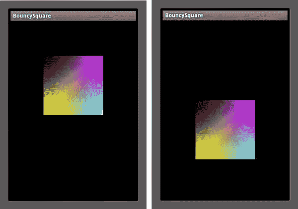
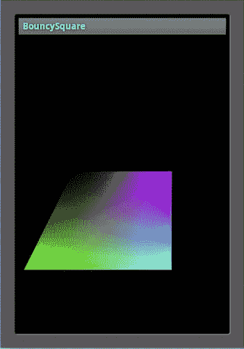
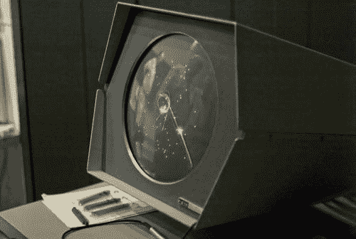
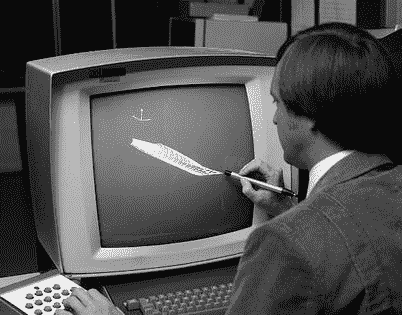
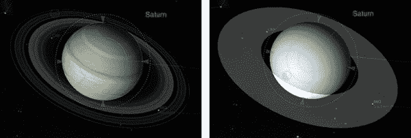
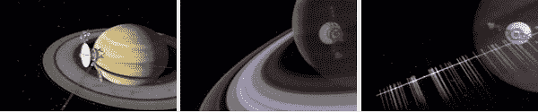
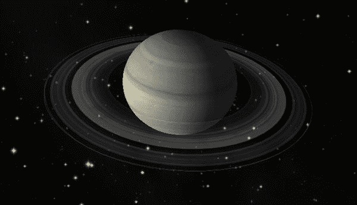
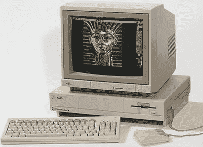
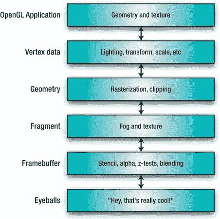
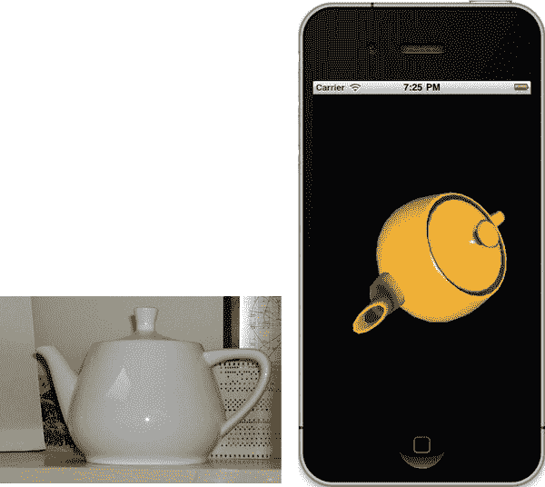

# 一、计算机图形学：从那时到现在

要预测未来，欣赏现在，你必须了解过去。

——可能是某个时候某个人说的

计算机图形一直是软件世界的宠儿。外行人更容易欣赏计算机图形，比如说，把排序算法的速度提高 3%，或者给电子表格程序增加自动色调控制。你可能会听到更多的人说“Coooool！”比起 Microsoft Word 中的 Visual Basic 脚本(当然，除非 Microsoft Word 中的 Visual Basic 脚本可以渲染土星；那真的会很酷)。当这些渲染图放在一个你可以放在后兜里随身携带的设备上时，酷的因素就更大了。让我们面对现实吧——硅谷的人们让科幻电影的艺术导演的日子变得非常艰难。毕竟，想象一下设计一个看起来比三星 Galaxy Tab 或 iPad 更具未来感的道具有多难。(甚至在苹果 iPhone 上市销售之前，美国广播公司 *Lost* 的道具部门就借用了一些苹果的屏幕图标，用于一名神秘的直升机飞行员携带的双向无线电中。)

如果你正在读这本书，那么你很可能已经有了一台基于 Android 的设备，或者正在考虑在不久的将来买一台。如果你有一个，现在就把它放在你的手里，想想这是 21 世纪工程学的一个奇迹。数百万小时的工作时间，数十亿美元的研究，数百年的加班，大量的通宵工作，以及大量喝着烈酒，穿着 t 恤，热爱漫画的工程师在夜晚的寂静中编写代码，这些都是为了制作那个小小的玻璃和塑料奇迹盒，这样你就可以在重播《流言终结者》时玩《愤怒的小鸟》。

### 你的第一个 OpenGL ES 程序

一些软件指南书籍会仔细地为他们的特定主题(“无聊的东西”)建立案例，但在第 655 页左右就会看到编码和例子(“有趣的东西”)。其他人会立即开始做一些练习来满足你的好奇心，把无聊的事情留到以后再做。本书将试图属于后一类。

**注:** OpenGL ES 是一种基于 OpenGL 库的 3D 图形标准，于 1992 年出现在硅图形实验室。它被广泛应用于整个行业，从运行游戏的便携式机器到为 NASA 运行流体动力学模拟的超级计算机(以及玩非常非常快的游戏)。ES 系列代表*嵌入式系统*，意为小型、便携、低功耗的设备。

安装后，Android SDK 附带了许多非常好的简明示例，从近场通信(NFC)到 UI，再到 OpenGL ES 项目。我们最早的例子将利用您将在广泛的 ApiDemos 代码库中找到的那些例子。不像它的 Apple-lovin 表亲 Xcode，它有一个很好的项目向导选择，包括一个 OpenGL 项目，不幸的是，Android dev 系统几乎没有。因此，与库比蒂诺的人们相比，我们不得不从一点点劣势开始。所以，你需要创建一个通用的 Android 项目，我相信你已经知道如何去做。完成后，添加一个名为`Square.java`的新类，由清单 1–1 中的代码组成。下面是详细的分析清单。

**清单 1–1。** *一个使用 OpenGL ES 的 2D 广场*

`package book.BouncySquare;

import java.nio.ByteBuffer;
import java.nio.ByteOrder;
import java.nio.FloatBuffer;
import java.nio.IntBuffer;

import javax.microedition.khronos.opengles.GL10;                            //1
import javax.microedition.khronos.opengles.GL11;

/**
 * A vertex shaded square.
 */
class Square
{
    public Square()
    {
        float vertices[] =                                                   //2` `{
            -1.0f, -1.0f,
             1.0f, -1.0f,
            -1.0f,  1.0f,
             1.0f,  1.0f
        };

        byte maxColor=(byte)255;

        byte colors[] =                                                      //3
        {
            maxColor,maxColor,       0,maxColor,
            0,       maxColor,maxColor,maxColor,
            0,              0,       0,maxColor,
            maxColor,       0,maxColor,maxColor
        };

        byte indices[] =                                                     //4
        {
            0, 3, 1,
            0, 2, 3
        };

        ByteBuffer vbb = ByteBuffer.*allocateDirect*(vertices.length * 4);     //5
        vbb.order(ByteOrder.*nativeOrder*());
        mFVertexBuffer = vbb.asFloatBuffer();
        mFVertexBuffer.put(vertices);
        mFVertexBuffer.position(0);

        mColorBuffer = ByteBuffer.*allocateDirect*(colors.length);
        mColorBuffer.put(colors);
        mColorBuffer.position(0);

        mIndexBuffer = ByteBuffer.*allocateDirect*(indices.length);
        mIndexBuffer.put(indices);
        mIndexBuffer.position(0);

    }

    public void draw(GL10 gl)                                                //6
    {
        gl.glFrontFace(GL11.*GL_CW*);                                          //7
        gl.glVertexPointer(2, GL11.*GL_FLOAT*, 0, mFVertexBuffer);             //8
        gl.glColorPointer(4, GL11.*GL_UNSIGNED_BYTE*, 0, mColorBuffer);        //9
        gl.glDrawElements(GL11.*GL_TRIANGLES*, 6,                              //10
        GL11.*GL_UNSIGNED_BYTE*, mIndexBuffer);
        gl.glFrontFace(GL11.*GL_CCW*);                                         //11
    }` 
`    private FloatBuffer mFVertexBuffer;
    private ByteBuffer   mColorBuffer;
    private ByteBuffer  mIndexBuffer;
}`

在我进入下一阶段之前，我将分解清单 1–1 中构建多色正方形的代码:

*   Java 拥有几种不同的 OpenGL 接口。父类仅仅叫做`GL`，而 OpenGL ES 1.0 使用的是`GL10`，1.1 版本导入为`GL11`，如第 1 行所示。如果您的图形硬件支持，您还可以通过 GL11ExtensionPack 提供的`GL10Ext package`访问一些扩展。后来的版本仅仅是早期版本的子类；然而，仍然有一些调用被定义为只接受`GL10`对象，但是如果你正确地转换对象，这些调用也可以工作。
*   在第 2 行中，我们定义了我们的正方形。你很少会这样做，因为许多对象可能有数千个顶点。在这些情况下，您可能会从任意数量的 3D 文件格式导入它们，如 Imagination Technologies 的 POD 文件、3D Studio 的`.3ds`文件等等。在这里，因为我们描述的是一个 2D 正方形，所以只需要指定 x 和 y 坐标。如你所见，这个正方形边长是两个单位。
*   颜色的定义类似，但在这种情况下，在第 3ff 行中，每种颜色有四种成分:红色、绿色、蓝色和 alpha(透明度)。这些直接映射到前面显示的四个顶点，所以第一个颜色与第一个顶点相配，依此类推。您可以使用颜色的浮点或固定或字节表示，如果要导入非常大的模型，后者可以节省大量内存。因为我们使用字节，颜色值从 0 到 255，这意味着第一个颜色设置红色为 255，绿色为 255，蓝色为 0。这将使一个可爱的，否则眩目的黄色阴影。如果使用浮点或定点，它们最终会在内部转换为字节值。与它的桌面兄弟不同，它可以渲染四边的对象，OpenGL ES 仅限于三角形。在第 4ff 行中，创建了连接性数组。这将顶点匹配到特定的三角形。第一个三元组表示顶点 0、3 和 1 构成三角形 0，而第二个三角形由顶点 0、2 和 3 组成。
*   一旦创建了颜色、顶点和连接性数组，我们可能需要处理这些值，将它们的内部 Java 格式转换成 OpenGL 可以理解的格式，如第 5ff 行所示。这主要确保字节的排序是正确的；否则，根据硬件的不同，它们的顺序可能会相反。
*   第 6 行中的`draw`方法由`SquareRenderer.drawFrame()`调用，稍后介绍。
*   第 7 行告诉 OpenGL 顶点如何排列它们的面。为了让你的软件发挥出最佳性能，顶点排序是至关重要的。这有助于在整个模型中保持统一的顺序，这可以表明三角形是朝向还是背离您的视点。后者被称为*背面三角形*物体的背面，所以它们可以被忽略，大大减少渲染时间。因此，通过指定三角形的正面是`GL_CW`，或顺时针，所有逆时针三角形被剔除。注意，在第 11 行，它们被重置为`GL_CCW`，这是默认值。
*   在第 8、9 和 10 行中，指向数据缓冲区的指针被移交给渲染器。对`glVertexPointer()`的调用指定了每个顶点的元素数量(在本例中是两个)，数据是浮点的，并且“步幅”是 0 字节。数据可以是八种不同的格式，包括浮点、固定、整数、短整数和字节。后三种有签名和无签名两种形式。Stride 是一种方便的方法，只要数据结构不变，就可以将 OpenGL 数据与您自己的数据交错。Stride 仅仅是打包在 GL 数据之间的用户信息的字节数，因此系统可以跳过它到它将理解的下一位。
*   在第 9 行，颜色缓冲区以四个元素的大小发送，RGBA 四元组使用无符号字节(我知道，Java 没有无符号的东西，但 GL 不需要知道)，它也有一个 stride=0。
*   最后，给出实际的`draw`命令，它需要连接性数组。第一个参数表示几何图形的格式，换句话说，三角形、三角形列表、点或线。
*   第 11 行让我们成为一个好邻居，并在先前的对象使用默认值的情况下将正面排序重置回`GL_CCW`。

现在我们的广场需要一个驱动程序和方式来在屏幕上展示它多彩的自我。创建另一个名为`SquareRenderer.java`的文件，并用清单 1–2 中的代码填充它。

**清单 1–2。** *我们第一个 OpenGL 项目的驱动*

`package book.BouncySquare;

import javax.microedition.khronos.egl.EGL10;                                 //1
import javax.microedition.khronos.egl.EGLConfig;
import javax.microedition.khronos.opengles.GL10;

import android.opengl.GLSurfaceView;                                         //2
import java.lang.Math;` 
`class SquareRenderer implements GLSurfaceView.Renderer
{
    public SquareRenderer(boolean useTranslucentBackground)
    {
        mTranslucentBackground = useTranslucentBackground;
        mSquare = new Square();                                              //3
    }

    public void onDrawFrame(GL10 gl)                                         //4
    {

        gl.glClear(GL10.GL_COLOR_BUFFER_BIT | GL10.GL_DEPTH_BUFFER_BIT);     //5

        gl.glMatrixMode(GL10.GL_MODELVIEW);                                  //6
        gl.glLoadIdentity();                                                 //7
        gl.glTranslatef(0.0f,(float)Math.sin(mTransY), -3.0f);               //8

        gl.glEnableClientState(GL10.GL_VERTEX_ARRAY);                        //9
        gl.glEnableClientState(GL10.GL_COLOR_ARRAY);

        mSquare.draw(gl);                                                    //10

        mTransY += .075f;
    }

    public void onSurfaceChanged(GL10 gl, int width, int height)             //11
    {
         gl.glViewport(0, 0, width, height);                                 //12

         float ratio = (float) width / height;
         gl.glMatrixMode(GL10.GL_PROJECTION);                                //13
         gl.glLoadIdentity();
         gl.glFrustumf(-ratio, ratio, -1, 1, 1, 10);                         //14
    }

    public void onSurfaceCreated(GL10 gl, EGLConfig config)                  //15
    {
        gl.glDisable(GL10.GL_DITHER);                                        //16

        gl.glHint(GL10.GL_PERSPECTIVE_CORRECTION_HINT,                       //17
                 GL10.GL_FASTEST);

             if (mTranslucentBackground)                                     //18
         {
             gl.glClearColor(0,0,0,0);                       
         }
             else
         {` `             gl.glClearColor(1,1,1,1);
         }
         gl.glEnable(GL10.GL_CULL_FACE);                                     //19
         gl.glShadeModel(GL10.GL_SMOOTH);                                    //20
         gl.glEnable(GL10.GL_DEPTH_TEST);                                    //21
    }
    private boolean mTranslucentBackground;
    private Square mSquare;
    private float mTransY;
    private float mAngle;
}`

这里发生了很多事情:

*   第 1 行中的 EGL 库将 OpenGL 绘图表面绑定到系统，但是在本例中被隐藏在`GLSurfaceview`中，如第 2 行所示。EGL 主要用于分配和管理绘图表面，是 OpenGL ES 扩展的一部分，因此它是平台无关的。
*   在第 3 行，分配并缓存了 square 对象。
*   第 4 行中的`onDrawFrame()`是根刷新方法；每次都是这样构建图像，每秒钟很多次。第一个调用通常是清除整个屏幕，如第 5 行所示。考虑到一个帧可以由几个组件构成，您可以选择每帧清除哪些组件。颜色缓冲区保存所有的 RGBA 颜色数据，而深度缓冲区用于确保较近的项目正确地遮挡了较远的项目。
*   第 6 行和第 7 行开始使用实际的 3D 参数；这些细节将在后面介绍。这里所做的只是设置值，以确保示例几何图形立即可见。
*   接下来，第 8 行将盒子上下平移。为了获得漂亮、平滑的运动，实际的平移值基于正弦波。值`mTransY`仅用于产生范围从 1 到+1 的最终上下值。每次通过`drawFrame()`，平移增加. 075。因为我们取的是正弦值，所以没有必要将值返回给它自己，因为正弦会为我们做这件事。尝试将`mTransY`的值增加到. 3，看看会发生什么。
*   第 9f 行告诉 OpenGL 期待顶点和颜色数据。
*   最后，在所有这些设置代码之后，我们可以调用您之前见过的`mSquare`的实际绘制例程，如第 10 行所示。
*   第 11 行中的 `onSurfaceChanged()`，每当屏幕改变尺寸或在启动时创建时被调用。在这里，它也被用来设置观看*截锥*，这是空间的体积，定义了你实际可以看到的东西。如果你的任何场景元素位于截锥之外，它们被认为是不可见的，因此被剪切或剔除，以防止对它们进行进一步的操作。
*   仅允许您指定 OpenGL 窗口的实际尺寸和位置。这通常是主屏幕的大小，位置为 0。
*   在第 13 行，我们设置了矩阵模式。这样做的目的是设置当前的工作矩阵，当您进行任何通用矩阵管理调用时，将对其进行操作。在这种情况下，我们切换到`GL_PROJECTION`矩阵，也就是*将 3D 场景*投影到你的 2D 屏幕的矩阵。`glLoadIdentity()`将矩阵重置为初始值，清除之前的所有设置。
*   现在，您可以使用纵横比和六个裁剪平面来设置实际的截锥:近/远、左/右和顶/底。
*   在清单 1–2 的最后一个方法中，一些初始化是在表面创建线 15 上完成的。第 16 行确保任何抖动被关闭，因为它默认为开。OpenGL 中的抖动使得有限调色板的屏幕看起来更好，但当然是以牺牲性能为代价的。
*   第 17 行中的`glHint()`用于通过接受某些折衷来推动 OpenGL ES 做它认为最好的事情:通常是速度与质量。其他可提示的设置包括雾和各种平滑选项。
*   我们可以设置的许多状态中的另一个是背景被清除时呈现的颜色。在这种情况下，如果背景是半透明的，则为黑色；如果背景不是半透明的，则为白色(所有颜色的最大值为 1)。继续，稍后更改这些，看看会发生什么。
*   最后，这个清单的结尾设置了一些其他方便的模式。第 19 行说剔除那些背对我们的面(三角形)。第 20 行告诉它使用平滑阴影，使颜色在表面上混合。唯一的另一个值是`GL_FLAT`，当它被激活时，将以最后绘制的顶点的颜色显示面。第 21 行启用深度测试，也称为 *z 缓冲*，稍后介绍。

最后，需要修改活动文件，使其看起来像清单 1–3 中的。

**清单 1–3。** *活动文件*

`package book.BouncySquare;` 
`import android.app.Activity;
import android.opengl.GLSurfaceView;
import android.os.Bundle;
import android.view.WindowManager;
import book.BouncySquare.*;

public class BouncySquareActivity extends Activity
{
    /** Called when the activity is first created. */
    @Override
    public void onCreate(Bundle savedInstanceState)
    {
    super.onCreate(savedInstanceState);
       getWindow().setFlags(WindowManager.LayoutParams.*FLAG_FULLSCREEN*,
          WindowManager.LayoutParams.*FLAG_FULLSCREEN*);
          GLSurfaceView view = new GLSurfaceView(this);
          view.setRenderer(new SquareRenderer(true));
          setContentView(view);
    }
}`

我们的活动文件与默认文件相比修改很少。这里，`GLSurfaceView`实际上被分配并绑定到我们的自定义渲染器`SquareRenderer`。

现在编译并运行。您应该会看到类似于 Figure 1–1 的东西。

**图 1–1。** *一个有弹性的广场。如果这是你看到的，给自己一个击掌。*

作为工程师，我们都喜欢摆弄和调整我们的作品，看看会发生什么。因此，让我们通过将顶点数组中的第一个数字替换为-2.0 而不是-1.0 来改变欢乐弹跳方块的形状。并用 0 替换颜色数组中的第一个值`maxcolor`。这将使左下角的顶点突出相当的方式，应该把它变成绿色。编译，敬畏地退后。你应该有类似图 1-2 的东西。

**图 1–2。** *扭捏过后*

不要担心第一个练习的简单性；在某个时候，你会造出比跳动的彩虹色果冻方块更奇特的东西。主要项目是基于《遥远的太阳 3》中使用的一些代码构建一个简单的太阳系模拟器。但是现在，是时候进入无聊的话题了:计算机图形学从何而来，又将走向何方。

注意:Android 模拟器是出了名的漏洞百出，速度也是出了名的慢。强烈建议您在真实的硬件上完成所有的 OpenGL 工作，尤其是当练习变得稍微复杂一些的时候。你会省去很多悲伤。

### 一部不稳定的计算机图形学史

说 3D 在今天风靡一时是一种保守的说法。虽然“3D”图像的形式可以追溯到一个多世纪以前，但它似乎终于成熟了。首先让我们看看什么是 3D，什么不是。

#### 好莱坞的 3D

1982 年，迪斯尼发行了第一部广泛使用电脑图形描绘电子游戏中的生活的电影。尽管这部电影在评论界和财务上都是失败的，但它最终还是加入了与《??》和《洛基恐怖电影秀》齐名的最受欢迎的行列。好莱坞已经把苹果咬了一口，没有回头路了。

追溯到 19 世纪，我们今天所说的“3D”更通常被称为*立体视觉*。流行的维多利亚时代的*立体幻灯*在当时的许多客厅里都能找到。将这种技术视为早期的 Viewmaster。用户将把立体视觉仪举到他们的面前，将立体照片放入远端，并看到一些远处土地的景色，但是是立体的，而不是平面的 2D 图片。每只眼睛只能看到卡片的一半，上面有两张几乎一模一样的照片，相距只有几英寸。

立体视觉给了我们视野深度分量的概念。我们的两只眼睛向大脑传递两个略有不同的图像，然后大脑以一种我们称为深度感知的方式解释它们。一张图片不会有这种效果。最终这种情况转移到了电影中，早在 1903 年就有过短暂而不成功的调情(据说短暂的*L ' arrivé渡厄火车*曾让观众从电影院跑出来，以避开明显开往他们的方向的火车*)并在 20 世纪 50 年代初复兴，其中 *Bwana Devil* 可能是最著名的。*

 *3D 电影的原始形式通常使用“立体”技术，要求观众戴上廉价的塑料眼镜，一只眼睛戴上红色滤光片，另一只眼睛戴上蓝色滤光片。偏振系统在 20 世纪 50 年代早期出现，并允许彩色电影以立体声观看，它们仍然与今天非常相似。由于担心电视会扼杀电影业，好莱坞需要一些在电视上不可能实现的噱头来继续卖票，但由于所需的摄像机和放映机都太不切实际和昂贵，这种形式不再受欢迎，电影业挣扎着勉强度日。

随着 20 世纪 90 年代数字投影系统的出现，以及《玩具总动员》等完全渲染的电影，立体电影以及最终的电视终于变得既实用又实惠，足以超越噱头阶段。特别是，全长 3D 动画功能(*玩具总动员*是第一个)使它成为一个没有大脑转换成立体。所有人需要做的只是简单地从一个稍微不同的角度重新放映整部电影。这是立体和三维计算机图形混合的地方。

#### 计算机图形学的曙光

关于计算机图形和一般计算机的历史的一个迷人的事情是，这项技术仍然是如此的新，以至于许多巨人仍然大步走在我们中间。很难追查到底是谁发明了马鞭，但如果你想直接了解 20 世纪 60 年代阿波罗登月舱计算机是如何编程的，我知道该找谁。

计算机图形(通常称为 CG)有三种总体风格:用户界面的 2D，飞行或其他形式的模拟以及游戏的实时 3D，以及非实时使用的质量胜过速度的 3D 渲染。

##### 用

1961 年，一位名叫伊凡·苏泽兰的麻省理工学院工程系学生为他的博士论文创建了一个名为画板的系统，使用了矢量示波器、一支简陋的光笔和一台定制的林肯 TX-2 计算机(TX-2 小组的一个分支将成为 DEC)。Sketchpad 革命性的图形用户界面展示了许多现代 UI 设计的核心原则，更不用说面向对象架构的巨大帮助了。

**注:**关于画板运行的视频，去 YouTube 搜索*画板*或者*伊凡·苏泽兰*。

萨瑟兰的一个同学史蒂夫·拉塞尔发明了也许是有史以来最大的时间接收器之一，电脑游戏。Russell 在 1962 年创造了传奇游戏 Spacewar，该游戏在 PDP-1 上运行，如图 1–3 所示。

**图 1–3。***1962 年的太空战游戏在加州山景城的计算机历史博物馆复活，在一个老式的 PDP-1 上。照片由 Joi Itoh 拍摄，根据知识共享署名 2.0 通用许可(`[`creativecommons.org/licenses/by/2.0/deed.en`](http://creativecommons.org/licenses/by/2.0/deed.en)`)进行许可。*

到 1965 年，IBM 将发布被认为是第一个广泛使用的商业图形终端，2250。与低成本的 IBM-1130 计算机或 IBM S/340 配对，该终端主要用于科学界。

也许最早在电视上使用计算机图形的例子之一是 1965 年 12 月 CBS 新闻报道双子座 6 号和双子座 7 号载人航天任务时使用的 a 2250(IBM 建造了双子座的机载计算机系统)。这个终端被用来在电视直播中演示从发射到会合的几个阶段。在 1965 年，它的价格约为 10 万美元，相当于一栋漂亮的房子。参见图 1–4。

**图 1–4。***1965 年的 IBM-2250 终端。由美国宇航局提供。*

##### 犹他大学

萨瑟兰于 1968 年被犹他大学招入计算机科学项目，他自然专注于图形学。在接下来的几年里，许多接受训练的计算机图形梦想家将会通过大学的实验室。

例如，艾德·卡姆尔热爱经典动画，但对自己不会画画感到沮丧——这是当时艺术家的必备条件。意识到计算机可能是制作电影的途径，Catmull 制作了第一个计算机动画，是他的手张开和合拢的动画。这个片段会出现在 1976 年的电影《未来世界》中。

在此期间，他开创了两项主要的计算机图形学创新:纹理映射和双三次曲面。前者可以通过使用纹理图像来增加简单形状的复杂性，而不是使用离散的点和表面来创建纹理和粗糙度，如图图 1–5 所示。后者用于生成算法化的曲面，比传统的多边形网格要高效得多。

**图 1–5。** *有纹理和无纹理的土星*

卡特莫尔最终找到了去卢卡斯影业和皮克斯的路，并最终成为迪士尼动画工作室的总裁，在那里他终于可以制作他想看的电影。不错的演出。

行业中的许多其他顶级品牌也同样会通过犹他大学的大门，并受到萨瑟兰的影响:

*   约翰·沃诺克，他在开发一种称为 PostScript 和可移植文档格式(PDF)的独立于设备的显示和打印图形的方法中起了重要作用，是 Adobe 的创始人之一。
*   吉姆·克拉克是 Silicon Graphics 的创始人，该公司为好莱坞提供了当时最好的图形工作站，并创建了现在被称为 OpenGL 的 3D 框架。在 SGI 之后，他共同创立了网景通信公司，这将带领我们进入万维网的领域。
*   吉姆·布林，凹凸贴图和环境贴图的发明者，凹凸贴图是给物体添加真实 3D 纹理的有效方法，环境贴图用于创建真正闪亮的东西。也许他最出名的是为美国宇航局的旅行者项目创作革命性的动画，描绘了外行星的飞越，如图 1-6 所示(与使用现代设备的图 1-7 相比)。对于布林，萨瑟兰会说，“大约有十几个伟大的计算机图形人，吉姆·布林是其中之一。”Blinn 后来领导创建了微软的 OpenGL 的竞争对手，即 Direct3D。

**图 1–6。** *吉姆·布林描绘了 1981 年 8 月旅行者 2 号与土星的相遇。注意穿过环面时由冰粒形成的条纹。由美国宇航局提供。*

**图 1–7。** *与比较图 1–6，使用一些当时最好的图形计算机和软件，在 500 美元的 iPad 上运行从遥远的太阳 3 看土星的类似视图。*

##### 好莱坞的成年

由于好莱坞和功能越来越强大同时成本越来越低的机器，计算机图形学在 20 世纪 80 年代开始真正发挥作用。例如，1985 年推出的广受欢迎的 Commodore Amiga 价格不到 2，000 美元，它为消费者市场带来了先进的多任务操作系统和彩色图形，而这在以前是价格超过 10 万美元的工作站的领域。参见图 1–8。

**图 1–8。** *阿米加 1000，1985 年左右。照片由 Kaivv 提供，根据知识共享署名 2.0 通用许可(`[`creativecommons.org/licenses/by/2.0/deed.en`](http://creativecommons.org/licenses/by/2.0/deed.en)`)进行许可。*

相比之下，不到 18 个月前发布的黑白原版 Mac 电脑的价格也差不多。它配备了非常原始的操作系统、平面文件系统和 1 位显示器，是各种阵营之间爆发的“宗教战争”的沃土，这场战争是关于谁的机器更好(战争也包括 Atari ST)。

**注意:**原始 Amiga 上的一种特殊图形模式可以将 4，096 种颜色压缩到一个系统中，通常最大值为 32 种颜色。它被称为保持和修改(HAM 模式)，最初由设计师 Jay Miner 出于实验原因包含在一个主要芯片上。虽然他想去除公认的产生大量色彩失真图像的杂牌，但结果会在芯片上留下一个大的空白点。考虑到未使用的芯片景观是任何一个自尊的工程师都无法容忍的，他把它留了下来，让 Miner 非常惊讶的是，人们开始使用它。

堪萨斯州的一家名为 NewTek 的公司率先使用 Amigas 来渲染高质量的 3D 图形，并将其与名为视频烤面包机的特殊硬件相结合。结合一个叫做 Lightwave 3D 的复杂的 3D 渲染软件包，NewTek 为任何有几千美元花费的人打开了廉价的网络质量图形的领域。这一发展为精心制作的科幻节目打开了大门，如*巴比伦 5* 或*海上任务*考虑到他们广泛的特效需求，在经济上是可行的。

在 20 世纪 80 年代，更多的技术和创新在 CG 领域得到了普遍应用:

*   洛伦·卡彭特开发了一种技术，利用一种叫做*分形*的东西，通过算法生成高度精细的景观。卡彭特受雇于卢卡斯影业，为一家名为皮克斯的新公司制作渲染包。结果是 REYES，它代表着渲染你所见过的一切。
*   特纳·惠特德开发了一种叫做*光线追踪*的技术，可以产生高度逼真的场景(以显著的 CPU 成本)，特别是当它们包括具有各种反射和折射属性的对象时。玻璃物品是各种早期光线追踪工作中的常见对象，如图图 1–9 所示。
*   Frank Crow 开发了计算机图形学中第一个实用的*反走样*方法。混叠是由于显示器分辨率相对较低而产生锯齿状边缘(锯齿)的现象。Crow 的方法可以平滑从线条到文本的一切，使其看起来更加自然和令人愉悦。注意卢卡斯影业的早期游戏之一叫做《分形上的营救》。这些坏家伙被命名为*美洲豹*。
*   《星际迷航 II:可汗之怒》带来了第一个完全由计算机生成的序列，用来说明一个叫做创世机器的设备如何在一个没有生命的星球上产生生命。那个模拟被称为“不会死的效果”，因为它在火焰和粒子动画以及分形景观方面的开创性技术。

**图 1–9。** *像这样复杂的图像是开源 POV-Ray 等程序的爱好者所能接受的。照片由 Gilles Tran 拍摄，2006 年。*

20 世纪 90 年代带来了*终结者 2:审判日*中的 ??“液态金属”终结者、*玩具总动员*的第一部完全由计算机生成的全长故事片、*侏罗纪公园*中的可信动画恐龙，以及詹姆斯·卡梅隆的*泰坦尼克号*，所有这些都有助于巩固 CG 作为好莱坞导演军火库中的常用工具。

到这个十年结束时，很难找到任何电影在实际效果或后期制作中没有计算机图形来帮助清理各种场景。新技术仍在以更加壮观的方式被开发和应用，就像迪斯尼令人愉快的 *Up！或者詹姆斯·卡梅隆美丽的*头像*。*

现在，再一次，拿出你的智能设备，意识到这是一个多么小的技术奇迹。随意用安静的、尊重的语气说“哇”。

### 工具包

如果没有软件，前面提到的所有 3D 魔法都不可能实现。很多 CG 软件程序是高度专业化的，还有一些是比较通用的，比如本书重点介绍的 OpenGL ES。因此，下面是许多可用工具包中的几个。

#### OpenGL

开放图形库(OpenGL)来自高端图形工作站和大型机制造商硅图形(SGI)的开拓性努力。它自己的专有图形框架 IRIS-GL 已经发展成为业界事实上的标准。随着竞争的加剧，为了留住客户，SGI 选择将 IRIS-GL 转变为一个开放的框架，以加强其作为行业领导者的声誉。IRIS-GL 剥离了与图形无关的功能和硬件相关的特性，更名为 OpenGL，并于 1992 年初发布。在撰写本文时，版本 4.1 是最新的。

随着小型手持设备变得越来越普遍，嵌入式系统 OpenGL(OpenGL ES)被开发出来，它是桌面版本的精简版本。它删除了许多冗余的 API 调用，并简化了其他元素，使其能够在市场上的低功耗 CPU 上高效运行。因此，它已经在许多平台上被广泛采用，如 Android、iOS、惠普的 WebOS、任天堂 3DS 和黑莓(OS 5.0 及更新版本)。

OpenGL ES 主要有两种风格，1。 *x* 和 2。 *x* 。许多设备都支持这两者。版本 1。 *x* 是更高级的变体，基于最初的 OpenGL 规范。版本 2。 *x* (是的，我知道这令人困惑)的目标是更专业的渲染杂务，可以由可编程图形硬件处理。

#### Direct3D

Direct3D (D3D)是微软对 OpenGL 的回应，主要面向游戏开发者。1995 年，微软收购了一家名为 RenderMorphics 的小公司，该公司专门为编写游戏创建一个名为 RealityLab 的 3D 框架。RealityLab 变成了 Direct3D，并于 1996 年夏天首次发布。尽管它是基于 Windows 系统的专利，但它在微软的所有平台上都有庞大的用户群:Windows、Windows 7 Mobile，甚至 Xbox。OpenGL 和 Direct3D 阵营之间一直在争论哪个更强大、更灵活、更易于使用。其他因素包括硬件制造商更新其驱动程序以支持新功能的速度、易于理解性(Direct3D 使用微软的 COM 接口，这对新手来说可能非常混乱)、稳定性和行业支持。

#### 其他人

虽然 OpenGL 和 Direct3D 在采用和功能方面仍然处于领先地位，但图形领域充斥着许多其他框架，其中许多框架在当今的设备上都受到支持。

在计算机图形世界中，图形库有两种非常广泛的风格:以 OpenGL 和 Direct3D 为代表的低级渲染机制，以及通常在游戏引擎中发现的高级系统，这些系统专注于资源管理，并具有扩展到常见游戏元素(声音、网络、得分等)的特殊附加功能。后者通常建立在前者之上，用于 3D 部分。如果做得好的话，更高层次的系统甚至可能被足够抽象，使得同时与 GL 和 D3D 一起工作成为可能。

##### 快速绘制 3D

高级通用库的一个例子是 QuickDraw 3D (QD3D)。作为苹果 2D QuickDraw 的 3D 兄弟，QD3D 有一种优雅的方式，以一种易于理解的分层方式生成和链接对象(*一个场景图*)。它同样有自己的文件格式来加载 3D 模型和标准查看器，并且是独立于平台的。QD3D 的高级部分将计算场景，并确定每个对象以及每个对象的每个部分如何在 2D 绘图表面上显示。在 QD3D 下面有一个非常薄的层，叫做 RAVE，它将处理这些位的特定于设备的呈现。

用户可以使用 RAVE 的标准版本，这将按照预期渲染场景。但是更有野心的用户可以编写自己的程序，以更艺术的方式显示场景。例如，一家公司生成 RAVE 输出，以便看起来像他们的对象是在洞穴的一侧手绘的。当你可以拿着这幅现代版的洞穴画并旋转它的时候，那真是太酷了。插件架构也使得 QD3D 高度可移植到其他机器。当潜在用户因为 QD3D 在 PC 上没有硬件解决方案而不愿使用 QD3D 时，RAVE 的一个版本问世了，它将通过实际使用其竞争对手作为其光栅化器来使用 Direct3D 可用的硬件加速。可悲的是，QD3D 在史蒂夫·乔布斯第二次到来时几乎立即被扼杀，他确定 OpenGL 应该是未来 MAC 的 3D 标准。这是一个奇怪的说法，因为 QD3D 不是另一个的竞争对手，而是一个使程序员的生活更容易的附加产品。在乔布斯拒绝让 QD3D 开源的请求后，Quesa 项目成立了，以尽可能多地重新创建原始库，在撰写本文时仍在支持原始库。毫无疑问，Quesa 使用 OpenGL 作为渲染引擎。

这里声明:我写 QD3D 的 RAVE/Direct3D 层只是为了在“gold master”(准备发货)几天后取消项目。呸。

##### 食人魔

另一个场景图形系统是面向对象的渲染引擎(OGRE)。OGRE 于 2005 年首次发布，可以同时使用 OpenGL 和 Direct3D 作为底层光栅化解决方案，同时为用户提供许多商业产品中使用的稳定和免费的工具包。用户群体的规模令人印象深刻。在撰写本文时，快速浏览一下论坛就会发现，仅一般讨论部分就有超过 6500 个主题。

##### OpenSceneGraph

最近为 iOS 设备发布的 OpenSceneGraph 大致与 QuickDraw 3D 一样，提供了一种在更高层次上创建对象、将它们链接在一起、在 OpenGL 层之上执行场景管理任务和额外效果的方法。其他功能包括导入多种文件格式、文本支持、粒子效果(用于火花、火焰或云)，以及在 3D 应用中显示视频内容的能力。强烈推荐了解 OpenGL，因为许多 OSG 函数仅仅是它们的 OpenGL 对应物的薄薄的包装。

##### 三维统一

与 OGRE、QD3D 或 OpenSceneGraph 不同，Unity3D 是一个跨平台的成熟游戏引擎，可以在 Android 和 iOS 上运行。区别在于产品的范围。虽然前两者集中在围绕 OpenGL 创建一个更抽象的包装，但游戏引擎走得更远，提供了游戏通常需要的大多数(如果不是全部)其他支持功能，如声音、脚本、网络扩展、物理、用户界面和记分模块。此外，一个好的引擎可能有工具来帮助生成素材，并且是独立于平台的。

Unity3D 具备所有这些特性，因此对于许多较小的项目来说是多余的。此外，作为一种商业产品，其来源是不可获得的，并且它不是免费使用的，而是仅花费适中的数量(与过去可能要花费 100，000 美元或更多的其他产品相比)。

##### 还有其他人

我们也不要忽略 A6，冒险游戏工作室，C4，水晶空间，VTK，Coin3D，SDL，QT，Delta3D，Glint3D，Esenthel，FlatRedBall，Horde3D，Irrlicht，Leadwerks3D，Lightfeather，Raydium，Panda3D(来自迪士尼工作室和 CMU)，Torque 等等。虽然它们很强大，但是使用游戏引擎的一个缺点是，你的世界通常是在它们的环境中运行的。所以，如果你需要一种特定的微妙行为，而这种行为是不可获得的，那你可能就不走运了。

### OpenGL 架构

现在，既然我们已经对一个简单的 OpenGL 程序进行了深入的分析，那么让我们来简单地看一下在图形管道中到底发生了什么。

术语*管道*通常用于说明一个紧密结合的事件序列是如何相互关联的，如图图 1–10 所示。在 OpenGL ES 的例子中，这个过程在一端接受一串数字，在另一端输出一些看起来很酷的东西，可能是土星的图像，也可能是核磁共振成像的结果。

**图 1–10。***OpenGL ES 1 的基本概述。* x *管道*

*   第一步是获取描述一些几何图形的数据，以及如何处理照明、颜色、材质和纹理的信息，并将其发送到管道中。
*   接下来数据被移动和旋转，之后每个物体上的光照被计算和存储。场景——比如说一个太阳系模型——必须根据你设置的视点进行移动、旋转和缩放。视点采用了一个截头圆锥体的形式，一种矩形的圆锥体，它将场景限制在理想的可管理的水平。
*   Next the scene is clipped, meaning that only stuff that is likely to be visible is actually processed. All of the other stuff is culled out as early as possible and discarded. Much of the history of real-time graphics development has to do with object culling techniques, some of which are very complex.

    让我们回到太阳系的例子。如果你在看地球，而月亮在你的视角后面，就没有必要处理月亮数据。剪裁级别就是这样做的，一端是对象级别，另一端是顶点级别。当然，如果您能在提交到管道之前自己预先挑选对象，那就更好了。也许最简单的方法就是简单地判断你身后是否有物体，让它完全可以被跳过。如果对象太远而看不见或者被其他对象完全遮挡，也可以进行剔除。

*   剩下的物体现在被*投影*到“视口”上，这是一种虚拟显示。
*   这里是*光栅化*发生的地方。光栅化将图像分割成实际上是单个像素的*片段*。
*   现在，碎片可以应用纹理和雾效果。例如，如果雾遮住了更远的碎片，同样可以进行额外的剔除。
*   最后一个阶段是将幸存的碎片写入帧缓冲区，但前提是它们满足一些最后的操作。这里是片段的 alpha 值应用于半透明的地方，还有深度测试以确保最近的片段绘制在更远的片段之前，以及用于渲染非矩形视口的模板测试。

完成后，你可能会看到类似于图 1–11b 所示茶壶的东西。

**注:**你对计算机图形学研究得越多，你就会越多地看到一个小茶壶出现在从书籍到电视和电影的例子中(*辛普森一家，玩具总动员*)。茶壶的传说，有时被称为犹他州茶壶(一切都可以追溯到犹他州)，始于 1975 年一位名叫马丁·纽维尔的博士生。他需要一个具有挑战性的形状，但除此之外，这是他博士工作中的一个普通对象。他的妻子推荐了他们的白色茶壶，在这一点上，纽维尔费力地用手工将它数字化。当他将数据发布到公共领域时，它很快就成为了“Hello World！”图形编程。甚至苹果开发者网站上的一个早期 OpenGL ES 例子也有一个茶壶演示。最初的茶壶现在存放在加州山景城的计算机历史博物馆，离谷歌只有几个街区。参见图 1–11 的左侧。

**图 1–11a，b.** *左边是纽厄尔用过的真正的茶壶，目前陈列在加利福尼亚州山景城的计算机历史博物馆。照片由史蒂夫·贝克拍摄。右边是苹果开发者网站上的一个 OpenGL 应用示例。*

### 总结

在这一章中，我们讲述了一点计算机图形学的历史，一个简单的示例程序，以及最重要的，犹他茶壶。接下来是对 3D 图像背后的数学的深入的、无疑是过分详细的研究。*