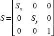
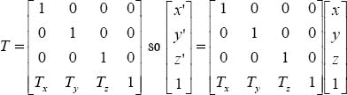
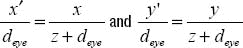

# 二、所有那些数学爵士

如果没有至少一章关于 3D 转换背后的数学知识，任何一本关于 3D 编程的书都是不完整的。如果你对此毫不在乎，那就继续前进——这里没什么可看的。毕竟 OpenGL 不是会自动处理这些东西吗？当然可以。但是熟悉里面发生的事情是有帮助的，如果没有什么比理解 3D 语言更有帮助的话。

让我们先定义一些术语:

*   *平移*:从初始位置移动物体(见图 2–1，左)
*   *旋转*:围绕原点中心点旋转物体(见图 2–1，右图)
*   *缩放*:改变对象的大小
*   *转换*:以上全部

**图 2–1。** *平移(左)和旋转(右)*

### 2D 变换

在不知道的情况下，你可能已经以简单翻译的形式使用了 2D 变换。如果您创建了一个 UIImageView 对象，并希望根据用户触摸屏幕的位置来移动它，您可以抓取它的框架并更新原点的 x 和 y 值。

#### 翻译

你有两种方法来想象这个过程。第一是物体本身相对于一个共同的原点运动。这叫做*几何变换*。第二种方法是移动世界原点，而对象保持静止。这叫做*坐标变换。*在 OpenGL ES 中，两种描述通常一起使用。

平移操作可以这样表达:

*x′*=*x*+*Tx**y′*=*y*+*Ty*

原来的坐标是 *x* 和 *y* ，而平移后的 *T* ，会把这些点移动到一个新的位置。很简单。如你所知，翻译自然会很快。

**注:**小写字母如 xyz 为坐标，大写字母如 *XYZ* 为参考轴。

#### 旋转

现在让我们来看看旋转。在这种情况下，我们将首先围绕世界原点旋转，以保持简单(见图 2–2)。

**图 2–2。** *围绕共同原点旋转*

当我们必须重温高中的三角函数时，事情自然会变得更加复杂。所以，现在的任务是找出任意旋转后正方形的角在哪里。目光呆滞地注视着大地。

**注:**按照惯例，逆时针旋转被认为是正的，而顺时针旋转是负的。

所以，把 *x* 和 *y* 作为我们正方形的一个顶点的坐标，这个正方形就被归一化了。不旋转的话，任何顶点都会自然地直接映射到我们的坐标系中，即 *x* 和 *y* 。很公平。现在我们要将正方形旋转一个角度 *a* 。虽然它的角在正方形自己的局部坐标系中仍然在“相同”的位置，但在我们的坐标系中它们是不同的，如果我们想要实际绘制该对象，我们需要知道新的坐标 *x* 和 *y* 。

现在我们可以直接跳到可靠的旋转方程，因为最终这就是代码要表达的内容:

*x′*=*x*cos(*a*)–*y*sin(*a*)*y′*=*x*sin(*a*)+*y*cos(*a*)

做一个真正快速的检查，你可以看到如果 *a* 是 0 度(无旋转)， *x* 和 *y* 减少到原来的 *x* 和 *y* 坐标。如果旋转 90 度，那么 *sin(a)=1* ， *cos(a)=0* ，所以*x′=-y*，并且*y′= x*。果然不出所料。

数学家总是喜欢用尽可能简洁的形式来表达事物。因此，2D 旋转可以用矩阵符号来“简化”:

**注:**在*星际迷航*中使用最多的一个词是*母体*。这里是模式矩阵，那里是缓冲矩阵，“第一，我头疼，需要小睡一会儿。”(不要让我开始使用 *24* 中的*协议*。)每一个自重的*星际迷航*喝酒游戏(好像任何喝酒游戏都会自重)在选词上都要用 *matrix* 。除非你的一个朋友有酗酒问题，在这种情况下，用 matrix 代替 rabid badger。我几乎可以肯定，在《星际迷航》的万神殿里，从来没有提到过獾，不管是不是狂犬病。

*Ra是我们的 2D 旋转矩阵的简写。虽然矩阵可能看起来很忙，但它们实际上非常简单，易于编码，因为它们遵循精确的模式。在这种情况下， *x* 和 *y* 可以表示为一个微小的矩阵:*

翻译也可以以矩阵形式编码。因为平移仅仅是移动点，所以平移后的值 *x* 和 *y* 来自于增加点的移动量。如果你想在同一个物体上做旋转和平移会怎么样？翻译矩阵只需要一点点非显而易见的想法。这里显示的第一个和第二个，哪个是正确的？

答案是*显然*第二个，也可能没那么明显。第一个结尾如下，没有太大意义:

*x′*=*x*+*yTx*和*y′*=*x*+*yTy*

因此，为了创建一个用于翻译的矩阵，我们需要我们的 2D 点的第三个组件，通常写成 *(x，y，1)* ，如第二个表达式中的情况。暂时忽略 1 的来源，请注意，它可以很容易地简化为:

*x′*=*x*+*Tx*和*y′*=*y*+*Ty*

*1* 的值不要与第三维的 *z* 相混淆；更确切地说，它是一种用来表达直线方程的方法(在本例中为 2D 空间),与我们在小学学过的斜率/截距略有不同。这种形式的一组坐标被称为*齐次坐标*，在这种情况下，它有助于创建一个 3×3 矩阵，该矩阵现在可以与其他 3×3 矩阵合并或连接。我们为什么要这么做？如果我们想一起做旋转和平移呢？每个点可以使用两个独立的矩阵，这样就很好了。相反，我们可以使用矩阵乘法(也称为*串联*)预先计算出几个矩阵中的一个矩阵，这反过来表示了各个转换的累积效果。这不仅可以节省一些空间，而且可以大大提高性能。

在 Java2D 中，您会在某个时候偶然发现 Java . awt . geom . affinite transform。所有可能的 2D 仿射变换都可以表示为*x′*=*ax*+*cy*+*e*和*y*=*bx*+*dy*+*f*。这构成了一个非常好的矩阵，一个可爱的矩阵:

下面是一段简单的代码，展示了如何使用 AffineTransform 进行转换和缩放。如您所见，这非常简单。

public void paint(Graphics g)
{
    AffineTransform transform = new AffineTransform();
    transform.translate(5,5);
    transform.scale(2,2);
    Graphics2D g2d = (Graphics2D)g;
    g2d.setTransform(transform);
}

#### 缩放

对于其他两种变换，让我们来看看对象的缩放或简单的大小调整:

*x′*=*xSx??*y*=*yS*y*

在矩阵形式中，这变成如下:

与其他两种变换一样，缩放的顺序在应用到几何体时非常重要。比方说，你想旋转和移动你的对象。根据你是先翻译还是后翻译，结果会明显不同。更常见的顺序是先旋转物体，然后平移，如图 2–3 左侧所示。但是如果你颠倒顺序，你会得到类似于图 2–3 中右图的东西。在这两种情况下，旋转都是围绕原点进行的。如果你想让物体围绕它自己的原点旋转，那么第一个例子就是为你准备的。如果你想让它和其他东西一起旋转，第二个就可以了。(一个典型的情况可能是让你将物体平移到世界原点，旋转它，然后再平移回来。)

**图 2–3。** *绕原点旋转后平移(左)vs 平移后旋转(右)*

那么，这和 3D 有什么关系呢？简单！如果不是全部的话，大部分原理可以应用于 3D 变换，并且用一个更少的维度更清楚地说明。

### 3D 转换

当你将所学的一切转移到 3D 空间(也称为*3-空间*)时，你会发现，就像在 2D 一样，3D 变换同样可以表示为一个矩阵，因此可以与其他矩阵连接。 *Z* 的额外维度现在是进出屏幕的场景深度。OpenGL ES 有 *+Z* 出来了

和-*Z*进去。其他系统可能会有相反的情况，甚至有 *Z* 是垂直的， *Y* 现在假设深度。我将继续使用 OpenGL 惯例，如图图 2–4 所示。

注意:从一个参照系到另一个参照系来回移动是除了试图找出福克斯为什么取消*萤火虫*之外最快的疯狂之路。1973 年出版的经典著作《交互式计算机图形的 ?? 原理》中有 *Z* 上升和+ *Y* 进入屏幕。在他的书中，微软飞行模拟器的创造者 Bruce Artwick 展示了观察平面中的 X 和 Y，但是+Z 将进入屏幕。然而，另一本书已经(得到这个！) *Z* 向上， *Y* 向右*前进*，X*向观者走来。应该有一部法律…*

**图 2–4。***z 轴朝向观察者。*

首先我们来看看 3D 变换。正如 2D 的变化仅仅是在原来的位置上增加所需的增量一样，同样的事情也适用于 3D。描述这一点的矩阵如下所示:

当然，这会产生以下结果:

*x′*=*x*+*Tx*，*y′*=*y*+*Ty*和*z′*=*z*+*Tz*

请注意添加的额外 1；这和 2D 的情况一样，所以我们的点位置现在是均匀的形式。

那么，让我们来看看旋转。人们可以有把握地假设，如果我们绕着 *z* 轴旋转(图 2–5)，方程将直接映射到 2D 版本。使用矩阵来表达这一点，下面是我们得到的结果(注意新的符号，其中 *R(z，a)* 用于明确哪个轴被寻址)。请注意，z 保持不变，因为它要乘以 1:

**图 2–5**。*绕 z 轴旋转*

这看起来几乎和 2D 的一模一样，只不过多了一个 z*=*z*。但是现在我们也可以绕着 *x* 或者 *y* 旋转。对于 *x* ，我们得到如下:*

 *

当然，对于 *y* 我们得到如下:

但是一个在另一个之上的多个转换呢？现在我们在谈论丑陋。幸运的是，您不必太担心这一点，因为您可以让 OpenGL 来完成繁重的工作。这就是它的用途。

假设我们想先绕着 *y-* 轴旋转，接着是 *x* ，然后是 *z* 。得到的矩阵可能如下所示(使用 *a* 作为围绕 *x* 的旋转， *b* 代表 *y* ，而 *c* 代表 *z* ):

简单，嗯？难怪 3D 引擎作者的口头禅是*优化，优化，优化*。事实上，在最初的 Amiga 版本《遥远的太阳》中，我的一些内部循环需要在 68K 汇编中。请注意，这甚至不包括缩放或平移。

现在让我们来看看写这本书的原因:所有这些都可以通过下面三行代码来完成:

glRotatef(b,0.0,1.0,0.0);
glRotatef(a,1.0,0.0,0.0);
glRotatef(c,0.0,0.0,1.0);

**注意:**OpenGL ES 1.1 中有很多功能是 2.0 中没有的。后者面向底层操作，为了灵活性和控制牺牲了一些易于使用的工具。转换函数已经消失，留给开发者去计算他们自己的矩阵。幸运的是，有许多不同的库来模拟这些操作并简化转换任务。

在处理 OpenGL 时，这个特殊的矩阵被称为 modelview，因为它适用于你绘制的任何东西，无论是模型还是灯光。稍后我们将处理另外两种类型:投影矩阵和 ?? 纹理矩阵。

需要重申的是，当试图让这个东西工作时，旋转的实际顺序是绝对重要的。例如，一个常见的任务是用完整的六个自由度(三个平移分量和三个旋转分量)对飞机或航天器进行建模。转动部分通常称为*滚转*、*俯仰*、*偏航* (RPY)。滚转是绕着 *z* 轴旋转，俯仰是绕着 *x-* 轴旋转(换句话说，瞄准机头向上或向下)，偏航当然是绕着 *y* 轴旋转，左右移动机头。图 2–6 显示了 20 世纪 60 年代阿波罗飞船登月时的工作情况。正确的顺序是偏航、俯仰和滚动，或者绕着 *y、x* 旋转，最后绕着 *z* 旋转。(这需要 12 次乘法和 6 次加法，而对三个旋转矩阵进行预乘可以将其减少到 9 次乘法和 6 次加法。)变换将是递增的，包括自上次更新以来 RPY 角度的变化，而不是从开始的全部变化。在过去，舍入误差可能会使矩阵复合变形，导致非常酷但出乎意料的结果(但仍然很酷)。

**图 2–6**。*阿波罗的参照系、操纵杆和人工地平线的图示*

#### 想象一下:将物体投射到屏幕上

咻，即使做了这一切，我们还没有完全完成。一旦你完成了对象的所有旋转、缩放和平移，你仍然需要将它们*投影到你的屏幕上。自从他在洞穴墙壁上画出第一只猛犸象草图以来，将 3D 场景转换到 2D 表面就一直困扰着人类。但是，与转换相反，它实际上很容易掌握。*

这里主要有两种投射在起作用:*透视*和*平行*。透视投影是我们在 2D 视网膜上看到三维世界的方式。透视图由消失点和透视缩小组成。消失点是所有平行线在远处汇聚的地方，提供了深度感(想象铁轨朝着地平线)。结果是越靠近的东西看起来越大，反之亦然，如图图 2–7 所示。平行变体，也称为*正交投影*，通过有效地将每个顶点的 *z* 分量设置为 0(我们观察平面的位置)，简单地消除了距离的影响，如图图 2–8 所示。

**图 2–7**。*透视投影*

**图 2–8**。*平行投影*

在透视投影中，距离分量 *z* 用于缩放最终将成为屏幕 *x* 和屏幕 *y* 的值。所以， *z，*或者离观看者的距离越大，作品在视觉上就越小。我们需要的是*视窗* (OpenGL 版本的窗口或显示屏)的尺寸及其中心点，通常是 XY 平面的原点。

这最后一个阶段包括设置视图*视锥*。平截头体建立了六个裁剪平面(顶部、底部、左侧、右侧、近侧和远侧),以精确确定用户应该看到什么，以及如何将其投影到他们的*视口*,这是 OpenGL 版本的窗口或屏幕。这就像是你的 OpenGL 虚拟世界中的一个镜头。通过更改这些值，您可以放大或缩小并剪切很远的内容或根本不剪切，如图图 2–9 和图 2–10 所示。这些值定义了*透视*矩阵。

**图 2–9。** *窄边框的平截头体给你一个高倍镜头。*

**图 2–10**。*更宽的边界像一个广角镜头*。

随着这些边界的建立，最后一个转换是到*视窗*，你的屏幕的 OpenGL 版本。这是 OpenGL 接收屏幕尺寸、显示区域尺寸和原点(可能是屏幕的左下角)的地方。在手机或平板电脑等小型设备上，你可能会填满整个屏幕，因此会使用屏幕的整个宽度。但是如果您想将图像放在主显示的子窗口中，您可以简单地将较小的值传递给 viewport。相似三角形法则在这里发挥作用。

在图 2–11 中，我们想要找出投影的*x′*是什么，给定模型上任意顶点的 *x* 。考虑两个三角形，一个由角 CBA 形成，另一个由 COA' 形成(其中 *0* 表示*原点*)。从 C(眼睛所在的位置)到 0 的距离为 *d* 。从 C 到 B 的距离是 *d+z* 。所以，就拿这些的比率来说，如下:

产生以下结果:

**图 2–11**。*使用相似三角形法则将一个顶点映射到视口*

图 2–12 显示了最终的翻译。那些可以加到*x′*和*y′*:

**图 2–12**。*将 x 和 y 投影到设备屏幕上。您可以将此想象为将您的设备平移到对象的坐标(左)，或将对象平移到设备的坐标(右)。*

当像素尘埃落定，我们有一个很好的矩阵形式:

通常需要一些最终的缩放，例如，如果视口被规格化。但这取决于你。

#### 现在穿着高跟鞋倒着做

据说这是金格尔·罗杰斯在谈到她与伟大的弗雷德·阿斯泰尔共舞的感受时所说的一句话。他的回答是，虽然他很棒，但她必须做他做的每件事*和*倒着穿高跟鞋做。(罗杰斯显然从未说过这句话，因为它的用法可以追溯到连环漫画《弗兰克和欧内斯特》中的一句插科打诨的台词。)

那么，这和转换有什么关系呢？假设您想通过触摸屏幕来判断是否有人拿走了您的某个对象。你怎么知道你的哪个对象被选中了？您必须能够进行逆变换，将屏幕坐标“解映射”回 3D 空间中可识别的位置。但是由于 z 值在这个过程中会丢失，所以有必要在对象列表中进行搜索，以找出哪个是最有可能的目标。不改变某些东西需要你向后做所有的事情(如果你喜欢这种事情，还可以穿高跟鞋)。这是通过以下方式完成的:

1.  将模型视图矩阵与投影矩阵相乘。
2.  反转结果。
3.  将触摸点的屏幕坐标转换为视窗的参考框架。
4.  取其结果并乘以步骤 2 中的逆矩阵。

不要担心，这将在本书的后面有更详细的介绍。

#### 四元数呢？

四元数是超复数，可以将 RPY 信息存储在四维向量类型的东西中。它们在性能和空间上都非常有效，通常用于在飞行模拟中模拟飞机或航天器的瞬时航向。它们是一种奇特的生物，具有很好的特性，但留待以后使用，因为 OpenGL 不直接支持它们。

### 总结

在本章中，您学习了 3D 数学的基础知识。本章首先介绍了 2D 变换(旋转、平移和缩放)，然后介绍了 3D，还介绍了投影。虽然你可能不需要自己编写任何转换代码，但是熟悉这一章是理解大部分 OpenGL 术语的关键。我头疼。*