# 三、从 2D 到 3D：增加一个额外的维度

在前两章，我们讨论了酷的东西和数学的东西(可能很酷也可能很无聊)。在第三章中，我们将把弹跳立方体的例子从 2D 版本转移到 3D 版本(4D 超立方体不在本文讨论范围之内)。在这个过程中，更多的关于投影、旋转等的 3D 理论将被加入进来。但是，请注意，OpenGL 不仅仅用于 3D，还可以很容易地用于将 2D 控件放在 3D 可视化的前面。

### 首先，多一点理论

记住 OpenGL ES 对象是 3D 空间中的点的集合；也就是说，它们的位置由三个值定义。这些值连接在一起形成面，面是看起来非常像三角形的平面。这些三角形然后被连接在一起形成物体或物体的碎片。

为了得到一串形成顶点的数字，形成颜色的其他数字，以及在屏幕上组合顶点和颜色的其他数字，有必要告诉系统它的图形环境。完成 3D 电路需要视点位置、接收图像的窗口(或视口)、长宽比以及其他各种数字碎片。更具体地说，我将介绍 OpenGL 的坐标，它们如何与平截头体相关，如何从场景中裁剪或挑选对象，以及如何在设备的显示器上绘图。

注意:你可能想知道我们什么时候会谈到酷酷的行星。很快，小蚱蜢，很快。

#### OpenGL 坐标

如果你曾经在任何系统上绘制过任何类型的图形，你就会熟悉普通的 X-Y 坐标系统。x 始终是水平轴，右为正，而 Y 始终是垂直轴，下为正，将原点放在左上角。被称为*屏幕坐标*，它们很容易与*数学坐标*混淆，后者将原点放在左下角，对于 Y，up 为正。

现在跳到 OpenGL 3D 坐标，我们有一个稍微不同的系统，使用*笛卡尔*坐标，空间中表示位置的标准。通常，对于 2D 显示器上的屏幕坐标，原点在左上角，X 向右，Y 向下。但是，OpenGL 的原点在左下角，+Y 向上。但是现在我们增加了一个第三维度，表示为 Z。在这种情况下，+Z 指向你，如图图 3–1 所示。

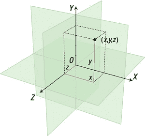

**图 3–1。** *OpenGL ES 3D 笛卡尔坐标系(图片由 Jorge Stolfi 提供)*

事实上，在 OpenGL 中我们有几种坐标系，或者说*空间*，每个空间都被转换到下一个空间:

*   *对象*空间，相对于你的每一个对象。
*   相机，或*眼*，空间，局部于你的视点。
*   投影，或*剪辑*，空间，这是显示最终图像的 2D 屏幕或视窗。
*   *切线*空间，用于更高级的效果，如凹凸贴图，这将在后面介绍。
*   标准化设备坐标(NDCs)，表示从-1 到 1 的标准化 xyz 值*。也就是说，该值(或一组值)被规范化，以使其适合边长为 2 个单位的立方体。*
*   窗口，或*屏幕*，坐标，这是你的场景在实际屏幕上显示时的最终位置(无疑会赢得热烈的掌声)。

自然，前者可以用流水线形式表示，如图图 3–2 所示。

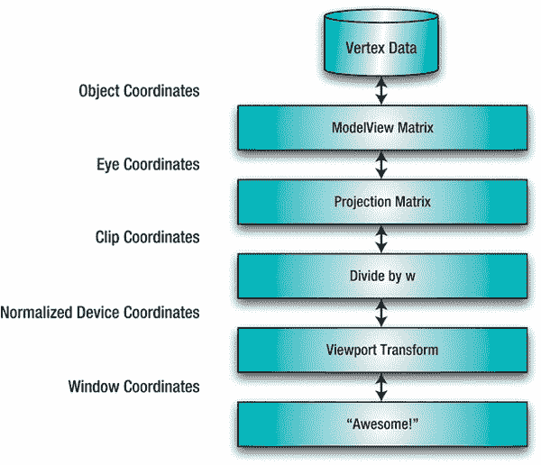

**图 3–2。** *顶点变换流水线*

对象、视点和剪辑空间是你通常需要担心的三个问题。例如，用本地原点生成物体坐标，然后移动并旋转到*眼空间*。例如，如果你有一堆战斗游戏的飞机，每一架都有自己的本地来源。你应该能够通过移动，或者*平移*，将平面移动到你世界的任何地方，只移动原点，让其余的几何体跟着移动。在这一点上，对象的可见性是针对视见平截头体进行测试的，视见平截头体是定义虚拟相机实际可以看到什么的空间体积。如果它们位于平截头体之外，它们被认为是不可见的，因此被剪切或剔除，以便不对它们进行进一步的操作。你可能还记得《??》第一章，图形引擎设计的大部分工作都集中在引擎的裁剪部分，以便尽早转储尽可能多的对象，从而产生更快更高效的系统。

最后，在所有这些之后，OpenGL 面向屏幕的部分准备好转换，或者说*投影*，剩余的对象。这些对象是你的飞机、齐柏林飞艇、导弹、路上的卡车、海上的船只、投石机，以及任何你想塞进应用的东西。

**注意:** OpenGL 并没有真正定义任何东西为“世界空间”然而，眼睛坐标是下一个最好的东西，因为你可以定义与你的位置相关的一切。

#### 眼睛坐标

OpenGL 中没有神奇的眼点对象。因此，不是移动眼点，而是移动与眼点相关的所有对象。是的，这很容易混淆，你会发现自己不断改变数值的符号，画有趣的图表，并以奇怪的方式伸出手，试图找出为什么你的投石机是颠倒的。在眼点相对坐标中，对象实际上是远离您，而不是远离对象。想象一下，你正在制作一个汽车飞驰而过的视频。在 OpenGL 下，汽车会静止不动；你和你周围的一切都会被它感动。这主要是通过`glTranslate*()`和`glRotate*()`调用来完成的，稍后您将会看到。正是在这一点上，上一章提到的 OpenGL 的模型视图矩阵发挥了作用。您可能还记得模型视图矩阵处理基本的 3D 转换(与投影矩阵相对，投影矩阵*将 3D 视图*投影到屏幕的 2D 空间，或者纹理矩阵，帮助将图像应用到您的对象)。你会经常提到它。

#### 查看视锥和投影矩阵

在几何学中，*平截头体*是(典型的)棱锥或圆锥体的一部分，由两个平行平面切割而成。换句话说，想想顶部三分之一被砍掉的吉萨大金字塔(我不是在纵容对埃及古物的破坏)。在图形中，视见平截头体定义了我们的虚拟相机可以实际看到的世界部分，如图图 3–3 所示。

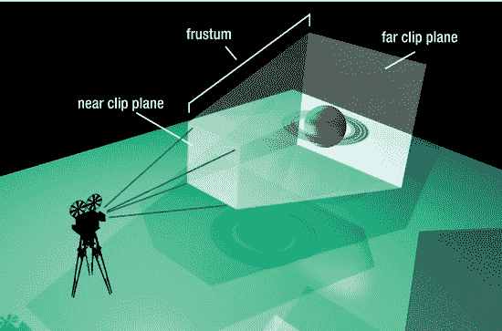

**图 3–3。** *视锥*

与 OpenGL 中的许多东西不同，视见平截头体的定义非常简单，并且通过简单地定义空间中的一个体积，即视见金字塔，来紧密地遵循概念图形。只要不被任何更近的物体遮挡，任何整体或部分在平截头体内的物体最终都可能找到它们到屏幕的路径。

平截头体也用于指定你的视野(FOV)，就像你的相机的广角镜头与长焦镜头。侧平面与中心轴相比形成的角度越大(即它们如何散开)，FOV 就越大。一个更大的 FOV 将允许你的世界的更多部分可见，但也会导致更低的帧速率。

到目前为止，平移和旋转使用 ModelView 矩阵，使用调用 gl 很容易设置。`glMatrixMode(GL_MODELVIEW);`。但是现在在渲染管道的这个阶段，您将定义并使用投影矩阵。这很大程度上是通过第二章的“图片”一节中的视锥定义来完成的。而且这也是一个惊人的紧凑的手段，可以做很多操作。

将变换后的顶点转换成 2D 图像的最后步骤如下:

1.  平截头体内的 3D 点被映射到归一化立方体，以将 XYZ 值转换为 NDC。NDC 代表归一化设备坐标，这是一个描述位于平截头体内的坐标空间的中间系统，与分辨率无关。这在将每个顶点和每个对象映射到设备屏幕时非常有用，无论它有多大或多少像素，无论它是手机、平板电脑还是屏幕尺寸完全不同的新产品。一旦有了这种形式，坐标就“移动”了，但仍然保持着它们之间的相对关系。当然，在 NDC，它们的值在-1 到 1 之间。请注意，Z 值在内部翻转。现在 Z 向你走来，而+Z 正在离开，但谢天谢地，那巨大的不愉快都被隐藏起来了。
2.  然后这些新的 NDC 被映射到屏幕上，考虑到屏幕的纵横比和顶点到屏幕的“距离”,如由近裁剪平面指定的。结果是，越远的东西越小。大多数数学只是用来确定截锥内这个或那个的比例。

前面的步骤描述了*透视投影*，这是我们平常看待世界的方式。也就是说，越远的东西，看起来就越小。当那些固有的扭曲被移除时，我们得到了*正投影*。此时，无论物体有多远，它仍然显示相同的大小。当任何透视变形会破坏原始艺术品的意图时，正交渲染通常用于机械工程图中。

**注意:**你将经常需要直接处理你正在处理的矩阵。对`gl.glMatrixMode()`的调用用于指定当前矩阵，所有后续操作都将应用于当前矩阵，直到改变为止。忘记哪个矩阵是当前矩阵是一个容易犯的错误。

### 回到有趣的事情:超越蹦蹦跳跳的广场

现在我们可以回到在第一章中使用的例子。既然我们已经开始认真对待 3D，那么需要添加一些东西来处理 Z 维，包括立方体几何和颜色的更大数据集，将数据传递给 OpenGL 的方法，更复杂的平截头体定义，任何需要的面剔除技术，以及旋转而不仅仅是平移。

**注:** *翻译*是指在你的世界中上下左右前后移动物体，而*旋转*是指绕任意轴旋转物体。并且两者都被认为是*变换*。

#### 添加几何图形

从第一章的开始，您将记住清单 3–1 中定义的数据。首先是四个角的位置，顶点，顶点是如何连接在一起的，以及它们是如何着色的。

**清单 3–1。** *定义 2D 广场*

`float vertices[] =
        {
                    -1.0f, -1.0f,
                     1.0f, -1.0f,
                    -1.0f,  1.0f,
                     1.0f,  1.0f
        };

        byte maxColor=(byte)255;

        byte colors[] =
        {
                    maxColor,maxColor,                0,maxColor,
                    0,               maxColor, maxColor,maxColor,
                    0,                               0,                  0,maxColor,
                    maxColor,               0, maxColor, maxColor
        };

        byte indices[] =
        {
                0, 3, 1,
                0, 2, 3
        };`

现在这可以扩展到包括 z 组件，从额外的顶点开始，如清单 3–2 的第 1 行所示。代码的其他细节将在列表后讨论。

**清单 3–2。** *定义 3D 立方体*

 `float vertices[] =
        {
                    -1.0f,  1.0f, 1.0f,                                          //1
                     1.0f,  1.0f, 1.0f,
                     1.0f, -1.0f, 1.0f,
                    -1.0f, -1.0f, 1.0f,

                    -1.0f,  1.0f,-1.0f,
                     1.0f,  1.0f,-1.0f,
                     1.0f, -1.0f,-1.0f,
                    -1.0f, -1.0f,-1.0f
        };

        byte maxColor=(byte)255;

        byte colors[] =                                                      //2
        {
                    maxColor,maxColor,       0,maxColor,
                    0,       maxColor,maxColor,maxColor,
                    0,              0,       0,maxColor,
                    maxColor,       0,maxColor,maxColor,

                    maxColor,       0,       0,maxColor,
                    0,       maxColor,       0,maxColor,
                    0,              0,maxColor,maxColor,
                    0,              0,       0,maxColor
        };

        byte tfan1[] =
        {
                    1,0,3,
                    1,3,2,
                    1,2,6,
                    1,6,5,
                    1,5,4,
                    1,4,0

        };

        byte tfan2[] =
        {
                    7,4,5,
                    7,5,6,
                    7,6,2,
                    7,2,3,
                    7,3,0,
                    7,0,4
        };`

第 1 行将顶点扩展到三维，而颜色数组，第 2ff 行，对颜色做同样的事情。

图 3–4 显示了顶点排序的方式。在正常情况下，您将永远不必以这种方式定义几何图形。您可能会从以一种标准 3D 数据格式存储的文件中加载对象，例如 3D Studio 或 Modeler 3D 所使用的格式。考虑到这样的文件可能有多复杂，不建议您自己编写，因为大多数主要格式的导入程序都是可用的。

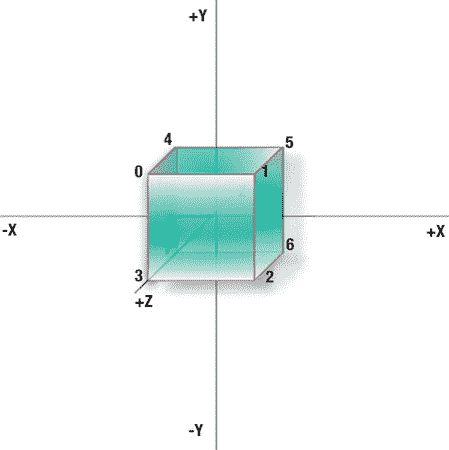

**图 3–4。** *注意不同的轴:X 向右，Y 向上，Z 朝向观察者。*

颜色数组的大小，如清单 3–2 的第 2 行所示，因为顶点的数量加倍而加倍；在其他方面，它们与第一个示例中的相同，只是背面的颜色有所不同。

现在需要一些新数据来告诉 OpenGL 顶点的使用顺序。对于正方形来说，手动排序或*排序*数据是显而易见的，这样四个顶点就可以代表两个三角形。立方体使这变得相当复杂。我们可以用单独的顶点数组来定义立方体的六个面，但是对于更复杂的对象来说，这种方法不太适用。而且它的效率比不得不通过图形硬件传输六组数据要低。从内存和速度的角度来看，将所有数据保存在一个数组中是最有效的。那么，我们如何告诉 OpenGL 数据的布局呢？在这种情况下，我们将使用如图图 3–5 所示的*三角扇*的绘图模式。

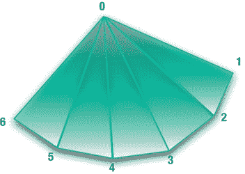

**图 3–5。** *三角形扇形与所有三角形有一个公共点。*

有许多不同的方法可以将数据存储并呈现给 OpenGL ES。一种格式可能更快，但使用更多的内存，而另一种格式可能使用更少的内存，但会有一点额外的开销。如果您要从其中一个 3D 文件导入数据，很可能它已经针对其中一种方法进行了优化，但是如果您真的想要手动调整系统，您可能需要在某些时候将顶点重新打包为您的应用喜欢的格式。

除了三角扇，你会发现其他方式可以存储或表示数据，称为*模式*。

*   点和线只是说明:点和线。OpenGL ES 可以把你的顶点仅仅渲染成可定义大小的点，或者可以渲染点之间的线来显示线框版本。分别使用`GL10.GL_POINTS`和`GL10.GL_LINES`。
*   线条、`GL10.GL_LINE_STRIP`是 OpenGL 在一个镜头中绘制一系列线条的一种方式，而线条循环、`GL10.GL_LINE_LOOP`类似于线条，但总是将第一个和最后一个顶点连接在一起。
*   三角形，三角条，三角扇，圆出 OpenGL ES 图元列表:`GL10.GL_TRIANGLES`，GL10。`GL_TRIANGLE_STRIP`和`GL10.GL_TRIANGLE_FAN`。OpenGL 本身可以处理额外的模式，如四边形(有四个顶点/边的面)、四边形带和多边形。

**注:**术语*图元*表示图形系统中数据的基本形状或形式。基本体的例子包括立方体、球体和圆锥体。该术语也可用于更简单的形状，如点、线，以及在 OpenGL ES 中的三角形和三角扇。

当使用这些低级对象时，你可能会想起在《??》第一章第一个例子中，有一个索引数组来告诉你哪些顶点与哪些三角形匹配。在定义三角形数组(在清单 3–2 中称为`tfan1`和`tfan2`)时，您使用了类似的方法，除了所有的索引集合都从同一个顶点开始。例如，数组`tfan1`中的前三个数字是 1、0 和 3。这意味着第一个三角形依次由顶点 1、0 和 3 组成。于是，回到数组 *`vertices`* ，顶点 1 位于 x=1.0f，y=1.0f，z=1.0f，顶点 0 是 x=-1.0f，y=1.0f，z=1.0f 的点，而我们的三角形的第三个角位于 x=-1.0，y=-1.0，z=1.0。好处是这使得创建数据集变得容易得多，因为实际的顺序现在无关紧要了，而坏处是它使用了更多的内存来存储额外的信息。

立方体可以分成两个不同的三角形扇形，这就是为什么有两个索引数组。第一个包含正面、正面和顶面，而第二个包含背面、底面和左面，如图图 3–6 所示。

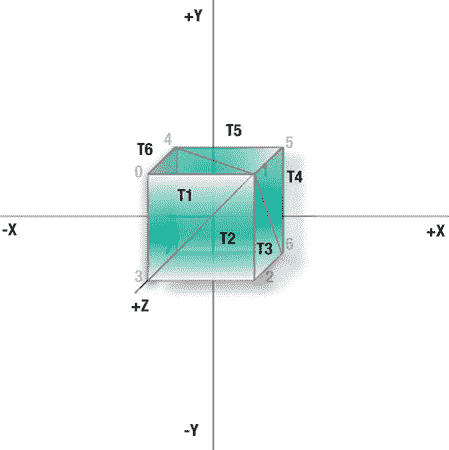

**图 3–6。** *第一个三角形扇面的顶点 1 为公共顶点。*

#### 将它们缝合在一起

现在必须修改呈现代码来处理新数据。清单 3–3 展示了新`constructor`方法的其余部分，就在清单 3–2 中的数据定义下面。这将复制第一章示例的大部分内容，除了使用三角形扇形代替连接数组和两个对`gl.glDrawArray()`的调用。这是必需的，因为立方体分为两部分，必须分别绘制，一部分用于定义两个三角形扇的三个面或六个三角形。

**清单 3–3。** *其余的构造函数方法*

`        ByteBuffer vbb = ByteBuffer.*allocateDirect*(vertices.length * 4);
        vbb.order(ByteOrder.*nativeOrder*());
        mFVertexBuffer = vbb.asFloatBuffer();
        mFVertexBuffer.put(vertices);
        mFVertexBuffer.position(0);

        mColorBuffer = ByteBuffer.*allocateDirect*(colors.length);
        mColorBuffer.put(colors);
        mColorBuffer.position(0);

        mTfan1 = ByteBuffer.*allocateDirect*(tfan1.length);
        mTfan1.put(tfan1);
        mTfan1.position(0);

        mTfan2 = ByteBuffer.*allocateDirect*(tfan2.length);
        mTfan2.put(tfan2);
        mTfan2.position(0);`

**注意:**你会注意到很多 OpenGL ES 调用都以 *f* 结尾，比如`gl.glScalef()`、`gl.glRotatef()`等等。 *f* 表示传递的参数是浮点数。OpenGL ES 中唯一需要特殊调用的其他参数类型是定点值，所以`glScale`现在应该是`gl.glScalex()`。定点对于旧的和较慢的设备是有用的，但是对于较新的硬件，建议使用浮点调用。您会注意到，颜色数组和其他属性可以作为字节、整数、长整型等等来收集。但是他们没有考虑拥有一套专用的 API 调用。

清单 3–4 展示了前一个例子中更新的`draw`方法。这与第一章中的基本相同，但是它自然有了我们的新朋友，三角粉丝，而不是索引数组。

**清单 3–4。** *更新了`draw`方法*

`public void draw(GL10 gl)
        {
           gl.glVertexPointer(3, GL11.*GL_FLOAT*, 0, mFVertexBuffer);
           gl.glColorPointer(4, GL11.*GL_UNSIGNED_BYTE*, 0, mColorBuffer);

           gl.glDrawElements( gl.*GL_TRIANGLE_FAN*, 6 * 3, gl.*GL_UNSIGNED_BYTE*, mTfan1);
           gl.glDrawElements( gl.*GL_TRIANGLE_FAN*, 6 * 3, gl.*GL_UNSIGNED_BYTE*, mTfan2);
        }`

清单 3–5 显示了对`CubeRenderer.java`的调整`onDrawFrame`。

**清单 3–5。** *略加修改后的`onDrawFrame`*

`public void onDrawFrame(GL10 gl)
        {
           gl.glClear(GL10.*GL_COLOR_BUFFER_BIT* | GL10.*GL_DEPTH_BUFFER_BIT*);
           gl.glClearColor(0.0f,0.5f,0.5f,1.0f);                                  //1

           gl.glMatrixMode(GL10.*GL_MODELVIEW*);
           gl.glLoadIdentity();
           gl.glTranslatef(0.0f,(float)Math.*sin*(mTransY), -7.0f);                 //2
           gl.glEnableClientState(GL10.*GL_VERTEX_ARRAY*);
           gl.glEnableClientState(GL10.*GL_COLOR_ARRAY*);

           mCube.draw(gl);

           mTransY += .075f;
        }`

这里没有真正的戏剧性变化:

*   在第 1 行，我已经添加了`gl.glClearColor`到这个组合中。这指定了清除框架时应该使用的颜色。这里的颜色是迷人的蓝绿色。
*   在第 2 行中，翻译中的 z 值被提高到-7，只是为了使立方体的描绘看起来更自然一些。

最后一组变化如清单 3–6 所示，它定义了视见平截头体。这里有更多的信息，以便处理不同的显示大小，并使代码更容易理解。

**清单 3–6。** *新的平截体代码*

`public void onSurfaceChanged(GL10 gl, int width, int height)
        {
            gl.glViewport(0, 0, width, height);

            float aspectRatio;
            float zNear =.1f;
            float zFar =1000;
            float fieldOfView = 30.0f/57.3f;                                     //1
            float size;

            gl.glEnable(GL10.*GL_NORMALIZE*);

            aspectRatio=(float)width/(float)height;                              //2

            gl.glMatrixMode(GL10.*GL_PROJECTION*);                                 //3

            size = zNear * (float)(Math.*tan*((double)(fieldOfView/2.0f)));        //4

            gl.glFrustumf(-size, size, -size /aspectRatio,                       //5
                                        size /aspectRatio, zNear, zFar);

            gl.glMatrixMode(GL10.*GL_MODELVIEW*);                                  //6
        }`

下面是正在发生的事情:

*   第 1 行用给定的 FOV 定义了平截头体，在选择值时更加直观。按照 Java 数学库的要求，30 度的字段被转换成弧度，而 OpenGL 坚持使用度。
*   第 2 行中的纵横比基于宽度除以高度。因此，如果宽度为 1024×768，长宽比为 1.33。这有助于确保图像的比例适当缩放。否则，如果视图不考虑长宽比，它的对象看起来会被压扁。
*   接下来，第 3 行确保当前矩阵模式被设置为投影矩阵。
*   第 4 行的任务是计算尺寸值，该值需要指定观察体积的左/右和上/下限值，如图图 3–3 所示。这可以被认为是你进入三维空间的虚拟窗口。以屏幕中心为原点，您需要在两个维度上从-size 到+size。这就是磁场被一分为二的原因——因此，对于 60 度的磁场，窗口将从-30 度变为+30 度。将尺寸乘以`zNear`仅仅是增加了某种缩放暗示。最后，用长宽比除上下限，以确保你的正方形是真正的正方形。
*   现在我们可以将这些数字输入到`gl.glFrustum()`，如第 5 行所示，然后将当前矩阵重置回`GL10.GL_MODELVIEW`。

如果工作正常，您应该会看到一些看起来完全像原来的弹性立方体！等等，你没被打动？好的，如果你要那样，让我们给它添加一些旋转。

##### 带她出去兜风

现在是时候给场景添加一些更有趣的动画了。除了上下弹跳之外，我们还要慢慢旋转它。在 glond`rawFrames()`的底部添加以下一行:

`        mAngle+=.4;`

右侧*在*GL 之前。`glTranslatef()`调用，添加以下内容:

`        gl.glRotatef(mAngle, 0.0f, 1.0f, 0.0f);
        gl.glRotatef(mAngle, 1.0f, 0.0f, 0.0f);`

并且自然地将`private float mAngle;`和其他定义一起添加到文件的底部。

现在再跑一次。“嘿！嗯？”将是最有可能的反应。立方体似乎没有旋转，而是围绕你的视点旋转(同时弹跳)，如图 3–7 所示。这说明了基本 3D 动画中最令人困惑的元素之一:获得正确的平移和旋转顺序。(还记得第二章里的讨论吗？)

考虑我们的立方体。如果你想让一个立方体在你面前旋转，正确的顺序是什么？旋转然后平移？还是平移然后旋转？追溯到五年级的数学课，你可能记得学过加法和乘法是可交换的。也就是说，运算的顺序并不重要:a+b=b+a，或者 a*b=b*a。嗯，3D 变换是*而不是*可交换的(最后，一个我从未想过我会需要的东西的用途！).也就是说，旋转*平移和平移*旋转不一样。参见图 3–8。

右边是你现在在旋转立方体例子中看到的。立方体首先被平移，然后被旋转，但是因为旋转是围绕“世界”原点(视点的位置)进行的，所以你会看到它好像在你的头周围旋转。

现在到了明显的不计算时刻:在示例代码中，旋转没有放在平移之前吗？

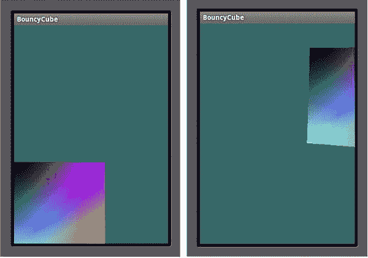

**图 3–7。** *平移第一，旋转第二*

所以，这应该是导致全国突然皱起眉头的原因:

 `gl.glRotatef(mAngle, 0.0f, 1.0f, 0.0f);
        gl.glRotatef(mAngle, 1.0f, 0.0f, 0.0f);

        gl.glTranslatef(0.0f, (float)(sinf(mTransY)/2.0f), z);` 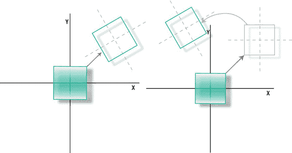

**图 3–8。** *先旋转还是先平移？*

然而，在现实中，变换的顺序实际上是从最后到第一个应用的。现在将`gl.glTranslatef()` *放在两个旋转的*前面，你应该会看到类似于图 3–9 的东西，这正是我们最初想要的。下面是完成这项工作所需的代码:

`        gl.glTranslatef(0.0f, (float)(sinf(mTransY)/2.0f), z);

        gl.glRotatef(mAngle, 0.0f, 1.0f, 0.0f);
        gl.glRotatef(mAngle, 1.0f, 0.0f, 0.0f);`

有两种不同的方法来可视化变换排序:局部坐标和世界坐标方法。在前一种情况下，你将物体移动到它们最终的静止位置，然后*和*进行旋转。由于坐标系是局部的，所以对象将围绕自己的原点旋转，这使得从上到下时前面的序列有意义。如果您选择世界方法，这实际上是 OpenGL 正在做的，您必须在执行平移之前首先围绕对象的局部轴执行旋转。这样，转换实际上是自下而上发生的。最终结果是一样的，代码也是一样的，两者都令人困惑，很容易出现混乱。这就是为什么你会看到许多 3D 男孩或女孩拿着一臂长的东西，同时四处移动，以帮助他们弄清楚为什么他们漂亮的弹射器模型在地面下飞行。我称之为 *3D 洗牌*。

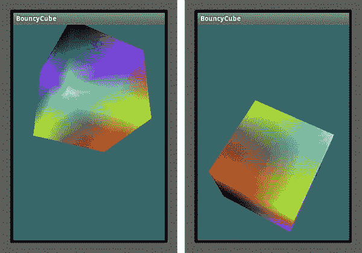

**图 3–9。** *让立方体旋转*

现在需要注意的最后一个转换命令是 gl。`glScale()`，用于沿所有三个轴调整模型大小。假设你需要将立方体的高度增加一倍。您可以使用行`glScalef(1,2,1)`。记住高度是和 Y 轴对齐的，而宽度和深度是 X 和 Z，这是我们不想碰的。

现在的问题是，在调用`onDrawFrame()`中的`gl.glRotatef()`之前或之后，你会把线放在哪里，以确保立方体的几何形状是唯一受影响的东西，如图图 3–10 中的左图所示？

如果你说了之后，比如这样:

`        gl.glTranslatef(0.0f, (GLfloat)(sinf(mTransY)/2.0f), z);

        gl.glRotatef(mAngle, 0.0, 1.0, 0.0);
        gl.glRotatef(mAngle, 1.0, 0.0, 0.0);

        gl.glScalef(1,2,1);`

你是对的。这样做的原因是，由于列表中的最后一个变换实际上是第一个执行的变换，如果您想要调整对象几何体的大小，必须将缩放放在任何其他变换之前。把它放在其他任何地方，你可能会得到类似于图 3–10 中右图的东西。那么，那里发生了什么？这是由代码片段生成的:

`        gl.glTranslatef(0.0f, (float)(sinf(mTransY)/2.0f), z);

        gl.glScalef(1,2,1);

        gl.glRotatef(mAngle, 0.0f, 1.0f, 0.0f);
        gl.glRotatef(mAngle, 1.0f, 0.0f, 0.0f);` 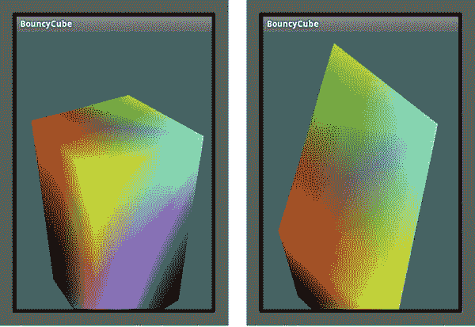

**图 3–10。** *执行旋转前的缩放(左)和旋转后的缩放(右)*

首先旋转几何体，然后旋转立方体的局部轴，该轴不再与原点的轴对齐。随后缩放，它沿着世界的 Y 轴伸展，而不是它自己的 Y 轴。这就好像你已经从一个旋转了一半的立方体的顶点列表开始，并且只缩放了它。所以，如果你在最后做了缩放，你的整个世界也缩放了。

##### 调整数值

现在更多的乐趣来了，当我们可以开始玩不同的值。这一节将展示许多不同的原则，这些原则不仅与 OpenGL ES 相关，而且几乎在你可能偶然发现的每一个 3D 工具包中都可以找到。

###### 裁剪区域

有了工作演示，我们可以通过调整一些值和观察变化来获得乐趣。首先，我们将通过将`zFar`的值从 1000 降低到 6.0 来改变平截头体中的远裁剪平面。为什么呢？记住立方体的本地原点是 7.0，它的大小是 2.0。因此，当直接面对我们时，最接近的点将是 6.0，因为每一边都将跨在原点上，每一边都有 1.0。因此，通过将`zFar`的值更改为 6.0，当立方体正对着我们时，它将被隐藏。但是有些部分会透过来，看起来就像一片漂浮在水面上的漂浮物。原因是当它旋转时，角自然会更靠近观察平面，如图图 3–11 所示。

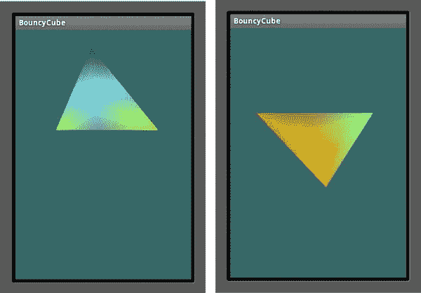

**图 3–11。** *躲猫猫！当立方体的任何部分位于比`zFar`更远的地方时，立方体被剪切。*

那么，当我将近剪裁平面移动得更远时会发生什么呢？将`zFar`重置为 1000(一个足够大的任意数字，以确保我们可以看到我们练习中的所有内容)，并将`zNear`从. 1 设置为 6.0。你认为它会是什么样子？这将与前面的例子相反。结果见图 3–12。

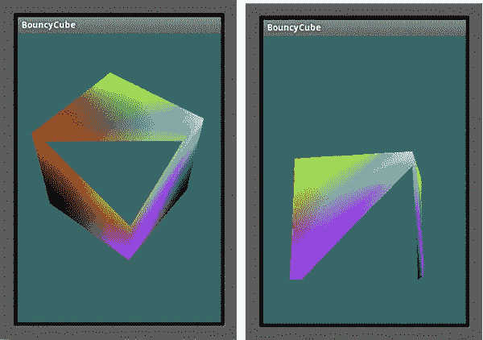

**图 3-12。***`zFar`平面被重置，而`zNear`平面被移回以剪切立方体中任何过于靠近的部分。*

像这样的 z 裁剪在处理大型复杂的世界时非常有用。您可能不希望所有您可能“正在看”的对象都被渲染，因为大多数对象可能离得太远而无法真正看到。设置`zFar`和`zNear`来限制可视距离可以加快系统速度。然而，这并不是在对象进入管道之前预切割对象的最佳替代方法。

###### 视野

记住，观众的 FOV 也可以在视锥设置中改变。再次回到我们有弹性的朋友那里，确保你的`zNear`和`zFar`设置回到正常值 0.1 和 1000。现在将`gl.onDrawFrame()`中的`z`值改为-20 并再次运行。图 3–13 中最左边的图像是你应该看到的。

接下来我们要放大。转到`setClipping()`，将`fieldOfView=10`的度数从 30 度更改为。结果显示在图 3–13 的中间图像中。请注意，与最右边的图像相比，立方体没有明显的消失点或透视效果。当你在相机上使用变焦镜头时，你会看到同样的效果，因为缩短效果是不存在的，使事物看起来像正交投影。

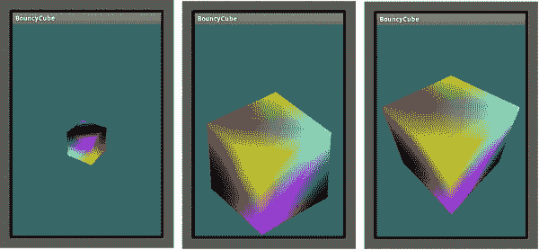

**图 3–13。** *将物体移开(左)，然后用 10 FOV(中)放大。最右边的图像的默认 FOV 值设置为 50，立方体仅在 4 个单位之外。*

###### 人脸剔除

让我们回到几页前你可能记得的一行代码:

`        gl.glEnable(GL_CULL_FACE);`

这使得背面剔除成为可能，在第一章中有介绍，这意味着物体背面的面不会被画出来，因为它们无论如何都不会被看到。它最适用于凸面对象和基本体，如球体或立方体。该系统计算每个三角形的面法线，这是一种判断一个面是朝向我们还是远离我们的方法。默认情况下，面绕组为逆时针方向。因此，如果一个 CCW 面是针对我们的，它将被渲染，而所有其他的将被剔除。如果您的数据是非标准的，您可以用两种不同的方法来改变这种行为。您可以指定正面三角形按顺时针方向排序，或者剔除转储正面而不是背面。要查看这一点，请将下面一行添加到`onSurfaceCreated()`方法中:`gl.glCullFace(GL10.GL_FRONT);`。

图 3–14 显示了移除前面的三角形，只显示后面的三角形的结果。

**注意:** `gl.glEnable()`是一个频繁调用，用于改变各种状态，从消除背面，如前所示，到平滑点(`GL10.GL_POINT-SMOOTH`)到执行深度测试(`GL10.GL_DEPTH_TEST`)。

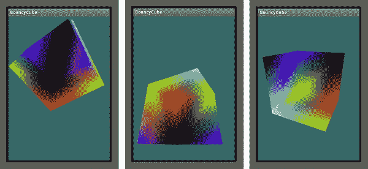

**图 3–14。** *背面现在可见，而正面被剔除。*

### 建造一个太阳系

有了这些 3D 武器库中的基本工具，我们实际上可以开始建造一个小型太阳系模型的主要项目。太阳系之所以如此理想，是因为它有一个非常基本的简单形状，几个必须都围绕彼此运动的物体，以及一个单一的光源。最初使用立方体示例的原因是，它的形状是 3D 所能得到的最基本的形状，所以代码中没有多余的几何图形。当你到达像一个球体这样的东西时，正如你将看到的，大部分代码将会创建这个对象。

尽管 OpenGL 是一个很好的底层平台，但当涉及到任何更高层次的东西时，它仍有许多不足之处。正如你在第一章中看到的，当谈到建模工具时，许多可用的第三方框架最终可以用来完成这项工作，但目前我们只是坚持使用基本的 OpenGL ES。

**注:**除了 OpenGL 本身，还有一个流行的助手工具包叫做 GL Utility Toolkit(GLUT)*。* GLUT 为基本的窗口 UI 任务和管理功能提供了可移植的 API 支持。它可以构造一些基本的原语，包括一个球体，因此在做小项目时非常方便。不幸的是，在撰写本文时，还没有官方的 Android 或 iOS 库，尽管目前正在进行一些努力。

首先要做的是创建一个新项目或导入一个以前的项目，该项目建立了通常的 OpenGL 框架，包括渲染器和几何对象。在这种情况下，它是一个由清单 3–7 描述的球体。

**清单 3–7。** *建造我们的 3D 星球*

`package book.SolarSystem;

import java.util.*;
import java.nio.*;
import javax.microedition.khronos.opengles.GL10;

public class Planet
{
    FloatBuffer m_VertexData;
    FloatBuffer m_NormalData;
    FloatBuffer m_ColorData;

    float m_Scale;
    float m_Squash;
    float m_Radius;
    int m_Stacks, m_Slices;

    public Planet(int stacks, int slices, float radius, float squash)
    {
        this.m_Stacks = stacks;                                                     //1
        this.m_Slices = slices;
        this.m_Radius = radius;
        this.m_Squash=squash;

        init(m_Stacks,m_Slices,radius,squash,"dummy");
    }

    private void init(int stacks,int slices, float radius, float squash, String textureFile)
    {
             float[] vertexData;
             float[] colorData;                                                         //2
             float colorIncrement=0f;                                                 

             float blue=0f;
             float red=1.0f;
             int numVertices=0;
             int vIndex=0;                          //vertex index
             int cIndex=0;                          //color index

             m_Scale=radius;
             m_Squash=squash;

             colorIncrement=1.0f/(float)stacks;                                         //3

         {
             m_Stacks = stacks;
             m_Slices = slices;

             //vertices

                      vertexData = new float[ 3*((m_Slices*2+2) * m_Stacks)];           //4

            //color data

                      colorData = new float[ (4*(m_Slices*2+2) * m_Stacks)];            //5

            int phiIdx, thetaIdx;

            //latitude

            for(phiIdx=0; phiIdx < m_Stacks; phiIdx++)                                  //6
        {
                 //starts at -90 degrees (-1.57 radians) goes up to +90 degrees
                              (or +1.57 radians)

                 //the first circle
                                                                                    //7
                 float phi0 = (float)Math.PI * ((float)(phiIdx+0) *
                              (1.0f/(float)(m_Stacks)) - 0.5f);

                 //the next, or second one.
                                                                                    //8
                 float phi1 = (float)Math.PI * ((float)(phiIdx+1) *
                              (1.0f/(float)(m_Stacks)) - 0.5f);

                 float cosPhi0 = (float)Math.cos(phi0);                             //9
                 float sinPhi0 = (float)Math.sin(phi0);
                 float cosPhi1 = (float)Math.cos(phi1);
                 float sinPhi1 = (float)Math.sin(phi1);

                 float cosTheta, sinTheta;

                 //longitude

             for(thetaIdx=0; thetaIdx < m_Slices; thetaIdx++)                      //10
             {
                 //increment along the longitude circle each "slice"

                 float theta = (float) (-2.0f*(float)Math.PI * ((float)thetaIdx) *
                     (1.0/(float)(m_Slices-1)));
                 cosTheta = (float)Math.cos(theta);
                 sinTheta = (float)Math.sin(theta);

                 //we're generating a vertical pair of points, such
                 //as the first point of stack 0 and the first point of stack 1
                 //above it. This is how TRIANGLE_STRIPS work,
                 //taking a set of 4 vertices and essentially drawing two triangles
                 //at a time. The first is v0-v1-v2 and the next is v2-v1-v3\. Etc.

                 //get x-y-z for the first vertex of stack

                  vertexData[vIndex+0] = m_Scale*cosPhi0*cosTheta;               //11
                          vertexData[vIndex+1] = m_Scale*(sinPhi0*m_Squash);
                          vertexData[vIndex+2] = m_Scale*(cosPhi0*sinTheta);

                  vertexData[vIndex+3] = m_Scale*cosPhi1*cosTheta;
                  vertexData[vIndex+4] = m_Scale*(sinPhi1*m_Squash);
                  vertexData[vIndex+5] = m_Scale*(cosPhi1*sinTheta);

                  colorData[cIndex+0] = (float)red;                              //12
                  colorData[cIndex+1] = (float)0f;
                  colorData[cIndex+2] = (float)blue;
                  colorData[cIndex+4] = (float)red;
                  colorData[cIndex+5] = (float)0f;
                  colorData[cIndex+6] = (float)blue;
                  colorData[cIndex+3] = (float)1.0;
                  colorData[cIndex+7] = (float)1.0;

                  cIndex+=2*4;                                                   //13
                          vIndex+=2*3;                                           //14
         }

                blue+=colorIncrement;                                            //15
        red-=colorIncrement;

        // create a degenerate triangle to connect stacks and maintain winding order

                                                                                //16
        vertexData[vIndex+0] = vertexData[vIndex+3] = vertexData[vIndex-3];
        vertexData[vIndex+1] = vertexData[vIndex+4] = vertexData[vIndex-2];
        vertexData[vIndex+2] = vertexData[vIndex+5] = vertexData[vIndex-1];
           }

         }
            m_VertexData = makeFloatBuffer(vertexData);                          //17
            m_ColorData = makeFloatBuffer(colorData);
}`

好的，所以创建一个像球体一样基本的东西需要很多代码。在标准 OpenGL 中，使用三角形列表比使用四边形列表更复杂，但这就是我们必须要做的。

基本算法是计算*栈*的边界，一次两个作为伙伴。堆栈平行于地面，X-Z 平面，它们形成了三角形带的边界。因此，计算堆栈 A 和 B，并根据围绕圆的切片数将其细分为三角形。下一次通过将采取堆栈 B 和 C，然后冲洗和重复。两个边界条件适用:

*   第一个和最后一个堆栈包含我们的伪行星的两极，在这种情况下，他们更像一个三角形的风扇，而不是一个带。然而，为了简化代码，我们将把它们视为条带。
*   每个条带的末端必须与起点相连，以形成一组连续的三角形。

所以，让我们来分解一下:

*   在第 1 行中，您可以看到初始化例程使用堆栈和切片的概念来定义球体的分辨率。拥有更多的切片和堆栈意味着一个更平滑的球体，但会使用更多的内存，更不用说额外的处理时间了。将切片想象成类似于苹果楔，代表球体从底部到顶部的一部分。堆叠是横向的切片，定义纬度的部分。参见图 3–15。

    *`radius`*参数是比例因子的一种形式。你可以选择规格化你的所有对象并使用`glScalef()`，但是这确实增加了额外的 CPU 开销，所以在这种情况下 *`radius`* 被用作预缩放的一种形式。 *`Squash`* 用于创建木星和土星所必需的扁平球体。因为它们都有很高的转速，所以它们被压平了一点。木星的一天只有十个小时左右，而它的直径是地球的十多倍。因此，它的极地直径大约是赤道直径的 93%。土星更加扁平，极地直径只有赤道直径的 90%。挤压值是相对于赤道直径测量的极地直径。值为 1.0 意味着该对象是完美的球形，而土星的挤压值为 0.90，即 90%。
*   在第 2 行中，我引入了一个颜色数组。因为我们想看一些有趣的东西，直到我们在第五章中看到很酷的纹理，让我们从上到下改变颜色。上面是蓝色的，下面是红色的。第 3 行中计算的颜色增量仅仅是从一个堆栈到另一个堆栈的颜色增量。红色从 1.0 开始向下，蓝色从 0.0 开始向上。

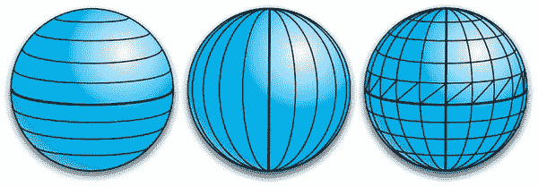

**图 3–15。** *栈上下，切片周而复始，面细分成三角条。*

*   第 4 行和第 5 行为顶点和颜色分配内存。稍后将需要其他数组来保存光照所需的纹理坐标和面法线，但现在让我们保持简单。请注意，我们使用的是 32 位颜色，就像立方体一样。三个值形成 RGB 三元组，而第四个值用于 *alpha* (半透明)，但在本例中并不需要。`m_Slices*2`值考虑了由切片和堆栈边界限定的每个面需要两个三角形的事实。正常情况下，这应该是一个正方形，但这里必须是两个三角形。+2 处理这样一个事实，即前两个顶点也是最后一个顶点，所以是重复的。当然，我们需要价值`m_Stacks`的所有这些东西。
*   第 6 行开始外环，从最底部的堆栈(或我们星球的南极地区或海拔-90 度)到北极，在+90 度。

    这里用了一些希腊标识符来表示球面坐标。 *Phi* 通常用于类纬度值，而 *theta* 用于经度。
*   第 7 行和第 8 行生成特定条带边界的纬度。首先，当`phiIdx`为 0 时，我们希望`phi0`为-90，或-1.57 弧度。. 5 把所有东西向下推 90 度。否则，我们的值会从 0 到 180。
*   在第 9ff 行中，一些值是预先计算好的，以最小化 CPU 负载。
*   线 10ff 形成从 0°到 360°的内环，并定义切片。数学是相似的，所以没有必要进入极端的细节，除了我们通过第 11ff 行计算圆上的点。`m_Scale`和`m_Squash`都在这里发挥作用。但是现在，就假设他们都是 1.0 的数据规范化。

    注意这里寻址的是顶点 0 和顶点 2。`vertexData[0]`是 *x* ，而`vertexData[2]`是*z*——处理两个平行于地面的部件。由于顶点 1 与 *y* 相同，所以它对于每个循环都保持不变，并与其表示的纬度一致。因为我们是成对循环，数组元素 3、4 和 5 指定的顶点覆盖了下一个更高的堆栈边界。

    实际上，我们正在生成成对的点，即每个点和它上面的另一个点。这是 OpenGL 期望的三角形条带的格式，如图 Figure 3–16 所示。

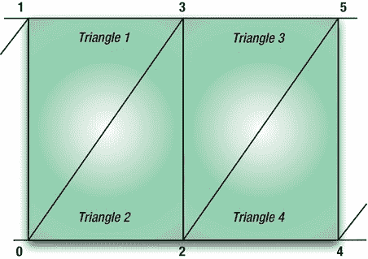

**图 3–16。** *由六个顶点组成的三角形带*

*   在第 12ff 行中，生成了颜色数组，并且与顶点一样，它们是成对生成的。红色和蓝色组件被藏在这里的数组中，暂时没有绿色组件。第 13 行增加了颜色索引，考虑到我们每个循环生成两个四元素颜色条目。
*   与颜色索引一样，顶点索引也是递增的，如第 14 行所示，但这次只针对三个组件。
*   在第 15ff 行中，我们增加蓝色，减少红色，确保底部的“极点”是纯红色，而顶部是纯蓝色。
*   在每个条带的末尾，我们需要创建一些“退化”的三角形，如第 16ff 行所示。术语*退化*指定三角形实际上由三个相同的顶点组成。实际上，它只是一个点；从逻辑上讲，它是一个三角形，用来连接当前堆栈。
*   最后，当该说的都说了，该做的都做了，第 17f 行的顶点和颜色数据被转换成 OpenGL 在渲染时可以理解的字节数组。清单 3–8 是完成这项工作的辅助函数。

**清单 3–8。** *辅助函数生成 OpenGL 能理解的浮点数组*

`protected static FloatBuffer makeFloatBuffer(float[] arr)
{
   ByteBuffer bb = ByteBuffer.*allocateDirect*(arr.length*4);
   bb.order(ByteOrder.*nativeOrder*());
   FloatBuffer fb = bb.asFloatBuffer();
   fb.put(arr);
   fb.position(0);
   return fb;
}`

既然几何图形已经不碍事了，我们需要把注意力集中在绘制方法上。参见清单 3–9。

**清单 3–9。** *渲染星球*

`public void draw(GL10 gl)
{

    gl.glFrontFace(GL10.*GL_CW*);                                               //1
    gl.glVertexPointer(3, GL10.*GL_FLOAT*, 0, m_VertexData);                    //2
    gl.glEnableClientState(GL10.*GL_VERTEX_ARRAY*);

    gl.glColorPointer(4, GL10.*GL_FLOAT*, 0, m_ColorData);
    gl.glEnableClientState(GL10.*GL_COLOR_ARRAY*);

                                                                               //3
    gl.glDrawArrays(GL10.*GL_TRIANGLE_STRIP*, 0, (m_Slices+1)*2*(m_Stacks-1)+2);
}`

现在，您应该能够识别多维数据集示例中的许多元素:

*   首先在第 1 行，我们指定顺时针方向的面是前面的面。
*   第 2ff 行将颜色和顶点数据提交给渲染器，确保它能够接受这些数据。
*   最后(！！)我们现在可以画出我们的小球体了。哎呀，嗯，还没有，还是要分配的。

既然行星对象对于这个例子来说已经足够完整了，让我们来做驱动程序。您可以将弹跳立方体渲染器重命名为类似于`SolarSystemRenderer`的名称，这将是`GLSurfaceView.Renderer`接口的一个实例。更改构造函数，看起来像清单 3–10。这会将行星分配到一个相当粗略的分辨率，即十个堆栈和十个切片，半径为 1.0，挤压值为 1.0(即，完美的圆形)。确保声明`mPlanet`，当然，还要导入 GL10 库。

**清单 3–10。** *建造师`SolarSystemRenderer`*

`public SolarSystemRenderer()
{
     mPlanet=new Planet(10,10,1.0f, 1.0f);
}`

顶层刷新方法`gl.onDrawFrame()`，与立方体方法没有太大区别，如清单 3–11 所示。

**清单 3–11。** *主绘制方法，位于`SolarSystemRenderer`*

`private float mTransY;
private float mAngle;

public void onDrawFrame(GL10 gl)
{
    gl.glClear(GL10.*GL_COLOR_BUFFER_BIT* | GL10.*GL_DEPTH_BUFFER_BIT);*
    gl.glClearColor(0.0f,0.0f,0.0f,1.0f);
    gl.glMatrixMode(GL10.*GL_MODELVIEW*);
    gl.glLoadIdentity();

    gl.glTranslatef(0.0f,(float)Math.*sin*(mTransY), -4.0f);

    gl.glRotatef(mAngle, 1, 0, 0);
    gl.glRotatef(mAngle, 0, 1, 0);

    mPlanet.draw(gl);

    mTransY+=.075f;
    mAngle+=.4;
}`

这里没有什么奇特的，因为它实际上与渲染立方体的方法是一样的。从立方体的代码中复制`onSurfaceChanged()`和`onSurfaceCreated()`，同时暂时注释掉`initLighting()`和`initGeometry()`。您现在应该能够编译和运行它了。图 3–17 应该是结果。

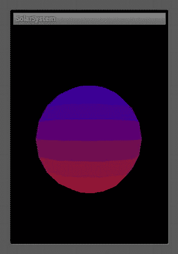

**图 3–17。** *未来星球地球*

当它旋转时，没有任何特征，你很难看到它的运动。

和前面的例子一样，让我们试验一些参数，看看会发生什么。首先，让我们在`SolarSystemRenderer  `构造函数中改变堆栈和切片的数量，从 10 到 20。您应该会看到类似于图 3–18 的内容。

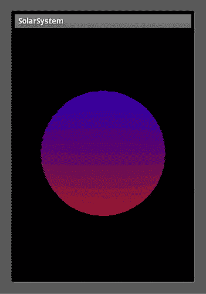

**图 3–18。** *拥有双栈和切片的星球*

如果你想让弯曲的物体看起来更平滑，通常有三种方法可以实现:

*   有尽可能多的三角形。
*   使用 OpenGL 内置的一些特殊的照明和阴影工具。
*   使用纹理。

下一章将讨论第二种选择。但是现在，看看需要多少切片和堆叠才能形成一个真正光滑的球体。(两者数量相等时效果最佳。)每个 100 就真的开始好看了。现在，回到 20 人一组。

如果你想看看球体的实际线框结构，将行星的绘制方法中的`GL10.GL_TRIANGLE_STRIP`改为 GL10。`GL_LINE_STRIP`。您可能希望将背景颜色改为中灰色，以使线条更加突出(图 3–19，左侧)。作为练习，看看怎样才能得到图 3–19 中的右图。现在问问你自己，为什么我们在那里没有看到三角形，而是看到了那个奇怪的螺旋图案。它只是 OpenGL 绘制和连接线条的方式。我们可以通过指定一个连接数组来呈现三角形轮廓。但是对于我们的最终目标来说，这是不必要的。

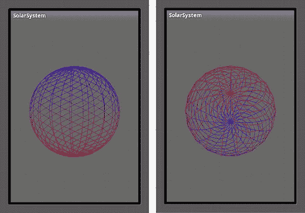

**图 3–19。** *线框模式下的星球*

自行将`GL10.GL_LINE_STRIP`改为`GL10.GL_POINTS`。你会看到每个顶点都被渲染成一个点。

然后再次尝试截锥。将`zNear`从. 1 设置为 3.2。(为什么不是 4？物体的距离？)你就会得到图 3–20。

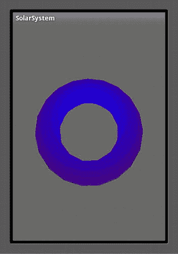

**图 3–20。** *有人把`zNear`剪裁平面设置得太近了。*

最后一个练习:怎样才能得到看起来像 Figure 3–21 的东西？(这是木星和土星所需要的；因为它们旋转如此之快，它们不是球形而是扁球形。)

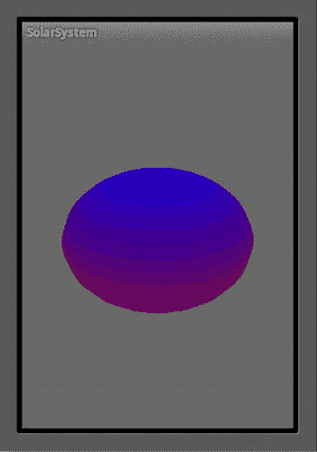

**图 3–21。** *需要什么才能得到这个？*

最后，为了加分，让它像立方体一样弹跳。

### 总结

在这一章中，我们从把 2D 立方体变成三维立方体开始，然后学习如何旋转和平移它。我们还了解了视见平截头体，以及如何使用它来剔除对象和放大缩小我们的场景。最后，我们构建了一个更加复杂的物体，它将成为太阳系模型的基础。下一章将介绍阴影、照明和材质，并将添加第二个物体。