# 四、开灯

> 你现在必须坚强。你绝不能放弃。当人们(或代码)让你哭泣，你害怕黑暗时，不要忘记光明一直在那里。
> 
> —作者未知
> 
> *光是画家之首。没有什么东西是如此肮脏，以至于强烈的光线也不会使它变得美丽。*
> 
> 拉尔夫·瓦尔多·爱默生 Ralph Waldo Emerson
> 
> 船长，一切都很闪亮。不要担心。
> 
> ——凯莉·弗莱，《萤火虫》

这一章将涵盖 OpenGL ES 的一个最大的主题:照亮、着色和着色虚拟景观的过程。我们在上一章中提到了颜色，但是因为它对照明和阴影都是不可或缺的，所以我们将在这里更深入地讨论它。

### 光与色的故事

没有光，世界将是一个黑暗的地方(咄)。如果没有颜色，就很难区分交通信号灯。

我们都认为光的奇妙本质是理所当然的——从晨雾中柔和柔和的照明到航天飞机主引擎的点火，再到仲冬雪原上满月羞涩苍白的光芒。关于光的物理学、它的本质和感知已经写了很多。一个艺术家可能要花一辈子的时间才能完全理解如何将悬浮在油中的彩色颜料涂在画布上，在瀑布底部创造出可信的彩虹。这就是 OpenGL ES 在打开场景中的灯光时的任务。

没有诗意，光仅仅是我们的眼睛敏感的全部电磁光谱的一部分。同样的光谱还包括我们的 iPhones 使用的无线电信号，帮助医生的 X 射线，数十亿年前从一颗垂死的恒星发出的伽马射线，以及可以用来加热上周四 Wii 保龄球之夜剩下的一些披萨的微波。

据说光有四个主要特性:波长、强度、偏振和方向。波长决定了我们感知的颜色，或者说我们是否能首先看到任何东西。可见光谱从波长约为 380 纳米的紫色范围开始，一直到波长约为 780 纳米的红色范围。紧接在它下面的是紫外线，在可见光范围的正上方你会发现红外线，我们不能直接看到它，但可以以热的形式间接探测到它。

我们感知物体颜色的方式与物体或其材质吸收的波长有关，否则*会干扰*迎面而来的光。除了吸收，它还可能被散射(给我们天空的蓝色或日落的红色)、反射和折射。

如果有人说他们最喜欢的颜色是白色，他们一定是说所有的颜色都是他们最喜欢的，因为白色是可见光谱中所有颜色的总和。如果是黑色，他们不喜欢任何颜色，因为黑色就是没有颜色。事实上，这就是为什么你不应该在一个温暖的晴天穿黑色。你的衣服吸收了如此多的能量，却反射了如此少的能量(以光和红外线的形式)，以至于其中的一些最终转化为热量。

**注:**当太阳直射头顶时，它可以发出每平方米约 1 千瓦的*辐照度*。其中，超过一半的是红外线，感觉非常温暖，而不到一半是可见光，只有少得可怜的 32 瓦用于紫外线。

据说亚里士多德发展了第一个已知的颜色理论。他考虑了四种颜色，每种颜色对应于气、土、水、火四种元素中的一种。

然而，当我们观察可见光谱时，你会注意到从一端的紫色到另一端的红色有一个很好的连续分布，其中既没有水也没有火。你也看不到红色、绿色或蓝色的离散值，它们通常被用来定义不同的色调。19 世纪初，英国学者托马斯·杨开发了三色模型，用三种颜色来模拟所有可见的色调。杨提出视网膜是由成束的神经纤维组成的，它们会对不同强度的红光、绿光或紫光做出反应。德国科学家赫尔曼·赫尔姆霍茨后来在 19 世纪中叶扩展了这一理论。

**注:**扬是个特别有趣的家伙。(总得有人说。)他不仅是*生理光学*领域的创始人，在业余时间他还发展了光的波动理论，包括发明了经典的双缝实验，这是大学物理的主要内容。但是等等！还有呢！他还提出了毛细现象理论，第一个使用现代意义上的术语“??”能量“?? ”,部分破译了罗塞塔石碑的埃及部分，并设计了一种改进的乐器调音方法。这位女士肯定严重睡眠不足。

如今，颜色最常通过红绿蓝(RGB)三元组及其相对强度来描述。每种颜色在强度为零的情况下逐渐变为黑色，并随着强度的增加而显示出不同的色调，最终被感知为白色。因为三种颜色需要加在一起才能产生整个光谱，所以这个系统是一个*加法*模型。

除了 RGB 模式，打印机还使用一种被称为 CMYK 的减色模式，用于青色-品红色-黄色-黑色(*键*)。因为这三种颜色不能产生真正深的黑色，所以添加黑色作为深阴影或图形细节的强调。

另一个常见的模型是 HSV 的色调-饱和度-值，你会经常发现它是许多图形包或颜色选择器中 RGB 的替代物。HSV 是 20 世纪 70 年代专门为计算机图形开发的，它将颜色描绘成一个 3D 圆柱体(图 4–1)。饱和度从内到外，值从下到上，色调围绕边缘。这方面的一个变体是 HSL，用值代替亮度。图 4–2 显示了多种版本的 Mac OS X 拾色器。

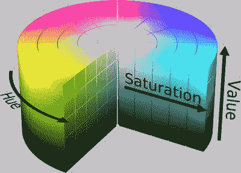

**图 4–1。** *HSV 色轮或圆柱体(来源:维基共享资源)*

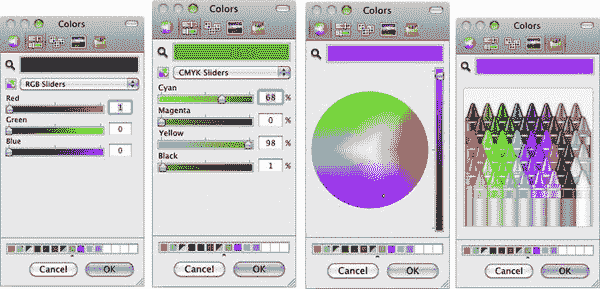

**图 4–2。** *苹果的 OS-X 标准拾色器——RGB、CMYK、HSV，以及一直流行的克雷奥拉模型*

### 让那里有光

在现实世界中，光从四面八方以各种颜色射向我们，当结合起来时，可以创造日常生活的细节和丰富的场景。OpenGL 并不试图复制任何像真实世界的照明模型，因为这些模型非常复杂和耗时，并且通常保留给迪士尼的渲染农场。但是它可以以一种对实时游戏动作来说足够好的方式来近似它。

OpenGL ES 中使用的光照模型允许我们在场景中放置不同类型的灯光。我们可以随意打开或关闭它们，指定方向、强度、颜色等等。但这还不是全部，因为我们还需要描述模型的各种属性，以及它如何与入射光相互作用。*照明*定义了光源与物体互动的方式以及创建这些物体的材质。*阴影*根据照明和材质具体决定像素的颜色。请注意，一张白纸反射的光线与一件粉红色的镜面圣诞装饰品完全不同。综合起来，这些特性被捆绑成一种叫做*材质*的物体。将材质属性和灯光属性混合在一起会生成最终的场景。

OpenGL 灯光的颜色最多可以由三种不同的成分组成:

*   传播
*   环境的
*   镜子的

漫射光可以说是来自一个方向，如太阳或手电筒。它撞击一个物体，然后向四面八方散射，产生一种令人愉快的柔软感。当漫射光照射到表面时，反射量很大程度上取决于入射角。当直接面对光线时，它会最亮，但随着倾斜得越来越远，它会越来越暗。

环境光是来自没有特定方向的光，被构成环境的所有表面反射。环顾你所在的房间，从天花板、墙壁和家具上反射回来的光线组合在一起形成了环境光。如果你是一名摄影师，你会知道环境照明对于拍摄比单一光源更真实的场景有多重要，特别是在人像摄影中，你会用柔和的“补光”来抵消较亮的主光。

镜面光是从光亮的表面反射回来的光。它来自一个特定的方向，但是在一个表面上以一种更加定向的方式反弹。它会成为我们在迪斯科球或刚清洗上蜡的汽车上看到的热点。当观察点与光源成直线时，光线最亮，当我们绕着物体移动时，光线迅速减弱。

当谈到漫反射和镜面反射照明时，它们通常是相同的颜色。但是，即使我们被限制在八个灯光对象，每个组件有不同的颜色实际上意味着一个单一的 OpenGL“光”可以同时表现得像三个不同的。在这三种颜色中，你可以考虑让环境光有不同的颜色，通常是与主色相反的颜色，以使场景在视觉上更有趣。在太阳系模型中，暗淡的蓝色环境光有助于照亮行星的黑暗面，并赋予其更高的 3D 质量。

**注意:**你不必为一个给定的灯光指定所有三种类型。漫反射通常在简单的场景中工作得很好。

### 回到有趣的事情(暂时)

我们还没有完成理论，但是让我们暂时回到编码上来。在那之后，我将会涉及更多关于光线和阴影的理论。

在前面的例子中，你看到了用标准 RGB 版本逐顶点定义的颜色如何让我们在没有任何光照的情况下看到它。现在，我们将创建各种类型的灯，并将它们放置在我们所谓的星球周围。OpenGL ES 必须总共支持至少八个灯光，这是 Android 的情况。但是你当然可以创建更多的，并根据需要添加或删除它们。如果你真的很挑剔，你可以在运行时检查一个特定的 OpenGL 实现支持多少个灯光，方法是使用`glGet*`的许多变体之一来检索这个值:

`    ByteBuffer byteBuffer = ByteBuffer.allocateDirect( 4 );
    byteBuffer.order( ByteOrder.LITTLE_ENDIAN );
    IntBuffer intBuffer = byteBuffer.asIntBuffer();
    drawable.getGL().glGetIntegerv( GL10.GL_MAX_LIGHTS, intBuffer);`

**注:** OpenGL ES 有很多效用函数，`glGet*()`是最常用的家族之一。`glGet*`调用可以让你查询各种参数的状态，比如当前的 modelview 矩阵到当前的线宽。确切的调用取决于请求的数据类型。

让我们回到第三章中的示例代码，其中有一个压扁的红色和蓝色星球上下跳动，并进行以下更改:

1.  从太阳系控制器的方法`initGeometry()`中更改地球的`squash`值，从. 7f 更改为 1.0f 以再次圆化球体，并将分辨率(堆叠和切片)更改为 20。
2.  In `Planet.java`, comment out the line `blue+=colorIncrment` at the end of the `init()` method.

    你应该看到什么？来吧，不要偷看。掩盖图 4–3 并猜测。明白了吗？现在你可以编译和运行了。图 4–3 中左边的图像是你应该看到的。现在回到`initGeometry`方法，将切片和堆栈的数量分别增加到 100。这应该会产生右边的图像。因此，通过简单地改变一些数字，我们有一个粗略的照明和阴影方案。但这只是一个固定的照明方案，当你想要开始移动东西时，它就会坏掉。这时，我们让 OpenGL 来承担重任。

    不幸的是，添加灯光的过程比仅仅调用类似于`glMakeAwesomeLightsDude()`的东西要复杂一些，我们将会看到。

    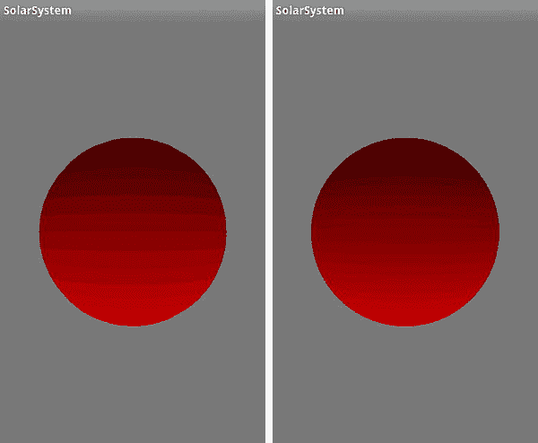

    **图 4–3。** *从下面模拟光照(左)和一个更高的多边形数来模拟明暗处理(右)*

3.  回到第三章的中太阳系渲染器的`onSurfaceCreated`方法，修改成这样:`public void onSurfaceCreated(GL10 gl, EGLConfig config) {
           gl.glDisable(GL10.*GL_DITHER*);
           gl.glHint(GL10.GL_PERSPECTIVE_CORRECTION_HINT, GL10.*GL_FASTEST*);
           gl.glEnable(GL10.*GL_CULL_FACE*);
           gl.glCullFace(GL10.*GL_BACK*);
           gl.glShadeModel(GL10.*GL_SMOOTH*);
           gl.glEnable(GL10.*GL_DEPTH_TEST*);
           gl.glDepthMask(false);
           initGeometry(gl);
           initLighting(gl);
    }`
4.  并添加到渲染器:`public final static int *SS_SUNLIGHT* = GL10.*GL_LIGHT0*;`
5.  然后添加清单 4–1 中的代码来打开灯。

**清单 4–1。** *初始化灯光*

`private void initLighting(GL10 gl)
{
    float[] diffuse = {0.0f, 1.0f, 0.0f, 1.0f};                                 //1
    float[] pos = {0.0f, 10.0f, -3.0f, 1.0f};                                   //2
    gl.glLightfv(SS_SUNLIGHT, GL10.GL_POSITION, makeFloatBuffer(pos));          //3
    gl.glLightfv(SS_SUNLIGHT, GL10.GL_DIFFUSE, makeFloatBuffer(diffuse));       //4
    gl.glShadeModel(GL10.GL_FLAT);                                              //5
    gl.glEnable(GL10.GL_LIGHTING);                                              //6
    gl.glEnable(SS_SUNLIGHT);                                                   //7
}`

这是怎么回事:

*   照明组件采用标准的 RGBA 标准化形式。所以在这种情况下，没有红色，没有完整的绿色，也没有蓝色。alpha 的最终值现在应该保持在 1.0，因为后面会有更详细的介绍。
*   线 2 是灯的位置。它的 y 轴为+10，z 轴为-3，行星也是如此。所以，它会在我们的上空盘旋。
*   在第 3 行和第 4 行中，我们将灯光的位置和漫射组件设置为漫射颜色。`glLightfv()`是一个新调用，用于设置各种与灯光相关的参数。您可以在以后使用`glGetLightfv()`来检索这些数据，它可以从特定的灯光中检索任何参数。
*   在第 5 行我们指定了一个阴影模型。平坦意味着一个面是单一的纯色，而将其设置为`GL_SMOOTH`将使颜色在整个面上以及面与面之间平滑混合。
*   最后，第 6 行告诉系统我们想要使用灯光，而第 7 行启用我们创建的一个灯光。

**注意:**`glLightfv()`的最终参数取四个`GLfloat`值的数组；fv 后缀表示“浮点向量”还有一个`glLightf()`调用来设置单值参数。

现在编译并运行。呃？你说那是什么？你在星系 M31 的中心只看到一个超大质量黑洞大小的黑色东西？哦，对了，我们忘了点东西，抱歉。如前所述，各种版本的 OpenGL 仍然是一个相对低级的库，所以由程序员来处理各种各样的内务处理任务，这些任务是你期望更高级别的系统来管理的(这在 OpenGL ES 2.0 上变得更糟)。一旦灯光打开，预定义的顶点颜色被忽略，所以我们得到黑色。考虑到这一点，我们的球体模型需要一个额外的数据层来告诉系统如何照亮它的小平面，这是通过每个顶点的一组*法线*来完成的。

什么是顶点法线？*面*法线是与平面或面*正交*(垂直)的归一化向量。但是在 OpenGL 中，使用顶点法线来代替，因为它们提供了更好的着色。听起来很奇怪，一个顶点可以有自己的“法线”。说到底，一个顶点的“方向”是什么？这实际上在概念上很简单，因为顶点法线仅仅是与顶点相邻的面的法线的归一化总和。参见图 4–4。

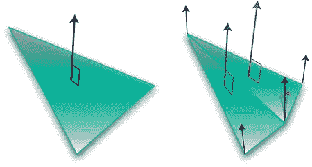

**图 4–4**。*面法线显示在右边，而三角形扇形的顶点法线显示在左边。*

OpenGL 需要所有这些信息来判断顶点的“方向”,这样它就可以计算出有多少光照落在它上面。当它直接瞄准光源时最亮，当它开始倾斜时最暗。这意味着我们需要修改我们的行星生成器来创建一个法线数组以及顶点和颜色数组，如清单 4–2 所示。

**清单 4–2。将普通发电机添加到** *`Planet.java`*

`private void init(int stacks,int slices, float radius, float squash, String textureFile)
    {
            float[] vertexData;
            float[] colorData;      
            float[] normalData;
            float   colorIncrement=0f;
            float blue=0f;
            float red=1.0f;
            int numVertices=0;
            int vIndex=0;                                                   //Vertex index
            int cIndex=0;                                                   //Color index
            int nIndex =0;                                                  //Normal index

            m_Scale=radius;                        
            m_Squash=squash;

            colorIncrement=1.0f/(float)stacks;                                  
            m_Stacks = stacks;
            m_Slices = slices;

            //Vertices
                    vertexData = new float[ 3*((m_Slices*2+2) * m_Stacks)];            

            //Color data
                    colorData = new float[ (4*(m_Slices*2+2) * m_Stacks)];                  
            // Normalize data
                    normalData = new float [ (3*(m_Slices*2+2)* m_Stacks)];     //1

            int phiIdx, thetaIdx;

            //Latitude
            for(phiIdx=0; phiIdx < m_Stacks; phiIdx++)
        {
            //Starts at -90 degrees (-1.57 radians) and goes up to +90 degrees
                   (or +1.57 radians).
            //The first circle
               float phi0 = (float)Math.PI * ((float)(phiIdx+0) * (1.0f/(float)
                   (m_Stacks)) - 0.5f);

            //The next, or second one.
               float phi1 = (float)Math.PI * ((float)(phiIdx+1) * (1.0f/(float)
                   (m_Stacks)) - 0.5f);    

               float cosPhi0 = (float)Math.cos(phi0);` `float sinPhi0 = (float)Math.sin(phi0);
               float cosPhi1 = (float)Math.cos(phi1);
               float sinPhi1 = (float)Math.sin(phi1);

               float cosTheta, sinTheta;

               //Longitude
               for(thetaIdx=0; thetaIdx < m_Slices; thetaIdx++)
             {
                    //Increment along the longitude circle each "slice."

                    float theta = (float) (2.0f*(float)Math.PI * ((float)thetaIdx) *
                        (1.0/(float)(m_Slices-1)));
                    cosTheta = (float)Math.cos(theta);        
                    sinTheta = (float)Math.sin(theta);

                   //We're generating a vertical pair of points, such
                   //as the first point of stack 0 and the first point of stack 1
                   //above it. This is how TRIANGLE_STRIPS work,
                   //taking a set of 4 vertices and essentially drawing two triangles
                   //at a time. The first is v0-v1-v2 and the next is v2-v1-v3, etc.

                   //Get x-y-z for the first vertex of stack.

                   vertexData[vIndex+0] = m_Scale*cosPhi0*cosTheta;
                   vertexData[vIndex+1] = m_Scale*(sinPhi0*m_Squash);
                   vertexData[vIndex+2] = m_Scale*(cosPhi0*sinTheta);

                   vertexData[vIndex+3] = m_Scale*cosPhi1*cosTheta;
                   vertexData[vIndex+4] = m_Scale*(sinPhi1*m_Squash);
                   vertexData[vIndex+5] = m_Scale*(cosPhi1*sinTheta);

                   colorData[cIndex+0] = (float)red;
                   colorData[cIndex+1] = (float)0f;
                   colorData[cIndex+2] = (float)blue;
                   colorData[cIndex+4] = (float)red;
                   colorData[cIndex+5] = (float)0f;
                   colorData[cIndex+6] = (float)blue;
                   colorData[cIndex+3] = (float)1.0;
                   colorData[cIndex+7] = (float)1.0;

                   **// Normalize data pointers for lighting.**
                   **normalData[nIndex + 0] = cosPhi0*cosTheta;             //2**
                   **normalData[nIndex + 1] = sinPhi0;**
                   **normalData[nIndex + 2] = cosPhi0*sinTheta;**

                   **normalData[nIndex + 3] = cosPhi1*cosTheta;             //3**` `                   **normalData[nIndex + 4] = sinPhi1;**
                   **normalData[nIndex + 5] = cosPhi1*sinTheta;**

                   **cIndex+=2*4;**
                   **vIndex+=2*3;             nIndex+=2*3;**
          }

            //Blue+=colorIncrement;                               
            red-=colorIncrement;

        //Create a degenerate triangle to connect stacks and maintain winding order.
        vertexData[vIndex+0] = vertexData[vIndex+3] = vertexData[vIndex-3];
        vertexData[vIndex+1] = vertexData[vIndex+4] = vertexData[vIndex-2];
        vertexData[vIndex+2] = vertexData[vIndex+5] = vertexData[vIndex-1];
           }
        m_VertexData = makeFloatBuffer(vertexData);                                 
        m_ColorData = makeFloatBuffer(colorData);
        m_NormalData = makeFloatBuffer(normalData);

}`

*   在第 1 行中，法线数组的分配与顶点内存相同，这是一个简单的数组，每个法线包含 3 个组件。
*   第二部分和第三部分生成正常数据。它看起来并不像前面提到的任何花哨的正常平均方案，那么是什么原因呢？由于我们处理的是一个非常简单的对称形式的球体，法线与没有任何缩放值的顶点相同(以确保它们是单位向量，即长度为 1.0)。请注意，`vPtr`值和`nPtrs`值的计算结果实际上是相同的。

注意:你很少需要生成你自己的法线。如果您在 OpenGL ES 中进行任何实际工作，您可能会从第三方应用(如 3D-Studio 或 Strata)中导入模型。他们将为您生成普通数组和其他数组。

还有最后一步，那就是修改`Planet.java`中的`draw()`方法，使其看起来像清单 4–3。

**清单 4–3。**新`draw`套路

`public void draw(GL10 gl)
       {
              gl.glMatrixMode(GL10.GL_MODELVIEW);
              gl.glEnable(GL10.GL_CULL_FACE);
              gl.glCullFace(GL10.GL_BACK);` `              gl.glNormalPointer(GL10.GL_FLOAT, 0, m_NormalData);                   //1
              gl.glEnableClientState(GL10.GL_NORMAL_ARRAY);                         //2

              gl.glVertexPointer(3, GL10.GL_FLOAT, 0, m_VertexData);                 
              gl.glEnableClientState(GL10.GL_VERTEX_ARRAY);

              gl.glColorPointer(4, GL10.GL_FLOAT, 0, m_ColorData);        
              gl.glEnableClientState(GL10.GL_COLOR_ARRAY);

              gl.glDrawArrays(GL10.GL_TRIANGLE_STRIP, 0, (m_Slices+1)*2*(m_Stacks-1)+2);
       }`

除了添加了第 1 行和第 2 行，用于将普通数据与颜色和顶点信息一起发送到 OpenGL 管道之外，它与原始代码没有太大的不同。如果你有一个非常简单的模型，其中许多顶点都共享相同的法线，你可以转储法线数组并使用`glNormal3f()`来代替，在这个过程中节省一点内存和 CPU 开销。

让我们做最后一个调整。对于本例，确保分配行星时将堆栈和切片值设置回 10(从第三章的结尾使用的 100)。这样更容易看到一些灯光是如何工作的。现在你可以真正编译和运行它，如果你得到类似于图 4–5 的东西，放松一下，停下来喝杯清凉饮料。

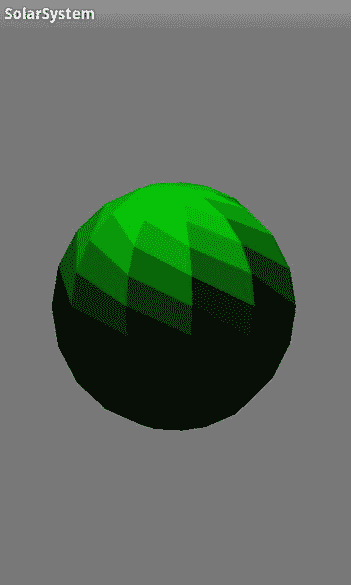

**图 4–5**。*平面照明*

现在你回来了，我相信你已经发现了一些奇怪的东西。据说几何学是基于一条条三角形，那么为什么脸是那些奇怪的四边三角形呢？

当设置为平面着色时，OpenGL 仅从单个顶点(相应三角形的最后一个顶点)拾取照明提示。现在，不是从水平成对的三角形中画出条带，而是把它们想象成垂直成对的松散耦合，正如你在图 4–6 中看到的。

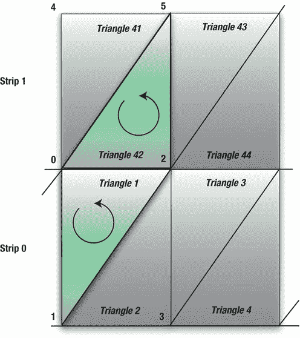

**图 4–6**。*“堆叠”的三角形对*

在条带 0 中，将使用顶点 0、1 和 2 绘制三角形 1，顶点 2 用于着色。三角形 2 将使用 2、1 和 3。泡沫，冲洗，并重复其余的地带。接下来，对于条带 1，将绘制具有顶点 4、0 和 5 的三角形 41。但是三角形 42 将使用顶点 5、0 和 2，与三角形 1 具有相同的顶点用于其着色。这就是为什么垂直对组合起来形成一个“弯曲的”四边形。

如今很少有理由使用平面阴影，所以在`initLighting()`中，将`GL_FLAT`替换为`GL_SMOOTH`，在`glShadeModel()`中，通过改变以下内容来改变灯光的位置:

`    float[] pos = {0.0f, 10.0f, -3.0f, 1.0f};`

对此:

`    float[] pos = {0.0f, 5.0f, 0.0f, 1.0f};    `

这将显示更多被照亮的一面。现在你可能知道该怎么做了:编译、运行和比较。然后为了好玩，将球体的分辨率从 20 个切片和分段降低到 5 个。回到平面阴影，然后与平滑阴影进行比较。参见图 4–7。图 4–7 中最右边的图像特别有趣，因为阴影模型开始崩溃，显示出一些沿着脸部边缘的赝像。

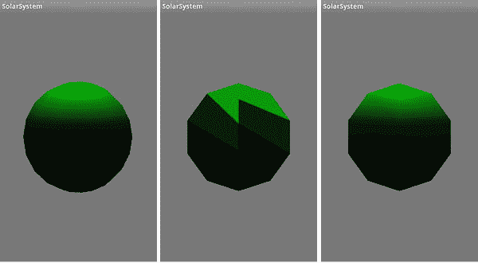

**图 4–7。** *从左到右:平滑着色一个 20 叠 20 片的球体；只有 5 个堆栈和切片的球体上的平面阴影；平滑阴影*

#### 光和材质的乐趣

现在，既然我们有一个光滑的球体可以玩，我们可以开始修补其他的灯光模型和材质。但是首先做一个思维实验:假设你有一个绿色的球体，如前所示，但是你的漫射光是红色的。球体会是什么颜色？(暂停*危险*主题。)准备好了吗？在现实世界中会是什么呢？红绿？绿红色？淡紫色的粉红色？让我们试一试，找出答案。再次修改`initLighting()`，如清单 4–4 所示。请注意，灯光向量已被重命名为其特定的颜色，以使其更具可读性。

**清单 4–4。** *添加更多的灯光类型和材质*

`private void initLighting(GL10 gl)
{
    float[] diffuse = {0.0f, 1.0f, 0.0f, 1.0f};
    float[] pos = {0.0f, 5.0f, -3.0f, 1.0f};
    float[] white = {1.0f, 1.0f, 1.0f, 1.0f};
    float[] red={1.0f, 0.0f, 0.0f, 1.0f};
    float[] green={0.0f,1.0f,0.0f,1.0f};` `    float[] blue={0.0f, 0.0f, 1.0f, 1.0f};
    float[] cyan={0.0f, 1.0f, 1.0f, 1.0f};
    float[] yellow={1.0f, 1.0f, 0.0f, 1.0f};
    float[] magenta={1.0f, 0.0f, 1.0f, 1.0f};
    float[] halfcyan={0.0f, 0.5f, 0.5f, 1.0f};

    gl.glLightfv(*SS_SUNLIGHT*, GL10.*GL_POSITION*, *makeFloatBuffer*(pos));
    gl.glLightfv(SS_SUNLIGHT, GL10.GL_DIFFUSE, makeFloatBuffer(green));

    gl.glMaterialfv(GL10.GL_FRONT_AND_BACK, GL10.GL_DIFFUSE, makeFloatBuffer(red));  //1

    gl.glShadeModel(GL10.*GL_SMOOTH*);
    gl.glEnable(GL10.*GL_LIGHTING*);
    gl.glEnable(*SS_SUNLIGHT*);
    gl.glLoadIdentity();                                                             //2
}`

如果你看到我们的老朋友，来自 M31 的超大质量黑洞，你做得很好。那么，为什么是黑色的呢？那很简单；还记得本章开始时关于颜色和反射率的讨论吗？只有当照射到红色物体上的光线含有红色成分时，红色物体才会看起来是红色的，而我们的绿光却没有。如果你在一个黑暗的房间里有一个红色的气球，用绿色的光照亮它，它看起来会是黑色的，因为绿色不会回到你身边。如果有人问你在一个黑暗的房间里拿着一个红色的气球在做什么，就吼一声“物理学！”然后用轻蔑的语气告诉他们，他们不会理解的。

因此，有了这样的理解，用绿色替换第一行中的红色漫反射材质。你应该得到什么？对，绿色球体再次被照亮。但是你可能会注意到一些非常有趣的事情。绿色现在看起来比添加材质之前亮了一点。在图 4–8 中左边的图像显示它没有指定任何材质，右边的图像显示它添加了绿色漫射材质。

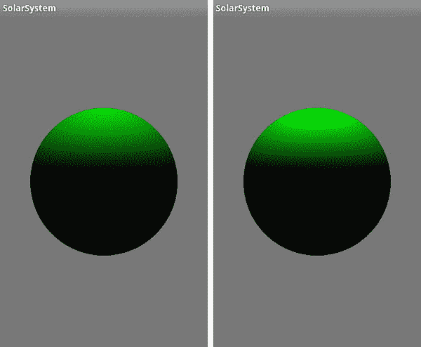

**图 4–8。** *无绿色物质定义(左)和有它定义(右)*

让我们再做一个实验。让我们使漫射光是一个更传统的白色。现在绿色该怎么办？红色？蓝色怎么样？因为白光有所有这些成分，所以彩色材质应该都显示得一样好。但是如果你再次看到黑球，你改变了材质的颜色，而不是灯光。

##### 镜面照明

那么，镜面反射的东西呢？将下面一行添加到 lights 部分:

`    gl.glLightfv(SS_SUNLIGHT,GL10.GL_SPECULAR, makeFloatBuffer(red));`

在“材质”部分，添加以下内容:

`    gl.glMaterialfv(GL10.GL_FRONT_AND_BACK, GL10.GL_SPECULAR, makeFloatBuffer(red));`

并将灯光的位置更改为如下所示:

`    float[] pos={10.0f,0.0f,3.0f,1.0f};`

**注意:**`glMaterial*`的第一个值必须始终是`GL_FRONT_AND_BACK`。在普通的 OpenGL 中，你可以在一个面的两面使用不同的材质，但是在 OpenGL ES 中却不行。但是，您仍然必须使用 OpenGL ES 中的前值和后值，否则材质将无法正常工作。

将漫射材质重置回绿色。你应该会看到一些东西，看起来像一大堆黄红色的东西。简而言之，我们可以用另一个值来玩灯光。称为*闪亮度*，它指定物体表面有多亮，范围从 0 到 128。该值越高，反射越集中，因此看起来越亮。但是由于它默认为 0，它将镜面财富分布在整个星球上。它压倒了绿色，以至于当与红色混合时，它显示为黄色。因此，为了控制这种混乱，添加以下代码行:

`    gl.glMaterialf(GL10.GL_FRONT_AND_BACK,GL10.GL_SHININESS, 5);`

我将很快解释这背后的数学原理，但是现在先看看值 5 会发生什么。接下来尝试 25，并将其与图 4–9 进行比较。光泽度值从 5 到 10 大致对应塑料；再大一点，我们就进入了严肃的金属领域。

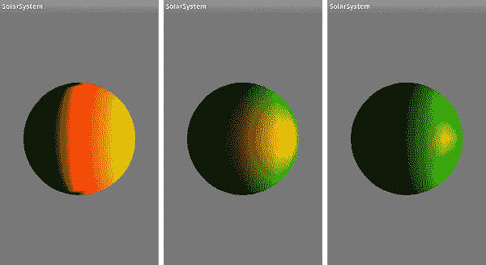

**图 4–9。** *光泽度分别设置为 0、5.0 和 25.0*

##### 环境照明

是时候享受一下环境照明了。在`initLighting()`中增加以下一行:然后编译并运行:

`    gl.glLightfv(SS_SUNLIGHT, GL10.GL_AMBIENT, makeFloatBuffer(blue));`

看起来像不像图 4–10 中左边的图像？你应该怎么做才能得到右边的图像？您需要添加下面一行:

`    gl.glMaterialfv(GL10.*GL_FRONT_AND_BACK*, GL10.*GL_AMBIENT*, *makeFloatBuffer*(blue));` 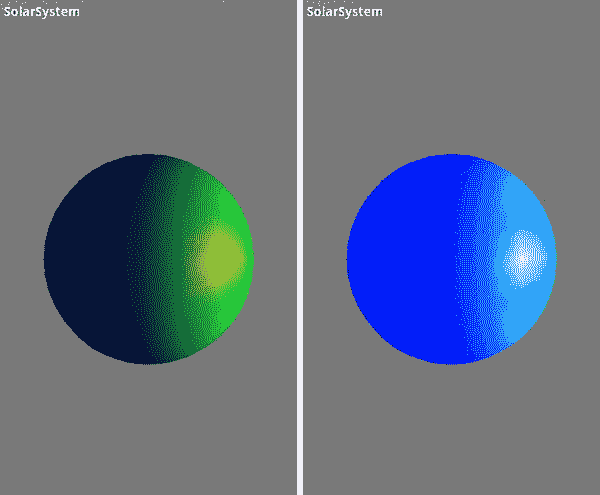

**图 4–10**。*仅蓝色环境光(左)，环境光和环境光材质(右)*

除了每个灯光的环境属性，还可以设置一个世界环境值。与所有灯光参数一样，基于灯光的值也是变量，因此它们作为距离、衰减等的函数而变化。世界值在整个 OpenGL ES 世界中是一个常数，可以通过在`initLighting()`例程中添加以下内容来设置:

`    float[] colorVector={r, g, b, a};
    gl.glLightModelfv(GL10.*GL_LIGHT_MODEL_AMBIENT*, *makeFloatBuffer*(colorVector));`

默认值是由红色=.2f、绿色=.2f 和蓝色=.2f 组成的暗灰色。这有助于确保无论发生什么情况，您的对象总是可见的。当我们这样做的时候，`glLightModelfv()`还有一个值，它是由`GL_LIGHT_MODEL_TWO_SIDE`的参数定义的。该参数实际上是一个布尔浮点数。如果是 0.0，只照亮一边；否则，两者都会。默认值为 0.0。如果出于任何原因，你想改变哪些面是正面，你可以用和`glFrontFace()`指定顺时针或逆时针排序的三角形代表正面。默认为 CCW。

##### 后退一步

那么，这里到底发生了什么？实际上，相当多。有三种通用的着色模型用于实时计算机图形。OpenGL ES 1.1 使用了其中的两个，这两个我们都见过。第一种是平面模型，简单地用一个常量值给每个三角形着色。你已经在图 4–5 中看到了它的样子。在过去的好日子里，这是一个有效的选择，因为它比其他任何方式都要快得多。然而，当你口袋里的 iPhone 大致相当于手持 Cray-1 时，那些速度技巧真的是过去的事情了。平滑模型使用*插值*阴影，计算每个顶点的颜色，然后在面上进行插值。OpenGL 实际使用的是一种特殊形式的着色，叫做*古劳着色*。这是基于所有相邻面的法线生成顶点法线的地方。

第三种着色被称为 *Phong* ，因为 CPU 开销高，所以在 OpenGL 中不使用。它不是在面上插值颜色值，而是插值法线，为每个片段(即像素)生成一个法线。这有助于消除由高曲率定义的边缘上的一些人为因素，这些因素会产生非常尖锐的角度。Phong 可以减少这种效果，但是使用更多的三角形来定义你的对象也可以。

还有许多其他模型。20 世纪 70 年代，JPL/航海家动画公司的吉姆·布林创造了一种改进的 Phong 着色形式，现在称为 Blinn-Phong 模型。如果光源和观看者可以被视为在无限远处，那么计算强度可以更小。

Minnaert 模型倾向于给漫反射材质增加一点对比度。柳文欢-纳耶在漫反射模型中添加了一个“粗糙度”组件，以便更好地匹配现实。

##### 发光材质

还有一个我们需要考虑的影响最终颜色的重要参数是`GL_EMISSION`。与漫反射、环境光和镜面反射不同，`GL_EMISSION`仅用于材质，并指定材质在质量上具有*发射*。一个发射物体有它自己的内部光源，比如太阳，这在太阳系模型中会派上用场。要查看实际效果，在`initLighting()`的其他材质代码中添加下面一行，并删除周围材质:

`    gl.glMaterialfv(GL10.GL_FRONT_AND_BACK, GL10.GL_EMISSION, makeFloatBuffer(yellow));`

因为黄色是最强烈的，你期望看到什么？大概就像图 4–11 中左边的图像。接下来将这些值减半，这样就有了:

`    float[] yellow={.5f, .5f, 0.0f, 1.0f};`

现在你看到了什么？我敢打赌它看起来有点像图 4–11 中的右图。

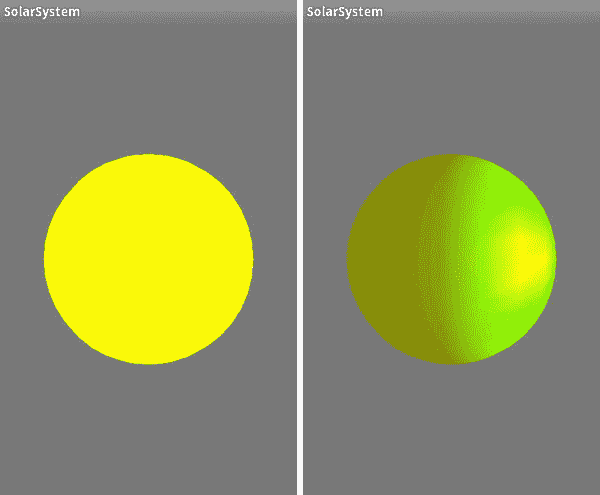

**图 4–11**。*一个发射材质设置为黄色全强度的物体(左)；同样的场景，但是只有 50%的亮度(右)*

从表面上看，发光材质可能看起来就像使用环境照明的结果。但与环境光不同，场景中只有一个对象会受到影响。附带的好处是，它们不会用尽额外的轻物体。然而，如果你的发射物体确实代表了任何种类的真实灯光，比如太阳，在里面放一个灯光物体肯定会给场景增加一层真实性。

关于材质的另一个注意事项:如果你的对象已经指定了颜色顶点，就像我们的立方体和球体一样，这些值可以用来代替设置材质。你必须使用`gl.glEnable(GL10.GL_COLOR_MATERIAL);`。这将把顶点颜色应用到阴影系统，而不是那些由`glMaterial` *调用指定的颜色。

##### 衰减

当然，在现实世界中，物体离光源越远，光线越弱。OpenGL ES 也可以使用以下三个衰减因子中的一个或多个来模拟该因子:

*   GL _ 常数 _ 衰减
*   GL _ 线性 _ 衰减
*   GL _ 二次衰减

所有这三个值组合在一起形成一个值，然后该值会计算到模型每个顶点的总照度中。使用 gLightf `(GLenum light, GLenum pname, GLfloat param)`设置它们，其中 light 是您的光源 ID，例如`GL_LIGHT0, pname`是前面列出的三个衰减参数之一，实际值使用`param`传递。

线性衰减可用于模拟由雾等因素引起的衰减。随着距离的增加，二次衰减模拟光的`natural`衰减，这呈指数变化。当灯光的距离增加一倍时，照明会减少到原来的四分之一。

我们暂且只看一个，`GL_LINEAR_ATTENUATION`。这三者背后的数学原理将在稍后揭晓。将下面一行添加到`initLighting():`

`gl.glLightf(SS_SUNLIGHT, GL10.GL_LINEAR_ATTENUATION, .025f);`

为了让事情在视觉上更加清晰，请确保关闭发光材质。你看到了什么？现在，在位置向量中将 x 轴上的距离从 10 增加到 50。图 4–12 显示了结果。

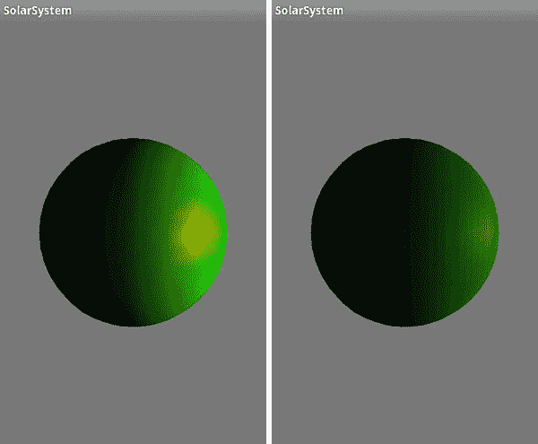

**图 4–12。** *光线的 x 距离为 10(左)和 50(右)，衰减常数为 0.025。*

##### 聚光灯

标准灯光默认为各向同性模型；也就是说，它们就像一盏没有灯罩的台灯，向四面八方均匀地(而且是刺眼地)照射着。OpenGL 提供了三个额外的照明参数，可以将普通光转化为平行光:

*   GL _ SPOT _ 方向
*   GL _ SPOT _ 指数
*   GL _ SPOT _ CUTOFF

因为它是平行光，所以由你使用`GL_SPOT_DIRCTION`矢量来瞄准它。默认为 0，0，-1，指向-*z*轴，如图图 4–13 所示。否则，如果您想要更改它，您可以使用类似下面的调用，将它沿着+x 轴移动:

`    GLfloat direction[]={1.0,0.0,0.0};
    gl.glLightfv(GL10.GL_LIGHT0, GL10.GL_SPOT_DIRECTION, direction);` 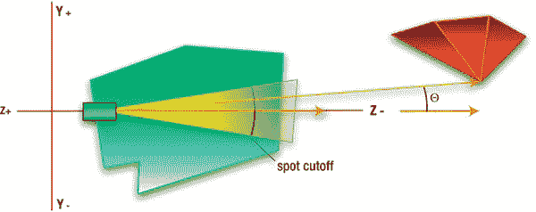

**图 4–13**。*聚光灯对准默认方向*

`GL_SPOT_CUTOFF`指定聚光灯光束从聚光灯圆锥体中心渐变到 0 强度的角度，自然是整个光束角直径的一半。对于 90 度的光束宽度，默认值为 45 度。该值越低，光束越窄。

第三个也是最后一个聚光灯参数`GL_SPOT_EXPONENT`，确定了光束强度的下降率，这也是另一种形式的衰减。OpenGL ES 将取光束的中心轴和任意顶点的中心轴所形成的角度的余弦。，并将其提升到`GL_SPOT_EXPONENT`的幂。因为其默认值为 0，所以灯光的强度在照明区域的所有部分都是相同的，直到达到截止值，然后降到零。

##### 灯光参数进场

表 4–1 总结了本节涵盖的各种灯光参数。

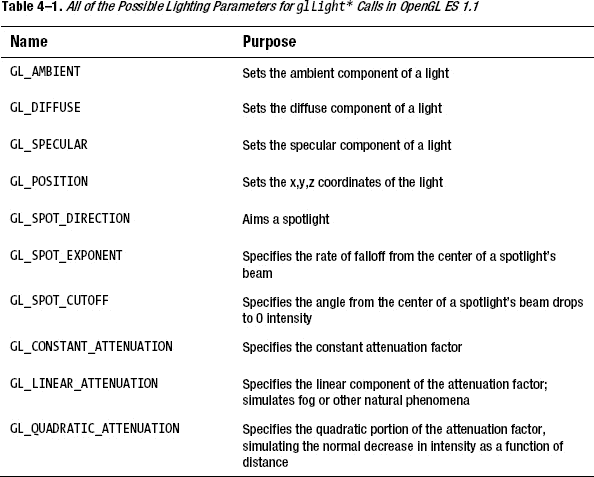

#### 阴影背后的数学原理

正如你所看到的，漫反射阴影模型给物体一个非常平滑的外观。它使用一种叫做*兰伯特照明模型*的东西。朗伯照明简单地说，一个特定的面越直接对准光源，它就越亮。天空中的太阳越高，你脚下的土地就越明亮。或者在更晦涩但精确的技术版本中，反射光随着入射光、 *I* 和面部法线、 ***N*** 之间的角度从 0 度增加到 1 度，基于 cos 从 90 度减少到 0 度。参见图 4–14。这里有一个快速思维实验:当是 90 度时，它是从侧面过来的；cos(90)为 0，那么沿 N 的反射光自然也要为 0。当它垂直向下时，平行于 N，cos(0)将为 1，因此最大量将被反射回来。这可以更正式地表达如下:

Id= kdIIcos()

*Id是漫反射的强度，*KI是入射光线的强度， *k d* 表示与物体材质的粗糙度松散耦合的*漫反射率*。*不严格地说*是指在许多真实世界的材质中，实际的表面可能有些抛光，但仍然是半透明的，而下面的层执行散射。像这样的材质可能同时具有强漫射和镜面反射成分。此外，在现实生活中，每个色带可能都有自己的 *k* 值，因此红色、绿色和蓝色都有一个。**

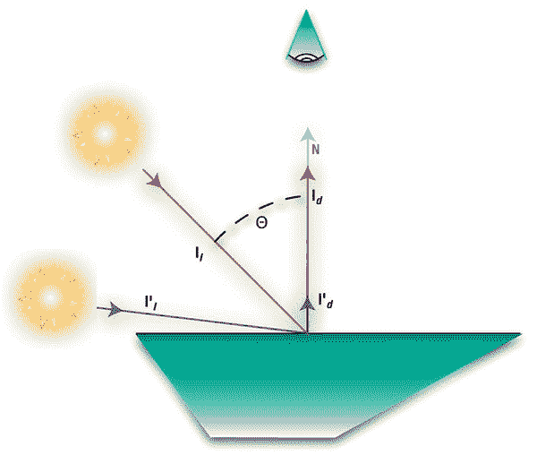

**图 4–14**。*对于完全漫射的表面，入射光束的反射强度将是该光束的垂直分量，或者是入射光束和表面法线之间角度的余弦。*

#### 镜面反射

如前所述，除了更普通的漫反射表面之外，镜面反射还为你的模型提供了闪亮的外观。很少有东西是完全平坦或完全闪亮的，大多数都介于两者之间。事实上，地球的海洋是很好的镜面反射体，在远距离拍摄的地球图像上，可以清楚地看到海洋中的太阳反射。

与所有方向都相等的漫反射不同，镜面反射高度依赖于观察者的角度。我们被告知*入射角=反射角*。这是真的足够完美的反射器。但是除了镜子，51 年的斯图贝克的鼻子，或者那个赛昂百夫长在把你轰进 15 万年前擦亮的前额，很少有东西是完美的反射器。因此，入射光线会有轻微的散射；参见图 4–15。

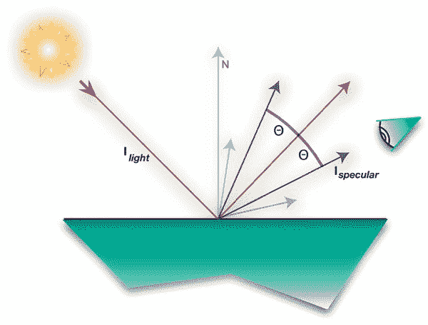

**图 4–15。** *对于镜面反射来说，入射光线是散射的，但只围绕其反射部分的中心。*

镜面分量的等式可以表示如下:

*I* 镜面=*W*(*q*)*I光线*cos*n*

其中:

*I 光线是入射光线的强度。*

*W* ( *q* )是基于 *I 光* 的角度的表面反射程度。

***n*** 是*的闪亮因子*(听着耳熟？).

是反射光线与射向眼睛的光线之间的角度。

这实际上是基于所谓的菲涅耳反射定律，这就是 W(q)值的来源。虽然 W(q)不直接用于 OpenGL ES 1.1，因为它随入射角变化，因此比镜面照明模型稍微复杂一些，但它可以用于 OpenGL ES 2.0 版本的着色器中。在这种情况下，它将特别有用，例如，在水面上做反射。取而代之的是一个基于材质设置的高光值的常数。

闪亮因子，也称为*镜面指数*，是我们之前用过的。然而，在现实生活中 *n* 可以远远高于最大值 128。

##### 衰减

现在回到前面列出的三种衰减:常数、线性和二次衰减。总衰减计算如下，其中*kc为常数， *k l* 为线性值， *k q* 为二次分量， *d* 代表光源与任意顶点的距离:*

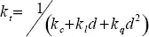

##### 总结这一切

所以，现在你可以看到，有许多因素在起作用，仅仅是为我们场景中的任何模型的任何顶点生成颜色和颜色强度。其中包括以下内容:

*   距离衰减
*   漫射灯光和材质
*   镜面光和材质
*   聚光灯参数
*   环境光和材质
*   发光
*   材质的发射率

您可以将所有这些视为作用于整个颜色矢量或颜色的每个单独的 R、G 和 B 分量。

因此，为了说明一切，最终的顶点颜色将如下:

*颜色* = *环境世界模型环境材质* + *发光材质+*强度光线**

其中:

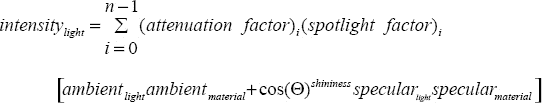

换句话说，一旦我们考虑到衰减，漫射，镜面反射和聚光灯元素，颜色等于一些不受灯光控制的东西加上所有灯光的强度。

计算时，这些值分别作用于相关颜色的 R、G 和 B 分量。

##### 那么，这一切是为了什么？

理解幕后发生的事情很方便的一个原因是它有助于使 OpenGL 和相关工具不那么神秘。就像你学外语一样，说克林贡语(如果你，亲爱的读者，是克林贡语，*majQa ' nuq DAQ ' oH puch pa ' ' e '*！)，它不再是它曾经是神秘的；在咆哮是咆哮，咆哮是咆哮的地方，现在你可能会认为它们是一首关于好茶的可爱的诗。

另一个原因是，正如前面提到的，所有这些好的“高级”工具在 OpenGL ES 2.0 中都没有。大多数早期的着色算法都必须由你用一点点代码来实现，这些代码叫做*着色器*。幸运的是，关于最常见着色器的信息可以在互联网上获得，并且复制了以前的信息，相对简单。

#### 更多有趣的东西

现在，有了所有这些光子的优点，是时候回去编码并引入不止一种光了。次要灯光可以不费吹灰之力就让场景的真实性产生惊人的巨大差异。

回到`initLighting()`，让它看起来像清单 4–5。这里我们再添加两盏灯，分别命名为`SS_FILLLIGHT1`和`SS_FILLLIGHT2`。将其定义添加到渲染器的类中:

`     public final static int *SS_SUNLIGHT1* = GL10.*GL_LIGHT1*;
     public final static int *SS_SUNLIGHT2* = GL10.*GL_LIGHT2*;`

现在编译并运行。你看到图 4–16 中左边的图像了吗？如前所述，这是 Gouraud 着色模型崩溃的地方，暴露了三角形的边缘。解决方案是什么？此时，只需将每个切片和堆叠的数量从 20 个增加到 50 个，您将获得更加令人满意的图像，如图 4–16 右侧所示。

**清单 4–5。** *增加两个补光灯*

`private void initLighting(GL10 gl)
{
            float[] posMain={5.0f,4.0f,6.0f,1.0f};
            float[] posFill1={-15.0f,15.0f,0.0f,1.0f};
            float[] posFill2={-10.0f,-4.0f,1.0f,1.0f};

            float[] white={1.0f,1.0f,1.0f,1.0f};
            float[] red={1.0f,0.0f,0.0f,1.0f};
            float[] dimred={.5f,0.0f,0.0f,1.0f};

            float[] green={0.0f,1.0f,0.0f,0.0f};
            float[] dimgreen={0.0f,.5f,0.0f,0.0f};
            float[] blue={0.0f,0.0f,1.0f,1.0f};
            float[] dimblue={0.0f,0.0f,.2f,1.0f};

            float[] cyan={0.0f,1.0f,1.0f,1.0f};
            float[] yellow={1.0f,1.0f,0.0f,1.0f};
            float[] magenta={1.0f,0.0f,1.0f,1.0f};
            float[] dimmagenta={.75f,0.0f,.25f,1.0f};

            float[] dimcyan={0.0f,.5f,.5f,1.0f};

            //Lights go here.

            gl.glLightfv(SS_SUNLIGHT, GL10.GL_POSITION, makeFloatBuffer(posMain));
            gl.glLightfv(SS_SUNLIGHT, GL10.GL_DIFFUSE, makeFloatBuffer(white));
            gl.glLightfv(SS_SUNLIGHT, GL10.GL_SPECULAR, makeFloatBuffer(yellow));

            gl.glLightfv(SS_FILLLIGHT1, GL10.GL_POSITION, makeFloatBuffer(posFill1));
            gl.glLightfv(SS_FILLLIGHT1, GL10.GL_DIFFUSE, makeFloatBuffer(dimblue));
            gl.glLightfv(SS_FILLLIGHT1, GL10.GL_SPECULAR, makeFloatBuffer(dimcyan));

            gl.glLightfv(SS_FILLLIGHT2, GL10.GL_POSITION, makeFloatBuffer(posFill2));
            gl.glLightfv(SS_FILLLIGHT2, GL10.GL_SPECULAR, makeFloatBuffer(dimmagenta));
            gl.glLightfv(SS_FILLLIGHT2, GL10.GL_DIFFUSE, makeFloatBuffer(dimblue));

            gl.glLightf(SS_SUNLIGHT, GL10.GL_QUADRATIC_ATTENUATION, .005f);

            //Materials go here.

            gl.glMaterialfv(GL10.GL_FRONT_AND_BACK, GL10.GL_DIFFUSE, makeFloatBuffer(cyan));` `            gl.glMaterialfv(GL10.GL_FRONT_AND_BACK, GL10.GL_SPECULAR, makeFloatBuffer(white));

            gl.glMaterialf(GL10.GL_FRONT_AND_BACK, GL10.GL_SHININESS, 25);

            gl.glShadeModel(GL10.GL_SMOOTH);
            gl.glLightModelf(GL10.GL_LIGHT_MODEL_TWO_SIDE, 1.0f);

            gl.glEnable(GL10.GL_LIGHTING);
            gl.glEnable(SS_SUNLIGHT);
            gl.glEnable(SS_FILLLIGHT1);
            gl.glEnable(SS_FILLLIGHT2);

            gl.glLoadIdentity();
}` 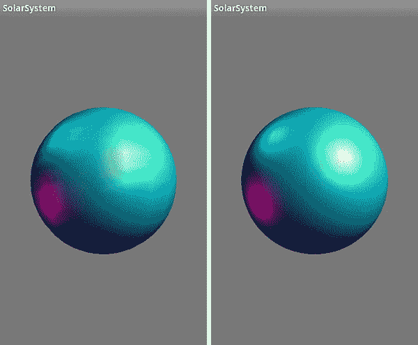

**图 4–16。** *三灯，一主二补。左图是一个低分辨率的球体，而右图是高分辨率的。*

在前面的示例中，涵盖了许多新的 API 调用，这些调用汇总在 Table 4–2 中。了解他们——他们是你的朋友，你会经常用到他们。

#### 回到太阳系

现在我们有足够的工具回到太阳系项目。等等，这里有很多材质要讲。特别是 OpenGL 的一些其他方面，它们与照明或材质无关，但需要在太阳系模型变得更加复杂之前解决。

首先，我们需要向 renderer 类添加一些新的方法声明和实例变量。参见清单 4–6。

**清单 4–6。** *为太阳和地球做准备。*

`public final static int *X_VALUE* = 0;

    public final static int *Y_VALUE* = 1;

    public final static int *Z_VALUE* = 2;

    Planet m_Earth;` 
`    Planet m_Sun;
    float[] m_Eyeposition = {0.0f, 0.0f, 0.0f};`

接下来，需要生成第二个对象，在本例中是我们的太阳，并调整其大小和位置。当我们这样做的时候，改变地球的大小，使它比太阳小。因此，用清单 4–7 中的替换渲染器构造函数中的初始化代码。

**清单 4–7。** *添加第二个物体并初始化观察者的位置*

`    m_Eyeposition[*X_VALUE*] = 0.0f;                                     //1
    m_Eyeposition[*Y_VALUE*] = 0.0f;
    m_Eyeposition[*Z_VALUE*] = 5.0f;

    m_Earth = new Planet(50, 50, .3f, 1.0f);                           //2
    m_Earth.setPosition(0.0f, 0.0f, -2.0f);                            //3

    m_Sun = new Planet(50, 50,1.0f, 1.0f);                             //4
    m_Sun.setPosition(0.0f, 0.0f, 0.0f);                               //5`

事情是这样的:

*   我们的眼点，线 1，现在在 z 轴上有一个明确定义的+5 位置。
*   在第二行，地球的直径缩小到 0.3。
*   初始化地球的位置，从我们的角度看，在太阳的后面，在 z=-2，第 3 行。
*   现在，我们可以创建太阳，并将其放置在相对虚假的太阳系的中心，即 4 号线和 5 号线。

`initLighting()`需要看起来像在清单 4–8 中，清除了前面例子中的所有混乱。

**清单 4–8。** *太阳系模型的扩展照明*

`private void initLighting(GL10 gl)
{
    float[] sunPos={0.0f, 0.0f, 0.0f, 1.0f};
    float[] posFill1={-15.0f, 15.0f, 0.0f, 1.0f};
    float[] posFill2={-10.0f, -4.0f, 1.0f, 1.0f};
    float[] white={1.0f, 1.0f, 1.0f, 1.0f};
    float[] dimblue={0.0f, 0.0f, .2f, 1.0f};
    float[] cyan={0.0f, 1.0f, 1.0f, 1.0f};
    float[] yellow={1.0f, 1.0f, 0.0f, 1.0f};
    float[] magenta={1.0f, 0.0f, 1.0f, 1.0f};
    float[] dimmagenta={.75f, 0.0f, .25f, 1.0f};
    float[] dimcyan={0.0f, .5f, .5f, 1.0f};

    //Lights go here.` `    gl.glLightfv(*SS_SUNLIGHT*, GL10.*GL_POSITION*, *makeFloatBuffer*(sunPos));
    gl.glLightfv(*SS_SUNLIGHT*, GL10.*GL_DIFFUSE*, *makeFloatBuffer*(white));
    gl.glLightfv(*SS_SUNLIGHT*, GL10.*GL_SPECULAR*, *makeFloatBuffer*(yellow));

    gl.glLightfv(*SS_FILLLIGHT1*, GL10.*GL_POSITION*, *makeFloatBuffer*(posFill1));
    gl.glLightfv(*SS_FILLLIGHT1*, GL10.*GL_DIFFUSE*, *makeFloatBuffer*(dimblue));
    gl.glLightfv(*SS_FILLLIGHT1*, GL10.*GL_SPECULAR*, *makeFloatBuffer*(dimcyan));

    gl.glLightfv(*SS_FILLLIGHT2*, GL10.*GL_POSITION*, *makeFloatBuffer*(posFill2));
    gl.glLightfv(*SS_FILLLIGHT2*, GL10.*GL_SPECULAR*, *makeFloatBuffer*(dimmagenta));
    gl.glLightfv(*SS_FILLLIGHT2*, GL10.*GL_DIFFUSE*, *makeFloatBuffer*(dimblue));

    //Materials go here.

    gl.glMaterialfv(GL10.*GL_FRONT_AND_BACK*, GL10.*GL_DIFFUSE*, *makeFloatBuffer*(cyan));
    gl.glMaterialfv(GL10.*GL_FRONT_AND_BACK*, GL10.*GL_SPECULAR*, *makeFloatBuffer*(white));

    gl.glLightf(*SS_SUNLIGHT*, GL10.*GL_QUADRATIC_ATTENUATION*,.001f);
    gl.glMaterialf(GL10.*GL_FRONT_AND_BACK*, GL10.*GL_SHININESS*, 25);    
    gl.glShadeModel(GL10.*GL_SMOOTH*);    
    gl.glLightModelf(GL10.*GL_LIGHT_MODEL_TWO_SIDE*, 0.0f);

    gl.glEnable(GL10.*GL_LIGHTING*);
    gl.glEnable(*SS_SUNLIGHT*);
    gl.glEnable(*SS_FILLLIGHT1*);
    gl.glEnable(*SS_FILLLIGHT2*);
}`

自然地，顶层的 execute 方法必须彻底修改，同时添加一个小的实用函数，如清单 4–9 所示。

**清单 4–9**。*新的渲染方式*

`static float *angle* = 0.0f;

private void onDrawFrame(GL10 gl)
{
    float paleYellow[]={1.0f, 1.0f, 0.3f, 1.0f};                                       //1
    float white[]={1.0f, 1.0f, 1.0f, 1.0f};
    float cyan[]={0.0f, 1.0f, 1.0f, 1.0f};
    float black[]={0.0f, 0.0f, 0.0f, 0.0f};                                            //2

    float orbitalIncrement= 1.25f;                                                     //3
    float[] sunPos={0.0f, 0.0f, 0.0f, 1.0f};

    gl.glEnable(GL10.GL_DEPTH_TEST);
    gl.glClear(GL10.GL_COLOR_BUFFER_BIT | GL10.GL_DEPTH_BUFFER_BIT);`
`    gl.glClearColor(0.0f,0.0f,0.0f,1.0f);
    gl.glPushMatrix();                                                                 //4

    gl.glTranslatef(-m_Eyeposition[*X_VALUE*], -m_Eyeposition[*Y_VALUE*],-
    m_Eyeposition[*Z_VALUE*]);                                                           //5

    gl.glLightfv(*SS_SUNLIGHT*, GL10.*GL_POSITION*, *makeFloatBuffer*(sunPos));              //6
    gl.glMaterialfv(GL10.*GL_FRONT_AND_BACK*, GL10.*GL_DIFFUSE*, *makeFloatBuffer*(cyan));
    gl.glMaterialfv(GL10.*GL_FRONT_AND_BACK*, GL10.*GL_SPECULAR*, *makeFloatBuffer*(white));

    gl.glPushMatrix();                                                                 //7
    *angle*+=orbitalIncrement;                                                           //8
    gl.glRotatef(*angle*, 0.0f, 1.0f, 0.0f);                                             //9
    executePlanet(m_Earth, gl);                                                        //10
    gl.glPopMatrix();                                                                  //11

    gl.glMaterialfv(GL10.*GL_FRONT_AND_BACK*, GL10.*GL_EMISSION*, *makeFloatBuffer*(paleYellow));  
                                                                                       //12
    gl.glMaterialfv(GL10.*GL_FRONT_AND_BACK*, GL10.*GL_SPECULAR*, *makeFloatBuffer*(black)); //13
    executePlanet(m_Sun, gl);                                                          //14

    gl.glMaterialfv(GL10.*GL_FRONT_AND_BACK*, GL10.*GL_EMISSION*, *makeFloatBuffer*(black)); //15

    gl.glPopMatrix();                                                                  //16
}

    private void executePlanet(Planet m_Planet, GL10 gl)
{
        float posX, posY, posZ;
        posX = m_Planet.m_Pos[0];                                                      //17
        posY = m_Planet.m_Pos[1];
        posZ = m_Planet.m_Pos[2];

        gl.glPushMatrix();
        gl.glTranslatef(posX, posY, posZ);                                             //18
        m_Planet.draw(gl);                                                             //19
        gl.glPopMatrix();
}`

事情是这样的:

*   第 1 行创建了一个较浅的黄色阴影。这只是给太阳涂上了更精确的颜色。
*   如果需要，我们需要一个黑色来“关闭”一些材质特性，如第 2 行所示。
*   在第 3 行中，需要轨道增量来使地球绕太阳运行。
*   第 4 行的`glPushMatrix()`是一个新的 API 调用。当与`glPopMatrix()`结合时，它有助于将世界的一部分与另一部分的转换隔离开来。在这种情况下，第一个`glPushMatrix`实际上阻止了随后对`glTranslate()`的调用向自身添加新的翻译。你可以转储`glPush/PopMatrix`对，把`onDrawFrame()`中的`glTranslate`放到初始化代码中，只要它只被调用一次。
*   第 5 行的平移确保对象从我们的视点“移开”。请记住，OpenGL ES 世界中的一切都是围绕眼点进行的。我更喜欢有一个不依赖于观察者位置的公共原点，在这种情况下，它是太阳的位置，用视点的偏移量来表示。
*   第 6 行仅仅强调了太阳的位置在原点。
*   哦！7 号线另一个`glPushMatrix()`。这确保了地球上的任何变化都不会影响太阳。
*   第 8 行和第 9 行使地球绕太阳运行。怎么会？在第 10 行中，调用了一个小的实用函数。它执行任何过渡，并在需要时将对象从原点移开。正如您所记得的，转换可以被认为是最后调用/第一次使用的。因此，`executePlanets()`中的翻译实际上是首先执行的，然后是`glRotation`。请注意，这种方法将使地球以正圆轨道运行，然而在现实中，没有行星会有正圆轨道，所以将使用`glTranslation`。
*   第 11 行转储任何地球独有的转换。
*   第 12 行设置太阳的物质是发射性的。注意对`glMaterialfv`的调用没有绑定到任何特定的对象。它们设置所有后续对象使用的当前材质，直到进行下一次调用。第 13 行关闭任何用于地球的镜面反射设置。
*   第 14 行再次调用我们的工具，这次是太阳。
*   发射材质属性被关闭，在第 15 行，接着是另一个`glPopMatrix()`。请注意，每次使用 push 矩阵时，它都必须与 pop 配对使用。OpenGL ES 可以处理高达 16 层的堆栈。此外，由于 OpenGL 中使用了三种矩阵(模型视图、投影和纹理)，请确保您正在推送/弹出正确的堆栈。您可以通过记住使用`glMatrixMode()`来确保这一点。
*   现在在`executePlanet()`中，第 17 行获得行星的当前位置，因此第 18 行可以将行星平移到适当的位置。在这种情况下，它实际上从未改变，因为我们让`glRotatef()`处理轨道任务。否则，xyz 会随着时间不断变化。
*   最后在第 19 行调用星球自己的`drawing`例程。

对于 Planet.java，将下面一行添加到实例变量中:

`    public float[] m_Pos = {0.0f, 0.0f, 0.0f};`

在 execute 方法之后，添加清单 4–10 中的代码，定义新的方法。

**清单 4–10。***m _ Pos 的设定者*

`public void setPosition(float x, float y, float z)
{
    m_Pos[0] = x;
    m_Pos[1] = y;
    m_Pos[2] = z;
}`

当你这么做的时候，让我们调低背景的灰色。应该是太空，太空不是灰色的。返回渲染器 onDrawFrame()，将对`glClearColor`的调用更改如下:

`    gl.glClearColor(0.0f,0.0f, 0.0f, 1.0f);`

现在编译并运行。您应该会看到类似于图 4–17 的内容。

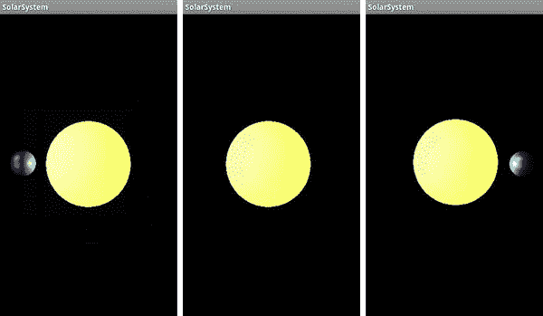

**图 4–17。** *中间发生了什么？*

这里有点奇怪。跑步的时候，你应该看到地球从太阳的左侧后面出来，朝着我们的方向绕行到太阳前面穿过，然后移开，再次重复绕行。那么，为什么我们看不到中间图像中太阳前方的地球(图 4–17)？

在所有的图形中，无论是计算机还是其他，绘制的顺序起着很大的作用。如果你在画肖像，你先画背景。如果你正在生成一个小太阳系，那么，应该先画太阳(呃，也许不是…或者不总是)。

渲染顺序，或*深度排序，*以及如何确定什么对象遮挡其他对象一直是计算机图形学的一大部分。在添加太阳之前，渲染顺序是无关紧要的，因为只有一个对象。但是随着世界变得越来越复杂，你会发现有两种方法可以解决这个问题。

第一种叫做*画家算法。*这意味着简单地先画最远的物体。对于像一个球体绕另一个球体旋转这样简单的事情来说，这是非常容易的。但是，当你拥有像《魔兽世界》或《第二人生》这样非常复杂的 3D 沉浸式世界时，会发生什么呢？这些实际上会使用 painter 算法的一个变体，但是会预先计算一些信息来确定所有可能的遮挡顺序。该信息然后被用来形成一个*二进制空间划分* (BSP)树。3D 世界中的任何地方都可以映射到树中的一个元素，然后可以遍历树以获取查看者位置的最佳顺序。这在执行上非常快，但是设置起来很复杂。幸运的是，对于我们简单的宇宙来说，这是一种过度杀戮。深度排序的第二种方法根本不是排序，而是实际上使用每个单独像素的 z 分量。屏幕上的一个像素有一个 x 和 y 值，但它也可以有一个 z 值，即使我面前的优派是一个平面 2D 表面。当一个像素准备在另一个像素上绘制时，z 值被比较，两者中较近的胜出。它被称为 *z 缓冲*，非常简单明了，但对于非常复杂的场景，它会占用额外的 CPU 时间和图形内存。我更喜欢后者，OpenGL 使得 z 缓冲非常容易实现。

在方法 OnSurfaceCreated 中，找到:

`    gl.glDepthMask(false);`

并替换为

`    gl.glDepthMask(true);`

如果它工作正常，你现在应该看到地球在前面时遮住太阳，或者在后面时被遮住。参见图 4–18。

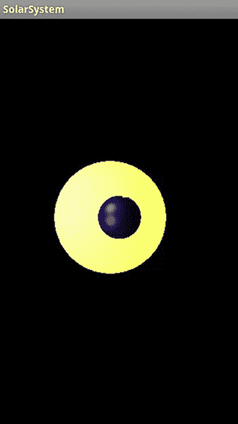

**图 4–18。** *使用 z 缓冲器*

### 乐队继续演奏

在 Android 下，GLSurfaceView 对象没有默认为“真正的”32 位颜色，即红色、绿色、蓝色和 alpha 各 8 位。相反，它选择了一种质量稍低的模式，称为“RGB565”，每像素仅使用 16 位，或者红色使用 5 位，绿色使用 6 位，蓝色使用 5 位。使用像这样的低分辨率颜色模式，您可能会在平滑着色的对象上看到“带状”伪像，如图 Figure 4–19 中左侧的图像所示。这仅仅是因为没有足够的颜色可用。但是，您可以指示 GLSurfaceView 使用更高分辨率的模式，从而生成图 4–19 中右侧的图像。在 activity 对象的 onCreate()处理程序中使用以下代码:

`    GLSurfaceView view = new GLSurfaceView(this);
    view.setEGLConfigChooser(8,8,8,8,16,0);                       //The new line
    view.setRenderer(new SolarSystemRenderer());
    setContentView(view);`

新行(view.setEGLConfigChooser(8，8，8，8，16，0)告诉视图每种颜色使用 8 位，此外还有 16 位用于深度或 z 缓冲，如上所述。最终值是模板的，将在第七章的中介绍。

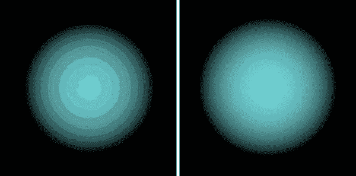

**图 4–19。** *左边 16 位颜色，右边 32 位颜色。*

自动使用 32 位颜色模式时要小心，因为一些较旧的设备不支持它们，可能会导致崩溃。建议您在使用默认模式之外的任何模式之前，先检查哪些模式可用。这可以通过创建一个自定义的“ColorChooser”对象来完成，该对象将枚举所有可能的模式。是的，这很痛苦，而且有很多代码。网站上将提供一个示例。

### 总结

本章介绍了场景照明和着色的各种方法，以及用于确定每个顶点颜色的数学算法。您还学习了漫射、镜面反射、发射和环境照明，以及与将灯光转化为聚光灯相关的各种参数。太阳系模型被更新以支持多个对象，并使用 z 缓冲来正确处理对象遮挡。