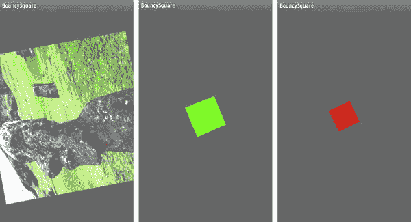

# 五、纹理

> 一个人的真正价值不在于他自己，而在于他身上的色彩和质地。
> 
> *—阿尔贝特·施韦泽*

人们的生活会变得相当乏味，没有质感。去除那些有趣的小缺点和怪癖，会给我们的日常生活增添一点光彩，不管它们是奇怪的但却是迷人的小习惯还是意想不到的才能。想象一下，一个高中看门人碰巧是一个优秀的舞厅舞者，一个著名的喜剧演员每天必须只穿新的白色袜子，一个非常成功的游戏工程师害怕手写信件——所有这些都可以让我们微笑，并在一天中增加一点点奇迹。在创造人造世界时也是如此。计算机可以产生的视觉完美可能很漂亮，但如果你想给你的场景创造一种真实感，那就感觉不太对了。这就是纹理产生的原因。

质感让完美成为真实。《美国传统词典》这样描述它:“某物独特的物理组成或结构，尤其是其各部分的大小、形状和排列。”很有诗意，是吧？

在 3D 图形的世界里，纹理在创建引人注目的图像时和灯光一样重要，而且现在可以不费吹灰之力地加入进来。图形芯片行业的大部分工作都植根于以比前一代硬件更高的速度渲染越来越精细的纹理。

因为 OpenGL ES 中的纹理是一个很大的主题，这一章将局限于基础知识，更高级的主题和技术留待下一章。记住这一点，让我们开始吧。

### 纹理化的语言

假设你想在你正在开发的游戏中创建一个飞机跑道。你会怎么做？很简单，拿几个黑色三角形，把它们拉长。砰！现在你有你的着陆跑道了！别急，伙计。画在长条中心的线条呢？一堆小白脸怎么样？这可能行得通。但是不要忘记最后那些黄色的人字形。嗯，添加一些额外的面孔，并把它们涂成黄色。别忘了数字。通向停机坪的曲线怎么样？很快你可能会有数百个三角形，但这仍然无助于解决油渍、修理、刹车痕或交通事故。现在事情开始变得复杂了。获取所有的细节可能需要成千上万张脸。与此同时，你的伙伴亚瑟也在创作一部漫画。你在比较笔记，告诉他多边形的数量，你甚至还没有谈到路杀。亚瑟说他只需要几个三角形和一个图像。你看，他使用纹理地图，使用纹理地图可以创建一个非常详细的表面，如飞机跑道，砖墙，装甲，云，吱吱作响的风化木门，一个遥远星球上的坑坑洼洼的地形，或一辆 56 年别克生锈的外表。

在计算机图形学的早期，纹理，或者说纹理映射，消耗了两种最珍贵的资源:CPU 周期和内存。它很少被使用，各种各样的小技巧都被用来节省这两种资源。与 20 年前相比，现在的内存几乎是免费的，现代芯片似乎有无限的速度，使用纹理不再是一个需要整夜熬夜和挣扎的决定。

#### 关于纹理的一切(大部分)

纹理有两大类型:*程序*和*图像*。程序纹理是基于某种算法动态生成的。木材、大理石、沥青、石头等等都有“方程式”。几乎任何种类的材质都可以简化成一种算法，从而绘制到一个物体上，如图 Figure 5–1 所示。

**图 5–1。** *左边的圣杯是抛光的黄金，而右边使用程序纹理看起来像金矿石，而圆锥体看起来像大理石。*

程序纹理非常强大，因为它们可以产生无限多种可缩放的图案，这些图案可以被放大以显示越来越多的细节，如图 5–2 所示。否则，这将需要大量的静态图像。

**图 5–2。** *图 5–1 中右边的高脚杯特写。请注意需要非常大的图像才能完成的细节。*

用于之前图像的 3D 渲染应用 Strata Design 3D-SE 支持程序纹理和基于图像的纹理。图 5–3 显示了用于指定图 5–2 中描述的金矿纹理参数的对话框。

**图 5–3。** *图 5–2 中用于产生金矿纹理的所有可能设置*

程序纹理，以及在较小程度上的图像纹理，可以按照从随机到结构化的复杂程度进行分类。随机或*随机*纹理可以被认为是“看起来像噪音”，就像沙子、灰尘、砾石、纸张中的颗粒等细粒度材质。接近随机的可能是火焰、草地或湖面。另一方面，结构化纹理具有广泛的可识别特征和图案。砖墙、柳条篮、格子花呢或一群壁虎将被构建。

#### 图像纹理

如前所述，图像纹理就是这样。它们可以作为表面或材质纹理，如红木、钢板或散落在地上的树叶。如果做得好，这些可以无缝平铺，覆盖比原始图像更大的表面。因为他们来自现实生活，他们不需要复杂的程序性软件。Figure 5–4 展示了圣杯的场景，但这一次使用了木质纹理，圣杯使用桃花心木，圆锥使用桤木，而立方体仍然是金色的。

**图 5–4。** *使用真实世界的图像纹理*

除了使用图像纹理作为材质，它们本身也可以在你的 3D 世界中作为图片使用。Galaxy Tab 的渲染图像可以将纹理放到屏幕上。一个 3D 城市可以使用真实的照片作为建筑物的窗户、广告牌或客厅里的家庭照片。

#### OpenGL ES 和纹理

当 OpenGL ES 渲染一个物体时，比如《??》第四章中的迷你太阳系，它会绘制每个三角形，然后根据组成每个面的三个顶点对其进行光照和着色。之后，它愉快地走向下一个。纹理只不过是一个图像。正如您在前面了解到的，它可以动态生成以处理上下文相关的细节(比如云模式)，也可以是`.jpg`、`.png`或其他任何东西。当然，它是由像素组成的，但是当作为纹理操作时，它们被称为*纹理元素*。你可以把一个 OpenGL ES 纹理想象成一堆小的彩色“面”(纹理元素)，每一个都有相同的大小，并且缝合在一张纸上，比如说，一面上有 256 个这样的“面”。每个面的大小都一样，可以拉伸或挤压，以便在任何大小或形状的表面上工作。它们没有浪费存储 xyz 值的内存的角几何，可以有多种可爱的颜色，并且非常划算。当然，它们的用途非常广泛。

像你的几何体一样，纹理也有自己的坐标空间。几何图形使用可靠的笛卡尔坐标表示其许多部分的位置，称为 *x，y* 和 *z* ，纹理使用 *s* 和 *t* 。将纹理应用到某个几何对象的过程称为 *UV 映射*。( *s* 和 *t* 仅用于 OpenGL 世界，其他使用 *u* 和 *v* 。去想想。)

那么，这是如何应用的呢？假设你有一块正方形的桌布，你必须把它拼成一张长方形的桌子。你需要沿着一边把它固定住，然后沿着另一边用力拉，直到它刚好盖住桌子。您可以只连接四个角，但如果您真的希望它“适合”，您可以沿着边缘甚至在中间连接其他部分。这就是一个纹理如何适应一个表面的一点点。

纹理坐标空间*归一化*；也就是说， *s* 和 *t* 的范围都是从 0 到 1。它们是无单位的实体，被抽象为不依赖于源或目的地的维度。因此，要进行纹理处理的面的顶点 *s* 和 *t* 值将在 0.0 到 1.0 之间，如图图 5–5 所示。

**图 5–5。** *纹理坐标从 0 到 1.0，不管纹理是什么。*

在最简单的例子中，我们可以将一个矩形纹理应用到一个矩形面上，然后完成它，如图 5–5 所示。但是如果你只想要纹理的一部分呢？你可以提供一个只有你想要的位的`.png`,如果你想拥有这个东西的许多变体，这就不太方便了。然而，还有另一种方法。仅仅改变目的面的 *s* 和 *t* 坐标。假设你想要的只是复活节岛雕像的左上角，我称之为海德利。你需要做的只是改变目的地的坐标，而那些坐标是基于你想要的图像部分的比例，如图 Figure 5–6 所示。也就是说，因为您希望图像被裁剪到沿 *S* 轴的一半，所以 *s* 坐标将不再从 0 到 1，而是从 0 到. 5。然后 *t* 坐标将从 0.5 变为 1.0。如果你想要左下角，你可以使用与 *s* 坐标相同的 0 到 0.5 的范围。

还要注意，纹理坐标系是独立于分辨率的。也就是说，边长为 512 的图像的中心将是(. 5，. 5)，就像边长为 128 的图像的中心一样。

**图 5–6。** *通过改变纹理坐标裁剪掉一部分纹理*

纹理不限于直线物体。通过仔细选择目标面上的第*个*坐标，你可以做出一些更加丰富多彩的形状，如图图 5–7 所示。

**图 5–7。** *将图像映射成不寻常的形状*

如果您在目的地的顶点上保持图像坐标不变，图像的角将跟随目的地的角，如图 Figure 5–8 所示。

**图 5–8。** *扭曲的图像可以在 2D 表面产生 3D 效果。*

纹理也可以*平铺*以便复制描绘壁纸、砖墙、沙滩等的图案，如图图 5–9 所示。请注意，坐标实际上超过了 1.0 的上限。所做的只是开始纹理重复，例如，0.6 的 *s* 等于 1.6 的 *s* ，2.6，等等。

**图 5–9。** *平铺图像对于重复的图案非常有用，例如用于壁纸或砖墙的图案。*

除了在图 5–9 中显示的平铺模型，纹理平铺也可以被“镜像”或夹紧。两者都是处理 0 到 1.0 范围之外的 s 和 *t* 的机制。

镜像平铺类似重复，但只是翻转交替图像的列/行，如图图 5–10a 所示。钳制图像意味着纹理元素的最后一行或最后一列重复，如图 Figure 5–1bb 所示。在我的示例图像中，钳制看起来一塌糊涂，但是当图像具有中性边框时，钳制很有用。在这种情况下，如果 *s* 或 *v* 超出其正常界限，您可以防止任何图像在一个或两个轴上重复。

**图 5–10。** *左边(a)显示的是一个镜像-重复，只针对 S 轴，而右边纹理(b)被钳制。*

**注意:**图 5–10 中右侧图像右边缘的问题表明，设计用于夹紧的纹理应该有一个 1 像素宽的边界，以匹配它们所绑定的对象的颜色——除非你认为它真的很酷，那么当然，这几乎胜过一切。

正如你现在所知道的，OpenGL ES 不做*四边形*——也就是有四个边的面(相对于它的桌面兄弟)。所以，我们必须用两个三角形来制作它们，给我们一些结构，比如我们在第三章实验过的三角形带和扇形。将纹理应用到这个“假”四边形是一件简单的事情。一个三角形的纹理坐标为(0，0)、(1，0)和(0，1)，而另一个三角形的坐标为(1，0)、(1，1)和(0，1)。如果你研究一下图 5–11，会更有意义。

**图 5–11。** *在两个面上放置纹理*

最后，让我们看看一个纹理是如何被拉伸到一大堆人脸上的，如图 Figure 5–12 所示，然后我们可以做一些有趣的事情，看看这是不是真的。

**图 5–12。** *将一个纹理拉伸到多个面上*

#### 图像格式

OpenGL ES 支持很多不同的图像格式，我说的不是`.png` vs. `.jpg`，我指的是内存中的形式和布局。标准是 32 位，为红色、绿色、蓝色和 alpha 各分配 8 位内存。被称为 RGBA，它是大多数练习使用的标准。它也是“最漂亮的”,因为它提供了超过 1600 万种颜色和透明度。但是，您通常可以使用 16 位甚至 8 位图像。这样做，你可以节省大量的内存和曲柄速度相当多，仔细选择图像。参见表 5–1 了解一些更流行的格式。

另外，各种格式的要求是，一般来说，OpenGL 只能使用边长为 2 的幂的纹理图像。一些系统可以绕过这一点，比如有一定限制的 iOS，但目前，只要坚持标准就行了。

所以，所有这些东西都解决了，是时候开始编码了。

### 回到充满弹性的正方形

让我们后退一步，再次创建通用的弹性正方形，这是我们在第一章中第一次做的。我们将对它应用一个纹理，然后操纵它来展示前面详述的一些技巧，比如重复、动画和扭曲。

随意回收第一个项目。

接下来是纹理的实际创建。这将读入 Android 支持的任何类型的图像文件，并将其转换为 OpenGL 可以使用的格式。

在我们开始之前，还需要一个步骤。Android 需要被通知将被用作纹理的图像文件。这可以通过将图像文件`hedly.png`添加到`/res/drawable`文件夹来完成。如果 drawable 文件夹不存在，您可以现在创建它并将其添加到项目中。我们将在整数数组中存储纹理信息。在`Square.java`中增加以下一行:

`    private int[] textures = new int[1];`

添加以下导入内容:

`    import android.graphics.*;celar
    import android.opengl.*;`

接下来将列表 5–1 添加到`Square.java`来创建纹理。

**清单 5–1。** *创建 OpenGL 纹理*

`public int createTexture(GL10 gl, Context contextRegf, int resource)
       {    
           Bitmap image = BitmapFactory.decodeResource(contextRegf.getResources(),
               resource);                                                           // 1
           gl.glGenTextures(1, textures, 0);                                        // 2
           gl.glBindTexture(GL10.*GL_TEXTURE_2D*, textures[0]);                       // 3` `           GLUtils.*texImage2D*(GL10.*GL_TEXTURE_2D*, 0, image, 0);                     // 4

           gl.glTexParameterf(GL10.*GL_TEXTURE_2D*, GL10.*GL_TEXTURE_MIN_FILTER*,
               GL10.*GL_LINEAR*);                                                     // 5a

           gl.glTexParameterf(GL10.*GL_TEXTURE_2D*, GL10.*GL_TEXTURE_MAG_FILTER*,
               GL10.*GL_LINEAR*);                                                     // 5b

           image.recycle();                                                         //6
           return resource;
    }`

让我们来分解一下:

*   第 1 行加载 Android 位图，让加载器处理 Android 可以读取的任何图像格式。表 5–2 列出了支持的格式。
*   第 2 行得到一个未使用的纹理“名称”，它实际上只是一个数字。这确保了您使用的每个纹理都有一个唯一的标识符。如果您想重用标识符，那么您应该调用`glDeleteTextures()`。
*   之后，纹理被*绑定*到下一行当前的 2D 纹理，用新的纹理替换之前的纹理。在 OpenGL ES 中，这些纹理目标只有一个，所以它必须总是`GL_TEXTURE_2D`，而成熟的 OpenGL 有几个。所有可用参数参见表 5–3。绑定也会使该纹理处于活动状态，因为一次只有一个纹理处于活动状态。这也指导 OpenGL 在哪里放置任何新的图像数据。参见表 5–2。
*   在这里的第 4 行，`GLUtils`使用了绑定 OpenGL ES 和 Android APIs 的 Android 工具类。这个工具为我们在第 1 行创建的位图指定了 2D 纹理图像。图像(纹理)是基于创建的位图以其原始格式在内部创建的。
*   最后，第 5a 和 5b 行设置了 Android 上需要的一些参数。没有它们，纹理有一个默认的“过滤器”值，这是不必要的。最小和最大过滤器告诉系统如何在某些情况下处理纹理，在这些情况下，纹理必须缩小或放大以适应给定的多边形。表 5–3 显示了 OpenGL ES 中可用的参数类型。
*   为了成为好邻居，第 6 行告诉 Android 显式回收位图，因为位图会占用大量内存。

在我们调用`createTexture`方法之前，我们需要获取图像的上下文和资源 ID(`headly.png`)。要获得上下文，请修改`BouncySquareActivity.java`中的`onCreate()`方法，如下所示:

`    view.setRenderer(new SquareRenderer(true));`

致以下内容:

`    view.setRenderer(new SquareRenderer(true, this.getApplicationContext()));`

这也需要将`SquareRenderer.java`中的构造器定义更改为以下内容:

`public SquareRenderer(boolean useTranslucentBackground, Context context) {
    mTranslucentBackground = useTranslucentBackground;
    this.context = context;                                             //1
    this.mSquare = new Square();
}`

您需要添加以下导入:

`    import android.content.Context;`

并添加一个实例变量来支持新的上下文。稍后，当加载图像并将其转换为 OpenGL 兼容纹理时，会用到上下文。

现在，为了获得资源 ID，在`SquareRenderer.java`的`onSurfaceCreated()`方法中添加以下内容:

`        int resid = book.BouncySquare.R.drawable.*hedly*;                               //1
        mSquare.createTexture(gl, this.context, resid);                               //2`

*   第 1 行获取我们添加到 drawable 文件夹中的图像资源(`hedly.png`)。当然，你可以使用任何你想要的图像。
*   在第 2 行，我们使用了`Square`类的对象，并用正确的上下文和图像的资源 ID 调用了`createTexture()`方法。

然后将以下内容添加到`Square.java`中的接口实例变量中:

`    public FloatBuffer mTextureBuffer;
    float[] textureCoords =     
    {                                        
        0.0f, 0.0f,
        1.0f, 0.0f,
        0.0f, 1.0f,
        1.0f, 1.0f                
    };`

这定义了纹理坐标。现在在 square 的构造函数中创建类似于我们在第一章中创建的`vertBuffer`的`textureBuffer`。

`    ByteBuffer tbb = ByteBuffer.*allocateDirect*(textureCoords.length * 4);

    tbb.order(ByteOrder.*nativeOrder*());

    mTextureBuffer = tbb.asFloatBuffer();

    mTextureBuffer.put(textureCoords);

    mTextureBuffer.position(0);`

我的图片是太平洋复活节岛上一个神秘的巨大石头头像的照片。为了便于测试，请使用 32 位 RGBA 的 2 的幂(POT)图像。

**注意:**默认情况下，OpenGL 要求图像数据中的每一行纹理元素都在一个 4 字节的边界上对齐。我们的 RGBA 纹理坚持这一点；对于其他格式，考虑使用调用 glPixelStorei(GL _ PACK _ ALIGNMENT，x)，其中 x 可以是 1、2、4 或 8 个字节用于对齐。使用 1 来涵盖所有情况。

请注意，纹理通常有大小限制，这取决于实际使用的图形硬件。您可以通过调用以下代码来确定特定平台可以使用多大的纹理，其中`maxSize`是一个在运行时进行补偿的整数:

`     gl.glGetIntegerv(GL10.GL_MAX_TEXTURE_SIZE,maxSize);`

最后，需要修改`draw()`例程，如清单 5–2 所示。大部分你已经见过了。我已经将渲染器模块中的`glEnableClientState()`调用迁移到这里，使方形对象更加包容。

**清单 5–2。** *用纹理渲染几何体*

`public void draw(GL10 gl)
    {
            gl.glVertexPointer(2, GL10.*GL_FLOAT*, 0, mFVertexBuffer);
            gl.glEnableClientState(GL10.*GL_VERTEX_ARRAY*);
            gl.glColorPointer(4, GL10.*GL_UNSIGNED_BYTE*, 0, mColorBuffer);
            gl.glEnableClientState(GL10.*GL_COLOR_ARRAY*);

            gl.glEnable(GL10.*GL_TEXTURE_2D*);                                     //1
            gl.glEnable(GL10.*GL_BLEND*);                                          //2

            gl.glBlendFunc(GL10.*GL_ONE*, GL10.*GL_SRC_COLOR*);                      //3
            gl.glBindTexture(GL10.*GL_TEXTURE_2D*, textures[0]);                   //4

            gl.glTexCoordPointer(2, GL10.*GL_FLOAT*,0, mTextureBuffer);            //5
            gl.glEnableClientState(GL10.*GL_TEXTURE_COORD_ARRAY*);                 //6

            gl.glDrawArrays(GL10.*GL_TRIANGLE_STRIP*, 0, 4);                       //7

            gl.glDisableClientState(GL10.*GL_COLOR_ARRAY*);
            gl.glDisableClientState(GL10.*GL_VERTEX_ARRAY*);
            gl.glDisableClientState(GL10.*GL_TEXTURE_COORD_ARRAY*);                //8
    }`

这是怎么回事？

*   在第 1 行中，`GL_TEXTURE_2D`目标被启用。桌面 OpenGL 支持 1D 和 3D 纹理，但不支持 es。
*   在第 2 行中，可以启用混合。混合是指颜色和目标颜色根据第 3 行中打开的公式进行混合。
*   混合功能决定如何将源和目标像素/片段混合在一起。最常见的形式是源覆盖目标，但其他形式可以创建一些有趣的效果。由于这是一个很大的话题，所以后面会讲到。
*   第 4 行确保我们想要的纹理是当前的。
*   第 5 行是纹理坐标被传递给硬件的地方。
*   正如您必须告诉客户端处理颜色和顶点一样，您需要对第 6 行中的纹理坐标做同样的事情。
*   第 7 行你会认识，但这一次除了绘制颜色和几何图形，它现在从当前纹理(`texture_2d`)获取信息，将四个纹理坐标匹配到由`vertices[]`数组指定的四个角(纹理对象的每个顶点都需要分配一个纹理坐标)，并使用第 3 行中指定的值混合它。
*   最后，禁用纹理的客户端状态，就像禁用颜色和顶点一样。

如果一切正常，您应该会看到类似于图 5–13 中左图的东西。注意纹理是如何从顶点获取颜色的？注释掉该行`glColorPointer(4, GL10.GL_UNSIGNED_BYTE, 0, mColorBuffer)`，现在您应该会看到图 5–13 中的右图。如果您没有看到任何图像，请仔细检查您的文件，确保它的大小确实是 2 的幂，例如 128x128 或 256x256。

**图 5–13。** *对有弹性的正方形应用纹理。左边使用顶点颜色；右派没有。*

你说什么？纹理颠倒了？这很可能是一个问题，取决于各自的操作系统如何对待位图。OpenGL 希望左下角作为原点，而一些图像格式或驱动程序选择左上角作为原点。有两种主要方法可以解决这个问题:您可以选择更改代码，或者您可以提供一个预先裁剪的图像。因为这是一个非常简单的项目，我选择用图像编辑器翻转图形。

所以现在我们可以复制本章第一部分中的一些例子。第一种方法是只挑选一部分纹理来显示。将`textureCoords`更改如下:

`float[] textureCoords =

{
           0.0f, 0.0f,
           0.5f, 0.0f,
           0.0f, 0.5f,
           0.5f, 0.5f
};`

你拿到图 5–14 了吗？

**图 5–14。** *使用 s 和 t 坐标裁剪图像*

纹理坐标到真实几何坐标的映射看起来像图 5–15。如果你还不太清楚，花几分钟去理解这里发生了什么。简单地说，数组中的纹理坐标与几何坐标是一对一的映射。

**图 5–15。** *纹理坐标与几何坐标一一对应。*

现在改变纹理坐标如下。你能猜到会发生什么吗？(图 5–16):

`    float[] textureCoords =
    {
          0.0f, 2.0f,
          2.0f, 2.0f,
          0.0f, 0.0f,
          2.0f, 0.0f
    };` 

**图 5–16。** *当需要做壁纸等重复图案时，重复图像很方便。*

现在让我们通过改变顶点的几何形状来扭曲纹理，为了让事情看起来更清楚，恢复原始的纹理坐标来关闭重复:

`    float  vertices[] =
{
                    -1.0f, -0.7f,
                    1.0f, -0.30f,
                    -1.0f, 0.70f,
                    1.0f,  0.30f,
};`

这应该会夹住正方形的右侧，并带走纹理，如图图 5–17 所示。

**图 5–17。** *捏紧多边形的右边*

有了这些知识，如果你动态改变纹理坐标*会发生什么？将下面的代码添加到`draw()`—任何地方都应该可以工作。*

*`    textureCoords[0]+=texIncrease;

    textureCoords[2]+=texIncrease;

    textureCoords[4]+=texIncrease;

    textureCoords[6]+=texIncrease;

    textureCoords[1]+=texIncrease;

    textureCoords[3]+=texIncrease;

    textureCoords[5]+=texIncrease;

    textureCoords[7]+=texIncrease;`

并使`textureCoords`和`texIncrease`都成为实例变量。

这将逐帧增加一点纹理坐标。敬畏地奔跑和站立。这是一个非常简单的获得动画纹理的技巧。3D 世界中的字幕可能会用到这个。您可以创建一个纹理，就像一个卡通人物正在做某事的电影胶片，并更改 *s* 和 *t* 的值，像一本小动画书一样从一帧跳到另一帧。另一种是创建基于纹理的字体。由于 OpenGL 没有原生字体支持，这取决于我们，世界上长期受苦的工程师，自己添加它。唉。这可以通过将所需字体的字符放置在单个*马赛克*纹理上，然后通过仔细使用纹理坐标来选择它们来实现。

#### mipmap

小中见大贴图是一种为给定纹理指定多个细节级别的方法。这可以在两个方面有所帮助:当纹理对象到视点的距离变化时，它可以平滑纹理对象的外观；当纹理对象很远时，它可以节省资源的使用。

例如，在遥远的太阳中，我可能会为木星使用 1024x512 的纹理。但是，如果木星离我们很远，只有几个像素宽，那将是对内存和 CPU 的浪费。这就是 mipmapping 发挥作用的地方。那么，什么是 mipmap？

源自拉丁语短语“multum in parvo”(字面意思:小中有大)，一个 *mipmap* 是一系列细节层次不同的纹理。你的根图像的边长可能是 128，但是当它是一个纹理贴图的一部分时，它的边长可能也是 64，32，16，8，4，2 和 1 像素，如图图 5–18 所示。

**图 5–18。** *海德利，mipmapped 版*

回到本章最初的练习，有纹理的弹性正方形，你将通过测试进行 mipmapping。

首先，创建一系列纹理，从 1x1 到 256x256，使每个纹理的大小是前一个的两倍，同时给它们涂上不同的颜色。这些颜色使您能够很容易地分辨出一个图像何时变成另一个图像。将它们添加到您的项目中的`/res/drawable/`下，然后在`onSurfaceCreated()`的`SquareRendered.java`中，用清单 5–3 替换掉对`createTexture()`的单个调用。注意，最后使用的是最后一个参数，即细节层次索引。如前所述，如果您只有一个图像，则使用 0 作为默认值。任何大于 0 的都将是 mipmap 图像族的剩余部分。所以，第一张是海德利的，其余的我用的是彩色方块，这样当它们弹出和弹出时，很容易看到不同的图像。请注意，如果您像这样手动生成 mipmaps，您需要为每个级别指定*图像，并且它们必须是正确的尺寸，因此您不能仅仅为了节省几行代码而跳过 1、2 和 4 像素图像。否则，什么都不会显示。并确保原始图像的边长为 256，以便从 1 到 256 的图像之间有一个完整的链。*

为了方便打开或关闭 mipmapping，我在`Square.java`中添加了以下实例变量。

`    public boolean m_UseMipmapping = true;`

将清单 5–3 添加到`SquareRenderer.java`中的`onSurfaceCreated()`方法。

**清单 5–3。** *设置自定义预过滤 Mipmap*

`            int resid = book.BouncySquare.R.drawable.*hedly256*;                        
            mSquare.createTexture(gl, this.context, resid, true);        

            if (mSquare.m_UseMipmapping)
        {
                    resid = book.BouncySquare.R.drawable.*mipmap128*;
                    mSquare.createTexture(gl, this.context, resid, false);
                    resid = book.BouncySquare.R.drawable.*mipmap64*;
                    mSquare.createTexture(gl, this.context, resid, false);
                    resid = book.BouncySquare.R.drawable.*mipmap32*;
                    mSquare.createTexture(gl, this.context, resid, false);
                    resid = book.BouncySquare.R.drawable.*mipmap16*;
                    mSquare.createTexture(gl, this.context, resid, false);
                    resid = book.BouncySquare.R.drawable.*mipmap8*;
                    mSquare.createTexture(gl, this.context, resid, false);
                    resid = book.BouncySquare.R.drawable.*mipmap4*;
                    mSquare.createTexture(gl, this.context, resid, false);
                    resid = book.BouncySquare.R.drawable.*mipmap2*;
                    mSquare.createTexture(gl, this.context, resid, false);
                    resid = book.BouncySquare.R.drawable.*mipmap1*;
                    mSquare.createTexture(gl, this.context, resid, false);
         }`

在此之后，`Square.java`中的`createTexture()`需要替换为清单 5–4 中的内容。

**清单 5–4。** *生成 Mipmap 链*

`private int[] textures = new int[1];
        static int *level* = 0;` `        public int createTexture(GL10 gl, Context contextRegf, int resource, boolean imageID)
    {
               Bitmap tempImage = BitmapFactory.*decodeResource*(
                               contextRegf.getResources(), resource);             // 1
               if (imageID == true) {
                       gl.glGenTextures(1, textures, 0);
                       gl.glBindTexture(GL10.*GL_TEXTURE_2D*, textures[0]);
          }

               GLUtils.*texImage2D*(GL10.*GL_TEXTURE_2D*, *level*, tempImage, 0);      // 4
                       *level*++;

               if (m_UseMipmapping == true) {
                       gl.glTexParameterx(GL10.*GL_TEXTURE_2D*,
                                   GL10.*GL_TEXTURE_MIN_FILTER*,
                                   GL10.*GL_LINEAR_MIPMAP_NEAREST*);
                       gl.glTexParameterx(GL10.*GL_TEXTURE_2D*,
                                   GL10.*GL_TEXTURE_MAG_FILTER*,
                                   GL10.*GL_LINEAR_MIPMAP_NEAREST*);
          } else {
                       gl.glTexParameterf(GL10.*GL_TEXTURE_2D*,
                                   GL10.*GL_TEXTURE_MIN_FILTER*,
                                   GL10.*GL_LINEAR*);
                       gl.glTexParameterf(GL10.*GL_TEXTURE_2D*,
                                   GL10.*GL_TEXTURE_MAG_FILTER*,
                                   GL10.*GL_LINEAR*);
          }

            tempImage.recycle();// 6
            return resource;
    }`

自然也需要一些改变。将以下实例变量添加到`SquareRenderer.java`:

`    float z = 0.0f;

    boolean flipped=false;

    float delz_value=.040f;

    float delz = 0.0f;

    float furthestz=-20.0f;

    static float *rotAngle*=0.0f;`

现在，使用清单 5–5 代替当前的`onDrawFrame()`。这将导致 z 值来回振荡，以便您可以观察到小中见大贴图的运行。

**清单 5–5。** *随 z 值变化的 onDrawFrame()*

`    public void onDrawFrame(GL10 gl) {

           gl.glClear(GL11.*GL_COLOR_BUFFER_BIT* | GL11.*GL_DEPTH_BUFFER_BIT*);

           gl.glMatrixMode(GL11.*GL_MODELVIEW*);
           gl.glLoadIdentity();

           if(z<furthestz)

       {
                   if(!flipped)
               {
                           delz=delz_value;
                           flipped=true;
               } else {
                           flipped=false;
               }
       } else if(z > -.01f) {
                   if(!flipped) {
                           delz=-delz_value;
                           flipped=true;
               } else {
                           flipped=false;
               }                
       }
          z=z+delz;
          gl.glTranslatef(0.0f, (float) (Math.*sin*(mTransY) / 2.0f), z);
          gl.glRotatef(*rotAngle*, 0, 0, 1.0f);
          *rotAngle*+=.5f;

          mSquare.draw(gl);

          mTransY += .15f;
        }`

最后，确保调用`glColorPonter()`从 square 的`draw()`方法中移除。

如果编译和运行正常，您应该会看到类似于 Figure 5–19 的内容，当 OpenGL ES 为给定的距离选择最佳颜色时，不同的颜色会出现和消失。

**图 5–19。** *根据到眼点的距离，每个 mipmap 级别的不同图像会弹出和弹出。*

让 OpenGL 为您生成小中见大贴图是可能的，如下一节所示。

#### 过滤

用作纹理的图像在投影到屏幕上时，根据其内容和最终大小，可能会出现各种人为效果。非常详细的图像可能会出现令人讨厌的闪烁效果。然而，可以通过一个叫做*过滤*的过程来动态修改图像以最小化这些影响。

假设你有一个 128x128 的纹理，但是纹理面的边长是 500 像素。你应该看到什么？显然，图像的原始像素，现在称为*纹理像素*，将比任何屏幕像素大得多。这是一个被称为*放大*的过程。相反，你可能会遇到纹理元素比一个像素小得多的情况，这被称为*缩小*。过滤是用于确定如何将像素的颜色与底层纹理元素相关联的过程。表 5–4 和 5–5 显示了这种情况的可能变化。

有三种主要的过滤方法:

*   *点采样(在 OpenGL lingo 中调用)*:像素的颜色是基于离像素中心最近的纹理元素。这是最简单、最快的，自然产生最不令人满意的图像。
*   *双线性采样，也称为线性*像素的着色基于距离像素中心最近的 2×2 纹理元素阵列的加权平均值。这可以大大平滑图像。
*   *三线性采样*:这需要小中见大贴图，将两个最接近的小中见大贴图级别用于屏幕上的最终渲染，对每个级别执行双线性选择，然后对两个单独的值进行加权平均。

您可以通过再次查看第一个练习来了解这一点。在您的 mipmapping 实验中，将以下行添加到`createTexture()`的最末尾，同时删除创建所有先前 mipmap 图像的初始化行(当然，图像#0 除外):

`    gl.glHint(GL11.GL_GENERATE_MIPMAP,GL10.GL_NICEST);
    gl.glTexParameterf(GL10.GL_TEXTURE_2D,GL11.GL_GENERATE_MIPMAP,GL10.GL_TRUE);`

第二个调用，在前面已经提到过，将自动从你唯一的图像中创建一个 mipmap，并交给渲染器。并且确保`createTexture()`只被调用一次，因为不需要为不同层次的细节使用我们自己的定制图像。对`glHint`()的第一次调用告诉系统使用它所拥有的任何算法来生成看起来最好的图像。还可以选择`GL_FASTEST`和`GL_DONT_CARE`。后者将选择它认为最适合这种情况的方法。

在 Figure 5–20 中，左边的图像显示了关闭过滤功能的 Hedly 的特写，而右边的图像显示了过滤功能的开启。

**图 5–20。** *左侧已经全部过滤关闭。右侧打开了双线性过滤。*

#### OpenGL 扩展

尽管 OpenGL 是一个标准，但它在设计时就考虑到了可扩展性，允许各种硬件制造商使用`extension strings`将他们自己的特殊调料添加到 3D 汤里。在 OpenGL 中，开发人员可以轮询可能的扩展，然后使用它们，如果它们存在的话。要了解这一点，请使用下面一行代码:

`    String extentionList=gl.glGetString(GL10.*GL_EXTENSIONS*);`

这将返回一个空格分隔的列表，列出 Android 中用于 OpenGL ES 的各种额外选项，如下所示(来自 Android 2.3):

`    GL_OES_byte_coordinates GL_OES_fixed_point GL_OES_single_precision
    GL_OES_read_format GL_OES_compressed_paletted_texture GL_OES_draw_texture
    GL_OES_matrix_get GL_OES_query_matrix GL_OES_EGL_image
    GL_OES_compressed_ETC1_RGB8_texture GL_ARB_texture_compression
    GL_ARB_texture_non_power_of_two GL_ANDROID_user_clip_plane
    GL_ANDROID_vertex_buffer_object GL_ANDROID_generate_mipmap`

这有助于找到一部手机可能比另一部手机拥有的定制功能。一种可能是使用一种称为 PVRTC 的特殊图像压缩格式，这种格式只为使用 PowerVR 类图形芯片的设备定制。PVRTC 与 PowerVR 硬件紧密结合，可以改善渲染和加载时间。三星 Galaxy S、摩托罗拉的 Droid X、黑莓 playbook 以及本文撰写时的所有 iOS 设备都可以利用 PVRTC。非 PowerVR 设备，如使用 Ardreno 或 Tegra 内核的设备，也可能有自己的特殊格式。

如果字符串`GL_IMG_texture_compression_pvrtc`出现在之前的扩展列表中，您可以判断您的设备是否支持 PVRTC。其他 GPU 可能有类似的格式，所以如果你想走自定义路线，我们鼓励你查看开发者论坛和 SDK。

### 最后，更多太阳系的善良

现在我们可以回到上一章的太阳系模型，给地球添加一个纹理，让它看起来更像地球。对`SolarSystemActivity.java`进行类似于我们之前对`BouncySquareActivity.java`所做的修改，将 setter 修改为:

`    view.setRenderer(new SolarSystemRenderer(this.getApplicationContext());`

还要修改`SolarSystemRenderer.java`中的构造函数来处理传递的上下文。

`    import android.content.Context;
    public Context myContext;
    public SolarSystemRenderer(Context context)
    {
        this.myContext = context;
    }`

我们需要将上下文存储在一个公共变量中，因为我们将在创建图像纹理时将它传递给`init()`函数。接下来，检查`Planet.java`，并将`init()`替换为清单 5–6；变化已被突出显示。对于地球的纹理，有很多例子。只要在谷歌上搜索一下。或者你可能想在`[`maps.jpl.nasa.gov/`](http://maps.jpl.nasa.gov/)`先检查一下 NASA。

**清单 5–6。** *修改了球体生成器，增加了纹理支持*

`private void init(int stacks,int slices, float radius, float squash, GL10 gl,
              Context context, boolean imageId, int resourceId)              // 1
    {
              float[] vertexData;` `float[] normalData;
              float[] colorData;
              float[] textData=null;

              float colorIncrement=0f;

              float blue=0f;
              float red=1.0f;

              int vIndex=0;                                //vertex index
              int cIndex=0;                                //color index
              int nIndex=0;                                //normal index
              int tIndex=0;                                //texture index

              if(imageId == true)
              createTexture(gl, context, resourceId);                         //2
              m_Scale=radius;                                                
              m_Squash=squash;

              colorIncrement=1.0f/(float)stacks;

              m_Stacks = stacks;
              m_Slices = slices;

              //Vertices

              vertexData = new float[ 3*((m_Slices*2+2) * m_Stacks)];

              //Color data

              colorData = new float[ (4*(m_Slices*2+2) * m_Stacks)];

              //Normal pointers for lighting

              normalData = new float[3*((m_Slices*2+2) * m_Stacks)];
                       if(imageId == true)                                      //3
                       textData = new float [2 * ((m_Slices*2+2) * (m_Stacks))];

              int      phiIdx, thetaIdx;

             //Latitude

            for(phiIdx=0; phiIdx < m_Stacks; phiIdx++)
            {
                    //Starts at -1.57 and goes up to +1.57 radians.

                    ///The first circle.

                    float phi0 = (float)Math.*PI* * ((float)(phiIdx+0) *
                     (1.0f/(float)(m_Stacks)) - 0.5f);        

                    //The next, or second one.` `float phi1 = (float)Math.*PI* * ((float)(phiIdx+1) *
                    (1.0f/(float)(m_Stacks)) - 0.5f);        

                    float cosPhi0 = (float)Math.*cos*(phi0);                                
                    float sinPhi0 = (float)Math.*sin*(phi0);
                    float cosPhi1 = (float)Math.*cos*(phi1);
                    float sinPhi1 = (float)Math.*sin*(phi1);

                    float cosTheta, sinTheta;

                    //Longitude

                    for(thetaIdx=0; thetaIdx < m_Slices; thetaIdx++)
                {
                            //Increment along the longitude circle each "slice."
                            float theta = (float) (2.0f*(float)Math.*PI* *
                            ((float)thetaIdx) * (1.0/(float)(m_Slices-1)));
                            cosTheta = (float)Math.*cos*(theta);
                            sinTheta = (float)Math.*sin*(theta);

                            //We're generating a vertical pair of points, such
                            //as the first point of stack 0 and the first point of
                            //stack 1 above it. This is how TRIANGLE_STRIPS work,
                            //taking a set of 4 vertices and essentially drawing two
                            //triangles at a time. The first is v0-v1-v2, and the next
                            //is v2-v1-v3, etc.

                            //Get x-y-z for the first vertex of stack.

                            vertexData[vIndex]   = m_Scale*cosPhi0*cosTheta;
                            vertexData[vIndex+1] = m_Scale*(sinPhi0*m_Squash);
                            vertexData[vIndex+2] = m_Scale*(cosPhi0*sinTheta);

                            vertexData[vIndex+3]   = m_Scale*cosPhi1*cosTheta;
                            vertexData[vIndex+4] = m_Scale*(sinPhi1*m_Squash);
                            vertexData[vIndex+5] = m_Scale*(cosPhi1*sinTheta);

                            //Normal pointers for lighting

                            normalData[nIndex+0] = (float)(cosPhi0 * cosTheta);
                            normalData[nIndex+2] = cosPhi0 * sinTheta;
                            normalData[nIndex+1] = sinPhi0;

                            //Get x-y-z for the first vertex of stack N.
                            normalData[nIndex+3] = cosPhi1 * cosTheta;
                            normalData[nIndex+5] = cosPhi1 * sinTheta;
                            normalData[nIndex+4] = sinPhi1;

                            if(textData != null)                                         //4` `{
                                    float texX = (float)thetaIdx *
                                  (1.0f/(float)(m_Slices-1));
                                    textData [tIndex + 0] = texX;
                                    textData [tIndex + 1] = (float)(phiIdx+0) *
                                  (1.0f/(float)(m_Stacks));
                                    textData [tIndex + 2] = texX;
                                    textData [tIndex + 3] = (float)(phiIdx+1) *
                                  (1.0f/(float)(m_Stacks));
                               }

                               colorData[cIndex+0] = (float)red;        
                               colorData[cIndex+1] = (float)0f;
                               colorData[cIndex+2] = (float)blue;
                               colorData[cIndex+4] = (float)red;
                               colorData[cIndex+5] = (float)0f;
                               colorData[cIndex+6] = (float)blue;
                               colorData[cIndex+3] = (float)1.0;
                               colorData[cIndex+7] = (float)1.0;

                               cIndex+=2*4;
                               vIndex+=2*3;
                               nIndex+=2*3;

                               if(textData!=null)                                        //5
                               tIndex+= 2*2;

                               blue+=colorIncrement;
                               red-=colorIncrement;

                              //Degenerate triangle to connect stacks and maintain
                              //winding order.

                              vertexData[vIndex+0] = vertexData[vIndex+3] =
                             vertexData[vIndex-3];
                              vertexData[vIndex+1] = vertexData[vIndex+4] =
                             vertexData[vIndex-2];
                              vertexData[vIndex+2] = vertexData[vIndex+5] =
                             vertexData[vIndex-1];

                              normalData[nIndex+0] = normalData[nIndex+3] =
                             normalData[nIndex-3];
                              normalData[nIndex+1] = normalData[nIndex+4] =
                             normalData[nIndex-2];
                              normalData[nIndex+2] = normalData[nIndex+5] =
                             normalData[nIndex-1];

                           if(textData!= null)                                           //6
                      {
                          textData [tIndex + 0] = textData [tIndex + 2] =
                               textData [tIndex -2];
                          textData [tIndex + 1] = textData [tIndex + 3] =
                                textData [tIndex -1];` `                      }
              }
    }
        m_Pos[0]= 0.0f;
        m_Pos[1]= 0.0f;
        m_Pos[2]= 0.0f;

       m_VertexData = *makeFloatBuffer*(vertexData);
       m_NormalData = *makeFloatBuffer*(normalData);
       m_ColorData = *makeFloatBuffer*(colorData);

       if(textData!= null)
        m_TextureData = *makeFloatBuffer*(textData);                
    }`

所以，事情是这样的:

*   图像的 GL 对象、上下文、图像 ID 和资源 ID 被添加到第 1 行的参数列表的末尾。
*   在第 2 行，创建了纹理。
*   在第 3ff 行中，分配了纹理的坐标数组。
*   接下来，计算第 4ff 行的纹理坐标。由于球体有 x 个切片和 y 个堆栈，坐标空间仅从 0 到 1，我们需要将每个值增加 *s* 的增量`1/m_slices`和 *t 的增量`1/m_stacks`。注意，这覆盖了两对坐标，一对在另一对之上，匹配三角形条带的布局，也产生了堆叠的坐标对。*
*   在第 5 行，推进坐标数组以保存下一组值。
*   最后，一些松散的线程被绑在一起，准备进入第 6 行的下一个堆栈。

确保将以下内容添加到实例数据中:

`    FloatBuffer m_TextureData;`

将第一个例子中的`createTexture()`方法复制到`Planet.java`，并根据需要进行修改。如果您愿意，可以随意移除 mipmap 支持，但是保留它没有坏处，因为它对于本练习来说并不重要。确保`glTexParameterf()`将`GL10.GL_LINEAR`作为参数。

对于一个地球纹理，请注意，这将环绕整个球体模型，所以不是任何图像都可以，因此它应该类似于图 5–21。

**图 5–21。** *纹理通常填充整个帧，边到边。行星使用墨卡托投影(圆柱形地图)。*

一旦你找到一个合适的`.png`，将它添加到你的项目中`/res/drawable-nodpi/`下，并在分配时将它交给行星对象。因为你不需要太阳的纹理，你可以传递一个 0 作为资源 ID。所以我们可以把`false`设定为`imageId`太阳的行星物体，而把`true`设定为地球。接下来，我们修改行星的构造函数，使其看起来像清单 5–7 中的。

**清单 5–7。** *为 Planet.java 增加几个新参数*

`public Planet(int stacks, int slices, float radius, float squash, GL10 gl, Context
context, boolean imageId, int resourceId)
     {
     this.m_Stacks = stacks;
     this.m_Slices = slices;
     this.m_Radius = radius;
     this.m_Squash = squash;
     init(m_Stacks,m_Slices,radius,squash, gl, context, imageId, resourceId);
     }`

自然地，`initGeometry()`需要被修改以支持额外的参数，如清单 5–8 中的所示。

**清单 5–8。initGeometry()将新参数传递给 Planet.java**

`private void initGeometry(GL10 gl) {
        int resid;
m_Eyeposition[*X_VALUE*] = 0.0f;
m_Eyeposition[*Y_VALUE*] = 0.0f;
m_Eyeposition[*Z_VALUE*] = 10.0f;

resid =  com.SolarSystem.R.drawable.*earth_light;*
m_Earth = new Planet(50, 50, .3f, 1.0f, gl, myContext, true, resid);
m_Earth.setPosition(0.0f, 0.0f, -2.0f);` `m_Sun = new Planet(50, 50, 1.0f, 1.0f, gl, myContext, false, 0);
m_Sun.setPosition(0.0f, 0.0f, 0.0f);
}`

当然，我们需要更新`Planet.java`中的`draw()`方法，如清单 5–9 所示。

**清单 5–9。** *准备处理新的纹理*

`    public void draw(GL10 gl)
    {
        gl.glMatrixMode(GL10.*GL_MODELVIEW*);
        gl.glEnable(GL10.*GL_CULL_FACE*);
        gl.glCullFace(GL10.*GL_BACK*);

        gl.glEnableClientState(GL10.*GL_VERTEX_ARRAY*);
        gl.glEnableClientState(GL10.*GL_NORMAL_ARRAY*);
        gl.glEnableClientState(GL10.*GL_COLOR_ARRAY*);

      if(m_TextureData != null)        
    {
        gl.glEnable(GL10.*GL_TEXTURE_2D*);                //1
        gl.glEnableClientState(GL10.*GL_TEXTURE_COORD_ARRAY*);
        gl.glBindTexture(GL10.*GL_TEXTURE_2D*, textures[0]);
        gl.glTexCoordPointer(2, GL10.*GL_FLOAT*, 0, m_TextureData);
    }

        gl.glMatrixMode(GL10.*GL_MODELVIEW*);
        gl.glVertexPointer(3, GL10.*GL_FLOAT*, 0, m_VertexData);
        gl.glNormalPointer(GL10.*GL_FLOAT*, 0, m_NormalData);
        gl.glColorPointer(4, GL10.*GL_FLOAT*, 0, m_ColorData);
        gl.glDrawArrays(GL10.*GL_TRIANGLE_STRIP*, 0, (m_Slices+1)*2*(m_Stacks-1)+2);

        gl.glDisable(GL10.*GL_BLEND*);
        gl.glDisable(GL10.*GL_TEXTURE_2D*);
        gl.glDisableClientState(GL10.*GL_TEXTURE_COORD_ARRAY*);

    }`

在第 1ff 行中，您将识别出带有正方形的示例中的相同调用。首先启用纹理支持，然后调用一个`glBindTexture()`来确保当前纹理可用，然后提醒系统期待一个纹理坐标数组，然后将数据传递给它。

编译并运行，理想情况下，您会看到类似于 Figure 5–22 的内容。

**注:**在 Android 环境中遇到仿真器 bug 并不少见(比如在准备这个例子的时候)。如果你看到了一些你没有预料到的东西，并且它违反了任何逻辑解释，那么试着在硬件上运行代码，看看会发生什么。

**图 5–22。** *太阳和地球*

### 总结

这一章是对纹理及其用途的基本介绍。涵盖了以下主题:基本纹理理论，如何表达纹理坐标，提高保真度的小中见大贴图，以及如何过滤纹理以使其平滑。太阳系模型已经更新，所以现在地球看起来真的像使用纹理贴图的地球。table 5–7 总结了涵盖的所有新 API 调用。在下一章，我们将继续纹理，使用 Android 的多重纹理单元，以及混合技术。*