# 六、会混合吗？

> *是的！它混合了！*
> 
> —汤姆·迪克森，Blendtec 搅拌机公司的老板

2006 年，汤姆·迪克森在 YouTube 上发布了一个愚蠢的视频，展示了他公司的搅拌机是如何通过将一些弹珠混合成粉末来搅拌的。从那时起，他频繁的视频被观看了超过 1 亿次，并展示了从 Tiki 火炬和激光笔到贾斯汀比伯娃娃和新摄像机的所有东西。汤姆的这种混合与我们的混合没有任何关系，除非虐待狂和无情地粉碎几个 Android 触摸板和手机也算在内。毕竟，它们是 OpenGL ES 设备:有自己的混合形式的设备，尽管不那么具有破坏性。(是的，这是一种延伸。)

混合在 OpenGL ES 应用中起着重要的作用。这是一个用来创造半透明物体的过程，这些物体可以用于像窗户这样简单的东西，也可以用于像池塘这样复杂的东西。其他用途包括添加大气，如雾或烟，平滑锯齿线，以及模拟各种复杂的灯光效果。OpenGL ES 2.0 有一个复杂的机制，它使用称为*着色器*的小模块来做专门的混合效果等。但在着色器之前，有混合功能，这是不那么多才多艺，但更容易使用。

在这一章中，你将学习混合功能的基础，以及如何将它们应用于颜色和 alpha 混合。之后，你将使用一种不同的混合方式，包括多种纹理，用于更复杂的效果，比如阴影。最后，我会想出如何在太阳系项目中应用这些效果。

### 阿尔法混合

你一定注意到了“RGBA”的彩色四胞胎如前所述， *A* 部分是 *alpha 通道*，它通常用于指定图像中的透明度。在用于纹理的位图中，alpha 层形成各种各样的 8 位图像，它可以在一个部分半透明，在另一个部分透明，在第三个部分完全不透明。如果一个对象没有使用纹理，而是通过其顶点，照明或整体全局着色来指定其颜色，alpha 将使整个对象或场景具有半透明属性。值 1.0 表示对象或像素完全不透明，而值 0 表示完全不可见。

要使 alpha 与任何混合模型一起工作，您需要同时处理源图像和目标图像。因为这个主题最好通过例子来理解，所以我们现在从第一个开始。

抓住你的第一章练习，然后用清单 6–1 代替原来的方法。这里首先使用的是纯色方块，而不是纹理方块，因为这是一个更简单的例子。

**清单 6–1。** *新改进的`onDrawFrame()`方法*

`    public void onDrawFrame(GL10 gl)
{
        gl.glClearColor(0.0f,0.0f,0.0f,1.0f);                                //1
        gl.glClear(GL11.*GL_COLOR_BUFFER_BIT* | GL11.*GL_DEPTH_BUFFER_BIT*);

        gl.glMatrixMode(GL11.*GL_MODELVIEW*);
        gl.glEnableClientState(GL11.*GL_VERTEX_ARRAY*);

        //SQUARE 1

        gl.glLoadIdentity();
        gl.glTranslatef(0.0f,(float)Math.*sin*(mTransY), -3.0f);               //2
        gl.glColor4f(0.0f, 0.0f, 1.0f, 1.0f);
        mSquare.draw(gl);

        //SQUARE 2

        gl.glLoadIdentity();                                                 //3
        gl.glTranslatef( (float)(Math.*sin*(mTransY)/2.0f),0.0f, -2.9f);
        gl.glColor4f(1.0f, 0.0f, 0.0f, 1.0f);
        mSquare.draw(gl);

        mTransY += .075f;
    }`

和以前一样，让我们仔细看看代码:

*   在第 1ff 行中，缓冲区被清除为黑色，以便稍后更容易看到任何混合。
*   在 2ff 行中，我们可以画一个上下移动 3 个单位的正方形，同时给它一个蓝色。因为没有逐顶点着色，所以对`glColor4f()`的调用会将整个正方形设置为蓝色。但是，请注意 1.0 的最后一个组件。那是*阿尔法*，它将很快被处理。紧随`gl.glColor4f()`之后的是实际绘制正方形的调用。
*   第 3ff 行寻址第二个方块，将它涂成红色并左右移动。将它移动 2.9 个单位而不是 3.0 个单位可以确保红色方块在蓝色方块的前面。

如果一切正常，你应该得到类似于 Figure 6–1 的东西。

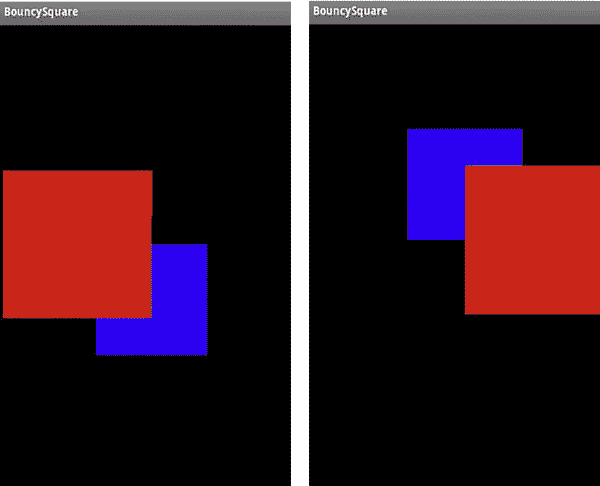

**图 6–1。** *蓝色方块上下起伏；红色的走左边和右边。*

看起来没什么，但这将是接下来几个实验的框架。第一个将打开默认的混合功能。

和许多其他 OpenGL 特性一样，通过调用`gl.glEnable(GL10.GL_BLEND)`打开混合。在第一次调用`mSquare.draw()`之前的任何地方添加。重新编译，你会看到什么？什么都没有，或者至少什么都没有改变。它看起来仍然像图 6–1。那是因为混合不仅仅是说“混合，你！”我们还必须指定一个混合*函数* ，它描述了源颜色(通过其片段或像素表示)如何与目标颜色混合。当然，默认情况下，当深度提示关闭时，源片段总是替换目的片段。事实上，只有当*z*-缓冲关闭时，才能确保正确的混合。

#### 混合功能

要改变默认的混合，我们必须求助于使用`glBlendFunc()`，它有两个参数。第一个说明如何处理源，第二个说明目的地。为了描述接下来发生的事情，请注意，最终发生的事情只是将每个 RGBA 源组件与每个目标组件相加、相减或进行其他操作。也就是说，源的红色通道与目的的红色通道混合，源的绿色与目的的绿色混合，依此类推。这通常是这样表示的:把源 RGBA 值 *Rs、Gs、Bs、*和*称为*，把目的值 *Rd、Gd、Bd、*和 *Ad* 。但是我们还需要源和目的地的*混合因子*，表示为 *Sr，Sg，Sb，Sa* ，和 *Dr，Dg，Db，*和 *Da* 。(没看起来那么复杂，真的)。这是最终合成颜色的公式:

`*(R,G,B) = ((Rs* Sr) + (Rd* Dr),(Gs* Sg) + (Gd*Dg),(Bs* Sb) + (Bd*Db))*`

换句话说，将源颜色乘以其混合因子，并将其添加到乘以其混合因子的目标颜色。

最常见的混合形式之一是在已经绘制好的东西(即目的地)上覆盖一个半透明的面。像以前一样，这可以是模拟的窗玻璃，飞行模拟器的平视显示器，或者其他图形，当与现有的图像混合时可能会看起来更好。(后者在遥远的太阳中被大量用于许多元素，如星座名称、轮廓等。)根据目的的不同，您可能希望覆盖图接近不透明，使用接近 1.0 的 alpha，或者非常模糊，使用接近 0.0 的 alpha。

在这个基本的混合任务中，源的颜色首先乘以 alpha 值，即它的混合因子。因此，如果源红色的最大值为 1.0，alpha 为 0.75，那么结果就是 1.0 乘以 0.75。这同样适用于绿色和蓝色。另一方面，目标颜色乘以 *1.0 减去源的 alpha* 。为什么呢？这有效地产生了永远不会超过最大值 1.0 的复合颜色；否则，可能会发生各种颜色失真。或者这样想象:源的 alpha 值是允许源填充的颜色“宽度”1.0 的比例。剩余空间变成 1.0 减去源的 alpha。alpha 越大，可以使用的源颜色的比例就越大，保留给目标颜色的比例就越小。因此，alpha 越接近 1.0，复制到帧缓冲区的源颜色就越多，从而替换目标颜色。

**注意:**在这些例子中，使用了标准化的颜色值，因为它们比使用无符号字节(表示从 0 到 255 的颜色)更容易理解这个过程。

现在我们可以在下一个例子中检验这一点。要设置前面描述的混合函数，可以使用下面的调用:

gl.glBlendFunc(GL10)。`*GL_SRC_ALPHA*`gl10。`*GL_ONE_MINUS_SRC_ALPHA*`；

`GL_SRC_ALPHA`和`GL_ONE_MINUS_SRC_ALPHA`是之前描述的混合因子。请记住，第一个参数是源的混合，即当前正在编写的对象。将该行放在启用混合的位置之后。红色，编译并运行。你看到图 6–2 了吗？

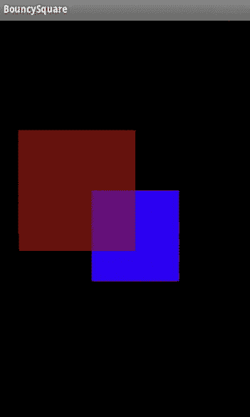

**图 6–2。** *红色方块的 alpha 值为 0.5，蓝色方块的 alpha 值为 1.0。*

发生了什么事？蓝色的 alpha 值为 1.0，因此每个蓝色片段会完全替换背景中的任何内容。那么 alpha 为 0.5 的红色表示 50%的红色被写入目标。黑色区域将是暗红色，但只有`glColor4f()`中给出的指定值 1.0 的 50%。目前为止，一切顺利。现在在蓝色之上，50%的红色值与 50%的蓝色值混合:

混合颜色=颜色源*源的 Alpha+(1.0-源的 Alpha)*目标的颜色。或者根据上一个示例中的值查看每个组件:

红色=1.0*0.5+(1.0-0.5)*0.0

绿色=0.0*0.5+(1.0-0.5)*0.0

蓝色=0.0*0.5+(1.0-0.5)*1.0

因此，片段像素的最终颜色应该是 0.5、0.0、0.5 或洋红色。现在红色和由此产生的洋红色有点偏暗。如果你想让它变得更亮，你会怎么做？如果有一种混合各种颜色全部强度的方法就好了。你会使用 1.0 的 alpha 值吗？没有。为什么呢？好吧，以蓝色为目标，源 alpha 为 1.0，前面的蓝色通道等式就是 0.0*1.0+(1.0-1.0)*1.0。这等于 0，而红色是 1.0，或者是纯色。你想要的是在黑色背景上书写时有最亮的红色，蓝色也是一样。为此，你可以使用一个混合函数，以最大强度写出两种颜色，比如`GL_ONE`。这意味着:

`     gl.glBlendFunc(GL10.GL_ONE, GL10.GL_ONE);`

回到使用源三元组红色= *1、绿色=0、蓝色=0* 和目的地红色= *0、绿色=0、蓝色= 1*(alpha 默认为 1.0)的等式，计算如下:

红色=1*1+0*1

绿色=0*(1+(0-0)*1

蓝色=0*1+(1-0)*1

这就产生了一种颜色，其中红色=1，绿色=0，蓝色=1。而我的朋友，是洋红色的(见图 6–3)。

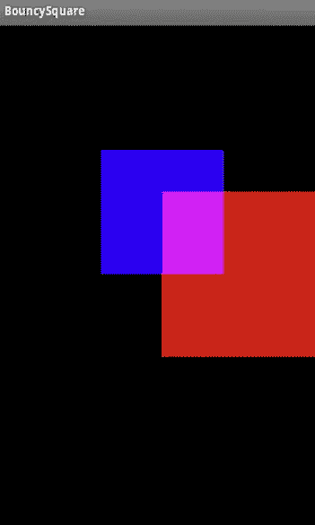

**图 6–3**。*混合红色和蓝色的全部强度*

现在是时候进行另一种实验了。以上例中的代码为例，将两个 alphas 设置为 0.5，并将混合函数重置为传统的透明度值:

`    gl.glBlendFunc(GL10.GL_SRC_ALPHA, GL10.GL_ONE_MINUS_SRC_ALPHA);`

运行修改后的代码后，请注意组合的颜色，并注意在-4.0 处的另一个正方形是蓝色的，也是第一个被渲染的，第二个是红色的。现在颠倒颜色的顺序，运行。怎么了?您应该得到类似于图 6–4 的东西。

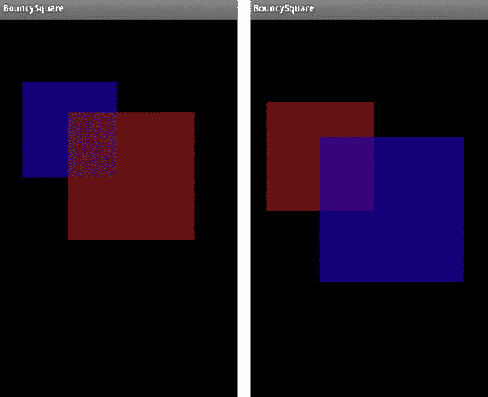

**图 6–4。** *左边先画蓝色，右边先画红色。*

交叉点颜色略有不同。这显示了 OpenGL 中一个令人困惑的问题:与大多数 3D 框架一样，渲染时根据面和颜色的顺序，混合会略有不同。在这种情况下，弄清楚发生了什么其实很简单。在图 6–4 的左图中，蓝色方块首先以 0.5 的 alpha 绘制。因此，即使蓝色三元组被定义为 0，0，1，当写入帧缓冲区时，alpha 值也会将其降低到 0，0，. 5。现在添加具有相似属性的红色方块。自然，红色将以与蓝色相同的方式写入帧缓冲区的黑色部分，因此最终值将是. 5，0，0。但是注意当红色写在蓝色上面时会发生什么。由于蓝色已经是其强度的一半，混合函数将进一步将其削减到. 25，这是混合函数的目标部分的结果，*(1.0-源 alpha)*蓝色+目标*，或(1.0-.5).5+0，或. 25。最后的颜色然后是 *.5，0，. 25。*蓝色的强度越低，它对复合色的贡献就越小，红色占主导地位。现在在图 6–4 的右图中，顺序颠倒了，所以蓝色占主导，最终颜色为. 25，0，. 5。

Table 6–1 包含了所有允许的 OpenGL ES 混合因子，尽管源和目标并不都支持。正如你所看到的，有足够的空间来修补，没有固定的规则来创造最好的效果。这将高度依赖于你的个人品味和需求。尽管尝试不同的价值观很有趣。确保用暗淡的灰色填充背景，因为一些组合在黑色背景上书写时只会产生黑色。

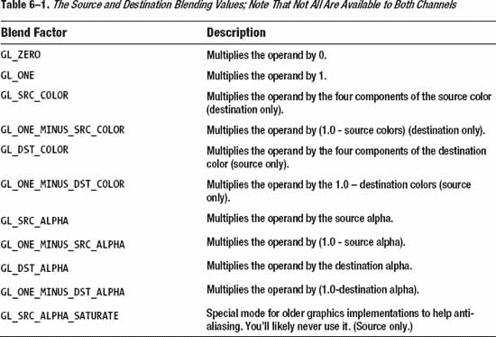

这里最后一个可能在一些混合操作中非常方便的方法是`glColorMask()`。此功能允许您阻止一个或多个颜色通道被写入目标。要查看实际效果，请将红色方块的颜色修改为 1，1，0，1；将两个混合功能设置回`GL_ONE`；又注释掉了一行`gl`。`glBlendEquation(GL10.GL_FUNC_SUBTRACT);`。运行时，您应该会看到类似于图 6–5 中左边的图像。红色方块现在是黄色的，当与蓝色混合时，在交叉点产生白色。现在添加下面一行:

`          gl.glColorMask(true, false, true, true);`

前面的行*在被拉到帧缓冲器时屏蔽*或关闭绿色通道。运行时，您应该会在图 6–5 中看到右图，该图与图 6–3 非常相似。事实上，逻辑上它们是相同的。

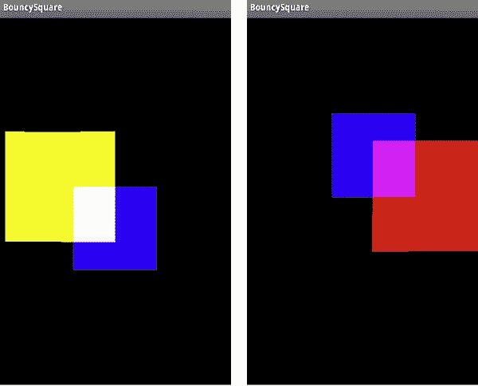

**图 6–5。** *左边不使用`glColorMask`，所以所有颜色都在起作用，而右边屏蔽掉绿色通道。*

#### 多色混合

现在，我们可以花几分钟来看看当用每个顶点的单独颜色定义正方形时，混合函数的效果。将清单 6–2 中的添加到正方形的构造函数中。第一组颜色定义黄色、品红色和青色。标准红绿蓝的互补色在第二组中指定。

**清单 6–2。** *两个正方形的顶点颜色*

`    float squareColorsYMCA[] =
{
             1.0f, 1.0f, 0.0f, 1.0f,
             0.0f, 1.0f, 1.0f, 1.0f,
             0.0f, 0.0f, 0.0f, 1.0f,
             1.0f, 0.0f, 1.0f, 1.0f
};
    float squareColorsRGBA[] =
{

             1.0f, 0.0f, 0.0f, 1.0f,
             0.0f, 1.0f, 0.0f, 1.0f,
             0.0f, 0.0f, 1.0f, 1.0f,
             1.0f, 1.0f, 1.0f, 1.0f
};`

将第一个颜色数组分配给第一个方块(到目前为止一直是蓝色的)，将第二个颜色数组分配给之前的红色方块。我在`SquareRenderer.java`中这样做，并通过 square 的构造函数传递颜色数组。当然，现在我们需要两个方块，每种颜色一个，而不是只有一个。不要忘记启用颜色数组的使用。

你现在应该很熟悉了，知道该怎么做了。另外，请注意，数组现在被规范化为一组浮点数，而不是以前使用的无符号字节，所以您必须调整对`glColorPointer()`的调用。解决方案由学生自己决定(我一直想这么说)。禁用混合后，您应该会看到图 6–6 中最左边的图像，当使用传统的透明功能启用时，结果应该是图 6–6 中中间的图像。什么事？不是吗？你说它看起来仍然像第一个图形？为什么会这样？

回头看看颜色数组。请注意每行的最后一个值 alpha 是如何达到最大值的。请记住，在这种混合模式下，任何目标值都要乘以(1.0-源 alpha)，或者更确切地说，是 0.0，这样源颜色就占主导地位，如前面的示例所示。看到一些真正的透明度的一个解决方案是使用下面的:

`         gl.glBlendFunc(GL10.GL_ONE, GL10.GL_ONE);`

这是可行的，因为它完全抛弃了阿尔法通道。如果您希望 alpha 具有“标准”函数，只需将 1.0 值更改为其他值，如. 5，并将混合函数更改为以下值:

`        gl.glBlendFunc(GL10.GL_SRC_ALPHA, GL10.GL_ONE_MINUS_SRC_ALPHA);`

而结果就是图 6–6 中最右边的图像。

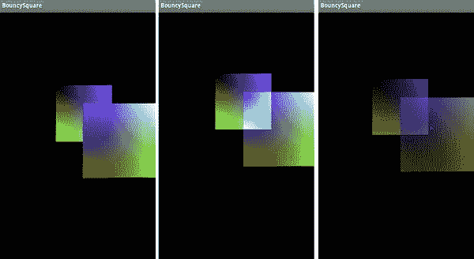

**图 6–6**。*无混合、`GL_ONE`混合和阿尔法混合，分别为*

### 纹理混合

现在，战战兢兢地，我们可以接近纹理的混合了。最初，这看起来很像前面描述的阿尔法混合，但是通过使用多重纹理可以做各种有趣的事情。

首先，让我们重新编写前面的代码来同时支持两个纹理，并进行顶点混合。你必须修改第五章例子中的`Square.draw()`和`createImage()`。正方形也需要支持纹理坐标，并且正方形的每个实例都需要自己独特的纹理。图 6–7 中最右边的图像是您禁用混合后应该得到的图像。如果你激活上一个练习中的颜色，并使用本章前面的`GL_ONE`功能启用混合，就可以生成中间的那个。

那么，正确的图像是如何产生的呢？

使用单一位图并着色是节省内存的常见做法。如果你在 OpenGL 层做一些 UI 组件，考虑使用一个单一的图像，并使用这些技术着色。你可能会问为什么它是纯红的，而不仅仅是浅红色，允许一些颜色的变化。这里所发生的是顶点的颜色被每个片段的颜色相乘。对于红色，我使用了 1.0，0.0，0.0 的 RGB 三元组。因此，当每个片段在通道乘法中计算时，绿色和蓝色通道将乘以 0，因此它们被完全过滤掉，只留下红色通道。如果想要让一些其他颜色透过，可以指定顶点偏向更中性的色调，所需的色调颜色比其他颜色稍高，如 1.0、0.7、0.7。

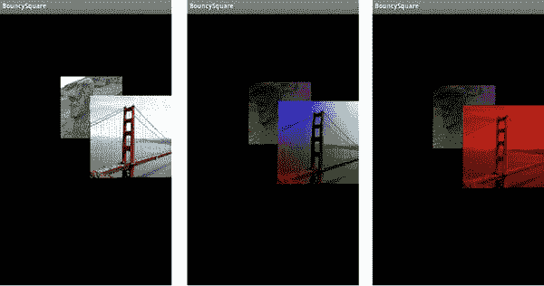

**图 6–7**。*在左边，只显示纹理。在中间，它们与颜色混合，在右边的是纯红。*

你也可以很容易地给纹理添加透明度，图 6–8。为了实现这一点，我将在这里引入一个小的简化因子。你可以通过简单的使用`glColor4f()`用一种单一的颜色给纹理化的表面着色，并且完全消除了创建顶点颜色数组的需要。所以，对于第二个方块，最近的一个，用`glColor4f(1, 1, 1, .75)`给它着色，并确保重置第一个方块的颜色；否则会随着第二个变暗。此外，确保混合已打开，并且混合功能使用了`SRC_ALPHA/ONE_MINUS_SRC_ALPHA`组合。

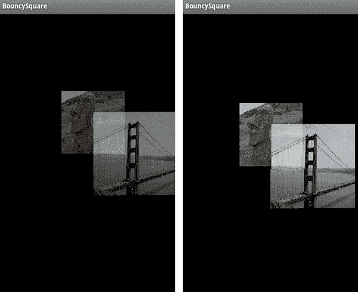

**图 6–8。** *左边的图像 alpha 为 0.5，而右边的为 0.75。*

#### 多重纹理

现在我们已经讨论了颜色混合和纹理颜色混合模式，但是把两个纹理混合在一起做第三个怎么样呢？这样的技术被称为*多重纹理*。多重纹理可用于在执行某些数学运算时将一个纹理叠加到另一个纹理上。更复杂的应用包括简单的图像处理。但是让我们先去摘低垂的果实。

多重纹理需要使用*纹理组合器*和*纹理单元。纹理组合器*让你可以组合和操作绑定到硬件纹理单元的纹理，这些纹理单元是图形芯片的特定部分，将图像包裹在对象周围。如果您希望大量使用合并器，您可能希望通过`gl`来验证支持的总数。`glGetIntegerv(GL10.GL_MAX_COMBINED_TEXTURE_IMAGE_UNITS, numberTextureUnits),`其中`numberTextureUnits`被定义为一个整数。

为了建立一个管道来处理多重纹理，我们需要告诉 OpenGL 使用什么纹理以及如何将它们混合在一起。这个过程与之前处理 alpha 和颜色混合操作时定义混合函数没有太大的不同(至少在理论上是这样)。它确实大量使用了`glTexEnvf()`调用，这是 OpenGL 的另一个超负荷方法。(如果你不相信我，可以在 OpenGL 网站上查看它的官方参考页面。)这将设置*纹理环境*，定义多重纹理处理的每个阶段。

图 6–9 显示了组合器链。每个组合器引用第一个组合器的*前一个*纹理片段(`P0`或`Pn`)或输入片段。然后，它从一个“源”纹理(图中的`S0`)中取出一个片段，将其与`P0`组合，如果需要的话，将它交给下一个组合器`C1`，循环重复。

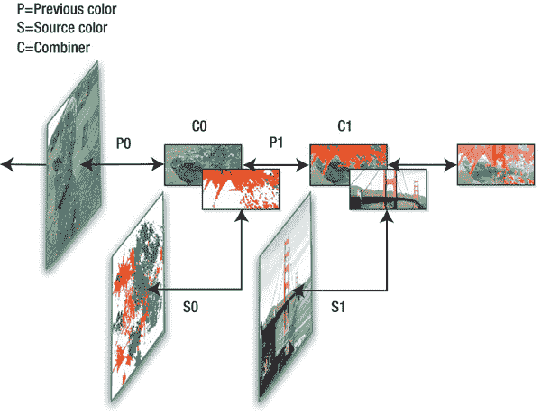

**图 6–9。** *纹理合并器链*

解决这个问题的最好方法和其他任何问题一样:查阅代码。在下面的示例中，两个纹理一起加载，绑定到各自的纹理单元，并合并成一个输出纹理。我们尝试了几种不同的方法来组合两幅图像，并对每幅图像的结果进行了深入的展示和检查。

首先，我们重访我们的老朋友。我们回到了只有一个纹理，上升和下降。颜色支持也被关闭。因此，您应该有类似于清单 6–3 的东西。确保你还在加载第二个纹理。

**清单 6–3。** *`Square.draw()`改版，修改为多文支持*

`public void draw(GL10 gl)

{
        gl.glEnable(GL10.*GL_TEXTURE_2D*);
        gl.glBindTexture(GL10.*GL_TEXTURE_2D*,mTexture0);
        gl.glEnableClientState(GL10.*GL_TEXTURE_COORD_ARRAY*);` `        gl.glFrontFace(GL11.*GL_CW*);
        gl.glVertexPointer(2, GL11.*GL_FLOAT*, 0, mFVertexBuffer);
        gl.glColorPointer(4, GL11.*GL_FLOAT*, 0, mColorBuffer);

        gl.glClientActiveTexture(GL10.*GL_TEXTURE0*);                       //1
        gl.glTexCoordPointer(2, GL10.*GL_FLOAT*,0,mTextureCoords);

        gl.glClientActiveTexture(GL10.*GL_TEXTURE1*);                       //2
        gl.glTexCoordPointer(2, GL10.*GL_FLOAT*,0,mTextureCoords);

        multiTexture(gl,mTexture0,mTexture1);                             //3

        gl.glDrawElements(GL11.*GL_TRIANGLES*, 6, GL11.*GL_UNSIGNED_BYTE*, mIndexBuffer);
        gl.glFrontFace(GL11.*GL_CCW*);
}`

这里有一个新的调用，如第 1 行和第 2 行所示。是`glClientActiveTexture()`，设置操作什么纹理单元。这是在客户端，而不是硬件方面的事情，并指示哪个纹理单元将接收纹理坐标数组。不要把这个和`glActiveTexture()`混淆，后者用在清单 6–4 中，它实际上打开了一个特定的纹理单元。第 3 行调用配置纹理单元的方法。

这是一个非常简单的默认情况。精彩的东西在后面。

**清单 6–4。** *设置纹理合并器*

`        public void multiTexture(GL10 gl, int tex0, int tex1)
{
                float combineParameter= GL10.*GL_MODULATE*;                        //1

                // Set up the First Texture.
                gl.glActiveTexture(GL10.*GL_TEXTURE0*);                            //2
                gl.glBindTexture(GL10.*GL_TEXTURE_2D*, tex0);                      //3

                // Set up the Second Texture.
                gl.glActiveTexture(GL10.*GL_TEXTURE1*);
                gl.glBindTexture(GL10.*GL_TEXTURE_2D*, tex1);

                // Set the texture environment mode for this texture to combine.
                gl.glTexEnvf(GL10.*GL_TEXTURE_ENV*, GL10.*GL_TEXTURE_ENV_MODE*,
                    combineParameter);                                           //4
}`

*   第 1 行指定了组合器应该做什么。表 6–1 列出了所有可用的可能值。
*   `glActiveTexture()`在第 2 行激活一个特定的硬件纹理单元。

*   第 3 行不应该是个谜，因为你以前见过。在这个例子中，第一纹理被绑定到特定的硬件纹理单元。下面两行对第二个纹理做了同样的处理。
*   现在告诉系统如何处理最后一行的纹理。在该表中，P 是 previous，S 是 source，下标 a 是 alpha，c 是 color，仅在必须单独考虑 color 和 alpha 时使用。

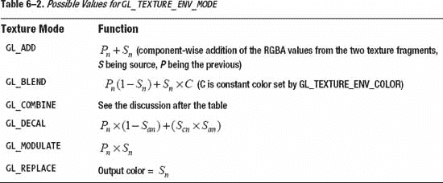

现在编译并运行。您的显示表面上应该类似于 Figure 6–10 的结果。

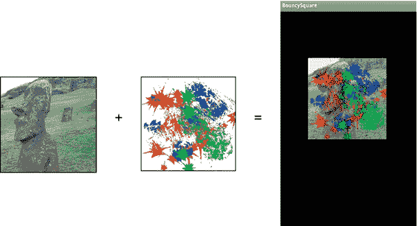

**图 6–10。** *左边的海德利是“先前的”纹理，而杰克森·波拉克的画是“源”使用`GL_MODULATE`时，结果在右边。*

现在是时候玩其他组合器设置了。尝试用`GL_ADD`替换清单 63 中的`combineParameter`中的`GL_MODULATE`。然后通过`GL_BLEND`和`GL_DECAL`跟随这个。结果如图 6–11 所示。另外，注意叠加纹理的白色部分是不透明的。因为白色对于所有三种颜色都是 1.0，所以它将总是产生 1.0 的颜色，以便遮挡下面的任何东西。对于非白色的阴影，你应该可以看到一点海德利纹理穿透。中间图像中的`GL_BLEND`，图 6–11 不太明显。为什么青色代替了红色？很简单。说红色值是 1.0，它的最高。考虑`GL_BLEND`的等式:

output =*P**n*(1—*S**n*)+*S**n*×*C*

对于红色，第一部分将是零，因为红色的值 1 被等式中的 1 减去，天哪，第二部分也将是零，假设使用默认的黑色环境颜色。考虑绿色通道。假设背景图像的绿色值为 0.5，这是“先前”的颜色，同时保持 splat 颜色(源)为纯红色(因此 splat 中没有蓝色或绿色)。现在等式的第一部分变成了. 5*(1.0-0.0)，或. 5。也就是说，*前一个*纹理 Hedly 中绿色的. 5 值与源纹理中的“1 减绿色”相乘。由于源的红色斑点中的绿色和蓝色通道都是 0.0，这意味着没有任何红色的绿色和蓝色的组合会产生青色阴影，因为青色是红色的反转。如果你仔细观察图 6–11 中的中间图像，你可以分辨出一块突出的碎片。这同样适用于洋红色和黄色斑点。在图 6–11 的最右侧图像中，使用了`GL_DECAL`，它可以起到许多与塑料模型贴花相同的作用，即应用标志或符号来遮挡其后面的任何东西。因此，对于贴花，通常纹理的实际图像部分的 alpha 通道将设置为 1.0，而不是所需图像的任何部分的 alpha 通道将设置为 0.0。通常背景是黑色的，在你的画图程序中，你可以让它根据亮度或者图像中非零颜色的部分生成一个 alpha 通道。在 splat 的情况下，因为背景是白色的，我必须先反转颜色，使其变成黑色，生成遮罩，并将其与正常的正片图像合并。一些略小于 1 的 alpha 是为绿色通道生成的，因此，您可以看到一小部分 Hedly 显示出来。

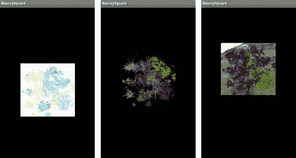

**图 6-11。使用左边的***`GL_ADD`，`GL_BLEND`为中心，右边的`GL_DECAL`*

最后一个任务是制作第二个纹理的动画。你将需要创建一个`textureCoordinates`、`mTextureCoods0`和`mTextureCoords1`的副本，每个纹理一个，因为我们不能再共享它们。接下来公开用于在构造函数中生成 Java 字节缓冲区的“原始”坐标。这样，我们可以在`Square.draw()`方法中修改它们。然后将以下内容添加到`draw()`中，仅更新贴花纹理的坐标:

`    for (i=0;i<8;i++)
  {
         mTextureCoordsAnimated[i]+=.01;
  }

         mTextureCoords1.position(0);
     mTextureCoords1.put(mTextureCoordsAnimated);`

调用`mTextureCoords1.position()`来重置缓冲区的内部指针。否则，下面对`put()`的调用将在下次通过时追加数据并溢出缓冲区。

像这样的效果可以用来在卡通般的环境中或行星周围的云层中制作雨或雪的动画。后者会很酷，如果你有两个额外的纹理，一个用于上层云，一个用于下层云，以不同的速度移动。

如前所述，环境参数`GL_COMBINE`需要一系列额外的设置才能工作，因为它让您可以在更精确的水平上操作合并器方程。如果你只想使用`GL_COMBINE`，它默认为`GL_MODULATE`，所以你看不出两者有什么不同。使用`Arg0`和`Arg1`代表输入源，它们是纹理组合器。它们是通过使用类似下面的行来设置的，其中`GL_SOURCE0_RGB`是在表 6–3 中引用的参数 0 或`Arg0`:

`    gl.glTexEnvf(GL10.GL_TEXTURE_ENV, GL10.GL_SOURCE0_RGB, GL10.GL_TEXTURE);`

同样，你可以用`GL_SOURCE1_RGB`来代表`Arg1`:

`    gl.glTexEnvf(GL10.GL_TEXTURE_ENV, GL10.GL_SOURCE1_RGB, GL10.GL_TEXTURE);`

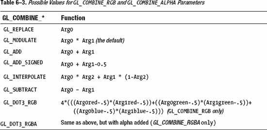

#### 用凹凸贴图

你可以用纹理做很多非常复杂的事情；凹凸贴图只是其中之一。因此，接下来是对“凸起”到底是什么以及为什么任何人都应该关注映射它们的讨论。

正如前面所指出的，计算机图形学中的大部分挑战是在幕后使用巧妙的黑客技术来制作看起来复杂的视觉效果。凹凸贴图只是其中的一个技巧，在 OpenGL ES 1.1 中，它可以用纹理合并器来实现。

就像纹理是在简单的面上增加复杂性的“技巧”一样，凹凸贴图是一种给纹理添加第三维的技术。它用于生成物体整体表面的粗糙度，当被照亮时，会产生一些令人惊讶的真实高光。它可能用于模拟湖面、网球表面或行星表面的波浪。

一个物体表面的粗糙度是通过它处理光线和阴影的方式来感知的。例如，考虑满月和凸月，如图图 6–12 所示。当太阳在月亮正前方时，月亮是圆的，因此，月亮表面只不过是深浅不一的灰色。看不到任何影子。和你背对太阳看地面没太大区别。在你头部阴影的周围，表面看起来是平的。现在，如果把光源移到事物的侧面，突然各种细节都蹦了出来。图 6–12 中的右图显示了一个凸月，太阳朝向左侧，即月亮的东翼。这是一个完全不同的故事，不是吗？

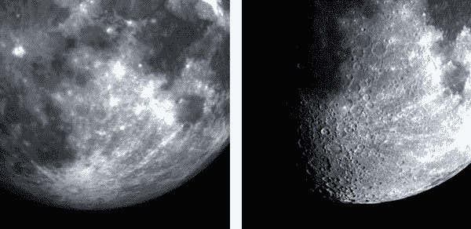

**图 6–12。** *相对较少的细节显示在左边，而用斜向照明，则更多的细节显示在右边。*

理解高光和阴影是如何一起工作的，对于训练优秀的艺术家和插图画家来说是绝对重要的。

添加真实的表面位移来复制整个月球表面可能需要数千兆字节的数据，从内存和 CPU 的角度来看，这对于当前一代的小型手持设备来说是不可能的。因此进入了相当优雅的凹凸贴图到中心阶段。

你可能还记得在第四章中，你必须给球体模型添加一组“面法线”。法线仅仅是垂直于面的向量，显示面指向的方向。任何光源的法线角度在很大程度上决定了人脸的明暗程度。脸部朝向光线越直接，光线就越亮。那么，如果你有一种紧凑的方法来编码法线，而不是基于逐面，因为一个模型可能有相对较少的面，而是基于，比如说，一个像素一个像素？如果您可以将编码的法线数组与真实的图像纹理相结合，并根据入射光的方向以某种方式处理它，使图像中的像素变亮或变暗，会怎么样？

这让我们回到了纹理合成。在表 6–3 中，注意最后两种组合器类型:`GL_DOT3_RGB`和`GL_DOT3_RGBA`。现在，回到你高中的几何课上。还记得两个向量的点积吗？点积和叉积都是那些的东西，你用抱怨“老师，对吗？？为什么我需要知道*这个*？”好吧，现在你会得到你的答案。

点积是基于另外两个向量的角度的向量的长度。还不明白吗？考虑图 6–13 中左侧的图表。点积是指向灯光的法向量的“量”，该值用于直接照亮面部。在图 6–13 的右图中，脸部与太阳方向成直角，因此没有被照亮。

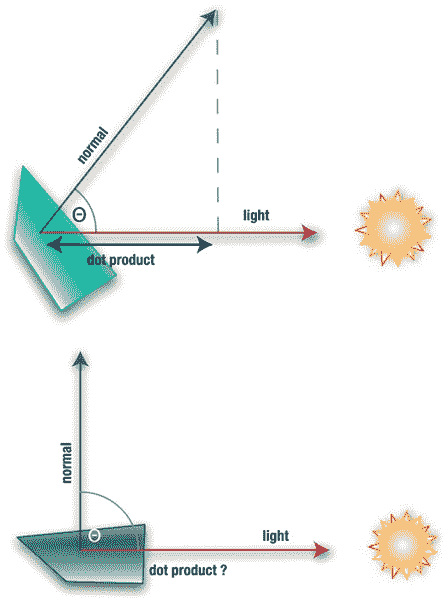

**图 6–13。** *左边，脸被照亮；右边就不是这样了。*

记住这一点，凹凸贴图使用的“欺骗”如下。使用你想要使用的真实纹理，并添加一个特殊的第二个辅助纹理。第二个纹理编码普通信息，而不是 RGB 颜色。因此，它没有使用每个都是 4 个字节的浮点数，而是使用 1 个字节的值作为法向量的 xyz 值，这样可以方便地放入一个 4 个字节的像素中。由于向量通常不需要非常精确，8 位分辨率就可以了，而且非常节省内存。因此，这些法线以一种直接映射到您想要突出显示的垂直特征的方式生成。

因为法线可以有正值也可以有负值(背向太阳时为负值)，所以 xyz 值在 0 到 1 的范围内居中。也就是说，-127 到+127 必须映射到 0 到 1 之间的任何位置。因此，“红色”分量通常是矢量的 x 部分，计算如下:

`    *red* = (*x* +1) /2.0`

当然，绿色和蓝色位的情况类似。

现在看看在表 6–3 的`GL_DOT3_RGB`条目中表示的公式。这将 RGB 三元组作为向量，并返回其长度。n 是法向量，L 是光向量，所以长度求解如下:

 长度】= 4×4(*r**n*——5)×(r*l*

因此，如果面沿着 x 轴直接朝向灯光，法线的红色将是 1.0，灯光的红色或 x 值也将是 1.0。绿色和蓝色位是 0 的编码形式 0.5。将它代入前面的等式会是这样的:

*长度*= 4×4(*1**——5)×(1*】5)+(【5】**

 ***长度* = 4×(.25+0+0) =1.0

这正是我们所期待的。如果法线在 z 方向上指向上并远离表面，用蓝色字节编码，答案应该是 0，因为法线主要指向远离纹理的 X 和 Y 平面。在图 6–14 中左边的图像显示了我们地球地图的一部分，而右边的图像显示了它对应的法线贴图。

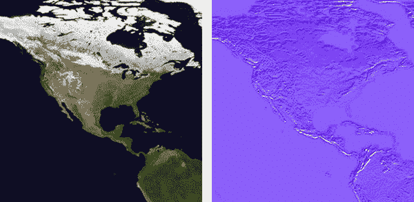

**图 6–14。** *左边是我们的形象；右边是匹配的法线贴图。*

为什么法线贴图主要是紫色的？指向远离地球表面的垂直矢量被编码为红色=.5，绿色=.5，蓝色=1.0。(记住. 5 其实是 0。)

当纹理合并器设置为 DOT3 模式时，它使用法线和光照向量来确定每个纹理元素的强度。然后，该值用于调制真实图像纹理的颜色。

现在是时候回收之前的多纹理项目了。这一次，第二个纹理需要由可从 Apress 站点获得的凹凸贴图组成。接下来，设置合并器来处理法线贴图和任何从过去的练习中剩余的动画。

在这个例子中加载法线贴图，然后添加新的例程，`multiTextureBumpMap()`，如清单 6–5 中的所示。

**清单 6–5。** *为凹凸贴图设置组合器*

`static float *lightAngle*=0.0f;
        public void multiTextureBumpMap(GL10 gl, int mainTexture, int normalTexture)
    {
            float x,y,z;

            *lightAngle*+=.3f;                                                                //1

            if(*lightAngle*>180)
            *lightAngle*=0;

            // Set up the light vector.
            x = (float) Math.*sin*(*lightAngle* * (3.14159 / 180.0f));                          //2
            y = 0.0f;
            z = (float) Math.*cos*(*lightAngle* * (3.14159 / 180.0f));

            // Half shifting to have a value between 0.0f and 1.0f.
            x = x * 0.5f + 0.5f;                                                            //3
            y = y * 0.5f + 0.5f;
            z = z * 0.5f + 0.5f;

            gl.glColor4f(x, y, z, 1.0f);                                                    //4

            //The color and normal map are combined.
            gl.glActiveTexture(GL10.*GL_TEXTURE0*);                                           //5
            gl.glBindTexture(GL10.*GL_TEXTURE_2D*, mainTexture);

            gl.glTexEnvf(GL10.*GL_TEXTURE_ENV*, GL10.*GL_TEXTURE_ENV_MODE*, GL11.*GL_COMBINE*);   //6
            gl.glTexEnvf(GL10.*GL_TEXTURE_ENV*, GL11.*GL_COMBINE_RGB*, GL11.*GL_DOT3_RGB*);       //7
            gl.glTexEnvf(GL10.*GL_TEXTURE_ENV*, GL11.*GL_SRC0_RGB*, GL11.*GL_TEXTURE*);           //8
            gl.glTexEnvf(GL10.*GL_TEXTURE_ENV*, GL11.*GL_SRC1_RGB*, GL11.*GL_PREVIOUS*);          //9` `            // Set up the Second Texture, and combine it with the result of the Dot3
    combination.

            gl.glActiveTexture(GL10.*GL_TEXTURE1*);                                           //10
            gl.glBindTexture(GL10.*GL_TEXTURE_2D*, normalTexture);

            gl.glTexEnvf(GL10.*GL_TEXTURE_ENV*, GL10.*GL_TEXTURE_ENV_MODE*, GL10.*GL_MODULATE*);  //11
}`

前述操作使用两个*级*进行。第一个将凹凸或法线贴图与原色混合，这是使用`glColor4f()`调用建立的。第二个使用我们的老朋友`GL_MODULATE`将结果与彩色图像结合起来。

所以让我们一点一点地检查一下:

*   在第 1 行中，我们定义了`lightAngle`，它将围绕纹理在 0 到 180 度之间循环，以显示高光在不同光照条件下的外观。
*   计算第 2 行中灯光矢量的 xyz 值。
*   在第 3 行，xyz 组件需要被缩放以匹配凹凸贴图的组件。
*   现在使用第 4 行中的光线矢量组件给片段上色。
*   先设置并绑定凹凸贴图，就是 5f 行的 *tex0* 。
*   第 6 行的`GL_COMBINE`告诉系统预期一个组合类型跟随其后。
*   在第 7 行，我们指定我们将使用`GL_DOT3_RGB`操作只组合 RGB 值(`GL_DOT3_RGBA`包括 alpha，但在这里并不需要)。
*   这里我们设置了“阶段 0”，这是两个阶段中的第一个。第 8 行指定了第一位数据的来源。这表示使用当前纹理单元(`GL_TEXTURE0`)的纹理作为第 5 行分配的凹凸贴图的来源。
*   然后我们必须告诉它与之前的颜色混合——在这个例子中，是通过第 4 行的`glColor()`设置的。对于阶段 0，`GL_PREVIOUS`与`GL_PRIMARY_COLOR`相同，因为没有之前的纹理可以使用。
*   现在在第 10 行和下面的行中设置阶段 1。参数`tex1`是彩色图像。
*   现在我们要做的就是把图像和凹凸贴图结合起来，这就是第 11 行所做的。

我的源纹理被选中，这样你可以很容易地看到结果。启动时，光线应该从左向右移动，照亮陆地的边缘，如图 6–15 所示。

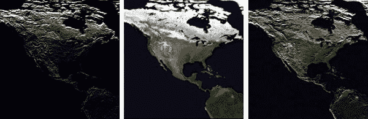

**图 6–15。** *分别在早上、中午和晚上到达北美*

看起来很酷，是吧？但是我们能把它应用到一个旋转的球体上吗？试一试，循环利用上一章末尾的太阳系模型。为了使凹凸贴图的细节更容易被看到，太阳被去掉了，代替了地球的一个更大的图像。因此，我们将加载凹凸贴图，将地球移动到场景的中心，调整照明，并添加组合器支持。

在分配主图像的位置下方，添加以下内容:

`    if(imageId == true)
  {
    m_BumpmapID = createTexture(gl, context, imageId, resourceId);
  }`

加上这个:

`    int m_BumpmapID;`

现在确保用位于太阳系控制器对象中的`init()`中的新参数调用这个函数。

使用清单 6–6 作为新的`draw()`方法，放入`Planet.java`并从`bumpmappingController`的`executePlanet()`例程中调用。这主要是为纹理合并器做准备，并调用清单 6–6 中的`multiTextureBumpMap`。

**清单 6–6。** *修改后执行为凹凸贴图*

`public void draw(GL10 gl)
    {
            gl.glMatrixMode(GL10.*GL_MODELVIEW*);
            gl.glEnable(GL10.*GL_CULL_FACE*);
            gl.glCullFace(GL10.*GL_BACK*);
            gl.glEnable(GL10.*GL_LIGHTING*);

            gl.glFrontFace(GL10.*GL_CW*);` 
`            gl.glEnable(GL10.*GL_TEXTURE_2D*);
            gl.glEnableClientState(GL10.*GL_VERTEX_ARRAY*);
            gl.glVertexPointer(3, GL10.*GL_FLOAT*, 0, m_VertexData);

            gl.glEnableClientState(GL10.*GL_TEXTURE_COORD_ARRAY*);
            gl.glClientActiveTexture(GL10.*GL_TEXTURE0*);
            gl.glBindTexture(GL10.*GL_TEXTURE_2D*, textures[0]);

            gl.glTexCoordPointer(2, GL10.*GL_FLOAT*, 0, m_textureData);

            gl.glClientActiveTexture(GL10.*GL_TEXTURE1*);
            gl.glTexCoordPointer(2, GL10.*GL_FLOAT*,0,m_textureData);

            gl.glMatrixMode(GL10.*GL_MODELVIEW*);

            gl.glEnableClientState(GL10.*GL_NORMAL_ARRAY*);
            gl.glNormalPointer(GL10.*GL_FLOAT*, 0, m_NormalData);

            gl.glColorPointer(4, GL10.*GL_UNSIGNED_BYTE*, 0, m_ColorData);
            multiTextureBumpMap(gl, m_BumpmapID, textures[0]);
            gl.glDrawArrays(GL10.*GL_TRIANGLE_STRIP*, 0, (m_Slices+1)*2*(m_Stacks-1)+2);

        }`

方法`multiTextureBumpMap()`与前一个相同，除了光矢量计算可以删除(直到第 4 行)，所以只需复制到你的行星物体上。

现在转到你在太阳系控制器中初始化灯光的地方，注释掉创建高光材质的调用。凹凸贴图和镜面反射相处得不太好。

清单 6–7 是新的执行例程；控制器也是如此。这使得太阳转储，将地球移动到事物的中心，并将主光线置于左侧。

**清单 6–7。** *用这个*代替旧的`execute()`套路

`private void execute(GL10 gl) {
        float posFill1[]={-8.0f, 0.0f, 7.0f, 1.0f};
        float cyan[]={0.0f, 1.0f, 1.0f, 1.0f};
        float orbitalIncrement=0.5f;
        float sunPos[]={0.0f, 0.0f, 0.0f, 1.0f};

            gl.glLightfv(*SS_FILLLIGHT1*, GL10.*GL_POSITION*, *makeFloatBuffer*(posFill1));

            gl.glEnable(GL10.*GL_DEPTH_TEST*);
            gl.glClearColor(0.0f, 0.25f, 0.35f, 1.0f);
            gl.glClear(GL10.*GL_COLOR_BUFFER_BIT*);` `            gl.glPushMatrix();

            gl.glTranslatef(-m_Eyeposition[*X_VALUE*],-m_Eyeposition[*Y_VALUE*],-
                m_Eyeposition[*Z_VALUE*]);
            gl.glLightfv(*SS_SUNLIGHT*, GL10.*GL_POSITION*, *makeFloatBuffer*(sunPos));

            gl.glEnable(*SS_FILLLIGHT1*);
            gl.glEnable(*SS_FILLLIGHT2*);

            gl.glPushMatrix();

            *angle*+=orbitalIncrement;
            gl.glRotatef(*angle*, 0.0f, 1.0f, 0.0f);
            executePlanet(m_Earth, gl);
            gl.glPopMatrix();
            gl.glPopMatrix();
    }`

如果你现在看到类似图 6–16 的东西，你可以正式地拍拍自己的背。

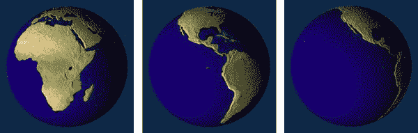

**图 6–16**。*颠簸的大地*

好，现在做个实验。移动灯光的位置，使它从右边而不是左边进来。图 6–17 是意想不到的结果。这是怎么回事？现在这些山看起来像山谷。

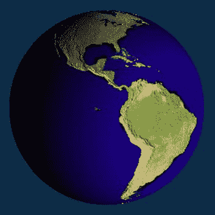

**图 6–17**。*嗯？*

现在的情况是，我们正在走向一个以前没有合并者去过的地方。通过使用我们自己的照明，由光矢量提供的模拟照明的效果被去除了。我们的灯在左边，它只是碰巧看起来很好，主要是靠运气。如果你的场景的照明是相对静态的，这里的凹凸贴图就可以了。它不喜欢多光源。事实上，通过灯光向量指定的伪照明效果会被忽略，而不是“真实”光源。此外，如果关闭这些光源，灯光向量会完全忽略对象上的任何着色。在这种情况下，你会看到整个星球变亮和变暗，因为这是纹理本身发生的事情，因为它只是一个 2D 表面。如果它的一部分被点亮，所有的都被点亮。那么，一个 GL 呆子该怎么办呢？着色器我的朋友。着色器。这就是 OpenGL ES 2.0 和 Android 扩展的用武之地。

### 总结

在这一章中，你学习了 OpenGL ES 1 提供的混合功能。混合有自己独特的语言，通过混合函数和组合器来表达。你已经学习了半透明，包括如何和何时应用它。还包括一些巧妙的技巧，通过混合和纹理来制作动画和凹凸贴图。在下一章，我将开始应用其中的一些技巧，并展示其他可以创造更有趣的 3D 世界的技巧。**