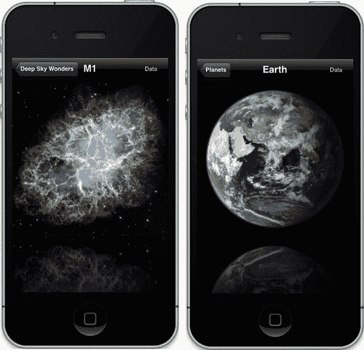

# 七、精心制作的杂集

> 如果我们知道我们在做什么，那就不叫研究了，对吗？
> 
> —阿尔伯特·爱因斯坦

当开始这一章，我试图找到一个合适的报价关于杂集。不幸的是，我所能找到的都是一些杂七杂八的引言。但是阿尔伯特·爱因斯坦写的那本书是一个真正的瑰宝，几乎可以应用，因为亲爱的读者，你正在进行研究——研究如何制作更丰富、更有趣的软件。

在像这样的书中，有时很难对某个特定的主题进行清晰的分类，当它们可能不值得拥有自己的一章时，我们不得不将许多东西放入一章中。因此，在这里我将涵盖一些经典的演示和渲染技巧，无论它们是否可以应用于太阳系项目或，所以在结束时你会惊呼“所以，这就是他们如何做到这一点！”

### 帧缓冲对象

通常称为 FBOs，您可以将帧缓冲区对象视为简单的渲染表面。到目前为止，您已经使用了一个，并且可能不知道它；你的场景通过`GLSurfaceView`对象渲染到的 EGL 环境是一个 FBO。你可能不知道的是，你可以同时拥有多个屏幕。像以前一样，我们将从旧标准开始，我们的彩虹色果冻弹跳板，然后看看它能从那里去哪里。

#### 赫德利缓冲对象

这时候你知道该怎么做了:从第五章的中找到练习，用原来的 2D 弹跳纹理方块(图 5-13 )，并以此作为参考。由于大多数代码最终都会更改，我建议从头开始创建一个新项目。活动文件将是标准的默认文件。我们需要为 FBO 支持创建一个单独的对象；把这个叫做`FBOController.java`。它将涵盖 FBO 的初始化和执行。它应该看起来像清单 7–1，减去几个实用函数，您应该在别处有这些函数以节省空间。这些都在描述中注明了。

**清单 7–1。** *帧缓冲对象控制器*

`public class FBOController
{
            public Context context;
            int[] m_FBO1 = new int[3];
            int[] m_FBOTexture = new int[1];
            public String TAG = "FBO Controller";
            int[] originalFBO = new int[1];
            int[] depthBuffer = new int[1];
            int m_ImageTexture;
            static float *m_TransY* = 0.0f;
            static float *m_RotX* = 0.0f;
            static float *m_RotZ* = 0.0f;
            static float *m_Z* = -1.5f;
            int[] m_DefaultFBO = new int[1];
            int m_Counter=0;
            boolean m_FullScreen = false;

        public int init(GL10 gl, Context contextRegf,int resource, int width,
             int height)
        {
                    GL11ExtensionPack gl11ep = (GL11ExtensionPack) gl;                  //1

                    //Cache the original FBO, and restore it later.

                    gl11ep.glGetIntegerv(GL11ExtensionPack.*GL_FRAMEBUFFER_BINDING_OES*,  //2
                            makeIntBuffer(originalFBO));

                    gl11ep.glGenRenderbuffersOES(1, makeIntBuffer(depthBuffer));        //3
                    gl11ep.glBindRenderbufferOES(GL11ExtensionPack.*GL_RENDERBUFFER_OES*,
                            depthBuffer[0]);

                    gl11ep.glRenderbufferStorageOES(GL11ExtensionPack.*GL_RENDERBUFFER_OES*,
                    GL11ExtensionPack.*GL_DEPTH_COMPONENT16*, width, height);

                    //Make the texture to render to.` `gl.glGenTextures(1, m_FBOTexture, 0);                               //4
                    gl.glBindTexture(GL10.*GL_TEXTURE_2D*, m_FBOTexture[0]);

                    gl.glTexImage2D(GL10.*GL_TEXTURE_2D*, 0, GL10.*GL_RGB*, width, height, 0,
                            GL10.*GL_RGB*, GL10.*GL_UNSIGNED_SHORT_5_6_5*,null);

                    gl.glTexParameterf(GL10.*GL_TEXTURE_2D*, GL10.*GL_TEXTURE_MIN_FILTER*,
                            GL10.*GL_LINEAR*);
                    gl.glTexParameterf(GL10.*GL_TEXTURE_2D*, GL10.*GL_TEXTURE_MAG_FILTER*,
                            GL10.*GL_LINEAR*);
                    gl.glTexParameterf(GL10.*GL_TEXTURE_2D*, GL10.*GL_TEXTURE_WRAP_S*,
                            GL10.*GL_CLAMP_TO_EDGE*);
                    gl.glTexParameterf(GL10.*GL_TEXTURE_2D*, GL10.*GL_TEXTURE_WRAP_T*,
                            GL10.*GL_CLAMP_TO_EDGE*);

                    //Now create the actual FBO.

                    gl11ep.glGenFramebuffersOES(1, m_FBO1,0);                           //5

                    gl11ep.glBindFramebufferOES(GL11ExtensionPack.*GL_FRAMEBUFFER_OES*,
                            m_FBO1[0]);

                    // Attach the texture to the FBO.                                   //6
                    gl11ep.glFramebufferTexture2DOES(GL11ExtensionPack.*GL_FRAMEBUFFER_OES*,
                            GL11ExtensionPack.*GL_COLOR_ATTACHMENT0_OES*,
                            GL10.*GL_TEXTURE_2D*,
                            m_FBOTexture[0], 0);

                    // Attach the depth buffer we created earlier to our FBO.           //7
                    gl11ep.glFramebufferRenderbufferOES
                            (GL11ExtensionPack.*GL_FRAMEBUFFER_OES*,
                            GL11ExtensionPack.*GL_DEPTH_ATTACHMENT_OES*,
                            GL11ExtensionPack.*GL_RENDERBUFFER_OES*, depthBuffer[0]);

                    // Check that our FBO creation was successful.

                    gl11ep.glCheckFramebufferStatusOES
                            (GL11ExtensionPack.*GL_FRAMEBUFFER_OES*);

                            int uStatus =
                    gl11ep.glCheckFramebufferStatusOES(GL11ExtensionPack.*GL_FRAMEBUFFER_OES*);

                    if(uStatus != GL11ExtensionPack.*GL_FRAMEBUFFER_COMPLETE_OES*)
                            return 0;

                    gl11ep.glBindFramebufferOES(GL11ExtensionPack.*GL_FRAMEBUFFER_OES*,   //8
                            originalFBO[0]);` `m_ImageTexture = createTexture(gl,contextRegf,resource);            //9

                    return 1;
        }

            public int getFBOName()
                    return m_FBO1[0];

            public int getTextureName()
                    return m_FBOTexture[0];

            public void draw(GL10 gl)
        {
                    GL11ExtensionPack gl11 = (GL11ExtensionPack) gl;

            float squareVertices[] =                                                    //10
        {
                -0.5f, -0.5f, 0.0f,
                 0.5f, -0.5f, 0.0f,
                -0.5f,  0.5f, 0.0f,
                 0.5f,  0.5f, 0.0f
         };

            float fboVertices[] =
        {
                -0.5f, -0.75f, 0.0f,
                 0.5f, -0.75f, 0.0f,
                -0.5f,  0.75f, 0.0f,
                 0.5f,  0.75f, 0.0f
        };

            float textureCoords1[] =

                0.0f, 0.0f,
                1.0f, 0.0f,
                0.0f, 1.0f,
                1.0f, 1.0f
        };

            if((m_Counter%250)==0)                                                      //11
       {
                if(m_FullScreen)
                     m_FullScreen=false;
                else
                     m_FullScreen=true;
       }` `gl.glDisable(GL10.*GL_CULL_FACE*);
                 gl.glEnable(GL10.*GL_DEPTH_TEST*);

            if(m_DefaultFBO[0] == 0)                                                    //12
       {
                gl11.glGetIntegerv(GL11ExtensionPack.*GL_FRAMEBUFFER_BINDING_OES*,
                     makeIntBuffer(m_DefaultFBO));
       }

                gl.glDisableClientState(GL10.*GL_COLOR_ARRAY* | GL10.*GL_DEPTH_BUFFER_BIT*);

                gl.glEnable(GL10.*GL_TEXTURE_2D*);

            //Draw to the off-screen FBO first.

            if(!m_FullScreen)                                                           //13
               gl11.glBindFramebufferOES(GL11ExtensionPack.*GL_FRAMEBUFFER_OES*,
                     m_FBO1[0]);

               gl.glClearColor(0.0f, 0.0f, 1.0f, 1.0f);
               gl.glClear(GL10.*GL_COLOR_BUFFER_BIT*|GL10.*GL_DEPTH_BUFFER_BIT*);

               gl.glPushMatrix();

               gl.glMatrixMode(GL10.*GL_MODELVIEW*);
               gl.glLoadIdentity();

               gl.glTranslatef(0.0f, (float)(Math.*sin*(*m_TransY*)/2.0f),*m_Z*);

               gl.glRotatef(*m_RotZ*, 0.0f, 0.0f, 1.0f);

               gl.glBindTexture(GL10.*GL_TEXTURE_2D*,m_ImageTexture);                     //14

               gl.glTexCoordPointer(2, GL10.*GL_FLOAT*,0, makeFloatBuffer(textureCoords1));
               gl.glEnableClientState(GL10.*GL_TEXTURE_COORD_ARRAY*);

               gl.glVertexPointer(3, GL10.*GL_FLOAT*, 0, makeFloatBuffer(squareVertices));
               gl.glEnableClientState(GL10.*GL_VERTEX_ARRAY*);

               gl.glDrawArrays(GL10.*GL_TRIANGLE_STRIP*, 0, 4);

               gl.glPopMatrix();

            //Now draw the offscreen frame buffer into another framebuffer.

            if(!m_FullScreen)                                                           //15
       {
               gl.glPushMatrix();` `               gl11.glBindFramebufferOES(GL11ExtensionPack.*GL_FRAMEBUFFER_OES*,
                    m_DefaultFBO[0]);

               gl.glMatrixMode(GL10.*GL_MODELVIEW*);
               gl.glLoadIdentity();

               gl.glTranslatef(0.0f, (float)(Math.*sin*(*m_TransY*)/2.0f), *m_Z*);
               gl.glRotatef(*m_RotX*, 1.0f, 0.0f, 0.0f);

               gl.glBindTexture(GL10.*GL_TEXTURE_2D*, m_FBOTexture[0]);

               gl.glClearColor(1.0f, 0.0f, 0.0f, 1.0f);
               gl.glClear(GL10.*GL_COLOR_BUFFER_BIT* | GL10.*GL_DEPTH_BUFFER_BIT*);

               gl.glTexCoordPointer(2, GL10.*GL_FLOAT*, 0,
                    makeFloatBuffer(textureCoords1));
               gl.glEnableClientState(GL10.*GL_TEXTURE_COORD_ARRAY*);

               gl.glVertexPointer(3, GL10.*GL_FLOAT*, 0,
                    makeFloatBuffer(fboVertices));
               gl.glEnableClientState(GL10.*GL_VERTEX_ARRAY*);
               gl.glDrawArrays(GL10.*GL_TRIANGLE_STRIP*, 0, 4);

               gl.glPopMatrix();
       }

               *m_TransY* += 0.025f;
               *m_RotX*+=1.0f;
               *m_RotZ*+=1.0f;
               m_Counter++;
  }

  //createTexture(), makeFloatBuffer() and makeIntBuffer() removed for clarity.         //16

}`

您应该认识到这里的模式，因为创建 fbo 与许多其他 OpenGL 对象非常相似。您生成一个“名称”，绑定它，然后创建和修改对象。在这种情况下，有大量的创造和修改在进行。所以，让我们来分解一下:

*   在第一行，我们得到了一个叫做`GL11ExtensionPack`的东西。扩展包是官方认可的一组额外的 API 调用，对于要被批准的特定版本的 OpenGL ES 不是必需的。这些可以由 GPU 供应商自行添加，但它们仍然必须遵循各种额外功能的规范。这方面的一个例子就是——*哒哒！*—帧缓冲对象！最初 fbo 是 OpenGL ES 2.0 的一部分，但是它们太有用了，所以决定向 1.1 用户开放。所有的 API 调用和定义都有后缀`OES`。由于 fbo 是普通 2.0 规范的一部分，这些调用不需要 OES。
*   第 2 行获得当前 FBO，这很可能是正常屏幕。它被缓存起来，以便以后可以恢复。
*   由于我们正在创建自己的私人 FBO，我们需要自己处理所有的设置，包括创建和添加一个深度缓冲区到我们的目标。第 3 行和接下来的一行生成一个新的缓冲区名称，绑定它，然后分配存储。
*   此时，在第 4ff 行中，我们需要分配一个纹理图像，并将其链接到我们的帧缓冲区。这是伪装我们的 FBO 所需要的接口，这样它看起来就像 OpenGL 中的其他纹理一样。在这里，我们也可以为边缘条件设置一些正常的纹理设置，并使用双线性过滤。
*   到目前为止，我们仅仅创建了深度缓冲和图像接口。在第 5f 行中，我们实际上创建了帧缓冲对象，并将前面的位附加到它上面。
*   第 6 行首先附加纹理。注意`GL_COLOR_ATTACHMENT0_OES`的用法。纹理位实际上保存了颜色信息，所以它被称为*颜色附件。*
*   在第 7 行，我们使用`GL_DEPTH_ATTACHMENT_OES`对深度缓冲区做了同样的操作。记住，在 OpenGL ES 中，我们只有三种类型的缓冲附件:深度、颜色和模板。后者做一些事情，比如在屏幕的某一部分阻止渲染，这将在本章后面介绍。OpenGL 成人版增加了第四种，`GL_DEPTH_STENCIL_ATTACHMENT`。
*   第 8 行恢复了之前的 FBO，第 9 行生成了我们的复活节岛朋友海德利的实际纹理，用于弹跳广场。

下一步是移动到 draw 方法，我们将看到 fbo 如何根据需要换入换出。

*   在第 10ff 行中，您将立即识别出标准的正方形数据，并添加了 FBO 的顶点。
*   需要第 11ff 行来允许我们在全屏纹理的 FBO 和正常的原始屏幕之间进行切换。
*   接下来，我们在第 12f 行再次缓存主屏幕的 FBO，就像在 create 方法中一样。
*   第 13 行是我们实际上告诉 OpenGL 使用我们的新 FBO 的地方。接下来是管理转换的标准代码，等等，这应该会让您感觉像在家里一样。
*   在第 14 行，我们绑定 Hedly 图像，然后设置顶点和纹理坐标，接下来是`glDrawArray()`。
*   现在好戏开始了。在第 15ff 行中，FBO 是现在可以绑定到主屏幕的“新”纹理。首先，原始屏幕的 FBO 被绑定，接着是另一组转换调用，以及另一个`glClear()`。为了让事情更明显，主屏幕被清除为红色，而 FBO 的背景被清除为蓝色。

所以，这仅仅是创造了一个 FBO。您将看到这是一段相当简洁的代码，使用了 OpenGL ES 1 和 2 中的内置函数。是的，它看起来确实有点过于复杂，但是很容易用一个辅助函数包装起来。

但是我们还没有完全完成，因为我们现在必须重新配置驱动程序来使用两个 fbo。重新配置过程的第一部分是看你的设备是否真的支持帧缓冲对象。为此，我们可以回到第五章中关于使用扩展枚举器的讨论。在这种情况下，下面的代码将会工作，这要感谢 OpenGL ES 工作组对这类事情的标准化。

`    private boolean checkIfContextSupportsExtension(GL10 gl, String extension)
    {
        String extensions = " " + gl.glGetString(GL10.*GL_EXTENSIONS*) + " ";
        return extensions.indexOf(" " + extension + " ") >= 0;
    }`

现在对您的初始化代码所在的位置进行如下调用，例如`onSurfaceChanged()`:

`       m_FBOSupported=checkIfContextSupportsExtension(gl,"GL_OES_framebuffer_object");

       if(m_FBOSupported)
{
               int resid = book.BouncyCube1.R.drawable.*hedly*;

               m_FBOController = new FBOController();
               m_FBOController.init(gl, this.context, resid, width, height);
}`

你应该能够运行它，看到它所有的华而不实的荣耀。如果你打算长时间盯着它，你的医生的许可可能是必要的。在 Figure 7–1 中最左边的图像是新的辅助 FBO 成为主要渲染表面的地方，而另一个表面现在嵌套在其中。

随意尝试用不同的图像和颜色做第三个或第四个 FBO。

**图 7–1**。*在左边，只有海德利在纺纱。海德里和他的窗户现在都在中间逆时针旋转。在右边，框架首尾相连地旋转着。*

#### 太阳缓冲物体

你可以用缓冲对象做很多有趣又诡异的事情，相当于拥有了 3D 超能力。例如，你可以在电视机的小模型上模拟一些动画。您可以在地面上的水坑或汽车后视镜的倒影中显示同一数据的多个视图。更好的是，在我们的太阳系模拟器中放一个动画太阳场景的 OpenGL 帧。不是特别逼真，但是挺酷的。

这次我会把这个问题留给学生，但是我用了第五章的期末项目作为开始。你也可以从网站上下载。

我希望你能得到类似于图 7–2 的东西，其中海德利在太阳上上下跳动。

**图 7–2**。*使用一个屏幕外的 FBO 在另一个屏幕上制作纹理动画*

### 镜头眩光

我们都看到了。每当相机对准太阳时，这些幽灵般的、发光的薄纱光就会在电视场景周围飞舞，或者侵入图像。这是因为太阳光在相机的光学系统中愉快地来回反射，产生了大量的二次图像。这些既可以被视为一个明亮的广霾和许多较小的文物。图 7–3(左)用 1971 年阿波罗 14 号登月任务中的一张图片说明了这一点。耀斑遮住了登月舱的大部分。就连 iPhone 也有类似的问题，正如图 7–3 中右图所示。即使在月球上使用的哈苏相机是世界上最好的，我们也不能打败镜头光晕。不幸的是，它已经成为计算机图形中最常见的陈词滥调之一，被用作大喊“嘿！这不是假的电脑图像，因为它有*镜头光晕*！”然而，透镜耀斑确实有其用途，特别是在空间模拟领域，因为假图像经常看着假太阳。在这种情况下，无论是有意识的还是下意识的，你都会期待一些视觉上的暗示，那就是你在看非常非常非常亮的东西。这也有助于赋予图像额外的深度感。耀斑是在离用户很近的光学系统中产生的，而目标却在十亿英里之外。

**图 7–3**。*左边是阿波罗 14 号在月球上的照片，右边是摩托罗拉 Xoom 的照片。*

根据特定的光学系统和它们不同的内部涂层，耀斑可以采取许多不同的形式，但它们通常最终只是一堆不同大小和颜色的幽灵多边形。在下一个练习中，我们将创建一个简单的镜头光晕项目，演示如何在 3D 环境中使用 2D 图像。因为设置有很多代码，所以我在这里只强调关键的部分。您需要前往`[www.apress.com](http://www.apress.com)`获取完整的项目。

从几何学上来说，镜头光晕通常非常简单，因为它们是对称的。它们表现出两个主要特征:所有的镜头光晕都需要非常亮的光源，并且它们会沿着穿过屏幕中心的对角线，如图 Figure 7–4 所示。

**图 7–4**。*镜头光晕是由相机镜头内明亮光源的内反射引起的。*

既然耀斑图像是 2D，我们如何将它们放入 3D 空间？回到最初的例子，有弹性的正方形也是 2D 物体。但是显示它依赖于一些默认的对象映射到屏幕的方式。这里我们可以更具体一点。

还记得我在第三章中提到的透视和正投影吗？前者是我们感知物体维度的方式；当需要精确的大小和形状时，使用后者，消除透视给场景带来的失真。所以，当你画 2D 物体时，你通常会希望确保它们的视觉尺寸不会被你的世界的其他部分的 3D 所影响。

当涉及到生成镜头光晕时，你将需要一个不同形状的小集合来代表实际镜头的一些机制。六边形或五边形图像是用于改变入射光强度的虹膜图像；参见图 7–5。由于使用了各种涂层来保护镜片或过滤掉不需要的波长，它们也会呈现出不同的色彩。

**图 7–5**。*六叶虹膜(戴夫·费希尔拍摄)*

生成火炬集需要以下步骤:

1.  导入各种图像。
2.  检测源对象在屏幕上的位置。
3.  创建一个穿过屏幕中心的虚拟向量，以容纳每件艺术品。
4.  添加十几个或更多的图像，随机大小，颜色和透明度，分散在矢量的上下。
5.  支持触摸拖动，在所有不同位置进行测试。

我从标准模板开始，添加了对触摸和拖动视觉效果的支持。您会注意到不再有 3D 太阳对象。现在它是一个在用户手指当前位置渲染的闪光 2D 纹理，如清单 7–2 所示。

**清单 7–2。** *顶级 onDrawFrame()*

`    public void onDrawFrame(GL10 gl)
{
        CGPoint centerRelative = new CGPoint();
        CGPoint windowDefault = new CGPoint();
        CGSize         windowSize = new CGSize();
        float cx,cy;
        float aspectRatio

        gl.glClearColor(0.0f, 0.0f, 0.0f, 1.0f);
        gl.glClear(GL10.*GL_COLOR_BUFFER_BIT*);

        DisplayMetrics display = context.getResources().getDisplayMetrics();        //1
        windowSize.width = display.widthPixels;
        windowSize.height = display.heightPixels;

        cx=windowSize.width/2.0f;
        cy=windowSize.height/2.0f;

        aspectRatio=cx/cy;

        centerRelative.x = m_PointerLocation.x-cx;
        centerRelative.y =(cy-m_PointerLocation.y)/aspectRatio;

        CT.renderTextureAt(gl, centerRelative.x, centerRelative.y, windowSize,      //2
               m_FlareSource, 3.0f, 1.0f, 1.0f, 1.0f, 1.0f);

        m_LensFlare.execute(gl, windowSize, m_PointerLocation);                     //3
}`

这里有三行需要注意:

*   第 1ff 行得到屏幕的中心，并用指针(你的手指)创建跟踪耀斑源(太阳)所需的信息。
*   在第 2 行中，渲染了耀斑的源对象，通常是太阳。
*   第 3 行调用绘制实际镜头光晕的助手例程。

清单 7–3 中的下一位在屏幕上绘制了一个 2D 纹理。您会发现这非常方便，并且会经常使用它在屏幕上显示文本或类似 HUD 的图形。简而言之，这将绘制一个矩形对象，就像弹性正方形一样。为了使它成为 2D，它在设置投影矩阵时使用了一个名为`glOrthof()`的新调用。

**清单 7–3。** *渲染出 2D 纹理*

`public void renderTextureAt(GL10 gl, float postionX, float postionY,                //1
        CGSize windowsSize, int textureId, float size, float r, float g, float b,
            float a)
{
        float scaledX, scaledY;
        float zoomBias = .1f;

        float scaledSize;

        float squareVertices[] =
    {
            -1.0f, -1.0f, 0.0f,
             1.0f, -1.0f, 0.0f,
            -1.0f, 1.0f, 0.0f,
             1.0f, 1.0f, 0.0f
    };

        float textureCoords[] =
    {
                0.0f, 0.0f,
                1.0f, 0.0f,
                0.0f, 1.0f,
                1.0f, 1.0f
    };

        float aspectRatio = windowsSize.height / windowsSize.width;

        scaledX = (float) (2.0f * postionX / windowsSize.width);                        // 2
        scaledY = (float) (2.0f * postionY / windowsSize.height);

        gl.glDisable(GL10.*GL_DEPTH_TEST*);                                               // 3
        gl.glDisable(GL10.*GL_LIGHTING*);

        gl.glMatrixMode(GL10.*GL_PROJECTION*);                                            // 4
        gl.glPushMatrix();
        gl.glLoadIdentity();

        gl.glOrthof(-1.0f, 1.0f, -1.0f * aspectRatio, 1.0f * aspectRatio, -1.0f, 1.0f); // 5

        gl.glMatrixMode(GL10.*GL_MODELVIEW*);                                             // 6
        gl.glLoadIdentity();

        gl.glTranslatef(scaledX, scaledY, 0);                                           // 7

        scaledSize = zoomBias * size;                                                   // 8` `        gl.glScalef(scaledSize, scaledSize, 1);                                         // 9

        gl.glVertexPointer(3, GL10.*GL_FLOAT*, 0, *makeFloatBuffer*(squareVertices));
        gl.glEnableClientState(GL10.*GL_VERTEX_ARRAY*);

        gl.glEnable(GL10.*GL_TEXTURE_2D*);                                                // 10
        gl.glEnable(GL10.*GL_BLEND*);
        gl.glBlendFunc(GL10.*GL_ONE*, GL10.*GL_ONE_MINUS_SRC_COLOR*);
        gl.glBindTexture(GL10.*GL_TEXTURE_2D*, textureId);                                // 11
        gl.glTexCoordPointer(2, GL10.*GL_FLOAT*, 0, *makeFloatBuffer*(textureCoords));
        gl.glEnableClientState(GL10.*GL_TEXTURE_COORD_ARRAY*);

        gl.glColor4f(r, g, b, a);

        gl.glDrawArrays(GL10.*GL_TRIANGLE_STRIP*, 0, 4);

        gl.glMatrixMode(GL10.*GL_PROJECTION*);                                            // 12
        gl.glPopMatrix();

        gl.glMatrixMode(GL10.*GL_MODELVIEW*);
        gl.glPopMatrix();
        gl.glEnable(GL10.*GL_DEPTH_TEST*);
        gl.glEnable(GL10.*GL_LIGHTING*);
        gl.glDisable(GL10.*GL_BLEND*);
}`

所以，事情是这样的:

*   在第 1 行中，*位置*是相对于纹理中心的纹理原点(以像素为单位),稍后会将其转换为归一化值。大小是相对的，需要把玩才能找到最合适的。最后的参数是颜色和 alpha。如果您不想要任何颜色，请为所有值传递 1.0。沿着这条线，你会认出我们的老朋友，顶点和纹理坐标。
*   第 2 行根据帧的宽度和高度将像素位置转换为相对值。这些值被缩放 2 倍，因为我们的视口将是 2 个单位宽和 2 个单位高，在每个方向上从-1 到 1。这些是最终传递给`glTranslatef()` *的值。*
*   接下来，为了安全起见，第 3 行关闭了任意深度测试，同时关闭了照明，因为光晕必须与场景中的实际照明分开计算。
*   既然我们要使用正投影，让我们将`GL_PROJECTION`矩阵重置为第 4ff 行中的单位(默认)。请记住，任何时候你想接触一个特定的矩阵，你需要提前指定哪一个。`glPushMatrix()`让我们修补投影矩阵，而不会弄乱事件链中的任何先前的东西。
*   第 5 行是这个例程的核心。`glOrthof()`是一个新的调用，设置了正投影矩阵。实际上，它指定了一个盒子。在这种情况下，框的宽度和深度都从-1 到 1，而高度使用长宽比稍微放大一点，以补偿它是一个非正方形的显示。这就是为什么`scaledX`和`scaledY`的值被乘以 2。
*   接下来，在第 6f 行将 modelview 矩阵设置为其标识，然后在第 7 行调用`glTranslatef()`。
*   第 8 行决定了如何根据我们场景的视野来缩放闪光集合，随后是第 9 行执行实际的缩放。这是相对的，取决于您想要处理的放大范围。现在，缩放还没有实现，所以它保持不变。`zoomBias`影响所有元素，这使得一次性缩放所有元素变得很容易。
*   第 10ff 行使用最常见的选项设置混合功能。这使得每个反射以一种非常可信的方式混合，特别是当它们开始在中心堆积时。
*   现在在第 11ff 行，纹理被着色，装订，最后被绘制。
*   再次强调，做一个好邻居，弹出矩阵，这样它们就不会影响其他任何东西。重置一堆其他垃圾。

注意，这是一个非常低效的例程。通常情况下，您会以一种避免所有高开销的状态更改的方式来批处理绘制操作。(类似的性能问题将在第九章中讨论。)

我为单独的光斑创建了一个`Flare.java`,并创建了一个`LensFlare`父对象来设置矢量，包含每个单独的图像，并在准备好的时候放置它们。在这一点上，清单 7–4 中`LensFlare.java`的主循环几乎不需要解释。它只计算耀斑向量的起点，然后枚举整个耀斑数组以执行每个实体。

**清单 7–4。** *对整个镜头执行循环光晕效果来自`LensFlare.java`*

`public void execute(GL10 gl,CGSize size, CGPoint source)
{
        int i;
        float cx,cy;
        float aspectRatio;

        cx=(float) (size.width/2.0f);` `        cy=(float) (size.height/2.0f);

        aspectRatio=cx/cy;

        *startingOffsetFromCenterX* = cx-source.x;
        *startingOffsetFromCenterY* = (source.y-cy)/aspectRatio;

        *offsetFromCenterX* = *startingOffsetFromCenterX*;
        *offsetFromCenterY* = *startingOffsetFromCenterY*;

        *deltaX* = (float) (2.0f * *startingOffsetFromCenterX*);
        *deltaY* = (float) (2.0f * *startingOffsetFromCenterY*);

        for (i = 23; i >= 0; i--)
    {
            *offsetFromCenterX* -= *deltaX* * myFlares[i].getVectorPosition();
            *offsetFromCenterY* -= *deltaY* * myFlares[i].getVectorPosition();

            myFlares[i].renderFlareAt(gl, m_Flares[i], *offsetFromCenterX*,
                    *offsetFromCenterY*, size, this.context);
  }
        *counter*++;
}`

最后，每个单独的耀斑图像必须在初始化时加载并添加到`NSArray`中。下面是几行代码:

`          resid = book.lensflare.R.drawable.*hexagonblur*;
          m_Flares[0] = myFlares[0].init(gl, context, resid, .5f, .05f-ff, 1.0f, .73f,
              .30f, .4f);

          resid = book.lensflare.R.drawable.*glow*;
          m_Flares[1] = myFlares[1].init(gl, context, resid, 0.5f, .05f-ff, 1.0f, .73f,
              .50f, .4f);`

这个演示有 24 个这样的对象。图 7–6 显示了结果。

**图 7–6**。*简单的镜头光晕*

不幸的是，在镜头眩光业务中有一个大问题。如果你的光源跟在别的东西后面会怎么样？如果它是一个规则的已知实体，比如场景中心的一个圆球，就很容易识别出来。但如果是随机地点的随机物体，就变得困难多了。那么如果光源只是部分被遮挡会怎么样呢？只有当整个物体被隐藏时，反射才会变暗和闪烁。解决方案暂时留给你。

### 反射表面

另一个很快变得有点俗套的视觉效果，尽管仍然很酷，是部分或整个场景下面的镜面。例如，Mac-heads 看到每次他们看着 Dock 时，快乐的小图标上下跳着他们的吉格舞，实际上是在说“看这里！看这里！”下面你会看到一个微弱的小倒影。很多第三方 app 也是一样，当然是以苹果自己的设计和例子为首。参见图 7–7。

**图 7–7**。*远处太阳的倒影。(没错，就是无偿插。)*

谷歌刚刚开始涉足其市场，展示了一些书籍和电影图片，下面还有一些倒影。这将引入下一个主题，它是关于模板和反射的，因为这两者经常被联系在一起。在这种情况下，我们将创建一个反射表面，在我们的对象下面的一个( *stage* ),做一个对象的镜像，并使用模板沿着舞台的边缘剪切反射。

除了“颜色”缓冲区(即图像缓冲区)和深度缓冲区，OpenGL 还有一个叫做*模板缓冲区的东西。*

模板格式可以是 8 位或 1 位，通常是后者。

在 Android 中添加一个模板是一件轻而易举的事情，它将我们带回活动文件的`onCreate()`方法，在这里`GLSurfaceView`被初始化。OpenGL 表面的默认格式是`RGB565`，有一个 16 位深度缓冲区，没有模板缓冲区。后者可以通过下面的代码调用`setEGLConfigChooser()`来解决，最后一个参数指定一个 1 位模板。

glsurface view view =**new**glsurface view(**this**)；

`           view.setEGLConfigChooser(8,8,8,8,16,1);
           view.setRenderer(new CubeRenderer(true));`

从本质上讲，你可以像对其他任何东西一样对模板缓冲区进行渲染，但是在这种情况下，任何像素及其值都被用来决定如何将未来的图像渲染到屏幕上。最常见的情况是，任何后来绘制到模具区域的图像都将正常呈现，而模具区域之外的任何图像都不会呈现。当然，这些行为是可以修改的，这符合 OpenGL 的理念，即让一切都比绝大多数工程师使用的更加灵活，更不用说理解了。尽管如此，它有时还是非常方便的。我们将暂时使用简单的函数(清单 7–5)。

**清单 7–5。** *模板像普通屏幕对象一样生成*

`    public void renderToStencil(GL10 gl)
{
        gl.glEnable(GL10.*GL_STENCIL_TEST*);                                     //1
        gl.glStencilFunc(GL10.*GL_ALWAYS*,1, 0xFFFFFFFF);                        //2
        gl.glStencilOp(GL10.*GL_REPLACE*, GL10.*GL_REPLACE*, GL10.*GL_REPLACE*);     //3

        renderStage(gl);                                                       //4

        gl.glStencilFunc(GL10.*GL_EQUAL*, 1, 0xFFFFFFFF);                        //5
        gl.glStencilOp(GL10.*GL_KEEP*, GL10.*GL_KEEP*,GL10.*GL_KEEP*);               //6
}`

所以，你建立你的模具如下:

*   按照第 1 行中的操作启用模板。
*   在第 2 行中，我们指定了每当有东西写入模板缓冲区时使用的比较函数。因为我们每次都清除它，所以它将全是零。函数`GL_ALWAYS`表示每次写入都将通过模板测试，这是我们在构造模板本身时想要的。值 1 被称为*参考*值，用于执行额外的测试以微调行为，但这超出了本文的范围。最终值是位平面要访问的掩码。既然我们不关心这个，那就把它们都打开吧。
*   第 3 行指定模板测试成功或失败时要做什么。第一个参数与模板测试失败有关，第二个参数与模板通过但深度测试失败有关，第三个参数与两者都成功有关。由于我们生活在 3D 空间中，将模板测试与深度测试结合在一起可以认识到，可能存在一个测试否决另一个测试的情况。模板缓冲区使用中的一些微妙之处会变得非常复杂。在这种情况下，将三个都设置为`GL_REPLACE`。表 7–1 显示了所有其他允许值。
*   第 4 行调用我们的渲染函数，就像你通常调用的那样。在这种情况下，它同时写入模板缓冲区和其中一个颜色通道，因此我们可以在新的闪亮舞台或平台上看到一些闪光。同时，在模板缓冲区中，背景将保持为零，而图像将产生大于 0 的模板像素，因此它允许图像数据稍后写入其中。
*   第 5 行和第 6 行现在为正常使用准备缓冲区。第 5 行说，如果当前被寻址的模板像素的值是 1，保持它不变，如第 6 行所示。否则，传递片段以进行处理，就好像模板缓冲区不在那里一样(尽管如果深度测试失败，它仍可能被忽略)。因此，对于任何为 0 的模板像素，测试都将失败，传入的片段将被锁定。

正如你所看到的，模板缓冲是一个非常强大的工具，有很多微妙之处。但是任何更奢侈的使用都是为尚未命名的未来书籍保留的。

现在是使用`renderStage()`方法的时候了，如清单 7–6 所示。

***清单 7–6。*** 只渲染反光区域到模版缓冲区

`public void renderStage(GL10 gl)
{
         float[] flatSquareVertices =
    {
            -1.0f,  0.0f, -1.0f,
             1.0f,  0.0f, -1.0f,` `            -1.0f,  0.0f,  1.0f,
             1.0f,  0.0f,  1.0f
    };

         FloatBuffer vertexBuffer;

         float[] colors=
         {
                 1.0f,   0.0f,  0.0f, 0.5f,
                 1.0f,   0.0f,  0.0f, 1.0f,
                 0.0f,   0.0f,  0.0f, 0.0f,
                 0.5f,   0.0f,  0.0f, 0.5f
         };

         FloatBuffer colorBuffer;

             gl.glFrontFace(GL10.*GL_CW*);
             gl.glPushMatrix();
             gl.glTranslatef(0.0f,-2.0f,mOriginZ);
             gl.glScalef(2.5f,1.5f,2.0f);

             gl.glVertexPointer(3, GL11.*GL_FLOAT*,
                 0,*makeFloatBuffer*(flatSquareVertices));
             gl.glEnableClientState(GL10.*GL_VERTEX_ARRAY*);

             gl.glColorPointer(4, GL11.*GL_FLOAT*, 0,*makeFloatBuffer*(colors));

             gl.glEnableClientState(GL10.*GL_COLOR_ARRAY*);

             gl.glDepthMask(false);                                                    //1
             gl.glColorMask(true,false,false, true);                                   //2
             gl.glDrawArrays(GL10.*GL_TRIANGLE_STRIP*,0, 4);                             //3
             gl.glColorMask(true,true,true,true);                                      //4
             gl.glDepthMask(true);                                                     //5

             gl.glPopMatrix();
}`

*   在第 1 行中，禁止写入深度缓冲区，第 2 行禁止绿色和蓝色通道，因此只使用红色通道。这就是反射区域获得红色小亮点的原因。
*   现在我们可以将图像绘制到第 3 行的模板缓冲区。
*   第 4 行和第 5 行重置了掩码。

此时，必须再次修改`onDrawFrame()`例程。如果你能让你的窥视者睁开眼睛，看看清单 7–7 中残酷而不加掩饰的真相。很抱歉重复了这么多前面代码的，但这比说“……在关于松鼠投石机的那一点之后加上某某行……”要容易得多

**清单 7–7。** *三国志`onDrawFrame()`法*

`public void onDrawFrame(GL10 gl)
{
        gl.glClear(GL10.*GL_COLOR_BUFFER_BIT* | GL10.*GL_DEPTH_BUFFER_BIT* |        //1
        GL10.*GL_STENCIL_BUFFER_BIT*);
        gl.glClearColor(0.0f,0.0f,0.0f,1.0f);

        renderToStencil(gl);                                                    //2

        gl.glEnable(GL10.*GL_CULL_FACE*);
        gl.glCullFace(GL10.*GL_BACK*);

        gl.glMatrixMode(GL10.*GL_MODELVIEW*);
        gl.glLoadIdentity();

        gl.glPushMatrix();

        gl.glEnable(GL10.*GL_STENCIL_TEST*);                                      //3
        gl.glDisable(GL10.*GL_DEPTH_TEST*);

        //Flip the image.

        gl.glTranslatef(0.0f,((float)(Math.*sin*(-mTransY)/2.0f)-2.5f),mOriginZ); //4
        gl.glRotatef(mAngle, 0.0f, 1.0f, 0.0f);

        gl.glScalef(1.0f, -1.0f, 1.0f);                                         //5
        gl.glFrontFace(GL10.*GL_CW*);

        gl.glEnable(GL10.*GL_BLEND*);                                             //6
        gl.glBlendFunc(GL10.*GL_ONE*, GL10.*GL_ONE_MINUS_SRC_COLOR*);

        mCube.draw(gl);                                                         //7

        gl.glDisable(GL10.*GL_BLEND*);

        gl.glPopMatrix();

        gl.glEnable(GL10.*GL_DEPTH_TEST*);
        gl.glDisable(GL10.*GL_STENCIL_TEST*);

        //Now the main image.

        gl.glPushMatrix();
        gl.glScalef(1.0f, 1.0f, 1.0f);                                          //8` `        gl.glFrontFace(GL10.*GL_CCW*);

        gl.glTranslatef(0.0f,(float)(1.5f*(Math.*sin*(mTransY)/2.0f)+2.0f),mOriginZ);

        gl.glRotatef(mAngle, 0.0f, 1.0f, 0.0f);

        mCube.draw(gl);

        gl.glPopMatrix();

        mTransY+=.075f;
        mAngle+=.4f;
}`

这是细目分类:

*   在第 1 行中，`GL_STENCIL_BUFFER_BIT`被加到`glClear()`中，这意味着它必须在每一帧中被重建，如清单 7–6 的第 2 行所示。这实际上会创建一个模版区域，戳出一个洞，我们下一步要画出来。
*   启用第 3 行中的模板测试。
*   在这里，第 4 行和第 5 行绘制了反射。先向下平移一点，减去 1.5，保证在实物下面。然后就是简单的将 y 轴“缩放”到-1.0，这样就有了上下翻转的效果。在这一点上，你需要改变正面为顺时针方向；否则，您将只能看到背面。
*   正如我们所期望的，我们希望使下面的图像半透明，而不是全亮度。在第 6f 行中，blend 被启用并使用第六章中`GL_ONE`和`GL_ONE_MINUS_SRC_COLOR`的最常见混合功能。
*   在第 7 行我们可以画出我们的对象，在这个例子中是立方体。
*   因为触摸了 scale 以反转图像，所以在第 8 行中 scale 被重置为默认值。翻译已经用几个其他的小值进行了修改。这就把它向上移动了一点，为倒置的立方体留出了额外的空间。

现在测试:图 7–8 是你应该看到的。

**图 7–8**。*使用模板创造倒影*

### 阴影降临

阴影投射在 OpenGL 中一直是一种黑色艺术，在某种程度上仍然如此。然而，随着更快的 CPU 和 GPU，许多以前是研究生论文主题的商业技巧终于可以走出理论，进入现实世界部署的温暖光芒中。阴影投射的严格解决方案仍然是好莱坞采用的非实时渲染的领域，但在有限的条件下，基本阴影可用于全运动渲染。由于各种硬件制造商在其 GPU 中添加了阴影和照明支持，我们的 3D 世界看起来比以往任何时候都更加丰富，因为计算机图形中很少有元素能够比精心管理的阴影更具真实感。(问问任何一个好莱坞电影的灯光导演。)并且不要忘记通过使用 OpenGL ES 2 中的着色器来支持每像素，这可以让程序员微妙地为*炸毁一切 3* 中每个幽灵城堡的每个角落着色。

有很多方法可以投射阴影，或者至少是看起来像阴影的东西。也许最简单的是有一个预渲染的阴影斑点:一个看起来像地面上的阴影的位图，由你的对象投射。它便宜、快速，但极其有限。另一个极端是成熟的渲染任何你能看到的东西的软件，它把 GPU 当午餐吃掉。在这两者之间，你会发现*阴影贴图*、*阴影体积、*和*投影阴影*。

#### 阴影贴图

曾经，阴影投射最流行的形式之一是通过在游戏中经常使用的阴影贴图。虽然设置起来有点麻烦，更不用说描述了，但是理论非常简单…考虑到。

阴影贴图需要场景的两张快照。一个是从光线的角度，另一个是从相机的角度。根据定义，当从灯光渲染时，图像将看到被自身照亮的一切。颜色信息被忽略，但深度信息被保留，所以我们最终得到了一个可见片段及其相对距离的地图。现在从相机的角度拍一张照片。通过比较这两幅图像，我们可以发现相机看到了光线看不到的部分。这些位在阴影中。

当然，实际上要比这复杂一点。

#### 阴影卷

阴影体积用于决定场景的哪一部分被照亮，哪一部分没有被照亮，这是通过巧妙利用模板缓冲区的某些属性来实现的。这项技术如此强大的原因在于，它允许阴影投射到任意几何形状上，而不是*投影阴影*(稍后讨论)，后者只适用于阴影投射到平面上的简化情况。

当使用阴影体积技术渲染场景时，模板缓冲区将处于这样一种状态，其中被着色的结果图像的任何部分将具有大于零的相应模板像素，而被照亮的任何部分将具有零。参见图 7–9。

**图 7–9。** *阴影体积显示模板缓冲区中的相应值:0 表示任何被照亮的部分，> 0 表示阴影区域*

这分三个阶段完成。第一步是仅使用环境光渲染图像，以便场景的阴影部分仍然可见。接下来是只写入模板缓冲区的过程，最后一个阶段写入全光照的正常图像。然而，只有非阴影像素可以写入照亮的区域，而它们被阻止写入阴影部分，只留下原始的环境像素可见。

回到之前在反射练习中使用的神秘的`glStencilOp()`函数，我们现在可以利用那些奇怪的`GL_INCR`和`GL_DECR`操作。`GL_INCR`可将模板像素的计数增加 1，而`GL_DECR`将计数减少 1，两种操作都在特定条件下触发。

术语*阴影体积*来自下面的例子:想象一下这是一个多雾的夜晚。你用一盏明亮的灯，比如你汽车的前灯，照亮薄雾。现在在光束里做些皮影戏。你仍然会看到一部分光束绕过你画得很差的爱荷华州的阴影，飘向远方。我们对那部分不感兴趣。我们想要的是光束变暗的部分，也就是你双手投下的阴影。那是阴影体积。

在你的 OpenGL 场景中，假设你有一个光源和几个遮光器。这些影子投射到身后的任何东西上，不管是球体、圆锥体还是伍德罗·威尔逊的半身像。当你从侧面看时，你会看到有阴影的物体和被照亮的物体。现在从任何一个片段画一个向量，不管有没有被照亮，到你的相机。如果片段被照亮，根据定义，向量必须穿过偶数个阴影体积的墙:一个当它进入阴影体积时，一个当它出来时(当然，忽略场景边缘上的向量可能不需要穿过任何阴影区域的特殊情况)。对于其中一个体积内的碎片，向量必须穿过奇数个壁；让它显得奇怪的那堵额外的墙来自于它自身的居住空间。

现在回到模板。生成的阴影体积看起来像任何其他几何体，但只绘制到模板上，使它们不可见，因为颜色缓冲区都已关闭。使用深度缓冲区，这样体积的壁将只在模板中渲染*，如果它比真实的几何体更接近*。这个技巧可以让阴影追踪任意物体的轮廓，而不必对球体或复活节岛雕像进行复杂繁琐的相交平面计算。它只是使用深度缓冲区来进行逐个像素的测试，以确定阴影结束的位置。因此，当体积被渲染到模板上时，阴影的每个“圆锥体”的每一侧都会以不同的方式影响模板。面向我们的一边将模板缓冲区中的值增加 1，而另一边将它减少。因此，在体积的另一侧被照亮的任何区域将匹配模板遮罩的一部分，其中所有像素都被设置为零，因为向量必须通过相同数量的进入和出去的面。任何处于阴影中的部分都有一个对应的模板值 1。

这就是为什么本练习从未选择阴影体积的原因。

#### 水滴影

斑点阴影完全是一个骗局。它只是假设没有真正的直射光源，所以物体的阴影只不过是下面的一个斑点，如图 Figure 7–10 所示。如你所见，如果我们的遮光器(投射阴影的东西)是一个巨大的食人玉米煎饼，这就不太好了。

**图 7–10**。*放置在所有物体下的斑点阴影纹理*

#### 投影阴影

投影阴影是动态阴影算法中“最容易”实现的，但这也意味着它们有许多限制——即投影阴影在大平面上投射阴影时效果最佳，如图 Figure 7–11 所示。此外，阴影不能投射在任意对象上。与其他方法一样，基本过程是从光线的角度和相机的角度拍摄快照。灯光的视图在平面上被压扁，涂上合适的阴影颜色(也就是深色)，然后遮光器被渲染在顶部。

**图 7–11**。*投影在平面上的阴影，然后被“再投影”出来戳到观众的眼睛*

阴影面积通过使用向量和平面的交点计算，向量和平面从光源出发，经过每个顶点。平面上的每个点形成一个“新的”对象，然后可以像平面上的其他任何东西一样进行变换。清单 7–11 展示了这是如何编码的。

让我们再次从基本的 bouncy cube 演示开始(尽管它的大部分内容将因阴影代码而改变，但它仍将作为一个工作模板)，但我们将交换不同的控制器代码。清单 7–8 涵盖了您需要首先添加的一些初始化参数。

**清单 7–8。** *添加到渲染器的初始化素材*

`    float mSpinX=-1.0f;
    float mSpinY=0.0f;
    float mSpinZ=0.0f;

    float mWorldY=-1.0f;
    float mWorldZ=-20.0f;

    float mWorldRotationX=35.0f;
    float mWorldRotationY=0.0f;
    float mLightRadius=2.5f;`

这些只是设置场景的灯光，视角和动画。

清单 7–9 涵盖了`onDrawFrame()`方法。

**清单 7–9。**??`onDrawFrame()`投射阴影的方法

`public void onDrawFrame(GL10 gl)
{
        gl.glClear(GL10.GL_COLOR_BUFFER_BIT | GL10.GL_DEPTH_BUFFER_BIT);
        gl.glClearColor(0.0f,0.0f,0.0f,1.0f);

        gl.glEnable(GL10.GL_DEPTH_TEST);

        updateLightPosition(gl);                                                         //1

        gl.glMatrixMode(GL10.GL_MODELVIEW);
        gl.glLoadIdentity();

        gl.glTranslatef(0.0f,mWorldY,mWorldZ);                                           //2
        gl.glRotatef(mWorldRotationX, 1.0f, 0.0f, 0.0f);
        gl.glRotatef(mWorldRotationY, 0.0f, 1.0f, 0.0f);

        renderStage(gl);                                                                 //3

        gl.glDisable(GL10.GL_DEPTH_TEST);                                                //4

        calculateShadowMatrix();                                                         //5` `        drawShadow(gl,true);                                                             //6

        gl.glShadeModel(GL10.GL_SMOOTH);

        gl.glTranslatef(0.0f,(float)(Math.sin(mTransY)/2.0)+mMinY, 0.0f);                //7

        gl.glRotatef( mSpinZ, 0.0f, 0.0f, 1.0f );
        gl.glRotatef( mSpinY, 0.0f, 1.0f, 0.0f );
        gl.glRotatef( mSpinX, 1.0f, 0.0f, 0.0f );

        gl.glEnable( GL10.GL_DEPTH_TEST);                                                //8
        gl.glFrontFace(GL10.GL_CCW);

        mCube.draw(gl);                                                                  //9

        gl.glDisable(GL10.GL_BLEND);

        mFrameNumber++;

        mSpinX+=.4f;                                                                     //10
        mSpinY+=.6f;
        mSpinZ+=.9f;

        mTransY+=.075f;
}`

这是怎么回事？

*   第 1 行将导致光围绕立方体旋转，动态地改变阴影。
*   2ff 线瞄准您的眼点。
*   我们在第三行中循环使用上一个练习中的阶段。
*   我们需要在实际绘制阴影时禁用深度测试(第 4 行)；否则，将会有各种 z 争用，产生很酷但无用的闪烁。
*   第 5 行调用例程来生成阴影的矩阵(稍后详述)，接下来是第 6 行，它实际上使用巧妙命名的方法`drawShadow()`来绘制阴影。
*   第 7ff 行定位和旋转遮光器，我们的立方体。
*   第 8f 行安全地再次打开深度测试，之后我们可以安全地在第 9 行绘制立方体。
*   在最后一位，第 10ff 行，立方体的位置和姿态为下一轮更新。

在进入下一步之前，请查看下面来自`renderStage()`的描述舞台几何图形的代码片段:

`        float[] flatSquareVertices =
    {
             -1.0f,  -0.01f, -1.0f,
              1.0f,  -0.01f, -1.0f,
             -1.0f,  -0.01f,  1.0f,
              1.0f,  -0.01f,  1.0f
    };`

注意微小的负 y 值。这是一个快速解决问题的方法，称为 *z-fighting* ，其中来自共面对象的像素可能会也可能不会共享相同的深度值。结果是两张脸在一瞬间闪烁；A 面是最前面的，接下来，B 面的像素，现在认为自己是最前面的。*(注意硬件显示的可能和模拟器不同。这也是总是在硬件上测试的另一个原因。)*如果你在几乎任何实时 3D 软件中足够努力地寻找，你很可能会看到一些 z 在背景中战斗。参见图 7–12。

**图 7–12**。*站台和影子之间的 Z 战斗*

现在我们开始真正有趣的东西，实际上计算和绘制阴影。清单 7–10 展示了矩阵是如何生成的，而清单 7–11 绘制了被挤压的阴影。

**清单 7–10。**计算影子矩阵

`    public void calculateShadowMatrix()
{
        float[] shadowMat_local =
    {
            mLightPosY,   0.0f,   0.0f,    0.0f,
            -mLightPosX,  0.0f,   -mLightPosZ,            -1.0f,
                          0.0f,   0.0f,    mLightPosY,     0.0f,
                          0.0f,   0.0f,    0.0f,           mLightPosY
    };

          for (int i=0;i<16;i++)
     {
                 mShadowMat[i] = shadowMat_local[i];
      }
}`

这实际上是更一般化矩阵的简化版本，如下所示:

`dotp`是光线矢量与平面法线的点积，l 是光线的位置，p 是平面(我代码中的“舞台”)。由于我们的平台在 x/z 平面上，平面方程看起来像 p=[0，1，0，0]，否则 p[0]=p[2]=p[3]=0。这意味着矩阵中的大多数项都被归零。一旦生成了矩阵，将其乘以现有的 modelview 矩阵，就可以将这些点与其他所有东西一起映射到您的本地空间。明白了吗？我也不知道，但这似乎很有效。

清单 7–11 为阴影执行所有需要的变换，并通过遮光器本身渲染立方体。

**清单 7–11。**??`drawShadow()`套路

`public void drawShadow(GL10 gl,boolean wireframe)
{
        FloatBuffer vertexBuffer;

        gl.glPushMatrix();

        gl.glEnable(GL10.GL_DEPTH_TEST);
        gl.glRotatef(mWorldRotationX, 1.0f, 0.0f, 0.0f);                             //1
        gl.glRotatef(mWorldRotationY, 0.0f, 1.0f, 0.0f);` `        gl.glMultMatrixf(makeFloatBuffer(mShadowMat));                               //2

        //Place the shadows.

        gl.glTranslatef(0.0f,(float)(Math.sin(mTransY)/2.0)+mMinY, 0.0f);            //3

        gl.glRotatef((float)mSpinZ,0.0f,0.0f,1.0f);
        gl.glRotatef((float)mSpinY,0.0f,1.0f,0.0f);
        gl.glRotatef((float)mSpinX,1.0f,0.0f,0.0f);

        //Draw them.

        if(mFrameNumber>150)                                                         //4
                mCube.drawShadow(gl,true);
        else
                mCube.drawShadow(gl,false);

        gl.glDisable(GL10.*GL_BLEND*);

        gl.glPopMatrix();
}`

*   首先将所有东西旋转到世界空间，就像我们之前在第一行做的那样。
*   第 2 行将阴影矩阵与当前模型视图矩阵相乘。
*   线条 3ff 对阴影执行与实际立方体相同的变换和旋转。
*   在第 4ff 行，立方体渲染了自己的阴影。这两个调用将导致阴影在实线和线框之间翻转，如图 Figure 7–13 所示。

清单 7–12 涵盖了`Cube.java`中的`drawShadow()`方法。

**清单 7–12。** *画影子*

`public void drawShadow(GL10 gl,boolean wireframe)
{
        gl.glDisableClientState(GL10.GL_COLOR_ARRAY);                                    //1
        gl.glDisableClientState(GL10.GL_NORMAL_ARRAY);

        gl.glEnable(GL10.GL_BLEND);                                                      //2
        gl.glBlendFunc(GL10.GL_ZERO,GL10.GL_ONE_MINUS_SRC_ALPHA);

        gl.glColor4f(0.0f,0.0f,0.0f,0.3f);

        gl.glEnableClientState(GL10.GL_VERTEX_ARRAY);
        gl.glVertexPointer(3, GL10.GL_FLOAT, 0,makeFloatBuffer(mVertices));              //3` `        if(wireframe)
    {
            gl.glLineWidth(3.0f);                                                        //4
            gl.glDrawElements(GL10.GL_LINES, 6 * 3,GL10.GL_UNSIGNED_BYTE, mTfan1);
            gl.glDrawElements(GL10.GL_LINES, 6 * 3,GL10.GL_UNSIGNED_BYTE, mTfan2);
    }
        else
    {
            gl.glDrawElements(GL10.GL_TRIANGLE_FAN,6*3,GL10.GL_UNSIGNED_BYTE,mTfan1);
            gl.glDrawElements(GL10.GL_TRIANGLE_FAN,6*3,GL10.GL_UNSIGNED_BYTE,mTfan2);
    }
}`

这将绘制一个线框阴影，以显示它是如何组成的，或者更传统的实体模型。

*   我们首先关闭第一行中的颜色和法线数组，因为这里不需要它们。
*   混合在 2ff 行中被激活，所以 0.3 的 alpha 值将使阴影不再是纯黑色。
*   在这里的第三行中，立方体自己的顶点被重用，所以没有必要为阴影使用特殊的几何图形。这意味着，即使是最复杂的模型，你也可以得到非常精确的表示。
*   第 4 行显示线框代码，该行设置为 3 像素宽，使用`GL_LINES`类型而不是`GL_TRIANGLE_FAN`调用`glDrawElements()`。

现在是时候更新灯光的位置了，如清单 7–13 中的所示。

**清单 7–13。** *更新灯光的位置*

`private void updateLightPosition(GL10 gl)
{
        mLightAngle +=1.0f;                //in degrees

         mLightPosX   = (float) (mLightRadius * Math.cos(mLightAngle/57.29f));
         mLightPosY   = mLightHight;
         mLightPosZ   = (float) (mLightRadius * Math.sin(mLightAngle/57.29f));

         mLightPos[1] = mLightPosY;

         mLightPos[0]=mLightPosX;
         mLightPos[2]=mLightPosZ;

        gl.glLightfv(GL10.GL_LIGHT0, GL10.GL_POSITION, makeFloatBuffer(mLightPos));` `}`

这将在每次刷新时将灯光的位置更新一度。y 值是固定的，所以光线沿着它在 x/z 平面上的小轨道行进。

编译完成后，您是否看到类似于 Figure 7–13 的内容？

**图 7–13**。*左侧和中间图像有实影；右边是线框。*

又有什么能阻止你拥有多盏灯呢？参见图 7–14，两盏灯并排。

**图 7–14**。*多灯魔方*

在所有这些图像中，背景都是黑色的。改变背景的颜色并运行。图 7–15 中发生了什么？

**图 7–15**。*惊喜！阴影不会被裁剪到平台上。*

这里发生的事情是，我们在平台上裁剪阴影时作弊了。由于背景是黑色的，在平台上渲染的那部分阴影是不可见的。但是现在随着背景变亮，可以看到完整的阴影。如果你首先需要一个浅色背景会怎样？简单——只需用模板夹住平台。

### 总结

在这一章中，我们讲述了一些额外的技巧来增加 OpenGL ES 场景的真实感。首先是帧缓冲对象，它允许你绘制多个 OpenGL 帧并将它们合并在一起。接下来是可以给户外场景增加视觉戏剧的镜头光晕，随后是苹果在包括 CoverFlow 在内的许多 UI 设计中大量使用的反射。我们以使用阴影投影在背景上投射阴影的许多方法中的一种来结束。接下来，这些技巧中的一些将被应用到我们的小太阳系项目中。