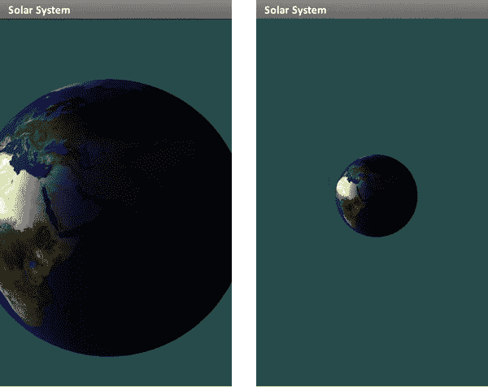

# 八、把这一切放在一起

一个人的一生，即使完全奉献给了天空，也不足以研究如此庞大的课题。

——罗马哲学家塞内加

好了，现在我们已经一路走到了第八章。此时，我们可以将从练习中学到的东西整合到一个更完整的太阳系模型中(尽管它仍然缺少彗星、杀手小行星、中微子和外海王星物体)。然后，我希望你会说，“哇！这有点酷！”

这一章的代码非常多，因为该模型需要大量新的例程和对现有项目的修改。和第七章中的一些清单一样，我不会展示整个代码文件，因为它们很长，为了避免重复，或者只是为了早点睡觉(天哪，现在是凌晨 2:45)；因此，我们鼓励您从 Apress 站点获取完整的项目，以及任何必要的数据文件，以确保您拥有完整的功能示例。我总是说，完成一套。

一些新的技巧也将被抛出，比如如何整合标准的 Android 小工具和四元数的使用。请注意，尽管下面的许多代码都是基于前面的练习，但可能需要一些小的调整来将其集成到更大的包中，因此不幸的是，这不会是简单的剪切和粘贴情况。

#### 重访太阳系

如果你想自己填写代码，我建议获取太阳系模型的第五章变体，而不是第七章变体，后者仅用于在 3D 对象上显示动态纹理，在这里不会以那种方式使用。

第一个练习是在节目中添加一些导航元素，这样你就可以在地球上移动视点。

但是首先，我们需要调整模型的大小，以使演示更加真实。就目前而言，地球看起来只有太阳的三分之一大，距离我们只有几千英里。考虑到这是北加利福尼亚的一个宜人的夏日，而且地球一点也不像烧焦的煤渣，我敢打赌这个模型是错误的。好吧，让我们来弥补吧。这将在你们太阳系控制器的`initGeometry()`方法中完成。当我们这样做的时候，`m_Eyeposition`的类型将被改变，以将其升级为一个为 3D 操作定制的稍微更加对象化的对象。新的例程在清单 8–1 中。当你在太阳表面的时候，确保添加一个纹理；否则，讨厌的事情可能会发生。

**清单 8–1。** *为太阳系调整天体大小*

`        private void initGeometry(GL10 gl)
    {
            // Let 1.0=1 million miles.
            // The sun's radius=.4.
            // The earth's radius=.04 (10x larger to make it easier to see).

            m_Eyeposition[*X_VALUE*] = 0.0f;
            m_Eyeposition[*Y_VALUE*] = 0.0f;
            m_Eyeposition[*Z_VALUE*] = 93.25f;

            *m_Earth* = new Planet(48, 48, .04f, 1.0f, gl, myAppcontext, true,
                            book.SolarSystem.R.drawable.*earth*);
            *m_Earth*.setPosition(0.0f, 0.0f, 93.0f);

            *m_Sun* = new Planet(48, 48, 0.4f, 1.0f, gl, myAppcontext, false, 0);
            *m_Sun*.setPosition(0.0f, 0.0f, 0.0f);
    }`

我们模型的比例设置为 1 单位= 100 万英里(1.7 米公里或 8.3 米弗隆，或 3.52e+9 肘)。太阳的半径为 400，000 英里，用这些单位表示就是 0.4 英里。这意味着地球的半径将会是 0.004，但是我已经把它增加了 10 倍，达到 0.04，使它更容易处理。因为地球的默认位置是沿着+z 轴，让我们把眼睛的位置放在地球的正后方，只有 25 万英里远，在“93.25”在太阳系物体的`execute`方法中，去掉`glRotatef()`，这样地球现在将保持固定。这让事情暂时变得简单多了。将视野从 50 度改为 30 度；另外，将`setClipping`中的`zFar`设置为 2000(处理未来对象)。您最终应该得到类似于 Figure 8–1 的东西。因为从我们的角度来看，太阳实际上是在地球的后面，所以我调高了`SS_FILLLIGHT1`的镜面照明。

**图 8–1**。*微型屏幕上的我们的家*

“一切都好，代码男孩！”你一定在小声嘀咕。“但现在我们被困在太空了！”没错，这意味着下一步是添加导航元素。这意味着(提示戏剧性的音乐)我们将添加*四元数*。

#### 这些四元数到底是什么东西？

1843 年 10 月 16 日，在都柏林，爱尔兰数学家威廉·哈密顿爵士正在皇家运河边散步，突然数学灵感闪现。他一直在研究如何对空间中的两点进行有意义的乘法和除法运算，突然在脑海中看到了四元数的公式:。*I*2=*j*2=*k*2=*ijk*= 1。印象深刻吧。

他是如此的兴奋，以至于他无法抗拒将它刻在他刚刚来到的 Brougham 桥的石雕上的诱惑(毫无疑问，它位于“Eamon loves Fiona，1839”或“Patrick O'Callahan rulz！”).这种见解直接衍生出看待物理学和几何学的全新方式。例如，电磁理论中的经典麦克斯韦方程完全是通过使用四元数来描述的。随着处理类似情况的新方法的出现，四元数被搁置一旁，直到 20 世纪后期，它们在 3D 计算机图形学、阿波罗飞船到月球的导航以及其他严重依赖空间旋转的领域中发挥了重要作用。由于其紧凑的性质，它们可以描述方向向量，从而比标准的 3×3 矩阵更有效地描述 3D 旋转。不仅如此，它们还提供了一种更好的方法，将一系列旋转串联起来。那么，这意味着什么呢？

在第二章中，我们介绍了使用矩阵的传统 3D 变换数学。如果你想绕 z 轴旋转一个对象 32°，你可以通过命令`glRotatef(32,0,0,1)`指示 OpenGL ES 执行旋转。对于 x 轴和 y 轴也将执行类似的命令。但是，如果你想要一种时髦的旋转，就像飞机向左倾斜时那样，那该怎么办呢？在`glRotatef()`格式中是如何描述的？使用更传统的方法，您将为三次旋转生成单独的矩阵，然后按照*偏航*(绕 y 轴旋转)、*俯仰*(绕 x 轴旋转)和*绕 z 轴滚动*的顺序将它们相乘。仅仅针对一个方向就需要大量的数学计算。但是，如果这是一个飞行模拟器，你的倾斜动作将不断更新新的滚动和航向，增量。这意味着你必须每次计算三个矩阵，计算自上一帧以来轨迹的增量，而不是某个起点的绝对值。

在计算机的早期，当浮点计算非常昂贵，并且由于性能原因经常调用快捷方式时，舍入误差是常见的，并且可能会随着时间的推移而增加，导致当前的矩阵“不合适”。然而，四元数被拯救了，因为它们有几个非常引人注目的性质。

首先，四元数可以表示物体在空间中的旋转，大致相当于`glRotate()`的工作方式，但使用分数轴值。这不是一个直接的一对一的关系，因为你仍然需要做一些数学上的事情来转换四元数和姿态。

第二个也是更重要的性质来源于这样一个事实，即球面上的弧可以用两个四元数来描述，每个端点一个四元数。并且圆弧上它们之间的任何一点也可以用一个四元数来描述，只需使用球面几何插值一个端点到另一个端点的距离，如图 Figure 8–2 所示。也就是说，如果你正在通过一个 60°的圆弧，你可以沿着圆弧的三分之一找到一个中间四元数，比如说，从起点开始 20°。在下一帧中，如果你要跳到 20.1，你只需在你的*当前*四元数上增加一点点弧度，而不必经历每次生成三个矩阵并将它们相乘的繁琐过程。这个过程叫做 *slerping，*其中*sler RP*代表*球面线性插补*。因为轴/角度对不像使用矩阵时那样依赖于所有先前轴/角度对的累积和，而是依赖于瞬时值，所以前者不会导致误差累积。

**图 8–2。** *一个中间四元数；球面上的问题 1.5 可以由另外两个 Q1 和 Q2* 插值得到

Slerp 用于在从一个点移动到另一个点时提供视点的“相机”的平滑动画。它可以是飞行模拟器、太空模拟器的一部分，也可以是赛车游戏中追逐车的视图。当然，它们也用于实际的飞行导航系统。

现在有了这些背景，我们将使用四元数来帮助移动地球。

#### 在 3D 中移动物体

由于我们目前没有制作地球的动画，我们需要一种方法来移动它，这样我们就可以从各个角度研究它。考虑到这一点，由于地球是我们感兴趣的目标，我们将设置一种情况，在这种情况下，通过挤压和移动手势，视点将有效地悬停在地球上。

第一步是添加手势识别器，这是通过 Android 的`onTouchEvent()`调用实现的。你需要同时支持挤压和拖动功能。捏是放大和缩小，而平移让你拖动你下面的星球，始终保持它的中心。更复杂的动作，如动量滑动，或“甩”，留给你来实现，不幸的是，这可能会有点乱。

代码的结构略有不同。传统上作为`GLSurfaceView.Renderer`实现的核心模块现在是一个叫做`SolarSystemView`的`GLSurfaceView`子类。渲染器现在是新的`SolarSystem`对象。前者主要作为收缩和拖动事件的事件接收器，而后者处理主更新循环，并作为任何太阳系类型对象的容器。

在新的`SolarSystemView`中，我们将只需要捏和平移手势。您使用`onTouchEvent()`来处理所有触摸事件，初始化一些值，并决定您是在执行挤压还是拖动功能。向视图控制器的`onTouchEvent()`方法添加清单 8–2。

**清单 8–2。** *处理捏拖事件*

`        public boolean onTouchEvent(MotionEvent ev)
    {
            boolean retval = true;

            switch (ev.getAction() & MotionEvent.*ACTION_MASK*)
        {
                case MotionEvent.*ACTION_DOWN*:
                    m_Gesture = *DRAG*;                                                   //1
                    break;

                case MotionEvent.*ACTION_UP*:
                case MotionEvent.*ACTION_POINTER_UP*:
                    m_Gesture = *NONE*;                                                   //2
                    m_LastTouchPoint.x = ev.getX();
                    m_LastTouchPoint.y = ev.getY();
                    break;

                case MotionEvent.*ACTION_POINTER_DOWN*:
                    *m_OldDist* = spacing(ev);                                            //3

                    midPoint(m_MidPoint, ev);
                    m_Gesture = *ZOOM*;
                    m_LastTouchPoint.x = m_MidPoint.x;
                    m_LastTouchPoint.y = m_MidPoint.y;
                    m_CurrentTouchPoint.x=m_MidPoint.x;
                    m_CurrentTouchPoint.y=m_MidPoint.y;

                    break;

                case MotionEvent.*ACTION_MOVE*:
                    if (m_Gesture == *DRAG*)                                              //4
                {    
                        retval = handleDragGesture(ev);
                }
                    else if (m_Gesture == *ZOOM*)
                {
                        retval = handlePinchGesture(ev);
                }
                    break;
        }

            return retval;
    }`

这是细目分类:

*   第一部分处理触摸显示屏的手指，或多点触摸事件的第一个手指。将运动类型`m_Gesture`初始化为`DRAG`。
*   第二部分处理运动何时完成。
*   第三部分介绍缩放功能。`m_MidPoint`用于确定放大到屏幕上的哪个点。这里不需要这样做，因为我们将只放大屏幕中央的地球，但这仍然是很好的参考代码。
*   最后，在第四部分中，调用正确的手势动作。

接下来我们需要添加两个处理程序，`handleDragGesture()`和`handlePinchGesture()`，如清单 8–3 所示。

**清单 8–3。** *手势识别器的两个处理程序*

`final PointF m_CurrentTouchPoint = new PointF();
        PointF m_MidPoint = new PointF();
        PointF m_LastTouchPoint = new PointF();
        static int *m_GestureMode* = 0;
        static int *DRAG_GESTURE* = 1;
        static int *PINCH_GESTURE* = 2;

        public boolean handleDragGesture(MotionEvent ev)
    {
            m_LastTouchPoint.x = m_CurrentTouchPoint.x;            
            m_LastTouchPoint.y = m_CurrentTouchPoint.y;

            m_CurrentTouchPoint.x = ev.getX();
            m_CurrentTouchPoint.y = ev.getY();

            m_GestureMode = DRAG_GESTURE;
            m_DragFlag = 1;

            return true;
    }    

        public boolean handlePinchGesture(MotionEvent ev)
    {
            float minFOV = 5.0f;
            float maxFOV = 100.0f;
            float newDist = spacing(ev);

            m_Scale = m_OldDist/newDist;

            if (m_Scale > m_LastScale)
        {
            m_LastScale = m_Scale;
        }
            else if (m_Scale <= m_LastScale)` `        {
                m_LastScale = m_Scale;
        }

            *m_CurrentFOV* = *m_StartFOV* * *m_Scale*;
            m_LastTouchPoint = m_MidPoint;
            *m_GestureMode* = *PINCH_GESTURE*;

            if (*m_CurrentFOV* >= minFOV && *m_CurrentFOV* <= maxFOV)
        {
                mRenderer.setFieldOfView(*m_CurrentFOV*);
                return true;
        }
            else
                return false;
    }`

这两个都很基本。`handleDragGesture()`设置跟踪当前和先前的触摸点，在确定拖动操作的速度时使用。两者之间的差值越大，屏幕的动画应该越快。`handlePinchGesture()`对缩放操作执行相同的操作。`m_OldDist`和`newDist`是两个夹指之间以前和新的距离。这种差异决定了视野的变化程度。压缩图形会放大，而展开图形会缩小到最大 100 度。

然后手势在`onDrawFrame()`方法中被处理，如清单 8–4 所示。

**清单 8–4**。*处理新的挤压和拖动状态*

`        public void onDrawFrame(GL10 gl)
    {
            gl.glClear(GL10.*GL_COLOR_BUFFER_BIT* | GL10.*GL_DEPTH_BUFFER_BIT*);
            gl.glClearColor(0.0f, 0.0f, 0.0f, 1.0f);

            if (*m_GestureMode* == *PINCH_GESTURE* && *m_PinchFlag* == 1)                   //1
        {
                setClipping(gl, origwidth, origheight);
                *m_PinchFlag* = 0;
        }
            else if (*m_GestureMode* == *DRAG_GESTURE* && *m_DragFlag* == 1)                //2
        {
                setHoverPosition(gl, 0, m_CurrentTouchPoint, m_LastTouchPoint, *m_Earth*);

                *m_DragFlag* = 0;
        }

            execute(gl);
    }`

在第一部分中，仅当通过`m_PinchFlag`检测到并标记了新的手势时，才处理挤压，该手势在处理后复位。如果不这样做，缩放将在每次连续调用`onDrawFrame()`时继续。每次使用`m_FieldOfView`值通过`setClipping()`更新视见体，因为该机制实际上决定了视图的放大倍数。第二部分同样适用于拖动手势。在这种情况下，`setHoverPosition()`是用当前和以前的触摸点调用的。它还有一个通过`m_DragFlag`的开关，关闭任何进一步的拖动处理，直到检测到新的事件。否则，即使你的手指没有移动，你的观点也会发生偏移。

如果您想立即看到缩放操作，请注释掉前面清单中的行`setHoverPosition()`,然后编译并运行。

你应该能够放大和缩小地球模型，如图图 8–3 所示。

**图 8–3。** *使用捏手势放大和缩小*

现在我们要做旋转支持，包括那些四元数的东西。这可能是迄今为止最复杂的练习。我们将需要一些辅助程序来瞄准你的视点，并在地球周围的“轨道”上移动它。所以，让我们从顶部开始，一步步往下。清单 8–5 是“悬停模式”的核心

**清单 8–5**。*围绕地球设定新的悬停位置*

`public void setHoverPosition(GL10 gl, int nFlags, PointF location,
               PointF prevLocation, Planet m_Planet)
    {
        double dx;` `double dy;
        Quaternion orientation = new Quaternion(0, 0, 0, 1.0);
        Quaternion tempQ;
        Vector3 offset = new Vector3(0.0f, 0.0f, 0.0f);
        Vector3 objectLoc = new Vector3(0.0f, 0.0f, 0.0f);
        Vector3 vpLoc = new Vector3(0.0f, 0.0f, 0.0f);
        Vector3 offsetv = new Vector3(0.0f, 0.0f, 0.0f);
        Vector3 temp = new Vector3(0.0f, 0.0f, 0.0f);
        float reference = 300.0f;
        float scale = 2.0f;
        float matrix3[][] = new float[3][3];
        boolean debug = false;

        gl.glMatrixMode(GL10.*GL_MODELVIEW*);
        gl.glLoadIdentity();

        orientation = Miniglu.*gluGetOrientation*(); //1

        vpLoc.x = m_Eyeposition[0];                                                    //2
        vpLoc.y = m_Eyeposition[1];
        vpLoc.z = m_Eyeposition[2];

        objectLoc.x = m_Planet.m_Pos[0];                                               //3
        objectLoc.y = m_Planet.m_Pos[1];
        objectLoc.z = m_Planet.m_Pos[2];

        offset.x = (objectLoc.x - vpLoc.x);                                            //4
        offset.y = (objectLoc.y - vpLoc.y);
        offset.z = (objectLoc.z - vpLoc.z);

        offsetv.z = temp.Vector3Distance(objectLoc, vpLoc);                            //5

        dx = (double) (location.x - prevLocation.x);
        dy = (double) (location.y - prevLocation.y);

        float multiplier;
        multiplier = origwidth / reference;

        gl.glMatrixMode(GL10.*GL_MODELVIEW*);
        // Rotate around the X-axis.

        float c, s;                                                                    //6
        float rad = (float) (scale * multiplier * dy / reference)/2.0;

        s = (float) Math.*sin*(rad * .5);                         
        c = (float) Math.*cos*(rad * .5);` `        temp.x = s;
        temp.y = 0.0f;
        temp.z = 0.0f;

        Quaternion tempQ1 = new Quaternion(temp.x, temp.y, temp.z, c);

        tempQ1 = tempQ1.mulThis(orientation);

        // Rotate around the Y-axis.

        rad = (float) (scale * multiplier * dx / reference);                        //7

        s = (float) Math.*sin*(rad * .5);
        c = (float) Math.*cos*(rad * .5);

        temp.x = 0.0f;
        temp.y = s;
        temp.z = 0.0f;

        Quaternion tempQ2 = new Quaternion(temp.x, temp.y, temp.z, c);

        tempQ2 = tempQ2.mulThis(tempQ1);

        orientation=tempQ2;

        matrix3 = orientation.toMatrix();            //8

        matrix3 = orientation.tranposeMatrix(matrix3);                              //9
        offsetv = orientation.Matrix3MultiplyVector3(matrix3, offsetv);

        m_Eyeposition[0] = (float)(objectLoc.x + offsetv.x);                        //10
        m_Eyeposition[1] =  (float)(objectLoc.y + offsetv.y);
        m_Eyeposition[2] =  (float)(objectLoc.z + offsetv.z);

          lookAtTarget(gl, m_Planet);                                                 //11
    }`

我打赌你想知道这里发生了什么？

*   首先，我们从稍后将创建的新辅助类中获取缓存的四元数。四元数是我们的视点在第 1 行的当前方向，我们需要它和视点在第 2 行太阳系物体的 xyz 位置。
*   第 3ff 行获取目标的位置。在这种情况下，目标仅仅是地球。有了这些，我们需要找到我们的视点从地球中心的偏移，然后计算这个距离，如第 4ff 行所示。
*   第 5 行获取了前一次和当前拖动的屏幕坐标，因此我们知道自上次以来我们移动了多少。
*   Lines 6ff create a fractional rotation in radians for each new position of the drag operation around the *X*-axis. This is then multiplied by the actual orientation quaternion (recovered in line 1) to ensure that the new orientation from each touch position is preserved. The 2.0 divisor scales back the vertical motions; otherwise, they'd be much to fast. This represents the cumulative rotations of the eye point. The three values of scale, multiplier, and reference are all arbitrary. Scale is fixed and was used for some fine-tuning to ensure things moved at just the right speed that ideally will match that of your finger. The multiplier is handy for orientation changes because it is a scaling factor that is based on the screen's current width and a reference value that is also arbitrary.

    另一个封装围绕 Y 轴旋转的四元数以非常相似的方式在第 7ff 行中生成。最后一次旋转时，该值将与前一个值相乘。第 8 行将它转换成传统的矩阵。

*   第 9f 行使用矩阵对偏移值的转置来到达空间中的新位置，并存储在`m_Eyeposition.`中，因为我们要从地球的局部坐标到世界坐标，我们进行转置，实际上是反转操作。
*   即使我们的视点被移动到了一个新的位置，我们仍然需要将它重新对准悬停目标，地球，就像第 11 行中通过`lookAtTarget()`所做的那样。

现在，我们需要创建一些前面提到的助手例程，它们将有助于把所有的事情都联系在一起。

在普通的 OpenGL 中，我提到过一个叫做 GLUT 的工具库。不幸的是，在撰写本文时，还没有完整的 Android 库，尽管有一些不完整的版本。我已经把它们放到了一个名为`Miniglu.java`的文件中，可以从这个项目的网站上获得。

**注意:** Android 在`android.opengl.GLU`有一个非常小但是官方的 GLU 程序套件，但是它没有我需要的所有东西。

清单 8–6 包含了`gluLookAt(),`的 Miniglu 版本，这是一个非常有用的工具，正如它所说的:瞄准你的视角。你传递给它你的视点的位置，你想看的东西，和一个向上的向量来指定滚动的角度。自然，直线上升就等于没有滚动。但是你还是需要供应。

**清单 8–6。** *用`gluLookAt`看东西*

`static Quaternion *m_Quaternion* = new Quaternion(0, 0, 0, 1);

    public static void gluLookAt(GL10 gl, float eyex, float eyey, float eyez,
            float centerx, float centery, float centerz, float upx,` `float upy, float upz)
{
        Vector3 up = new Vector3(0.0f, 0.0f, 0.0f);                           //1
        Vector3 from = new Vector3(0.0f, 0.0f, 0.0f);
        Vector3 to = new Vector3(0.0f, 0.0f, 0.0f);
        Vector3 lookat = new Vector3(0.0f, 0.0f, 0.0f);
        Vector3 axis = new Vector3(0.0f, 0.0f, 0.0f);
            float angle;

        lookat.x = centerx;                                               //2
        lookat.y = centery;
        lookat.z = centerz;

        from.x = eyex;
        from.y = eyey;
        from.z = eyez;

        to.x = lookat.x;
        to.y = lookat.y;
        to.z = lookat.z;

        up.x = upx;
        up.y = upy;
        up.z = upz;

        Vector3 temp = new Vector3(0, 0, 0);                                     //3
        temp = temp.Vector3Sub(to, from);
        Vector3 n = temp.normalise(temp);

        temp = temp.Vector3CrossProduct(n, up);
        Vector3 v = temp.normalise(temp);

        Vector3 u = temp.Vector3CrossProduct(v, n);
        float[][] matrix;

        matrix = temp.Matrix3MakeWithRows(v, u, temp.Vector3Negate(n));
        *m_Quaternion* = *m_Quaternion*.QuaternionMakeWithMatrix3(matrix);           //4

        *m_Quaternion*.printThis("GluLookat:");

        axis = *m_Quaternion*.QuaternionAxis();
        angle = *m_Quaternion*.QuaternionAngle();

        gl.glRotatef((float) angle * *DEGREES_PER_RADIAN*, (float) axis.x,
                (float) axis.y, (float) axis.z);                                  //5` `    }`

事情是这样的:

*   如前所述，我们需要获取点或向量来完整描述我们和目标在空间中的位置，如第 1ff 行所示。上向量是你的视点的局部向量，它通常只是一个指向 y 轴的单位向量。如果你想做银行卷，你可以修改这个。`Vector3`对象是与这个项目相关的小型数学库的一部分。然而，存在许多这样的库。
*   在第 2ff 行中，以离散值形式传递的项被映射到`Vector3`对象，然后这些对象可以用于矢量数学库。为什么不用矢量呢？官方的 GLUT 库不使用矢量对象，所以这符合现有的标准。
*   第 3ff 行生成三个新向量，其中两个使用叉积。这确保了一切都是标准化的，并且轴是方形的。
*   `gluLookAt()`生成矩阵的一些例子。这里，用四元数来代替。在第 4 行中，四元数是由我们的新向量创建的，用于获取`glRotatef()`喜欢使用的轴/角度参数，如第 5 行所示。注意，生成的四元数是通过一个全局缓存的，如果需要通过`gluGetOrientation`()获取瞬时姿态，可以稍后获取。很笨拙，但很管用。在现实生活中，你可能不想这样做，因为它假设你的整个世界只有一个单一的观点。实际上，你可能想要不止一个——例如，如果你想要两个同时显示，从两个不同的有利位置显示你的对象。

最后，我们可以看看生成的图像。你现在应该能够随心所欲地旋转我们这个公平的小世界了(见图 8–4)。有时出现的小黄点是太阳。

**图 8–4。** *悬停模式让你随意旋转地球。*

这就是今天练习的第一部分。还记得第七章里那些镜头光晕的东西吗？现在我们可以使用它们了。

#### 添加一些光斑

从第七章的中，从镜头光晕练习中获取三个源文件，并将它们与插图一起添加到您的项目中。这些将是`CreateTexture.java`助手库，`Flare.java`用于每个反射，以及`LensFlare.java`。这也需要对渲染器对象进行一些实质性的调整，主要是在执行例程中。

像镜头光晕效应这样的东西有各种各样的小问题需要解决。也就是说，如果耀斑的源物体，比如太阳，在地球后面，耀斑本身就会消失。此外，请注意，它不会立即消失，但实际上会淡出。在渲染光晕本身之前，需要添加几个新的工具例程。

首先确保在您的`onSurfaceCreated()`处理程序中初始化 LensFlare 对象:

`int resid;
resid = book.SolarSystem.R.drawable.gimpsun3;
m_FlareSource = CT.createTexture(gl, myAppcontext, true, resid);
m_LensFlare.createFlares(gl, myAppcontext);` 

现在是时候将任何图像工具转储到它们自己的例程中了。它叫做`CreateTexture.java`。这将有助于支持前面的呼叫。`.png`文件可以是您想要的任何文件，它将替换当前的 3D 太阳模型。我们希望这样做，这样我们就可以绘制一个太阳的平面位图，在这个位置上，球面模型通常会像过去一样进行渲染。原因是我们可以精细地控制我们的恒星的外观，使它更接近于肉眼可能看到的样子。这个明显的黄色球，虽然在技术上更准确，但看起来并不正确，因为任何光学接收器都会添加各种各样的扭曲、反射`,`和高光(例如，镜头眩光)。可以使用着色器来对眼睛的光学进行数学建模，但目前对于一个模糊的球状物体来说，这是一个很大的工作量。如果你愿意，你可以从 Apress 网站下载我自己的作品。或者只是复制一些适合自己口味的东西。图 8–5 是我正在使用的。足够有趣的是，这个图像愚弄了我自己的眼睛，足以让我的大脑认为我实际上正在看着一个太亮的东西，因为当我盯着它时，它会导致各种各样的眼睛疲劳。

这使用了一种叫做*布告板*的技术，这种技术采用了一种平面 2D 纹理，并使其对准观众，无论他们在哪里。它允许复杂和相当随机的有机物体(我想是被称为*树*的东西)在只使用简单纹理的情况下被轻易地描绘出来。随着视点的变化，广告牌对象会旋转以进行补偿。

**图 8–5。** *太阳图像用来给出看起来更真实的辉光*

我称之为`LensFlare.java`的镜头光晕管理器和单个 Flare.java 物体都需要修改。对于`LensFlare.java`的执行方法，我添加了两个新参数。`execute()`现在应该是这个样子:

`    public void execute(GL10 gl,CGSize size, CGPoint source, float scale, float alpha)`

新的`scale`参数是一个单一的值，它将增加或减少整个耀斑链的大小，当你放大或缩小场景时需要，而`alpha`用于在太阳开始滑向地球后面时使整个耀斑变暗。这两个参数同样需要添加到单个 flare 对象的 execute 方法中，然后用于旋转传递给`CreateTexture's renderTextureAt()`方法的大小和 alpha 参数，如下所示:

`    public void renderFlareAt(GL10 gl, int textureID, float x, float y, CGSize size,
        Context context, float scale, float alpha)
    {
        CreateTexture ct = new CreateTexture();
        ct.renderTextureAt(gl, x, y, 0f, size, textureID, m_Size*scale,
            m_Red*alpha, m_Green*alpha, m_Blue*alpha, m_Alpha);
    }`

下一个清单，清单 8–7，包含了另外两个 Miniglu 调用。首先是`gluGetScreenLocation`()，它返回 3D 对象在屏幕上的 2D 坐标。它只不过是`gluProject`()的前端，它将 3D 点映射或投影到它的视口。尽管这些可能是“固定的”程序，但看看它们是如何工作的仍然是有启发性的。它们在这里被用来获得太阳的位置，以放置 2D 比尔登上艺术品。后来，它们可以用来放置天空中的其他 2D 项目，如星座名称。

**清单 8–7。***`gluProject()``gluGetScreenCoords()`*

`public static boolean gluProject(float objx, float objy, float objz,
            float[] modelMatrix, float[] projMatrix, int[] viewport,float[] win)
    {
        float[] in = new float[4];
        float[] out = new float[4];

        in[0] = objx;                                                      //1` `in[1] = objy;
        in[2] = objz;
        in[3] = 1.0f;

        *gluMultMatrixVector3f* (modelMatrix, in, out);                       //2

        *gluMultMatrixVector3f* (projMatrix, out, in);

                      if (in[3] == 0.0f)
        in[3] = 1.0f;

        in[0] /= in[3];
        in[1] /= in[3];
        in[2] /= in[3];

                /* Map x, y and z to range 0-1 */

        in[0] = in[0] * 0.5f + 0.5f;                                            //3
        in[1] = in[1] * 0.5f + 0.5f;
        in[2] = in[2] * 0.5f + 0.5f;

                /* Map x,y to `viewport` */

        win[0] = in[0] * viewport[2] + viewport[0];
        win[1] = in[1] * viewport[3] + viewport[1];
        win[2] = in[3];

        return (true);
    }

    public static void gluGetScreenLocation(GL10 gl, float xa, float ya, float za,
        float screenRadius, boolean render, float[] screenLoc)
    {
        float[] mvmatrix = new float[16];
        float[] projmatrix = new float[16];
        int[] viewport = new int[4];
        float[] xyz = new float[3];

        GL11 gl11 = (GL11) gl;

        gl11.glGetIntegerv(GL11.*GL_VIEWPORT*, viewport, 0);                      // 4
        gl11.glGetFloatv(GL11.*GL_MODELVIEW_MATRIX*, mvmatrix, 0);
        gl11.glGetFloatv(GL11.*GL_PROJECTION_MATRIX*, projmatrix, 0);

        *gluProject*(xa, ya, za, mvmatrix, projmatrix, viewport,xyz);

        xyz[1]=viewport[3]-xyz[1];                                               //5` `                
        screenLoc[0] = xyz[0];
        screenLoc[1] = xyz[1];
        screenLoc[2] = xyz[2];
    }`

让我们更仔细地检查一下代码:

*   第 1ff 行将对象坐标映射到一个数组，该数组将乘以`modelMatrix`(作为参数之一提供)。
*   在第 2ff 行，乘法是通过我添加的另一个 GLUT helper 例程来完成的，因为写要比跟踪快。首先是模型视图矩阵，然后是投影矩阵在我们对象的 xyz 坐标上操作。(记住，列表中的第一个转换是最后执行的。)注意，对 gluMultMatrixVector3f()的第一个调用传递“in”数组，然后是“out”，而第二个调用以相反的顺序传递两个数组。这里没有什么巧妙之处——第二个实例颠倒了两者的使用，只是为了回收现有的数组。
*   在第 3ff 行中，前面计算的结果值被归一化，然后映射到屏幕的尺寸上，得到最终的值。
*   我们可能永远不会直接调用`gluProject()`;相反，调用者是`gluGetScreenLocation()`，它仅仅获取第 4ff 行中所需的矩阵，将它们传递给`gluProject()`，并检索屏幕坐标。因为 OpenGL ES 会反转 y 轴，所以我们需要在第 5 行取消反转。

`SolarSystem renderer`中的`execute()`例程必须进行一些修改，以管理镜头光晕的调用和放置，同时随着增强的`executePlanet()`增加了一些新参数，以实际识别光晕应该位于屏幕上的什么位置。清单 8–8 中提供了两者。

**清单 8–8。** *用镜头光晕支持执行*

`public void execute(GL10 gl)
    {
        float[] paleYellow = { 1.0f, 1.0f, 0.3f, 1.0f };
        float[] white = { 1.0f, 1.0f, 1.0f, 1.0f };
        float[] black = { 0.0f, 0.0f, 0.0f, 0.0f };
        float[] sunPos = { 0.0f, 0.0f, 0.0f, 1.0f };
        float sunWidth=0.0f;
        float sunScreenLoc[]=new float[4];        //xyz and radius
        float earthScreenLoc[]=new float[4];      //xyz and radius

        gl.glMatrixMode(GL10.*GL_MODELVIEW*);
        gl.glShadeModel(GL10.*GL_SMOOTH*);

        gl.glEnable(GL10.*GL_LIGHTING*);
        gl.glEnable(GL10.*GL_BLEND*);
        gl.glBlendFunc(GL10.*GL_SRC_ALPHA*, GL10.*GL_ONE_MINUS_SRC_ALPHA*);` `gl.glPushMatrix();

        gl.glTranslatef(-m_Eyeposition[*X_VALUE*], -m_Eyeposition[*Y_VALUE*],          //1
                        -m_Eyeposition[*Z_VALUE*]);

        gl.glLightfv(*SS_SUNLIGHT*, GL10.*GL_POSITION*, makeFloatBuffer(sunPos));
        gl.glEnable(*SS_SUNLIGHT*);

        gl.glMaterialfv(GL10.*GL_FRONT_AND_BACK*, GL10.*GL_EMISSION*,
                        makeFloatBuffer(paleYellow));

        executePlanet(*m_Sun*, gl, false,sunScreenLoc);               //2

        gl.glMaterialfv(GL10.*GL_FRONT_AND_BACK*, GL10.*GL_EMISSION*,makeFloatBuffer(black));

        gl.glPopMatrix();

        if ((m_LensFlare != null) && (sunScreenLoc[*Z_INDEX*] > 0.0f))         //3
        {
               CGPoint centerRelative = new CGPoint();
               CGSize     windowSize = new CGSize();
               float sunsBodyWidth=44.0f;            //About the width of the sun's body
                                                     // within the glare in the bitmap,                                                         in pixels.
                float cx,cy;
                float aspectRatio;
                float scale=0f;

                DisplayMetrics display =                     myAppcontext.getResources().getDisplayMetrics();
                windowSize.width = display.widthPixels;
                windowSize.height = display.heightPixels;

                   cx=windowSize.width/2.0f;           
                   cy=windowSize.height/2.0f;

                aspectRatio=cx/cy;                                      //4

                centerRelative.x = sunScreenLoc[*X_INDEX*]-cx;
                centerRelative.y =(cy-sunScreenLoc[*Y_INDEX*])/aspectRatio;    

                scale=CT.renderTextureAt(gl, centerRelative.x, centerRelative.y, 0f,                     windowSize,
                m_FlareSource,sunScreenLoc[*RADIUS_INDEX*], 1.0f,1.0f, 1.0f, 1.0f); //5

                sunWidth=scale*windowSize.width*sunsBodyWidth/256.0f;           //6
        }` `gl.glEnable(*SS_FILLLIGHT2*);

        gl.glMatrixMode(GL10.*GL_MODELVIEW*);
        gl.glPushMatrix();

        gl.glTranslatef(-m_Eyeposition[*X_VALUE*], -m_Eyeposition[*Y_VALUE*],    //7
        -m_Eyeposition[*Z_VALUE*]);

        gl.glMaterialfv(GL10.*GL_FRONT_AND_BACK*, GL10.*GL_DIFFUSE*,
        makeFloatBuffer(white));

        gl.glMaterialfv(GL10.*GL_FRONT_AND_BACK*, GL10.*GL_SPECULAR*,
            makeFloatBuffer(white));

        executePlanet(*m_Earth*, gl, true,earthScreenLoc);          //8

        gl.glPopMatrix();

        if ((m_LensFlare != null) && (sunScreenLoc[*Z_INDEX*] > 0))       //9
    {
        float scale = 1.0f;
        float delX = origwidth / 2.0f - sunScreenLoc[*X_INDEX*];
        float delY = origheight / 2.0f - sunScreenLoc[*Y_INDEX*];
        float grazeDist = earthScreenLoc[*RADIUS_INDEX*] + sunWidth;        
        float percentVisible = 1.0f;
        float vanishDist = earthScreenLoc[*RADIUS_INDEX*] - sunWidth;

        float distanceBetweenBodies = (float) Math.*sqrt*(delX * delX + delY * delY);

        if ((distanceBetweenBodies > vanishDist)&& (distanceBetweenBodies        < grazeDist))                        //10
        {
            percentVisible=(float) ((distanceBetweenBodies - vanishDist) /sunWidth);

                if (percentVisible > 1.0)                //11
                percentVisible = 1.0f;
                else if (percentVisible < 0.3)        
                percentVisible = .5f;
            }
            else if (distanceBetweenBodies > grazeDist)
            {
                percentVisible = 1.0f;
            }
            else
            {
                percentVisible = 0.0f;
            }` `            scale = *STANDARD_FOV* / *m_FieldOfView*;                  //12
            CGPoint source = new CGPoint();
            source.x = sunScreenLoc[*X_INDEX*];
            source.y = sunScreenLoc[*Y_INDEX*];
            CGSize winsize = new CGSize();
            winsize.width = origwidth;
            winsize.height = origheight;

            if (percentVisible > 0.0)
            {
                m_LensFlare.execute(gl, winsize, source, scale,    percentVisible);
            }
        }
    }`

好了，现在开始粉笔对话:

*   您会注意到发出了两个相同的`glTranslatef()`调用。第 1 行中的第一个为第 2 行的结果做准备。但是当我们的自定义太阳图像在第 5 行中呈现时，我们需要将它从堆栈中弹出。当地球被绘制到屏幕上时，需要在第 7 行再次调用它。
*   在第二行，看起来我们正在渲染太阳。但也不尽然。这是为了在主屏幕上提取出太阳实际将要到达的位置。第三个参数`render`，如果为假，将使例程只返回屏幕位置和预期半径，而不是实际绘制太阳。
*   第 3 行决定我们是否应该绘制新的太阳和镜头眩光对象，如果太阳基于它的 z 坐标可能是可见的。如果 z 为负，它在我们后面，所以我们可以一起跳过它。
*   第 4 行的`aspectRatio`处理非方形视口，这意味着几乎所有的非方形视口。然后，我们根据屏幕的中心计算太阳的预期广告牌图像的位置。
*   新的`renderToTextureAt()`调用现在将太阳的广告牌放在屏幕上，如第 5 行的`m_FlareSource`所示。`sunScreenLoc{RADIUS_INDEX]`是从`executePlanet()`获取的值之一，对应于实际 3D 图像的大小。`scale`的返回值暗示了最终位图的大小，占屏幕的百分比。这在第 6 行中用于计算太阳位图中“热点”的实际宽度，因为太阳身体的中心图像自然会远远小于位图的尺寸。
*   在第 7 行，我们再次执行翻译，因为前一个在弹出矩阵时丢失了。接下来是第 8 行，它渲染地球，但是在本例中，传递了一个 true 的渲染标志。然而，它仍然获得屏幕位置信息，在这种情况下，仅仅是为了获得图像的尺寸，以便我们知道何时开始消除镜头眩光。
*   然后我们从第 9ff 行开始，来到实际渲染光晕的地方。这里的大部分代码主要处理一个基本效应:当太阳走到地球后面时会发生什么？自然，耀斑会消失，但它不会立即出现或消失，因为太阳的直径有限。因此， *`grazeDist`* 和 *`vanishDist`* 等数值告诉我们，当太阳第一次与地球相交时，开始变暗过程，当它最终被完全覆盖时，耀斑完全消失。使用地球屏幕的 x 和 y 值以及太阳的 x 和 y 值，指定一个渐变函数变得很容易。
*   Any value that falls between the `vanishDist` and `grazeDist` values specifies what percentage of dimming should be done, as in line 10, while lines 11ff actually calculate the value. Notice the line: `else if(percentVisible<0.3)
        percentVisible=0.5f`

    额外学分:这是做什么的，为什么？

*   Lines 12ff calculate the size of the flare and its corresponding elements. As you zoom in with a decreasing field of view—that is, a higher-power lens—the sun's image will increase and the flare should as well.

    这个练习的最后一点是看一下`executePlanet()`，如清单 8–9 所示。

***清单 8–9。*** `ExecutePlanet()`修改后得到屏幕坐标

`public void executePlanet(Planet planet, GL10 gl, Boolean render,float[] screenLoc)         
    {
        Vector3 planetPos = new Vector3(0, 0, 0);
        float temp;
        float distance;
        float screenRadius;

        gl.glPushMatrix();

        planetPos.x = planet.m_Pos[0];
        planetPos.y = planet.m_Pos[1];
        planetPos.z = planet.m_Pos[2];

        gl.glTranslatef((float) planetPos.x, (float) planetPos.y,(float) planetPos.z);

        if (render)
        {
            planet.draw(gl);                           //1
        }

        Vector3 eyePosition = new Vector3(0, 0, 0);                

        eyePosition.x = m_Eyeposition[*X_VALUE*];
        eyePosition.y = m_Eyeposition[*Y_VALUE*];` `        eyePosition.z = m_Eyeposition[*Z_VALUE*];

        distance = (float) planetPos.Vector3Distance(eyePosition, planetPos);

        float fieldWidthRadians = (*m_FieldOfView* /*DEGREES_PER_RADIAN*) / 2.0f;
        temp = (float) ((0.5f * origwidth) / Math.*tan*(fieldWidthRadians));

        screenRadius = temp * getRadius(planet) / distance;

        if(screenLoc!=null)                                                 //2
        {
            Miniglu.*gluGetScreenLocation*(gl, (float) planetPos.x, (float) -planetPos.y,
                (float) planetPos.z, (float) screenRadius, render,screenLoc);
        }

        screenLoc[*RADIUS_INDEX*]=screenRadius;

        gl.glPopMatrix();
        angle += .5f;
    }`

在最后一位，当且仅当渲染标志为真时，第 1 行正常绘制行星。否则，它只是获取屏幕位置和尺寸，如第 2 行所示，这样我们就可以自己绘制了。

应该可以了。我确信你能够编译时没有错误或警告，因为你就是这么好。因为你就是那么优秀，你可能会得到图 8–6 中的图片作为奖励。和我一样，随意使用环境光和镜面光。效果可能不是很逼真，但看起来很不错。

**图 8–6。***看，马！镜头眩光！*

 *#### 看星星

下一个练习所需的大部分新代码主要用于加载和管理所有新数据。因为这是一本关于 OpenGL 的书，而不是 XML 或数据结构或如何有效地输入书中的代码，所以我将省去那些你可能已经知道的更乏味的东西。

当然，没有一些漂亮的恒星作为背景，任何太阳系模型都是不完整的。到目前为止，所有的例子都足够小，可以在文本中完整地打印出来，但是现在，当我们在背景中添加一个简单的 star field 时，情况会稍有变化。不同之处很大程度上在于你需要从 Apress 网站获取的数据库，因为它将包含 500 多颗 4.0 星等的恒星，以及一个包含星座轮廓和一些更突出的星座名称的额外数据库。

除了 OpenGL ES 用于创建实体模型的三角形面之外，如果您的 Android 设备支持多像素点表示，您还可以指定将模型的每个顶点渲染为给定大小和大小的点图像。此时，Android 商业模式丑陋的一面开始显露出来。

谷歌对 Android 的做法很简单:试图将它打造成世界上最卓越的移动操作系统。为了做到这一点，谷歌让它免费，并允许制造商随心所欲地修改它。结果，可怕的分裂迅速潜入。从表面上看，消费者不应该担心这一点，因为他们有大量的手机可供选择。但是从开发人员的角度来看，这使得编写在成百上千台设备上运行的软件成为一场噩梦，因为每台设备都有自己的小毛病。从长远来看，这确实会影响消费者，因为开发者可能会选择不支持特定的设备家族，或者如果他们支持，他们可能会遭受发布延迟和成本增加，以确保他们的最新产品能够在所有设备上工作。这种差异在图形支持方面表现得最为明显。

图形处理单元有许多不同的制造商。GC860 的制造商 Vivante 向 Marvell 供应芯片；AMD 把自己的 GPU 送给东芝，PowerVR 卖给苹果和三星。更糟糕的是，每个特定型号的 GPU 都可能比同一制造商的前几代产品拥有更多功能。这意味着您可能不得不通过省略最新设备可能支持的酷功能来编写最低公分母，或者如果您真的需要一个特定的功能来跨所有平台工作，您可能不得不推出自己的功能。或者，作为第三种方法，您可能只需要针对特定的设备进行编码，而将其他设备排除在外。在很大程度上，苹果已经成功地用他们的 iOS 设备在这些水域中航行，而微软(它对旧的 Windows Mobile 手机使用“Android”方法)现在通过确保他们的 Windows Mobile 7 许可证持有者遵守非常严格的规范来避免分裂。因此，选择目标机器至关重要。

现在回到星星上。那么，这有什么特别的呢？很简单。并不是所有的设备都支持 OpenGL 的大于一个像素的渲染。或者那些支持的可能不支持圆形抗锯齿点。前者几乎可以工作，但只适用于上一代低分辨率屏幕，比如 75 DPI 左右。但现在有了更新的高分辨率显示器(如苹果的视网膜显示器)，单个像素小到几乎看不见，这使得显示由像素集合组成的星星变得势在必行。这就是这个练习的发展情况，你很快就会看到。但首先，敬明星们。

**注意:**设备的价格或制造商似乎与其支持的 3D 功能没有多大关系。比如第一代摩托罗拉 Xoom 可以做胖点，但是只能做方点。Kindle Fire 做的是宽线，但只有单像素点，而廉价的无名设备既做粗线又做点。

这第一点的恒星数据库是从我的遥远的太阳数据编译成苹果的 plist XML 文件格式。然后，为了便于演示，对其进行了一点调整，使解析变得更加容易。同样的方法也用于星座数据。加载时，它被绘制成非常像以前的对象，比如球体，但是没有指定`GL_TRANGLE_STRIPS`，而是使用了`GL_POINTS`。清单 8–10 显示了恒星的`execute()`方法。

**清单 8–10。** *渲染群星*

`    public void execute(GL10 gl)
    {
        int `len`;
        float[] pointSize = new float[2];                        
        GL11 gl11 = (GL11) gl;

        gl.glDisable(GL10.*GL_LIGHTING*); `                 //1
        gl.glDisable(GL10.*GL_TEXTURE_2D*);
        gl.glDisable(GL10.*GL_DEPTH_TEST*);

        gl.glEnableClientState(GL10.*GL_VERTEX_ARRAY*);
        gl.glEnableClientState(GL10.*GL_COLOR_ARRAY*);             //2

        gl.glMatrixMode(GL10.*GL_MODELVIEW*);
        gl.glBlendFunc(GL10.*GL_ONE*, GL10.*GL_ONE_MINUS_DST_ALPHA*);
        gl.glEnable(GL10.*GL_BLEND*);

        gl.glColorPointer(4, GL10.*GL_FLOAT*, 0, m_ColorData);
        gl.glVertexPointer(3,GL10.*GL_FLOAT*, 0, m_VertexData);

        gl.glEnable(GL10.*GL_POINT_SMOOTH*);                //3
        gl.glPointSize(5.0f);                             

        gl.glDrawArrays(GL10.*GL_POINTS*,0,totalElems/4); `           //4

        gl.glDisableClientState(GL10.*GL_VERTEX_ARRAY*);    
        gl.glDisableClientState(GL10.*GL_COLOR_ARRAY*);    
        gl.glEnable(GL10.*GL_DEPTH_TEST*);
        gl.glEnable(GL10.*GL_LIGHTING*);
    }`

接下来的故事是:

*   第 1 行对于渲染任何自发光的对象或者你只想一直可见的对象是必不可少的。在这种情况下，恒星属于前一类，而星座名称和轮廓等各种标识符属于后一类。关灯可以确保无论发生什么都能看到它们。(在之前的练习中，太阳被渲染成一个发射物体，但仍然被照亮，只是为了在表面上获得一个看起来非常好的轻微渐变。)
*   Colors in line 2 are being used to specify the intensity of a star's magnitude. A more sophisticated system would encode both the star's real color and luminosity, but here we're just doing the simple stuff.

    **注:**恒星的星等是其视亮度；数值越大，恒星越暗。天空中仅次于太阳的最亮的星星当然是天狼星，目视星等为-1.46。肉眼可见的最暗的恒星大约是 6.5 星等。双筒望远镜的最高星等约为 10，而哈勃太空望远镜的最高星等为 31.5。每个整数的实际亮度相差约 2.5 倍，因此，一颗 3 等星的亮度约为 4 等星的 2.5 倍。

*   硬边星形看起来并不有趣，所以第 3f 行打开了点的反走样，并确保这些点足够大以至于可见。
*   第 4 行像往常一样绘制数组，但是使用了`GL_POINT`渲染风格，而不是用于实体的`GL_TRIANGLES`。

让我们回到第 3 行。还记得关于不同设备和 GPU 是否具有不同功能的讨论吗？这里有一个这样的例子。在这个练习的开发中，使用的硬件是摩托罗拉 Droid 的第一代产品。事实证明，它不支持多像素点，所以每颗星星在一个非常高分辨率的屏幕上只是一个像素。解决方案是使用“点精灵”，一种为每个绘制的点分配小位图的方法。OpenGL ES 也可以支持这一点，但是，如前所述，只在某些设备上支持。唉。或者如官方 OpenGL 文档所述:

*仅保证支持尺寸 1；其他的就看实现了。*

如果支持较大的点，无需任何进一步修改，它们将被绘制为正方形。这里是你要开启`GL_POINT_SMOOTHING`的地方。如果实现，它将尝试创建圆角。然而，点平滑所允许的大小取决于实现。你可以查一下

通过下面的调用:

`float[] pointSize = new float[2];
gl11.glGetFloatv(GL10.GL_SMOOTH_POINT_SIZE_RANGE, makeFloatBuffer(pointSize));`

如果点平滑不可用，`pointSize`将显示 0.0f，0.0f。然而，平滑的点不一定是好看的点。要获得更好的点，请打开混合。那么系统将消除图像的锯齿。然而，这“取决于实施”唉。

图 8–7 显示了三种可能性之间的差异。

**图 8–7。** *从左到右，一个 8 像素宽的不平滑点的特写，带平滑，带平滑和混合*

如果你想获得尽可能多的观众，最终你将不得不处理你自己的点渲染。

#### 看线条

当然，除了恒星和行星，天空中还有更多。有星座。和前面的星星一样，你必须从一个网站获取星座数据库。这包含了 17 个不同星座的数据。该数据包括形成星座轮廓的普通名称和线数据。在这种情况下，设置实际上与前面描述的星形相同，但我们没有绘制点阵列，而是绘制了线阵列:

`        gl.glDrawArrays(GL10.*GL_LINE_STRIP*,0,numVertices);`

与点一样(取决于实现)，线也可以画得比单个像素宽。下面的调用将达到目的:

`        gl.glLineWidth(lineWidth);`

然而，大于 1 的线宽，现在全部一致，*取决于实施*。

您应该能够通过调用以下代码来检查可用的线宽:

`        int[] pointSize = new int[2];
        gl11.glGetIntegerv(GL10.*GL_ALIASED_LINE_WIDTH_RANGE*, *makeIntBuffer*(pointSize));`

宽度大于 1 的线取决于实现，尽管看起来更多的设备允许宽线而不是宽像素。

线条的 OpenGL ES 实现中的一个问题是，与桌面版本相比，不支持抗锯齿线条(平滑)。这意味着使用标准技术绘制的任何线条在较旧、分辨率较低的显示器上看起来都非常不舒服。但是随着更高的 dpi 变得可用，抗锯齿就不那么必要了。但是如果你还是要考虑的话，常用的一个技巧就是把线条画成真的很细的多边形，使用纹理贴图，可以抗锯齿，可以给图片添加虚线之类的东西。繁琐？没错。作品？相当好。OpenGL ES 宇宙中的另一种方法是使用多纹理抗锯齿。但是，这要看执行情况！

MSAA 创建了两个 OpenGL 渲染表面。一个是我们看到的，另一个是我们看到的两倍大。这两者的混合使整个屏幕中的所有图像变得平滑，看起来非常好，尽管这是以性能和内存使用为代价的。图 8–8 显示了两者的对比。

**图 8–8。** *左无 MSAA；右侧启用*

#### 看到文字

对于 OpenGL 的所有功能，文本支持不在其中。这是一个长期存在的问题，真正正确处理文本的唯一方法是使用带有文本的纹理。毕竟，这就是任何文本的开始:只是一堆小纹理。

如果你有很小的文本需求，最简单的方法是预渲染文本块，然后像导入其他纹理一样导入它们。如果您有很多文本，您可以在需要每个字符串时动态生成它们。如果你想使用各种各样的字体，这是一个不错的方法。总的来说，最好的方法是使用称为纹理贴图集(也称为精灵表)的东西。

当与文本渲染结合使用时，纹理贴图集将获取与您想要的字体相关联的所有字符，并将它们存储在一个位图中，如图 Figure 8–9 所示。为了绘制文本，我们使用之前在镜头光晕中使用的技术来渲染 2D 位图。

**图 8–9。** *时代新罗马，纹理图册版*

取纹理图谱，使用分数纹理映射(见第五章的图 5-6 )，字母可以动态组合成任何需要的字符串。由于 OpenGL 本身不支持任何类型的字体处理，我们要么推出自己的字体管理器，要么求助于第三方。幸运的是，由于这个问题如此普遍，许多善良的灵魂创造了工具和库，并使它们免费可用。图 8–9 是用一个非常好的基于 PC 的工具 CBFG 生成的，可以从`[www.codehead.co.uk/cbfg/](http://www.codehead.co.uk/cbfg/)`下载。

这包括该工具以及嵌入式 C++ 和 Java 阅读器，在本例中使用了后者。要创建和初始化字体使用，请使用以下代码:

`    m_TexFont = new TexFont(context, gl);
    m_TexFont.LoadFont("TimesNewRoman.bff", gl);`

清单 8–11 展示了如何使用它。摘录来自示例代码中的`Outline.java`。

**清单 8–11。** *将文本写入 OpenGL 视图*

`    public void renderConstName(GL10 gl, String name, int x, int y, float r, float g,
        float b)
    {
        gl.glDisable(GL10.*GL_LIGHTING*);
        gl.glBlendFunc(GL10.*GL_SRC_ALPHA*, GL10.*GL_ONE_MINUS_SRC_ALPHA*);
        gl.glEnable(GL10.*GL_BLEND*);

       if(name!=null)
        {
            m_TexFont.SetPolyColor(r, g, b);
            m_TexFont.PrintAt(gl, name.toUpperCase(), x, y);
        }
    }    `

现在我们有了线、点和文本，我们应该看到什么？啊，问题是我们会看到什么*(图 8–10)。毕竟，这*将取决于实施*。*

*

**图 8-10。** *左边看不见的单像素恒星；正确的做事方法*

#### 查看按钮

当然，任何没有与之交互手段的应用通常都被称为演示程序。但是这里我们的小演示实际上将获得一个简单的用户界面和 HUD 图形。

说到给你的 Android 应用添加 UI 元素，我有一些非常好的消息:不会找到“取决于实现”这句话。添加简单的控制元素非常容易。当然，你通常不会使用 OpenGL 显示作为一个应用的背景，UI 元素通常仍然应该被隔离在它们自己的空间中；这完全取决于你的目标。考虑到这一点，可以添加一个简单的 UI 面板，如`SolarSystemActivity`中的清单 8–12 所示，看起来应该类似于图 8–11。

**清单 8–12。** *向天空添加 UI*

`public void onCreate(Bundle savedInstanceState)
    {
            super.onCreate(savedInstanceState);        
            getWindow().setFlags(WindowManager.LayoutParams.*FLAG_FULLSCREEN*,
                    WindowManager.LayoutParams.*FLAG_FULLSCREEN*);
            mGLSurfaceView = new SolarSystemView(this);
            setContentView(mGLSurfaceView);
            mGLSurfaceView.requestFocus();
            mGLSurfaceView.setFocusableInTouchMode(true);

            ll = new LinearLayout(this);
            ll.setOrientation(*VERTICAL_ORIENTATION*);
            b_name = new Button(this);        
            b_name.setText("names");
            b_name.setBackgroundDrawable(getResources().getDrawable(                 book.SolarSystem.R.drawable.*bluebuttonbig*));
            ll.addView(b_name);

            b_line = new Button(this);        
            b_line.setText("lines");      
            b_line.setBackgroundDrawable(getResources().getDrawable                 (book.SolarSystem.R.drawable.*greenbuttonbig*));
            ll.addView(b_line, 1);  

            b_lens_flare = new Button(this);
            b_lens_flare.setText("lens flare");
               b_lens_flare.setBackgroundDrawable(getResources().getDrawable                    (book.SolarSystem.R.drawable.*redbuttonbig*));
            ll.addView(b_lens_flare);

    this.addContentView(ll, new LayoutParams(LayoutParams.*WRAP_CONTENT*,         LayoutParams.*WRAP_CONTENT*));

            b_name.setOnClickListener(new Button.OnClickListener() {

                @Override
                public void onClick(View v) {                    
                    if (*name_flag* == false)
                        *name_flag* = true;
                    else if (*name_flag* == true)
                        *name_flag* = false;
                    Log.*d*(TAG, "b_name clicked");
                }                 
            });

                b_line.setOnClickListener(new Button.OnClickListener() {` `                    @Override
                    public void onClick(View v) {                 
                    if (*line_flag* == false)
                        *line_flag* = true;
                    else if (*line_flag* == true)
                        *line_flag* = false;
                    Log.*d*(TAG, "b_line clicked");
                }            
            });

            b_lens_flare.setOnClickListener(new Button.OnClickListener() {

                @Override
                public void onClick(View v) {
                    if (*lens_flare_flag* == false)
                        *lens_flare_flag* = true;
                    else if (*lens_flare_flag* == true)
                        *lens_flare_flag* = false;        
                    Log.*d*(TAG, "b_lensflare clicked");
                }            
            });` 

**图 8–11。** *将 UI 组件放在 OpenGL 屏幕上*

如果你希望有很多 UI 元素，你可能会考虑用 OpenGL 来创建它们。如果您计划支持多个平台，这尤其有用，因为 OpenGL 跳过了所有特定于平台的工具包，尽管这使得最初的工作有些乏味。游戏是最能从这种方法中受益的应用，特别是因为它们通常有高度定制的用户界面。一个编写良好的纯 OpenGL 应用从一个平台移植到另一个平台可能只需要几天，而不是几个月。iPhone 上的《遥远的太阳》使用了两者的混合，主要是看两者如何互补。我在图 8–12 中的小时间设置部件使用了所有的 OpenGL，而其他的都使用了标准的 UI 组件。

**图 8–12***`.`遥远的太阳，左侧带有自定义日期轮，同时带有标准 UIKit 工具栏*

### 总结

在这一章中，我们采用了前几章中学到的许多技巧，并根据实现的不同，将它们组合成一个更完整、更吸引人(不那么蹩脚)的太阳系模型。一个单一行星的太阳系并不像现在这样令人印象深刻。所以，亲爱的读者，我把它留给你，添加月亮，添加一些其他的行星，并让地球围绕太阳旋转。

我们添加了第七章中的镜头光晕，以及星星和星座轮廓的点和线对象，将文本插入到 OpenGL 环境中，并在同一个屏幕上混合了 OpenGL 视图和标准 Android 控件。

我还指出了图形子系统是一个在不同设备之间变化最大的子系统，它会引起很多痛苦、烦恼、咬牙切齿和撕裂衣服。在下一章，我们将研究优化技巧，然后是 OpenGL ES 2.0，以及如何应用它来增强我们的地球模型。**