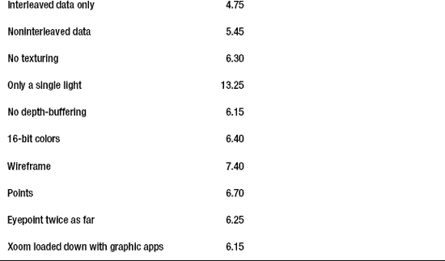

# 九、性能和材质

一盎司的表现抵得上几磅的承诺。

—西部

我动作太快了，以至于昨晚我在酒店房间里关掉了灯，在房间天黑之前就上床睡觉了。

—穆罕默德·阿里

在处理 3D 世界时，性能几乎总是一个问题，因为即使是简单的场景也需要密集的数学运算。如果你想渲染的只是一个动画旋转的三角形，上面有可爱的机器人，那么不要担心，但是如果你想展示宇宙，那么你会一直关注性能。

到目前为止，练习以一种相当清晰(我希望如此)但不一定有效的方式呈现。不幸的是，高效的代码很少是最清晰易懂的。现在，我们将开始研究稍微复杂一些的东西，看看如何将它集成到您的应用中。

在行业中，这些技巧被称为最佳实践。有些可能是显而易见的，但有些则不然。

### 顶点缓冲对象

性能增强的两个主要方面是最大限度地减少与图形硬件之间的数据传输，以及最大限度地减少数据本身。顶点缓冲对象(VBOs)是前一个过程的一部分。当你生成了你的几何图形，并愉快地将它发送出去显示时，通常的过程是告诉系统在哪里可以找到每个需要的数据块，允许使用哪些数据(顶点、法线、颜色和纹理坐标)，然后绘制它。每次调用`glDrawArrays()`或`glDrawElements()`时，所有的数据都必须打包并发送到图形处理单元(GPU)。每次数据传输都需要有限的时间，显然，如果一些数据可以缓存在 GPU 上，性能会得到提高。vbo 是在 GPU 上分配常用数据的一种方式，然后可以调用这些数据进行显示，而不必每次都重新提交数据。

创建和使用 VBOs 的过程对你来说应该很熟悉，因为它模仿了用于纹理的过程。首先生成一个“名称”，然后为数据分配空间，然后加载数据，然后在需要使用这些数据时使用`glBindBuffer()`。我将同时介绍的另一个实践是交错数据，如图 9–1 所示，在提交给 VBO 之前，我将首先做这件事。这可能会也可能不会有太大的区别，但如果驱动程序和 GPU 针对数据局部性进行了优化，交错阵列可能会有所帮助。

**图 9–1**。*数据排序。VBO 的例子使用了上面的格式，而下面的例子说明了数据交错。*

在我自己的测试中，我发现差异可以忽略不计。但是，仍然要在你的项目中记住交错；为它设计不会有什么坏处，因为未来的硬件可能会更好地利用它。参考列表 9–1 来看看行星的几何形状是如何交错的。

**清单 9–1。** *创建交错数组*

`**    private void** createInterleavedData()
    {
        **int** i;
        **int** j;
        **float**[] interleavedArray;
        **int** size;

        size=*NUM_XYZ_ELS*+*NUM_NXYZ_ELS*+*NUM_RGBA_ELS*+*NUM_ST_ELS*;

        interleavedArray=**new float**[size*m_NumVertices];

        **for**(i=0;i<m_NumVertices;i++)
        {
            j=i*size;

            //Vertex data

            interleavedArray[j+0]=m_VertexData.get();
            interleavedArray[j+1]=m_VertexData.get();
            interleavedArray[j+2]=m_VertexData.get();

            //Normal data

            interleavedArray[j+3]=m_NormalData.get();
            interleavedArray[j+4]=m_NormalData.get();
            interleavedArray[j+5]=m_NormalData.get();

            //cColor data

            interleavedArray[j+6]=m_ColorData.get();
            interleavedArray[j+7]=m_ColorData.get();
            interleavedArray[j+8]=m_ColorData.get();
            interleavedArray[j+9]=m_ColorData.get();

            //Texture coordinates

            interleavedArray[j+10]=m_TextureData.get();
            interleavedArray[j+11]=m_TextureData.get();
        }

        m_InterleavedData=*makeFloatBuffer*(interleavedArray);

        m_VertexData.position(0);
        m_NormalData.position(0);
        m_ColorData.position(0);
        m_TextureData.position(0);
    }`

这些都是不言自明的，但是请注意最后四行。它们会重置`FloatBuffer`对象的内部计数器，如果您想在其他地方使用任何单独的数据数组，就需要这样做。

清单 9–2 展示了我如何从行星数据中创建 VBO。由于大多数行星通常都是相同的形状，圆形，所以可以在 CPU 上缓存一个球体模型，并将其用于任何行星或卫星，除了 Demos 或 Hyperion 或 Nix 或 Miranda...或者任何看起来更像发霉土豆的小卫星。听到了吗，火卫一？我在和*你*说话！

**清单 9–2。** *为行星模型创建一个 VBO*

`**    public void** createVBO(GL10 gl)
    {
        **int** size=*NUM_XYZ_ELS*+*NUM_NXYZ_ELS*+*NUM_RGBA_ELS*+*NUM_ST_ELS*;

        createInterleavedData();

        GLES11.*glGenBuffers*(1,m_VertexVBO,0);                                      //1
        GLES11.*glBindBuffer*(GL11.*GL_ARRAY_BUFFER*, m_VertexVBO[0]);                 //2
        GLES11.*glBufferData*(GLES11.*GL_ARRAY_BUFFER*,size**FLOAT_SIZE**m_NumVertices,  //3
                  m_InterleavedData,GLES11.*GL_STATIC_DRAW*);
    }`

简单，嗯？注意 VBOs 直到 OpenGL ES 1.1 才出现，这就是为什么需要`GLES11`修改器的原因。

*   第 1 行生成了缓冲区的名称。因为我们只处理一个数据集，所以我们只需要一个。
*   接下来，我们将它绑定到第 2 行，使其成为当前的 VBO。要解除绑定，可以绑定一个 0。
*   来自交错阵列的数据现在可以发送到第 3 行中的 GPU。第一个参数是数据的时间，可以是`GL_ARRAY_BUFFER`也可以是`GL_ELEMENT_ARRAY_BUFFER`。前者用于传递顶点数据(包括颜色和法线信息)，后者用于传递索引连通性数组。但是由于我们使用的是三角形条带，所以不需要索引数据。

那么，我们如何使用 VBOs 呢？非常容易。看一下清单 9–3。

**清单 9–3。** *使用 VBOs 渲染星球*

`**    public void** draw(GL10 gl)
    {
        **int** startingOffset;
        **int** i;
        **int** maxDuplicates=10;                                                                                             //1
        **boolean** useVBO=**true**;                                                                                          //2

        **int** stride=(*NUM_XYZ_ELS*+*NUM_NXYZ_ELS*+*NUM_RGBA_ELS                      *//3
+*NUM_ST_ELS*)**FLOAT_SIZE*;

        GLES11.*glEnable*(GLES11.*GL_CULL_FACE*);
        GLES11.*glCullFace*(GLES11.*GL_BACK*);
        GLES11\. *glDisable* ( GLES11.*GL_BLEND*);
        GLES11.*glDisable*(GLES11.*GL_TEXTURE_2D*);

**        if**(useVBO)                                                                                                            //4
        {
            GLES11.*glBindBuffer*(GL11.*GL_ARRAY_BUFFER*, m_VertexVBO[0]);  //5

            GLES11.*glEnableClientState*(GL10.*GL_VERTEX_ARRAY*);                    //6

            GLES11.*glVertexPointer*(*NUM_XYZ_ELS*,GL11.*GL_FLOAT*,stride,0);

            GLES11.*glEnableClientState*(GL11.*GL_NORMAL_ARRAY*);
            GLES11.*glNormalPointer*(GL11.*GL_FLOAT*,stride,*NUM_XYZ_ELS***FLOAT_SIZE*);

            GLES11.*glEnableClientState*(GL11.*GL_TEXTURE_COORD_ARRAY*);

            GLES11.*glTexCoordPointer*(2,GL11.*GL_FLOAT*,stride,
                     (*NUM_XYZ_ELS*+*NUM_NXYZ_ELS*+*NUM_RGBA_ELS*)**FLOAT_SIZE*);

            GLES11.*glEnable*(GL11.*GL_TEXTURE_2D*);
            GLES11.*glBindTexture*(GL11.*GL_TEXTURE_2D*, m_TextureIDs[0]);
        }
        **else**
        {
            GLES11.*glBindBuffer*(GL11.*GL_ARRAY_BUFFER*,0);                                     //7

            m_InterleavedData.position(0);

            GLES11.*glEnableClientState*(GL10.*GL_VERTEX_ARRAY*);
            GLES11.*glVertexPointer*(*NUM_XYZ_ELS*,GL11.*GL_FLOAT*,stride,m_InterleavedData);

            m_InterleavedData.position(*NUM_XYZ_ELS*);

            GLES11.*glEnableClientState*(GL11.*GL_NORMAL_ARRAY*);
            GLES11.*glNormalPointer*(GL11.*GL_FLOAT*,stride,m_InterleavedData);

            m_InterleavedData.position(*NUM_XYZ_ELS*+*NUM_NXYZ_ELS*+*NUM_RGBA_ELS*);

            GLES11.*glEnableClientState*(GL11.*GL_TEXTURE_COORD_ARRAY*);
            GLES11.*glTexCoordPointer*(2,GL11.*GL_FLOAT*,stride,m_InterleavedData);
            GLES11.*glEnable*(GL11.*GL_TEXTURE_2D*);
            GLES11.*glBindTexture*(GL11.*GL_TEXTURE_2D*, m_TextureIDs[0]);
        }

        **for**(i=0;i<maxDuplicates;i++)                                                                                 //8
        {
                   GLES11.*glTranslatef*(0.0f,0.2f,0.0f);
                   GLES11.*glDrawArrays*(GL11.*GL_TRIANGLE_STRIP*, 0,
                            (m_Slices+1)*2*(m_Stacks-1)+2);
        }

        GLES11.*glDisable*(GL11.*GL_BLEND*);
        GLES11.*glDisable*(GL11.*GL_TEXTURE_2D*);
        GLES11.*glDisableClientState*(GL11.*GL_TEXTURE_COORD_ARRAY*);
        GLES11.*glBindBuffer*(GL11.*GL_ARRAY_BUFFER*,0);

        m_VerticesPerUpdate=maxDuplicates*m_NumVertices;
    }`

渲染 VBOs 非常简单，只有一个简单的“嗯？”在这个过程中。我已经决定在所有的调用前面加上前缀`GLES11`,只是为了好看。不是所有的套路都需要。

*   第 1 行和第 2 行让您配置用于测试目的的例程。`maxDuplicates`是星球被渲染的次数。`useVBO`可以关闭 VBO 处理，仅使用交错数据进行性能比较。
*   请记住，第 3 行中的跨距值表示任意数组中从顶点到顶点的字节数。这对于交叉存取数据来说是必不可少的，例如，相同的数组可以用于顶点位置和颜色。跨距只是告诉系统在找到下一个顶点之前要跳过多少字节。
*   第 4 行将打开实际的 VBO 设置代码。第 5 行以与绑定纹理相同的方式绑定它，使它成为当前使用的对象，直到另一个对象被绑定或者这个对象与`glBindBuffer(GL_ARRAY_BUFFER, 0);`解除绑定。
*   线 6ff 启用各种数据缓冲器，如之前的`draw()`方法所做的那样。一个主要的区别可以从各种`glEnable*Pointer()`调用的最后一个参数中看出。在正常情况下，你传递一个指针或引用给它们。然而，当使用 VBOs 时，指向数据块的各种“指针”是从第一个元素的偏移，它总是从零“地址”开始，而不是从应用自己的地址空间中的一开始。这意味着在我们的例子中，顶点指针从地址 0 开始，而法线就在顶点之后，颜色是跟随法线的纹理坐标。这些值从数据开始以字节表示。
*   第 7 行突出显示了另一部分。这里我们只使用交叉存取的数据，并以更传统的方式将其传递给指针例程。这允许您查看从交叉存取数据中获得了什么性能增强(如果有的话)。
*   第 8 行之后的部分通过`maxDuplicates`调用循环到`glDrawArrays()`。值为 10 时效果很好。

当谈到优化代码时，我是一个需要确信某个特定的技巧会起作用的人。否则，我可能会花很多时间做一些事情来增加 0.23%的帧速率。一个游戏程序员可能会觉得这是一种荣誉，但我觉得它通过将注意力转移到可能不会有太大影响的东西上，从我的用户那里偷走了可选的新功能或错误修复。因此，我开发了一个简单的测试程序。

该程序简单地绘制了十个行星地球并旋转它们，如图 Figure 9–2 所示。球体由 100 个堆栈和 100 个切片组成，每个球体有 20，200 个顶点。我使用同一个实例，,所以我只需要在程序启动时加载一次 GPU。如果没有 VBOs，相同的模型将被加载十次。

**图 9–2。** *巨型计算机生成的母猪虫。或者十个地球互相堆叠在一起。*

现在，您可以向您的`onDrawFrame()`处理程序添加一个帧速率计算器，看看会发生什么。我自己的设置使用的是第一代摩托罗拉 Xoom，下面是一些基本的测试，这些测试应该让我对 Xoom/Java 平台与其他类似价格范围的平台相比表现如何有一个大致的了解。

**注意:**我自己的设置使用的是第一代摩托罗拉 Xoom，它支持 NVIDIA Tegra 2 GPU。截至本文撰写时，苹果的所有 iOS 设备都使用 Imagination Technologies 制造的 PowerVR 系列芯片；三星的 Galaxy Tab 和黑莓的 Playbook 也是如此。去你的 GPU 制造商的开发者部门可能是值得的。Imagination Tech 和 NVIDIA 都有优秀的 notes、SDK 和 demos，可以充分利用各自的硬件。

基线配置打开了纹理，三个灯，具有深度缓冲的 32 位颜色，在 5 个单位之外的视点上混合，并且视场设置为 30 度。结果相当令人惊讶，如表 9–1 所示。

在这种情况下，最大的 CPU 消耗是灯光，因为只要关掉三盏灯中的两盏灯，帧速率就会翻倍。在第十章中，你会看到如何管理引擎盖下的照明，这会更有意义。关闭深度缓冲和纹理对从 32 位降到 16 位颜色几乎没有影响。

另一个令人惊讶的结果是交错数据格式似乎实际上降低了性能！选择为每种数据类型使用单独的离散缓冲区,“老方法”稍微加快了速度。移开视点减少了要处理的像素数量，但几乎没有增加帧速率。这表明 GPU 并没有受到像素的限制，主要的性能问题是实际的顶点计算。很有可能 Java 肯定会在这方面发挥很大的作用。作为语言相关问题的部分解决方案，Android 还提供了一个本地开发包(NDK)。

NDK 旨在让开发人员将他们的性能关键代码放在 Java 层之下，放入 C 或 C++ 中，使用 JNI 在两个世界之间来回移动。(*性能关键型*可能包括图像处理或大型系统建模。)OpenGL 将针对您使用的任何级别进行优化，因此在纯 OpenGL 比较中，您可能会看到很少的改进。除此之外，即使在网上快速搜索，也会发现许多开发人员创建了比较这两种环境的测试，几乎所有测试都显示，对于数学密集型任务，性能显著提高了 30 倍或更多。但是当然，由于驱动程序、操作系统、GPU 或编译器问题，您的收益可能会有所不同。

### 配料

尽可能多地批处理依赖于相同状态的操作，因为改变系统状态(通过使用`glEnable()`和`glDisable()`调用)代价很高。OpenGL 不会在内部检查某个特定的特性是否已经处于您想要的状态。在本书的练习中，我会比我可能需要的更频繁地设置状态，以确保行为是容易预测的。但是对于商业的、性能密集型的应用，在发布版本中尽量去掉多余的调用。

此外，尽可能批处理您的绘图调用。

### 纹理

一些纹理优化技巧已经被提出，比如小中见大贴图。其他的只是简单的常识:纹理占用大量的内存。使它们尽可能小，并在需要时重复使用。此外，在加载之前设置任何图像参数，因为它们是一个提示，告诉 OpenGL 如何在发送到硬件之前优化信息。

首先绘制不透明的纹理，避免使用半透明的 OpenGL ES 屏幕。

### 雪碧床单

当介绍在 OpenGL 环境中显示文本时，在第八章中简要提到了精灵表(或纹理图谱)。Figure 9–3 展示了一个 sprite 工作表在屏幕上显示文本时的样子。

**图 9–3。***24 点铜板用雪碧片*

这张特殊的图片是使用一个名为 LabelAtlasCreator 的免费工具为 Mac 制作的，而不是在第八章中使用的 CBFG 工具。除了图像文件之外，它还会生成一个 Apple 的 plist 格式的方便的 XML 文件，其中包含所有易于转换为纹理空间的放置细节。

但是不要停留在字体上，因为精灵表也可以在你有一个志同道合的图像家庭的任何时候使用。从一种纹理切换到另一种纹理会导致大量不必要的开销，而 sprite sheet 充当了一种纹理批处理的形式，节省了大量的 GPU 时间。查看 OS X 兼容的 Zwoptex 工具或 TexturePacker，它用于通用图像。

### 纹理上传

将纹理复制到 GPU 可能非常昂贵，因为它们必须由芯片重新格式化才能使用。对于较大的纹理，这可能会导致显示不连贯。因此，确保从一开始就用`glTexImage2D`加载它们。一些 GPU 制造商，如苹果产品所用芯片的制造商 Imagination Technologies，有自己的专有图像格式，针对自己的硬件进行了微调。当然，在日益碎片化的 Android 市场，你将不得不在运行时嗅出你的用户有什么芯片，并在那时处理任何特殊需求。

### mipmap

除了 2D 未缩放的图像，一定要使用小中见大贴图。是的，它们确实使用了更多的内存，但是当你的对象在远处时，更小的小贴图可以节省很多周期。建议您使用`GL_LINEAR_MIPMAP_NEAREST`，因为它比`GL_LINEAR_MIPMAP_LINEAR`快(参考表 5-3 )，尽管图像保真度稍低。

### 颜色变少

其他建议可能包括较低分辨率的颜色格式。许多图像在 16 位和 32 位下看起来几乎一样好，特别是如果没有 alpha 蒙版的话。Android 的默认格式是一直流行的 RGB565，这意味着它有 5 位红色，6 位绿色，5 位蓝色。(绿色得到了加强，因为我们的眼睛对它最敏感。)其他 16 位格式包括 RGBA5551 或 RBGA4444。在遥远的太阳上，我的灰度星座作品只有 8 位，减少了 75%的内存使用。如果我想让它与特定的主题相匹配，我会让 OpenGL 来完成这项工作。通过适当的工具和仔细的调整，一些 16 位纹理几乎与 32 位纹理无法区分。

Figure 9–4 展示了 TexturePacker 创建的四种格式，从左到右从高到低排列。图 1 显示了我们一直使用的真彩色纹理，有时称为 RGBA8888。图片 2 使用默认的 RGB565 格式，考虑到其他因素，看起来还是很不错的。图 9–4 中的图像 3 使用 RGBA5551，分配一个 1 位 alpha 通道(注意绿色的额外位与之前的纹理相比有多大区别)，图像 4 是最低质量的，使用 RGBA4444。TexturePacker 还支持第五章中引用的 PVRTC 文件类型。

**注意:**PowerVR 芯片的制造商 Imagination Technologies Ltd .提供了一个替代(免费)工具。它的纹理模式与 TexturePacker 相同，但不像 TexturePacker 那样创建 sprite 表。请注意，它使用 X11 作为 UI，其外观看起来像 Windows NT。前往`[www.imgtec.com](http://www.imgtec.com)`并在开发者部分下寻找 PowerVR Insider 工具。寻找 PVRTexTool。

压缩后效果最好的图像是那些调色板严重依赖光谱的一个或两个部分的图像。你的颜色越多样，就越难减少人为因素。Hedly 的图像比地球的纹理图更好，因为前者主要是灰色和绿色，而后者是由绿色、棕色、灰色(极地)和蓝色组成的。

**图 9–4。** *纹理 1，32 位；纹理 2，RGB565 纹理 3，RGBA555 纹理 4，RGBA:4444*

### 其他要记住的提示

以下是一些需要记住的有用提示:

*   尽管多采样抗锯齿在平滑图像方面非常有用，但它意味着性能部门的突然死亡，将帧速率降低 30%或更多。所以，你一定很需要用它。
*   避免使用`GL_ALPHA_TEST`。这是从来没有涵盖，但它也可以杀死性能一样多的 MSAA。
*   当转到后台时，确保停止动画并删除任何容易重新创建的资源。
*   任何从系统返回信息的调用(主要是`glGet*`系列调用)都会查询系统的状态，包括容易被忽略的`glGetError()`。其中许多命令会强制执行任何以前的命令，然后才能检索状态信息。
*   使用尽可能少的灯光，通过关闭补光灯和环境光，只使用一个灯光(太阳)。

    不从 CPU 访问帧缓冲区。应该避免像`glReadPixels()`这样的调用，因为它们会迫使帧缓冲区刷新所有排队的命令。

上述提示仅代表最基本的推荐做法。真正的图形大师们在他们的实用工具中有许多神秘的技巧，简单的谷歌搜索就可能揭示出来。

### 总结

本章描述了让你的 OpenGL 应用真正运行的基本技巧和最佳实践。VBOs 将通过在 GPU 上保留常用的几何图形来降低总线的饱和度。将状态改变和`glGet*`调用减少到最少也能显著提高渲染速度。

在第十章中，你会学到一些关于 OpenGL ES 2.0 和那些最近风靡孩子们的神秘着色器的东西。