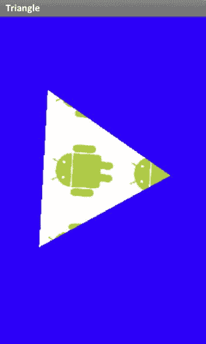
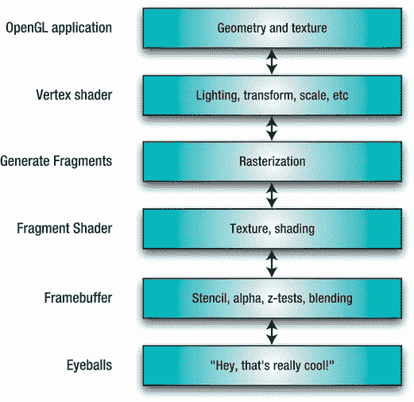
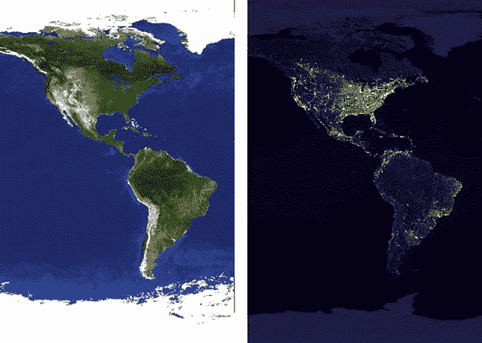
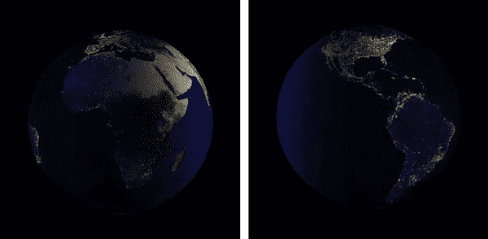
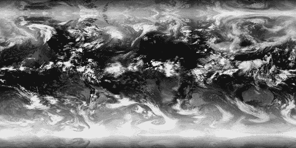
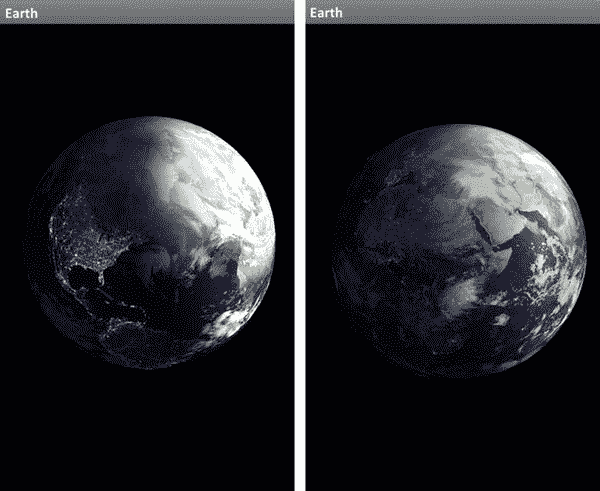
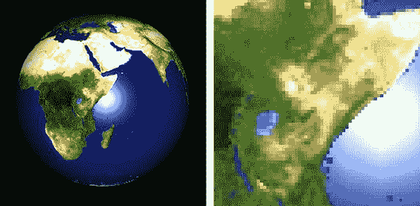
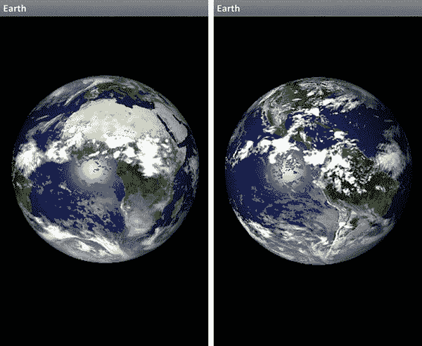

# 十、OpenGL ES 2、着色器以及其它

> 她的天使的脸，像天上的大眼睛一样明亮，在阴暗的地方照出了阳光。

-埃德蒙史宾塞

Android 设备上有两个不同版本的 OpenGL ES 图形库。这本书主要讨论了更高层次的版本，即 OpenGL ES 1，有时也称为 1.1 或 1。 *x* 。第二个版本是一个相当容易混淆的名字 OpenGL ES 2。第一个是两个中最容易的一个；它附带了各种各样的助手库，为你做大量的 3D 数学和所有的照明、着色和阴影。版本 2 避开了所有这些细节，有时被称为“可编程功能”版本，而不是其他的“固定功能”设计。这通常被真正的像素操纵者嘲笑，他们更喜欢控制他们的图像，通常保留给沉浸式 3D 游戏环境，其中每个小的视觉脚注都被强调。为此，OpenGL ES 2 发布了。

第 1 版相对来说更接近于桌面版的 OpenGL，使得移植应用，尤其是老式的应用，比让獾啃掉你的脸要轻松一些。之所以省略这些内容，是为了在资源有限的设备上保持较小的占用空间，并确保尽可能好的性能。

第二版完全摒弃了兼容性，专注于主要针对娱乐软件的面向性能的特性。被遗漏的东西有`glRotate(), glTranslate()`，矩阵堆栈操作，等等。但是我们得到的回报是一些令人愉快的小东西，比如通过使用*着色器*的可编程流水线。幸运的是，Android 自带矩阵和向量库(`android.opengl.Matrix`)，这应该会使任何代码迁移变得更容易一些。

这个主题太大了，无法在一章中涵盖(它通常被归入整本书)，但接下来的概述应该会让您对着色器及其使用有一个良好的感觉，以及它们是否是您想要在某个时候解决的问题。

### 阴影管线

如果你对 OpenGL 或 Direct3D 稍有了解，仅仅提到术语*着色器*可能会让你不寒而栗。它们似乎是神秘的护身符，属于最神秘的图形圣职圈。

并非如此。

版本 1 的“固定功能”管道是指顶点和片段的照明和着色。例如，您最多可以拥有八个灯光，每个灯光都有不同的属性。灯光照亮表面，每个表面都有自己的属性，称为*材质*。结合这两者，我们得到了一个相当好的，但有限制的，通用的照明模型。但是如果你想做一些不同的事情呢？如果你想让一个表面根据它的相对照度渐变到透明，那该怎么办呢？如果你想精确地模拟阴影，比如说，土星的光环，投射在云层上，或者日出前你看到的苍白的冷光，那该怎么办？鉴于固定函数模型的局限性，所有这些都几乎是不可能的，尤其是最后一个模型，因为一旦你开始考虑大气中的水分、反向散射等等的影响，照明方程就非常复杂。好吧，一个可编程的管道，让你不需要使用任何技巧，如纹理组合器，就可以模拟那些精确的方程，这正是版本 2 给我们的。

#### 阴暗的三角形

我将从安装 Eclipse 和 Android SDK 时应该已经安装的 Android 示例项目开始。您应该在诸如`samples/android-10`的目录中找到它们。寻找巨大的 ApiDemo。编译时，它会给你一个冗长的菜单，演示从 NFC 到通知的一切。向下滚动到图形部分，并导航到 OpenGL ES/OpenGL ES2.0 演示。这显示了一个简单的旋转和纹理三角形，如图 Figure 10–1 所示。

**图 10–1。***Android SDK 的着色器实例*

那么，这是怎么做到的呢？

ES 2 的流水线架构允许你在几何处理中有两个不同的访问点，如图 Figure 10–2 所示。第一个将每个顶点以及各种属性(例如，xyz 坐标、颜色、不透明度)信息交给您控制。这被称为*顶点着色器*。此时，由您来决定这个顶点应该是什么样子，以及它应该如何与所提供的属性一起呈现。完成后，顶点被送回硬件，用你计算的数据栅格化，并作为 2D 位传递给你的*片段*(或像素)着色器。在这里，您可以根据需要组合纹理，进行任何最终处理，并将其传递回系统，最终在帧缓冲区中进行渲染。

如果这听起来像是对场景中以 60 fps 的速度咆哮的每个对象的每个片段做了大量的工作，那么你是对的。但从根本上说，着色器是实际加载并运行在图形硬件本身上的小程序，因此速度非常快。

**图 10–2。***OpenGL ES 2 架构概述*

#### 着色器结构

顶点和片段着色器在结构上是相似的，看起来有点像一个小的 C 程序。在 C 语言中，入口点总是被称为`main()`，而语法也非常类似 C 语言。

着色器语言称为 GLSL(不要与它的 Direct3d 对应物 HLSL 混淆)，包含一组丰富的内置函数，属于三个主要类别之一:

*   面向图形处理的数学运算，如矩阵、向量、三角函数、导数和逻辑函数
*   纹理采样
*   小型辅助工具，如模、比较和赋值器

值在以下类型的着色器之间来回传递:

*   *制服*，是调用程序传过来的值。这些可能包括变换矩阵或投影矩阵。它们在顶点和片段着色器中都可用，并且必须在每个地方声明为相同的类型。
*   *可变变量*(是的，是个听起来很哑的名字)，是在顶点着色器中定义的变量，传递给片段着色器。

变量既可以定义为通常的数字原语，也可以定义为基于向量和矩阵的面向图形的类型，如 Table 10–1 所示。

除此之外，您还可以提供修饰符来定义基于 int 和基于 float 的类型的精度。这些可以是 highp (24 位)、mediump (16 位)或 lowp (10 位)，默认为 highp。所有的变换都必须在 highp 中完成，而颜色只需要在 mediump 中完成。(不过，我不明白为什么 bools 没有精度限定符。)

任何基本类型都可以声明为常量变量，比如`const float x=1.0`。

结构也是允许的，看起来就像它们的 C 对应物。

#### 限制

由于着色器驻留在 GPU 上，它们自然有许多限制，从而限制了它们的复杂性。它们可能受到“指令计数”、允许的统一数量(通常为 128)、临时变量数量以及循环嵌套深度的限制。不幸的是，在 OpenGL ES 上，没有真正的方法从硬件中获取这些限制，所以你只能知道它们的存在，并使你的着色器尽可能小。

顶点着色器和片段着色器之间也存在差异。例如，highp 支持在片段着色器上是可选的，而在顶点着色器上是强制的。呸。

### 回到旋转的三角形

所以，现在让我们跳回三角形的例子，分解一个基本的 OpenGL ES 2 程序是如何构造的。正如您将看到的，生成着色器的过程与生成大多数其他应用没有什么不同。您已经有了基本的编译、链接和加载序列。清单 10–1 展示了这个过程的第一部分，编译。

**注意:**清单 10–1 中的代码来自 ApiDemo 包中名为`GLES20TriangleRenderer.java`的 Android 示例。

**清单 10–1**。*编译一个着色器*

`    private int createProgram(String vertexSource, String fragmentSource) {     //1
        int vertexShader = loadShader(GLES20.*GL_VERTEX_SHADER*, vertexSource);   //2
        if (vertexShader == 0) {
            return 0;
        }

        int pixelShader = loadShader(GLES20.*GL_FRAGMENT_SHADER*, fragmentSource);
        if (pixelShader == 0) {
            return 0;
        }

        int program = GLES20.*glCreateProgram()**;                                   *//3
        if (program != 0) {
            GLES20.*glAttachShader*(program, vertexShader);                         //4
            GLES20.*glAttachShader*(program, pixelShader);
            GLES20.*glLinkProgram*(program);                                        //5
            int[] linkStatus = new int[1];
            GLES20.*glGetProgramiv*(program, GLES20.*GL_LINK_STATUS*, linkStatus, 0); //6
            if (linkStatus[0] != GLES20.*GL_TRUE*) {
                Log.*e*(*TAG*, "Could not link program: ");
                Log.*e*(*TAG*, GLES20.*glGetProgramInfoLog*(program));
                GLES20.*glDeleteProgram*(program);
                program = 0;
        }
    }
        return program;                                                         //7
    }

private int loadShader(int shaderType, String source) {
        int shader = GLES20.*glCreateShader*(shaderType);                         //8
        if (shader != 0) {
            GLES20.*glShaderSource*(shader, source);                              //9
            GLES20.*glCompileShader*(shader);                                     //10
            int[] compiled = new int[1];
            GLES20.*glGetShaderiv*(shader, GLES20.*GL_COMPILE_STATUS*, compiled, 0);//11
            if (compiled[0] == 0) {
                Log.*e*(*TAG*, "Could not compile shader " + shaderType + ":");
                Log.*e*(*TAG*, GLES20.*glGetShaderInfoLog*(shader));
                GLES20.*glDeleteShader*(shader);
                shader = 0;
        }
    }
        return shader;                                                          //12
    }`

在前面的例子中，`createProgram()`是从您的`onSurfaceCreated()`方法中调用的，这里完成了给定应用的大部分初始化工作。那么，让我们来追溯一下到底发生了什么:

*   在`createProgram()`的参数列表中，如第 1 行所示，来自两个着色器的实际可执行代码的字符串被传递。您可以这样做，或者将它们作为文本文件读入。清单 10–2 有两个着色器，稍后会讨论。
*   行 2ff 为两个程序调用`loadShader()`并返回各自的句柄。
*   第 3 行创建了一个空的程序对象。这托管两个着色器并执行兼容性检查。
*   第 4f 行将两个着色器都附加到程序。
*   链接出现在第 5 行。建议检查任何可能的错误，如下所示。不仅仅是一个错误代码，GLSL 还会返回非常好的消息，比如:`ERROR: 0:19: Use of undeclared identifier 'normalX'`
*   如果一切正常，我们可以在第 7 行返回程序。
*   第 8ff 行中定义的`loadShader()`，执行实际的编译。它首先获取原始源文本，并使用`glCreateShader()`创建指定类型的着色器(顶点或片段)。这将返回一个空对象，然后通过第 9 行的`glShaderSource()`将其绑定到源文本。
*   第 10 行编译实际的着色器，第 11ff 行像以前一样进行错误检查，而第 12 行返回经过验证和编译的对象。

如果你想进一步检查你的着色器代码，你可以用`glValidateProgram()`来“验证”它。验证是 OpenGL 实现者返回关于代码任何方面的信息的一种方式，比如推荐的改进。您将主要在开发过程中使用它。

着色器现在可以使用了。当在它们和您的调用代码之间来回传递值时，您可以随时指定使用哪一个。这个稍后会讲到。现在，让我们仔细看看这两个演示着色器。这个例子的作者选择将着色器文本定义为一个大的静态字符串。其他人选择从文件中读取它们。但是在这种情况下，我将它们从原来的字符串重新格式化，使它们更具可读性。清单 10–2 涵盖了着色器对的前半部分。

**清单 10–2。** *顶点着色器*

`        uniform mat4 uMVPMatrix;                                      //1
        attribute vec4 aPosition;                                     //2
        attribute vec2 aTextureCoord;
        varying vec2 vTextureCoord                                    //3
        void main                                                     //4
        {
            gl_Position = uMVPMatrix * aPosition;                     //5
            vTextureCoord = aTextureCoord;                            //6
        }`

现在仔细看看:

*   第 1 行定义了从调用程序传入的 4x4 模型/视图/透视矩阵 *uniform* 。如果你想在一个着色器或者更高的层次上执行实际的变换，这确实是一个风格的问题。并且注意，制服必须在着色器中实际使用，而不仅仅是声明；否则，如果您的调用程序试图引用它，将会失败。
*   第 2f 行声明了我们也在调用代码中指定的属性。请记住，属性是直接映射到每个顶点的数据数组，仅在顶点着色器中可用。在这种情况下，它们是顶点(被称为术语*位置*)及其对应的纹理坐标。对每个顶点调用一次着色器。
*   第 3 行声明了纹理坐标的一个*变量*。
*   与好的 ol' C 一样，入口点是 a `main()`，如第 4 行所示。
*   在第 5 行，位置(顶点)乘以矩阵。您可以在着色器中或调用软件中完成此操作，这是更传统的方法。
*   最后，第 6 行只是将纹理坐标复制到其变化的副本，这样它就可以被片段着色器拾取。

现在真正的魔术发生在片段着色器中，如清单 10–3 所示。

**清单 10–3。** *片段着色器*

`        precision mediump float;                                                //1
        varying vec2 vTextureCoord;                                             //2

        uniform sampler2D sTexture;                                             //3

        void main()
        {
            gl_FragColor = texture2D(sTexture, vTextureCoord);                  //4
        }`

*   如前所述，您可以通过第 1 行指定着色器的精度。
*   第 2 行声明了变量`vTextureCoord`。所有变量必须在两个着色器中声明；否则，它将生成一个错误。此外，片段着色器中的变量是只读的，而它们在顶点着色器中是可读/写的。
*   第 3 行声明了一个`sampler2D`对象。采样器是内置的制服，用于将纹理信息传递到片段着色器。其他采样器包括`sampler1D`和`sampler3D`。
*   第 4 行的`gl_FragColor`是一个内置变量，用于将片段的最终颜色传回系统进行显示。在这种情况下，我们只是传回由`vTextureCoord`定义的特定点的纹理颜色。如果你想做更有趣的事，你可以在这里做。例如，您可以去掉蓝色和绿色部分，只留下红色层来显示，添加运动模糊或演示大气反向散射。

在我们可以使用着色器之前，我们需要在创建程序后立即获得着色器内制服和属性的“位置”或句柄，如前所述。这些用于将任何数据从调用方法传递给 GPU。清单 10–4 显示了`onSurfaceCreated()`中用于旋转三角形的过程。

**清单 10–4。** *获取制服和属性的句柄*

`    public void onSurfaceCreated(GL10 glUnused, EGLConfig config)
    {
        mProgram = createProgram(mVertexShader, mFragmentShader);                  //1
        if (mProgram == 0) {
            return;
        }
        maPositionHandle = GLES20.*glGetAttribLocation*(mProgram, "aPosition");      //2
        if (maPositionHandle == -1) {
            throw new RuntimeException("Could not get attrib location for aPosition");
        }
        maTextureHandle = GLES20.*glGetAttribLocation*(mProgram, "aTextureCoord");   //3
        if (maTextureHandle == -1) {
            throw new RuntimeException("Could not get attrib location for
                aTextureCoord");
        }

        muMVPMatrixHandle = GLES20.*glGetUniformLocation*(mProgram, "uMVPMatrix");   //4
        if (muMVPMatrixHandle == -1) {
            throw new RuntimeException("Could not get attrib location for uMVPMatrix");
        }
    }`

第 1 行、第 2 行和第 3 行使用着色器内部的实际名称获得属性的句柄。第 4 行获得矩阵的统一句柄。所有四个句柄都被保存起来，供调用程序的主处理循环使用。传入的`GL10`接口被忽略，代替了`GLES20`类的静态方法。

**注意:**您可以获取 OpenGL 定义的对象位置，也可以在链接前自行设置。后一种方法使您可以确保在代码中的整个着色器系列中，类似的统一或属性都利用相同的句柄。

现在剩下的唯一一件事就是执行一个着色器程序，并将任何数据传递给它。清单 10–5 展示了三角形的整个`onDrawFrame()`方法来演示这一点。

**清单 10–5。** *调用和使用着色器*

`    public void onDrawFrame(GL10 glUnused)                                      //1
    {
        GLES20.*glClearColor*(0.0f, 0.0f, 1.0f, 1.0f);                            //2
        GLES20.*glClear*( GLES20.*GL_DEPTH_BUFFER_BIT* | GLES20.*GL_COLOR_BUFFER_BIT*);
        GLES20.*glUseProgram*(mProgram);                                          //3

        GLES20.*glActiveTexture*(GLES20.*GL_TEXTURE0*);                             //4
        GLES20.*glBindTexture*(GLES20.*GL_TEXTURE_2D*, mTextureID);                 //5
        mTriangleVertices.position(*TRIANGLE_VERTICES_DATA_POS_OFFSET*);          //6
        GLES20.*glVertexAttribPointer*(maPositionHandle, 3, GLES20.*GL_FLOAT*, false, //7
                *TRIANGLE_VERTICES_DATA_STRIDE_BYTES*,  mTriangleVertices);
        GLES20.*glEnableVertexAttribArray*(maPositionHandle);                     //8

        mTriangleVertices.position(*TRIANGLE_VERTICES_DATA_UV_OFFSET*);           //9
        GLES20.*glVertexAttribPointer*(maTextureHandle, 2, GLES20.*GL_FLOAT*, false,//10
                *TRIANGLE_VERTICES_DATA_STRIDE_BYTES*, mTriangleVertices);
        GLES20.*glEnableVertexAttribArray*(maTextureHandle);                      //11

        long time = SystemClock.*uptimeMillis*() % 4000L;
        float angle = 0.090f * ((int) time);
        Matrix.*setRotateM*(mMMatrix, 0, angle, 0, 0, 1.0f);                      //12
        Matrix.*multiplyMM*(mMVPMatrix, 0, mVMatrix, 0, mMMatrix, 0);
        Matrix.*multiplyMM*(mMVPMatrix, 0, mProjMatrix, 0, mMVPMatrix, 0);

        GLES20.*glUniformMatrix4fv*(muMVPMatrixHandle, 1, false, mMVPMatrix, 0);  //13
        GLES20.*glDrawArrays*(GLES20.*GL_TRIANGLES*, 0, 3);                         //14
    }`

现在，让我们来分解一下:

*   `onDrawFrame()`的参数是 GL10 对象。但是由于这是一个 OpenGL ES2 应用，GL10 句柄代替静态函数被忽略。
*   第 2f 行只是清除屏幕的标准内容。
*   第 3 行是有趣的开始。打开你当时可能想要的任何着色器。你需要多少就有多少，在它们之间自由跳跃。
*   我们要传递给片段着色器的纹理在第 4 行指定，并由`sampler2D`对象拾取。此代码代表 GPU 上使用的实际纹理单元。
*   第 5 行将本地纹理句柄绑定到这个单元。
*   第 6 行通过将三角形顶点数组对象的内部位置索引设置为实际顶点 xyz 值的起始点，来准备实际的三角形顶点数组对象。
*   现在我们终于可以把一些东西交给着色器了，如第 7 行所示。在这种情况下，顶点数据通过`glVertexAtttribPointer()`被发送到着色器，它接受位置属性的句柄`maPosition`；数据的类型，`stride`；和指向所述数据的指针。第 8 行允许使用数组。
*   第 9、10 和 11 行对纹理坐标做了同样的处理。
*   第 12ff 行使用 Android 自己的矩阵库(`android.opengl.Matrix`)执行旋转和投影，因为 OpenGL ES 2 没有`glRotate` / `glTranslate` / `glScale`函数。否则，你需要写你自己的数学库。
*   我们现在可以将之前矩阵操作的结果传递给顶点着色器，使用`glUniformMatrix4fv` `()`和我们之前获得的矩阵句柄。
*   现在在最后一行，我们称我们的老朋友为`glDrawArrays()`。

所以，你有它。一个“简单的”基于着色器的程序。还不算太糟，是吧？现在我们可以重温我们蹩脚的太阳系模型，并展示如何使用着色器来使它不那么蹩脚。

### 夜晚的地球

你熟悉用于地球表面的日光图像(图 10–3，左)，但你可能也见过类似的地球夜晚图像(图 10–3，右)。如果我们可以在地球的黑暗面显示夜晚纹理，而不仅仅是常规纹理贴图的黑暗版本，那将会是一件好事。

**图 10–3**。*白天的地球对夜晚的地球*

在 OpenGL 1.1 下，如果不是不可能完成的话，这将是非常棘手的。算法应该相对简单:渲染地球两次，一次用白天的图像，一次用夜晚的图像。然后根据光照改变日光侧地球纹理的日光侧 alpha 通道。当照度达到 0 时，它是完全透明的，夜晚部分显示通过。然而，在 OpenGL ES 2 下，您可以非常容易地对着色器进行编码，以几乎完全匹配算法。(你也可以渲染地球一次，同时提供两种纹理。这项技术将在下一个练习中介绍)。

该程序的结构类似于前面的任何一个程序，有一个“活动”文件、一个渲染器，在本例中还有一个`Planet`对象。

第一个例子很好，你可能会想，“但是我们实际上如何命令 OpenGL 使用 2。*x*stuff vs . 1 . x？”清单 10–6 给出了答案。

首先我们需要检测设备是否真的支持 OpenGL ES 2。新的肯定会，但旧的可能不会。iPhone 直到 iOS 3.0 才得到它。这是通过检索配置信息包的`getSystemService()`方法完成的。如果通过了，只需简单地调用`GLSurfaceView()` `.setEGLContextClientVersion(2)`就可以了。

**清单 10–6。**调用 OpenGL ES 2

`    private boolean detectOpenGLES20()
    {
         ActivityManager am =
            (ActivityManager) getSystemService(Context.*ACTIVITY_SERVICE*);

         ConfigurationInfo info = am.getDeviceConfigurationInfo();
         return (info.reqGlEsVersion >= 0x20000);
    }

    protected void onCreate(Bundle savedInstanceState)
    {
        super.onCreate(savedInstanceState);
        GLSurfaceView view = new GLSurfaceView(this);

        if (detectOpenGLES20())
        {
               view.setEGLContextClientVersion(2);
        view.setEGLConfigChooser(8,8,8,8,16,1);
               view.setRenderer(new SolarSystemRendererES2(this));

                 setContentView(view);
        }  
    }`

接下来，地球需要以通常的方式生成。这个实例将使用 50 个切片和 50 个堆栈，同时获取两个纹理，如清单 10–7 所示。

**清单 10–7。** *初始化地球*

`    private void initGeometry(GL10 glUnused)
    {
       String extensions = GLES20.*glGetString*(GL10.*GL_EXTENSIONS*);

       m_DayTexture=createTexture(glUnused, m_Context,
               book.SolarSystem.R.drawable.*earth_light*);
       m_NightTexture=createTexture(glUnused, m_Context,
               book.SolarSystem.R.drawable.*earth_night*);

       m_Earth = new Planet(50, 50, 1.0f, 1.0f, glUnused, myAppcontext,true,-1);
    }`

`onSurfaceCreated()`方法在调用`initGeometry()`的同时加载并初始化两组着色器，如清单 10–8 所示。

**清单 10–8。** *加载着色器*

`    public void onSurfaceCreated(GL10 glUnused, EGLConfig config)
    {
         int program;

         m_DaysideProgram=createProgram(m_DaySideVertexShader,m_DaySideFragmentShader);
         m_NightsideProgram=createProgram
            (m_NightSideVertexShader,m_NightSideFragmentShader);

         initGeometry(glUnused);

         Matrix.*setLookAtM*(m_WorldMatrix, 0, 0, 5f, -2, 0f, 0f, 0f, 0.0f, 1.0f, 0.0f);    
    }`

与前面的例子没有太大的不同，但是它有更多的制服和属性需要处理。下面，为法线提供了一个新的属性，这样我们可以处理光照。在本例中，我们将特定的标识符绑定到每个属性，以便我们可以确保两组着色器使用相同的值。它有时会让事情变得简单一点。而这个*必须在链接前*完成。

` GLES20\. glBindAttribLocation(*program, ATTRIB_VERTEX, "aPosition");
 GLES20\. glBindAttribLocation(*program, ATTRIB_NORMAL, "aNormal");
 GLES20\. glBindAttribLocation(*program, ATTRIB_TEXTURE0_COORDS, "aTextureCoord");`

除了用于模型/视图/投影矩阵的制服之外，还有两个新制服需要处理。与前面的例子不同，我们仍然必须在链接后获取位置，所以不能保证它们的位置在程序的其他实例中是在相同的位置，除非程序有相同的变量集。在这里，我将所有统一的句柄缓存到一个数组中，该数组应该适用于两组着色器。新制服是为普通矩阵和光位置准备的。(对于非常简单的模型，你可以在顶点着色器中硬编码灯光的位置。)

`m_UniformIDs[*UNIFORM_MVP_MATRIX*]=GLES20.*glGetUniformLocation*(program,
                                "uMVPMatrix") ;
m_UniformIDs[*UNIFORM_NORMAL_MATRIX*]=GLES20.*glGetUniformLocation*(program,
                                "uNormalMatrix");
m_UniformIDs[*UNIFORM_LIGHT_POSITION*]=GLES20.*glGetUniformLocation*(program,
                                "uLightPosition");;`

因此，添加新制服的流程如下:

1.  在着色器中声明(即`uniform vec3 lightPosition;`)。
2.  使用`glGetUniformLocation()`获取其“位置”。它只返回该会话的唯一 ID，然后在设置或从着色器获取数据时使用该 ID。(或使用`glBindAttribLocation`指定具体的位置值。)
3.  使用众多`glUniform*()`调用中的一个来动态设置值。

自然，球体生成器也需要做一些修改。利用上一章的交错数据示例，新的`draw()`方法看起来类似于清单 10–9。

**清单 10–9。**?? 中兼容 OpenGL ES 2 的绘制方法`Planet.java`

`    public void draw(GL10 gl,int vertexLocation,int normalLocation,             //1
        int colorLocation, int textureLocation,int textureID)
    {
        //Overrides any default texture that may have been supplied at creation time.

        if(textureID>=0)                                                        //2
        {
            GLES20.*glActiveTexture*(GLES20.*GL_TEXTURE0*);
            GLES20.*glBindTexture*(GLES20.*GL_TEXTURE_2D*, textureID);
        }
        else if(m_Texture0>=0)
        {
            GLES20.*glActiveTexture*(GLES20.*GL_TEXTURE0*);
            GLES20.*glBindTexture*(GLES20.*GL_TEXTURE_2D*, m_Texture0);
        }

        GLES20.*glEnable*(GLES20.*GL_CULL_FACE*);
        GLES20.*glCullFace*(GLES20.*GL_BACK*);

        m_InterleavedData.position(0);                                          //3

        GLES20.*glVertexAttribPointer*(vertexLocation, 3, GLES20.*GL_FLOAT*,
        false,m_Stride, m_InterleavedData);
        GLES20.*glEnableVertexAttribArray*(vertexLocation);

        m_InterleavedData.position(*NUM_XYZ_ELS*);

        if(normalLocation>=0)
        {
            GLES20.*glVertexAttribPointer*(normalLocation, 3, GLES20.*GL_FLOAT*,
            false,m_Stride, m_InterleavedData);
            GLES20.*glEnableVertexAttribArray*(normalLocation);
        }

        m_InterleavedData.position(*NUM_XYZ_ELS*+*NUM_NXYZ_ELS*);

        if(colorLocation>=0)
        {
            GLES20.*glVertexAttribPointer*(colorLocation, 4, GLES20.*GL_FLOAT*,
            false,m_Stride, m_InterleavedData);
            GLES20.*glEnableVertexAttribArray*(colorLocation);
        }

            m_InterleavedData.position(*NUM_XYZ_ELS*+*NUM_NXYZ_ELS*+*NUM_RGBA_ELS*);

        GLES20.*glVertexAttribPointer*(textureLocation, 2, GLES20.*GL_FLOAT*,
        false,m_Stride, m_InterleavedData);
        GLES20.*glEnableVertexAttribArray*(textureLocation);

        GLES20.*glDrawArrays*(GLES20.*GL_TRIANGLE_STRIP*, 0, (m_Slices+1)*2*(m_Stacks-1)+2);
    }`

与其他例程一样，我们忽略传递给它的`GL10`对象，而是使用`GLES20`静态调用。

*   在第 1 行，注意所有的附加参数。这些允许各种属性的句柄或位置在这里传递和使用。
*   第 2ff 行允许我们使用在对象创建时定义的纹理，或者在运行时交换另一个纹理。
*   第 3ff 行按照前面演示的标准方式设置属性指针。为特定类型的数据设置每个指针后，交叉索引将前进到下一个数据块的开始处。

接下来我们可以看看实际的着色器，特别是清单 10–10 中的顶点。与前面的一样，为了可读性，这些着色器已被重新格式化。请注意，对于这个示例和下一个示例，白天和夜晚的顶点着色器是相同的。

**清单 10–10。** *白天和黑夜两边的顶点着色器*

`        attribute vec4 aPosition;
        attribute vec3 aNormal;                                                 //1
        attribute vec2 aTextureCoord;
        varying vec2 vTextureCoord;
        varying lowp vec4 colorVarying;
        uniform vec3 uLightPosition;                                            //2
        uniform mat4 uMVPMatrix;
        uniform mat3 uNormalMatrix;                                             //3

        void main()
        {
            vTextureCoord = aTextureCoord;
            vec3 normalDirection = normalize(uNormalMatrix * aNormal);//4
            float nDotVP = max(0.0, dot(normalDirection, normalize(uLightPosition)));
            vec4 diffuseColor = vec4(1.0, 1.0, 1.0, 1.0);
            colorVarying = diffuseColor * nDotVP;
            gl_Position = uMVPMatrix * aPosition;                               //5
         }`

这里我们有三个新的参数要担心，更不用说照明了。

*   线 1 是这个顶点的法线属性，当然是照明解决方案所需要的。
*   第 2 行通过制服提供灯光的位置。
*   第 3 行支持法线矩阵。为什么法线应该像顶点一样，却有一个单独的矩阵？在大多数情况下，它们是正常的，但是法线在某些情况下会分解，例如当仅在一个方向上不均匀地缩放几何体时。因此，要将其与这些情况隔离开来，需要一个单独的矩阵。
*   Lines 4ff do the lighting calculations. First the normal is normalized (I always get a kick out of saying that) and when multiplied by the normal's matrix produces the normalized normal direction. Normally.

    之后，我们取法线方向和归一化光线位置的点积。它给出了给定顶点的光强。

    之后，漫射颜色被定义。它被设置为全 1，因为阳光被定义为白色。(提示，设为红色真的看起来很酷。)漫射颜色乘以强度，然后将最终结果传递给片段着色器。

*   第 5 行通过将原始顶点乘以模型/视图/投影矩阵来处理顶点的最终位置。`gl_Position`是一个专用的内置变量，不需要声明。

两侧的碎片着色器是不同的，因为黑暗面处理照明的方式不同于日光面。清单 10–11 是白天的片段着色器。

**清单 10–11。** *地球日光面的片段着色器*

`    varying lowp vec4 colorVarying;
    precision mediump float;
    varying vec2 vTextureCoord;
    uniform sampler2D sTexture;
    void main()
    {
        gl_FragColor = texture2D(sTexture, vTextureCoord)*colorVarying;
    }`

这看起来应该和三角形的着色器一样，除了添加了`colorVarying`。这里，从`sTexture`得到的输出乘以最终结果的颜色。

然而，夜间的事情会更有趣一些，如清单 10–12 所示。

**清单 10–12。** *地球黑夜面的碎片着色器*

`    varying lowp vec4 colorVarying;
    precision mediump float;
    varying vec2 vTextureCoord;
    uniform sampler2D sTexture;
    void main()
    {
        vec4 newColor;
        newColor=1.0-colorVarying;
        gl_FragColor = texture2D(sTexture, vTextureCoord)*newColor;
    }`

你会注意到参数与另一个着色器相同，但是我们得到了几行额外的代码来计算夜晚的颜色。因为我们可以根据光照从一个纹理到另一个纹理进行混合，所以夜晚的颜色应该是 1.0 日光色。GLSL 漂亮的向量库使得这样的数学运算变得非常简单。

清单 10–13 显示了完成所有操作的`onDrawFrame()`。

**清单 10–13。** *把所有的东西放在一起*

`    public void onDrawFrame(GL10 glUnused)
    {

        GLES20.glClearColor(0.0f, 0.0f, 0.0f, 1.0f);
        GLES20.glClear( GLES20.GL_DEPTH_BUFFER_BIT | GLES20.GL_COLOR_BUFFER_BIT);

        m_Angle+=0.20;

        Matrix.setRotateM(m_MMatrix, 0,m_Angle, 0, 1.0f, 0.0f);                 //1
        Matrix.multiplyMM(m_MVMatrix, 0, m_WorldMatrix, 0, m_MMatrix, 0);
        Matrix.multiplyMM(m_MVPMatrix, 0, m_ProjMatrix, 0, m_MVMatrix, 0);

        m_NormalMatrix[0]=m_MVMatrix[0];                                        //2
        m_NormalMatrix[1]=m_MVMatrix[1];
        m_NormalMatrix[2]=m_MVMatrix[2];
        m_NormalMatrix[3]=m_MVMatrix[4];
        m_NormalMatrix[4]=m_MVMatrix[5];
        m_NormalMatrix[5]=m_MVMatrix[6];
        m_NormalMatrix[6]=m_MVMatrix[8];
        m_NormalMatrix[7]=m_MVMatrix[9];
        m_NormalMatrix[8]=m_MVMatrix[10];

        GLES20.glUseProgram(m_NightsideProgram);                                //3
        checkGlError("glUseProgram:nightside");

        GLES20.glUniformMatrix4fv(m_UniformIDs[UNIFORM_MVP_MATRIX], 1, false,
            m_MVPMatrix, 0);
        GLES20.glUniformMatrix3fv(m_UniformIDs[UNIFORM_NORMAL_MATRIX], 1, false,
            m_NormalMatrix,0);
        GLES20.glUniform3fv(m_UniformIDs[UNIFORM_LIGHT_POSITION], 1, m_LightPosition,0);

        m_Earth.setBlendMode(m_Earth.PLANET_BLEND_MODE_FADE);                   //4
        m_Earth.draw(glUnused,ATTRIB_VERTEX,ATTRIB_NORMAL,-1,
                                ATTRIB_TEXTURE0_COORDS,m_NightTexture);
        checkGlError("glDrawArrays");

        GLES20.glUseProgram(m_DaysideProgram);                                  //5
        checkGlError("glUseProgram:dayside");

        GLES20.glUniformMatrix4fv(m_UniformIDs[UNIFORM_MVP_MATRIX], 1, false,
            m_MVPMatrix, 0);
        GLES20.glUniformMatrix3fv(m_UniformIDs[UNIFORM_NORMAL_MATRIX], 1, false,
            m_NormalMatrix,0);
        GLES20.glUniform3fv(m_UniformIDs[UNIFORM_LIGHT_POSITION], 1, m_LightPosition,0);

        m_Earth.draw(glUnused,ATTRIB_VERTEX,ATTRIB_NORMAL,-1,
            ATTRIB_TEXTURE0_COORDS,m_DayTexture);
        checkGlError("glDrawArrays");
    }`

事情是这样的:

*   第 1ff 行执行预期的旋转，首先在 Y 轴上，乘以世界矩阵，然后乘以投影矩阵。
*   第 2ff 行有点欺骗。还记得我之前说过需要一个正规矩阵吗？在简化的情况下，我们可以只使用模型视图矩阵，或者至少是它的一部分。由于法线矩阵只有 9x9(避开了平移分量)，我们将它从更大的 4x4 模型视图矩阵的旋转部分中切掉。
*   现在程序的夜间部分被切换进来，如第 3 行所示。之后，制服被填充。
*   第 4 行设置了一个类似于 OpenGL ES 1.1 的混合模式。在这种情况下，我们推动系统实际上认识到阿尔法是用来管理半透明。阿尔法值越低，这个碎片越透明。就在那之后，黑暗面被画了出来。
*   第 5 行现在将我们切换到了日光程序，并且做了许多相同的事情。

图 10–4 应该是结果。你现在可以看到做非常微妙的效果是多么容易，例如满月的光照或太阳在海洋中的反射。

**图 10–4。** *一点一点照亮黑暗*

#### 带来云彩

所以，看起来肯定是缺少了什么。是啊。那些云一样的东西。嗯，我们很幸运，因为着色器也可以很容易地管理这一点。在可下载的项目文件中，我添加了整个地球的云图，如图 Figure 10–5 所示。大块的陆地有点难以看清，但在右下角是澳大利亚，而在左半部你应该能分辨出南美。所以，我们的工作是将它覆盖在彩色风景地图上，去掉所有的暗点。

**图 10–5**。*全地球云图案*

我们不仅要添加云到我们的模型中，我们还将看到如何使用着色器处理多重纹理，例如，如何告诉一个着色器使用多个纹理？还记得第六章中关于纹理单元的那一课吗？它们现在真的很方便，因为那是纹理存储的地方，为片段着色器拾取它们做好了准备。通常，对于单一纹理，系统默认不需要额外的设置，除了对`glBindTexture()`的正常调用。但是，如果您想要使用多个，需要进行一些设置。步骤如下:

1.  在你的主程序中加载新的纹理。
2.  添加第二个`uniform sampler2D`到你的片段着色器来支持第二个纹理，并通过`glGetUniformLocation()`拾取它。
3.  告诉系统哪个纹理单元使用哪个采样器。
4.  在主循环中激活所需的纹理并将其绑定到指定的 tu。

现在来看几个细节:你已经知道如何加载纹理；当然，这是显而易见的。因此，对于步骤 2，您将需要向片段着色器添加如下内容，与前两个练习中使用的相同:

`    uniform sampler2D sCloudTexture;`

并且到`createProgram()`:

`m_UniformIDs[*UNIFORM_SAMPLER0*] = GLES20.*glGetUniformLocation*(program, "sTexture);

m_UniformIDs[*UNIFORM_SAMPLER1*] = GLES20.*glGetUniformLocation*(program, "sCloudTexture");`

第三步添加到`onSurfaceCreated()`。`glUniform1i()`调用将片段着色器中统一的位置作为第一个参数，将实际的纹理单元 ID 作为第二个参数。所以在这种情况下，`sampler0`被绑定到纹理单元 0，而`sampler1`去纹理单元 1。由于单个纹理总是默认为 TU0 以及第一个采样器，设置代码并不是普遍需要的。

`    GLES20.*glUseProgram*(m_DaysideProgram);
    GLES20.*glUniform1i*(m_UniformIDs[*UNIFORM_SAMPLER0*],0);
    GLES20.*glUniform1i*(m_UniformIDs[*UNIFORM_SAMPLER1*],1);

    GLES20.*glUseProgram*(m_NightsideProgram);
    GLES20.*glUniform1i*(m_UniformIDs[*UNIFORM_SAMPLER0*],0);
    GLES20.*glUniform1i*(m_UniformIDs[*UNIFORM_SAMPLER1*],1);`

当在`onDrawFrame()`中运行主循环时，在步骤 4 中，你可以执行以下操作来打开两个纹理:

`    GLES20.glActiveTexture(GLES20.GL_TEXTURE0);
    GLES20.glBindTexture(GLES20.GL_TEXTURE_2D,m_NightTexture);

    GLES20.glActiveTexture(GLES20.GL_TEXTURE1);
    GLES20.glBindTexture(GLES20.GL_TEXTURE_2D,m_CloudTexture);

    GLES20.glUseProgram(m_NightsideProgram);`

`glActiveTexture()`指定使用什么 TU，然后调用绑定纹理。之后，该程序可以用于预期的效果。

“cloud-lovin”片段现在应该看起来类似于清单 10–14 来执行实际的混合。

**清单 10–14。** *将第二个纹理和云彩混合在一起*

`    varying lowp vec4 colorVarying;
    precision mediump float;
    varying vec2 vTextureCoord;
    uniform sampler2D sTexture;
    uniform sampler2D sCloudTexture;                                 //1

    void main()
    {
        vec4 cloudColor;
        vec4 surfaceColor;
        cloudColor=texture2D(sCloudTexture, vTextureCoord );            //2
        surfaceColor=texture2D(sTexture, vTextureCoord );

            if(cloudColor[0]>0.2)                                               //3
                {
                    cloudColor[3]=1.0;
                    gl_FragColor=(cloudColor*1.3+surfaceColor*.4)*colorVarying;
                }
            else
            gl_FragColor = texture2D(sTexture, vTextureCoord)*colorVarying;
    }`

下面是正在发生的事情:

*   第 1 行仅仅声明了新的云纹理。
*   在第 2 行中，我们从 cloud sampler 对象中获取云的颜色。
*   The new color is filtered and merged with the earth's surface image in lines 3ff. Since the clouds are neutral in color, all we need to do is to analyze one color component, red in this case. If it is brighter than a given value, then blend it with the earth's surface texture. The numbers used are quite arbitrary and can be tweaked based on your taste. Naturally, much of the finer detail will have to be cut out to ensure the colored landmasses show through.

    `cloudColor`用 1.3 的乘数稍微增加了一点，而下面的表面只使用了 0.4 的乘数，以便更加强调云彩，同时仍然使它们相对不透明。

    低于阈值 0.2，只需发回表面着色。

    由于云是灰度对象，我只需要选取一种颜色进行测试，因为正常的 RGB 值是相同的。所以，我选择处理所有比 0.2 亮的纹理元素。然后，我确保 alpha 通道为 1.0，并将所有三个组件组合在一起。

理想情况下，您会看到类似图 10–6 的内容。这就是我所说的行星！

**图 10–6。** *给地球增加云层*

#### 但是镜面反射呢？

就像任何其他闪亮的东西一样(地球在蓝色部分是闪亮的)，你可能会看到太阳在水中的反射。嗯，你是对的。图 10–7 显示了地球的真实图像，正中间是太阳的反射。让我们在自己的地球上试试吧。

**图 10–7。** *从太空中看到的地球，它反射着太阳*

自然，我们将不得不编写自己的镜面反射着色器，或者，在这种情况下，将它添加到现有的日光着色器中。

清单 10–15 是针对日光顶点着色器的。我们只做一面，但是满月可能会对夜晚有类似的影响。在这里，我预先计算了镜面反射信息和正常的漫反射颜色，但是这两者是分开的，直到碎片着色器，因为不是地球的所有部分都是反射的，所以陆地不应该得到镜面反射处理。

**清单 10–15。** *用于镜面反射的日光顶点着色器*

`                attribute vec4 aPosition;
                attribute vec3 aNormal;
                attribute vec2 aTextureCoord;
                varying vec2 vTextureCoord;
                varying lowp vec4 colorVarying;
                varying lowp vec4 specularColorVarying;           //1
                uniform vec3 uLightPosition;
                uniform vec3 uEyePosition;
                uniform mat4 uMVPMatrix;
                uniform mat3 uNormalMatrix;

                void main()
            {
                          float shininess=25.0;
                          float balance=.75;
                          float specular=0.0;
                          vTextureCoord = aTextureCoord;
                          vec3 normalDirection = normalize(uNormalMatrix * aNormal);
                          vec3 lightDirection = normalize(uLightPosition);
                          vec3 eyeNormal = normalize(uEyePosition);
                          vec4 diffuseColor = vec4(1.0, 1.0, 1.0, 1.0);
                          float nDotVP = max(0.0, dot(normalDirection, lightDirection));
                                                                                       //2
                          float nDotVPReflection = dot(reflect(-
                lightDirection,normalDirection),eyeNormal);
                          specular = pow(max(0.0,nDotVPReflection),shininess)*balance; //3
                          specularColorVarying=vec4(specular,specular,specular,0.0);   //4
                          colorVarying = diffuseColor * nDotVP*1.3;
                          gl_Position = uMVPMatrix * aPosition;
            }`

*   第 1 行声明了一个可变变量，将镜面照明交给片段着色器。
*   我们现在需要得到光线反射和法线的点积，以法线方式乘以法线矩阵。二号线。注意`reflect()`方法的使用，这是着色器语言的另一个优点。`reflect()`根据负光方向和局部法线生成反射向量。然后点缀着`eyeNormal`。
*   在第 3 行，前面的点积被用来产生实际的镜面反射分量。你还会看到我们的老朋友 shininess，就像 OpenGS ES 的 1 版一样，数值越高，反射越窄，越“热”。
*   因为我们可以认为太阳的颜色只是白色，所以第 4 行中的镜面反射颜色可以将其所有组件设置为相同的值。

现在片段着色器可以用来进一步细化，如清单 10–16 所示。

**清单 10–16。** *处理镜面反射的碎片着色器*

`        varying lowp vec4 colorVarying;
        varying lowp vec4 specularColorVarying;                                   //1
        precision mediump float;
        varying vec2 vTextureCoord;
        uniform sampler2D sTexture;
        uniform sampler2D sCloudTexture;

        void main()

    {
            vec4 finalSpecular=vec4(0,0,0,1);

            vec4 cloudColor;
            vec4 surfaceColor;
            float halfBlue;

            cloudColor=texture2D(sCloudTexture, vTextureCoord );
            surfaceColor=texture2D(sTexture, vTextureCoord );

            halfBlue=0.5*surfaceColor[2];                                          //2

            if(halfBlue>1.0)                                                       //3
            halfBlue=1.0;
            if((surfaceColor[0]<halfBlue) && (surfaceColor[1]<halfBlue))           //4
            finalSpecular=specularColorVarying;

            if(cloudColor[0]>0.2)
        {
                cloudColor[3]=1.0;
                gl_FragColor=(cloudColor*1.3+surfaceColor*.4)*colorVarying;
        }
            else
            gl_FragColor=(surfaceColor+finalSpecular)*colorVarying;                //5
    }`

这里的主要任务是确定哪些碎片代表海，哪些不代表海。这很简单。蓝色的东西是水(强大的水湿的东西！)而不是的一切都不是。

*   在第 1 行，我们选择了`specularColorVarying`变量。
*   在第 2 行中，我们选取蓝色分量并将其一分为二，将其夹在第 3 行中，因为实际上没有颜色可以超过最大强度。
*   第 4 行进行过滤。如果红色和绿色的成分都不到蓝色的一半，那么我们可以在水面上绘制镜面反射，而不是像乍得那样的地方。
*   在第一次与`colorVarying`相乘后，镜面反射部分现在被添加到最后一行的碎片颜色中，因为这将与其他所有东西一起调制它。

图 10–8 显示了没有云的结果，图 10–9 显示了有云的结果。

**图 10–8。** *右边地球/水界面的特写*

**图 10–9。** *完工的地球，至少目前来看是*

这只是一个简单的例子，使用着色器来增强你渲染的场景的真实感。例如，当涉及到空间主题时，您可能会在一个行星周围生成一个朦胧的大气或 3D 体积纹理来模拟星系或星云。要是我再有十章就好了…

如果你想继续复制整个第八章的项目，用镜头光晕、小部件等等来获得额外的学分，请随意。

### 总结

在这最后一章中，你学习了一些关于 OpenGL ES 2 的知识，ES 的可编程管道版本，看到了着色器如何和在哪里适合它，并使用它们给地球添加一些额外的细节。然而，对于额外的学分，请参见关于将模拟器的其余部分移植到版本 2。

在这本书里，你已经学习了基本的 3D 理论，包括数学和整体原理。我认为它给了你对这个主题的基本感觉或理解，即使知道这本书可能会大很多倍，考虑到我们几乎没有接触过 3D 图形。

Khronos Group 是官方 OpenGL 的守护者，已经出版了几本关于这个主题的书籍。根据封面的颜色，它们被亲切地称为红皮书(官方编程指南)、蓝皮书(教程和参考)、黄皮书(着色语言)、绿皮书(Mac 上的 Open GL)和略带紫色的书籍(OpenGL ES 2)。还有许多其他第三方书籍，它们比我所能找到的要深入得多。同样，网上有许多致力于 OpenGL 教程的网站；到目前为止是最好的之一，在撰写本文时有近 50 个不同的教程。NVidia 有一系列优秀的大师级书籍可供免费下载，名为 GPU Gems。这些包括从渲染水焦散到起伏的草地。它们确实值得一看。

当你阅读其他作者的作品时，不管是从其他书上还是在网上，只要记住这本书是给你太阳、地球和星星的那本书。没有几个人能这么说。