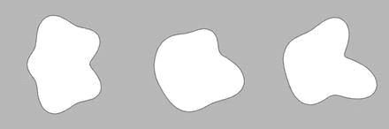
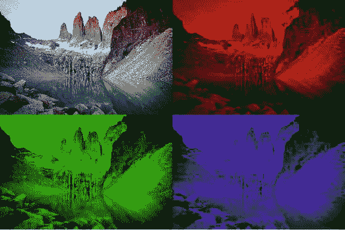

# 四、绘制图形和文本

在这一章中，我们将深入探讨用于绘制形状、图像和文本的处理 API，使用几个代码示例来说明 API 中的不同功能。我们还将学习如何使用 P2D 渲染器和`PShape`类来获得更好的 2D 性能。

## 正在处理的渲染器

在前面的章节中，我们学习了加工草图的基本结构，它由一个`setup()`和一个`draw()`函数组成，前者包含草图初始化，后者包含在每一帧中更新屏幕的代码。作为初始化的一部分，我们需要用`size()`函数指示输出区域的大小，如清单 [4-1](#Par5) 所示。我们还看到，`fullScreen()`功能允许我们使用设备屏幕的整个区域，而不管其分辨率如何。

`size()`和`fullScreen()`函数都接受一个“渲染器”选项。渲染器是处理过程中的模块，它将草图中的绘制命令转换为设备屏幕上的最终图像。处理渲染器通过 Android 系统提供的 API([`https://source.android.com/devices/graphics/`](https://source.android.com/devices/graphics/))与图形硬件通信来实现这一点。

默认渲染器(JAVA2D)在没有给`size()`或`fullScreen()`额外选项时启用，使用 Android 的 Canvas API 并提供高质量的 2D 渲染。但是，性能可能会受到限制，尤其是在绘制许多形状和其他图形元素时。另外两个渲染器，`P2D`和`P3D`，通过 OpenGL API 使用图形处理单元(GPU)，这带来了更高的性能，但代价是增加了电池消耗。我们可以通过调用带有适当参数的`size()`或`fullScreen()`来选择渲染器；例如，`size(w, h)`或`size(w, h, JAVA2D)`将使用默认渲染器生成草图，而`size(w, h, P2D)`或`fullScreen(P2D)`将启用 P2D 渲染器，如我们在清单 [4-1](#Par5) 中所做的。无论我们使用 JAVA2D 还是 P2D，这个草图的输出都是一样的，但是在本章的后面我们会看到使用 P2D 的一些具体的优点。我们将在第 [13 章](13.html)中介绍使用 P3D 渲染器绘制 3D 图形。


图 4-1。

Output of the full-screen P2D sketch

```java
void setup() {
  fullScreen(P2D);
  background(255);  
  noFill();
  rectMode(CENTER);
}

void draw() {  
  float w = 2*(width/2-mouseX);
  rect(width/2, height/2, w, w/width * height);

}

Listing 4-1.Using Full-screen Output

with the P2D Renderer

```

## 绘制形状

第 [2](02.html) 章给我们概述了绘图 API 在处理中的一些重要元素。我们看到了如何使用像`ellipse()`或`rect()`这样的函数绘制原始形状，而任意形状可以使用`beginShape()`、`vertex()`和`endShape()`函数逐个顶点地创建。在这一节中，我们将更深入地了解形状绘制 API，并学习如何使用`PShape`类和通过将矢量图形加载到`PShape`对象中来将形状存储到对象中以便更快地渲染。

### 更多形状类型

让我们首先回顾一下我们所掌握的所有可能的形状类型。本质上，根据我们在`beginShape()`中指定的类型，顶点将以不同的方式连接以构建所需的几何图形，如图 [4-2](#Fig2) 所示。


图 4-2。

All the shape types available in Processing

用`beginShape` / `endShape`构造形状时，顶点的数量和顺序非常重要。图 [4-2](#Fig2) 描绘了每个顶点是如何根据类型合并到形状中的。如果我们以不同的顺序提供顶点——例如，如果我们在`QUADS`类型的形状中交换顶点 2 和 3——那么产生的形状看起来会扭曲。此外，每种类型(点和多边形除外)都需要特定数量的顶点来构建单独的形状；例如，3 × N 画 N 个三角形，4 × N 画 N 个四边形，等等。如果我们想创造复杂的形状，我们必须熟悉这些规则。例如，考虑在每种形状类型下，相同的顶点布局如何导致非常不同的视觉结果，如清单 [4-2](#Par9) 所示。


图 4-3。

Outputs for different shape types

```java
int[] types = {POINTS, LINES, TRIANGLES,
               TRIANGLE_STRIP, TRIANGLE_FAN,
               QUADS, QUAD_STRIP, POLYGON};
int selected = 0;

void setup() {
  size(300, 300);
  strokeWeight(2);
}

void draw() {
  background(150);
  beginShape(types[selected]);
  for (int i = 0; i <= 10; i++) {
    float a = map(i, 0, 10, 0, TWO_PI);
    float x0 = width/2  + 100 * cos(a);
    float y0 = height/2 + 100 * sin(a);
    float x1 = width/2  + 130 * cos(a);
    float y1 = height/2 + 130 * sin(a);    
    vertex(x0, y0);
    vertex(x1, y1);
  }
  endShape();
}

void mousePressed() {
  selected = (selected + 1) % types.length;
  println("Drawing shape", selected);
}

Listing 4-2.Drawing Different Shapes of Different Types Using beginShape() and endShape()

```

Note

`POLYGON`类型是`beginShape()`的默认参数，所以如果我们不提供任何显式类型，我们将创建一个多边形。此外，多边形可以是开放的或封闭的，这可以用`endShape(mode)`控制，模式可以是`OPEN`或`CLOSE`。

### 曲线形状

到目前为止，我们一直在使用的`vertex()`函数允许我们向形状添加顶点，然后根据我们在`beginShape()`中选择的类型参数连接这些顶点。这种方法足够通用，可以生成我们能想到的几乎任何形状，甚至是弯曲的形状。在这种情况下，我们可以沿着数学曲线计算顶点的位置，然后将这些顶点添加到多边形形状中。例如，在清单 [4-3](#Par12) 中，我们使用极坐标来生成一个随机的、看起来有机的形状。



图 4-4。

Three shapes created by our “organic shape” example

```java
size(480, 480);
translate(width/2, height/2);
int numPoints = 100;
int degree = 5;
beginShape();  
float[] coeffs = new float[degree];
for (int d = 0; d < degree; d++) {
  coeffs[d] = random(0, 1);
}
float phase = random(0, TWO_PI);
for (int i = 0; i <= numPoints; i++) {
  float theta = map(i, 0, numPoints, 0, TWO_PI);
  float rho = 5;
  for (int d = 1; d <= degree; d++) {
    rho += coeffs[d - 1] * sin(d*theta+phase);
  }
  float x = 30 * rho * cos(theta);
  float y = 30 * rho * sin(theta);
  vertex(x, y);
}
endShape();
Listing 4-3.Creating a Curved “Organic” Shape with Polar Coordinates

```

在这个例子中，我们使用变量`numPoints`来设置要添加到形状中的点数。这个数字越高，曲线看起来越平滑。我们可以使用 Catmull-Rom 样条和 Bezier 曲线来代替，两者都给我们更直观的曲线控制，正如我们接下来将看到的。

我们通过重复调用`curveVertex()`函数，为样条需要经过的每个顶点调用一次，并通过设置其控制点，在形状内添加 Catmull-Rom 样条。这些控制点决定了样条曲线在其端点处的方向。Catmull-Rom 样条的一个方便的方面是它们通过所有的控制点，但是这些点和端点处的方向之间的关系不容易可视化。

让我们看看使用样条的细节。为了使代码更具可读性，我们将在处理中使用`PVector`类，它允许我们存储 2D 和 3D 位置，并执行基本的矢量代数。一个`PVector`对象有三个浮点字段——x、y、z——和一些计算方法，比如向量加法、减法、长度和航向角。《加工参考》有一节详细介绍了如何使用该功能( [`https://processing.org/reference/PVector.html`](https://processing.org/reference/PVector.html) )，还有一节教程( [`https://processing.org/tutorials/pvector/`](https://processing.org/tutorials/pvector/) )。在清单 [4-4](#Par16) 中，我们使用了一个`PVector`对象数组来存储样条曲线经过的所有点。

```java
size(480, 480);

PVector[] points = new PVector[11];
for (int i = 0; i <= 10; i++) {
  if (i < 10) {
    float a = map(i, 0, 10, 0, TWO_PI);
    float r = random(100, 200);
    points[i] = new PVector(r * cos(a), r * sin(a));
  } else {
    points[10] = points[0].copy();
  }
}  

translate(width/2, height/2);
fill(255);
beginShape();
for (int i = 0; i <= 10; i++) {
  if (i == 0 || i == 10) curveVertex(points[i].x, points[i].y);    
  curveVertex(points[i].x, points[i].y);
}
endShape();

fill(0);
for (int i = 0; i <= 10; i++) {
  ellipse(points[i].x, points[i].y, 10, 10);
}

Listing 4-4.Creating Catmull-Rom Splines with curveVertex()

```

我们首先创建一个 PVector 对象数组，用来存储曲线上的位置。因为我们正在创建一个封闭的形状，所以最后一个`PVector`是第一个的副本。然后，我们将存储在 PVector 数组中的位置作为曲线顶点添加到多边形形状中。线条`if (i == 0 || i == 10) curveVertex(points[i].x, points[i].y);`添加了对应于控制点的附加顶点，这些顶点被设置为与曲线中的第一个和最后一个点相同。尽管样条给了我们一条通过所有点的平滑曲线，我们可能会在第一点得到一个尖角，如图 [4-5](#Fig5) 所示。


图 4-5。

Output of the Catmull-Rom spline example

另一方面，由于控制点可用于调整曲线上每对顶点之间的曲率，贝塞尔曲线允许更直观地操纵形状。我们在第 2 章[中应用了贝塞尔曲线来创建类似花和叶子的形状，我们可以在许多其他情况下使用它们。类似于我们之前的随机斑点，我们可以使用贝塞尔曲线创建一个随机形状。我们需要平滑地连接贝塞尔曲线；每一个都需要两个控制点和两个顶点。图](02.html) [4-6](#Fig6) 显示了如何共享相邻贝塞尔曲线的顶点和控制点，以确保整个曲线不包含尖角。


图 4-6。

Smoothly joining Bezier curves

与样条曲线一样，我们可以生成贝塞尔曲线将通过的点，方法是以等间距围绕形状的整个周长移动，然后构建切线方向，我们将沿着该方向放置连续曲线之间共享的控制点。这就是我们在清单 [4-5](#Par20) 中所做的。

```java
size(480, 480);

PVector[] points = new PVector[11];
PVector[] directions = new PVector[11];
for (int i = 0; i <= 10; i++) {
  if (i < 10) {
    float a = map(i, 0, 10, 0, TWO_PI);
    float r = random(100, 200);
    points[i] = new PVector(r * cos(a), r * sin(a));
    directions[i] = PVector.fromAngle(points[i].heading() +
                    random(0, QUARTER_PI));
    directions[i].mult(60);
  } else {
    points[10] = points[0].copy();
    directions[10] = directions[0].copy();
  }
}  

translate(width/2, height/2);
strokeWeight(2);
fill(255);
beginShape();
for (int i = 0; i < 10; i++) {
  vertex(points[i].x, points[i].y);
  PVector CP1 = PVector.add(points[i], directions[i]);
  PVector CP2 = PVector.sub(points[i+1], directions[i+1]);  
  bezierVertex(CP1.x, CP1.y, CP2.x, CP2.y, points[i+1].x, points[i+1].y);  
}
endShape();

Listing 4-5.Creating a Bezier Curve with Consecutive Vertices

```

注意使用`PVector`的`fromAngle()`方法生成一个方向向量，方法是将位置向量旋转 0 到 90 度之间的随机量(`QUARTER_PI`，然后用一个常数因子(60)对其进行缩放。同样，最后一个矢量的位置和方向需要从第一个矢量复制过来，这样形状才能正确闭合。一旦所有这些向量被计算并存储在数组中，我们就用`vertex()`和`bezierVertex()`函数创建形状。

我们还可以在示例中添加一些额外的代码来绘制顶点和控制点。我们所要做的就是遍历点和方向数组，然后使用椭圆和直线来显示它们与形状的关系。清单 [4-6](#Par23) 包含了这些额外的代码，我们将把它们粘贴到清单 [4-5](#Par20) 的草图的末尾，得到如图 [4-7](#Fig7) 所示的输出。


图 4-7。

Shape obtained by joining Bezier consecutive curves, with their control points

```java
strokeWeight(1);
for (int i = 0; i <= 10; i++) {
  PVector prevCP = PVector.sub(points[i], directions[i]);
  PVector nextCP = PVector.add(points[i], directions[i]);
  stroke(0);
  line(prevCP.x, prevCP.y, nextCP.x, nextCP.y);
  noStroke();
  fill(190, 30, 45);
  ellipse(points[i].x, points[i].y, 10, 10);  
  fill(28, 117, 188);
  ellipse(prevCP.x, prevCP.y, 7, 7);
  ellipse(nextCP.x, nextCP.y, 7, 7);

}

Listing 4-6.Drawing the Control Points and Tangent Directions to a Bezier Curve

```

可以将曲线/贝塞尔曲线顶点与常规顶点组合在同一形状中。让我们用刚刚学的东西画一个简单的海景，用贝塞尔曲线造波。我在图 [4-8](#Fig8) 中勾勒出了这个想法。


图 4-8。

Pen and paper sketch of a seascape using Bezier curves

因为我们将使用相同的代码但不同的参数绘制几个形状，所以将每个形状存储在一个单独的对象中会很方便。为此，我们将定义一个包含一条波浪线的类，然后我们可以用它在`setup()`函数中创建几个波浪，如清单 [4-7](#Par26) 所示。

```java
void setup() {
  fullScreen();
  orientation(LANDSCAPE);
  colorMode(HSB, 360, 100,100);
  waves = new WavyLine[10];
  for (int i = 0; i < 10; i++) {
    float y = map(i, 0, 9, height * 0.85, height * 0.025);
    color c = color(225, map(i, 0, 10, 30, 100), 90);
    waves[i] = new WavyLine(y, c);
  }
}

void draw() {
  background(219, 240, 255);  
  for (int i = waves.length - 1; i >= 0; i--) {
    waves[i].display();
  }
}

class WavyLine {
  int numDiv;
  color fillColor;
  PVector[] positions;
  PVector[] directions;

  WavyLine(float y, color c) {
    numDiv = int(8 * displayDensity);
    positions = new PVector[numDiv];
    directions = new PVector[numDiv];    

    fillColor = c;
    for (int i = 0; i < numDiv; i++) {
      float x = 0;      
      if (0 < i) {
        if (i == numDiv - 1) x = width;
        else x = random(i/float(numDiv) * width * 1.2,
                        (i+1)/float(numDiv) * width * 0.8);
      }
      positions[i] = new PVector(x, y + random(-20, 20));
      directions[i] = PVector.fromAngle(random(-0.5 * HALF_PI,
                      +0.5 * HALF_PI));
      directions[i].mult(20 * displayDensity);
    }    
  }

  void display() {
    noStroke();
    fill(fillColor);
    beginShape();
    for (int i = 0; i < numDiv - 1; i++) {
      vertex(positions[i].x, positions[i].y);
      PVector cp1 = PVector.add(positions[i], directions[i]);
      PVector cp2 = PVector.sub(positions[i+1], directions[i+1]);  
      bezierVertex(cp1.x, cp1.y, cp2.x, cp2.y,
                   positions[i+1].x, positions[i+1].y);
    }
    vertex(width, height);
    vertex(0, height);    
    endShape();
  }
}

Listing 4-7.Seascape Sketch, Using Objects to Draw Several Shapes

```

在这个例子中，我们使用内置的`displayDensity`变量，我们已经在第 [3](03.html) 章中讨论过，以确保贝塞尔曲线细分的数量和由控制点定义的切线向量的长度与屏幕的 DPI 成比例，这样我们就可以在不同的设备上获得一致的输出(图 [4-9](#Fig9) )。


图 4-9。

Final result of the seascape sketch

在这个例子中，我们应该注意的一些额外的事情是在`setup()`中的`orientation(LANDSCAPE)`调用来强制草图以横向方向运行，以及使用 HSB 颜色空间来更容易地实现从较亮到较暗的蓝色色调的渐变。

### 形状属性

处理允许我们设置几个决定形状最终外观的属性。我们已经使用了填充和描边颜色属性，但是还有更多。例如，我们不仅可以设置线条的颜色，还可以设置线条的粗细(粗细)、端点和连接连续线段的连接点，如清单 [4-8](#Par30) 所示。

```java
size(800, 480);
float x = width/2;
float y = height/2;
stroke(0, 150);
strokeWeight(10);
strokeJoin(ROUND);
strokeCap(ROUND);
beginShape(LINES);
for (int i = 0; i < 100; i++) {
  float px = x;
  float py = y;
  float nx = x + (random(0, 1) > 0.5? -1: +1) * 50;
  float ny = y + (random(0, 1) > 0.5? -1: +1) * 50;
  if (0 <= nx && nx < width && 0 <= ny && ny < height) {
    vertex(px, py);
    vertex(nx, ny);
    x = nx;
    y = ny;
  }
}
endShape();  
Listing 4-8.Setting Stroke Attributes

```

尝试使用不同的笔划连接值(`MITER`、`BEVEL`、`ROUND`)、端点值(`SQUARE`、`PROJECT`、`ROUND`)和权重值绘制草图，并与图 [4-10](#Fig10) 中所示的输出进行比较。


图 4-10。

Output of sketch demonstrating stroke attributes

尽管这些属性通常是为整个形状定义的(即，它们应用于形状中的所有顶点)，但 P2D 和 P3D 渲染器允许您定义逐顶点属性。例如，可以为每个顶点单独设置填充颜色，然后处理将在中间位置插入颜色。清单 [4-9](#Par33) 中草图的输出类似于第 [2](02.html) 章中的 HSB 色轮，但是这里我们不需要设置中间色，因为 P2D 渲染器会自动设置(图 [4-11](#Fig11) )。


图 4-11。

Color wheel obtained by interpolation of the fill color

```java
size(300, 300, P2D);
colorMode(HSB, 360, 100, 100);
background(0, 0, 100);
translate(width/2, height/2);
noStroke();
beginShape(TRIANGLE_FAN);
    fill(TWO_PI, 0, 100);
    vertex(0, 0);
    for (int i = 0; i <= 10; i++) {
    float a = map(i, 0, 10, 0, 360);
    float x = 150 * cos(radians(a));
    float y = 150 * sin(radians(a));
    fill(a, 100, 100);
    vertex(x, y);
  }
endShape();
Listing 4-9.Using Color Interpolation in the P2D Renderer

```

### 形状样式

我们可以通过处理设置的所有形状属性决定了当前的“样式”正如我们之前看到的，填充颜色、笔画颜色、粗细、帽和连接都是样式属性。随着我们的草图变得越来越复杂，尤其是对象在绘制时会设置自己的属性，很容易会忘记当前的样式。

处理包括两个函数，`pushStyle()`和`popStyle()`，它们可以方便地管理我们形状的样式，特别是当我们在执行草图的不同点改变许多样式属性时。`pushStyle()`保存所有样式属性的当前值，而`popStyle()`将所有样式属性恢复到我们上次调用`pushStyle()`时保存的值。如果我们在连续的`pushStyle()`和`popStyle()`调用之间设置一种全新的风格，我们可以确定两种不同的风格不会混淆。清单 [4-10](#Par36) 提供了这种技术的一个简单例子。

```java
Circle[] circles = new Circle[100];

void setup() {
  size(800, 800);
  for (int i = 0; i < circles.length; i++) {
    circles[i] = new Circle();
  }
}

void draw() {
  translate(width/2, height/2);
  rotate(frameCount * 0.01);
  for (int i = 0; i < circles.length; i++) {
    circles[i].display();
  }  
}

class Circle {
  float x, y, r, w;
  color fc, sc;
  Circle() {
    x = random(-width/2, width/2);
    y = random(-height/2, height/2);
    r = random(10, 100);
    w = random(2, 10);
    fc = color(random(255), random(255), random(255));
    sc = color(random(255), random(255), random(255));
  }
  void display() {
    pushStyle();
    stroke(sc);
    strokeWeight(w);
    fill(fc);
    ellipse(x, y, r, r);
    popStyle();
  }
}

Listing 4-10.Saving and Restoring Styles with pushStyle() and popStyle()

```

### 形状轮廓

Processing API 中另一个有用的特性是使用等高线进行减法绘制。包含在`beginContour()`和`endContour()`函数之间的所有顶点定义了一个从较大形状中移除的负形状，如清单 [4-11](#Par38) 所示，它生成了如图 [4-12](#Fig12) 所示的输出。


图 4-12。

Shape with holes created with beginContour/endContour

```java
void setup() {
  size(300, 300);  
}

void draw() {
  background(190);
  translate(width/2, height/2);
  float r = width/2;
  beginShape();
  circleVertices(0, 0, r, 0, TWO_PI);  
  makeContour(0, 0, r/4);
  makeContour(-r/2, -r/2, r/4);
  makeContour(+r/2, -r/2, r/4);
  makeContour(-r/2, +r/2, r/4);
  makeContour(+r/2, +r/2, r/4);  
  endShape();
}

void makeContour(float xc, float yc, float r) {
  beginContour();
  circleVertices(xc, yc, r, TWO_PI, 0);
  endContour();
}

void circleVertices(float xc, float yc, float r, float a0, float a1) {
  for (int i = 0; i <= 30; i++) {
    float a = map(i, 0, 30, a0, a1);
    vertex(xc + r * cos(a), yc + r * sin(a));
  }
}

Listing 4-11.Making Holes Inside a Shape with beginContour() and endContour()

```

Note

轮廓只能用于`POLYGON`类型的形状。此外，轮廓中顶点的“缠绕”或方向(顺时针或逆时针)必须与包含形状的方向相反。

## PShape 类

正如我们到目前为止所看到的，绘制形状包括在每一帧中重复调用`beginShape()`、`vertex()`和`endShape()`。我们可以预先计算坐标并将它们放入自定义类中，就像我们在海景示例中所做的那样；然而，Processing 已经提供了一个内置的类来保存形状数据，恰当地称为`PShape`。这个类不仅帮助我们保持代码更有组织性和可读性，还允许我们从矢量图形文件(SVG)中读取形状，并且在使用 P2D 渲染器时，提高我们草图的性能。

### 创建 PShapes

通过调用`createShape()`函数可以创建一个`PShape`对象，我们可以通过三种不同的方式向它传递适当的参数:

1.  如果没有提供参数，`createShape()`返回一个空的`PShape`，我们可以使用`beginShape()`、`vertex(),`和`endShape()`来构建一个定制的形状。
2.  提供原始类型(`ELLIPSE`、`RECT`等)。)和初始化原始形状所需的附加参数。
3.  指定单个`GROUP`参数，这会产生一个可用于包含其他形状(自定义或原始)的`PShape`。

一旦我们创建并正确初始化了`PShape`对象，我们就可以使用`shape()`函数任意多次绘制它，如清单 [4-12](#Par46) 和图 [4-13](#Fig13) 所示。


图 4-13。

Primitive, custom, and group PShape objects

```java
size(650, 200, P2D);
PShape circle = createShape(ELLIPSE, 100, 100, 100, 100);
PShape poly = createShape();
poly.beginShape(QUADS);
poly.vertex(200, 50);
poly.vertex(300, 50);
poly.vertex(300, 150);
poly.vertex(200, 150);
poly.endShape();
PShape group = createShape(GROUP);
group.addChild(circle);
group.addChild(poly);
shape(circle);
shape(poly);
translate(300, 0);
shape(group);
Listing 4-12.Creating and Drawing PShape Objects

```

我们可以使用在本章第一节中学到的所有形状绘制功能来创建自定义形状；唯一的区别是我们需要调用相应的`PShape`对象上的函数。

当我们需要处理一个在草图运行时不会改变的非常大的几何体时，组合形状非常有用。如果没有`PShape`，每一帧的顶点都会被复制到 GPU 内存中，这样会降低帧率。然而，如果我们将所有这些顶点打包在一个`PShape`中，并使用 P2D 渲染器，这个拷贝只发生一次，这会带来更好的性能。这对于受电池电量使用限制的移动设备尤其重要。作为一个例子，让我们考虑一下模式示例中演示|性能下的`CubicGridImmediate`(编号`PShape`)和`CubicGridRetained` ( `PShape`)内置示例的帧速率。两张草图创造了完全相同的几何图形，一个半透明立方体的 3D 网格；然而，第一个草图勉强超过每秒 10 帧(fps)，而第二个草图在大多数设备上将以每秒 60 帧的速度运行。

尽管`PShape`几何体原则上必须是静态的，才能实现这些性能提升，但在一定程度上修改顶点颜色和位置仍然是可能的，而不会降低速度。如果我们的修改只应用于一个较大的组中的子形状的子集，性能应该保持很高。让我们看看清单 [4-13](#Par50) 中的场景，它生成了图 [4-14](#Fig14) 中描述的输出。


图 4-14。

Modifying the fill color of a child shape inside a group

```java
PShape grid, sel;

void setup() {
  fullScreen(P2D);
  orientation(LANDSCAPE);
  grid = createShape(GROUP);
  for (int j = 0; j < 4; j++) {
    float y0 = map(j, 0, 4, 0, height);
    float y1 = map(j+1, 0, 4, 0, height);        
    for (int i = 0; i < 8; i++) {
      float x0 = map(i, 0, 8, 0, width);
      float x1 = map(i+1, 0, 8, 0, width);
      PShape sh = createShape(RECT, x0, y0, x1 - x0, y1 - y0, 30);
      grid.addChild(sh);
    }
  }
}

void draw() {
  background(180);
  shape(grid);
}

void mousePressed() {
  int i = int(float(mouseX) / width * 8);
  int j = int(float(mouseY) / height * 4);
  int idx = j * 8 + i;
  sel = grid.getChild(idx);
  sel.setFill(color(#FA2D45));
}

void mouseReleased() {
  sel.setFill(color(#C252FF));
}

Listing 4-13.Modifying Attributes of Child Shapes After Creation

```

这里，一次只修改一个子形状，获得新的填充颜色。只有更新的信息才会传输到 GPU，从而保持性能稳定。然而，随着更多的形状被同时修改，这种增益将会减少，直到性能变得等同于没有任何`PShape`对象的绘制。

Note

一个`PShape`对象的大多数属性在创建后都可以修改。在 [`https://processing.org/reference/PShape.html`](https://processing.org/reference/PShape.html) 可以找到所有可用的设置器功能。

### 从 SVG 加载形状

我们还可以通过使用`loadShape()`函数，使用`PShape`对象加载存储在文件中的几何图形。该函数接受 SVG 和 OBJ 格式，后者在 P3D 渲染器中受支持。SVG 代表可缩放矢量图形，SVG 格式的文件包含一个形状或一组形状的规范，其方式与处理几何图形的方式非常相似:作为顶点、样条或贝塞尔曲线的列表。

为了在我们的草图中加载一个 SVG 文件，我们首先需要将它放在草图的数据目录中。当我们在设备或仿真器上运行草图时，数据文件夹的所有内容都将被正确打包，以便可以从应用中访问它们。

Note

可以在草图的文件夹中手动创建数据目录。如果将媒体文件拖到 PDE 中，也会自动创建它。

一旦 SVG 被加载到一个`PShape`对象中，我们可以对它应用变换，比如平移或旋转，甚至改变它的样式属性，就像我们在清单 [4-14](#Par57) 中所做的那样，在那里我们将三个 SVG 文件加载到不同的形状中(图 [4-15](#Fig15) )。


图 4-15。

Loading, modifying, and displaying SVGs

```java
size(450, 200, P2D);
PShape cc = loadShape("cc.svg");
PShape moz = loadShape("mozilla.svg");
PShape ruby = loadShape("ruby.svg");
translate(30, 50);
cc.setFill(color(170, 116, 0));
cc.setStroke(color(255, 155, 0));
shape(cc);
translate(cc.width + 30, 0);
shape(moz);
translate(moz.width + 30, 0);
shape(ruby);
Listing 4-14.Load SVG Files into PShape Objects

```

SVG 文件对于绘制难以单独通过代码生成的复杂几何图形非常有用。复杂 SVG 的另一个优点是，它们可以按层次方式组织，子形状在组内，允许单独操纵子形状。让我们看一个绘制世界地图 SVG 的例子，它也包含国家的名称(清单 [4-15](#Par59) )。运行它应该产生图 [4-16](#Fig16) 。


图 4-16。

Loading a map from an SVG file and selecting a country by its name attribute

```java
PShape world;

void setup() {
  size(950, 620, P2D);
  world = loadShape("World-map.svg");
  for (PShape child: world.getChildren()) {
    if (child.getName().equals("algeria")) child.setFill(color(255, 0, 0));    
  }
}

void draw() {
  background(255);
  shape(world);
}

Listing 4-15.Selecting a Child Shape by Name and Setting Its Attributes

```

请注意我们是如何遍历所有子形状的，可以使用`getChildren()`函数从包含组中检索这些子形状作为一个`PShape`对象的数组。

## 绘制图像

在我们的应用中加载和显示图像文件是一个基本功能，处理起来非常简单。处理支持 GIF、JPG、TGA 和 PNG 图像格式，并包括一个内置的类`PImage`，用于处理草图中的图像。`PImage`封装图像的所有信息，包括宽度、高度和单个像素。加载和显示图像可以通过两个函数来完成，`loadImage()`和`image()`，如清单 [4-16](#Par62) 所示。

```java
fullScreen();
PImage img = loadImage("paine.jpg");  
image(img, 0, 0, width, height);
Listing 4-16.Loading and Displaying an Image

```

`image()`函数最多接受四个参数:屏幕上图像的 x 和 y 坐标，以及显示图像的宽度和高度。这些宽度和高度参数不需要与图像的原始分辨率相同，它可以从`PImage`对象中的`PImage.width`和`PImage.height`变量获得。不带宽度和高度参数调用`image()`会导致图像以其源分辨率绘制，这相当于调用`image(img, 0, 0, img.width, img.height)`。

我们可以使用`tint()`函数将色调应用于整个图像，然后使用`noTint()`将其移除(否则，随后显示的所有图像将具有相同的色调，因为色调是另一种样式属性)。清单 [4-17](#Par65) 举例说明了`tint()`和`noTint()`的使用，其输出如图 [4-17](#Fig17) 所示。



图 4-17。

Output of displaying an image with three different tints and no tinting

```java
PImage img;
void setup() {
  size(800, 533);
  img = loadImage("paine.jpg");  
}

void draw() {  
  image(img, 0, 0, width/2, height/2);
  tint(255, 0, 0);
  image(img, width/2, 0, width/2, height/2);
  tint(0, 255, 0);
  image(img, 0, height/2, width/2, height/2);
  tint(0, 0, 255);
  image(img, width/2, height/2, width/2, height/2);  
  noTint();
}

Listing 4-17.Tinting an Image

```

Note

当加载图像或任何其他媒体文件(如 SVG)时，在`setup()`函数中这样做很重要，该函数仅在应用启动时调用。否则，图像将在每一帧中重复加载，使应用变慢，直至无法使用。

### 纹理形状

我们也可以使用图像文件纹理形状(只有在 P2D/P3D 渲染器)。纹理化本质上是指将图像环绕在形状周围，这样形状就不再是用单一颜色绘制的。这个过程要求我们指定图像的哪些部分对应于形状的每个顶点。纹理可能非常复杂，尤其是在处理 3D 中的不规则形状时。清单 [4-18](#Par68) 展示了最简单的情况——纹理化一个矩形。

```java
PImage img;
size(800, 533, P2D);
img = loadImage("paine.jpg");
beginShape();
texture(img);
vertex(100, 0, 0, 0);
vertex(width – 100, 0, img.width, 0);
vertex(width, height, img.width, img.height);
vertex(0, height, 0, img.height);
endShape();
Listing 4-18.Texturing a Rectangle with an Image Loaded from a File

```

正如我们在这个例子中看到的，我们需要为`vertex()`函数提供两个额外的参数。`vertex(x, y, u, v)`调用中的这些参数对应于纹理映射的 UV 坐标，并指示图像中的像素(u，v)将到达形状中的顶点(x，y)。渲染器将基于该信息确定所有其他像素-顶点对应关系。在我们的简单纹理代码中，结果如图 [4-18](#Fig18) 所示。


图 4-18。

Textured 2D shape

## 绘图文本

文本是图形编程的另一个基本元素。Processing 提供了几个功能来在草图中绘制文本，并通过使用不同的字体和调整属性(如大小和对齐)来控制文本的外观。在接下来的几节中，我们将研究其中的一些函数。

### 加载和创建字体

在加工草图中绘制文本的第一步是加载位图字体。字体将被存储在一个`PFont`变量中，如果我们想在不同的时间用不同的字体绘图，我们可以在同一个草图中的不同`PFont`变量之间切换。内置的字体创建工具(位于“工具|创建字体…”下)允许我们从运行处理的 PC 或 Mac 计算机上可用的字体创建新的位图字体。该工具的界面如图 [4-19](#Fig19) 所示。一旦我们选择了字体、所需的大小和文件名，我们点击 OK，工具将在草图的数据目录中生成一个扩展名为. vlw 的字体文件，准备使用。


图 4-19。

Font-creator tool in the PDE

为了加载我们的新字体并将其设置为当前字体，我们分别使用了`loadFont()`和`textFont()`函数。一旦我们设置了想要的字体，我们就可以使用`text()`功能在屏幕上的任何地方绘制文本。清单 [4-19](#Par73) 展示了所有这些功能。

```java
size(450, 100);
PFont font = loadFont("SansSerif-32.vlw");
textFont(font);
fill(120);
text("On Exactitude in Science", 40, 60);
Listing 4-19.Loading a bitmap font generated with the font creator tool

```

在`text(str, x, y)`调用中的`x`和`y`参数让我们设置文本的屏幕位置。使用默认的文本对齐选项，它们表示第一个字符左下角的位置。图 [4-20](#Fig20) 显示了我们的文本绘制草图的输出。


图 4-20。

Text output in Processing

创建一个. vwl 字体文件，然后将其加载到草图中的一个缺点是，因为字体是预先创建的，所以它必须包含所有可能的字符。这浪费了内存，尤其是如果我们最终只使用了其中的几个。或者，我们可以用`createFont(name, size)`函数动态创建字体，该函数接受系统范围的字体名称或 TrueType 的文件名。ttf)或 OpenType(。otf)字体，以及字体大小。只有草图中实际使用的角色才会被创建并存储在内存中。这显示在清单 [4-20](#Par76) 中。

```java
size(450, 100);
PFont font = createFont("SansSerif", 32);
textFont(font);
fill(120);
text("On Exactitude in Science", 40, 60);
Listing 4-20.Creating a Font on the Fly

```

Note

Android 提供了三种适用于任何应用的全系统字体:serif、sans-serif 和 monospaced。每种字体都有四种变体:普通、粗体、斜体和粗斜体，因此，例如，无衬线字体的字体名称是 SansSerif、SansSerif-Bold、SansSerif-Italic 和 SansSerif-BoldItalic。

如果我们不向`text()`提供任何其他参数，文本字符串将继续向右延伸，直到脱离屏幕，或者，如果字符串包含一个换行符(`\n`)，则转到下一行。我们可以用四个参数设置一个矩形区域，`x`、`y`、`w`和`h`，如果需要的话，处理会通过将文本分成几行来自动容纳在矩形内，如清单 [4-21](#Par79) 和图 [4-21](#Fig21) 所示。


图 4-21。

Text output in Processing fitted inside a rectangular area

```java
size(900, 300);
PFont font = createFont("Monospaced", 32);
textFont(font);
fill(120);
text("...In that Empire, the Art of Cartography attained such Perfection " +
     "that the map of a single Province occupied the entirety of a City, " +
     "and the map of the Empire, the entirety of a Province.", 20, 20,
     width - 40, height - 40);
Listing 4-21.Placing Text Inside a Rectangular Area

```

### 文本属性

除了字体的名称和大小，我们还可以控制文本对齐(`LEFT`、`RIGHT`、`CENTER`、`BOTTOM`、`TOP`)和文本行之间的行距(清单 [4-22](#Par81) )。图 [4-22](#Fig22) 显示了设置这些属性的结果。尽管在本例中我们只设置了水平方向的对齐，但我们也可以通过向`textAlign()` — `CENTER`、`BOTTOM`或`TOP`提供第二个参数来设置垂直方向的对齐。


图 4-22。

Drawing text with different fonts and attributes

```java
size(900, 300);
PFont titleFont = createFont("Serif", 32);
PFont textFont = createFont("Serif", 28);
textFont(titleFont);
textAlign(CENTER);
fill(120);
text("On Exactitude in Science", width/2, 60);
textFont(textFont);
textAlign(RIGHT);
textLeading(60);
text("...In that Empire, the Art of Cartography attained such Perfection " +
     "that the map of a single Province occupied the entirety of a City, " +
     "and the map of the Empire, the entirety of a Province.",
     20, 100, width - 40, height - 20);
Listing 4-22.Setting Text Alignment and Leading

```

### 缩放文本

在第 [3](03.html) 章中，我们看到了如何使用`displayDensity`变量根据设备的 DPI 缩放草图中的图形。这种技术允许我们在不同分辨率和屏幕尺寸的设备上保持一致的视觉输出，我们也可以在绘制文本时使用它。我们需要做的就是将字体大小乘以`displayDensity`，如清单 [4-23](#Par83) 所示。我们在图 [4-23](#Fig23) 中看到，屏幕上的文本大小在三个具有不同 dpi 的设备上保持不变。我们在这个例子中引入的一个额外的函数是`loadStrings()`，它读取数据文件夹中的一个文本文件，并返回一个包含文件中所有文本行的字符串数组。


图 4-23。

From left to right, text output on a Samsung Galaxy Tab 4 (7”, 1280 × 800 px, 216 dpi), Nexus 5X (5.2”, 1920 × 800 px, 424 dpi), and a Moto E (4.3”, 960 × 540 px, 256 dpi)

```java
fullScreen();
orientation(PORTRAIT);
PFont titleFont = createFont("Serif-Bold", 25 * displayDensity);
PFont bodyFont = createFont("Serif", 18 * displayDensity);
PFont footFont = createFont("Serif-Italic", 15 * displayDensity);
String[] lines = loadStrings("borges.txt");
String title = lines[0];
String body = lines[1];
String footer = lines[2];
textFont(titleFont);
textAlign(CENTER, CENTER);
fill(120);
text(title, 10, 10, width - 20, height * 0.1 - 20);
textFont(bodyFont);
text(body, 10, height * 0.1, width - 20, height * 0.8);
textAlign(RIGHT, BOTTOM);     
textFont(footFont);
text(footer, 10, height * 0.9 + 10, width - 20, height * 0.1 - 20);
Listing 4-23.Scaling Font Size by the Display Density

```

## 摘要

这是一个很长的章节，但是我们涵盖了很多重要的概念和技术！基于我们在第 2 章中看到的Processing 语言的介绍，我们现在已经学习了使用各种几何图形、样条和贝塞尔曲线绘制形状的细节；用不同的属性调整它们的外观；并用`PShape`类优化代码。除此之外，我们还学会了如何在草图中绘制图像和文本。通过将这些资源付诸实践，我们应该能够创建几乎任何我们能想到的视觉合成，并将其转化为 Android 应用。