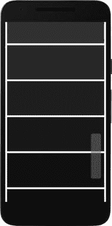

# 五、触摸屏交互

本章将详细介绍 Android 处理中的触摸屏支持。我们将学习如何在草图中捕捉单点和多点触摸事件，如何处理这些事件以实现基于触摸的交互，如选择、滚动、滑动和挤压，以及如何使用虚拟键盘。

## Android 中的触摸事件

在这一章中，我们谈到了一个专门针对移动设备的话题。自 2007 年推出 iPhone 以来，触摸屏已经成为与智能手机、平板电脑和可穿戴设备交互的主要机制。旧手机通常包括一个物理键盘，但今天这些已经很少了，键盘输入是通过虚拟或软件键盘实现的。

触摸屏交互非常直接和直观，在将手势作为体验核心部分的应用中非常有用(例如，笔记和绘图应用)。触摸的物理特性使其成为移动设备上创意应用的理想交互方式。

Android 系统提供了对触摸屏交互的全面支持，从单点触摸事件、用手指触发的多点触摸手势到手写笔输入。由于其通用性，Android 中的触摸 API 可能很难使用，因此 Android 的处理用一个更简单的 API 包装了这种复杂性，尽管它可能不会覆盖所有的触摸屏功能，但它使创建广泛的基于触摸的交互成为可能。

### 基本触摸事件

从最早的版本开始，Java 处理模式就包含了变量和函数来处理与鼠标的交互。所有这些变量和函数在 Android 模式下也是可用的，它们的工作方式与最初的 Java 模式非常相似，至少对于单触事件是如此。当然，不同之处在于事件是由我们的手指按下触摸屏而不是鼠标的移动触发的。我们在前面的章节中使用了一些鼠标 API 特别是,`mouseX`和`mouseY`变量——来跟踪触摸点的位置。清单 [5-1](#Par6) 展示了这个 API 的一个基本例子，在这里我们控制一些形状的位置(图 [5-1](#Fig1) )。


图 5-1。

Simple use of mouseX and mouseY variables to track touch position

```java
void setup() {
  fullScreen();
  strokeWeight(20);  
  fill(#3B91FF);
}

void draw() {
  background(#FFD53B);
  stroke(#3B91FF);
  line(0, 0, mouseX, mouseY);
  line(width, 0, mouseX, mouseY);
  line(width, height, mouseX, mouseY);
  line(0, height, mouseX, mouseY);
  noStroke();
  ellipse(mouseX, mouseY, 200, 200);
}

Listing 5-1.Simple Touch Event Using the Mouse Variables

```

与实际鼠标的一个重要区别是存在“按下”状态:我们可以在不按下任何按钮的情况下移动鼠标，当我们按下鼠标时，会触发一个“拖动”事件，直到我们松开按钮。对于触摸屏，“鼠标”在移动时总是处于“按下”状态。这种差异使得典型的基于鼠标的交互——悬停——无效，当我们在屏幕的预定义区域内移动鼠标但不按任何按钮时，就会发生悬停。

当触摸开始/结束时，或者当触摸点改变位置时，我们可以精确地执行特定的任务。每当这些事件发生时，处理都会自动调用函数`mousePressed()`、`mousedDragged()`和`mouseReleased()`，因此我们可以在其中实现我们的事件处理功能。例如，在清单 [5-2](#Par9) 中，只要我们在屏幕上拖动手指，我们就会在鼠标位置绘制一个不断增长的椭圆。此外，请注意使用`displayDensity`来缩放椭圆的初始半径及其在拖动时的常规增量，这样无论设备的 DPI 如何，它都显示相同的大小。

```java
boolean drawing = false;
float radius;

void setup() {
  fullScreen();
  noStroke();
  fill(100, 100);
}

void draw() {
  background(255);
  if (drawing) {
    ellipse(mouseX, mouseY, radius, radius);
  }
}

void mousePressed() {
  drawing = true;
  radius = 70 * displayDensity;
}

void mouseReleased() {  
  drawing = false;
}

void mouseDragged() {
  radius += 0.5 * displayDensity;
}

Listing 5-2.Detecting Press, Drag, and Release “Mouse” Events

```

我们可以在这个简单的例子的基础上建立一个到目前为止创建的所有椭圆的列表，并给它们分配随机的 RGB 颜色。为此，我们创建一个类来存储椭圆的位置、大小和颜色，如清单 [5-3](#Par11) 所示。

```java
ArrayList<Circle> circles;
Circle newCircle;

void setup() {
  fullScreen();
  circles = new ArrayList<Circle>();
  noStroke();
}

void draw() {
  background(255);
  for (Circle c: circles) {
    c.draw();
  }
  if (newCircle != null) newCircle.draw();
}

void mousePressed() {
  newCircle = new Circle(mouseX, mouseY);
}

void mouseReleased() {  
  circles.add(newCircle);
  newCircle = null;
}

void mouseDragged() {
  newCircle.setPosition(mouseX, mouseY);
  newCircle.grow();
}

class Circle {
  color c;
  float x, y, r;
  Circle(float x, float y) {
    this.x = x;
    this.y = y;
    r = 70 * displayDensity;
    c = color(random(255), random(255), random(255), 100);
  }
  void grow() {
    r += 0.5 * displayDensity;
  }
  void setPosition(float x, float y) {
    this.x = x;
    this.y = y;
  }
  void draw() {
    fill(c);
    ellipse(x, y, r, r);
  }
}

Listing 5-3.Drawing Multiple Growing Ellipses with Mouse Events

```

除了`mouseX/Y`变量之外，处理还将触摸指针的先前位置存储在`pmouseX/Y`变量中。使用这些变量，我们可以编写一个简单的绘图草图，其中我们用一条线段连接以前和当前的鼠标位置，只要用户一直按着屏幕，就可以绘制一条连续的路径。我们可以用内置的布尔变量`mousePressed`来判断用户是否在按屏幕。该草图如清单 [5-4](#Par13) 所示，用其绘制的图纸如图 [5-2](#Fig2) 所示。


图 5-2。

Generating a line drawing with our sketch

```java
void setup() {
  fullScreen();
  strokeWeight(10);
  stroke(100, 100);
}

void draw() {  
  if (mousePressed) line(pmouseX, pmouseY, mouseX, mouseY);
}

Listing 5-4.Simple Drawing Sketch Using Current and Previous Mouse Positions

```

先前和当前触摸位置之间的差异告诉我们手指在屏幕上滑动的速度。我们滑动得越快，这种差异就越大，所以我们可以用它来驱动物体的运动，就像我们在清单 [5-3](#Par11) 中看到的圆圈一样。例如，圆圈的速度可以与滑动速度成比例。让我们通过添加一对速度变量(`vx`代表 x 方向，`vy`代表 y 方向)和一个`setVelocity()`方法到`Circle`类来实现这个想法，如清单 [5-5](#Par15) 所示。

```java
ArrayList<Circle> circles;
Circle newCircle;

void setup() {
  fullScreen();
  circles = new ArrayList<Circle>();
  noStroke();
}

void draw() {
  background(255);
  for (Circle c: circles) {
    c.draw();
  }
  if (newCircle != null) newCircle.draw();
}

void mousePressed() {
  newCircle = new Circle(mouseX, mouseY);
}

void mouseReleased() {  
  newCircle.setVelocity(mouseX - pmouseX, mouseY - pmouseY);
  circles.add(newCircle);
  newCircle = null;
}

void mouseDragged() {
  newCircle.setPosition(mouseX, mouseY);
  newCircle.grow();
}

class Circle {
  color c;
  float x, y, r, vx, vy;
  Circle(float x, float y) {
    this.x = x;
    this.y = y;
    r = 70 * displayDensity;
    c = color(random(255), random(255), random(255), 100);
  }
  void grow() {
    r += 0.5 * displayDensity;
  }
  void setPosition(float x, float y) {
    this.x = x;
    this.y = y;
  }
  void setVelocity(float vx, float vy) {
    this.vx = vx;
    this.vy = vy;
  }
  void draw() {
    x += vx;
    y += vy;
    if (x < 0 || x > width) vx = -vx;
    if (y < 0 || y > height) vy = -vy;    
    fill(c);
    ellipse(x, y, r, r);
  }
}

Listing 5-5.Using the Difference Between Current and Previous Mouse Positions to Calculate the Velocity of Graphical Elements in Our Sketch

```

尽管在这个草图的原始版本中，圆圈在我们释放触摸后立即停止移动，但它们现在继续以与滑动速度成比例的速度沿着滑动方向移动，因为我们一直将`vx`和`vy`添加到它们的当前位置。此外，通过`if (x < 0 || x > width) vx = -vx;`和`if (y < 0 || y > height) vy = -vy;`线，我们实现了一个非常简单的碰撞检测算法，其中如果一个圆移动经过屏幕的边缘，它的速度就会反转，这样它的移动就会反向朝向屏幕的内部。换句话说，圆圈在屏幕边缘反弹。

作为对这个例子的最后补充，我们将实现一个 Clear 按钮。由于我们每次触摸屏幕时都不断添加圆圈，最终屏幕会变得杂乱无章。按钮只是屏幕上的一个矩形区域，当按下时会触发一些动作，在这种情况下，会删除我们从开始添加的所有圆圈。事实上，我们不需要太多额外的代码来实现这个按钮。清单 [5-6](#Par18) 显示了我们需要在`draw()`和`mouseReleased()`中加入什么来绘制和触发按钮(图 [5-3](#Fig3) )。


图 5-3。

Outcome of the circle-drawing sketch, complete with a Clear button

```java
ArrayList<Circle> circles;
Circle newCircle;
float buttonHeight = 200 * displayDensity;
...
void draw() {
  background(255);
  for (Circle c: circles) {
    c.draw();
  }
  if (newCircle != null) newCircle.draw();
  fill(100, 180);
  rect(0, height - buttonHeight, width, buttonHeight);
  fill(80);
  text("Touch this area to clear", 0, height - buttonHeight, width, buttonHeight);
}
...
void mouseReleased() {  
  newCircle.setVelocity(mouseX - pmouseX, mouseY - pmouseY);
  circles.add(newCircle);
  newCircle = null;
  if (height - buttonHeight < mouseY) circles.clear();
}
...
Listing 5-6.Implementation of a Simple Clear Button

```

这个例子向我们展示了单触式事件可以走多远，以及如何在我们的应用中使用它们来控制移动和交互。我们可以将这些技术扩展到具有更多界面动作和对象行为的更复杂的情况。

### 多点触摸事件

我们已经学习了如何使用继承自处理 Java 的鼠标 API 来处理单触事件。然而，Android 设备上的触摸屏可以同时跟踪几个触摸点，最大值由屏幕的功能决定。一些设备可以同时跟踪多达十个触摸点。

处理包括`touches`数组来提供关于触摸点的信息。该数组中的每个元素都包含一个唯一的数字标识符，允许我们跨连续帧跟踪指针，并检索其当前的 x 和 y 坐标，以及指针的压力和面积。手机和平板电脑上的电容式触摸屏不仅能够测量触摸点的位置，还能测量我们施加在屏幕上的压力。面积是指针大小的近似度量，它与压力有关，因为我们越用力将手指按在屏幕上，接触面积就应该越大。

每次检测到新的触摸点时，处理将触发`startTouch()`功能。反之，当一个触摸点被释放时，`endTouch()`将被调用。与针对单次触摸事件的`mouseDragged()`功能类似，每次当前触摸点改变位置时，都会调用`touchMoved()`功能。同样，类似于`mousePressed`，有一个`touchPressed`逻辑变量，根据是否检测到至少一个触摸点来存储真或假。清单 [5-7](#Par24) 展示了所有这些功能，其输出在图 [5-4](#Fig4) 中显示了多个触摸点。


图 5-4。

Output of simple multi-touch example Note

压力和面积以 0 到 1 之间的标准值给出，需要根据屏幕分辨率(压力)和触摸屏校准(面积)进行缩放。

```java
void setup() {
  fullScreen();
  noStroke();
  colorMode(HSB, 350, 100, 100);
  textFont(createFont("SansSerif", displayDensity * 24));
}

void draw() {
  background(30, 0, 100);
  fill(30, 0, 20);
  text("Number of touch points: " + touches.length, 20, displayDensity * 50);
  for (int i = 0; i < touches.length; i++) {
    float s = displayDensity * map(touches[i].area, 0, 1, 30, 300);    
    fill(30, map(touches[i].pressure, 0.6, 1.6, 0, 100), 70, 200);
    ellipse(touches[i].x, touches[i].y, s, s);
  }
}

void touchStarted() {
  println("Touch started");
}

void touchEnded() {
  println("Touch ended");
}

void touchMoved() {
  println("Touch moved");
}

Listing 5-7.Accessing Properties of Multiple Touch Points

```

用于转换标准化面积和压力值的映射是特定于设备的。在这种情况下，大小范围从 0 到 1，这是在 Nexus 5X 中观察到的范围；但是，其他设备可能有不同的范围。压力的情况类似，在同一 Nexus 设备上从 0.6 到 1.6 不等。

`touches`阵列中的每个触摸点都有一个唯一的 ID，我们可以用它来跟踪它的运动。触摸阵列中触摸点的索引不得用作其标识符，因为它可能从一帧到下一帧不相同(例如，一个触摸点可能是一帧中的元素 0，而下一帧中的元素 3)。另一方面，触摸 ID 对于每个触摸点都是唯一的，因为它被按下直到最终释放。

在下一个例子中，列表 [5-8](#Par29) ，我们将使用 touch ID 创建一个多点触摸绘画草图。每个手指将控制一个画笔，该画笔使用由触摸点的索引确定的 HSB 颜色绘制一个圆。这个想法是将这些画笔对象存储在一个哈希映射中，哈希映射是一种数据结构，也称为字典( [`https://developer.android.com/reference/java/util/HashMap.html`](https://developer.android.com/reference/java/util/HashMap.html) )，我们可以使用它将值(在本例中为画笔)与唯一的键(触摸 id)相关联。

在这段代码中，当在`touchStarted()`函数中检测到触摸时，我们向哈希表添加一个新的画笔，当调用`touchEnded()`时，在`touches`数组中找不到现有画笔的键(ID)时，我们删除现有画笔。每当一个动作触发了`touchMoved()`功能，我们就更新所有的笔刷。该草图的典型输出如图 [5-5](#Fig5) 所示。


图 5-5。

Multi-touch painting

```java
import java.util.*;

HashMap<Integer, Brush> brushes;

void setup() {
  fullScreen();
  brushes = new HashMap<Integer, Brush>();
  noStroke();
  colorMode(HSB, 360, 100, 100);
  background(0, 0, 100);
}

void draw() {  
  for (Brush b: brushes.values()) b.draw();
}

void touchStarted() {
  for (int i = 0; i < touches.length; i++) {
    if (!brushes.containsKey(touches[i].id)) {
      brushes.put(touches[i].id, new Brush(i));
    }
  }
}

void touchEnded() {
  Set<Integer> ids = new HashSet<Integer>(brushes.keySet());
  for (int id: ids) {
    boolean found = false;
    for (int i = 0; i < touches.length; i++) {
      if (touches[i].id == id) found = true;
    }
    if (!found) brushes.remove(id);
  }
}

void touchMoved() {
  for (int i = 0; i < touches.length; i++) {
    Brush b = brushes.get(touches[i].id);
    b.update(touches[i].x, touches[i].y, touches[i].area);
  }
}

class Brush {
  color c;
  float x, y, s;
  Brush(int index) {
    c = color(map(index, 0, 10, 0, 360), 60, 75, 100);
  }
  void update(float x, float y, float s) {
    this.x = x;
    this.y = y;
    this.s = map(s, 0, 1, 50, 500);
  }
  void draw() {
    fill(c);
    ellipse(x, y, s, s);
  }
}

Listing 5-8.Painting with Multiple Brushes

```

有几件重要的事情需要注意。首先，我们可以确定`touchStarted()`和`touchEnded()`只有在新的触摸点分别向下或向上时才会被调用。所以，我们在这些函数中需要做的就是识别哪个是传入指针，哪个是传出指针。在触摸释放的情况下，我们迭代哈希表中的所有当前键，直到我们在`touches`数组中找到一个不对应于有效 id 的键。因为我们在遍历哈希表的键时修改了哈希表，所以我们需要用`Set<Integer> ids = new HashSet<Integer>(brushes.keySet());`创建一个原始键集的副本，然后执行搜索和删除操作。

## 基于触摸的交互

为移动应用创建一个直观且吸引人的界面并不容易；它需要理解用户界面(UI)原理、实践和大量的迭代。除了低级的单点和多点触摸处理功能，Android 的处理不提供任何内置的 UI 功能，因此我们有很大的自由来定义我们的应用将如何管理与用户的交互。在这一节中，我们将回顾一些基本技术，这些技术可以应用于许多不同的情况。

### 形状选择

回到第 [4](04.html) 章，我们回顾了使用`PShape`对象存储复杂的 SVG 形状，并通过 P2D 或 P3D 渲染器增加帧速率。由于 SVG 形状由子形状组成，我们可能希望通过触摸单独选择这些子形状，因此了解如何执行测试以确定触摸点是否落在`PShape`对象内是很有用的。如果我们正在处理一个基本的形状，比如一个矩形或者一个圆形，我们可以编写一个简单的针对这个形状的测试；然而，对于不规则的形状，比如地图上的国家，我们需要一个更通用的方法。`PShape`类有一个名为`getTessellation()`的函数，它返回一个与源形状完全相同的新形状，但仅由三角形组成(这个三角形集合决定了更复杂形状的“镶嵌”)。由于很容易确定一个点是否落在一个三角形内( [`http://blackpawn.com/texts/pointinpoly/default.html`](http://blackpawn.com/texts/pointinpoly/default.html) )，我们可以检查鼠标或触摸位置是否落在镶嵌的任何三角形内，如果是，我们可以断定已经选择了较大的形状。这就是我们在清单 [5-9](#Par33) 中所做的，其结果如图 [5-6](#Fig6) 所示。


图 5-6。

Selecting a country inside an SVG shape with touch events

```java
PShape world, country;

void setup() {
  fullScreen(P2D);
  orientation(LANDSCAPE);
  world = loadShape("World-map.svg");
  world.scale(width / world.width);
}

void draw() {
  background(255);
  if (mousePressed) {
    if (country != null) country.setFill(color(0));
    for (PShape child: world.getChildren()) {
      if (child.getVertexCount() == 0) continue;
      PShape tess = child.getTessellation();
      boolean inside = false;
      for (int i = 0; i < tess.getVertexCount(); i += 3) {
        PVector v0 = tess.getVertex(i);
        PVector v1 = tess.getVertex(i + 1);
        PVector v2 = tess.getVertex(i + 2);
        if (insideTriangle(new PVector(mouseX, mouseY), v0, v1, v2)) {
          inside = true;
          country = child;
          break;
        }      
      }
      if (inside) {
        country.setFill(color(255, 0, 0));
        break;
      }      
    }
  }  
  shape(world);
}

boolean insideTriangle(PVector pt, PVector v1, PVector v2, PVector v3) {
  boolean b1, b2, b3;
  b1 = sign(pt, v1, v2) < 0.0f;
  b2 = sign(pt, v2, v3) < 0.0f;
  b3 = sign(pt, v3, v1) < 0.0f;
  return ((b1 == b2) && (b2 == b3));
}

float sign (PVector p1, PVector p2, PVector p3) {
  return (p1.x - p3.x) * (p2.y - p3.y) - (p2.x - p3.x) * (p1.y - p3.y);
}

Listing 5-9.Selecting a Child Shape Inside a Group Shape with Touch Events

```

### 卷动

滚动是与移动设备交互的另一种基本模式。由于相对于笔记本电脑和其他计算机来说，它们的屏幕尺寸较小，所以信息通常不能一次显示在一个页面上。由沿屏幕边缘的触摸位移控制的(水平或垂直)滚动条是最常见的滚动功能。

清单 [5-10](#Par36) 中的代码示例包括一个非常简单的垂直`scrollbar`类，它跟踪沿 y 轴的位移，以便平移图形元素，从而显示应该可见的元素。这个滚动条实现的关键部分是计算所有元素的总高度，并使用它来确定我们可以向下滚动滚动条多远，直到到达最后一个元素。该类中的`update()`方法获取鼠标/触摸拖动的量，并更新变量`translateY`，该变量包含垂直平移。

```java
ScrollBar scrollbar;
int numItems = 20;

void setup() {
  fullScreen(P2D);
  orientation(PORTRAIT);
  scrollbar = new ScrollBar(0.2 * height * numItems, 0.1 * width);
  noStroke();
}

void draw() {
  background(255);
  pushMatrix();
  translate(0, scrollbar.translateY);
  for (int i = 0; i < numItems; i++) {
    fill(map(i, 0, numItems - 1, 220, 0));
    rect(20, i * 0.2 * height + 20, width - 40, 0.2 * height - 20);
  }
  popMatrix();
  scrollbar.draw();
}

public void mousePressed() {
  scrollbar.open();
}

public void mouseDragged() {
  scrollbar.update(mouseY - pmouseY);
}

void mouseReleased() {
  scrollbar.close();
}

class ScrollBar {
  float totalHeight;
  float translateY;
  float opacity;
  float barWidth;

  ScrollBar(float h, float w) {
    totalHeight = h;
    barWidth = w;
    translateY = 0;
    opacity = 0;    
  }

  void open() {
    opacity = 150;
  }

  void close() {
    opacity = 0;
  }

  void update(float dy) {      
    if (totalHeight + translateY + dy > height) {
      translateY += dy;
      if (translateY > 0) translateY = 0;      
    }
  }

  void draw() {
    if (0 < opacity) {
      float frac = (height / totalHeight);
      float x = width - 1.5 * barWidth;
      float y = PApplet.map(translateY / totalHeight, -1, 0, height, 0);
      float w = barWidth;
      float h = frac * height;
      pushStyle();
      fill(150, opacity);
      rect(x, y, w, h, 0.2 * w);
      popStyle();
    }
  }
}

Listing 5-10.Implementing a Scrolling Bar

```

条件`totalHeight + translateY + dy > height`确保我们不会滚动到列表中的最后一个元素，而`translateY > 0`帮助我们避免向上滚动到屏幕顶部。我们可以在任何草图中使用这个类，只要我们能够提供想要显示的元素的总高度。图 [5-7](#Fig7) 显示了我们的滚动条的运行。



图 5-7。

Scrolling through a pre-defined list of elements

### 滑动和挤压

滑动和挤压手势是智能手机和平板电脑上最具特色的两种触摸屏交互方式。我们通常使用滑动或拖动在连续的元素之间翻转，如页面或图像，收缩或缩放是放大和缩小图像或部分屏幕的默认手势。

虽然 Android 的处理不会在滑动或挤压发生时触发类似于`mousePressed()`或`touchMoved()`的调用，但是我们可以在我们的处理草图中使用 Android API 来添加对这些事件的支持。谷歌的官方 Android 开发者网站有一个非常详细的部分，介绍了如何通过几个手势检测类来使用触摸手势( [`https://developer.android.com/training/gestures/index.html`](https://developer.android.com/training/gestures/index.html) )。

Android 提供了一个`GestureDetector`,需要与一个包含特殊“事件处理”方法的 listener 类结合使用，当检测到滑动或缩放事件时会调用该方法。为了使用这个功能，我们需要从 Android SDK 添加一些导入，然后为手势监听器编写实现。将事件处理与 Android 的处理相集成的另一个重要元素是将事件对象从处理传递给`surfaceTouchEvent()`函数中的手势处理程序。每次有新的触摸事件时都会调用这个函数，但是它也需要调用父实现，以便处理可以执行默认的事件处理(更新鼠标和触摸变量等等)。所有这些都显示在清单 [5-11](#Par41) 中，我们在其中进行刷卡检测，其输出如图 [5-8](#Fig8) 所示。


图 5-8。

Detecting swipe direction

```java
import android.os.Looper;
import android.view.MotionEvent;
import android.view.GestureDetector;
import android.view.GestureDetector.OnGestureListener;

GestureDetector detector;
PVector swipe = new PVector();

void setup() {  
  fullScreen();
  Looper.prepare();
  detector = new GestureDetector(surface.getActivity(),
                                 new SwipeListener());
  strokeWeight(20);
}

boolean surfaceTouchEvent(MotionEvent event) {
  detector.onTouchEvent(event);
  return super.surfaceTouchEvent(event);
}

void draw() {
  background(210);
  translate(width/2, height/2);
  drawArrow();
}

void drawArrow() {
  float x = swipe.x;
  float y = swipe.y;
  line(0, 0, x, y);  
  swipe.rotate(QUARTER_PI/2);
  swipe.mult(0.85);
  line(x, y, swipe.x, swipe.y);
  swipe.rotate(-QUARTER_PI);
  line(x, y, swipe.x, swipe.y);
  swipe.rotate(QUARTER_PI/2);
  swipe.mult(1/0.85);
}

class SwipeListener extends GestureDetector.SimpleOnGestureListener {    
  boolean onFling(MotionEvent event1, MotionEvent event2,
                  float velocityX, float velocityY) {
    swipe.set(velocityX, velocityY);
    swipe.normalize();
    swipe.mult(min(width/2, height/2));
    return true;
  }
}

Listing 5-11.Swipe Detection Using the Android API in Processing

```

请注意 setup()中对 Looper.prepare()的调用。Android 的 Looper 是一个类，允许一个 app 中的主线程接收其他线程的消息( [`https://developer.android.com/reference/android/os/Looper.html`](https://developer.android.com/reference/android/os/Looper.html) )。在这个特殊的例子中，我们需要 Looper 从草图中读取手势事件。

我们可以用类似的方式实现缩放检测器，在清单 [5-12](#Par44) 中，我们用它来放大和缩小图像。

```java
import android.os.Looper;
import android.view.MotionEvent;
import android.view.ScaleGestureDetector;
import android.view.ScaleGestureDetector.SimpleOnScaleGestureListener;

ScaleGestureDetector detector;
PImage img;
float scaleFactor = 1;

void setup() {  
  fullScreen();
  img = loadImage("jelly.jpg");
  Looper.prepare();
  detector = new ScaleGestureDetector(surface.getActivity(),
                                      new ScaleListener());
  imageMode(CENTER);
}

boolean surfaceTouchEvent(MotionEvent event) {
  detector.onTouchEvent(event);
  return super.surfaceTouchEvent(event);
}

void draw() {
  background(180);
  translate(width/2, height/2);
  scale(scaleFactor);
  image(img, 0, 0);
}

class ScaleListener extends ScaleGestureDetector.SimpleOnScaleGestureListener {
  public boolean onScale(ScaleGestureDetector detector) {
    scaleFactor *= detector.getScaleFactor();
    scaleFactor = constrain(scaleFactor, 0.1, 5);
    return true;   
  }
}

Listing 5-12.Zooming In and Out with a Scale Detector

```

## 使用键盘

在本章的最后，我们将描述一些在按键输入处理中可用的函数。尽管在笔记本电脑和台式电脑上，键盘和鼠标通常是不同的输入设备，但触摸屏通过“软”或虚拟键盘在很大程度上吸收了键盘的功能。

处理 Java 有几个函数来处理键盘事件，变量来检查最后按下的键，如在线语言参考( [`https://processing.org/reference/`](https://processing.org/reference/) )和教程( [`https://processing.org/tutorials/interactivity/`](https://processing.org/tutorials/interactivity/) )中所述。所有这些功能(除了`keyTyped`)在安卓模式下也是可用的。

如果设备有物理键盘，为了使用键盘 API，没有什么特别的事情要做，但是在虚拟键盘的情况下，我们需要首先打开它，并在用户完成输入后关闭它。Android 模式增加了两个功能来做到这一点，`openKeyboard()`和`closeKeyboard()`。本章的最后一个例子，列出了 [5-13](#Par48) ，举例说明了它们的用法，以及键盘 API 中的一些其他函数。

```java
String text = "touch the screen to type something";
boolean keyboard = false;

void setup() {
  fullScreen();
  textFont(createFont("Monospaced", 25 * displayDensity));
  textAlign(CENTER);
  fill(100);
}

void draw() {
  background(200);
  text(text, 0, 20, width, height - 40);
}

void keyReleased() {
  if (key == DELETE || key == BACKSPACE) {
    text = text.substring(text.length() - 1);
  } else {
    text += key;
  }
}

void mouseReleased() {
  if (!keyboard) {;
    text = "";
    openKeyboard();
    keyboard = true;
  } else {
    closeKeyboard();
    keyboard = false;
  }
}

Listing 5-13.Typing Text with the Virtual Keyboard

```

## 摘要

我们已经学习了如何在处理过程中处理单点和多点触摸事件，然后我们继续研究移动设备上常用的不同交互技术(选择、滚动、滑动、挤压和缩放)。有了这些工具，我们就可以实现最适合用户需求的交互类型的用户界面。