# 6.实时壁纸

在经历了 Android 的绘图和交互处理的细节之后，我们将在这一章结束本书的第二部分。我们将学习如何从相机加载图像来创建画廊壁纸，然后如何使用粒子系统来实现我们的手机或平板电脑的动画背景。

## 动态壁纸

动态壁纸是一种特殊类型的 Android 应用程序，作为主屏幕和锁屏的背景运行。它们是在 Android 2.1 版本中引入的，所以今天的大多数设备都支持它们。我们可以将目前为止看到的任何绘图和交互技术应用到动态壁纸上。这使我们能够为设备创建动态背景，同时访问传感器和网络数据并对用户输入做出反应。

我们可以从前面的章节中提取任何草图，并将其作为动态壁纸运行，但要设计和实现一个成功的壁纸，我们必须考虑壁纸应用程序的具体特征和局限性，这将在接下来的章节中讨论。

### 编写和安装动态壁纸

Android 处理让我们可以非常容易地将草图作为动态壁纸运行:我们所需要做的就是在 PDE 的 Android 菜单下选择“壁纸”选项。一旦草图作为壁纸安装，它不会立即开始运行。需要通过安卓的壁纸选择器来选择。为此，长按主屏幕中的任何空闲区域，然后在接下来出现的弹出菜单中选择“设置壁纸”选项，这可能与下面的截图不同，具体取决于所使用的 Android 或 UI 皮肤。壁纸将首先在预览模式下运行，在预览模式下，我们可以确认选择或继续浏览可用的壁纸。一旦选中，壁纸将在主屏幕的背景中重启，在启动图标的后面。图 [6-1](#Fig1) 显示了这些阶段。

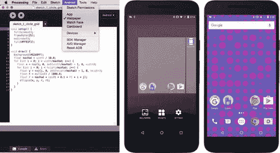

图 6-1。

Selecting the wallpaper option in the PDE (left), opening the wallpaper selector on the device (center), live wallpaper running in the home screen (right)

让我们考虑一下动态壁纸的几个重要方面。首先，它们覆盖了整个屏幕区域，所以我们应该用`fullScreen()`函数初始化它们。第二，动态壁纸在后台持续运行，因此会很快耗尽电池。因此，在打算作为壁纸运行的草图中不要使用非常繁重的计算是一个好主意。一般来说，这个建议对所有移动应用都有效，但对壁纸更是如此。减少动态壁纸电池使用的一个简单“技巧”是通过`frameRate()`功能设置一个较低的帧速率。使用 30 或 25 而不是默认的 60 将保持动画相当流畅，而不会以非常高的速度重绘屏幕和消耗更多的电池电量。

清单 [6-1](#Par7) 中的代码生成了一个大小可变的椭圆网格，我们使用了`fullScreen()`——以确保壁纸覆盖整个屏幕——和`frameRate(25),`,因为屏幕不需要更新得更快。

```java
void setup() {
  fullScreen();
  frameRate(25);
  noStroke();  
  fill(#FF03F3);
}

void draw() {
  background(#6268FF);
  float maxRad = 50 * displayDensity;  
  for (int i = 0; i < width/maxRad; i++) {
    float x = map(i, 0, int(width/maxRad) - 1, 0, width);
    for (int j = 0; j < height/maxRad; j++) {
      float y = map(j, 0, int(height/maxRad) - 1, 0, height);
      float t = millis() / 1000.0;
      float r = maxRad * cos(t + 0.1 * PI * i * j);
      ellipse(x, y, r, r);
    }
  }
}

Listing 6-1.Simple Live Wallpaper

```

要运行动态壁纸，我们首先需要在选择器中打开它。事实上，选择器向我们展示了一个壁纸的预览实例，我们可以将它设置为背景或者取消它来预览另一个。就在我们设置壁纸之后，预览实例被系统关闭，一个非预览实例被立即启动。我们可以通过调用`previewWallpaper()`函数来验证壁纸是否在预览模式下运行，该函数会相应地返回 true 或 false。这种检查使我们有机会在预览模式期间执行特殊的定制，例如加载更少的资源，因为壁纸不会运行很长时间，或者显示壁纸的代表性输出。

### 使用多个主屏幕

在介绍更高级的壁纸示例之前，我们将通过一个显示背景图像的简单应用程序来了解动态壁纸的一些重要特性。我们已经看到了如何在处理中加载和显示图像。同样的方法也适用于壁纸:只需将一个图像文件复制到草图的数据文件夹，用`loadImage()`加载，用`image()`显示，这样它就覆盖了设备的整个屏幕，如清单 [6-2](#Par10) 所示。

```java
PImage pic;
fullScreen();
pic = loadImage("paine.jpg");
image(pic, 0, 0, width, height);
Listing 6-2.Loading and Displaying an Image in Full-screen Mode

```

此代码的一个问题是，如果图像与屏幕的比例不同，图像会看起来失真。此外，壁纸总是以纵向模式显示，因此横向拍摄的照片会沿垂直方向拉伸。我们可以在`image()`函数中设置高度，使显示图像的宽高比与其原始比例相同，如清单 [6-3](#Par12) 所示。

```java
PImage pic;
fullScreen();
pic = loadImage("paine.jpg");
imageMode(CENTER);
float r = float(pic.width) / float(pic.height);
float h = width/r;
image(pic, width/2, height/2, width, h);
Listing 6-3.Keeping the Image Ratio

```

这里我们将图像模式设置为`CENTER`，因此`image()`函数的`x`和`y`参数被取为图像的中心，这使得它在屏幕上居中变得容易。因为我们把它画成屏幕的宽度，所以我们需要使用高度`width/r`，其中`r`是图像的原始宽高比。

Note

一个`PImage`对象中的宽度和高度变量是整数，所以我们需要把它们转换成浮点数，用`float(x)`得到一个带小数点的正确比值，比如 1.6(float(1280)/float(800)的结果)或者 0.561(也就是 float(2576) / float(4592))。

然而，使用这种方法，我们可能会浪费大量的屏幕空间，尤其是当图像非常宽的时候。Android 提供了一个功能可以在这种情况下有所帮助:多个主屏幕。用户可以通过左右滑动来移动这些屏幕，壁纸将相应地向两侧移动适当的量，这是根据主屏幕的数量和这些屏幕的宽度来确定的。处理通过两个函数公开这些信息:`wallpaperHomeCount()`和`wallpaperOffset()`。这首先返回主屏幕的当前数量(随着用户添加或删除主屏幕，它可能会在壁纸的生命周期内发生变化)，而第二个返回 0 和 1 之间的浮点数，对应于主屏幕的水平位移:当我们在第一个屏幕时为 0，最后一个屏幕时为 1。清单 [6-4](#Par16) 展示了我们如何使用这些函数来创建图像滚动交互。

```java
PImage pic;
float ratio;

void setup() {
  fullScreen();
  pic = loadImage("paine.jpg");
  ratio = float(pic.width)/float(pic.height);
}

void draw() {
  background(0);
  float w = wallpaperHomeCount() * width;
  float h = w/ratio;
  float x = map(wallpaperOffset(), 0, 1, 0, -(wallpaperHomeCount()-1) * width);
  image(pic, x, 0, w, h);
}

Listing 6-4.Image Scrolling Across Home Screens

```

我们使用`wallpaperHomeCount() * width`作为图像的显示宽度，跨越所有屏幕，当用户向右滑动时，我们将图像向左平移位移`x`。这样，图像的正确部分显示在当前屏幕上，平滑过渡，因为`wallpaperOffset()`在 0 和 1 之间连续变化(图 [6-2](#Fig2) )。

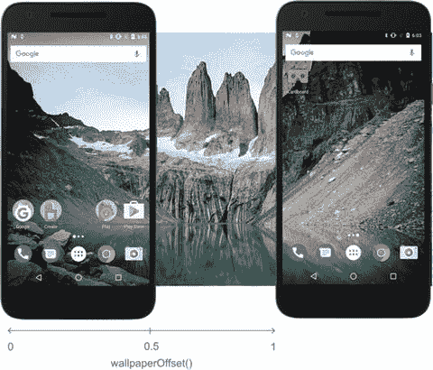

图 6-2。

Interpretation of the offset function in live wallpapers Note

当在屏幕上滑动时，我们可能会注意到断断续续的动画，特别是在高分辨率屏幕的设备上。这可能是默认渲染器无法以平滑帧速率在全屏模式下绘制的结果。一个解决方案是切换到 P2D 渲染器，它使用 GPU 进行硬件加速渲染。

### 处理权限

我们已经学会了在多个主屏幕上加载图像并显示为壁纸。我们可以基于这种技术创建一个照片库壁纸，浏览手机或平板电脑上的相机拍摄的照片。但是为了加载这些照片，我们的草图需要访问设备的外部存储，并且读取外部存储的权限必须由用户明确授予。尽管我们现在将在一个墙纸示例中查看权限请求，但是这些函数可以在任何类型的草图中使用。

事实上，权限是 Android 开发的一个非常重要的方面，因为移动设备处理几种不同类型的个人数据(联系人、位置、消息)，未经授权访问这些数据可能会导致隐私泄露。Android 操作系统确保每个应用程序都被授权访问设备中的特定数据和功能。常规权限(例如，Wi-Fi 和蓝牙访问)在用户首次安装应用程序时授予，而关键或“危险”权限(例如，访问摄像头、位置、麦克风、存储和身体传感器)需要在用户打开应用程序( [`https://developer.android.com/guide/topics/permissions/index.html`](https://developer.android.com/guide/topics/permissions/index.html) )时授予(在使用 Android 6.0 或更新版本的设备上)。

我们的草图所需的任何权限，无论是常规权限还是危险权限，都必须通过使用 Android 权限选择器从 PDE 添加到草图中，该选择器可从 Android 菜单下的“草图权限”选项获得(参见图 [6-3](#Fig3) )。

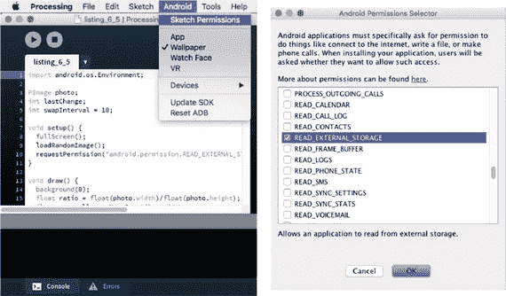

图 6-3。

“Sketch Permissions” option (left) and Android Permission Selector dialog (right)

对于普通权限，我们需要做的就是用权限选择器选择它们。然而，对于危险的权限，我们也必须在草图代码中用`requestPermission()`函数显式地请求它们。这个函数有两个参数——请求权限的名称(例如，`android.permission. READ_EXTERNAL_STORAGE`)和一个回调函数的名称，在我们的草图中，一旦用户授予(或拒绝)了权限，这个回调函数就会被调用。回调函数必须有一个布尔参数，这是它接收权限请求结果的地方。清单 [6-5](#Par23) 展示了这种机制，当许可被授予时，背景色变成绿色。回调函数不一定从`setup()`调用，因为当草图已经在`draw()`函数中时，Android 系统会显示权限对话框。所以，我们应该准备好处理 draw()中缺少预期权限的情况。为此，我们可以使用 hasPermission()函数来检查作为参数传递的权限，即:has permission(" Android . permission . read _ EXTERNAL _ STORAGE ")，是否已经被授予，并在每种情况下运行适当的代码。

```java
color bckColor = #EA6411;

void setup() {
  fullScreen();
  requestPermission("android.permission.READ_EXTERNAL_STORAGE",
                    "handlePermission");
}

void draw() {
  background(bckColor);
}

void handlePermission(boolean granted) {
  if (granted) bckColor = #58EA11;
}

Listing 6-5.Requesting a Dangerous Permission

```

Note

在 [`https://developer.android.com/reference/android/Manifest.permission.html`](https://developer.android.com/reference/android/Manifest.permission.html) 可以获得每个版本 Android 的所有权限列表。

回到我们的 image-gallery 壁纸草图，除了请求读取外部存储器的许可之外，它还需要列出存储在外部存储器中的所有照片。这个功能不是处理 API 的一部分，但是我们可以从草图中访问 Android API，并导入允许我们执行这些更高级任务的 Android 包。在从保存相机拍摄的图片和视频的`DCIM`文件夹中列出文件的情况下，我们可以使用`android.os.Environment`包中的`getExternalStoragePublicDirectory()`方法( [`https://developer.android.com/reference/android/os/Environment.html`](https://developer.android.com/reference/android/os/Environment.html) )。我们需要做的就是在草图的开始导入这个包。

我们现在有了图库壁纸所需的所有部分，如清单 [6-6](#Par27) 所示。我们现在将讨论本例中引入的新代码。

```java
import android.os.Environment;

PImage defImage, currImage;
ArrayList<String> imageNames = new ArrayList<String>();
int lastChange;
int swapInterval = 10;

void setup() {
  fullScreen();
  defImage = loadImage("default.jpg");
  if (!wallpaperPreview()) {
    requestPermission("android.permission.READ_EXTERNAL_STORAGE",
                      "scanForImages");
  }
  loadRandomImage();  
}

void draw() {
  background(0);
  float ratio = float(currImage.width)/float(currImage.height);
  float w = wallpaperHomeCount() * width;  
  float h = w/ratio;
  if (h < height) {
    h = height;
    w = ratio * h;
  }  
  float x = map(wallpaperOffset(), 0, 1, 0, -(wallpaperHomeCount()-1) * width);
  float y = (height - h)/2;
  image(currImage, x, y, w, h);
  int t = millis();
  if (swapInterval * 1000 < t - lastChange) {
    loadRandomImage();
    lastChange = t;
  }
}

void loadRandomImage() {
  if (imageNames.size() == 0) {
    currImage = defImage;
  } else {
    int i = int(random(1) * imageNames.size());
    String fn = imageNames.get(i);
    currImage = loadImage(fn);
  }    
}

void scanForImages(boolean grantedPermission) {
  if (grantedPermission) {
    File dcimDir = Environment.getExternalStoragePublicDirectory(
                   Environment.DIRECTORY_DCIM);
    String[] subDirs = dcimDir.list();
    if (subDirs == null) return;
    for (String d: subDirs) {
      if (d.charAt(0) == '.') continue;
      File fullPath = new File (dcimDir, d);  
      File[] listFiles = fullPath.listFiles();
      for (File f: listFiles) {
        String filename = f.getAbsolutePath().toLowerCase();
        if (filename.endsWith(".jpg")) imageNames.add(filename);
      }
    }
  }
}

Listing 6-6.Image-Gallery Wallpaper

```

这段代码的逻辑很简单:我们有当前和默认的`PImage`变量(`currImage`和`defImage`)以及一个图像文件名列表(`imageNames`)。当授予`READ_EXTERNAL_STORAGE`权限时，该列表在`scanForImages()`函数中初始化。在这个函数中，我们获得了用`getExternalStoragePublicDirectory()`表示 DCIM 文件夹的`File`对象，然后我们用它来遍历所有子文件夹，最后我们列出了每个子文件夹的内容。文件与。jpg 扩展名添加到列表中。每十秒钟调用一次`loadRandomImage()`，从列表中选择一个随机文件名，将新的`PImage`加载到`currImage`中。如果列表是空的，如果许可没有被授予，草图就使用默认的图像，我们应该在运行草图之前将它添加到数据文件夹中。

正如我们在本章开始时讨论的，我们不希望在仅仅预览壁纸时向用户呈现权限对话框，这就是为什么我们只在不处于预览模式时调用`requestPermission()`。预览将显示默认图像，这样用户在预览壁纸时仍然能够看到图像。

## 粒子系统

应用程序开发人员经常使用动态壁纸来创建动画图形，为静态背景图像提供替代方案。然而，这些图形不能过于强烈，因为它们可能会分散用户对设备屏幕上显示的相关信息的注意力(电话、消息、来自其他应用程序的提醒)。

怎样才能打造出视觉上有趣又不分散注意力的壁纸？一个可能的概念是流体模拟，其中一群粒子在背景中“有机地”移动，并留下某种痕迹。有机运动将有助于保持壁纸柔和，但仍然有吸引力，增加了随机变化的成分。我们也可以结合触摸交互来驱动某种形式的粒子运动，因为我们在前一章看到的触摸 API 可用于壁纸。考虑到这些想法，这可能是在现有作品中寻找视觉灵感的好时机，从绘画到基于代码的项目(图 [6-4](#Fig4) )。

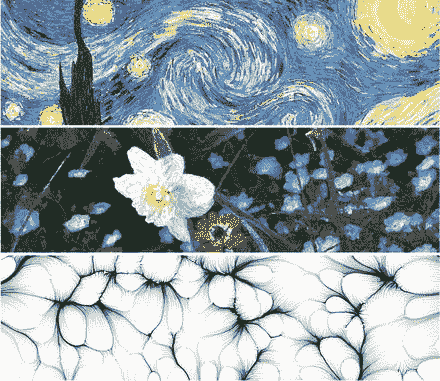

图 6-4。

From top to bottom: “Starry Night,” by Vincent van Gogh (1889), Plate from “Processing Images and Video for An Impressionist Effect” by Peter Litwinowicz (1997), Drawing Machine #10 by Ale Gonzalez ( [`https://www.openprocessing.org/sketch/34320`](https://www.openprocessing.org/sketch/34320) ).

我们现在可以开始用笔和纸勾画出一些想法(图 [6-5](#Fig5) )。一个想法是:单个粒子沿着弯曲的路径在接触点之间移动。问题是，我们如何模拟这些平滑的路径？在下一节中，我们将回顾一些技术，这些技术将允许我们实现这样的系统。

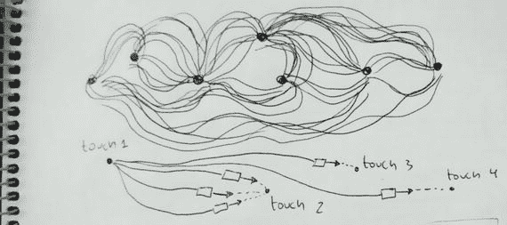

图 6-5。

Some pen and paper sketches for the particle-system wallpaper

### 自主代理

创建自然感觉的粒子系统的问题已经被研究了很多年。丹尼尔·希夫曼的书《代码的本质》(可在网上的 [`http://natureofcode.com/`](http://natureofcode.com/) 获得)很好地涵盖了这个主题(特别是第 [4](04.html) 和 [6](06.html) 章)。粒子系统允许我们模拟大量个体实体的涌现行为，每个个体都遵循简单(或更复杂)的运动规则。

粒子群具有某种程度的自主行为，由作用于它们的力决定，这在我们的项目中可能是有用的，因为我们不需要指定每个粒子的确切运动，只需要指定整体的力。克雷格·雷诺兹( [`http://www.red3d.com/cwr/steer/`](http://www.red3d.com/cwr/steer/) )提出了生成转向行为的算法。在一种称为流场跟随的算法中，目标速度场(“流场”)可以将粒子的运动导向特定的位置，而不会看起来是强制的或人为的。在这个算法中，每个粒子都有一个由其加速度、速度和位置决定的动态，一个力基于当前速度和屏幕空间每个点定义的目标速度之差作用在粒子上，如图 [6-6](#Fig6) 所示。

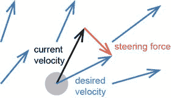

图 6-6。

Diagram of the steering force (red) that is applied on a particle moving on a flow field of velocities (blue)

为了让这种方法正常工作，我们需要提供一个驱动粒子运动的速度流场。我们认为触摸互动是这种运动的潜在来源。例如，每当指针改变位置时，我们可以计算测量指针位置变化的向量，即`(mouseX - pmouseX, mouseY – pmouseY)`，作为位置`(mouseX, mouseY)`处的“速度”。让我们在清单 [6-7](#Par36) 中实现这种方法。在这个例子中，我们将使用两个类来组织代码——一个存储每个粒子，另一个保存整个场。我们可以在 Java 模式下运行它，也可以在我们的设备或模拟器上作为常规应用程序运行。输出应该看起来或多或少如图 [6-7](#Fig7) 所示。

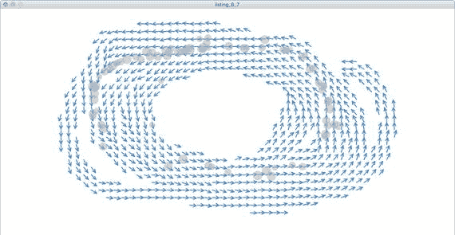

图 6-7。

Particle movement steered by a flow field derived from changes in touch position

```java
ArrayList<Particle> particles;
Field field;

void setup() {
  size(1200, 600);
  field = new Field();
  particles = new ArrayList<Particle>();
}

void draw() {
  background(255);
  field.display();
  for (int i = particles.size() - 1; i >= 0; i--) {
    Particle p = particles.get(i);
    p.update(field);
    p.display();
    if (p.dead()) particles.remove(i);
  }
}

void mouseDragged() {
  field.update(mouseX, mouseY, mouseX - pmouseX, mouseY - pmouseY);  
  particles.add(new Particle(mouseX, mouseY));
}

class Particle {
  PVector position;
  PVector velocity;
  PVector acceleration;
  float size;
  int life;
  float maxAccel;
  float maxSpeed;
  int maxLife;

  Particle(float x, float y) {
    position = new PVector(x, y);
    size = random(15, 25);
    velocity = new PVector(0, 0);    
    acceleration = new PVector(0, 0);    
    maxSpeed = random(2, 5);
    maxAccel = random(0.1, 0.5);
    maxLife = int(random(100, 200));
  }

  boolean dead() {
    return maxLife < life;
  }

  public void setPosition(float x, float y) {
    position.set(x, y);
  }

  void update(Field flow) {
    PVector desired = flow.lookup(int(position.x), int(position.y));
    acceleration.x = maxSpeed * desired.x - velocity.x;
    acceleration.y = maxSpeed * desired.y - velocity.y;
    acceleration.limit(maxAccel);
    velocity.add(acceleration);
    velocity.limit(maxSpeed);
    position.add(velocity);
    life++;
  }

  void display() {
    noStroke();
    fill(180, 150);    
    ellipse(position.x, position.y, size, size);    
  }
}

class Field {
  PVector[][] field;

  Field() {
    field = new PVector[width][height];
    for (int i = 0; i < width; i++) {
      for (int j = 0; j < height; j++) {
        field[i][j] = new PVector(0, 0);
      }
    }
  }

  void update(int x, int y, float vx, float vy) {
    for (int i = max(0, x - 20); i < min(x + 20, width); i++) {
      for (int j = max(0, y - 20); j < min(y + 20, height); j++) {
        PVector v = field[i][j];
        v.set(vx, vy);
        v.normalize();                
      }
    }
  }

  PVector lookup(int x, int y) {
    return field[x][y];
  }

  void display() {
    int resolution = 20;
    int cols = width / resolution;
    int rows = height / resolution;
    for (int i = 1; i < cols; i++) {
      for (int j = 1; j < rows; j++) {
        int x = i * resolution;
        int y = j * resolution;
        PVector v = lookup(x, y);
        pushMatrix();        
        translate(x, y);
        stroke(28, 117, 188);
        strokeWeight(2);
        rotate(v.heading());
        float len = v.mag() * (resolution - 2);
        if (0 < len) {
          float arrowsize = 8;
          line(0, 0, len, 0);
          line(len, 0, len-arrowsize, +arrowsize/2);
          line(len, 0, len-arrowsize, -arrowsize/2);
        }
        popMatrix();     
      }      
    }
  }
}

Listing 6-7.Particle System with Flow Field Calculated from Touch or Mouse Events

```

这段代码中发生了几件事，所以让我们一步一步地回顾一下。在`draw()`函数中，我们首先显示流场，然后迭代粒子列表，根据当前场更新它们的位置。我们展示它们，并最终移除那些被标记为“死亡”的请注意，我们以相反的顺序迭代列表，因为我们在迭代的同时删除了列表中的元素。如果我们执行一个普通的正向循环，我们可能会越过列表的末尾(因为开始循环时它的大小小于末尾的大小)，从而导致运行时错误。在`mouseDragged()`中，我们使用当前和上一个位置之间的差异来更新当前指针位置处的场，并且还添加了一个新粒子。

`Particle`类跟踪粒子的动态状态，包括它的位置、速度和加速度，以及它的“寿命”每次我们调用`update()`方法时，我们从粒子当前位置的流场获得所需的速度，然后计算转向力产生的加速度，根据雷诺公式，该加速度是所需速度和当前速度之差。`maxSpeed`因子允许我们改变粒子的运动，因为它是在`Particle`构造器中随机确定的，导致一些粒子运动得更快，另一些运动得更慢。

`Field`类有一个`PVector`对象的数组，带有`width` × `height`元素，包含屏幕每个像素的流场值。该字段最初到处都是零，但是我们使用`update()`方法将其设置为从触摸或鼠标事件中获得的值。请注意，在这种方法中，我们不仅仅在(x，y)位置设置场向量，而是在以(x，y)为中心的矩形中设置场向量，因为否则向量场的变化只会影响非常小的区域——不足以控制粒子穿过屏幕。最后，`display()`方法也需要注意，因为我们不能在屏幕上画出所有像素的场矢量。我们使用一个更大的网格，这样我们就可以为每个尺寸为`resolution`的矩形绘制一个矢量。`PVector`类中的方法，比如`heading()`，在这里可以方便地将向量绘制成小箭头，这有助于可视化流向。

虽然这个例子是一个简单的操纵行为的应用，我们可以用许多不同的方式来改进，但一个问题是它需要持续的触摸输入来保持系统的发展。虽然这对于常规应用来说没问题，但如此依赖壁纸中的触摸交互可能会有问题，因为主屏幕上的触摸主要用于驱动与 UI 的交互。在粒子中创建运动的拖动可能会被误认为是改变主屏幕的滑动，反之亦然。我们将在下一节中看到如何生成不需要触摸交互的流场。

### 图像流场

有几种方法我们可以生成一个平滑的流场，给我们的粒子系统足够的视觉可变性。一种可能是使用由柏林噪声(`mrl.nyu.edu/∼perlin/doc/oscar.html`)生成的场，柏林噪声是一种合成生成的随机噪声，它平滑地变化并产生看起来更有机的图案。另一种可能是使用图像。事实证明，我们可以转换图像中每个像素位置的颜色信息来计算流场的速度矢量。

更具体地说，如果我们用`brightness()`函数计算一种颜色的亮度，我们得到一个介于 0(黑色)和 1(白色)之间的数，我们可以用它作为速度矢量相对于 x 轴的角度。这会产生一个平滑的速度流场，遵循图像的特征(边缘、颜色漩涡等)。).我们可以使用 Processing 的`PVector`类中的`fromAngle(theta)`函数来轻松计算向量。从图像中生成速度场时，另一个非常重要的功能是访问图像中各个像素的能力。一旦我们调用了`loadPixels()`函数，我们就可以用任何`PImage`对象都可用的`pixels`数组来做到这一点。我们在清单 [6-8](#Par43) 中组合了所有这些，它加载一个图像并生成相关的流场，如图 [6-8](#Fig8) 所示。

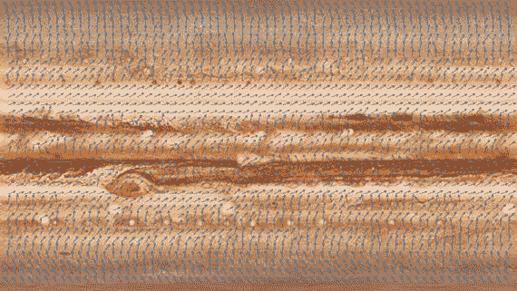

图 6-8。

Flow field generated from an image

```java
PImage img;

void setup() {
  fullScreen();
  img = loadImage("jupiter.jpg");
  img.loadPixels();
}

void draw() {
  image(img, 0, 0, width, height);
  int resolution = 30;
  int cols = width / resolution;
  int rows = height / resolution;
  for (int i = 1; i < cols; i++) {
    for (int j = 1; j < rows; j++) {
      int x = i * resolution;
      int y = j * resolution;
      int ix = int(map(x, 0, width, 0, img.width - 1));
      int iy = int(map(y, 0, height, 0, img.height - 1));
      int idx = ix + iy * img.width;
      int c = img.pixels[idx];
      float theta = map(brightness(c), 0, 255, 0, TWO_PI);
      PVector v = PVector.fromAngle(theta);
      drawArrow(x, y, v, resolution-2);
    }
  }
}

void drawArrow(float x, float y, PVector v, float l) {
  pushMatrix();
  float arrowsize = 8;
  translate(x, y);
  strokeWeight(2);
  stroke(28, 117, 188);
  rotate(v.heading());
  float len = v.mag() * l;
  line(0, 0, len, 0);
  line(len, 0, len-arrowsize, +arrowsize/2);
  line(len, 0, len-arrowsize, -arrowsize/2);
  popMatrix();  
}

Listing 6-8.Code That Generates a Flow Field from an Image

```

在这个例子中，我们需要访问图像中的单个像素。我们通过首先调用`setup()`中的方法`loadPixels()`来实现，该方法初始化我们稍后在`draw()`中使用的`pixels`数组。这是一个一维数组，图像中的每一行像素都是一个接一个存储的，所以像素(ix，iy)对应于数组中的元素 idx，如图 [6-9](#Fig9) 所示。然而，在代码中还有另一个转换，因为我们拉伸图像以覆盖整个屏幕。因此，我们首先需要使用`map()`函数将屏幕坐标(x，y)映射到像素索引(ix，iy)。然后，我们可以应用图像中像素的索引和阵列中的索引之间的对应关系。

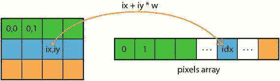

图 6-9。

Correspondence between pixels in an image and elements in the pixels array

## 图像流动壁纸

我们现在知道如何从任何图像生成一个平滑的矢量场。我们可以将固定的图像列表添加到我们的草图中，并在它们之间循环，以产生可变的运动模式。但更好的是，我们可以应用我们在照片图库示例中学到的技术来加载用设备的摄像头拍摄的照片，并将它们用作我们的流场的源。这将为我们的壁纸增添独特和无尽的变化。然而，为了实现这个壁纸，仍然有一些重要的细节需要解决，我们将在下面的部分中考虑。

### 加载、调整大小和裁剪图像

我们可能面临的一个问题是，设备的摄像头，尤其是最近的 Android 手机，可以以非常高的分辨率拍照。当我们将这些图片加载到一个`PImage`对象中，然后用`loadPixels()`加载`pixels`数组时，我们可能会耗尽内存(壁纸分配给它们的资源较少，以免影响系统中的其他应用)。然而，我们不需要全高分辨率的图像来计算流场。事实上，我们可以将一张图片加载到一个临时位图对象中，然后在将它加载到草图中的`PImage`对象之前，调整它的大小并将其裁剪到所需的大小。在清单 [6-9](#Par47) 中，我们将`croppedBitmap()`函数添加到清单 [6-6](#Par27) 中的图库示例中。

```java
import android.os.Environment;
import java.io.FileOutputStream;
import android.graphics.Bitmap;
import android.graphics.BitmapFactory;
...
void loadRandomImage() {
  if (imageNames.size() == 0) {
    currImage = defImage;
  } else {
    int i = int(random(1) * imageNames.size());
    String sourceFn = imageNames.get(i);
    try {
      File destFile = sketchFile("cropped.jpg");
      Bitmap bitmap = croppedBitmap(sourceFn);      
      OutputStream fout = new FileOutputStream(destFile);
      bitmap.compress(Bitmap.CompressFormat.JPEG, 85, fout);
      currImage = loadImage("cropped.jpg");
    } catch (Exception ex) {
      println("An error while cropping has occurred");
      currImage = defImage;
    }
  }    
}
...
Bitmap croppedBitmap(String sourceFile) {
  BitmapFactory.Options options = new BitmapFactory.Options();
  options.inJustDecodeBounds = false;
  options.inSampleSize = 4;  
  Bitmap src = BitmapFactory.decodeFile(sourceFile, options);  
  int srcW = options.outWidth;
  int srcH = options.outHeight;
  float ratio = float(width)/float(height);
  float srcRatio = float(srcW)/float(srcH);
  int cropX, cropY, cropW, cropH;
  if (ratio < srcRatio) {
    cropH = srcH;
    cropW = int(ratio * cropH);    
  } else {
    cropW = srcW;
    cropH = int(cropW / ratio);
  }
  cropX = (srcW - cropW)/2;
  cropY = (srcH - cropH)/2;
  return Bitmap.createBitmap(src, cropX, cropY, cropW, cropH);
}
Listing 6-9.Cropping and Loading Images

```

这里，在选择图像文件之后，我们应用调整大小/裁剪，其中我们利用`Bitmap`类来解码图像，同时对其进行下采样(在本例中，将其原始宽度和高度减少四分之一)，然后我们确定裁剪区域，以便在全屏模式下显示图像的正确比例区域。我们将裁剪后的图像保存到草图文件夹中的一个新文件中，名为`cropped.jpg`，然后像以前一样用`loadImage()`加载它。我们应该能够看到背景中显示的图像的像素化。

### 把所有东西放在一起

在经历了前面几节从图像创建流场(清单 [6-8](#Par43) )和从外部存储器裁剪并加载图像(清单 [6-9](#Par47) )之后，我们准备好将我们的图像流壁纸放在一起。我们可以按照基于触摸的粒子系统的结构，用单独的`Particle`和`Field`类，来得到清单 [6-10](#Par50) 。

```java
import android.os.Environment;
import java.io.FileOutputStream;
import android.graphics.Bitmap;
import android.graphics.BitmapFactory;

int maxParticles = 200;
int swapInterval = 10;
Field field;
ArrayList<Particle> particles;
ArrayList<String> imageNames = new ArrayList<String>();
int lastChange;

void setup() {
  fullScreen(P2D);
  frameRate(25);  
  field = new Field();
  if (!wallpaperPreview()) {
    requestPermission("android.permission.READ_EXTERNAL_STORAGE",
                      "scanForImages");
  }  
  particles = new ArrayList<Particle>();
  for (int i = 0; i < maxParticles; i++) {
    particles.add(new Particle(random(width), random(height)));
  }
  loadRandomImage();
  background(255);
}

void draw() {
  for (Particle b: particles) {
    b.update(field);
    b.display();
  }
  int t = millis();
  if (swapInterval * 1000 < t - lastChange) {
    loadRandomImage();
    lastChange = t;
  }
}

void loadRandomImage() {
  if (imageNames.size() == 0) {
    field.update("default.jpg");
  } else {
    int i = int(random(1) * imageNames.size());
    String sourceFn = imageNames.get(i);
    try {
      File destFile = sketchFile("cropped.jpg");
      Bitmap bitmap = croppedBitmap(sourceFn);      
      OutputStream fout = new FileOutputStream(destFile);
      bitmap.compress(Bitmap.CompressFormat.JPEG, 85, fout);
      field.update("cropped.jpg");
    } catch (Exception ex) {
      println("An error while cropping has occurred");
      field.update("default.jpg");
    }
  }
}

void scanForImages(boolean grantedPermission) {
  if (grantedPermission) {
    File dcimDir = Environment.getExternalStoragePublicDirectory(
                   Environment.DIRECTORY_DCIM);
    String[] subDirs = dcimDir.list();
    if (subDirs == null) return;
    for (String d: subDirs) {
      if (d.charAt(0) == '.') continue;
      File fullPath = new File (dcimDir, d);  
      File[] listFiles = fullPath.listFiles();
      for (File f: listFiles) {
        String filename = f.getAbsolutePath().toLowerCase();
        if (filename.endsWith(".jpg")) imageNames.add(filename);
      }
    }
  }
}

Bitmap croppedBitmap(String sourceFile) {
  BitmapFactory.Options options = new BitmapFactory.Options();
  options.inJustDecodeBounds = false;
  options.inSampleSize = 4;  
  Bitmap src = BitmapFactory.decodeFile(sourceFile, options);  
  int srcW = options.outWidth;
  int srcH = options.outHeight;
  float ratio = float(width)/float(height);
  float srcRatio = float(srcW)/float(srcH);
  int cropX, cropY, cropW, cropH;
  if (ratio < srcRatio) {
    cropH = srcH;
    cropW = int(ratio * cropH);    
  } else {
    cropW = srcW;
    cropH = int(cropW / ratio);
  }
  cropX = (srcW - cropW)/2;
  cropY = (srcH - cropH)/2;
  return Bitmap.createBitmap(src, cropX, cropY, cropW, cropH);
}

class Field {
  PImage flowImage;

  void update(String fn) {
    flowImage = loadImage(fn);
    flowImage.loadPixels();
  }

  PVector lookupVector(PVector v) {
    if (flowImage == null) return PVector.random2D();
    color c = flowImage.pixels[getPixelIndex(v.x, v.y)];
    float theta = map(brightness(c), 0, 255, 0, TWO_PI);
    return PVector.fromAngle(theta);
  }  

  color lookupColor(PVector v) {
    if (flowImage == null) return color(0, 0, 100, 0);
    return flowImage.pixels[getPixelIndex(v.x, v.y)];
  }

  int getPixelIndex(float x, float y) {
    int ix = int(map(x, 0, width, 0, flowImage.width - 1));
    int iy = int(map(y, 0, height, 0, flowImage.height - 1));
    return constrain(ix + iy * flowImage.width, 0, flowImage.pixels.length - 1);    
  }  
}

class Particle {
  PVector position;
  PVector velocity;
  PVector acceleration;
  float size;
  color color;
  int life;  
  float maxAccel;
  float maxSpeed;    
  int maxLife;

  Particle(float x, float y) {
    position = new PVector(x, y);
    size = random(2, 4) * displayDensity;
    velocity = new PVector(0, 0);    
    acceleration = new PVector(0, 0);
    maxSpeed = random(2, 5);
    maxAccel = random(0.1, 0.5);    
    maxLife = int(random(5, 20));
  }

  void update(Field flow) {
    if (life == 0) {
      color = flow.lookupColor(position);
    } else if (life > frameRate * maxLife) {
      position.x = random(width);
      position.y = random(height);
      life = 0;
      color = flow.lookupColor(position);
    }

    PVector desired = flow.lookupVector(position);
    acceleration.x = maxSpeed * desired.x - velocity.x;
    acceleration.y = maxSpeed * desired.y - velocity.y;
    acceleration.limit(maxAccel);
    velocity.add(acceleration);
    velocity.limit(maxSpeed);
    position.add(velocity);

    if (position.x < -size) position.x = width + size;
    if (position.y < -size) position.y = height + size;
    if (position.x > width + size) position.x = -size;
    if (position.y > height + size) position.y = -size;

    life++;
  }

  void display() {
    float theta = velocity.heading();
    noStroke();
    pushMatrix();
    translate(position.x,position.y);
    rotate(theta);
    fill(color);
    beginShape(QUADS);    
    vertex(-2*size, -size);
    vertex(+2*size, -size);
    vertex(+2*size, +size);
    vertex(-2*size, +size);
    endShape();
    popMatrix();
  }
}

Listing 6-10.Image-flow Wallpaper

```

`Field`类包含保存要从中导出流场的图像的`PImage`对象，通过传入文件名来设置新图像的`update()`方法，以及两个查找方法`lookupVector()`和`lookupColor()`，它们分别返回给定位置的场向量和图像颜色。注意`getPixelIndex()`方法的使用是很重要的，该类在内部使用该方法将屏幕位置(x，y)转换为有效的像素索引，而不考虑当前流图像的分辨率。

`Particle`类与清单 [6-7](#Par36) 中看到的非常相似，增加了一些关键的东西:在每次更新的开始，我们计算粒子“寿命”开始时的颜色，并在`life`变量达到最大值时重新开始它的位置；在更新结束时，我们检查粒子是否在屏幕之外，如果是，我们将它包裹起来，使它从屏幕的另一侧出现，以确保我们的粒子不会跑偏。

### 使用线程

正如在线参考中所解释的，加工草图遵循特定的步骤顺序:首先是`setup()`，然后是`draw()`，一遍又一遍地循环。一个线程也是一系列具有开始、中间和结束的步骤。一个加工草图是一个单独的线程，通常称为“动画线程”( [`https://processing.org/reference/thread_.html`](https://processing.org/reference/thread_.html) )。虽然在大多数情况下单线程就足够了，但有时我们需要一个单独的线程来执行额外的计算。例如，我们的图像流壁纸的一个问题是，当一个新的图像被调整大小和加载时，它会暂停一会儿。原因是调整大小/加载过程当前发生在动画线程中，阻止了后续帧的渲染，因此造成了延迟。解决方案是在一个单独的线程中运行`loadRandomImage()`函数，这样就可以在不妨碍渲染的情况下并行调整图像大小和加载图像。这可以通过用`thread("loadRandomImage")`替换`draw()`中对`loadRandomImage()`的调用来实现。

因为线程彼此独立运行，我们可能会面临多个线程同时调用 Field 类中的`update()`方法的问题，或者粒子在另一个线程更新字段数据时从动画线程中查找字段数据。如果处理不当，这种并发访问会导致意外错误。一个解决方案是将访问`flowImage`的`Field`类中的所有方法标记为“同步”当一个线程正在调用同步方法时，不能从另一个线程调用它们。清单 [6-11](#Par55) 显示了使用线程和处理并发所需的壁纸代码的变化。

```java
void draw() {...
  if (swapInterval * 1000 < t - lastChange) {
    thread("loadRandomImage");
    lastChange = t;
  }
}
...
class Field {
  PImage flowImage;

  synchronized void update(String fn) {
    flowImage = loadImage(fn);
    flowImage.loadPixels();
  }

  synchronized PVector lookupVector(PVector v) {
    if (flowImage == null) return PVector.random2D();
    color c = flowImage.pixels[getPixelIndex(v.x, v.y)];
    float theta = map(brightness(c), 0, 255, 0, TWO_PI);
    return PVector.fromAngle(theta);
  }  

  synchronized color lookupColor(PVector v) {
    if (flowImage == null) return color(0, 0, 100, 0);
    return flowImage.pixels[getPixelIndex(v.x, v.y)];
  }
...
}

Listing 6-11.Running the Image-loading Function in a Separate Thread

```

### 控制色调

正如我们之前所讨论的，动态壁纸应该在视觉上吸引人，但又不至于压倒用户界面。在我们的例子中，粒子的颜色可能太亮或太饱和，使得很难看到前景中的图标。这个问题的一个解决方案是在我们的草图中使用 HSB 颜色空间，然后在从`pixels`数组中获得颜色时调整颜色的亮度。清单 [6-12](#Par57) 包括一个修改过的`lookupColor()`方法，该方法应用处理的`hue()`和`saturation()`函数来提取这些属性，然后用`color()`来重建最终的颜色，因此粒子保持其原始色调和饱和度，但降低其亮度和不透明度。

```java
void setup() {
  ...
  colorMode(HSB, 360, 100, 100, 100);
  background(0, 0, 100);
}
...
class Field {
  ...
  synchronized color lookupColor(PVector v) {
    if (flowImage == null) return color(0, 0, 100, 0);
    color c = flowImage.pixels[getPixelIndex(v.x, v.y)];
    float h = hue(c);
    float s = saturation(c);
    float b = 50;
    return color(h, s, b, 70);    
  }
  ...
}
Listing 6-12.Using the HSB Color Space

```

为了使用 HSB 色彩空间，我们需要使用`colorMode()`函数在`setup()`中设置色彩模式，我们已经在第 [4](04.html) 章中看到了。修改后我们的图像流壁纸应该显示更多柔和的颜色，如图 [6-10](#Fig10) 所示。

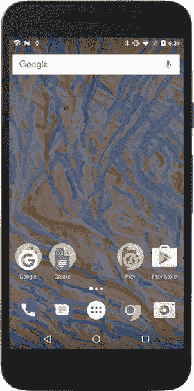

图 6-10。

Final version of the image-flow wallpaper running in the background

### 结束项目

作为这个项目的最后一个阶段，我们应该为所有需要的分辨率(36 × 36、48 × 48、72 × 72、96 × 96、144 × 144 和 192 × 192 像素)创建图标，并在 manifest 文件中为我们的壁纸设置一个唯一的包名和版本号。见图 [6-11](#Fig11) 。

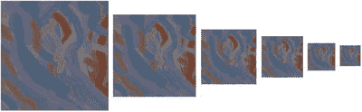

图 6-11。

Icon set for the image flow wallpaper.

如果草图在设备或仿真器上至少运行过一次，则清单文件中已经填充了大部分必需的值。我们应该在应用程序和服务标签中设置一个唯一的包名和`android:label`属性，以便在壁纸选择器和应用程序列表中用一个更易读的标题来标识壁纸。包含所有这些值的完整清单文件如下所示:

```java
<?xml version="1.0" encoding="UTF-8"?>
<manifest xmlns:android="http://schemas.android.com/apk/res/android"
          android:versionCode="1"android:versionName="1.0"
          package="com.example.image_flow">
    <uses-sdk android:minSdkVersion="17" android:targetSdkVersion="25"/>
    <uses-feature android:name="android.software.live_wallpaper"/>
    <application android:icon="@drawable/icon"
                 android:label="Image Flow">
        <service android:label="Image Flow"
                 android:name=".MainService"
                 android:permission="android.permission.BIND_WALLPAPER">
            <intent-filter>
                <action
                 android:name="android.service.wallpaper.WallpaperService"/>
            </intent-filter>
            <meta-data android:name="android.service.wallpaper"
                       android:resource="@xml/wallpaper"/>
        </service>
        <activity android:name="processing.android.PermissionRequestor"/>    
    </application>
    <uses-permission android:name="android.permission.READ_EXTERNAL_STORAGE"/>
</manifest>

```

编辑完清单后，我们准备将草图导出为一个签名包，以便上传到谷歌 Play 商店，正如我们在第 [3](03.html) 章中所讨论的。

## 摘要

动态壁纸为我们提供了一种独特的媒介来创建动画图形，用户可以在他们的设备上体验动态背景。我们可以在处理中应用整个绘图 API 来创建原始壁纸，正如我们在本章中了解到的，也可以导入 Android API 来执行更高级的任务，例如从外部存储中读取文件或调整图像大小。本章还介绍了正常和危险权限的概念，以及如何从我们的草图中请求它们，我们将在下一章中多次重温。