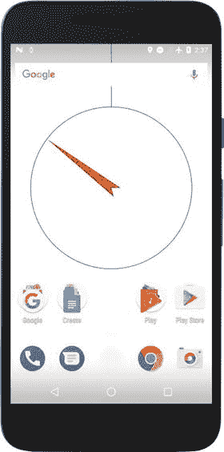

# 八、利用传感器数据驱动图形和声音

上一章已经介绍了读取传感器数据的基础知识，现在我们将了解如何在处理草图中使用来自加速度计、磁力计和陀螺仪的数据来生成交互式图形和声音。

## 使用科泰读取传感器数据

Android 设备中可用的传感器为我们提供了设备周围的大量数据。我们看到了如何通过使用 Android API 或 Ketai 库来检索这些数据，后者使传感器处理更容易。一旦数据以数值的形式出现在我们的草图中，我们就可以用任何我们想要的方式来驱动代码中的动画和交互。

在这一章中，我们将重点讨论三种特定的传感器，它们可以对我们设备的移动和位置状态提供即时反馈:加速度计(以及衍生的计步器)、磁场传感器和陀螺仪。有了这些传感器的数据，我们的机器人草图将能够对设备检测到的各种运动做出反应:突然的摇动、行走、空间旋转以及相对于地球磁场的方向。

我们将使用 Ketai 来读取传感器数据，因为它消除了定义事件监听器和传感器管理器的需要，从而简化了代码。然而，本章中的所有例子都可以很容易地使用 Android API。

## 测量加速度

加速度是速度相对于时间的变化率，但 Android 返回的加速度值还包括由于重力产生的加速度，该加速度指向地面，大小为 9.8 m/s <sup>2</sup> 。如果我们的手机完全静止在桌子上，屏幕朝上，它的加速度应该是 a = (0，0，-9.8)，因为它包括了 z 轴负方向的重力(记得图 7-1 )。但是，如果我们旋转手机，重力加速度将沿着三个轴投影，这取决于手机相对于垂直方向的方向。


图 8-1。

Acceleration pattern during the walking stages (left), and acceleration data corresponding to a series of steps (right). Reproduced with permission from Neil Zhao

### 震动检测

当我们摇动手机时，我们使它的速度在很短的时间内从零快速变化到一个高值。因此，在此期间加速度会很高。我们可以通过计算加速度向量的大小来检测这种情况，如果它足够大，就触发“震动事件”。但是，我们还需要考虑到重力已经在加速度中了，所以它的大小需要至少大于重力的大小，9.8 m/s <sup>2</sup> 。我们可以通过比较从 Ketai 获得的加速度向量的大小和重力常数来做到这一点，如果前者比预定义的阈值大，则确定发生了震动。这就是我们在清单 8-1 中要做的事情。

```java
import ketai.sensors.*;
import android.hardware.SensorManager;

KetaiSensor sensor;
PVector accel = new PVector();
int shakeTime;

color bColor = color(78, 93, 75);

void setup() {
  fullScreen();  
  sensor = new KetaiSensor(this);
  sensor.start();
  textAlign(CENTER, CENTER);
  textSize(displayDensity * 36);
}

void draw() {
  background(bColor);
  text("Accelerometer: \n" +
    "x: " + nfp(accel.x, 1, 3) + "\n" +
    "y: " + nfp(accel.y, 1, 3) + "\n" +
    "z: " + nfp(accel.z, 1, 3), 0, 0, width, height);
}

void onAccelerometerEvent(float x, float y, float z) {
  accel.set(x, y, z);
  int now = millis();
  if (now - shakeTime > 250) {
    if (1.2 * SensorManager.GRAVITY_EARTH < accel.mag()) {
      bColor = color(216, 100, 46);
      shakeTime = now;
    } else {
      bColor = color(78, 93, 75);
    }    
  }  
}

Listing 8-1.Simple Shake-Detection Code

```

检查抖动的条件是`1.2 * SensorManager.GRAVITY_EARTH < accel.mag())`。这里，我们使用 1.2 作为抖动检测的阈值，我们可以使用更小或更大的值来检测更弱或更强的抖动。Android 中传感器 API 的`SensorManager`类变得很方便，因为它包含一个常数`GRAVITY_EARTH`，代表地球的重力加速度(太阳系中所有行星都有类似的常数，加上月球、太阳和虚构的死星)。时间条件已经到位，所以我们的应用不能每 250 毫秒触发一次以上的震动。

### 步进计数器

在检测震动的情况下，我们只需识别由加速度大小表征的单个事件。在行走或跑步时检测步数的情况下，问题更加困难:当我们迈出一步时，仅仅识别加速度的单一变化是不够的，而是我们需要记录一段时间内的规律，如图 8-1 所示。

然而，这种模式并不遵循完美的曲线，因为它受到信号噪声和行走速度不规则性的影响。再者就是因人而异，看自己的步态。虽然找出一种能够从原始加速度计数据中检测步数的算法并不太难，但 Android 通过在 4.4 版本中提供一种新型传感器(KitKat)来解决这个问题:步数计数器。该传感器为我们分析加速度计输入。它每走一步都会触发一个新的事件，所以我们可以在任何我们希望的时间间隔内计算步数。清单 8-2 中描述了加工中一个非常简单的步骤检测草图。

```java
import ketai.sensors.*;

KetaiSensor sensor;
color bColor = color(78, 93, 75);
int stepTime = 0;
int stepCount = 0;

void setup() {
  fullScreen();
  orientation(PORTRAIT);
  sensor = new KetaiSensor(this);
  sensor.start();
  textAlign(CENTER, CENTER);
  textSize(displayDensity * 24);
}

void draw() {
  if (millis() - stepTime > 500) {
    bColor = color(78, 93, 75);
  }
  background(bColor);
  text("Number of steps = " + stepCount, 0, 0, width, height);
}

void onStepDetectorEvent() {
  bColor = color(216, 100, 46);
  stepTime = millis();  
  stepCount++;
}

Listing 8-2.Using Android’s Step Counter

```

Ketai 有另一个函数`onStepCounterEvent(float s)`，我们在变量`s`中接收设备重启后的总步数。如果我们需要在应用未运行时跟踪一天的总步数，而又不错过活动，这可能会很有用。

### 步骤数据的视听映射

正如我们刚刚看到的，使用 Ketai 中的步数检测器事件来计算单个步数非常容易。如何在我们的加工草图中使用这些步数数据是一个我们只有在考虑我们的最终目标是什么之后才能回答的问题；例如，显示身体活动的“实用”可视化，创建该活动的更抽象的表示，驱动一些我们可以用作动态壁纸的背景图形(和/或音频)，等等。

由我们来决定如何将传感器数据映射到视觉或声音元素中。为了说明如何进行这种映射，我们将绘制一个草图，其中每一个新的步骤都会触发一个简单的动画，一个彩色的圆圈出现在屏幕上，然后淡出到背景中，因此最终结果将是一个响应我们行走的几何图案。

在进入 Android 模式之前，我们可以开始用 Java 模式写一些草图来完善视觉概念。一种可能的方法是使用一个矩形网格，我们在网格上随机放置彩色点。定义一个类来保存点的动画逻辑，以及在草图运行时使用数组列表来跟踪可变数量的点，这可能是有用的。所有这些想法都在清单 8-3 中实现了。

```java
float minSize = 50;
float maxSize = 100;
ArrayList<ColorDot> dots;

void setup() {
  size(800, 480);
  colorMode(HSB, 360, 100, 100, 100);
  noStroke();
  dots = new ArrayList<ColorDot>();
}

void draw() {
  background(0, 0, 0);  

  if (random(1) < 0.1) {
    dots.add(new ColorDot());
  }  

  for (int i = dots.size() - 1; i >= 0 ; i--) {
    ColorDot d = dots.get(i);
    d.update();
    d.display();
    if (d.colorAlpha < 1) {
      dots.remove(i);
    }    
  }  
}

class ColorDot {
  float posX, posY;
  float rad, maxRad;
  float colorHue, colorAlpha;

  ColorDot() {
    posX = int(random(1, width/maxSize)) * maxSize;
    posY = int(random(1, height/maxSize)) * maxSize;
    rad = 0.1;
    maxRad = random(minSize, maxSize);
    colorHue = random(0, 360);
    colorAlpha = 70;
  }

  void update() {
    if (rad < maxRad) {
      rad *= 1.5;
    } else {
      colorAlpha -= 0.3;
    }
  }

  void display() {
    fill(colorHue, 100, 100, colorAlpha);
    ellipse(posX, posY, rad, rad);
  }
}

Listing 8-3.
Random Colored Dots

```

这里，我们使用 HSB 空间从整个光谱中随机选取一种颜色，同时保持饱和度和亮度不变。这些点通过快速增大尺寸(随着半径的`rad *= 1.5`更新)来制作动画，然后通过降低 alpha 随着`colorAlpha -= 0.3`逐渐消失，直到它们变得完全透明，这时它们被移除。在每一帧中以 0.1 的概率添加新点。调整这些值后，我们应该得到类似于图 8-2 的输出。


图 8-2。

Output of the initial sketch that generates random dots, running from Java mode

下一步是连接点动画与步骤检测。实现这一点的一个简单方法是在每次触发步进检测器事件时创建一个新的点。因此，我们需要将 Ketai 库添加到前面的代码中，然后在`onStepDetectorEvent()`事件中创建点，如清单 8-4 所示。

```java
import ketai.sensors.*;

KetaiSensor sensor;

float minSize = 150 * displayDensity;
float maxSize = 300 * displayDensity;
ArrayList<ColorDot> dots;

void setup() {
  fullScreen();
  orientation(LANDSCAPE);
  colorMode(HSB, 360, 100, 100, 100);
  noStroke();  
  dots = new ArrayList<ColorDot>();  
  sensor = new KetaiSensor(this);
  sensor.start();  
}

void draw() {
  background(0, 0, 0);    
  for (int i = dots.size() - 1; i >= 0 ; i--) {
    ColorDot d = dots.get(i);
    d.update();
    d.display();
    if (d.colorAlpha < 1) {
      dots.remove(i);
    }
  }  
}

class ColorDot {
  float posX, posY;
  float rad, maxRad;
  float colorHue, colorAlpha;

  ColorDot() {
    posX = int(random(1, width/maxSize)) * maxSize;
    posY = int(random(1, height/maxSize)) * maxSize;
    rad = 0.1;
    maxRad = random(minSize, maxSize);    
    colorHue = random(0, 360);    
    colorAlpha = 70;
  }

  void update() {
    if (rad < maxRad) {
      rad *= 1.5;
    } else {
      colorAlpha -= 0.1;
    }
  }

  void display() {
    fill(colorHue, 100, 100, colorAlpha);
    ellipse(posX, posY, rad, rad);
  }
}

void onStepDetectorEvent() {
  dots.add(new ColorDot());
}

Listing 8-4.Using Steps to Animate the Dots

```

注意点的最小和最大尺寸现在是如何被`displayDensity`缩放的，所以我们草图的输出保持了它的比例，而不管屏幕设备的 DPI。我们可以运行这个草图作为一个普通的应用或动态壁纸，以防我们想让它一直运行，并在我们的主屏幕上驱动背景图像。

可以用不同的方法来完善这个草图。例如，我们可以通过将这些参数与时间和行走速度联系起来，来减少点的大小和颜色的随机性。为了计算后者，我们可以在某个固定的时间间隔(比如说每五秒钟)将计数值重置为零，并除以自上次重置以来经过的时间(因为速度=数值差/时间差)。清单 8-5 包括我们需要存储当前行走速度、上次更新时间和步数的额外变量，以及计算点半径和色调的差异(其余与清单 8-4 相同)。

```java
import ketai.sensors.*;

KetaiSensor sensor;

float minSize = 150 * displayDensity;
float maxSize = 300 * displayDensity;
ArrayList<ColorDot> dots;

int stepCount = 0;
int updateTime = 0;
float walkSpeed = 0;
...
class ColorDot {
  float posX, posY;
  float rad, maxRad;
  float colorHue, colorAlpha;

  ColorDot() {
    posX = int(random(1, width/maxSize)) * maxSize;
    posY = int(random(1, height/maxSize)) * maxSize;
    rad = 0.1;
    float speedf = constrain(walkSpeed, 0, 2)/2.0;
    maxRad = map(speedf, 1, 0, minSize, maxSize);
    colorHue = map(second(), 0, 60, 0, 360);    
    colorAlpha = 70;
  }
  ...
}

void onStepDetectorEvent() {
  int now = millis();
  stepCount++;
  if (5000 < now - updateTime) {
    walkSpeed = stepCount/5.0;
    stepCount = 0;
    updateTime = now;
  }
  dots.add(new ColorDot());
}

Listing 8-5.Using Time and Walking Speed to Control Animation

```

如果我们检查`ColorDot`类的构造函数中半径的计算，我们可以看到`walkSpeed`中的值并没有被直接使用，而是首先用函数`constrain()`限制在 0-2 步/秒的范围内，然后进行归一化，这样我们就有了一个介于 0 和 1 之间的值，我们可以一致地映射到半径范围`maxSize` - `minSize`。这意味着我们走得越快，圆点应该越小。点的色调也是映射的结果，在这种情况下，使用`second()`功能获得的当前秒到 0-360°色调范围。

### 播放音频

到目前为止，本书中的所有例子都是纯视觉的，没有音频成分。然而，点草图可以利用声音来补充步行驱动的动画。一种选择是每次检测到一个音步时播放随机的音频片段，但是也许我们可以通过播放音阶的音符来做一些更有趣的事情。

为了简单起见，让我们考虑一个五声音阶( [`http://www.musictheoryis.com/pentatonic-scale/`](http://www.musictheoryis.com/pentatonic-scale/) )，它有音符 A、G、E、D 和 c。如果我们总是按照它们的自然顺序演奏这些音符，我们会一遍又一遍地听到原始音阶，结果会相当重复。在另一个极端，随机选择一个音符会太混乱。所以，我们可以尝试一个中间的解决方案，它有足够的可变性，同时保持尺度的和谐；例如，播放当前音符的上一个或下一个音符，给每个选项一个预定义的概率。我们如何着手实施这个想法呢？

首先，与传感器一样，处理不包括任何用于音频播放的内置功能。然而，我们可以使用 Android API 创建一个最小的`AudioPlayer`类来扩展 Android 的`MediaPlayer`。然后，我们需要获得五个音符的音频剪辑，并将它们复制到草图的数据文件夹中。

Note

Android 支持多种音频格式，包括 MP3、WAVE、MIDI 和 Vorbis。有关媒体格式和编解码器的完整列表，请参考开发网站上的媒体格式页面: [`https://developer.android.com/guide/topics/media/media-formats.html`](https://developer.android.com/guide/topics/media/media-formats.html) 。

清单 8-6 结合了我们之前的彩色点草图和一个`AudioPlayer`类以及我们之前讨论过的简单逻辑来挑选要演奏的音符(只显示了与清单 8-5 不同的代码部分)。

```java
import ketai.sensors.*;
import android.media.MediaPlayer;
import android.content.res.AssetFileDescriptor;
import android.media.AudioManager;

KetaiSensor sensor;
...
int numNotes = 5;
AudioPlayer [] notes = new AudioPlayer[numNotes];
int lastNote = int(random(1) * 4);

void setup() {
  fullScreen();
  orientation(LANDSCAPE);
  colorMode(HSB, 360, 100, 100, 100);
  noStroke();  
  for (int i = 0; i < numNotes; i++) notes[i] = new AudioPlayer();
  notes[0].loadFile(this, "5A.wav");
  notes[1].loadFile(this, "4G.wav");
  notes[2].loadFile(this, "4E.wav");
  notes[3].loadFile(this, "4D.wav");
  notes[4].loadFile(this, "4C.wav");  
  dots = new ArrayList<ColorDot>();  
  sensor = new KetaiSensor(this);
  sensor.start();  
}
...
class ColorDot {
  float posX, posY;
  float rad, maxRad;
float colorHue, colorAlpha;
int note;

  ColorDot() {
    posX = int(random(1, width/maxSize)) * maxSize;
    posY = int(random(1, height/maxSize)) * maxSize;
    rad = 0.1;
    float speedf = constrain(walkSpeed, 0, 2)/2.0;
    maxRad = map(speedf, 1, 0, minSize, maxSize);    
    selectNote();
    colorHue = map(note, 0, 4, 0, 360);    
    colorAlpha = 70;
  }

  void selectNote() {
    float r = random(1);    
    note = lastNote;
    if (r < 0.4) note--;
    else if (r > 0.6) note++;
    if (note < 0) note = 1;
    if (4 < note) note = 3;
    notes[note].play();
    lastNote = note;    
  }
  ...
}
...
class AudioPlayer extends MediaPlayer {
  boolean loadFile(PApplet app, String fileName) {
    AssetFileDescriptor desc;
    try {
      desc = app.getActivity().getAssets().openFd(fileName);
    } catch (IOException e) {
      println("Error loading " + fileName);
      println(e.getMessage());
      return false;
    }

    if (desc == null) {
      println("Cannot find " + fileName);
      return false;
    }

    try {
      setDataSource(desc.getFileDescriptor(), desc.getStartOffset(),
                    desc.getLength());
      setAudioStreamType(AudioManager.STREAM_MUSIC);
      prepare();
      return true;
    } catch (IOException e) {
      println(e.getMessage());
      return false;
    }
  }

  void play() {
    if (isPlaying()) seekTo(0);
    start();
  }
}

Listing 8-6.Playing a Pentatonic Scale by Walking

```

我们将每个音符加载到一个单独的`AudioPlayer`类实例中，并将五个`AudioPlayer`对象存储在`notes`数组中。我们在`setup()`中初始化这个数组，然后在`ColorDot`类的新`selectNote()`方法中实现选择逻辑，使用 0.4 作为选择音阶中前一个音符的概率，使用 0.6 作为选择下一个音符的概率。图 8-3 显示了该草图的输出，但是，当然，我们需要在实际设备上运行它，以便在走动时欣赏它的音频部分。


图 8-3。

Dots sketch running on the device

## 使用磁传感器

磁性传感器(或磁力计)是我们在 Android 设备中发现的另一种非常常见的传感器，它对几个应用都很有用。例如，清单 8-7 显示了我们如何使用它来检测金属物体的接近程度，方法是将磁场的测量值与我们当前位置的地球磁场的预期值进行比较。如果我们在手机上运行这个草图，我们将有效地把它变成一个金属探测器！

```java
import ketai.sensors.*;
import android.hardware.GeomagneticField;

KetaiSensor sensor;
float expMag, obsMag;

void setup() {
  fullScreen();
  sensor = new KetaiSensor(this);
  sensor.start();  
  GeomagneticField geoField = new GeomagneticField(14.0093, 120.996147, 300,
                              System.currentTimeMillis());
  expMag = geoField.getFieldStrength()/1000;
}

void draw() {
  println(obsMag, expMag);
  if (obsMag < 0.7 * expMag || 1.3 * expMag < obsMag) {
    background(255);
  } else {
    background(0);
  }  
}

void onMagneticFieldEvent(float x, float y, float z) {
  obsMag = sqrt(sq(x) + sq(y) + sq(z));
}

Listing 8-7.Detecting the Strength of the Magnetic Field

```

请注意，我们必须向`GeomagneticField()`构造函数提供我们当前位置的地理坐标(以度表示的纬度和经度，以米表示的高度)，以及所谓的纪元时间(自 1970 年 1 月 1 日以来以毫秒表示的当前时间)，以便获得仅由地球磁场引起的场。然后，我们可以与设备测量的实际磁场进行比较。

### 创建指南针应用

除了用于实现方便的金属探测器之外，将磁场数据与加速度相结合可以用于确定设备相对于地球磁北极的方向。换句话说，一个指南针。

重力和地磁矢量编码了确定设备相对于地球表面的方向所需的所有信息。使用 Ketai，我们可以获得加速度和磁场向量的分量，并利用这些分量获得旋转矩阵，该矩阵将坐标从设备系统(图 7-1 )转换到世界坐标系，我们可以想象该坐标系与我们在地球表面的位置相关，如图 8-4 所示。


图 8-4。

World coordinate system, with x pointing east, y pointing north, and z away from Earth’s center

最后一步是从旋转矩阵中导出相对于这些 xyz 轴的方向角:方位角(围绕-z 的角度)、俯仰角(围绕 x 的角度)和滚动角(围绕 y 的角度)。为了实现指南针，我们只需要方位角，因为它给出了我们所在位置相对于指向北方的 y 轴的偏差。Android API 的`SensorManager`类包含了几个方便的方法来执行所有这些计算，我们在清单 8-8 中执行了这些计算。

```java
import ketai.sensors.*;
import android.hardware.SensorManager;

KetaiSensor sensor;

float[] gravity = new float[3];
float[] geomagnetic = new float[3];
float[] I = new float[16];
float[] R = new float[16];
float orientation[] = new float[3];

float easing = 0.05;
float azimuth;

void setup() {
  fullScreen(P2D);
  orientation(PORTRAIT);  
  sensor = new KetaiSensor(this);
  sensor.start();    
}

void draw() {
  background(255);

  float cx = width * 0.5;
  float cy = height * 0.4;
  float radius = 0.8 * cx;

  translate(cx, cy);

  noFill();
  stroke(0);
  strokeWeight(2);
  ellipse(0, 0, radius*2, radius*2);
  line(0, -cy, 0, -radius);

  fill(192, 0, 0);
  noStroke();    
  rotate(-azimuth);
  beginShape();
  vertex(-30, 40);
  vertex(0, 0);
  vertex(30, 40);
  vertex(0, -radius);
  endShape();
}

void onAccelerometerEvent(float x, float y, float z) {
  gravity[0] = x; gravity[1] = y; gravity[2] = z;
  calculateOrientation();
}

void onMagneticFieldEvent(float x, float y, float z) {
  geomagnetic[0] = x; geomagnetic[1] = y; geomagnetic[2] = z;
  calculateOrientation();
}

void calculateOrientation() {
  if (SensorManager.getRotationMatrix(R, I, gravity, geomagnetic)) {
    SensorManager.getOrientation(R, orientation);
    azimuth += easing * (orientation[0] - azimuth);
  }  
}

Listing 8-8.A Compass Sketch

```

通过向`SensorManager`中的`getRotationMatrix()`和`getOrientation()`方法提供加速度和磁场矢量，我们将获得一个包含方位角、俯仰角和滚动角的方向矢量。在这个例子中，我们只使用方位角来绘制指南针，我们可以将它作为动态壁纸安装，这样它在后台总是可用的(如图 8-5 所示)。



图 8-5。

Compass sketch running as a live wallpaper

加速度计和磁力计的值都有噪声，所以我们用线`azimuth += easing * (orientation[0] - azimuth)`对值进行了一些“缓和”。使用这个公式，我们用新值的一部分来更新当前的方位角值，因此变化更柔和，噪声被平滑掉。缓动常数越接近 0，平滑度越强，指南针指针的移动越受抑制。另一方面，缓动值 1 将导致完全没有平滑，因为它等同于指定新的传感器值`azimuth = orientation[0]`。

或者，我们可以直接从科泰获得方向向量，而不必依赖来自 Android 的`SensorManager`类。为此，我们首先必须在`setup()`中显式启用加速度计和磁场传感器(因为我们不会使用 Ketai 的事件函数)，然后我们可以从`draw()`中的`KetaiSensor`对象调用`getOrientation()`，如清单 8-9 所示。草图的这个修改版本的输出应该和以前的一样。

```java
import ketai.sensors.*;

float orientation[] = new float[3];
float easing = 0.05;
float azimuth;

KetaiSensor sensor;

void setup() {
  fullScreen(P2D);
  orientation(PORTRAIT);  
  sensor = new KetaiSensor(this);
  sensor.enableAccelerometer();
  sensor.enableMagenticField();
  sensor.start();
}

void draw() {
  ...  
  ellipse(0, 0, radius*2, radius*2);
  line(0, -cy, 0, -radius);

  sensor.getOrientation(orientation);
  azimuth += easing * (orientation[0] - azimuth);

  fill(192, 0, 0);
  noStroke();    
  ...
}

Listing 8-9.Using Ketai’s getOrientation() Function

```

## 陀螺仪

陀螺仪可以补充加速度计和磁力计，但也可以应用于这些传感器无法处理的情况。加速度计和磁力计为我们提供设备在空间中的运动和方向的数据；然而，它们有局限性。一方面，加速度计不能检测恒速运动，因为在这种情况下加速度为零，而另一方面，磁传感器仅给出与位置(即，相对于地球磁场的方向)相关的非常粗略的变量。此外，两个传感器都返回带有大量噪声的值。

相比之下，陀螺仪可以精确读取设备在空间旋转的角速度。有了这个速度，就有可能推断出设备相对于任意初始状态的方位。也就是说，它不能给我们一个相对于一个系统的方向的绝对描述，比如我们之前讨论过的世界坐标。然而，该信息可以在加速度计和磁力计的帮助下推断出来。

让我们通过几个简单的例子来了解陀螺仪的工作原理。因为它提供了我们在加工草图中用来控制 3D 运动的值，所以写一个非常简单的 3D 草图是有意义的。使用 Ketai，很容易从陀螺仪获得旋转角度，就像我们之前对其他传感器所做的那样。我们将使用清单 8-10 中的 P3D 渲染器来绘制一个简单的 3D 场景，其中一个立方体根据陀螺仪测量的角速度绕其中心旋转。

```java
import ketai.sensors.*;

KetaiSensor sensor;
float rotationX, rotationY, rotationZ;

void setup() {
  fullScreen(P3D);
  orientation(LANDSCAPE);
  sensor = new KetaiSensor(this);
  sensor.start();
  rectMode(CENTER);
  fill(180);
}

void draw() {
  background(255);
  translate(width/2, height/2);
  rotateZ(rotationZ);
  rotateY(rotationX);
  rotateX(rotationY);
  box(height * 0.3);
}

void onGyroscopeEvent(float x, float y, float z) {
  rotationX += 0.1 * x;
  rotationY += 0.1 * y;
  rotationZ += 0.1 * z;
}

Listing 8-10.Rotating a Box with the Gyroscope

```

由于 x、y 和 z 值是(角速度),我们不能直接使用它们作为场景中对象的旋转角度，而是应该将它们添加到旋转变量中(由一个常数缩放，在本例中为 0.1，但可以调整以使移动更慢或更快)。此外，我们用`rotateY()`函数应用`rotationX`角度(意味着我们绕 y 轴旋转立方体)，用`rotateX()`应用`rotationY`。此开关的原因是设备的方向被锁定在`LANDSCAPE`，这意味着加工屏幕中的 x 轴对应于设备的水平方向，该方向沿着设备坐标系的 y 轴，我们在图 7-1 中看到。


图 8-6。

Sketch using the gyroscope to control rotation of a cube

使用陀螺仪的另一个重要方面是，涉及设备的任何旋转都将被传感器测量；例如，它将检测手持电话的人在行走时何时转身(即使电话相对于用户的相对方向没有改变)。在这种情况下，我们可以通过减去一个偏移值来保持初始方向，任何时候我们都可以在手机上“重新定位”场景。例如，我们可以存储当前的旋转角度作为我们触摸屏幕时的偏移，如清单 8-11 中所做的那样(仅显示与清单 8-10 不同的部分)。

```java
...
void draw() {
  background(255);
  translate(width/2, height/2);
  rotateZ(rotationZ - offsetZ);
  rotateY(rotationX - offsetX);
  rotateX(rotationY - offsetY);
  box(height * 0.3);
}
...
void mousePressed() {
  offsetX = rotationX;
  offsetY = rotationY;
  offsetZ = rotationZ;
}
Listing 8-11.
Recentering

the Gyroscope Data

```

使用陀螺仪时，我们不仅限于处理 3D 几何图形。如果我们在 2D 绘图，我们需要做的就是跟踪 z 旋转，如清单 8-12 所示。

```java
import ketai.sensors.*;

KetaiSensor sensor;
float rotationZ, offsetZ;

void setup() {
  fullScreen(P2D);
  orientation(LANDSCAPE);
  sensor = new KetaiSensor(this);
  sensor.start();
  rectMode(CENTER);
  fill(180);
}

void draw() {
  background(255);
  translate(width/2, height/2);
  rotate(rotationZ - offsetZ);
  rect(0, 0, height * 0.3, height * 0.3);
}

void onGyroscopeEvent(float x, float y, float z) {
  rotationZ += 0.1 * z;
}

void mousePressed() {
  offsetZ = rotationZ;
}

Listing 8-12.Gyroscope Rotation in 2D

```

陀螺仪可用于在游戏应用中实现输入。我们将在本章的最后一节看到如何做到这一点。

### 用陀螺仪控制导航

在前面的例子中，我们使用旋转角度来控制 2D 和 3D 形状，它们保持固定在屏幕的中心。如果我们只需要控制形状的旋转，这就足够了，但是如果我们还想确定它们的平移，我们需要想出其他方法。

事实上，一种方法是不平移我们想要用陀螺仪控制的形状，而是以相反的方向平移场景的其余部分。图 8-7 中的图表有助于形象化这个想法。在这里，我们将写一个草图来导航一艘“宇宙飞船”(只是一个三角形)，通过一个无尽的小行星(椭圆)领域。关键是正确编码所有椭圆的平移，以传达飞船相对于小行星的相对运动。


图 8-7。

Diagram on relative translations of moving objects

实现这种效果的数学并不困难:如果我们的形状最初朝着屏幕的顶部边缘移动，描述这种移动的前向向量将是`v = new PVector(0, -1)`，因为处理中的 y 轴指向下。我们可以计算一个矩阵来表示应该应用于这个向量的旋转。产生的向量可用于平移场景中的所有其他形状，以创建相对运动。

处理 API 包括一个封装这些计算的`PMatrix2D`类。例如，如果我们的旋转角度是`QUARTER_PI`，我们可以通过做`mat.rotate(QUARTER_PI)`来生成一个对应于这个旋转的旋转矩阵，其中`mat`是一个`PMatrix3D`类型的对象。一旦我们完成了这些，我们就可以将矩阵应用到代表翻译的`PVector`对象上；例如`mat.mult(v, rv)`，其中`v`是原始的`PVector`，`rv`是旋转后的结果`PVector`。让我们看看清单 8-13 中的这个 API。

```java
import ketai.sensors.*;

KetaiSensor sensor;
float rotationZ, offsetZ;
PMatrix2D rotMatrix = new PMatrix2D();
PVector forward = new PVector(0, -1);
PVector forwardRot = new PVector();
ArrayList<Asteroid> field;
float speed = 2;

void setup() {
  fullScreen(P2D);
  orientation(LANDSCAPE);
  sensor = new KetaiSensor(this);
  sensor.start();
  ellipseMode(CENTER);
  noStroke();
  field = new ArrayList<Asteroid>();
  for (int i = 0; i < 100; i++) {
    field.add(new Asteroid());
  }
}

void draw() {
  background(0);

  boolean hit = false;  
  float angle = rotationZ - offsetZ;
  rotMatrix.reset();
  rotMatrix.rotate(angle);
  rotMatrix.mult(forward, forwardRot);
  forwardRot.mult(speed);
  for (Asteroid a: field) {
    a.update(forwardRot);
    a.display();
    if (a.hit(width/2, height/2)) hit = true;
  }

  pushMatrix();
  translate(width/2, height/2);
  rotate(angle);
  if (hit) {
    fill(252, 103, 43);
  } else {
    fill(67, 125, 222);
  }
  float h = height * 0.2;
  triangle(0, -h/2, h/3, +h/2, -h/3, +h/2);
  popMatrix();
}

void onGyroscopeEvent(float x, float y, float z) {
  rotationZ += 0.1 * z;
}

void mousePressed() {
  offsetZ = rotationZ;
}

class Asteroid {
  float x, y, r;
  color c;
  Asteroid() {
    c = color(random(255), random(255), random(255));
    r = height * random(0.05, 0.1);
    x = random(-2 * width, +2 * width);
    y = random(-2 * height, +2 * height);
  }
  void update(PVector v) {
    x -= v.x;
    y -= v.y;
    if (x < -2 * width || 2 * width < x ||
        y < -2 * height || 2 * height < y) {
      x = random(-2 * width, +2 * width);
      y = random(-2 * height, +2 * height);      
    }
  }
  void display() {
    fill(c);
    ellipse(x, y, r, r);
  }
  boolean hit(float sx, float sy) {
    return dist(x, y, sx, sy) < r;
  }
}

Listing 8-13.Controlling a Spaceship with the Gyroscope

```

正如我们在这段代码中看到的，宇宙飞船总是被绘制在屏幕的中心，并且它是由旋转的正向向量平移的小行星，正如我们前面讨论的那样。`Asteroid`类包含所有处理将每个小行星放置在随机位置的逻辑，使用旋转的正向向量更新其位置，在当前位置显示它，并通过检查它是否足够靠近屏幕的中心来确定它是否正在撞击飞船。

每颗小行星都被放置在一个尺寸为`[-2 * width, +2 * width]` × `[-2 * height, +2 * height]`的矩形区域中，一旦它移出这个区域(由`update()`函数中的边界检查决定)，它就会被再次放回内部。此外，请注意 x 和 y、`–v.x`和`–v.y`平移中的负号，这确保了正确的相对运动。我们可以把正向矢量想象成我们飞船的速度，事实上通过速度因子(在这个草图中设置为 2)缩放它，我们可以让飞船移动得更快或更慢。

最后，我们实现了一个简单的碰撞检测元素，这样当一颗小行星接近它在屏幕中心的位置时，飞船就会改变颜色。我们可以设想多种方法，通过添加交互来控制速度、更好的图像图形和 SVG 形状等等，将这个早期原型变成一个更有吸引力的游戏。在其初始形式中，输出应该类似于图 8-8 。


图 8-8。

Controlling the navigation through a field of obstacles with the gyroscope

## 摘要

基于在处理过程中读取传感器数据的基本技术，我们现在已经了解了三种常见硬件传感器的一些高级应用:加速度计、磁力计和陀螺仪。这些传感器特别重要，因为它们可以提供关于设备移动和位置的即时反馈，从而使我们能够基于物理手势和动作创建交互式应用。我们会发现这些交互在很多项目中非常有用，从可视化身体活动到用图形和声音编码我们自己的游戏体验。