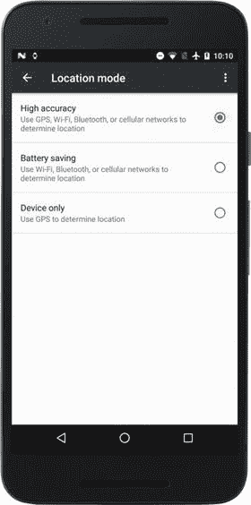
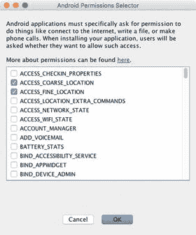
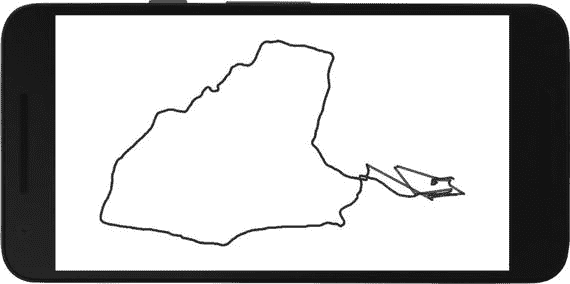
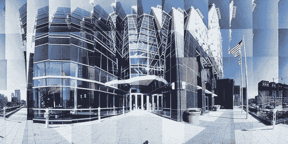
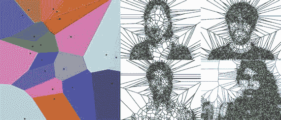
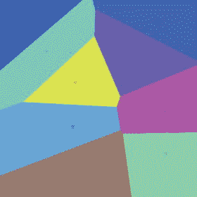
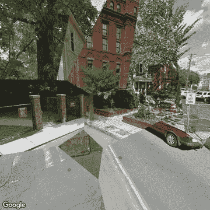
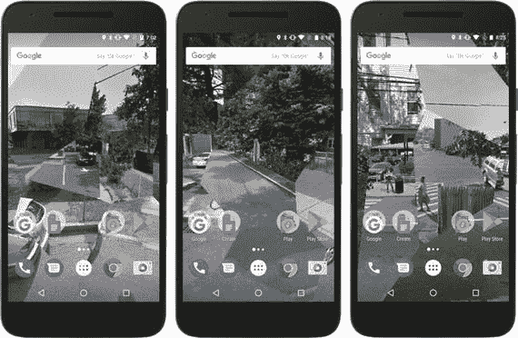

# 九、地理定位

我们的 Android 设备中的地理位置传感器让我们能够高精度地知道我们在哪里，我们可以在位置感知应用中使用这些信息。在这一章中，我们将看到如何在处理中创建这种类型的应用，我们将开发一个结合位置和谷歌街景图像的最终项目。

## Android 中的位置数据

我们每天都在智能手机中使用位置感知应用来寻找我们周围的名胜，提前计划旅行方向，或玩基于位置的游戏，如 Turf 和 Pokémon GO。所有这些用途都是通过相同的基础地理定位技术实现的，主要是全球定位系统(GPS)，但也包括蜂窝塔三角测量、蓝牙邻近检测和 Wi-Fi 接入点。GPS 是大多数人立即与地理定位联系在一起的技术:它基于由美国拥有并由美国空军运营的卫星网络，这些卫星将地理定位信息发送到地球表面的 GPS 接收器，包括移动电话中的接收器。

Note

其他国家也开发了类似的系统，如 GLONASS(俄国)、北斗(中国)、NAVIC(印度)和伽利略(欧洲)。默认情况下，Android 系统只使用 GPS 卫星，但一些制造商引入了一些变化，以便从这些其他系统中获取地理位置数据，这可以提供更好的覆盖范围和准确性。Play Store 中提供的 GPS 测试应用可以显示手机正在使用的系统。

使用 GPS 或类似的导航卫星系统来获取位置数据的一个缺点是，它需要大量电池来为 GPS 天线供电。还有，手机需要对天空有一个通畅的视线。为了解决这些问题，我们可以利用其他定位源，如 Cell-ID、蓝牙和 Wi-Fi，它们精度较低，但能耗较低。作为参考，GPS 定位的精度在 16 英尺(4.9 米)左右，而 Wi-Fi 的精度在 130 英尺(40 米)以内。Cell-ID 的可变性更高，具体取决于小区大小，范围从几英尺到几英里。

然而，我们不需要担心何时以及如何选择特定的位置系统，因为 Android 会在手机设置中给定一个通用配置的最佳位置供应器之间自动切换，如图 [9-1](#Fig1) 所示。在 Android 7 及更高版本中，我们所要做的就是设置我们是想要结合所有可能来源的高精度定位，还是不需要 GPS 的电池节省，还是只需要 GPS。



图 9-1。

Android settings to choose the location mode

## 在处理中使用位置 API

Android 提供了全面的 API 来访问系统中可用的位置服务( [`https://developer.android.com/guide/topics/location/index.html`](https://developer.android.com/guide/topics/location/index.html) )。我们还可以使用 Ketai 库来获取位置值，而不必担心这个 API，就像我们对运动传感器所做的那样。然而，在本章中，我们将直接从我们的处理草图中使用位置 API，因为在使用位置服务时有许多重要的方面需要考虑，特别是权限处理和并发性，即使我们稍后使用 Ketai，熟悉它们也是一个好主意。

Note

Google Play 服务位置 API([`https://developer.android.com/training/location/index.html`](https://developer.android.com/training/location/index.html))是我们将在本章学习的标准 Android 位置 API 的更新和功能更丰富的替代品。然而，当从 PDE 编码时，处理仅支持后者。我们可以将我们的草图导出为 Android 项目，然后从 Android Studio 导入以使用 Google Play 服务(详见附录 A)。

### 位置权限

在我们的 Android 应用中使用特定功能，例如访问互联网，需要使用 Android 权限选择器向我们的草图添加适当的权限。然而，我们在第 [6](06.html) 章中看到，这对于危险权限来说是不够的，危险权限需要在运行 Android 6 或更新版本的设备上运行时进行额外的显式请求。访问位置数据的权限属于这一类，它们是`ACCESS_COARSE_LOCATION`和`ACCESS_FINE_LOCATION`。第一个允许访问从手机信号塔和 Wi-Fi 获得的大致位置，而第二个允许从 GPS 获得位置。为了在我们的草图中使用这些权限，我们需要在权限选择器中检查它们(图 [9-2](#Fig2) )，然后在我们的草图代码中使用`requestPermission()`函数。



图 9-2。

Selecting coarse and fine location permissions

清单 [9-1](#Par10) 展示了启用位置的草图的基本设置，其中我们定义了一个位置管理器和相关的监听器，其方式与我们之前对其他传感器所做的类似，包括设置草图所需的权限。

```java
import android.content.Context;
import android.location.Location;
import android.location.LocationListener;
import android.location.LocationManager;
import android.os.Bundle;

LocationManager manager;
SimpleListener listener;
String provider;

double currentLatitude;
double currentLongitude;
double currentAltitude;

void setup () {
  fullScreen();
  textFont(createFont("SansSerif", displayDensity * 24));
  textAlign(CENTER, CENTER);
  requestPermission("android.permission.ACCESS_FINE_LOCATION", "initLocation");
}

void draw() {
  background(0);
  if (hasPermission("android.permission.ACCESS_FINE_LOCATION")) {
    text("Latitude: " + currentLatitude + "\n" +
         "Longitude: " + currentLongitude + "\n" +
         "Altitude: " + currentAltitude, width, height);
  } else {
    text("No permissions to access location", 0, 0, width, height);
  }
}

void initLocation(boolean granted) {
  if (granted) {
    Context context = getContext();
    listener = new SimpleListener();
    manager = (LocationManager)
              context.getSystemService(Context.LOCATION_SERVICE);
    provider = LocationManager.NETWORK_PROVIDER;
    if (manager.isProviderEnabled(LocationManager.GPS_PROVIDER)) {
      provider = LocationManager.GPS_PROVIDER;
    }
    manager.requestLocationUpdates(provider, 1000, 1, listener);
  }
}

public void resume() {
  if (manager != null) {
    manager.requestLocationUpdates(provider, 1000, 1, listener);
  }
}

public void pause() {
  if (manager != null) {
    manager.removeUpdates(listener);
  }
}

class SimpleListener implements LocationListener {
  public void onLocationChanged(Location loc) {
    currentLatitude = loc.getLatitude();
    currentLongitude = loc.getLongitude();
    currentAltitude = loc.getAltitude();
  }
  public void onProviderDisabled(String provider) { }
  public void onProviderEnabled(String provider) { }
  public void onStatusChanged(String provider, int status, Bundle extras) { }
}

Listing 9-1.Getting Location Data

```

`onLocationChanged()`中接收到的位置对象包含几条信息，其中最重要的是经纬度值，表示手机在地球表面的位置，沿着与赤道平行的线和连接地理极点的子午线。

Note

Android 以双精度数字的形式提供纬度和经度，有效数字反映了位置读数的精度:米精度需要五个有效数字，而亚米细节需要六个或更多。

还有一些重要的事情需要注意。首先，我们请求了精确定位权限，这将为我们提供可用的最高分辨率以及对不太精确的源的访问，因此不需要为粗略定位请求单独的权限。其次，我们通过指明我们的首选供应器(网络或 GPS)用`requestLocationUpdates()`配置了位置管理器。Android 将通过考虑所请求的权限、设备的位置模式以及每个时刻位置数据的可用来源的组合来确定实际的供应器。在代码中，我们将网络供应器设置为默认供应器，它使用来自手机信号发射塔和 Wi-Fi 接入点的数据来确定位置，如果启用了相应的供应器，则切换到更精确的 GPS。我们还设置了位置更新之间的最小时间间隔(单位为毫秒)(这里 1000 表示更新不能超过每秒一次)和触发位置更新的最小距离(单位为米)。

最后，我们像对其他传感器一样实现了恢复和暂停事件，因此应用暂停时不会生成位置更新，应用在恢复后会再次请求它们。当应用在后台运行时，这对于节省电池非常重要。

### 事件线程和并发

在我们前面看到的所有传感器示例中，我们在相应的侦听器中读取传感器数据没有太大困难。只要我们只是将最后收到的数据存储在 float 变量中，就应该没问题。然而，一旦我们将传感器信息保存在数据结构(如数组或数组列表)中以跟踪以前的值，问题就开始了。问题源于这样一个事实:处理中的`draw()`函数是从动画线程中调用的(看看第 [6](06.html) 章中的“使用线程”一节)，而事件处理方法，像位置情况下的`onLocationChanged()`，是从另一个线程，即应用的主线程中调用的。由于这些线程是并行运行的，当它们试图同时访问相同的数据时，可能会发生冲突；也就是同时。这可能会导致我们的应用出现意外行为，甚至崩溃。

正如我们在第 6 章中讨论的，解决并发问题需要一些额外的工作。一种解决方案是将每次调用`onLocationChanged()`获得的位置数据存储在一个“队列”中，然后在绘制过程中从队列中检索事件。队列是“同步的”,因此当在一个线程中添加新数据或删除现有数据时，任何其他线程都必须等待，直到操作结束。这种特殊的技术不能解决所有的并发问题，但是对于我们的情况来说已经足够了。清单 9-2 展示了我们如何实现纬度/经度位置的队列。

```java
import android.content.Context;
import android.location.Location;
import android.location.LocationListener;
import android.location.LocationManager;
import android.os.Bundle;

LocationManager manager;
SimpleListener listener;
String provider;
LocationQueue queue = new LocationQueue();
ArrayList<LocationValue> path = new ArrayList<LocationValue>();

void setup () {
  fullScreen();
  textFont(createFont("SansSerif", displayDensity * 24));
  textAlign(CENTER, CENTER);
  requestPermission("android.permission.ACCESS_FINE_LOCATION", "initLocation");
}

void draw() {
  background(0);
  while (queue.available()) {
    LocationValue loc = queue.remove();
    path.add(0, loc);
  }
  String info = "";
  for (LocationValue loc: path) {
    info += loc.latitude + ", " + loc.longitude + "\n";
  }
  text(info, 0, 0, width, height);
}

void initLocation(boolean granted) {
  if (granted) {
    Context context = getContext();
    listener = new SimpleListener();
    manager = (LocationManager)
              context.getSystemService(Context.LOCATION_SERVICE);
    provider = LocationManager.NETWORK_PROVIDER;
    if (manager.isProviderEnabled(LocationManager.GPS_PROVIDER)) {
      provider = LocationManager.GPS_PROVIDER;
    }
    manager.requestLocationUpdates(provider, 1000, 1, listener);
  }
}

class SimpleListener implements LocationListener {
  public void onLocationChanged(Location loc) {
    queue.add(new LocationValue(loc.getLatitude(), loc.getLongitude()));
  }
  public void onProviderDisabled(String provider) { }
  public void onProviderEnabled(String provider) { }
  public void onStatusChanged(String provider, int status, Bundle extras) { }
}

public void resume() {
  if (manager != null) {
    manager.requestLocationUpdates(provider, 1000, 1, listener);
  }
}

public void pause() {
  if (manager != null) {
    manager.removeUpdates(listener);
  }
}

class LocationValue {
  double latitude;
  double longitude;
  LocationValue(double lat, double lon) {
    latitude = lat;
    longitude = lon;
  }
}

class LocationQueue {
  LocationValue[] values = new LocationValue[10];
  int offset, count;

  synchronized void add(LocationValue val) {
    if (count == values.length) {
      values = (LocationValue[]) expand(values);
    }
    values[count++] = val;
  }

  synchronized LocationValue remove() {
    if (offset == count) {
      return null;
    }
    LocationValue outgoing = values[offset++];
    if (offset == count) {
      offset = 0;
      count = 0;
    }
    return outgoing;
  }

  synchronized boolean available() {
    return 0 < count;
  }
}

Listing 9-2.Storing Locations in a Queue

```

权限和监听器设置代码与清单 [9-1](#Par10) 中的相同，但是现在我们有了两个新的类，`LocationValue`和`LocationQueue. LocationValue`非常简单，它只是以双精度存储了一对纬度/经度值。让我们更仔细地看看`LocationQueue`。它有三个方法:`add()`、`remove()`和`available()`，所有这些方法都是同步的，因此不能从不同的线程中同时调用。当在`onLocationChanged()`中接收到一个新的位置时，我们创建一个新的`LocationValue`并将其添加到队列中。随着新的位置不断从事件线程进入，它们被存储在队列内部的`values`数组中，如果需要的话，这个数组的大小可以增加一倍。在动画线程中，我们从队列中移除位置，并将它们添加到`path`数组列表中，这样我们就可以在每一帧中打印到目前为止收到的所有纬度/经度值，从最后到第一的顺序相反。请注意，我们从队列中删除位置并不使用剩余多少，因为如果在我们仍在绘制新的帧时新的位置到达，这个数字可能会改变，而只是通过检查队列是否有可用的元素。

Note

在应用开始接收位置值之前，我们可能会经历一段延迟。这种延迟是由设备搜索来自 GPS 卫星、本地信号发射塔或 Wi-Fi 接入点的信号造成的。

现在，我们可以将路径绘制为连接连续位置的线条。清单 [9-3](#Par21) 展示了新的`draw()`函数，草图的其余部分是相同的。因为我们将纬度和经度值映射到屏幕上的位置，所以我们必须确定最小值和最大值来定义映射。此外，我们将双精度值转换成单精度浮点数，可以在`min()`、`max()`和`map()`函数中用作参数。图 [9-3](#Fig3) 显示了一个人走动时该草图的典型输出。



图 9-3。

Path-tracking sketch running

```java
float minLat = 90;
float maxLat = -90;
float minLon = 180;
float maxLon = -180;
...
void draw() {
  background(255);
  while (queue.available()) {
    LocationValue loc = queue.remove();
    minLat = min(minLat, (float)loc.latitude);
    maxLat = max(maxLat, (float)loc.latitude);
    minLon = min(minLon, (float)loc.longitude);
    maxLon = max(maxLon, (float)loc.longitude);
    path.add(0, loc);
  }
  stroke(70, 200);
  strokeWeight(displayDensity * 4);
  beginShape(LINE_STRIP);
  for (LocationValue loc: path) {
    float x = map((float)loc.longitude, minLon, maxLon,
                                        0.1 * width, 0.9 * width);
    float y = map((float)loc.latitude, minLat, maxLat,
                                       0.1 * height, 0.9 * height);
    vertex(x, y);
  }
  endShape();
}
Listing 9-3.Drawing the Locations Along a Line Strip

```

### 与科泰的位置

使用 Ketai 的优点是，我们在上一节中讨论的所有细节(权限、并发性)都被自动处理，因此我们可以专注于使用位置值。使用 Ketai 重写的前一个例子要短得多，正如我们在清单 [9-4](#Par23) 中看到的。

```java
import ketai.sensors.*;

KetaiLocation location;
ArrayList<LocationValue> path = new ArrayList<LocationValue>();

float minLat = 90;
float maxLat = -90;
float minLon = 180;
float maxLon = -180;

void setup () {
  fullScreen();
  location = new KetaiLocation(this);
}

void draw() {
  background(255);
  stroke(70, 200);
  strokeWeight(displayDensity * 4);
  beginShape(LINE_STRIP);
  for (LocationValue loc: path) {
    float x = map((float)loc.longitude, minLon, maxLon,
                                        0.1 * width, 0.9 * width);
    float y = map((float)loc.latitude, minLat, maxLat,
                                       0.1 * height, 0.9 * height);
    vertex(x, y);
  }
  endShape();
}

void onLocationEvent(double lat, double lon) {
  path.add(new LocationValue(lat, lon));
  minLat = Math.min(minLat, (float)lat);
  maxLat = Math.max(maxLat, (float)lat);
  minLon = Math.min(minLon, (float)lon);
  maxLon = Math.max(maxLon, (float)lon);
}

class LocationValue {
  double latitude;
  double longitude;
  LocationValue(double lat, double lon) {
    latitude = lat;
    longitude = lon;
  }
}

Listing 9-4.Getting Location Data with Ketai

```

`onLocationEvent()`由 Ketai 在与`draw()`函数相同的线程中触发，因此不存在遇到并发问题的风险。

### 使用附加位置数据

当我们的位置监听器在`onLocationChanged()`处理程序方法中接收到一个新位置时，我们不仅可以获得该位置的纬度和经度，还可以获得其他相关信息，比如海拔、精确度和方位( [`https://developer.android.com/reference/android/location/Location.html`](https://developer.android.com/reference/android/location/Location.html) )。精度值很重要，因为它反映了当前供应器的位置精度。特别是，如果连续位置值之间的差异小于当前精度，则存储连续位置值没有意义。我们可以修改我们之前的位置队列示例(清单 [9-3](#Par21) )来合并这个检查。清单 [9-5](#Par26) 中显示了这些变化。

```java
void draw() {
  background(255);
  while (queue.available()) {
    LocationValue loc = queue.remove();
    minLat = min(minLat, (float)loc.latitude);
    maxLat = max(maxLat, (float)loc.latitude);
    minLon = min(minLon, (float)loc.longitude);
    maxLon = max(maxLon, (float)loc.longitude);
    if (0 < path.size()) {
      LocationValue last = path.get(path.size() - 1);
      if (last.distanceTo(loc) < loc.accuracy + last.accuracy) continue;
    }
    path.add(0, loc);
  }
  stroke(70, 200);
  strokeWeight(displayDensity * 4);
  beginShape(LINE_STRIP);
  for (LocationValue loc: path) {
    float x = map((float)loc.longitude, minLon, maxLon,
                                        0.1 * width, 0.9 * width);
    float y = map((float)loc.latitude, minLat, maxLat,
                                       0.1 * height, 0.9 * height);
    vertex(x, y);
  }
  endShape();
}
...
class SimpleListener implements LocationListener {
  public void onLocationChanged(Location loc) {
    queue.add(new LocationValue(loc.getLatitude(), loc.getLongitude(),
                                loc.getAccuracy()));
  }
  ...
}
...
class LocationValue {
  double latitude;
  double longitude;
  double accuracy;

  LocationValue(double lat, double lon, double acc) {
    latitude = lat;
    longitude = lon;
    accuracy = acc;
  }

  double distanceTo(LocationValue dest) {
    double a1 = radians((float)latitude);
    double a2 = radians((float)longitude);
    double b1 = radians((float)dest.latitude);
    double b2 = radians((float)dest.longitude);

    double t1 = Math.cos(a1) * Math.cos(a2) * Math.cos(b1) * Math.cos(b2);
    double t2 = Math.cos(a1) * Math.sin(a2) * Math.cos(b1) * Math.sin(b2);
    double t3 = Math.sin(a1) * Math.sin(b1);
    double tt = Math.acos(t1 + t2 + t3);

    return 6366000 * tt;
  }
}

Listing 9-5.Using Location Accuracy

```

我们从`onLocationChanged()`事件中的`Location`参数获得位置精度，并将其存储在`LocationValue`对象中，与它的纬度和经度放在一起。然后，我们使用最新位置和先前位置的精确度来确定最新位置是否足够不同以添加到路径中。这包括计算两个位置之间的距离，也就是地球表面连接它们的弧的长度。有几个公式可以近似这个距离([`https://en.wikipedia.org/wiki/Great-circle_distance#Computational_formulas`](https://en.wikipedia.org/wiki/Great-circle_distance#Computational_formulas))；在代码中，我们使用了所谓的余弦定律，该定律假设地球是一个完美的球形(并不完全准确，因为我们的星球沿其南北轴略微变平，但对于这个简单的应用来说已经足够了)。

## 街景学院

在这一点上，我们有几种技术可以用来创建一个更复杂的地理定位项目。正如开头提到的，我们每天都在使用位置感知应用，一天可能会有几十次甚至上百次。谷歌街景等工具如此受欢迎，以至于我们第一次看到一个新地方时，往往不是亲自去，而是在谷歌地图上查看。我们在城市中的体验受到这些应用的影响，因此值得尝试使用街景图像结合我们白天参观的地点来创建某种非功能性的视觉拼贴。事实上，这种想法并不新鲜，许多艺术家以前就一直在使用它，将日常的城市景观转化为既熟悉又陌生又令人迷失方向的构图。图 [9-4](#Fig4) 再现了艺术家 Masumi Hayashi ( [`http://masumimuseum.com/`](http://masumimuseum.com/) )的全景照片拼贴画，他使用定制的系统捕捉了 360 条风景，后来合并成拼贴画。最近，安娜丽莎·卡西尼( [`http://www.annalisacasini.com/project-withtools-google-maps/`](http://www.annalisacasini.com/project-withtools-google-maps/) )一直在用街景图像创作超现实的城市景观拼贴画。



图 9-4。

Top: OSERF Building Broad Street View, Columbus, Ohio, by Masumi Hayashi (2001). Reproduced with permission from the Estate of Masumi Hayashi.

由于智能手机的永远在线特性和实时位置更新的可能性，我们可以在走动时使用从互联网上下载的街景图像来构建一个动态拼贴。从视觉输出的角度来看，要解决的最重要的问题是如何将城市意象组合成引人入胜的作品。当然也有很多(无限！)我们可以这样做的方法，像 Hayashi 和 Casini 这样的艺术家的作品给了我们一些参考来启发我们自己。

我们将首先通过我们的处理草图解决检索街景图像的问题，因为这一步是实现我们概念的任何进一步工作的先决条件。一旦我们能够解决这个技术问题，我们将考虑自动创建拼贴的方法。

### 使用谷歌街景图像 API

谷歌街景是谷歌地图和谷歌地球的一个受欢迎的功能，它提供了世界上许多地方的全景，主要是城市和城镇的街道，但现在也包括建筑内部，珊瑚礁，甚至太空等网站！街景可以从使用不同 API 的 Android 应用中访问，其中一个 API 允许您在专门的视图组件中创建交互式全景。然而，这个 API 不适合在我们的处理草图中使用，因为全景视图不能与处理的绘图表面集成。

幸运的是，谷歌还提供了一个图像 API，通过这个 API，人们可以使用 HTTP 请求( [`https://developers.google.com/maps/documentation/streetview/intro`](https://developers.google.com/maps/documentation/streetview/intro) )下载与经纬度坐标相对应的街景静态图像。要使用这个 API，我们首先要在 Google Maps APIs 下启用 Google Street View Image API，并在开发者控制台( [`https://console.developers.google.com/apis/dashboard`](https://console.developers.google.com/apis/dashboard) )中创建一个 Google API 项目。然后，我们必须获得一个 API 键( [`https://developers.google.com/maps/documentation/android-api/signup`](https://developers.google.com/maps/documentation/android-api/signup) )来添加到项目中。这些步骤非常重要，否则我们的应用将无法请求街景图像。我们可以通过在 web 浏览器中创建一个请求来测试一切是否如预期的那样工作。Google 街景图像 API 请求具有以下格式:

[T2`http://maps.googleapis.com/maps/api/streetview?size=WIDTHxHEIGHT&location=LAT,LONG&sensor=SENSOR_STATUS&heading=HEADING&fov=FOV&pitch=PITCH&key=GOOGLE_API_CONSOLE_KEY`](http://maps.googleapis.com/maps/api/streetview%3Fsize=WIDTHxHEIGHT%26location=LAT,LONG%26sensor=SENSOR_STATUS%26heading=HEADING%26fov=FOV%26pitch=PITCH%26key=GOOGLE_API_CONSOLE_KEY)

请求中的大多数参数都是可选的，除了位置、大小，当然还有 API 键。上一段链接的谷歌街景图片 API 页面详细描述了所有这些 URL 参数。该请求应该返回一个图像，然后我们可以保存在我们的计算机上。

我们可以在处理草图中使用完全相同的请求语法来请求一个`PImage`。这是通过清单 [9-6](#Par36) 中的简单代码实现的，在这里你必须提供你自己的 API 密匙，还需要给草图添加互联网权限。

```java
PImage street;
String apiKey = "<your API key>";

void setup() {
  size(512, 512);
  street = requestImage("http://maps.googleapis.com/maps/api/streetview?" +
                        "location=42.383401,-71.116110&size=512x512&" +
                        "fov=90&pitch=-10&key=" + apiKey);
}

void draw() {
  if (0 < street.width && 0 < street.height) {
    image(street, 0, 0, width, height);
  }
}

Listing 9-6.Requesting a Street View Image

```

`requestImage()`函数返回一个`PImage`对象，该对象将在一个单独的线程中下载，以避免在传输图像数据时挂起我们的草图。当图像的宽度和高度大于零时，我们就知道图像准备好了。如果由于某种原因请求失败，宽度和高度都将被设置为-1。这也是为什么 draw()中有 if(0<street . width&&0<street . height)条件的原因。

通过将从 Google Street View Image API 请求图像的能力与我们之前从清单 [9-5](#Par26) 中获得的路径跟踪草图相结合，我们将能够显示从定位服务接收到的最新位置的街道图像。让我们看看如何在清单 [9-7](#Par39) 中做到这一点。

```java
...
ArrayList<LocationValue> path = new ArrayList<LocationValue>();
ArrayList<PImage> street = new ArrayList<PImage>();
String apiKey = "<your API key>";
...
void draw() {
  background(255);
  while (queue.available()) {
    LocationValue loc = queue.remove();
    minLat = min(minLat, (float)loc.latitude);
    maxLat = max(maxLat, (float)loc.latitude);
    minLon = min(minLon, (float)loc.longitude);
    maxLon = max(maxLon, (float)loc.longitude);
    if (0 < path.size()) {
      LocationValue last = path.get(path.size() - 1);
      if (last.distanceTo(loc) < loc.accuracy + last.accuracy) continue;
    }
    path.add(0, loc);
    String url = "http://maps.googleapis.com/maps/api/streetview?location=" +
                 loc.latitude + "," + loc.longitude +
                 "&size=512x512&fov=90&pitch=-10&sensor=false&key=" + apiKey;
    street.add(requestImage(url));
  }
  if (0 < street.size()) {
    PImage img = street.get(street.size() - 1);
    if (0 < img.width && 0 < img.height) {
      image(img, 0, 0, width, height);
    }
  }
}
...
Listing 9-7.Showing Street View of Our Last Location

```

我们将每个新位置请求的图像添加到`street`数组列表中，然后在下载完成后选择列表中的最后一个，就像我们在清单 [9-6](#Par36) 中所做的那样。

Note

如果您使用版本控制服务(如 GitHub)来存储代码项目，请注意不要将 API 密钥上传到任何人都可以访问的公共存储库中。如果您将敏感数据提交到一个公共 Git 存储库中，本文将解释如何完全删除它: [`https://help.github.com/articles/removing-sensitive-data-from-a-repository/`](https://help.github.com/articles/removing-sensitive-data-from-a-repository/) 。

### Voronoi 镶嵌

我们现在面临的挑战是通过代码创建一个视觉上有趣的拼贴画。思考这个问题的一种方法是考虑如何将屏幕分成不重叠的区域，每个区域对应一个位置及其相关图像。这种分割在技术上被称为镶嵌。使用矩形的镶嵌很容易实现，但是可能看起来太简单了。然而，有一个众所周知的分割称为 Voronoi 镶嵌。为了创建 Voronoi 镶嵌，我们从一组任意的 2D 点开始。接下来，如果我们在 2D 平面中的位置(x，y ),我们找到集合中最接近(x，y)的点 p。我们说(x，y)属于由 p 确定的区域。然后我们用相同的颜色画出与 p 相关的所有这样的位置(x，y)。按照这个简单的算法，我们将把飞机分割成看起来或多或少像图 [9-5](#Fig5) 左面的区域。



图 9-5。

Left: Voronoi tessellation with 20 regions. Right: Voronoi portraits by Mark Kleback and Sheiva Rezvani

Voronoi 镶嵌在生物学、地理学、数学、气象学和机器人学等需要进行空间数据分析的领域都有应用。Voronoi 镶嵌能够将空间划分为多个区域，从而更容易操作数据。艺术家们还将其作为基本技术来创作一些作品，其中一些底层数据集(如图 [9-5](#Fig5) 右侧面板中的肖像)经过处理，以生成数据的“自然”分区，同时还具有视觉吸引力。

给定一个点集，有许多算法可以生成 Voronoi 镶嵌图，有些算法非常有效，但实现起来也很复杂。最简单的算法，但也是效率最低的算法，是将我们对 Voronoi 镶嵌的文字描述翻译成代码的算法。这是非常低效的，因为我们需要将屏幕中的每个像素(x，y)与集合中的所有点进行比较，因此它的执行时间随着屏幕中像素数量的平方而增长，而像素数量的平方又是宽度和高度的乘积。这意味着随着屏幕分辨率的增加，算法的速度会非常快。

但是，如果屏幕分辨率不太高，这个简单的算法仍然足够快，可以交互运行。在清单 [9-8](#Par46) 中，每当我们按下鼠标(或触摸屏幕)时，我们都会向 Voronoi 集中添加一个新点。我们将“Voronoi 点”的最大数量设置为 10，分辨率设置为 512 × 512。这个草图可以在 Java 或 Android 模式下运行，无需任何修改。使该算法在处理中容易实现的关键元素是`pixels`数组，我们在第 [6](06.html) 章中讨论过。该数组包含屏幕中每个像素的颜色，以连续值的形式排列，因此，如果屏幕的分辨率为 W × H，则`pixels`数组中的前 W 个元素对应于屏幕中的第一行，接下来的 W 个元素对应于第二行，依此类推。我们也可以使用`pixels`数组来设置屏幕中任何像素的颜色。我们在清单 [9-8](#Par46) 中这样做。

```java
int lastPoint = 0;
int maxPoints = 10;
VoronoiPoint[] points = new VoronoiPoint[maxPoints];
boolean updated = false;

void setup () {
  size(512, 512);
}

void draw() {
  if (updated) {
    updateColors();
    drawPoints();
    updated = false;
  }
}

void mousePressed() {
  points[lastPoint] = new VoronoiPoint(mouseX, mouseY, color(random(255), random(255), random(255)));
  lastPoint = (lastPoint + 1) % maxPoints;
  updated = true;
}

void updateColors() {
  int idx = 0;
  loadPixels();
  for (int y = 0; y < height; y++) {
    for (int x = 0; x < width; x++) {
      int closest = findClosestPoint(x, y);
      if (-1 < closest) pixels[idx] = points[closest].getColor();
      idx++;
    }
  }
  updatePixels();
}

void drawPoints() {
  strokeWeight(10);
  stroke(0, 50);
  for (int i = 0; i < points.length; i++) {
    VoronoiPoint p = points[i];
    if (p == null) break;
    point(p.x, p.y);
  }
}

int findClosestPoint(float x, float y) {
  int minIdx = -1;
  float minDist = 1000;
  for (int i = 0; i < points.length; i++) {
    VoronoiPoint p = points[i];
    if (p == null) break;
    float d = dist(x, y, p.x, p.y);
    if (d < minDist) {
      minIdx = i;
      minDist = d;
    }
  }
  return minIdx;
}

class VoronoiPoint {
  float x, y;
  color c;
  VoronoiPoint(float x, float y, color c){
    this.x = x;
    this.y = y;
    this.c = c;
  }
  color getColor() {
    return c;
  }
}

Listing 9-8.Generating a Voronoi Tessellation

```

我们通过定位 Voronoi 列表中最接近的点，在`updateColors()`函数中设置每个屏幕像素的颜色。为此，我们需要首先调用`loadPixels()`来确保像素数组被初始化，然后更新 pixels()，以便像素被绘制到屏幕上。`findClosestPoint()`功能找到离屏幕位置最近的点(x，y)；它的工作方式是设置一个大的初始距离(1000)，然后遍历所有点，将到(x，y)的距离小于前一个的点的索引保存在变量`minIdx`中。

如果我们在电脑或 Android 设备上运行这个草图，我们将创建新的 Voronoi 区域，直到最多十个，每个区域被分配一个随机的颜色。一旦我们超过 10 个，草图就在点阵列上循环，新的鼠标/触摸位置将取代原来的位置。图 [9-6](#Fig6) 显示了典型的输出。



图 9-6。

A typical Voronoi tessellation

在这个交互式镶嵌中，我们为每个点指定了一种纯色。但是，我们可以使用图像来代替，这样相应区域中的像素就可以用图像像素的颜色来绘制。这样，每个区域将显示不同图像的一部分。如果所有图像的大小都与屏幕分辨率相同，那么修改前面的清单以使用图像就很容易了。这就是我们在清单 [9-9](#Par50) 中所做的。这里，我们使用街景以 512 × 512 的分辨率生成的一组十张图像，`streetview0.jpg`到`streetview9.jpg`，并存储在草图的`data`文件夹中。

```java
...
void mousePressed() {
  points[lastPoint] = new VoronoiPoint(mouseX, mouseY, lastPoint);
  lastPoint = (lastPoint + 1) % maxPoints;
  updated = true;
}

void updateColors() {
  int idx = 0;
  loadPixels();
  for (int y = 0; y < height; y++) {
    for (int x = 0; x < width; x++) {
      int closest = findClosestPoint(x, y);
      if (-1 < closest) pixels[idx] = points[closest].getColor(idx);
      idx++;
    }
  }
  updatePixels();
}
...
class VoronoiPoint {
  float x, y;
  PImage img;
  VoronoiPoint(float x, float y, int i) {
    this.x = x;
    this.y = y;
    img = loadImage("streetview" + i + ".jpg");
    img.loadPixels();
  }
  color getColor(int idx) {
    return img.pixels[idx];
  }
}

Listing 9-9.Painting a Voronoi Tessellation with Images

```

这个清单只显示了需要修改的几部分代码。现在，我们使用点索引来加载存储在每个`VoronoiPoint`类中的图像对象。`PImage`类也有一个`pixels`数组，我们可以从中检索图像每个像素的颜色。使用来自谷歌街景的十张图片，我们的新例子应该生成一个类似于图 [9-7](#Fig7) 所示的拼贴画。



图 9-7。

Painting the regions in a Voronoi tessellation using Street View images

### 使用屏幕外绘图图面

我们的 Voronoi 镶嵌代码的一个限制是，它只能在低分辨率下使用，这使得它不适合全屏应用。我们可以应用屏幕外绘图来解决这个问题。想法是将镶嵌画到一个较小的绘图表面上，然后在屏幕上以全分辨率呈现该表面的内容。处理允许我们用`createGraphics(width, height)`函数创建一个屏幕外绘图表面，该函数返回一个`PGraphics`对象( [`https://processing.org/reference/PGraphics.html`](https://processing.org/reference/PGraphics.html) )封装一个具有所请求分辨率的表面。我们可以用目前为止学过的所有 API 绘制成一个`PGraphics`对象。要记住的一件重要的事情是在`beginDraw()`和`endDraw()`之间封闭所有的`PGraphics`绘图调用。清单 [9-10](#Par53) 显示了使用屏幕外渲染将图像镶嵌草图制作成全屏应用所需的更改。

```java
...
PGraphics canvas;

void setup () {
  fullScreen();
  canvas = createGraphics(512, 512);
}

void draw() {
  ...
  image(canvas, 0, 0, width, height);
}

void mousePressed() {
  float x = map(mouseX, 0, width, 0, canvas.width);
  float y = map(mouseY, 0, height, 0, canvas.height);
  points[lastPoint] = new VoronoiPoint(x, y, lastPoint);
  lastPoint = (lastPoint + 1) % maxPoints;
  updated = true;
}

void updateColors() {
  int idx = 0;
  canvas.beginDraw();
  canvas.loadPixels();
  for (int y = 0; y < canvas.height; y++) {
    for (int x = 0; x < canvas.width; x++) {
      int closest = findClosestPoint(x, y);
      if (-1 < closest) canvas.pixels[idx] = points[closest].getColor(idx);
      idx++;
    }
  }
  canvas.updatePixels();
  canvas.endDraw();
}

void drawPoints() {
  canvas.beginDraw();
  canvas.strokeWeight(10);
  canvas.stroke(0, 50);
  for (int i = 0; i < points.length; i++) {
    VoronoiPoint p = points[i];
    if (p == null) break;
    canvas.point(p.x, p.y);
  }
  canvas.endDraw();
}

Listing 9-10.Drawing into an Offscreen Pgraphics Object

```

此外，请记住，虽然主屏幕表面中的(x，y)坐标范围是从(0，0)到(宽度，高度)，但`PGraphics`分辨率是`(PGraphics.width, PGraphics.height)`，这意味着我们可能需要将坐标从一个表面映射到另一个表面。例如，`(mouseX, mouseY)`坐标总是指向屏幕，所以我们应该将它们映射到`PGraphics`对象的宽度和高度，这样交互就能在屏幕外正常工作。

### 把所有东西放在一起

到目前为止，我们已经成功地用一组预定义的街景图像生成了拼贴画。因此，是时候将这些代码与我们早期的草图结合起来了，这些草图从可用的定位服务中检索设备的位置。我们将使用纬度和经度值来组合 HTTPS 请求，以获得新的街景图像，就像我们在清单 [9-7](#Par39) 中所做的那样，并将它分配给一个随机的 Voronoi 点。

然而，我们应该考虑几个重要的技术方面。首先，我们希望以全屏分辨率绘制拼贴画，为此我们可以使用一个分辨率较低的屏幕外`PGraphics`对象，例如 512 × 512，然后放大它以覆盖整个屏幕，就像我们在清单 [9-10](#Par53) 中所做的那样，尽管保留了图像的原始平方比。

第二个方面涉及位置更新的频率。非常频繁地请求更新，尤其是在高精度模式(即 GPS)下，会更快地耗尽电池，但我们实际上不需要非常频繁的更新，因为应用应该等待足够长的时间，以确保周围环境有明显的差异。位置更新的粒度是在对`requestLocationUpdates()`的调用中设置的，这里我们使用 1 秒和 1 米作为更新的最小时间和距离。这些值对于我们的拼贴目的来说太小了，我们可以将它们增加很多—例如，分别增加到 30 秒和 20 米。考虑到这些因素，让我们看看清单 [9-11](#Par58) 中的完整代码。

```java
import android.content.Context;
import android.location.Location;
import android.location.LocationListener;
import android.location.LocationManager;
import android.os.Bundle;

LocationManager manager;
SimpleListener listener;
String provider;
LocationQueue queue = new LocationQueue();
ArrayList<LocationValue> path = new ArrayList<LocationValue>();
int lastPoint = 0;
int maxPoints = 10;
VoronoiPoint[] points = new VoronoiPoint[maxPoints];
PGraphics canvas;
String apiKey = "<your API key>";

void setup () {
  fullScreen();
  orientation(PORTRAIT);
  canvas = createGraphics(512, 512);
  imageMode(CENTER);
  requestPermission("android.permission.ACCESS_FINE_LOCATION", "initLocation");
}

void draw() {
  background(0);
  updatePositions();
  float h = max(width, height);
  image(canvas, width/2, height/2, h, h);
}

void updatePositions() {
  while (queue.available()) {
    LocationValue loc = queue.remove();
    if (0 < path.size()) {
      LocationValue last = path.get(path.size() - 1);
      if (last.distanceTo(loc) < 20) continue;
    }
    String url = "http://maps.googleapis.com/maps/api/streetview?location=" +
                 loc.latitude + "," + loc.longitude +
                 "&size=512x512&fov=90&pitch=-10&sensor=false&key=" + apiKey;
    loc.setStreetView(requestImage(url));
    path.add(loc);
  }

  boolean newImage = false;
  for (int i = path.size() - 1; i >= 0; i--) {
    LocationValue loc = path.get(i);
    PImage img = loc.getStreetView();
    if (img.width == -1 || img.height == -1) {
      path.remove(i);
    } else if (img.width == 512 && img.height == 512) {
      float x = random(0, canvas.width);
      float y = random(0, canvas.height);
      points[lastPoint] = new VoronoiPoint(x, y, img);
      lastPoint = (lastPoint + 1) % maxPoints;
      newImage = true;
      path.remove(i);
    }
  }
  if (newImage) updateColors();
}

void updateColors() {
  int idx = 0;
  canvas.beginDraw();
  canvas.loadPixels();
  for (int y = 0; y < canvas.height; y++) {
    for (int x = 0; x < canvas.width; x++) {
      int closest = findClosestPoint(x, y);
      if (-1 < closest) canvas.pixels[idx] = points[closest].getColor(idx);
      idx++;
    }
  }
  canvas.updatePixels();
  canvas.endDraw();
}

void initLocation(boolean granted) {
  if (granted) {
    Context context = getContext();
    listener = new SimpleListener();
    manager = (LocationManager)
              context.getSystemService(Context.LOCATION_SERVICE);
    provider = LocationManager.NETWORK_PROVIDER;
    if (manager.isProviderEnabled(LocationManager.GPS_PROVIDER)) {
      provider = LocationManager.GPS_PROVIDER;
    }
    manager.requestLocationUpdates(provider, 30000, 20, listener);
  }
}

class SimpleListener implements LocationListener {
  public void onLocationChanged(Location loc) {
    queue.add(new LocationValue(loc.getLatitude(), loc.getLongitude()));
  }
  public void onProviderDisabled(String provider) { }
  public void onProviderEnabled(String provider) { }
  public void onStatusChanged(String provider, int status, Bundle extras) { }
}

public void resume() {
  if (manager != null) {
    manager.requestLocationUpdates(provider, 30000, 20, listener);
  }
}

public void pause() {
  if (manager != null) {
    manager.removeUpdates(listener);
  }
}

class LocationValue {
  double latitude;
  double longitude;
  PImage streetView;

  LocationValue(double lat, double lon) {
    latitude = lat;
    longitude = lon;
  }

  void setStreetView(PImage img) {
    streetView = img;
  }

  PImage getStreetView() {
    return streetView;
  }

  double distanceTo(LocationValue dest) {
    double a1 = radians((float)latitude);
    double a2 = radians((float)longitude);
    double b1 = radians((float)dest.latitude);
    double b2 = radians((float)dest.longitude);

    double t1 = Math.cos(a1) * Math.cos(a2) * Math.cos(b1) * Math.cos(b2);
    double t2 = Math.cos(a1) * Math.sin(a2) * Math.cos(b1) * Math.sin(b2);
    double t3 = Math.sin(a1) * Math.sin(b1);
    double tt = Math.acos(t1 + t2 + t3);

    return 6366000 * tt;
  }
}

class LocationQueue {
  LocationValue[] values = new LocationValue[10];
  int offset, count;

  synchronized void add(LocationValue val) {
    if (count == values.length) {
      values = (LocationValue[]) expand(values);
    }
    values[count++] = val;
  }

  synchronized LocationValue remove() {
    if (offset == count) {
      return null;
    }
    LocationValue outgoing = values[offset++];
    if (offset == count) {
      offset = 0;
      count = 0;
    }
    return outgoing;
  }

  synchronized boolean available() {
    return 0 < count;
  }
}

class VoronoiPoint {
  float x, y;
  PImage img;

  VoronoiPoint(float x, float y, PImage img){
    this.x = x;
    this.y = y;
    this.img = img;
    img.loadPixels();
  }

  color getColor(int idx) {
    return img.pixels[idx];
  }
}

int findClosestPoint(float x, float y) {
  int minIdx = -1;
  float minDist = 1000;
  for (int i = 0; i < points.length; i++) {
    VoronoiPoint p = points[i];
    if (p == null) break;
    float d = dist(x, y, p.x, p.y);
    if (d < minDist) {
      minIdx = i;
      minDist = d;
    }
  }
  return minIdx;
}

Listing 9-11.
Street View Collage

```

让我们来讨论这个草图中的新代码，特别是`updatePositions()`函数。第一部分与我们之前所做的非常相似:从队列中删除新位置，如果它们太靠近前一个位置(这里的阈值是 20 米)，则跳过它们，否则将它们添加到路径中。我们还生成相应的街景请求，并将`PImage`对象存储在新的`LocationValue`对象中。然后，它向后遍历到目前为止接收到的所有位置，并删除那些没有接收到街景图像(通过检查所请求图像的宽度或高度是否为-1)或完成了图像下载的位置。后面的位置被删除，因为它们的图像被分配给新的 Voronoi 点，所以不再需要它们。通过这种方式，我们确保应用的内存使用量不会持续增加，直到它耗尽内存并被迫退出；我们最多只存储十幅同步图像(分辨率为 512 × 512)，因为这是我们的 Voronoi 点阵列的长度。

一个较小的细节，但仍然是重要的，以确保拼贴看起来很好，是确保它覆盖整个屏幕，同时保持其原始的纵横比。如果我们看看`draw()`函数中的代码，我们会看到如何做:我们用线`float h = max(width, height)`取最大的屏幕尺寸，然后用`image()`函数以这个尺寸`h`画出屏幕外的`PGraphics`画布，把它放在屏幕的中心。由于我们在`setup()`中将图像模式设置为`CENTER`，画布将正确地显示在屏幕中央。

我们可以将该草图作为常规应用或动态壁纸运行(在第二种情况下，我们可能希望使用`wallpaperPreview()`功能，以便仅在选择壁纸后请求位置许可)。输出的一些例子如图 [9-8](#Fig8) 所示。如果我们计划通过 Play Store 发布它，我们还必须创建一整套图标，在它的清单文件中写下完整的包和应用的名称以及版本，并导出一个发布包，就像我们在第 [3](03.html) 和 [6](06.html) 章中为最终项目所做的那样。



图 9-8。

Different Street View collages generated with the final sketch, running as a live wallpaper

## 摘要

在这一章中，我们详细探讨了 Android location API 提供的可能性，以及我们如何在 Android 处理中使用它来结合其他技术(如 Google Street View)创建非常规的地理定位应用。正如我们刚刚看到的，处理给了我们很大的自由度来访问不同的数据源(GPS、图像等)。)，而且还提供了一个坚实的框架来成功整合这些资源，以便我们可以将我们的想法从概念草图转化为最终的应用。